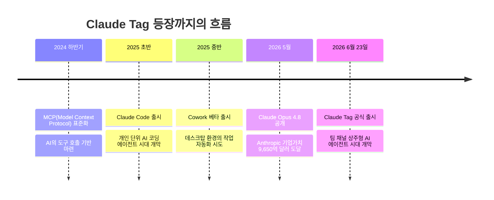
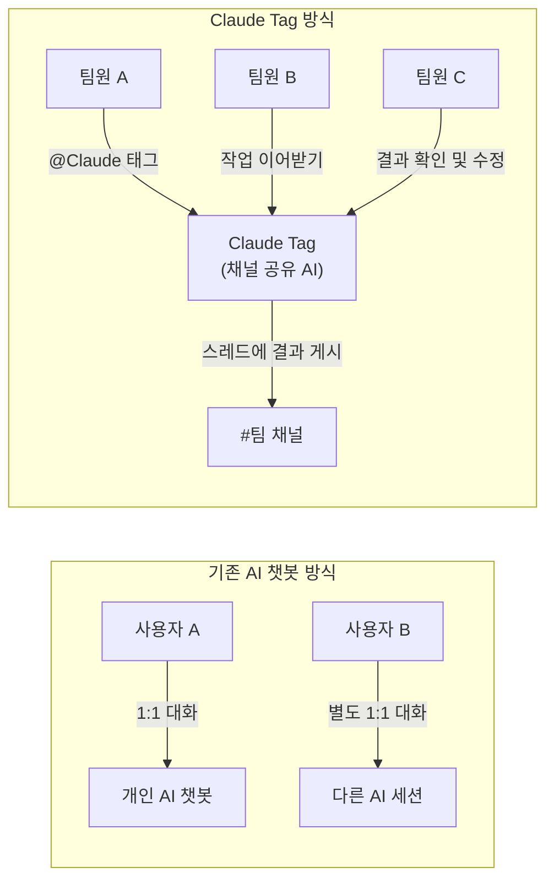
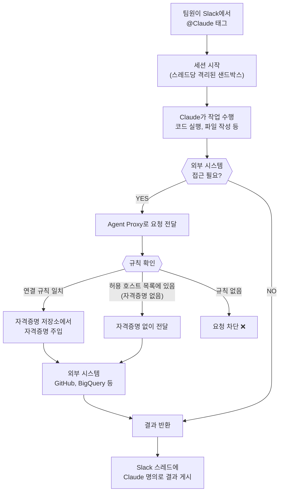
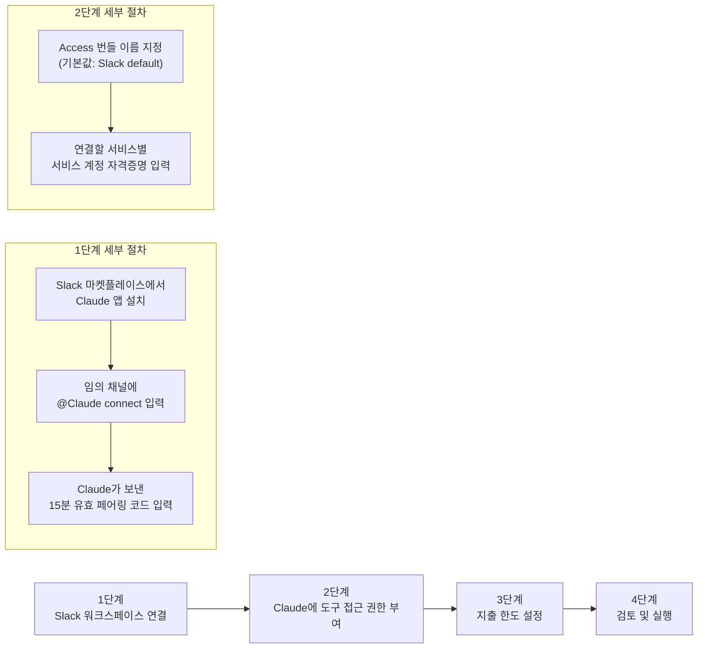
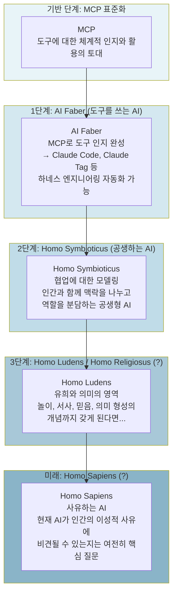
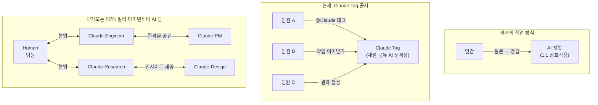
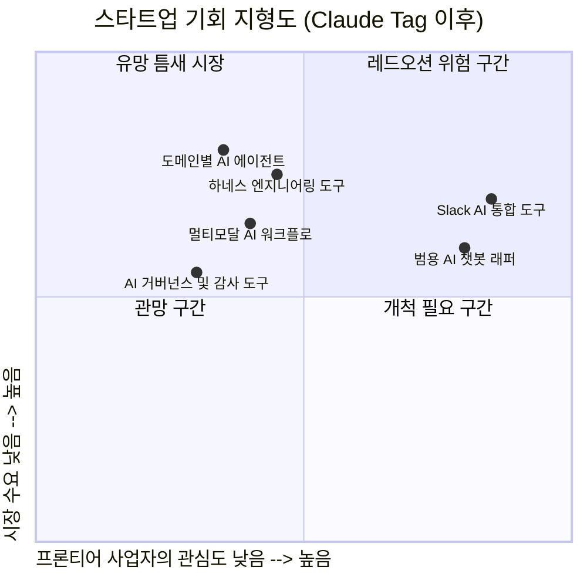
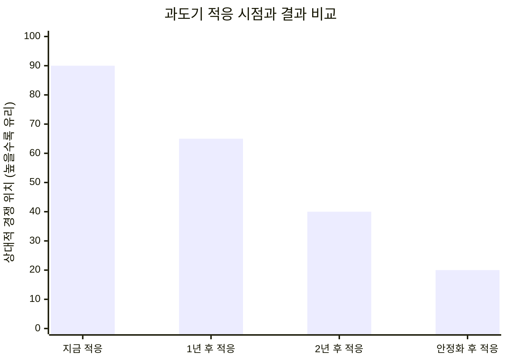
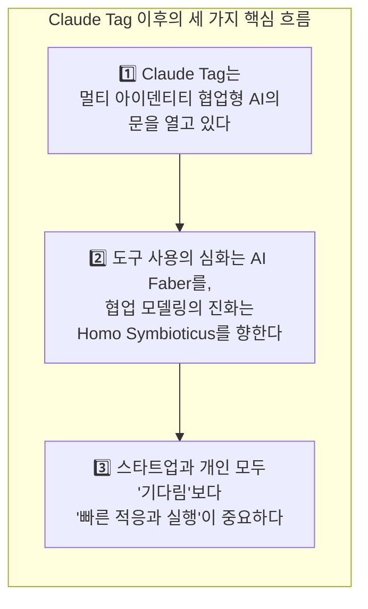

### Anthropic의 Claude Tag 출시와 AI 진화 로드맵 종합 분석

> **출처**: Anthropic 공식 발표(2026년 6월 23일), Claude Tag 공식 문서, Gonnector 인포그래픽(© 2026 Gonnector), 관련 칼럼 및 한국 AI 커뮤니티 담론 종합
>
> **작성일**: 2026년 6월 25일

> https://www.facebook.com/share/p/19FwWLYCb6/
> 
> Anthropic 이 이번에 Claude Tag 를 발표했으니 여러 명의 서로 다른 전문성을 지닌 Claude Identity 를 설정해서 채널(슬랙이든 뭐든)에 상주시키고 멤버처럼 일시키는 기능이 정말 조만간 추가될 것으로 보입니다. 
> 
> 이미 Anthropic 내부용 Claude Tag 로 코드 작업의 65% 가 이루어지고 있다고 했으니, 아마 내부에서는 그 다음 단계의 수준으로 쓰고 있을 것이고, 그러면 서로 다른 아이덴터티가 알아서 인간들과 알아서 협업하는 단계일 가능성이 매우 높다고 봅니다. 
> 
> 음... MCP를 통해 도구에 대한 체계적 인지와 활용의 토대가 AI에게 만들어졌지만, Karpathy 가 앞으로 tool 에 대해 사전 학습에서부터 파고들면, '호모 파베르(도구의 인간)'처럼 AI Faber 가 제대로 정립이 될 것이고, 이 수준으로 가면 요즘 핫한 하네스 엔지니어링은 AI 가 스스로 알아서 할 것으로 예상하고 있습니다.
> 
> 여기에 더해 협업에 대한 모델링이 제대로 되면 (현재 제가 열심히 실험하고 셋팅하면서 저희 팀에 적용하고 있는) Homo Symbioticus 즉 공생하는 인간과 유사한 개념을 갖게 될 것이고...
> 
> 이러다가 유희(호모 루덴스), 종교(호모 렐리기오수스)의 개념까지 갖추게 되면 점점 더 구분하기 쉽지 않아지겠는데요? 쩝... 현재의 AI 가 인간을 지칭하는 가장 유명한 표현인 호모 사피엔스(사유)에 정말 빗댈 수 있느냐가 여전히 관건이긴 합니다만...
> 
> 여하튼, 스타트업 하기 좋은 시장인지 나쁜 시장인지 잘 판단해야 할 시대인데, 현재까지 흐름으로 봤을 때는 프론티어 모델 제공 사업자들이 왠만한 코어는 직접 다 하려는 모양새라서. 어디까지는 걔네들이 만들고 어디서부터는 직접 안할 것 같으니 우리가 한다는 전략 수립과 빠른 행동을 통한 노하우 축적이 중요하다고 생각하고.
> 
> 개인의 경우도, 어차피 하루가 다르게 발전하면서 새로운 것이 나오는데 좀 기다렸다가 어느 정도 정리되면 배워도 되지 않겠어라는 생각을 하시는 분들도 적지 않을 것 같은데, 그러다가 일하실 기회를 놓치게 됩니다. 지금은 과도기라서 변화 발전하는 흐름에 몸을 적응시켜서 그 다음의 살짝 안정화된 시기에서의 안착을 노려야 할 때인데, 안정화되고 나서 준비하면되지라고 했다가 그 시점에서 이미 자리를 잡은 환경과 플레이어에게 밀려서 도태될 가능성이 커 보입니다. 
> 
> 아직까지는 예상한 흐름대로 가는데, 2012년만 해도 예상한 흐름이 4년 뒤에 실제로 발생하는 주기였는데, 지금은 뭐 몇 개월도 안되서 예상한 것들이 나오다보니 무시무시하네요. 
> 
> 그런데 당장은 tool call 을 할 때 antml 을 제대로 접두어로 붙이지 못해서 종종 터미널로 평문 출력하는 불안정한 상태가 되버린 심각한 문제부터 고쳐야 할 것 같습니다. 제 경우 이틀 전부터 튀어나온 문제인데 너무 심각하네요. claude 공식 레포에 이슈들도 꽤 쌓이고 있는 것으로 보이는데, 이것 때문에 일이 제대로 안돌아가는... 
> 

---

## 목차

1. [Claude Tag란 무엇인가 — 개념과 등장 배경](#1-claude-tag란-무엇인가--개념과-등장-배경)
2. [Claude Tag의 네 가지 핵심 행동 특성](#2-claude-tag의-네-가지-핵심-행동-특성)
3. [기술 아키텍처 — 어떻게 작동하는가](#3-기술-아키텍처--어떻게-작동하는가)
4. [설정 방법과 관리자 가이드](#4-설정-방법과-관리자-가이드)
5. [보안과 접근 제어 설계](#5-보안과-접근-제어-설계)
6. [인간을 정의하는 '호모 시리즈'와 AI의 대응](#6-인간을-정의하는-호모-시리즈와-ai의-대응)
7. [AI 진화 로드맵 — AI Faber에서 Homo Sapiens까지](#7-ai-진화-로드맵--ai-faber에서-homo-sapiens까지)
8. [다음 단계 — 멀티 아이덴티티 AI 팀원의 시대](#8-다음-단계--멀티-아이덴티티-ai-팀원의-시대)
9. [스타트업에 주는 시사점](#9-스타트업에-주는-시사점)
10. [개인에게 주는 메시지 — 기다릴 것인가, 지금 적응할 것인가](#10-개인에게-주는-메시지--기다릴-것인가-지금-적응할-것인가)
11. [현재의 기술적 과제와 현실적 한계](#11-현재의-기술적-과제와-현실적-한계)
12. [핵심 요약](#12-핵심-요약)

---

## 1. Claude Tag란 무엇인가 — 개념과 등장 배경

2026년 6월 23일, Anthropic은 **Claude Tag**라는 새로운 제품을 공식 출시했다. 한 마디로 정의하면, 이것은 팀이 Slack 안에서 Claude와 함께 일하는 새로운 방식이다. 기존의 AI 챗봇 경험과 결정적으로 다른 점은, Claude가 더 이상 개인의 비공개 채팅 상대가 아니라 팀 전체가 공유하는 **채널 상주형 AI 팀원**으로 작동한다는 것이다.

Anthropic은 Claude Tag를 출시하면서 이미 자사 내부에서 이 도구의 내부 버전을 사용하고 있으며, **제품팀의 코드 작업 중 65%가 Claude Tag를 통해 이루어지고 있다**고 밝혔다. 이 수치는 단순한 홍보 문구가 아니다. 코딩뿐만 아니라 제품 메트릭 추적, 고객 지원 티켓 처리, 까다로운 버그의 근본 원인 분석까지 광범위한 업무에 Claude Tag를 실제로 사용한 결과다.

Claude Tag는 Slack에서 시작하는 이유가 있다. Slack은 팀 간 협업이 자연스럽게 이루어지는 플랫폼이며, Anthropic의 일상 업무 대부분이 이미 Slack에서 일어나고 있다. Anthropic은 향후 다른 플랫폼으로 Claude Tag의 적용 범위를 확장할 계획임을 밝혔다.

현재 Claude Tag는 **Claude Enterprise 및 Team 고객**을 대상으로 베타 서비스를 제공 중이며, **Claude Opus 4.8** 모델을 기반으로 작동한다.

---

## 2. Claude Tag의 네 가지 핵심 행동 특성

Anthropic은 Claude Tag가 기존 Claude 통합과 어떻게 다른지를 설명하면서 네 가지 핵심 특성을 강조했다. 이 네 가지는 단순한 기능 목록이 아니라, AI와 팀의 협업 방식이 근본적으로 바뀌는 방향을 보여주는 특성들이다.

### 2-1. 멀티플레이어 방식 (@Claude는 팀 전체의 것)

기존 AI 채팅은 철저히 1대1 구도였다. 내가 무엇을 물었는지, 어떤 결과를 받았는지는 나만 알 수 있었다. Claude Tag는 이 구도를 완전히 바꾼다. 특정 Slack 채널 안에 초대된 Claude는 그 채널 전체가 공유하는 단일 AI 정체성으로 존재한다. 한 팀원이 @Claude에게 작업을 시작해놓고 자리를 비우면, 다른 팀원이 그 대화를 이어받아 작업을 계속할 수 있다. 다시 처음부터 설명할 필요가 없다. 이것이 Slack GM Rob Seaman이 "AI를 멀티플레이어로 만드는 것"이라고 표현한 이유다.

### 2-2. 시간이 지날수록 학습하는 맥락 축적

Claude Tag는 자신이 상주하는 채널의 대화 흐름을 따라가면서 해당 팀의 업무 맥락을 점진적으로 쌓아간다. 처음에는 팀의 프로젝트 배경을 설명해야 하지만, 시간이 지날수록 재설명 없이 맥락을 이해하고 일할 수 있게 된다. 관리자가 허용하면 다른 채널과 데이터 소스에서도 관련 정보를 자동으로 학습한다. 단, 비공개 채널의 내용은 보고하지 않는다는 원칙이 명확히 정해져 있다.

### 2-3. 스스로 주도하는 앰비언트 행동

관리자가 **앰비언트(ambient) 기능**을 활성화하면, Claude는 누군가가 @Claude를 태그하지 않아도 스스로 팀에 필요한 정보를 제공하기 시작한다. 연결된 채널과 도구에서 관련 정보를 발견하면 먼저 알려주고, 오랫동안 해결되지 않은 채 조용히 잠든 스레드나 작업이 있으면 먼저 후속 조치를 취한다. 이것은 Claude가 수동적인 도구에서 능동적인 팀원으로 전환되는 지점이다.

### 2-4. 비동기 작업 처리

Claude Tag에게 작업을 맡기면, 나는 다른 일에 집중하면 된다. Claude는 백그라운드에서 독립적으로 작업을 처리한다. 더 나아가 미래 시점의 작업을 스스로 스케줄링할 수도 있어, 프로젝트를 수 시간 또는 수 일에 걸쳐 자율적으로 추진할 수 있다. Anthropic은 이 기능 덕분에 내부에서 여러 Claude에게 병렬로 작업을 위임하는 시간이 크게 늘었다고 밝혔다.

---

## 3. 기술 아키텍처 — 어떻게 작동하는가

Claude Tag의 내부 작동 방식을 이해하면 왜 이 제품이 기업에서 신뢰할 수 있는 방식으로 설계되었는지를 알 수 있다. 핵심은 **세 개의 구분된 영역**이 유기적으로 연결되는 구조다.

### 3-1. 세 가지 영역의 분리

첫 번째 영역은 팀의 Slack 워크스페이스다. 여기서 팀원이 @Claude를 태그하거나 예약된 작업이 시작된다. 두 번째 영역은 Anthropic의 인프라에서 실행되는 격리된 샌드박스 환경이다. Claude의 실제 작업은 이 안에서 일어나며, 이 샌드박스는 사용자의 네트워크 내부에 아무것도 설치하지 않는다. 세 번째 영역은 GitHub, 데이터 웨어하우스, 모니터링 도구 등 실제 연결된 외부 시스템들이다.

### 3-2. Agent Proxy — 자격증명이 절대 샌드박스에 들어가지 않는 이유

가장 중요한 보안 설계는 **Agent Proxy**라는 네트워크 경계 장치다. 샌드박스 안의 Claude가 외부 시스템에 접근해야 할 때(예: GitHub API 호출, 데이터 웨어하우스 쿼리), 그 요청은 반드시 Agent Proxy를 거쳐야 한다. Agent Proxy는 관리자가 설정한 규칙을 기준으로 요청이 허용된 목적지인지 확인하고, 해당하는 자격증명(API 키 등)을 자격증명 저장소에서 꺼내 요청에 주입한 뒤 전달한다.

핵심은 이것이다: **자격증명은 샌드박스 안에 있는 Claude 모델과 실행 환경에 절대 주어지지 않는다**. 모델이 직접 API 키를 보거나 기억할 수 없다. 자격증명은 오직 Agent Proxy가 요청을 전달하는 그 순간에만 주입된다. 일단 저장된 자격증명은 다시 화면에 표시되지 않는다.

Agent Proxy는 세 가지 결과 중 하나로 요청을 처리한다. 요청 목적지가 연결 규칙과 일치하면 해당 자격증명을 붙여 전달하고, 허용된 호스트 목록에는 있지만 특정 자격증명이 없으면 자격증명 없이 전달하며, 어디에도 해당하지 않으면 차단한다. 기본 원칙은 **허용 목록에 없는 것은 모두 차단**이다.





### 3-3. 채널 세션과 DM 세션의 차이

Claude Tag가 채널에서 작업할 때와 개인 DM으로 소통할 때의 작동 방식은 근본적으로 다르다.

채널에서는 관리자가 미리 설정한 서비스 계정(Service Account)이 Claude의 정체성으로 작동한다. Slack에서 글을 올리면 Claude 앱 이름으로 올라오고, GitHub에서 풀 리퀘스트를 생성하면 Claude GitHub App 이름으로 생성된다. 어디서 어떤 작업이 이루어졌는지 감사 로그에 명확하게 기록된다.

반면 개인 DM에서는 해당 사용자의 claude.ai 계정이 기반이 된다. DM에는 채널 스코프가 없기 때문에 조직이 설정한 서비스 계정 정체성이 적용되지 않는다. DM에서 Claude가 풀 리퀘스트를 만들면, 그것은 사용자 본인의 GitHub 연결을 통해 생성되고 작성자도 사용자 본인으로 기록된다. 비용도 조직 계정이 아닌 개인 시트에서 청구된다.

| 비교 항목 | 채널에서 | DM에서 |
|-----------|----------|--------|
| 작동 정체성 | 조직이 설정한 서비스 계정 | 사용자 본인의 claude.ai 계정 |
| 접근 범위 | 채널에 연결된 Access 번들 | 사용자의 개인 커넥터 |
| 결과물 귀속 | Claude 에이전트 계정 | 사용자 이름 |
| 비용 청구 | 조직 | 개인 시트 |

---

## 4. 설정 방법과 관리자 가이드

Claude Tag를 처음 도입하는 과정은 네 단계로 구성된다. 각 단계는 순서대로 진행되어야 하며, 설정이 끝난 후에도 관리자 페이지에서 언제든지 변경할 수 있다.

### 사전 준비 사항

시작 전에 다음 네 가지를 확인해야 한다. Claude 조직에서 **Owner 역할**이 있어야 한다(Admin은 조회만 가능하고 설정 완료는 할 수 없다). **Slack 워크스페이스 관리자**가 필요한데, 앱 연결 요청이 본인이 아니라면 미리 요청해두는 것이 좋다. **Team 플랜** 고객은 사용 크레딧이 있어야 채널 작업이 실행된다. 테스트용 채널을 하나 미리 준비해두면 설정 완료 후 즉시 검증할 수 있다.

네트워크 접근 제어가 있는 조직이라면 IP 허용 목록 변경 작업이 수일이 걸릴 수 있으므로, 네트워크 팀과 사전에 네트워크 요구 사항을 공유해야 한다.

### 4단계 설정 흐름

**1단계 — Slack 워크스페이스 연결**: `claude.ai/admin-settings/claude-tag`에서 설정을 시작한다. Slack 마켓플레이스에서 Claude 앱을 설치하고, 임의의 채널에서 `@Claude connect`를 입력하면 Claude가 페어링 코드를 보내준다. 이 코드는 15분간 유효하므로, Slack 관리자가 본인이 아니라면 미리 조율이 필요하다. 코드를 Claude Tag 설정 페이지에 붙여넣으면 연결이 완료된다.

**2단계 — 도구 접근 권한 부여**: Access 번들에 각 서비스의 자격증명을 연결한다. 서비스는 개인 계정이 아닌 Claude 전용 서비스 계정을 생성해서 입력해야 한다. Google Drive, Notion, GitHub, BigQuery, Sentry, Datadog, Linear, Salesforce 등 다양한 서비스가 지원된다. GitHub는 이 화면이 아닌 별도의 Claude GitHub App 설정 페이지에서 진행한다.

**3단계 — 지출 한도 설정**: 채널 작업은 조직의 사용 잔액에서 차감된다. 월별 최대 한도를 $100, $250, $500, $1,000, 무제한, 또는 사용자 정의 금액(최대 $1,000,000) 중에서 선택할 수 있다. DM 사용량은 개인 시트에서 별도로 청구된다.

**4단계 — 검토 및 실행**: 모든 설정을 확인하고 **Claude Tag 켜기** 옵션을 활성화한 채로 **Claude 실행** 버튼을 클릭하면 설정이 완료된다.

설정 후 검증 방법은 간단하다. 테스트 채널에서 `/invite @Claude`를 입력하고, 이어서 `@Claude summarize this channel`을 입력한다. Claude가 생각 중 상태 표시를 보여주면 앱 설치와 수신이 정상이고, 실제 답변이 나오면 워크스페이스 연결이 완료된 것이다.

---

## 5. 보안과 접근 제어 설계

Claude Tag는 기업 환경에서 민감한 데이터를 다루는 점을 감안해 세밀한 접근 제어 구조를 갖추고 있다.

### Access 번들 — 권한의 단위

**Access 번들**은 Claude가 특정 채널에서 사용할 수 있는 자격증명, 저장소 접근 권한, 플러그인, 지침을 묶은 명명된 단위다. 번들을 채널별로 다르게 구성하면 동일한 조직 안에서도 팀마다 다른 수준의 접근을 허용할 수 있다.

예를 들어 `data-readonly` 번들, `github-write` 번들, `monitoring` 번들을 각각 만들면, `#platform-eng` 채널에는 세 가지 모두를 붙이고, `#gtm-analytics` 채널에는 `data-readonly`만, `#incidents` 채널에는 `monitoring`과 `github-write`만 붙이는 식으로 세밀하게 제어할 수 있다.

### 메모리와 정체성의 격리

각 Claude 인스턴스의 메모리와 접근 권한은 해당 채널로 엄격하게 제한된다. 영업팀 채널에 설정된 Claude는 엔지니어링팀 채널의 Claude에게 정보를 전달하지 않으며, 영업 데이터와 도구가 엔지니어링 채널에 노출되지 않는다. 이 격리는 조직 내 정보 보안의 기본 요건을 충족시킨다.

### 관리자 감사 기능

관리자는 @Claude가 수행한 모든 작업의 로그와 각 작업을 요청한 사람이 누구인지를 확인할 수 있다. 조직 전체와 개별 채널에 대한 토큰 지출 한도도 설정 가능하다.

---

## 6. 인간을 정의하는 '호모 시리즈'와 AI의 대응

Claude Tag의 등장은 단순한 제품 발표를 넘어 AI가 인간의 어떤 특성을 닮아가고 있는가라는 철학적 질문을 다시 꺼내게 만든다. 인류학과 철학에서는 오래전부터 '호모 시리즈'라는 개념으로 인간을 다양한 각도에서 정의해왔다.

### 호모 시리즈 개념 정리

**호모 사피엔스(Homo sapiens, 사유하는 인간)**: 인간의 학명으로, 이성적 사고와 지혜를 통해 만물의 영장이 된 특성을 강조한다. 현재의 AI가 인간을 대표하는 이 개념에 얼마나 가까워질 수 있는가가 AI 발전의 핵심 관건이다.

**호모 파베르(Homo faber, 도구 제작하는 인간)**: 철학자 앙리 베르그송이 명명한 개념으로, 인간의 본질적 특성을 정교한 도구를 만들어 활용하는 능력에서 찾았다. 한나 아렌트는 『인간의 조건』에서 이 개념을 더욱 발전시켜, 인간이 제작을 통해 환경을 통제하는 존재라고 정의했다.

**호모 루덴스(Homo ludens, 유희하는 인간)**: 네덜란드 학자 하위징아가 주장한 개념이다. 인간이 단순한 생존을 넘어 놀이와 문화를 창조하는 원동력인 '놀이 본능'을 가진다는 관점이다.

**호모 에코노미쿠스(Homo economicus, 경제적 인간)**: 자본주의 사회의 인간형으로, 이윤을 극대화하고 합리적인 소비와 교환을 추구하는 합리적 이기심을 특징으로 한다.

**호모 심비오티쿠스(Homo symbioticus, 공생하는 인간)**: 이기적인 생존을 넘어 자연, 환경, 그리고 타인과 조화로운 관계를 맺으며 살아가는 현대적인 생태주의적 인간관이다.

**호모 렐리기오수스(Homo religiosus, 종교적 인간)**: 절대자나 신성한 존재를 믿고 의지하며, 삶의 의미와 죽음 이후의 세계를 탐구하는 정신적·초월적 차원의 인간을 의미한다.

이 개념들은 서로 배타적이지 않다. 인간은 사유하면서 동시에 도구를 만들고, 놀이하고, 경제활동을 하며, 공생을 추구하고, 영적 질문을 한다. 그런데 Claude Tag의 등장으로 AI가 이 각각의 특성을 어디까지, 어떤 순서로 획득해가는지를 추적할 수 있게 되었다.

---

## 7. AI 진화 로드맵 — AI Faber에서 Homo Sapiens까지

한국 AI 커뮤니티에서 활발하게 논의되고 있는 관점에 따르면, Claude Tag의 출시는 AI가 인간의 여러 특성을 단계적으로 습득해가는 과정의 한 이정표다. 이 진화 로드맵을 구체적으로 살펴보자.

### 1단계 — AI Faber: 도구를 능동적으로 다루는 AI

AI Faber는 AI가 도구를 단순히 실행하는 수준을 넘어, 어떤 도구를 언제 어떻게 사용할지 스스로 판단하는 단계를 의미한다. MCP를 통해 도구에 대한 체계적 인지와 활용의 토대가 마련되었고, Claude Code와 Claude Tag는 이 단계의 실현체다.

미주중앙일보 칼럼에서 지적한 것처럼, AI가 도구 사용 능력을 갖추기 시작한 것은 최근의 일이다. 이제 AI는 스스로 컴퓨터 프로그램을 작성해 실행하고, 파일을 읽어 수정하며, 사람처럼 화면을 보고 실제 업무를 처리하는 수준에 이르렀다. 이 수준이 되면 하네스 엔지니어링도 AI가 스스로 할 것으로 전망된다.

Andrej Karpathy는 Anthropic에 합류하면서(2026년 5월 19일) 사전 학습 팀에서 Claude를 활용한 연구를 가속하는 팀을 새로 꾸렸다. 그가 autoresearch 프로젝트에서 보여준 것처럼, AI가 스스로 연구 루프를 실행하며 실제 leaderboard 개선을 이뤄낸 사례는 AI Faber 단계가 이미 현실임을 보여준다.

### 2단계 — Homo Symbioticus: 인간과 공생하는 AI

Claude Tag가 여는 것이 바로 이 단계다. 단순히 도구를 쓰는 것을 넘어, 인간과 함께 맥락을 나누고 역할을 분담하며 상호 보완적으로 일하는 공생형 AI가 등장한다. 한 팀원이 시작한 작업을 다른 팀원이 이어받고, Claude가 그 모든 과정에서 맥락을 잃지 않고 협력하는 모습은 공생 관계의 구체적 형태다.

이 단계는 현재 실험·설정·팀 적용이 진행 중인 단계이며, 많은 실무 AI 활용가들이 지금 이 구간을 직접 설계하고 시도하고 있다.

### 3단계 — Homo Ludens / Homo Religiosus: 유희와 의미의 영역

만약 AI가 놀이, 서사, 믿음, 의미 형성의 개념까지 갖추게 된다면, 인간과의 구분이 훨씬 어려워질 것이다. 현재는 아직 명확한 실현 사례가 없는 미래 단계로, 가능성의 영역에 있다.

### 핵심 질문 — Homo Sapiens에 진정으로 비견될 수 있는가

현재 AI가 인간을 대표하는 개념인 '호모 사피엔스'에 진정으로 빗댈 수 있는가는 여전히 열린 질문이다. 2026년 몬트리올 대학교 연구는 AI가 인간의 평균적 창의성을 넘어섰지만, 상위 10%의 창의적 인간은 모든 AI 모델을 일관되게 능가하며 복잡한 창작 과제에서 그 격차가 더 벌어졌다는 결과를 보고했다. 윤리적 판단, 도덕적 추론, 새로운 상황에서의 상식은 여전히 AI의 도달 범위 밖에 있다는 시각도 있다.

---

## 8. 다음 단계 — 멀티 아이덴티티 AI 팀원의 시대

Claude Tag의 공식 출시가 보여주는 것은 현재 상태만이 아니다. 이것이 향후 어디로 진화할 것인가가 더 중요한 논의다.

### 현재의 Claude Tag vs. 다가오는 멀티 아이덴티티 구조

지금의 Claude Tag는 채널 안에 하나의 공유된 Claude 정체성이 상주하는 구조다. 그런데 Anthropic이 이미 내부에서 65%의 코드 작업을 Claude Tag로 처리한다고 했을 때, 내부에서는 그 다음 단계의 수준으로 활용하고 있을 가능성이 있다. 그것은 바로 **서로 다른 전문성을 지닌 여러 Claude Identity가 채널에 상주하며 인간들과 자율적으로 협업하는 구조**다.

예를 들어 `#project-orion` 채널에는 다음과 같은 AI 팀원들이 각자의 역할로 상주할 수 있다:

- **Claude Engineer**: 코드 구현, 테스트, 리팩토링 전담
- **Claude Researcher**: 시장 조사, 인사이트 도출, 경쟁사 분석 담당
- **Claude PM**: 요건 정의, 우선순위 결정, 진행 관리
- **Claude Designer**: UI/UX 설계, 프로토타입 제작 지원

이 구조에서 인간 팀원은 각 Claude에게 적절한 작업을 위임하고, Claude들은 서로의 결과물을 참조하며 진행한다. 인간이 주도하는 협업에서, 인간과 AI가 대등하게 역할을 나누는 협업으로 전환되는 것이다.

---

## 9. 스타트업에 주는 시사점

Claude Tag 출시와 AI 진화 흐름은 스타트업에게도 명확한 전략적 메시지를 던진다.

### 현실 인식 — 프론티어 모델 사업자들은 코어를 직접 한다

현재 흐름을 보면, 프론티어 모델 제공 사업자들(Anthropic, OpenAI 등)은 웬만한 코어 기능을 직접 흡수하는 방향으로 움직이고 있다. Claude Code가 나오더니 곧 Cowork가 나오고, 이어서 Claude Tag가 나왔다. 기업용 Slack 통합, 에이전트 오케스트레이션, 메모리 관리 — 이 모두가 이제 Anthropic이 직접 제공하는 기능이 되었다.

Fortune의 분석에 따르면 Ramp의 2026년 5월 AI 인덱스에서 Anthropic이 처음으로 OpenAI를 제치고 기업 채택률에서 앞서나갔다(Anthropic 34.4% vs OpenAI 32.3%). Claude Code가 이 전환의 주된 동력이었다. 이런 상황에서 단순히 기존 AI 모델 위에 단순한 래퍼를 만드는 스타트업이 살아남기 어려운 것은 자명하다.

### 전략 — 경계를 읽고, 빠르게 실행하고, 먼저 배워라

스타트업이 취해야 할 접근은 다음과 같다:

**경계 읽기**: 어디까지는 프론티어 사업자들이 만들고, 어디서부터는 직접 안 할 것인지를 파악해야 한다. 프론티어 사업자들이 수평적 인프라와 범용 기능에 집중한다면, 스타트업은 특정 도메인의 깊이 있는 문제와 수직적 통합에서 기회를 찾아야 한다.

**빠른 실행**: Anthropic의 Cat Wu 제품 책임자가 언급한 것처럼, 기능 자체는 이미 많이 존재했지만 "동료를 태그하는 것처럼 AI를 태그할 수 있다는 형식이 실제로 강력한 것"이다. 기술 자체보다 형식(form factor)과 실행 방식이 차이를 만드는 시대다.

**먼저 배우기**: 지금 변화하는 흐름에 몸을 적응시켜 노하우를 쌓는 것이 나중에 안정화된 후 배우려는 것보다 훨씬 유리하다. 경험치의 차이는 일단 벌어지면 따라잡기 힘들다.

---

## 10. 개인에게 주는 메시지 — 기다릴 것인가, 지금 적응할 것인가

Claude Tag 출시를 둘러싼 한국 AI 커뮤니티의 담론에서 반복적으로 등장하는 핵심 메시지가 있다. 기다리는 사람과 지금 적응하는 사람 사이의 격차다.

### 기다리는 사람의 함정

"어차피 하루가 다르게 발전하는데, 좀 기다렸다가 어느 정도 정리되면 배워도 되지 않겠어?"라는 생각은 매우 자연스럽다. 그런데 이 생각의 함정은 안정화된 후에는 이미 그 환경을 선점한 플레이어와 기업이 존재한다는 점이다. 2012년에도 예상한 흐름이 4년 뒤에 실제로 발생하는 주기였는데, 지금은 몇 달도 안 돼서 예상한 것들이 구현되고 있다. 과도기 속에서 먼저 배운 사람이 안정기에 자리를 잡는다. 안정화되고 나서 준비하면 이미 선점한 플레이어에게 밀릴 가능성이 높다.

### 지금 적응하는 사람의 이점

반면 지금 변화하는 흐름에 몸을 적응시키고 있는 사람들은 과도기의 혼란 속에서도 실전 경험과 노하우를 쌓고 있다. Andrej Karpathy가 지적한 것처럼, AI 시대의 생산성 차이는 코드를 빨리 치는 능력이 아니라 문제를 잘게 나누는 능력, 좋은 스펙을 쓰는 능력, 테스트를 설계하는 능력, 결과물을 검증하는 능력에서 차이가 난다. 이런 역량은 직접 써보고 실패해보는 과정에서 쌓인다.

---

## 11. 현재의 기술적 과제와 현실적 한계

Claude Tag와 같은 혁신적 도구도 아직 완벽하지 않다. 실무에서 마주치는 현실적 한계를 파악하는 것이 중요하다.

### 현재 알려진 기술적 이슈

**Claude Code v2.1.36+의 antml 접두사 문제**: 한국 AI 개발자 커뮤니티에서 이틀 전(2026년 6월 23일 기준)부터 보고된 심각한 문제가 있다. Tool Call 실행 시 `antml` 접두사를 제대로 붙이지 못해 터미널로 평문 출력이 되어버리는 불안정한 상태가 발생하고 있다. 이 문제로 인해 일이 제대로 돌아가지 않는 상황이 발생하고 있으며, Claude 공식 저장소에도 관련 이슈들이 쌓이고 있다. 별도 해결책이 나오기 전까지 실무에서 주의가 필요하다.

**베타 서비스의 한계**: Claude Tag는 현재 공개 베타 단계다. 공식 문서에서도 "기능과 동작은 정식 출시 전에 변경될 수 있다"고 명시하고 있다. 기업 환경에서 크리티컬한 워크플로에 적용하기 전에 파일럿 채널에서 충분히 테스트하는 것이 권장된다.

**네트워크 및 IP 허용 목록 이슈**: 트래픽을 IP로 제한하는 조직에서는 네트워크 팀과 사전 협력이 필요하다. IP 허용 목록 변경은 많은 조직에서 수일이 걸린다.

**기존 Claude in Slack 앱 이전**: Claude Tag는 기존 Claude in Slack 앱을 대체한다. 관리자는 30일 이내에 이전(migration)을 선택해야 하며, 이전 기간 동안 Anthropic이 적격 Enterprise 및 Team 조직에 도입 크레딧을 지급한다.

### 보안 및 거버넌스 고려 사항

엄격한 개인정보 보호, 보안, 컴플라이언스 요구 사항이 있는 조직에서는 민감한 정보가 어느 채널에 나타나는지, 어떤 팀이 Claude를 비즈니스 시스템에 연결할 수 있는지, 감사 또는 내부 검토에 충분할 만큼 로그가 상세한지를 사전에 검토해야 한다. 앰비언트 모드의 경우, Claude가 요청 없이도 정보를 수집하고 알림을 보내는 특성상 어떤 정보가 어떤 채널에서 어떻게 공유될 수 있는지에 대한 정책을 미리 수립하는 것이 중요하다.

---

## 12. 핵심 요약

Claude Tag의 등장과 그것이 열어가는 AI 진화 로드맵을 한눈에 정리하면 다음과 같다.

**첫째**, Claude Tag는 단순한 챗봇 통합을 넘어 AI가 조직의 채널에 상주하며 팀원처럼 협업하는 새로운 패러다임을 열었다. Anthropic 내부에서 이미 코드 작업의 65%를 이 방식으로 처리하고 있다는 사실은 이 패러다임이 실험실 단계가 아님을 보여준다.

**둘째**, AI의 진화 경로는 MCP 기반의 도구 인지 → AI Faber(도구 능동적 활용) → Homo Symbioticus(인간과의 공생 협업) → Homo Ludens/Religiosus(유희와 의미) → 궁극적으로는 Homo Sapiens적 사유라는 단계를 거칠 것으로 전망된다. 현재는 AI Faber의 실현과 Homo Symbioticus로의 전환이 진행 중인 시점이다.

**셋째**, 이 과도기에서의 핵심 교훈은 명확하다. 안정화된 뒤에 준비하는 것이 아니라, 과도기 속에서 적응하고 실행하면서 그 다음 안정기의 자리를 잡아야 한다. 스타트업은 프론티어 사업자가 하지 않을 영역의 경계를 빠르게 파악하고, 개인은 지금의 변화 흐름에 몸을 맡겨 실전 경험을 쌓아야 한다.

---

*이 문서는 Anthropic 공식 발표자료 및 문서, Fortune, TechRepublic, The Star, Neowin, SalesforceBen, The Decoder 등 외신 보도, 미주중앙일보·Thinknote·AI매터스 등 국내 칼럼, 그리고 Gonnector 인포그래픽 및 한국 AI 커뮤니티 담론을 종합하여 작성되었습니다. Claude Tag는 현재 공개 베타 단계이므로 세부 기능과 동작은 변경될 수 있습니다.*
