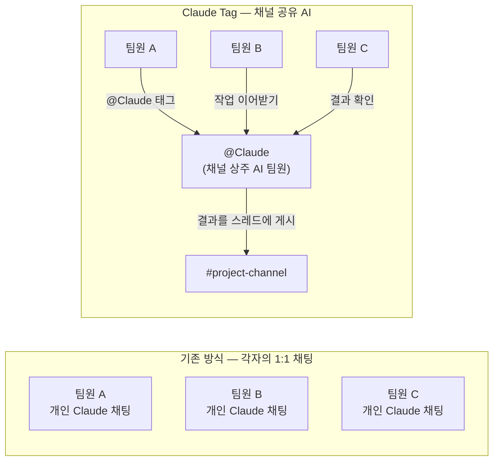
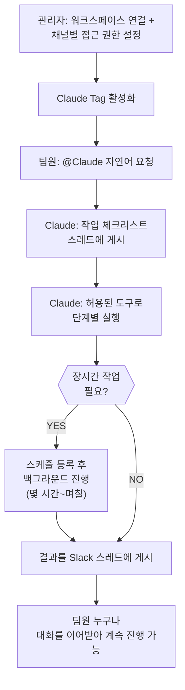
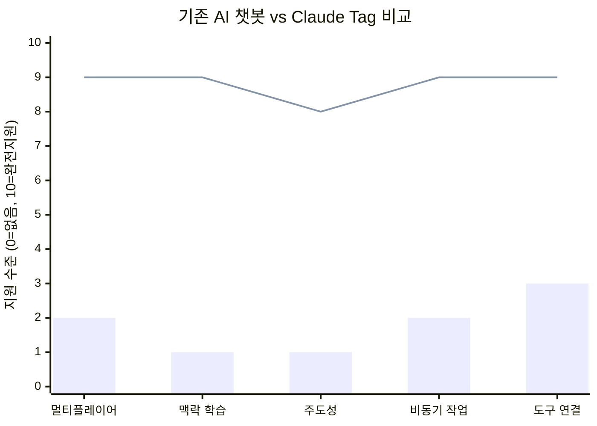
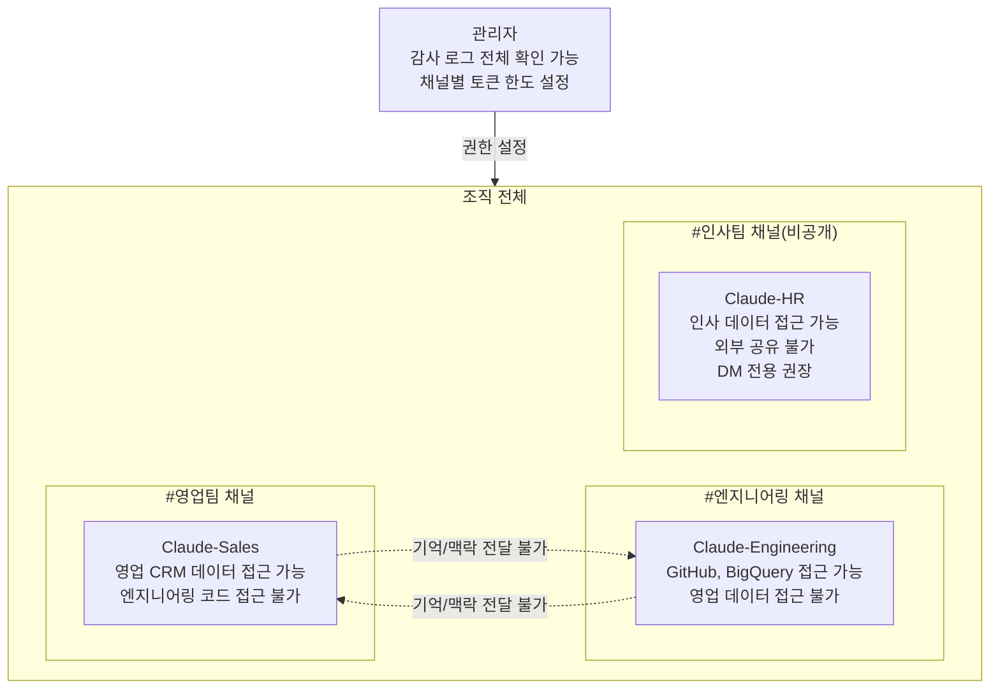
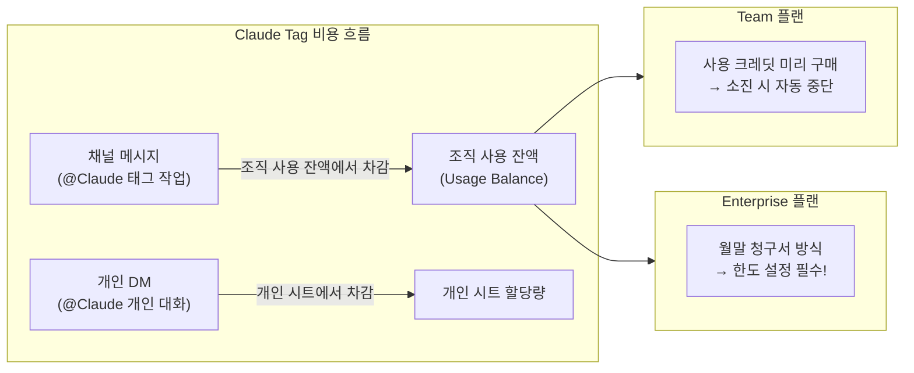
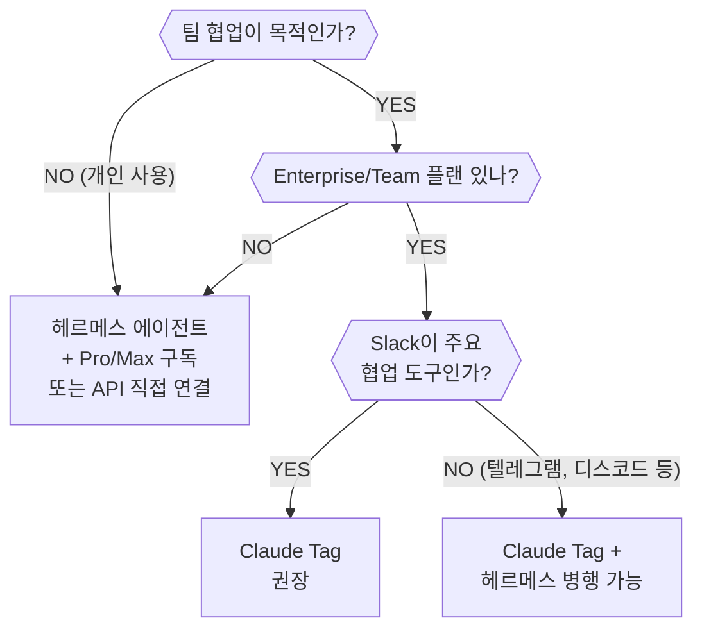
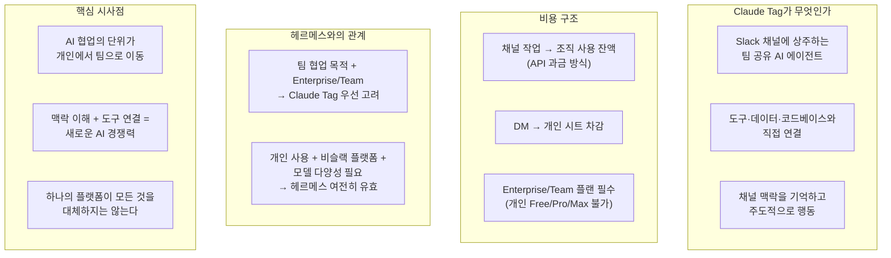

### 인포그래픽 전문 분석 + 커뮤니티 반응 + 비용 구조 + 헤르메스 에이전트 비교

> **출처**: Anthropic 공식 문서, Claude Tag 인포그래픽(한국 AI 커뮤니티 제작), Threads @ai.yeongseon 포스팅, 각종 외신 보도 종합
>
> **작성일**: 2026년 6월 26일

> https://www.threads.com/@ai.yeongseon/post/DZ98Bx8k8NJ
> 
> 그동안 즐거웠다 헤르메스 에이전트...
> 
> 클로드가 맥락과 wiki에 접근할 수 있다면
> 
> 헤르메스 쓸 이유가 없다...
> 

---

## 목차

1. [인포그래픽 핵심 한 줄 — 제일 먼저 이것을 이해하자](#1-인포그래픽-핵심-한-줄--제일-먼저-이것을-이해하자)
2. [Claude Tag란 무엇인가 — 인포그래픽 1번 섹션 완전 해설](#2-claude-tag란-무엇인가--인포그래픽-1번-섹션-완전-해설)
3. [어떻게 작동하나 — 4단계 흐름 상세 설명](#3-어떻게-작동하나--4단계-흐름-상세-설명)
4. [핵심 차별점 4가지 — 기존 AI 챗봇과 무엇이 다른가](#4-핵심-차별점-4가지--기존-ai-챗봇과-무엇이-다른가)
5. [관리·보안·거버넌스 — 기업 환경에서 어떻게 통제하나](#5-관리보안거버넌스--기업-환경에서-어떻게-통제하나)
6. [도입 절차 4단계 — 실제로 어떻게 시작하나](#6-도입-절차-4단계--실제로-어떻게-시작하나)
7. [출시 정보 — 누가 쓸 수 있고, 무엇이 달라지나](#7-출시-정보--누가-쓸-수-있고-무엇이-달라지나)
8. [왜 중요한가 — 인포그래픽이 말하는 4가지 이유](#8-왜-중요한가--인포그래픽이-말하는-4가지-이유)
9. [비용은 얼마나 드나 — API 과금 방식 상세 해설](#9-비용은-얼마나-드나--api-과금-방식-상세-해설)
10. [헤르메스 에이전트와의 비교 — 정말로 대체되는가](#10-헤르메스-에이전트와의-비교--정말로-대체되는가)
11. [Slack 무료 버전에서도 쓸 수 있나](#11-slack-무료-버전에서도-쓸-수-있나)
12. [커뮤니티 반응 심층 분석](#12-커뮤니티-반응-심층-분석)
13. [핵심 정리 — 한눈에 보는 결론](#13-핵심-정리--한눈에-보는-결론)

---

## 1. 인포그래픽 핵심 한 줄 — 제일 먼저 이것을 이해하자

인포그래픽 상단에 굵은 글씨로 강조된 핵심 한 문장은 이것이다.

> **"Claude Tag는 팀이 Slack 채널 안에서 Claude를 팀원처럼 태그하고, 도구·데이터·코드베이스와 연결된 AI에게 일을 맡기는 새로운 협업 방식이다."**

이 한 문장을 이해하면 Claude Tag의 본질이 이미 절반은 설명된다. 기존의 AI 챗봇과 결정적으로 다른 점은 세 가지다. 첫째, Slack이라는 팀의 기존 협업 공간 안에 들어온다. 둘째, 개인이 아닌 팀이 공유하는 AI다. 셋째, 단순히 답변을 주는 것이 아니라 도구·데이터·코드베이스에 직접 연결되어 실제 일을 대신 처리한다.

출처는 Anthropic이 2026년 6월 23일에 공식 발표한 내용이며, Slack에서 @Claude를 태그해 팀 업무를 위임하는 협업형 AI 에이전트라고 설명하고 있다.

---

## 2. Claude Tag란 무엇인가 — 인포그래픽 1번 섹션 완전 해설

인포그래픽의 첫 번째 섹션은 Claude Tag를 네 가지 측면에서 설명한다.

### 2-1. Slack 채널에 팀원처럼 참여

Slack 채널에 Claude를 팀원처럼 참여시켜, 누구나 @Claude로 작업을 위임할 수 있다. 이것이 기존 AI 채팅과 가장 다른 부분이다. 기존에는 각자 자신의 채팅창에서 Claude를 썼기 때문에, 내가 Claude와 무슨 대화를 했는지 다른 사람은 알 수 없었다. Claude Tag는 이 구조 자체를 바꾼다. 채널 안에 상주하는 하나의 Claude가 팀 전체와 상호작용한다.

### 2-2. 선택된 채널·도구·데이터·코드베이스에만 접근

Claude Tag는 모든 것에 접근하지 않는다. 관리자가 허용한 채널, 연결된 도구, 데이터, 코드베이스에만 접근하도록 설정된다. 이 설계 원칙 덕분에 영업팀 채널의 Claude는 엔지니어링팀 채널의 데이터를 볼 수 없고, 각 팀의 정보는 해당 채널 안에서만 유지된다.

### 2-3. 채널 맥락을 기억하고 축적

Claude Tag는 채널 대화를 따라가며 업무 맥락을 점진적으로 기억한다. 처음에는 프로젝트 배경을 설명해야 하지만, 시간이 지나면서 재설명 없이 맥락을 이해하고 일한다. 관리자가 허용한 경우 다른 Slack 채널이나 데이터 소스에서도 자동으로 관련 정보를 학습한다. 단, 비공개 채널의 내용은 보고하지 않는다는 원칙이 명확히 유지된다.

### 2-4. Claude Code의 진화이자 proactive AI의 출발점

Anthropic은 Claude Tag를 Claude Code의 진화 시작점으로 공식 규정했다. Claude Code가 개인의 터미널 코딩 에이전트였다면, Claude Tag는 팀 전체가 공유하는 채널 에이전트로 확장된 것이다. 더 주도적이며, 팀과 함께 일하는 데 최적화된 형태다.

### Anthropic 내부 실제 사례

Anthropic은 발표 당시 이 도구를 이미 내부에서 사용하고 있으며, **제품팀의 코드 작업 중 65%가 Claude Tag 내부 버전으로 만들어지고 있다**고 밝혔다. 활용 범위는 엔지니어링에 그치지 않는다. 제품 지표 추적, 데이터 확인, 고객 지원 티켓 처리, 복잡한 버그의 근본 원인 분석까지 영역을 넓히고 있다.

---

## 3. 어떻게 작동하나 — 4단계 흐름 상세 설명

인포그래픽의 두 번째 섹션은 Claude Tag의 작동 흐름을 다섯 단계로 설명한다.

**1단계 — 관리자가 워크스페이스를 연결하고 채널별 접근 권한을 설정한다**: 이것이 가장 먼저 일어나는 일이다. 관리자는 Claude Tag를 Slack 워크스페이스와 연결하고, 어느 채널에서 Claude가 작동하고, 어떤 도구와 데이터에 접근할 수 있는지를 사전에 설정한다. Claude는 관리자가 허용한 범위 내에서만 움직인다.

**2단계 — 팀원이 채널에서 @Claude로 자연어 요청을 한다**: 한국어든 영어든 자연어로 요청하면 된다. "이번 분기 고객 이탈 원인 분석해줘", "PR #437 리뷰해줘", "지난 주 지원 티켓 중 미해결 건 정리해줘" 같은 방식으로 태그하면 된다. 복잡한 명령어나 특별한 형식이 필요하지 않다.

**3단계 — Claude가 작업을 여러 단계로 나누고, 허용된 도구를 사용해 실행한다**: Claude는 요청을 받으면 바로 결과를 내놓지 않는다. 먼저 작업 체크리스트를 스레드에 게시하고, 단계별로 작업을 진행하면서 중간 경과를 공유한다. 팀원들은 이 과정을 실시간으로 볼 수 있다.

**4단계 — 완료 후 Slack 스레드에 결과를 공유한다**: 작업이 끝나면 결과가 해당 스레드에 게시된다. 필요한 경우 장시간에 걸친 후속 작업도 계속 진행한다. 몇 시간 후 자동으로 후속 결과를 추가하거나, 다음 날에 스케줄된 작업을 진행하기도 한다.

**DM(개인 메시지) 사용 방식**: 채널 메시지 외에 개인 DM으로도 Claude와 소통할 수 있다. 이 경우 채널 레벨의 조직 설정이 아닌, 해당 사용자가 자신의 claude.ai 계정에 설정한 개인 도구·커넥터를 활용해 비공개로 응답한다. 이때의 비용은 조직이 아닌 개인 시트에서 청구된다.





---

## 4. 핵심 차별점 4가지 — 기존 AI 챗봇과 무엇이 다른가

인포그래픽의 세 번째 섹션은 Claude Tag를 기존의 AI 통합과 구분하는 네 가지 특성을 설명한다. 이것이 Claude Tag를 단순한 AI 챗봇 플러그인이 아니라 새로운 패러다임으로 만드는 핵심이다.

### A. 멀티플레이어 협업

기존의 AI 채팅은 철저히 1:1이었다. Claude Tag는 하나의 채널 안에서 모두가 같은 Claude와 협업한다. 이것이 "팀 동료에 가까운 사용 방식"이라고 인포그래픽이 표현한 이유다. 누가 무엇을 요청했는지 맥락이 채널 전체에 공개되어 있고, 다른 팀원이 그 대화를 이어받아 작업을 계속할 수 있다. 한 사람이 시작한 분석 작업을 다른 사람이 다른 방향으로 확장하는 것이 자연스럽게 가능하다.

### B. 시간이 갈수록 맥락 학습

Claude Tag는 채널을 따라가며 업무 맥락을 지속적으로 축적한다. 처음에는 프로젝트 배경을 설명해야 하지만, 시간이 지나면서 팀의 언어, 프로젝트 구조, 주요 이슈들을 이미 알고 있는 상태로 일할 수 있다. 이것은 반복 설명 부담을 없애준다. 권한이 있으면 다른 Slack 채널과 연결된 데이터 소스에서도 학습할 수 있다. 단, 비공개 채널의 내용은 임의로 보고하지 않는다는 원칙이 명확하다.

### C. 주도적으로 움직임 (Ambient Behavior)

관리자가 **ambient behavior**를 활성화하면, Claude는 누군가가 @Claude를 태그하지 않아도 스스로 행동한다. 연결된 도구와 채널 전반에서 팀에게 필요한 정보를 먼저 발견하면 알려주고, 오랫동안 해결되지 않은 채 조용히 멈춘 스레드나 작업을 스스로 다시 추적한다. 이것이 Claude가 수동적인 도구에서 능동적인 팀원으로 전환되는 지점이다.

### D. 비동기 에이전트 작업

Claude Tag에게 작업을 맡기면 나는 다른 일에 집중하면 된다. Claude는 백그라운드에서 자율적으로 작업을 처리한다. 더 나아가 Claude가 스스로 미래 시점의 작업을 스케줄링할 수 있어, 프로젝트를 수 시간 또는 수 일에 걸쳐 자율적으로 추진할 수 있다. Anthropic은 이 기능 덕분에 내부에서 여러 Claude에게 병렬로 일을 위임하는 방식이 매우 유용했다고 밝혔다.

*(막대: 기존 AI 챗봇 / 선: Claude Tag)*

---

## 5. 관리·보안·거버넌스 — 기업 환경에서 어떻게 통제하나

인포그래픽의 네 번째 섹션은 Claude Tag가 기업 보안 요구를 어떻게 충족시키는지를 설명한다. 하단에 굵게 강조된 핵심 의미가 있다.

> **"'공유되는 AI'이지만 권한은 철저히 분리·관리되는 구조"**

이것이 Claude Tag의 보안 철학을 한 문장으로 요약한 것이다. AI는 공유되지만, 그 AI가 접근할 수 있는 권한은 채널별로 철저히 분리된다.

구체적으로는 다음과 같다. 민감한 데이터와 작업별 도구 접근을 매우 세밀하게 통제할 수 있다. 시스템 관리자가 채널별로 어떤 정보와 도구를 사용할지 미리 지정한다. 용도별로 서로 다른 Claude 정체성(identity)을 만들 수 있으며, 각 Claude의 기억(memory)도 해당 채널 범위에만 국한된다.

예를 들어 영업용 Claude의 기억은 엔지니어링용 Claude로 절대 넘어가지 않는다. 엔지니어들은 영업 데이터나 도구에 자동으로 접근하지 못한다. 이 격리는 조직 내 정보 보안의 기본 요건을 충족시킨다. 관리자는 조직 전체 및 채널별로 토큰 지출 한도를 설정할 수 있으며, @Claude가 수행한 모든 작업 로그와 각 작업을 요청한 사람이 누구인지를 확인할 수 있다.

---

## 6. 도입 절차 4단계 — 실제로 어떻게 시작하나

인포그래픽의 다섯 번째 섹션은 Claude Tag 도입 절차를 4단계로 요약한다.

**1단계 — Claude Tag를 Slack workspace와 연결**: `claude.ai/admin-settings/claude-tag`에서 시작한다. Slack 마켓플레이스에서 Claude 앱을 설치하고, 임의의 채널에서 `@Claude connect`를 입력하면 Claude가 15분간 유효한 페어링 코드를 보내준다. 이 코드를 Claude Tag 설정 페이지에 붙여넣으면 연결이 완료된다. Slack 워크스페이스 관리자 권한이 있어야 이 단계를 진행할 수 있다.

**2단계 — Claude에 필요한 tools access 부여**: Access 번들에 각 서비스의 자격증명을 연결한다. 여기서 중요한 점은 개인 계정이 아니라 Claude 전용 서비스 계정을 별도로 만들어 입력해야 한다는 것이다. Google Drive, Notion, BigQuery, Sentry, Datadog, Linear, Salesforce, GitHub 등이 지원된다. GitHub는 별도의 Claude GitHub App 설정 페이지에서 진행한다.

**3단계 — 조직의 월간 spend limit 설정**: Claude Tag의 채널 사용량은 조직의 사용 잔액에서 차감된다. 월별 최대 한도를 $100, $250, $500, $1,000, 무제한, 또는 사용자 지정 금액(최대 $1,000,000) 중에서 선택한다. 이 설정이 없으면 엔터프라이즈 플랜의 경우 사용량이 계속 누적되어 예상치 못한 청구서를 받을 수 있으니 반드시 설정해야 한다.

**4단계 — private channel에서 먼저 테스트**: 설정을 마치면 비공개 채널에서 먼저 테스트하는 것이 권장된다. `/invite @Claude`를 입력하고, `@Claude summarize this channel`을 입력해보면 앱 설치와 연결 상태를 확인할 수 있다.

---

## 7. 출시 정보 — 누가 쓸 수 있고, 무엇이 달라지나

인포그래픽의 여섯 번째 섹션은 현재 상황과 앞으로의 계획을 정리한다.

출시 현황은 다음과 같다. 현재 **Claude Enterprise 및 Team 고객**을 대상으로 Slack 베타 서비스 중이다. Anthropic은 향후 팀이 일하는 더 많은 환경으로 확장할 계획임을 밝혔다. Slack 외의 플랫폼 지원이 예정되어 있다는 뜻이다.

기존 앱 대체 문제가 중요하다. Claude Tag는 **기존 'Claude in Slack' 앱을 대체**한다. 기존에 Claude in Slack을 쓰고 있던 조직의 관리자는 **30일 이내에 opt-in 방식**으로 마이그레이션을 선택해야 한다. 강제 이전이 아니라 선택이지만, 30일이 지나면 어떻게 되는지에 대한 공식 발표가 현재까지 명확하지 않으므로 빠른 검토가 필요하다.

초기 도입 혜택으로는 일부 적격 Enterprise/Team 조직에 런치 크레딧이 제공된다. 이 초기 사용 크레딧은 2026년 9월 1일까지 유효하며, 팀이 실제 워크플로를 테스트하고 예산을 결정하기 전에 먼저 사용해볼 수 있도록 설계되었다.

작동 모델은 **Claude Opus 4.8**이다.

---

## 8. 왜 중요한가 — 인포그래픽이 말하는 4가지 이유

인포그래픽의 마지막 섹션은 Claude Tag가 왜 단순한 기능 업데이트가 아닌 패러다임 전환인지를 네 가지로 요약한다.

**1:1 AI 채팅에서 팀이 함께 쓰는 협업형 AI 동료로 전환**: AI와의 상호작용이 개인의 비공개 대화에서 팀의 공개 협업으로 이동한다. 이것은 AI가 생산성 도구를 넘어 조직의 일하는 방식 자체를 바꾸는 전환점이다.

**매번 프롬프트로 맥락을 다시 설명하는 비용 감소**: 현재 많은 조직에서 AI를 쓸 때 반복적으로 프로젝트 배경, 용어 정의, 팀 구조를 설명하는 시간을 낭비한다. Claude Tag는 채널 맥락을 기억함으로써 이 비용을 줄인다.

**기존 협업 공간(Slack) 안에서 에이전트형 업무 위임 실현**: 새로운 도구를 배울 필요 없이, 이미 매일 사용하는 Slack 안에서 에이전트 수준의 작업 위임이 가능해진다. 도구 도입의 마찰을 줄이는 설계다.

**반복 업무, 분석, 추적, 후속 조치까지 '병렬 위임'이 쉬워짐**: 여러 Claude에게 동시에 다른 작업을 위임할 수 있다. Anthropic은 내부에서 이미 이 방식으로 많은 작업을 처리하고 있다고 밝혔다.

---

## 9. 비용은 얼마나 드나 — API 과금 방식 상세 해설

커뮤니티에서 가장 많이 나온 질문이 바로 비용 문제다. Threads 포스팅에서도 "구독 토큰 활용이 아니고 별도 크레딧으로 API 과금처럼 쓰는 것 같다"는 관찰이 있었다. 이 판단은 **정확하다**. 비용 구조를 정확하게 이해하자.

### 채널 작업 비용 — 조직의 사용 잔액에서 차감

Claude Tag의 채널 메시지 작업은 **개인 구독 시트의 토큰이 아니라, 조직의 사용 잔액(usage balance)에서 차감**된다. 공식 문서는 이것을 명확히 한다:

> "채널과 스레드 메시지의 사용량은 개인 시트나 API 크레딧이 아니라 조직의 사용 잔액에서 차감됩니다."

즉, 내가 개인적으로 Claude Pro($20/월) 또는 Max($100/월) 구독을 갖고 있어도, Claude Tag 채널 작업은 그 구독 할당량을 사용하지 않는다. 별도의 조직 잔액에서 API 토큰 요금처럼 과금된다.

### Team 플랜 vs. Enterprise 플랜의 차이

Team 플랜과 Enterprise 플랜은 사용 잔액을 채우는 방식이 다르다.

Team 플랜 고객은 Claude Console에서 사용 크레딧을 미리 구매한다. 잔액이 소진되면 추가 구매 전까지 사용이 중단된다. 예측 가능하고 통제하기 쉬운 방식이다.

Enterprise 플랜 고객은 월 사용량을 나중에 청구서로 받는다. 사용이 계속 누적되며, 한도를 설정하지 않으면 월말에 예상치 못한 금액이 나올 수 있다. 전문가들은 "Enterprise 플랜의 기본 상태는 지출 한도가 없는 것이며, 한도 설정은 선택이 아닌 필수"라고 강조한다.

### DM 비용 — 개인 시트에서 청구

채널이 아닌 개인 DM으로 @Claude와 대화하는 경우, 그 사용량은 해당 사용자의 개인 claude.ai 시트에서 청구된다. 조직의 지출 한도가 DM에는 적용되지 않는다.

### 초기 런치 크레딧

적격 Enterprise/Team 조직에는 초기 사용 크레딧이 제공된다. 이 크레딧은 2026년 9월 1일까지 유효하므로, 지금 가입한다면 비용 부담 없이 실제 워크플로를 테스트해볼 수 있는 기회다.

### 실질적 비용 감각

구체적인 금액은 사용량과 모델에 따라 크게 달라지지만, Claude Tag는 Opus 4.8 기반이므로 토큰 단가가 높다. Anthropic의 기업용 데이터 기준으로 Claude Code 개발자 한 명당 평균 월 $150~$250의 API 사용료가 발생한다는 보고가 있다. Claude Tag가 아직 베타이므로 정확한 운영 비용은 직접 테스트를 통해 파악하는 것이 현실적이다.

---

## 10. 헤르메스 에이전트와의 비교 — 정말로 대체되는가

Threads에서 가장 주목받은 발언은 이것이었다.

> **"그동안 즐거웠다 헤르메스 에이전트... 클로드가 맥락과 wiki에 접근할 수 있다면 헤르메스 쓸 이유가 없다..."**

이 발언은 자연스러운 반응이지만, 실제로는 두 도구가 서로 다른 영역을 커버한다는 점을 이해하는 것이 중요하다.

### 헤르메스 에이전트란 무엇인가

헤르메스 에이전트(Hermes Agent)는 Nous Research가 2026년 2월에 공개한 **오픈소스 자율 AI 에이전트 플랫폼**이다. 중요한 것은 헤르메스가 AI 모델이 아니라는 점이다. 헤르메스는 인프라 레이어다. Claude, GPT, Gemini, Qwen, DeepSeek 같은 모델 위에 올라가서 다음 기능을 제공한다: 세션 간 영구 메모리, 자기 개선 스킬 시스템, 텔레그램·디스코드·슬랙·왓츠앱 등의 메시징 게이트웨이, 크론 스케줄러, 도구 실행, 서브에이전트 병렬 실행.

한 문장으로 표현하면: **Claude가 뇌라면, 헤르메스는 몸·스케줄·메모리·통신 채널**이다. 헤르메스 자체는 생각하지 못한다. 모델이 없으면 아무것도 할 수 없다. 반면 Claude가 없으면 헤르메스는 작동하지 않는다.

### 두 도구의 핵심 차이

| 비교 항목 | 헤르메스 에이전트 | Claude Tag |
|-----------|-------------------|------------|
| 호스팅 방식 | 로컬 또는 자체 서버 (self-hosted) | Anthropic 클라우드 |
| 비용 | 오픈소스, 무료 (모델 API 비용만 발생) | Enterprise/Team 플랜 필요 |
| 지원 플랫폼 | 텔레그램, 디스코드, 슬랙, 왓츠앱, Signal 등 15+ | 슬랙 (추후 확장 예정) |
| 모델 선택 | Claude, GPT, Gemini, DeepSeek 등 자유 선택 | Claude Opus 4.8 고정 |
| 사용 대상 | 개인 파워유저, 개발자 | 팀 및 기업 조직 |
| 설정 난이도 | CLI 설치, 직접 설정 필요 | 4단계 웹 기반 설정 |
| 영구 메모리 | MEMORY.md, USER.md 파일 기반 크로스세션 메모리 | 채널 범위 내 맥락 학습 |
| 보안/컴플라이언스 | 직접 구성 필요 | HIPAA 대응, 감사 로그, RBAC 내장 |
| 멀티팀 협업 | 지원하지 않음 (개인 에이전트) | 핵심 설계 목표 |

### 헤르메스가 여전히 유효한 경우

Threads의 발언처럼 "Claude Tag가 맥락과 wiki에 접근할 수 있다면 헤르메스 쓸 이유가 없다"는 판단은 팀 협업 용도로는 맞을 수 있지만, 개인 사용 맥락에서는 다르다. 헤르메스는 다음 상황에서 여전히 유효하다.

Claude Pro/Max 개인 구독만 갖고 있어 Enterprise/Team 플랜 없이 에이전트 기능이 필요한 경우, 텔레그램이나 왓츠앱처럼 슬랙 외의 플랫폼에서 AI 에이전트를 운용해야 하는 경우, Claude 외의 모델(GLM, DeepSeek, Kimi 등)로 에이전트를 구성하려는 경우, 완전한 데이터 로컬화가 필요한 보안 요구사항이 있는 경우가 이에 해당한다.

반면 팀 단위 협업이 목적이고, Enterprise/Team 플랜을 이미 사용하고 있다면, 별도 인프라 없이 Slack 안에서 Claude Tag로 대부분의 에이전트 기능을 커버할 수 있다.





---

## 11. Slack 무료 버전에서도 쓸 수 있나

커뮤니티에서 나온 또 다른 실용적인 질문이다.

> "슬랙은 유료 아닌가요? 비지니스 아니고 1인 사용자는 무료 사용 가능해요?"
>
> 답변: "슬랙 무료버전도 쓸 수 있을걸요. 저도 계속 무료버전 쓰고 있어요."

이 대화에서 중요한 구분이 있다. **Slack의 무료/유료**와 **Claude의 무료/유료**는 별개의 문제다.

**Slack 측**: 슬랙 자체는 무료 플랜으로도 Claude Tag 앱을 설치할 수 있다. 슬랙 프리 플랜은 채널 수, 메시지 기록 기간 등의 제한이 있지만, Claude Tag를 워크스페이스에 추가하는 것 자체는 가능하다.

**Claude 측**: 이것이 핵심 제약이다. Claude Tag를 실제로 사용하려면 **Claude Enterprise 또는 Team 플랜**이 있어야 한다. Team 플랜은 연간 결제 기준 시트당 월 $20(표준 시트) 또는 $100(프리미엄 시트)이며, 최소 5시트부터 가입 가능하다. Enterprise 플랜은 영업팀 문의가 필요하며, 대략 70시트 최소 요구로 연간 $50,000 이상이 일반적이다.

결론적으로, 슬랙 무료 버전에서도 Claude Tag 앱 자체를 설치할 수 있지만, Claude Tag 기능을 실제로 활성화하고 사용하려면 Claude Enterprise/Team 유료 플랜이 필요하다. **개인 Free/Pro/Max 구독만으로는 Claude Tag 채널 기능을 사용할 수 없다.** 개인 DM 기능은 해당 사용자의 claude.ai 계정으로 작동하므로 Team/Enterprise 플랜 멤버라면 개인 연결을 통해 DM 사용이 가능하다.

---

## 12. 커뮤니티 반응 심층 분석

Threads 포스팅(@ai.yeongseon)에 달린 댓글들은 Claude Tag를 어떻게 바라보는지 커뮤니티의 시각을 잘 보여준다.

### 반응 1 — "맥락과 wiki 접근 가능하면 헤르메스 쓸 이유 없다"

이 반응은 Claude Tag가 제공하는 맥락 기억과 도구 연결이 기존 로컬 에이전트의 핵심 가치와 겹친다는 점을 정확히 짚은 것이다. 특히 팀 사용 환경에서는 관리형 클라우드 서비스가 자체 인프라 운영보다 훨씬 간단하다는 이점이 있다.

동시에 "일반 사용자에게 어떻게 풀릴지 지켜봐야 될 거 같다"는 현실적인 유보도 포함되어 있다. 현재 Enterprise/Team 전용 베타라는 제약이 개인 사용자에게는 여전히 큰 문턱이다.

### 반응 2 — "AI 모델 성능보다 맥락 이해와 도구 연결이 더 중요한 경쟁력"

이것은 매우 중요한 통찰이다. 지금 AI 시장에서 모델 자체의 성능 차이는 점점 줄어들고 있다. 반면 어떤 맥락을 얼마나 풍부하게 이해하고, 어떤 업무 도구와 자연스럽게 연결되느냐가 실제 업무 현장에서의 유용성을 결정한다. Claude Tag는 정확히 이 방향을 겨냥한 제품이다.

또한 "하나의 플랫폼이 모든 것을 완전히 대체하기보다, 조직의 업무 환경과 목적에 따라 서로 다른 에이전트와 워크플로를 조합하는 시대가 오지 않을까"라는 전망도 중요하다. 실제로 Claude Tag(Slack), 헤르메스(텔레그램/비슬랙 환경), Claude Code(터미널 코딩) 같은 도구들이 각자 역할을 맡으며 조합되는 방향이 현실적이다.

### 반응 3 — "AI가 답을 잘하는 도구를 넘어 함께 일하는 동료로"

이 문장은 Claude Tag가 열어가는 방향을 가장 직관적으로 표현한다. Anthropic이 Claude Tag를 설명하면서 반복적으로 사용한 "팀원(teammate)"이라는 단어와 정확히 맞닿아 있다. AI가 사용자의 요청을 기다리는 수동적 도구에서, 팀과 함께 일하는 능동적 동료로 전환되는 것이 Claude Tag의 본질적 방향이다.

---

## 13. 핵심 정리 — 한눈에 보는 결론

Claude Tag 인포그래픽과 커뮤니티 반응, 그리고 공식 문서를 종합하면 다음과 같이 요약된다.

Claude Tag는 AI가 개인의 비공개 채팅 상대에서 팀의 공개 협업 동료로 이동하는 전환점을 만들었다. Anthropic이 내부에서 이미 코드 작업의 65%를 이 방식으로 처리한다는 사실이 이 제품의 현재 실력을 보여준다. 동시에 Enterprise/Team 전용 베타라는 현실적 제약이 개인 사용자에게는 여전히 높은 문턱이며, 비용 구조가 구독 토큰이 아닌 API 과금 방식이라는 점은 도입 전 반드시 확인해야 할 사항이다.

---

*이 문서는 Anthropic 공식 문서, Claude Tag 지원 페이지, 각종 외신 보도(Fortune, TechRepublic, VentureBeat, Neowin 등), Hermes Agent 공식 문서(Nous Research), 그리고 한국 AI 커뮤니티 Threads 포스팅(@ai.yeongseon)을 종합하여 작성되었습니다. Claude Tag는 현재 공개 베타 단계이므로 세부 기능과 과금 방식은 변경될 수 있습니다.*
