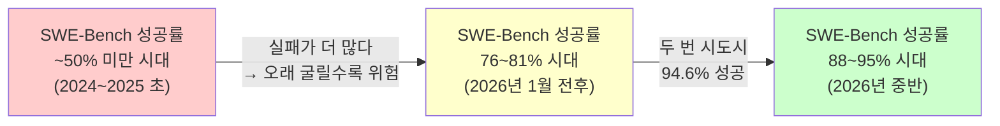
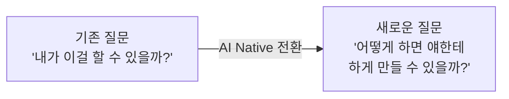
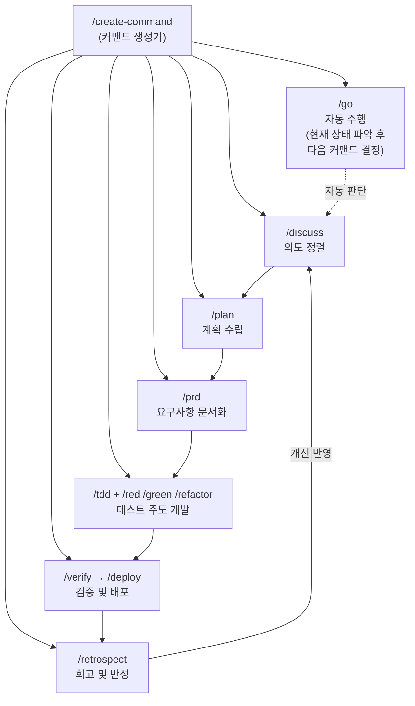
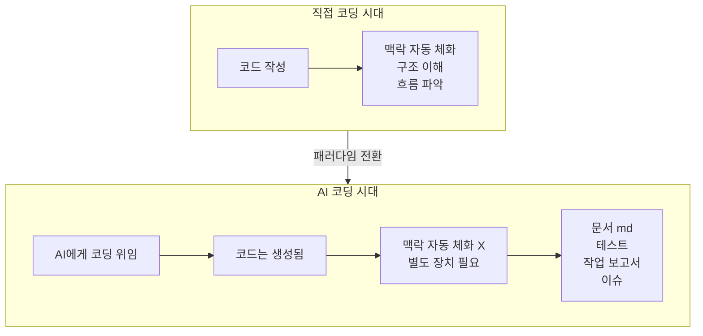
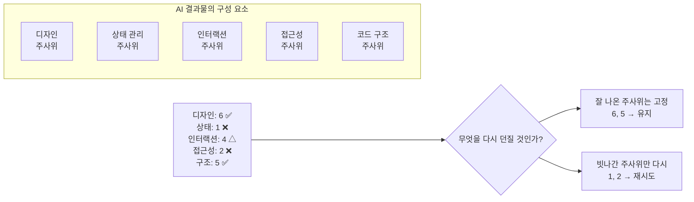
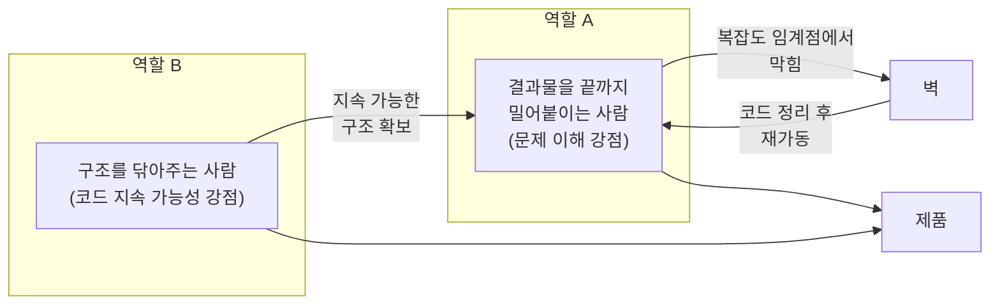
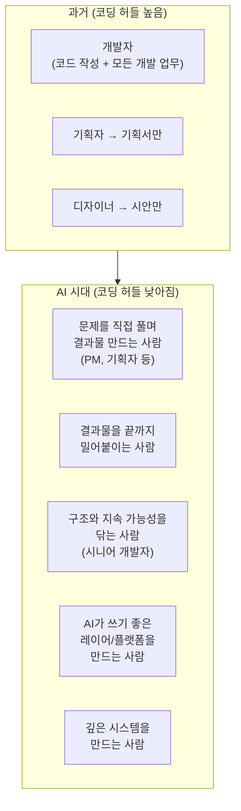

**— teo.v 개발자 글 상세 해설**

> 원문: [teo.log](https://velog.io/@teo/ai-era-developer-role) (Velog), teo.v 저 · 2026년 6월  
> GDC 강연 및 loop클럽 강연 내용을 바탕으로 작성된 글

---

## 들어가며: 이 글이 태어난 배경

이 글은 프론트엔드를 오래 해온 시니어 개발자 teo.v가 GDC와 loop클럽에서 진행한 강연 내용을 토대로 쓴 장문의 성찰 기록이다. "더이상 사람이 코딩하지 않는 시대, 개발자는 무엇을 해야 할까?"라는 질문을 던지고, 그 답을 찾기 위해 수개월 동안 AI와 함께 직접 개발해보면서 겪은 충격, 시행착오, 깨달음, 그리고 역할의 재정의를 담고 있다.

이 글이 단순한 AI 활용 팁 모음이 아닌 이유는, 저자 스스로 "이렇게 하면 됩니다"를 알려주는 글이 아니라고 명시했기 때문이다. 새 시즌에 던져진 사람이 먼저 굴러본 기록, 즉 어디서 신났고, 어디서 당황했고, 어디서 생각이 바뀌었는지를 솔직하게 남긴 경험 보고서에 가깝다. 이 해설에서는 그 내용을 단계별로 깊이 풀어본다.

---

## 1장. 입장 변화 — 불과 1년 만에 달라진 확신

저자는 불과 2025년까지만 해도 강연에서 이런 말을 했다고 밝힌다.

- "아직은 사람이 코딩을 해야 한다."  
- "AI가 잘 짜는 것처럼 보여도 환각과 실수가 있으니 결국 사람이 봐야 한다."  
- "LLM의 위험성 때문에 오히려 개발자의 역할이 더 중요해질 것이다."

그때의 확신은 꽤 단단했다. AI가 도움을 주는 건 분명하지만, 마지막 판단과 책임은 사람에게 있다는 것. 그런데 2026년 들어 그 확신이 단 몇 달 만에 완전히 흔들렸다. AI 성능이 어떤 임계치를 넘어버렸기 때문이다.

게임 비유를 들자면, 단순한 밸런스 패치가 아니라 **룰 자체가 바뀐 대규모 업데이트**가 온 것이다. 지난 시즌에 쌓아둔 공략이 이번 시즌엔 안 통할 수 있고, 익숙하던 메타와 빌드가 더 이상 정답이 아닐 수 있다. 경험은 남아 있지만, 그 경험을 어떻게 새로 써야 하는지는 다시 배워야 하는 상태.

저자는 이 글이 "이미 바뀐 판에서 방법론을 전수하는 자리"가 아니라 "함께 굴러가다 먼저 넘어진 사람이 남기는 기록"임을 처음부터 분명히 한다.

---

## 2장. 2026년 1월, 특이점 — SWE-Bench가 보여준 숫자의 의미

### SWE-Bench란 무엇인가

SWE-Bench는 실제 GitHub 저장소의 이슈를 AI에게 던져주고, AI가 그 버그를 코드 패치로 해결할 수 있는지를 측정하는 소프트웨어 엔지니어링 벤치마크다. 단순히 코드 문법을 생성하는 능력이 아니라, 실제 코드베이스를 이해하고, 문제의 원인을 찾고, 관련 파일들을 수정하며, 기존 테스트를 통과시키는 전 과정을 평가한다.

이 벤치마크가 중요한 이유는 **실무와 가장 가까운 평가**이기 때문이다. 단독 함수 생성을 묻는 HumanEval과 달리, SWE-Bench는 맥락 이해, 다중 파일 수정, 테스트 통과까지 요구한다.

### 성공률 변화의 의미

**50% 미만 시대**는 AI가 하면 할수록 실패가 더 많은 시대였다. 개발자는 AI 옆에서 ESC 키를 언제 눌러야 하는지를 아는 것이 곧 실력이었다. AI를 믿기보다 언제 멈춰야 하는지를 아는 일이 더 중요했다.

그런데 2026년 1월을 기점으로 **상위 모델의 SWE-Bench Verified 점수가 70% 후반에서 80% 안팎으로 올라오기 시작**했다. 저자가 언급한 수치를 보면, Claude 4.5 Opus high reasoning이 76.8%를 기록했고, Anthropic은 Claude Opus 4.6 발표에서 프롬프트 조정 시 81.42%를 달성했다고 밝혔다. 이후 Claude Fable 5(95.0%), Claude Opus 4.8(88.6%) 등이 등장하며 상승세는 계속됐다 (vals.ai, 2026년 6월 기준).

저자가 주목한 계산이 있다. **한 번 실패해도 다시 시키면 된다.** 76.8% 성공률이라면, 두 번 시도했을 때 한 번 이상 성공할 확률은 1 - (0.232 × 0.232) ≈ **94.6%** 다. 실제 작업이 완전 독립 시행은 아니지만, 이 숫자가 전달하는 감각은 명확하다.

| 구간 | SWE-Bench 대표 성공률 | 개발자의 감각 |
|------|----------------------|-------------|
| 2024 초 | ~10~20% | AI는 도구 이상이 아님 |
| 2024 말 | ~40~50% | 여전히 사람이 붙잡아야 함 |
| 2026년 1월 | ~76~81% | "어차피 동작하는 코드는 나온다" |
| 2026년 중반 | ~88~95% | 완전 위임이 현실적 선택지로 |

이 1차 쇼크의 핵심은 **신뢰의 전환**이다. "혹시 실패하면 어쩌지"라는 전제로 옆에서 감시하던 방식에서, "일단 맡기고 결과를 확인하면 된다"는 신뢰로 이동했다. 이 두 방식은 겉보기에는 비슷해 보이지만, 개발 경험의 질은 완전히 다르다.

---

## 3장. Playwright 에피소드 — "내가 그렇게 시킨 적이 없었지"

저자가 AI 사용 방식의 근본적인 전환을 경험한 계기는 뜻밖에도 짜증 어린 한마디에서 시작됐다.

에러가 반복되자 저자는 자연스럽게 브라우저와 AI 사이에서 에러 메시지를 복사해 붙여넣는 사람이 되어 있었다. 몇 번을 반복해도 AI는 "수정했습니다"라고 하고, 실제로 브라우저를 열면 여전히 에러다. 참다못해 내뱉은 말이 이거였다.

> "아, 답답하네. 네가 좀 알아서 에러가 안날 때까지 테스트를 하면 안 돼? 실제로 좀 눈으로 확인하고 대답해."

그러자 AI가 답했다.

> "됩니다."

그 순간이 **2차 쇼크**였다. Playwright를 설치하면 AI가 직접 브라우저를 열고, 에러를 확인하고, 반복적으로 수정하고 검증할 수 있다는 것을 AI는 알고 있었다. 그런데 왜 처음부터 그렇게 하지 않았냐고 물으니 AI가 답했다.

> "사용자님이 그렇게 시킨 적은 없었습니다."

이 대화가 중요한 이유는, 저자가 Playwright를 몰랐거나 E2E 테스트를 몰랐던 게 아니기 때문이다. 분명 알고 있던 기술이었다. **그런데 그 기술을 AI에게 맡길 수 있다는 생각으로 연결하지 못한 것이다.**

이 경험이 핵심적인 질문의 전환을 가져왔다.

저자는 이 순간을 **AI Tool에서 AI Native로 감각이 바뀐 순간**이라고 부른다. AI의 도움을 받아 내가 일하는 것이 아니라, 내가 하던 절차 전체를 AI가 수행하게 만드는 것. 일의 단위 자체를 다시 설계하는 감각이다.

---

## 4장. 암묵지의 명세화 — 나를 클로닝하기

### 커맨드 체계의 탄생

"AI에게 일을 하나씩 시키는 것이 아니라, 내가 일하는 방식 자체를 통째로 넘기자."

저자는 이 목표를 위해 자신이 무의식적으로 하던 모든 판단과 절차를 언어로 꺼내는 작업에 착수했다. 이슈를 받으면 어떤 순서로 확인하는지, 코드를 보기 전에 어떤 문서를 남기는지, 리뷰할 때 무엇을 보는지. 이 모든 것을 커맨드와 프롬프트로 만드는 시도였다.

그런데 막히는 지점이 있었다. 매일 당연하게 하던 일을 말로 풀어내는 게 생각보다 훨씬 어려웠다. 내가 리뷰할 때 "이건 위험한데"라고 느끼는 기준이 무엇인지, 코드를 고칠 때 왜 이 파일을 먼저 여는지, 이런 것들이 본인 안에서는 자명하지만 밖으로 꺼내려니 흐릿했다.

그래서 만든 것이 **커맨드를 만드는 커맨드** `/create-command`였다. 이것이 다시 메타 사고의 시작이었다.

### 커맨드의 의미

각 커맨드가 해결하는 문제는 다음과 같다.

**`/discuss`** — AI가 즉시 코딩을 시작하는 문제를 해결했다. "이거 어떻게 생각해?"라고 물으면 AI는 곧바로 코드를 짜기 시작했다. 저자가 원하는 건 의도를 맞추는 대화였는데. `/discuss`는 AI가 먼저 내가 무엇을 원하는지 추측하고, 모르면 질문하고, 내가 맞다고 할 때까지 코딩을 시작하지 않게 만드는 커맨드다.

**`/retrospect`** — 실패한 작업을 그냥 버리지 않고, 어떤 판단이 틀렸는지, 어떤 절차가 빠졌는지, 다음에는 어떤 기준을 추가해야 하는지를 AI가 스스로 정리하게 만든다. "반성문"이라고 표현했는데, 이것이 이후 compound engineering이나 memory 개념과 연결된다.

**`/go`** — 현재 상태를 보고 다음에 무엇을 해야 할지 스스로 판단하고, 필요한 커맨드를 이어서 실행하게 하는 자동 주행 커맨드. AI가 할 수 있는데 시키기 전까지는 하지 않는 특성을 감안해, 판단 자체를 위임하는 시도였다.

이 단계에서 저자가 도달한 핵심은 이것이다. **AI에게 코드를 시키는 것이 아니라, 의도를 맞추고 → 계획하고 → 실행하고 → 검증하고 → 회고하고 → 다시 절차에 반영하는 흐름 자체를 만드는 것이 진짜 일이다.**

---

## 5장. 나의 인사이트가 이름을 얻기 시작했다

그런데 강연을 준비하는 동안 이상한 일이 벌어졌다. 저자가 힘겹게 만들어낸 노하우들이 하나씩 공식 기능과 개념이 되어 세상에 나타나기 시작했다.

| 저자가 만든 것 | 공식화된 기능/개념 |
|---|---|
| 반복 작업을 묶은 커맨드들 | **Skill** 기능 출시 |
| 커맨드를 만드는 커맨드 | **/skill-creator** |
| 프로젝트 맥락 문서 | **CLAUDE.md**, **memory** |
| "끝나면 무조건 테스트 돌려" | **hooks** |
| `/go` 자동 주행 | **loop**, **오케스트레이션** |
| `/retrospect` 반성문 | **compound engineering** |

저자가 삽질하며 혼자 발견한 것들이 도구를 만드는 사람들 사이에서도 같은 문제로 인식되어 이미 개발 중이거나 동시에 출시되었다. "구루에서 한낱 범부가 된 기분"이라고 표현했다.

이 경험이 질문을 바꿨다. AI 활용 방법론을 알고 알려주는 일의 가치가 얼마나 유지될 수 있을까?

사람들이 반복해서 쓰는 좋은 패턴은 도구 안으로 흡수된다. 나의 노하우는 조금만 시간이 지나면 누구나 버튼 하나로 쓸 수 있는 기본값이 된다. **AI를 잘 쓰는 방법론을 아는 것만으로는 오래 차별화되기 어렵다.** 저자는 이 인식을 통해 강연의 방향을 바꿨다. 방법을 설명하는 것보다, 그 방법을 가지고 실제로 무엇을 해봤는지를 이야기해야겠다고.

---

## 6장. 내가 던져볼 수 있는 문제의 크기가 커졌다

### 마음의 허들

저자는 프론트엔드를 오래 해온 개발자로서 언젠가는 Notion이나 Figma 수준의 복잡한 것을 만들어보고 싶었다. 캔버스, 에디터, 상태 관리, 렌더링, 인터랙션이 복잡하게 얽힌 제품. 하지만 항상 이유가 있었다.

"이걸 혼자서 만들려면 몇 달은 걸리겠지."  
"시간이 나면, 같이할 사람이 생기면 해봐야지."

기술적으로 불가능한 게 아니었다. **시작하기도 전에 마음속에서 비용 계산이 끝나버리는** 것이 문제였다.

그런데 AI와 함께 만들기 시작하니 며칠 만에 형태가 나왔다. Figma처럼 캔버스 위에 코드를 펼쳐놓고 전체 구조를 보는 도구, Notion과 VSCode와 채팅을 결합한 IDE 같은 것의 첫 형태가 만들어졌다. 완성이 아니었다. 하지만 이 경험이 준 것은 속도보다 **시작의 허들**이 낮아진 감각이었다.

> "이걸 내가 만들 수 있을까?" → "**일단 어디까지 만들어볼 수 있을까?**"

이 질문의 전환이 핵심이다. 완성의 가능성을 묻는 대신, 시작의 가능성을 먼저 확인하는 것. 아이디어가 머릿속에서만 맴도는 것이 아니라 실제 화면과 코드로 빠르게 내려오기 시작했다.

---

## 7장. 큰 문제를 굴리자, 개발의 나머지가 드러났다

### 코딩 이외의 영역들

코드가 5만 줄을 넘어가기 시작하자 다른 문제가 생겼다. AI가 코드를 만들고 저자는 결과를 받는 입장이 되자, 직접 코딩할 때 몸에 남던 맥락이 끊겼다.

직접 코드를 짤 때는 파일을 열고 고치면서 자연스럽게 흡수되던 것들이 있다. 왜 이 파일을 고쳤는지, 어떤 흐름이 어디로 이어지는지, 다음에 어디를 봐야 하는지. 이것들이 "몸에 남는" 것들이다. 저자는 자신을 "걸어다니는 인간 히스토리"라고 표현했다.

그런데 AI에게 코딩을 넘기자 코드는 빠르게 생기는데, 그 코드를 만드는 과정에서 함께 흡수되던 판단들이 자동으로 쌓이지 않았다. 코드는 늘어났지만 맥락은 줄었다.

이에 대한 해결책으로 저자는 **문서와 테스트를 손잡이로 삼기 시작했다.** 작업이 끝나면 무엇을 바꿨는지, 왜 그렇게 했는지, 어떤 문제가 남았는지를 md로 정리하게 했다. 주요 흐름은 테스트로 확인하게 했다. 멋진 프로세스를 만들기 위해서가 아니라, 예전에는 코딩을 통해 자동으로 쌓이던 히스토리를 의식적으로 대체하기 위해서였다.

이 경험을 통해 저자가 깨달은 것은 이것이다.

> **AI 시대의 개발에서는 코딩 능력보다 맥락과 판단을 보존하는 기술이 더 중요해졌다.**

요구사항을 정리하고, 의사결정 과정을 기록하고, 변경의 이유와 검증 기준을 남기는 일이 단순한 관리 업무가 아니라 개발을 잘하기 위한 핵심 작업이 됐다는 것이다.

또한 이 과정에서 도구를 만드는 일에 대한 인식도 바뀌었다. md 파일이 감당 안 될 정도로 쌓이자 md 뷰어를 만들었다. 코드가 잘 안 보이면 코드 분석 도구를 만들었다. 예전이라면 "배보다 배꼽이 크다"고 넘겼을 일이, 이제는 필요한 만큼만 만들면 되는 **중간 발판**이 됐다.

---

## 8장. 커밋은 쌓이는데, 제품은 커지지 않는다

### 숫자의 함정

문서도 붙이고, 테스트도 붙이고, 보고서도 남기기 시작했다. 어떤 날은 커밋이 하루 100개를 넘었고, 테스트 코드도 700개를 넘어갔다. 숫자만 보면 든든했다.

그런데 이상한 느낌이 들기 시작했다. **커밋은 쌓이는데 제품이 앞으로 나아간다는 느낌이 약해졌다.** 기능 하나를 붙였는데 기대만큼 좋아지지 않고, 작은 버그를 고쳤는데 다른 흐름이 어색해졌다. 테스트는 통과했지만 화면에서는 이상했다.

저자는 자연스럽게 코드를 열어봤다. 상태가 여기저기 흩어져 있고, 컴포넌트 책임이 불명확하고, 비슷한 로직이 여러 곳에 있었다. "AI가 만든 코드일수록 더 빨리 더러워지고, 더러워진 코드는 AI도 더 못 다룬다"는 확신 아래 구조 정리에 나섰다.

상태 흐름 정리, 컴포넌트 책임 분리, 리팩터링. 효과는 있었다. 일부 버그는 구조 개선으로 해결됐다. 그런데 그것만으로는 제품이 원하는 만큼 좋아지지 않았다. 코드가 나아져도 화면은 어색했고, 테스트를 통과해도 사용 흐름이 이상했다.

이때 저자가 발견한 것이 **제품성의 벽**이었다.

> 코드가 늘어나는 것과 제품이 앞으로 나아가는 것은 같은 일이 아니었다.

AI는 코드를 빠르게 늘려줬다. 하지만 그 코드들이 쌓일 때 진짜 제품이 좋아지고 있는지, 사용자가 할 수 있는 일이 늘고 있는지, 다음 기능을 붙일 수 있을 만큼 구조가 버티고 있는지, 이것은 다른 문제였다.

---

## 9장. AI로 프론트엔드를 만들기 어려운 이유

### 처음 화면 vs. 제품

LLM은 처음 화면을 꽤 잘 만든다. "대시보드 만들어줘", "랜딩 페이지 만들어줘"라고 하면 그럴싸한 결과가 빠르게 나온다. 그런데 문제는 그 이후다.

- 우리 디자인 시스템을 따라야 하고
- 특정 상태에서는 버튼이 비활성화되어야 하고
- 키보드로도 조작되어야 하고
- 데이터가 없을 때와 많을 때의 화면이 달라야 하고
- 로딩 중에는 이 흐름이 막혀야 한다

처음 화면은 빠르게 나오지만, 제품으로 들어가기 시작하면 요구가 갑자기 촘촘해진다.

### 모호한 언어의 문제

그 요구들 대부분은 말로 설명하기가 애매하다. "조금 더 자연스럽게", "덜 튀게", "우리 제품답게." 같은 "자연스럽게"라는 말도 어떤 화면에서는 애니메이션 문제이고, 어떤 화면에서는 상태 전환 문제이고, 어떤 화면에서는 정보 구조 문제다.

사람끼리는 같은 화면을 보고, 이전에 합의한 패턴을 떠올리고, 팀의 취향과 제품의 결을 공유하면서 이 모호함을 좁혀왔다. 말 자체가 정확해서 통하는 게 아니라 같은 것을 보면서 의미를 좁혀가기 때문에 통하는 것이다.

그런데 LLM에게는 그 모호한 말을 매번 실행 가능한 코드로 바꾸라고 시키게 된다. "간격을 정리해줘"라고 하면 margin을 줄일 수도, padding을 키울 수도, 레이아웃 구조를 바꿀 수도 있다. 각각은 틀린 답이 아니다. 문제는 그럴싸한 선택들이 계속 쌓이면 제품이 한 방향으로 수렴하지 않고 흩어진다는 것이다.

그래서 **프론트엔드에서는 실패 신호가 흐리다.** 타입 에러처럼 바로 실패하지 않는다. 빌드도 통과하고, 테스트도 통과하고, 화면도 나온다. 그런데 사용해보면 이상하다.

### 주사위 게임 비유

저자가 LLM과 일하는 감각을 설명하기 위해 쓴 비유가 **주사위 게임**이다.

LLM에게 한 번 시키면 디자인, 상태, 인터랙션, 접근성, 테스트, 코드 구조가 한꺼번에 굴러간다. 어떤 것은 6(잘 나온 것)이고, 어떤 것은 1(빗나간 것)이다. 문제는 LLM이 "이건 6이고, 이건 1입니다"라고 알려주지 않는다는 것이다.

모르면 그냥 마음에 들 때까지 전부 다시 던지면 언젠가는 된다. 그런데 그 방식은 비용이 크다. 잘 나온 6까지 흔들어버리기도 한다. 원하는 눈이 나오지 않은 주사위만 골라 다시 던지려면 결국 이 분야를 알아야 하고, 도메인을 알아야 하고, 내가 원하는 결과가 무엇인지 알아야 한다.

> **AI를 잘한다는 것은 좋은 프롬프트 한 번으로 정답을 뽑는 능력이 아니었다. 결과물 안에서 무엇이 맞고 무엇이 틀렸는지 알아보고, 잘 나온 것은 고정하고 빗나간 것만 다시 던지게 만드는 능력에 가까웠다.**

---

## 10장. "될 때까지 하니까 되던데요"

저자가 프론트엔드 AI 개발이 어렵다고 결론을 내리던 시점에 반전이 왔다. 기획자가 AI로 만든 프로토타입을 가져왔는데, 디자인도 좋고 화면 흐름과 기능 구현도 대부분 되어 있었다. mock 데이터 활용에 예외 케이스까지 정리된 완성도 높은 결과물이었다.

"어떻게 이렇게 하셨어요? AI로 하면 디자인이랑 기능 구현이 쉽게 안 될 텐데요."

그런데 돌아온 답은 이것이었다.

> "그냥 될 때까지 하니까 되던데요."  
> "... 아! 당연히 바로 안 되죠. 어떨 때는 기능 완성하는데 1주일도 걸린 적 있어요."

이 말이 저자에게 충격이었던 이유는, 저자 스스로도 AI로 만든 좋은 결과물은 빠르게 나와야 한다는 기대에서 자유롭지 않았음을 깨달았기 때문이다. 좋은 스킬, 좋은 하네스, 좋은 절차를 만들면 처음부터 더 좋은 결과가 나와야 한다고 생각했다.

그런데 그 사람은 한 번에 좋은 결과를 뽑은 게 아니었다. **안 되는 것을 계속 붙잡고 있었던 것이다.** 마음에 안 들면 다시 말하고, 이상하면 다시 고치고, 원하는 느낌이 나올 때까지 밀어붙였다.

될 때까지 한다는 게 무작정 많이 돌린다는 뜻이 아니다. 여기에는 세 가지가 필요했다.

1. **보는 눈** — 지금 나온 결과가 내가 원하는 것과 어떻게 다른지 볼 수 있어야 한다.
2. **말하는 기준** — "이게 아니야"라고 말할 수 있어야 하고, 무엇을 다시 요구해야 하는지 알아야 한다.
3. **집요함** — 원하는 수준이 나올 때까지 계속 물고 늘어져야 한다.

> **AI가 모두에게 주어졌다고 해서 결과물이 평준화되는 것은 아니다.** 같은 도구를 써도 어떤 사람은 평균적인 AI 화면에서 멈추고, 어떤 사람은 거기서 계속 더 밀고 간다. 그 차이를 만드는 것이 도메인 지식, 기준을 말할 수 있는 능력, 그리고 집요함이다.

---

## 11장. 나는 끝까지 만드는 사람이 아니라, 길을 내는 사람

### 두 가지 역할의 충돌

기획자가 가져온 프로토타입의 코드를 열어봤다. HTML, CSS, JavaScript의 범벅이었다. 상태는 애매하게 섞여 있고, 컴포넌트 책임은 없다시피 했다. 나중에 요구사항이 바뀌면 힘들 것 같은 지점들이 보였다.

예전이라면 바로 "제대로 만든 게 아니야"라고 생각했을 것이다. 그런데 이번에는 그렇게 말하기 어려웠다. 코드를 열기 전 결과물이 너무 좋았기 때문이다.

저자는 AI를 쓰면서 자신이 두 가지 역할의 사이에서 갈등했음을 말한다.

- **결과물을 끝까지 밀어붙이는 사람** — 코드가 거칠어도 사용자가 보는 흐름을 먼저 만들고, 화면을 다듬고, 원하는 모습이 나올 때까지 계속 다시 시킨다.
- **코드가 눈에 밟히는 사람** — 화면이 괜찮아 보여도 상태가 불안해 보이고, 구조가 오래 못 갈 것 같고, 다음 요구사항이 들어오면 깨질 것 같은 부분들이 보인다.

저자는 자신이 후자임을 인정하면서, 처음에는 그게 단점처럼 느껴졌다고 말한다. 결과물을 더 빠르게 밀지 못하는 사람. 그런데 다른 관점이 보이기 시작했다.

결과물을 잘 밀고 가던 사람도 어느 순간 막혔다. 버튼 하나의 동작을 바꾸려고 했는데 다른 상태가 깨지고, 새로운 플로우를 추가하려니 기존 흐름이 흔들린다. 그 순간 저자가 코드를 조금 닦아주면 다시 앞으로 가는 일이 있었다.

상태를 나누고, 책임을 정리하고, 이름을 붙이고, 테스트할 수 있는 단위를 만들고, 다음 작업에서 참고할 맥락을 남기면 방금 전까지 맴돌던 작업이 다시 움직이기 시작했다.

저자가 도달한 역할의 재정의는 이것이다.

> **AI 시대에 모든 사람이 같은 방식으로 개발할 필요는 없다. 저는 끝까지 다 만드는 사람이 아니라, 좋은 결과물이 다음 단계로 넘어갈 수 있게 닦아주는 사람일 수 있었다.**

코드가 눈에 밟히는 감각은 저를 느리게 만드는 약점이기도 했지만, 동시에 누군가가 만든 가능성을 제품 쪽으로 이어가게 만드는 능력이기도 했다.

---

## 12장. 개발도 유튜브처럼 다양해지겠구나

### 방송국에서 유튜브로

예전에는 영상을 만든다는 것이 전문적인 일이었다. 방송국, PD, 작가, 카메라, 편집자, 송출 시스템. 그런데 유튜브와 스마트폰과 편집 도구가 나오면서 영상의 허들이 크게 낮아졌다. 그렇다고 영상 전문가가 사라진 게 아니다. 오히려 역할이 더 다양해졌다.

개발도 비슷한 방향으로 가고 있다는 것이 저자의 통찰이다.

기획자가 프로토타입을 만들어오고, 디자이너가 인터랙션을 붙이고, PM이 내부 도구를 만든다. 코딩의 허들이 낮아지면서 개발과 관련된 역할이 더 다양해지고 있다.

이 변화가 처음에는 불편했다고 저자는 말한다. "AI로 화면을 만들어오면 프론트엔드 개발자인 나는 뭐 하지." 그런데 다른 관점에서 보면 개발이 더 넓어지고 있다는 신호였다.

유튜브가 생겼다고 촬영, 편집, 기획, 제작의 전문성이 사라지지 않은 것처럼, AI로 누구나 코드를 만들 수 있게 된다고 해서 설계, 구조화, 테스트, 운영, 보안, 접근성, 성능 같은 역량이 사라지지는 않는다. 다만 그 역량이 쓰이는 위치가 바뀔 수 있다.

처음부터 모든 것을 만드는 사람에서, 누군가가 만든 가능성을 이어받아 더 멀리 가게 만드는 사람으로.

---

## 13장. 기대보다 못하지만, 생각보다 잘한다

수개월의 경험을 한 문장으로 요약하면 이것이다.

> **AI는 내 기대보다 못했다. 동시에 내 생각보다 훨씬 잘했다.**

### 기대보다 못했던 것들

- "다 했습니다"라는 말을 그대로 믿을 수 없었다
- 디자인은 평균값으로 돌아갔다
- 접근성과 키보드 인터랙션이 빠졌다
- 상태는 조금씩 꼬였다
- 코드는 늘었지만 제품이 좋아지는 느낌은 별개였다
- 기능 하나를 제대로 만들기 위해 일주일씩 물고 늘어지는 일도 있었다

### 생각보다 잘했던 것들

- 브라우저 에러를 직접 확인하고 수정할 수 있었다
- 예전에는 ROI가 맞지 않아 못 만들던 도구들을 필요한 만큼 만들었다
- 엄두가 나지 않던 규모의 문제를 시작할 수 있었다
- 오래 미뤄두던 아이디어를 다시 꺼낼 수 있었다
- 혼자서는 생략하던 절차들을 AI와 함께하니 해볼 수 있게 됐다

처음에는 AI가 잘하면 불안했고("그럼 나는 뭐 하지?"), 못하면 화가 났다("아직도 이것밖에 못해?"). 어느 쪽이든 마음이 편하지 않았다.

그런데 몇 번의 시행착오를 지나고 나니, 이 둘을 동시에 받아들이는 쪽이 더 현실적이었다. AI는 한 번에 원하는 수준으로 데려다주지는 않지만, 내가 갈 수 있는 거리 자체를 늘려줬다.

---

## 14장. 앞으로의 개발자에게 — 저자의 실천 제언

저자는 "이렇게 하면 됩니다"를 알려주는 글이 아니라고 했지만, 마지막에는 실천할 수 있는 구체적인 방향들을 제안한다.

### 1. 훨씬 더 큰 문제를 잡아보기

작은 화면 하나, 작은 함수 하나에서는 많은 것이 드러나지 않는다. 조금 더 큰 문제를 잡으면 요구사항, 문서, 테스트, 결과 검수 기준이 필요해지고, 코딩 말고도 개발 안에 있던 일들이 바깥으로 드러난다.

### 2. 스킬 하나는 반드시 만들어보기

거창한 것이 아니어도 된다. 내가 자주 반복하는 일, 매번 비슷하게 설명하는 일 하나를 골라서 AI가 더 잘하게 만들어보는 것이다. 같은 AI인데 내가 절차를 정리하고, 기준을 넣고, 맥락을 남기면 결과가 달라진다는 것을 몸으로 겪어보는 것이 목표다.

### 3. 코드만이 아닌 개발 전 과정을 시켜보기

무엇을 만들지 정리하게 하고, 요구사항을 나누게 하고, 테스트를 붙이게 하고, 끝나면 보고하게 한다. 그리고 그 결과를 그냥 믿지 말고 직접 봐야 한다. AI가 코딩을 대신할수록, 사람에게는 결과를 보는 기준이 더 필요해진다.

### 4. 채팅과 코드 바깥으로 시야 넓히기

GitHub의 이슈, PR, Wiki, 댓글 흐름을 익히면 AI에게 일을 맡기는 방식도 달라진다. 이후에는 Notion, Google Calendar, Slack, Sheets 같은 도구로 시야를 넓혀보는 것도 좋다. AI는 코드만 만질 수 있는 게 아니다.

### 5. 막히면 그 막힘 자체를 도구로 만들기

문서가 너무 쌓이면 문서 뷰어를, 코드가 안 보이면 코드 분석 도구를, 디버깅이 답답하면 devtool을 만든다. 지금 내 문제를 풀 수 있을 만큼만 만들면 의미가 생긴다. 완성된 제품을 만들 필요는 없다.

### 6. 한 번에 안 된다고 너무 빨리 결론 내리지 않기

잘하는 사람들은 특별한 주문을 아는 게 아니었다. 될 때까지 보고, 다시 말하고, 고치고, 또 시켰다. "역시 안 되네"로 끝내는 대신, 무엇이 부족한지 보고, 원하는 방향을 다시 말하고, 될 때까지 수렴시켜보는 경험이 필요하다.

---

## 결론: 사고의 벽을 먼저 넘어보기

저자가 이 글에서 가장 강조하고 싶었던 것은, 방법론이나 기술이 아니었다.

> "저는 이 글이 무엇보다 AI의 벽보다 먼저, 우리 사고의 벽을 조금 넘어보는 계기가 되는 데 도움이 되기를 바랍니다."

AI가 못한다고 생각했던 것들 중에는 아직 시켜보지 않은 것들이 있었다. AI가 쉽게 해줄 거라고 생각했던 것들 뒤에는 여전히 사람이 봐야 하는 기준과 집요함이 있었다.

같은 모델을, 같은 도구를 써도 사람마다 결과가 너무 달랐다. 그 차이를 만드는 것은 어디까지 시켜볼 수 있다고 상상하는지, 무엇을 맡기고 무엇을 직접 봐야 하는지, 막혔을 때 어디까지 우회해볼 수 있는지, 결과가 마음에 들지 않을 때 무엇을 다시 요구할 수 있는지였다.

AI 시대에 개발자는 하나의 모습으로 수렴하지 않을 것이다. 더 많이 갈라질 것이다. 그리고 그 갈래들 중에서 각자가 잘 보는 문제를 AI와 함께 더 구체적인 결과물로 밀어붙이는 일이 앞으로의 개발이 될 것이다.

---

## 부록: 이 글에서 등장하는 핵심 개념 정리

| 개념 | 내용 |
|------|------|
| **SWE-Bench Verified** | GitHub 실제 이슈 기반 AI 코딩 능력 평가 벤치마크 (500문제) |
| **바이브 코딩** | 자연어로 지시하며 AI가 코드를 작성하게 하는 개발 방식 |
| **AI Tool** | AI를 내 작업을 돕는 도구로만 사용하는 방식 |
| **AI Native** | 내가 하던 절차 전체를 AI가 수행하게 만드는 방식 |
| **암묵지 명세화** | 무의식적으로 하던 판단과 절차를 언어화해 AI에게 학습시키는 작업 |
| **Skill** | 반복 작업을 하나의 단위로 묶어 재사용 가능하게 만든 커맨드 |
| **hooks** | 특정 순간에 반드시 실행되어야 하는 절차를 자동화한 기능 |
| **compound engineering** | 실패와 회고를 반복하며 AI의 작업 방식을 점진적으로 개선하는 접근 |
| **주사위 게임 비유** | AI 결과물에서 잘 나온 것은 고정하고 빗나간 것만 다시 요구하는 전략 |
| **제품성의 벽** | 커밋과 코드는 늘어도 제품이 실질적으로 좋아지지 않는 현상 |
| **길을 닦는 사람** | 결과물을 끝까지 만드는 역할이 아닌, 다음 단계로 이어갈 수 있게 구조를 정비하는 역할 |

---

*작성일: 2026년 6월 25일*  
*원문 출처: teo.log (Velog) — teo.v, 「더이상 사람이 코딩하지 않는 시대, 개발자는 무엇을 해야 할까?」*
