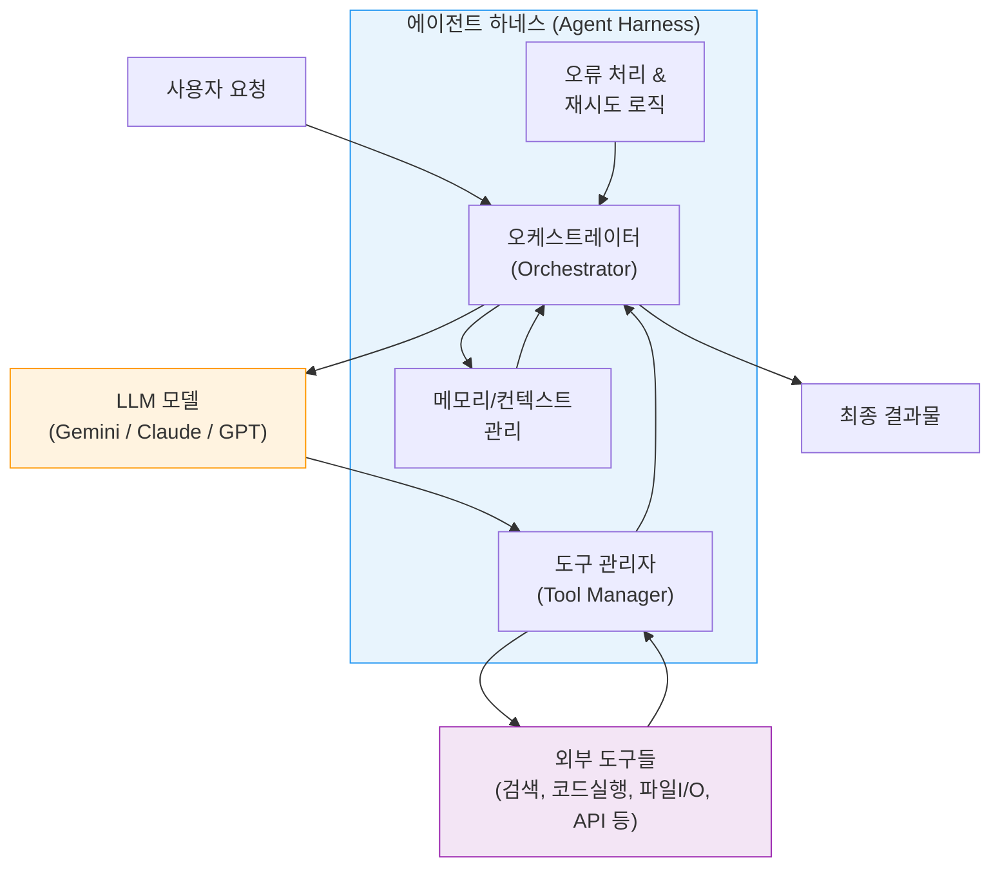
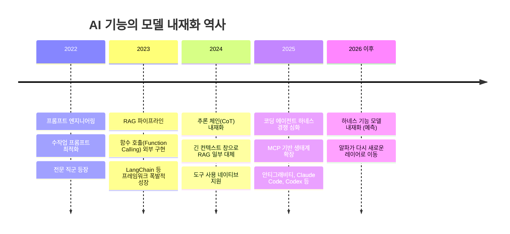
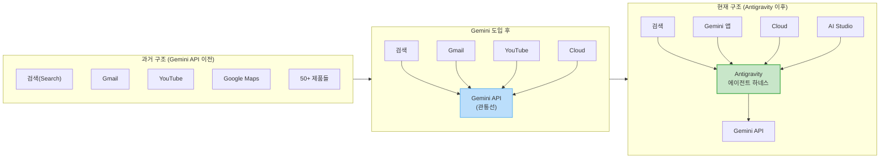
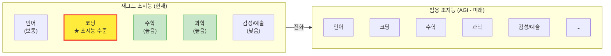
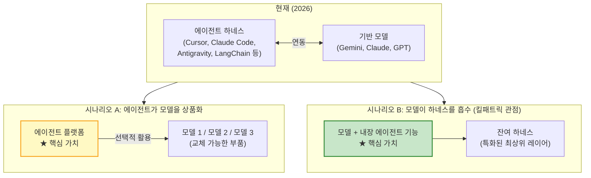

> Sequoia Capital 「Training Data」 팟캐스트 에피소드 88 심층 분석  
> 진행: 소냐 황(Sonya Huang, Sequoia Capital) × 로건 킬패트릭(Logan Kilpatrick, Google DeepMind)  
> 원본 영상: [YouTube](https://youtu.be/cMAs8z2dehs)  
> 원문 기사: [AI타임스](https://www.aitimes.com/news/articleView.html?idxno=212092)

---

## 1. 대화의 맥락: 누가, 왜 이 이야기를 하는가

2026년 6월, 세쿼이아 캐피털(Sequoia Capital)의 팟캐스트 시리즈 「Training Data」 88번째 에피소드가 공개됐다. 게스트는 구글 AI 스튜디오(Google AI Studio)와 제미나이 API(Gemini API) 총괄인 로건 킬패트릭(Logan Kilpatrick)이다. 진행은 세쿼이아의 파트너 소냐 황이 맡았다. 이 대담은 구글 I/O 2026을 막 마친 시점에 녹화됐으며, 에이전트 AI, 코딩 에이전트, 세계 모델(World Model), 그리고 AI 업계의 경쟁 구도를 주제로 약 50분 동안 이어졌다.

이 대화가 주목받는 이유는 단순히 기술적 통찰 때문만이 아니다. 발화자의 위치 자체가 중요하다. 킬패트릭은 구글 딥마인드(Google DeepMind) 내부에서 개발자 에코시스템과 API 제품 전략을 총괄하는 인물이다. 그의 발언은 구글이 AI 업계의 가치 이동을 어떻게 읽고 있는지, 그리고 그에 따라 어떤 전략적 포지셔닝을 택하는지를 드러낸다.

---

## 2. 에이전트 하네스란 무엇인가

현재 AI 업계에서 가장 뜨겁게 논의되는 개념 중 하나가 '에이전트 하네스(Agent Harness)'다. 이 개념을 이해하려면 먼저 단순한 LLM(대형언어모델)과 에이전트 시스템의 차이를 파악해야 한다.

초기의 LLM은 사용자의 입력에 대해 텍스트로 응답을 반환하는 역할에 그쳤다. 하지만 이것만으로는 실제 업무를 수행하기 어렵다. 파일 시스템에 접근하거나, 인터넷을 검색하거나, 코드를 실행하거나, 외부 API를 호출하려면 별도의 제어 구조가 필요하다. 이 제어 구조가 바로 하네스(Harness) 또는 스캐폴딩(Scaffolding)이다.

하네스는 다음과 같은 기능을 수행한다.

- 모델에게 어떤 도구(Tool)를 사용할 수 있는지 알려준다
- 도구 호출 결과를 모델에게 피드백한다
- 작업의 순서와 맥락을 유지하며 오케스트레이션한다
- 멀티 에이전트 환경에서 여러 모델 간 통신을 중계한다
- 오류 발생 시 재시도 로직을 처리한다

최근 몇 년 사이에 등장한 코딩 에이전트(Cursor, Claude Code, Codex, Windsurf 등)와 워크플로 자동화 플랫폼(LangChain, LangGraph, n8n, Zapier 등), MCP(Model Context Protocol) 기반 서비스들이 모두 에이전트 하네스 또는 그 위에서 동작하는 서비스들이다. 현재 스타트업 투자 시장에서는 이 하네스 레이어를 구축하는 기업들에게 막대한 자금이 흘러들고 있다.

---

## 3. "모델이 하네스를 먹어 치운다": 핵심 테제

킬패트릭이 이번 대담에서 제시한 가장 도발적인 주장은 바로 **"The Model Eats the Harness(모델이 하네스를 먹어 치운다)"** 다. 그는 현재 스타트업과 개발사들이 경쟁적으로 구축하고 있는 에이전트 하네스가 장기적으로 모델 자체에 흡수될 것이라고 예측했다.

그의 논리는 다음과 같다. 오늘날 우리가 "모델"이라고 부르는 것은 더 이상 단순한 가중치(Weights) 묶음이 아니다. 모델은 이미 그 가중치를 둘러싼 거대한 시스템 전체를 포함한다. 도구 호출, 함수 실행, 검색 기능, 코드 인터프리터 같은 것들이 그 시스템의 일부로 이미 통합되고 있다.

킬패트릭은 "지금은 모두가 하네스를 구축해야 한다고 생각하고, 그곳에 알파(차별화 가치)가 있다고 믿고 있지만, 12개월 뒤에도 지금과 같은 의미의 하네스가 여전히 중요할 것이라고 생각하지 않는다"고 단언했다. 이어 "모델이 그 기능의 상당 부분을 소화(digest)하게 될 것이며, 결국 모델 내부로 업스트림(upstream)될 것"이라며 "알파는 또 다른 곳으로 이동할 것"이라고 설명했다.

---

## 4. 역사적 선례: 흡수의 패턴

킬패트릭의 주장은 근거 없는 직관이 아니다. AI 기술 발전의 역사는 이 흡수 패턴의 반복으로 이루어졌다.

**프롬프트 엔지니어링(2022~2023)**: 초기에는 올바른 프롬프트를 작성하는 능력이 중요한 기술로 취급되어 별도의 직군(프롬프트 엔지니어)과 프레임워크가 등장했다. 그러나 모델 자체의 성능이 높아지면서 복잡한 프롬프트 없이도 원하는 결과를 얻을 수 있게 됐다.

**검색증강생성(RAG, 2023)**: 모델의 지식 한계를 극복하기 위해 외부 문서를 검색해 문맥으로 제공하는 RAG 파이프라인은 별도의 엔지니어링 작업이 필요했다. 이후 모델들이 더 긴 컨텍스트 창을 갖추고, 웹 검색을 기본 기능으로 통합하면서 RAG 구현의 복잡성이 크게 줄었다.

**함수 호출 및 도구 사용(2023~2024)**: 초기에는 외부 도구를 모델과 연결하려면 복잡한 파싱 로직과 별도의 프레임워크(LangChain 등)가 필요했다. 이제 주요 모델들은 도구 호출을 네이티브 기능으로 지원한다.

**추론 체인(Chain of Thought, 2023~2024)**: 복잡한 문제를 단계별로 나눠 풀도록 유도하는 방법론이 외부 프레임워크 형태로 구현되었지만, 이후 모델 자체의 추론 능력 향상으로 내재화됐다.

킬패트릭은 현재의 에이전트 하네스가 이와 동일한 경로를 걷게 될 것으로 본다.

---

## 5. 구글의 역설: 하네스를 짓는 자가 하네스의 소멸을 예언하다

여기서 즉각적인 반문이 제기된다. 킬패트릭 자신이 몸담은 구글도 현재 에이전트 하네스를 구축하고 있지 않은가? 그 역설을 이해하는 것이 구글의 전략을 파악하는 열쇠다.

구글은 2025년 7월, 코딩 에이전트 스타트업 윈드서프(Windsurf, 모회사 Codeium)의 CEO 바룬 모한(Varun Mohan)과 공동창업자 더글라스 천(Douglas Chen), 그리고 핵심 엔지니어링 팀을 구글 딥마인드로 영입했다. 기술 라이선싱 계약 규모는 약 24억 달러(약 3조 3천억 원)였다. 이 팀이 2025년 11월 제미나이 3(Gemini 3) 출시와 함께 공개한 것이 바로 **안티그래비티(Antigravity)** 다.

안티그래비티는 표면적으로 에이전트 퍼스트 코딩 플랫폼이다. VS Code 포크 기반의 IDE, CLI, SDK, 그리고 2026년 구글 I/O에서 발표된 데스크톱 앱(Antigravity 2.0)으로 구성된다. 커서(Cursor)나 Claude Code와 직접 경쟁하는 개발자 도구처럼 보인다.

그러나 킬패트릭이 강조한 안티그래비티의 진정한 의미는 다르다. 그는 안티그래비티가 **단순한 코딩 도구가 아니라 구글의 모든 제품을 관통하는 공통 에이전트 인프라**라고 설명한다. 과거에는 제미나이 API가 구글의 50여 개 제품을 연결하는 관통선(through line) 역할을 했다. 이제 그 역할은 제미나이 API만이 아니라 안티그래비티 에이전트 하네스로 확장됐다. 검색(Search), 제미나이 앱, 구글 클라우드, AI 스튜디오 모두 동일한 안티그래비티 하네스 위에서 에이전트 기능을 구동한다.

즉, 구글은 지금 하네스를 구축하고 있지만, 그 하네스가 결국 모델 레이어로 흡수되는 미래를 준비하면서, 그 과정의 주도권을 자신이 쥐려는 것이다.

---

## 6. 안티그래비티(Antigravity)의 구체적 모습

2025년 11월 퍼블릭 프리뷰로 공개된 안티그래비티는 2026년 5월 구글 I/O에서 2.0 버전으로 대폭 확장됐다. 핵심 구조는 단일 에이전트 하네스를 네 가지 접근 방식으로 노출한다는 것이다.

**안티그래비티 데스크톱 앱**: 에이전트 오케스트레이션을 위해 새롭게 설계된 독립형 데스크톱 애플리케이션이다. 복수의 서브 에이전트(Subagent)를 병렬로 실행하고 관리하는 '에이전트 매니저' 역할을 한다. IDE가 아니라 에이전트 팀의 관제탑에 가깝다.

**안티그래비티 IDE**: 원래의 VS Code 포크 기반 편집기다. 데스크톱 앱이 나왔지만 IDE 자체는 유지되며, 전통적인 에이전트 보조 코딩 환경을 원하는 개발자를 위한 접근 방식이다.

**안티그래비티 CLI**: Go로 재작성된 터미널 인터페이스로, 제미나이 CLI의 후속이다. GUI 없이 자동화 파이프라인이나 CI 환경에서 에이전트 하네스를 구동할 수 있다.

**안티그래비티 SDK**: 커스텀 에이전트 구축을 위한 프로그래밍 접근 방식이다. 관리형 에이전트(Managed Agent) API를 통해 인프라 작업 없이 에이전트를 호출하거나 세션 간에 재개할 수 있다.

네 가지 접근 방식이 동일한 하네스를 공유하기 때문에, 에이전트 동작의 개선이나 버그 수정이 모든 서피스에 동시에 반영된다. 킬패트릭은 이 구조가 구글이 안티그래비티를 단기적인 실험이 아니라 장기적인 인프라 투자로 바라본다는 신호라고 설명한다.

---

## 7. 에이전트 제미나이(Agentic Gemini) 시대

구글 I/O 2026에서 순다르 피차이(Sundar Pichai) CEO는 현재를 '에이전트 제미나이 시대'라고 선언했다. 킬패트릭은 이 표현이 단순한 마케팅 문구가 아니라고 설명한다. 제미나이 2.0 시절부터 이 개념을 준비해 왔지만 당시에는 다소 시기상조였으며, 제미나이 3.5 시대에 들어서야 실제로 구현되기 시작했다는 것이다.

현재 구글 제품군의 에이전트화 수준에 대해 킬패트릭은 솔직하게 말했다. 전반적으로 보면 아직 '기어 다니는(crawl)' 단계에 가깝다고 했다. 13억 명 이상의 사용자를 가진 제품에서 AI 에이전트를 전면 배치하는 것은 단순한 기술 문제가 아니라 사용자 경험과 신뢰의 문제이기 때문이다. 대부분의 일반 사용자는 AI가 자신을 대신해 모든 것을 하는 것을 아직 원하지 않는다. 그들은 운전석에 앉아 있고 싶어한다.

제미나이 앱이 '걷는(walk)' 단계에 가장 가까운 제품이며, 안티그래비티와 구글 딥마인드(GDM) 내부 연구 팀은 훨씬 더 자율적인 '달리는(run)' 단계의 최전선 실험을 진행 중이라고 했다.

---

## 8. 재그드 초지능(Jagged Superintelligence)

킬패트릭이 이번 대담에서 제시한 또 다른 핵심 개념은 '재그드 초지능(Jagged Superintelligence)'이다. '재그드(Jagged)'는 '들쭉날쭉한', '들쑥날쑥한'이라는 뜻이다.

현재 AI가 모든 분야에서 균일하게 인간을 능가하는 범용 초지능(AGI)에 도달한 것은 아니다. 하지만 특정 수직 영역에서는 이미 인간을 압도하는 수준에 도달했다. 이 현상을 가리켜 킬패트릭은 재그드 초지능이라고 불렀다. AGI처럼 전면적이고 균일한 초지능이 아니라, 마치 들쭉날쭉한 지형처럼 특정 분야에서만 극적으로 솟아오른 형태의 지능이라는 의미다.

코딩이 가장 대표적인 사례다. 킬패트릭은 코딩 에이전트가 이미 좁은 의미의 초지능처럼 느껴진다고 말한다. 코딩 에이전트를 활용하면 이전에는 대규모 팀이 수개월 걸렸을 작업을 훨씬 빠르게 수행할 수 있다. 구글 내부에서도 안티그래비티를 활용한 팀이 기존 어느 팀보다 빠르게 macOS 앱을 완성했다고 소개했다.

그는 수학, 금융, 과학 분야에서도 비슷한 수직적 초지능이 AGI보다 훨씬 먼저 도래할 것이라고 전망했다. 코딩이 먼저 그 선례를 보여줬고, 이것이 다른 도메인으로 확산되는 패턴이 될 것이라는 것이다.

이 재그드 초지능 개념은 AI 도입 전략에도 실질적인 시사점을 준다. 코딩, 수학, 데이터 분석처럼 AI가 이미 초지능 수준에 도달한 분야에서는 인간-AI 협업 방식이 근본적으로 달라질 수 있다. 반면 아직 AI 성능이 낮은 분야에서는 기존 방식을 유지하면서 점진적으로 통합하는 전략이 적절하다.

---

## 9. 야망의 재설정: AI는 인간의 가속기

킬패트릭이 대담 전체를 관통해 강조한 철학적 테제가 있다. **"AI는 인간의 야망을 대체하는 것이 아니라 야망을 가속화하는 촉매제(accelerant)다."**

그는 개발자로서 자신의 경험을 이렇게 묘사했다.

> "나는 이전에는 아이디어를 떠올렸을 때 '아, 있으면 좋겠다'고 생각하고 포기하곤 했습니다. 그런데 지금은 정반대의 문제가 생겼습니다. 아이디어를 생각하면 '이걸 더 야심차게 만들 수 있겠는데'라고 생각하게 됩니다. 기술이 나를 가능하게 하고, 내 야망의 수준을 재설정한다는 사실 자체가 새로운 부담으로 작용할 정도입니다."

이 발언은 AI가 개발자의 일자리를 빼앗는다는 공포와는 정반대의 관점을 제시한다. AI로 인해 개인 개발자가 감당할 수 있는 프로젝트의 규모와 복잡도 자체가 올라가고 있다는 것이다. MVP(최소 기능 제품) 수준으로 마무리하려 했던 프로젝트를 AI 덕분에 훨씬 더 완성도 높은 형태로 구현할 수 있게 됐을 때, 인간은 더 높은 목표를 설정하게 된다.

킬패트릭은 바이브 코딩(Vibe Coding) 환경에서 사람들이 실제로 무엇을 만드는지를 관찰한 경험도 공유했다. 비디오 게임, 안드로이드 앱, 복잡한 인프라 솔루션 등 이전에는 소수의 숙련된 팀만이 구현할 수 있었던 것들이 이제 개인 개발자나 비개발자에게까지 가능해졌다. 그는 2025년 말까지 AI로 비디오 게임을 바이브 코딩하는 것이 일반화될 것이라고 예측했으며, 완전한 AAA급 게임은 아직 아니지만 그 가능성이 점점 현실에 가까워지고 있다고 말했다.

---

## 10. Gemini Omni: 단일 멀티모달 세계 모델

2026년 구글 I/O에서 발표된 **제미나이 옴니(Gemini Omni)** 는 킬패트릭의 하네스 흡수 테제를 멀티모달 영역에서 구현한 사례로 이해할 수 있다.

이전까지 구글은 여러 독립적인 모델을 운용했다. 텍스트 생성에는 제미나이, 이미지 생성에는 이마젠(Imagen), 음악 생성에는 리리아(Lyria), 비디오 생성에는 베오(Veo)가 각각 별도로 존재했다. 이 시스템들을 하나의 파이프라인으로 연결하려면 개발자가 직접 조율 로직을 구현해야 했다.

Gemini Omni는 이 여러 시스템을 단일 모델로 통합한다는 개념에서 출발했다. 2026년 5월 19일 정식 발표된 Gemini Omni(첫 모델명: Gemini Omni Flash)는 텍스트, 이미지, 오디오, 비디오를 입력으로 받아 비디오를 생성하고 편집하는 통합 모델이다. 기존에 Veo가 담당하던 텍스트→비디오 생성을 포함하면서, 여기에 멀티 턴(Multi-turn) 대화를 통한 편집 기능과 기존 영상 편집(Video-in/Video-out) 기능을 더했다.

킬패트릭이 대담에서 설명한 Omni의 핵심 특징은 세 가지다.

첫째, 이 모델은 인간 고유의 콘텐츠(얼굴, 행동, 표정)를 지우거나 대체하지 않는다. 대신 그 콘텐츠 주변의 환경을 조작하고 증폭한다. 예를 들어 사용자가 영상에서 거울을 만지는 장면에서 거울을 액체처럼 흐르게 만들거나, 배경 환경을 바꾸는 방식이다. 인간 중심적인 크리에이티브 보조 도구라는 철학이 담겨 있다.

둘째, 모든 입력 형식을 하나의 추론 루프(forward pass)에서 처리함으로써 모달리티 간 일관성을 유지한다. 기존 파이프라인 방식에서는 각 모델이 독립적으로 동작하기 때문에 맥락이 끊기거나 일관성 문제가 생겼다.

셋째, SynthID 워터마킹과 C2PA(콘텐츠 출처 인증) 메타데이터가 생성 단계부터 포함된다.

VentureBeat는 Gemini Omni를 "멀티모달 생성 스택(텍스트→이미지, 이미지→비디오, 비디오→비디오, 오디오 생성)을 단일 기반 모델과 단일 편집 서피스로 통합하려는 구글의 시도"라고 평가했다(VentureBeat, 2026년 5월).

현재(2026년 6월 기준) Gemini Omni Flash는 구글의 AI Plus 구독($20/월)에서 Gemini 앱, Google Flow, YouTube Shorts를 통해 이용 가능하다. API는 아직 출시 전이다.

---

## 11. 코딩 경쟁: 제미나이 vs. Claude vs. Codex

대담에서 소냐 황은 많은 개발자들이 오랫동안 Claude를 주로 사용해 왔고, 이제 Claude와 Codex를 5대 5로 사용하는 상황인데, 제미나이를 많이 쓴다는 이야기는 잘 들리지 않는다고 지적했다.

킬패트릭은 이에 솔직하게 응했다. 2025년 12월 제미나이 3 출시 당시 "구글이 이겼다"는 서사가 강했지만, 이후 에이전트 코딩 도구들이 빠르게 성장하면서 내러티브가 급격히 바뀌었다고 인정했다. 그는 이것을 "얼마나 빠르게 내러티브가 바뀔 수 있는지에 대한 메타적 교훈"이라고 표현했다.

그가 안티그래비티와 Windsurf 팀 영입을 결정적 이유로 제시한 것은 의미심장하다. 코딩 모델이 실제로 좋아지려면 그 모델을 장기적으로 사용하고 피드백을 주는 제품이 있어야 한다는 것이다. 제품 없이 모델만 개선하는 것에는 한계가 있다. 이것이 구글이 직접 코딩 에이전트 플랫폼을 구축한 이유다.

또한 그는 구글 내부에서 10만 명 이상의 엔지니어가 제미나이 모델을 매일 사용하며 실시간 피드백을 제공하는 '도그푸딩(Dogfooding)' 문화가 강력한 경쟁 우위라고 강조했다. 이 규모의 내부 사용자는 경쟁사가 쉽게 모방하기 어려운 구조적 이점이다.

코딩 모델 분야에서 3.5 Flash는 이전 Pro 모델보다 코딩 성능이 뛰어난 결과를 Flash 모델로 달성했다고 킬패트릭은 소개했다. 이것이 포스트 트레이닝(Post-training) 팀의 성과라는 점에서 더욱 주목할 만하다고 평가했다.

---

## 12. 소프트 테이크오프와 자기 강화 루프

소냐 황은 좋은 에이전트 코딩 모델이 등장하면 AI 연구 진전이 가속화되고, 이것이 또 더 좋은 모델을 만들어내는 자기 강화 루프(Self-reinforcing loop)가 시작될 것이라는 '소프트 테이크오프(Soft Takeoff)' 가설에 대해 물었다.

킬패트릭은 "그 논리가 맞는 것 같지만, 내가 너무 많은 Kool-Aid를 마신 것일 수도 있다"고 유머 있게 답하면서도, 이미 그 징조들이 보이기 시작한다고 말했다. 모델이 출시될 때마다 에이전트가 수행하는 작업의 지속 시간(Task Duration)이 늘어나고 있다는 관찰을 제시했다. "모델 랩들이 '이 모델은 3일 치의 자율 작업을 수행했다'고 발표하는 것이 극단적 사례지만, 실제로도 장기 작업 수행 능력이 빠르게 증가하고 있다"는 것이다.

다만 구글 내부의 연구 역량은 방대하기 때문에 AI 코딩 에이전트가 연구를 가속화하는 방향으로 인적 자원을 돌릴 수 있는 복수의 벡터가 존재한다고 설명했다. 단순히 코딩 속도만이 아니라, 기계 학습 실험 설계, 데이터 정제, 평가 파이프라인 구축 등 다양한 방면에서 에이전트가 기여할 여지가 있다는 것이다.

---

## 13. 제품의 미래: 체류 시간 최적화에서 성과 최적화로

에이전트 AI가 구글 제품 전반에 확산될 때 비즈니스 모델은 어떻게 변화할 것인가? 소냐 황은 에이전트가 이메일을 자동으로 읽고 답장을 보낸다면 사용자가 구글 제품에 머무는 시간 자체가 줄어들지 않겠느냐는 '잠식(cannibalization)' 우려를 제기했다.

킬패트릭의 대답은 명확했다. 구글의 성공은 제품 앞에 사용자의 눈을 최대한 오래 붙잡아두는 것이 아니라, 사용자가 원하는 것을 달성하도록 도와 그들이 본연의 삶으로 돌아가게 하는 것이라고 말했다. 그는 데미스 하사비스(Demis Hassabis)와의 내부 논의에서도 "기술을 구축하는 목적은 그것이 사용자를 대신해 일을 처리하게 하는 것"이라는 공감대가 형성돼 있다고 전했다.

AI 도입이 검색 사용량에 미친 영향도 흥미로운 선례가 된다. 초기에는 AI가 질문에 직접 답해주면 검색이 줄어들 것이라는 우려가 있었지만, 실제로는 AI 도입 이후 검색 사용량이 늘었다. 인간의 검색과 에이전트의 검색이 동시에 증가하는 양의 합산 효과가 나타난 것이다. 킬패트릭은 에이전트 확산도 비슷한 패턴을 보일 것으로 기대한다고 말했다.

'에이전트 주도 성장(Agent-led Growth)'도 언급됐다. 에이전트가 직접 인프라 선택을 결정하고 서비스를 구매하게 되면 광고와 가치 포획의 방식이 달라질 것이다. 킬패트릭은 이것이 SEO가 생성형 엔진 최적화(GEO, Generative Engine Optimization)로 변화하는 패턴과 유사하게 진화할 것으로 봤다.

---

## 14. 구글 딥마인드의 문화: 과학적 엄밀함과 도그푸딩

대담의 후반부에서 구글 딥마인드 내부의 문화가 소개됐다. 킬패트릭이 강조한 핵심 두 가지는 과학적 엄밀함과 도그푸딩이다.

### 14-1. 데미스 하사비스와 과학적 리더십

구글 딥마인드의 공동창업자이자 CEO인 데미스 하사비스(Demis Hassabis) 경(Sir)은 2024년 단백질 구조 예측 AI 알파폴드(AlphaFold) 개발 공로로 노벨 화학상을 수상했다. 공동 수상자는 구글 딥마인드의 존 점퍼(John Jumper) 박사와 워싱턴대 데이비드 베이커(David Baker) 교수다. 알파폴드는 190개국 200만 명 이상의 과학자들이 활용하는 도구가 됐다.

킬패트릭은 하사비스의 노벨상 수상자다운 과학적 엄밀함이 딥마인드의 문화를 형성한다고 설명했다. 문제를 끝까지 파고드는 태도, 성급한 발표보다 실질적 역량을 우선하는 문화, 가장 어려운 문제에 최고의 인재를 투입하는 조직 운영 방식이 딥마인드의 특징이다.

### 14-2. 10만 명의 엔지니어와 도그푸딩

구글 딥마인드의 또 다른 경쟁 우위는 규모다. 구글 전체에 10만 명 이상의 엔지니어가 있고, 이들이 일상 업무에서 제미나이 모델을 사용하며 실시간으로 피드백을 제공한다. A/B 테스트를 실제 사용자 규모로 진행하고, 라이브 실험을 통해 모델을 개선하는 피드백 루프가 돌아간다.

킬패트릭은 다른 모델도 모두 사용해 봐야 생태계가 어떻게 돌아가는지 파악할 수 있다는 점에서 경쟁사 도구 사용을 막지는 않는다고 했다. 그러나 대부분의 엔지니어가 제미나이를 일상적으로 쓰는 것이 이 도그푸딩 피드백 루프를 실질적으로 돌리는 방식이다.

---

## 15. 업계의 상반된 전망: 에이전트 플랫폼 vs. 모델 회귀

킬패트릭의 주장이 설득력 있게 들리지만, 이것이 업계의 통일된 시각은 아니다. 현재 AI 업계에는 상반된 두 가지 전망이 팽팽하게 맞서고 있다.

**전망 1: 에이전트 플랫폼이 모델을 상품화한다**

이 관점에서는 GPT, 제미나이, 클로드 등 여러 기반 모델을 번갈아 사용하는 오케스트레이션 전략이 점점 보편화하면서 모델 자체는 교체 가능한 부품이 된다고 본다. 차별화된 UX, 워크플로우 통합, 사용자 경험이 더 중요한 가치가 된다는 것이다. 커서(Cursor)의 성공이 이 관점을 지지한다. 커서는 특정 모델에 종속되지 않고 여러 모델을 선택적으로 사용하면서도 독자적인 개발자 경험으로 시장을 확보했다.

**전망 2: 모델이 에이전트 기능을 흡수한다 (킬패트릭의 관점)**

이 관점에서는 현재 에이전트 플랫폼이 제공하는 기능들이 결국 모델 내부로 편입되고, 차별화의 중심이 다시 모델과 플랫폼으로 이동한다고 본다. 방대한 사용자 기반과 데이터를 가진 빅테크가 이 전환에서 유리한 위치에 있다.

---

## 16. 전략적 함의: 왜 구글이 이 말을 하는가

킬패트릭의 발언은 단순한 기술 예측이 아니라 구글의 전략적 포지셔닝이기도 하다. 이 배경을 이해하는 것이 중요하다.

구글은 검색, 안드로이드, 크롬, 유튜브, 지메일, 구글 클라우드 등 수십억 명의 사용자를 가진 플랫폼 생태계를 보유하고 있다. 만약 에이전트 기능이 모델 내부로 흡수된다면, 이 거대한 사용자 기반 위에 AI 에이전트 경험을 통합하는 데 구글이 유리한 위치에 있다. 스타트업이 구축한 독립 하네스보다 구글의 통합 에코시스템이 더 강력한 가치를 제공할 수 있기 때문이다.

반면 독립 에이전트 플랫폼이 모델을 상품화하는 시나리오가 현실화된다면, 구글이 가진 모델 역량이 경쟁 우위를 잃게 된다. 킬패트릭의 발언은 그 시나리오보다 자신들이 유리한 시나리오를 공개적으로 선언하는 효과도 갖는다.

따라서 이 발언은 기술적 예측이면서 동시에 구글이 어느 미래에 베팅하고 있는지를 보여주는 전략적 신호로 읽어야 한다.

---

## 17. 종합 정리: 세 가지 핵심 교훈

이번 대담을 통해 확인할 수 있는 핵심 교훈은 세 가지다.

**첫째, 오늘의 차별화는 내일의 범용 기능이 된다.** 에이전트 하네스가 현재 차별화 가치처럼 보이지만, 기술의 역사는 이 가치가 모델 내부로 흡수되는 패턴을 반복해 왔다. 하네스에 집중하는 기업과 개발자는 이 이동 속도를 면밀히 관찰해야 한다.

**둘째, 수직적 초지능이 범용 AGI보다 먼저 온다.** 코딩, 수학, 특정 과학 분야에서 AI가 이미 초지능에 근접한 성능을 보이고 있다. 이 영역에서의 AI 활용 전략은 다른 영역과 달리 훨씬 급진적으로 재설계해야 할 수 있다.

**셋째, AI는 인간의 야망을 낮추지 않는다.** 킬패트릭의 관찰처럼, AI 덕분에 개인이 감당할 수 있는 프로젝트의 복잡도가 높아지면서 인간의 야망 수준이 높아지는 역방향 효과가 나타나고 있다. AI를 '대체'의 위협으로 보는 것보다 '가속기'로 포지셔닝하는 것이 현실에 더 가깝다.

---

## 부록: 안티그래비티(Antigravity) 연혁

| 시점 | 사건 |
|------|------|
| 2025년 7월 | 구글, Windsurf CEO 바룬 모한 및 팀 영입. 기술 라이선스 계약 약 24억 달러 규모 |
| 2025년 11월 18일 | 제미나이 3 출시와 함께 안티그래비티 퍼블릭 프리뷰 공개 |
| 2026년 5월 19일 | 구글 I/O에서 안티그래비티 2.0 발표: 데스크톱 앱, CLI, SDK, 관리형 에이전트 API 추가 |
| 2026년 6월 18일 | 제미나이 CLI 및 제미나이 코드 어시스트 IDE 익스텐션 지원 종료 예정 (안티그래비티 CLI로 마이그레이션) |

## 부록: Gemini Omni 개요

| 항목 | 내용 |
|------|------|
| 발표일 | 2026년 5월 19일 (Google I/O) |
| 최초 공개 모델 | Gemini Omni Flash |
| 입력 형식 | 텍스트, 이미지, 오디오, 비디오 (모든 조합 가능) |
| 출력 형식 | 비디오 (출시 시점 기준 약 10초 클립, 오디오 동기화) |
| 이용 방법 | 구글 AI Plus 구독($20/월) — Gemini 앱, Google Flow, YouTube Shorts |
| API 상태 | 2026년 6월 기준 미출시, 출시 예정 |
| 안전 기능 | SynthID 워터마킹, C2PA 메타데이터 내장 |
| 대비 모델 | Veo 3.1 (텍스트→비디오 개발자 API 유지), Gemini Omni (멀티모달 통합 모델) |

---

*작성일: 2026년 6월 26일*  
*주요 출처: Sequoia Capital 「Training Data」 팟캐스트 E88 공식 트랜스크립트 (sequoiacap.com, 2026년 6월), AI타임스 (2026년 6월 25일), VentureBeat (2025년 12월, 2026년 5월), Google DeepMind 공식 블로그, Wikipedia (Demis Hassabis 항목)*
