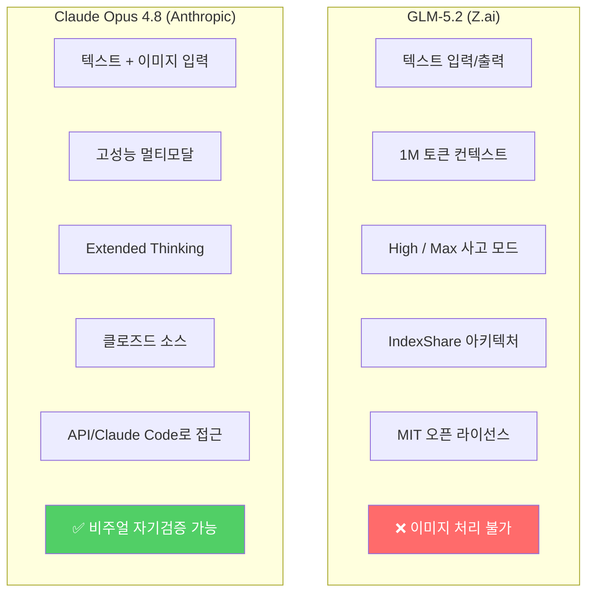
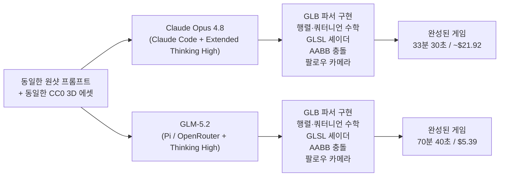
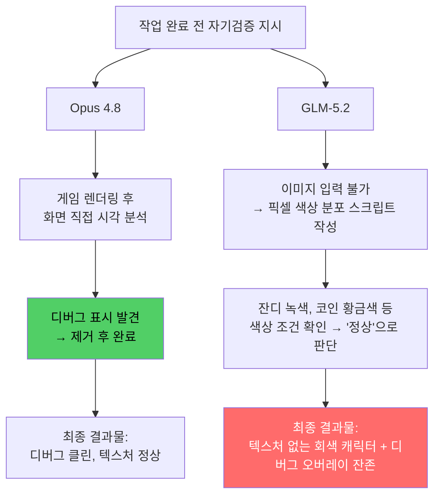
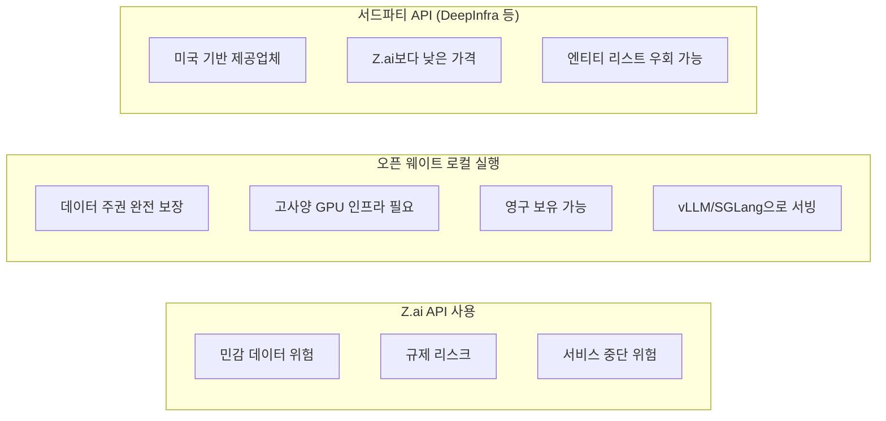

> Z.ai의 최신 오픈 웨이트 모델 GLM-5.2와 Anthropic의 Claude Opus 4.8을 동일한 조건에서 실전 대결시킨 결과를 심층 분석합니다.

---

## 목차

1. [왜 이 비교가 주목받는가](#1-왜-이-비교가-주목받는가)
2. [GLM-5.2란 무엇인가](#2-glm-52란-무엇인가)
3. [가격 구조 비교](#3-가격-구조-비교)
4. [테스트 설계: 왜 3D 플랫폼 게임인가](#4-테스트-설계-왜-3d-플랫폼-게임인가)
5. [빌드 과정과 소요 비용](#5-빌드-과정과-소요-비용)
6. [게임 완성도 비교](#6-게임-완성도-비교)
7. [멀티모달 자기검증 능력의 차이](#7-멀티모달-자기검증-능력의-차이)
8. [버그 분석](#8-버그-분석)
9. [벤치마크 성능 비교](#9-벤치마크-성능-비교)
10. [커뮤니티와 전문가 반응](#10-커뮤니티와-전문가-반응)
11. [실사용자 경험 (GeekNews 댓글 분석)](#11-실사용자-경험-geekews-댓글-분석)
12. [지정학적 리스크와 오픈 웨이트의 가치](#12-지정학적-리스크와-오픈-웨이트의-가치)
13. [결론: 어떤 모델을 선택할 것인가](#13-결론-어떤-모델을-선택할-것인가)

---

## 1. 왜 이 비교가 주목받는가

2026년 6월 13일, 중국 AI 스타트업 Z.ai(구 Zhipu AI)가 GLM-5.2를 공개하자 AI 커뮤니티가 들끓었다. 단순한 새 모델 출시가 아니라, MIT 라이선스로 공개된 오픈 웨이트 모델이 Anthropic의 최상위 유료 모델인 Claude Opus 4.8에 근접한 성능을 보여준다는 주장이 제기되었기 때문이다.

오픈 웨이트와 클로즈드 모델 간의 격차가 좁아지는 현상은 이미 수개월간 관찰되어 왔지만, GLM-5.2의 등장은 그 흐름을 더욱 가속화하는 사건으로 평가받는다. Artificial Analysis의 분석에 따르면 GLM-5.2는 Intelligence Index v4.1에서 51점을 기록하며 오픈 웨이트 모델 1위에 올랐고, 이는 MiniMax-M3(44점), DeepSeek V4 Pro(44점), Kimi K2.6(43점)을 모두 앞지른 수치다.

techstackups.com은 이 두 모델을 단순한 벤치마크 수치가 아닌 실전 과제로 직접 대결시켰다. 두 모델에게 동일한 원샷(one-shot) 프롬프트를 주고, 게임 엔진이나 Three.js 같은 3D 렌더링 라이브러리 없이 raw WebGL로 브라우저용 3D 플랫폼 게임을 처음부터 만들게 하는 방식이었다. 그 결과는 단순히 "어느 모델이 더 낫다"는 결론을 넘어, 두 모델의 근본적인 설계 철학과 한계를 드러내 보여주었다.

---

## 2. GLM-5.2란 무엇인가

### 2.1 모델 개요

GLM-5.2는 Z.ai(베이징 소재, 청화대학교 스핀오프, 2019년 창립)가 개발한 최신 플래그십 모델이다. 753억 개(753B)의 파라미터를 가지며, MIT 오픈소스 라이선스로 가중치가 공개되었다. Hugging Face와 ModelScope에서 다운로드할 수 있으며, vLLM, SGLang, Transformers 등 주요 추론 프레임워크와 호환된다.

핵심 설계 목표는 단일 대화형 질의응답이 아닌 **장시간 다단계 자율 에이전트 작업(long-horizon tasks)** 이다. 대규모 코드베이스 구현, 자동화 연구, 성능 최적화 등 수 시간에 걸쳐 진행되는 복잡한 에이전트 워크플로에 특화되어 있다.

### 2.2 기술적 특징

GLM-5.2는 1백만 토큰(1M token) 컨텍스트 창을 제공하며, 이를 단순한 길이 확장이 아닌 실질적으로 활용 가능한 안정적 컨텍스트로 구현했다는 점이 특징이다. 수개월간 장기 코딩 에이전트 시나리오에 특화된 훈련을 거쳐, 장시간 복잡한 코딩 에이전트 실행 흐름에서도 안정적인 성능을 유지한다.

핵심 아키텍처 혁신은 **IndexShare**이다. 표준 대형 언어 모델에서 긴 문서에 대한 어텐션 메커니즘 재계산은 계산 비용이 매우 높은데, IndexShare는 4개의 희소 어텐션(DSA) 레이어마다 동일한 경량 인덱서를 재사용함으로써 1M 토큰 컨텍스트 길이에서 토큰당 연산(FLOPs)을 2.9배 줄인다. 또한 투기적 디코딩(speculative decoding)을 위한 개선된 다중 토큰 예측(MTP) 레이어를 탑재하여 수용 토큰 길이를 최대 20% 향상시켰다.

사고(thinking) 수준은 **High**와 **Max** 두 단계로 제공되며, 속도와 능력 사이의 균형을 조절할 수 있다. 이번 테스트에서는 High 모드를 사용했으며, Max 모드는 더 높은 성능을 제공하지만 더 많은 토큰과 시간을 소모한다.

### 2.3 결정적 한계: 텍스트 전용 모델

GLM-5.2가 가진 가장 중요한 기술적 한계는 **텍스트 전용** 모델이라는 점이다. Claude Opus 4.8과 달리 이미지를 입력으로 받을 수 없다. 이는 단순한 기능 부재가 아니라, 자율 에이전트 워크플로에서 실질적인 작업 품질 차이로 이어지는 구조적 문제다. 이 한계가 어떤 결과를 낳는지는 7절에서 상세히 다룬다.

---

## 3. 가격 구조 비교

GLM-5.2가 주목받는 핵심 이유 중 하나는 파격적인 가격이다. Z.ai 공식 문서 기준 토큰당 가격은 다음과 같다.

| 구분 | 입력 토큰 (1M당) | 캐시 읽기 (1M당) | 출력 토큰 (1M당) |
|------|-----------------|-----------------|-----------------|
| Claude Opus 4.8 | $5.00 | $0.50 | $25.00 |
| GLM-5.2 (Z.ai) | $1.40 | $0.26 | $4.40 |
| GLM-5.2 (DeepInfra) | $0.95 | — | $3.00 |

출력 토큰 기준으로 GLM-5.2는 Opus 4.8 가격의 약 5분의 1 수준이다. DeepInfra를 통해 이용하면 더욱 저렴해진다. 이 가격 차이는 단순한 숫자가 아니라 실전 대규모 에이전트 작업에서 수십 배의 비용 절감으로 현실화된다.

다만 구독형 플랜 관점에서 보면 그림이 다소 달라진다. Z.ai의 GLM Coding Plan은 월 $12.60부터 시작하며, 20개 이상의 서드파티 코딩 환경에서 이용 가능하다. 그러나 GeekNews 댓글에서 일부 사용자들이 지적하듯, 개인 구독 조건에서는 Claude나 OpenAI Codex 대비 단순 비교가 쉽지 않으며, 실질적인 사용량 기준으로는 Codex가 여전히 유리하다는 의견도 있다.

---

## 4. 테스트 설계: 왜 3D 플랫폼 게임인가

techstackups.com이 선택한 테스트 과제는 raw WebGL로 브라우저용 3D 플랫폼 게임을 처음부터 구현하는 것이었다. 이 과제 선택에는 분명한 이유가 있다.

AI 모델에게 단순한 랜딩 페이지나 CRUD 웹앱을 만들게 하는 것은 더 이상 유의미한 테스트가 되지 않는다. 이미 수많은 모델이 이를 쉽게 해낼 수 있기 때문이다. 반면 raw WebGL 3D 플랫폼 게임은 다음과 같은 복잡한 기술 요소를 동시에 요구한다.

- **GLB 바이너리 파서**: 3D 모델 파일을 직접 파싱하는 코드를 구현해야 한다.
- **행렬·벡터 수학**: 행렬(matrix)과 쿼터니언(quaternion) 수학을 직접 구현해야 한다.
- **GLSL 셰이더**: 스키닝된 골격 애니메이션을 위한 GPU 셰이더를 작성해야 한다.
- **고정 타임스텝 루프**: 물리 시뮬레이션을 안정적으로 구동하는 루프 구조가 필요하다.
- **충돌 처리(AABB)**: 캐릭터가 플랫폼을 통과하지 않도록 서브스텝 AABB 충돌을 구현해야 한다.
- **팔로우 카메라**: 캐릭터를 따라다니는 3인칭 카메라 시스템이 필요하다.

이 구조는 에이전트 능력의 두 가지 핵심 측면을 동시에 평가한다. 수십 개의 파일로 이루어진 다단계 빌드를 일관되게 유지하는 능력은 GLM-5.2가 강점을 주장하는 **에이전트 장기 일관성** 영역이고, 렌더러 내부의 세밀한 오류를 잡아내는 능력은 Opus가 우위를 보이는 **추론과 정확성** 영역이다.

두 모델에게는 동일한 원샷 프롬프트, 동일한 CC0 에셋(Kenney Platformer Kit), 그리고 힌트 없는 단일 시도 기회가 주어졌다. Opus 4.8은 Claude Code 환경에서 extended thinking(High) 모드로, GLM-5.2는 Pi 클라이언트를 통해 OpenRouter 경유로 High 사고 모드에서 실행되었다.

---

## 5. 빌드 과정과 소요 비용

두 모델의 빌드 결과를 수치로 정리하면 다음과 같다.

| 지표 | GLM-5.2 (Pi/OpenRouter) | Claude Opus 4.8 (Claude Code) |
|------|------------------------|-------------------------------|
| 벽시계 기준 빌드 시간 | 1시간 10분 40초 | 33분 30초 |
| 출력 토큰 수 | 131,000 | 216,809 |
| 최대 컨텍스트 사용률 | 1M의 16% | (최대 컨텍스트의) 19% |
| 도구 호출 횟수 | 128회 | 153회 |
| 실제 비용 | $5.39 (실청구액) | ~$21.92 (정가 기준 추정치) |

숫자가 말해주는 이야기는 흥미롭다. Opus는 GLM-5.2보다 더 많은 출력 토큰과 더 많은 도구 호출을 사용했음에도 약 절반의 시간에 작업을 완료했다. 이는 Opus가 개별 도구 호출마다 더 정확한 판단을 내려 불필요한 반복이나 수정 작업을 줄였기 때문으로 해석된다.

반면 GLM-5.2는 도구 호출 횟수는 더 적었지만 전체 빌드 시간은 두 배 이상 걸렸다. 커뮤니티 반응에서 일부 사용자들이 지적하듯, GLM-5.2는 탐색과 계획 단계에서 샛길로 돌아가는 경향이 있으며, 생성 속도 자체도 Opus에 비해 느린 편이다.

비용 면에서는 GLM-5.2가 압도적으로 유리하다. Opus 대비 약 4분의 1 수준의 비용으로 동일한 과제를 완료했다. 장기적으로 수백 번의 에이전트 실행이 필요한 대규모 프로젝트라면, 이 비용 차이는 결코 무시할 수 없다.

---

## 6. 게임 완성도 비교

두 모델이 제출한 결과물은 플레이 가능한 3인칭 3D 플랫폼 게임이었다. 조작 체계는 동일하게 구현되었다. WASD 또는 방향키로 이동하고, Space로 점프하며, Shift로 달리고, 마우스 드래그로 카메라를 회전하며 마우스 휠로 줌을 조절한다. 목표도 동일하게 코인을 수집하고 스파이크를 피해 깃발에 도달하는 것이며, 맵 밖으로 떨어지면 시작점으로 돌아온다.

### 6.1 GLM-5.2의 게임

GLM-5.2가 만든 게임은 전체적으로 거친 완성도를 보였다. 몇 가지 눈에 띄는 문제가 있었다. 캐릭터가 올바른 방향으로 이동하지만 모델 자체가 반대 방향을 바라보는 상태로 걸어 다닌다. 텍스처가 누락되어 캐릭터가 회색 단색으로 렌더링된다. Kenney 모델은 별도 파일에 저장된 공유 색상 팔레트를 참조하는 구조인데, GLM-5.2의 렌더러가 해당 파일을 로드하지 않아 단색으로 대체된 것이다. 카메라가 움직일 때마다 캐릭터의 머리가 사라지는 현상도 발생했다.

스파이크 함정에 캐릭터가 접촉해도 죽음 판정이 발생하지 않으며 리셋도 이루어지지 않는다. 깃발에 도달해도 승리 조건이 발동하지 않는 것처럼 보였지만, 이는 이후 수정이 필요한 사항이었다. 실제로는 모든 코인을 먼저 수집해야 깃발이 활성화되는 구조였는데, 최초 플레이테스트에서 이 조건을 놓쳤다.

한 가지 잘 작동한 요소는 스프링이었다. 스프링 위에 올라서면 캐릭터가 다음 플랫폼까지 튀어 오르는 메커니즘은 정확히 구현되었다.

### 6.2 Claude Opus 4.8의 게임

Opus가 만든 게임은 눈에 띄게 더 완성도가 높았다. 카메라와 컨트롤러가 정상적으로 작동했고, 텍스처가 제대로 적용되어 캐릭터가 풍부한 외관을 갖추었다. 스파이크 함정이 플레이어를 죽이는 로직이 올바르게 구현되었으며, 깃발에 도달하면 승리 조건이 발동하는 명확한 게임 루프를 완성했다.

남아 있는 버그들은 기본 기능 문제라기보다는 엣지 케이스에 가까웠다. 플랫폼 끝에서 발을 디딘 직후에도 잠시 공중에 서 있을 수 있는 현상이 있었는데, 이는 플랫폼 게임에서 자주 사용되는 '코요테 타임(coyote-time)' 유예 시간이 약간 길게 설정된 결과였다. 깃발에 상당히 멀리 떨어진 위치에서도 승리 조건이 발동하는 문제도 있었다.

---

## 7. 멀티모달 자기검증 능력의 차이

이번 테스트에서 가장 극적인 차이를 드러낸 부분은 두 모델이 자신의 작업 결과를 어떻게 검증했는가이다. 두 모델 모두 작업 완료 전에 결과물을 검증하라는 지시를 받았다.

### 7.1 Opus의 시각적 자기검증

Opus는 멀티모달 모델이므로 게임을 렌더링한 후 캡처된 화면을 직접 시각적으로 검사할 수 있었다. 실제 세션 기록에서 Opus는 화면을 확인하고 블록, 계단, 코인, 보석, 스파이크, 깃발, 캐릭터, 점수 HUD, 조명과 지오메트리 상태를 직접 확인하는 과정을 거쳤다. 이 과정에서 화면에 남아 있던 디버그 표시를 발견하고 제거한 뒤 작업을 마무리했다.

### 7.2 GLM-5.2의 픽셀 색상 우회법

GLM-5.2는 이미지를 읽을 수 없으므로 근본적으로 다른 전략을 취해야 했다. 모델은 렌더링된 화면의 원시 픽셀 데이터를 읽고 색상이 예상대로 분포하는지 확인하는 스크립트를 직접 작성하는 우회법을 택했다. 최종 보고서에서 GLM-5.2는 저장된 화면 파일을 분석하여 잔디 녹색, 흙 갈색, 코인 황금색, 깃발 적색, 캐릭터 청색계, half-Lambert 조명, 검정 없음 등의 색상 조건을 확인했다.

색상 분포는 대략 기대 범위에 들어 있었으므로 GLM-5.2는 게임이 정상적으로 완성되었다고 판단하고 작업을 종료했다. 그러나 실제 화면에는 캐릭터에 텍스처가 적용되지 않아 회색으로 보이는 상태였고, 디버그 오버레이가 여전히 화면 위에 남아 있었다. 색상 분포 확인만으로는 이러한 시각적 품질 문제를 감지할 수 없었던 것이다.

이 사례는 단순히 "이미지를 볼 수 있느냐 없느냐"의 기능 차이가 아니다. 시각적 결과물이 요구되는 에이전트 워크플로에서, 자신이 만든 결과물을 직접 볼 수 없는 모델은 구조적으로 자기수정 능력에 한계를 가질 수밖에 없다는 근본적인 문제를 드러낸다.

---

## 8. 버그 분석

### 8.1 GLM-5.2의 버그: 기본 기능 오류

GLM-5.2의 버그들은 폴리시(polish) 문제가 아닌 기본 기능 구현 오류에 해당하는 것들이었다.

**캐릭터 방향 반전**: 캐릭터가 이동 방향과는 반대로 모델이 돌아서 있는 상태로 걷는다. 이동 방향 계산은 맞지만 모델 방향 설정에 오류가 있다.

**텍스처 누락과 머리 사라짐**: Kenney의 3D 모델은 텍스처를 별도 공유 팔레트 파일에서 참조하는 구조인데, GLM-5.2의 렌더러는 이 파일을 로드하지 않아 캐릭터가 단색으로만 렌더링된다. 카메라가 움직일 때 캐릭터의 머리 메시가 사라지는 현상은 렌더링 파이프라인의 깊이 버퍼 또는 LOD 처리 오류로 보인다.

**스파이크 충돌 미작동**: 스파이크 함정에 캐릭터가 닿아도 죽음 판정이 발생하지 않는다. 충돌 감지 자체는 구현되어 있으나 스파이크 오브젝트와의 상호작용 로직이 연결되지 않은 상태다.

**디버그 오버레이 잔존**: FPS, 위치 좌표, grounded 상태 등을 표시하는 디버그 오버레이가 최종 결과물에도 그대로 남아 있다. 이는 앞서 설명한 자기검증 실패의 직접적인 결과다.

### 8.2 Opus 4.8의 버그: 엣지 케이스

Opus의 버그들은 성격이 다르다. 기본 기능은 정상 작동하며, 세밀한 파라미터 조정이 필요한 엣지 케이스들이다.

**코요테 타임 과다 설정**: 플랫폼 끝에서 발을 디딘 직후에도 공중에 잠시 서 있을 수 있는 현상이 발생한다. 이는 플랫폼 게임에서 조작감 향상을 위해 의도적으로 구현하는 '코요테 타임(coyote-time)' 기능이 다소 길게 설정된 것이다. 있어야 할 기능이 약간 과하게 구현된 것이므로, 없는 기능이 작동하지 않는 GLM-5.2의 버그와는 근본적으로 다르다.

**깃발 충돌 범위 과다**: 깃발에서 상당히 떨어진 위치에서도 승리 조건이 발동된다. 충돌 감지 반경이 실제 깃발 모델보다 크게 설정된 결과다.

---

## 9. 벤치마크 성능 비교

Z.ai가 모델 카드를 통해 공개한 벤치마크와 ArtificialAnalysis의 독립적인 평가 결과를 종합하면 다음과 같다.

### 9.1 추론 벤치마크

| 벤치마크 | GLM-5.2 | Opus 4.8 | GPT-5.5 | Gemini 3.1 Pro |
|----------|---------|----------|---------|----------------|
| HLE | 40.5 | **49.8** | 41.4 | 45.0 |
| HLE (w/ tools) | 54.7 | **57.9** | 52.2 | 51.4 |
| AIME 2026 | **99.2** | 95.7 | 98.3 | 98.2 |
| GPQA-Diamond | 91.2 | **93.6** | **93.6** | 94.3 |
| IMOAnswerBench | **91.0** | 83.5 | — | 81.0 |

HLE(Humanity's Last Exam)는 다양한 분야의 전문가 수준 문제를 포함하는 포괄적 추론 벤치마크다. Opus가 전반적으로 앞서지만, 수학 경시대회 성격의 AIME 2026과 수학 올림피아드 스타일의 IMOAnswerBench에서는 GLM-5.2가 오히려 우위를 보인다.

### 9.2 코딩 벤치마크

| 벤치마크 | GLM-5.2 | Opus 4.8 | GPT-5.5 | Gemini 3.1 Pro |
|----------|---------|----------|---------|----------------|
| SWE-bench Pro | 62.1 | **69.2** | 58.6 | 54.2 |
| NL2Repo | 48.9 | **69.7** | 50.7 | 33.4 |
| DeepSWE | 46.2 | 58.0 | **70.0** | 10.0 |
| ProgramBench | 63.7 | **71.9** | 70.8 | 39.5 |
| Terminal Bench 2.1 (Terminus-2) | 81.0 | **85.0** | 84.0 | 74.0 |
| Terminal Bench 2.1 (best harness) | 82.7 | 78.9 | 83.4 | 70.7 |
| SWE-Marathon | 13.0 | **26.0** | 12.0 | 4.0 |

코딩 영역에서는 대부분의 벤치마크에서 Opus가 우위를 보인다. 특히 NL2Repo(단일 명세서로부터 완전한 코드베이스를 빌드하는 능력)와 SWE-Marathon(초장기 엔지니어링 작업)에서 격차가 크다. 단, Terminal Bench 2.1의 "best harness" 행에서는 GLM-5.2가 역전된다. 이는 실행 환경(harness)의 설계가 성능에 영향을 미친다는 점에서 흥미로운 결과다.

### 9.3 에이전트 벤치마크

| 벤치마크 | GLM-5.2 | Opus 4.8 | GPT-5.5 | Gemini 3.1 Pro |
|----------|---------|----------|---------|----------------|
| MCP-Atlas (public) | 76.8 | **77.8** | 75.3 | 69.2 |
| Tool-Decathlon | 48.2 | **59.9** | 55.6 | 48.8 |

MCP 서버를 통한 도구 사용 능력을 평가하는 MCP-Atlas에서 GLM-5.2(76.8)와 Opus(77.8)의 차이는 1점에 불과하다. 장시간 다단계 도구 호출이 필요한 Tool-Decathlon에서는 Opus가 상당한 우위를 보인다.

### 9.4 벤치마크 결과 종합

```mermaid
xychart-beta
    title "주요 벤치마크 비교 (GLM-5.2 vs Opus 4.8)"
    x-axis ["HLE", "AIME 2026", "SWE-bench Pro", "NL2Repo", "SWE-Marathon", "Tool-Decathlon"]
    y-axis "점수" 0 --> 100
    bar [40.5, 99.2, 62.1, 48.9, 13.0, 48.2]
    bar [49.8, 95.7, 69.2, 69.7, 26.0, 59.9]
```

독립 벤치마크 기관인 Artificial Analysis의 Intelligence Index v4.1에서 GLM-5.2는 51점으로 전체 4위, 오픈 웨이트 모델 중 1위를 기록했다. VibeCodeBench에서는 63.96%를 달성해 GLM-5.1의 31.46%에서 큰 폭으로 향상되었으며, Code Arena: Frontend에서는 Max 모드로 1595점을 기록해 모든 Claude Opus 변형을 능가했다.

---

## 10. 커뮤니티와 전문가 반응

### 10.1 Simon Willison: "가장 강력한 텍스트 전용 오픈 웨이트 LLM"

거의 모든 주요 모델 출시를 분석해온 AI 리서처 Simon Willison은 GLM-5.2를 "아마도 현재 존재하는 가장 강력한 텍스트 전용 오픈 웨이트 LLM"이라고 평가했다. 그의 표준 테스트인 SVG 생성 과제에서 GLM-5.2는 자전거를 타는 펠리컨을 완전히 애니메이션된 형태로 생성하며 깨진 부분 없이 완성도 높은 결과를 냈다. 다만 두 번째 테스트인 스쿠터를 탄 주머니쥐 SVG는 이전 버전 GLM-5.1보다 오히려 낮은 품질을 보여, 성능이 과제 유형에 따라 일관하지 않음을 드러냈다.

### 10.2 Artificial Analysis: 오픈 모델 1위, 그러나 토큰 소모 과다

Artificial Analysis는 GLM-5.2를 비용 대비 지능 프런티어에서 해당 성능 수준에서 가장 저렴한 모델로 평가했다. 단, 작업당 약 43k 출력 토큰을 사용하는 높은 토큰 소모가 문제로 지적되었다. GLM-5.1이 작업당 26k 토큰을 사용했던 것과 비교하면 65% 증가한 수치다. 많은 생각(reasoning) 과정이 출력 토큰으로 소비되는 구조이므로, 실제 운영 비용 계산 시 이 점을 반드시 고려해야 한다.

### 10.3 Nathan Lambert: 오픈-클로즈드 격차는 좁아지고 있다

Allen Institute for AI에서 오픈 웨이트 모델을 전문적으로 추적하는 Nathan Lambert는 LMArena 리더보드 결과를 바탕으로 "GLM-5.2가 Gemini보다 나은 에이전트라고 볼 수도 있다"고 평가하며, MIT 라이선스 오픈 모델로서 "진지한 성취(serious accomplishment)"라고 칭했다. 그는 더 넓은 맥락에서 중국 연구소들이 미국 최상위 모델들에 비해 훨씬 적은 컴퓨팅으로 이 성능 수준에 도달하고 있다는 점을 강조했다. 독립 분석가들은 현재 미국 클로즈드 모델과 중국 오픈 모델 간의 프런티어 격차를 약 7개월 수준으로 평가한다.

---

## 11. 실사용자 경험 (GeekNews 댓글 분석)

GeekNews에 올라온 한국어 사용자들의 실사용 경험과 Hacker News 원문 댓글을 통해 실제 개발자들의 현장 관점을 살펴볼 수 있다.

**하네스 차이 지적**: 한 사용자는 이번 테스트가 Opus를 Claude Code로 실행하고 GLM-5.2를 Pi로 실행해 실행 환경이 다르다는 점을 지적했다. GLM-5.2가 Claude 호환 레이어를 지원하므로 동일 하네스로 실행했어야 더 공정한 비교가 가능했을 것이라는 의견이었다. 이 점은 테스트 설계의 한계로 인정될 수 있으며, 하네스 선택이 최종 성능에 미치는 영향은 Terminal Bench 2.1의 "best harness" 결과에서도 이미 확인된 바 있다.

**실제 사용 경험**: 여러 사용자들이 GLM-5.2를 실제 프로젝트에 투입해본 경험을 공유했다. Swift+Zig 코드베이스에서 렌더링 최적화를 위해 GLM-5.2를 사용한 사례에서, 모델은 탐색과 계획 단계에 상당한 시간을 썼지만 최종적으로 세 곳의 병목을 최적화했으며 구현 품질은 GPT-5.5보다 더 관용적이고 비침투적이었다는 평가가 있었다. 다만 "코드를 쓰기 시작하기까지 시간이 걸리고 빠른 모델은 아니다"라는 점이 공통적으로 지적되었다.

**병렬 실행 전략**: GLM-5.2의 느린 속도를 극복하기 위해 격리 컨테이너 안에서 여러 인스턴스를 병렬 실행하는 구성을 준비하게 되었다는 사용자 경험도 있었다. 단일 인스턴스 속도가 느리더라도 병렬 실행으로 전체 처리량을 높일 수 있다는 접근이다.

**원샷 테스트의 한계에 대한 의견**: Hacker News에서는 원샷 테스트 방식 자체에 대한 비판적 시각도 제기되었다. 사람이 검토한 명세와 가드레일 안에서 에이전트가 목표를 완료하는지, 조종 가능성(steerability)은 어떤지, 신뢰성은 어떤지를 검증하는 것이 더 현실적인 에이전트 평가 방법이라는 의견이 있었다. 테스트 원저자도 이에 동의하며, 이번 테스트는 공식 벤치마크가 아닌 "바이브 테스트"임을 인정했다.

---

## 12. 지정학적 리스크와 오픈 웨이트의 가치

GLM-5.2를 논할 때 기술적 성능 외에 반드시 짚어야 할 맥락이 있다.

### 12.1 Z.ai의 규제 리스크

Z.ai(구 Zhipu AI)는 2025년 1월 미국 산업안보국(BIS) 엔티티 리스트에 등재되었다. AI 개발 및 통합을 통해 중국 군사 현대화를 지원한다는 이유였다. OpenAI의 2025년 6월 분석에 따르면, Zhipu의 경영진은 리창 총리를 포함한 중국 공산당 관료들과 정기적으로 접촉하며, 회사에 대한 국가 지원 투자액은 14억 달러 이상으로 추정된다. 또한 2025년 5월 중국 공안 계열 사이버보안신고센터는 Zhipu의 소비자 앱이 사용자 동의 범위를 초과하는 데이터를 수집한다고 지적했다.

이는 GLM-5.2의 Z.ai API를 통해 민감한 데이터를 처리하는 워크플로에서는 명백한 위험 요인이다. 특히 유럽 기업들의 경우 데이터 주권 규정 준수 문제가 추가된다.

### 12.2 오픈 웨이트의 전략적 가치

그러나 오픈 웨이트 모델이라는 특성은 이 리스크에 대한 해답을 동시에 제공한다. 모델 가중치를 직접 다운로드해 자체 인프라에서 실행하면 어떤 데이터도 Z.ai 서버를 통과하지 않는다. 이는 Z.ai API를 사용하는 것과 근본적으로 다른 보안 프로파일을 가진다.

techstackups.com이 기사에서 언급한 Claude Fable의 갑작스러운 공개 철회 사례는 클로즈드 모델의 또 다른 리스크를 보여준다. Anthropic이 공개 배포를 제한하기로 결정하면 기업들은 갑자기 핵심 도구를 잃게 된다. 반면 이미 다운로드된 오픈 웨이트는 어떤 회사도 회수할 수 없다. 이는 특히 AI를 핵심 인프라로 운영하는 기업들에게 전략적으로 중요한 가치다.

---

## 13. 결론: 어떤 모델을 선택할 것인가

이번 실전 테스트와 벤치마크, 그리고 커뮤니티 반응을 종합하면 다음과 같은 사용 가이드라인을 도출할 수 있다.

**GLM-5.2를 선택하는 상황**은 다음과 같다. 작업이 텍스트와 코드 중심이며 시각적 결과물 검증이 불필요한 경우, API 비용 최적화가 중요한 대규모 에이전트 파이프라인, 데이터 주권이나 공급업체 종속 위험을 피하기 위해 로컬 실행이 필요한 경우, 그리고 수학 올림피아드나 알고리즘 추론처럼 GLM-5.2가 특히 강점을 보이는 영역이 해당된다.

**Claude Opus 4.8을 선택하는 상황**은 다음과 같다. 시각적 결과물(UI, 그래픽, 렌더링)을 포함한 작업에서 자기검증이 필요한 경우, 실시간 피드백 루프로 빠른 결과가 중요한 경우, 복잡한 다파일 코드베이스 수정이나 장기 엔지니어링 작업에서 더 높은 정확도가 요구되는 경우, 그리고 기업 데이터 보안 정책상 중국 기반 모델을 사용할 수 없는 환경이 해당된다.

테스트 원저자의 최종 평가를 빌리자면, GLM-5.2는 Opus를 대체할 주력 모델이 아니다. 오히려 "저렴하고 항상 접근 가능한 강력한 보조 모델"에 가깝다. 비용에 민감한 대규모 작업이나, 클로즈드 소스 모델에 의존할 수 없는 상황에서 GLM-5.2는 진지하게 고려할 만한 실질적인 대안이다. 두 모델은 경쟁자이면서 동시에 서로 다른 트레이드오프를 가진 보완적 도구로 기능할 수 있다.

오픈 웨이트 AI의 수준이 이만큼 올라왔다는 사실 자체가, AI 에코시스템이 특정 클로즈드 공급업체에 종속되지 않아도 되는 방향으로 진화하고 있음을 보여준다.

---

## 참고 자료

- techstackups.com, ["GLM 5.2 vs Opus"](https://techstackups.com/comparisons/glm-5.2-vs-opus/) (원문 테스트 리포트)
- GeekNews (news.hada.io), [topic?id=30728]( https://news.hada.io/topic?id=30728), 커뮤니티 토론
- Z.ai 공식 개발자 문서 (docs.z.ai)
- VentureBeat, "Z.ai's open-weights GLM-5.2 beats GPT-5.5 on multiple long-horizon coding benchmarks for 1/6th the cost" (2026년 6월)
- DataCamp, "GLM-5.2: Features, Setup, Benchmarks, and Model Switching Guide" (2026년 6월)
- TechTimes, "GLM 5.2 Open Weights Live: Top Coding Benchmark, but API Use Carries China Data Risk" (2026년 6월)
- kie.ai, "GLM-5.2 Benchmark Deep Dive: Open-Weight Frontier" (2026년 6월)
- Artificial Analysis Intelligence Index v4.1

---

*작성일: 2026년 6월 27일*
