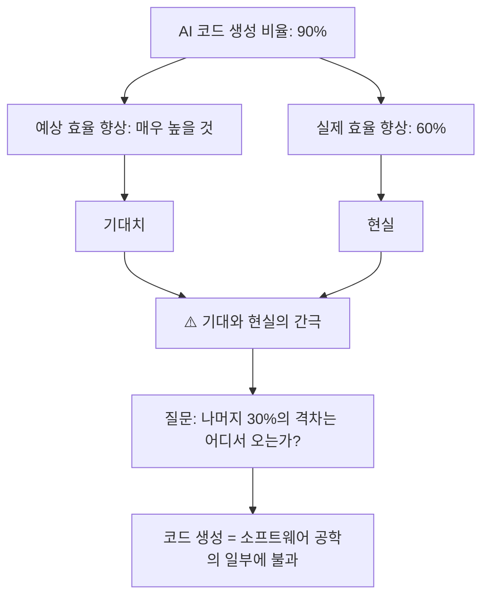
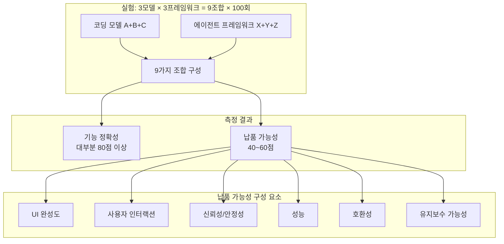
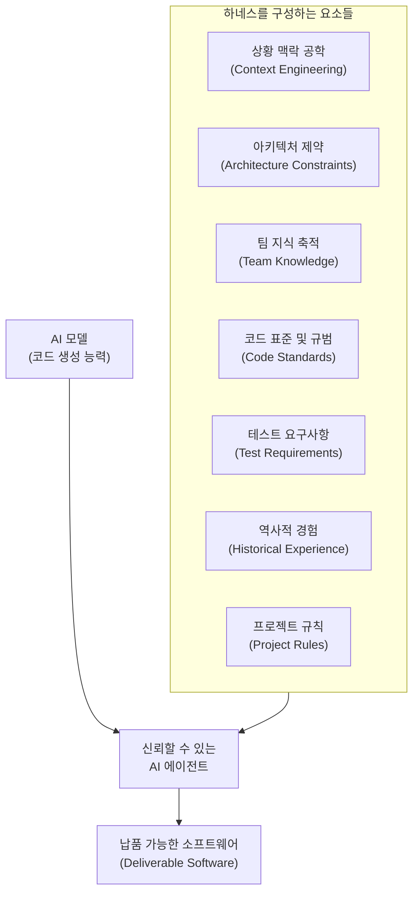
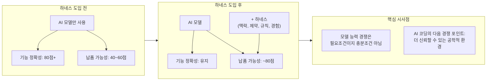
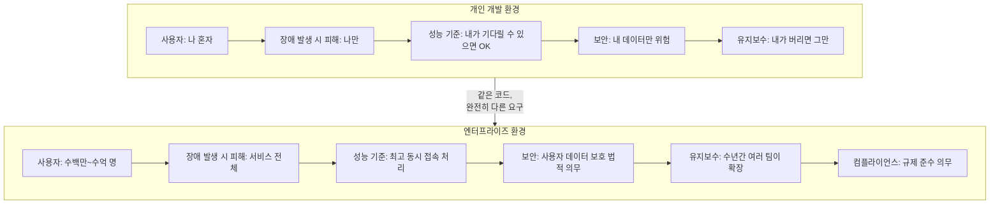
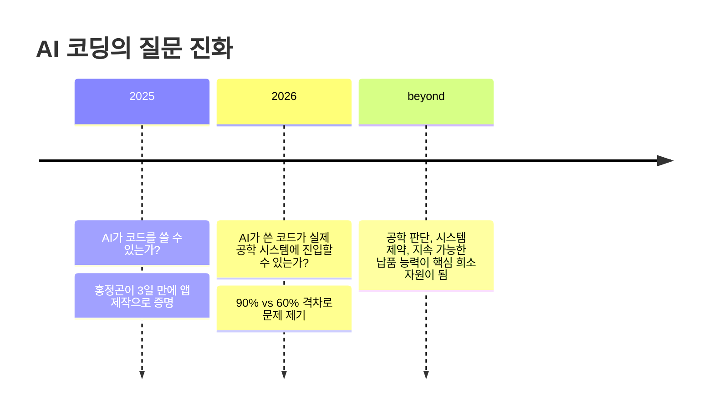

> **"不只是 AI Coding, 更是 AI Development"**  
> "AI Coding에 그치지 않고, AI Development로 나아가야 한다"  
> — 바이트댄스 기술 부총재 홍정곤(洪定坤)

## 관련글

[**ByteDance Technology Vice President Hong Dingkun's sharing on AI Coding this time, I think the most worthwhile part to watch is not "how strong AI is at writing code," but a very realistic contrast**](https://x.com/xudong07452910/status/2070741415026729464)

---

## 1. 이 발표가 왜 주목받는가

2026년, 중국 빅테크 최전선에서 가장 솔직한 고백이 나왔다. 바이트댄스(ByteDance) 기술 부총재 홍정곤이 무대에 올라 배경 화면에 단 두 줄을 띄웠다.

"不只是 AI Coding, 更是 AI Development"  
직역하면 "AI 코딩에 그치지 않고, 더 나아가 AI 개발이다"라는 뜻이다.

이 문장이 흥미로운 것은 바이트댄스가 AI 코딩 도구 TRAE(트레이)를 직접 만들고 운영하는 회사이기 때문이다. 자기 제품의 성과를 자랑하는 자리에서 그는 오히려 AI 코딩의 한계를 냉정하게 짚었다. AI가 코드를 생성하는 능력과, 그 코드가 실제 시스템에 진입할 수 있는 능력 사이에는 아직 좁히지 못한 간극이 존재한다는 것이다.

이 문서는 홍정곤의 발표에서 제시된 수치와 논리, 그리고 그것이 2026년 소프트웨어 공학에 던지는 시사점을 상세히 풀어낸다.

---

## 2. 홍정곤과 TRAE: 배경

홍정곤은 바이트댄스의 기술 부총재로, 2025년 5월 화산엔진(Volcengine) FORCE 오리지널 파워 컨퍼런스에서 TRAE의 월간 활성 사용자(MAU)가 100만 명을 돌파했다고 공개한 인물이다.

TRAE는 바이트댄스가 2025년 1월 19일 출시한 AI 네이티브 통합 개발 환경(IDE)이다. VS Code를 기반으로 구축되었으며, 실시간 코드 자동완성, 버그 탐지, 프로젝트 자동 빌드, Builder 모드, Chat 모드를 갖추고 있다. 2026년 4월에는 자율 에이전트 모드인 SOLO 모드를 정식 출시하여 목표만 설명하면 AI가 계획 수립, 실행, 검증, 오류 수정까지 자동으로 수행한다. 출시 1년 만에 등록 사용자 600만 명, 생성 코드 1천억 라인을 돌파했다.

TRAE는 GPT-4o, Claude Sonnet, Gemini 2.5 Pro, DeepSeek R1/V3, 바이트댄스 자체 모델인 Doubao-1.5-Pro 등 복수 모델을 지원하며, MCP(Model Context Protocol)를 통해 Figma 디자인-코드 변환, 데이터베이스 조작 등 외부 도구와 연동된다. 2025년 5월, 바이트댄스는 보안 리스크를 이유로 Cursor, Windsurf 등 서드파티 AI 개발 도구의 내부 사용을 금지하고 TRAE로 전면 전환하도록 내부 방침을 수립했다. 이는 TRAE가 단순한 도구가 아니라 바이트댄스 전사 개발 인프라의 핵심으로 자리잡았음을 의미한다.

홍정곤이 2026년 발표에서 TRAE 팀의 내부 데이터를 꺼낸 것은 단순한 홍보가 아니었다. 자신들이 직접 운영하고 있는 AI 코딩 도구로 가장 집약적인 실험을 했고, 그 결과가 예상과 다르게 나왔다는 것을 투명하게 공유한 것이다.

---

## 3. 가장 중요한 숫자 두 개: 90%와 60%

홍정곤이 발표에서 제시한 가장 핵심적인 데이터는 두 개의 숫자다.

**90%**: TRAE 팀이 지난 반년간 AI가 생성한 코드의 비율  
**60%**: 같은 기간 팀의 인당 요구사항 처리율(throughput) 증가폭

이 두 숫자를 나란히 놓으면 직관에 반하는 결과가 나온다. AI가 코드의 90%를 만들고 있는데, 팀의 실제 업무 처리 효율은 60%밖에 오르지 않았다.

처음에는 "그래도 60%면 대단한 거 아닌가?"라고 생각할 수 있다. 맞다. 60% 향상은 결코 작은 숫자가 아니다. 하지만 90%라는 숫자를 들은 뒤라면 이야기가 달라진다. 코드 생성의 90%를 AI가 담당한다면, 팀 효율이 60%가 아니라 500%, 1000% 올라야 논리적으로 맞지 않겠느냐는 기대가 생기기 때문이다.

이 격차, 즉 **AI 코드 생성 비율과 팀 효율 향상 사이의 괴리**가 홍정곤 발표의 출발점이다.

---

## 4. 왜 90%가 60%가 되는가: 코드 생성 ≠ 소프트웨어 공학

이 격차의 정체를 이해하려면 소프트웨어 개발의 전체 프로세스를 봐야 한다. 코드를 작성하는 것, 즉 '코딩' 자체는 소프트웨어 개발 중 하나의 단계일 뿐이다.

실제 소프트웨어를 사용자에게 전달하는 과정은 다음과 같이 구성된다.

파란색으로 표시된 "코드 작성" 단계, 오직 그 부분에서만 AI가 90%를 담당하게 된 것이다. 나머지 회색 단계들, 즉 요구사항을 이해하고, 아키텍처 제약을 파악하고, 코드 리뷰를 수행하고, 테스트를 설계하고, 보안을 검증하고, 성능을 최적화하고, 호환성을 확인하고, 배포 후 유지보수를 하는 모든 과정은 여전히 사람의 시간과 판단을 필요로 한다.

결국 AI가 코드를 매우 빠르게 생성하더라도, 그 코드가 실제 제품이 되어 사용자에게 전달되기까지의 전체 파이프라인은 여전히 병목이 존재한다. 생성 단계가 빨라졌을 뿐, 검증·통합·배포 단계는 그 속도를 따라잡지 못하고 있는 것이다.

홍정곤은 이 지점에서 "이전에는 모두가 'AI가 코드를 쓸 수 있는가?'라고 물었다면, 이제는 'AI가 쓴 코드가 실제 공학 시스템에 진입할 수 있는가?'를 물어야 한다"고 강조했다.

---

## 5. 실험: 9가지 조합으로 100번씩 돌렸더니

홍정곤은 발표에서 구체적인 실험 결과도 공개했다. 실험 설계는 다음과 같다.

- 주류 AI 코딩 모델 3개 × 주류 에이전트 프레임워크 3개 = 9가지 조합
- 각 조합당 100회 반복 실행

이 실험에서 두 종류의 점수를 측정했다.

**첫 번째 측정: 기능 정확성(Functional Correctness)**

9가지 조합 대부분이 80점 이상을 기록했다. AI는 "기능이 동작하는 코드"를 만드는 데 있어 이미 상당히 안정적인 수준에 도달했다. 원하는 동작을 구현하는 코드를 꽤 일관되게 생성할 수 있다는 뜻이다.

**두 번째 측정: 납품 가능성(Deliverability)**

납품 가능성은 단순히 기능이 동작하는지가 아니라, "이 코드를 실제 제품으로 출시할 수 있는가?"를 묻는다. 여기에는 UI의 적절함, 사용자 인터랙션의 완성도, 신뢰성, 성능, 다른 시스템과의 호환성, 장기 유지보수 가능성이 포함된다.

결과는 40점에서 60점 사이였다.

이 실험 결과는 매우 명확한 메시지를 담고 있다. AI는 "기능을 만드는 것"에서는 이미 꽤 잘하고 있다. 하지만 "출시 가능한 소프트웨어를 만드는 것"에서는 여전히 40~60점 수준에 머물고 있다. 기능 정확성과 납품 가능성 사이에 20~40점이라는 큰 격차가 존재하는 것이다.

---

## 6. "실행된다"와 "출시된다" 사이의 긴 거리

"기능 정확성 80점"과 "납품 가능성 40~60점"의 격차가 의미하는 것을 보다 직관적으로 이해하기 위해 바이브 코딩(Vibe Coding)으로 만든 소프트웨어를 생각해보자.

바이브 코딩이란 개발자가 자연어로 원하는 기능을 설명하면 AI가 코드를 생성해주는 방식이다. 안드레 카파시(Andrej Karpathy)가 2025년에 언급하며 유명해진 개념으로, 누구나 손쉽게 소프트웨어 프로토타입을 만들 수 있는 새로운 개발 패러다임이다.

바이브 코딩으로 만든 결과물을 처음 보면 인상적이다.

- 페이지가 열린다.
- 화면 흐름이 자연스럽게 이어진다.
- 데모에서 보여주기에 무리가 없다.

그러나 이것을 실제 서비스 시스템에 통합하려는 순간 여러 문제가 수면 위로 떠오른다.

**성능 문제**: AI는 기능이 동작하는 코드를 만들지만, 동시 접속 1만 명을 처리해야 할 때도 동작하는 코드를 만들지는 않는다. 알고리즘 선택이 비효율적이거나, 불필요한 DB 쿼리가 루프 안에 중첩되어 있거나, 캐싱이 전혀 고려되지 않을 수 있다.

**보안 문제**: SQL 인젝션에 취약한 쿼리, 하드코딩된 인증 정보, 잘못된 입력 검증이 포함될 수 있다. CodeRabbit의 2025년 12월 분석에 따르면 AI가 공동 작성한 코드는 인간이 작성한 코드보다 보안 취약점이 2.74배 높게 나타났다.

**권한 문제**: 사용자 역할에 따라 접근을 제한해야 하는 기능이 제대로 분리되어 있지 않거나, 권한 검사 로직이 누락되어 있을 수 있다.

**중복 로직 문제**: AI는 기존 코드베이스의 히스토리를 모른 채 새로운 코드를 생성하기 때문에, 이미 존재하는 유틸리티 함수를 다시 만들거나 동일한 비즈니스 로직이 여러 곳에 흩어지는 경우가 발생한다.

**과도한 설계 문제**: 단순하게 해결할 수 있는 문제를 불필요하게 복잡한 구조로 구현하거나, 실제로 필요하지 않은 추상화 레이어를 추가하는 경향이 있다.

**유지보수 문제**: 코드를 처음 만들어본 사람조차 나중에 수정하기 어려운 구조, 맥락 없이 나열된 함수, 테스트가 없는 핵심 로직이 결합되면 장기적으로 팀의 개발 속도를 오히려 갉아먹는다.

이것이 바로 "실행된다(can run)"와 "출시된다(can ship)"의 차이다. AI는 전자를 꽤 잘 달성하지만, 후자에 이르기까지는 여전히 소프트웨어 공학의 긴 여정이 남아 있다.

---

## 7. 해답으로서의 하네스(Harness): 단순한 에이전트 프레임워크가 아니다

이 문제에 대한 홍정곤의 답변이 바로 **하네스(Harness)** 다.

하네스라는 단어는 말(馬)이 마차를 끌 때 사용하는 가죽 장비 세트를 의미한다. AI 코딩 맥락에서 하네스는 AI 모델(말)이 실제로 원하는 방향으로 달릴 수 있도록 둘러싸는 모든 구조, 규칙, 도구, 제약의 총합을 뜻한다. 하네스 엔지니어링 분야에서 널리 통용되는 공식이 있다.

> **Agent = Model + Harness**

모델이 아닌 모든 것이 하네스다.

홍정곤이 강조한 하네스는 단순히 에이전트 프레임워크(LangChain, LangGraph 같은 멀티 에이전트 오케스트레이션 도구)를 의미하지 않는다. 싱글 에이전트냐 멀티 에이전트냐의 구조 문제도 아니다. 더 근본적인 것들, 즉 AI가 실제 프로젝트 안에서 안전하고 일관되게 동작하기 위해 반드시 갖추어야 하는 지식과 규칙의 체계를 의미한다.

---

## 8. AI가 반드시 알아야 할 여섯 가지

홍정곤은 AI가 안정적으로 동작하기 위해 단순히 모델이 똑똑한 것만으로는 부족하다고 했다. AI는 다음 여섯 가지를 알아야 한다.

### 8-1. 이 프로젝트는 어떤 구조인가

AI는 자신이 수정하는 코드가 전체 시스템에서 어떤 역할을 하는지 알아야 한다. 모놀리식 아키텍처인지 마이크로서비스인지, 레이어드 아키텍처인지 이벤트 드리븐인지에 따라 코드 작성 방식이 근본적으로 달라진다. 프로젝트 구조를 모르는 AI는 로컬에서는 동작하지만 전체 시스템과 통합하면 충돌하는 코드를 만들 가능성이 높다.

### 8-2. 어떤 파일은 건드리면 안 되는가

모든 코드베이스에는 "함부로 수정해서는 안 되는 파일"이 있다. 레거시 시스템과의 인터페이스를 유지하는 어댑터 코드, 배포 설정 파일, 외부 서비스와의 계약을 정의하는 스키마 등이 그 예다. AI가 이를 모른 채 "더 깔끔하게 리팩토링한다"며 손을 대면 연쇄 장애가 발생할 수 있다.

### 8-3. 어떤 인터페이스에 역사적 부채가 있는가

소프트웨어 시스템은 오랜 시간 여러 팀이 여러 이유로 쌓아온 결정들로 구성된다. 어떤 API 엔드포인트는 "왜 이렇게 설계했지?"라고 의아할 만한 파라미터 구조를 갖고 있지만, 실제로는 수백 개의 클라이언트가 의존하고 있어서 바꾸지 못하는 경우가 있다. AI가 이런 컨텍스트 없이 "더 좋은 방식"으로 변경하면 조용한 장애가 생긴다.

### 8-4. 어떤 테스트가 반드시 통과해야 하는가

CI/CD 파이프라인에는 항상 실행되어야 하는 핵심 테스트 스위트가 있다. 특히 회귀 방지 테스트, 계약 테스트, 성능 임계값 테스트는 코드 변경 시 반드시 통과해야 한다. AI가 이를 알지 못하면 테스트를 우회하거나, 기존 테스트를 깨뜨리는 코드를 만들고 스스로 인식하지 못할 수 있다.

### 8-5. 어떤 코딩 방식을 팀이 받아들이지 않는가

팀마다 암묵적으로 또는 명시적으로 금지하는 패턴이 있다. 전역 상태 변수 사용, 특정 라이브러리의 사용 금지, 함수 길이 제한, 변수 명명 규칙 등이 그 예다. 코드 리뷰 과정에서 반복적으로 거절당하는 패턴이 있다면, AI는 그것을 반복하지 않아야 한다.

### 8-6. 어떤 함정을 이미 팀이 밟은 적 있는가

과거에 팀이 겪었던 장애나 버그, 성능 병목, 보안 사고의 경험은 매우 귀중한 정보다. "이 방식으로 구현했다가 프로덕션에서 장애가 났다", "이 라이브러리는 버전 X부터 Y까지 버그가 있다" 같은 경험은 문서화되지 않으면 사라진다. AI가 이 경험을 알고 있다면, 이미 검증된 실패 패턴을 반복하지 않을 수 있다.

---

## 9. 하네스 도입의 효과: 40~60점 → 80점

홍정곤의 실험에서 가장 중요한 결과가 여기 있다.

하네스를 도입하기 전, AI가 생성한 코드의 납품 가능성 점수는 40점에서 60점 사이였다. 그러나 맥락 공학, 아키텍처 제약, 코드 규범, 테스트 요구사항, 팀의 역사적 경험을 하네스로 구조화하여 AI에게 제공한 후에는 납품 가능성이 80점 수준으로 향상되었다.

이 변화는 단순한 수치 개선이 아니다. 아래 다이어그램은 이 변화가 무엇을 의미하는지 보여준다.

이 결과는 AI 코딩 도구 간 경쟁의 축이 어디에 있는지를 바꿔놓는다. 모델이 얼마나 똑똑한지(기능 정확성 80점 이상은 대부분 달성하고 있다)가 아니라, 누가 AI에게 더 신뢰할 수 있는 공학적 환경을 제공하는지(납품 가능성을 80점으로 끌어올리는 하네스)가 진짜 경쟁 포인트라는 것이다.

---

## 10. 코드가 싸질 때 더 비싸지는 것

홍정곤 발표에서 가장 날카로운 통찰은 이것이다.

> "코드는 점점 싸지고 있다.  
> 하지만 어떤 코드가 시스템에 진입할 수 있는지 판단하는 것은 더 비싸질 것이다."

이 명제는 소프트웨어 공학의 경제학을 근본적으로 뒤흔드는 관찰이다.

2025년 이전까지, 소프트웨어 개발에서 가장 비싼 자원은 "코드를 쓸 수 있는 사람"이었다. 좋은 코드를 빠르게 작성하는 개발자는 희소하고 비쌌다. 그런데 AI가 코드 생성 비용을 극적으로 낮추자, 병목이 이동했다.

이제 가장 비싼 자원은 "이 코드가 실제 시스템에 들어가도 되는지 판단할 수 있는 사람"이다. 구체적으로 말하면:

- **아키텍처 판단력**: 이 새로운 컴포넌트가 전체 시스템 설계 원칙에 부합하는가?
- **시스템 제약 이해**: 이 코드가 현재 인프라의 리소스 한계 내에서 동작할 수 있는가?
- **보안 감각**: AI가 생성한 이 코드에 숨어있는 취약점은 무엇인가?
- **지속 가능한 납품 역량**: 이 코드를 6개월 후에 다른 팀원이 수정할 수 있는가?

AI는 모두에게 코드를 생성하는 능력을 부여했다. 하지만 소프트웨어 공학의 핵심 가치들, 즉 아키텍처 설계, 코드 규범, 리뷰, 테스트, 보안, 그리고 팀 간 협업은 AI가 코드를 많이 만들수록 오히려 더 중요해지고 있다.

---

## 11. 제품 관리자의 바이브 코딩 사례: 현실의 충돌

홍정곤은 발표에서 하나의 사례를 공유했다. 이것은 추상적인 논의를 매우 구체적으로 만들어준다.

어떤 기업에서 제품 기획자(PM)가 개발팀으로부터 개발 일정을 배정받지 못했다. 기다리기 지친 PM은 바이브 코딩 도구를 사용하여 스스로 코드를 만들어냈다. 기능은 동작했다. 화면은 열렸다. 흐름도 이어졌다.

그런데 PM이 이 코드를 개발팀에게 건네며 "이걸 서비스에 올려줘"라고 요청했을 때, 개발팀은 그 코드를 직접 사용할 수 없었다.

이것이 단순히 "PM이 만든 코드라서 품질이 낮아서"의 문제가 아니다. 핵심은 코드가 전체 아키텍처 안에 어떻게 통합되어야 하는지, 보안 정책은 어떻게 적용되어야 하는지, 기존 시스템의 인증/인가 구조와 어떻게 맞물려야 하는지, 성능 기준을 충족하는지 등 아무것도 고려되지 않았다는 것이다.

이 사례는 두 가지 층위의 문제를 동시에 드러낸다.

첫째는 **프로세스의 문제**다. 개발팀이 PM의 요구사항에 적시에 응답하지 못하는 조직 구조 문제가 바이브 코딩 우회 시도를 낳았다.

둘째는 더 근본적인 **통합 문제**다. 기능을 만들어내는 것과, 그 기능이 전체 아키텍처 안에서 안전하고 유효하게 동작하도록 만드는 것은 완전히 다른 과제다. AI가 전자를 손쉽게 가능하게 했지만, 후자는 여전히 깊은 엔지니어링 판단을 요구한다.

---

## 12. 개인 개발과 엔터프라이즈 개발의 근본적 차이

이 맥락에서 또 하나의 핵심 관찰이 나온다. 홍정곤 발표를 보고 공감을 표한 어느 개발자는 이렇게 표현했다.

> "개인이 개발해서 혼자 쓰는 것과,  
> 수백만, 수천만, 수억 명의 사용자를 위한 개발 표준과 검수 방식은 절대적으로 다르다."

이것은 매우 중요한 구분이다. 바이브 코딩으로 만든 개인용 도구는 완벽하게 유용할 수 있다. 혼자만 사용한다면 성능 병목도, 보안 취약점도, 유지보수 부채도 모두 "내가 감당할 수 있는 범위" 안에 있다.

그러나 같은 코드가 프로덕션 서비스로 배포된다면 이야기가 완전히 달라진다.

수백만 명이 동시에 사용하는 시스템은 단순히 기능이 동작하는 것 이상을 요구한다. 99.9%의 가용성, 법적 요구사항을 충족하는 개인정보 처리, 수평 확장을 지원하는 아키텍처, 보안 감사에서 통과할 수 있는 코드 품질이 필요하다. 바이브 코딩으로 생성된 코드는 이 기준을 기본값으로 충족하지 않는다.

이것이 엔터프라이즈 소프트웨어 공학에서 하네스가 필수적인 이유다. 하네스는 AI가 생성하는 모든 코드에 조직의 표준, 아키텍처 원칙, 보안 정책, 테스트 요구사항을 자동으로 반영하는 구조적 장치다.

---

## 13. 2025년과 2026년: 홍정곤의 두 가지 증명

홍정곤의 메시지를 시간축으로 정리하면 다음과 같다.

**2025년**: 홍정곤은 TRAE를 사용하여 3일 만에 앱 하나를 만들어냈다. 이것은 "AI가 코드를 쓸 수 있다"는 명제를 증명했다. 당시 이 사례는 AI 코딩 도구의 강력함을 보여주는 상징적 사례로 자주 인용되었다.

**2026년**: 홍정곤은 TRAE 팀의 데이터를 공개했다. 90% AI 코드 기여율과 60% 효율 향상 사이의 격차, 그리고 기능 정확성 80점과 납품 가능성 40~60점 사이의 격차를 드러내며, AI 코딩의 진짜 어려운 부분이 이미 "코드 생성"에서 "소프트웨어 납품"으로 이동했다는 것을 보여주었다.

이 두 해의 메시지는 서로 모순되지 않는다. 2025년의 증명은 "AI가 코드를 쓸 수 있다"는 것이었고, 2026년의 성찰은 "AI가 쓴 코드가 실제 공학 시스템에 진입하려면 무엇이 더 필요한가"로 질문을 심화시킨 것이다.

---

## 14. AI Coding에서 AI Development로: 무엇이 바뀌어야 하는가

슬라이드의 메시지, "不只是 AI Coding, 更是 AI Development", 즉 "AI 코딩에 그치지 않고 AI 개발로 나아가야 한다"는 말은 이 맥락에서 명확한 의미를 갖는다.

**AI Coding**: AI를 사용하여 코드를 생성한다. 이것은 이미 상당한 수준에 도달했다.

**AI Development**: AI가 생성한 코드가 실제 소프트웨어 공학 프로세스 전체를 통과하여 사용자에게 전달된다. 여기에는 아키텍처 통합, 보안 검증, 성능 최적화, 테스트 자동화, 배포 파이프라인, 그리고 장기 유지보수 가능성이 모두 포함된다.

이 전환을 가능하게 하는 것이 하네스다. 잘 설계된 하네스는 AI에게 단순히 "코드를 생성하라"는 명령만 주는 것이 아니라, 이 코드가 실제 시스템에서 어떤 제약과 기준을 만족해야 하는지 알게 한다. 그 결과로 납품 가능성 점수가 40~60에서 80으로 뛰어오른다.

---

## 15. 결론: 무엇이 진짜 희소해지는가

홍정곤의 발표가 2026년 소프트웨어 공학 커뮤니티에 울림을 주는 이유는, 화려한 기술 시연이 아니라 냉정한 데이터와 솔직한 성찰을 담고 있기 때문이다.

그의 메시지를 세 가지로 요약할 수 있다.

**첫째**, AI는 코드를 생성하는 데 이미 충분히 강력하다. 그러나 그 코드가 실제 제품이 되는 여정은 코드 생성에서 끝나지 않는다.

**둘째**, AI 코딩 도구의 다음 경쟁은 모델의 코드 생성 능력이 아니라, 누가 AI에게 더 신뢰할 수 있는 공학적 환경(하네스)을 제공하느냐에서 판가름 날 것이다.

**셋째**, 코드 생성이 쉬워질수록, 진짜 희소해지는 것은 코드가 아니라 아키텍처 판단력, 시스템 제약에 대한 이해, 그리고 지속 가능한 납품 능력이다.

많은 팀이 앞으로 이 문제와 마주하게 될 것이다. 코드를 생성하는 것이 점점 쉬워질 때, 그 코드가 실제 시스템에 안전하게 통합되도록 만드는 공학적 판단과 하네스 설계 역량이 비로소 진짜 차별화 요소가 된다. 그것이 AI Coding을 넘어 AI Development로 가는 길이다.

---

## 부록: 핵심 수치 요약

| 측정 항목 | 수치 | 의미 |
|---|---|---|
| AI 코드 생성 비율 (TRAE 팀, 6개월) | 90% | AI가 대부분의 코드를 작성 |
| 인당 요구사항 처리율 향상 | 60% (1.6배) | 실제 업무 효율 향상폭 |
| 기능 정확성 (9조합 × 100회) | 80점 이상 | AI의 기능 구현 능력 |
| 납품 가능성 (하네스 없음) | 40~60점 | 실제 출시 가능 수준 |
| 납품 가능성 (하네스 도입 후) | ~80점 | 하네스의 효과 |
| 하네스로 인한 납품 가능성 향상 | 약 20~40점 | 공학 환경의 가치 |

---

*참고: 이 문서는 바이트댄스 기술 부총재 홍정곤(洪定坤)의 AI Coding 발표 내용을 담은 SNS 공유 게시글을 바탕으로, 관련 공개 자료 및 최신 검색 정보를 종합하여 작성하였습니다. 특정 수치(90%, 60%, 40~60점, 80점)는 원 발표자가 공개한 데이터이며, 제3자가 독립적으로 재현 실험을 수행한 결과는 아닙니다.*

---

작성일자: 2026-06-28
