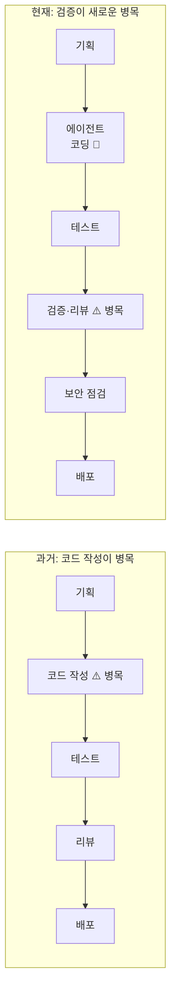
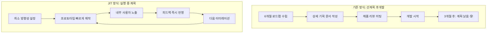
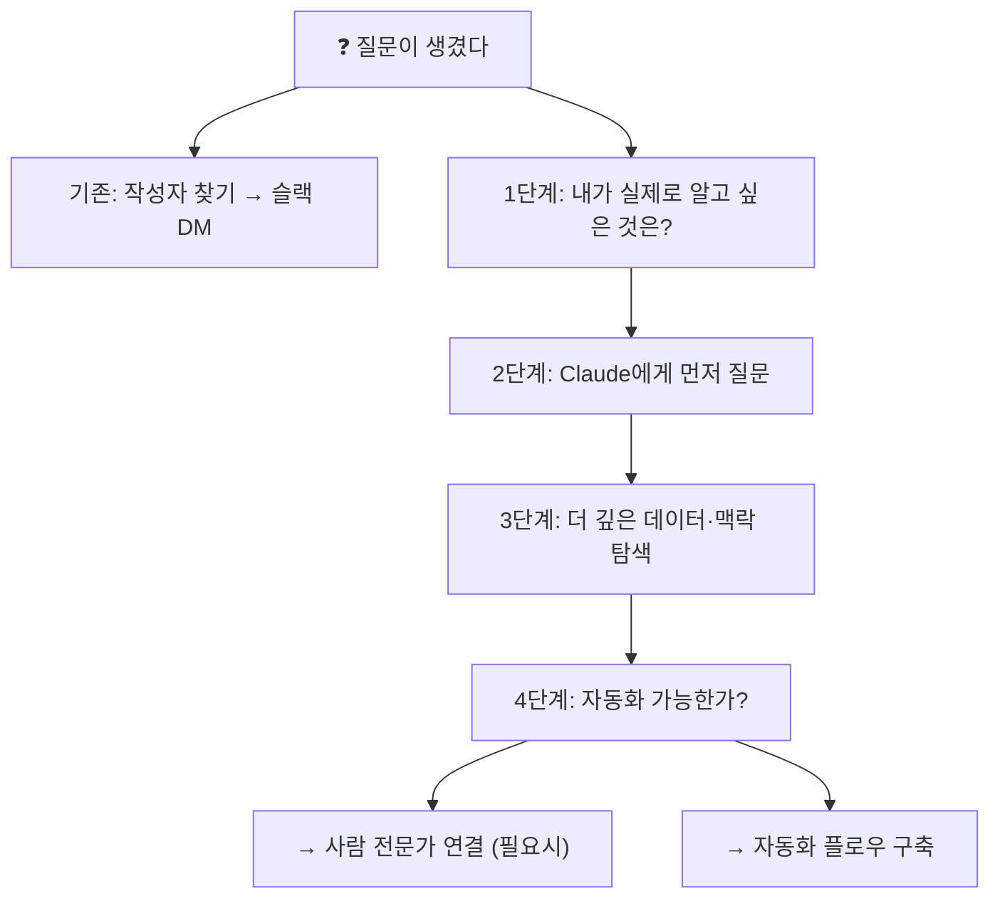
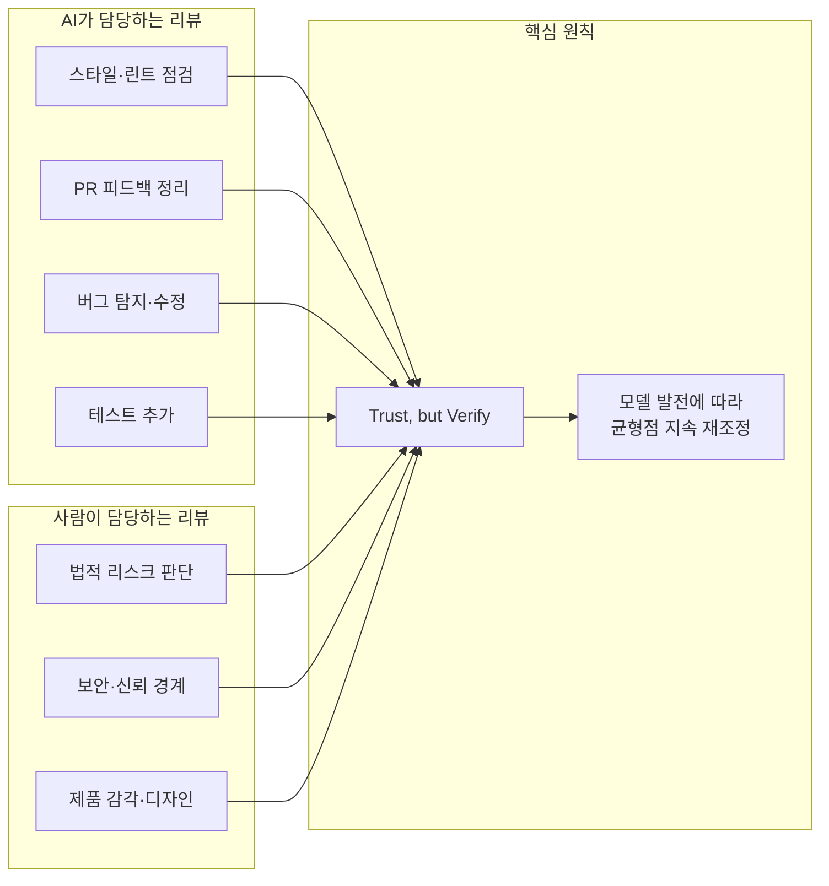
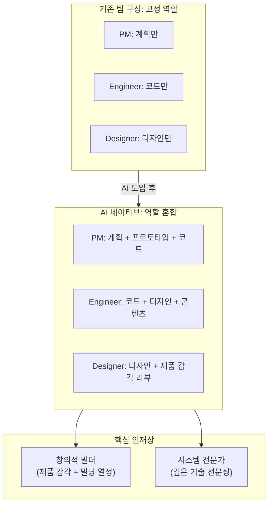
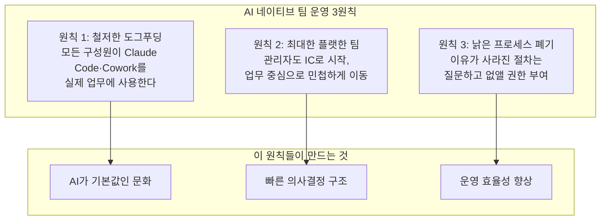
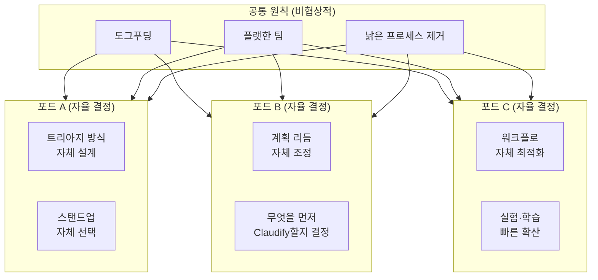
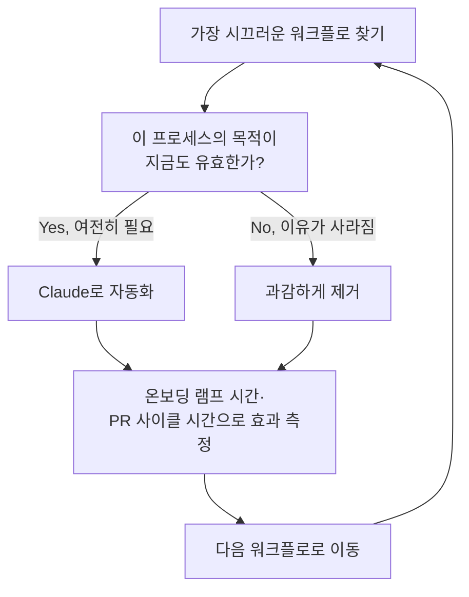
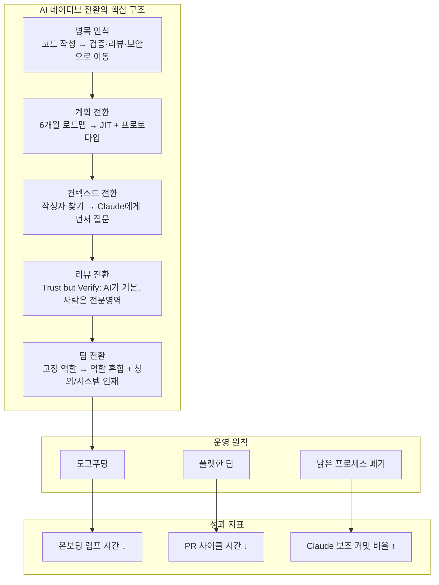

> **출처**: Anthropic Claude 공식 블로그 — *"Running an AI-native engineering org"*  
> **원문 URL**: https://claude.com/blog/running-an-ai-native-engineering-org  
> **발표일**: 2026년 6월 3일  
> **발표 맥락**: Code w/ Claude SF 2026 컨퍼런스  
> **발표자**: Fiona Fung — Director of Engineering, Claude Code & Claude Cowork, Anthropic  

## 관련글

[**AI가 기본이 되는 엔지니어링 조직은 어떻게 운영 방식이 달라지는가**](https://www.facebook.com/share/p/1Bdu5d474m/)

---

## 들어가며 — 이 글이 던지는 진짜 질문

소프트웨어 개발 역사를 돌아보면, 공학 조직의 프로세스는 항상 그 시대의 가장 비싼 자원이 무엇인가를 중심으로 설계되어 왔다. 1970~80년대 워터폴 방식은 변경 비용이 극단적으로 비쌌던 시절, 요구사항을 처음부터 완벽히 정의하려는 시도에서 나왔다. 2000년대 애자일은 빠른 인터넷 배포가 가능해지면서 코드를 조금씩 자주 배포하는 방향으로 프로세스를 재편했다.

그리고 이제 2026년, 에이전트 코딩(agentic coding)이 기본값이 되면서 세 번째 패러다임 전환이 일어나고 있다.

Fiona Fung이 던지는 핵심 질문은 단순하지만 날카롭다.

> **"코드 작성 속도가 폭발적으로 빨라졌을 때, 조직의 병목은 어디로 이동하는가? 그리고 그 변화에 맞춰 계획, 리뷰, 팀 구성, 운영 원칙을 어떻게 다시 설계해야 하는가?"**

이 글은 앤트로픽의 Claude Code 팀이 직접 겪고 검증한 경험을 기반으로, AI 네이티브 엔지니어링 조직이 무엇인지, 어떻게 운영해야 하는지를 상세히 풀어낸다.

---

## 1장 — 병목의 이동: 코드 작성에서 검증으로

### 과거의 공학 조직이 설계된 방식

수십 년 동안 소프트웨어 개발에서 가장 비싸고 희소한 자원은 엔지니어의 코딩 시간이었다. 한 줄의 코드를 쓰고, 테스트하고, 리팩터링하는 데 드는 인간의 시간과 집중력은 한정되어 있었다. 이 제약을 중심으로 애자일, 스크럼, 칸반 같은 방법론이 발전했고, 기획 단계에서 수개월의 로드맵을 세우는 관행도 이 비싼 자원을 낭비 없이 써야 한다는 논리에서 나온 것이다.

Fiona Fung 본인도 경력 초기(2000년대 초)에 마이크로소프트 Visual Studio 팀에서 일하며 CD-ROM으로 소프트웨어를 출시하던 시절을 경험했다. 제조 마감일이 정해져 있었기 때문에 잘못된 코드 한 줄이 전체 출시를 망칠 수 있었다. 이런 환경에서 계획을 길게 세우고, 리뷰를 꼼꼼히 하고, 변경을 최소화하는 방식은 완전히 합리적이었다.

### 에이전트 코딩이 이 전제를 무너뜨린다

Claude Code 팀의 현재를 보면 상황이 완전히 달라졌다. **코드 작성, 테스트 작성, 리팩터링은 더 이상 개발 속도를 제한하는 병목이 아니다.** 에이전트 코딩 도구가 이 작업들을 극적으로 가속화했기 때문이다.

그러나 병목이 사라진 것이 아니다. 병목의 위치가 바뀌었다. 새로운 병목은 다음 질문들에 있다.

- 이 코드는 정말 맞는가? (정확성 검증)
- 이 코드는 유지보수 가능한가? (도메인 리뷰)
- 이 코드는 보안상 안전한가? (보안과 신뢰 경계 관리)
- 이 코드는 제품의 의도에 맞는가? (제품 감각과 품질 판단)

이 인식 전환이 AI 네이티브 조직 설계의 출발점이다. 에이전트 코딩을 도입하면 기존 프로세스가 빨라지는 것이 아니라, **기존 프로세스 자체가 다시 설계되어야 한다.** 없어진 제약(코드 작성 비용)에 맞춰 일하는 방식을 바꾸지 않으면, AI가 만든 속도는 오히려 병목과 혼란을 키울 수 있다.

---

## 2장 — 계획 방식의 전환: 로드맵에서 JIT로

### 왜 긴 로드맵이 더 이상 작동하지 않는가

Fiona Fung이 Claude Code 팀에 합류했을 때, 팀은 꽤 훌륭한 6개월 로드맵을 갖추고 있었다. 그런데 **Claude Code 자체 때문에** 3개월 만에 그 로드맵이 낡아버렸다. 이 경험은 역설적이면서도 시사하는 바가 크다.

에이전트 코딩이 기본이 되면 개발 주기가 압축된다. 예전에 6개월 걸릴 일이 몇 주 만에 가능해진다. 이 말은 시장 상황과 제품 요구사항이 변화하는 속도 대비 계획의 유효 기간이 극적으로 짧아진다는 뜻이다. 오랜 시간을 들여 만든 상세한 계획 문서는 작성하는 순간부터 낡기 시작한다.

### JIT(Just-In-Time) 계획의 원리

JIT 계획은 계획을 없애는 것이 아니다. **필요한 만큼, 필요한 시점에, 필요한 세부 수준으로 계획하는 방식이다.** 마치 JIT 컴파일러가 코드를 실행 직전에 최적화하듯이, 계획도 실행 직전에 구체화한다.

Claude Code 팀의 구체적인 변화는 다음과 같다.

첫째, 상세한 기획 문서(Design Doc)보다 **PR(Pull Request)이나 프로토타입 중심의 논의**로 전환했다. 문서 속의 아이디어를 토론하는 대신, 실제 동작하는 코드나 프로토타입을 기준으로 논의한다. 이렇게 하면 추상적인 논쟁을 줄이고 구체적인 결정을 빠르게 내릴 수 있다.

둘째, **내부 사용자 피드백을 즉시 반영하는 루프**를 핵심 계획 도구로 삼는다. 완성도가 낮더라도 내부 사용자에게 먼저 노출하고, 그 피드백을 다음 이터레이션에 바로 반영한다. 계획의 완성도보다 학습 속도가 훨씬 중요하다.

셋째, **공식적인 제품 리뷰 미팅을 최소화**했다. 공간이 빠르게 움직이기 때문에 정기적인 대규모 리뷰는 너무 느리다. 대신 지속적인 소규모 피드백 루프가 그 자리를 대신한다.

이 전환에서 핵심 가치관의 변화가 있다. **계획의 완성도에서 학습의 속도로** 우선순위가 이동한다. 완벽한 계획을 먼저 만들려는 집착을 내려놓고, 빠르게 만들고 빠르게 배우는 사이클을 반복하는 것이 AI 네이티브 조직의 계획 철학이다.

---

## 3장 — 컨텍스트 수집의 전환: 사람을 찾지 말고 Claude에게 먼저 묻기

### "누가 만들었나?"라는 질문의 한계

전통적인 엔지니어링 조직에서 어떤 코드나 결정의 배경을 알고 싶을 때, 첫 번째 행동은 항상 같았다. 바로 **작성자를 찾는 것**이었다. `git blame`을 실행하고, 해당 커밋을 만든 사람에게 슬랙 메시지를 보내는 방식이다.

이 방식에는 암묵적인 전제가 있다. 코드를 만든 사람이 그 코드에 대한 가장 신뢰할 수 있는 컨텍스트 저장소라는 것이다. 사람이 코드를 쓰는 시대에는 이 전제가 꽤 합리적이었다.

그런데 에이전트 코딩이 일상화되면, 이 전제가 흔들린다. **이제 PR과 코드 작성에 AI가 깊이 관여하기 때문에**, "누가 만들었나?"라는 질문만으로는 충분한 컨텍스트를 얻기 어렵다. AI가 생성한 코드의 의도와 맥락을 해당 엔지니어가 완전히 설명하지 못하는 경우도 생길 수 있다.

### 더 좋은 질문: "내가 실제로 알고 싶은 것은 무엇인가?"

Fiona Fung이 제안하는 새로운 접근은 질문을 한 단계 더 깊이 들어가는 것이다. **"누가 만들었나?"가 아니라, "내가 실제로 알고 싶은 것은 무엇인가?"를 먼저 묻는다.**

예를 들어 보자. 어떤 엔지니어가 회귀 버그를 만났다고 하자. 예전이라면 바로 `git blame`으로 작성자를 찾아 "이게 왜 이렇게 됐어요?"라고 물었을 것이다. 하지만 더 나은 접근은 다음과 같이 생각하는 것이다.

> "내가 알고 싶은 건 회귀의 원인이다. 작성자가 누군지가 아니라."

이 질문을 Claude에게 던진다. Claude는 관련 커밋 히스토리, 테스트 결과, 유사한 패턴의 버그 사례, 코드 변경 이력을 한꺼번에 분석해 훨씬 깊은 컨텍스트를 제공할 수 있다.

마찬가지로, 고객 질문에 답할 전문가를 찾고 싶을 때, 예전이라면 팀 내에서 "이 영역 담당자가 누구야?"라고 물었을 것이다. 이제는 Claude에게 고객 질문과 관련 문서, 코드베이스를 분석하게 한 다음 답을 바로 얻거나, 실제로 사람이 필요하다면 어떤 전문성을 가진 사람이 필요한지 더 정확하게 파악할 수 있다.

### 자동화 가능성을 항상 묻는 습관

Claude Code 팀의 프로세스에는 한 가지 추가 원칙이 있다. 어떤 컨텍스트 수집 작업을 하든 마지막에 항상 이 질문을 던진다.

> **"이 작업은 자동화할 수 있는가?"**

Fiona Fung의 실제 사례가 이를 잘 보여준다. 그녀는 매일 아침 커피를 마시며 수동으로 고객 피드백 채널을 요약하는 루틴을 갖고 있었다. 이를 Claude에게 인식시킨 결과, 지금은 이 작업이 완전히 백그라운드에서 자동으로 돌아가고 있다. 수동으로 하던 맥락 수집이 자동화된 플로우로 전환된 것이다.

이처럼 **반복되는 컨텍스트 수집은 사람이 매번 하는 일이 아니라, 자동화된 흐름으로 바뀌어야** 한다는 것이 AI 네이티브 조직의 핵심 관행 중 하나다.

---

## 4장 — 코드 리뷰의 재설계: Trust, but Verify

### 리뷰 부담이 줄어드는 것이 아니라 성격이 바뀐다

많은 사람들이 에이전트 코딩이 코드를 빠르게 만들어주니 리뷰 부담도 줄어들 것이라고 기대한다. 하지만 현실은 다르다. **코드 생성 속도가 빨라지면 리뷰해야 할 코드의 양도 늘어난다.** 중요한 변화는 리뷰의 총량이 아니라 리뷰의 성격이다.

이제 리뷰는 두 가지 층으로 명확하게 분리된다.

### AI가 담당하는 리뷰 영역

Claude Code 팀은 Claude Code의 코드 리뷰 기능을 적극 활용한다. AI가 담당하는 리뷰 영역은 다음과 같다.

**스타일과 린트 점검**은 코드가 팀의 컨벤션과 스타일 가이드를 따르는지 자동으로 확인한다. 사람이 이런 기계적인 확인에 시간을 쓸 필요가 없다.

**PR 피드백 정리**는 리뷰어가 남긴 코멘트를 정리하고, 수정이 필요한 부분을 추적하며, 반복적인 리뷰-수정 사이클을 보조한다.

**버그 탐지와 수정**은 풀 커밋 전에 명확한 버그를 잡아내고 수정 제안을 제공한다. 특히 흔히 발생하는 패턴의 오류는 AI가 훨씬 빠르게 포착한다.

**테스트 추가**는 새로 추가된 코드에 대한 유닛 테스트, 통합 테스트를 자동으로 생성하거나 보완한다.

### 사람이 반드시 담당해야 하는 리뷰 영역

모든 판단을 AI에게 넘길 수는 없다. Fiona Fung이 명시적으로 인간 리뷰어가 반드시 참여해야 한다고 강조한 영역은 다음과 같다.

**법적 리스크 판단**에는 항상 법무 파트너가 참여해야 한다. 법적 리스크 허용 범위는 AI가 정확하게 판단하기 어려운 영역이며, 잘못된 판단의 결과가 매우 심각하다.

**보안과 신뢰 경계**는 보안에 민감한 코드나 시스템 신뢰 경계에 영향을 미치는 변경은 해당 도메인 전문가가 직접 검토해야 한다. AI가 보안 취약점을 놓칠 경우 그 파급효과는 크다.

**제품 감각과 디자인 품질**은 코드가 기술적으로는 올바르더라도 제품의 방향성과 사용자 경험 측면에서 맞는지는 제품 관리자(PM)와 디자이너가 판단해야 한다.

### Trust, but Verify의 의미

Fiona Fung이 제시하는 핵심 원칙은 **"Trust, but Verify(신뢰하되 검증하라)"** 다. 이 원칙에는 중요한 뉘앙스가 있다.

단순히 "AI를 믿되 사람도 본다"는 뜻이 아니다. **"사람이 봐야 하는 영역을 더 정교하게 정의하는 것"** 이 핵심이다. 모든 코드를 사람이 다 보는 이전 방식도 아니고, 모든 것을 AI에게 맡기는 무책임한 방식도 아니다. 사람의 전문성이 가장 필요한 지점을 예리하게 파악하고 거기에 집중하는 것이다.

더 나아가, 이 균형은 고정된 규칙이 아니다. **모델이 개선될수록 이 균형점도 계속 달라질 것이다.** 오늘 사람이 해야 했던 리뷰가 다음 모델 버전에서는 AI가 더 잘할 수도 있다. 따라서 리뷰 프로세스는 고정된 규칙이 아니라, **지속적으로 재조정되는 운영 체계**가 되어야 한다.

---

## 5장 — 팀 구성의 재설계: 역할 경계가 흐려진다

### AI는 역할을 대체하는 것이 아니라 역할의 경계를 재설계한다

전통적인 엔지니어링 조직에서는 역할이 명확하게 분리되어 있었다. 엔지니어는 코드를 쓰고, PM은 계획을 세우고, 디자이너는 UX를 만든다. 이 분업 구조는 각 전문성의 깊이를 확보하기 위한 합리적인 선택이었다.

AI 네이티브 조직에서는 이 경계가 흐려진다. 그 이유를 Fiona Fung은 이렇게 설명한다. AI가 반복적이고 기계적인 작업을 상당 부분 처리해주기 때문에, **사람이 자신의 전통적 역할 범위를 넘어 더 넓은 영역에 기여할 수 있게 된다.**

### PM도 만들고, 엔지니어도 넓어진다

Claude Code 팀에서는 PM들이 코딩을 많이 한다. 예전이라면 PM은 기능 명세서를 쓰고 엔지니어에게 전달했다. 이제는 PM이 직접 Claude를 활용해 프로토타입을 만들고, 그 프로토타입을 기반으로 엔지니어와 논의한다. 이렇게 하면 기획과 구현 사이의 오해가 줄고, 피드백 루프가 극적으로 빨라진다.

반대 방향의 변화도 일어난다. 엔지니어들이 콘텐츠 작성, 디자인 작업, 고객 맥락 분석 같은 전통적으로 비기술 영역으로 분류되던 작업들을 직접 다루기 시작했다. 코드 작성의 장벽이 낮아진 덕분에, 비기술 역할의 구성원들도 엔지니어링에 참여할 수 있게 된 것과 마찬가지로, 엔지니어들도 다른 영역으로 자연스럽게 확장된다.

### 이제 어떤 인재가 중요한가

Fiona Fung은 Claude Code 팀을 채용할 때 중시하는 두 가지 프로필을 명확히 제시한다.

**첫 번째 프로필은 제품 감각을 가진 창의적 빌더(Creative Builders with Product Sense)다.** 문제를 발견하고 제품으로 풀어내는 데 깊은 호기심과 열정을 가진 사람이다. 기술 능력과 제품 감각이 결합된 이 유형의 인재는, 에이전트 코딩 도구를 활용해 아이디어를 빠르게 현실로 만드는 과정에서 조직에 가장 큰 임팩트를 낸다.

**두 번째 프로필은 깊은 시스템 전문성을 가진 엔지니어(Engineers with Deep Systems Expertise)다.** 에이전트 코딩이 상당한 코드를 자동 생성할 수 있게 되었지만, 복잡한 분산 시스템, 보안 아키텍처, 성능 최적화, 웹 플랫폼 기반 등 깊이 있는 시스템 이해가 필요한 영역에서는 여전히 깊은 전문성을 가진 엔지니어가 필수적이다. 실제로 Claude Code on the Web을 구축할 때, Fiona Fung은 팀에 시스템 배경의 전문가가 부족하다는 것을 인식하고 이를 보강했다.

반대로, **단순 처리량(Raw Throughput)** — 즉 주어진 시간에 얼마나 많은 코드를 쓸 수 있는가 — 은 더 이상 핵심 채용 기준이 아니다. 모델이 이 부분을 상당 부분 대신하기 때문이다.

이 변화는 채용과 팀 설계의 기준 자체를 바꾼다. **문제를 구조적으로 풀고, AI를 활용해 더 큰 임팩트를 만드는 능력**이 단순 코딩 속도보다 훨씬 중요해진다.

---

## 6장 — Before → After: 한눈에 보는 변화 요약

앞의 네 가지 변화를 하나의 표로 정리하면 다음과 같다. 이 표는 Anthropic 원문 블로그에 공식적으로 포함된 내용이다.

| 영역 | Before (AI 이전) | After (AI 네이티브) |
|---|---|---|
| **계획** | 6개월 제품 로드맵 | JIT 계획: 프로토타입 제작 → 내부 사용자 투입 → 피드백 즉시 반영 |
| **컨텍스트 수집** | 코드 작성자를 찾아 묻기 | Claude에게 먼저 질문하고, 자동화 가능성 탐색 |
| **코드 리뷰** | 모든 코드를 사람이 리뷰 | AI가 스타일·버그·테스트 담당, 사람은 도메인 전문성이 중요한 곳에 집중 |
| **팀 구성** | 고정 역할: 엔지니어는 코드, PM은 계획, 디자이너는 디자인 | 역할 혼합: PM이 프로토타입, 엔지니어가 디자인·콘텐츠 담당. 창의적 빌더와 깊은 시스템 전문가 채용 중심 |

여기서 중요한 메시지가 있다. 이 표가 보여주는 것은 단순히 도구가 바뀌었다는 것이 아니다. **프로세스의 기본값 자체가 바뀌었다는 것이다.** 예전에는 긴 계획이 기본값이었고 빠른 프로토타입이 예외였다면, AI 네이티브 조직에서는 빠른 프로토타입이 기본값이다.

---

## 7장 — 새 규범을 정착시키는 3가지 원칙

변화의 방향을 알아도, 실제로 조직에 새로운 규범이 자리 잡으려면 강하고 일관된 원칙이 필요하다. Fiona Fung은 Claude Code 팀 전체가 비협상적으로(non-negotiable) 지켜야 하는 세 가지 원칙을 제시한다.

### 원칙 1: 철저한 도그푸딩(Relentlessly Dogfood Your Product)

**팀 구성원 모두**가, 그리고 **크로스펑셔널 파트너**(PM, 디자이너, 법무 등)를 포함한 모든 사람이 Claude Code와 Claude Cowork를 실제 업무에 사용해야 한다.

이 원칙이 중요한 이유는 두 가지다. 첫째, 팀이 직접 사용자가 되면 제품의 문제점을 가장 빠르게 발견할 수 있다. Claude Code 팀은 자신들이 가장 활발한 Claude Code 사용자이기 때문에, 사용자 경험 문제를 즉각적으로 포착하고 제품에 반영할 수 있다. 둘째, AI를 외부 도구처럼 보는 시각을 극복하고, **매일의 업무 방식 안에 AI를 기본값으로 내재화**하는 문화가 만들어진다.

### 원칙 2: 최대한 플랫한 팀(Keep the Team as Flat as Possible)

Fiona Fung은 Claude Code 팀에 합류했을 때 모든 매니저가 먼저 IC(Individual Contributor)로 시작하도록 했다. 먼저 직접 코드를 배포하고, 엔지니어로서 팀에서 어떻게 효과적으로 일하는지를 몸으로 경험한 다음에야 매니저 역할을 수행한다.

이 구조의 핵심은 **팀이 업무 중심으로 민첩하게 움직일 수 있어야 한다**는 것이다. 매니저는 특정 기능 영역을 고정적으로 '소유'하는 것이 아니라, 작업 포드(pod)를 지원하면서 팀이 필요한 곳으로 유연하게 이동할 수 있도록 돕는다. Claude Code 팀과 Claude Cowork 팀이 하나의 공통 미션 아래 움직이는 것도 이 원칙의 표현이다.

### 원칙 3: 낡은 프로세스는 과감히 버리기(Kill Processes That No Longer Work)

모든 프로세스는 처음에 존재 이유가 있었다. 어떤 갭을 메우거나 어떤 문제를 해결하기 위해 만들어졌다. 그런데 시간이 지나 그 갭이나 문제가 사라져도, **프로세스는 관성적으로 남아 있는 경우가 많다.**

Fiona Fung은 팀 구성원들에게 낡은 프로세스를 **명시적으로 질문하고 없앨 권한**을 부여했다. "이 절차는 왜 하는 거죠?"라고 물어볼 수 있고, 이유가 사라졌다면 없애도 된다는 것이다.

이 원칙을 가장 잘 보여주는 일화가 있다. Fiona Fung이 이전 팀에서 경험한 것인데, 매주 많은 사람이 회의실에 모여 비용이 많이 드는 주간 리뷰를 진행했다. 그런데 보니 모두가 각자 노트북만 보고 있다가 자신의 차례에만 고개를 들어 상태를 보고하고 다시 노트북으로 돌아갔다. Fiona Fung이 단 하나의 질문을 던졌다.

> **"우리가 왜 이 회의를 하고 있는 거죠? 우리 시간을 비싸게 쓰고 있는 것 같은데요."**

이 질문 하나로 팀 전체가 그 회의가 필요 없다는 것을 깨달았고, 회의를 없앴다.

---

## 8장 — 운영 모델: 공통 원칙 + 포드 자율성

### 중앙집권과 분산의 균형

AI 네이티브 조직의 운영 모델은 흔히 맞닥드리는 딜레마를 다루어야 한다. 한편으로는 조직 전체가 일관된 방향으로 움직여야 한다. 다른 한편으로는 각 팀의 현장 상황이 달라서 중앙에서 모든 워크플로를 일괄적으로 정해주면 효율이 떨어진다.

Claude Code 팀의 해법은 **공통 원칙과 포드 자율성을 동시에 유지하는 것**이다.

### 공통 원칙: 비협상적 기준

앞에서 설명한 세 가지 원칙(도그푸딩, 플랫한 팀, 낡은 프로세스 제거)은 모든 포드가 반드시 따라야 하는 비협상적 기준이다. 이것은 조직 전체의 방향성을 통일하는 역할을 한다.

### 포드 자율성: 실행 방식은 현장이 결정

하지만 구체적인 실행 방식은 각 포드가 자율적으로 결정한다. Fiona Fung이 언급하는 포드가 스스로 결정하는 영역들은 다음과 같다.

**어떤 업무를 먼저 Claudify(자동화)할지**: 모든 워크플로를 한꺼번에 자동화할 수 없다. 어떤 워크플로가 가장 고통스럽고 자동화 효과가 클지는 현장의 포드가 가장 잘 안다.

**트리아지(Triage) 방식**: 이슈와 작업을 어떻게 분류하고 우선순위를 정할지는 포드의 업무 특성에 따라 다르다.

**스탠드업 운영 방식**: 어떤 형태로 팀의 동기화를 이룰지도 포드가 선택한다.

**계획 리듬**: 이터레이션 길이, 계획의 빈도와 깊이는 포드마다 다를 수 있다.

이 구조의 핵심 철학은 다음과 같다.

> **"원칙은 통일하고, 워크플로는 분산 최적화한다."**

AI 네이티브 조직에서는 통제보다 학습 속도가 더 중요하다. 각 포드가 실험하고, 효과가 확인된 방식은 빠르게 다른 포드에 확산시키는 구조가 최적의 운영 모델이다.

---

## 9장 — 변화가 실제로 자리 잡고 있는지 보는 3가지 지표

### 느낌이 아니라 지표로 봐야 한다

AI 네이티브 전환이 성공적으로 진행되고 있는지는 팀원들의 주관적 감상이 아니라 객관적인 지표로 확인해야 한다. Fiona Fung이 제시하는 세 가지 지표는 다음과 같다.

### 지표 1: 온보딩 램프 시간(Onboarding Ramp Time) — 줄어야 한다

신규 엔지니어, 디자이너, PM이 팀에 합류한 후 얼마나 빨리 실질적인 기여를 시작하는지를 측정한다. Claude Code 팀의 경우 온보딩이 1년 전보다 훨씬 빨라졌으며, **엔지니어가 합류 첫 주 안에 실제 코드를 배포**하는 것이 기준이 됐다.

이 지표가 중요한 이유는 에이전트 코딩 도구가 새로운 팀원이 코드베이스를 파악하고 기여를 시작하는 과정을 극적으로 가속화하기 때문이다. 이 효과가 실제로 나타나고 있는지를 온보딩 램프 시간으로 확인한다.

### 지표 2: PR 사이클 시간(PR Cycle Time) — 줄어야 한다

코드 생성 속도가 빨라졌을 때 PR 사이클 시간도 함께 단축되는지를 확인한다. 만약 코드는 빠르게 생성되는데 PR 사이클 시간이 줄지 않는다면, 빌드 시스템, CI(Continuous Integration), 또는 리뷰 프로세스 어딘가에 병목이 생긴 것이다.

Fiona Fung은 이 지표를 **파이프라인의 어디가 스케일에 어려움을 겪고 있는지 파악하는 진단 도구**로 활용한다고 설명한다. 코드 양이 급격히 늘어날 때 CI 시스템이 감당하지 못하는 사례가 실제로 발생하기 때문이다.

### 지표 3: Claude 보조 커밋 비율(Claude-Assisted Commit Rate) — 올라야 한다

AI 활용이 예외적인 일이 아니라 기본값으로 자리 잡고 있는지를 보는 지표다. Fiona Fung은 이에 대해 강렬한 언급을 한다.

> **"기본적으로 모든 커밋이 Claude의 도움을 받는다. 최근 4개월 동안 Claude의 도움 없이 이루어진 커밋을 본 적이 없다."**

이 말은 Claude Code 팀에서 AI 활용이 이미 완전히 기본값으로 자리 잡았음을 의미한다.

### 처리량을 성공과 혼동하지 말 것

세 가지 지표를 추적하면서 빠지기 쉬운 함정이 있다. **처리량 자체를 성공으로 착각하는 것이다.** 더 많은 코드가 만들어지고, 더 많은 PR이 머지되는 것 자체가 목표가 아니다.

핵심 질문은 이것이다: **조직이 해결하려는 문제를 더 빠르고 정확하게 해결하고 있는가?** 처리량은 그 목표를 달성하는 데 도움이 되는 수단이지, 그 자체가 목표가 아니다. 올바른 정렬이 있을 때, 처리량 증가는 문제 해결 속도 향상으로 이어진다.

---

## 10장 — 어디서 시작할 것인가: 가장 시끄러운 워크플로부터

### 거창한 혁신보다 작은 제거에서 시작

AI 네이티브 전환을 시작하려는 팀에게 Fiona Fung이 제안하는 출발점은 의외로 단순하다. **가장 비싸고, 가장 시끄럽고, 팀이 가장 싫어하는 워크플로부터 시작하라는 것이다.**

이 접근의 논리는 명확하다. 팀이 가장 싫어하는 워크플로는 보통 다음 특성 중 하나 이상을 가진다.

팀의 시간을 많이 잡아먹는다. 회의, 반복적인 수동 작업, 컨텍스트 수집 등이 여기에 해당한다. 명확한 가치를 제공하지 못하는데 관성적으로 유지된다. 모두가 "왜 하는지 모르겠다"고 생각하지만 아무도 먼저 없애자고 말하지 못하는 프로세스들이 있다. 자동화하면 가장 큰 체감 효과를 낼 수 있다.

### 4단계 진단 프레임워크

Fiona Fung이 제안하는 구체적인 실행 방식은 다음 네 단계로 정리할 수 있다.

**1단계: 가장 비싸고 시끄러운 업무를 찾는다.** 팀원들에게 "가장 싫은 워크플로가 무엇인가?"를 직접 물어보는 것이 가장 빠른 방법이다. 모두가 노트북만 보고 있는 회의, 매번 수동으로 반복하는 요약 작업, 같은 질문을 계속 받는 컨텍스트 수집 과정 등이 후보가 된다.

**2단계: 아직 목적이 유효한지 묻는다.** "이 프로세스는 왜 시작됐나? 그 이유가 지금도 유효한가?"를 솔직하게 따져본다.

**3단계: 자동화할지, 없앨지 결정한다.** 목적이 유효하다면 Claude를 활용해 자동화한다. 목적이 사라졌다면 과감하게 없앤다.

**4단계: 램프 시간과 사이클 시간으로 효과를 측정한다.** 변화 이후 온보딩 램프 시간과 PR 사이클 시간이 개선됐는지 확인한다.

---

## 종합 — AI 네이티브 조직이란 무엇인가

이 글의 내용을 하나의 문장으로 압축하면 이렇다.

> **AI 네이티브 조직은 더 많이 일하는 팀이 아니라, 더 낡은 방식으로 일하지 않는 팀이다.**

AI를 도입한다고 해서 기존의 6개월 로드맵이 빨리 완성되거나, 기존의 리뷰 프로세스가 속도만 빨라지는 것이 아니다. AI가 없어준 제약(코드 작성 비용)에 맞춰 **프로세스 자체를 다시 설계해야 한다.**

이 전환의 핵심을 다시 한번 정리하면 다음과 같다.

AI를 기본값으로 삼고, 사람은 전문성과 판단이 필요한 지점에 집중할 때, 조직의 생산성과 품질은 함께 올라간다. 그리고 그 전환의 첫 걸음은 화려한 선언이 아니라, **오늘 팀에서 가장 시끄러운 워크플로 하나를 찾아 질문하는 것**이다.

---

## 참고 및 출처

- **원문**: Fiona Fung, *"Running an AI-native engineering org"*, Anthropic Claude 블로그, 2026년 6월 3일  
  https://claude.com/blog/running-an-ai-native-engineering-org  
- **발표 맥락**: Code w/ Claude SF 2026 컨퍼런스, Fiona Fung (Director of Engineering, Claude Code & Claude Cowork)  
- **관련 제품**: Claude Code (https://claude.com/product/claude-code), Claude Cowork (https://claude.com/product/cowork)  
- **Claude Code 리뷰 기능**: https://code.claude.com/docs/en/code-review  
- **Claude Code on the Web**: https://www.anthropic.com/news/claude-code-on-the-web  

---

작성일자: 2026-06-28
