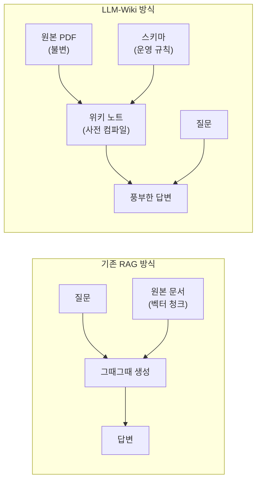
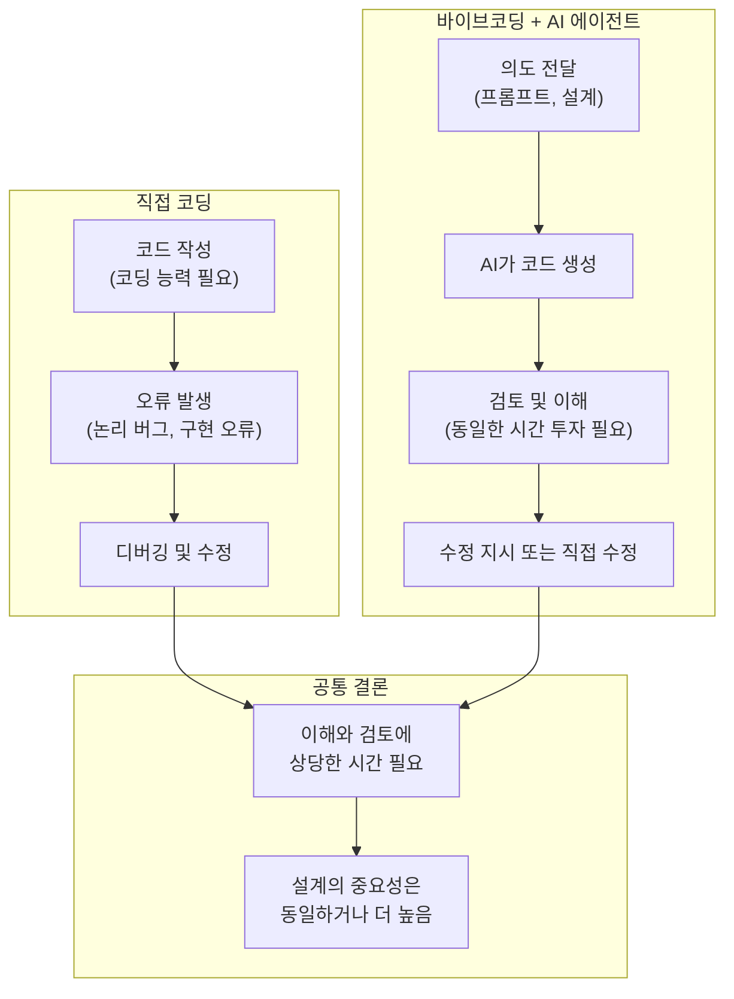
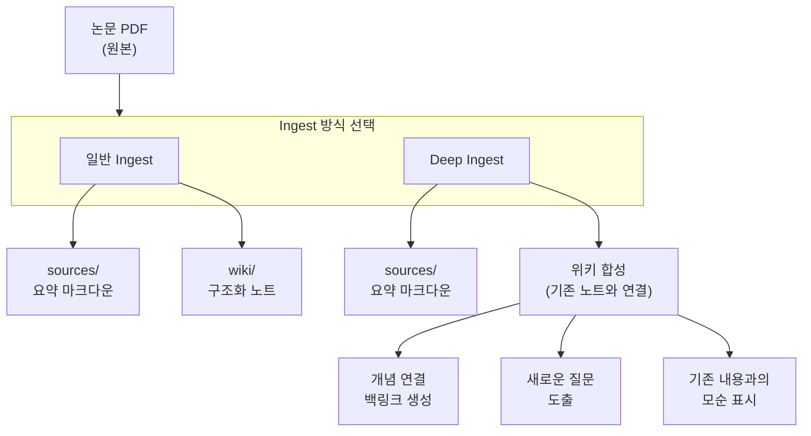
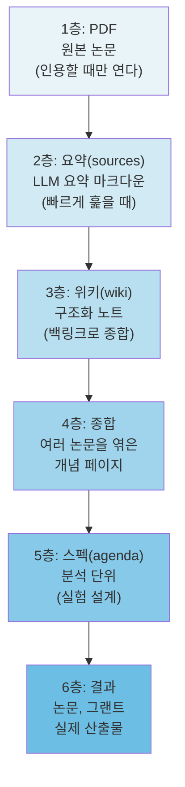
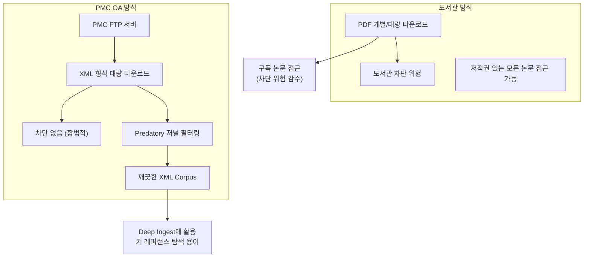
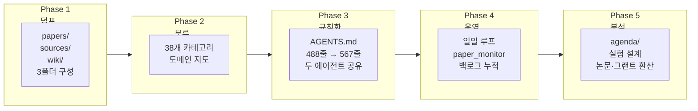

> **원문 출처**: [joonan30.github.io/llm-wiki-labs/evolution/](https://joonan30.github.io/llm-wiki-labs/evolution/)  
> 저자의 [Facebook 포스팅](https://www.facebook.com/share/p/1H8SBczZxL/) 및 블로그에 담긴 실전 경험과 철학을 바탕으로 작성되었습니다.

---

## 목차

1. [이 글이 다루는 것](#1-이-글이-다루는-것)
2. [배경 — Karpathy의 LLM-Wiki 패턴](#2-배경--karpathys-llm-wiki-패턴)
3. [3단계 셋업 가이드](#3-3단계-셋업-가이드)
4. [에이전트와 인간 검토 — 저자의 핵심 통찰](#4-에이전트와-인간-검토--저자의-핵심-통찰)
5. [바이브코딩과 설계의 중요성](#5-바이브코딩과-설계의-중요성)
6. [LLM-Wiki 실전 구조 — 논문 ingest의 두 가지 방식](#6-llm-wiki-실전-구조--논문-ingest의-두-가지-방식)
7. [지식 체인 — 6단계 누적 구조](#7-지식-체인--6단계-누적-구조)
8. [검색 품질 벤치마크 — grep vs. SQLite](#8-검색-품질-벤치마크--grep-vs-sqlite)
9. [저자의 개인적 LLM-Wiki 활용법](#9-저자의-개인적-llm-wiki-활용법)
10. [PMC XML — 도서관 차단 이후 발견한 대안](#10-pmc-xml--도서관-차단-이후-발견한-대안)
11. [학생 교육 효과 — "AI가 논문을 대충 읽게 한다"는 우려에 대해](#11-학생-교육-효과--ai가-논문을-대충-읽게-한다는-우려에-대해)
12. [31일 케이스 스터디 — 폴더가 자라는 과정](#12-31일-케이스-스터디--폴더가-자라는-과정)
13. [역할별 운영 방식](#13-역할별-운영-방식)
14. [외부 시스템 연동 생태계](#14-외부-시스템-연동-생태계)
15. [다른 분야로의 이전 — 8가지 원칙](#15-다른-분야로의-이전--8가지-원칙)
16. [향후 계획과 의미](#16-향후-계획과-의미)

---

## 1. 이 글이 다루는 것

이 문서는 한 연구자 겸 교수가 자신의 블로그와 Facebook에 공유한 콘텐츠를 바탕으로 한다. 핵심 주제는 두 가지다. 첫째, AI 에이전트를 이용한 코딩 작업에서 인간 검토의 역할과 설계의 중요성에 대한 성찰이다. 둘째, 연구자가 논문을 읽고 지식을 축적하는 방식을 근본적으로 바꾸는 LLM-Wiki 구축 방법이다.

저자는 단순한 도구 소개에 머물지 않는다. 학생을 가르치면서 직접 부딪힌 우려와 반박, 도서관에서 PDF를 무더기로 내려받다가 두 번이나 차단당한 경험, PMC XML이라는 대안을 발견한 과정까지, 실제로 겪은 일들을 솔직하게 공유한다.

블로그에 공개된 데이터에 따르면, 이 저자는 31일 동안 3,398개의 PDF를 ingest하여 3,369개의 요약 마크다운과 3,955개의 위키 노트를 만들었다. 위키를 운영하는 AGENTS.md 매뉴얼은 567줄에 달한다. 이 숫자들은 단순한 실험이 아니라 실제 연구 환경에서 작동하는 시스템의 결과물이다.

---

## 2. 배경 — Karpathy의 LLM-Wiki 패턴

이 모든 흐름의 출발점은 Andrej Karpathy(Tesla AI 총괄, OpenAI 창립 멤버)가 공개한 짧은 문서 `llm-wiki.md`에 있다. 그는 코드보다 개인 지식 저장소 구축에 더 많은 AI 토큰을 사용하고 있다고 밝히며, 기존의 RAG(Retrieval-Augmented Generation) 방식과는 근본적으로 다른 접근을 제안했다.

### RAG와 LLM-Wiki의 차이

기존 RAG 방식은 사용자가 질문할 때마다 원본 문서를 검색하고 그 자리에서 답을 생성한다. 이 방식에는 세 가지 문제가 있다. 첫째, 같은 자료에 대해 같은 추론이 반복되면서 토큰과 시간이 낭비된다. 둘째, 검색된 청크 단위의 응답이라 원본 문서들 사이의 관계나 모순을 한눈에 보기 어렵다. 셋째, LLM이 지식을 "소유"하지 않고 매번 처음부터 읽는 구조이기 때문에 지식이 누적되지 않는다.

LLM-Wiki는 이 문제를 정면으로 뒤집는다. LLM이 원본 문서를 읽고 끝내는 것이 아니라, 읽은 내용을 마크다운 위키 페이지로 정리하고, 기존 페이지와 교차 참조를 만들고, 새 정보가 기존 주장과 모순되면 그것까지 표시하도록 한다. 핵심은 "질의 시점에 조각을 조립하는" RAG가 아니라 "수집 시점에 종합을 완료하는" 사전 컴파일 방식이다.



Karpathy는 자신의 시스템에서 약 100편의 아티클, 40만 단어 규모의 위키를 운영했으며, 이 정도 규모에서는 복잡한 RAG 없이도 충분히 잘 작동했다고 설명한다. 그의 작업 환경은 한쪽에 LLM 에이전트, 다른 쪽에 Obsidian을 띄워놓고 LLM이 위키를 수정하면 Obsidian에서 실시간으로 결과를 확인하는 방식이다. Obsidian은 IDE, LLM은 프로그래머, 위키는 코드베이스라는 비유가 적절하다.

### 3층 구조

LLM-Wiki의 아키텍처는 단순하다. 세 개의 레이어로 구성된다.

첫째, **원본 소스(Raw Sources) 레이어**다. 논문, 기사, 이미지, 데이터 파일 등 수집한 원본 자료가 그대로 보관된다. LLM은 이 파일을 읽기만 하고 절대 수정하지 않는다. 진실의 원천(source of truth)이다.

둘째, **위키(Wiki) 레이어**다. LLM이 생성하고 유지하는 마크다운 파일 디렉터리다. 요약, 엔티티 페이지, 개념 페이지, 비교, 종합 분석 등이 이곳에 쌓인다. 사람은 읽기만 하고, LLM이 생성하고 유지 보수한다.

셋째, **스키마(Schema) 레이어**다. 위키의 구조와 규칙을 정의하는 설정 파일이다. Claude Code의 `CLAUDE.md`나 Codex의 `AGENTS.md` 같은 것으로, LLM을 "규율 있는 위키 관리자"로 만드는 핵심 설정이다. 이 파일은 사용자와 LLM이 함께 발전시켜 나간다.

---

## 3. 3단계 셋업 가이드

저자의 블로그에서 소개하는 셋업 방법은 놀랄 만큼 단순하다. "5분 만에 시작합니다"라는 부제가 과장이 아니다.

### Step 01 — 어떤 AI를 쓰는가

두 가지 선택지가 있다.

- **ChatGPT**를 쓰는 경우 → `Codex` 앱 다운로드
- **Claude**를 쓰는 경우 → `Claude` 앱 다운로드

두 앱 모두 작동 방식은 같다고 저자는 설명한다. 어느 쪽을 선택해도 LLM-Wiki를 구축하는 데 차이가 없다는 뜻이다.

### Step 02 — 폴더 하나 만들기

앱을 켜면 채팅창이 열린다.

- **Codex**를 쓰는 경우에는 그대로 사용하면 된다.
- **Claude**를 쓰는 경우에는 화면 위쪽의 세 번째 탭인 "Code"를 누른다.

채팅창 바로 위에 폴더 선택 메뉴가 보인다. 컴퓨터에 `llm-wiki`라는 이름의 폴더를 새로 만들고, 그 폴더를 선택한다. 이 폴더가 앞으로 모든 작업이 이루어지는 작업 공간이 된다.

### Step 03 — 링크 붙이고 한 마디

채팅창에 아래 GitHub Gist 링크를 붙여 넣는다.

```
https://gist.github.com/joonan30/cbce305684d079dbe9a3fbaefe4e3959
```

그리고 한 마디만 던진다.

> "나도 이거 세팅해줘"

끝이다. AI가 나머지를 처리한다.

### 셋업 직후 처음 만나는 다섯 가지

블로그에서는 셋업 직후 처음 접하는 다섯 가지 질문에 답한다.

**"ingest"란 무엇인가?** PDF 한 편을 AI가 읽고, 요약 마크다운(`sources/`)과 구조화된 위키 노트(`wiki/`)로 자동 변환하는 과정이다. "논문 정리하다"를 위키에서 부르는 짧은 말이다. 한 편 ingest = 폴더 안에 마크다운 노트 1편 + 위키 페이지 1편이 새로 생긴다는 의미다.

**처음엔 PDF 1편으로 작게 시작한다.** 책상 위에 있는 PDF 한 편을 채팅창에 끌어다 놓고 "이 PDF ingest해줘"라고 하면 AI가 `papers/`에 PDF를 옮기고, `sources/`에 요약 마크다운을 만들고, `wiki/`의 적절한 카테고리 폴더에 노트를 넣는다. 5분이면 첫 결과가 나온다.

**서지 프로그램 폴더 통째로 연결하기.** Zotero, EndNote, Mendeley에 PDF가 이미 수십~수백 편 쌓여 있다면 그 폴더 위치를 한 번만 알려주면 이후엔 새로 추가된 PDF만 자동으로 ingest된다.

**마크다운은 무엇인가?** 텍스트에 `#`, `*`, `-` 같은 기호 몇 개로 제목, 강조, 목록을 표시하는 형식이다. 코드가 아니고, 메모장으로도 열리는 평범한 텍스트다. 파일 확장자 `.md` = 마크다운 파일이다.

**에이전트가 "allow"를 물어볼 때 컴퓨터가 망가지지 않는가?** AI가 파일 읽기·쓰기·실행 전에 매번 물어보는 안전장치다. 권한은 그 폴더 안에서만 작동한다. 처음 며칠은 직접 확인하면서 AI가 어떤 행동을 하는지 파악하고, 익숙해지면 auto mode로 전환하는 것이 권장된다.

---

## 4. 에이전트와 인간 검토 — 저자의 핵심 통찰

저자는 에이전트로 코드를 작성하더라도 인간이 반드시 검토해야 한다는 점을 강조한다. 그런데 여기서 흥미로운 관찰이 나온다.

코드를 처음부터 직접 작성하는 것과, 바이브코딩을 하고 난 후에 검토하는 것은 방식은 전혀 다르지만, 비슷한 수준의 완성도가 들어간다고 저자는 느낀다. 인간이 직접 작성할 때의 코딩 능력 한계와 오류를 감수하는 위험, AI에게 의탁하여 작성된 코드에서 인간이 잘 모르는 부분에 생기는 오류가 비슷한 수준이라는 것이다.

이는 매우 실용적인 통찰이다. AI 코딩 도구가 "코드를 대신 써주니까 이제 이해 안 해도 된다"는 환상을 깨뜨린다. 어느 쪽을 택하든 이해하고 검토하는 데 상당한 시간을 투자해야 한다.



최근 연구에서도 이 점은 확인된다. 바이브코딩 연구자들이 실제로 어떻게 작업하는지를 분석한 결과, 코드 전체를 줄줄이 검토하는 것이 아니라 빠른 시각적 스캔을 통해 익숙한 패턴이나 키워드를 찾는 방식으로 검토가 이루어진다. 전통적인 디버깅 기술은 바이브코딩에서도 여전히 필수다. 오류가 발생했을 때 개발자들은 오류 메시지를 분석하고, 브라우저 개발자 도구나 터미널을 사용하며, 스스로 버그에 대한 가설을 세운다. 그 후 AI에게 수정을 맡기는 방식이다.

---

## 5. 바이브코딩과 설계의 중요성

저자는 바이브코딩을 직접 경험하고 난 뒤 "설계가 중요하다"는 결론에 다시 한번 도달했다고 말한다. 뻔한 이야기지만, 실제로 해보고 나서 더 확실히 느꼈다는 것이다.

이 인식은 최신 논의와도 정확히 일치한다. 에이전틱 엔지니어링이 발전하면서 엔지니어의 역할이 바뀌고 있다. 코드를 직접 한 줄씩 타이핑하는 '작가'에서, AI가 잘 일할 수 있는 환경과 규칙을 설계하는 '지휘자'로 이동하고 있다. AI가 코드 한 줄을 작성하기 전에 목표 정의, 작업 분해, 제약 조건 설정, 품질 게이트 지정, 에이전트 역할 할당 같은 설계 작업이 먼저 이루어져야 한다는 것이다.

저자는 이 경험을 코드 작업에도 LLM-Wiki 형태를 도입하는 것으로 연결시킨다. 주로 원고 작업을 하는 폴더와 분석을 하는 폴더를 나누어 작업하는데, 이 둘을 각각 LLM-Wiki로 운영하며 폴더와 작업 환경 운영 규칙을 정해둔다. 그리고 각 폴더 내의 원고 및 프로젝트에 대한 작업 로그를 함께 남긴다.

논문을 읽는 LLM-Wiki와 별개로, 코드 프로젝트를 위한 LLM-Wiki도 운영한다는 점이 핵심이다. 설계 결정 사항, 폴더 구조 규칙, 작업 이력 등이 LLM-Wiki에 기록됨으로써 에이전트가 매 세션마다 동일한 컨텍스트에서 작업을 시작할 수 있다.

---

## 6. LLM-Wiki 실전 구조 — 논문 ingest의 두 가지 방식

저자가 운영하는 논문 LLM-Wiki에는 두 가지 ingest 방식이 있다.

### 일반 Ingest

논문 PDF를 읽고 요약 마크다운을 `sources/` 폴더에 저장하고, 구조화된 위키 노트를 `wiki/` 폴더에 생성하는 기본적인 과정이다. 빠르고 효율적으로 논문의 핵심 내용을 위키에 추가한다.

### Deep Ingest

단순 요약에서 그치지 않고, 기존 위키와 합성하여 개념 연결을 하거나 새로운 질문을 도출하는 과정까지 수행한다. 새로운 논문에서 얻은 정보가 기존 위키 내용과 어떻게 연결되는지, 또는 모순되는지를 능동적으로 파악한다.

저자는 논문 한 편의 ingest 결과물이 어떤 형태인지 구체적으로 보여주는데, 예를 들어 한 논문의 위키 노트는 제목, 저자, 연도, 저널, 카테고리, 태그, 요약, 핵심 방법론, 관련 위키 링크 등을 담은 마크다운 파일 형태다. 중요한 것은 이 텍스트가 그 자체로 데이터라는 점이다. 어디 갇혀 있지 않고 어떤 도구로든 열고 검색할 수 있다.



### 토큰 공유와 Notion 활용

논문 ingest는 토큰이 소모된다. 연구실에서 학생들이 같은 논문을 읽는다면, 동일한 논문에 대해 각자 ingest하는 것은 토큰의 중복 낭비다. 저자는 이를 해결하기 위해 누군가가 논문을 읽으면 Notion으로 위키와 PDF를 공유하는 방식을 채택했다. (도서관에서 PDF를 많이 받으면 차단당하기 때문에 PDF 공유도 중요하다는 현실적인 이유도 있다.)

---

## 7. 지식 체인 — 6단계 누적 구조

저자의 블로그에서 가장 인상적인 개념 중 하나는 "지식 체인"이다. 연구자의 지식은 한 층이 아니라 여섯 층으로 누적된다고 설명한다. 이전 층 없이는 다음 층이 존재할 수 없으며, 체인의 어느 단계가 끊기면 위쪽 전체가 무너진다.



이 구조에서 위키는 단순한 저장소가 아니라 운영 체제에 가까워진다. 매일 새로운 논문이 들어오고, 새로운 개념이 연결되고, 분석 스펙이 만들어지고, 그것이 실제 결과물로 환산되는 순환 구조다.

---

## 8. 검색 품질 벤치마크 — grep vs. SQLite

저자는 주기적으로 LLM-Wiki에 대해 에이전트와 상의한다고 밝힌다. "내가 구축한 게 정말 유용해 보여? 구조적으로 다듬을 게 없을까?"라고 물으며 자가 진단을 수행한다.

특히 검색 품질에 대한 관심이 높다. 최근 아카이브에도 RAG를 할 때 `grep`(단순한 키워드 검색)이 좋은지, SQLite 형식이 좋은지에 대한 벤치마크가 종종 올라오고 있다. 저자는 qmd(Quarto Markdown)를 사용하며, `grep`, `rg`(ripgrep) 등과 자주 벤치마킹하는데, 아직까지는 성능이 꽤 좋다고 한다.

이는 LLM-Wiki 구축에서 흔히 간과되는 중요한 측면을 짚어낸다. 아무리 잘 만든 위키도 검색이 느리거나 부정확하면 실용성이 크게 떨어진다. 복잡한 벡터 DB가 아닌 단순한 텍스트 검색 도구가 충분히 경쟁력 있다는 점은, 도구의 단순함이 때로 강점이 된다는 Karpathy의 원칙과도 일맥상통한다.

---

## 9. 저자의 개인적 LLM-Wiki 활용법

저자는 단순히 논문을 ingest하는 것을 넘어, LLM-Wiki를 다양한 방식으로 능동적으로 활용한다고 소개한다.

### 공동 연구자 파악

공동 연구를 하는 교수들의 논문을 모두 찾아서 PDF ingest를 한다. 해당 주제에 대한 공부뿐 아니라, 이 분들이 어떤 실험과 기술을 다루는지를 파악하고, 공동 연구에서 어떤 실험을 설계할 수 있을지 실험 계획을 만들어본다. 자신이 모르는 분야의 기술이기 때문에 어느 정도의 이해를 맞추기 위해 사용하는 도구이며, 공동 연구에 참여하는 학생들도 다른 분야의 주제를 배울 수 있다.

### 대가들의 글쓰기 방식 분석

1990년대, 2000년대 초반에 특정 분야의 대가 교수들의 논문을 찾아서, 서론에서는 어떻게 글을 전개했는지, 결론에서는 어떻게 글을 마무리하고 생각을 확장했는지의 전개 방식을 파악한다. 자료가 꽤 수집되었으며, 정리가 되면 교과서에 추가하려는 계획이 있다.

### 관점이 다른 연구 그룹 비교

특정 주제에 대해 관점이 다른 연구 그룹들의 논문들을 찾아서 정리하고 있다. 하나의 주제에 대한 다양한 시각을 한 위키 안에서 비교할 수 있는 구조를 만드는 것이다.

### (그리고) PDF 대량 다운로드로 도서관 2회 차단

솔직하게 고백한다. PDF 대량 다운로드로 인해 도서관에서 두 번 차단당했다. 현재 세 번째 시도 중이라고 한다.

---

## 10. PMC XML — 도서관 차단 이후 발견한 대안

도서관에서 두 번 차단을 당하고 나서 저자는 다른 방식을 모색해야 했다. 그 결과 발견한 것이 PubMed Central(PMC)의 Open Access 논문 XML 파일이다.

PMC는 미국 국립보건원(NIH)의 국립의학도서관(NLM)이 운영하는 생의학 및 생명과학 저널 아티클의 무료 전문(full-text) 아카이브다. 여기에는 Creative Commons 또는 유사한 라이선스 하에 오픈 액세스(OA)로 제공되는 수백만 편의 논문이 XML 형식으로 제공된다. XML은 PDF보다 규칙화된 텍스트 파일이라 ingest하기 좋다.

저자가 이 방식을 선택한 이유와 장점, 그리고 한계는 다음과 같다.

### 장점

- PDF 대량 다운로드처럼 도서관이나 출판사에서 차단당할 위험이 없다.
- XML은 텍스트로 구조화되어 있어 파싱(parsing)과 ingest가 용이하다.
- FTP를 통해 대량 데이터를 합법적으로 받을 수 있다.
- Deep ingest를 할 때 특히 유용하다. 특정 논문을 찾아서 읽고 핵심 참고문헌을 추가로 탐색할 때 빠르다.

### 실용적 처리 방법

파일 크기가 수백 기가바이트에 달하는 전체 OA 데이터셋 중에서 MDPI, Frontiers 등 소위 Predatory Journal(약탈적 저널)로 분류되는 출판사 논문을 삭제하면 용량이 크게 줄어든다. 저자는 "MDPI가 진짜 문제다"라고 직접적으로 표현하고 있다.

### 한계

OA 논문만 제공되므로 구독이 필요한 논문들은 이 방법으로 접근할 수 없다. 그러나 도서관을 통해 받는 것보다 훨씬 용이하고, 특히 대규모 corpus 구축에 실용적이다.



---

## 11. 학생 교육 효과 — "AI가 논문을 대충 읽게 한다"는 우려에 대해

저자가 이 작업 방법을 강의하다 보면 많은 사람들이 같은 우려를 표한다고 한다.

"AI로 논문을 읽는 건 딸깍 수준이고, 지식이 생성되지 않는다."

저자는 이 말이 맞는 말이지만, 동의하지 않는다고 한다. 논문 PDF를 올리고 ingest 하는 것은 생각보다 많은 공부가 된다는 것이다.

왜 그럴까? ingest 과정에서 출력되는 내용은 A4 반 페이지 정도로 길지 않은데, 이것을 이해가 되지 않더라도 눈으로 한 번은 읽어야 한다. 그리고 이후에 어떤 질문이 생겼을 때 묻거나, 저널 클럽을 준비하면서 열람한다면 어느 정도의 지식은 반드시 가져갈 수 있다.

### 학생이 자신감을 얻는 과정

연구자가 되기 위해 학생들은 각자의 주제를 능동적으로 발전시켜야 한다. 그런데 LLM-Wiki를 통해 자신의 주제를 자신의 말과 글로 표현하는 과정이 빨라지면서 자신감을 빠르게 얻는다고 한다. 훈련 과정에서 설령 틀렸더라도, 자신의 언어로 풀어내보는 것은 중요하다. 그로부터 어떤 질문을 연결해 나가는 것은 더욱 중요하다.

많은 교수들이 LLM-Wiki를 처음 접했을 때 "우리 학생들이 논문을 AI로 대충 읽고 파악을 못 하면 어쩌냐"라는 우려를 하지만, 실제로 사용해보면 그런 우려는 크지 않다고 저자는 밝힌다. 교수들이 실제로 사용하고 나면 연락이 두절될 정도로 효과적이라는 재치 있는 표현도 붙였다.

### 학생 온보딩에서의 활용

처음 연구실에 들어온 학생들이나 새 프로젝트에 온보딩하는 학생들은 좋은 논문을 선별하기 어렵다. 저자는 자신이 먼저 중요한 논문을 선별해서 읽고 주제에 대한 전반적인 흐름을 파악한 다음, 정리된 위키를 전달하는 것이 아니라 온보딩에 적합한 논문 PDF들을 뽑아서 보내고 학생 스스로 LLM-Wiki로 정리하라고 한다.

이 과정을 거치면 학생들은 쉽게 내용을 파악한다. 저자는 이것이 학생을 초기에 훈련시킬 때 가장 효과적인 방식이라고 단언한다.

---

## 12. 31일 케이스 스터디 — 폴더가 자라는 과정

블로그에는 실제로 이 시스템을 31일 동안 운영한 기록이 공개되어 있다. 관찰 기간은 2026년 4월 8일부터 5월 8일까지다.

31일 동안의 결과를 정리하면 다음과 같다.

| 항목 | 수치 |
|---|---|
| 원본 PDF | 3,398편 |
| 요약 마크다운(sources/) | 3,369개 |
| 위키 노트(wiki/) | 3,955페이지 |
| 위키 카테고리 | 38개 |
| 운영 매뉴얼(AGENTS.md) | 567줄 |
| 일일 모니터 스크립트 | 1,101줄 |
| 연동 에이전트 | 2개 (Claude + Codex CLI) |

### 5개의 진화 단계(Phase)

31일이 균일하지는 않았다. 다섯 번의 분기점이 있었다.

**Phase 1 — 덤프(04-08 ~ 04-12)**: 처음 5일 동안은 단순한 3폴더 구조(papers/sources/wiki)만 구성하고 PDF를 쏟아 넣었다. 시스템에 자료를 채우는 단계다.

**Phase 2 — 분류(04-12 ~ 04-22)**: 축적된 자료를 카테고리로 분류하기 시작했다. 38개 카테고리로 정리된 도메인 지도가 이 시기에 만들어졌다.

**Phase 3 — 규칙화(04-22 ~ 04-29)**: 21일 동안 머릿속으로만 운영하던 규칙이 AGENTS.md라는 문서로 처음 작성된 시점이다. 4월 29일 단 한 번의 커밋으로 0줄에서 488줄로 만들어졌다. 이 순간부터 사람과 Claude, Codex가 같은 페이지에서 작업하기 시작한다.

**Phase 4 — 운영(04-29 ~ 05-05)**: 일일 루프가 자리를 잡는 시기다. paper_monitor 스크립트가 매일 돌아가고, 분석 백로그가 쌓이기 시작한다.

**Phase 5 — 분석(05-05 ~ 현재)**: 위키 작업이 실제 연구 결과물로 환산되는 단계다. 분석 스펙(agenda/)이 만들어지고 실험 결과가 나오기 시작한다.



---

## 13. 역할별 운영 방식

저자의 블로그에서 특히 인상적인 부분은 학부 연구생, 대학원생, 연구원, 교수(PI) 네 가지 역할별로 위키를 어떻게 활용하는지를 구체적으로 제시한다는 점이다.

### 학부 연구생

처음 연구실에 들어온 학부생에게는 AGENTS.md 전체를 읽히지 않는다. "에이전트 부트스트랩 체크리스트"와 "언어 정책" 두 가지만 읽으면 시작 가능하다. 이후 사수가 지정한 논문 1편을 직접 ingest해보고, paper_monitor.py를 매일 돌려 결과 리포트를 5분씩 훑는 습관을 들인다.

### 대학원생

매일 돌리는 두 가지 루프가 있다. 아침에 paper_monitor 결과 확인 및 신규 ingest, 오후에 진행 중인 분석 백로그 한 항목 30분 작업이다. 주간으로는 새 분석 백로그 6행 작성과 미팅 노트 초안 작성이 있다.

### 연구원

팀의 일관성을 지키는 역할이다. 깨진 wikilink 모니터, AGENTS.md vs. 실제 운영 진단, 분석 백로그 리뷰 등이 주요 업무다. 연구원 한 명이 휴가를 가더라도 시스템이 멈추지 않도록 매뉴얼을 유지하는 것이 핵심 책임이다.

### 교수/PI

매주 5분으로 그룹 전체 운영 상태를 파악한다. 세 숫자만 본다. 그 주 새로 작성된 분석 백로그 수, 클로즈된 P0 항목 수, 누적 TSV 템플릿 수다. 이 세 숫자가 그룹의 실질 생산성을 나타낸다. 5번 레이어(분석)가 정체되어 있다면 위키 작업이 외부 결과로 이어지지 못하고 있다는 경고 신호다.

---

## 14. 외부 시스템 연동 생태계

31일이 지나면서 폴더 구조는 처음의 3개 폴더에서 훨씬 복잡해졌다. 7개의 운영 폴더가 추가되었고, 외부 시스템 5개와 연동되었다.

### 추가된 운영 폴더

- `agenda/` — 분석 스펙. Goal·Input·Output·Done이 박힌 작업 단위가 들어간다.
- `interactives/` — 시각화 파일. HTML과 데이터 묶음 13개가 있다.
- `slides/` — 강의 및 발표 자료. 위키 노트가 슬라이드의 1차 입력이 된다.
- `peer-review/` — 외부 논문 리뷰 작업 공간.
- `note-meeting/` — 미팅마다 한 파일. 결정 사항이 위키 노트로 자동 백링크된다.
- `scripts/` — 자동화 코드. paper_monitor 1,101줄 + ingest 배치 + audit.
- `logs/` — 깨진 wikilinks, 중복 stem, 메타데이터 블로커 등 정리 작업의 흔적.

### 외부 시스템 연동 (MCP)

Notion, Slack, Gmail, Grants(연구비 과제), AI 에이전트 두 종류(Claude + Codex CLI)와 연동된다. 연동은 MCP(Model Context Protocol)를 통해 이루어진다.

예를 들어 "오늘 ingest한 논문 5편 한 줄씩 요약해서 Slack DM으로 사수한테 보내줘"라고 하면, 위키에서 오늘 작업한 내용을 추려 Slack으로 자동 발송된다. 또는 "위키에서 X 주제 관련 노트 5개 추려서 미팅용 1페이지 요약 만들어줘. Notion에 내일 미팅 페이지 만들어서 거기 넣고, Gmail로 공동 연구자한테 메일 초안까지"라고 하면, 위키 검색 → Notion 페이지 생성 → Gmail 초안 작성이 한 흐름으로 이루어진다.

두 에이전트는 역할이 다르다. **Claude**는 대화형으로 분석 스펙, 미팅 노트, 인터랙티브, 메일 초안을 짠다. **Codex CLI**는 배치 자동화로 paper_monitor, ingest, audit을 담당한다. 그러나 두 에이전트 모두 동일한 AGENTS.md 567줄을 공유한다.

---

## 15. 다른 분야로의 이전 — 8가지 원칙

저자의 블로그에는 이 시스템이 생물학·신경과학에 한정된 것이 아니라 다른 분야에도 적용될 수 있다는 내용이 담겨 있다. "1인 연구자 + 다중 AI 에이전트" 환경이면 어떤 분야에도 통한다는 것이다. 핵심 원칙 8가지를 요약한다.

**단일 운영 매뉴얼**: 에이전트마다 다른 규칙을 주지 않는다. 폴더 루트의 `AGENTS.md` 하나로 모든 에이전트가 같은 시작점을 공유한다.

**단일 매핑 소스**: 프로젝트와 DB, 앵커 ID 매핑은 단 한 파일에만 존재한다. 모든 에이전트가 매 세션 처음에 그 파일을 다시 읽게 한다.

**메모리 누적 가드레일**: "이런 식으로 쓰지 마"가 반복되면 즉시 메모리에 기록한다. 같은 교정을 두 번 시키지 않는다.

**덤프 → 분류 → 운영 → 분석 순서**: 처음부터 분석 시스템을 만들려 하지 않는다. 먼저 덤프하고 분류한다. 운영이 자리를 잡은 다음에야 분석이 나온다.

**출력 경로 사전 지정**: 에이전트에게 일을 시킬 때 "어디에 무엇을" 둘지 미리 정한다. 사후 정리는 늘 비용이 많이 든다.

**노트 끝에 다음 작업을 박는다**: 위키 페이지 끝에 "다음 분석에 필요한 컬럼"을 미리 적어둔다. 그 한 줄을 그대로 다음 작업의 백로그로 옮길 수 있다.

**웹 검색 차단의 가치**: 로컬 파일만 사용하도록 명시하면 에이전트가 인터넷에서 가져온 불확실한 정보로 빈칸을 메우지 못한다. "모름"은 텍스트 prose가 아니라 컬럼에 "unknown"으로 명시한다.

**일일 모니터의 누적 가치**: 매일 돌아가는 1,101줄짜리 모니터 스크립트가 30일 누적되면, 그 자체가 해당 분야의 동향 데이터셋이 된다.

---

## 16. 향후 계획과 의미

저자는 이 경험을 바탕으로 두 가지 교과서를 만들 계획을 밝히고 있다. 대학원생을 위한 LLM-Wiki 교과서, 그리고 교수들을 위한 LLM-Wiki 교과서다.

지금까지의 기록은 블로그(joonan30.github.io/llm-wiki-labs/evolution/)에 공개되어 있으며, 이 블로그는 인터랙티브 차트와 함께 31일간의 변화를 상세하게 문서화하고 있다.

### 이 글에서 읽어낼 수 있는 시사점

LLM-Wiki라는 아이디어는 두 가지 근본적인 관점 전환을 요구한다.

첫 번째는 **LLM을 사용자로 보는 것이 아니라 관리자로 보는 것**이다. 지금까지 대부분의 AI 지식관리 도구는 사용자가 질문하면 AI가 답하는 구조였다. LLM-Wiki는 AI가 지식을 직접 쌓고 유지하게 하고, 사람은 그 결과물을 탐색하는 구조로 역할을 뒤집는다.

두 번째는 **지식을 모델 안이 아닌 파일 위에 명시적으로 남기는 것**이다. AI 모델은 대화가 끝나면 기억을 잃는다. LLM-Wiki는 이 망각 문제를 AI의 메모리를 키우는 방식이 아니라, 파일 시스템 위에 지식을 명시적으로 쌓는 방식으로 해결한다. 텍스트 파일은 특정 플랫폼에 종속되지 않고, 검색되고, 백업되고, 이식될 수 있다.

이 원칙은 연구실만의 이야기가 아니다. 코드 프로젝트, 기업 운영, 개인 지식 관리 등 어떤 영역에서든 AI 에이전트를 장기적으로 활용하려는 사람이라면 동일하게 적용된다.

---

*작성일자: 2026-06-28*
