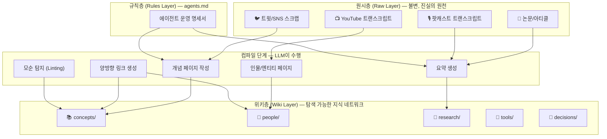
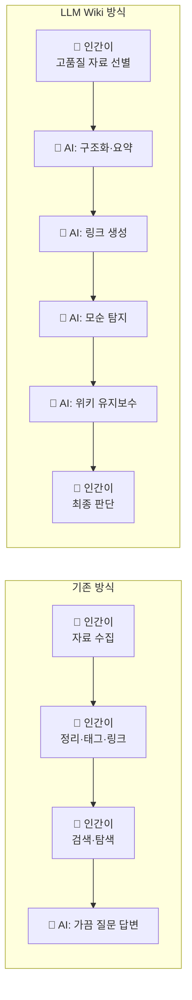
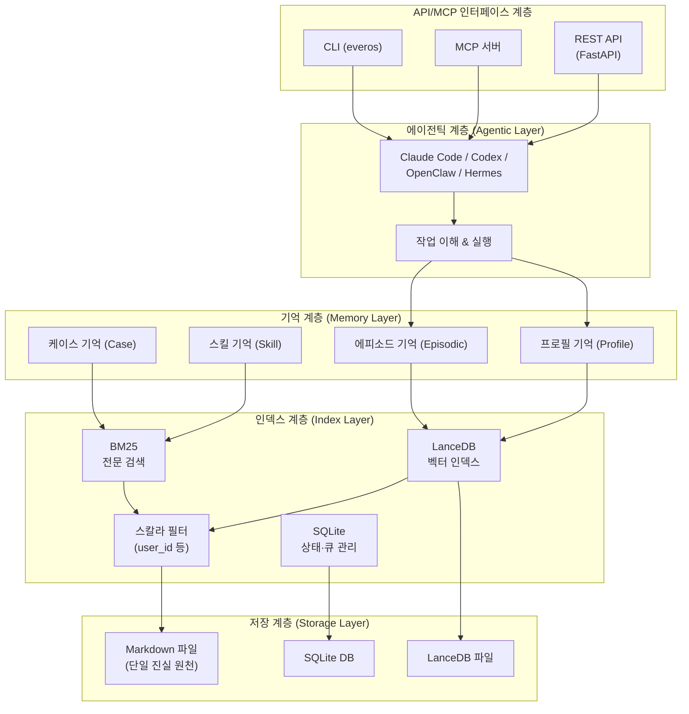
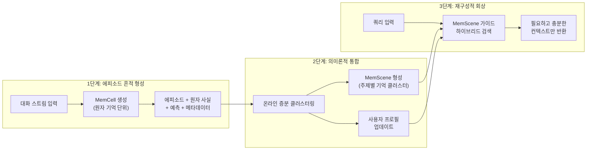
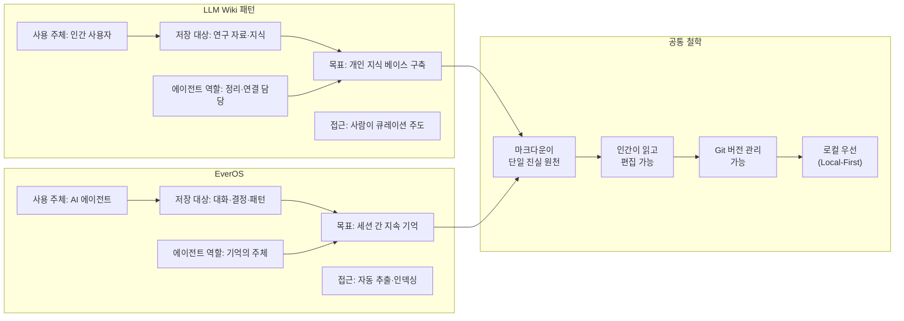

> **출처**: AYi([@AYi_AInotes](https://x.com/ayi_ainotes/status/2070720877038035117)) X(Twitter) 게시글 2건 + EverOS 공식 자료 + Andrej Karpathy GitHub Gist 기반  
> **대상 독자**: AI 에이전트 개발자, 지식 관리에 관심 있는 실무자  
> **작성일**: 2026-06-28

---

## 목차

1. [서론: AI 에이전트는 왜 매일 아침 기억을 잃는가](#1-서론)
2. [Andrej Karpathy의 LLM Wiki 패턴](#2-karpathy-llm-wiki)
3. [대부분의 Obsidian 사용자가 범하는 근본적 오류](#3-obsidian-오류)
4. [EverOS: AI 에이전트를 위한 기억 운영체제](#4-everos)
5. [EverOS 내부 아키텍처 상세 해설](#5-architecture)
6. [EverOS 설치 및 실습 튜토리얼](#6-tutorial)
7. [EverOS 파일 구조와 투명한 기억](#7-file-structure)
8. [LLM Wiki와 EverOS의 관계: 개인 지식 vs. 에이전트 기억](#8-comparison)
9. [실무 적용 시사점](#9-practical)
10. [결론: 기억이 AI의 다음 전쟁터다](#10-conclusion)

---

## 1. 서론: AI 에이전트는 왜 매일 아침 기억을 잃는가 {#1-서론}

오늘날 Claude Code, OpenClaw, Hermes, Codex 같은 코딩 에이전트를 사용해 본 사람이라면 누구나 한 번쯤 겪는 좌절이 있다. 어제 세 시간에 걸쳐 에이전트와 함께 복잡한 버그를 잡아냈는데, 오늘 새 세션을 열면 에이전트는 그 일을 전혀 기억하지 못한다. 어제의 결정, 팀의 코딩 컨벤션, 힘들게 발견한 특이 케이스, 이 모든 것이 이전 대화 창이 닫히는 순간 증발한다.

이 현상의 원인은 현재 LLM(대형 언어 모델)의 근본적인 설계 원칙에 있다. LLM은 **무상태(stateless)** 시스템이다. 각 세션은 완전히 독립적으로 시작되고, 이전 상호작용에서 무언가를 '학습'하거나 '기억'하는 메커니즘이 기본 아키텍처에 내장되어 있지 않다. 모델이 처리하는 모든 정보는 현재 컨텍스트 창 안에 있어야 하며, 창이 닫히면 사라진다.

개발자들이 선택하는 가장 흔한 대응책은 프롬프트를 더 길게 만드는 것이다. 이전 결정, 사용자 선호, 프로젝트 배경을 모두 프롬프트에 집어넣고 모델이 기억해 주기를 바란다. 그러나 이 방법에는 세 가지 치명적 한계가 있다. 첫째, 컨텍스트 창에는 토큰 한도가 있다. 둘째, 토큰을 쓸수록 비용이 늘어난다. 셋째, 가장 결정적으로, 이렇게 주입된 '기억'은 일회성이다. 창을 닫으면 모두 사라진다.

결론은 하나다. 필요한 것은 더 큰 프롬프트가 아니라 **지속적 기억 레이어(persistent memory layer)** 다. 바로 이 문제를 해결하기 위해 두 개의 서로 다른, 하지만 깊은 공통점을 가진 접근법이 2025~2026년 사이에 주목을 받았다. 하나는 Andrej Karpathy가 제시한 **LLM Wiki 패턴**이고, 다른 하나는 EverMind AI가 개발한 **EverOS**다.

---

## 2. Andrej Karpathy의 LLM Wiki 패턴 {#2-karpathy-llm-wiki}

### 2.1 카르파티는 누구이며, 무엇을 말했나

Andrej Karpathy는 OpenAI 공동 창업자이자 Tesla AI 부서 전 디렉터로, AI 분야에서 가장 영향력 있는 실무 연구자 중 하나다. 2026년 4월, 그는 GitHub Gist에 'LLM Wiki'라는 제목의 마크다운 문서를 공개했다. 제품이나 코드가 아니라 **패턴**이었다. 그러나 이 짧은 문서는 지식 관리에 대한 AI 커뮤니티의 이해를 근본적으로 흔들었다.

Karpathy 자신의 언어로 이 철학 전체를 한 문장으로 압축하면 이렇다: "Obsidian is the IDE; the LLM is the programmer; the wiki is the codebase." 즉, Obsidian은 개발 환경이고, LLM은 프로그래머이며, Wiki는 코드베이스다. 인간은 프로그램을 실행할 때마다 소스 코드를 다시 컴파일하지 않는다. 한 번 컴파일된 실행 파일이 존재하고, 그것을 실행한다. LLM Wiki도 마찬가지다. 원시 자료를 매번 다시 분석하는 대신, 한 번 '컴파일'된 구조화 위키가 존재하고 에이전트는 그것을 참조한다.

### 2.2 LLM Wiki의 3층 아키텍처

LLM Wiki 패턴의 핵심 구조는 세 개의 층으로 이루어진다.



**원시층(Raw Layer):** 수집한 모든 원본 자료가 여기에 들어온다. 아티클, 논문, 팟캐스트 트랜스크립트, 트윗 스크랩, YouTube 영상의 텍스트 기록 등이다. 이 폴더의 원칙은 단순하다: 한 번 들어온 자료는 절대 수정하지 않는다. 원시 자료의 진실성을 보존하는 불변의 저장소다.

**위키층(Wiki Layer):** LLM이 원시 자료를 읽고 자동으로 생성·유지하는 구조화된 마크다운 페이지들이다. 개념 페이지, 인물 페이지, 연구 요약 페이지, 비교 분석 페이지 등이 여기에 쌓인다. 각 페이지는 `[[wikilink]]` 형식으로 서로 연결되어 지식 네트워크를 형성한다.

**규칙층(Rules Layer):** `agents.md`라는 단일 파일이 이 역할을 한다. 이 파일은 에이전트가 수행해야 할 모든 행동의 운영 명세서다: 원시 자료를 어떻게 흡수할지, 질문에 어떻게 답할지, YouTube 영상을 어떻게 처리할지 등이 평문(plain English) 지침으로 적혀 있다.

### 2.3 RAG와 LLM Wiki의 근본적 차이

기술적으로 정통한 독자라면 RAG(검색 증강 생성)와 무엇이 다른지 물을 것이다. 차이는 본질적이다.

RAG는 질문이 들어올 때마다 원시 문서에서 관련 단편을 실시간으로 검색해 LLM에게 제공한다. 매번 다시 유도한다(re-derive). 반면 LLM Wiki는 원시 자료를 **한 번만** 컴파일해서 구조화된 지식 기반을 만들어 두고, 이후 질문은 이미 컴파일된 위키에 대해 이루어진다.

비유하자면, RAG는 프로그램을 실행할 때마다 소스 코드를 다시 컴파일하는 것과 같고, LLM Wiki는 컴파일된 실행 파일을 재사용하는 것과 같다. 위키는 정규 산출물(canonical artifact)로서 새 자료가 추가될 때마다 개선된다.

Karpathy의 원본 비판에 따르면, RAG는 지식을 단편화하고 LLM이 전체 지식 그래프를 통해 추론하는 능력을 깨뜨린다. 위키가 충분히 커지면, 즉 100개 이상의 아티클과 40만 단어 수준에 이르면, 복잡한 다단계 질문을 별도의 벡터 검색 없이 처리할 수 있게 된다.

### 2.4 Obsidian이 이 패턴에서 하는 역할

Obsidian은 마크다운 파일을 기반으로 한 로컬 우선 노트 앱이다. LLM Wiki 패턴에서 Obsidian은 두 가지 역할을 한다.

첫째, **시각적 탐색 환경**이다. Obsidian의 그래프 뷰는 위키 페이지들 사이의 연결 관계를 노드-엣지 형태의 네트워크로 시각화한다. 앞서 공유된 자료의 그래프 뷰 화면에서 볼 수 있듯이, `concepts/`, `people/`, `research/`, `tools/` 같은 폴더들이 수백~수천 개의 연결로 엮인 복잡한 지식망을 형성한다. 이 화면은 FabsWill이라는 사용자가 실제로 LLM Wiki 패턴을 적용한 결과물로, 에이전트가 자동 생성한 링크들이 밀집된 군집 구조를 보여준다.

둘째, **Web Clipper를 통한 원시 자료 수집**이다. Obsidian Web Clipper는 Chrome 확장 프로그램으로, 단 한 번의 클릭으로 웹 콘텐츠를 마크다운 파일로 변환해 `/raw` 폴더에 저장한다. 특히 YouTube 동영상에서 전체 트랜스크립트를 자동으로 추출해 front matter(출처 제목, URL, 저장 날짜, web-clip 태그)가 붙은 마크다운 파일로 변환한다.

### 2.5 생태계의 확산

Karpathy의 LLM Wiki 패턴은 2026년 AI 커뮤니티에서 나온 가장 실용적인 아이디어 중 하나로 평가받는다. 공개 직후 커뮤니티는 빠르게 반응했다.

공식 Obsidian 커뮤니티 플러그인 마켓플레이스에는 'Karpathy LLM Wiki'라는 이름의 플러그인이 등록되어 Obsidian 공식 점수 95/100을 기록했다. 다수의 오픈소스 구현체도 등장했는데, 그 중 obsidian-wiki 프레임워크는 Claude Code, Cursor, Windsurf, Hermes 등 주요 AI 코딩 에이전트에 자동으로 설치되는 스킬(skill) 파일 형태로 설계되었다. 단순히 노트 앱 기능을 넘어서, AI 에이전트가 지식 베이스를 자율적으로 성장시키는 시스템으로 발전한 것이다.

---

## 3. 대부분의 Obsidian 사용자가 범하는 근본적 오류 {#3-obsidian-오류}

AYi(@AYi_AInotes)의 두 번째 게시물은 국내외 AI 커뮤니티에서 큰 공감을 얻은 내용이다. 이 글의 핵심 주장은 한국 개발자들에게도 깊이 생각해볼 만한 통찰을 담고 있다.

### 3.1 기존 Obsidian 사용 방식의 문제

대부분의 Obsidian 사용자는 다음과 같은 패턴을 따른다. PDF에서 하이라이트를 추출하고, 수동으로 태그를 달고, 이중 링크(`[[]]`)를 손으로 연결하고, 시간이 지남에 따라 점점 많은 파일이 쌓여간다. 그러나 시간이 지날수록 새 파일과 기존 파일 사이의 연결이 제대로 관리되지 않아 **정보 고립섬(information island)** 이 형성된다. 그래프는 점점 복잡해지지만 정작 정보를 찾기는 어려워진다. 결국 완전히 방치하거나 처음부터 다시 시작하는 상황에 이른다.

문제의 핵심은 이것이다: 기존 방식에서 **인간**은 모든 정리 작업을 수행하고, AI는 단지 가끔 질문에 답하는 도구로만 쓰인다.

### 3.2 Karpathy가 제시한 분업의 역전

LLM Wiki 패턴은 인간과 AI의 분업 구조를 완전히 뒤집는다.



이 역전에서 인간이 하는 일은 두 가지뿐이다: **고품질 원시 자료를 선별**하는 것, 그리고 **최종 판단**을 내리는 것. 구조화, 링크 생성, 일관성 유지, 업데이트, 모순 탐지라는 '더러운 작업'은 전부 AI가 담당한다.

이 방식의 가장 중요한 특성은 **복리(compounding)** 다. 자료가 10개일 때도 유용하지만, 100개가 되면 자산들이 서로 연결되면서 더 깊은 통찰을 만들어낸다. 새 자료를 추가할수록 기존 지식이 더 풍부해진다.

---

## 4. EverOS: AI 에이전트를 위한 기억 운영체제 {#4-everos}

### 4.1 EverMind AI와 EverOS의 등장

EverMind AI는 AI의 기억 문제를 전문적으로 다루는 회사로, 2026년 4월 14일 캘리포니아 샌머테이오에서 EverOS의 공개 베타를 발표했다. EverOS는 AI의 가장 오래된 한계 중 하나인 이전 상호작용에서 기억하고 학습하지 못하는 문제를 해결하기 위해 설계된 장기 기억 운영체제다.

EverMind 팀은 이렇게 표현한다: "우리는 단순히 AI 스택에 또 하나의 레이어를 추가하는 것이 아니다. EverOS는 다음 시대의 지능형 에이전트를 위한 핵심 데이터 인프라로서 기능하는 기초 기억 운영체제를 표방한다. 우리의 사명은 AI의 핵심 약점, 즉 기억하지 못하는 문제를 해결하는 것이다."

EverOS는 Apache 2.0 라이선스 하에 오픈소스로 공개되어 있으며, GitHub의 EverMind-AI/EverOS 저장소에서 확인할 수 있다. Claude Code, Codex, OpenClaw, Hermes, MCP를 포함한 기존 에이전트 스택과 호환되며, 에이전트의 작동 방식을 변경하지 않고도 지속적 기억을 부여한다.

### 4.2 핵심 차별점: 투명한 마크다운 기반 기억

EverOS가 기존 기억 솔루션들과 가장 크게 다른 점은 **기억을 사람이 읽을 수 있는 파일로 저장**한다는 것이다.

기존의 대부분 기억 시스템은 블랙박스다. 텍스트를 입력하면 벡터 데이터베이스에 숫자 배열로 저장된다. 에이전트가 무엇을 기억하고 있는지, 왜 그렇게 기억하는지 확인하려면 복잡한 도구가 필요하다. 오류가 발생해도 디버깅은 추측에 의존한다.

EverOS는 다른 길을 택한다. 모든 기억은 열고, 읽고, grep 하고, Git으로 버전 관리할 수 있는 일반 `.md` 파일로 저장된다. 에이전트가 무엇을 기억하고 있는지 확인하고 싶으면 `cat` 명령어 하나면 충분하고, 잘못 기록된 내용이 있다면 에디터로 직접 수정할 수 있다.

에이전트의 기억이 단순히 사람이 열어볼 수 있는 노트가 된다는 뜻이다. 심지어 EverOS가 생성한 기억 폴더 전체를 Obsidian으로 열어 시각적 지식 그래프로 탐색하는 것도 가능하다.

### 4.3 EverOS 성능 지표 (공식 발표 기준)

EverOS는 업계 표준 벤치마크에서 다음과 같은 성능을 기록한다고 발표했다.

| 벤치마크 | 점수 | 의미 |
|---|---|---|
| LoCoMo | 93.05% | 장기 대화 기억 정확도 |
| LongMemEval-S | 83.00% | 장기 기억 평가 |
| HaluMem | 90.04% | 환각 없는 기억 정확도 |
| p95 검색 지연 | 500ms 미만 | 95번째 백분위 응답 속도 |
| 토큰 절약 | 약 90% | 컨텍스트 윈도우 대비 절약 |

이 수치들은 EverMind의 공식 발표 기준이다. 독립적인 검증을 위해서는 공식 GitHub 저장소의 벤치마크 리포트를 참조하는 것이 좋다. 그러나 기술적으로 주목할 점은, 90%의 토큰 절약이다. 전통적인 방식에서 컨텍스트를 유지하기 위해 매 요청마다 전체 대화 이력을 주입하는 것과 비교할 때, EverOS의 선택적 기억 검색 방식은 토큰 비용을 대폭 줄인다.

---

## 5. EverOS 내부 아키텍처 상세 해설 {#5-architecture}

### 5.1 4계층 시스템 구조

EverOS 아키텍처는 4계층 시스템으로 작동한다: 에이전틱 계층(Agentic Layer)은 작업 이해와 실행을 담당하고, 기억 계층(Memory Layer)은 장기 저장과 검색을 담당하며, 인덱스 계층(Index Layer)은 임베딩과 지식 그래프 인덱싱을 관리하고, API/MCP 인터페이스 계층은 외부 엔터프라이즈 시스템과의 통합을 가능하게 한다.



### 5.2 3단계 기억 라이프사이클

EverOS의 진정한 핵심은 원시 대화를 구조화된, 진화하는 지식으로 변환하는 3단계 프로세스다.



**1단계: 에피소드 흔적 형성(Episodic Trace Formation)**
대화 스트림은 MemCell이라는 원자 기억 단위로 변환된다. 각 MemCell은 에피소드, 원자 사실, 유효 기간이 있는 예측(foresight), 그리고 메타데이터를 포함한다.

**2단계: 의미론적 통합(Semantic Consolidation)**
MemCell들은 온라인 증분 클러스터링을 통해 MemScene(주제별 기억 클러스터)으로 조직화되고, 동시에 사용자 프로필이 업데이트된다.

**3단계: 재구성적 회상(Reconstructive Recollection)**
질문에 답하기 위해 필요한 것만, 충분한 것만 검색해 반환한다. 전체 기억 이력을 컨텍스트에 밀어 넣는 것이 아니라, 관련성이 높은 MemScene만 선택적으로 제공한다. 이것이 90%의 토큰 절약을 가능하게 하는 핵심 메커니즘이다.

### 5.3 저장 3요소: Markdown + SQLite + LanceDB

EverOS의 저장 체계는 세 가지 컴포넌트로 구성된다.

**Markdown:** 단일 진실 원천(single source of truth)이다. 모든 기억의 최종 형태는 사람이 읽을 수 있는 `.md` 파일이다. `cat`, `grep`, Git, Obsidian 등 어떤 도구로도 접근할 수 있다.

**SQLite:** 처리 상태와 큐를 관리한다. 어떤 기억이 처리 중인지, 어떤 것이 인덱스 동기화를 기다리고 있는지 추적한다.

**LanceDB:** 벡터 인덱스, BM25 전문 검색, 스칼라 필터링을 단일 쿼리에서 처리한다. 외부 서비스 없이 로컬에서 작동한다.

### 5.4 mRAG: 멀티모달 검색 증강 생성

EverOS는 멀티모달 검색 증강 생성(mRAG) 전략을 도입한다. PDF, 이미지, Word 문서, 스프레드시트, URL 등 다양한 데이터 유형을 단일 API 호출로 파싱하고 저장한다. 하이브리드 검색은 밀집 의미 벡터, 희소 키워드 매칭, 멀티모달 정렬을 융합하여 에이전트가 복잡한 교차 모달 컨텍스트를 정확하게 회상할 수 있게 한다.

### 5.5 HyperMem: ACL 2026 논문 기반 하이퍼그래프 기억

EverOS의 가장 학술적인 혁신은 HyperMem 아키텍처다. ACL 2026에서 발표된 "HyperMem: Hypergraph Memory for Long-term Conversations" 논문을 기반으로, 이 구조는 단일 하이퍼엣지가 여러 노드를 동시에 연결할 수 있는 하이퍼그래프 구조를 사용해 복잡한 교차-시간 연관성과 다단계 추론을 처리한다. 기존의 평면적인 벡터 데이터베이스 접근 방식에서 벗어나, 실제 인간의 기억이 작동하는 방식에 더 가까운 구조를 구현했다.

### 5.6 이중 트랙 기억 시스템

EverOS는 기억을 두 개의 독립된 트랙으로 관리한다.

**사용자 트랙(User Track):** 사용자가 누구인지, 무엇을 선호하는지, 어떤 일이 있었는지를 기록한다. 사용자 프로필(`user.md`)과 날짜별 에피소드 로그, 원자 사실, 예측적 기억으로 구성된다.

**에이전트 트랙(Agent Track):** 에이전트가 어떤 일을 했는지, 어떤 패턴이 성공했는지를 기록한다. 에이전트 프로필(`agent.md`)과 케이스 라이브러리(`.cases/`)로 구성된다.

두 트랙은 독립적으로 추출되어 서로 오염되지 않는다. 사용자 Alice의 코딩 선호도와 에이전트가 학습한 디버깅 패턴은 별도의 파일로 관리된다.

---

## 6. EverOS 설치 및 실습 튜토리얼 {#6-tutorial}

### 6.1 환경 요구사항

공식 문서 기준으로 다음 세 가지가 필요하다.

- Python 3.10 이상 (공식 권장은 3.12+)
- `uv`: 고성능 Python 패키지 매니저
- API 키 2종: OpenRouter(LLM 및 멀티모달용), DeepInfra(임베딩 및 재순위 조정용)

단, EverOS는 OpenAI 호환 엔드포인트를 지원하므로, 이미 OpenAI API 키나 자체 호스팅 vLLM, 로컬 Ollama 서버가 있다면 이것으로 대체할 수 있다. `.env` 파일에서 `*__BASE_URL` 항목을 변경하면 된다.

`uv`가 설치되어 있지 않다면 다음 한 줄로 설치한다.

```bash
# macOS / Linux
curl -LsSf https://astral.sh/uv/install.sh | sh
```

### 6.2 설치 방법

두 가지 방법 중 선택한다. 코드를 직접 읽거나 수정하고 싶다면 소스코드 방식이 적합하고, 기존 프로젝트에 라이브러리로 추가하고 싶다면 패키지 방식이 간단하다.

```bash
# 소스코드 방식 (코드 탐색·수정 원할 때)
git clone https://github.com/EverMind-AI/EverOS.git
cd EverOS
uv sync                      # ./.venv 생성 및 의존성 설치
source .venv/bin/activate    # 가상환경 활성화

# 패키지 방식 (기존 프로젝트에 추가할 때)
uv pip install everos         # 또는 pip install everos
```

### 6.3 초기화 및 환경 설정

설치 방법과 무관하게 동일한 초기화 명령을 실행한다.

```bash
everos init
```

이 명령은 기본 `.env` 파일을 생성한다. 파일을 열어 API 키를 입력한다.

```bash
# 기본 제공자:
#   OpenRouter → LLM / 멀티모달
#   DeepInfra  → 임베딩 / 재순위
#
# 다른 OpenAI 호환 서비스(OpenAI, vLLM, Ollama 등)는
# 해당 *__BASE_URL 항목을 변경하면 된다.
OPENROUTER_API_KEY=your_key_here
DEEPINFRA_API_KEY=your_key_here
```

> **중요**: `.env` 파일에는 API 키가 담겨 있다. 반드시 `.gitignore`에 추가해 저장소에 업로드되지 않도록 해야 한다.

설치 확인:

```bash
everos --help     # CLI 명령 목록 확인
make test         # 소스코드 방식 설치 시 테스트 스위트 실행
```

### 6.4 서버 시작 및 상태 확인

```bash
everos server start
```

이 터미널 창을 유지한 상태로, 새 터미널 창에서 서버 상태를 확인한다.

```bash
curl http://127.0.0.1:8000/health
```

정상 동작 시 다음 응답이 반환된다.

```json
{"status": "ok"}
```

기본 포트는 8000이지만, 로컬 환경에 따라 다를 수 있으므로 직접 확인하는 것을 권장한다.

### 6.5 핵심 순환: 기억 쓰기 → 영속화 → 검색

EverOS의 가장 핵심적인 동작 흐름은 세 단계다.

**단계 1: 기억 저장**

`user_id`는 이 기억이 누구에게 귀속되는지를 결정하는 핵심 파라미터다. 이를 통해 다수 사용자, 다수 에이전트 환경에서 기억이 섞이지 않는다.

```bash
# 정확한 명령 형식은 저장소의 QUICKSTART.md 참조
everos memory add --user-id alice "Alice는 TypeScript를 선호하며 any 타입을 싫어한다"
```

이 명령 하나로 EverOS는 백그라운드에서 세 가지를 수행한다. 해당 문장을 구조화된 기억으로 추출하고, 마크다운 파일로 저장하며, SQLite와 LanceDB 인덱스에 동기화한다.

**단계 2: 세션 전환 후 검색**

새 세션을 시작하거나 다음 날 다시 돌아왔다고 가정한다. 자연어로 기억을 검색한다.

```bash
everos memory search --user-id alice "Alice의 코딩 선호도는 무엇인가?"
```

BM25(키워드), 벡터 ANN(의미론), 스칼라 필터(user_id)의 세 가지 검색이 LanceDB 안에서 동시에 실행되어 가장 관련성 높은 기억을 반환한다. 질문의 표현 방식이 달라도 의미가 같으면 동일한 결과를 찾아낼 수 있다.

---

## 7. EverOS 파일 구조와 투명한 기억 {#7-file-structure}

EverOS가 생성하는 파일 구조는 다음과 같다.

```
~/.everos/
└── default_app/                    # app_id 단위
    └── default_project/            # project_id 단위
        ├── users/
        │   └── alice/
        │       ├── user.md         # Alice의 사용자 프로필 (열람 가능)
        │       ├── episodes/       # 날짜별 에피소드 로그 (열람 가능)
        │       ├── .atomic_facts/  # 원자 사실 (숨김 파일)
        │       └── .foresights/    # 예측적 기억 (숨김 파일)
        └── agents/
            └── <agent_id>/
                ├── agent.md        # 에이전트 프로필 (열람 가능)
                └── .cases/         # 에이전트 케이스 라이브러리
```

앞서 저장한 Alice의 TypeScript 선호도는 `users/alice/user.md` 파일 안에 구조화된 형태로 기록된다. `cat ~/.everos/default_app/default_project/users/alice/user.md` 명령으로 직접 내용을 확인할 수 있고, 에디터로 열어 직접 수정하는 것도 가능하다.

이 투명성이 EverOS의 진짜 가치다. 에이전트의 기억을 감사(audit)하거나, 잘못된 기억을 교정하거나, Git으로 기억의 변화 이력을 추적하는 것이 모두 일반 텍스트 파일 편집의 영역 안에서 이루어진다.

---

## 8. LLM Wiki와 EverOS의 관계: 개인 지식 vs. 에이전트 기억 {#8-comparison}

LLM Wiki와 EverOS는 서로 다른 문제를 해결하지만, '마크다운을 단일 진실 원천으로 사용한다'는 철학에서 깊이 일치한다.



LLM Wiki는 인간의 지식 관리를 위한 패턴이다. 사용자가 수집한 원시 자료를 AI가 구조화하고 연결해 사용자의 '두 번째 뇌'를 만든다. 사용자가 큐레이터이고, AI는 정리 담당자다.

EverOS는 에이전트 자신의 기억 시스템이다. 에이전트가 수행한 대화, 내린 결정, 발견한 패턴이 구조화되어 다음 세션에서 활용된다. 에이전트가 기억의 주체이고, EverOS는 그 기억을 관리하는 인프라다.

흥미로운 것은 이 두 접근이 실제로 결합될 수 있다는 점이다. EverOS의 공식 로드맵에 Knowledge Wiki 기능이 예정되어 있다. 분산된 기억 파편들을 버전 관리 가능한 위키 페이지로 정리하는 기능이다. Karpathy의 LLM Wiki가 인간의 지식 관리에서 발견한 통찰을 AI 에이전트의 기억 관리에도 적용하려는 시도다.

---

## 9. 실무 적용 시사점 {#9-practical}

### 9.1 어떤 상황에 무엇을 쓸까

**LLM Wiki 패턴이 적합한 경우:**
- 특정 주제에 대한 연구를 체계적으로 축적하고 싶을 때
- 여러 자료에 걸친 패턴과 연결을 AI에게 자동으로 발견시키고 싶을 때
- 팀 내 지식 베이스를 AI가 자동 유지하도록 하고 싶을 때
- Obsidian을 이미 사용 중이거나 마크다운 기반 워크플로우를 원할 때

**EverOS가 적합한 경우:**
- AI 에이전트가 세션 간 맥락을 유지해야 할 때
- 사용자 선호도, 프로젝트 컨텍스트, 이전 결정 사항을 에이전트가 기억해야 할 때
- Claude Code, Hermes, OpenClaw 같은 코딩 에이전트에 지속 기억을 추가하고 싶을 때
- 에이전트의 기억을 완전히 투명하게 감사·수정하고 싶을 때

### 9.2 주의해야 할 사항

**EverOS의 이전 버전과 혼동 주의:** 인터넷에 돌아다니는 여러 EverOS 튜토리얼은 초기 버전을 기준으로 작성된 것이다. 초기 버전은 MongoDB, Elasticsearch, Redis를 모두 `docker-compose up`으로 실행해야 했다. 현재 EverOS 1.0 이후의 경량 버전은 이 인프라가 전혀 필요 없다. `everos init`과 `everos server start`로 시작하는 명령 체계가 현재 버전이다.

**Office 문서 파싱의 전제 조건:** PDF, 이미지, 오디오 파일은 별도 설정 없이 멀티모달 입수(ingestion)가 가능하지만, `.docx`, `.pptx`, `.xlsx` 같은 Office 형식은 시스템에 LibreOffice가 설치되어 있어야 한다.

**API 키 보안:** `.env` 파일은 반드시 `.gitignore`에 추가해야 한다. 저장소에 API 키가 노출되면 즉시 악용될 수 있다.

**권위 있는 명령 참조:** EverOS는 빠르게 업데이트되는 프로젝트다. 구체적인 명령 형식과 파라미터는 저장소 루트의 `QUICKSTART.md`를 기준으로 삼아야 한다. 이 문서에 포함된 명령 예시도 참조용이며, 최신 버전에서 변경되었을 수 있다.

### 9.3 컨텍스트 창 vs. 기억 레이어: 패러다임의 전환

AYi의 첫 번째 게시물에서 제시된 핵심 통찰을 다시 짚을 필요가 있다. OpenClaw, Hermes, Claude Code 같은 에이전트 워크플로우를 다루다 보면 느끼는 점이 있다: 이 에이전트들에게 필요한 것은 **더 큰 컨텍스트 창이 아니라 더 나은 기억 능력**이다.

더 큰 컨텍스트 창은 더 많은 정보를 한 번에 처리할 수 있게 하지만, 세션이 끝나면 모두 사라진다. 기억 레이어는 정보의 크기가 아니라 **지속성**을 해결한다. 세션이 닫혀도 중요한 정보는 남아 있고, 다음 세션에서 필요한 것만 선택적으로 불러온다.

이 패러다임 전환이 실무에서 의미하는 것은 명확하다. 모든 컨텍스트를 프롬프트에 밀어 넣는 대신, 에이전트가 실제로 필요한 것을 필요한 시점에 검색하는 구조로 설계해야 한다. EverOS의 mRAG가 이 설계를 실현하는 인프라다.

---

## 10. 결론: 기억이 AI의 다음 전쟁터다 {#10-conclusion}

AYi의 게시물들이 담고 있는 두 개의 흐름, LLM Wiki와 EverOS는 표면적으로는 다른 문제를 다루지만 같은 방향을 가리키고 있다.

Karpathy의 LLM Wiki는 지식 관리의 책임을 인간에서 AI로 이전함으로써, 인간이 판단에만 집중하고 정리는 AI에게 맡기는 새로운 분업 구조를 제시한다. 이는 Obsidian이라는 도구의 문제가 아니라, 인간과 AI가 지식을 어떻게 함께 다루는가의 문제다.

EverOS는 에이전트 자체의 기억 능력을 해결한다. 매 세션마다 처음부터 시작하는 무상태 에이전트를, 과거 경험에서 학습하고 성장하는 에이전트로 변환하는 인프라다. 그리고 이 기억을 블랙박스 벡터 데이터베이스가 아닌 사람이 열어볼 수 있는 마크다운 파일로 저장함으로써, 투명성과 제어 가능성이라는 가치를 함께 실현한다.

두 접근 모두 말하는 것은 같다. AI 시스템의 다음 경쟁력은 모델의 크기나 컨텍스트 창의 길이가 아니라, **기억이 얼마나 잘 설계되어 있는가**에서 나온다는 것이다. 개발자 입장에서는 지금 당장 작은 실험부터 시작할 수 있다. EverOS를 로컬에 설치하고, 에이전트에 기억 한 줄을 저장하고, 다음 세션에서 그것을 검색해 보는 것. 그 순간 경험하는 것이 AI 에이전트가 진정한 의미에서 '기억한다'는 것이 무엇인지를 보여줄 것이다.

---

## 참고 자료

- EverOS GitHub 저장소: [https://github.com/EverMind-AI/EverOS](https://github.com/EverMind-AI/EverOS)
- EverMind 공식 사이트: [https://evermind.ai/everos](https://evermind.ai/everos)
- Andrej Karpathy LLM Wiki GitHub Gist: [https://gist.github.com/karpathy/442a6bf555914893e9891c11519de94f](https://gist.github.com/karpathy/442a6bf555914893e9891c11519de94f)
- Obsidian LLM Wiki 플러그인: [https://community.obsidian.md/plugins/karpathywiki](https://community.obsidian.md/plugins/karpathywiki)
- AYi 원문 게시물: [@AYi_AInotes on X](https://x.com/ayi_ainotes)
- EverMemOS 학술 논문: arXiv:2601.02163

---

*본 문서는 EverOS 1.0 버전 기준으로 작성되었습니다. EverOS는 빠르게 업데이트되는 프로젝트이므로, 실제 설치 및 명령 실행 시 공식 저장소의 QUICKSTART.md를 반드시 참조하세요. 성능 수치는 EverMind 공식 발표 기준이며, 독립적 검증을 권장합니다.*

작성일자: 2026-06-28
