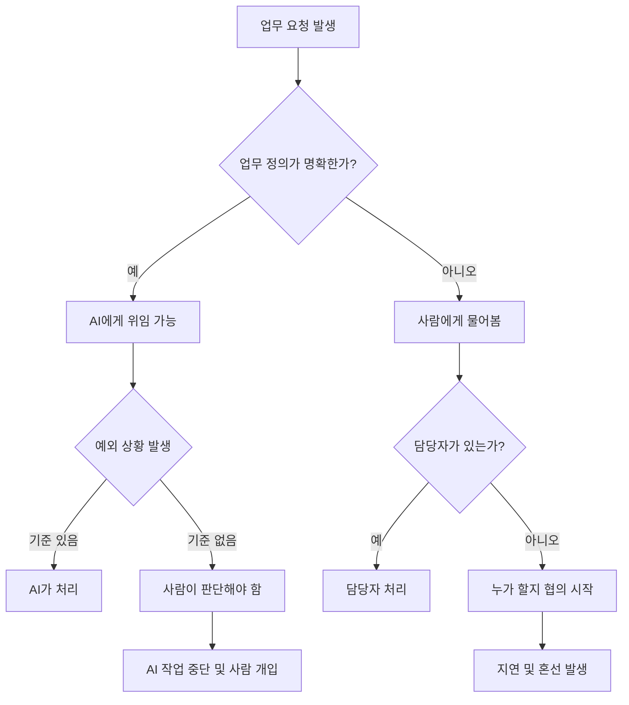
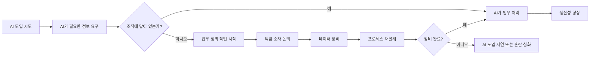
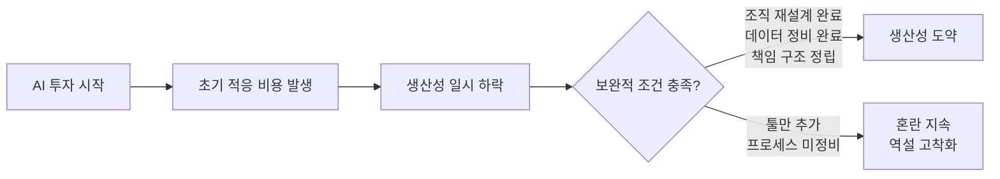
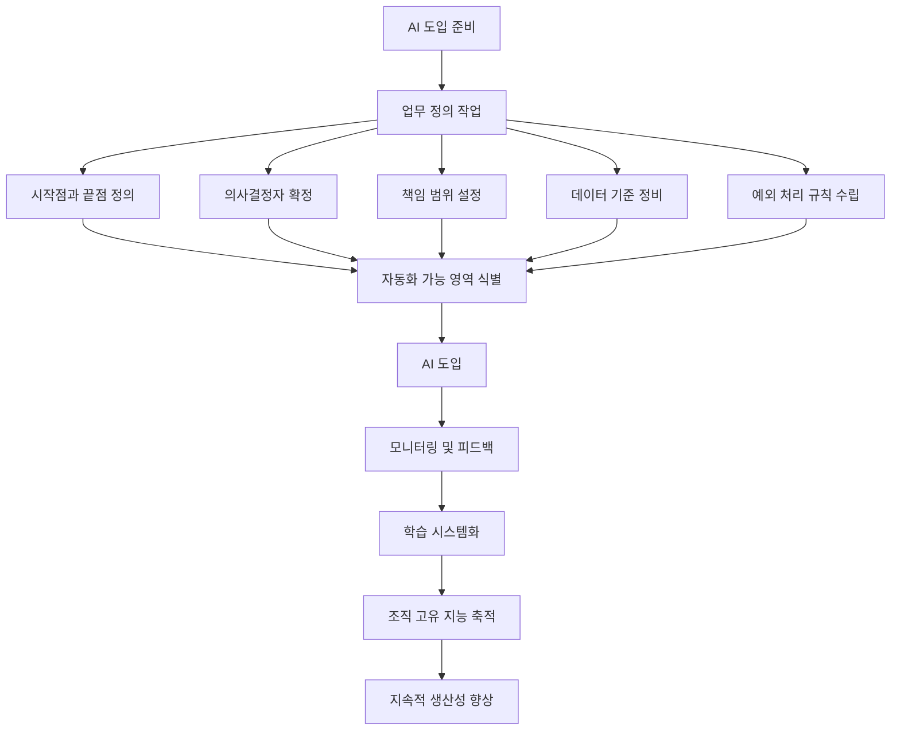
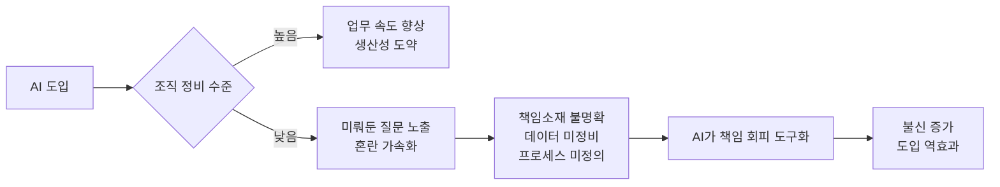

## 관련글

[**AI를 붙였는데 왜 일이 줄지 않을까**](https://www.facebook.com/share/p/1FoHPZPGXW/)

---

## 들어가며

요즘 회사들은 하나같이 AI를 이야기한다. 계약서 검토, 회의록 작성, 고객 문의 응대, 보고서 초안 생성까지—들어보면 곧 회사 일이 절반쯤 줄어들 것 같다. 그런데 현실은 다르다. AI는 들어왔는데 일이 줄었다는 사람은 좀처럼 없다. 오히려 "툴은 많은데 일이 더 복잡해졌다", "자동화하려 했더니 먼저 업무 정리부터 해야 했다", "결국 누가 책임질지가 문제"라는 말을 더 자주 듣는다.

이것은 단순한 기술 부족의 문제가 아니다. 이 글은 왜 AI를 도입한 회사들이 기대했던 생산성을 거두지 못하는지, 그 구조적 원인을 짚고, 실제로 무엇을 먼저 해야 하는지를 다룬다.

---

## 1. AI 도입 붐, 그러나 생산성은 '물음표'

AI 도입 속도는 빠르다. 맥킨지(McKinsey)의 2024년 보고서에 따르면 기업의 65%가 AI를 일상 업무에 활용하고 있으며, 이는 2023년의 33%에서 두 배 가까이 증가한 수치다. 가트너(Gartner)는 2026년까지 기업 애플리케이션의 40%에 AI 에이전트가 포함될 것으로 전망한다.

그런데 생산성 효과는 기대에 크게 못 미친다. 한국은행이 2025년 발표한 이슈노트 '**AI 도입은 생산성을 높이는가? 초기 3년의 효과 분석**'에 따르면, 생성형 AI를 활용하는 근로자의 평균 업무시간은 3.8% 줄었다. 주 40시간 기준으로 주당 약 1.5시간을 아낀 셈이다. 이론적으로 이 절약된 시간이 고부가가치 업무로 재투입된다면 생산성 향상 효과는 약 1.0%로 추정된다. 그러나 현실은 달랐다. **업무시간 절감과 업무처리량 증가 사이의 상관계수는 0.00에 그쳤다.** AI가 개별 작업의 속도는 높였지만, 줄어든 시간이 더 많은 산출물이나 고부가가치 업무로 이어지지 않은 것이다.

대한상공회의소는 2017년부터 2023년까지의 통계청 기업활동조사 데이터를 패널로 구축해 분석한 결과, AI 도입이 기업의 매출 및 부가가치 측면에서는 뚜렷한 긍정적 영향을 미치지만, 생산성 측면에서는 효과가 분명치 않다는 결론을 내렸다. 그러면서 경영진의 전략적 대응 역량, AI 인프라 구축, 인적 자원에 대한 지속적 투자가 뒷받침되어야 생산성이 실제로 개선될 수 있다고 강조했다(대한상공회의소, 2025년 6월).

한국지능정보사회진흥원(NIA)의 제조업 AI 활용 현황 분석에서도 같은 그림이 나온다. AI를 도입한 이후에도 디지털 전환 지출, 인력 비용, 영업이익, 조직 변화 등 모든 항목에서 '변화 없음'이라는 응답이 우세했다(NIA, 2025년 6월).

골드만삭스 리서치는 생성형 AI가 완전히 도입되면 선진 시장의 노동 생산성이 약 15% 향상될 것으로 추정한다. 그러나 결정적인 단서가 붙는다. "**완전히 도입되었을 때**"라는 전제다. AI를 잘못 배포하는 조직은 이익을 놓칠 뿐 아니라 오히려 추가적인 업무를 만들어내며, 세계경제포럼(WEF)은 이 현상을 '생산성 역설(Productivity Paradox)'로 설명한다.

---

## 2. 왜 일이 줄지 않는가: 겉과 속이 다른 업무 구조

### 업무는 단순해 보이지만, 안은 복잡하다

계약서 검토, 고객 응대, 정산, 채용, 보고서 작성—이름이 있으니 자동화하기 쉬워 보인다. 그러나 실제로 이 업무들의 내부로 들어가면 이야기가 달라진다.

예를 들어 계약서 하나에는 영업팀의 약속, 대표가 놓치고 싶지 않은 거래처 관계, 재무팀이 걱정하는 현금흐름, 개발팀이 감당하기 어려운 일정이 동시에 얽혀 있다. AI는 계약서 조항을 읽고, 위험 요소를 찾아주고, 수정안도 제안한다. 여기까지는 꽤 잘한다. 그런데 그다음 질문이 문제다.

> 우리는 이 위험을 감수할 수 있는 회사인가?  
> 이 고객을 잡기 위해 어디까지 양보할 것인가?  
> 영업과 개발이 충돌하면 누가 조정할 것인가?  
> 말하기 어려운 리스크를 꺼내야 하는 사람은 누구인가?

이것은 기술의 문제가 아니다. 관계와 책임의 문제다. AI는 이 질문들을 대신 해결해주지 않는다.

### 업무가 '시스템'이 아니라 '사람 머릿속'에 있는 경우

많은 조직에서 일은 정식 문서가 아니라 특정인의 기억과 경험에 붙어 있다.

"그건 민지님이 제일 잘 알아요."  
"그 고객은 대표님이 직접 챙기세요."  
"원래 그렇게 해왔어요."  
"퇴사한 분이 하던 건데요."

평소에는 유연해 보이지만, 사람이 바뀌거나 상황이 복잡해지면 바로 문제가 드러난다. 업무가 문서가 아니라 사람에게 붙어 있고, 의사결정은 기억에 기대고, 책임은 눈치와 선의로 굴러가는 구조가 되어 있는 것이다.

---

## 3. AI가 드러내는 것: 미뤄둔 질문들

AI를 도입하면 일이 줄기 전에 먼저 불편한 질문이 쏟아진다. AI는 일을 대신하기 전에 명확한 답을 요구하기 때문이다.

- 이 일은 어디서 시작해서 어디서 끝나는가?
- 누가 결정하는가?
- 누가 검토하는가?
- 예외는 어디까지 허용되는가?
- 틀렸을 때 누가 책임지는가?
- 이 데이터는 최신인가, 이 기준은 누가 승인했는가?

생각보다 많은 회사가 이 질문들에 즉시 답하지 못한다. 그러다 보니 AI 도입 회의가 업무 정리 회의가 되고, 책임 소재 회의가 되고, 결국 불편한 조직 논의로 번진다. AI 이야기를 하려다 조직 이야기가 되는 것이다.

이것이 AI 시대의 역설이다. **AI는 일을 쉽게 만들기 전에, 먼저 일을 설명하라고 요구한다.**

한국지능정보사회진흥원의 분석에 따르면, AI 활용에 따른 기술 제공자-활용 기업-소비자 간 책임소재 불명확과 규제 체계 미흡이 도입을 저해하는 주요 요인으로 지목됐다(NIA, 2025년). 딜로이트(Deloitte)의 기업 AI 현황 보고서 역시 에이전틱 AI 도입이 단순히 새로운 기술을 추가하는 문제가 아니라, 거버넌스·통제·책임 구조를 포함한 운영 체계 전반을 다시 설계하는 과제라고 지적한다. 에이전트가 실행과 판단에 관여할수록, 그 권한과 행동을 어떻게 관리하고 감독할 것인지에 대한 더 정교한 체계가 필요하다(딜로이트, 2026년).

---

## 4. 정리된 회사와 정리되지 않은 회사의 차이

AI의 효과는 조직 정비 수준에 따라 완전히 달라진다. 정리된 회사에서 AI는 속도를 더 빠르게 하는 도구가 된다. 정리되지 않은 회사에서 AI는 혼란을 더 빠르게 만드는 도구가 된다.

예전에는 사람이 천천히 헷갈렸다면, 이제는 AI가 빠르게 그럴듯한 답을 만들어낸다. 틀린 답도 맞아 보이고, 위험한 판단도 안전해 보이고, 책임 없는 결정도 'AI 검토 결과'라는 말로 포장된다. 이것이 더 위험하다.

딜로이트의 2026 엔터프라이즈 AI 현황 보고서에 따르면 AI 도입 과정에서 어려움을 겪는다는 조직 비율이 1년 사이 두 자릿수로 늘었다. 반면 AI로 보강된 직무의 평균 생산성은 37% 올랐고, 전통적 자동화(12%)를 크게 앞선다. 이른바 'AI 슈퍼유저'는 5배까지 효율을 끌어올린다는 분석도 있다. 그러나 핵심 문제는 이 개인 단위의 성과가 조직 단위 성과로 이어지지 않는다는 점이다(딜로이트, 2026년).

한국은행 분석에서도 같은 현상이 확인된다. 생성형 AI를 활용하는 근로자의 평균 업무시간은 3.8% 줄었지만, 업무시간 절감과 업무처리량 증가 사이의 상관계수는 0.00에 그쳤다. AI가 개별 작업의 속도는 높였지만, 줄어든 시간이 더 많은 산출이나 고부가가치 업무로 재배치되지 않은 것이다(한국은행, 2025년).

애플이코노미 보도에 따르면, AI 도입으로 확보된 유휴 노동력을 고부가가치 업무로 재배치하지 못할 경우 개인의 효율성 개선이 조직 전체의 생산성 개선으로 파급되지 못한다는 지적이 반복되고 있다. AI 생산성 역설을 극복하려면 AI의 운영·성과가 생산성에 기여한다는 목표에 맞게 **업무 전반의 재설계**가 필요하다(애플이코노미, 2026년 5월).

---

## 5. AI 생산성 역설(AI Productivity Paradox)

경제학계에서는 이 현상에 이미 이름이 붙어 있다. **AI 생산성 역설(AI Productivity Paradox)** 이다. 이는 1987년 노벨경제학상 수상자 로버트 솔로우(Robert Solow)가 PC 도입 시기에 남긴 말—"컴퓨터는 어디에서나 사용되지만, 생산성 통계에서는 찾아볼 수 없다"—과 똑같은 패턴이 AI 시대에 재현되고 있음을 의미한다.

새 기술이 들어오면 적응 비용 때문에 생산성이 먼저 떨어지고, 보완적 투자가 갖춰진 뒤에야 생산성이 위로 솟는다는 패턴이다. 2026년 현재, 같은 곡선이 다시 그려지고 있다.

학계 연구도 같은 결론에 수렴한다. AI 생산성 역설이 발생하는 이유로 연구자들은 잘못된 조직 구조 정렬, 불충분한 데이터 인프라, 전문 인재 부족을 주요 원인으로 제시한다. 실질적인 AI 투자가 기업 성과 개선으로 이어지지 않는 이유를 실증 분석하는 연구들이 이를 지속적으로 확인하고 있다(Brynjolfsson 외, 2019, 2021; Fraisse & Laporte, 2022).

디지털포용뉴스의 분석은 AI 도입이 더디게 생산성에 반영되는 이유를 기술 자체의 한계가 아니라 보완적 투자와 재조직 과정에서 찾는다. 기업은 AI 시스템을 단순히 설치하는 것으로 끝나지 않는다. 업무 프로세스를 전면 재설계하고, 기존 직무를 바꾸고, 조직 구조를 바꾸며, 직원들을 재교육해야 한다. 이 모든 과정이 막대한 무형 자본을 요구하지만, 국가 통계에는 비용으로만 기록된다(디지털포용뉴스, 2025년 12월).

가트너의 2024년 설문조사에 따르면 CIO의 90% 이상이 비용 관리로 인해 AI 투자에서 기업 가치를 창출하는 데 한계가 있다고 답했다. 문제는 AI의 이점을 측정하는 공통 기준의 부재다. 비용은 이전 연도와 비교할 수 있어 계산이 쉽지만, AI를 통한 직원의 업무 개선 수준을 수치화하기는 훨씬 어렵다(CIO, 2024년 12월).

---

## 6. 마이크로소프트 2026 업무동향지표가 보여주는 것

2026년 6월, 마이크로소프트는 AI를 업무에 활용하는 전 세계 10개 시장 지식 근로자 2만 명을 대상으로 한 '2026 업무동향지표(2026 Work Trend Index)'를 발표했다. 수조 건의 익명화된 마이크로소프트 365 생산성 데이터 분석과 AI·업무·조직심리학 전문가의 인사이트를 종합한 보고서로, AI 생산성 역설의 원인과 해법을 구체적인 틀로 제시한다.

### 전환의 역설(The Transformation Paradox)

보고서는 '전환의 역설(Transformation Paradox)'이라는 개념을 제시한다. 직원들은 AI 기반 업무 전환의 필요성을 인식하는 반면, 조직의 성과 지표·인센티브·운영 방식이 이를 충분히 뒷받침하지 못해 혁신 실행이 지체되는 상태를 말한다. 개인이 변하고 싶어도, 조직 시스템이 그 변화를 뒷받침하지 못하는 구조적 간극이다.

### 프론티어 전문가(Frontier Professionals)

보고서에서 주목하는 집단은 전체 AI 사용자 중 일부를 차지하는 '프론티어 전문가(Frontier Professionals)'다. 이들은 단순히 AI를 사용하는 수준을 넘어 다음 세 가지 조건을 동시에 충족하는 그룹이다.

첫째, AI 에이전트를 활용해 복잡한 다단계(multi-step) 업무를 수행한다. 둘째, AI의 장점을 극대화하기 위해 워크플로 자체를 재설계하는 것이 습관화되어 있다. 셋째, 개인 활용을 넘어 팀·조직 차원에서 반복 가능한 AI 기반 관행을 만들어가고 있다.

이 세 조건을 모두 충족하는 사람이 드물다는 사실 자체가, 생산성 향상이 조직 전체로 퍼지지 않는 이유를 설명한다. 개인이 AI를 잘 쓰는 것과, 조직이 AI를 통해 더 나아지는 것은 별개의 문제다.

### 학습 시스템(Learning System)으로의 전환

보고서는 AI 시대의 경쟁 우위가 도입 속도에서 **학습 속도**로 이동하고 있다고 강조한다. 에이전트 기반 업무에서 발생하는 신호와 인사이트를 포착·공유하고, 이를 반복적으로 업무에 반영해 지속적으로 성과를 개선하는 조직 운영 방식을 '학습 시스템(Learning System)'으로 정의한다. 이것이 갖춰진 조직과 그렇지 않은 조직 사이의 격차는 시간이 지날수록 벌어진다.

마이크로소프트 2026 업무동향지표, 2026년 6월.

---

## 7. AI가 책임지지 않는 것들

AI는 책임지지 않는다. 이 단순한 사실이 모든 논의의 핵심이다.

AI는 고객을 설득하지 않는다. 투자자에게 상황을 설명하지 않는다. 직원에게 변화가 왜 필요한지 말하지 않는다. 실수가 발생했을 때 고개를 숙이지 않는다. 그 말을 해야 하는 것은 결국 사람이다.

그런데 현실에서는 이런 일이 벌어진다.

> "AI가 그렇게 말했어요."  
> "자동화된 답변이에요."  
> "시스템상 그렇게 처리됐습니다."

이 말들은 익숙하지만, 대체로 사람을 더 화나게 한다. 고객은 시스템과 계약한 것이 아니고, 직원은 자동화와 일하는 것이 아니고, 투자자는 알고리즘을 믿은 것이 아니다. 결국 사람을 믿고 거래한 것이다.

마이크로소프트 2026 업무동향지표에 따르면, 글로벌 응답자의 86%는 AI 출력물을 최종 답이 아닌 출발점으로 인식하며 결과물에 대한 책임이 인간에게 있다고 생각했다. 비판적 사고를 핵심 역량으로 꼽은 비율도 46%에 달했다(마이크로소프트, 2026년 6월).

한편 2025년 생성형 AI 기업 라이터(Writer)와 워크플레이스인텔리전스(Workplace Intelligence)가 공동 진행한 조사에서는 C레벨 임원 800명과 일반 직원 800명 등 총 1,600명의 지식 근로자 중 31%가 "조직의 AI 프로젝트를 의도적으로 방해한 적이 있다"고 답했다(CIO, 2025년 6월). 이 놀라운 수치의 이면에는 AI 도입에 대한 불신과 불명확한 책임 구조, 그리고 변화에 대한 두려움이 자리잡고 있다.

---

## 8. 먼저 해야 할 일: 툴이 아니라 '자기 설명 능력'

그렇다면 AI 시대에 먼저 해야 할 일은 무엇인가? 더 좋은 툴을 찾는 것이 아닐지도 모른다. 조직이 스스로를 설명할 수 있는 능력을 갖추는 것이 먼저다.

아래 다섯 가지 질문에 답할 수 있어야 한다.

| 질문 | 이 질문이 중요한 이유 |
|---|---|
| 누가 결정하는가? | 의사결정 구조가 없으면 AI가 내놓은 결과를 누구도 승인하지 못한다 |
| 누가 실행하는가? | 실행 책임이 불명확하면 AI 결과가 방치된다 |
| 누가 약속하는가? | 고객·파트너와의 약속 주체가 없으면 AI 오류 시 대응이 불가능하다 |
| 어떤 데이터가 기준인가? | AI는 입력 데이터의 품질에 전적으로 의존한다 |
| 어떤 일은 자동화하면 안 되는가? | 모든 업무가 자동화 대상이 아니며, 예외를 미리 정해야 한다 |

딜로이트의 분석에 따르면, 다수의 기업이 직원 교육에는 주력하고 있지만 역할 구조와 업무 흐름, 경력 경로를 근본적으로 재설계하는 움직임은 부족한 실정이다. 조직은 기존 프로세스 위에 AI를 덧붙이는 방식이 아니라, **AI를 전제로 한 접근(AI-native approach)** 을 취해 업무를 총체적으로 재설계해야 한다(딜로이트, 2026년).

포레스터(Forrester)는 AI 거버넌스 소프트웨어에 대한 지출이 2030년까지 4배 이상 증가해 약 160억 달러에 이를 것으로 예측했다. 기업은 전사적으로 데이터 자산을 식별하고, 이를 활용할 창의적인 접근 방식을 채택해야 하며, AI 준비 상태로 만드는 작업을 빨리 시작할수록 새로운 기술 흐름에 빠르게 대응할 수 있다(CIO, 2024년 12월).

---

## 9. 딸깍은 시작일 뿐이다

"딸깍 한 번으로 일이 끝나면 너무 좋겠다."

그러나 대부분의 딸깍은 시작이다. 그 뒤에서 누군가는 기준을 정하고, 책임을 나누고, 사람을 설득하고, 예외를 처리해야 한다.

AI를 붙였는데 일이 줄지 않는다면, 툴을 더 찾기 전에 일을 먼저 들여다봐야 한다.

- 우리 회사의 일이 많은가, 아니면 많아 보일 만큼 정리되지 않은 건가?
- 사람이 부족한가, 아니면 책임의 경계가 부족한가?

어쩌면 필요한 것은 더 똑똑한 AI가 아니라, 회사가 스스로를 설명할 수 있는 능력일지도 모른다.

지금의 생산성 통계가 조용하다고 해서 AI가 조용하다는 의미는 아니다. 오히려 큰 변화가 다가오기 직전의 정지 구간일 가능성이 크다(디지털포용뉴스, 2025년 12월). AI는 정리된 회사를 더 빠르게 만든다. 그 답을 준비하는 것은 여전히 사람의 일이다.

---

## 요약: AI 생산성 역설의 핵심 구조

| 구분 | 정리된 회사 | 정리되지 않은 회사 |
|---|---|---|
| AI 역할 | 속도를 높이는 도구 | 혼란을 빠르게 만드는 도구 |
| 업무 정의 | 문서화됨, 명확 | 특정인의 머릿속에 있음 |
| 책임 구조 | 명확히 정립됨 | 눈치와 선의에 의존 |
| AI 결과물 처리 | 판단 후 채택 또는 기각 | 'AI가 그렇게 말함'으로 처리 |
| 생산성 변화 | 향상됨 | 오히려 복잡해짐 |
| 데이터 상태 | 정제·최신 상태 | 분산·오래된 상태 |

---

## 참고 자료

- 대한상공회의소, "AI 도입이 기업 성과 및 생산성에 미치는 영향 및 시사점", 2025년 6월
- 한국은행, "AI 도입은 생산성을 높이는가? 초기 3년의 효과 분석" (이슈노트), 2025년
- 한국지능정보사회진흥원(NIA), "기업 내 AI 활용 현황 및 애로사항 분석: 제조업을 중심으로", 2025년 6월
- 딜로이트(Deloitte), "기업의 AI 활용 현황 2026", 2026년
- 마이크로소프트, "2026 업무동향지표(Work Trend Index)", 2026년 6월
- 세계경제포럼(WEF), AI 생산성 역설 분석 자료
- Brynjolfsson 외, AI 생산성 역설 관련 실증 연구 (2019, 2021)
- ZDNet Korea, "기업 10곳 중 7곳 AI 도입했지만 90% '생산성 체감 못해'", 2026년 2월
- CIO Korea, "기업 AI 도입을 가로막는 5가지 장애물", 2025년 6월
- 디지털포용뉴스, "AI 생산성의 역설", 2025년 12월
- 애플이코노미, "AI도입으로 오히려 '생산성' 위축되는 역설도?", 2026년 5월

---

**작성일: 2026년 6월 28일**
