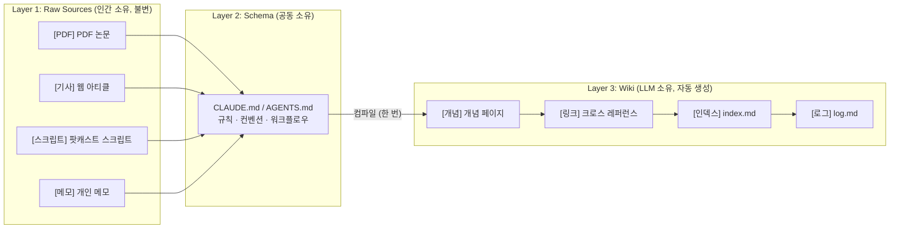
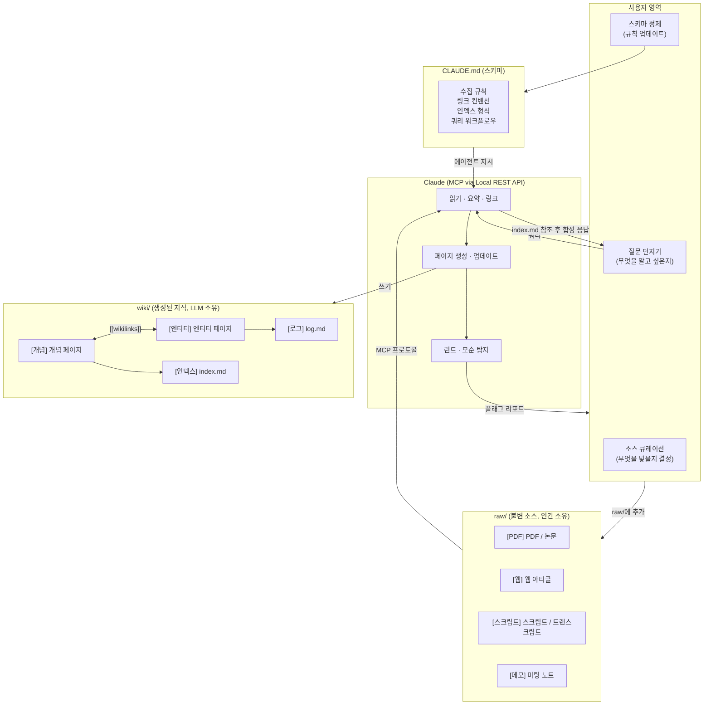
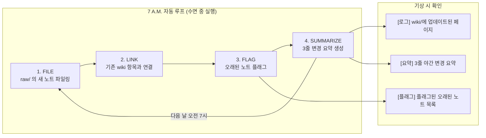
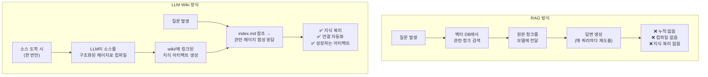
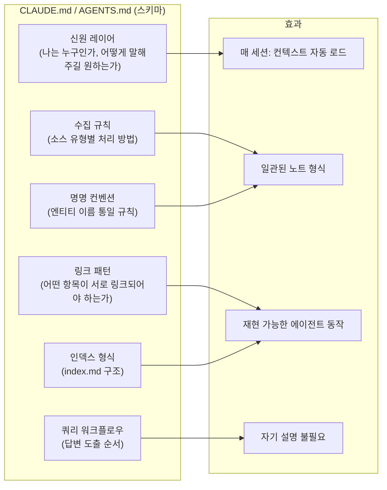

## Karpathy의 LLM-WIKI 패턴과 10단계 구축 완전 가이드

> 작성 기반: Andrej Karpathy의 `LLM-WIKI.md` (2026년 4월), @0xMoysei의 10단계 가이드 (2026년 6월 24일)

## 관련글

[**Karpathy just wrote the manual for Claude + Obsidian as a real second brain.**](https://x.com/0xmoysei/status/2070654109829537937)


---

## 들어가며: 노트 앱이 무덤이 되는 이유

지식 관리 도구를 진지하게 사용해 본 사람이라면 누구나 공통된 경험을 알고 있다. 처음 몇 주는 열정적으로 노트를 작성하고 분류하고 링크를 만든다. 그러다 어느 순간 업데이트는 멈추고, 수천 개의 노트가 서로 연결되지 않은 채 정적인 파일로만 남아 있는 상황을 맞이하게 된다. Notion 보드는 열리지 않고, 브라우저 탭은 30개가 쌓이며, Claude와 나눈 가치 있는 대화는 탭을 닫는 순간 영영 사라진다.

X(구 트위터) 계정 @0xMoysei가 2026년 6월 24일에 게시한 글은 이 문제를 정면으로 겨냥한다. "저장 노트 앱 하나, 브라우저 탭 30개, 더는 열지 않는 Notion 보드, 그리고 다시는 찾지 못할 40개의 아카이빙된 Claude 대화." 리스본에 사는 한 30대 프리랜서 개발자의 이야기지만, 사실 이것은 지식 노동자 대부분이 겪는 보편적인 문제다.

이 글에서 다루는 시스템은 그 문제에 대한 구체적이고 실천 가능한 해법이다. 핵심은 두 가지 도구를 결합하는 것이다. Obsidian은 저장소가 되고, Claude는 그 위에서 동작하는 두뇌가 된다. 그리고 이 둘을 잇는 방법론으로 Andrej Karpathy가 2026년 4월에 공개한 `LLM-WIKI.md` 패턴이 설계 철학을 제공한다.

---

## 1부: Andrej Karpathy와 LLM Wiki 패턴

### 1.1 패턴의 탄생 배경

Andrej Karpathy는 OpenAI 공동창업자이자 Tesla 전 AI 디렉터로, 머신러닝 개념을 명확하게 설명하는 인물로 널리 알려져 있다. 2026년 4월 3일, 그는 X에 다음과 같은 내용을 게시했다. "최근 매우 유용하다고 느끼는 것: LLM을 활용해 다양한 연구 주제에 대한 개인 지식 베이스를 구축하는 것. 이 방식으로 최근 내 토큰 사용량의 상당 부분이 코드 조작보다 지식 구조 조작에 쓰이고 있다." 이 포스팅은 1,700만 건 이상의 조회수를 기록했다.

이틀 뒤인 4월 4일, 그는 전체 아키텍처를 `llm-wiki.md`라는 GitHub Gist로 공개했다. 코드가 아니라 컨벤션이었다. 에이전트에게 붙여 넣을 수 있는 마크다운 사양 파일이었고, 에이전트는 그 파일을 읽고 자신에게 맞는 위키를 직접 구축한다. Karpathy 자신이 구축한 단일 주제 연구 위키는 약 100개의 기사와 40만 단어 분량으로 성장했으며, 그가 직접 쓴 페이지는 한 장도 없었다.

### 1.2 핵심 철학: RAG가 아닌 컴파일

LLM Wiki 패턴을 이해하려면 먼저 그것이 무엇이 아닌지부터 파악해야 한다. 이 시스템은 RAG(Retrieval-Augmented Generation)가 아니다.

RAG는 질문이 들어올 때마다 원본 문서 청크를 검색해 모델에 전달하는 방식이다. 검색은 매 쿼리마다 처음부터 다시 이루어지며, 어떤 통찰이나 연결도 누적되지 않는다. 반면 LLM Wiki는 소스를 한 번 수집하면 LLM이 그것을 구조화된 연결 페이지로 컴파일하고, 이후 질문은 그 컴파일된 아티팩트를 기반으로 답변된다.

Karpathy의 비유가 이를 명확히 설명한다. `raw/`는 소스코드이고, 모델은 컴파일러이며, `wiki/`는 실행 가능한 바이너리다. 쿼리는 런타임이다. 컴파일된 지식 화합물이 쌓이고, 지식은 재검색되는 것이 아니라 재발견된다.



### 1.3 Karpathy의 9가지 규칙

Karpathy가 공개한 `LLM-WIKI.md` 논문은 아홉 가지 원칙으로 구성된다. 이 규칙들은 시스템을 신뢰 가능하게 만드는 경계선이다.

**규칙 I. 소스는 불변이다 (Sources Are Immutable)**

`raw/`에 저장된 모든 것은 착지하는 순간 다시는 편집되지 않는다. 기사, 스크립트, PDF, 메모 등 무엇이든 상관없이 `raw/`는 진실의 단일 원천이다. 소스가 틀렸다면 수정 소스를 추가하면 된다. 원본을 덮어쓰는 것은 허용되지 않는다. 손으로 raw 파일을 편집하기 시작하는 순간, 두 개의 기록 시스템이 생기고 어느 쪽이 참인지 알 수 없게 된다.

**규칙 II. 레이어를 분리하라 (Separate the Layers)**

세 개의 레이어, 세 명의 소유자가 있다. `raw/`는 불변 소스를 담으며 인간에게 속한다. `wiki/`는 생성된 페이지를 담으며 모델에게 속한다. 단일 스키마 파일(`CLAUDE.md` 또는 `AGENTS.md`)은 규칙을 담으며 둘 다에 속한다. 모델이 `raw/`에 쓰거나, 인간이 논쟁에서 이기려고 `wiki/`를 수동 조정하는 순간, 시스템을 신뢰 가능하게 만드는 경계가 사라진다.

**규칙 III. 모델이 위키를 소유한다 (The Model Owns the Wiki)**

인간의 역할은 `raw/`에 무엇이 들어올지 선택하고, 질문을 던지고, 생각하는 것이다. 모델의 역할은 인간이 기피하는 부분, 즉 요약, 크로스 레퍼런싱, 올바른 엔티티 아래 파일링, 새로운 것이 도착했을 때 이웃 노트 업데이트를 처리하는 것이다. 북키핑을 스스로 하고 있다면, 그것은 스키마가 충분히 명세화되지 않았다는 신호다.

**규칙 IV. 검색하지 말고 컴파일하라 (Compile, Don't Retrieve)**

이것이 RAG와의 근본적인 차이점이다. RAG는 모든 쿼리에서 날것의 청크로부터 답을 재도출하며 아무것도 누적하지 않는다. 여기서 소스는 구조화된 연결 페이지로 한 번만 컴파일되고, 질문은 그 구축된 아티팩트로부터 답변된다. 유추가 성립한다. `raw/`가 소스코드라면, 모델이 컴파일러이고, `wiki/`가 실행 파일이며, 쿼리는 런타임이다. 이 방식으로 컴파일된 화합물이 쌓이고, 지식은 재검색되는 것이 아니라 재발견된다.

**규칙 V. 한 번에 하나의 소스를 수집하라 (Ingest One Source at a Time)**

`raw/`에 단일 파일을 떨어뜨리고 모델에게 수집하도록 지시한다. 좋은 수집은 새 페이지 하나가 아니다. 새로운 사실이 변경하는 모든 페이지를 그래프 전체에서 추적하는 것이 수집이다. 주말에 전체 디지털 라이프를 일괄 가져오면 덤프가 생기고, 위키는 생기지 않는다. 왜냐하면 파일이 아직 쌓이는 동안에는 아무것도 링크되지 않기 때문이다.

**규칙 VI. 모든 것을 링크하라 (Link Everything)**

모든 페이지는 위키링크를 통해 다른 것들과 연결된다. 모든 위키링크는 그래프에서 볼 수 있는 가장자리다. 이것이 Obsidian이 선택받는 프론트엔드인 이유다. 그래프 뷰는 클러스터가 형성되고, 허브가 등장하고, 아무도 링크하지 않은 고아 노트들을 보여준다. 다섯 개 페이지에 등장하지만 어디에도 링크되지 않은 엔티티는 수집이 게으르다는 신호다. 시스템의 가치는 노드가 아니라 엣지에 있다.

**규칙 VII. 인덱스로 탐색하라 (Navigate by Index)**

모델은 `index.md`를 읽고, 관련 있는 몇 개의 페이지를 따라가고, 볼트 전체를 컨텍스트에 로드하는 것이 아니라 합성으로 답에 도달해야 한다. 100개의 기사와 수십만 단어의 위키라도 인덱스가 정직하다면 빠르다. 모델이 모든 질문에서 코퍼스 전체를 강제 탐색하고 있다면, 인덱스가 더 이상 영역을 반영하지 않는 것이므로 점검이 필요하다.

**규칙 VIII. 지식을 린트하라 (Lint the Knowledge)**

위키를 코드처럼 취급하고 상태 점검을 실행한다. 모델에게 페이지 간 모순을 찾고, 낮은 신뢰도 주장을 표면화하고, 고아 페이지를 나열하고, 두 가지 철자로 표류한 엔티티에 플래그를 달도록 요청한다. 모순은 종이로 덮을 오류가 아니다. 두 소스가 동의하지 않는다는 정보이며, 이제 어디를 봐야 할지 안다. 린트를 건너뛰는 것은 그래프가 여전히 인상적으로 보이는 동안 위키가 조용히 썩어가는 방식이다.

**규칙 IX. 작게 시작하라 (Start Small)**

천 개가 아니라 열 개의 소스로 시작한다. 검색 엔진, 정교한 프론트매터, 또는 스무 가지 규칙의 스키마를 추가하기 전에 수집, 쿼리, 린트가 자연스럽게 느껴질 때까지 기다린다. 첫 번째 수집 몇 개는 감독이 필요하다. 명명 컨벤션은 변경될 것이고, 초기 페이지들은 지저분할 것이다. 그리고 그것은 정상이다. 3주차에 포기하는 아름다운 아키텍처보다 실제로 피드하는 작은 위키가 낫다.

---

## 2부: 시스템 아키텍처 심층 분석

### 2.1 세 레이어 구조

이 시스템 전체는 세 개의 디렉터리로 구성된다. 단순함은 의도적이다. Karpathy가 선택한 구조는 어떤 LLM 에이전트도 커스텀 툴링 없이 탐색할 수 있는 형태다.

**raw/ 디렉터리 (인간의 영역)**

원본 소스 자료가 직접 들어가는 곳이다. 연구 논문(마크다운으로 변환한 PDF), GitHub 레포지토리, Obsidian Web Clipper로 클리핑한 웹 기사, 데이터셋, 미팅 노트, 팟캐스트 스크립트 등 무엇이든 포함될 수 있다. `raw/` 디렉터리는 추가 전용이다. 여기서는 어떤 것도 편집되지 않는다. 지금까지 LLM이 읽은 모든 것의 단일 진실 원천이다.

**wiki/ 디렉터리 (모델의 영역)**

LLM이 구조화된 지식을 출력하는 곳이다. 모델은 원자료 전체에서 식별하는 각 개념에 대해 백과사전 스타일의 기사를 작성하고, 관련 기사들 사이에 백링크를 생성하며, 전체 위키를 한눈에 요약하는 인덱스 파일을 유지한다. 중요한 행동 특성 중 하나는, 위키에 질문하면 모델이 단순히 답하는 것에서 그치지 않는다는 점이다. 합성된 답변이 보존할 가치가 있는 새로운 개념을 나타내는지 확인하고, 그렇다면 새 위키 페이지를 작성하고 로그에 쿼리를 기록한다. 위키는 저장된 콘텐츠뿐만 아니라 질문으로부터도 성장한다.

**CLAUDE.md / AGENTS.md (스키마, 공유 영역)**

세 번째 핵심 구성 요소는 폴더 구조보다 주목을 덜 받지만, 사실 가장 중요하다. 이것은 LLM이 지식 베이스를 운영할 때 따라야 하는 규칙을 정의하는 플레인 텍스트 설정 파일이다. 코드도 아니고 설정 파일도 아니다. 자연어로 작성된 지시사항이며, 에이전트에게 새 파일을 처리하는 방법, 쿼리에 답하는 방법, 인덱스를 업데이트하는 방법을 알려준다.

Karpathy는 이 스키마를 공진화적(co-evolved)이라고 설명한다. 위키가 발전함에 따라 시간이 지나면서 정제한다. 인간의 주요 편집 역할은 기사를 작성하는 것이 아니라 LLM이 기사를 어떻게 작성할지 지시하는 스키마를 작성하고 정제하는 것이다.

### 2.2 연결 구조도: HOW IT CONNECTS

아래 다이어그램은 세 가지 레이어가 실제로 어떻게 연결되는지를 보여준다.



---

## 3부: 10단계 실전 구축 가이드


### 3.1 Step 1: 두 가지 도구, 두 가지 역할

시스템의 구성은 단순하다. Obsidian이 저장소가 되고, Claude가 그 위에 얹히는 두뇌가 된다.

Obsidian은 무료 노트 앱으로, 모든 것을 사용자 자신의 컴퓨터에 평범한 마크다운 파일로 저장한다. 노트들은 `[[이중 괄호]]`로 서로를 링크하고, 그 링크들이 시각적으로 볼 수 있는 그래프를 형성한다. Claude는 그 위에서 동작하는 두뇌다. 볼트 전체를 읽고, 새 자료를 적절한 위치에 파일링하고, 기존 내용과 링크하고, 모든 내용에 걸쳐 질문에 답한다. 시스템 전체가 텍스트 파일이므로, 어떤 단일 모델도 그것을 소유하지 않는다. 내년에 다른 모델을 같은 폴더에 연결해도 여전히 작동한다.

### 3.2 Step 2: Claude Code 설치

`claude.com/download`에서 Claude 데스크톱 앱을 다운로드하고 Code 탭을 연다. 그 탭이 Claude Code이며, 컴퓨터에서 파일을 읽고 쓰는 버전이다. 유료 플랜이 필요하다. Claude Pro는 월 20달러, 연간 결제 시 월 17달러이며, 무료 티어는 Claude Code를 실행하지 않는다. 이것이 이 구축의 유일한 비용이며, 이하 모든 것은 무료다.

### 3.3 Step 3: 볼트 만들기

`obsidian.md`에서 Obsidian을 다운로드한다. 새 볼트를 만들고, 이름을 `brain`으로 지정하고, 저장할 폴더를 선택한다. 그 폴더가 이제 두 번째 뇌다. 노트 하나를 만들고, 문장 하나를 입력한 다음 `[[goals]]`를 입력한다. 괄호 안의 단어가 링크로 변한다. 이 단일 메커닉, 즉 노트가 노트를 가리키는 것이 Claude가 규모 있게 자동으로 수행하게 될 바로 그 작업이다.

### 3.4 Step 4: 볼트에 문을 열기

Claude는 플러그인을 통해 볼트에 접근한다. Obsidian에서 설정을 열고, 커뮤니티 플러그인을 클릭하고, 활성화한 다음, Browse에서 **Local REST API**를 검색해 설치한다. 활성화하고, 설정을 열어 API 키를 복사한다. Obsidian을 실행 상태로 유지한다. 문은 앱이 열려 있는 동안에만 작동한다.

현재 Local REST API 플러그인(coddingtonbear 작성)은 볼트에 대한 전체 CRUD 작업을 지원하며, 내장 MCP 서버도 제공한다. 특정 섹션 수준의 수술적 패치, 전체 텍스트 검색, JsonLogic 쿼리, 주기적 노트(일간/주간/월간) 접근 등이 가능하다.

### 3.5 Step 5: MCP로 Claude 연결

Claude Code 탭에서 다음 명령어를 사용해 Obsidian을 MCP 서버로 연결한다. API 키 부분에는 복사한 값을 붙여 넣는다.

```bash
# 방법 1: mcp-obsidian (uvx 방식, 가장 많이 알려진 방법)
claude mcp add-json obsidian-vault '{
  "type": "stdio",
  "command": "uvx",
  "args": ["mcp-obsidian"],
  "env": {
    "OBSIDIAN_API_KEY": "여기에-API-키-붙여넣기",
    "OBSIDIAN_HOST": "127.0.0.1",
    "OBSIDIAN_PORT": "27124"
  }
}'

# 방법 2: 내장 MCP 서버 활용 (Claude Code 권장 최신 방법)
claude mcp add --transport http obsidian https://127.0.0.1:27124/mcp/ \
  --header "Authorization: Bearer <your-api-key>"
```

중요한 점: 플러그인은 API 키 앞에 `Bearer`라는 단어를 표시한다. 그 단어를 제거하고 그 뒤에 오는 문자열만 붙여 넣어야 한다. 연결 확인은 "내 볼트의 모든 파일을 나열해 줘"라고 입력해보면 된다. Claude가 노트를 읽어서 돌려준다면 연결이 완료된 것이다.

### 3.6 Step 6: 브레인에 자신을 로드하기 (CLAUDE.md 생성)

빈 브레인은 쓸모가 없으며, 전체 프로필을 손으로 입력해서는 안 된다. 대신 Claude가 인터뷰를 진행하게 한다. 다음 프롬프트를 붙여 넣는다.

```
당신은 내 두 번째 뇌를 설정하고 있습니다. 내 프로필을 구축하기 위해
한 번에 하나씩 질문해 주세요: 나는 누구이고 무슨 일을 하는지,
올해 목표, 당신이 나에게 어떻게 말해주길 원하는지,
나의 강점과 약점, 현재 프로젝트들.
각 답변을 기다려 주세요. 완료되면, 모든 것을 헤더와 함께
볼트 루트의 CLAUDE.md에 기록해서 매 세션마다 로드될 수 있게 해주세요.
```

공동 창업자에게 브리핑하듯 답변하면 된다. 답변이 구체적일수록 브레인이 더 잘 알게 된다. 완료되면 `CLAUDE.md`가 컨텍스트를 보유하게 되고, 더 이상 자기 자신을 재설명하지 않아도 된다.

### 3.7 Step 7: Karpathy의 구조 적용하기

2026년 4월 Karpathy가 공개한 패턴에는 두 개의 핵심 폴더가 있다.

`raw/`는 불변의 소스를 담는다. 기사, 스크립트, PDF, 메모 등 Claude가 읽지만 절대 편집하지 않는 모든 것이 여기에 들어간다. `wiki/`는 Claude가 그것들을 바탕으로 작성하는 페이지들을 담는다. 요약, 개념 페이지, 크로스 레퍼런스 등이 여기에 위치한다. 인간은 위키를 쓰지 않는다. Claude가 새 소스가 도착하는 순간 컴파일하고, 이후 끊어진 링크와 모순을 잡아내는 린트 패스를 실행한다.

Karpathy 자신의 실행에서, 하나의 주제가 약 100개의 기사와 40만 단어로 성장했으며, 그가 직접 쓴 페이지는 한 페이지도 없었다.

Claude에게 다음과 같이 지시한다: "raw/와 wiki/를 설정해 줘. raw/에 파일을 넣으면, 읽고, 매칭되는 wiki 페이지를 작성하거나 업데이트하고, 링크를 연결해 줘."

### 3.8 Step 8: Obsidian 방언 가르치기 (kepano/obsidian-skills)

Claude는 평범한 마크다운을 쓴다. Obsidian의 `[[위키링크]]`, 콜아웃, Bases(데이터베이스 뷰), Canvas를 가르쳐주지 않으면 제대로 된 Obsidian 노트를 작성하지 못한다.

Obsidian CEO Steph Ango가 이 문제를 해결했다. 그의 레포 `kepano/obsidian-skills`는 5가지 공식 에이전트 스킬을 제공한다. 각 스킬은 Obsidian의 형식을 다루는 독립적인 폴더로 구성되며, 오픈 에이전트 스킬 사양을 따르므로 Claude Code, Codex, Gemini CLI 등 모든 호환 에이전트에서 실행된다. 2026년 6월 기준으로 이 레포는 약 35,600개의 GitHub 스타를 기록하고 있다.

설치 방법은 볼트 루트의 `.claude` 폴더에 레포 내용을 복사하는 것이다.

```bash
# Claude Code 방식 (가장 빠른 방법)
/plugin marketplace add kepano/obsidian-skills

# 또는 npx 방식
npx skills add git@github.com:kepano/obsidian-skills.git
```

이 스킬이 설치되면 Claude의 노트가 거의 맞는 수준이 아니라 수작업으로 만든 것처럼 완성도 높게 출력된다. 특히 `obsidian-markdown` 스킬은 Obsidian 고유 마크다운 방언(OFM, Obsidian Flavored Markdown)을 정확하게 처리한다. `[[Note Name]]`과 같은 위키링크, `![[Image.png]]`와 같은 임베드, 프론트매터 태그 등이 제대로 생성된다.

아래는 kepano/obsidian-skills가 제공하는 5가지 스킬이다.

| 스킬 이름 | 역할 |
|---|---|
| obsidian-markdown | `.md` 파일 생성 및 편집, OFM 문법 지원 |
| obsidian-bases | `.base` 데이터베이스 뷰 파일 작업 |
| obsidian-canvas | `.canvas` JSON Canvas 파일 작업 |
| obsidian-cli | Obsidian URI 스킴 및 CLI 도구 활용 |
| defuddle | 웹 페이지 추출 및 마크다운 변환 |

### 3.9 Step 9: 라이브 데이터 추가 및 자동화 (7 A.M. 루프)

정적인 노트는 반쪽짜리 두뇌다. 변화하는 것들을 연결해야 한다. Google Calendar 연결 예시는 다음과 같다.

```bash
claude mcp add google-workspace uvx workspace-mcp --tools calendar
```

읽기 접근 권한을 부여하고 나면, "오늘 캘린더를 읽어서, 각 미팅에서 내가 약속한 것들을 내 태스크에 로그하고, 명확한 다음 단계가 없는 것에 플래그를 달아줘"와 같이 지시할 수 있다.

워크플로우가 안정되면 스케줄을 잡는다. 스케줄 탭을 열고, 매일 오전 7시 태스크를 추가하고, 다음을 수행하도록 지시한다.



하나의 규칙은 절대 어기지 않는다. 접근은 프롬프트가 아닌 키로 제어한다. "이것을 삭제하지 마세요"는 제안이다. 읽기 전용으로 범위가 지정된 키는 설정이다. 에이전트가 파일을 삭제할 수 있다면, 언젠가는 삭제하게 된다.

### 3.10 Step 10: 커뮤니티 레포로 빠르게 시작하기

직접 구축하지 않으려면, 커뮤니티가 이미 전체를 패키징해 두었다.

**AgriciDaniel/claude-obsidian**: Karpathy 패턴 기반의 자기 조직화 두뇌로, 15개의 Claude Code 스킬과 PARA, Zettelkasten 등 다양한 방법론의 프리셋을 제공한다.

**eugeniughelbur/obsidian-second-brain**: `/obsidian-save`, `/obsidian-daily`, `/obsidian-find` 등 43개의 명령어를 제공하며 Claude, Codex, Gemini에서 실행된다.

**coleam00/second-brain-starter**: 인터뷰를 진행하고, 빌드 계획을 작성하고, 마크다운과 파이썬으로 전체를 스캐폴딩한다.

---

## 4부: 기술적 심층 분석

### 4.1 LLM Wiki vs RAG: 근본적인 차이

두 접근법의 차이는 단순히 구현 방법의 차이가 아니라 철학적 차이다.



RAG에서 개인 지식 베이스는 적합하지 않다고 말하는 이유가 있다. 수백 개의 소스(수백만이 아니라)를 다루는 개인 지식 베이스에서는 위키 방식이 거의 항상 낫다. 합성 단계가 핵심이다. LLM은 8,000단어 짜리 YouTube 스크립트보다 잘 구조화된 500단어 위키 페이지에서 훨씬 더 잘 추론한다. 합성 단계는 단순한 압축이 아니라 모델이 실제로 사용할 수 있는 형식으로의 번역이다.

### 4.2 CLAUDE.md의 역할과 중요성

`CLAUDE.md`(또는 에이전트에 따라 `AGENTS.md`)는 이 시스템에서 가장 과소평가된 구성 요소다. 이 파일이 수행하는 역할은 다음과 같다.



Karpathy의 관점에서 지식 베이스는 LLM의 산물이라기보다 Karpathy의 지시 작성의 산물이다. LLM은 규모 있게 실행할 뿐이다. 이것이 `CLAUDE.md`를 시간을 들여 정교하게 만들 가치가 있는 이유다.

### 4.3 Obsidian Flavored Markdown (OFM)과 에이전트 호환성

일반 마크다운 에디터는 CommonMark를 작성한다. 하지만 Obsidian은 자체적인 방언인 OFM을 사용한다. 일반 AI 에이전트가 틀리게 작성하는 기능들이 있다.

에이전트 없이는 표준 마크다운 링크인 `[Note Name](note-name.md)`를 생성해서 Obsidian의 그래프 뷰와 백링크를 망가뜨린다. kepano/obsidian-skills를 통해 obsidian-markdown 스킬을 설치하면, Claude는 네이티브 OFM을 생성한다. 예를 들어 `[[Project Alpha]]`와 같은 위키링크, 프론트매터 태그, Obsidian 콜아웃 블록 등을 올바르게 작성한다.

이 스킬들이 오픈 에이전트 스킬 사양을 따른다는 것은 중요한 의미를 가진다. Claude Code뿐만 아니라 Codex, Gemini CLI, OpenCode 등 어떤 호환 에이전트도 같은 스킬을 사용할 수 있다. 잠금 없음(Zero Lock-in)이 보장된다.

---

## 5부: 보안 고려사항 및 운영 원칙

### 5.1 접근 제어 원칙

Obsidian MCP 연결에는 명확한 보안 원칙이 있다. 에이전트가 파일을 삭제할 수 있다면, 언젠가는 삭제하게 된다. 이 단순한 진실이 보안 설계의 출발점이다.

접근은 프롬프트가 아닌 키로 제어되어야 한다. "이 노트는 삭제하지 마세요"라는 지시는 제안이다. 읽기 전용으로 범위가 지정된 API 키는 하드웨어 설정이다. 차이는 근본적이다.

Local REST API 플러그인이 생성하는 API 키는 볼트에 대한 전체 읽기/쓰기 권한을 갖는다. 이 키는 로컬호스트에서만 리슨하므로 외부에서 접근할 수 없지만, 로컬 네트워크 환경에서는 주의가 필요하다. 중요한 볼트라면 별도의 읽기 전용 볼트를 운영하거나, 에이전트에게 특정 폴더만 접근할 수 있도록 스키마에서 명시적으로 제한하는 것이 권장된다.

### 5.2 "인지 포기" 문제에 대한 비판적 시각

Tony Demol의 Medium 글(2026년 5월)은 이 패턴에 대한 중요한 비판적 관점을 제시한다. "Second Brain"이라는 용어는 지식과 사고를 두 번째 기술적 두뇌에 외주화하는 것으로 이해될 수 있으며, 이는 "인지 포기(cognitive surrender)" 개념과 연결된다.

그의 대안은 "지식 촉매(knowledge catalyst)"의 관점이다. AI 시스템에 위임하는 것이 아니라, 자신의 단일 두뇌와 위키 사이의 지식 루프를 협력하는 방식이다. 이 관점에서 인간은 직접 작성한 노트를 `raw/`에 제공하고, LLM은 그것을 구조화하고 링크하는 역할을 맡는다. 지식 소유권은 항상 인간에게 있다.

이 비판은 시스템을 어떻게 운영할지 결정할 때 참고할 만한 중요한 관점이다.

---

## 6부: 이 시스템을 실행하고 나면 무엇이 달라지는가

### 6.1 시간에 따른 가치 변화

이 시스템의 가치는 선형으로 성장하지 않는다. 복리처럼 증가한다.

1주일 동안 실행하면 노트 앱이다. 1개월 동안 실행하면 레퍼런스 시스템이다. 6개월 동안 실행하면 지식 엔진이다. 어떤 구글 검색도 대체할 수 없는 이유는 모든 새 노트가 이미 거기 있는 모든 것과 연결되기 때문이다.

이전에는 Claude가 탭을 닫는 순간 모든 것을 잊었다. 모든 컨텍스트는 인간이 보유하며, 금요일쯤이면 대부분 잃어버린다. 이후에는 볼트가 모든 것을 보유하고, 모델이 마지막으로 중단한 곳에서 다시 시작한다.

가장 흥미로운 순간은 시스템이 스스로 잊고 있던 연결들을 발견할 때다. 세 달 전에 읽은 기사와 어제 작성한 미팅 노트 사이의 연결, 두 개의 다른 프로젝트가 같은 패턴을 공유한다는 인식, 이런 연결들이 자동으로 `wiki/`에서 만들어진다.

### 6.2 시스템이 실패하는 방식과 예방법

이 시스템이 실패하는 방식도 알고 있어야 한다.

첫째, 마이그레이션 덫이 있다. 기존 Obsidian 볼트나 Notion 데이터베이스를 첫날에 모두 마이그레이션하려고 하면 안 된다. 한꺼번에 모든 것을 가져오면 위키가 아니라 덤프가 된다. 아무것도 링크되지 않은 채 파일만 쌓인 상태로 남는다. 새로운 소스를 하나씩 추가하면서 시작하는 것이 올바른 방법이다.

둘째, 스키마 방치 문제가 있다. `CLAUDE.md`는 한 번 작성하고 잊어버리는 파일이 아니다. 위키가 성장함에 따라, 어떤 명명 컨벤션이 더 잘 작동하는지, 어떤 링크 패턴이 더 유용한지 발견하게 된다. 그 인사이트를 스키마에 반영해야 시스템이 점점 더 정확해진다.

셋째, 린트 생략이 있다. 지식 린트를 건너뛰면 위키가 그래프는 인상적으로 보이는 채로 조용히 썩어간다. 같은 엔티티가 두 가지 다른 이름으로 표류하고, 모순된 정보가 다른 페이지에 공존하게 된다. 정기적으로 린트 패스를 실행하는 것이 시스템의 신뢰성을 유지하는 핵심이다.

---

## 7부: 엔터프라이즈 환경에서의 적용 가능성과 한계

### 7.1 개인 도구로서의 강점

Karpathy의 패턴이 개인 지식 도구로서 탁월한 이유는 명확하다. 세 개의 폴더와 하나의 스키마 파일만으로 구성된 단순함, 마크다운이라는 어떤 에디터에서도 읽을 수 있는 형식, 그리고 어떤 단일 모델이나 플랫폼에도 종속되지 않는 Zero Lock-in 원칙이다.

### 7.2 기업 환경에서의 한계

동시에 이 패턴이 기업 환경에서 그대로 적용되기 어려운 이유도 명확하다. 여러 전문가들이 2026년 4월부터 5월 사이에 지적한 바와 같이, 역할 기반 접근 제어(RBAC)가 없다. 트랜잭션 안전성(ACID)이 없다. 여러 사람이 동시에 같은 `wiki/` 파일을 수정하면 충돌이 발생한다. GDPR 등 규제 환경에서 요구하는 감사 추적이 자동으로 제공되지 않는다.

기업 환경에서 이 패턴을 적용하려면 팀 단위가 아닌 개인 워크스페이스에 먼저 적용하거나, 읽기 전용 공유 위키를 별도로 운영하는 하이브리드 접근이 현실적이다.

---

## 마치며: 이 패턴이 제안하는 것

Karpathy는 논문의 결론에서 자신이 만든 패턴의 의미를 간결하게 요약한다. "Obsidian은 IDE이고, LLM은 프로그래머이며, 위키는 코드베이스다." 이 은유가 정확히 올바른 이유가 있다.

IDE는 프로그래머가 코드를 작성하는 환경이지만, IDE 자체가 코드를 작성하지 않는다. 프로그래머가 코드를 작성한다. 그리고 코드베이스는 시간이 지남에 따라 성장하고 발전하는 살아있는 아티팩트다. 이 시스템에서 인간의 역할은 무엇을 `raw/`에 넣을지 큐레이션하고, 질문을 던지고, 생각하는 것이다. LLM이 처리하는 것은 인간이 피하는 부분이다. 요약, 크로스 레퍼런싱, 올바른 위치에 파일링, 새 정보가 도착했을 때 이웃 노트 업데이트.

누가 노트의 북키핑을 담당하느냐의 문제가 해결될 때, 지식 관리는 비로소 지속 가능해진다.

---

## 참고 자료

- Andrej Karpathy, "LLM-WIKI.md: Field Notes on a Knowledge Base That Maintains Itself" (GitHub Gist, 2026년 4월 4일)
- @0xMoysei (Moysei), "The 10-Step Second Brain: Point Claude at an Obsidian Vault and Never Re-Explain Yourself Again" (X, 2026년 6월 24일)
- kepano/obsidian-skills (GitHub, Steph Ango, 2026년)
- coddingtonbear/obsidian-local-rest-api (GitHub)
- MarkusPfundstein/mcp-obsidian (GitHub)
- Tony Demol, "Karpathy's LLM Wiki with a Single Brain" (Medium, 2026년 5월 24일)
- innobu.com, "Karpathy's LLM Wiki: Second Brain and the Enterprise Reality Check 2026" (2026년 5월 17일)

---

작성일자: 2026-06-28
