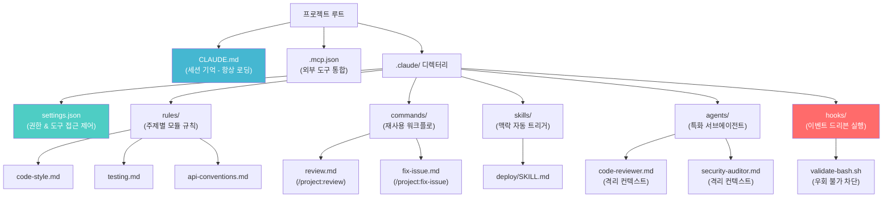
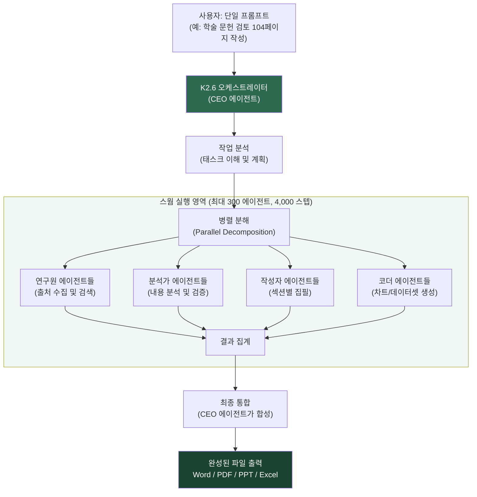
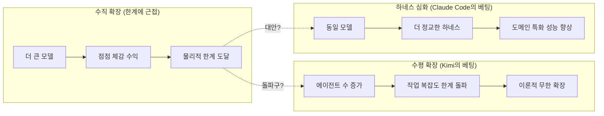

> "왜 남이 만든 하네스를 써야 하나? 내 필요에 맞게 직접 만들면 되지 않나?"  
> — 이 글은 그 정당한 질문에 솔직하게 답하면서, 동시에 2026년 AI 에이전트 생태계에서 실제로 무슨 일이 일어나고 있는지를 설명한다.

## 관련글

[**Kimi Agent Swarm Explained: How to Run 300 AI Agents in a Single Prompt**](https://x.com/hasantoxr/status/2065757441963462964)

---

## 들어가며: 두 장의 자료가 제기하는 질문

from [https://x.com/hasantoxr/status/2070494572569145745](https://x.com/hasantoxr/status/2070494572569145745)

첫 번째 자료는 Claude Code의 프로젝트 구조를 보여주는 다이어그램이다. `CLAUDE.md`, `.claude/` 디렉터리, `settings.json`, `rules/`, `commands/`, `skills/`, `agents/`, `hooks/`에 이르는 여러 계층이 도식화되어 있다. 두 번째 자료는 중국 Moonshot AI의 Kimi Agent Swarm을 소개하는 글로서, 단 하나의 프롬프트로 최대 300개의 AI 에이전트를 동시에 실행하고, 104페이지짜리 학술 논문을 완성 파일로 출력한다는 사례를 다룬다.

이 두 자료는 표면적으로 별개의 주제처럼 보이지만, 실제로는 2026년 AI 엔지니어링 세계의 가장 근본적인 논쟁을 대변한다. 오케스트레이션 능력을 **모델 자체에 내장할 것인가**, 아니면 **외부 하네스로 구성할 것인가**. 그리고 그 외부 하네스를 **기성품을 쓸 것인가**, **직접 만들 것인가**.

---

## 1부: Claude Code 프로젝트 구조 — 하네스 공학의 현재

### 1.1 하네스 공학이란 무엇인가

하네스 공학(Harness Engineering)은 AI 에이전트를 둘러싸는 모든 것을 설계하는 엔지니어링 규율이다. 모델 자체의 능력이 아니라, 그 모델이 실제 환경에서 무엇을 볼 수 있고, 무엇을 건드릴 수 있으며, 어떤 순서로 행동하고, 언제 인간이 개입해야 하는지를 결정하는 구조 전체를 말한다. `Agent = Model + Harness`라는 공식이 2026년 현재 AI 엔지니어링 커뮤니티에서 광범위하게 수용되고 있으며, 이는 모델 능력만으로는 프로덕션 결과를 보장할 수 없다는 수년간의 실패 경험에서 도출된 결론이다.

Claude Code는 Anthropic이 개발한 터미널 기반 코딩 에이전트 CLI로서, 실제로는 Claude 언어 모델 위에 정교한 하네스를 얹어 놓은 시스템이다. CLI 자체는 Node.js 런타임으로 구동되며, 매 턴마다 시스템 지시사항, 도구 스키마, 대화 이력, `CLAUDE.md` 내용, 스킬 메타데이터, 권한 상태를 조립하여 Anthropic Messages API에 전송한 후, 반환된 도구 호출을 실행하고 결과를 다시 루프에 넣는 방식으로 동작한다. 이 구조는 Claude Code 소스가 2026년 3월 npm 패키지의 실수로 일시 노출되었을 때 커뮤니티에 의해 분석되어 그 아키텍처가 공개 지식이 되었다.

### 1.2 CLAUDE.md — 세션의 기억

`CLAUDE.md`는 저장소 루트에 위치하는 마크다운 파일로, Claude Code가 매 세션 시작 시 자동으로 읽어 들이는 프로젝트 기억 파일이다. 다이어그램에서 설명하는 기능은 다음과 같다. 세션 시작 시 로딩되어 프로젝트 개요, 기술 스택, 빌드 명령, 코딩 컨벤션, 아키텍처 원칙을 포함하며, 로컬 환경별 덮어쓰기를 위한 `CLAUDE.local.md`를 지원한다.

그러나 이 파일에는 중요한 물리적 한계가 있다. 연구에 따르면 Claude를 포함한 프론티어 모델들은 150~200개 안팎의 지시사항만 안정적으로 따를 수 있으며, Claude Code의 기본 시스템 프롬프트가 이미 약 50개를 사용하고 있다. 따라서 실질적으로 `CLAUDE.md`에 담을 수 있는 규칙의 효과적 상한선은 약 150줄 전후이다. 이 한계를 넘어가면 맥락 부패(context rot) 현상이 발생하여, 중요한 규칙이 희석되고 준수율이 조용히 하락한다. Chroma가 2025년에 수행한 연구에서는 18개 프론티어 모델 모두가 입력이 증가함에 따라 정확도가 저하되는 현상을 보였으며, 95%에서 60%까지 떨어지는 경우도 있었다.

`CLAUDE.md`는 컨텍스트 압축(compaction) 이후에도 재로딩되기 때문에, 긴 세션에서도 영구적인 규칙이 살아남을 수 있는 핵심 메커니즘이 된다. 또한 중요한 사실은, `CLAUDE.md`에 기술된 지시사항은 모델이 컨텍스트나 추론을 통해 우회할 수 있는 반면, hooks는 그럴 수 없다는 점이다.

### 1.3 .mcp.json — MCP 통합 설정

`.mcp.json` 파일은 Model Context Protocol(MCP) 통합 설정을 저장하는 파일이다. GitHub, JIRA, Slack, 데이터베이스 등 외부 시스템과의 연결을 정의하며, git을 통해 팀 전체에 공유된다. 이 파일의 의의는 MCP 도구가 추가되면 기존의 동일한 권한 파이프라인을 거쳐 도구로 노출된다는 점에 있다. Claude Code는 세 가지 전송 방식(HTTP, stdio, SSE)을 지원하며, `claude mcp add server-name --transport http "URL"` 명령 하나로 MCP 서버를 추가할 수 있다.

### 1.4 .claude/ 디렉터리 — 하네스의 심장

`.claude/` 디렉터리가 Claude Code 하네스의 핵심이다. 이 안에 담기는 여러 구성요소들의 역할을 하나씩 살펴보겠다.

**settings.json**: 권한과 도구 접근을 제어하는 파일이다. 어떤 bash 명령을 실행할 수 있고 어떤 명령은 금지되는지, 어떤 파일 경로에 쓰기 가능하고 어떤 경로는 보호되는지를 선언적으로 정의한다. 예를 들어 `git push --force`, `rm -rf`, `DROP TABLE`, 외부 `curl` 요청 등은 deny 목록에 포함시키는 것이 일반적이다. `settings.local.json`은 개인 로컬 환경에서만 유효한 설정을 담는 덮어쓰기 파일로, git에 커밋하지 않는다. 또한 모델 선택과 훅 동작 방식도 이 파일에서 제어한다.

**rules/ 디렉터리**: 주제별로 모듈화된 `.md` 파일들의 집합이다. `code-style.md`, `testing.md`, `api-conventions.md` 등으로 구성되며, 특정 파일이나 경로를 대상으로 지정할 수 있다. 이 구조의 장점은 모든 규칙을 `CLAUDE.md` 하나에 몰아넣는 대신, 필요한 시점에 필요한 규칙만 로딩하는 점진적 공개(progressive disclosure) 패턴을 구현할 수 있다는 것이다.

**commands/ 디렉터리**: `/project:<name>` 형식으로 호출할 수 있는 커스텀 슬래시 명령을 저장하는 공간이다. `review.md`, `fix-issue.md` 등이 예시이며, 반복 가능한 워크플로를 재사용 가능한 단위로 패키징하고, 셸 실행도 지원한다. 팀이 자주 수행하는 코드 리뷰 체크리스트, 배포 전 검증 절차, 이슈 해결 패턴 등을 명령어 하나로 호출할 수 있다.

**skills/ 디렉터리**: 작업 맥락에 따라 자동으로 트리거되는 스킬 패키지를 담는다. `deploy/SKILL.md`처럼 계층적으로 구성되며, 필요할 때만 로딩되어 컨텍스트를 가볍게 유지한다. 이는 모든 지식을 항상 컨텍스트에 올려놓는 것이 아니라, 필요한 시점에 필요한 전문 지식만 주입하는 방식이다. Agent Skills 오픈 스탠더드를 기반으로 한다.

**agents/ 디렉터리**: 역할이 특화된 서브에이전트 정의 파일을 담는다. `code-reviewer.md`, `security-auditor.md`처럼 각 에이전트가 무엇을 하는지, 어떻게 핸드오프하는지, 어떤 모델에서 실행되는지를 기술한다. 각 에이전트는 격리된 컨텍스트 윈도우를 가지며, 자신만의 도구와 모델 설정을 보유한다.

**hooks/ 디렉터리**: 이것이 하네스에서 가장 강력하고 독특한 구성요소다. 특정 이벤트가 발생했을 때 자동으로 실행되는 셸 스크립트를 담는다. `validate-bash.sh` 같은 파일이 예시다. hooks의 핵심적인 특성은, **모델이 설득이나 컨텍스트 조작으로 hooks를 우회할 수 없다**는 점이다. `PreToolUse` 훅에서 종료 코드 2를 반환하면, 어떤 상황에서도 해당 도구 호출이 무조건 차단된다. `CLAUDE.md`의 지시사항은 모델의 추론 과정에서 맥락에 따라 무시될 수 있지만, hooks는 그럴 수 없다. 유효한 훅 이벤트로는 `SessionStart`, `UserPromptSubmit`, `PreToolUse`, `PostToolUse`, `SubagentStart`, `SubagentStop`, `TaskCreated`, `TaskCompleted` 등이 있다.

### 1.5 하네스 구조 시각화

### 1.6 하네스가 실제로 만드는 차이

2026년에 발표된 통제된 A/B 실험에서, Claude Code를 프롬프트만 사용한 경우와 `.claude/` 사전 구성(하네스)을 갖춘 경우를 15개의 소프트웨어 엔지니어링 작업에 대해 비교했다. 결과는 놀라웠다. 하네스 없는 경우 평균 품질 점수가 100점 만점에 49.5점인 반면, 하네스를 적용한 경우 79.3점으로 60%가 향상되었다. 더 중요한 발견은 **복잡도가 높아질수록 하네스의 효과가 더 커진다**는 점이었다. 기본 수준 작업에서는 23.8점 향상, 고급 수준에서는 29.6점, 전문가 수준에서는 36.2점 향상이 측정되었다.

별도로, LangChain이 Terminal-Bench 2.0에서 52.8%에서 66.5%로 점수를 올린 것은 **모델 변경 없이 하네스 구조만 바꿈으로써** 달성한 결과다. 맥락 주입, 자기 검증 루프, 연산 할당이라는 세 가지 하네스 개선이 13.7점이라는 순수 아키텍처 이득을 만들어냈다.

---

## 2부: Kimi Agent Swarm K2.6 — 오케스트레이션을 모델에 내장하다

### 2.1 Moonshot AI의 배경

Moonshot AI는 2023년 3월 청화대학교 동문인 Yang Zhilin, Zhou Xinyu, Wu Yuxin이 공동 창업한 베이징 소재 AI 스타트업이다. 2026년 현재, 오픈웨이트 진영에서 Kimi K2 시리즈로 급격히 주목받게 되었다. 2025년 중반 Kimi K2를 시작으로, 2026년 1월 K2.5(Agent Swarm 최초 도입), 2026년 4월 20일 K2.6 출시로 이어지는 빠른 릴리스 사이클이 특징이다.

특이한 점은, 동일 기간 Anthropic의 K2.6 관련 보도에서 Moonshot AI가 미국 모델들로부터 대규모 지식 증류(distillation)를 시도했다는 의혹이 제기된 바 있다는 것이다. 이 맥락은 Kimi K2.6의 성능 지표를 해석할 때 참고해야 할 배경이다.

### 2.2 Kimi K2.6 아키텍처

Kimi K2.6은 2026년 4월 20일 Modified MIT 라이선스로 오픈웨이트 공개된 네이티브 멀티모달 에이전트 모델이다. 핵심 아키텍처는 다음과 같다.

총 파라미터 수는 1조(1 trillion)에 달하는 Mixture-of-Experts(MoE) 구조로 구현되어 있다. MoE 방식의 핵심은 토큰 당 32억(32B) 파라미터만 활성화된다는 점이다. 384개의 전문가(expert) 레이어에서 토큰당 8개를 라우팅하고 1개를 공유하는 방식이며, 총 61개 레이어와 64개의 어텐션 헤드를 가진다. 이 구조 덕분에 추론 비용은 32B 모델 수준을 유지하면서 1T 모델 수준의 능력을 발휘한다. 컨텍스트 윈도우는 262,144 토큰(256K)이며, Multi-head Latent Attention(MLA)으로 KV 캐시를 압축한다. 400M 파라미터 규모의 MoonViT 비전 인코더가 통합되어 텍스트, 이미지, 비디오를 단일 아키텍처에서 처리한다. INT4 네이티브 양자화를 지원하여 vLLM, SGLang, KTransform 위에서 효율적으로 서빙 가능하다.

K2.5와 K2.6의 핵심적인 차이는 포스트트레이닝에 있다. 아키텍처 자체는 동일하며, K2.6은 장거리 안정성, 지시 준수, 스웜 조율 능력에 더 많은 학습 연산이 투입된 결과다.

### 2.3 Agent Swarm: 스웜이 스스로를 설계한다

Agent Swarm은 K2.5에서 처음 도입되어 K2.6에서 대폭 확장된 Kimi의 핵심 멀티에이전트 기능이다. K2.5가 100개의 서브에이전트, 1,500개의 조율 스텝 한도를 가졌다면, K2.6은 이를 300개의 서브에이전트, 4,000개의 조율 스텝으로 각각 3배, 2.67배 확장했다.

이 시스템의 가장 혁명적인 특성은 **오케스트레이션이 모델 자체에 내장되어 있다**는 점이다. 사용자가 프롬프트를 입력하면, K2.6 자체가 작업을 어떻게 분해할지, 몇 개의 에이전트가 필요한지, 각 에이전트에 무슨 역할을 부여할지를 실시간으로 결정한다. 사용자는 LangGraph, CrewAI, AutoGen 같은 별도의 오케스트레이션 프레임워크를 배우거나 설치하거나 유지보수할 필요가 없다.

동작 순서를 구체적으로 설명하면 다음과 같다. 사용자가 단일 프롬프트를 입력한다. K2.6 오케스트레이터 에이전트(CEO 역할)가 작업을 이해하고, 필요한 전문가 유형을 파악하며, 작업을 병렬 처리 가능한 단위로 분해한다. 이후 필요한 수의 서브에이전트를 실시간으로 생성한다(최소 12개에서 최대 300개). 각 서브에이전트는 자신의 담당 부분을 독립적으로 실행한다. 조율자 에이전트가 결과를 통합하고 최종 결과물을 합성한다. 최종 출력은 대화 스레드가 아닌 Word, PDF, PowerPoint, Excel 등 완성 파일 형태로 제공된다.

이 전체 과정에서 사용자가 사전에 에이전트 구조를 설계할 필요가 없다. 스웜이 작업의 요구에 따라 스스로를 구성한다.

### 2.4 스웜 아키텍처 시각화

### 2.5 Kimi K2.6의 벤치마크 성능

Moonshot AI가 공개한 벤치마크 결과는 다음과 같다. 이 수치들은 Moonshot 자체 측정이며 일부는 독립 검증이 이루어지지 않았음을 감안해야 한다.

에이전트 능력 지표를 보면, BrowseComp Swarm 벤치마크에서 K2.6은 86.3점으로, GPT-5.4의 78.4점을 크게 상회한다. DeepSearchQA F1 점수는 92.5로 GPT-5.4의 78.6에 비해 상당한 격차를 보인다. 이 두 벤치마크는 특히 병렬 검색과 정보 통합 능력을 측정하는 것으로, Agent Swarm의 핵심 강점 영역과 일치한다.

소프트웨어 엔지니어링 지표에서는, SWE-Bench Pro에서 58.6점으로 GPT-5.4(57.7), Claude Opus 4.6 최대 노력 모드(53.4), Gemini 3.1 Pro(54.2)를 모두 앞섰다. SWE-Bench Verified는 80.2점이다. Humanity's Last Exam(HLE-Full, 도구 사용 포함)에서는 54.0점으로 GPT-5.4(52.1), Claude Opus 4.6(53.0), Gemini 3.1 Pro(51.4)를 모두 제쳤다.

반면 순수 수학 추론 지표에서는 GPT-5.4가 우위를 보인다. AIME 2026에서 K2.6이 96.4점, GPT-5.4가 99.2점이며, GPQA-Diamond에서는 K2.6 90.5점, GPT-5.4 92.8점이다.

한 가지 중요한 주의사항이 있다. Terminal-Bench 2.0에서 Moonshot은 GPT-5.4를 65.4점으로 보고했지만, Codex CLI나 커스텀 하네스를 사용한 다른 평가에서는 GPT-5.4가 75.1점으로 측정되었다. 즉 벤치마크 점수는 **어떤 하네스를 사용하느냐에 따라 크게 달라진다**는 사실이 드러난다. 이는 역설적이게도 하네스 공학의 중요성을 재차 확인해주는 증거다.

### 2.6 Kimi의 스케일링 전략

Kimi가 공개한 스케일링 전략은 세 개의 축으로 구성된다. 첫 번째는 토큰 효율성으로, 더 많은 학습 토큰으로 손실을 낮추는 전통적인 스케일링 법칙이다. 두 번째는 긴 컨텍스트로, 컨텍스트 위치가 길어질수록 토큰 당 손실이 증가하는 현상을 극복하는 장거리 안정성이다. 세 번째가 바로 Agent Swarm으로, 에이전트 수가 늘어날수록 처리 가능한 작업 복잡도가 기하급수적으로 올라간다는 점을 노린다.

여기서 Moonshot의 핵심 주장이 도출된다. 수직 확장(더 큰 모델, 더 많은 파라미터)은 물리적·경제적·지적 한계가 있다. 반면 수평 확장(더 많은 에이전트의 협력)은 이론적으로 한계가 없다. 하나의 모델은 한 명의 전문가이지만, 자기 조직화하는 스웜은 하나의 회사다.

### 2.7 실제 사례: 12시간 연속 자율 코딩

Moonshot이 공개한 가장 인상적인 실증 사례는 다음과 같다. K2.6이 Zig로 작성된 8년 된 오픈소스 금융 매칭 엔진을 자율적으로 12시간 이상 연속 작업하여 개편했다. 이 과정에서 4,000개 이상의 도구 호출이 발생했고, 14번의 반복(iteration)을 거쳐 처리량을 초당 약 15 토큰에서 193 토큰으로 끌어올렸다. 동일 하드웨어에서 LM Studio 대비 약 20% 빠른 성능이다.

별도로, Jarred Sumner(Bun 창시자)가 약 75만 줄의 Zig 코드를 Rust로 포팅하는 작업에서 Dynamic Workflows 패턴을 활용한 사례도 주목할 만하다. 11일 만에 완성, 기존 테스트 스위트의 99.8% 통과라는 결과를 얻었다. 이 사례는 Claude Code 생태계에서 나온 것으로, "작업 한 단위 실행 → 검토 → 수정 적용"이라는 단순한 루프가 반복되었다. 두 사례 모두 **장시간 자율 실행이 가능한 하네스 또는 스웜**이라는 공통 전제를 공유한다.

### 2.8 가격과 접근성 (2026년 4월 기준)

Kimi Agent Swarm의 접근 방식은 다음과 같이 계층화되어 있다.

무료 티어는 Instant 모드와 제한된 Agent 크레딧만 제공하며, 300 에이전트 스웜은 포함되지 않는다. Moderato(월 19달러)는 K2.6 채팅, Agent 크레딧, 딥 리서치, Kimi Code를 포함하나, 풀 스웜은 비활성화된다. Allegretto(월 39달러)부터 Agent Swarm이 완전 해제되며, 대부분 사용자에게 권장되는 진입 티어다. Allegro(월 99달러)는 더 많은 스웜 크레딧과 클라우드 배포 기능(Claw)을 포함하며, Vivace(월 199달러)가 최대 쿼터를 제공하는 프로 티어다.

한편 K2.6의 API 가격은 입력 토큰 백만 개당 0.60달러, 출력 토큰 백만 개당 2.50달러 수준으로 보고된다. Claude Opus 4.7 대비 입력은 약 8.3배, 출력은 약 10배 저렴하다. MoE 아키텍처의 경제성이 직접적으로 가격 경쟁력으로 이어진다.

K2.6의 가중치는 Modified MIT 라이선스로 Hugging Face에 공개되어 있다. 단, 월 사용자 1억 명 이상이거나 월 매출 2천만 달러를 초과하는 상업 서비스에서는 UI에 "Kimi K2" 표시 의무가 있다.

### 2.9 Kimi Work — 데스크톱 에이전트로의 확장

2026년 6월, Moonshot은 Kimi Work라는 로컬 데스크톱 에이전트를 macOS(애플 실리콘)와 Windows용으로 출시했다. Kimi Work는 K2.6을 엔진으로 구동되는 것으로 커뮤니티에서 보고되며, 네 가지 핵심 기능을 포함한다.

Agent Swarm은 로컬 머신에서 최대 300개의 서브에이전트를 병렬 실행한다. WebBridge는 브라우저 확장 프로그램으로, 실제 사용자처럼 브라우저를 조작하여 검색, 스크롤, 데이터 추출, 폼 입력을 자동화한다. 금융 데이터 통합 기능은 A주식, 홍콩증시, 미국 증시의 시장 데이터를 사전 통합하여 별도 API 설정 없이 활용할 수 있게 한다. 크론 엔진은 예약 작업을 지원하여, 매일 오전 7시 자동 브리핑 생성 같은 반복 자동화를 구현한다.

Kimi Work의 의의는 클라우드 우선(cloud-first)이 지배적이던 AI 에이전트 도구 시장에서, 로컬 파일과 로그인된 브라우저 세션에 직접 접근하는 방향으로 전환을 시도한다는 점이다.

---

## 3부: "왜 남의 하네스를 쓰나?" — 질문에 대한 솔직한 답변

> Why do people care about Claude Code the harness? Make your own harness that meets your needs, not some bug-eating A-hole’s idea of what you need?

이제 핵심 질문에 직접 답할 차례다. "왜 Claude Code의 하네스 구조를 따라야 하는가? 내 필요에 맞게 직접 만들면 되지 않나?"

이 질문은 정당하다. 아니, 정확히 맞는 질문이다. 그리고 답은 단순하지 않다.

### 3.1 하네스 구축의 실제 비용

직접 하네스를 만드는 것은 가능하다. 좁게 정의된 단일 작업이라면 — CI/CD 봇, 테스트 실행 자동화, 특정 명령 파이프라인 — 최소한의 도구, 단순한 권한 체크, 고정된 컨텍스트 윈도우로 구성된 간단한 하네스로 충분하다. 이 경우 직접 만드는 것이 오히려 합리적이다.

그러나 세션 간 상태 유지, 컨텍스트 리셋 후 상태 복구, 신뢰할 수 없는 도구 출력 처리, 수십 개의 도구 통합, 장시간 실행 — 이 중 두 가지 이상이 요구사항에 포함된다면, 직접 구현하는 과정에서 Claude Code가 이미 풀어낸 문제들을 그대로 다시 만나게 된다. 권한 우선순위 평가 순서, 컨텍스트 압축 후 중요 정보 복원, 에이전트 간 핸드오프, 실패 복구 패턴이 모두 여기에 해당한다. 한 분석가가 표현한 대로, "대부분의 팀이 하네스 복잡도를 과소평가한다. 나도 분명히 그랬다."

### 3.2 Claude Code 하네스의 숨겨진 가치

Claude Code 하네스를 채택하는 가장 강력한 이유는 **Anthropic이 Claude 모델 자체를 이 하네스 구조에 맞게 훈련했다**는 점이다. 모델이 `CLAUDE.md` 파일의 존재와 의미를 이해하고, `SKILL.md` 패키지 형식을 해석하며, `agents/` 디렉터리의 서브에이전트 정의를 따르도록 설계되었다. 이것은 단순히 "파일을 읽는다"는 것이 아니라, 해당 구조에 대해 더 정확한 이해와 준수를 발휘한다는 의미다.

또한 팀 협업 측면의 실용적 가치가 있다. `CLAUDE.md`, `.claude/settings.json`, `commands/`, `rules/`는 모두 git을 통해 공유된다. 팀 구성원 누구나 저장소를 클론하는 순간 동일한 Claude Code 동작을 갖게 된다. 컨벤션, 제약, 워크플로가 코드 베이스에 함께 버전 관리되는 것이다.

MCP 생태계 접근성도 중요한 가치다. `.mcp.json` 하나로 GitHub, JIRA, Slack, 데이터베이스 연결이 팀 전체에 배포된다. 이 통합을 직접 구현하려면 각각 별도의 연동 작업이 필요하다.

### 3.3 커스텀 하네스가 필요한 진짜 경우

그렇다고 Claude Code 하네스가 모든 상황에 적합한 것은 아니다. 커스텀 하네스가 필요한 경우는 명확히 존재한다.

첫째, **도메인 특화 제약이 강한 환경**이다. 통신사 BSS/OSS 운영처럼, 레거시 시스템과의 통합, 망 격리 환경에서의 사설 LLM 사용, 엄격한 RBAC 정책이 필요한 경우 Claude Code의 기본 하네스는 출발점일 뿐이다. `CLAUDE.md`와 `hooks/`를 도메인 지식으로 완전히 재작성하거나, 아예 별도의 래퍼 레이어가 필요할 수 있다.

둘째, **모델 독립성이 요구될 때**다. Claude Code는 Claude 모델에 묶여 있다. 비용 최적화나 데이터 주권 이유로 DeepSeek, Kimi K2.6, 로컬 오픈웨이트 모델을 혼합 사용해야 한다면 LangGraph나 커스텀 하네스 방향을 검토해야 한다.

셋째, **Claude Code가 소프트웨어 엔지니어링 외 도메인에서는 설계 목적과 어긋난다**. 비즈니스 프로세스 자동화, 대규모 문서 분석, 배치 처리가 주목적이라면, Claude Code보다 Kimi Agent Swarm이나 LangGraph가 더 직접적으로 맞는 도구일 수 있다.

### 3.4 Kimi의 답: 하네스를 모델에 흡수시키다

Kimi의 접근은 이 질문 전체를 다른 방향으로 해결한다. "하네스를 만들 것인가, 기성품을 쓸 것인가"라는 선택지 자체를 제거하고, 오케스트레이션 능력을 모델의 훈련 목표에 포함시킨 것이다.

K2.5가 처음 Agent Swarm을 도입했을 때, 커뮤니티의 반응은 엇갈렸다. 논문 결과는 인상적이었지만, 복잡한 작업에서 100개 이상의 에이전트를 병렬 실행할 때 조율이 불안정해진다는 현장 보고가 있었다. K2.5 시절 에이전트 루프에서 도구 호출의 약 12%가 실패했다는 기록도 있다. K2.6은 이 신뢰성 문제를 개선하여 Beta 딱지를 제거하고 정식 출시(GA)로 전환했다.

그러나 Kimi 접근 방식의 근본적인 트레이드오프는 제어 가능성이다. 에이전트가 어떻게 분해되고, 어떤 에이전트가 무엇을 담당하며, 각 단계에서 어떤 결정이 내려지는지를 사용자가 세밀하게 제어하기 어렵다. 작업이 Kimi의 오케스트레이션 방식과 맞지 않을 경우, 수정하거나 조정하는 수단이 제한된다.

---

## 4부: 세 가지 접근의 실무 비교

### 4.1 핵심 설계 철학 비교

```mermaid
graph TB
  subgraph KIMI_PHIL["Kimi Agent Swarm 철학"]
    KP1["오케스트레이션 = 모델 내장 능력"] --> KP2["사용자: 목표만 설명"]
    KP2 --> KP3["스웜: 구조 자율 결정"]
    KP3 --> KP4["출력: 완성 파일"]
  end
  
  subgraph CLAUDE_PHIL["Claude Code 하네스 철학"]
    CP1["오케스트레이션 = 외부 구성"] --> CP2["엔지니어: 하네스 설계"]
    CP2 --> CP3["Claude: 하네스 내에서 실행"]
    CP3 --> CP4["출력: 코드/파일/결과"]
  end
  
  subgraph CUSTOM_PHIL["커스텀 하네스 철학"]
    DP1["오케스트레이션 = 직접 구현"] --> DP2["팀: 전체 스택 소유"]
    DP2 --> DP3["모델: 자유롭게 선택"]
    DP3 --> DP4["출력: 비즈니스 특화"]
  end
```

### 4.2 실무 선택 기준표

세 가지 접근 방식의 차이를 실무 관점에서 정리하면 다음과 같다.

**Kimi Agent Swarm**을 선택하는 상황은 작업이 넓게(wide) 분해되는 경우다. 다수의 항목 연구, 다수의 문서 처리, 다수의 섹션 작성, 병렬 관점 분석 등이 여기 해당한다. 채팅 스레드가 아닌 완성 파일 형태의 결과물이 필요하고, 클라우드 실행이 허용된 환경이며, 오케스트레이션 설계에 투자할 시간이 없을 때 최적의 선택이다. 단, 순차적으로만 처리 가능한 딥(deep) 파이프라인, 엄격한 데이터 주권 요구, 감사 추적이 필수인 환경에서는 한계가 있다.

**Claude Code 하네스**를 선택하는 상황은 소프트웨어 엔지니어링이 주 작업일 때다. 코드베이스 리팩터링, 보안 감사, 배포 자동화, 코드 리뷰처럼 로컬 파일과 셸 명령에 깊이 통합되어야 하는 작업에 최적화되어 있다. 팀 협업, 규칙 공유, 반복 워크플로 자동화가 필요할 때도 적합하다. 주의할 점은 다른 도메인이나 비소프트웨어 작업에는 Claude Code의 설계 목적과 어긋날 수 있다는 것이다.

**커스텀 하네스**를 선택하는 상황은 도메인 특수성이 극단적으로 높을 때다. 통신 BSS/OSS, 금융 컴플라이언스, 의료 레코드 처리처럼 업계 규정과 레거시 시스템 통합이 복잡하게 얽혀 있고, 특정 벤더에 종속되지 않는 모델 독립성이 필요하거나, 망 격리 환경에서 온프레미스 LLM을 실행해야 할 때 커스텀이 답이다. 다만 이 선택의 대가는 모든 하네스 복잡성을 팀이 직접 소유하는 것이다.

**LangGraph/LangChain 기반 커스텀**은 상태 기계(state machine)로 명확히 모델링할 수 있는 복잡한 워크플로에 적합하다. 루프, HITL(Human-in-the-Loop) 승인 게이트, 조건부 분기, 영구 상태가 필요한 프로덕션 에이전트 시스템에서 가장 성숙한 오픈소스 옵션이다. Terminal-Bench 2.0에서 하네스 개선만으로 13.7점 향상을 달성한 사례가 이를 뒷받침한다.

### 4.3 Agent Swarm의 솔직한 한계

아티클에서 저자가 솔직하게 인정한 한계들은 실무에서 반드시 인식해야 한다.

15분짜리 작업은 스웜을 쓰지 않는 것이 나을 수 있다. 스웜 비용은 크레딧 소모가 크고, 200행 연구 작업 하나가 Allegretto 티어 월간 할당량의 20~40%를 소비할 수 있다. 오케스트레이션 오버헤드가 실재한다는 점도 중요하다. 복잡한 작업에서 100개 이상의 에이전트를 병렬 실행하면 조율이 불안정해질 수 있으며, 300 에이전트 한도는 보장이 아니라 용량의 천장이다. 실무에서는 20~80개 서브에이전트가 최적 범위로 보고된다.

순차적 의존성이 있는 작업은 병렬화할 수 없다. 2단계가 1단계 결과를 필요로 하는 데이터 파이프라인이라면, 스웜이 도움이 되지 않는다. 30명의 서브에이전트가 쓴 100페이지 논문은 한 명의 전문가가 쓴 것에 비해 통일성이 약간 떨어질 수 있다. 속도와 규모를 얻는 대신 일관성의 일부를 포기하는 트레이드오프다.

---

## 5부: 실무 활용 가이드

### 5.1 Claude Code 하네스 구축 로드맵

실무에서 Claude Code 하네스를 구축하는 권장 순서는 다음과 같다.

1일차에는 `/init` 명령으로 `CLAUDE.md` 스캐폴딩을 생성한 후 수작업으로 다음 내용을 담는다. 프로젝트를 한 문장으로 설명하는 개요, 언어와 프레임워크 버전이 포함된 기술 스택, 빌드/테스트/린트/배포의 정확한 명령, 핵심 디렉터리 3~5개와 그 역할, 린터가 잡지 못하는 팀 컨벤션이다.

1주차에는 `.claude/settings.json`을 구성하여 기본 권한과 `validate-bash.sh` 같은 자동 포맷/검증 훅을 추가한다. 가장 자주 사용하는 워크플로 2~3개를 `commands/`에 등록한다.

1개월차에는 반복 패턴을 관찰하여 `skills/`와 `agents/`를 확장한다. `CLAUDE.md`를 살아있는 문서로 프로젝트와 함께 진화시킨다. 이 모든 파일을 git에 커밋하면, 팀 전원이 저장소 클론 시 동일한 Claude Code 동작을 자동으로 갖게 된다.

### 5.2 Kimi Agent Swarm 첫 60분 활용법

스웜을 처음 사용한다면, 다음 다섯 가지 프롬프트 패턴 중 자신의 상황에 맞는 것을 골라 시작하는 것이 효율적이다.

**목록 리서치 스웜** 패턴은 "N개의 특정 항목을 조사하라. 각각에 대해 [필드1], [필드2], [필드3]을 찾아라. 항목당 하나의 행으로 [형식]으로 출력하고, [기준]에 따라 상위 N개를 순위 매긴 요약 섹션을 추가하라"는 구조다. 유한한 연구 목록이 있을 때 사용하며, 항목당 하나의 서브에이전트를 트리거한다.

**문서 합성 스웜** 패턴은 "업로드한 N개의 문서를 읽어라. [주제1], [주제2], [주제3]을 다루는 [길이] 페이지짜리 [보고서 유형]을 작성하라. 전체 인용을 포함하고, 이단 학술 문서 형식으로 Word로 내보내라"는 구조다. 방대한 원본 자료를 바탕으로 장문 합성 결과물이 필요할 때 사용한다.

**전문가 패널 스웜** 패턴은 "[계획/피치/초안]을 [역할1], [역할2], [역할3], [역할4]의 관점에서 검토하라. 각 검토자는 자신의 역할에 특화된 우려를 집중적으로 제기하고, 이후 상위 5개 실행 항목을 담은 통합 보고서를 제공하라"는 구조다. 의도적 반대 의견과 다각도 검토가 필요할 때 사용한다.

**배치 처리 스웜**은 동일한 작업을 N개의 입력에 대해 병렬 실행하고 단일 파일로 취합하는 패턴이다. 분류, 태깅, 추출, 개인화처럼 반복 작업에 적합하며, "인간 검토가 필요한 항목에 플래그를 달아달라"는 지시를 추가하면 품질 관리가 가능하다.

**딥 빌드 스웜**은 [연구 단계], [분석 단계], [초안 단계], [다듬기 단계]가 필요한 대형 창의적/전략적 결과물을 만들 때 사용하며, 단계별로 적합한 전문 에이전트를 스웜이 자동으로 선택하고 인계한다.

---

## 6부: 전망 — 2026년 이후

### 6.1 하네스 공학의 미래

2026년 현재, AI 에이전트 오케스트레이션에 관한 두 가지 명백히 다른 베팅이 공존하고 있다. Kimi의 베팅은 오케스트레이션을 모델에 흡수시키는 것이 옳다는 방향이다. Claude Code와 LangGraph의 베팅은 외부 하네스를 통한 제어와 관찰 가능성이 프로덕션에서 더 신뢰할 수 있다는 방향이다.

두 방향 모두 의미 있는 결과를 만들어내고 있다. 그리고 그 방향이 수렴할 가능성이 있다. Anthropic도 멀티에이전트 오케스트레이션을 발전시키고 있으며, OpenAI도 유사한 기능을 출시할 것으로 예상된다. Google의 Gemini Deep Think에도 유사한 암시가 있다. Kimi가 먼저 출시했지만, 이것이 영구적인 선점 우위를 의미하지는 않는다.

### 6.2 하네스는 여전히 해자다

어떤 방향으로 흘러가든, "하네스가 해자(moat)"라는 통찰은 유효하다. `CLAUDE.md`, 메모리 폴더, 스킬, 에이전트 정의로 구성된 하네스는 팀의 누적된 도메인 지식이 체계화된 자산이다. 모델은 교체할 수 있다. 하네스는 쉽게 복제할 수 없다.

Kimi K3의 소문이 사실이라면 — 3~4조 파라미터 규모로 보고됨 — Agent Swarm은 훨씬 더 강력한 기반 모델 위에서 실행될 것이다. K2.6의 12시간 자율 실행 능력과 300 에이전트 스웜은 그 더 큰 모델이 도착했을 때 활용할 실행 인프라를 먼저 구축하는 의도라는 해석이 설득력을 얻고 있다.

한편 Claude Code의 Dynamic Workflows가 도입된 이후, 에이전트는 실시간으로 자신을 위한 하네스를 작성할 수 있게 되었다. "계획을 모델의 머리 속에 두지 않고 코드로 외재화한다"는 원칙이 핵심이다. 워크플로가 JavaScript 파일이 되고, 에이전트는 현재 스텝과 최종 합성만 담당한다. 이것은 Kimi의 스웜 자기 조직화와 놀랍도록 유사한 원리다. 다만 제어와 관찰 가능성이라는 차원이 외부에 남아 있다는 차이가 있다.

### 6.3 결론: 질문 자체가 틀리지 않았다

"왜 남의 하네스를 써야 하나, 직접 만들면 되지 않나?"는 틀린 질문이 아니다. 오히려 정확한 질문이다. 다만 답이 이분법적이지 않다는 것이 핵심이다.

Claude Code 하네스는 소프트웨어 엔지니어링 도메인에서 팀 협업이 필요하고, 반복 가능한 워크플로를 구성하며, Anthropic 생태계에 맞출 때 의미 있는 시작점이다. 이때 "시작점"이 핵심 단어다. 그 위에 도메인 특화 레이어를 쌓는 것이 하네스 공학의 실제 작업이다.

Kimi Agent Swarm은 하네스를 직접 설계하는 수고 없이 대규모 병렬 리서치, 장문 문서 합성, 배치 처리를 즉시 실행하고 싶을 때 현실적인 대안이다. 단, 클라우드 실행이 허용되고 세밀한 제어보다 속도와 규모가 우선인 작업에 한해서다.

커스텀 하네스는 두 선택지가 모두 맞지 않을 때, 특히 망 격리, 레거시 통합, 극단적 도메인 특수성이 요구사항에 포함될 때의 답이다. 이 경우 하네스 구축 비용을 정직하게 산정하고 팀이 그 복잡성을 소유할 준비가 되어 있어야 한다.

세 접근 방식은 경쟁이 아니라 상호 보완이다. 2026년 현재 AI 에이전트 생태계에서 가장 실용적인 전략은 모든 작업에 하나의 도구를 고집하는 것이 아니라, 각 작업의 성격에 따라 적합한 하네스를 선택하고 조합하는 역량을 키우는 것이다.

---

## 부록: 주요 기술 수치 요약

| 항목 | Kimi K2.6 (2026.04) | Claude Opus 4.6 | GPT-5.4 |
|------|---------------------|-----------------|---------|
| SWE-Bench Pro | 58.6% | 53.4% | 57.7% |
| SWE-Bench Verified | 80.2% | — | — |
| HLE-Full (도구 포함) | 54.0% | 53.0% | 52.1% |
| DeepSearchQA F1 | 92.5 | — | 78.6 |
| BrowseComp Swarm | 86.3 | — | 78.4 |
| 최대 에이전트 수 | 300 (K2.5: 100) | — | — |
| 최대 조율 스텝 | 4,000 (K2.5: 1,500) | — | — |
| 컨텍스트 윈도우 | 256K 토큰 | 200K 토큰 | — |
| 파라미터 | 1T 총 / 32B 활성 | 비공개 | 비공개 |
| 라이선스 | Modified MIT (오픈웨이트) | 독점 API | 독점 API |

---

## 참고 출처

- Moonshot AI, "Kimi K2.6 릴리스", 2026년 4월 20일
- MarkTechPost, "Moonshot AI Releases Kimi K2.6", 2026년 4월 20일
- Verdent AI, "What Is Kimi K2.6?", 2026년 4월 21일
- Kilo Code Blog, "Kimi K2.6 Has Arrived", 2026년 4월 20일
- MarkTechPost, "Moonshot AI Launches Kimi Work", 2026년 6월
- Towards Data Science, "A Harness for Every Task", 2026년 6월
- DEV Community / ShipWithAI, "The Complete Claude Code Harness Engineering Guide", 2026년 5월
- GitHub revfactory/claude-code-harness (A/B 실험 결과), 2026년
- Restato, "Harness Engineering: The Complete Guide", 2026년 4월
- WaveSpeed Blog, "Claude Code Agent Harness Architecture", 2026년 4월
- Medium / Ewan Mak, "Kimi K2.6 & Kimi Code Review", 2026년 4월
- hidekazu-konishi.com, "Claude Code Harness and Environment Engineering", 2026년 4월
- SoftmaxData, "Agent Swarm vs Anthropic Workflows vs LangGraph", 2026년
- AliceLabs, "Best AI Agent Frameworks 2026", 2026년 6월
- LangChain Docs, "Frameworks, runtimes, and harnesses", 2026년
- MakeToCreate, "CLAUDE.md Best Practices: The Complete 2026 Guide", 2026년

---

작성일자: 2026-06-28
