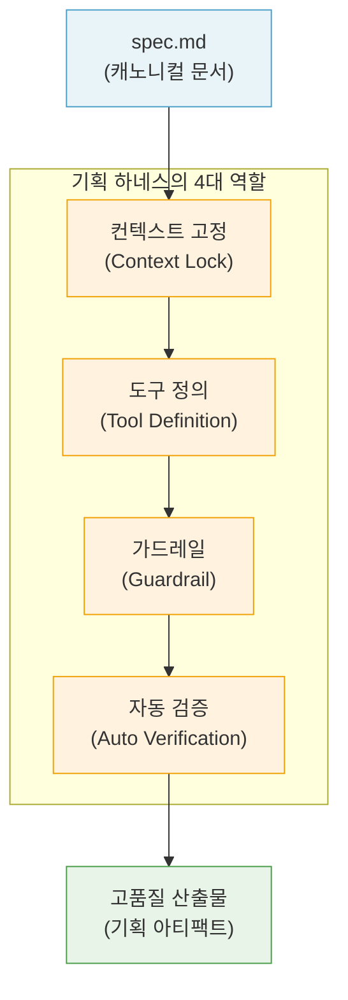
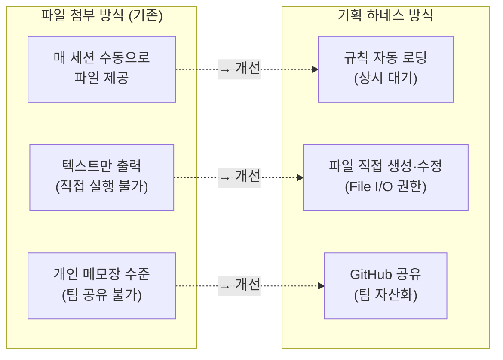
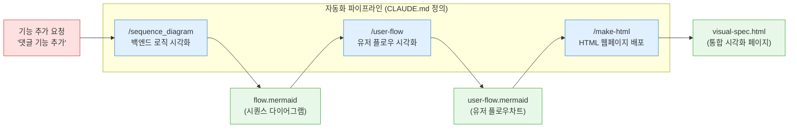
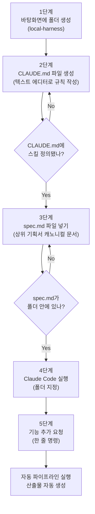
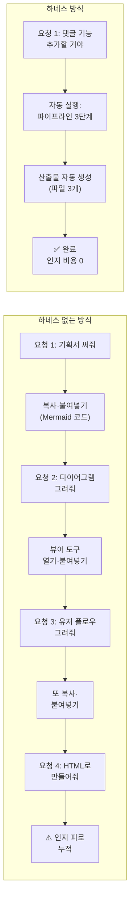
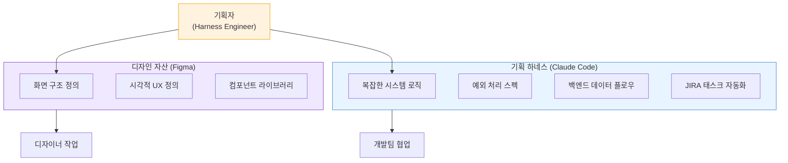
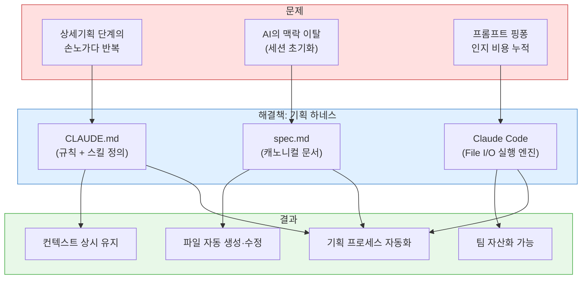

### Product Makers Note 19호 — "사샤는 왜 상위기획은 AI로 똑똑하게 잘 짜놓고, 상세기획은 손으로 노가다 하고 있어요?" 심층 분석

> 원문 출처: [Product Makers Note 19호](https://maily.so/makersnote/posts/1gz2e564z3q) (2026.06.24)  
> 작성자: Product Makers Note (사샤)  
> 해설 작성일: 2026-06-28

---

## 목차

1. [글의 배경과 문제의식](#1-글의-배경과-문제의식)
2. [하네스(Harness)란 무엇인가](#2-하네스harness란-무엇인가)
3. [기획 하네스의 4대 핵심 역할](#3-기획-하네스의-4대-핵심-역할)
4. [하네스 vs 파일 첨부 방식 — 결정적 차이 세 가지](#4-하네스-vs-파일-첨부-방식--결정적-차이-세-가지)
5. [스킬(Skill): 자동화의 핵심 메커니즘](#5-스킬skill-자동화의-핵심-메커니즘)
6. [폴더 구조와 CLAUDE.md 파일 해부](#6-폴더-구조와-claudemd-파일-해부)
7. [캐노니컬 문서 spec.md — 진실의 원천](#7-캐노니컬-문서-specmd--진실의-원천)
8. [실전 구축 단계별 가이드](#8-실전-구축-단계별-가이드)
9. [Claude Code와의 연동 방법](#9-claude-code와의-연동-방법)
10. [하네스 적용 결과 — 시연 분석](#10-하네스-적용-결과--시연-분석)
11. [하네스 없이 진행했다면? — 비교 분석](#11-하네스-없이-진행했다면--비교-분석)
12. [더 넓은 맥락 — 하네스 엔지니어링이란](#12-더-넓은-맥락--하네스-엔지니어링이란)
13. [향후 전망 — 기획 패러다임의 변화](#13-향후-전망--기획-패러다임의-변화)
14. [핵심 요약](#14-핵심-요약)

---

## 1. 글의 배경과 문제의식

### 1.1 기획자들이 AI를 쓰는 현재 풍경

2026년 현재, 웬만한 기획자라면 AI와 함께 기획서를 작성하는 것이 일상이 되었다. 단순한 질의응답 수준을 넘어서, 마크다운(`.md`) 형식으로 **캐노니컬 문서**—즉, 흩어진 기획 정책 중에서 AI가 절대 1순위로 따라야 하는 공식 표준 기준(Source of Truth) 문서—를 만들어두고 "이거 참고해서 기획서 초안 써줘"라고 지시하는 방식까지는 대부분의 기획자들이 무리 없이 실천하고 있다.

그러나 이 글의 저자 '사샤'는 바로 이 지점 이후에서 문제를 발견한다. **상위기획의 큰 그림을 AI로 완성한 이후**, 실제 구현을 위한 **상세기획 단계**로 넘어가는 순간 대부분의 기획자들이 다시 손노가다로 돌아간다는 것이다.

### 1.2 상세기획 단계에서 벌어지는 일들

상세기획 단계는 크게 두 가지 문제가 중첩된다. 첫째는 **AI의 맥락 이탈** 문제다. 추가 스펙이 생겨 "이 문서 참고해서 기획서 수정해줘"라고 요청하면, 대부분의 AI는 갑자기 맥락을 잃고 전혀 엉뚱한 내용을 써내려간다. 기획자는 오히려 그 황당한 결과물을 걸러내고 정제하는 데 더 많은 시간을 낭비하게 된다.

둘째는 **반복 노가다 작업**의 문제다. 상세기획 단계에는 특유의 반복 작업들이 많다. 정렬을 맞춰 시퀀스 다이어그램을 그리고, 한 땀 한 땀 유저 플로우를 그리고, 업데이트된 스펙을 요약해 개발팀에 공유하는 것들이 모두 수작업으로 이루어진다. AI를 쓰고 있지만 정작 가장 반복적이고 지루한 작업들은 여전히 사람의 손에 맡겨진 채로 있는 것이다.

### 1.3 결정적 한 마디 — "하네스 하나 깔아두면 끝날 일인데"

저자가 모니터 앞에서 엣지 케이스와 다이어그램 화살표 꼬임을 붙잡고 씨름하던 중, 옆자리 개발자가 이렇게 말했다.

> *"사샤는 왜 상위기획은 AI로 똑똑하게 잘 짜놓고, 상세기획은 손노가다로 하고 있어요? 그리고 클로드한테 그냥 생으로 일을 시키니까 애가 자꾸 삼천포로 빠지죠. 기획자용 '하네스' 하나 깔아두면 끝날 일인데."*

'하네스'라는 단어는 개발자들이 자기들끼리 이야기할 때 자주 쓰는 용어인데, 저자는 이것이 자신의 기획 프로세스와 어떻게 연결되는지 처음에는 전혀 이해하지 못했다. 그러나 실제로 구축해 보고 나서 그 이유를 명확히 알게 되었고, 이 글이 탄생했다.

---

## 2. 하네스(Harness)란 무엇인가

### 2.1 용어의 기원 — 말의 마차 가죽끈

'하네스(Harness)'라는 단어는 원래 말(horse)이 마차를 끌게 해주는 가죽끈 세트를 의미한다. AI 분야에서 이 단어가 쓰이기 시작한 것은 비교적 최근의 일이다. 2026년 현재 업계에서 통용되는 가장 간결한 정의는 다음과 같다.

$$\text{Agent} = \text{Model} + \text{Harness}$$

AI 연구자 Viv Trivedy가 정리한 이 공식에 따르면, **모델이 아닌 모든 것이 하네스**다. 모델 자체는 생각하는 두뇌일 뿐이고, 그 두뇌가 실제로 파일을 읽고, 명령을 실행하고, 결과를 다음 입력으로 돌려받게 만드는 모든 코드와 설정이 하네스에 해당한다.

### 2.2 일반적인 하네스 개념

원래 소프트웨어 개발 분야에서 하네스는 코드 테스트나 자동 검증에 쓰이는 개발자들의 전유물로 여겨져 왔다. 그러나 AI 에이전트가 실무에 본격적으로 들어오면서 하네스의 의미가 크게 확장되었다. Martin Fowler나 Addy Osmani 같은 업계 거물들이 2026년에 들어서 같은 시기에 하네스 엔지니어링을 새로운 분야로 자리매김하는 글을 내놓기 시작했다.

### 2.3 기획 하네스란

기획 하네스는 이 개념을 **비개발자인 기획자의 워크플로우**에 적용한 것이다. 저자의 설명을 빌리면, 기획 하네스는 느슨한 AI와의 대화를 "철저하게 통제된 자동화 공장"으로 바꾸는 시스템이다.

AI가 딴짓을 하지 못하도록, 컴퓨터 폴더 안에 단단한 가드레일과 장비를 물리적으로 깔아주는 방식이다. 그냥 파일 하나를 AI에게 던져주는 것이 매번 초기화되는 AI의 변덕에 기댄 일회성 부탁이라면, 기획 하네스는 AI를 로컬 폴더에 가두고 언제 켜도 똑같은 고품질 산출물을 뱉어내게 만드는 프로덕트 논리의 절대적인 파이프라인이다.

```
━━━━━━━━━━━━━━━━━━━━━━━━━━━━━━━━━━━━━━━━━━━━━━
  느슨한 대화 방식         기획 하네스 방식
  ──────────────         ──────────────
  "이 파일 읽어줘"  →     폴더에 규칙이 영구 고정됨
  매 세션 초기화    →     컨텍스트 상시 유지
  텍스트만 출력     →     파일을 직접 생성·수정
  개인 역량에 의존  →     팀 공유 자산화 가능
━━━━━━━━━━━━━━━━━━━━━━━━━━━━━━━━━━━━━━━━━━━━━━
```

---

## 3. 기획 하네스의 4대 핵심 역할

기획 하네스는 크게 네 가지 역할을 담당한다. 이 네 가지는 서로 독립적이면서도 유기적으로 연결되어, AI가 '통제된 기획 실행 엔진'으로 작동하게 만드는 토대가 된다.



### 3.1 컨텍스트 고정 (Context Lock)

첫 번째 역할은 **우리 서비스의 핵심 정책이나 규격을 AI의 뇌에 족쇄처럼 상시 고정**해 두는 것이다. 일반적으로 AI와 대화할 때는 세션이 끝나면 모든 맥락이 초기화된다. 새 대화를 시작하면 AI는 이전에 우리가 어떤 서비스를 만들고 있었는지, 어떤 데이터 모델을 쓰는지, 어떤 제약이 있는지를 전혀 알지 못한다.

하네스의 컨텍스트 고정 기능은 이 문제를 근본적으로 해결한다. CLAUDE.md라는 규칙 파일에 우리 서비스의 절대적인 기준을 적어두면, Claude Code를 켜는 순간 AI가 그 내용을 자동으로 읽어 세션 내내 핵심 정책을 유지한 채 작업을 수행한다.

### 3.2 도구 정의 (Tool Definition)

두 번째 역할은 **AI가 헛소리하지 못하도록, 오직 정해진 전용 명령어(스킬)만 사용해 결과물을 만들도록 통제**하는 것이다. 하네스 없이 AI에게 작업을 시키면, AI는 어떤 형식으로든 자유롭게 결과를 내놓는다. 때로는 형식이 제멋대로이고, 때로는 요청하지 않은 내용이 섞여 나온다.

도구 정의를 통해 AI는 미리 정의된 스킬(예: `/sequence_diagram`, `/user-flow`, `/make-html`)만을 사용해 결과물을 생성한다. 이는 AI의 창의성을 제한하는 것이 아니라, 업무 맥락에서 필요한 형식과 방향을 사전에 명확하게 지정해 주는 것이다.

### 3.3 가드레일 (Guardrail)

세 번째 역할은 **"이건 위험하니까 사람한테 물어보고 해" 같은 규칙**을 AI에게 부여하는 것이다. AI가 모든 것을 자율적으로 처리하면 실수가 발생했을 때 복구하기 어렵다. 가드레일은 AI가 독단적으로 처리하면 안 되는 상황에서 반드시 사람의 확인을 받도록 강제하는 안전장치다.

예를 들어 "기존 기획서 파일을 덮어쓰기 전에 반드시 확인을 요청할 것", "JIRA 티켓 등록 전에 스코프를 사람이 검토할 것" 같은 규칙을 설정할 수 있다.

### 3.4 자동 검증 (Auto Verification)

네 번째 역할은 **완성된 상세 스펙이 상위 기획 의도와 부합하는지 AI 스스로 검수**하게 만드는 것이다. AI가 생성한 산출물이 처음 정의한 캐노니컬 문서의 의도와 일치하는지 자동으로 확인하는 과정이다. 이를 통해 기획자는 결과물 하나하나를 수동으로 검토해야 하는 부담을 덜 수 있다.

---

## 4. 하네스 vs 파일 첨부 방식 — 결정적 차이 세 가지

"그냥 기존 기획서를 첨부하면서 프롬프팅으로 요청하는 거랑 하네스를 구축하는 거랑 뭐가 달라요?"라는 질문은 이 글에서 가장 핵심적인 질문이다. 저자는 세 가지 결정적 차이를 제시한다.



### 4.1 기획 파이프라인의 상시 대기

일반적인 파일 첨부 방식에서 기획자는 매번 "이 파일 읽어, 저 규칙 참고해"라고 수동으로 자료를 쥐여주고 그때그때 애원해야 한다. 컨텍스트가 세션마다 초기화되기 때문에, 같은 맥락을 반복해서 제공하는 비효율이 발생한다.

반면 하네스를 구축하면 시스템적으로 세팅이 완료되어 있으므로 AI가 규칙을 상시 인지하고 대기한다. 기획자가 구구절절 설명하지 않아도 된다. Claude Code를 켜는 순간 CLAUDE.md를 읽고 이미 우리 서비스의 맥락을 파악한 상태로 준비를 마치는 것이다.

### 4.2 실제 파일을 직접 생성·수정하는 실행력

챗GPT나 일반 AI 대화 창에서 시퀀스 다이어그램을 요청하면, AI는 대화창에 코드만 뱉고 끝난다. 기획자는 그 코드를 복사해서 별도의 Mermaid 뷰어 도구를 찾아 붙여넣어야 하고, 그 결과물을 다시 기획서에 옮겨야 한다. 매번 반복되는 번거로운 중간 과정이다.

하네스 환경에 갇힌 AI는 기획자의 노트북 폴더에 직접 `spec.md`, `flow.mermaid`, `visual-spec.html` 같은 파일을 **생성하고 수정할 수 있는 File I/O 권한**을 가진다. 기획자는 산출물이 실시간으로 로컬 파일에 자동 업데이트되는 경험을 하게 된다. 이것이 "자동화"와 "AI와의 대화"의 근본적인 차이다.

### 4.3 팀의 공유 자산화

혼자 좋은 프롬프트를 잘 짜서 메모장에 들고 다니는 것은 개인의 역량에 가깝다. 그 사람이 퇴사하거나 자리를 비우면 그 노하우는 사라진다. 하지만 하네스를 구축해 두면 폴더 통째로 GitHub 같은 저장소에 올려서 팀 전체가 공유할 수 있다.

새로운 기획자가 팀에 합류해도 길게 인수인계할 필요가 없다. "이 폴더 다운받아서 Claude Code 켜고 명령어 치시면 우리 회사 규격대로 나옵니다"가 가능해진다. 개인의 암묵지(tacit knowledge)가 팀의 공식 자산(organizational asset)으로 전환되는 것이다.

---

## 5. 스킬(Skill): 자동화의 핵심 메커니즘

### 5.1 스킬이란 무엇인가

하네스를 "업무를 실행하는 큰 틀"이라고 본다면, 스킬은 그 안에서 호출되는 "전문 기능"이다. 기획자가 특정 명령어(예: `/sequence_diagram`)를 입력하면, AI는 CLAUDE.md에 정의된 해당 스킬의 지침을 따라 정확한 형식과 절차로 작업을 수행한다.

Claude Code의 공식 스킬 시스템은 Anthropic이 오픈 표준으로 공개했으며, 폴더 하나에 `SKILL.md` 파일을 만들고 필요에 따라 스크립트, 참조 문서, 에셋 등을 추가하는 방식으로 구성된다. 본 글에서는 CLAUDE.md 안에 자연어로 스킬을 직접 정의하는 간단한 방법을 사용한다.

### 5.2 기획 하네스에 심어두는 스킬 예시

아래는 기획 하네스에 심어둘 수 있는 대표적인 스킬 예시다. 이 스킬들은 모두 예시이며, 실제 업무 환경에 맞게 자유롭게 정의하고 수정할 수 있다.

| 스킬 명령어 | 역할 설명 |
|---|---|
| `/search-documents` | 관련 정책 찾기 (문서 검색) |
| `/split-requirements` | 큰 기능을 세부 요구사항으로 분해 |
| `/sequence_diagram` | 백엔드 로직을 Mermaid 시퀀스 다이어그램으로 시각화 |
| `/user-flow` | 사용자 플로우를 flowchart 형식으로 시각화 |
| `/logic-check` | 예외 케이스 및 테스트 케이스 작성 |
| `/release-note` | 개발자 공유용 문서 업데이트 요약문 작성 |
| `/deploy-jira` | 각 개발파트에 JIRA 태스크 생성 및 할당 |

### 5.3 이번 시연에서 정의한 3가지 스킬

저자가 이번 글에서 직접 시연한 하네스는 아래 세 가지 스킬을 연쇄적으로 실행하는 파이프라인을 정의했다.



세 스킬이 순서대로 자동 실행되어, 기능 추가 요청 한 마디만으로 시퀀스 다이어그램 파일, 유저 플로우 파일, 브라우저에서 바로 열어볼 수 있는 HTML 페이지까지 세 가지 산출물이 로컬 폴더에 자동 생성된다.

---

## 6. 폴더 구조와 CLAUDE.md 파일 해부

### 6.1 기획 하네스의 폴더 구조

기획 하네스의 물리적 구조는 놀라울 만큼 단순하다. 비개발자라도 폴더 하나 파고 규칙 파일 하나만 세팅하면 완성된다.

```
local-harness/
├── CLAUDE.md          ← 하네스 핵심 파일 (규칙 + 스킬 정의)
└── spec.md            ← 캐노니컬 문서 (상위 기획서)
```

`CLAUDE.md`는 Claude Code가 실행될 때 자동으로 가장 먼저 읽어들이는 특수한 설정 파일이다. 이 파일 하나가 AI의 행동 방식 전체를 결정한다. `spec.md`는 우리 서비스의 공식 표준 기획 문서로, AI가 모든 작업의 기준으로 삼는 '진실의 원천(Source of Truth)'이다.

### 6.2 CLAUDE.md 파일 내용 전체 해부

이번 시연에서 작성된 CLAUDE.md의 실제 내용을 살펴보자. 이 파일은 두 부분으로 구성된다.

**[Part 1] 기획 하네스의 역할 선언**

```
# 기획 하네스의 역할
너는 PM의 업무를 자동화하는 '기획 하네스'야.
유저가 아이디어를 던지거나 어떤 기능을 추가하겠다고 하면 
바로 답변하지 말고
  1) spec.md 파일을 참고하고,
  2) 백엔드 로직은 /sequence_diagram 스킬을 써서 완성된 
     시퀀스 다이어그램 파일로 제공해주고,
  3) 유저 동선은 /user-flow 스킬을 써서 Lucidchart로 그려줘,
  4) 그리고 /make-html 스킬을 써서 2), 3)번 아웃풋을 시각화된 
     결과물로 웹배포 해줘
```

**[Part 2] 스킬 정의 — /sequence_diagram**

```
# 기획 하네스 작동 규칙
- [Skill] /sequence_diagram
  - 역할: 유저가 `/sequence_diagram`을 입력하면 폴더 안의 
    `spec.md` 파일을 읽으세요.
  - 아웃풋: 상위 기획 로직을 분석한 뒤, Mermaid.js 코드로 
    시퀀스 다이어그램을 생성하여 이 폴더에 `flow.mermaid`라는 
    파일로 직접 구워내세요.
```

**[Part 3] 스킬 정의 — /user-flow**

```
- [Skill] /user-flow
  - 역할: 유저가 `/user-flow`를 입력하면 폴더 안의 `spec.md` 
    파일을 읽고 사용자의 화면 이동 동선과 예외 조건들을 
    분석하세요.
  - 아웃풋: 아래의 기호 규칙을 엄격히 준수한 Mermaid.js 
    `flowchart TD` 코드를 생성하여 이 폴더에 
    `user-flow.mermaid`라는 파일로 직접 구워내세요.
    - 규칙:
      1. 일반적인 기능 실행이나 화면 진입은 반드시 사각형 
         기호 `노드명[텍스트]`을 사용하세요.
      2. 조건문, 성공/실패, Y/N 등의 분기점은 반드시 
         마름모 기호 `{노드명(텍스트)}`을 사용하세요.
      3. 화살표선 위에는 `-- Yes -->` 나 `-- 로그인 성공 -->`
         처럼 조건을 텍스트로 명시하세요.
```

**[Part 4] 스킬 정의 — /make-html**

```
- [Skill] /make-html (시각화 결과물 웹 배포 스킬)
  - 역할: 유저가 `/make-html`을 입력하면 폴더 안의 
    `user-flow.mermaid`과 `flow.mermaid` 파일을 읽으세요.
  - 아웃풋: 두 파일의 Mermaid 코드를 웹 브라우저에서 즉시 
    그래픽으로 렌더링해 볼 수 있도록, Mermaid.js 
    라이브러리(CDN)가 포함된 HTML 템플릿에 코드를 주입하여 
    이 폴더에 `visual-spec.html` 파일로 생성해내세요.
```

이 네 개의 블록이 전부다. 놀랍도록 간단한 자연어 지시문으로, 비개발자도 완전히 읽고 이해할 수 있다.

---

## 7. 캐노니컬 문서 spec.md — 진실의 원천

### 7.1 캐노니컬 문서란

캐노니컬(Canonical) 문서는 여기저기 흩어진 기획 정책 중에서 AI가 무조건 1순위로 따라야 하는 절대적인 공식 표준 기준 문서다. 영어로는 'Source of Truth'라고 표현한다. 기획 하네스에서 이 문서는 spec.md 파일로 구현된다.

### 7.2 이번 시연의 spec.md 내용

이번 시연에서 사용된 spec.md는 저자가 이전 호(18호)에서 클로드 코딩으로 만든 메모 앱의 기획서를 텍스트 파일로 저장한 것이다. 실제 파일의 내용은 다음과 같은 구조를 가진다.

```
# 메모 앱 디자인 문서

## 목적
브라우저에서만 동작하는 1인용 메모 보드. 메모는 사용자의 
보존 의도에 따라 3개의 열로 구성된다. 각 메모는 동일한 크기의 
정사각형 카드이며 파스텔톤 배경을 가진다. 백엔드와 로그인 없이 
한 브라우저에서 LocalStorage에 저장한다.

## 목표
- 최소한의 UI 마찰로 메모를 빠르게 작성하고 다시 보기
- 보존 의도에 따라 메모를 분류 (항상 참고해 / 기억해 / 날려도 좋아)
  — 드래그 앤 드롭으로 이동
- 시각적 일관성: 정사각형 카드, 부드러운 파스텔, 충분한 여백
- 마크다운 지원으로 가벼운 구조화 가능

## 비목표
- 다중 사용자, 기기 간 동기화, 공유
- 검색
- 모바일 최적화 레이아웃 (데스크톱 우선; 기본 viewport만 처리)
- 리치 텍스트 WYSIWYG; 마크다운 소스 편집만 지원
- 3개 열 외의 태그/폴더

## 기술 스택
- React 18 + TypeScript + Vite — SPA, SSR 없음
- @dnd-kit/core + @dnd-kit/sortable — 열 사이 및 열 내부 드래그 앤 드롭
- react-markdown + remark-gfm — 모달 보기 모드에서 마크다운 렌더링
- LocalStorage — 단일 키 memo-app:state에 직렬화된 전체 상태 저장

## 데이터 모델
[... 이하 생략 ...]
```

이 문서가 하네스의 '두뇌' 역할을 한다. AI는 어떤 작업을 수행하든 이 파일을 먼저 읽고 우리 서비스의 맥락을 파악한 뒤 작업에 착수한다.

---

## 8. 실전 구축 단계별 가이드

비개발자도 10분 안에 기획 하네스를 구축할 수 있다. 아래는 단계별 가이드다.



### 8.1 1단계: 폴더 생성

바탕화면(Desktop)에 `local-harness`라는 이름으로 빈 폴더를 하나 만든다. 폴더 이름은 자유롭게 지정할 수 있으나, 영문 소문자와 하이픈(-) 조합이 안전하다.

### 8.2 2단계: CLAUDE.md 파일 작성

`local-harness` 폴더 안에 `CLAUDE.md`라는 이름의 텍스트 파일을 생성한다. 확장자를 반드시 `.md`로 설정하는 것이 핵심이다. 텍스트 에디터(메모장, VS Code 등)로 파일을 열고 [6.2 절]에서 설명한 형식으로 하네스 역할과 스킬을 자연어로 정의한다.

중요한 것은 이 파일이 **비개발자도 충분히 이해하고 작성할 수 있는 자연어**로 이루어진다는 점이다. 코딩 지식이 전혀 없어도 된다.

### 8.3 3단계: spec.md 파일 추가

`local-harness` 폴더 안에 AI가 기준으로 삼을 상위 기획 문서를 넣는다. 기존에 작성해 두었던 마크다운 형식의 기획서를 `spec.md`라는 이름으로 저장하면 된다. 이 파일이 AI의 작업 기준점이 된다.

### 8.4 4단계: Claude Code와 연동

Claude Code 앱을 실행하고, 화면 하단의 '폴더' 버튼을 클릭해 `local-harness` 폴더를 실행 위치로 지정한다. 폴더가 성공적으로 연결되면 Claude Code 입력창 옆에 폴더 이름이 표시된다. 이 순간부터 Claude Code는 `CLAUDE.md`를 자동으로 읽어들인 상태로 대기한다.

### 8.5 5단계: 요청

설정이 완료되었다면, 이제 기능 추가를 자연어로 요청하기만 하면 된다. "메모 앱에 댓글 기능을 추가할 거야"처럼 간단하게 던지는 것만으로 하네스가 작동을 시작한다.

---

## 9. Claude Code와의 연동 방법

### 9.1 Claude Code란

Claude Code는 Anthropic이 만든 터미널 기반 AI 코딩 에이전트다. 단순히 코드 한 줄을 자동완성해주는 수준을 넘어, 프로젝트 전체 맥락을 이해하고 여러 파일을 동시에 읽고 쓸 수 있으며, 자연어로 지시하면 스스로 작업을 이어나간다. 2026년 현재 Claude Code는 터미널 CLI뿐 아니라 데스크톱 앱 형태(Cowork/Code 탭)로도 사용할 수 있다.

이번 시연에서 사용된 환경은 Claude Code 데스크톱 앱의 Code 탭이다. 하단에 "로컬" 표시와 함께 `local-harness` 폴더가 연결된 상태를 확인할 수 있다.

### 9.2 CLAUDE.md가 자동 로딩되는 원리

Claude Code는 실행 시 지정된 폴더를 스캔하고, 그 안에 `CLAUDE.md` 파일이 있으면 자동으로 읽어들인다. 이것이 하네스의 핵심 작동 원리다. 기획자가 별도로 "이 파일 읽어줘"라고 말할 필요가 없다. Claude Code를 켜는 순간, 하네스가 자동으로 활성화된다.

이 동작 방식은 Claude Code의 공식 기능으로, Anthropic이 CLAUDE.md를 '영속적 컨텍스트(persistent context)' 파일로 설계했기 때문에 가능하다. 세션이 바뀌어도 CLAUDE.md에 정의된 규칙과 스킬은 항상 유효한 상태를 유지한다.

---

## 10. 하네스 적용 결과 — 시연 분석

### 10.1 단 한 줄의 요청으로 시작되는 파이프라인

하네스가 구축된 상태에서 저자는 "메모 앱에 댓글 기능을 추가할 거야"라고 한 줄만 입력했다. 이전이라면 "이것 해줘, 그 다음 저것 해줘, 파일은 뭐 참고하고 포맷은 어떻게 해줘"라며 구구절절 수동 명령을 날려야 했을 상황이다.

Claude Code는 CLAUDE.md에 설계된 파이프라인 프로세스를 기계처럼 밟아나갔다.

### 10.2 /sequence_diagram 스킬의 실행 결과

첫 번째로 `/sequence_diagram` 스킬이 실행되었다. Claude Code는 `spec.md`를 읽고 메모 앱의 기술 스택과 데이터 모델을 파악한 뒤, 댓글 기능이 추가될 때 클라이언트-서버-DB 간에 데이터가 어떻게 흐르는지 텍스트 로직을 분석해 Mermaid 시퀀스 다이어그램을 생성했다.

생성된 시퀀스 다이어그램에는 다음과 같은 흐름이 담겼다.

- User → MemoModal: 메모 카드 클릭
- MemoModal → LocalStorage: memo-app:state 읽기
- LocalStorage → MemoModal: memos + comments 반환
- MemoModal → User: 보기 모드 렌더링 (댓글 목록 포함)
- User → MemoModal: 댓글 입력 후 등록 버튼 클릭
- MemoModal → useReducer: ADD_COMMENT { memoId, text }
- useReducer: Comment 생성 (id, memoId, text, createdAt)
- useReducer → LocalStorage: 250ms 디바운스 후 저장
- LocalStorage → useReducer: 저장 완료
- useReducer → MemoModal: 상태 업데이트
- User → MemoModal: 댓글 삭제 버튼 클릭
- MemoModal → useReducer: DELETE_COMMENT { commentId }

선 꼬임 없이 깔끔하게 정렬된 다이어그램이 `flow.mermaid` 파일로 자동 저장되었다.

### 10.3 /user-flow 스킬의 실행 결과

이어서 `/user-flow` 스킬이 실행되었다. CLAUDE.md에 정의된 기호 규칙(사각형은 화면/기능, 마름모는 조건 분기, 화살표에는 조건 텍스트 명시)을 엄격히 준수하면서 사용자의 진입부터 도달까지 촘촘한 유저 플로우차트를 자동으로 렌더링했다.

플로우차트는 다음과 같은 주요 분기를 포함했다.

- 앱 진입 → 보드 렌더링 → 메모 카드 클릭 → MemoModal 보기 모드 열림
- 댓글 목록 표시 → 댓글 존재 여부 분기
  - 댓글 있음: 기존 댓글 렌더링 + 댓글 입력 영역
  - 댓글 없음: 안내 텍스트 표시 + 댓글 입력 영역
- 댓글 텍스트 입력 → 입력값 비어있음 분기
  - 비어있음: 버튼 비활성
  - 내용 있음: ADD_COMMENT 디스패치 → 저장
- 댓글 삭제 버튼 클릭 → 삭제 확인 분기
  - 확인: DELETE_COMMENT 액션 디스패치

이 결과물이 `user-flow.mermaid` 파일로 자동 저장되었다.

### 10.4 /make-html 스킬의 실행 결과

마지막으로 `/make-html` 스킬이 실행되었다. `flow.mermaid`와 `user-flow.mermaid` 두 파일을 읽어, Mermaid.js 라이브러리(CDN)가 포함된 HTML 템플릿에 코드를 주입해 `visual-spec.html` 파일을 생성했다.

이 HTML 파일을 브라우저에서 열면 두 다이어그램을 바로 그래픽으로 확인할 수 있다. 별도의 Mermaid 뷰어 도구가 필요 없다. 로컬 파일 경로(`/Users/sasha.s/Desktop/local-harness/visual-spec.html`)를 브라우저 주소창에 입력하면 즉시 시각화된 기획서가 펼쳐진다.

```
결과물 목록 (자동 생성된 파일)
├── flow.mermaid            ← 시퀀스 다이어그램
├── user-flow.mermaid       ← 유저 플로우차트
└── visual-spec.html        ← 통합 시각화 HTML 페이지
```

이번 시연에서는 하네스의 4가지 역할 중 '컨텍스트 고정'과 '도구 정의'만 아주 간단하게 세팅했음에도 불구하고, 손노가다가 획기적으로 줄어드는 것을 확인할 수 있었다. 여기에 '가드레일'과 '자동 검증' 규칙까지 촘촘하게 채워 넣는다면 산출물의 질과 안정성이 더욱 높아질 것이다.

---

## 11. 하네스 없이 진행했다면? — 비교 분석

### 11.1 하네스 없는 방식의 실제 흐름

하네스를 제거하고 동일한 "댓글 기능을 추가하는 기획서 써줘"라는 요청을 했을 때 어떤 일이 벌어졌는지 비교해 보자.

Claude Code는 `spec.md`를 바탕으로 댓글 기능 기획서(`spec-comments.md`)를 작성했다. 텍스트 기획서 자체의 내용은 나쁘지 않았다. 그러나 여기서 끝이었다. 다이어그램도 없고, 유저 플로우도 없고, HTML 시각화 페이지도 없었다.

```
하네스 없는 결과:
  ✅ spec-comments.md 생성됨
  ❌ flow.mermaid 없음
  ❌ user-flow.mermaid 없음
  ❌ visual-spec.html 없음
```

### 11.2 이후에 필요한 추가 작업들

이 상태에서 기획자가 해야 할 일은 다음과 같다.

첫째, "이 내용으로 시퀀스 다이어그램 그려줘"라는 프롬프트를 새로 생각해 입력해야 한다. Claude Code가 Mermaid 코드를 텍스트로 출력하면, 그것을 복사해 별도의 Mermaid 뷰어 도구를 찾아 붙여넣어야 한다.

둘째, "자 이제 유저 플로우 그려줘"라며 다음 단계 명령을 또 새로 생각해 지시해야 한다. 이번에도 텍스트 코드가 나오면 같은 작업을 반복해야 한다.

셋째, "이걸 HTML로 한 페이지에 보여줘"라는 요청을 또 해야 한다.

매 단계마다 새 프롬프트를 고안하고, 도구를 옮겨 다니고, 복사-붙여넣기를 반복하는 이 과정이 저자가 말하는 "지루한 프롬프트 핑퐁 게임"이자 "또 다른 손노가다의 연장"이다.

### 11.3 인지적 비용의 차이



하네스는 기획자가 명령어를 고심하고 도구를 옮겨 다녀야 하는 인지적 비용을 제로에 가깝게 만든다. 이것이 하네스의 가장 중요한 가치다. AI를 쓰고 있지만 매 단계마다 사람이 중간에 개입해야 하는 구조는 진정한 의미의 자동화가 아니다. 하네스는 기획 프로세스 자체를 하나의 견고한 자동화 공정으로 만들어준다.

---

## 12. 더 넓은 맥락 — 하네스 엔지니어링이란

### 12.1 업계에서 형성되고 있는 새로운 분야

이 글에서 다루는 '기획 하네스'의 개념은 보다 넓은 흐름인 **하네스 엔지니어링(Harness Engineering)** 의 일부다. 2026년 현재, Martin Fowler, Addy Osmani 같은 소프트웨어 분야의 거물들이 같은 시기에 하네스 엔지니어링을 새로운 분야로 자리매김하는 글을 내고 있다. 핵심 메시지는 하나다. "모델을 쓰는 사람이 모델 주변에 무엇을 둘 것인가, 그 설계가 곧 성능을 가른다."

### 12.2 하네스 엔지니어링의 두 가지 작동 방식

Addy Osmani가 제시한 프레임에 따르면 하네스는 두 가지 방식으로 AI를 제어한다.

첫째는 **피드포워드(Feed-forward)** 방식으로, 일이 일어나기 전에 방향을 정하는 신호다. CLAUDE.md, 시스템 프롬프트, 스킬 정의가 여기 속한다. "이 서비스에서는 이런 방식으로 기획서를 써"라는 사전 규칙이다.

둘째는 **피드백(Feedback)** 방식으로, 일이 일어난 후에 결과를 관찰하는 신호다. 자동 검증, 가드레일, 오류 감지가 여기 속한다. "방금 네가 생성한 다이어그램이 상위 기획 의도와 맞지 않아"라고 알려주는 모든 것이다.

### 12.3 하네스 엔지니어링 연구 현황

한국의 Hwang, M. (2026)이 발표한 논문 "Harness: Structured Pre-Configuration for Enhancing LLM Code Agent Output Quality"에 따르면, 구조화된 하네스 설정은 AI 코딩 에이전트의 출력 품질을 평균 60% 향상시키는 것으로 나타났다(저자 자체 A/B 측정, n=15). 특히 과제 난이도가 높을수록 개선 효과가 더 크게 나타난다는 점이 흥미롭다. 이 발견은 기획 하네스에도 동일하게 적용된다. 단순한 프롬프팅보다 체계적인 하네스 구성이 AI의 성능을 결정적으로 개선할 수 있다.

---

## 13. 향후 전망 — 기획 패러다임의 변화

### 13.1 현재의 한계

저자는 현재 시점의 하네스가 모든 것을 완벽하게 해낼 수는 없다고 솔직하게 밝힌다. 세부적인 와이어프레임을 예쁘게 그리는 것처럼 시각적 UX 영역은 마크다운 형태의 Claude Code만으로는 직관적으로 처리하기 어렵다. 시각적 이미지 작업이 필수적이기 때문이다.

### 13.2 빠르게 달려오는 미래

그러나 Claude Design, Figma MCP를 비롯해 엄청난 속도로 발전 중인 다양한 AI 확장 도구들이 하네스 파이프라인에 달라붙고 있다. 머지않은 미래에는 비주얼 작업들조차 하네스 안에서 완벽하게 자동화될 수 있을 것으로 예상된다.

### 13.3 기획 문서 형태의 패러다임 변화

저자는 이 변화를 계기로 기존의 '디자인 기반' 기획서 형태도 완전히 바뀌어야 한다고 주장한다. 한국 IT 업계에서는 디자인 문서와 기획 문서가 완벽히 분리되어 있었고, UX 정의가 양쪽 문서 모두에 파편화되어 적히는 비효율이 오래도록 존재해 왔다. 기획서에도 박스를 그리고, 디자이너도 Figma에 똑같은 박스를 또 그리는 이중 작업이 반복된 것이다.

저자가 제안하는 새로운 분업 모델은 이렇다.



화면 구조와 시각적 UX의 정의는 온전히 디자인 자산(Figma)에 귀속시키고, 복잡한 시스템 로직과 예외 처리 스펙은 하네스 안에서 Claude Code로 완벽하게 뽑아내어 관리하는 흐름이다. 프로덕트의 논리와 시각적 컴포넌트가 완벽히 분리되어 시스템화되는 순간, 기획자가 일하는 패러다임도 완전히 다른 차원으로 도약할 것이다.

### 13.4 기획자의 역할 전환 — 하네스 엔지니어로

저자는 마지막으로 기획자의 역할이 근본적으로 변해야 한다고 말한다.

- 기존 역할 → '바이브 기획자': ChatGPT 창을 열고 "이것 좀 고쳐줘, 예외 케이스 써줘"라며 매번 빌고 애원하거나, AI가 뱉어낸 환각을 감시하고 뒤처리하는 'AI 시터'
- 새로운 역할 → '기획 하네스 엔지니어': 서비스의 절대적인 규칙을 정의하고, AI가 그 안에서 안전하게 날뛸 수 있도록 완벽한 업무 파이프라인을 짜주는 설계자

무작정 AI와 대화하며 시간을 버리는 대신, 단단한 가드레일을 설계하는 기획자. 박스 그리던 시간에 서비스의 진짜 예외 정책과 시스템 구조를 고민하는 설계자. 그것이 저자가 제안하는 기획자의 진화 방향이다.

---

## 14. 핵심 요약



이 글의 핵심 메시지를 한 문장으로 요약하면 다음과 같다.

> **AI에게 파일을 던져주는 것과 AI를 가두는 것은 근본적으로 다르다.**  
> 기획 하네스는 AI를 로컬 폴더에 가두고, 언제 켜도 동일한 고품질 산출물을 자동으로 생성하게 만드는 기획 자동화 파이프라인이다.

---

### 주요 용어 정리

| 용어 | 설명 |
|---|---|
| 기획 하네스 | AI의 행동을 통제하는 규칙과 도구의 집합; 기획 자동화 파이프라인 |
| CLAUDE.md | Claude Code가 자동 로딩하는 핵심 설정 파일; 하네스 역할과 스킬을 자연어로 정의 |
| 캐노니컬 문서 | AI가 1순위로 따라야 하는 공식 표준 기준 문서 (Source of Truth) |
| 스킬(Skill) | 하네스 안에서 호출되는 전문 기능; `/sequence_diagram`, `/user-flow` 등 |
| 컨텍스트 고정 | 서비스의 핵심 정책을 AI 세션 전반에 걸쳐 유지하는 기능 |
| 파이프라인 | 여러 스킬이 순서대로 자동 실행되는 연쇄 작업 흐름 |
| File I/O | AI가 파일을 직접 읽고 생성·수정할 수 있는 권한 |
| 하네스 엔지니어링 | AI 주변에 무엇을 둘 것인가를 설계하는 새로운 분야 |

---

*작성일자: 2026-06-28*
