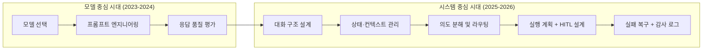
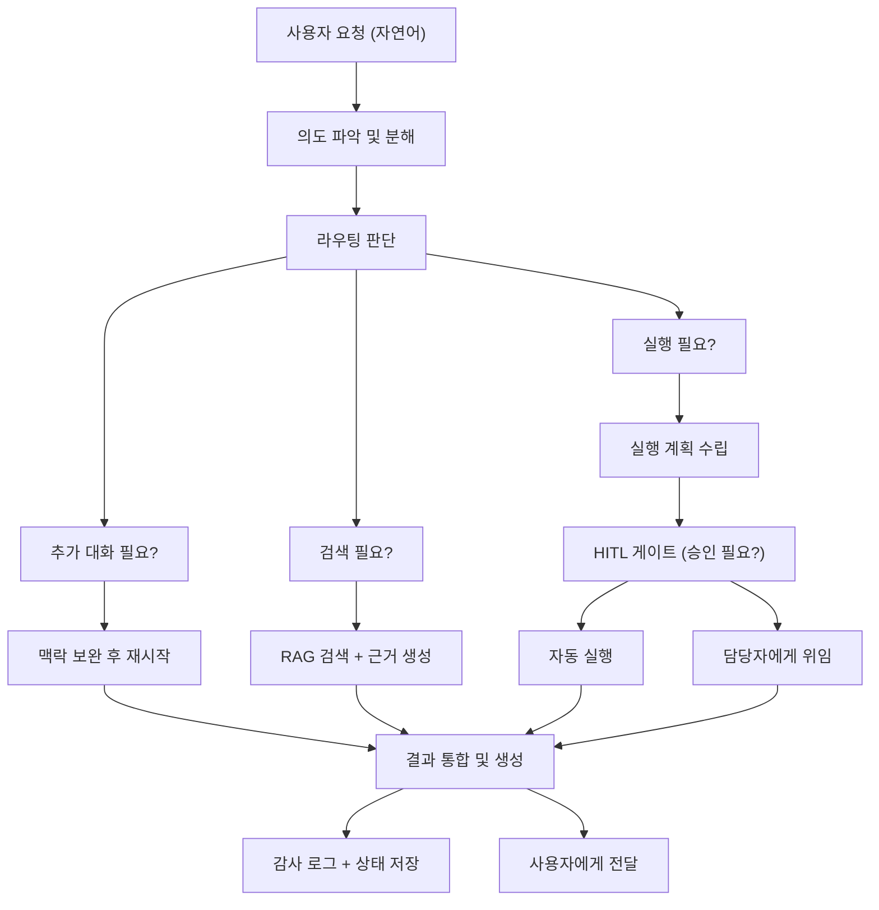
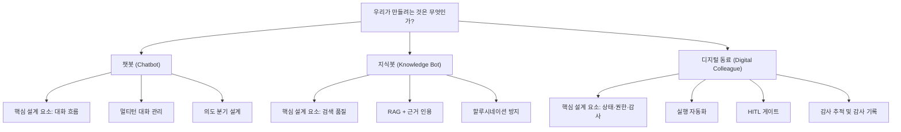
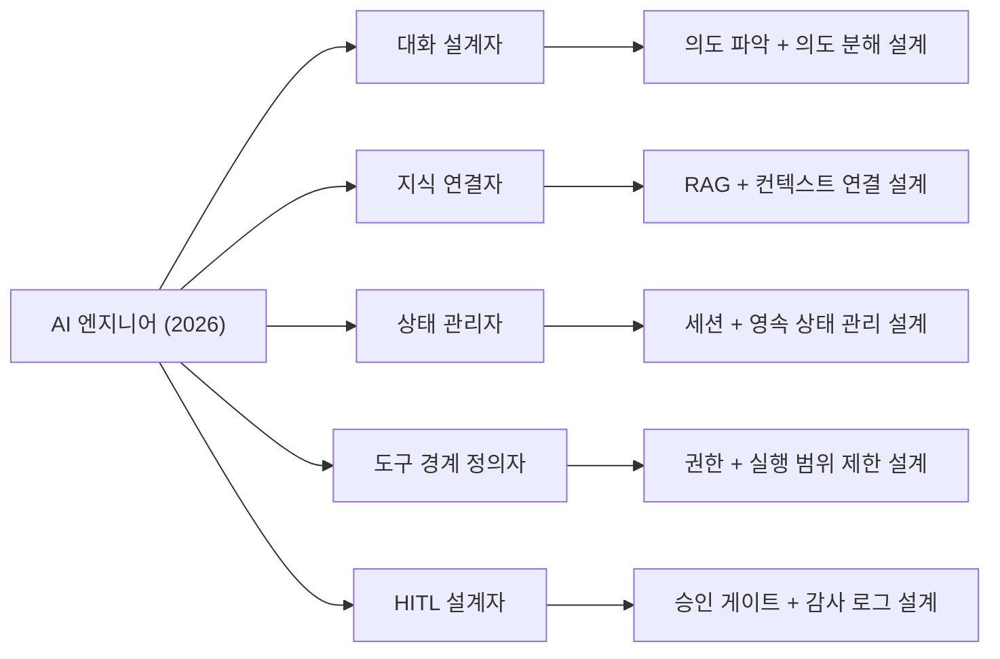

> "지식의 답변 품질이 1.0이 나와도, 에이전트가 사용자와 대화하지 못하면 아무 소용이 없다.  
> 지식은 답변의 재료이고, 대화는 그 재료를 일로 바꾸는 통로다."

## 관련글

[**요즘 AI 엔지니어라는 역할을 다시 생각하게 된다**](https://www.facebook.com/share/p/1BPYT4SgP7/)

---

## 들어가며

이 글은 어느 AI 엔지니어가 현장에서 겪은 인식의 전환을 담은 단상(斷想)이다. 짧지만 밀도 높은 이 단상은, 2026년 현재 AI 엔지니어링 업계가 집단적으로 부딪히고 있는 핵심 문제를 정확히 짚어낸다.

처음에 모델을 잘 고르는 것이 중요하다고 생각했다. 그런데 현장에서 부딪혀보니 진짜 질문은 다른 곳에 있었다. "어떤 모델을 쓸 것인가"가 아니라 "대화가 어떻게 일로 이어지는가"였다. 이 간결한 관찰 하나가 이 단상 전체를 관통하는 핵심이다.

이 문서는 그 단상의 의미를 여러 층위에서 풀어내고, 2026년 현재 산업계의 실제 데이터와 연구 결과로 그 통찰을 검증한다. 아울러, AI 엔지니어라는 직책이 무엇을 의미해야 하는지를 구조적으로 재구성한다.

---

## 1. 패러다임의 이동: "어떤 모델"에서 "어떻게 연결"로

### 1.1 모델 중심 시대의 사고방식

2023년에서 2024년 사이, 많은 AI 엔지니어들은 모델 선택에 집중했다. GPT-4가 나은가, Claude가 나은가, Llama가 비용 효율적인가. 벤치마크 점수를 비교하고, 모델 버전이 올라갈 때마다 성능을 다시 측정했다. 이 관점에서는 더 좋은 모델을 선택하는 것이 더 좋은 AI 시스템을 만드는 것과 동의어였다.

이 사고방식은 틀리지 않았다. 단지 불완전했다.

### 1.2 현장이 가르쳐준 것

이 단상의 저자가 "현장에서 부딪혀보면 질문이 조금 달라진다"고 말할 때, 그 '달라짐'은 단순한 관심사의 이동이 아니다. 이것은 AI 시스템이 실제로 무엇을 해야 하는가에 대한 이해의 심화다.

현장에서 진짜 사용자들이 AI에게 요청하는 것은 이런 것들이다: 휴가 신청을 도와달라. 어젯밤 발생한 장애의 원인을 분석해달라. 고객에게 보낼 메일 초안을 만들어달라. 내부 위키에서 특정 문서를 찾아달라. 예산 승인 요청을 처리해달라. 이 작업을 누가 언제 왜 했는지 나중에 확인할 수 있게 해달라.

이 요청들은 공통된 특징이 있다. 사용자가 모델에게 "질문"을 하는 것이 아니라 "일"을 맡긴다는 것이다. 그리고 일에는 단순한 답변 이상의 것이 필요하다. 이전 대화의 기억이 필요하고, 시스템과의 연동이 필요하고, 단계적인 실행이 필요하고, 중요한 지점에서 사람의 확인이 필요하고, 나중에 무슨 일이 있었는지 추적할 수 있는 기록이 필요하다.

---

## 2. 사용자는 모델을 부르지 않는다: 사용자는 일을 맡긴다

이 단상에서 가장 날카로운 관찰 중 하나는 바로 이것이다. 사용자는 "모델을 부르는" 것이 아니라 "일을 맡긴다."

이 문장이 당연하게 들릴 수도 있다. 그러나 그 함의는 매우 깊다.

AI 시스템을 "더 스마트한 검색 엔진" 또는 "더 유창한 Q&A 봇"으로 보는 관점에서는, 사용자가 무언가를 물어보면 AI가 답하는 구조가 자연스럽다. 그러나 사용자가 "일을 맡긴다"는 관점으로 보면, 이야기가 완전히 달라진다.

일을 맡긴다는 것은 다음을 전제한다:

**목표의 존재**: 사용자는 단순히 정보를 원하는 것이 아니라 무언가가 완료되기를 원한다. 장애 분석 결과를 보고 싶은 것이 아니라, 장애가 해결되기를 원한다.

**맥락의 연속성**: 일은 한 번의 교환으로 끝나지 않는다. 오늘 메일 초안을 만들고, 내일 수정 요청이 오고, 다음 주에 비슷한 상황이 반복된다. AI는 이 연속성을 기억해야 한다.

**책임의 귀속**: 일에는 누가 무엇을 했는지가 중요하다. 시스템이 자동으로 처리한 것인지, 사람이 승인한 것인지, 어느 시점에 어떤 결정이 내려졌는지가 나중에 중요해진다.

**실패 가능성**: 일은 실패할 수 있다. 그리고 실패했을 때 무엇이 잘못됐는지 알 수 있어야 하고, 어디까지 진행됐는지 알 수 있어야 하고, 어떻게 복구할지 판단할 수 있어야 한다.

이 단상이 열거하는 사례들을 보면 이 구조가 명확해진다. 휴가를 물어보는 것은 단순한 정보 요청이지만, 그 뒤에는 휴가 신청 시스템과의 연동, 팀장 승인 워크플로우, 잔여 연차 확인 등이 따라온다. 장애 원인 확인은 로그 시스템 접근, 패턴 분석, 관련 담당자 알림 등을 수반한다. 이런 것들이 모두 "일"의 구성 요소다.

---

## 3. AI 엔지니어가 실제로 설계해야 할 여섯 가지 질문

이 단상은 현장에서 진짜 중요해지는 설계 문제들을 목록으로 정리한다. 이것은 단순한 기술적 체크리스트가 아니다. 각각의 질문은 시스템의 근본적인 동작 방식을 결정하는 아키텍처 선택이다.

### 3.1 대화가 먼저인가, 검색이 먼저인가

사용자가 무언가를 입력했을 때, AI 시스템은 즉시 검색을 시작해야 하는가, 아니면 먼저 그 의도를 명확히 하는 대화가 필요한가?

예를 들어, 사용자가 "지난 달 서버 문제 알려줘"라고 말했을 때, 이것은 로그 검색 요청인가, 보고서 작성 요청인가, 특정 인시던트에 대한 업데이트 요청인가? 이 모호성을 검색으로 해결하려 하면 방향이 틀릴 수 있다. 그러나 매번 확인 질문을 던지면 사용성이 나빠진다.

이 선택은 시스템의 전체적인 흐름을 결정한다. 즉각적인 RAG 검색과 함께 결과를 제시하는 방식을 선택할 수도 있고, 먼저 의도를 파악하는 경량 라우터를 앞단에 배치할 수도 있다. 정답은 없고, 사용 맥락에 따라 달라진다.

### 3.2 사용자의 이전 맥락은 어디에 남길 것인가

사용자가 오늘 나눈 대화는 내일도 유효할 수 있다. 지난주에 요청한 메일 초안의 스타일은 이번 주 초안 작성에도 참고가 되어야 할 수 있다. 3개월 전에 처리한 장애 케이스는 비슷한 상황이 재발했을 때 참조 자료가 되어야 할 수 있다.

이것은 단순한 "대화 기록"의 문제가 아니다. 어떤 맥락을 어떤 형태로 저장할 것인가, 어느 수준까지 사용자별로 분리할 것인가, 오래된 맥락은 어떻게 처리할 것인가, 민감 정보는 어떻게 다룰 것인가가 모두 설계 결정이다.

### 3.3 한 문장 안에 섞인 여러 의도는 어떻게 나눌 것인가

사용자는 종종 여러 의도를 한 문장에 담아 표현한다. "지난달 장애 요약해서 팀장한테 보고용 메일 초안 만들어줘"라는 요청에는 최소 세 가지 의도가 섞여 있다: 로그/이슈 트래커 검색, 내용 요약 생성, 이메일 초안 작성.

이것을 하나의 단일 작업으로 처리하는가, 아니면 분해하여 각각의 전문 에이전트나 도구에 라우팅하는가에 따라 결과의 품질과 추적 가능성이 달라진다. 분해하면 각 단계에서 검증이 가능하고, 실패 지점을 특정할 수 있다. 통합하면 단순하지만 복잡한 요청에서 신뢰도가 떨어진다.

### 3.4 실행 계획은 누가 만들고, 어디까지 자동으로 진행할 것인가

AI가 할 수 있다고 해서 AI가 모든 것을 해야 하는 것은 아니다. 예산 초안을 만드는 것과 예산을 집행하는 것은 다르다. 인시던트를 분석하는 것과 서버를 재시작하는 것은 다르다.

어디까지를 AI가 자동으로 실행하고, 어느 지점에서 사람의 판단을 기다릴 것인가는 시스템이 다루는 업무의 위험도, 가역성(reversibility), 조직의 권한 체계에 따라 설계되어야 한다. 이것이 Human-in-the-Loop(HITL) 설계의 핵심이다.

### 3.5 사용자에게는 무엇을 보여주고, 무엇은 숨길 것인가

AI 시스템이 내부적으로 수행하는 모든 과정을 사용자에게 보여주면 혼란스럽다. 그렇다고 결과만 보여주면 신뢰도가 낮아진다. 검색 과정은 보여줄 것인가, 추론 과정은 보여줄 것인가, 불확실성은 어떻게 표현할 것인가, 복수의 가능한 결과는 어떻게 제시할 것인가.

이것은 UX 설계 문제이기도 하지만, 동시에 신뢰 설계의 문제이기도 하다. 사용자가 AI의 결과를 얼마나 신뢰하고 그에 근거하여 의사결정을 내릴 것인가를 결정하는 요소 중 하나가 이 가시성(visibility)이다.

### 3.6 실패했을 때는 어떻게 멈추고, 어떤 증거를 남길 것인가

에이전트가 여러 단계를 자율적으로 수행하는 도중 오류가 발생했을 때, 그냥 멈추는 것으로 충분하지 않다. 어느 단계까지 진행됐는지, 어떤 작업이 이미 수행됐는지, 이후에 수동 복구를 위해 무엇을 알아야 하는지가 기록되어야 한다.

이것이 관찰 가능성(observability)과 감사 추적(audit trail)이다. 실패는 언제나 발생한다. 실패 자체보다 실패 이후에 무슨 일이 일어나는가가 프로덕션 AI 시스템의 신뢰도를 결정한다.

---

## 4. 지식 품질 1.0의 역설

이 단상에서 가장 인상적인 통찰 중 하나는 이것이다:

> "지식의 답변 품질이 1.0이 나와도, 에이전트가 사용자와 대화하지 못하면 아무 소용이 없다."

이 말이 담고 있는 역설을 이해하기 위해서는, 먼저 많은 AI 팀이 무엇에 시간과 자원을 쏟는지를 생각해볼 필요가 있다.

### 4.1 왜 정답률 최적화만으로는 충분하지 않은가

많은 RAG(Retrieval-Augmented Generation) 시스템 개발팀은 검색 정확도(Precision)와 재현율(Recall), 답변의 근거 정합성(faithfulness), 헬루시네이션 감소 등을 핵심 지표로 삼는다. 이것은 중요하다. 그러나 이 모든 지표가 완벽하더라도, 사용자가 그 시스템과 자연스럽게 대화하지 못한다면 그 지식은 사용자에게 닿지 않는다.

비유를 들자면, 세계 최고의 요리사가 만든 음식이 배달 과정에서 엉망이 되어 도착하는 것과 같다. 음식의 품질(지식의 질)은 완벽하지만, 배달 과정(대화 구조)이 망가지면 사용자에게는 아무 가치가 없다.

### 4.2 좋은 답변의 조건: 정답 이상의 것

이 단상은 좋은 답변이 무엇인지를 명확히 정의한다. 단순히 정답을 말하는 것이 아니라:

- 사용자가 **무엇을 물어보려 했는지** 알아듣는 것
- 부족한 맥락을 **자연스럽게 확인**하는 것
- 답변이 **다음 행동으로 이어지게** 만드는 것
- 필요할 때는 **멈춰서 사람의 판단을 요청**하는 것

이 네 가지는 단순한 정답 품질 지표로는 측정되지 않는다. 그러나 실제 사용자 경험을 결정하는 것은 바로 이 네 가지다.

### 4.3 88%의 실패율이 증명하는 것

현장 데이터는 이 통찰을 숫자로 뒷받침한다. AI 에이전트 프로젝트의 88%가 프로덕션에 도달하지 못한다는 분석 결과가 여러 기관에서 일관되게 제시되고 있다. 흥미로운 것은 실패의 원인이다.

모델 능력의 부족이 원인이 아니다. GPT-5, Claude 4, Gemini 2.5처럼 모델이 분기마다 더 똑똑해지고 있음에도 실패율은 나아지지 않고 있다. 가장 큰 실패 원인은 범위 초과(scope creep, 34%)와 데이터 품질 문제(27%)이며, 그다음이 통합 복잡성(9%)과 거버넌스 부재(5%)다.

2026년 4월 AI Engineer World's Fair에서 세 명의 독립적인 발표자가 "에이전트 하네스"와 "컨텍스트 엔지니어링"을 다음 우선 과제 1순위로 꼽았으며, 이는 2년간의 모델 능력 향상이 프로덕션 신뢰도로 이어지지 않은 후 업계의 관심이 이동한 방향을 보여준다.

다시 말해, 문제는 모델이 얼마나 똑똑한가가 아니다. 모델이 생산한 지식을 사용자에게 전달하고, 사용자의 요청을 실제 작업으로 이어주고, 그 과정에서 발생하는 모든 복잡성을 처리하는 구조가 없다는 것이 문제다.

### 4.4 통로가 막히면 아무리 좋은 지식도 도달하지 못한다

이 단상은 이것을 아름답게 표현한다. "지식은 답변의 재료다. 대화는 그 재료를 일로 바꾸는 통로다. 통로가 막히면 아무리 좋은 지식도 사용자에게 도착하지 못한다."

파이프라인으로 생각해보면 이해가 쉽다.

이 흐름에서 어느 한 단계가 막히거나 설계가 없다면, 아무리 우수한 RAG 검색 품질도 사용자에게 실제 가치로 도달하지 못한다.

---

## 5. 세 가지 시스템 유형: 선택이 아닌 정의의 문제

이 단상의 핵심 분류 체계 중 하나는 AI 시스템을 세 가지로 나누는 것이다. 이것은 매우 실용적인 구분이며, 실제 현장에서 많은 혼란의 원인을 설명해준다.

### 5.1 챗봇: 대화 흐름이 핵심인 시스템

챗봇은 가장 오래되고 가장 익숙한 형태의 AI 시스템이다. 규칙 기반 챗봇에서 LLM 기반 챗봇으로 진화했지만, 본질적인 목적은 같다. 사용자와 대화를 나누고, 그 대화 안에서 정보를 교환하거나 간단한 작업을 처리하는 것이다.

챗봇 설계에서 가장 중요한 것은 대화 흐름(conversation flow)이다. 사용자의 발화를 어떻게 분류하고, 어떤 응답 경로로 이어지게 할 것인가. 사용자가 예상 밖의 방향으로 대화를 틀면 어떻게 처리할 것인가. 오류가 발생했을 때 어떻게 우아하게 복구할 것인가.

2026년에는 "당신 회사에서 몇 명의 AI 에이전트가 일하고 있나요?"가 사고 실험이 아닌 실제 질문이 되었다. 대부분의 팀은 이미 챗봇의 한계를 발견했다. 챗봇은 질문에 답하고, 그리고 멈춘다.

이것이 챗봇의 근본적인 한계다. 사용자와 잘 대화하지만, 그 대화가 실제 작업의 완료로 이어지지 않는다.

### 5.2 지식봇: 근거와 검색 품질이 핵심인 시스템

지식봇은 RAG(Retrieval-Augmented Generation) 기반의 시스템을 전형적인 예로 든다. 사용자가 무언가를 물으면, 연결된 지식 베이스에서 관련 정보를 찾아 근거 있는 답변을 생성한다. 내부 위키, 제품 문서, 규정집, 기술 매뉴얼 등이 지식 베이스가 된다.

지식봇에서 핵심적인 설계 요소는 검색의 정확도(precision)와 재현율(recall), 그리고 생성된 답변이 실제 문서에 근거하고 있는지의 신실성(faithfulness)이다. 할루시네이션을 어떻게 줄일 것인가, 출처를 어떻게 명시할 것인가, 지식이 업데이트됐을 때 어떻게 반영할 것인가가 주요 과제다.

채팅봇은 대화를 처리하고, AI 에이전트는 일을 처리한다. RAG는 검색이지 추론이 아니다. 이 지적은 지식봇의 위치를 정확히 설명한다. 지식봇은 정보 접근의 질을 높이지만, 그 정보를 가지고 실제 작업을 수행하지는 않는다.

### 5.3 디지털 동료: 상태·권한·실행·감사가 핵심인 시스템

디지털 동료는 이 단상이 궁극적으로 지향하는 시스템 유형이다. 단순히 대화하거나 정보를 제공하는 것을 넘어, 실제로 업무를 함께 수행한다.

디지털 동료는 사용자와의 대화를 통해 업무의 목표와 맥락을 이해하고, 필요한 정보를 능동적으로 수집하고, 단계적인 실행 계획을 세우고, 그 계획의 일부를 자율적으로 수행하되 위험 수준이 높거나 되돌리기 어려운 작업에 대해서는 사람의 판단을 구하고, 전체 과정을 기록하여 나중에 검토할 수 있도록 한다.

레거시 챗봇이 자판기 같다면(요청을 입력하면 미리 포장된 답을 주는), AI 에이전트는 능동적인 조력자나 동료에 가깝다. 명령을 기다리지 않고, 이해하고 예측하고 대신 행동한다.

디지털 동료 시스템에서 가장 중요한 설계 요소는 네 가지다. 첫째, **상태 관리(State Management)**: 현재 어떤 작업이 진행 중인지, 어느 단계까지 완료됐는지, 이전 세션과의 연속성을 어떻게 유지할 것인지. 둘째, **권한 체계(RBAC/Permission)**: AI가 어떤 시스템에 어떤 범위에서 접근할 수 있는지, 누구의 이름으로 행동할 것인지. 셋째, **실행 자동화(Execution Automation)**: 어떤 작업을 어떤 조건에서 자율적으로 수행할 수 있는지. 넷째, **감사 추적(Audit Trail)**: 무엇을 언제 누가 왜 했는지의 완전한 기록.

### 5.4 혼동했을 때 일어나는 일: "5% 부족한" 시스템

이 단상이 특히 공감을 얻는 부분은 이것이다. "이 구분을 하지 않으면 좋은 라이브러리를 붙여도 이상하게 5% 부족하다." 이 말은 현장 경험에서 나오는 매우 정확한 진단이다.

목표를 챗봇으로 설정해야 하는데 지식봇을 만들면, 대화 흐름이 어색하고 사용자가 원하는 방향으로 대화가 이어지지 않는다. 지식봇이 필요한데 디지털 동료를 만들려 하면, 불필요한 복잡성이 추가되고 검색 품질이 희생된다. 디지털 동료가 필요한 맥락에서 챗봇을 만들면, 답은 그럴듯한데 일이 끝나지 않는 상황이 발생한다.

이 5%의 부족함은 기술적인 문제가 아니다. 라이브러리를 더 좋은 것으로 교체하거나 프롬프트를 다듬는다고 해결되지 않는다. 처음부터 무엇을 만들어야 하는지에 대한 정의가 잘못된 것이기 때문이다.

---

## 6. AI 엔지니어의 새로운 정체성

이 단상이 가장 선명하게 그려내는 것은, AI 엔지니어라는 직업의 본질이 무엇으로 변화하고 있는가다.

### 6.1 모델 호출자에서 구조 설계자로

이 단상은 AI 엔지니어를 다섯 가지로 정의한다. 대화를 설계하는 사람, 지식을 연결하는 사람, 상태를 관리하는 사람, 도구의 경계를 정하는 사람, 사람이 승인할 지점을 만드는 사람.

이 다섯 가지 역할이 공통적으로 가리키는 것은 "구조 설계자"다. 개별 모델 호출의 결과를 최적화하는 사람이 아니라, 대화와 지식과 실행이 서로 연결되어 작동하는 전체 구조를 설계하는 사람이다.

### 6.2 대화를 설계하는 사람

대화 설계는 프롬프트 엔지니어링과 다르다. 프롬프트 엔지니어링이 단일 모델 호출의 출력을 최적화하는 것이라면, 대화 설계는 여러 번의 교환이 이어지는 흐름 전체를 설계하는 것이다.

사용자의 첫 번째 발화에서 의도를 어떻게 해석할 것인가, 의도가 불명확할 때 어떤 방식으로 명확화를 요청할 것인가, 사용자가 대화 중간에 주제를 바꿨을 때 어떻게 처리할 것인가, 긴 대화 후 사용자가 앞서 언급한 것을 다시 참조할 때 어떻게 처리할 것인가. 이 모든 것이 대화 설계의 영역이다.

사용자는 선형적인 경로를 따르지 않는다. 방향을 바꾸고, 수정하고, 이전 맥락을 다시 참조한다. 의도 상속(Intent Inheritance)의 문제가 발생한다: 새로운 메시지가 현재 의도의 수정인지, 완전히 새로운 의도로의 전환인지를 시스템이 판단해야 한다.

### 6.3 지식을 연결하는 사람

지식 연결은 단순히 벡터 데이터베이스에 문서를 업로드하는 것이 아니다. 어떤 지식 소스를 어떤 형태로 구조화할 것인가, 검색 쿼리를 어떻게 구성할 것인가, 여러 소스에서 온 정보를 어떻게 통합할 것인가, 지식이 outdated됐을 때 어떻게 감지하고 업데이트할 것인가.

특히 기업 환경에서는 지식이 여러 시스템에 분산되어 있는 경우가 많다. Confluence, Jira, Slack, 이메일, ERP 시스템, 내부 데이터베이스. AI 에이전트가 이 모든 소스에서 올바른 정보를 올바른 시점에 가져올 수 있도록 설계하는 것이 지식 연결 엔지니어링이다.

### 6.4 상태를 관리하는 사람

에이전트 시스템에서 상태 관리는 매우 복잡한 엔지니어링 문제다. 단일 대화 세션의 상태, 여러 세션에 걸친 사용자의 선호와 맥락, 여러 에이전트가 협력하는 워크플로우의 진행 상태, 외부 시스템과의 상호작용으로 발생한 부작용의 추적.

에스컬레이션 설계에서 데이터 측면이 조용히 실패하는 부분이다. 대략 70%의 고객이 대화가 에스컬레이션될 때 에이전트가 자신의 이력을 알고 있기를 기대하지만, 실제로 그 데이터를 깔끔하게 전달하는 도구를 가진 팀은 34%에 불과하다.

이 수치가 보여주듯, 상태 관리는 설계와 구현 양쪽에서 모두 어렵고, 많은 팀이 이 부분을 과소평가한다.

### 6.5 도구의 경계를 정하는 사람

AI 에이전트는 도구를 통해 외부 세계와 상호작용한다. 캘린더를 조회하거나, 티켓을 생성하거나, 서버를 재시작하거나, 파일을 생성하거나, 메일을 발송하는 등의 작업이 도구 호출로 이루어진다.

그런데 어떤 도구를 에이전트에게 줄 것인가, 그 도구의 사용 범위는 어디까지인가, 에이전트가 자율적으로 사용할 수 있는 도구와 사람의 승인이 필요한 도구를 어떻게 구분할 것인가. 이 경계 설정이 에이전트 시스템의 안전성과 예측 가능성을 결정한다.

AI 에이전트는 독립적인 행동(항공편 예약, 자금 이동, 인프라 수정)을 수행하는데, 이는 감독 실패가 즉각적이고 실제적인 결과를 낳는다는 것을 의미한다.

### 6.6 사람이 승인할 지점을 만드는 사람

Human-in-the-Loop(HITL) 설계는 2026년 현재 규제와 실무 양쪽에서 모두 의무화되는 방향으로 가고 있다. 그러나 단순히 "사람을 루프에 포함"시키는 것으로 충분하지 않다.

대부분의 조직은 승인자를 어떤 상황에서 무엇을 승인해야 하는지, 언제 에스컬레이션해야 하는지, 자동화 안주(automation complacency)를 어떻게 인식하는지에 대한 훈련 없이 단순히 "루프에 넣는다". 그것은 감독이 아니라 책임감으로 가장한 취약성이다.

진정한 HITL 설계는 어느 시점에 어떤 맥락을 담아 누구에게 판단을 요청할 것인가를 세밀하게 설계하는 것이다. 또한 그 판단의 결과가 에이전트 워크플로우로 어떻게 다시 흘러들어오는지도 설계해야 한다.

---

## 7. 기술 스택 논쟁을 넘어서

이 단상은 Rasa, LlamaIndex, LangGraph 중 무엇이 좋은지보다 먼저 물어야 할 것이 있다고 말한다. 이것은 매우 중요한 통찰이다.

### 7.1 프레임워크 선택이 후순위인 이유

2026년 5월의 실제 에이전틱 AI 엔지니어 채용 공고는 요구 스킬로 LangGraph, LangChain, LlamaIndex, MCP, A2A, 함수 호출, 구조화된 출력, 프롬프트 캐싱, RAG, RAGAS, 하이브리드 검색, 벡터 데이터베이스, 그래프 데이터베이스, 임베딩 모델, 리랭킹, 샌드박스 실행, 관찰 가능성, 평가, 판사 캘리브레이션, 음성 에이전트, 브라우저 에이전트, 멀티에이전트 오케스트레이션, 파인튜닝, 프롬프트 인젝션 방어, 에이전트 UX, 지연시간 최적화를 나열한다.

이 목록은 매우 길고 압도적이다. 그러나 이 목록이 무엇을 놓치고 있는지를 주목해야 한다. "우리가 만드는 것이 챗봇인지, 지식봇인지, 디지털 동료인지"를 묻는 질문이 없다. "이 대화가 어떻게 일로 이어지는지"를 설계하는 역량이 없다.

프레임워크는 도구다. 도구는 목표가 명확할 때 유용하다. 목표가 불명확한 상태에서 어떤 도구를 쓸지를 먼저 결정하면, 결과는 항상 "이상하게 5% 부족한" 시스템이 된다.

### 7.2 일의 구조를 다시 설계하는 것

이 단상의 가장 깊은 통찰은 마지막에 있다. "AI 엔지니어의 고민은 기술 스택의 고민이 아니라 일의 구조를 다시 설계하는 고민에 가깝다."

이것은 AI 엔지니어링이 단순한 기술 역량의 문제가 아님을 뜻한다. 조직 안에서 일이 어떻게 흐르는지, 누가 무엇을 결정하는지, 어떤 정보가 어디에 있어야 하는지, 자동화할 수 있는 것과 사람의 판단이 반드시 필요한 것이 무엇인지를 이해하고 재설계하는 능력이 필요하다.

2026년의 엔지니어는 기초 코드를 작성하는 데 시간을 덜 쓰고, AI 에이전트, 재사용 가능한 컴포넌트, 외부 서비스로 구성된 동적 포트폴리오를 오케스트레이션하는 데 더 많은 시간을 쓴다. 그들의 가치는 전체 시스템 아키텍처를 설계하고, AI 상대방에 대한 정확한 목표와 가드레일을 정의하며, 최종 출력이 견고하고 안전하고 완벽하게 정렬되어 있는지를 엄격히 검증하는 데 있다.

---

## 8. 2026년 현장이 이 통찰을 확인한다

이 단상이 개인적인 직관에서 출발했다 하더라도, 현재 업계의 흐름이 정확히 같은 방향을 가리키고 있다는 것은 주목할 만하다.

### 8.1 에이전틱 AI 엔지니어의 부상

LinkedIn이 "AI 엔지니어"를 2026년 미국에서 가장 빠르게 성장하는 직책 1위로 선정했으며, 그 성장의 상당 부분은 자율 에이전트 시스템을 구축하는 기업들에 의해 주도된다. 새롭게 등장한 가장 흥미로운 역할은 포워드 배포 엔지니어(Forward-Deployed Engineer, FDE)로, 2025년에 관련 채용 공고가 800% 이상 증가했다. FDE는 엔지니어링과 컨설팅의 교차점에 위치하며, 엔터프라이즈 고객과 직접 작업하고, 특정 도메인 문제를 이해하고, 플랫폼을 사용하여 맞춤형 에이전트 구현을 구축하고, 솔루션이 프로덕션에서 작동할 때까지 반복한다. 강력한 엔지니어링 역량, 소통 능력, 도메인 호기심, 그리고 모호성에 대한 편안함이라는 드문 조합이 요구된다.

이 포워드 배포 엔지니어라는 역할이 바로 이 단상이 말하는 "일의 구조를 다시 설계하는 사람"의 직업적 형태와 정확히 일치한다.

### 8.2 AI 에이전트 아키텍처의 세 단계 진화

에이전틱 AI의 아키텍처 진화는 세 단계로 구분된다. 파이프라인 설계 시대(2023-2025): LLM은 인간이 설계한 파이프라인 내의 컴포넌트로 취급되었다. 모델 네이티브 전환 시대(2025-2027): 모델이 계획, 도구 사용, 메모리와 같은 핵심 에이전틱 기능의 주도적 역할을 맡기 시작하는 전환기다. LangChain, AutoGen, AgentCore 같은 스캐폴딩 프레임워크가 중간 레이어로서 중요한 역할을 계속할 것이다. 자율 진화 시대(2027-): 엔지니어링 스택이 표준화되고 자동화된 관행인 AgentOps로 성숙하는 단계가 예상된다.

우리는 지금 두 번째 단계, 즉 모델 네이티브 전환 시대에 살고 있다. 이 단계에서 AI 엔지니어의 역할은 가장 유동적이고, 동시에 가장 결정적이다.

### 8.3 거버넌스와 HITL의 제도화

Deloitte의 2026 기업 AI 현황 조사에 따르면, 채택 계획이 계속 가속화되는 가운데도 자율 AI 에이전트에 대한 성숙한 거버넌스 모델을 보유한 기업은 5개 중 1개에 불과하다. Forrester 애널리스트 Craig Le Clair는 생성 AI의 실패 모드는 "인간이 루프에 있으면 가시적이고 완화하기 비교적 쉽지만", 에이전틱 AI는 "'생성하고 검토'에서 '계획하고 행동하고, 잠재적으로 자율적으로 실패'로 이동한다"고 지적한다.

이 맥락에서 이 단상이 말하는 "필요할 때는 멈춰서 사람의 판단을 요청해야 한다"는 원칙은 단순한 사용성 원칙이 아니라, 규제 준수와 조직 신뢰 구축의 핵심 메커니즘이다.

### 8.4 에이전트 표면의 다양화

2025년에 에이전트와 대화하는 것은 주로 ChatGPT나 Claude.ai에 타이핑하는 것을 의미했다. 2026년에 에이전트는 Cursor, Slack 채널, 브라우저, IDE, 엔터프라이즈 대시보드 내부에 살고 있으며, 정책이 그렇게 지시할 때만 인간에게 요청을 라우팅하는 승인 대기열 내부에 점점 더 많이 있다. 인간이 에이전트와 상호작용하는 표면 영역이 그 자체로 설계 문제가 되었다.

에이전트가 어디서나 작동할 수 있게 된 세상에서, 그 에이전트가 어떤 맥락에서 어떻게 대화하고, 어떻게 일로 연결시키는가의 설계가 더욱 중요해진다.

---

## 9. 결론: AI가 말을 잘하는 시대, 이제 필요한 것

이 단상은 이렇게 끝난다. "AI가 말을 잘하는 시대는 이미 왔다. 이제 필요한 것은 말을 일로 바꾸는 구조다. 그리고 그 구조를 만드는 사람이 앞으로의 AI 엔지니어라고 생각한다."

이것은 매우 정확한 시대 진단이다. 오늘날의 대형 언어 모델은 놀라울 정도로 유창하게 말한다. 복잡한 주제를 설명하고, 코드를 작성하고, 문서를 요약하고, 계획을 제안할 수 있다. 모델의 언어 능력은 이미 대부분의 실용적 맥락에서 충분하다.

그러나 충분히 말을 잘하는 모델이 있다고 해서, 그 말이 자동으로 일이 되는 것은 아니다. 사용자의 복합적인 의도를 정확히 파악하고, 그 의도를 실행 가능한 단계로 분해하고, 필요한 정보를 올바른 소스에서 가져오고, 적절한 시점에 사람의 판단을 구하고, 실행하고, 그 결과를 기록하고, 실패하면 어디서 어떻게 실패했는지를 남기는 것. 이 모든 것을 설계하는 사람이 필요하다.

프레임워크가 무엇인지보다, 무엇을 만들어야 하는지를 먼저 물어야 한다. 기술 스택을 논하기 전에, 일의 구조를 설계해야 한다. 모델을 호출하기 전에, 대화가 어떻게 일로 이어지는지를 먼저 그려야 한다.

이것이 이 단상이 말하는 AI 엔지니어의 새로운 역할이다. 그리고 2026년 현재, 업계 전체가 이 방향으로 수렴하고 있다.

---

## 부록: 핵심 개념 정리

| 개념 | 설명 |
|---|---|
| **챗봇 (Chatbot)** | 대화 흐름 설계가 핵심. 사용자와 대화하지만 실행은 제한적 |
| **지식봇 (Knowledge Bot)** | RAG 기반 검색과 근거 품질이 핵심. 정보 제공에 최적화 |
| **디지털 동료 (Digital Colleague)** | 상태·권한·실행·감사가 핵심. 실제 업무를 함께 수행 |
| **HITL (Human-in-the-Loop)** | 에이전트가 자율 실행 중 사람의 판단이 필요한 게이트를 설계하는 원칙 |
| **의도 분해 (Intent Decomposition)** | 사용자의 복합적 요청을 실행 가능한 서브태스크로 나누는 과정 |
| **상태 관리 (State Management)** | 세션 내 및 세션 간 에이전트 실행 상태의 지속적 추적과 복구 |
| **감사 추적 (Audit Trail)** | 누가 무엇을 언제 왜 했는지의 완전하고 불변하는 기록 |
| **에이전트 하네스 (Agent Harness)** | 모델을 둘러싼 컨텍스트, 메모리, 도구, 제약, 피드백 루프의 총합. Agent = Model + Harness |

---

*참고: 본 문서는 소셜 미디어에 게재된 단상(斷想)을 바탕으로, 2026년 6월 기준 최신 산업 데이터와 연구 결과를 병합하여 작성되었습니다. 인용된 수치와 연구 결과는 원 출처 기관(DigitalApplied, Gartner, Deloitte, McKinsey, Forrester 등)의 발표 자료에 근거합니다.*

---

작성일자: 2026-06-28
