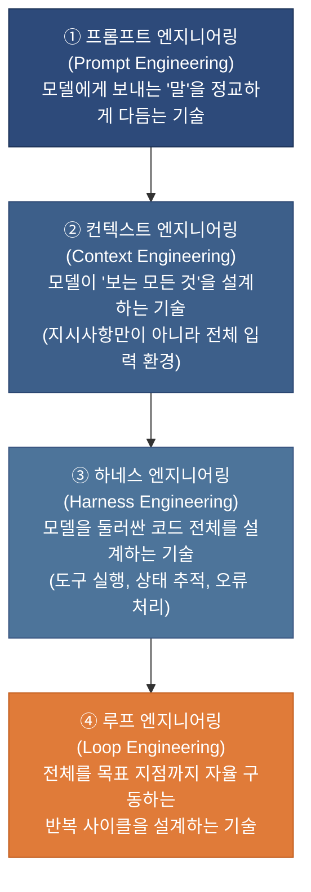
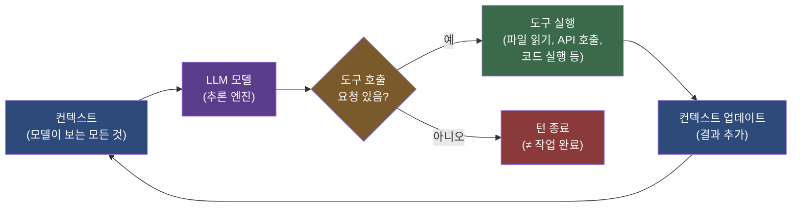
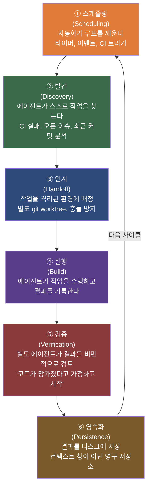
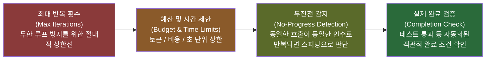
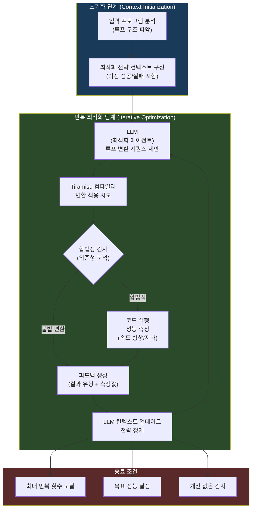
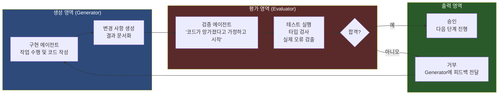
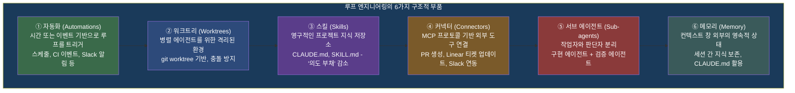
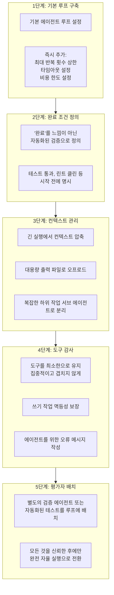
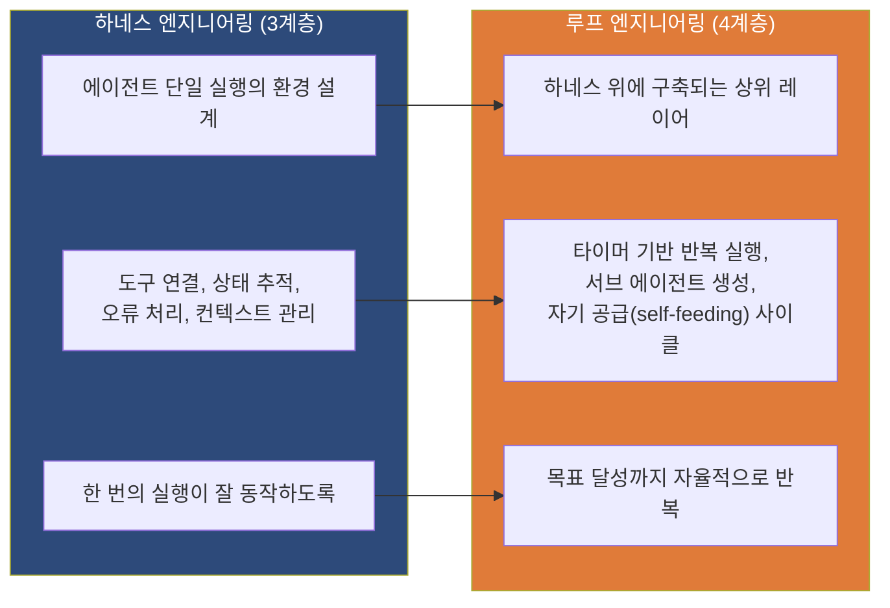

## AI 에이전트를 직접 프롬프팅하는 시대의 종언

> **"나는 더 이상 Claude에게 프롬프트를 입력하지 않는다. 루프들이 돌아가고 있고, 그 루프들이 Claude를 프롬프팅하며 무엇을 해야 할지 파악하고 있다. 내 일은 루프를 작성하는 것이다."**
>
> — Boris Cherny, Anthropic Claude Code 총괄 책임자 (2026년 6월)

## 관련글

[**🚨 A SENIOR ANTHROPIC ENGINEER JUST DROPPED AN 11-PAGE PDF ON LOOP ENGINEERING.**](https://x.com/datachaz/status/2070415564510785812)


---

## 목차

1. [등장 배경: 2026년 6월의 패러다임 전환](#1-등장-배경)
2. [루프 엔지니어링이란 무엇인가](#2-루프-엔지니어링이란-무엇인가)
3. [AI 엔지니어링 4계층 진화 구조](#3-ai-엔지니어링-4계층-진화-구조)
4. [에이전트 루프의 기본 작동 원리](#4-에이전트-루프의-기본-작동-원리)
5. [루프 한 사이클의 5가지 핵심 동작](#5-루프-한-사이클의-5가지-핵심-동작)
6. [루프 설계를 어렵게 만드는 4가지 핵심 난제](#6-루프-설계를-어렵게-만드는-4가지-핵심-난제)
7. [학술 연구: ComPilot - LLM 기반 루프 최적화의 실험적 증거](#7-학술-연구-compilor)
8. [제너레이터 / 이밸류에이터 분리: 루프의 핵심 원칙](#8-제너레이터--이밸류에이터-분리)
9. [Anthropic 시니어 엔지니어의 11페이지 플레이북 해설](#9-anthropic-시니어-엔지니어의-플레이북)
10. [실제 도구 구현: Claude Code와 OpenAI Codex](#10-실제-도구-구현)
11. [4가지 숨겨진 비용과 리스크](#11-4가지-숨겨진-비용과-리스크)
12. [Andrej Karpathy의 시각: 성공 조건을 주어라](#12-andrej-karpathy의-시각)
13. [루프 엔지니어링 실용적 시작 가이드](#13-루프-엔지니어링-실용적-시작-가이드)
14. [하네스 엔지니어링과의 관계와 차이점](#14-하네스-엔지니어링과의-관계와-차이점)
15. [결론: 엔지니어의 역할 재정의](#15-결론-엔지니어의-역할-재정의)

---

## 1. 등장 배경

### 2026년 6월, AI 개발자 커뮤니티를 뒤흔든 6주간의 담론

2026년 6월 7일, X(구 트위터)에 두 문장짜리 게시물 하나가 올라왔다. OpenAI 엔지니어이자 OpenClaw 에이전트 프로젝트 창시자인 Peter Steinberger가 올린 이 글은 순식간에 650만 건의 조회수를 기록하며 AI 개발자 커뮤니티를 강타했다.

> "당신은 더 이상 코딩 에이전트에게 프롬프트를 입력해서는 안 된다. 당신의 에이전트들에게 프롬프트를 입력하는 루프를 설계해야 한다."

이틀 뒤인 6월 9일, 구글 엔지니어 Addy Osmani는 이 개념을 구체화한 에세이를 발표하면서 이 패러다임에 "루프 엔지니어링(Loop Engineering)"이라는 공식 이름을 붙였다. 그리고 여기에 Anthropic Claude Code의 총괄 책임자 Boris Cherny의 발언이 더해지면서 하나의 패러다임 전환이 공식적으로 선언되었다. Cherny는 2026년 6월 2일 WorkOS Acquired Unplugged 행사에서 자신의 업무가 근본적으로 바뀌었다고 밝혔다. 그는 2025년 11월에 IDE를 삭제했고, 그 이후로 한 번도 열지 않았다. 더 나아가 2025년 11월 한 달 동안 그의 Claude Code 기여분 259개의 PR이 모두 Claude Code 자체에 의해 작성되었다고 보고했다.

이 세 사람의 목소리는 AI 에이전트와의 상호작용 방식에 대한 근본적인 질문을 제기했다. 프롬프트 하나를 정교하게 다듬는 기술 대신, 에이전트 스스로 작업을 찾아내고 실행하고 검증하며 기억하는 **자율 실행 시스템**을 설계하는 기술이 새로운 핵심 역량으로 부상한 것이다.

이 담론은 단순한 트렌드 키워드 싸움이 아니었다. TechTalks, The New Stack, The Neuron 등 다수의 전문 미디어가 이를 "2026년 에이전트 소프트웨어 개발의 결정적 전환점"으로 규정했으며, Claude Code와 OpenAI Codex 모두 실제로 `/loop`, `/goal`, `/schedule` 같은 루프 관련 명령어를 제품에 내장함으로써 이 패러다임이 이론을 넘어 실제 도구 설계 철학으로 채택되었음을 보여주었다.

---

## 2. 루프 엔지니어링이란 무엇인가

루프 엔지니어링을 한 문장으로 정의하면 다음과 같다. **에이전트에게 프롬프트를 입력하는 인간을 대체하는 시스템을 설계하는 것**이다.

Addy Osmani는 루프를 "재귀적 목표(recursive goal)"로 정의한다. 개발자는 목적을 하나 정의하고, AI 시스템이 그 목적이 달성될 때까지 스스로 반복한다. 이 과정에서 인간은 루프 안에 있는 타자수가 아니라, 루프 자체를 설계하는 시스템 설계자가 된다.

루프 엔지니어링이 그 이전의 엔지니어링 방식들과 다른 결정적인 차이점은 다음과 같다. 프롬프트 엔지니어링, 컨텍스트 엔지니어링, 하네스 엔지니어링은 모두 인간을 루프 안에 묶어 두었다. 인간이 "무엇을 다음에 할까?"라는 판단을 매 턴마다 내려야 했다. 루프 엔지니어링은 그 판단 자체를 설계된 제어 시스템에 위임한다.

```python
# 루프 엔지니어링의 핵심: 에이전트 루프의 기본 구조
while True:
    response = model(context)
    if response.has_tool_calls():
        results = run_tools(response.tool_calls)
        context += results
    else:
        break
```

이 코드 자체는 단순하다. 모든 진지한 에이전트 프레임워크가 대략 이 여섯 줄 구조로 수렴한다는 점에서, 루프의 기계적 구조 자체는 이미 해결된 문제다. 루프 엔지니어링의 진짜 도전은 `while` 문장 안에 있는 것이 아니라 **그 주변에 무엇을 놓는가**에 있다.

---

## 3. AI 엔지니어링 4계층 진화 구조

루프 엔지니어링은 갑자기 등장한 것이 아니다. 지난 수년간 AI 에이전트와 상호작용하는 방식이 단계적으로 진화해 온 결과물이다. Addy Osmani는 이를 4개의 계층으로 구조화했으며, 각 계층은 이전 계층을 대체하는 것이 아니라 감싸는 형태로 쌓인다.



**프롬프트 엔지니어링(1단계)** 은 모델에게 보내는 언어적 입력을 정교하게 다듬는 기술이다. "더 나은 결과를 위한 말의 기술"이라고 할 수 있다. 그러나 이것이 대화 한 번의 품질을 올릴 수는 있어도, 에이전트가 연속적으로 작업을 수행할 때 어떤 일이 일어날지는 제어하지 못한다.

**컨텍스트 엔지니어링(2단계)** 은 모델이 보는 전체 정보 환경을 설계한다. 단순한 지시사항을 넘어, 어떤 파일을, 어떤 기록을, 어떤 이전 결과를 모델이 볼 수 있는지 전략적으로 결정한다. Boris Cherny는 인터뷰에서 자신의 작업 방식이 "Sonnet 3.5 시절의 프롬프트 엔지니어링, Opus 4 시절의 컨텍스트 엔지니어링, 그리고 현재의 컨텍스트 미니멀리즘"으로 진화했다고 설명했다. 컨텍스트 미니멀리즘이란 모델이 제대로 생각할 수 있도록 컨텍스트를 최대한 가볍게 유지하는 것이다.

**하네스 엔지니어링(3단계)** 은 에이전트가 실행되는 환경 전체를 설계한다. 도구 실행, 상태 추적, 오류 처리, 복구 메커니즘 등 모델 자체 이외의 모든 코드를 의미한다. LangChain이 제시한 공식 `Agent = Model + Harness`가 이 단계를 잘 요약한다. 하네스만 바꾸어도 동일한 모델이 벤치마크 중위권에서 상위 5위권으로 도약할 수 있다는 연구 결과가 이 단계의 중요성을 입증한다.

**루프 엔지니어링(4단계)** 은 하네스 위에 한 층 더 올라선다. 하네스가 에이전트 한 번의 실행 환경을 구성한다면, 루프는 그 에이전트를 타이머에 따라 반복적으로 깨우고, 서브 에이전트들을 생성하고, 자체적으로 작업을 발견하여 실행하는 **자기 공급 시스템**이다. Addy Osmani의 표현을 빌리면, "하네스는 한 번 실행의 환경이고, 루프는 그것이 타이머에 따라 작동하며 작은 도우미들을 낳고 스스로를 먹이는 것"이다.

---

## 4. 에이전트 루프의 기본 작동 원리

루프의 핵심 작동 방식은 다음과 같다. 모델이 컨텍스트를 읽고 도구 호출을 요청하면, 시스템이 그 도구를 실행하여 결과를 다시 컨텍스트에 추가하고, 모델은 갱신된 컨텍스트로 다시 판단한다. 이 과정이 종료 조건에 도달할 때까지 반복된다.



이 다이어그램에서 주목해야 할 핵심 포인트가 있다. 오른쪽 하단의 "턴 종료(end turn)"는 에이전트가 도구 호출을 더 이상 요청하지 않을 때 발생한다. 그러나 **턴 종료는 작업 완료와 전혀 다른 개념**이다. 이 차이를 혼동하는 것이 루프가 실패하는 가장 흔한 원인이다.

---

## 5. 루프 한 사이클의 5가지 핵심 동작

Anthropic 시니어 엔지니어의 루프 엔지니어링 플레이북과 Akshay Pachaar의 분석을 종합하면, 잘 설계된 루프 하나의 사이클은 다섯 가지 핵심 동작으로 구성된다.



### 5.1 스케줄링 (Scheduling): 루프를 루프로 만드는 것

한 번 실행되는 스크립트와 루프를 구분하는 결정적 요소가 스케줄링이다. 루프는 타이머에 의해 자동으로 재시작된다. 이것이 없으면 그냥 한 번 실행한 것과 다르지 않다. Claude Code는 `/loop`, `/schedule`, 크론 작업, GitHub Actions 연동을 통해 스케줄링을 지원한다. 트리거는 시간 기반일 수도 있고, 이벤트 기반(Slack 메시지 도착, GitHub PR 업데이트, CI 실패 알림)일 수도 있다.

### 5.2 발견 (Discovery): 에이전트가 스스로 일거리를 찾는다

기존 방식에서 개발자는 에이전트에게 "이 버그를 고쳐라"라고 작업을 직접 할당했다. 루프 엔지니어링에서 발견 단계는 에이전트 스스로 작업을 찾아내는 과정이다. CI 실패 목록을 읽거나, 오픈 이슈를 분석하거나, 최근 커밋 이력을 검토하거나, 저장소 상태를 파악하여 무엇이 수정될 필요가 있는지 스스로 결정한다. 수동으로 큐레이션된 작업 목록이 필요 없어지는 것이다.

### 5.3 인계 (Handoff): 병렬 실행을 위한 격리

발견된 작업을 처리하기 위해 별도의 격리된 환경이 필요하다. 여러 에이전트가 동일한 파일을 동시에 편집하면 충돌이 발생한다. 이를 방지하기 위해 각 작업은 별도의 `git worktree`를 받는다. git worktree는 동일한 저장소를 공유하면서도 각자의 독립적인 작업 디렉터리를 갖는 메커니즘이다. Claude Code와 OpenAI Codex 모두 이 격리 기능을 기본으로 지원한다.

### 5.4 실행 (Build): 에이전트의 실제 작업

격리된 환경에서 에이전트가 실제 작업을 수행한다. 코드를 작성하고, 테스트를 실행하고, 파일을 수정하고, 그 결과를 기록한다.

### 5.5 검증 (Verification): "No"라고 말할 수 있는 존재

루프 설계의 가장 중요한 요소 중 하나다. 작업을 수행한 에이전트가 자신의 결과물을 스스로 평가하게 해서는 안 된다. 별도의 에이전트 또는 자동화된 검증 시스템이 "이 코드가 망가졌다는 전제로 시작하여" 결과물을 비판적으로 검토한다. 이것이 루프 안에서 "No"라고 말할 수 있는 존재다.

### 5.6 영속화 (Persistence): 컨텍스트 창 밖으로

에이전트의 메모리는 컨텍스트 창에 존재하며, 세션이 끝나면 사라진다. 루프가 세션을 넘어 지속되려면 결과물을 디스크, 파일 시스템, git 저장소, 데이터베이스 같은 외부의 영속적 저장소에 기록해야 한다. Claude Code에서 `CLAUDE.md` 파일이 이 역할을 담당한다. 에이전트가 반복적인 실수를 할 때, 그 교훈을 `CLAUDE.md`에 기록하면 이후 모든 세션에서 그 수정사항이 전파된다.

---

## 6. 루프 설계를 어렵게 만드는 4가지 핵심 난제

Akshay Pachaar의 분석이 정확하게 지적한 것처럼, 루프의 기본 구조는 이미 해결된 문제다. 진짜 도전은 루프가 실제 환경에서 신뢰할 수 있게 작동하도록 만드는 네 가지 어려운 문제에서 온다.

### 난제 1: 언제 멈출 것인가 (종료 조건 설계)

가장 흔히 놓치는 문제다. 에이전트가 도구 호출을 멈추는 것은 해당 **턴(turn)이 끝난 것**이지, **작업(task)이 완료된 것이 아니다**. 코딩 에이전트가 코드를 작성하고 주변을 살펴본 뒤 "진전이 있었으니 완료"라고 선언하지만, 테스트는 여전히 실패하는 상황이 발생한다. 에이전트는 실제 완료 여부와 무관하게 완료를 선언할 수 있다.

올바른 루프 설계는 여러 개의 제동 장치를 중첩적으로 배치한다.



이 중에서 가장 중요한 것은 마지막 단계, 즉 자동화된 완료 조건 검증이다. "완료"는 에이전트의 느낌이 아니라 테스트 통과, 린트 클린 같은 객관적이고 검증 가능한 조건으로 정의되어야 한다. Firecrawl의 분석에 따르면, 루프에 반복 횟수 상한, 변경 사항 없을 때의 종료 로직, 지출 한도가 없으면 "그건 루프가 아니라 열린 청구서"라고 표현했다.

### 난제 2: 컨텍스트 청결 유지 (컨텍스트 부패 문제)

긴 루프는 내부에서부터 썩는다. 턴이 늘어날수록 낡은 도구 출력, 막다른 추론, 오래된 중간 결과물들이 컨텍스트에 쌓인다. 이를 **"컨텍스트 부패(context rot)"** 라고 한다. 더 심각한 것은 부패한 컨텍스트가 악화되는 결정을 만들어내고, 그 결정이 더 많은 노이즈를 추가하여 컨텍스트를 더욱 오염시키는 **"둠 루프(doom loop)"** 다. 에이전트는 실행될수록 실제로 더 멍청해진다.

이를 해결하는 세 가지 전략이 있다.

첫째, **압축(Compaction)** 이다. 대화가 길어지면 그것을 요약하여 컨텍스트를 재시작한다. 요약본을 바탕으로 계속 진행하면 필요한 정보는 보존하면서 노이즈를 제거할 수 있다.

둘째, **오프로딩(Offloading)** 이다. 대용량 출력을 파일에 저장하고 컨텍스트에는 필요한 슬라이스만 남긴다. 모든 것을 컨텍스트에 넣어 두려는 본능을 버리고, 버릴 것을 아는 기술이 핵심이다.

셋째, **서브 에이전트(Sub-agents)** 다. 복잡하고 지저분한 하위 작업을 별도의 에이전트에게 넘기고, 그 에이전트의 깔끔한 결과만 반환받는다. 메인 루프의 컨텍스트를 오염시키지 않는다.

### 난제 3: 실제로 사용 가능한 도구 설계

루프의 품질은 루프 안에 있는 도구의 품질에 달려 있다. 100개의 도구를 쌓아 놓으면 에이전트는 어느 것을 써야 할지 파악하지 못한다. Anthropic의 경험칙에 따르면, 인간 엔지니어가 어떤 도구를 써야 할지 즉각 확신할 수 없다면 에이전트도 마찬가지다. 도구는 집중적이고 겹치지 않아야 한다.

두 가지 설계 원칙이 특히 중요하다.

**쓰기 작업의 멱등성(idempotency) 보장**이다. 루프는 재시도하며, 재시도된 "고객 생성" 호출이 두 번째 고객을 만들어 내면 중복 레코드와 이중 청구라는 재앙으로 이어진다. 상태를 변경하는 모든 작업은 두 번 호출해도 안전해야 한다.

**에이전트를 위한 오류 메시지 설계**다. 좋은 오류 메시지는 에이전트에게 다음에 무엇을 해야 할지 알려준다. 도구를 배포하기 전에 "이 오류를 읽은 LLM이 다음 행동을 알 수 있는가?"를 질문해야 한다. 루프에서 오류는 막다른 골목이 아니라 다음 명령이다.

### 난제 4: "No"라고 말할 수 있는 존재 (평가자 분리)

자율 루프에는 조용한 실패 모드가 있다. 혼자 내버려 두면 에이전트는 자신의 작업에 동의하는 경향이 있다. 에이전트에게 자신의 결과물을 평가하게 하면 언제나 칭찬한다. 이것은 모델의 한계가 아니라 구조적 문제다.

해결책은 **만들어내는 자(Generator)와 평가하는 자(Evaluator)를 분리**하는 것이다. 하나의 에이전트가 작업을 수행하고, 다른 에이전트 또는 자동화된 검증 시스템이 그 작업을 평가한다. 작업자가 자신의 숙제를 채점하게 해서는 안 된다.

---

## 7. 학술 연구: ComPilot

루프 엔지니어링의 개념이 소프트웨어 개발 영역에서 바이럴되는 동안, 학술 연구계에서도 동일한 원리가 실제로 효과적임을 실험적으로 입증하는 연구가 발표되었다. 뉴욕 대학교 아부다비 캠퍼스(NYU Abu Dhabi)의 Massinissa Merouani, Islem Kara Bernou, Riyadh Baghdadi가 제출한 논문 **"Agentic Auto-Scheduling: An Experimental Study of LLM-Guided Loop Optimization"** 이 그것이다. 이 논문은 2025년 12월 27일 arXiv(논문 번호 2511.00592)에 최종 개정판이 올라왔으며, **IEEE PACT 2025(제34회 병렬 아키텍처 및 컴파일 기술 국제 컨퍼런스)** 에 게재되었다.

### 연구의 핵심 문제 의식

현대 하드웨어에서의 코드 최적화, 특히 루프 중첩(loop nest)의 성능 최적화는 매우 어려운 도전이다. 다층 캐시, 복잡한 명령 파이프라인, 병렬 실행 자원이 얽혀 있어 최적의 성능을 달성하기 위해서는 방대한 전문 지식과 노력이 필요하다. 기존의 자동화된 컴파일러 휴리스틱은 다양한 응용 프로그램과 하드웨어에 걸쳐 일관된 결과를 내기 어려웠다.

이 연구의 핵심 질문은 다음과 같다. **"파인튜닝 없는 범용 LLM이, 컴파일러 피드백에 의해 근거를 갖추었을 때, 루프 최적화라는 복잡한 과정을 효과적으로 안내할 수 있는가?"**

### ComPilot 프레임워크의 구조

연구팀은 이 질문에 답하기 위해 **ComPilot(Compiler Pilot)** 이라는 실험적 프레임워크를 설계했다. 이 이름은 말 그대로 "컴파일러를 조종하는 파일럿"을 의미하며, LLM과 컴파일러 인프라 사이의 폐루프 상호작용을 핵심으로 한다.



ComPilot에서 LLM은 최적화 에이전트로서 주어진 루프 중첩에 대한 루프 변환 시퀀스(스케줄)를 제안한다. 이 스케줄은 Tiramisu 컴파일러에 전달되어 변환이 적용 가능한지 의존성 분석을 통해 합법성이 검사되고 코드가 생성된다. ComPilot은 여기에 피드백 루프를 내장한다. 스케줄 적용 결과, 즉 성공 여부, 실패 유형, 성공 시 속도 향상 또는 저하 수치가 LLM에게 다시 보고된다. 이 폐루프 상호작용을 통해 LLM은 과거의 성공과 실패로부터 학습하고, 대상 하드웨어의 직접적인 실증적 증거를 바탕으로 최적화 전략을 지속적으로 정제한다.

특히 주목할 점은 이 시스템이 **파인튜닝 없는 범용 LLM**을 사용한다는 점이다. 특정 컴파일러 데이터로 훈련된 전용 모델 없이도, 피드백 루프가 LLM의 범용 추론 능력을 효과적인 컴파일러 전문가로 변환시킨다.

### 실험 결과

PolyBench 벤치마크 스위트를 대상으로 한 광범위한 평가에서 ComPilot은 놀라운 결과를 보여주었다.

단일 실행(single run)에서 원본 코드 대비 **기하 평균 2.66배 속도 향상**을 달성했다. 5회 시도 중 최선(best-of-5)을 선택하는 전략에서는 **3.54배 속도 향상**을 기록했다. 일부 벤치마크에서는 훨씬 더 큰 개선을 보였다. 더욱 주목할 점은 최신 최첨단 Pluto 다면체 최적화 컴파일러와 비교했을 때 다수의 경우에서 이를 능가하는 성능을 보였다는 것이다.

이 연구는 LLM을 단순한 코드 생성기가 아닌 **프로세스를 안내하는 에이전트**로 사용하는 패러다임의 타당성을 실험적으로 입증했다. 컴파일러 피드백이 LLM의 성능을 근거 있게 만들 때, 범용 LLM이 복잡한 코드 최적화를 효과적으로 안내할 수 있다는 것이 핵심 발견이다.

---

## 8. 제너레이터 / 이밸류에이터 분리

루프 엔지니어링에서 가장 중요하고 가장 자주 간과되는 원칙이 **Generator(생성자)와 Evaluator(평가자)의 분리**다.

Anthropic의 시니어 엔지니어 플레이북은 이 점을 명확히 한다. "에이전트는 자신의 결과물을 평가하는 데 있어 형편없는 판단자다. 이것은 모델 한계가 아니라 구조적 한계다."

실증적으로, 자신이 생성한 출력을 평가하도록 요청받은 에이전트는 그것을 승인하는 경향이 있다. 생성자를 비판적으로 만드는 것보다 **독립적이고 회의적인 평가자를 조율하는 것**이 훨씬 더 현실적인 접근법이다.



평가자는 세 가지 형태를 취할 수 있다. 자동화된 테스트나 타입 검사, 실제 오류 감지가 가장 확실하다. 다음으로 작업을 수행한 에이전트와 다른 지시사항을 가진 별도의 LLM 에이전트다. 회의적 관점으로 시작하여 결과가 실제로 올바를 때까지 거부한다. 셋째는 사람이 검토하는 Human-in-the-Loop 게이트로, 특히 돌이킬 수 없는 작업(배포, 데이터 삭제 등)의 경우 반드시 배치해야 한다.

Stripe의 사례는 이 원칙이 얼마나 강력한지 보여준다. Stripe는 매주 1,300개 이상의 기계 작성 Pull Request를 병합하는 루프 파이프라인을 운영 중인데, 이 시스템의 신뢰성은 강력한 Generator/Evaluator 분리 없이는 불가능했을 것이다.

---

## 9. Anthropic 시니어 엔지니어의 플레이북

2026년 6월 하순, Anthropic 시니어 엔지니어가 루프 엔지니어링에 관한 11페이지 분량의 플레이북을 공개했다. 이 문서는 HyperAI, DataScienceDojo 등 여러 AI 미디어에 의해 분석되고 공유되며 광범위한 반향을 일으켰다.

이 플레이북의 핵심 기여는 루프 엔지니어링을 프롬프트/컨텍스트/하네스 엔지니어링 위에 놓이는 **네 번째 계층**으로 공식 정의하고, 루프 한 턴을 다섯 가지 동작으로 분해하며, 이를 실현하는 여섯 가지 구조적 부품을 정리한 것이다.

### 루프를 실현하는 6가지 구조적 부품



**자동화(Automations)** 는 루프를 시작하는 트리거 메커니즘이다. 시간 기반 스케줄뿐 아니라 CI 실패, Slack 메시지 도착, GitHub PR 업데이트, 심지어 새벽 3시의 정기 실행까지 다양한 트리거를 지원한다.

**워크트리(Worktrees)** 는 병렬 에이전트들이 서로를 방해하지 않고 작업할 수 있게 하는 격리 메커니즘이다. `git worktree` 명령으로 동일한 저장소를 여러 독립적인 작업 디렉터리로 분기할 수 있다.

**스킬(Skills)** 은 루프가 실행될 때마다 처음부터 프로젝트 컨텍스트를 다시 설명해야 하는 "의도 부채(intent debt)"를 줄이는 영구적 지식 저장소다. `CLAUDE.md`나 `SKILL.md` 파일에 프로젝트 관련 지침, 반복적 실수에 대한 교훈, 표준 절차 등을 기록해 두면 루프의 모든 실행에서 이를 활용할 수 있다.

**커넥터(Connectors)** 는 MCP(Model Context Protocol) 기반으로 외부 서비스와 연결하는 메커니즘이다. 커넥터 덕분에 루프는 단순히 파일을 읽고 쓰는 "관찰자"를 넘어 PR을 생성하고, 이슈 트래커를 업데이트하고, Slack에 알림을 보내는 "운영자"가 된다.

**서브 에이전트(Sub-agents)** 는 앞서 설명한 Generator/Evaluator 분리를 실현한다. 구현 에이전트와 검증 에이전트를 분리하여 자기 평가의 함정을 피한다.

**메모리(Memory)** 는 컨텍스트 창 너머의 영속적 상태 관리다. 대화가 지워져도 CLAUDE.md에 기록된 교훈은 남아 있다. Boris Cherny는 이것이 루프가 세션을 넘어 개선될 수 있는 핵심 메커니즘이라고 설명했다.

---

## 10. 실제 도구 구현

루프 엔지니어링은 추상적 개념을 넘어 Claude Code와 OpenAI Codex에 실제 제품 기능으로 구현되어 있다.

### Claude Code의 루프 기능

Claude Code는 2026년 초반부터 루프 관련 기능을 공식 명령어로 제공한다.

`/goal` 명령어는 Claude Code 버전 2.1.139(2026년 5월 11일 주에 추가)에서 도입되었다. 개발자가 "test/auth의 모든 테스트가 통과하고 린트가 깨끗한 상태"와 같은 목표를 설정하면, Claude Code는 그 조건이 충족되었는지 판단하기 위해 코드를 작성한 모델이 아닌 **별도의 더 빠른 모델**을 사용한다. 자기 평가의 구조적 문제를 도구 수준에서 해결한 것이다.

`/loop` 명령어는 일정 간격으로 프롬프트나 명령어를 반복 실행한다. `/schedule`은 크론 작업 방식으로 예약 실행을 지원하고, 훅(hooks) 시스템은 에이전트 생명주기의 특정 시점에 셸 명령어를 실행하는 이벤트 드리븐 자동화를 가능하게 한다. GitHub Actions 연동으로 노트북을 닫아도 루프가 계속 실행된다.

`git worktree` 지원으로 서브 에이전트 각각이 격리된 작업 공간을 갖고 병렬로 실행될 수 있으며, 작업 완료 후 자동으로 정리된다. Boris Cherny는 현재 자신의 작업 중 약 절반이 노트북이 아닌 **원격 제어와 음성 모드로** 이루어진다고 설명했다. 커피를 마시며 걷는 중에도 에이전트를 시작하고, 소파에 앉아서도 PR이 계속 병합된다.

### OpenAI Codex의 루프 기능

OpenAI Codex 앱은 자동화 탭에서 루프 설정을 지원한다. 프로젝트, 실행할 프롬프트, 빈도, 그리고 로컬 체크아웃 또는 백그라운드 워크트리 중 어디서 실행할지 선택할 수 있다. 결과를 찾은 실행은 트리아지 받은 목록으로, 아무것도 찾지 못한 실행은 자동으로 보관 처리된다. OpenAI 내부에서는 일일 이슈 트리아지, CI 실패 요약, 커밋 브리핑 작성, 지난주에 추가된 버그 추적 등에 이미 활용하고 있다.

### 도구 수렴 현상

주목할 만한 사실은 Claude Code와 OpenAI Codex가 매우 유사한 기본 구성 요소들로 수렴하고 있다는 점이다. 자동화 트리거, worktree 기반 격리, 스킬 시스템, MCP 커넥터, 서브 에이전트 패턴이 두 도구에서 거의 동일하게 구현되어 있다. 이는 루프 엔지니어링이 특정 도구에 종속된 개념이 아니라 에이전트 소프트웨어 개발의 새로운 표준 패러다임으로 자리 잡고 있음을 시사한다.

---

## 11. 4가지 숨겨진 비용과 리스크

루프 엔지니어링의 열기 속에서 전문가들이 경고하는 네 가지 숨겨진 비용과 리스크가 있다.

### 리스크 1: 검증 부채 (Verification Debt)

루프가 빠를수록 검증이 따라가지 못할 위험이 커진다. 검증 단계 없는 루프는 자신감 넘치는 불량품 컨베이어 벨트가 될 수 있다. 모든 루프에는 반드시 무언가가 "No"라고 말할 수 있어야 한다.

### 리스크 2: 이해 부채 (Comprehension Debt)

루프가 자신이 쓰지 않은 코드를 더 빠르게 배포할수록, 저장소에 무엇이 있는지와 실제로 이해하는 것 사이의 간격이 벌어진다. Addy Osmani는 이것을 "이해 부채(comprehension debt)"라고 불렀다. 루프가 더 잘 돌아갈수록 이 부채는 더 빠르게 누적된다. 누군가는 반드시 변경 사항의 diff를 실제로 읽어야 한다.

### 리스크 3: 인지 항복 (Cognitive Surrender)

Greg Brockman의 지적처럼, 루프 없이 맛이 있어야 한다. 루프는 설계자의 판단력이 좋을 때만 좋다. 루프를 실행하는 것이 쉬워질수록 그 뒤에 있는 사람의 취향(taste)이 더 중요해진다. 판단력 없는 루프는 형편없는 작업을 아주 빠르게 많이 만들어낼 수 있다.

### 리스크 4: 토큰 폭발 (Token Blowout)

루프에서 토큰 비용은 예상보다 훨씬 빠르게 복리로 증가한다. 단일 잘 작성된 프롬프트보다 자율 에이전트 루프가 훨씬 더 많은 컴퓨팅을 소비한다. 예산 상한, 시간 제한, 반복 횟수 제한이 없는 루프는 "루프가 아니라 열린 청구서"다.

---

## 12. Andrej Karpathy의 시각

Andrej Karpathy(전 Tesla AI 책임자, 현 Eureka Labs 창업자)는 루프 엔지니어링의 핵심 철학을 다른 각도에서 포착했다.

> "모델에게 무엇을 해야 할지 말하지 말고, 성공 조건을 주고 지켜봐라."

Karpathy는 자신이 밤새 실행되는 연구 루프를 설정한다고 설명했다. 이 루프는 스크립트를 조정하고, 테스트하고, 작동하는 것을 유지하고, 작동하지 않는 것을 버린다. 그 과정에서 자신은 어디에도 없다. 루프를 한 번 설정하고 실행 버튼을 누른다. 그 후에는 시스템이 스스로 돌아간다.

이것이 패러다임 전환의 본질이다. 개발자는 손이 되기를 멈추고 **기계를 설계하는 사람**이 된다. 직접 지시를 내리는 것이 아니라 그 지시를 내리는 시스템을 구축한다.

---

## 13. 루프 엔지니어링 실용적 시작 가이드

루프 엔지니어링을 처음 시작하는 팀을 위한 단계적 접근법이다. 첫날부터 완전 자율 에이전트를 목표로 할 필요는 없다.



**1단계**에서는 기본 루프를 구축하되 즉시 세 가지 안전장치를 추가한다. 최대 반복 횟수 상한, 타임아웃, 비용 한도가 그것이다. 이것이 없는 루프는 위험하다.

**2단계**에서는 루프를 시작하기 전에 "완료"를 자동화된 검증 조건으로 정의한다. 나중에 "느낌"으로 판단하는 것이 아니라 처음부터 명확히 한다.

**3단계**에서는 컨텍스트를 적극적으로 관리한다. 긴 실행에서는 압축하고, 대용량 출력은 파일로 내보내고, 복잡한 하위 작업은 서브 에이전트로 격리한다.

**4단계**에서는 도구를 감사한다. 도구 수를 최소화하고, 쓰기 작업의 멱등성을 보장하며, 오류 메시지를 에이전트가 행동할 수 있는 형태로 재작성한다.

**5단계**에서는 평가자를 루프에 배치한다. 이 시스템을 충분히 신뢰하게 된 후에야 완전 자율 실행으로 전환한다.

---

## 14. 하네스 엔지니어링과의 관계와 차이점

루프 엔지니어링과 하네스 엔지니어링은 혼동되기 쉬운 개념이지만 중요한 차이점이 있다.



하네스 엔지니어링이 에이전트 한 번의 실행이 올바르게 동작하도록 환경을 구성하는 것이라면, 루프 엔지니어링은 그 환경을 타이머에 따라 반복적으로 실행하고, 서브 에이전트를 생성하고, 작업을 스스로 발견하여 목표까지 자율적으로 구동하는 상위 시스템이다. Addy Osmani는 루프가 하네스보다 "한 층 위에 있으며" 하네스 위에서 실행되는 것이라고 명확히 구분했다.

LangChain의 공식 `Agent = Model + Harness`는 여전히 유효하다. 루프 엔지니어링은 이를 대체하는 것이 아니라, `System = Loop(Harness(Agent))` 수준으로 추상화를 한 단계 더 올린다.

---

## 15. 결론: 엔지니어의 역할 재정의

루프 엔지니어링은 프레임워크도 설치할 수 있는 도구도 아니다. 이것은 **노력을 어디에 쏟아야 하는가에 대한 근본적인 관점의 전환**이다.

TechTalks의 분석이 정확하게 포착했듯이, 이 운동은 2022년 ReAct 패턴, 2023년 AutoGPT 실험, 2025년 "Ralph 루프" bash 스크립트를 거쳐 2026년 Claude Code와 Codex에 제품으로 내장된 기능들로 이어지는 2년에 걸친 아키텍처 계보의 자연스러운 정점이다.

Boris Cherny의 언급에서 시작된 이 담론이 울림을 갖는 이유는 명확하다. 그것이 에이전트를 프로덕션 환경에서 실행해 본 모든 팀이 이미 부딪힌 벽에 이름을 붙였기 때문이다. 좋은 프롬프트는 한 번의 턴을 고친다. 하지만 어떤 턴이 다음에 오는지, 무엇이 완료를 뜻하는지, 되돌릴 수 없는 작업 전에 누가 승인하는지, 지출은 어떻게 제어하는지에 대해서는 아무것도 말하지 않는다.

루프 엔지니어링은 이 모든 질문에 답하는 시스템을 설계하는 것이다. 그리고 이 일을 잘 하는 사람은 더 이상 에이전트에게 다음 지시를 내리는 사람이 아니라, **지시 자체를 내리는 기계를 설계하는 사람**이다.

세상에서 가장 인기 있는 AI 코딩 에이전트를 만든 사람이 더 이상 에이전트에게 직접 말하지 않는다. 그가 하는 일은 루프를 작성하는 것이다. 그것이 우리가 따라야 할 방향이다.

---

## 참고 자료

- **Akshay Pachaar (@akshay_pachaar)**: "Loop Engineering Clearly Explained", X/Twitter, 2026년 6월 23일
- **Boris Cherny (Anthropic)**: Claude Code 총괄 책임자, WorkOS Acquired Unplugged 발표, 2026년 6월 2일
- **Peter Steinberger (@steipete)**: X/Twitter 게시물 (6.5백만 조회), 2026년 6월 7일
- **Addy Osmani**: "Loop Engineering", addyosmani.com / O'Reilly Radar, 2026년 6월
- **Massinissa Merouani, Islem Kara Bernou, Riyadh Baghdadi**: "Agentic Auto-Scheduling: An Experimental Study of LLM-Guided Loop Optimization", arXiv:2511.00592, IEEE PACT 2025, DOI: 10.1109/PACT65351.2025.00027
- **Anthropic 시니어 엔지니어**: 루프 엔지니어링 플레이북 (11페이지 PDF), 2026년 6월
- **Cobus Greyling**: "Loop Engineering" (Substack), 2026년 6월
- **The Neuron**: "Claude Code's Creators Explain Agent Loops & How They Code", 2026년 6월
- **TechTalks (Ben Dickson)**: "Demystifying Loop Engineering", 2026년 6월
- **HyperAI**: "Loop Engineering: The Anthropic Playbook for Designing Systems That Prompt Your Agents", 2026년 6월

---

*작성일자: 2026-06-28*
