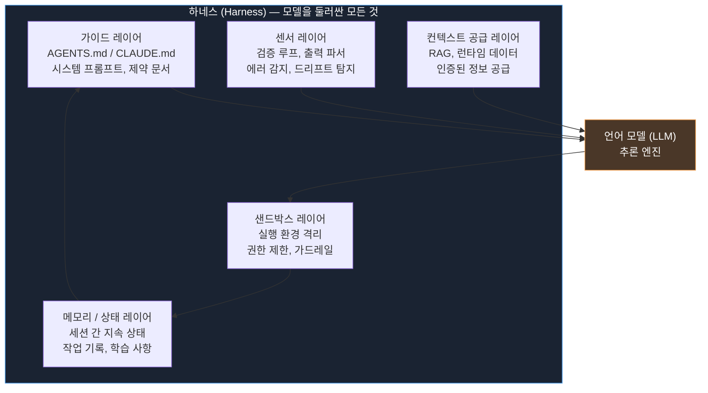
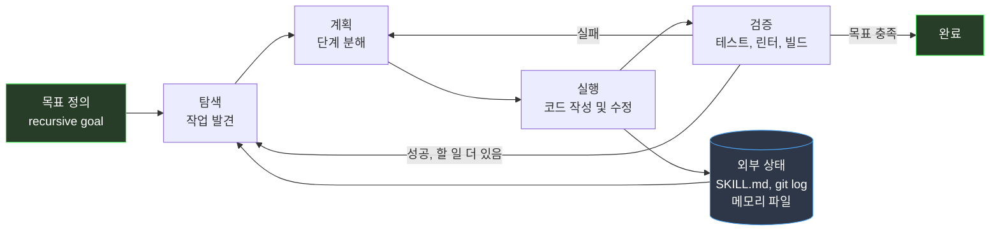
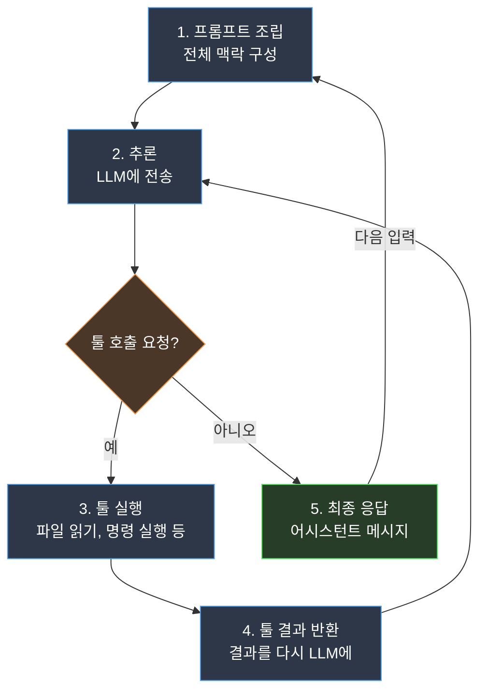
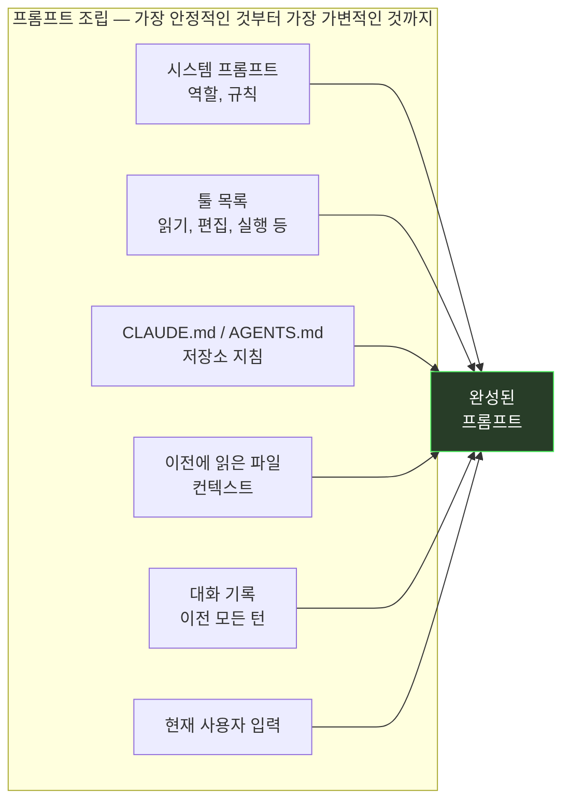
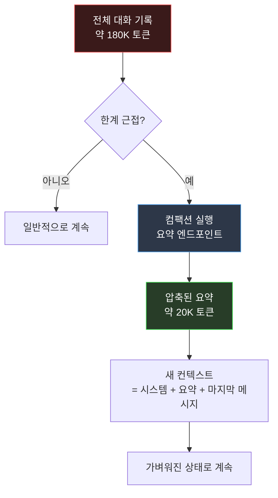
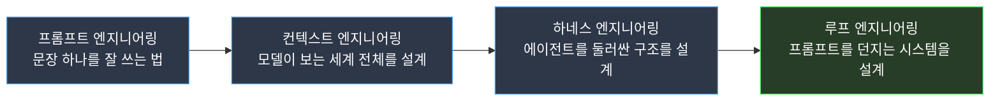
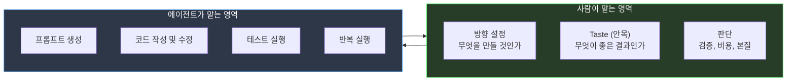

> "AI 코딩 에이전트는 망상에 빠진 while 루프다." — Fernando Rodriguez (2026년 4월)


## 관련글

[**제가 정말 루프 엔지니어링까지 알아야 할까요?**](https://yozm.wishket.com/magazine/detail/3816/)

[**Your AI coding agent is a while loop with delusions of grandeur**](https://dev.to/frr149/your-ai-coding-agent-is-a-while-loop-with-delusions-of-grandeur-1h6e)

---

## 들어가며: 너무 빠른 유행, 너무 빠른 피로

2025년 봄, AI 실무 커뮤니티에서 새로운 단어 하나가 폭발적으로 퍼졌다. **컨텍스트 엔지니어링(context engineering)** 이었다. 프롬프트 엔지니어링이라는 말에 겨우 익숙해진 사람들이 다시 새 언어를 배워야 하는 처지가 됐다. 그 피로가 가시기도 전인 2025년 말에서 2026년 초 사이, 이번에는 **하네스 엔지니어링(harness engineering)** 이 등장했다. 그리고 2026년 6월, Peter Steinberger(OpenAI, OpenClaw 창시자)의 짤막한 X 포스트 하나가 또다시 타임라인을 뒤흔들었다.

> "코딩 에이전트에게 프롬프트를 던지는 걸 멈춰라. 에이전트에게 프롬프트를 던지는 루프를 설계하기 시작해야 한다."
> — 피터 슈타인베르거, 2026년 6월 7일 (X)

이 두 문장이 6.5백만 뷰를 기록했고, 1주일 동안 X에서 2,200개 이상의 관련 게시물이 쏟아졌다. 그리고 **루프 엔지니어링(loop engineering)** 이라는 네 번째 유행어가 탄생했다. 1년 남짓 사이에 유행이 네 번 바뀐 것이다.

이 글은 그 혼란스러운 흐름을 정리한다. 네 가지 엔지니어링 트렌드가 각각 무엇을 뜻하는지, 왜 등장했는지, 그 실체는 무엇인지를 구체적인 사례와 함께 살펴본다. AI 코딩 에이전트의 내부 구조도 분해한다. 그리고 결국, 이 모든 것을 다 알아야 하는지에 대해 현실적인 답을 내어 본다.

---

## 1. 프롬프트 엔지니어링: 말 잘 거는 기술의 실제 범위

### 등장 배경

초기 대형 언어 모델은 두 가지 큰 약점을 가지고 있었다. 지시를 불안정하게 따랐고, 추론 능력이 부족했다. 모델을 개선하는 데는 막대한 비용이 필요했으므로, 연구자들은 먼저 **입력 방식을 바꾸는 것**으로 모델의 약점을 메우려 했다. 이것이 프롬프트 엔지니어링의 출발점이다.

'AI에게 말 잘 거는 법'으로 알려졌지만 실제 범위는 훨씬 넓다. 연구자들은 다양한 기법을 체계화했다.

- **Few-shot**: 몇 가지 예시를 함께 보여줌으로써 모델이 원하는 패턴을 학습하게 한다.
- **Chain-of-Thought (CoT)**: "단계별로 생각해보자"는 식의 구조를 추가해 추론 과정을 분해하도록 유도한다.
- **Zero-shot CoT**: 예시 없이 "차근차근 생각하자(Let's think step by step)"라는 문장 하나만 덧붙여도 효과가 있다는 것을 발견했다.
- **ReAct**: 생각(Reasoning)과 행동(Action)을 번갈아 수행하게 해 에이전트처럼 동작하게 만드는 패턴이다.

### 수치로 본 위력

MultiArith 벤치마크 연구에서, 수학 추론 문제에 "Let's think step by step" 한 문장만 추가했을 때 정답률이 **17.7%에서 78.7%** 로 뛰어올랐다. 아무런 구조 변경 없이 입력 문장 하나만 추가하는 것으로 61%p의 성능 향상을 이끌어낸 것이다.

### '프롬프트 엔지니어링은 끝났다'는 말의 오해

2025년 이후 "프롬프트 엔지니어링은 사라질 것"이라는 말이 많이 나왔다. 절반은 맞고 절반은 틀리다. 정확히 말하면, 프롬프트 엔지니어링의 **일부 기능이 이동했다**. 추론 모델이 스스로 CoT와 유사한 사고 단계를 내부에서 처리하게 되면서, 사람이 프롬프트로 보완하던 역할 일부가 모델 안으로 흡수됐다. 그러나 적절한 지시를 작성하는 일 자체는 여전히 중요하다. 프롬프트 엔지니어링은 폐기된 것이 아니라, 그 역할이 컨텍스트 엔지니어링 안으로 이동한 것이다.

---

## 2. 컨텍스트 엔지니어링: 모델이 보는 세계 전체를 설계하는 일

### Anthropic의 공식 정의

2025년 9월 29일, Anthropic 엔지니어링 팀은 "Effective Context Engineering for AI Agents"라는 제목의 기술 블로그를 발행했다. 그 핵심 메시지는 이렇다.

> "컨텍스트는 AI 에이전트에게 유한하지만 핵심적인 자원이다."
> — Anthropic 엔지니어링 블로그, 2025년 9월 29일

이 글은 프롬프트 엔지니어링이 "어떤 단어와 문장을 넣을 것인가"의 문제였다면, 컨텍스트 엔지니어링은 "**모델이 추론할 때 보게 될 정보 환경 전체를 어떻게 구성할 것인가**" 라는 더 큰 질문으로 전환이 일어났다고 설명한다.

### 컨텍스트의 구성 요소

단일 추론 시점에 모델이 보는 정보의 범위는 다음과 같다.

| 구성 요소 | 내용 |
|----------|------|
| 시스템 프롬프트 | 역할 정의, 행동 원칙 |
| 툴 설명 | 사용 가능한 기능 목록 |
| 메모리 | 과거 대화 및 요약 |
| 검색 결과(RAG) | 적시 검색으로 가져온 정보 |
| 대화 기록 | 현재까지의 모든 메시지 |
| 사용자 입력 | 현재 요청 |

프롬프트가 이 중 사용자 입력이라는 **한 칸**을 다듬는 일이라면, 컨텍스트 엔지니어링은 이 **전체 테이블**을 설계하는 일이다.

### Context Rot: 컨텍스트가 오히려 해가 되는 현상

컨텍스트 창이 커졌다고 해서 무조건 채우는 것이 좋은 것은 아니다. 입력이 길어질수록 모델의 정확도가 흐려지는 현상이 발견됐고, 이것은 **context rot(컨텍스트 부패)** 이라는 이름을 갖게 됐다. 모델이 자신의 컨텍스트 창이 가득 차가고 있다고 판단하면 일찍 요약하거나 작업을 강제로 종료하려는 "컨텍스트 불안(context anxiety)" 행동을 보이기도 한다고, Anthropic과 Cognition AI가 각각 2025년 9월~10월의 기술 분석에서 밝혔다.

### 실무에서의 컨텍스트 엔지니어링: Claude Code의 예

Claude Code의 `CLAUDE.md` 파일이 컨텍스트 엔지니어링의 대표적인 구현 사례다. Anthropic은 이 파일을 **200줄 미만**으로 짧게 유지하도록 권장한다. 길어질수록 컨텍스트 예산을 더 소모하고, 지시 준수 성능도 함께 떨어지기 때문이다. `/compact` 명령어는 길어진 대화를 요약해 컨텍스트를 비우는 도구로, 이것 역시 컨텍스트 엔지니어링의 일환이다.

컨텍스트 엔지니어링은 RAG(검색 증강 생성) 같은 개념도 하위 집합으로 포함한다. 모델이 알아야 할 정보를 어떻게 적시에 공급할 것인가를 설계하는 일이 이 범주에 속한다.

---

## 3. 하네스 엔지니어링: 모델에 고삐를 채우는 일

### 정의와 유래

**하네스(harness)** 는 말(馬)에 채우는 마구(馬具)를 뜻한다. AI 에이전트 맥락에서 하네스 엔지니어링이란, 모델 자체는 건드리지 않은 채로 **모델을 둘러싼 구조 전체를 설계해 에이전트를 신뢰할 수 있게 만드는 일**이다.

이 용어는 HashiCorp 공동 창업자이자 Terraform 창시자인 미첼 하시모토(Mitchell Hashimoto)가 2026년 2월의 블로그 포스트에서 공식화했다. 같은 시기 OpenAI 엔지니어 Ryan Lopopolo도 "인간이 방향을 잡고, 에이전트가 실행한다(Humans steer. Agents execute.)"는 원칙 아래 하네스 구조에 관한 기술 글을 발행했고, LangChain이 이를 **Agent = Model + Harness**라는 공식으로 요약하면서 빠르게 퍼졌다.

### 핵심 방정식

**Agent = Model + Harness**

모델은 천장을 결정하고, 하네스는 그 천장에 얼마나 가까이 닿을 수 있는지를 결정한다. 이 공식이 실증적으로 검증된 사건이 있다.

### LangChain의 Terminal Bench 실험: 하네스만 바꿔 30위에서 5위로

2026년 초, LangChain 팀은 Terminal Bench 2.0이라는 코딩 벤치마크에서 주목할 만한 실험을 수행했다. GPT-5.2-Codex 모델을 **그대로 유지한 채로** 하네스만 바꾸는 실험이었다. 결과는 놀라웠다.

| 항목 | 변경 전 | 변경 후 |
|------|---------|---------|
| Terminal Bench 2.0 점수 | 52.8% | 66.5% |
| 리더보드 순위 | Top 30 밖 | **Top 5** |
| 변경 사항 | — | 하네스만 수정 (모델 동일) |

이 13.7%p의 향상은 시스템 프롬프트, 툴 구성, 미들웨어 훅이라는 세 가지 하네스 요소만 수정해서 얻은 것이다. LangChain 팀이 발견한 가장 흔한 실패 패턴은 에이전트가 코드를 작성한 뒤 자기가 작성한 것을 다시 읽고 "괜찮아 보인다"며 실행 없이 멈추는 것이었다. 실제 테스트를 건너뛰는 이 "자기확인 없는 자기검증" 패턴을 막기 위해 **자기검증 루프(self-verification loop)** 를 강제화한 것이 가장 큰 효과를 냈다.

이 실험은 "모델이 좋아야 성능이 나온다"는 상식을 뒤집었다. **벤치마크는 종종 모델 품질만큼이나 하네스 품질을 측정한다**는 것이 이 실험의 함의다.

### 하네스의 구성 레이어



하네스는 크게 두 층위로 구분된다. **내부 하네스(Inner Harness)** 는 Anthropic이나 OpenAI 같은 프론티어 랩이 모델 자체에 내장하는 안전 레이어, 네이티브 툴 호출 기능, 컨텍스트 창 등이다. **외부 하네스(Outer Harness)** 는 애플리케이션 개발 팀이 구축하는 커스텀 설정, 환경 라우팅, 테스트 프레임워크, 상황별 가이드라인이다. 실무적 관점에서 엔지니어링 가치가 있는 것은 외부 하네스다.

### 하네스 엔지니어링의 핵심 원칙

미첼 하시모토가 제시한 원칙은 단순하지만 강력하다.

> "에이전트가 실수를 할 때마다, 그 에이전트가 같은 실수를 다시 하지 못하도록 하네스를 개선하는 시간을 투자하라."

모델에게 "우리의 코딩 표준을 따르라"고 프롬프트하는 것과, 표준을 위반하면 PR을 막는 린터를 연결하는 것은 근본적으로 다르다. 전자는 확률적 준수이고, 후자는 결정론적 강제다. 하네스 엔지니어링은 이 차이를 설계로 해소하는 것이다.

---

## 4. 루프 엔지니어링: 프롬프트를 던지는 사람에서 시스템으로

### 탄생 배경

2026년 6월 7일, Peter Steinberger가 X에 두 문장을 올렸다. 하루 뒤인 6월 8일, Google Chrome 엔지니어링 리드 Addy Osmani가 "Loop Engineering"이라는 글을 게시하며 이 패턴에 이름과 해부학을 부여했다. 그리고 Anthropic의 Claude Code 창시자인 Boris Cherny가 CNBC와의 인터뷰에서 이렇게 말했다(Business Insider를 통해 보도, 2026년 6월).

> "나는 더 이상 프롬프트를 작성하지 않는다. Claude가 프롬프트를 작성하고, 나는 그 새로운 Claude — 일종의 조율자 — 와 대화한다."
> — Boris Cherny, Claude Code 창시자 (Anthropic)

세 사람의 발언이 1주일 안에 집약되면서 루프 엔지니어링이라는 개념이 빠르게 주류로 진입했다. AINews는 이 시기를 "Loopcraft: 루프를 쌓는 기술의 시대"라는 제목으로 다루며 Steinberger, Cherny, Karpathy가 같은 주에 이 방향을 함께 가리켰다고 보도했다.

### 루프 엔지니어링이란 무엇인가

루프 엔지니어링은 **사람이 에이전트에게 직접 프롬프트를 입력하는 역할에서 벗어나, 에이전트에게 프롬프트를 공급하는 시스템을 설계하는 역할로 전환**하는 것을 말한다. 목표만 정해두면 에이전트가 스스로 반복 실행하면서 목표를 향해 나아가도록 만드는 구조다.

Addy Osmani의 글이 제시한 루프의 핵심 구성 요소는 다음과 같다.

- **Automations (자동화)**: 정해진 조건이나 일정에 따라 에이전트를 자동 실행한다. cron, GitHub Actions, Claude Code의 `/loop`, `/bg` 명령어 등이 여기 해당한다.
- **Worktrees (워크트리)**: 병렬 에이전트가 같은 코드베이스의 서로 다른 부분을 동시에 편집할 때 충돌이 생기지 않도록 독립된 작업 공간을 분리한다. `git worktree`가 그 기반이다.
- **Skills (스킬)**: 에이전트가 반복 작업마다 같은 맥락을 처음부터 설명받지 않아도 되도록, 재사용 가능한 절차를 파일로 저장한다. Claude Code의 `SKILL.md`, Codex의 `AGENTS.md`가 대표적이다.
- **Connectors / Plugins (외부 도구 연결)**: MCP(Model Context Protocol) 서버를 통해 에이전트를 외부 도구, API, 데이터베이스에 연결한다.
- **Sub-agents (서브에이전트)**: 작성자(maker)와 검증자(checker)를 분리하거나, 병렬로 여러 에이전트를 실행해 작업을 분산한다.

cron처럼 정해진 시간에 똑같은 명령을 실행하는 것과 루프 엔지니어링의 차이는, 루프 안에서 모델이 매번 **다음에 무엇을 할지를 스스로 결정**한다는 점이다.

### 루프의 기본 동작 흐름



### Karpathy의 AutoResearch: 루프 엔지니어링의 실증

2026년 3월 7일 밤, Andrej Karpathy가 GitHub에 630줄짜리 Python 스크립트를 올리고 잠자리에 들었다. 아침에 깨어났을 때, 그의 에이전트는 스스로 50개의 머신러닝 실험을 수행하고, 더 나은 학습률을 발견해, 그 증거를 git에 커밋해 두었다. 인간의 개입 없이.

이 저장소(AutoResearch)는 핵심 파일 세 개에 걸쳐 약 630줄의 코드로 구성되어 있으며, 복잡한 분산 학습 인프라나 방대한 설정 시스템은 전혀 없다. 이 단순함은 의도적이다. 전체 학습 코드가 현대 LLM의 컨텍스트 창 안에 들어갈 수 있도록 해, AI 에이전트가 단일 작업으로 전체 코드베이스를 읽고 이해하고 수정할 수 있게 한다. (출처: o-mega.ai, 2026년 3월)

Shopify CEO Tobi Lutke는 이 스크립트를 돌리고 8시간 만에 37번의 실험을 통해 모델 품질을 19% 향상시켰다고 보고했다. 2주일 만에 해당 저장소는 43,800개의 GitHub 스타와 6,100개의 포크를 기록했다. (출처: myoid.com, 2026년 3월)

Karpathy는 2024년 12월을 기점으로 자신의 작업 방식이 뒤집혔다고 밝혔다. 본인이 직접 코드를 작성하는 비율 대 에이전트에 위임하는 비율이 80:20에서 20:80으로 역전됐다고 한다. (출처: VentureBeat, 2026년 3월)

이것이 루프 엔지니어링이 실제로 작동하는 모습이다. 인간은 목표를 정의하고, 에이전트는 그 목표를 향해 밤새 반복한다.

### Claude Code의 루프 지원

Claude Code는 2026년 5월 11일 v2.1.139 버전에서 `/goal` 명령을 추가했다. 이 명령은 사용자가 완료 조건을 작성하면 각 턴이 끝날 때마다 빠른 모델이 그 조건이 충족됐는지 평가해 루프를 계속 실행하는 네이티브 루프 기능이다. (출처: the-ai-corner.com, 2026년 6월)

Boris Cherny의 대표적인 사용 예시는 다음과 같다.

```
/loop babysit all my PRs. Auto-fix build issues, and when comments come in,
use a worktree agent to fix them.
```

PR을 돌보는 일 전체를 루프에 넘기는 이 명령은, 사람이 매번 피드백을 보고 프롬프트를 작성하는 단계를 구조적으로 제거한다.

---

## AI 코딩 에이전트의 실체: 망상을 품은 while 루프

루프 엔지니어링이 왜 중요한지 이해하려면, AI 코딩 에이전트가 내부에서 어떻게 작동하는지를 알아야 한다. OpenAI 엔지니어 마이클 볼린(Michael Bolin)은 2026년 1월 "Unrolling the Codex Agent Loop"라는 기술 시리즈를 발행해 Codex CLI 내부를 공개적으로 해부했다.

결론은 단순하다. **AI 코딩 에이전트는 while 루프다.**



에이전트 루프의 핵심은 사용자, 모델, 모델이 의미 있는 소프트웨어 작업을 수행하기 위해 호출하는 툴 사이의 상호작용을 조율하는 것이다. (출처: Michael Bolin, "Unrolling the Codex Agent Loop", openai.com, 2026년 1월)

Claude Code, Codex, Cursor 등 어떤 코딩 에이전트든 이 다섯 단계의 루프를 반복한다. 좋은 에이전트와 나쁜 에이전트의 차이는 루프 아키텍처 자체에 있지 않다. 루프 구조는 모두 동일하다. **차이는 각 단계의 세부 설계에 있다.**

### 1단계: 프롬프트 조립 — 보이지 않는 엔지니어링

모델이 처음 프롬프트를 받기 전에, 에이전트는 모든 맥락을 하나의 거대한 프롬프트로 조립한다.



여기서 중요한 설계 결정이 하나 있다. **순서가 경제적 결정이다.** 프롬프트 캐싱은 정확한 접두사 매칭으로 작동하므로, 변경이 거의 없는 안정적인 내용(시스템 프롬프트, 툴 목록)을 앞에 배치하고 자주 바뀌는 내용(대화 기록, 사용자 입력)을 뒤에 배치해야 캐시 히트율이 올라간다. 프롬프트 순서는 미적 선택이 아니라 **비용 최적화 결정**이다.

### 컨텍스트의 이차 성장 문제

매 요청은 완전히 무상태(stateless)로 처리된다. 전체 대화 기록이 서버 메모리에 저장되는 대신, 각 API 호출마다 함께 전송된다. Bolin은 이 설계가 API 제공자에게 단순성을 제공하고, Zero Data Retention(서버에 사용자 데이터를 저장하지 않는 방식)을 선택한 고객을 지원할 수 있게 한다고 설명한다. (출처: technology.org, 2026년 1월)

하지만 이 무상태 방식은 심각한 비용 문제를 낳는다.

| 반복 횟수 | 전송 토큰 규모 |
|---------|------------|
| 1번째 | 약 10,000 토큰 |
| 5번째 | 약 50,000 토큰 |
| 20번째 | 약 190,000 토큰 |

각 호출마다 이전 전체 기록을 다시 전송한다. 트랜스포머의 자기주의(self-attention) 메커니즘은 토큰 수에 대해 이차(quadratic) 비용을 갖기 때문에, 20번째 호출은 1번째의 단순한 20배가 아니라 훨씬 더 많은 연산을 요구한다.

### 컴팩션: 기억 없이 앞으로 나아가기

이 문제를 해결하는 것이 **컴팩션(compaction)** 이다. 컨텍스트가 창의 한계에 가까워지면, 에이전트는 전체 대화 기록을 특별한 엔드포인트에 전송해 압축된 요약을 생성한다.



단, 압축은 무료가 아니다. 세부 정보를 잃는다. 7번 단계에서 만든 정확한 diff에 접근하는 대신, "인증 모듈을 리팩터링했음"이라는 요약만 남는다. 대부분의 작업에서는 충분하지만, 세밀한 디버깅에서는 문제가 될 수 있다.

### 샌드박스: 믿을 수 있는 에이전트의 조건

에이전트가 모든 것을 할 수 있으면 신뢰할 수 없는 에이전트가 된다. 제약이 한계가 아니라 보장(guarantee)이다. Claude Code는 파괴적일 수 있는 작업마다 확인을 요청하고(사용자가 명시적으로 승인하지 않는 한), Codex CLI는 유사한 명시적 권한 모드로 작동한다. Codex의 클라우드 환경은 기본적으로 인터넷 접근이 차단된 격리 컨테이너 안에서 실행된다. 이러한 샌드박스 설계는 에이전트가 실수로 시스템을 망가뜨리는 시나리오를 구조적으로 막는다.

---

## Claude Code vs Codex CLI: 같은 루프, 다른 철학

두 도구 모두 동일한 5단계 루프를 구현하지만, 설계 철학에서 흥미로운 갈림길이 있다.

### 툴 철학: 범용 셸 vs 전용 도구

Codex는 모델에게 범용 셸에 대한 접근 권한을 준다. 파일을 읽으려면 `cat file.py`를 실행하고, 검색하려면 `grep -r "pattern" .`을 실행한다. Claude Code는 반대 방향을 택했다. 파일 읽기에는 `Read`, 편집에는 `Edit`(전체 파일 재작성이 아니라 정확한 문자열 치환), 검색에는 `Grep`, 파일 탐색에는 `Glob`이라는 전용 툴이 있다.

범용 셸은 유연성이 높다. 터미널에서 할 수 있는 모든 것을 모델이 할 수 있다. 그러나 전용 툴은 안전성과 효율성이 높다. 변경된 diff만 전송하는 `Edit` 툴은 전체 파일을 덮어쓰는 방식보다 빠르고 오류가 적다.

### GUI vs CLI

Codex는 데스크탑 GUI(Command Center)에 투자해 diff를 Pull Request처럼 보여주고, 인라인 댓글로 피드백을 줄 수 있는 시각적 환경을 만들었다. Claude Code는 순수한 CLI다. 터미널만 있으면 된다.

CLI가 갖는 구조적 장점은 통합 가능성에 있다. tmux, bash 스크립트, cron, CI/CD 파이프라인, SSH 원격 제어와 자연스럽게 결합된다. 루프를 설계하고 자동화하려는 목적에서는 CLI가 GUI보다 유연하다.

### 스케줄링: 네이티브 vs 직접 구성

Codex는 Automations라는 네이티브 스케줄링 기능을 제공한다. GitHub 이벤트에 반응하거나, 매일 아침 특정 에이전트를 자동 실행하는 것이 플랫폼 안에서 가능하다. Claude Code에는 이 기능이 없다. 30분마다 에이전트를 실행하려면 cron 작업을 직접 설정해야 한다. Codex의 네이티브 스케줄링은 팀 단위 자동화에서 분명한 이점이 있지만, 자체 구성 방식은 인프라 통제권을 유지한다는 비명시적 장점이 있다.

### 두 도구 비교 요약

| 항목 | Claude Code (Anthropic) | Codex CLI (OpenAI) |
|------|------------------------|-------------------|
| 인터페이스 | CLI 우선 | GUI + CLI |
| 툴 방식 | 전용 툴 (Read/Edit/Grep/Glob) | 범용 셸 (bash) |
| 스케줄링 | cron 직접 설정 | 네이티브 Automations |
| 루프 기능 | `/loop`, `/goal`, `/bg` | Automations + subagents |
| 실행 환경 | 로컬 + 샌드박스 | 격리 클라우드 컨테이너 |
| 오픈소스 | 예 (GitHub) | 예 (GitHub, Rust) |

---

## 트렌드 전환의 해부: 계단이 아니라 슬라이더

네 가지 엔지니어링 트렌드 사이의 관계를 어떻게 이해해야 할까. 단순히 세대가 교체된 것으로 보면 오해가 생긴다. 각 전환의 성격을 정확히 보면 이렇다.

| 전환 | 전환의 성격 | 실제 의미 |
|------|------------|---------|
| **프롬프트 → 컨텍스트** | 어휘 교체 | few-shot·CoT가 컨텍스트 기법으로 흡수됐다. 다루는 단위만 프롬프트에서 컨텍스트로 이동 |
| **컨텍스트 → 하네스** | 포함(중첩) | 컨텍스트가 하네스의 부분집합이 됐다. 완전한 대체가 아니라 더 큰 범위로의 이동 |
| **하네스 → 루프** | 단위 이동 | 기술은 그대로. 바뀐 건 사람이 만지는 작업 단위 |

Andrej Karpathy는 이 변화를 계단이 아니라 슬라이더로 묘사한 바 있다. 왼쪽에서 오른쪽으로 천천히 밀리는 슬라이더처럼, AI에게 일을 온전히 맡기는 방향으로 점진적으로 이동해 왔다는 것이다.



이 네 가지는 깔끔한 계단이 아니다. 폭도, 다루는 범위도, 요구하는 기술도 제각각이다. 공통점은 하나다. 모두 **"모델이 어디서 부족한가"** 에서 출발했고, 그 부족함을 메우려 했다. 사람이 처리하는 단위가 프롬프트 한 줄에서 전체 루프로 '줌아웃'됐을 뿐, 사라진 것은 없다.

### 왜 1년 사이에 트렌드가 세 번 바뀌었나

트렌드가 빠르게 바뀐 데는 세 가지 이유가 있다. 첫째, 모델이 빠르게 좋아졌다. 추론 모델이 CoT와 유사한 사고 과정을 내부에서 처리하게 되면서, 사람이 프롬프트로 메우던 역할 일부가 자동화됐다. 모델이 잘해질수록 사람이 신경 써야 할 지점이 더 높은 단위로 올라갔다.

둘째, 코딩 에이전트 도구가 이러한 엔지니어링이 실험 가능한 환경을 만들었다. Claude Code, Codex, Cursor 같은 도구가 주류가 되면서, 많은 실무자들이 이 엔지니어링 요소를 직접 사용하기 시작했다. 유행어들은 완전히 새로운 발명이 아니라, 이미 사람들이 하고 있던 방식에 이름을 붙인 것에 가깝다.

셋째, 노하우가 빠르게 축적됐다. 컨텍스트 창을 예산으로 보는 시각, 컴팩션과 적시 검색 같은 절약 패턴이 표준이 됐다. 지금은 루프를 돌릴 토큰 비용이 새로운 제약으로 떠오르고 있다.

---

## 회의론: 코딩 에이전트는 과대망상에 빠진 while 루프다

유행이 빠를수록 회의론도 거세다. 실제로 커뮤니티에서 나온 비판들은 근거가 없지 않다.

> "몇 년 전부터 하던 일이다." — 오래된 배경의 개발자들

> "코딩 에이전트는 과대망상에 빠진 while 루프일 뿐이다." — Fernando Rodriguez, dev.to (2026년 4월 30일)

단순한 작업은 놀랍도록 빠르게 처리되지만, 훈련 데이터를 넘어서는 복잡한 작업은 취약하다. 초기 프로젝트 프레임워크는 거의 마법처럼 나타나지만, 빈 곳을 채우는 것은 에이전트가 독립적으로 해결하지 못하는 장애물에 대한 지루한 디버깅과 창의적인 우회 방법을 요구한다. (출처: technology.org, 2026년 1월)

루프 엔지니어링의 가장 큰 미해결 과제는 **검증(verification)** 이다. 루프가 길어지고 병렬로 돌아갈수록, 에이전트가 제대로 된 일을 했는지를 판단하는 일이 더 어려워진다. 검증을 다른 에이전트(서브에이전트)에게 맡기는 방식이 제안되고 있지만, 에이전트가 에이전트를 검증하는 체계는 독립적인 신뢰성 문제를 안고 있다.

정직한 표현 하나가 이 상황을 잘 요약한다.

> "올해 내가 출시한 모든 AI 에이전트는 for 루프, LLM 호출, 그리고 JSON 파싱 주변의 try/catch다. 그것에서 유일하게 '에이전트스러운' 것은 월말 Anthropic 청구서다."

이 말은 조롱이 아니라 정직한 관찰이다. 핵심 구조는 단순하다. 흥미로운 엔지니어링은 그 결정자가 절벽으로 달려가지 않도록 주변에 감싸는 모든 것이다.

---

## 루프 엔지니어링까지 알아야 할까?

### 결론: 왜 나왔는지는 알되, 정의를 외울 필요는 없다

루프 엔지니어링이라는 말이 가리키는 것은 지금 실무자들이 실제로 부딪히는 문제다. 이 용어를 모르면 대화나 도구 선택, 심지어 채용 문맥에서 밀릴 수 있다. 중요한 것은 단어 자체가 아니라, **왜 이 단어가 등장했는가** — 어떤 병목을 해결하려는 시도인지를 이해하는 것이다.

### 어떻게 접근할 것인가

가장 좋은 방법은 직접 써보는 것이다. 루프 엔지니어링의 요소들은 이미 Claude Code와 Codex 안에 구현되어 있다.

| 루프 엔지니어링 개념 | Claude Code | Codex |
|-------------------|-------------|-------|
| 자동 재실행 | `/loop`, `/goal`, `/bg` | Automations |
| 독립 작업 공간 | `git worktree` | 클라우드 샌드박스 |
| 재사용 가능한 절차 | `SKILL.md` | `AGENTS.md` |
| 외부 도구 연결 | MCP 서버 | MCP 서버 |
| 병렬 검증 | Sub-agents | Subagents |

이 도구들을 실제로 사용해보며 무엇이 유용하고 무엇이 과장됐는지를 직접 경험하는 것이 트렌드 기사를 읽는 것보다 훨씬 가치 있다.

---

## 사람에게 남는 역량: taste

네 가지 트렌드를 관통하는 공통 흐름이 하나 있다. **AI가 실행을 맡아갈수록, 사람이 해야 하는 일은 더 높은 단위로 올라간다.** 프롬프트를 잘 쓰는 일에서, 컨텍스트를 설계하는 일로, 하네스를 구축하는 일로, 루프를 만드는 일로. 그리고 그 끝에 남는 것은 무엇인가.

커뮤니티에서 떠오르는 단어는 **taste(취향, 안목)** 다. 무엇이 좋은 코드인지, 무엇이 좋은 제품인지, 어떤 기능을 빼야 하는지, 어떤 결과물을 남겨야 하는지를 결정하는 능력. taste는 채점할 수 없기 때문에 모델이 배울 수 없다. 에이전트가 생성한 pull request가 기술적으로 작동하더라도, 그것이 좋은 코드인지를 판단하는 것은 여전히 사람의 몫이다.

Karpathy도 이 맥락에서 유사한 말을 했다. 에이전트는 인턴과 같다. 미감(aesthetic sense), 판단, 감독은 사람의 영역이다. 루프가 아무리 잘 돌아가도, **루프가 향해야 할 방향을 정하는 것**은 사람이다.



---

## 마치며: 줌아웃하는 엔지니어링, 사라지지 않는 사람

AI 엔지니어링 트렌드의 빠른 전환은 피로하다. 하지만 그 변화의 본질은 세대교체가 아니다. 문제가 바뀐 것이 아니라, **같은 문제를 점점 더 큰 단위에서 다루게 됐을 뿐이다.**

프롬프트 엔지니어링이 해결하려 했던 "모델에게 일을 잘 시키는 법"이라는 질문은, 컨텍스트 엔지니어링을 거쳐 하네스 엔지니어링으로, 그리고 루프 엔지니어링으로 이어지는 동안 변하지 않았다. 사라진 것은 없다. 관점이 줌아웃됐을 뿐이다.

이 흐름 속에서 중심을 잡는 방법은 간단하다. 트렌드에 휩쓸리지 않되 눈을 돌리지도 않는 것. 직접 써보며 무엇이 진짜 가치가 있는지를 자신의 경험으로 판단하는 것. 그리고 에이전트에게 위임할 수 없는 안목과 판단력을 계속 키우는 것.

루프가 아무리 정교해도, 루프를 설계하는 것은 여전히 사람이다.

---

## 참고 자료

- 덕파, "제가 정말 루프 엔지니어링까지 알아야 할까요?", 요즘IT, 2026년 6월
- Fernando Rodriguez, "Your AI coding agent is a while loop with delusions of grandeur", dev.to, 2026년 4월 30일
- Michael Bolin (OpenAI), "Unrolling the Codex Agent Loop", openai.com, 2026년 1월
- Anthropic 엔지니어링 팀, "Effective context engineering for AI agents", Anthropic Engineering Blog, 2025년 9월 29일
- LangChain 팀, "Improving Deep Agents with harness engineering", langchain.com, 2026년 2~4월
- Addy Osmani, "Loop Engineering", Osmani 블로그/Substack, 2026년 6월 8일
- Andrej Karpathy, AutoResearch 저장소 공개 및 X 포스트, 2026년 3월 7일
- VentureBeat, "Andrej Karpathy's autoresearch lets you run hundreds of AI experiments a night", 2026년 3월
- The New Stack, "Karpathy's 630-Line Python script ran 50 experiments overnight", 2026년 3월 14일
- Let's Data Science, "Engineers Embrace Loop Engineering For AI Agents", 2026년 6월

---

*작성일: 2026년 6월 24일*
