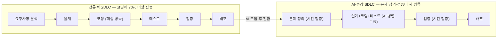
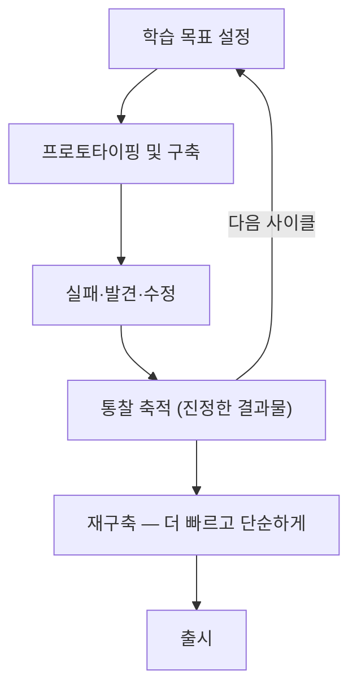
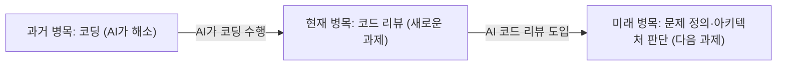
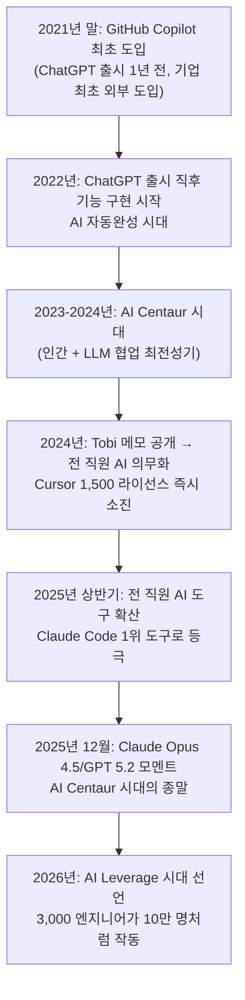
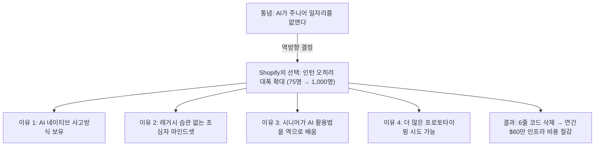
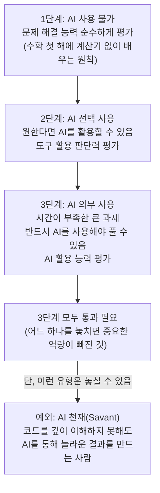
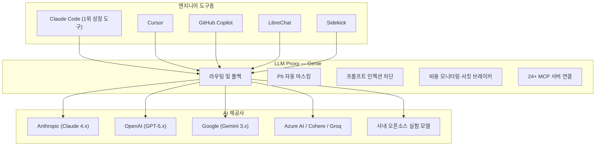
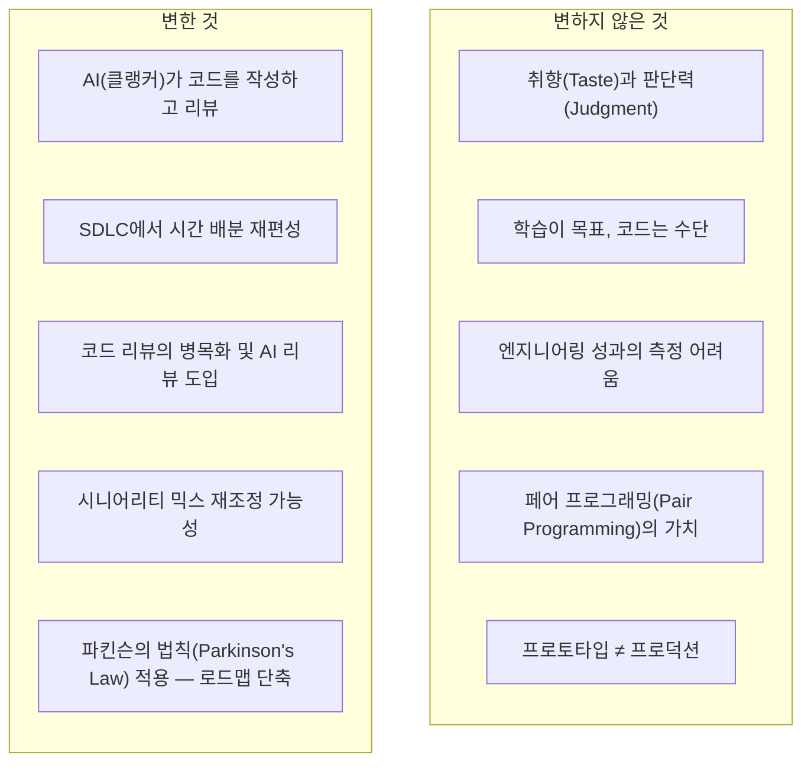

## Shopify 엔지니어링 AI 전략 완전 분석 — Farhan Thawar @ Compile 26

> **원본 출처**: Cursor 공식 YouTube 채널, "What Is Your Job Now, Farhan Thawar | Compile 26" (2026년 6월 25일 공개)  
> **발표자**: Farhan Thawar — Shopify VP & Head of Engineering  
> **보조 자료**: First Round Review "From Memo to Movement" (2025.07.15), Bessemer Venture Partners 인터뷰 (2026.04.09), Shopify Engineering 블로그 다수, VentureBeat Beyond the Pilot 팟캐스트 (2026.06)  
> **작성 일자**: 2026-06-29

---

## 목차

1. [들어가며 — 한 발표가 던진 근본적 질문](#1-들어가며)
2. [발표자 소개: Farhan Thawar와 Compile 26](#2-발표자와-compile-26)
3. [SDLC 패러다임의 대전환](#3-sdlc-패러다임의-대전환)
4. [학습이 진정한 결과물이다 — "Learning is the Collateral"](#4-학습이-진정한-결과물이다)
5. [보틀넥은 항상 이동한다 — Theory of Constraints](#5-보틀넥은-항상-이동한다)
6. [Shopify의 AI 여정: 2021년부터 현재까지](#6-shopify의-ai-여정)
7. [Tobi Lütke의 메모 — 조직 전체를 움직인 선언](#7-tobi-lütke의-메모)
8. [AI Centaur 시대의 등장과 종말](#8-ai-centaur-시대)
9. [AI Reflexivity에서 AI Leverage로](#9-ai-reflexivity에서-ai-leverage로)
10. [1,000명의 인턴 전략 — 역방향 멘토링과 문화 혁신](#10-1000명의-인턴-전략)
11. [Shopify가 AI와 일하는 5가지 핵심 원칙](#11-shopify-5가지-핵심-원칙)
12. [Shopify 내부 AI 인프라 전체 해부](#12-shopify-내부-ai-인프라)
13. [Context Engineering — Prompt Engineering을 넘어서](#13-context-engineering)
14. [변한 것과 변하지 않은 것](#14-변한-것과-변하지-않은-것)
15. [Farhan Thawar의 엔지니어링 철학 심화](#15-farhan-thawar의-엔지니어링-철학)
16. [Ruby on Rails 철학과 Shopify 기술 문화](#16-ruby-on-rails-철학)
17. [한국 대형 IT 기업에의 시사점](#17-한국-기업에의-시사점)
18. [결론 — 2026년, 엔지니어링의 새로운 의미](#18-결론)

---

## 1. 들어가며

2026년 6월 25일, Cursor가 주최한 개발자 컨퍼런스 Compile 26에서 Shopify의 엔지니어링 총책임자 Farhan Thawar가 무대에 올랐다. 그가 던진 첫 번째 질문은 단순하지만 묵직했다. "당신의 일은 이제 무엇입니까?" (What is your job now?)

이 질문이 특별한 이유는 발표 첫 순간 그가 트윗 하나를 화면에 띄우며 잠시 묵념을 요청했기 때문이다. 그 내용은 "지금까지 세상에 존재하는 모든 소프트웨어는 인간이 한 글자씩 직접 타이핑하여 만들어낸 것"이라는 사실에 대한 경이와 작별 인사였다. 우리가 사용하는 모든 운영체제, 데이터베이스, 웹 애플리케이션, 모바일 앱 — 그 방대한 코드들은 지금까지 한 문자씩 사람의 손으로 입력되어 왔다. 그러나 그 시대는 이제 끝나가고 있다는 것이 Thawar의 핵심 메시지였다.

이 문서는 그 발표를 중심으로, Shopify가 AI 시대를 어떻게 사전 준비하고, 어떤 내부 인프라를 구축했으며, 엔지니어의 역할이 실질적으로 어떻게 변화했는지를 다층적으로 분석한다. 동시에 Farhan Thawar의 엔지니어링 철학과 Shopify의 기술 문화 전반을 조망한다.

---

## 2. 발표자와 Compile 26

**Compile 26**은 AI 코딩 도구 Cursor가 주최하는 개발자 컨퍼런스로, 2026년에 개최된 이번 행사에서는 세계 주요 기술 기업의 엔지니어링 리더들이 AI 시대의 소프트웨어 개발 현황을 공유했다.

**Farhan Thawar**는 Shopify의 VP이자 Head of Engineering을 맡고 있다. 그는 Xtreme Labs, Pivotal Labs, Helpful 등에서 고성능 엔지니어링 팀을 구축한 경험이 풍부하며, 페어 프로그래밍(Pair Programming) 옹호자이자 채용 철학과 조직 문화에 대한 독창적인 관점으로 유명하다. Waterloo 대학교에서 수학을 전공하였으며, 이 경험이 그의 엔지니어링 사고방식 — 특히 "계산기를 사용하기 전에 먼저 손으로 푸는 법을 배워야 한다"는 철학 — 에 깊은 영향을 미쳤다.

Thawar는 Shopify가 2021년 GitHub Copilot을 기업 최초로 외부 도입할 때 "가격이 얼마든, go-to-market이 어떻든 상관없다. 어떻게든 Shopify에 넣어달라"고 요청한 사람이기도 하다. 이 선구자적 결정이 지금의 Shopify AI 문화를 만든 출발점이었다.

---

## 3. SDLC 패러다임의 대전환

Thawar가 발표에서 가장 먼저 제시한 것은 소프트웨어 개발 생명주기(SDLC, Software Development Life Cycle)에서 시간 배분이 어떻게 달라지는가에 대한 분석이었다.

전통적인 SDLC에서 엔지니어는 전체 개발 시간의 절반 이상을 코딩 자체에 쏟았다. 요구사항 수집, 설계, 테스트, 검증, 배포 등의 단계는 존재하지만 그 비중은 상대적으로 작았다. 그런데 AI가 코딩을 수행하기 시작하면서 이 시간 배분이 근본적으로 달라지고 있다.

AI-증강 SDLC에서는 코딩 단계 자체가 극적으로 압축된다. 대신 엔지니어가 가장 많은 시간을 쏟아야 하는 영역이 두 가지로 재편된다. 첫째는 **문제 정의(problem framing)** 단계다. 무엇을 왜 만들어야 하는지, 어떤 아키텍처가 적합한지, 10,000개의 가능한 좋은 해결책 중 어떤 경로를 선택할 것인지를 결정하는 작업이다. 둘째는 **검증(validation)** 단계다. AI가 생성한 코드가 실제로 의도한 대로 동작하는지, 프로덕션 품질을 갖추고 있는지를 검토하는 작업이다.

Thawar는 이 코딩 단계에서 두 가지 패턴이 병행된다고 설명한다. 하나는 **병렬 코딩(parallel coding)** 패턴으로, 하나의 큰 작업을 여러 서브태스크로 분해하고 각각에 AI 에이전트를 투입한 뒤 결과를 통합하는 방식이다. 실제로 Shopify의 시니어 엔지니어들은 이미 10개의 AI 에이전트를 동시에 돌리며 코드베이스의 다른 부분들을 병렬로 작업시키고 있다. 다른 하나는 **순차적 비판 루프(sequential critique loop)** 패턴으로, 하나의 AI와 45분 이상의 심층 추론 세션을 진행하면서 다른 모델로 그 결과를 검증하는 방식이다.

이 두 패턴 모두에서 엔지니어가 하는 일은 코드를 직접 타이핑하는 것이 아니다. 엔지니어는 어떤 방향으로 AI를 이끌지를 결정하고, 나온 결과를 판단하며, 최종적으로 책임을 지는 존재로 역할이 변하고 있다.

---

## 4. 학습이 진정한 결과물이다

발표에서 가장 깊은 인상을 남긴 에피소드 중 하나는 "학습이 진정한 결과물(Learning is the Collateral)"이라는 통찰을 보여주는 실제 사례였다.

Shopify에서 약 50명의 엔지니어로 구성된 팀이 18개월에 걸쳐 판매자(merchant)를 위한 기능을 개발했다. 출시를 목전에 두고 창업자이자 CEO인 Tobi Lütke에게 아키텍처 리뷰를 받았다. Tobi는 발표를 듣고 "훌륭하다. 출시하자"고 말했다. 그런데 회의실을 나서려는 팀에게 그가 한 가지 질문을 던졌다.

> "지금 다시 처음부터 만든다면 어떻게 만들겠습니까?"

팀원 중 한 명이 화이트보드 앞에 섰다. 그리고 18개월 동안 배운 것을 토대로, 훨씬 단순하고 우아한 완전히 다른 아키텍처를 그려냈다. Tobi의 반응은 예상 밖이었다. "그렇다면 그걸 만드세요."

팀은 18개월의 작업물을 실질적으로 폐기하고 새로 시작했다. 물론 코드를 물리적으로 삭제하지는 않았다. 그러나 참조는 허용하되 복사는 금지했다. 그 결과 동일한 기능을 단 3개월 만에 완성했으며, 아키텍처는 훨씬 단순하고 우아해졌다.

Tobi가 가르치려 했던 것은 이것이었다. 18개월 동안 만든 코드 자체가 결과물이 아니라, 그 과정에서 축적된 **학습이 진정한 결과물**이라는 것이다. 코드는 버릴 수 있지만 학습은 팀에 남는다. 그 학습을 바탕으로 훨씬 짧은 시간에 훨씬 나은 해결책을 만들 수 있다.

이 철학은 AI 시대에 더욱 강력한 의미를 갖는다. AI가 코드를 작성해줄 수 있기 때문에 프로토타이핑 비용이 극적으로 낮아졌고, 더 많은 것을 더 빠르게 시도하고 배울 수 있다. Thawar는 팀에게 "이번 주에 무엇을 출시했냐"가 아니라 "이번 주에 무엇을 배웠냐"를 묻는다고 강조한다. 학습이 목표이고, 출시는 그 수단이다.

이 통찰은 AI 시대에도 완전히 유효하며 오히려 더 중요해진다. AI는 코드를 쓰지만 판단하지 않는다. 무엇을 배워야 하고, 왜 이 방향이 맞는지를 결정하는 것은 여전히 인간의 몫이다.

---

## 5. 보틀넥은 항상 이동한다

Thawar는 엘리야후 골드랫(Eliyahu Goldratt)의 소설 《더 골(The Goal)》을 언급하며 "보틀넥은 항상 이동한다"는 원칙을 설명했다. 이 소설에서 공장장은 생산 흐름의 병목을 찾아 해소하면, 곧바로 또 다른 곳에서 새로운 병목이 나타나는 경험을 반복한다. 그는 보틀넥을 계속 해결하면서 공장 전체의 효율을 높인다.

현재 소프트웨어 개발에서 정확히 이 현상이 일어나고 있다는 것이 Thawar의 분석이다.

과거에는 코드를 한 줄씩 직접 작성하는 것이 가장 큰 병목이었다. AI가 이 병목을 해소하자, 이제 대량으로 생성되는 AI 코드를 어떻게 리뷰하느냐가 새로운 병목이 되었다. 그리고 코드 리뷰 문제가 해소되면, 또 다른 병목이 나타날 것이다. 아마도 그것은 '무엇을 만들어야 하는가'에 대한 깊은 판단력과 아키텍처 결정일 것이다.

중요한 것은 병목이 이동할 때마다 엔지니어에게 요구되는 역량이 달라진다는 점이다. 그러나 어느 단계에서든 **엔지니어의 취향(taste)과 판단력(judgment)** 은 핵심 역량으로 남는다. 이것이 Thawar가 강조하는 엔지니어의 본질적 가치다.

---

## 6. Shopify의 AI 여정

Shopify의 AI 도입 역사는 업계 전체에서 가장 이른 사례 중 하나다.

2021년 말, Thawar는 GitHub CEO를 "반쯤 협박하다시피" 설득해 아직 정식 출시도 안 된 GitHub Copilot을 Shopify에 처음으로 도입했다. 당시 이 도구의 가격도 정해지지 않았고 판매 모델도 없었다. 하지만 Thawar는 그것이 소프트웨어 개발을 완전히 바꿀 것임을 직감했다. ChatGPT가 등장하기 1년 전의 일이다. 이후 Shopify의 Copilot 채택률은 빠르게 80%를 넘었고, GitHub이 "어떻게 그렇게 빨리 채택률을 높였냐"며 오히려 역으로 묻기 시작했다.

2022년 ChatGPT 출시 이후 Shopify는 즉시 기능 개발에 활용했다. 2023-2024년은 Thawar가 "AI Centaur 시대"라고 명명한 최전성기로, 인간 개발자가 LLM과 깊이 협업하며 최고의 시너지를 냈다.

2024년에는 창업자 Tobi Lütke의 내부 메모가 공개되어 전 직원에게 AI 사용을 사실상 의무화했다. 그 후 Thawar가 Cursor 라이선스를 1,500개 구매했는데 첫 주에 모두 소진됐다. 흥미로운 점은 이를 가장 빠르게 채택한 그룹이 엔지니어나 데이터 과학자가 아니라 재무, 인사, 영업, 마케팅 팀이었다는 것이다. 비기술 직군이 Cursor를 통해 AI 에이전트와 상호작용하는 창구로 활용한 것이다.

현재 Shopify에서 엔지니어링 및 데이터 팀의 80% 이상이 AI 도구를 매일 사용하며, Claude Code가 Cursor, V0, Roo를 앞서며 가장 빠르게 성장하는 1위 도구가 되었다.

---

## 7. Tobi Lütke의 메모

Shopify AI 전환의 가장 강력한 촉매는 CEO Tobi Lütke가 작성한 내부 메모였다. 이 메모는 이후 외부에 공개되어 전 세계 기술 기업 임원들에게 큰 반향을 불러일으켰다. Thawar에 따르면 이 메모가 공개된 직후 수십 명의 CTO와 CEO가 문자를 보내 자기 회사 버전의 메모를 어떻게 쓰면 좋겠냐고 물었으며, Box, Fiverr, 심지어 캐나다 총리도 비슷한 내용의 성명을 발표했다.

메모의 핵심 내용을 요약하면 다음과 같다.

**① AI 사용은 이제 기본 기대치다:**  
"AI를 효과적으로 사용하는 것은 이제 Shopify 모든 구성원의 기본 기대치입니다. 오늘날 모든 분야의 도구이며, 중요성은 앞으로 더 커질 것입니다. AI 역량을 배우는 것에서 탈퇴하는 것은 불가능하다고 생각합니다. 그렇게 하고 싶다면 해도 좋지만, 솔직히 말해서 그것이 오늘도, 내일도 통할 것이라고 생각하지 않습니다. 정체는 거의 확실히 실패입니다. 오르지 않으면 내려가는 것입니다." — Tobi Lütke

**② 학습은 자기 주도적이지만, 배운 것은 공유해야 한다:**  
모든 최신 AI 도구에 대한 접근권을 주고, AI 역량을 월별 비즈니스 리뷰와 제품 개발 사이클에 통합한다. 승리(W)와 실패(L) 모두를 팀과 공유하는 문화를 만든다.

**③ AI 사용은 성과 평가에 반영된다:**  
성과 및 동료 평가 설문지에 AI 사용 관련 질문을 추가하며, 동료들이 서로의 "AI 네이티브" 또는 "AI 반사적" 수준을 평가한다.

**④ AI가 없다고 인력을 요청하면 안 된다:**  
추가 인력을 요청하기 전에 AI를 사용해서는 해결할 수 없는 이유를 먼저 증명해야 한다. 자율적 AI 에이전트가 이미 팀에 있다면 어떤 모습일지를 먼저 질문해야 한다.

이 메모의 의미는 단순히 "AI를 써라"가 아니다. **AI를 쓰지 않는 것이 사실상 조직 내에서 경쟁력을 잃는 것과 동일**하다는 문화적 선언이었다. 이 메모가 공개된 시점을 기준으로 Shopify 내부의 Cursor 사용량이 급격히 상승한 데이터가 실제로 확인되었다.

---

## 8. AI Centaur 시대

"AI Centaur"는 Thawar가 만든 용어다. 반인반마(半人半馬)의 신화 속 존재처럼, 인간의 두뇌와 LLM이 결합하여 둘 중 어느 하나보다 훨씬 강력한 결과를 만들어낸다는 개념이다.

Shopify는 2021년부터 2025년 초반까지 이 AI Centaur 시대를 살았다. 엔지니어가 LLM과 깊이 협업하면서 코드를 함께 짜고, 아이디어를 나누고, 최선의 방향을 함께 찾는 시기였다. AI는 강력한 도우미였고, 인간 엔지니어의 판단과 경험이 여전히 방향을 결정했다.

그런데 **2025년 12월**에 상황이 바뀌었다. Thawar는 이를 "Opus 4.5 모멘트, 또는 GPT 5.2 모멘트"라고 부른다. 전 세계 최고의 엔지니어들이 크리스마스 연휴 동안 최신 모델들을 집중적으로 사용하면서 공통된 결론에 도달했다. **"LLM이 나보다 코딩을 더 잘한다."**

이 순간이 중요한 이유는 기술적인 것이 아니라 심리적·철학적인 것이다. 엔지니어의 정체성은 오랫동안 "나는 코드를 쓰는 사람"이었다. IDE를 열고, 언어를 선택하고, 알고리즘을 설계하고, 한 자씩 타이핑하는 것이 그들의 핵심 역할이자 자부심의 원천이었다. 그런데 AI가 그 역할을 더 잘 수행한다면, 나의 역할은 무엇인가? 이 질문이 Thawar가 Compile 26에서 던진 "당신의 일은 이제 무엇입니까?"의 실질적 맥락이다.

Thawar의 답은 명확하다. AI가 코딩을 더 잘한다면, 엔지니어는 코딩이라는 병목에서 벗어나 파이프라인의 다른 영역으로 이동해야 한다. 그 영역은 취향(taste), 판단력(judgment), 문제 정의(problem framing), 아키텍처 결정, 고객 이해다.

---

## 9. AI Reflexivity에서 AI Leverage로

Thawar는 Shopify의 AI 전환을 두 단계로 구분한다.

**1단계: AI Reflexivity (AI 반사적 활용)**  
문제에 부딪혔을 때 즉각적으로 AI를 찾는 습관을 기르는 단계다. "문제를 만난 순간부터 AI를 꺼내 드는 순간까지의 거리를 최대한 짧게 만드는 것"이 목표다. 이 단계는 회사 전체가 AI 도구를 익숙하게 사용하도록 만드는 것에 집중한다.

**2단계: AI Leverage (AI 레버리지)**  
단순히 AI를 쓰는 것을 넘어, AI를 통해 가능해진 영역을 적극적으로 탐구하고 확장하는 단계다. Thawar는 이 단계에서 "나는 얼마나 게으를 수 있는가"를 자랑할 수 있어야 한다고 말한다. "이걸 5분 만에 만들었는데 예전이라면 5개월이 걸렸을 거야"라는 말을 당당히 할 수 있어야 한다는 것이다.

이 단계에서 Shopify는 "token maxing"이라는 현상을 경험했다. 사람들이 AI 토큰을 최대한 많이 사용하는 것을 일종의 경쟁이나 목표로 삼기 시작한 것이다. Shopify는 한때 내부 토큰 사용량 리더보드를 운영했다. 하지만 이 방식이 토큰 사용 자체를 목적으로 만들 수 있다는 문제를 인식하고, 이를 **사용량 대시보드**로 전환했다.

현재 Shopify는 토큰 사용에 어떠한 한도도 설정하지 않는다. 엔지니어 한 명이 한 달에 토큰 비용으로 1,000달러를 쓴다 해도 그것이 10%의 생산성 향상을 가져온다면 "너무 저렴한 것"이라는 것이 Thawar의 관점이다. 대신 **서킷 브레이커(circuit breaker)** 메커니즘을 운영한다. 에이전트가 예상치 못한 방향으로 폭주할 때 Slack 알림을 통해 "오늘 X달러를 사용했습니다. 계속하시겠습니까?"라고 확인을 요청한다. 이것은 한도가 아니라 **알림**이다. 엔지니어는 계속 진행하거나 중단하는 것을 선택할 수 있다.

사용량 대시보드에서 Shopify가 특별히 주목하는 지표는 **토큰의 단가**다. 단순히 많은 토큰을 쓰는 것이 아니라, 더 비싼 추론(reasoning) 토큰을 쓰는 사람들 — 즉 실제로 복잡한 문제를 AI로 해결하고 있는 사람들 — 에게 주목한다.

---

## 10. 1,000명의 인턴 전략

2024년 Shopify에는 75명의 인턴이 있었다. 2025년과 2026년에는 이 숫자가 **1,000명**으로 뛰었다. 이것은 사회공헌이나 인재 파이프라인 구축이 주목적이 아니었다.

Thawar의 이유는 역설적이다. "인턴들이 우리에게 일하는 법을 가르쳐주기를 바랐다."

2026년 졸업반은 대학 4년 전체를 ChatGPT 또는 동등한 AI 도구와 함께한 세대다. 이들에게 AI는 도구가 아니라 환경 그 자체다. 이들은 과거의 방식에 집착하는 학습된 습관이 없고, 당연하게도 AI를 최대한 활용하는 방식으로 문제를 접근한다. Thawar는 이들을 **"AI 네이티브 센토르(AI-native centaur)"** 라고 부른다.

Thawar가 든 실제 사례가 인상적이다. 한 인턴이 단 6줄의 코드를 삭제하는 것으로 Shopify의 인프라 비용을 연간 60만 달러(약 8억 원) 절감했다. 이 성과는 PR 수, 코드 라인 수, 또는 토큰 사용량 어떤 지표로도 측정되지 않는다. 이것이 바로 Thawar가 "스프레드시트로 엔지니어링 팀을 관리할 수 없다"고 말하는 이유다.

또한 Cloudflare도 1,000명 인턴 프로그램을 시작했고, AWS의 Matt Garman은 2026년에 무려 11,000명의 인턴을 채용했다. 업계 전반에서 이 "역발상" — AI 시대에 주니어를 줄이는 것이 아니라 늘리는 것 — 이 확산되고 있다.

---

## 11. Shopify가 AI와 일하는 5가지 핵심 원칙

Thawar는 Compile 26에서 Shopify가 AI를 운영 방식에 통합한 다섯 가지 핵심 원칙을 제시했다.

### 11.1 모델 선택: 최고 성능 모델만 허용

Shopify는 엔지니어들에게 **작거나 저렴한 모델의 사용을 허용하지 않는다.** 현재 기준으로 Opus 4.8 또는 GPT-5.5 xHigh 수준의 최상위 모델만 사용한다.

이유는 명확하다. **인간의 시간이 AI 토큰 비용보다 훨씬 비싸다.** 작은 모델을 써서 절약한 비용이 그 모델이 만들어낸 미묘한 버그를 찾고 디버깅하는 엔지니어 시간으로 소진된다. 더 비싼 모델을 쓰면 더 정확한 결과가 나오고 엔지니어의 시간이 절약된다. 새로운 모델이 출시되면 즉시 도입한다.

코드 리뷰를 위한 멀티-모델 앙상블에서는 각 역할에 최적화된 모델을 배치한다. 현재 운영 중인 구성은 다음과 같다:

| 역할 | 모델 | 추론 수준 |
|------|------|-----------|
| 메인 리뷰어 (일반) | openai:gpt-5.5 | xhigh |
| 전문가 트리아지/선택 | claude-haiku-4-5 | none |
| 전문가 기본값 | openai:gpt-5.4 | xhigh |
| 유지보수 태스크 전문가 | claude-opus-4-6 | xhigh |
| 접근성 전문가 | claude-sonnet-4-6 | medium |
| MCP 인증 전문가 | claude-haiku-4-5 | none |
| 평가 판사 (오프라인) | sonnet-4-6 · gpt-5.4 · gemini-3.1-pro | — |
| 속도 제한 폴백 | gpt-5.4 → opus-4-6 | — |

이것이 "멀티-모델 앙상블(multi-model ensemble, fine-tuning 없음)"의 실제 모습이다. 하나의 만능 모델이 아니라, 각 업무의 특성에 맞게 서로 다른 모델을 배치하는 접근 방식이다.

### 11.2 새로운 병목: 대규모 코드 리뷰

AI가 코드를 대량으로 생성하면서 코드 리뷰가 새로운 병목으로 부상했다. Thawar는 PR에서 자주 보이는 "LGTM(Looks Good To Me)"을 영어에서 가장 무서운 네 글자라고 표현했다. 사람이 실질적으로 코드를 검토하지 않고 승인하는 관행이 오래전부터 존재했지만, AI 생성 코드 시대에 이 문제는 더 심각해진다.

Shopify의 해법은 **LLM 위원회(Council of LLMs)** 다. 여러 모델이 코드의 서로 다른 측면을 검토한다. 접근성, 보안, 성능, 유지보수성, 컨벤션 준수 여부 등을 각각 다른 모델이 전담하는 방식이다. 여기에 과거 인시던트와 PR을 백테스트하여 "어떤 모델이나 프롬핑 기법으로 이 문제를 사전에 발견할 수 있었을까"를 지속적으로 학습한다.

결과는 놀랍다. 출시 볼륨이 증가하면서 절대적인 인시던트 수는 늘었지만, **볼륨 대비 인시던트 비율은 오히려 감소하고 있다.** Thawar의 예측은 이렇다: AI가 생성한 코드는 결국 사람이 작성한 코드보다 신뢰성이 높아질 것이다.

### 11.3 책임 원칙: 봇은 PR 소유자가 될 수 없다

Shopify에서 AI가 코드를 아무리 많이 작성해도 변하지 않는 원칙이 있다. **PR에는 반드시 사람의 이름이 붙는다.** AI가 코드를 작성했더라도 그 코드를 프로덕션에 보내는 책임은 사람에게 있다.

> "책임은 공유될 수 있지만, 위임될 수 없다(Responsibility can be shared, but it cannot be given away)."

AI를 PR에 공동 작성자로 태그하는 것은 허용되지만, AI가 PR 소유자가 되는 것은 허용하지 않는다. 이것은 법적·도덕적 책임의 문제이기도 하지만, 더 근본적으로는 엔지니어가 자신이 배포하는 코드를 진정으로 이해하고 있어야 한다는 가치관의 표현이다.

여기서 Thawar가 경고하는 것이 바로 **"이해 부채(Comprehension Debt)"** 다. AI가 생성한 코드를 이해하지 못한 채로 계속 배포하다 보면, 시스템에 대한 이해가 점점 엔지니어에게서 사라진다. 시스템이 고장났을 때 원인을 파악하거나 개선할 능력을 잃게 된다. Thawar는 엔지니어가 자신이 작업하는 레이어보다 **2~3단계 아래 수준까지는 이해하고 있어야 한다**고 강조한다.

### 11.4 AI 시대의 채용

AI 시대에 맞는 채용 방법에 대해 Shopify는 아직 확실한 답을 갖고 있지 않다고 솔직하게 인정한다. 그러나 현재 실험 중인 3단계 프레임워크가 있다.

이 3단계 접근법은 Thawar가 Waterloo 대학교 수학과 1학년 때 계산기 없이 공부하고 2학년 때 계산기를 허용받은 경험에서 영감을 받았다. 기반 원리를 먼저 이해한 후 도구를 도입해야 한다는 철학이다.

단, 이 프레임워크로도 포착하지 못하는 유형이 있다. 코드의 원리를 깊이 이해하지 못하지만 AI를 직관적으로 뛰어나게 활용하는 "AI 사반트(AI savant)"다. 체스 선수가 직관적으로 최선수를 두듯, 이런 사람들은 AI를 통해 탁월한 결과를 만들어낸다.

### 11.5 야망의 확장: Jevons Paradox와 반전 질문

Thawar는 경영진들로부터 자주 받는 질문이 있다고 소개한다. "AI가 있으니 개발팀을 100명에서 10명으로 줄일 수 있지 않을까요?" 그의 반응은 단호하다.

> "그것은 너무 야망이 없는 생각입니다. 우리는 반대로 생각합니다. 3,000명의 엔지니어가 10만 명처럼 행동할 수 있다면 어떨까요?"

이것은 **Jevons Paradox**의 적용이다. 19세기 경제학자 William Stanley Jevons는 기술 효율화가 오히려 자원 소비를 늘린다는 역설을 발견했다. 석탄을 더 효율적으로 사용하는 증기기관이 발명되자 석탄 소비량이 오히려 급증한 것처럼, AI로 개발 비용이 낮아지면 더 많은 것을 시도하고 더 야망 있는 목표를 추구하게 된다.

Shopify가 궁극적으로 해결하려는 문제는 세계에 더 많은 기업가를 만드는 것이다. 팀을 줄이는 것이 아니라 3,000명이 10만 명의 생산성을 내도록 만드는 것이 그들의 목표다.

---

## 12. Shopify 내부 AI 인프라

Compile 26 발표와 다수의 인터뷰를 통해 공개된 Shopify의 내부 AI 인프라는 단순한 도구 모음을 넘어선 체계적인 플랫폼이다.

### 12.1 LLM Proxy "Genie"

Shopify 내부 AI 인프라의 핵심은 **"Genie"** 라 불리는 내부 LLM 프록시다. Claude Code, Cursor, GitHub Copilot을 포함한 모든 AI 요청이 이 단일 게이트웨이를 통과한다. Genie가 하는 일은 다음과 같다.

첫째, **동적 라우팅**이다. 요청의 성격에 따라 OpenAI, Anthropic, Google, Cohere 등 서로 다른 제공사의 모델로 라우팅한다. 한 제공사가 다운되거나 속도 제한에 걸리면 자동으로 폴백 모델로 전환한다. 덕분에 엔지니어는 특정 제공사의 장애에 영향받지 않고 AI를 계속 사용할 수 있다.

둘째, **보안 처리**다. 프롬프트에서 개인식별정보(PII)를 자동으로 마스킹하고, 악의적인 프롬프트 인젝션을 탐지·차단한다. 출력값의 사실 기반 여부를 검증하는 메커니즘도 연구·적용 중이다.

셋째, **내부 데이터 접근**이다. 24개 이상의 MCP(Model Context Protocol) 서버가 Genie에 연결되어 있으며, 이를 통해 Jira, Slack, GitHub, 사내 PM 시스템, 데이터 웨어하우스 등 내부 도구의 데이터에 AI가 접근할 수 있다. Thawar는 "모든 것을 MCP로 연결하라(MCP everything)"는 원칙을 강조한다.

### 12.2 River: 공개 채널 전용 AI 에이전트

**River**는 Shopify가 내부적으로 구축한 AI 코딩 에이전트로, Slack 안에서 동료처럼 일한다. River는 코드를 읽고 쓰고, 테스트를 실행하고, PR을 열고, 데이터 웨어하우스를 쿼리하고, 프로덕션 트레이스를 검사한다. 100개 이상의 도구를 갖추고 있다.

River의 가장 독특한 설계 원칙은 **"공개 채널 전용"** 이다. River는 DM에 응답하지 않는다. 오직 공개 Slack 채널에서만 작동한다. 이 제약은 의도적이다. AI의 작업 과정과 결과가 모든 구성원에게 가시적이 됨으로써, 조직 전체가 River의 행동에서 배우고 수정하며 집단 학습이 이루어진다. 한 엔지니어가 River를 교정하면 모든 사람이 그 교정 과정을 볼 수 있다.

도입 초기 River의 PR 병합률은 36%였다. 두 달 후 77%로 상승했다. 조직 전체의 집단적 수정과 개선 덕분이다.

### 12.3 Roast: 오픈소스 AI 워크플로우 오케스트레이션

**Roast**는 Shopify가 자체 개발한 후 2025년 6월 오픈소스로 공개한 AI 워크플로우 오케스트레이션 프레임워크다. Ruby on Rails의 철학인 "Convention over Configuration(설정보다 관례)"을 AI 워크플로우에 적용했다.

Roast가 해결하는 핵심 문제는 AI의 비결정론적 특성이다. AI는 단독으로 복잡한 다단계 작업을 처리할 때 쉽게 궤도를 이탈한다. Roast는 복잡한 작업을 작은 단계들로 분해하고, 각 단계에서 결정론적 도구와 AI를 조합한다. 각 단계에서 AI의 추론 과정이 기록되므로, 엔지니어는 AI가 왜 그런 결론에 도달했는지 추적할 수 있다.

실제 활용 사례는 단위 테스트 분석이다. Shopify는 수천 개의 테스트 파일을 Roast로 분석하여 플래키 테스트와 낮은 테스트 커버리지를 자동으로 식별하고 수정했다. **사람이 검토하는 것이 아니라 AI가 AI의 작업을 보여주고, 엔지니어가 결과를 비판적으로 평가한다.**

Roast는 Claude Code와 깊이 통합되어 있다. CodingAgent는 Roast의 구조적 가이드라인 안에서 Claude Code의 탐색적 문제 해결 능력을 활용한다. 결정론적 도구와 AI의 조합이 생산 시스템에서 AI를 신뢰할 수 있게 만드는 핵심 패턴이라고 Shopify는 강조한다.

### 12.4 Universal Distillation Platform (UDP)

Shopify는 LLM 사용 비용을 2배에서 30배까지 줄이는 내부 플랫폼 **UDP(Universal Distillation Platform)** 를 운영한다. 이 플랫폼은 프런티어 모델(예: Claude Opus 4.x, GPT-5+)이 특정 좁은 업무를 수행하는 방식을 학습하여, 오픈소스 소형 모델(예: Qwen 계열)을 파인튜닝한다. 이 과정은 약 하루 만에 완료되며 평가(eval)가 내장되어 있다.

놀라운 점은 특정 좁은 업무에서 이렇게 증류된 소형 모델이 **원래 프런티어 모델보다 정확도, 속도, 비용 모두에서 우수한 경우**가 생긴다는 것이다. 업무가 명확하게 정의될수록 전문화의 효과가 크다.

이것은 "항상 최고 모델을 사용하라"는 원칙과 모순처럼 보인다. 하지만 해석의 차이가 있다. **개발 과정에서 엔지니어가 사용하는 도구**는 최고 모델이어야 하지만, **반복적으로 실행되는 프로덕션 태스크**는 증류된 전문 모델이 더 효율적일 수 있다.

### 12.5 Quick: 내부 AI 호스팅 플랫폼

**Quick**은 2025년 7월 출시된 Shopify 내부 호스팅 플랫폼이다. 폴더를 드롭하면 Shopify 직원만 접근할 수 있는 보안 URL을 즉시 발급한다. 프레임워크도, 배포 파이프라인도, 설정 파일도 필요 없다. 데이터베이스, AI, 파일 스토리지, 웹소켓은 API 호출 하나로 사용 가능하다.

현재 Quick에는 50,000개 이상의 사이트가 호스팅되어 있으며, Shopify 전 직원의 절반 이상이 최소 하나의 사이트를 만들었다. AI가 HTML을 생성해주면 Quick이 안전하게 배포해준다. 대시보드, 프로토타입, 개발 도구, 프레젠테이션에 활용된다.

---

## 13. Context Engineering

발표 말미에 Thawar는 Tobi Lütke가 소셜 미디어에서 표현한 개념을 언급했다. **"Context Engineering"** — Prompt Engineering보다 더 정확하게 본질을 표현하는 용어다.

> "프롬프트 엔지니어링보다 컨텍스트 엔지니어링이라는 용어가 더 적절합니다. 이 용어가 핵심 역량을 더 잘 설명합니다. LLM이 해당 작업을 합리적으로 해결할 수 있도록 필요한 모든 맥락을 제공하는 기술입니다." — Tobi Lütke

Prompt Engineering이 "올바른 질문을 하는 기술"이라면, Context Engineering은 "LLM이 최고의 결과를 낼 수 있도록 작업에 필요한 모든 배경 정보, 도구, 예시, 제약조건을 체계적으로 구성하는 기술"이다.

Shopify의 실제 사례를 보면 이 차이가 명확하다. 매주 프로젝트 챔피언들이 업데이트를 작성해야 한다. 이 과정에서 Shopify는 GitHub PR, 문서, 댓글, GitHub 이슈, Slack 채널의 정보를 AI 에이전트가 자동으로 수집하여 초안 업데이트를 만들어 준다. 그런 다음 프로젝트 챔피언에게 이 초안을 비판적으로 검토하고 개선하도록 요청한다.

흥미로운 결과가 나타났다. **AI가 작성한 업데이트의 절반이 인간의 수정 없이 그대로 사용되고 있다.** AI가 충분한 컨텍스트를 확보하고 있기 때문이다. 그리고 인간은 자신의 가장 중요한 역할 — 불일치를 찾아내고 위험을 드러내는 것 — 에 집중할 수 있다.

Context Engineering을 체계적 실천으로 만드는 것이 2026년 AI 활용의 핵심 역량이라는 것이 Shopify의 관점이다.

---

## 14. 변한 것과 변하지 않은 것

Thawar는 발표 마지막에 무엇이 변했고 무엇이 변하지 않았는지를 명확히 구분해 제시했다.

**변한 것들:**

AI — Thawar가 "클랭커(clanker)"라고 부르는 — 는 이제 코드를 작성하고 리뷰한다. 이것은 거스를 수 없는 현실로 받아들여야 한다. SDLC 전반에서 엔지니어가 시간을 쓰는 곳이 달라졌다. 코드 리뷰는 새로운 병목이 되었고, AI 도구가 이를 보조한다. 시니어리티 믹스를 재조정하는 것도 가능해졌다 — 주니어 인턴을 더 많이 채용하거나, 더 많은 미드레벨 또는 시니어를 채용하는 결정은 조직마다 다를 수 있다.

파킨슨의 법칙(Parkinson's Law) — "주어진 시간만큼 일은 늘어난다" — 는 AI 시대에 새로운 의미를 갖는다. 로드맵이 6개월이 아니라 1개월, 1주일, 심지어 하루 단위로 압축될 수 있다. Shopify는 이제 "로드맵의 끝이 보이기 시작했다"고 말한다.

**변하지 않은 것들:**

가장 먼저 **취향과 판단력**이다. "무엇을 만들어야 하는가?" "왜 이것이 필요한가?" "10,000개의 좋은 해결책 중 어떤 것이 가장 좋은가?" — 이 질문들에 대한 답은 AI가 해줄 수 없다. 사람만이 할 수 있다.

**학습이 목표**라는 것도 변하지 않는다. 코드를 얼마나 빨리 출시했느냐보다 무엇을 배웠느냐가 더 중요하다. 오히려 AI가 개발 속도를 높여주기 때문에 학습 사이클도 빨라질 수 있다.

**엔지니어링 성과의 측정 어려움**도 변하지 않는다. PR 수, 코드 라인 수, 토큰 사용량 — 어떤 지표도 "이 엔지니어가 훌륭한가"를 단독으로 측정하지 못한다. 6줄 삭제로 60만 달러를 절약한 인턴의 가치는 어떤 스프레드시트도 포착하지 못한다.

**페어 프로그래밍(Pair Programming)의 가치**도 변하지 않는다. 두 명의 인간이 LLM과 함께 작업할 때, 혼자 LLM과 작업하는 것보다 더 많은 것을 배운다. 계획 단계와 검증 단계에서 인간 대 인간의 협업은 여전히 고유한 가치를 갖는다.

마지막으로 **"프로토타입은 프로덕션이 아니다"** 도 변하지 않는다. CEO가 5분 만에 뭔가를 만들어 "왜 팀이 한 달이나 걸렸냐"고 물을 수 있다. 그러나 프로토타입과 프로덕션 품질 코드 사이의 간극 — 예외 처리, 권한 관리, 로깅, 장애 복구, 장기 유지보수 — 은 AI 시대에도 여전히 존재한다.

---

## 15. Farhan Thawar의 엔지니어링 철학

Compile 26 발표 외에도 Thawar의 엔지니어링 철학은 다수의 인터뷰와 강연을 통해 체계적으로 문서화되어 있다. 핵심을 영역별로 정리하면 다음과 같다.

### 채용 철학

Thawar는 전통적인 기술 인터뷰가 실제 업무 성과를 예측하는 데 효과적이지 않다고 오랫동안 주장해왔다. "인터뷰를 잘하는 사람"과 "실제 일을 잘하는 사람"은 다를 수 있다. 알고리즘 문제나 화이트보드 코딩보다는 실제 업무 환경과 유사한 상황에서의 성과를 평가하는 것이 더 정확하다.

그는 후보자의 경력 궤적과 어떤 이유로 어떤 결정을 내려왔는지에 깊은 관심을 갖는다. 의도적으로 어려운 길을 선택한 경험, 실패 후의 학습 방식, 내재적 동기가 무엇인지를 탐색한다. 비기술 분야 배경(예: 서비스업)에서 "강도(intensity)"와 빠른 학습 능력을 갖춘 인재를 발굴하는 것도 그의 특기다.

모든 엔지니어링 디렉터 이상 직급의 채용에는 코딩 인터뷰가 포함된다. 리더가 기술을 여전히 사랑하고 있어야 한다는 신념 때문이다.

### 페어 프로그래밍(Pair Programming)

Thawar는 페어 프로그래밍(Pair Programming)을 "자유투의 언더핸드 방식"에 비유한다. 통계적으로 더 효과적이지만 이상하게 보인다는 이유로 많이들 하지 않는다. 연구에 따르면 페어 프로그래밍(Pair Programming)은 약 15%의 오버헤드를 요구하지만 그 대가로 더 나은 아키텍처, 지식 공유, 더 높은 엔지니어 만족도, 더 적은 버그, 더 높은 품질, 더 빠른 출시 시간을 얻을 수 있다.

Xtreme Labs에서 그는 직원 1,000명을 4년 동안 채용하면서 모두 페어 프로그래밍(Pair Programming)만 하도록 했다. 데스크탑 컴퓨터를 두 명당 하나씩만 배치하여 선택의 여지가 없었다. 지식 사일로를 없애고, 온보딩을 가속하고, 팀 전체의 집단 지성을 높이는 효과가 있었다.

### 미팅 아마게돈(Meeting Armageddon)

Thawar는 조직 전체의 반복 회의를 일시에 삭제하는 "미팅 아마게돈"을 주기적으로 실행한다. 회의를 추가하는 것은 사회적으로 쉽지만 취소하는 것은 매우 어렵기 때문에, 리더십이 강제적으로 "감산"을 해야 한다는 것이다. 회의를 지운 후 2주간 의무적 모라토리엄을 두고, 팀이 회의 없이 어떻게 적응하는지 경험하게 한다. 이 과정에서 정말 필요한 회의와 그렇지 않은 회의를 구분할 수 있다.

"미팅이 너무 많다는 것은 신뢰 부족, 불명확한 목표, 또는 내부 API의 부재 등 더 깊은 조직적 문제의 증상"이라는 것이 그의 진단이다.

### 신뢰 배터리(Trust Battery)

모든 동료 간의 모든 상호작용은 신뢰 배터리를 충전하거나 방전시킨다. 신뢰 배터리가 충전되면 의사결정이 즉각적이고, 방전되면 모든 것에 회의와 승인과 문서가 필요하다. 신뢰는 팀빌딩 행사가 아니라 일관된 고품질 결과물과 성실한 행동으로만 충전된다.

### 학습과 강도

Thawar는 시간보다 에너지를 중시한다. "몇 시간 책상에 앉아 있었느냐"보다 "시간당 얼마나 많은 에너지(킬로줄)를 문제에 쏟았느냐"가 중요하다. 어려운 길을 의도적으로 선택하고, 실패하더라도 더 똑똑한 사람들과 함께 일했다면 그것 자체가 승리라는 것이 그의 철학이다.

---

## 16. Ruby on Rails 철학과 Shopify 기술 문화

Shopify는 세계 최대 규모의 Ruby on Rails 모노리스 애플리케이션을 운영한다. Shopify의 기술 철학은 Rails 창시자 DHH(David Heinemeier Hansson)가 정립한 Rails Doctrine에 깊이 뿌리내리고 있으며, 이는 AI 도구 도입 방식에도 영향을 미친다.

**Convention over Configuration(설정보다 관례)**: Rails는 반복적인 결정들을 관례로 해결함으로써 개발자가 실제 중요한 문제에 집중할 수 있게 한다. Shopify의 AI 인프라도 이 철학을 따른다. LLM 프록시, MCP 서버, Roast 프레임워크 모두 "이렇게 하면 된다"는 관례를 제공함으로써 개발자들이 AI 인프라 설정이 아닌 비즈니스 문제에 집중할 수 있도록 한다.

**모노리스 선호**: 마이크로서비스가 유행할 때도 Shopify는 의도적으로 모노리스를 유지했다. 분산 시스템이 가져오는 복잡성과 오버헤드를 피하고, 하나의 코드베이스 안에서 모든 것을 이해할 수 있는 구조를 선호했다. AI 시대에 이 선택은 더 중요해진다. 모든 컨텍스트가 한 곳에 있어야 AI가 제대로 이해하고 지원할 수 있기 때문이다.

**인프라 우선 투자**: "2주 만에 피처를 만들 수도 있고, 2개월 투자해서 그 피처를 1시간 만에 만드는 인프라를 구축할 수도 있다면, 나는 항상 후자를 선택한다"는 것이 Thawar의 원칙이다. LLM 프록시, MCP 서버, Roast, UDP 모두 이 원칙의 실천이다.

---

## 17. 한국 대형 IT 기업에의 시사점

Shopify의 AI 전환 사례는 한국의 대형 SM/SI IT 기업과 통신사 BSS/OSS 운영 조직에도 중요한 시사점을 제공한다.

**① 법무·보안의 '기본값 Yes' 문화**: Thawar는 Shopify 법무팀이 AI 도구 도입 논의 시 "어떻게 안전하게 할 수 있을까"를 기본 질문으로 삼는다고 강조했다. 한국의 많은 조직에서는 보안이나 규정 준수를 이유로 AI 도구 도입이 막히는 경우가 많다. 경영진이 "어떻게 하면 할 수 있는가"를 먼저 묻는 문화를 만드는 것이 선행 조건이다.

**② 망분리 환경에서의 LLM Proxy**: 공공기관 및 통신사의 망분리 환경에서는 외부 AI API 직접 호출이 제한된다. Shopify의 Genie와 같은 내부 LLM 프록시 구조는 이 문제를 해결하는 효과적인 아키텍처다. 모든 외부 API 호출을 프록시로 집중하고, PII 마스킹과 보안 검증을 프록시 레이어에서 처리하는 구조를 적용할 수 있다.

**③ 학습을 KPI로**: 한국 대기업의 성과 관리 시스템은 코드 라인 수, 처리한 티켓 수, 출시한 기능 수 등 산출물 중심이다. Shopify의 사례처럼 "이번 분기에 무엇을 배웠는가"를 평가 항목으로 포함시키는 문화적 전환이 필요하다.

**④ 인턴과 주니어의 재발견**: AI 시대에 주니어 인력을 줄이는 것은 역방향이다. AI 네이티브 사고방식을 가진 신입사원이 오히려 AI 활용의 최전선에 있을 수 있다. 역멘토링 구조를 통해 시니어가 주니어의 AI 활용 방식에서 배우는 문화를 만들 수 있다.

**⑤ 프로토타입과 프로덕션의 명확한 구분**: AI로 빠른 프로토타입이 가능해지면서 "왜 이걸 바로 프로덕션에 올리면 안 되냐"는 요구가 증가한다. 기업 내부에서 프로토타입과 프로덕션 품질의 차이를 명확히 교육하고, 프로토타입 코드를 삭제하고 재작성하는 규율을 정착시키는 것이 중요하다.

---

## 18. 결론

Farhan Thawar가 Compile 26에서 던진 질문 — "당신의 일은 이제 무엇입니까?" — 에 대한 답은 발표 전체를 통해 점진적으로 드러난다.

**AI가 코드를 더 잘 작성한다면, 엔지니어는 코드를 작성하는 사람이 아니어야 한다.** 엔지니어는 AI를 조종하는 사람, 문제를 깊이 정의하는 사람, 나온 결과를 판단하는 사람, 아키텍처의 방향을 결정하는 사람, 고객과 시간을 보내며 진짜 필요를 이해하는 사람이 되어야 한다.

이것이 역할의 '격하'가 아니다. Thawar가 말하는 것은 정반대다. AI가 단순 반복 작업을 대신해주기 때문에 엔지니어는 더 중요한 일, 더 야망 있는 목표, 더 심층적인 문제 해결에 집중할 수 있다.

Shopify는 이 전환을 가장 앞서서 경험하고 실천한 기업 중 하나다. 2021년 Copilot 최초 도입부터 시작하여, 1,000명의 AI 네이티브 인턴 채용, 내부 LLM 프록시 Genie, 공개 채널 전용 에이전트 River, 오픈소스 워크플로우 프레임워크 Roast, Universal Distillation Platform, 그리고 전 직원이 사용하는 내부 호스팅 플랫폼 Quick에 이르기까지 — Shopify의 AI 인프라는 단순한 도구 채택이 아니라 조직 운영 방식의 근본적 재설계다.

그리고 그 모든 변화의 중심에는 하나의 불변하는 원칙이 있다.

> **학습이 진정한 결과물이다. 코드는 언제든 삭제할 수 있지만, 배움은 남는다.**

이것이 AI 시대 엔지니어의 역할이고, Shopify가 보여주는 AI 시대 엔지니어링의 본질이다.

---

## 참고 자료

- Farhan Thawar, "What Is Your Job Now?" — Compile 26, Cursor YouTube Channel (2026.06.25)  
  https://www.youtube.com/watch?v=ByOF8qByGHU
- First Round Review, "From Memo to Movement: The non-obvious insights, tactics and workflows Shopify used to bring an ambitious memo to life" (2025.07.15)  
  https://www.firstround.com/ai/shopify
- Bessemer Venture Partners, "Inside Shopify's AI-First Engineering Playbook" (2026.04.09)  
  https://www.bvp.com/atlas/inside-shopifys-ai-first-engineering-playbook
- VentureBeat, "Small Models, Massive Wins: Shopify's New AI Formula" (2026.06.27)  
  https://venturebeat.com/video/small-models-massive-wins-shopifys-new-ai-formula
- Shopify Engineering, "Introducing Roast: Structured AI workflows made easy" (2025.06.18)  
  https://shopify.engineering/introducing-roast
- Shopify Engineering, "Quick: An internal hosting platform for the AI era" (2026.06)  
  https://shopify.engineering/quick
- GitHub: Shopify/roast — https://github.com/Shopify/roast
- ZenML LLMOps Database, "Shopify: Building a Public AI Agent Workspace for Organizational Learning"
- Antoine Buteau, "Lessons from Farhan Thawar" (2026.04.18)  
  https://www.antoinebuteau.com/lessons-from-farhan-thawar/
- Ruby on Rails Doctrine — https://rubyonrails.org/doctrine
- @0xCristal on X (Twitter), 2026.06.25 thread on Compile 26 summary

---

*작성 일자: 2026-06-29*
