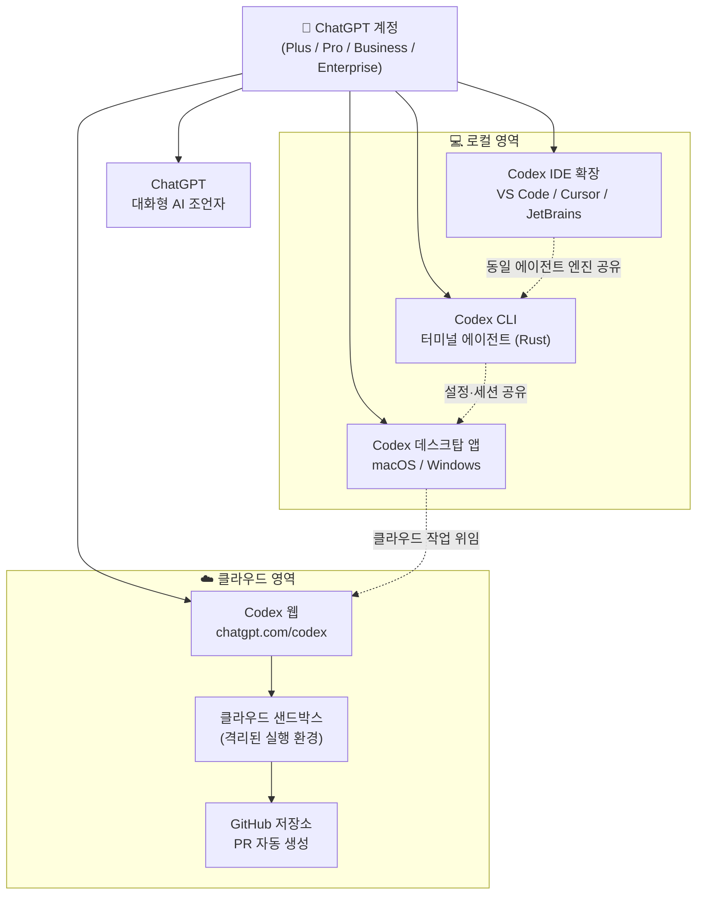
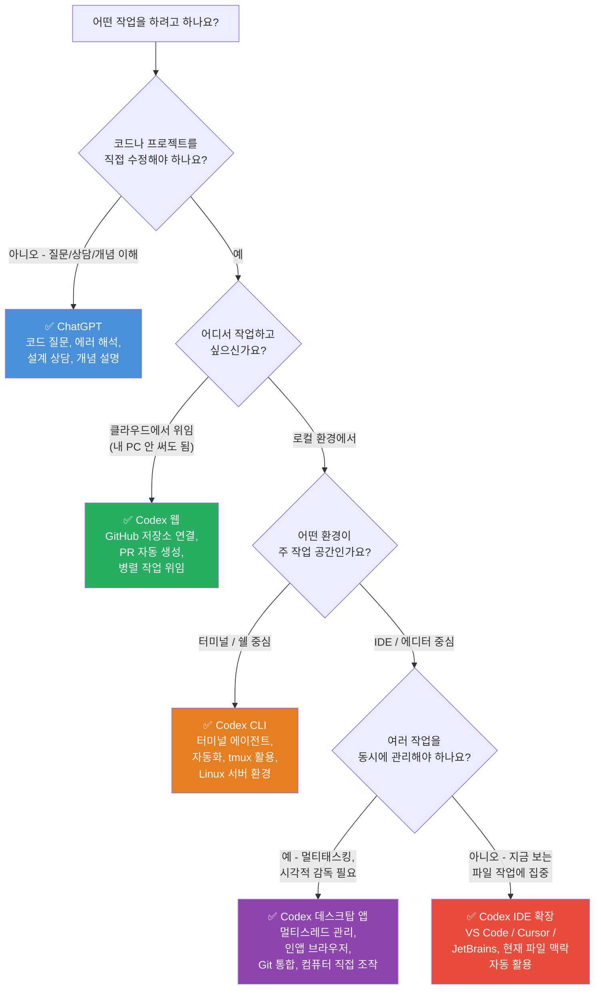
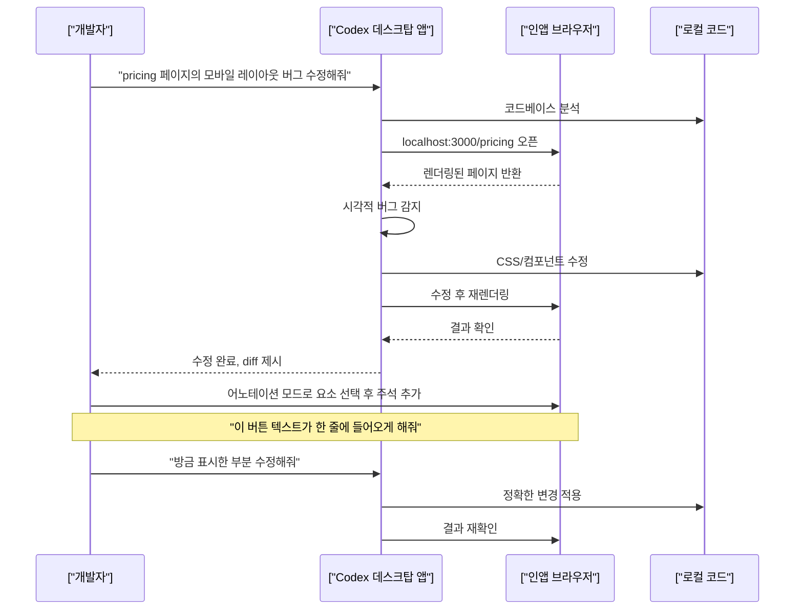
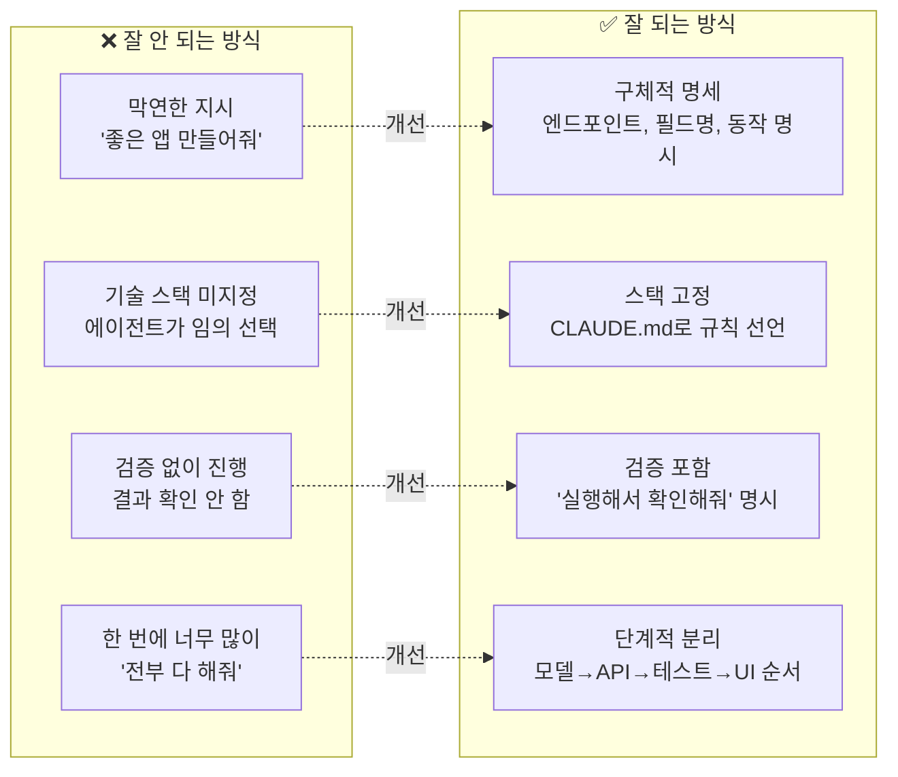
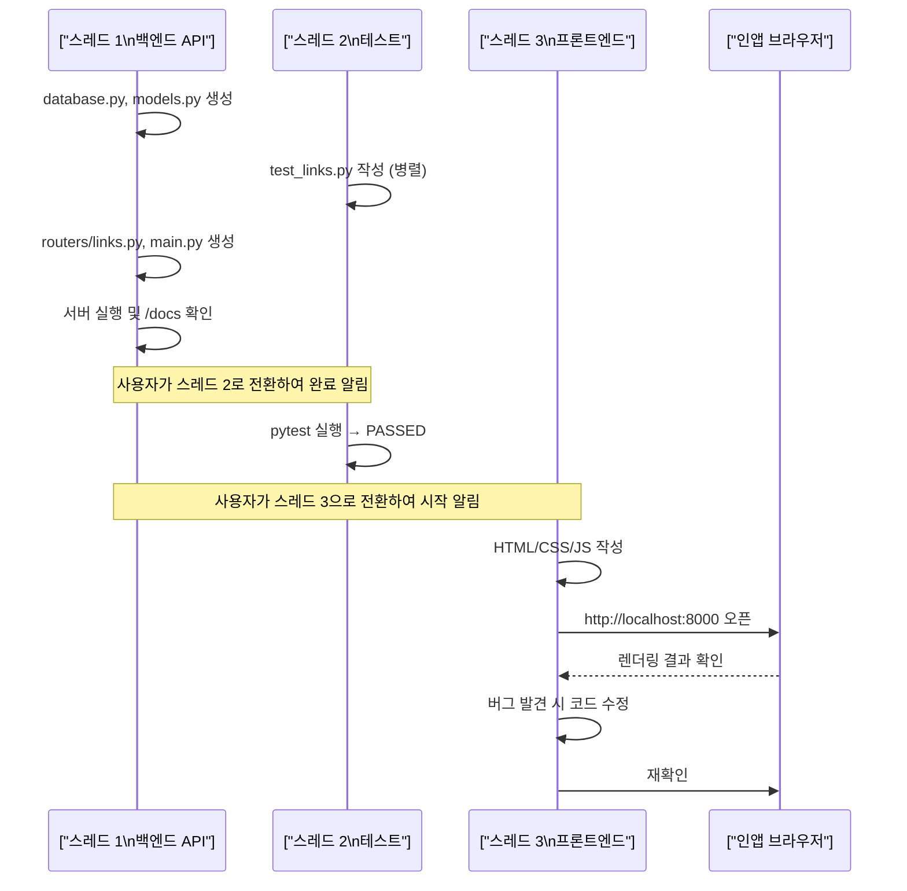

> 원문 출처: [@caffeine__coder on Threads](https://www.threads.com/@caffeine__coder/post/DaGL-tEEz5Q)  
> 기반 정보: OpenAI 공식 문서 및 2026년 6월 기준 최신 정보 반영

---

## 목차

1. [들어가며: 왜 이렇게 헷갈리는가](#1-들어가며-왜-이렇게-헷갈리는가)
2. [OpenAI Codex란 무엇인가: 개념과 역사](#2-openai-codex란-무엇인가-개념과-역사)
3. [전체 생태계 조감도](#3-전체-생태계-조감도)
4. [인터페이스 1: ChatGPT — 대화형 AI 조언자](#4-인터페이스-1-chatgpt--대화형-ai-조언자)
5. [인터페이스 2: Codex 웹 — 클라우드 작업 위임 플랫폼](#5-인터페이스-2-codex-웹--클라우드-작업-위임-플랫폼)
6. [인터페이스 3: Codex 데스크탑 앱 — 에이전트 지휘 센터](#6-인터페이스-3-codex-데스크탑-앱--에이전트-지휘-센터)
7. [인터페이스 4: Codex CLI — 터미널 기반 코딩 에이전트](#7-인터페이스-4-codex-cli--터미널-기반-코딩-에이전트)
8. [인터페이스 5: Codex IDE 확장 — 에디터 내장 에이전트](#8-인터페이스-5-codex-ide-확장--에디터-내장-에이전트)
9. [5가지 인터페이스 통합 비교표](#9-5가지-인터페이스-통합-비교표)
10. [상황별 인터페이스 선택 가이드](#10-상황별-인터페이스-선택-가이드)
11. [프론트엔드 UI 개발: CLI의 한계와 해법](#11-프론트엔드-ui-개발-cli의-한계와-해법)
12. [프로젝트 초기 구조 설계의 중요성](#12-프로젝트-초기-구조-설계의-중요성)
13. [AI 출력 검증 문제: 스모크 테스트의 함정](#13-ai-출력-검증-문제-스모크-테스트의-함정)
14. [맺음말](#14-맺음말)
- [부록 A: Claude Code로 서비스 앱 만들기 — 실전 프롬프트 가이드](#부록-a-claude-code로-서비스-앱-만들기--실전-프롬프트-가이드)
- [부록 B: Codex로 서비스 앱 만들기 — 인터페이스별 실전 프롬프트 가이드](#부록-b-codex로-서비스-앱-만들기--인터페이스별-실전-프롬프트-가이드)
- [참고 자료](#참고-자료)

---

## 1. 들어가며: 왜 이렇게 헷갈리는가

Threads 개발자 커뮤니티에서 자주 올라오는 질문이 있다. "ChatGPT로 코딩하는 것과 Codex로 코딩하는 것이 뭐가 다른가요?", "Codex 웹이랑 데스크탑 앱은 같은 건가요?", "터미널에서 쓰는 CLI는 또 다른 건가요?" 이런 질문들이 반복되는 이유는 단순하다. OpenAI가 'Codex'라는 이름을 서로 다른 맥락에서 여러 차례 재사용해왔기 때문이다.

2021년에 출시되어 GitHub Copilot의 초기 버전을 구동하던 것도 'Codex'였고, 2023년에 폐기된 API 모델도 'Codex'였으며, 2025년부터 재출범한 클라우드 기반 소프트웨어 엔지니어링 에이전트도 'Codex'다. 이름은 같지만 전혀 다른 제품이다.

2026년 현재 기준으로 'Codex'는 OpenAI가 개발한 **코딩 에이전트 플랫폼의 총칭**이며, 이 플랫폼 위에서 작동하는 인터페이스가 크게 다섯 가지로 나뉜다. ChatGPT, Codex 웹, Codex 데스크탑 앱, Codex CLI, 그리고 Codex IDE 확장이다. 이 다섯 가지는 모두 같은 ChatGPT 계정으로 연동되지만, 설계 철학과 최적 사용 상황이 전혀 다르다.

이 문서는 각 인터페이스가 무엇인지, 어떻게 다른지, 어떤 상황에서 무엇을 골라야 하는지를 최신 공식 정보를 기반으로 상세히 설명한다.

---

## 2. OpenAI Codex란 무엇인가: 개념과 역사

### 현재의 Codex가 탄생한 배경

현재 존재하는 Codex는 2025년 5월 처음 공개된 **클라우드 기반 소프트웨어 엔지니어링 에이전트**를 출발점으로 한다. 초기에는 ChatGPT 사이드바에서 접근하는 방식으로만 제공되었고, 코드 저장소를 클라우드 샌드박스 환경에 불러와 파일을 읽고 수정하며 테스트를 실행하는 방식으로 작동했다.

이후 OpenAI는 Codex를 단순한 코드 생성 도구에서 **개발자의 전체 워크플로를 포괄하는 에이전트 플랫폼**으로 확장하기 시작했다. Codex CLI가 공개소프트웨어(오픈소스)로 공개되었고, 2026년 2월 2일에는 macOS용 데스크탑 앱이, 3월 4일에는 Windows 버전이 출시되었다. 4월 16일에는 컴퓨터 직접 조작(Computer Use), 인앱 브라우저, 90개 이상의 플러그인을 포함한 대규모 업데이트가 이루어졌다.

### 현재 Codex를 구동하는 모델

2026년 6월 기준으로 Codex를 구동하는 주요 모델은 **GPT-5.5**이며, 가볍고 빠른 작업에는 **GPT-5.4 mini**를 선택할 수 있다. GPT-5.4 mini는 GPT-5.4 대비 30%의 크레딧만 소비하면서 유사한 작업을 약 3.3배 더 오래 처리할 수 있어, 코드베이스 탐색이나 대용량 파일 검토 같은 비교적 단순한 서브에이전트 작업에 적합하다. ChatGPT Pro 구독자에게는 **GPT-5.3-Codex Spark**라는 코딩 특화 고속 모델도 연구 프리뷰로 제공된다.

### 요금제와 접근 조건

Codex는 ChatGPT Free, Go, Plus, Pro, Business, Edu, Enterprise 요금제 모두에서 접근할 수 있다. 단, 요금제별로 사용량 한도와 이용 가능한 기능 범위가 다르며, 본격적인 아젠틱 작업(장시간 실행, 대형 코드베이스 처리 등)에는 유료 요금제가 필요하다. Codex의 사용량은 ChatGPT for Excel, Workspace Agents와 함께 '아젠틱 사용량 한도'에서 통합 관리된다.

---

## 3. 전체 생태계 조감도

아래 다이어그램은 다섯 가지 인터페이스가 하나의 ChatGPT 계정을 중심으로 어떻게 연결되어 있는지를 보여준다.



이 다이어그램에서 핵심적으로 이해해야 할 점은, 다섯 가지 인터페이스가 모두 동일한 계정으로 묶여 있지만 **실행 환경이 전혀 다르다**는 사실이다. Codex 웹은 클라우드 샌드박스에서 작업이 이루어지고, 나머지 로컬 인터페이스들은 개발자의 실제 컴퓨터 환경에서 작동한다. CLI와 IDE 확장은 동일한 에이전트 엔진과 설정을 공유하며, 데스크탑 앱은 CLI와 IDE 확장의 세션 이력까지 불러올 수 있다.

---

## 4. 인터페이스 1: ChatGPT — 대화형 AI 조언자

### 성격과 위치

ChatGPT는 가장 익숙한 방식이다. 웹 브라우저나 모바일 앱에서 텍스트로 질문하고 텍스트로 답변을 받는 대화 인터페이스다. Codex와 같은 ChatGPT 계정으로 접속하지만, ChatGPT는 **코드 에이전트가 아니라 대화형 조언자**로 설계되어 있다. 로컬 프로젝트 디렉터리를 직접 읽거나, 파일을 수정하거나, 빌드 명령을 실행하는 기능은 기본적으로 제공하지 않는다.

### 잘 맞는 작업

ChatGPT는 코드의 일부를 붙여넣고 의미를 물어보거나, 에러 메시지를 설명해달라고 하거나, 어떤 라이브러리를 쓸지 상담하는 데 최적화되어 있다. 구체적으로는 다음과 같은 상황에서 자연스럽게 쓰인다.

- 코드 블록 하나를 붙여넣고 "이 코드가 어떻게 동작하나요?"라고 물을 때
- 콘솔에 출력된 에러 메시지를 복사해서 원인과 해결 방법을 물을 때
- "이 기능을 구현하려면 어떤 설계 방향이 좋을까요?"처럼 방향을 잡을 때
- 함수 하나를 리팩토링하는 방법을 검토받고 싶을 때
- 특정 개념이나 알고리즘을 쉽게 설명받고 싶을 때

### 한계

ChatGPT의 본질적인 한계는 **프로젝트 전체 맥락을 자동으로 인식하지 못한다**는 점이다. 관련 파일들을 하나씩 붙여넣거나 업로드해야 하고, 에이전트 방식으로 파일을 직접 수정하거나 테스트를 실행하는 것은 기본 대화 인터페이스에서는 지원되지 않는다. 단, ChatGPT도 Advanced Data Analysis(코드 실행 환경)나 첨부 파일 기능 등을 통해 보조적인 코딩 지원을 할 수 있지만, 이것은 Codex의 에이전트 방식과는 근본적으로 다르다.

---

## 5. 인터페이스 2: Codex 웹 — 클라우드 작업 위임 플랫폼

### 접근 방법과 위치

Codex 웹은 `chatgpt.com/codex` 주소에서 접근한다. 브라우저에서 GitHub 저장소를 연결한 뒤, 자연어로 작업을 지시하면 OpenAI의 클라우드 샌드박스 환경이 해당 저장소를 자동으로 불러와 작업을 실행한다. 작업 결과는 Pull Request 형태로 제출된다.

### 작동 방식의 핵심

Codex 웹의 핵심 가치는 **비동기 위임**이다. 개발자가 "이슈 #47의 버그를 수정해줘"라고 입력하면, Codex는 클라우드 샌드박스에서 저장소를 복제하고, 코드를 분석하고, 수정하고, 테스트를 실행한 뒤, PR을 생성한다. 이 전 과정이 개발자의 컴퓨터와 무관하게 클라우드에서 진행된다. 개발자는 그 사이에 다른 작업을 할 수 있다. 작업 복잡도에 따라 1분에서 30분까지 걸릴 수 있으며, 진행 상황을 실시간으로 모니터링할 수 있다.

또한 여러 작업을 병렬로 동시에 위임할 수 있다. 예를 들어 "버그 수정", "문서 업데이트", "리팩토링"을 각각 별도 작업으로 동시에 맡기고, 각각의 PR을 검토하는 방식이 가능하다.

### 잘 맞는 작업

Codex 웹은 다음과 같은 상황에서 특히 유용하다.

- GitHub 이슈를 하나 골라 자동으로 수정 PR을 만들고 싶을 때
- 반복적인 버그 수정이나 코드 정리 작업을 백그라운드에서 돌리고 싶을 때
- 여러 기능을 병렬로 개발하되, 각각 독립된 환경에서 진행하고 싶을 때
- 코드 리뷰 피드백을 받아 자동으로 반영하고 싶을 때
- 개발자의 로컬 환경을 전혀 건드리지 않고 클라우드에서만 작업을 완결하고 싶을 때

### 한계

Codex 웹의 한계는 **작업 환경이 GitHub에 연동된 클라우드 샌드박스**라는 점이다. 로컬에만 있는 환경 설정, 사내 내부망 서비스와의 연동, 아직 GitHub에 올라가지 않은 로컬 변경사항에 대한 작업은 직접 할 수 없다. 또한 비동기 방식이기 때문에 즉각적인 대화형 협업보다는 작업을 맡기고 결과를 검토하는 흐름에 적합하다.

---

## 6. 인터페이스 3: Codex 데스크탑 앱 — 에이전트 지휘 센터

### 출시 경위와 현황

Codex 데스크탑 앱은 2026년 2월 2일에 macOS 버전이 먼저 공개되었고, 같은 해 3월 4일에 Windows 버전이 추가되었다. 현재 Linux 버전은 존재하지 않으며, Linux 환경에서는 CLI를 통해 텍스트 기반 기능만 사용할 수 있다. 앱은 ChatGPT 계정으로 로그인하며, 기존에 CLI나 IDE 확장에서 작업했던 프로젝트 이력을 자동으로 불러온다.

### 핵심 설계 철학: 멀티 에이전트 지휘 센터

OpenAI 공식 문서는 데스크탑 앱을 "에이전트 작업을 위한 지휘 센터(command center for agents)"라고 정의한다. 이 표현이 핵심을 정확하게 담고 있다. 데스크탑 앱의 가장 큰 특징은 **여러 작업을 스레드(Thread) 단위로 나누어 병렬로 관리**할 수 있다는 점이다.

예를 들어, 기능 A 구현, 버그 B 수정, 리팩토링 C라는 세 가지 작업을 각각 별도의 스레드로 열어두고, 각 스레드가 **Git Worktree**를 통해 동일한 저장소 안에서 서로 충돌 없이 독립적으로 작업할 수 있다. 한 스레드의 에이전트가 코드를 수정하는 동안 다른 스레드의 에이전트는 테스트를 실행할 수 있다.

### 2026년 4월 대규모 업데이트: 완전한 개발 환경으로 진화

2026년 4월 16일에 공개된 업데이트는 데스크탑 앱을 단순한 코딩 에이전트 컨트롤러에서 **완전한 개발 작업 환경**으로 탈바꿈시켰다. 주요 추가 기능은 다음과 같다.

**인앱 브라우저 (In-App Browser):** 데스크탑 앱 안에 자체 브라우저가 탑재되었다. 로컬 개발 서버나 파일 기반 페이지를 브라우저 안에서 직접 렌더링할 수 있으며, Codex 에이전트가 이 브라우저를 직접 조작하여 클릭, 입력, DOM 상태 확인, 시각적 버그 재현 등을 수행할 수 있다. 사용자는 렌더링된 페이지 위에 주석(Annotation)을 달아 "이 버튼이 모바일에서 넘쳐흐릅니다", "이 툴팁이 차트 데이터를 가립니다"처럼 구체적인 시각적 피드백을 에이전트에게 전달할 수 있다.

**컴퓨터 직접 조작 (Computer Use):** macOS에서는 Codex 에이전트가 화면을 보고 마우스와 키보드를 직접 조작할 수 있다. 여러 에이전트가 병렬로 Mac의 다양한 앱을 사용하면서도, 사용자 본인의 작업을 방해하지 않는다. Mac이 잠긴 상태에서도 원격으로 작업을 계속할 수 있도록 '잠금 상태 컴퓨터 사용(Locked Computer Use)' 기능도 있다.

**90개 이상의 플러그인:** Atlassian Rovo(JIRA 관리), CircleCI, CodeRabbit, GitLab Issues, Microsoft Suite, Neon by Databricks, Remotion, Render, Superpowers 등 90개 이상의 플러그인이 추가되었다. 플러그인은 단순한 API 연동을 넘어, Skills(재사용 가능한 워크플로), 앱 통합, MCP(Model Context Protocol) 서버를 하나로 묶는 패키지 형태다.

**자동화 및 메모리:** Codex는 반복 작업을 스케줄링하고 정해진 시간에 스스로 깨어나 작업을 재개할 수 있다. 이전 대화에서 쌓인 맥락을 기억하여, 미래 작업이 같은 선호와 정보를 바탕으로 더 빠르게 진행된다.

**Git 통합 강화:** diff 확인, PR 피드백 반영, 파일 스테이징, 커밋, 푸시를 앱 안에서 모두 처리할 수 있다.

### 잘 맞는 작업

데스크탑 앱은 다음과 같은 상황에서 가장 위력을 발휘한다.

- 복잡한 기능 구현이나 대규모 리팩토링처럼, 여러 에이전트가 서로 다른 측면을 병렬로 작업해야 할 때
- 프론트엔드 개발처럼, 코드를 수정하고 렌더링 결과를 시각적으로 확인하는 피드백 루프가 중요할 때
- 여러 작업의 진행 상황을 한 화면에서 한눈에 관리하고 싶을 때
- Figma 디자인을 불러와 UI 코드로 변환하거나, 클라우드에 배포하거나, 이미지 에셋을 생성하는 복합 워크플로를 처리할 때

---

## 7. 인터페이스 4: Codex CLI — 터미널 기반 코딩 에이전트

### 정체와 특징

Codex CLI는 **오픈소스**로 공개된 터미널 기반 코딩 에이전트다. Rust 언어로 작성되어 속도와 효율성이 높으며, macOS, Windows, Linux 모두에서 동작한다. GitHub 공개 저장소(`github.com/openai/codex`)에서 소스 코드를 확인할 수 있고, 커뮤니티 피드백을 통해 꾸준히 발전하고 있다.

설치는 macOS와 Linux에서는 다음 명령어 하나로 완료된다:

```bash
curl -fsSL https://chatgpt.com/codex/install.sh | sh
```

Windows에서는 PowerShell을 통해 설치할 수 있으며, Windows 샌드박스 환경이나 WSL2를 통한 Linux 네이티브 환경 모두 지원한다. npm이나 Homebrew를 통한 패키지 설치도 가능하다. 설치 후 `codex`를 실행하면 ChatGPT 계정 또는 API 키로 인증한 뒤 바로 사용할 수 있다.

### 작동 방식

`codex`를 실행하면 터미널 UI(TUI) 세션이 열린다. 현재 디렉터리를 기반으로 Codex가 프로젝트를 파악하고, 파일을 읽고 수정하며, 쉘 명령어를 실행한다. `/model` 명령으로 세션 도중 모델을 바꾸거나 추론 수준을 조정할 수 있다.

CLI는 **서브에이전트(Subagent)를 통한 병렬화**를 지원한다. 복잡한 작업을 여러 서브에이전트로 분리하여 동시에 처리할 수 있으며, `/review` 명령을 통해 커밋이나 푸시 전에 별도의 Codex 에이전트가 코드를 검토하게 할 수도 있다. `codex exec` 명령을 사용하면 반복 작업을 스크립트화하여 자동화할 수 있다.

또한 CLI는 MCP(Model Context Protocol) 서버를 통해 써드파티 도구와 연결할 수 있으며, 웹 검색 기능도 내장되어 있어 최신 정보를 참조하면서 코딩 작업을 진행할 수 있다. CLI에서도 클라우드 Codex 작업을 시작하고 결과 diff를 터미널에서 직접 적용하는 것이 가능하다.

**승인 모드(Approval Mode):** CLI는 Codex가 파일을 수정하거나 명령을 실행할 때 사용자의 승인을 어느 수준까지 요구할지 설정할 수 있다. 완전 자율 모드부터 모든 작업에 승인을 요구하는 모드까지 선택할 수 있어, 작업 신뢰도와 자율성 사이에서 균형을 잡을 수 있다.

### 잘 맞는 작업

CLI는 다음과 같은 개발자와 상황에 가장 잘 맞는다.

- 터미널 중심으로 개발하며 IDE 없이도 쾌적한 개발자
- Git, 패키지 매니저, 쉘 스크립트가 주요 작업 흐름의 중심인 환경
- 빠르게 코드 수정과 테스트를 반복해야 하는 상황
- tmux와 함께 여러 터미널 탭을 나누어 장시간 에이전트 작업을 돌릴 때
- 자동화 스크립트나 CI/CD 파이프라인에 Codex를 통합하고 싶을 때
- Linux 서버처럼 GUI가 없는 환경에서 작업해야 할 때 (데스크탑 앱은 Linux 미지원)

### CLI와 데스크탑 앱의 관계

CLI는 데스크탑 앱의 '가벼운 버전'이 아니다. 둘은 최적화 대상이 다른 독립적인 인터페이스다. CLI는 터미널이 워크플로의 중심인 개발자에게, 데스크탑 앱은 여러 에이전트를 시각적으로 감독하고 조율하는 역할이 중심인 개발자에게 더 잘 맞는다. 단, CLI와 데스크탑 앱은 설정과 세션 이력을 공유하므로, 같은 프로젝트를 두 인터페이스에서 번갈아 사용하는 것이 자연스럽게 가능하다.

---

## 8. 인터페이스 5: Codex IDE 확장 — 에디터 내장 에이전트

### 지원 에디터와 설치

Codex IDE 확장은 VS Code, Cursor, Windsurf를 포함한 VS Code 계열 에디터와 JetBrains 계열 IDE(Rider, IntelliJ, PyCharm, WebStorm)를 공식 지원한다. macOS, Windows, Linux 모두에서 동작한다.

VS Code에서는 Visual Studio Code 마켓플레이스에서 `openai.chatgpt` 확장을 검색하거나 설치 스크립트를 통해 추가할 수 있다. 설치 후 에디터를 재시작하면 사이드바에 Codex 패널이 나타난다. ChatGPT 계정 또는 API 키로 로그인하면 즉시 사용 가능하다.

### 핵심 설계 철학: 에디터 맥락 활용

IDE 확장의 가장 큰 강점은 **현재 에디터에서 열려 있는 파일과 선택한 코드가 자동으로 맥락이 된다**는 점이다. Codex 웹이나 CLI에서는 작업할 파일을 별도로 지정해야 하지만, IDE 확장에서는 현재 보고 있는 파일이 자동으로 참조된다. 이 덕분에 프롬프트를 짧게 써도 Codex가 정확히 무엇을 의미하는지 파악하고 빠른 결과를 내놓는다.

파일을 `@파일명` 형식으로 명시적으로 참조하거나, 현재 선택한 코드 블록에 대해 설명을 요청하거나, TODO 주석을 구현해달라고 하는 것도 자연스럽게 된다.

### CLI와 공유하는 엔진

공식 문서에 명시되어 있듯이, **IDE 확장은 CLI와 동일한 Codex 에이전트를 사용하며 설정도 공유한다.** 이 말은 CLI에서 진행하던 작업을 IDE 확장에서 이어받거나, 반대로 IDE에서 시작한 작업을 CLI로 전환하는 것이 원활하다는 의미다. 두 인터페이스 모두에서 모델 선택, 추론 수준 조정, 서브에이전트 사용이 가능하다.

### 클라우드 작업 위임

IDE 확장에서도 Codex 클라우드에 작업을 위임할 수 있다. 예를 들어, 에디터에서 간단한 수정은 로컬에서 직접 처리하면서, 시간이 오래 걸리는 복잡한 작업은 클라우드에 넘기고, 완료된 결과를 다시 에디터로 불러와 마무리하는 혼합 워크플로가 가능하다.

### 내장 웹 검색

IDE 확장에는 웹 검색 도구가 내장되어 있다. 기본적으로는 OpenAI가 관리하는 웹 결과 캐시를 사용하여 프롬프트 인젝션 위험을 줄이지만, 샌드박스를 전체 접근으로 설정하면 실시간 라이브 결과를 조회할 수 있다.

### 잘 맞는 작업

IDE 확장은 다음 상황에서 가장 자연스럽다.

- 현재 편집 중인 파일이나 선택한 코드를 즉시 수정하고 싶을 때
- 에디터에서 코드를 읽다가 이해가 안 되는 부분을 바로 설명받고 싶을 때
- TODO 주석이나 빈 함수 스텁을 구현시키고 싶을 때
- 에디터를 벗어나지 않고 모든 AI 지원을 하나의 화면에서 처리하고 싶을 때
- 작은 편집과 큰 작업 위임을 같은 인터페이스에서 유연하게 전환하고 싶을 때

---

## 9. 5가지 인터페이스 통합 비교표

| 항목 | ChatGPT | Codex 웹 | 데스크탑 앱 | Codex CLI | IDE 확장 |
|------|---------|----------|------------|----------|---------|
| **접근 방법** | chatgpt.com 또는 앱 | chatgpt.com/codex | macOS/Windows 앱 설치 | 터미널 (`codex`) | VS Code 등 에디터 플러그인 |
| **실행 환경** | 클라우드 (대화형) | 클라우드 샌드박스 | 로컬 컴퓨터 | 로컬 컴퓨터 | 로컬 컴퓨터 |
| **프로젝트 파일 직접 조작** | 불가 (파일 붙여넣기만) | GitHub 연동으로 가능 | ✅ 가능 | ✅ 가능 | ✅ 가능 |
| **명령어 실행** | 불가 | 클라우드 샌드박스 내 | ✅ 로컬 실행 | ✅ 로컬 실행 | ✅ 로컬 실행 |
| **PR 자동 생성** | 불가 | ✅ 핵심 기능 | 가능 (Git 통합) | 가능 | 클라우드 위임 시 가능 |
| **병렬 작업** | 불가 | ✅ 가능 | ✅ 멀티스레드 | 서브에이전트로 가능 | 제한적 |
| **인앱 브라우저** | 불가 | 불가 | ✅ 있음 | 불가 | 불가 |
| **컴퓨터 직접 조작** | 불가 | 불가 | ✅ macOS/Windows | 불가 | 불가 |
| **Linux 지원** | ✅ | ✅ | ❌ | ✅ | ✅ |
| **오픈소스** | ❌ | ❌ | ❌ | ✅ (Rust) | ❌ |
| **MCP 지원** | 일부 | 제한적 | ✅ 플러그인 형태 | ✅ 네이티브 지원 | ✅ |
| **주요 모델** | GPT-5.5 등 | GPT-5.5 | GPT-5.5, GPT-5.4 mini | GPT-5.5, GPT-5.4 mini | GPT-5.5, GPT-5.4 mini |
| **최적 사용자** | 누구나 | GitHub 중심 개발자 | 멀티태스킹 개발 관리자 | 터미널 중심 개발자 | 에디터 중심 개발자 |

---

## 10. 상황별 인터페이스 선택 가이드

아래 흐름도는 현재 처한 상황에 따라 어떤 인터페이스를 선택하면 좋을지 안내한다.



### 처음 시작하는 사람을 위한 권장 경로

- **AI 코딩을 처음 접해보는 경우:** ChatGPT부터 시작한다. 진입 장벽이 없고 어떤 형태의 AI 코딩 지원이 도움이 되는지 감을 잡을 수 있다.
- **로컬 프로젝트를 에이전트에게 맡겨보고 싶은 경우:** 이미 VS Code나 Cursor를 쓰고 있다면 IDE 확장이 가장 자연스러운 진입점이다. 기존 에디터 환경을 유지하면서 에이전트 기능을 점진적으로 추가할 수 있다.
- **터미널이 편한 개발자:** CLI가 가장 빠르게 익숙해질 수 있다.
- **팀 단위로 GitHub 기반 작업을 효율화하고 싶은 경우:** Codex 웹이 적합하다.
- **복잡한 멀티에이전트 작업 흐름이나 UI 개발을 본격적으로 해보고 싶은 경우:** 데스크탑 앱이 현재 가장 강력한 선택이다.

---

## 11. 프론트엔드 UI 개발: CLI의 한계와 해법

### CLI의 현실적인 어려움

Threads 원문 게시물의 댓글에서 많은 개발자들이 공감한 주제가 있다. CLI는 익숙해지면 빠르고 강력하지만, 프론트엔드 UI 작업에서는 특유의 어려움이 있다는 것이다. 로직, 구조, 테스트 같은 텍스트 기반 작업은 CLI에서도 원활하지만, UI는 결국 눈으로 직접 확인해야 하는 영역이 있다. CSS 한 줄 바꾼 결과를 확인하기 위해 브라우저를 켜고, 확인하고, 다시 터미널로 돌아오는 왕복 과정이 반복되면서 '노가다'가 생긴다.

### 2026년 4월 데스크탑 앱이 제시한 해법

2026년 4월 16일에 추가된 **인앱 브라우저**는 바로 이 문제를 해결하기 위해 설계되었다. 데스크탑 앱의 인앱 브라우저는 단순한 미리보기 창이 아니다. Codex 에이전트가 이 브라우저를 직접 조작할 수 있다. 구체적인 워크플로는 다음과 같다.



개발자는 더 이상 CLI-브라우저-에디터 사이를 왔다갔다 할 필요가 없다. 데스크탑 앱 안에서 코드 편집과 시각적 확인이 하나의 루프로 완결된다. 초기 피드백에 따르면 이 방식은 프론트엔드 작업의 반복 주기를 2~3배 단축시키는 효과가 있다고 보고되고 있다.

### 역할 분담 전략

프론트엔드 개발에서 현실적으로 가장 효율적인 접근은 **역할 분담**이다. 아래와 같은 방식으로 인터페이스를 나누어 쓰는 것이 권장된다.

- **구조, 로직, 비즈니스 규칙, 테스트:** Codex CLI 또는 IDE 확장
- **UI 렌더링 확인, 시각적 버그 수정, 디자인 반영:** Codex 데스크탑 앱 (인앱 브라우저 활용)
- **GitHub 이슈 기반 작업이나 PR 생성:** Codex 웹

---

## 12. 프로젝트 초기 구조 설계의 중요성

### 초반 구조 없이 바이브코딩을 하면 생기는 일

원문 댓글에서 지적된 또 다른 현실적인 어려움이 있다. CLI를 tmux로 탭을 잘게 나누어 여러 저장소를 동시에 다루다 보면, 프로젝트 구조가 '미로처럼' 변한다는 것이다. 초반부터 저장소 구성을 고려하지 않고 무작정 시작하면, 에이전트가 생성한 코드들이 일관성 없는 구조로 쌓이면서 나중에 감당하기 어려워진다.

이 문제는 AI 코딩의 독특한 특성 때문에 더욱 심화된다. 인간이 코딩할 때는 자연스럽게 일관된 패턴과 구조를 유지하려는 경향이 있지만, AI 에이전트는 주어진 지시에만 충실하다. 초기 지시에 구조적 원칙이 포함되지 않으면, 에이전트는 각 작업을 최선의 방법으로 개별적으로 처리하되 전체 구조의 일관성은 보장하지 않는다.

### 실천 가능한 접근법

초기 저장소 구성에 최소한 다음 사항을 정의해두는 것이 권장된다.

- **모노레포(monorepo) vs 멀티레포:** 여러 서비스를 하나의 저장소에서 관리할지, 각각 독립된 저장소로 운용할지 사전에 결정
- **디렉터리 컨벤션:** 컴포넌트, 서비스, 유틸리티, 설정 파일의 위치 규칙 명시
- **AGENTS.md:** OpenAI가 권장하는 방식으로, 저장소 루트에 에이전트가 따라야 할 원칙과 제약을 기술한 파일을 두는 것이다. Codex는 작업 시작 전에 이 파일을 자동으로 참조한다
- **기술 스택 고정:** 어떤 프레임워크와 라이브러리를 사용할지 초기에 결정하고 에이전트가 임의로 다른 것을 도입하지 않도록 명시

---

## 13. AI 출력 검증 문제: 스모크 테스트의 함정

### "확인했습니다"의 함정

원문 댓글 중 많은 공감을 얻은 내용이 있다. LLM 8개를 붙여서 챗봇을 만드는 과정에서 스모크 빌드를 시키면 결과가 엉망이 되어 수동 확인을 지시해야 했다는 경험담이다. AI 에이전트가 "확인했습니다", "테스트가 통과했습니다"라고 보고해도, 막상 사람이 직접 보면 전혀 확인이 이루어지지 않은 경우가 종종 발생한다.

이것은 AI 코딩 에이전트 전반의 알려진 한계다. 에이전트는 코드를 작성하고 테스트를 실행할 수 있지만, '동작하는 것처럼 보임'과 '실제로 올바르게 동작함'을 구분하는 능력은 아직 완전하지 않다. 특히 시각적 UI, 복잡한 사용자 시나리오, 엣지 케이스에서 이 차이가 크게 나타난다.

### 검증 체계를 구조화하는 방법

이 문제에 대한 현실적인 접근은 에이전트에게 **검증 결과를 유형별로 분류해서 보고하도록 지시**하는 것이다.

```
보고 형식:
✅ 직접 실행하여 확인한 사항
⚠️ 코드 분석으로 추정한 사항 (직접 확인 필요)
🔴 수동 확인이 반드시 필요한 사항
```

이 외에도 다음과 같은 접근이 효과적이다.

- 스모크 테스트의 기준(무엇을 확인해야 통과인가)을 에이전트에게 명확히 사전 정의
- Codex CLI의 `/review` 기능을 활용하여 코드 변경 전에 별도 에이전트가 검토하게 하기
- 데스크탑 앱의 인앱 브라우저를 통해 에이전트가 실제 UI를 시각적으로 확인하고 보고하게 하기
- 중요한 작업은 Git 체크포인트를 자주 생성하여 문제 발생 시 쉽게 롤백 가능하게 하기

---

## 14. 맺음말

ChatGPT와 Codex의 다섯 가지 인터페이스는 모두 'AI로 코딩을 돕는다'는 공통된 목표를 가지지만, 설계 철학과 최적 상황이 전혀 다르다. 처음부터 모든 인터페이스를 동시에 익힐 필요는 없다.

가장 중요한 원칙은 하나다. **어떤 인터페이스가 더 좋은지가 아니라, 내 작업 흐름에 어떤 방식이 맞는지를 파악하는 것**이다. 코드 질문과 설계 상담이 주된 작업이라면 ChatGPT에서 시작하면 된다. 에디터에서 코드를 직접 편집하면서 AI 지원을 받고 싶다면 IDE 확장이, 터미널 작업이 편하다면 CLI가, 여러 에이전트를 감독하고 프론트엔드 UI를 포함한 복합 작업을 처리하고 싶다면 데스크탑 앱이, GitHub 저장소 기반 작업을 클라우드에 위임하고 싶다면 Codex 웹이 자연스러운 선택이다.

2026년 현재 Codex는 단순한 코드 생성 도구를 넘어 개발자의 전체 워크플로를 포괄하는 에이전트 플랫폼으로 빠르게 진화하고 있다. 어떤 인터페이스로 시작하든, 실제로 써보면서 자신의 작업 흐름에 맞는 조합을 찾아가는 과정이 가장 중요하다.

---

## 부록 A: Claude Code로 서비스 앱 만들기 — 실전 프롬프트 가이드

> 이 부록은 Claude Code(Anthropic의 코딩 에이전트 CLI)를 처음 써보는 사람이 실제로 동작하는 서비스 앱을 처음부터 끝까지 만들어볼 수 있도록 설계된 프롬프트 세트입니다. 단 한 번의 초기 프롬프트로 전체 앱을 구성하는 방식과, 단계별로 나눠서 진행하는 방식을 모두 담았습니다.

---

### 샘플 프로젝트: LinkBox — 개인 링크 관리 서비스

나중에 읽을 링크를 저장·분류·검색하는 "Read It Later" 스타일의 미니 서비스 앱입니다. 기능 범위가 명확하고, 백엔드 API + 프론트엔드 UI + 테스트 코드까지 갖춘 완성된 구조를 연습하기에 적합합니다.

**기술 스택 (Claude Code가 자동 설치·세팅)**

| 영역 | 선택 | 이유 |
|------|------|------|
| 런타임 | Python 3.11+ | 별도 설치 없이 대부분 환경에 존재 |
| 웹 프레임워크 | FastAPI | 자동 API 문서, 타입 안전성, 빠른 프로토타이핑 |
| 데이터베이스 | SQLite | 파일 하나로 동작, 외부 DB 서버 불필요 |
| ORM | SQLAlchemy 2.x | 마이그레이션 없이 `create_all()` 한 줄로 스키마 생성 |
| 프론트엔드 | Vanilla HTML/CSS/JS | 빌드 도구 없이 FastAPI에서 정적 파일로 직접 서빙 |
| 테스트 | pytest + httpx | 비동기 API 테스트 |
| 서버 | uvicorn | FastAPI 공식 권장 ASGI 서버 |

**구현할 기능 목록**

1. 링크 추가 — URL, 제목, 메모, 태그(쉼표 구분) 입력
2. 링크 목록 조회 — 전체 / 읽음 / 미읽음 필터
3. 태그 필터링 — 클릭 한 번으로 해당 태그 링크만 표시
4. 검색 — 제목·URL·메모에서 키워드 검색
5. 읽음 토글 — 버튼 클릭으로 읽음/미읽음 전환
6. 링크 삭제 — 개별 삭제
7. 통계 요약 — 전체 링크 수, 읽음 수, 미읽음 수 대시보드 상단 표시

**목표 파일 구조 (Claude Code가 생성)**

```
linkbox/
├── CLAUDE.md           ← 에이전트 행동 규칙 (아래 내용 직접 작성)
├── README.md           ← 설치·실행 방법 자동 생성
├── requirements.txt    ← 의존성 목록 자동 생성
├── main.py             ← FastAPI 앱 엔트리포인트
├── database.py         ← DB 연결·스키마 초기화
├── models.py           ← SQLAlchemy 모델 + Pydantic 스키마
├── routers/
│   └── links.py        ← 링크 CRUD API 라우터
├── static/
│   ├── index.html      ← 단일 페이지 프론트엔드
│   ├── style.css       ← 스타일 (카드형 UI)
│   └── app.js          ← API 호출 + DOM 조작 로직
└── tests/
    ├── __init__.py
    └── test_links.py   ← API 엔드포인트 통합 테스트
```

---

### STEP 0: 프로젝트 디렉터리 준비 (터미널에서 직접 실행)

Claude Code를 시작하기 전에 터미널에서 아래 두 줄을 실행합니다.

```bash
mkdir linkbox && cd linkbox
claude   # Claude Code CLI 실행
```

---

### STEP 1: CLAUDE.md 작성 — 에이전트 행동 규칙 파일

CLAUDE.md는 Claude Code가 작업을 시작할 때 자동으로 읽는 **하네스(Harness) 파일**입니다. 에이전트에게 이 프로젝트의 규칙과 제약을 명시하면, 매번 설명을 반복하지 않아도 일관된 방식으로 코드를 생성합니다.

Claude Code를 실행하기 전에 에디터로 `CLAUDE.md` 파일을 직접 만들고 아래 내용을 붙여넣으세요.

```markdown
# CLAUDE.md — LinkBox 프로젝트 에이전트 규칙

## 프로젝트 개요
LinkBox는 개인용 링크 관리 서비스입니다.
FastAPI 백엔드 + Vanilla JS 프론트엔드로 구성되며 SQLite를 사용합니다.

## 기술 스택 (변경 금지)
- Python 3.11+
- FastAPI + uvicorn
- SQLAlchemy 2.x + SQLite (파일명: linkbox.db)
- Vanilla HTML/CSS/JS — React, Vue 등 JS 프레임워크 사용 금지
- pytest + httpx (비동기 테스트)

## 코딩 규칙
- 모든 Python 코드에 타입 힌트 사용 (typing 모듈 적극 활용)
- Pydantic v2 스타일로 스키마 작성 (model_validator, field_validator)
- API 응답은 항상 JSON, 에러 응답은 {"detail": "메시지"} 형식 통일
- 프론트엔드는 CDN이나 외부 라이브러리 사용 금지 — 순수 HTML/CSS/JS만
- CSS는 CSS 변수(--color-primary 등)를 활용하여 테마 관리
- JS는 async/await 기반으로 작성, jQuery 사용 금지

## 파일 구조 규칙
- 라우터는 반드시 routers/ 디렉터리에 분리
- 정적 파일(HTML/CSS/JS)은 static/ 디렉터리에 위치
- 테스트는 반드시 tests/ 디렉터리에 위치
- 새 기능 추가 시 대응하는 테스트도 함께 작성

## 데이터베이스 규칙
- 스키마 변경 시 database.py의 create_all()로 자동 적용 (마이그레이션 도구 미사용)
- 모든 DB 작업은 SQLAlchemy Session을 통해 처리
- 직접 SQL 문자열 작성 금지 (SQLAlchemy ORM만 사용)

## 보안 규칙
- URL 입력 시 scheme(http/https) 유효성 검사 필수
- SQL Injection 방지를 위해 ORM 사용 규칙 철저히 준수
- 이 프로젝트는 로컬 전용이므로 인증(Auth) 기능은 구현하지 않음

## 테스트 규칙
- 모든 API 엔드포인트에 최소 1개의 성공 케이스 테스트 작성
- 잘못된 입력(빈 URL, 잘못된 형식 등)에 대한 에러 케이스 테스트 포함
- 테스트 실행: pytest tests/ -v

## 완료 기준
1. pytest tests/ -v 전부 PASSED
2. uvicorn main:app --reload 실행 후 http://localhost:8000 에서 UI 정상 동작
3. http://localhost:8000/docs 에서 API 문서 자동 생성 확인
```

---

### STEP 2: 초기 프롬프트 — 전체 앱 한 번에 생성 (원샷 방식)

CLAUDE.md를 작성한 뒤 Claude Code를 실행하고, 아래 프롬프트를 그대로 붙여넣으세요.

```
LinkBox 개인 링크 관리 서비스를 처음부터 완성까지 구현해줘.
CLAUDE.md에 명시된 규칙을 모두 따라야 해.

## 구현할 기능

**백엔드 API (FastAPI)**
- POST /api/links — 링크 생성 (url, title, note, tags 필드)
  - url은 http:// 또는 https://로 시작해야 하며, 비어있으면 422 반환
  - title이 비어있으면 URL에서 도메인을 추출해서 자동으로 채워줌
  - tags는 쉼표로 구분된 문자열로 입력받아 저장
- GET /api/links — 링크 목록
  - query params: status (all/read/unread, 기본값 all), tag (태그 필터), q (키워드 검색)
  - 최신순 정렬
- PATCH /api/links/{id}/toggle — 읽음/미읽음 토글
- DELETE /api/links/{id} — 삭제
- GET /api/stats — { total, read, unread } 반환
- GET /api/tags — 현재 저장된 모든 태그 목록 (중복 제거, 알파벳 정렬)

**데이터베이스 스키마**
links 테이블:
- id: INTEGER PRIMARY KEY AUTOINCREMENT
- url: TEXT NOT NULL
- title: TEXT NOT NULL
- note: TEXT (nullable)
- tags: TEXT (쉼표로 구분된 문자열로 저장)
- is_read: BOOLEAN DEFAULT false
- created_at: DATETIME DEFAULT now

**프론트엔드 (static/index.html + style.css + app.js)**
- 상단: 통계 대시보드 (전체/읽음/미읽음 카운트 실시간 반영)
- 링크 추가 폼 (URL 필수, 나머지 선택)
- 필터 버튼: 전체 / 미읽음 / 읽음
- 태그 클릭 필터: 등록된 태그를 버튼으로 표시, 클릭 시 해당 태그 링크만 보임
- 검색 입력창: 실시간 검색 (입력할 때마다 API 호출, 디바운스 300ms 적용)
- 링크 카드: 제목 + URL + 메모 + 태그 표시, 읽음토글 버튼 + 삭제 버튼
- 읽은 링크는 카드에 시각적으로 구분 (투명도 낮춤 또는 배경색 변경)
- 반응형: 모바일에서도 읽기 편한 레이아웃

**스타일 요구사항**
- 다크 모드 기반 디자인 (#1a1a2e 계열 배경)
- CSS 변수로 컬러 팔레트 정의
- 카드에 hover 효과
- 버튼에 로딩 상태 표시 (API 호출 중 비활성화)
- 폰트: 시스템 기본 폰트 스택 (외부 폰트 금지)

**테스트 (tests/test_links.py)**
다음 케이스를 모두 테스트해줘:
1. 링크 생성 성공 (url, title, tags 포함)
2. 링크 생성 — 빈 URL 입력 시 422 에러
3. 링크 생성 — http/https 없는 URL 입력 시 422 에러
4. 링크 목록 조회 (전체)
5. 링크 목록 — status=unread 필터
6. 링크 목록 — tag 필터
7. 링크 목록 — q 검색
8. 읽음 토글 (미읽음 → 읽음)
9. 링크 삭제
10. 통계 API (total/read/unread 정확성)

**requirements.txt**
fastapi, uvicorn[standard], sqlalchemy, pydantic, httpx, pytest, pytest-asyncio

**README.md**
설치 방법, 실행 방법, API 문서 접근 URL 포함

## 완료 후 해야 할 일
1. pip install -r requirements.txt 실행
2. pytest tests/ -v 실행해서 전부 PASSED 확인
3. uvicorn main:app --reload 실행
4. 브라우저에서 http://localhost:8000 열어서 직접 확인
5. 테스트 결과와 서버 실행 결과를 나에게 보고해줘
```

---

### STEP 3: 단계별 프롬프트 시퀀스 (원샷이 막힐 때 대안)

원샷 프롬프트로 한 번에 잘 안 풀릴 경우, 아래 순서대로 나눠서 입력합니다. 각 단계가 완료되면 다음 프롬프트를 입력하세요.

#### 3-1. 데이터베이스와 모델 먼저

```
database.py, models.py, requirements.txt를 먼저 만들어줘.
CLAUDE.md 규칙을 따르고, 완료 후 python -c "from database import init_db; init_db()"로
스키마가 정상 생성되는지 확인해줘.
```

#### 3-2. 백엔드 API

```
routers/links.py와 main.py를 작성해줘.
모든 API 엔드포인트를 구현하고, 작성 후 서버를 실행해서 
http://localhost:8000/docs 에서 API 문서가 정상 노출되는지 확인해줘.
확인 후 서버는 종료해도 돼.
```

#### 3-3. 테스트 작성

```
tests/test_links.py를 작성하고 pytest tests/ -v 를 실행해줘.
실패하는 테스트가 있으면 원인을 파악해서 바로 수정해줘.
전부 PASSED가 될 때까지 반복해.
```

#### 3-4. 프론트엔드

```
static/index.html, static/style.css, static/app.js를 작성해줘.
다크 모드 기반 디자인으로, 통계 대시보드 + 링크 추가 폼 + 필터 + 카드 목록을 구성해줘.
작성 후 uvicorn main:app --reload 로 서버를 시작하고 
http://localhost:8000 에 접속해서 UI가 정상 동작하는지 확인해줘.
```

#### 3-5. 최종 검증

```
전체 앱을 최종 점검해줘.
1. pytest tests/ -v — 전부 PASSED 확인
2. 서버 실행 후 다음 시나리오를 직접 API로 테스트해줘:
   - 링크 3개 추가 (각각 다른 태그)
   - 그 중 1개를 읽음 처리
   - 미읽음 필터로 2개 조회 확인
   - 통계 API로 total=3, read=1, unread=2 확인
3. README.md 작성 (설치·실행 방법 포함)
결과를 단계별로 보고해줘.
```

---

### STEP 4: 기능 확장 프롬프트 (기본 앱 완성 후)

기본 앱이 동작하면 아래 프롬프트를 추가로 입력해서 기능을 확장할 수 있습니다.

#### 4-1. 링크 수정 기능 추가

```
링크 수정 기능을 추가해줘.
- 백엔드: PUT /api/links/{id} 엔드포인트 추가 (title, note, tags 수정 가능)
- 프론트엔드: 카드에 "수정" 버튼 추가, 클릭 시 인라인 편집 폼으로 전환
- 테스트: 수정 성공 케이스 + 존재하지 않는 id 수정 시 404 에러 케이스 추가
추가 후 pytest tests/ -v 전부 PASSED 확인해줘.
```

#### 4-2. 즐겨찾기(별표) 기능 추가

```
링크에 즐겨찾기 기능을 추가해줘.
- 데이터베이스: links 테이블에 is_favorite BOOLEAN DEFAULT false 컬럼 추가
  (create_all()로 자동 반영, 기존 데이터는 보존)
- 백엔드: PATCH /api/links/{id}/favorite 토글 엔드포인트 추가
  GET /api/links에 status=favorite 필터 옵션 추가
- 프론트엔드: 카드에 별표(★) 버튼 추가, 필터에 "즐겨찾기" 탭 추가
- 테스트: 즐겨찾기 토글 + 필터 케이스 추가
```

#### 4-3. 링크 메타데이터 자동 수집

```
링크 추가 시 URL에서 페이지 제목을 자동으로 가져오는 기능을 추가해줘.
- requirements.txt에 httpx 이미 있으면 그대로 사용 (추가 설치 불필요)
- POST /api/links 처리 시 title이 비어있으면 httpx로 해당 URL에 GET 요청을 보내고
  HTML의 <title> 태그 내용을 추출해서 자동으로 title에 저장
- 타임아웃은 3초로 제한하고, 실패해도 링크 저장 자체는 막지 않음
  (실패 시 URL 도메인을 title로 fallback)
- 프론트엔드: 링크 추가 폼에서 URL 입력 후 포커스를 잃으면 
  "제목 가져오는 중..." 표시 후 자동 완성
  (PATCH /api/links/preview?url=... 엔드포인트 추가)
```

---

### 프롬프트 작성 원칙 — Claude Code에서 잘 동작하는 방식

Claude Code를 처음 써보면서 프롬프트를 어떻게 써야 할지 감을 잡기 위한 원칙입니다.



**핵심 원칙 다섯 가지**

첫째, **검증 명령을 프롬프트에 포함시킨다.** "작성해줘"로 끝나면 에이전트가 코드를 쓰고 멈춘다. "작성 후 pytest로 실행해서 결과를 보고해줘"처럼 검증 단계까지 지시해야 에이전트가 오류를 스스로 발견하고 수정한다.

둘째, **성공 기준을 명확하게 정의한다.** "잘 만들어줘" 대신 "pytest tests/ -v 전부 PASSED, http://localhost:8000 정상 동작"처럼 측정 가능한 완료 조건을 제시한다.

셋째, **기술 스택을 CLAUDE.md로 고정한다.** 프롬프트만으로 "React 쓰지 마"라고 말해도 에이전트가 다음 작업에서 잊어버리는 경우가 있다. CLAUDE.md에 명시하면 모든 작업에서 일관되게 적용된다.

넷째, **실패했을 때 재시도 방법을 알려준다.** "실패하면 원인을 파악해서 바로 수정하고 다시 실행해줘"라는 지시를 포함하면 에이전트가 스스로 디버깅 루프를 돈다.

다섯째, **큰 작업은 반드시 나눈다.** 전체 앱을 한 번에 생성하는 원샷 방식이 실패하면 모델→API→테스트→UI 순서로 나눠서 접근한다. 각 단계를 완전히 마치고 검증한 뒤에 다음 단계로 넘어가는 것이 전체 구현 시간을 줄인다.

---

### 자주 발생하는 문제와 대응 프롬프트

#### 테스트가 실패하는 경우

```
pytest tests/ -v 결과를 분석해서 실패 원인을 찾아줘.
각 실패 케이스마다:
1. 어떤 테스트가 왜 실패했는지 설명
2. 수정이 필요한 파일과 내용
3. 수정 후 해당 테스트만 재실행해서 PASSED 확인
전부 통과할 때까지 반복해줘.
```

#### 프론트엔드 UI가 API를 못 부르는 경우

```
브라우저 콘솔에 에러가 발생하고 있어.
static/app.js를 점검해줘:
1. API 호출 URL이 /api/links 형식으로 상대경로를 사용하고 있는지 확인
2. fetch 에러 처리(try/catch)가 모든 API 호출에 있는지 확인
3. 서버를 실행하고 curl로 각 API 엔드포인트가 정상 응답하는지 먼저 확인해줘
```

#### 서버 실행이 안 되는 경우

```
uvicorn main:app --reload 실행 시 에러가 발생하고 있어.
에러 메시지를 분석해서:
1. import 경로 문제인지 확인
2. requirements.txt에 누락된 패키지가 있는지 확인
3. pip install -r requirements.txt 다시 실행
4. 문제 수정 후 서버 재시작 시도해줘
```

#### 데이터베이스 스키마 변경이 반영 안 되는 경우

```
linkbox.db 파일을 삭제하고 서버를 재시작해줘.
database.py의 init_db() 함수가 서버 시작 시 자동으로 테이블을 재생성할 거야.
기존 데이터는 개발 중이므로 삭제해도 괜찮아.
```

---

## 부록 B: Codex로 서비스 앱 만들기 — 인터페이스별 실전 프롬프트 가이드

> 같은 LinkBox 서비스를 OpenAI Codex의 세 가지 인터페이스(CLI / 데스크탑 앱 / Codex 웹)로 만드는 프롬프트 세트입니다. IDE 확장은 CLI와 동일한 에이전트 엔진을 공유하므로, CLI 프롬프트를 그대로 적용할 수 있습니다.

---

### Codex와 Claude Code의 프롬프트 차이

Codex와 Claude Code는 모두 코딩 에이전트이지만, 지시 파일 이름과 동작 방식이 일부 다릅니다.

| 항목 | Claude Code | Codex |
|------|------------|-------|
| 에이전트 지시 파일 | `CLAUDE.md` | `AGENTS.md` |
| 승인 모드 설정 | 프롬프트 또는 설정 파일 | `--approval-mode` 플래그 또는 앱 설정 |
| 병렬 작업 방식 | 단일 세션 | CLI 서브에이전트 / 데스크탑 앱 멀티스레드 |
| 코드 리뷰 | 별도 명시 필요 | `/review` 내장 커맨드 |
| 클라우드 위임 | 없음 | CLI→클라우드, 데스크탑→Codex 웹 연동 |

---

### AGENTS.md — Codex용 하네스 파일

Codex는 작업 시작 시 저장소 루트의 `AGENTS.md`를 자동으로 읽습니다. 프로젝트 디렉터리를 만든 뒤 아래 내용을 `AGENTS.md`로 저장하세요. 이 파일이 있어야 모든 Codex 인터페이스에서 일관된 방식으로 코드가 생성됩니다.

```markdown
# AGENTS.md — LinkBox 프로젝트 Codex 행동 규칙

## 프로젝트 개요
LinkBox는 개인용 링크 저장·분류·검색 서비스입니다.
Python FastAPI 백엔드 + Vanilla JS 프론트엔드 + SQLite로 구성됩니다.

## 기술 스택 (에이전트가 임의 변경 불가)
- Python 3.11+, FastAPI, uvicorn[standard]
- SQLAlchemy 2.x + SQLite (DB 파일명: linkbox.db)
- Vanilla HTML/CSS/JS — React·Vue·외부 JS 라이브러리 사용 금지
- pytest + httpx (비동기 테스트)

## 필수 파일 구조
linkbox/
├── AGENTS.md
├── README.md
├── requirements.txt
├── main.py
├── database.py
├── models.py
├── routers/links.py
├── static/index.html
├── static/style.css
├── static/app.js
└── tests/test_links.py

## 코딩 규칙
- 모든 Python 코드에 타입 힌트 필수
- API 에러 응답 형식: {"detail": "메시지"} 통일
- JS는 async/await 기반, 외부 라이브러리 사용 금지
- CSS는 CSS 변수(--color-*)로 컬러 팔레트 관리
- 새 기능 추가 시 대응 테스트 반드시 함께 작성

## 검증 기준 (모든 작업의 완료 조건)
1. pytest tests/ -v → 전부 PASSED
2. uvicorn main:app --reload 실행 후 http://localhost:8000 정상 동작
3. http://localhost:8000/docs API 문서 자동 생성 확인
```

---

### 방식 A: Codex CLI로 만들기

터미널 중심 개발자를 위한 방식입니다. `codex` 명령어 하나로 시작하며, 에이전트가 파일 생성, 패키지 설치, 테스트 실행까지 모두 처리합니다.

#### 시작 방법

```bash
mkdir linkbox && cd linkbox
# AGENTS.md를 위 내용으로 미리 작성한 뒤
codex
```

#### 초기 프롬프트 (CLI 원샷)

```
AGENTS.md에 명시된 규칙을 따라 LinkBox 서비스 앱을 처음부터 완성해줘.

## 구현 스펙

**데이터베이스 스키마 (links 테이블)**
- id: INTEGER PRIMARY KEY AUTOINCREMENT
- url: TEXT NOT NULL (http/https 필수)
- title: TEXT NOT NULL (비어있으면 URL 도메인 자동 추출)
- note: TEXT NULL
- tags: TEXT (쉼표 구분 문자열)
- is_read: BOOLEAN DEFAULT false
- created_at: DATETIME DEFAULT CURRENT_TIMESTAMP

**API 엔드포인트**
- POST   /api/links             링크 생성
- GET    /api/links             목록 조회 (?status=all|read|unread, ?tag=, ?q=)
- PATCH  /api/links/{id}/toggle 읽음/미읽음 토글
- DELETE /api/links/{id}        삭제
- GET    /api/stats             { total, read, unread }
- GET    /api/tags              전체 태그 목록 (중복 제거, 정렬)

**프론트엔드 요구사항**
- 다크 모드 기반 (#1a1a2e 계열 배경)
- 상단 통계 대시보드 (전체/읽음/미읽음)
- 링크 추가 폼 (URL 필수, 나머지 선택)
- 전체/미읽음/읽음 탭 필터
- 태그 버튼 필터 (클릭 시 해당 태그 링크만 표시)
- 검색창 (디바운스 300ms)
- 링크 카드: 제목, URL, 메모, 태그, 읽음토글 버튼, 삭제 버튼
- 읽은 항목은 시각적으로 구분 (투명도 또는 배경색)

**테스트 케이스 (tests/test_links.py)**
1. 링크 생성 성공
2. 빈 URL → 422 에러
3. http/https 없는 URL → 422 에러
4. 링크 목록 조회 (전체)
5. status=unread 필터
6. tag 필터
7. q 키워드 검색
8. 읽음 토글
9. 링크 삭제
10. 통계 정확성 (total/read/unread)

## 작업 순서
1. requirements.txt, database.py, models.py 생성
2. routers/links.py, main.py 생성
3. static/index.html, style.css, app.js 생성
4. tests/test_links.py 생성
5. pip install -r requirements.txt 실행
6. pytest tests/ -v 실행 → 실패 시 수정 반복, 전부 PASSED까지
7. README.md 작성
8. 최종 결과 보고

시작해줘.
```

#### CLI 전용 활용 팁

작업 중 아래 내장 커맨드를 활용하면 품질을 높일 수 있습니다.

```bash
# 세션 중 모델 변경 (복잡한 작업엔 고성능 모델)
/model

# 커밋 전 코드 리뷰 요청 (별도 에이전트가 검토)
/review

# 복잡한 작업을 서브에이전트로 병렬 처리
# 예: "테스트 작성과 프론트엔드 스타일링을 서브에이전트로 동시에 처리해줘"
```

---

### 방식 B: Codex 데스크탑 앱으로 만들기

데스크탑 앱은 **멀티스레드 병렬 작업**이 핵심입니다. 백엔드 개발, 프론트엔드 개발, 테스트 작성을 각각 독립 스레드로 나눠 동시에 진행할 수 있습니다. 인앱 브라우저로 UI를 에이전트가 직접 확인하는 것도 가능합니다.

#### 시작 방법

1. Codex 데스크탑 앱을 열고 `linkbox` 폴더를 프로젝트로 선택
2. `AGENTS.md`가 폴더에 있는지 확인
3. **Local** 모드 선택 (로컬 컴퓨터에서 직접 실행)

#### 스레드 1: 백엔드 API

첫 번째 스레드에 아래 프롬프트를 입력합니다.

```
AGENTS.md 규칙을 따라 LinkBox 백엔드를 구현해줘.

database.py, models.py, routers/links.py, main.py, requirements.txt를 작성하고
pip install -r requirements.txt 실행 후
uvicorn main:app --reload를 실행해서 http://localhost:8000/docs 정상 동작 확인해줘.

API 스펙:
- POST   /api/links             (url 필수, title/note/tags 선택)
- GET    /api/links             (?status=all|read|unread, ?tag=, ?q=)
- PATCH  /api/links/{id}/toggle
- DELETE /api/links/{id}
- GET    /api/stats             { total, read, unread }
- GET    /api/tags

서버 정상 확인 후 종료하고 결과 보고해줘.
```

#### 스레드 2: 테스트 (스레드 1과 병렬)

두 번째 스레드를 새로 열고 입력합니다.

```
tests/test_links.py를 작성해줘.
아직 서버 코드가 완성 중이므로, 먼저 테스트 파일만 작성해.

테스트 케이스:
1. 링크 생성 성공
2. 빈 URL → 422
3. http/https 없는 URL → 422
4. 링크 목록 전체 조회
5. status=unread 필터
6. tag 필터
7. q 검색
8. 읽음 토글
9. 삭제
10. 통계 정확성

스레드 1에서 서버 코드 완성이 확인되면, 사용자가 직접 스레드 2로 전환하여
pytest tests/ -v 실행해줘. 전부 PASSED 확인해줘.
```

#### 스레드 3: 프론트엔드 (스레드 1 완료 후 시작)

백엔드가 완성되면 세 번째 스레드에 입력합니다.

```
AGENTS.md 규칙에 따라 static/index.html, style.css, app.js를 작성해줘.

디자인 요구사항:
- 다크 모드 (#1a1a2e 계열)
- 상단: 통계 대시보드 (전체/읽음/미읽음 숫자)
- 링크 추가 폼 (URL 필수)
- 탭 필터: 전체 / 미읽음 / 읽음
- 태그 버튼 필터
- 검색창 (디바운스 300ms)
- 링크 카드: 읽음토글 + 삭제 버튼
- 읽은 항목 시각 구분

작성 완료 후 인앱 브라우저로 http://localhost:8000 을 열어서
다음 시나리오를 직접 실행해줘:
1. 링크 3개 추가 (각각 다른 태그)
2. 태그 필터 클릭 → 해당 태그 링크만 보이는지 확인
3. 링크 1개 읽음 처리 → 통계 숫자 변경 확인
4. 검색어 입력 → 결과 필터링 확인

각 단계 결과를 텍스트로 보고해줘.
```

#### 데스크탑 앱 병렬 처리 흐름



---

### 방식 C: Codex 웹으로 만들기 (GitHub 위임 방식)

내 컴퓨터 없이 클라우드에서 전체 작업을 처리하고 Pull Request로 결과를 받는 방식입니다.

#### 시작 방법

1. GitHub에 빈 저장소 `linkbox` 생성
2. `AGENTS.md`를 위 내용으로 작성해서 저장소에 커밋
3. `chatgpt.com/codex` 접속 → 저장소 연결

#### Codex 웹 프롬프트

```
이 저장소에 LinkBox 개인 링크 관리 서비스를 구현해줘.
AGENTS.md 규칙을 반드시 따라야 해.

## 구현 스펙

**데이터베이스 (SQLite + SQLAlchemy)**
links 테이블: id, url, title, note, tags, is_read, created_at

**API 엔드포인트**
- POST   /api/links             (url 필수, http/https 검증)
- GET    /api/links             (?status, ?tag, ?q)
- PATCH  /api/links/{id}/toggle
- DELETE /api/links/{id}
- GET    /api/stats
- GET    /api/tags

**프론트엔드**
static/ 디렉터리에 index.html, style.css, app.js
다크 모드, 통계 대시보드, 링크 카드 UI, 태그 필터, 검색

**테스트**
tests/test_links.py에 10개 케이스 작성 (생성/조회/필터/토글/삭제/통계)

**requirements.txt**
fastapi uvicorn[standard] sqlalchemy pydantic httpx pytest pytest-asyncio

## 완료 조건
1. pytest tests/ -v 전부 PASSED (CI 로그로 확인 가능하게)
2. README.md에 로컬 실행 방법 포함
3. 모든 변경사항을 하나의 PR로 제출해줘

시작해줘.
```

#### Codex 웹 결과 검토 후 로컬 실행

PR이 생성되면 로컬에서 아래 순서로 받아서 실행합니다.

```bash
git clone https://github.com/your-username/linkbox.git
cd linkbox
pip install -r requirements.txt
pytest tests/ -v
uvicorn main:app --reload
# 브라우저에서 http://localhost:8000 확인
```

---

### 세 가지 방식 비교

| 항목 | CLI | 데스크탑 앱 | Codex 웹 |
|------|-----|------------|---------|
| **실행 위치** | 내 터미널 | 내 PC | 클라우드 |
| **병렬 작업** | 서브에이전트 | 멀티스레드 GUI | 여러 작업 동시 위임 |
| **UI 시각 확인** | 불가 | 인앱 브라우저 ✅ | 불가 |
| **진행 상황** | 터미널 출력 | 스레드별 패널 | 실시간 로그 |
| **결과물** | 로컬 파일 | 로컬 파일 | GitHub PR |
| **Linux 지원** | ✅ | ❌ | ✅ (GitHub) |
| **추천 상황** | 터미널 익숙, 빠른 반복 | UI 확인 포함 복합 작업 | 팀 협업, 코드 리뷰 필요 |

---

### Codex 공통 트러블슈팅 프롬프트

어떤 인터페이스를 쓰든 아래 프롬프트가 막히는 상황에 바로 사용할 수 있습니다.

#### 테스트 실패

```
pytest tests/ -v 결과를 분석해서 실패 원인을 찾아줘.
각 실패 케이스마다 원인 설명 + 수정 + 해당 테스트 재실행으로 PASSED 확인.
전부 통과할 때까지 반복해줘. /review로 수정 코드를 검토한 뒤 적용해줘.
```

#### 서버 임포트 오류

```
uvicorn 실행 시 ImportError 또는 ModuleNotFoundError가 발생하고 있어.
1. requirements.txt 누락 패키지 확인
2. pip install -r requirements.txt 재실행
3. routers/__init__.py 누락 여부 확인
4. 수정 후 서버 재시작해줘.
```

#### 프론트엔드 API 연결 실패

```
브라우저에서 API 호출이 안 되고 있어.
app.js를 점검해줘:
1. 모든 fetch URL이 /api/links 형식 상대경로인지 확인
2. 에러 처리(try/catch + console.error)가 모든 fetch에 있는지 확인
3. curl -X GET http://localhost:8000/api/links 로 API 직접 테스트 후 보고해줘.
```

---

## 참고 자료

- [OpenAI Codex 공식 제품 페이지](https://openai.com/codex/)
- [OpenAI Codex 개발자 문서](https://developers.openai.com/codex/)
- [Codex CLI GitHub 저장소 (오픈소스)](https://github.com/openai/codex)
- [Codex 앱 개발자 문서](https://developers.openai.com/codex/app)
- [Codex CLI 개발자 문서](https://developers.openai.com/codex/cli)
- [Codex IDE 확장 개발자 문서](https://developers.openai.com/codex/ide)
- [Codex 인앱 브라우저 문서](https://developers.openai.com/codex/app/browser)
- [Codex 모델 가이드](https://developers.openai.com/codex/models)
- [OpenAI - Codex for (almost) everything (2026.04.16)](https://openai.com/index/codex-for-almost-everything/)
- [OpenAI - Introducing the Codex app (2026.02.02)](https://openai.com/index/introducing-the-codex-app/)
- [원문 Threads 게시물 by @caffeine__coder](https://www.threads.com/@caffeine__coder/post/DaGL-tEEz5Q)

---

*작성일자: 2026-06-29*
