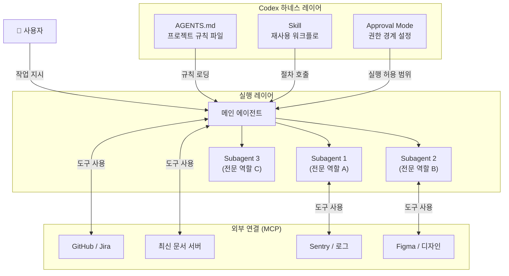
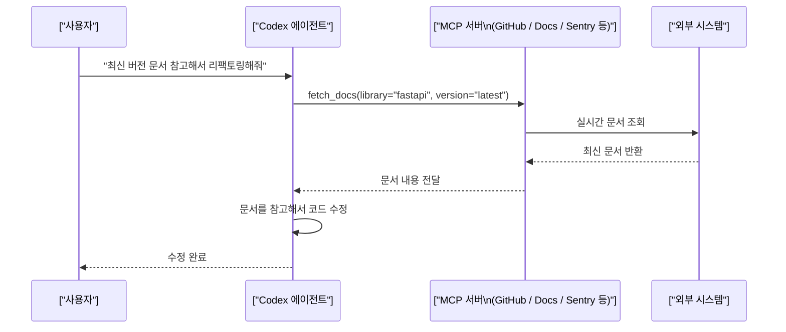
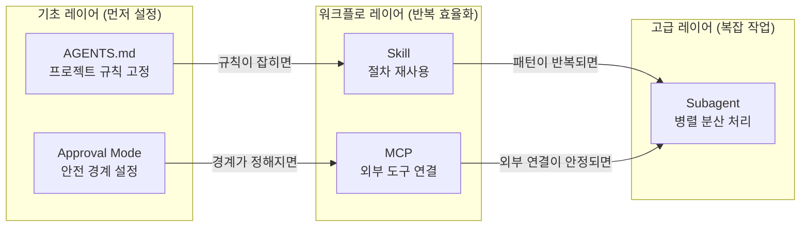
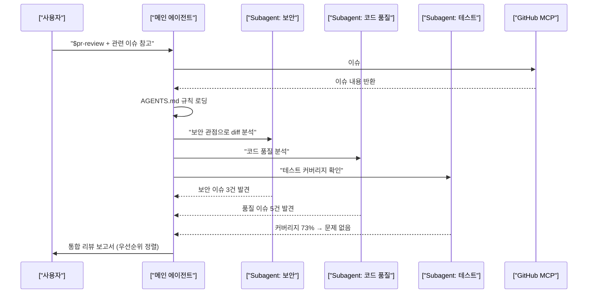

> 원문 출처: [@caffeine__coder on Threads](https://www.threads.com/@caffeine__coder/post/DaHGe3hEzLx)  
> 기반 정보: OpenAI Codex 공식 문서 (2026년 6월 기준 최신)

---

## 목차

1. [들어가며: 채팅을 넘어서는 첫 번째 단계](#1-들어가며-채팅을-넘어서는-첫-번째-단계)
2. [다섯 기능의 전체 구조와 관계](#2-다섯-기능의-전체-구조와-관계)
3. [기능 1: Skill — 반복 작업을 재사용 가능한 절차로](#3-기능-1-skill--반복-작업을-재사용-가능한-절차로)
4. [기능 2: MCP — 외부 도구와 정보를 Codex에 연결하기](#4-기능-2-mcp--외부-도구와-정보를-codex에-연결하기)
5. [기능 3: Subagent — 큰 작업을 여러 에이전트가 분담하기](#5-기능-3-subagent--큰-작업을-여러-에이전트가-분담하기)
6. [기능 4: AGENTS.md — 프로젝트 규칙을 에이전트에 심기](#6-기능-4-agentsmd--프로젝트-규칙을-에이전트에-심기)
7. [기능 5: Approval Mode — 권한 경계와 안전 설정](#7-기능-5-approval-mode--권한-경계와-안전-설정)
8. [다섯 기능의 관계와 권장 도입 순서](#8-다섯-기능의-관계와-권장-도입-순서)
9. [실전 예시: 코드 리뷰 워크플로에 전부 적용하기](#9-실전-예시-코드-리뷰-워크플로에-전부-적용하기)
10. [CLI 내장 커맨드 빠른 참조](#10-cli-내장-커맨드-빠른-참조)
11. [맺음말: 순서대로 하나씩](#11-맺음말-순서대로-하나씩)

---

## 1. 들어가며: 채팅을 넘어서는 첫 번째 단계

Codex를 처음 쓰는 사람들이 가장 많이 하는 실수는 ChatGPT를 쓰듯이 쓰는 것이다. 질문하고 답을 받고, 또 질문하고 답을 받는 식이다. 이렇게 써도 물론 작동하지만, Codex의 핵심 강점인 **자율적 작업 처리**와 **반복 자동화**를 전혀 활용하지 못하는 셈이다.

Codex를 실무에서 제대로 쓰려면 다섯 가지 개념을 이해해야 한다. Skill, MCP, Subagent, AGENTS.md, 그리고 Approval Mode다. 이 다섯 가지는 서로 독립적으로 보이지만 실제로는 하나의 체계를 이룬다.

- **AGENTS.md**는 프로젝트 규칙을 에이전트에게 심는 가장 기초 작업이다.
- **Skill**은 반복 작업을 절차화해 재사용하는 방식이다.
- **MCP**는 외부 도구와 최신 정보를 에이전트에 연결하는 통로다.
- **Subagent**는 큰 작업을 전문화된 여러 에이전트에게 나눠 맡기는 방식이다.
- **Approval Mode**는 이 모든 자동화가 어디까지 허용되는지 경계를 정하는 안전장치다.

처음부터 다 쓸 필요는 없다. 그러나 하나씩 알고 있을수록 Codex를 "쓰는" 수준에서 Codex로 "워크플로를 설계하는" 수준으로 올라갈 수 있다.

---

## 2. 다섯 기능의 전체 구조와 관계



이 구조에서 핵심은 **AGENTS.md와 Skill이 에이전트의 행동 방식을 사전에 정의**하고, **MCP가 실행 중에 필요한 외부 정보를 공급**하며, **Subagent가 병렬 실행**을 가능하게 하고, **Approval Mode가 전체 과정의 안전 경계**를 담당한다는 점이다.

---

## 3. 기능 1: Skill — 반복 작업을 재사용 가능한 절차로

### Skill이 해결하는 문제

Codex를 쓰다 보면 같은 종류의 지시를 계속 반복하게 된다.

"블로그 글은 초등학생도 이해할 수 있게 써줘. 제목, 요약, 목차, 태그도 함께 줘."
"커밋 메시지는 feat/fix/docs/refactor/chore 형식으로 써줘."
"코드 리뷰는 보안, 테스트 커버리지, 유지보수성 세 가지 관점으로 봐줘."

이런 지시를 매번 타이핑하는 것은 비효율적이고, 표현이 조금씩 달라지면 결과도 흔들린다. Skill은 이 반복 패턴을 한 번 정의해두고 이름 하나로 불러 쓰는 방식이다.

### Skill의 실제 구조

공식 문서에 따르면, Skill은 `SKILL.md` 파일이 들어있는 디렉터리다. 형식은 간단하다.

```markdown
---
name: blog-writer
description: 네이버 블로그 스타일로 글 작성. 쉬운 언어, 제목/요약/목차/태그 포함.
             초등학생도 이해할 수 있는 수준으로 작성할 때 사용.
---

1. 본문은 중학생도 이해할 수 있는 쉬운 언어로 작성한다.
2. 제목, 300자 이내 요약, 목차, 태그(5개 이내)를 함께 제공한다.
3. 틀린 정보가 없도록 신중하게 작성하고, 불확실한 내용은 명시적으로 표시한다.
4. 쓰레드 첫 글에는 전체 목록을 먼저 정리한다.
```

스크립트(`scripts/` 폴더)도 포함할 수 있어서, 단순 지시만이 아니라 실제 명령어 실행도 Skill에 포함할 수 있다.

### Skill의 저장 위치와 범위

Skill에는 두 가지 범위가 있다.

**저장소 전용 Skill:** `.agents/skills/` 폴더에 넣으면 해당 저장소 안에서만 적용된다. 팀 단위로 공유하는 컨벤션이나 특정 프로젝트 작업 방식을 담기에 적합하다.

**개인 전역 Skill:** 사용자 홈 디렉터리의 Codex 설정 경로에 넣으면 모든 저장소에서 사용할 수 있다. 개발자 개인의 반복 패턴을 담기에 좋다.

### Skill 호출 방법

Skill을 호출하는 방법은 두 가지다.

**명시적 호출:** 프롬프트에 직접 언급하거나, CLI에서 `/skills`를 실행해 목록을 보고 `$skill-name` 형식으로 호출한다.

**암묵적 호출:** Codex가 요청 내용을 분석해서 가장 적합한 Skill을 스스로 선택한다. 이 방식이 작동하려면 Skill의 `description` 필드를 정확하게 작성하는 것이 중요하다. Codex는 description을 기준으로 매칭하기 때문이다.

### Skill 제작 방법

두 가지 방식이 있다. 첫 번째는 Codex의 내장 Skill 생성기를 사용하는 것이다. 대화 중에 "이 워크플로를 Skill로 만들어줘"라고 말하면 Codex가 단계적으로 생성해준다.

두 번째는 **Record & Replay**다. 워크플로를 한 번 직접 시연하면 Codex가 그 과정을 기록하고 재사용 가능한 Skill로 변환한다. 절차를 말로 설명하기 어려울 때 유용하다.

### Skill의 컨텍스트 효율성

Skill은 **점진적 공개(progressive disclosure)** 방식으로 작동한다. Codex는 처음에 모든 Skill의 이름과 설명만 불러온다. 모델 컨텍스트 창의 최대 2%까지만 이 목록에 쓴다. 특정 Skill을 쓰기로 결정했을 때만 해당 SKILL.md 전체를 읽는다. Skill이 많아도 컨텍스트를 낭비하지 않는 설계다.

---

## 4. 기능 2: MCP — 외부 도구와 정보를 Codex에 연결하기

### MCP가 해결하는 문제

Codex는 기본적으로 저장소 안의 코드와 파일만 직접 볼 수 있다. 그런데 실무에서 자주 필요한 것들은 저장소 밖에 있다.

- 최신 라이브러리 문서 (Codex의 학습 데이터에는 없는 버전)
- GitHub 이슈와 PR 목록
- Sentry 에러 로그
- Figma 디자인 파일
- Linear나 Jira의 태스크 상태
- 프로덕션 모니터링 대시보드

MCP(Model Context Protocol)는 Codex가 이런 외부 시스템에 표준화된 방식으로 접근할 수 있게 하는 오픈 표준 프로토콜이다. Anthropic이 처음 제안하고 현재 업계 표준으로 자리잡은 규격으로, OpenAI도 채택해서 Codex에 내장했다.

### MCP 서버의 동작 원리



MCP 서버는 STDIO 방식(로컬 프로세스)과 Streamable HTTP 방식(원격 서버, OAuth 인증 지원) 두 가지 형태로 구동된다.

### MCP 추가하는 방법

**CLI에서 추가:**

```bash
# STDIO 방식 (로컬 프로세스)
codex mcp add github -- npx @anthropic/mcp-server-github

# HTTP 방식 (원격 서버)
codex mcp add docs --url https://mcp.deepwiki.com/mcp

# 현재 연결된 MCP 목록 확인
codex mcp list
```

**데스크탑 앱에서 추가:** Settings → MCP servers 메뉴에서 관리한다. 공식 권장 서버 목록도 함께 표시된다.

**config.toml에 영구 설정:**

```toml
[mcp_servers.github]
command = "npx"
args = ["@anthropic/mcp-server-github"]

[mcp_servers.docs]
url = "https://mcp.deepwiki.com/mcp"
```

### 실무에서 자주 쓰는 MCP 서버

| 용도 | MCP 서버 예시 | 주요 활용 |
|------|-------------|---------|
| GitHub 연동 | `@anthropic/mcp-server-github` | PR 조회, 이슈 확인, 브랜치 목록 |
| 최신 문서 | `deepwiki MCP`, 공식 docs MCP | 최신 라이브러리 API 참조 |
| 에러 추적 | Sentry MCP | 프로덕션 에러 로그 조회 |
| 디자인 | Figma MCP | 디자인 토큰, 컴포넌트 스펙 |
| 프로젝트 관리 | Linear MCP, Jira Atlassian Rovo | 이슈·태스크 상태 |

공식 문서는 이렇게 권고한다: "MCP를 붙일 때는 실제로 반복되는 수동 루프를 제거해주는 한두 가지 도구부터 시작하고, 거기서 확장하라. 모든 도구를 한꺼번에 연결하는 것으로 시작하지 말라."

### Skill과 MCP의 결합

Skill과 MCP는 서로 보완한다. Skill이 워크플로의 절차를 정의하고, MCP가 그 워크플로에 필요한 외부 데이터를 공급한다. `agents/openai.yaml` 파일에 Skill이 의존하는 MCP 서버를 선언하면, Codex가 자동으로 연결을 처리한다.

예를 들어 "GitHub PR 요약 작성" Skill이 GitHub MCP에 의존한다고 선언해두면, 그 Skill이 호출될 때 MCP 연결이 자동으로 활성화된다.

---

## 5. 기능 3: Subagent — 큰 작업을 여러 에이전트가 분담하기

### Subagent가 해결하는 문제

코드 리뷰를 생각해보자. 한 명의 리뷰어가 보안, 성능, 테스트 커버리지, 유지보수성을 동시에 보려고 하면 각 관점이 얕아지기 쉽다. 사람도 그렇고 AI도 마찬가지다.

Subagent는 이 문제를 **역할 분리**로 해결한다. 한 에이전트가 코드베이스를 탐색하고, 다른 에이전트는 보안 취약점만 집중해서 보고, 또 다른 에이전트는 테스트 커버리지만 분석하고, 마지막에 메인 에이전트가 결과를 통합해 보고서를 만든다.

### Subagent 호출 방법

Subagent는 **명시적으로 요청할 때만** 생성된다. Codex가 자동으로 Subagent를 만들지 않는다.

CLI에서 `/agent` 명령으로 실행 중인 에이전트 스레드 사이를 전환하고 진행 상황을 확인할 수 있다.

간단한 예시:

```
현재 PR(이 브랜치 vs main)을 다음 기준으로 검토해줘.
항목마다 별도 에이전트를 생성하고, 전부 완료된 뒤 결과를 통합해줘.
1. 보안 취약점
2. 코드 품질
3. 버그
4. 레이스 컨디션
5. 테스트 불안정성
6. 유지보수성
```

### 커스텀 에이전트 정의

반복적으로 같은 역할의 Subagent를 쓴다면, 커스텀 에이전트로 미리 정의해둘 수 있다. 각 에이전트는 별도 설정 파일로 정의된다.

```toml
# agents/pr_explorer.toml
name = "pr_explorer"
description = "변경 사항을 분석하고 증거를 수집하는 탐색 전용 에이전트"
model = "gpt-5.4-mini"          # 탐색은 경량 모델로
model_reasoning_effort = "medium"
sandbox_mode = "read-only"      # 읽기만 허용
developer_instructions = """
탐색 모드로만 작동한다. 실제 실행 경로를 추적하고, 파일과 심볼을 인용하고,
상위 에이전트가 요청하지 않는 한 수정 제안을 하지 않는다.
"""
```

```toml
# agents/security_reviewer.toml
name = "security_reviewer"
description = "보안 관점 전문 리뷰어"
model = "gpt-5.5"               # 보안 분석은 고성능 모델로
model_reasoning_effort = "high"
sandbox_mode = "read-only"
developer_instructions = """
코드 오너처럼 리뷰한다.
인젝션 취약점, 인증 우회, 권한 에스컬레이션에 집중한다.
발견된 모든 보안 위험을 심각도(Critical/High/Medium/Low)로 분류해서 보고한다.
"""
```

이렇게 정의해두면 "security_reviewer를 써서 이 PR을 검토해줘"라고 지시만 하면 된다.

### Subagent 사용 시 주의점

**토큰 소비가 늘어난다.** 각 Subagent는 독립적으로 모델을 호출하기 때문에, 같은 작업을 단일 에이전트로 처리하는 것보다 토큰이 더 많이 든다.

**컨텍스트 오염(Context Pollution)과 컨텍스트 부패(Context Rot)를 조심해야 한다.** 여러 에이전트가 같은 컨텍스트를 공유하면 서로 관련 없는 정보가 뒤섞여 결과 품질이 떨어질 수 있다. 각 Subagent를 독립적인 맥락에서 실행하는 것이 권장된다.

**중첩 깊이는 기본값 1로 유지한다.** `agents.max_depth` 기본값은 1인데, 이를 높이면 에이전트가 또 에이전트를 낳는 연쇄 실행이 일어날 수 있어 토큰 사용량과 복잡도가 예측하기 어렵게 늘어난다.

---

## 6. 기능 4: AGENTS.md — 프로젝트 규칙을 에이전트에 심기

### AGENTS.md가 해결하는 문제

새 작업을 시작할 때마다 "이 프로젝트에서는 테스트를 이렇게 실행해", "이 파일은 건드리면 안 돼", "커밋 메시지는 이 형식으로 써줘"라고 매번 설명해야 한다면 지치기 마련이다. 게다가 표현이 조금 달라지면 Codex의 행동도 달라진다.

AGENTS.md는 이런 프로젝트별 규칙을 저장소에 파일로 고정하는 방식이다. Codex는 작업을 시작할 때 이 파일을 자동으로 읽고 규칙을 적용한다.

### AGENTS.md 파일 위치와 우선순위

AGENTS.md는 저장소 내 여러 위치에 둘 수 있다.

```
project-root/
├── AGENTS.md           ← 저장소 전체에 적용
├── src/
│   ├── AGENTS.md       ← src/ 하위 작업에만 적용
│   └── components/
│       └── AGENTS.md   ← components/ 하위 작업에만 적용
└── tests/
    └── AGENTS.md       ← 테스트 디렉터리 전용 규칙
```

디렉터리에 가장 가까운 AGENTS.md가 우선 적용되고, 없으면 상위 디렉터리로 올라가서 찾는다. 이 구조를 활용하면 공통 규칙은 루트에, 서브시스템별 규칙은 해당 디렉터리에 나눠 관리할 수 있다.

### 효과적인 AGENTS.md 예시

```markdown
# AGENTS.md — MyApp 프로젝트 Codex 행동 규칙

## 테스트 실행
- 단위 테스트: `pytest tests/unit/ -v`
- 통합 테스트: `pytest tests/integration/ -v --timeout=60`
- 전체: `make test`
- 테스트 없이 코드 변경은 허용되지 않음

## 코드 스타일
- Python: Black 포매터, isort, 타입 힌트 필수
- 커밋 전 `make lint`를 반드시 실행
- 새 함수에는 docstring 필수

## 접근 금지 파일
- `config/secrets.yml` — 절대 수정 금지, 읽기도 하지 말 것
- `migrations/` — 마이그레이션 파일은 직접 수정 금지, 항상 별도 명령으로 생성
- `.env.production` — 수정 금지

## 답변 형식
- 코드 변경 후 반드시 변경 이유와 영향 범위를 한국어로 설명
- 불확실한 부분은 추측하지 말고 명시적으로 "확인 필요"라고 표시

## 배포 전 체크리스트
- [ ] 테스트 전부 PASSED
- [ ] lint 오류 없음
- [ ] 환경 변수 변경이 있으면 README.md 업데이트
```

### AGENTS.md를 피드백 루프로 활용하기

공식 문서가 강조하는 중요한 패턴이 있다. Codex가 잘못된 가정을 할 때마다 수정하고, 그 수정 내용을 AGENTS.md에 반영해달라고 요청하는 것이다.

```
방금 네가 PostgreSQL 연결을 직접 생성했는데, 
이 프로젝트는 항상 connection pool을 통해야 해.
이 규칙을 AGENTS.md에 추가해줘.
```

이렇게 하면 같은 실수가 다음 세션에서 반복되지 않는다. AGENTS.md가 단순한 초기 설정 파일이 아니라, 프로젝트와 함께 성장하는 **살아있는 규칙 문서**가 된다.

CLI에서 `/init` 명령을 실행하면 현재 저장소를 분석해서 기초 AGENTS.md 초안을 자동으로 생성해준다.

### agents.md 커뮤니티 리소스

[agents.md](https://agents.md/) 라는 커뮤니티 사이트에서 다양한 프레임워크와 언어별 AGENTS.md 템플릿을 참고할 수 있다. React, FastAPI, Next.js 등 프레임워크별로 검증된 초안이 공유되어 있어, 처음 작성할 때 참고하면 유용하다.

---

## 7. 기능 5: Approval Mode — 권한 경계와 안전 설정

### 왜 권한 설정이 중요한가

Codex는 로컬 파일을 수정하고, 터미널 명령을 실행하고, 네트워크 요청을 보낼 수 있다. 이 능력이 있기 때문에 강력하지만, 동시에 잘못 설정하면 의도치 않은 결과가 생길 수 있다. 테스트 중이던 데이터가 삭제되거나, 개발 명령이 프로덕션에 전달되거나, 중요한 설정 파일이 수정될 수 있다.

Approval Mode는 **Codex가 어떤 행동을 할 때 사람의 명시적 승인을 요구할지**를 설정한다.

### 세 가지 기본 모드

공식 문서가 정의하는 세 가지 기본 모드는 다음과 같다.

**Auto 모드 (기본값):** 작업 디렉터리 안에서는 파일 읽기·수정·명령 실행을 자유롭게 할 수 있다. 작업 디렉터리 밖의 파일이나 네트워크 접근은 승인을 요청한다. 일반적인 로컬 개발 작업에 적합하다.

**Read Only 모드:** 파일 읽기는 자유롭게, 수정이나 명령 실행은 모두 승인 요청. 코드베이스를 분석하거나 리뷰하는 작업, 또는 처음 신뢰가 쌓이기 전에 쓰기 적합하다.

**Full Access 모드:** 네트워크 접근을 포함해 모든 것을 제한 없이 실행. 장시간 자동화 작업이나 CI/CD 파이프라인에 통합할 때 사용. 공식 문서는 이 모드를 "sparingly"(아껴서)라는 단어로 표현한다.

### CLI에서 설정하는 방법

세션 중에 `/approvals` 명령으로 언제든지 모드를 바꿀 수 있다.

```bash
# Read Only 모드로 시작
codex --approval-mode read-only

# Full Access 모드
codex --approval-mode full-auto

# 세션 중 변경
/approvals
```

### Sandbox Mode와의 차이

Approval Mode와 별개로 **Sandbox Mode**도 있다. Approval Mode는 "승인을 요청하는 시점"을 결정하고, Sandbox Mode는 "에이전트가 접근할 수 있는 파일 범위"를 결정한다.

| 설정 | 역할 |
|------|------|
| Approval Mode | 실행 전 사람의 승인이 필요한 행동 유형 |
| Sandbox Mode | 에이전트가 읽고 쓸 수 있는 파일 경로 범위 |

둘을 조합해서 정밀하게 제어할 수 있다. 예를 들어 Subagent에게 읽기 전용 Sandbox를 주면서도, 특정 보고서 파일 생성은 승인 없이 허용하는 식이다.

### 자동 리뷰어 옵션

config.toml에서 `approvals_reviewer = "auto_review"`로 설정하면, 사람이 승인하는 대신 별도의 리뷰어 Subagent가 승인 여부를 판단한다. 장시간 자동화 작업에서 유용하지만, 리뷰어 에이전트가 모든 판단을 올바르게 내린다는 보장이 없으므로 주의가 필요하다.

---

## 8. 다섯 기능의 관계와 권장 도입 순서

### 기능 간 관계 정리



### 권장 도입 순서

**1단계: AGENTS.md + Approval Mode**

새 프로젝트에서 Codex를 쓰기 시작할 때, 가장 먼저 해야 할 일이다. AGENTS.md에 테스트 실행 방법, 절대 건드리면 안 되는 파일, 코드 스타일 규칙을 정의한다. Approval Mode는 처음에는 Auto나 Read Only로 시작한다. 이 두 가지가 없으면 Codex가 엉뚱한 가정을 반복하고, 의도치 않은 파일을 수정할 수 있다.

**2단계: Skill**

반복적으로 같은 종류의 요청을 하고 있다면 Skill로 만들 때다. 블로그 글 작성 형식, 커밋 메시지 컨벤션, PR 설명 형식 같은 것들이 좋은 후보다.

**3단계: MCP**

외부 도구나 최신 문서를 매번 복사해서 붙여넣고 있다면 MCP를 연결할 때다. GitHub MCP, 문서 서버 MCP 한두 개부터 시작한다.

**4단계: Subagent**

코드베이스가 커지거나, 검토해야 할 관점이 여러 가지인 큰 작업이 생겼을 때 Subagent를 도입한다.

---

## 9. 실전 예시: 코드 리뷰 워크플로에 전부 적용하기

다섯 가지 기능이 실제로 어떻게 협동하는지 하나의 코드 리뷰 시나리오로 보여준다.

### 설정 (한 번만 하면 됨)

**AGENTS.md에 추가:**
```markdown
## 코드 리뷰 규칙
- 리뷰 시 테스트 커버리지를 반드시 확인 (`make coverage`)
- 외부 패키지 추가 시 라이선스 확인 필수
- API 변경 시 API 문서도 업데이트 여부 확인
```

**Skill 정의 (`.agents/skills/pr-review/SKILL.md`):**
```markdown
---
name: pr-review
description: Pull Request 전체 검토. 보안/품질/테스트/문서 네 가지 관점으로 분석.
             'PR 리뷰해줘', '코드 리뷰' 요청 시 사용.
---
1. Subagent를 이용해 네 가지 관점(보안, 코드품질, 테스트, 문서)을 병렬로 분석한다.
2. 각 관점별 발견 사항을 심각도(Critical/High/Medium/Low)로 분류한다.
3. 최종 보고서는 실행 가능한 액션 아이템 목록으로 정리한다.
```

**MCP 연결:**
```bash
codex mcp add github -- npx @anthropic/mcp-server-github
```

### 실행 (매번 하는 작업)

```
$pr-review
현재 브랜치(feature/auth-refactor vs main)를 리뷰해줘.
GitHub MCP로 관련 이슈(#234, #235)도 참고해줘.
```

### 실행 흐름



이 워크플로를 처음 설정하는 데는 시간이 걸리지만, 한 번 설정해두면 "PR 리뷰해줘" 한 마디로 전체 과정이 실행된다.

---

## 10. CLI 내장 커맨드 빠른 참조

Codex CLI 세션 중에 사용할 수 있는 핵심 커맨드를 정리했다.

| 커맨드 | 설명 |
|--------|------|
| `/model` | 모델 변경 또는 추론 수준 조정 |
| `/approvals` | Approval Mode 변경 |
| `/review` | 현재 브랜치 diff 코드 리뷰 요청 |
| `/diff` | 미추적 파일 포함 Git diff 표시 |
| `/skills` | 사용 가능한 Skill 목록 조회 |
| `/mcp` | 연결된 MCP 도구 목록 조회 |
| `/agent` | 실행 중인 Subagent 스레드 전환 |
| `/init` | 현재 저장소 기반 AGENTS.md 초안 생성 |
| `/status` | 현재 세션 설정 및 토큰 사용량 확인 |
| `/compact` | 대화 요약으로 컨텍스트 공간 확보 |
| `/undo` | 마지막 작업 취소 |
| `/new` | 새 대화 시작 |
| `/feedback` | OpenAI에 피드백 제출 |

---

## 11. 맺음말: 순서대로 하나씩

이 다섯 가지 기능을 한꺼번에 익히려고 하면 부담스럽다. Threads 원문에서 제시한 순서가 현실적으로 가장 좋다.

첫째, **자주 반복하는 요청을 Skill로 만들기.** 무엇을 Skill로 만들어야 할지 감이 잡히지 않는다면, 지난 한 주 동안 Codex에 한 요청을 되돌아보면 된다. 같은 패턴이 세 번 이상 나왔다면 Skill 후보다.

둘째, **프로젝트 규칙을 AGENTS.md로 정리하기.** Codex가 잘못된 가정을 할 때마다 수정하고, 그 수정 내용을 AGENTS.md에 누적한다. 이 파일이 충실해질수록 요청이 덜 흔들린다.

셋째, **최신 문서나 외부 도구가 필요할 때 MCP 붙이기.** 손으로 복사해서 붙여넣는 정보가 있다면 MCP 연결 후보다.

넷째, **큰 분석 작업에 Subagent 써보기.** 코드베이스 전체 리뷰, 여러 관점의 비교 분석, 대형 리팩토링처럼 단일 에이전트로 처리하기 벅찬 작업에 활용한다.

Approval Mode는 처음부터 Auto(기본값)로 두고, 불안하다면 Read Only로 낮춰서 시작하면 된다. Codex가 어떻게 행동하는지 익숙해진 뒤에 범위를 조금씩 넓히는 것이 안전하다.

---

## 참고 자료

- [Codex Skill 공식 문서](https://developers.openai.com/codex/skills)
- [Codex MCP 연결 가이드](https://developers.openai.com/codex/concepts/customization)
- [Codex Subagent 공식 문서](https://developers.openai.com/codex/subagents)
- [AGENTS.md 공식 가이드](https://developers.openai.com/codex/guides/agents-md)
- [Codex 베스트 프랙티스](https://developers.openai.com/codex/learn/best-practices)
- [Codex CLI 레퍼런스](https://developers.openai.com/codex/cli)
- [Codex 설정 레퍼런스](https://developers.openai.com/codex/config-reference)
- [agents.md 커뮤니티 템플릿](https://agents.md/)
- [원문 Threads 게시물 by @caffeine__coder](https://www.threads.com/@caffeine__coder/post/DaHGe3hEzLx)

---

*작성일자: 2026-06-29*
