## AI 모델 교체가 아니라 전체 작업 시스템 교체 문제

> **원본 영상**: Nate B Jones — "GLM 5.2 Is Free And Beats Claude On Most Work. So Why Can't Companies Switch?" (2026-06-29)  
> **출처**: https://www.youtube.com/watch?v=Zp8lr6IzUnQ  
> **작성일자**: 2026-06-29

---

## 목차

1. [들어가며 — 왜 이 질문이 중요한가](#1-들어가며)
2. [GLM 5.2란 무엇인가](#2-glm-52란-무엇인가)
3. [저렴한 AI의 시대는 이미 시작되었다](#3-저렴한-ai의-시대는-이미-시작되었다)
4. [Center of Distribution vs Edge of Distribution](#4-center-of-distribution-vs-edge-of-distribution)
5. [기업들이 오픈소스로 전환하지 못하는 이유](#5-기업들이-오픈소스로-전환하지-못하는-이유)
6. [Lindy 사례 — 하네스를 완전히 재구축한 현실](#6-lindy-사례)
7. [하네스란 무엇인가 — 모델은 병 속의 두뇌일 뿐](#7-하네스란-무엇인가)
8. [Claude Tag — 팀 레벨 하네스의 등장](#8-claude-tag)
9. [컨텍스트 잠금 — 왜 한번 들어온 모델을 뽑을 수 없는가](#9-컨텍스트-잠금)
10. [Last Mile 문제 — AI 가치 사슬의 마지막 한 걸음](#10-last-mile-문제)
11. [하네스 인재 부족 — 빌더에게 열리는 기회](#11-하네스-인재-부족)
12. [전략적 시사점 — 기업과 개인이 지금 해야 할 질문](#12-전략적-시사점)
13. [결론 — 가격이 아닌 Last Mile이 경쟁을 결정한다](#13-결론)

**부록 및 별첨 (추가 심화 분석)**
- [부록: AI Talent란 무엇인가 — 영상이 말하는 진짜 의미](#부록-ai-talent란-무엇인가--영상이-말하는-진짜-의미)
- [별첨: Hermes Agent 같은 도구가 있는데 하네스를 직접 만들어야 하는가?](#별첨-hermes-agent-같은-도구가-있는데-하네스를-직접-만들어야-하는가)

---

## 1. 들어가며

2026년 6월, AI 분야에서 가장 중요한 질문 하나가 수면 위로 떠올랐다. 중국 스타트업 Z.ai(구 Zhipu AI)가 출시한 **GLM 5.2**는 MIT 라이선스 오픈소스 모델임에도 불구하고 코딩 벤치마크에서 GPT-5.5를 능가하며 Claude Opus 4.8과 맞먹는 성능을 보여준다. 클라우드 API로 쓰면 Claude Opus 4.8 대비 입력 토큰 기준 약 70%, 출력 토큰 기준 약 80% 저렴하고, 자체 서버에서 실행하면 토큰 과금 자체가 없어 운영 비용만 든다. 영상에서 Nate가 "98% cheaper"라고 표현한 것은 자체 호스팅 옵션을 포함한 최대 절감치 비교다. 논리적으로 생각하면 기업들은 지금 당장 전환 행렬을 이뤄야 마땅하다.

그런데 현실은 그렇지 않다. Anthropic의 매출은 여전히 폭발적으로 성장하고 있고, OpenAI도 마찬가지다. 이 역설적인 현상 뒤에는 단순히 "모델"을 교체하는 것이 아니라 **전체 작업 시스템(work system)을 교체해야 한다**는 구조적 문제가 숨어 있다. 이 문서는 Nate B Jones의 분석을 중심으로, 최신 뉴스와 실제 사례를 바탕으로 그 구조적 문제를 상세히 해부한다.

---

## 2. GLM 5.2란 무엇인가

### 기본 사양

GLM 5.2는 Z.ai가 2026년 6월 중순 출시한 오픈웨이트 대형 언어 모델이다. 핵심 사양은 다음과 같다.

GLM 5.2는 MIT 오픈소스 라이선스로 공개되었으며, 100만 토큰 컨텍스트 윈도우를 안정적으로 지원하는 장기 작업 특화 모델이다. 고급 코딩 능력을 갖추고 있으며 다양한 추론 노력 수준(High/Max)을 지원해 성능과 지연 시간 사이의 균형을 조절할 수 있다. 새로운 아키텍처인 IndexShare는 희소 어텐션(sparse attention) 레이어 4개당 동일한 인덱서(indexer)를 재사용하여 100만 토큰 컨텍스트 길이에서 토큰당 FLOPs를 2.9배 줄인다.

모델 아키텍처 면에서는 **Mixture-of-Experts(MoE)** 방식을 채택했다. 전체 파라미터는 744B(약 7440억 개)지만, 토큰당 활성화되는 파라미터는 약 400억 개 수준이다. 이 구조 덕분에 방대한 규모의 모델이 접근 가능한 하드웨어에서도 구동될 수 있다.

### 핵심 기술: IndexShare

표준 희소 어텐션 메커니즘(GLM 5.2가 기반으로 삼는 DeepSeek 희소 어텐션 포함)은 경량 "인덱서" 컴포넌트를 사용하여 전체 어텐션 계산을 수행하기 전에 가장 중요한 토큰을 식별한다. 보통은 모든 트랜스포머 레이어가 각자 인덱서를 실행하므로, 100만 토큰을 처리할 때 연산 비용이 매우 높아진다. IndexShare는 4개의 트랜스포머 레이어가 하나의 인덱서를 공유하도록 설계하여 이 문제를 해결했다.

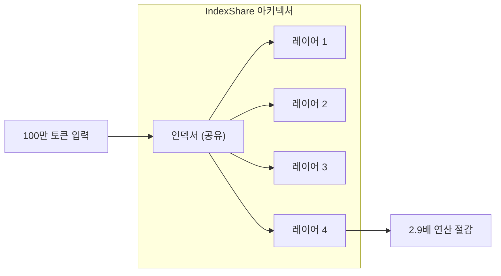

### 벤치마크 성능

SWE-bench Pro 기준으로 GLM 5.2는 62.1점을 기록하며 GPT-5.5(58.6점)을 앞섰다. 단, Claude Opus 4.8(69.2점)에는 아직 미치지 못한다. Terminal-Bench 2.1에서는 전작 GLM 5.1의 63.5점에서 81.0점으로 대폭 도약하여 Claude Opus 4.8(약 85점)과의 격차를 크게 줄였으며, FrontierSWE에서도 GPT-5.5를 넘어섰다.

가격 격차는 충격적인 수준이다. GLM 5.2는 Claude Opus 4.8과 비교할 때 입력 토큰에서 약 70%, 출력 토큰에서 약 80% 저렴하며, 100만 토큰 컨텍스트 길이에서는 격차가 더욱 벌어진다.

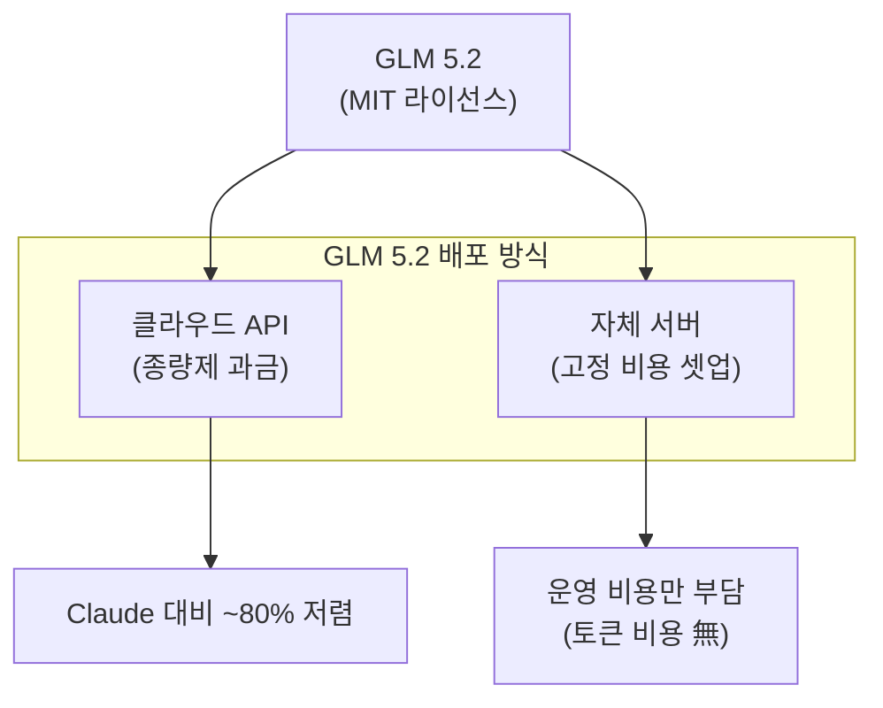

### GLM 5.2가 빛나는 영역

영상에서 Nate B Jones는 GLM 5.2가 특히 탁월한 영역을 다음과 같이 설명한다. 클라이언트용 브로슈어 사이트 제작, PowerPoint 초안 작성, 일반적인 합성·요약 작업, 그리고 익숙한 패턴의 코딩 작업이 이에 해당한다. 이 작업들의 공통점은 **출력 결과를 사람이 빠르게 검수할 수 있다**는 것이다.

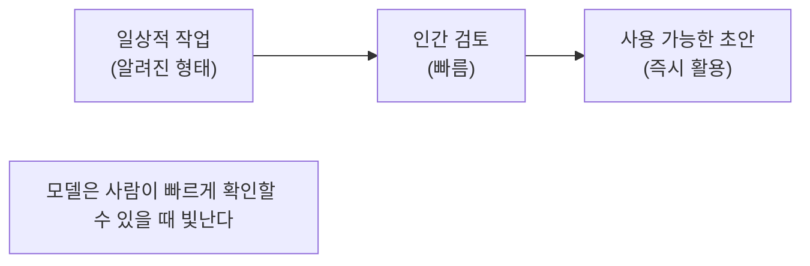

---

## 3. 저렴한 AI의 시대는 이미 시작되었다

### 프론티어 모델 릴리스의 둔화

2026년 중반, AI 시장에는 예상치 못한 변수가 등장했다. 미국 정부가 최첨단 AI 모델에 대한 수출 통제를 시행하기 시작한 것이다.

2026년 6월 12일 오후 5시 21분, 미국 상무부가 Anthropic에 서한을 보냈다. 정부는 국가 안보 권한을 근거로 Anthropic에게 자국 내외를 불문한 모든 외국 국적자의 Fable 5 및 Mythos 5 접근을 즉시 중단하라고 명령했다. Anthropic은 사용자를 국적별로 실시간 구분할 수 없기 때문에, 사실상 전 세계 모든 고객에 대해 두 모델의 서비스를 차단하게 되었다.

이는 전례 없는 조치로, 미국과 동맹국 사이에 새로운 균열을 만들었다. Anthropic은 AI 주권의 필요성에 대한 논의를 촉발했으며, 유럽 정부들은 미국 기술 복합체에 대한 과도한 의존도에 경각심을 갖기 시작했다.

이 상황은 영상에서 Nate가 언급한 "프론티어 모델 릴리스 둔화" 현상의 배경이다. 규제 불확실성이 높아질수록 기업들이 특정 프론티어 모델에 의존하는 전략의 위험성이 부각된다.

### 토큰 비용 급증 문제

에이전틱 코딩 세션이 고정 월정액으로 감당하기 어려운 비용을 발생시키면서, GitHub는 Copilot의 정액제 구독 모델을 사용량 기반 과금 방식으로 전환했다. Uber는 Claude Code 사용으로 2026년 전체 AI 예산을 4개월 만에 소진하면서 COO가 수익성에 의문을 제기했다.

영상에서 Nate가 언급한 수치처럼, 엔지니어 한 명이 일주일에 토큰 비용으로 8만 달러를 쓰는 사례도 현실이 되었다. 이러한 비용 압박이 기업들로 하여금 더 저렴한 대안을 진지하게 고려하게 만드는 핵심 동인이다.

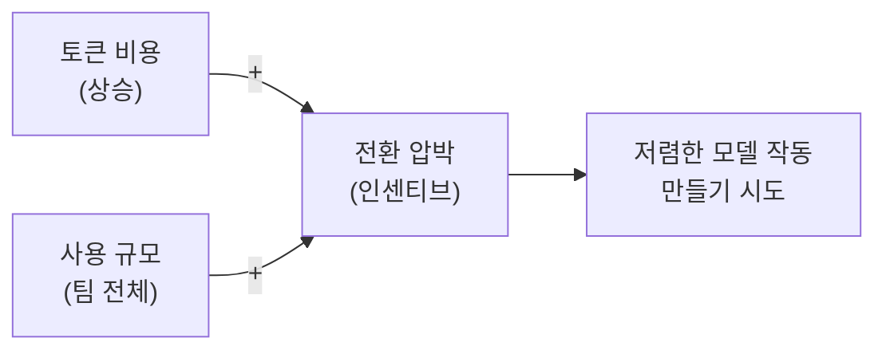

---

## 4. Center of Distribution vs Edge of Distribution

영상에서 가장 핵심적인 개념적 틀은 바로 **작업 분포(task distribution)** 개념이다. 이를 이해하지 못하면 "어떤 모델을 언제 써야 하는가"라는 질문에 답할 수 없다.

### 분포 중심 작업 (Center of Distribution)

분포 중심 작업이란 AI 모델이 수백만 번 반복적으로 다루어온, 패턴이 명확한 작업들을 말한다. 답의 형태가 예측 가능하고, 결과물을 사람이 빠르게 검수할 수 있다. 예를 들어 브로슈어 웹사이트 제작, 표준 PowerPoint 덱 초안, 일반적인 코드 작성, 이메일 초안, 요약·합성 작업이 이에 해당한다. 인류 전체 지식노동의 대부분은 사실 이 범주에 속한다. GLM 5.2는 바로 이 영역에서 프론티어 모델과 동등하거나 오히려 더 뛰어나다.

### 분포 엣지 작업 (Edge of Distribution)

분포 엣지 작업은 전례가 드물고, 판단 오류 비용이 매우 크며, 정답이 명확하지 않은 고도로 복잡하거나 새로운 유형의 문제다. 고급 보안 취약점 분석, 전략적 법률 문서 해석, 복잡한 다단계 추론이 요구되는 R&D 과제 등이 해당한다. 이 영역에서는 여전히 프론티어 모델(Claude Opus 4.8 등)이 의미 있는 우위를 갖는다.

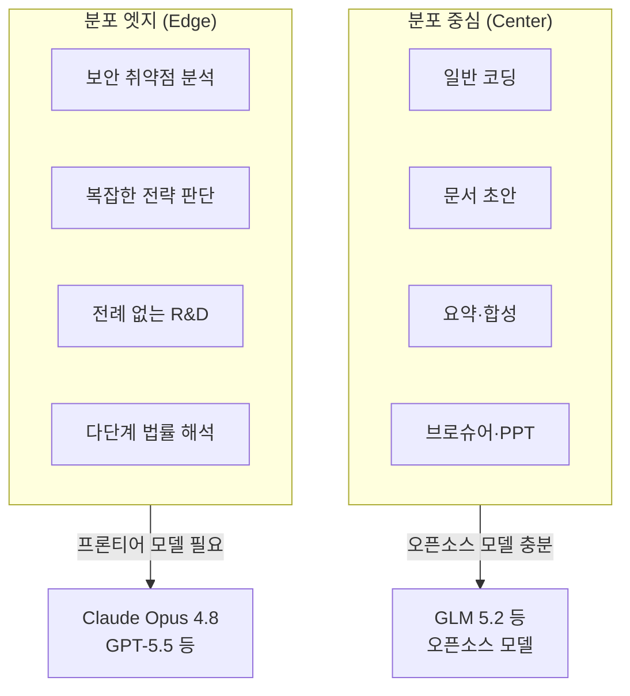

### 왜 이 측정이 어려운가?

문제는 대부분의 기업들이 자신의 작업 부하가 어느 쪽에 치우쳐 있는지 체계적으로 측정해본 적이 없다는 점이다. 개인 단위에서도, 팀 단위에서도 이런 분석을 해본 곳이 드물다. 모델 전환 전략의 출발점은 바로 **자사 작업 분포 측정**이어야 하지만, 어떻게 측정해야 하는지조차 모르는 기업이 대부분이다.

---

## 5. 기업들이 오픈소스로 전환하지 못하는 이유

영상에서 Nate B Jones는 현장의 엔지니어들, 기업 리더들과 나눈 대화를 바탕으로 전환을 가로막는 주요 요인을 설명한다.

### 첫 번째 이유: 직원들의 프론티어 모델 선호

직원들은 이미 Claude나 ChatGPT를 개인 기기나 스마트폰에서 써봤고, 그 경험을 회사에서도 원한다. "이걸 쓰면 업무에 도움이 된다"는 목소리를 내는 직원이 많으면, 과부하에 시달리는 IT 부서는 그 요구를 수용하는 방향으로 움직이게 된다. 오픈소스 모델에 대한 이런 종류의 직원 주도 수요는 상대적으로 약하다.

### 두 번째 이유: 작업 분포 파악의 어려움

4장에서 설명한 분포 중심 vs 엣지 분류를 실제로 수행하는 것이 기업 입장에서는 매우 어렵다. 이를 제대로 분석한 사례로는 Lindy(Flo Crivello CEO)가 있다. Lindy는 DeepSeek로의 전환 경험을 공개적으로 공유했으며, 비용 절감에 성공했지만 그 과정이 예상보다 훨씬 복잡했다고 인정했다.

### 세 번째 이유: 하네스 재구축 비용

모델을 바꾸는 것은 단순히 API 엔드포인트를 교체하는 일이 아니다. 다음 장에서 자세히 다루겠지만, 각 모델은 그에 맞는 **하네스(harness)** — 즉 프롬프트 구조, 메모리 아키텍처, 도구 호출 방식, 시스템 프롬프트 등 전체 작업 시스템 — 을 별도로 구축해야 한다. 이 재구축 비용이 만만치 않기 때문에, ROI가 분명한 기업(AI를 외부 서비스로 제공하는 곳)만이 전환을 감행한다.

---

## 6. Lindy 사례

Lindy는 AI 에이전트 자동화 플랫폼을 운영하는 25인 규모의 스타트업으로, Claude 기반에서 DeepSeek v4 Flash로의 전환을 공개적으로 기록한 가장 명확한 실제 사례다.

### 전환의 배경

Flo Crivello는 2026년 4월 X(구 Twitter)에 추론(inference) 비용이 Lindy의 최대 단일 비용 항목이 되었으며, 인건비를 초과했다고 밝혔다. 그는 "오픈소스 모델이 1년 전에는 '전혀 근접하지 못했다'에서 '대부분의 사용 사례에서 프론티어 수준'"으로 발전했다고 설명했다.

Lindy는 GLM 5.1, Kimi K2.6, DeepSeek v4 Flash 등 여러 후보를 대상으로 오프라인 평가를 실시하고 동일 모델에 대해 다른 추론 제공업체도 비교했다. 주목할 점은, 동일한 이름의 모델이라도 추론 제공업체에 따라 성능이 달라졌다는 것이다. 일부 제공업체는 양자화(quantized) 버전을 서비스하거나 추론 스택에 문제가 있었다. 이는 중요한 교훈이다: "DeepSeek를 테스트했다"는 말은 충분히 정확하지 않다. 모델, 제공업체, 추론 스택, 그리고 자체 프롬프트를 하나의 시스템으로 테스트한 것이다.

### 전환 과정과 실제 작업량

이 과정에서 가장 오해받기 쉬운 부분이 있다. 흥미로운 작업은 "구 모델에서 신 모델로 트래픽을 점진적으로 이동"한 것이 아니었다. 그것은 배관 공사에 불과하다. 진정한 핵심 작업은 트래픽을 이동할 자격을 획득하는 것이었다. 오프라인 평가, 제공업체 테스트, 프롬프트 최적화, 내부 롤아웃, 온라인 평가, 리텐션 지표 확인, 그리고 최종적으로 전량 이전이라는 단계를 거쳐 마이그레이션 대상 경로에서 추론 비용을 약 90% 절감했다. Lindy의 공식 블로그에 따르면 최종적으로 선택된 모델은 미국 인프라에서 호스팅된 DeepSeek v4 Flash다.

Lindy의 전환은 예상보다 훨씬 오래 걸렸다 — 평가, 점진적 롤아웃, 프롬프트 재엔지니어링 등을 합쳐 6~9개월이 소요되었다.

영상에서 Nate는 Lindy 팀이 Claude용으로 구축한 프롬프트, 메모리 처리 방식, 도구 호출 아키텍처를 DeepSeek에 그대로 이식할 수 없어 처음부터 새로운 하네스를 재구축해야 했다고 언급한다. Lindy 팀은 Claude를 위한 프롬프트, 메모리 처리 방식, 도구 호출 아키텍처 등을 DeepSeek에 그대로 "들어다 옮길(lift and shift)" 수 없었고, 사실상 처음부터 새로운 하네스를 구축해야 했다.

Lindy는 25인 스타트업으로, AI 비용이 "감당하기 어려운" 수준에 이르렀고 인건비를 초과했다. CEO Flo Crivello는 CNBC에 비용 곡선이 "바닥까지 떨어졌다"고 표현했으며, 수백만 달러를 절약했다고 밝혔다. 그는 Anthropic이 가격을 내린다면 다시 전환할 의향이 있다며 "이것은 비즈니스의 생존 문제"라고 말했다.

### Lindy 사례가 시사하는 것

Lindy의 사례는 두 가지 중요한 사실을 동시에 보여준다. 첫째, ROI가 분명하고 기술 역량이 있는 기업은 전환에 성공할 수 있다. 둘째, 그 전환에는 모델 교체를 훨씬 넘어서는 규모의 하네스 재구축 작업이 필요하다는 것이다. Lindy처럼 AI를 외부 서비스로 판매하는 기업은 토큰 비용 절감의 재무적 효과가 직접적이기 때문에 이 투자를 정당화할 수 있었다. 그러나 AI를 내부 생산성 도구로만 쓰는 기업에게는 이 ROI 계산이 훨씬 불분명하다.

---

## 7. 하네스란 무엇인가

영상에서 가장 인상적인 비유는 "**모델은 병 속의 두뇌(brain in a jar)**" 라는 표현이다. 아무리 뛰어난 두뇌라도 병 속에 갇혀 있다면 아무 일도 할 수 없다. 두뇌가 실제로 작동하려면 그것을 둘러싼 **몸체(harness)** 가 필요하다.

### 하네스의 4가지 구성 요소

영상의 슬라이드가 보여주는 하네스의 레이어 구조는 다음과 같다.

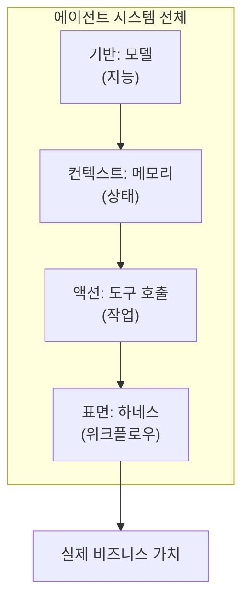

- **모델 (Model / Intelligence)**: LLM 그 자체. 추론 능력의 기반.
- **메모리 (Memory / State)**: 이전 대화 기록, 회사 문서, 사용자 히스토리 등 상태 정보를 어떻게 관리하느냐.
- **도구 호출 (Tool Calls / Work)**: 모델이 외부 시스템(API, 데이터베이스, 코드 실행 환경 등)과 어떻게 상호작용하느냐.
- **표면/하네스 (Surface / Workflow)**: 위 세 가지를 묶어 실제 업무 흐름으로 만드는 인터페이스와 오케스트레이션.

### 왜 모델마다 별도의 하네스가 필요한가

GLM 5.2의 도구 호출 방식은 Claude와 다르다. 시스템 프롬프트 구조도 다르다. GLM 5.2는 분포 중심 모델이기 때문에, 그 특성에 맞는 방식으로 프롬프트를 구성하고 메모리를 관리해야 한다. Claude용으로 최적화된 프롬프트를 GLM 5.2에 그대로 쓰면 기대한 성능이 나오지 않는다. 이것이 단순히 "모델 API 엔드포인트를 교체"한다고 해서 전환이 되지 않는 근본적인 이유다.

GLM 5.2 역시 이 문제를 인식하고, 자체 Codex-클론 하네스를 함께 출시했다. 오픈소스 모델 제공자들이 드디어 모델만 출시하는 것이 아니라 **작업 표면(work surface)까지 함께 제공해야 한다는 점을 깨달은** 것이다.

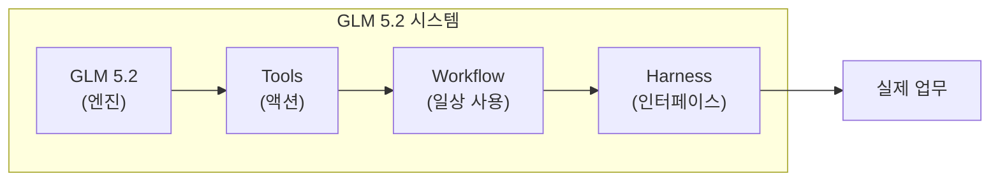

---

## 8. Claude Tag

2026년 6월 23일, Anthropic은 **Claude Tag** 공개 베타를 출시했다. 이 제품은 팀 레벨 하네스 전쟁에서 Anthropic이 꺼내든 가장 강력한 카드다.

### Claude Tag란 무엇인가

Claude Tag는 팀이 Claude와 협업하는 새로운 방식이다. Slack에서 시작하며, Claude가 팀 멤버로서 참여할 수 있다. 선택한 채널에 Claude 접근 권한을 부여하고, 원하는 도구, 데이터, 심지어 코드베이스까지 연결하면, 채널 내 누구든 @Claude를 태그하여 다른 업무에 집중하는 동안 작업을 위임할 수 있다. Claude는 해당 채널에서 관련 정보를 기억하고, 미래에 완료할 작업을 계획할 수도 있다.

Claude Tag를 기존 Slack 챗봇과 차별화하는 것은 그 아래 아키텍처다. 채널당 하나의 Claude가 팀 전체와 상호작용한다. 한 채널에 각 사람마다 별도의 Claude 인스턴스가 있는 것이 아니라, 모든 팀원이 상호작용하는 Claude 하나가 있다. 동료가 Claude와 시작한 스레드를 이어받아 컨텍스트를 다시 설명하지 않고도 계속 진행할 수 있다.

### 개인 AI에서 팀 레벨 AI로의 전환

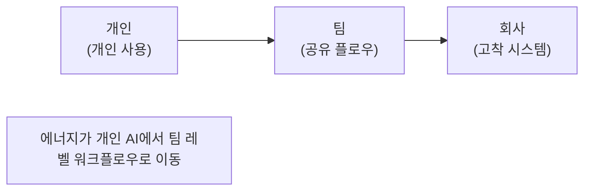

이것이 바로 Nate B Jones가 강조하는 핵심 변화다. 지금까지 AI 생산성은 주로 **개인 생산성**이었다. 나 혼자 ChatGPT나 Claude에게 질문하고, 내 업무를 처리하는 방식이었다. 이것을 **팀 생산성**으로 전환하는 것이 다음 단계인데, Claude Tag는 그 첫 번째 실질적인 제품 형태다.

### 놀라운 내부 지표


Anthropic이 내부적으로 연중 내내 실행해온 Claude Tag 덕분에 제품팀이 Claude Tag 자체를 구축하는 코드의 65%를 작성했다 — 즉, 도구 자체가 자기 자신을 만들었다.

### Claude Tag의 주요 기능

**멀티플레이어 AI**: 채널 내 모든 구성원이 동일한 Claude 인스턴스를 공유하고, 누구든 이어서 작업을 이어받을 수 있다.

**Ambient(주변) 모드**: Claude Tag에는 '앰비언트 행동' 기능이 있어 조직 전반의 직원들에게 정보를 사전에 업데이트하고, 조용히 사라진 스레드나 작업에 자동으로 후속 조치를 취할 수 있다.

**시간에 걸친 학습**: Claude는 채널을 팔로우하면서 해당 업무에 대한 컨텍스트를 점점 쌓아간다. 사용자는 매번 처음부터 설명할 필요가 없어진다.

**접근성 및 출시 일정**: Claude Enterprise 고객은 $25,000 상당의 런치 크레딧을, 최소 10석 이상의 Claude Team 고객은 $2,500 크레딧을 받는다. 기존 Claude in Slack 앱은 2026년 8월 3일 Claude Tag로 교체된다.

---

## 9. 컨텍스트 잠금

Claude Tag의 진정한 전략적 의미는 편의성 그 이상이다. Nate B Jones는 이를 "**회사 두뇌의 임대**"라는 날카로운 표현으로 설명한다.

### 데이터가 전략적 컨텍스트로 전환되는 구조

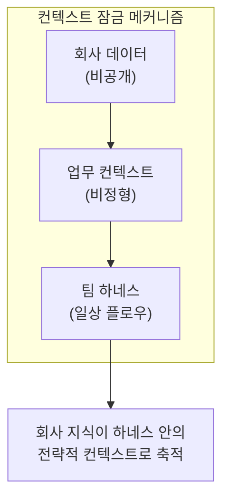

Claude Tag가 수개월에 걸쳐 채널 컨텍스트와 조직 지식을 축적하면, 이를 교체하기가 매우 어려워진다. 다중 클라우드 유연성 협상에 익숙한 기업 구매팀은 이 전환 비용 증가를 신중하게 평가해야 한다.

### 왜 아무리 저렴한 GLM 5.2도 Claude를 뽑을 수 없는가

논리적으로 이렇게 생각해보자. GLM 5.2는 Claude보다 98% 저렴하다. 대부분의 작업에서 비슷하거나 더 좋다. 그렇다면 GLM 5.2를 메인으로 쓰고 특수한 작업만 Claude에게 라우팅하는 시스템을 구축하는 게 합리적이다. **그런데**, 회사의 Slack에 Claude Tag가 이미 들어와 있고, 6개월치 채널 대화와 프로젝트 컨텍스트를 자동으로 흡수했다면?

Claude Tag를 제거하는 순간, 그 모든 누적된 컨텍스트를 잃는다. GLM 5.2로 갈아타려면 그 컨텍스트를 처음부터 다시 구축해야 한다. 이것이 단순한 편의성 문제를 넘어, 구조적 종속을 만드는 방식이다.

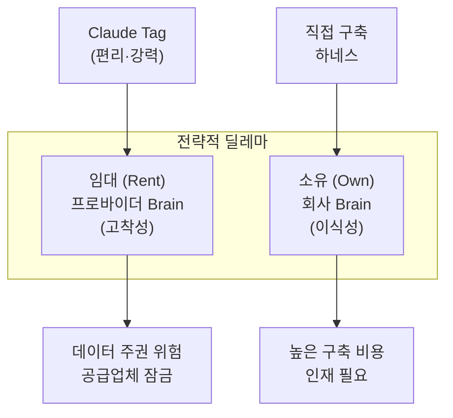

### 데이터 주권 관점

영상에서 Nate는 더 나아가 데이터 주권 문제를 제기한다. 수십 년간 기업들은 "데이터가 경쟁 우위(Data is Alpha)"라는 원칙을 배워왔다. 그런데 지금 우리는 회사의 모든 소통, 모든 의사결정 맥락, 모든 업무 지식을 프론티어 모델 제공업체의 서버 안에 컨텍스트로 넣어두고 있다. 설령 그들이 훈련 데이터로 사용하지 않더라도(실제로 대부분의 기업 계약에서는 금지된다), 기업은 사실상 자신의 컨텍스트를 스스로에게 임대하는 상황이 된다.

---

## 10. Last Mile 문제

영상 전체를 관통하는 핵심 개념은 **"Last Mile(마지막 한 걸음)"** 이다. AI 도입에서 "마지막 한 걸음"이란 모델의 지능을 실제 비즈니스 가치로 변환하는 마지막 연결 단계를 의미한다.

### Last Mile의 정의

단순화하면 이렇게 표현할 수 있다.

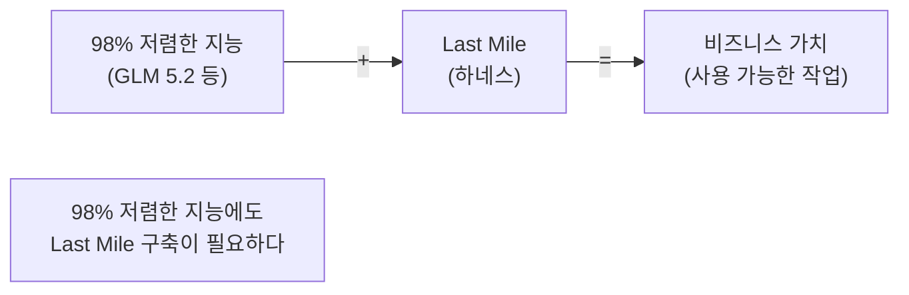

아무리 저렴한 모델이 있어도, 그것을 실제 업무 환경에 맞게 연결하는 작업 — 라우팅, 메모리 관리, 도구 통합, 품질 검증, 예외 처리, 로깅, 오케스트레이션 — 이 없다면 모델은 "병 속의 두뇌"에 불과하다.

### Raw IQ vs Last Mile

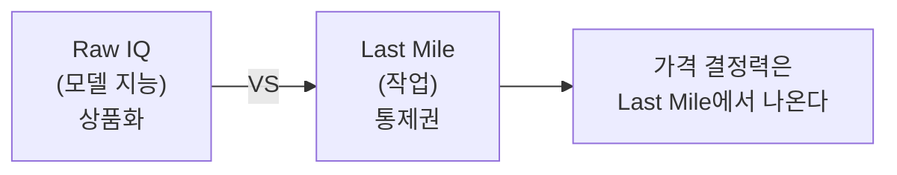

이것이 Anthropic이 여전히 높은 가격에 토큰을 팔 수 있는 이유다. 모델 지능 자체는 점점 상품화되고 있지만, 그 지능을 실제로 사용 가능한 작업으로 변환하는 Last Mile을 누가 통제하느냐가 진정한 경쟁 우위가 된다.

### Task 라우팅: 지능을 비용 효율적으로 배분하기

2026~2027년의 핵심 기술 역량은 **어떤 작업이 어떤 모델에 가야 하는지 실시간으로 판단하는 능력**이다.

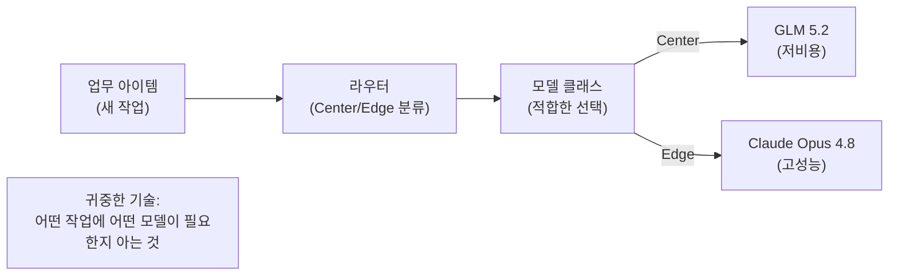

Nate는 영상에서 이 라우팅 능력을 "2026~2027년 기업들의 핵심 투자 테마"로 지목한다. 작업이 들어오면 그것이 분포 중심인지 엣지인지 실시간으로 분류하고, 분포 중심 작업은 자동으로 GLM 5.2나 DeepSeek 같은 저비용 모델로 보내고, 엣지 작업만 프론티어 모델로 라우팅하는 시스템이 기업 AI 전략의 핵심이 될 것이다.

---

## 11. 하네스 인재 부족

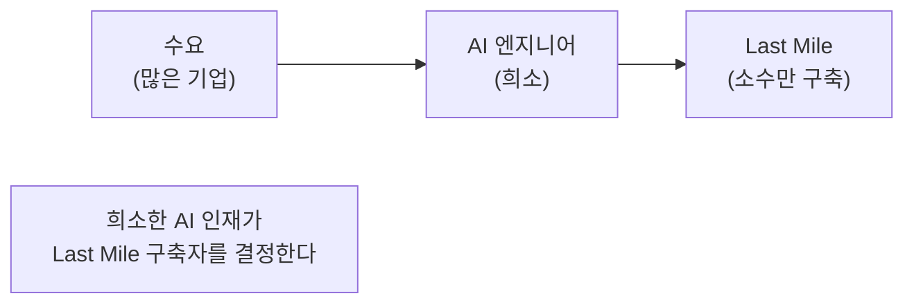

### AI 인재 시장의 현실

하네스를 구축할 수 있는 AI 엔지니어링 인재는 현재 극도로 희소하다. 이들은 원하는 대가를 요구할 수 있으며, 대부분은 하이퍼스케일러나 대형 기업으로 흡수된다. 결과적으로 자체적인 Last Mile 하네스와 자동 라우터를 구축할 수 있는 기업은 그 비용을 감당할 수 있는 극소수에 불과하다.

이것이 역설을 만든다. 기술적으로는 GLM 5.2가 98% 저렴하지만, 그것을 실제로 활용하기 위한 하네스 구축 인재가 없어서 기업들은 더 비싼 프론티어 모델 계약에 사인하게 된다. 그리고 프론티어 모델 제공업체들은 풍부한 현금흐름과 수천 명의 Forward-Deployed Engineer를 보유하고 있기 때문에, Claude Tag 같은 편의성 높은 제품을 빠르게 출시하여 고착성을 높인다.

### 빌더에게 열리는 기회

바로 여기서 기회가 생긴다. 영상에서 Nate는 "하네스 구축 방법을 아는 사람이 엄청난 수요를 받게 될 것"이라고 강조한다. 구체적으로 다음과 같은 기술 역량을 가진 사람이 가장 가치 있다.

- GLM 5.2에서 도구 호출(tool call)을 어떻게 처리하는지, Claude와 어떻게 다른지 아는 사람
- 모델별 메모리 아키텍처가 어떻게 달라야 하는지 설계할 수 있는 사람
- 분포 중심 모델에 맞게 시스템 프롬프트를 조정하는 방법을 아는 사람
- 에이전틱 파이프라인을 오픈소스 모델로 리팩토링할 수 있는 사람
- 작업을 실시간으로 분류하여 적합한 모델로 라우팅하는 시스템을 구축할 수 있는 사람

대행사(agency)나 컨설팅 회사에 있다면, 이것은 황금 거위 같은 기회다. "토큰 비용을 절감해드리겠습니다"를 ROI 명제로 삼아 리팩토링 프로젝트를 팔 수 있다. 단, 품질을 유지하면서 리팩토링해야 하므로 결코 쉬운 일이 아니다.

---

## 12. 전략적 시사점

영상 말미에 Nate B Jones는 기업과 개인 모두에게 지금 당장 물어봐야 할 질문들을 제시한다.

### 기업을 위한 핵심 질문

**1. 자사 작업 분포 분석을 해봤는가?**

현재 AI에게 시키는 작업 중 몇 퍼센트가 분포 중심이고, 몇 퍼센트가 분포 엣지인가? 이 질문에 답하지 않고 모델 전략을 세우는 것은 근본을 모르고 외피만 건드리는 것이다.

**2. 컨텍스트를 임대하길 원하는가, 소유하길 원하는가?**

Claude Tag 같은 팀 레벨 하네스는 매우 편리하지만, 그 편의성의 대가로 회사의 핵심 지식과 컨텍스트가 외부 공급업체에 종속된다. 이 트레이드오프를 의식적으로 선택해야 한다.

**3. Last Mile을 구축할 기술 인재에 접근할 수 있는가?**

있다면, 어떤 작업 세트에 저렴한 모델을 적용하면 토큰 비용을 크게 줄일 수 있는지 분석해야 한다. 없다면, 그 인재를 어떻게 확보할 것인지가 AI 전략의 핵심 문제다.

**4. 지금 사용하는 하네스 구조가 모델 독립적(model-agnostic)인가?**

특정 모델의 응답 형식이나 도구 호출 방식에 하드코딩된 파이프라인을 가지고 있다면, 나중에 전환하려 할 때 Lindy처럼 예상을 크게 뛰어넘는 규모의 재구축 작업을 각오해야 한다. 처음부터 모델 독립적으로 설계하는 것이 훨씬 효율적이다.

### 모델 전략 결정 프레임워크

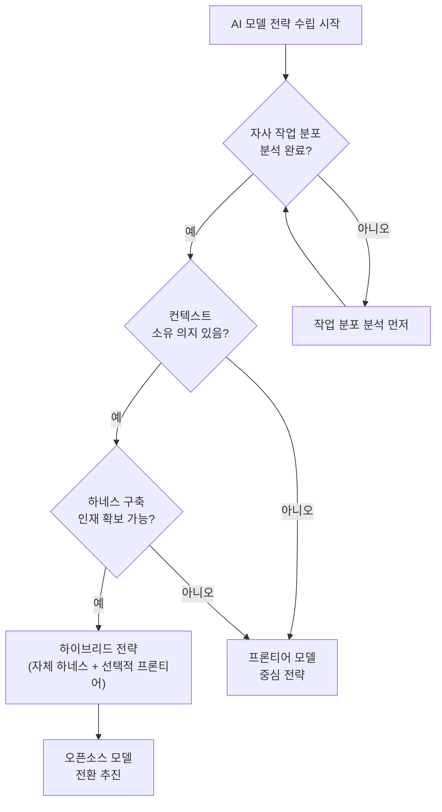

---

## 13. 결론

### 핵심 메시지 요약

GLM 5.2는 실제로 인상적인 모델이다. 단순히 "저렴한 것치고 괜찮다"는 수준이 아니라, 분포 중심 작업 — 인류 집단 지식노동의 대부분 — 에서는 가장 뛰어난 모델이다.

그런데 그것만으로는 부족하다. 모델이 아무리 훌륭해도, 그것을 실제 업무 환경에서 가치 있게 만드는 것은 **하네스**다. 그리고 하네스를 구축하는 일은 단순한 기술 작업을 넘어서, 조직의 작업 분포를 이해하고, 컨텍스트 소유권 전략을 결정하고, 모델 간 라우팅 시스템을 설계하는 복합적인 과제다.

Anthropic의 Claude Tag는 이 하네스 전쟁에서 강력한 한 수다. 팀의 Slack 대화 속으로 파고들어 조직의 암묵적 지식을 자동으로 흡수하는 이 제품은, 가격 대비 성능만으로는 뛰어넘기 어려운 구조적 고착성을 만들어낸다.

### 2026년 AI 시장의 진짜 경쟁

기업 구매팀은 일반적으로 멀티클라우드 유연성 협상에 익숙하지만, AI 에이전트가 수개월 동안 운영 설정과 채널 컨텍스트를 축적한 다음에는 전환 비용이 크게 증가한다.

모델 지능은 점점 상품화되고 있다. 진짜 경쟁은 **Last Mile**에서 벌어진다. 어떤 AI 제공업체가 기업의 일상 업무 속으로 가장 깊숙이, 가장 유용하게 파고들어 그 조직의 지식과 컨텍스트를 학습하느냐가 2026~2027년 AI 시장의 진짜 전쟁터다.

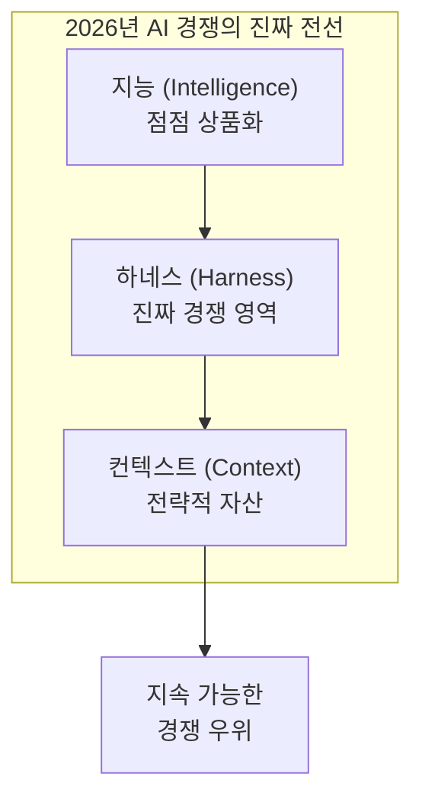

### 기억해야 할 세 가지

첫째, **GLM 5.2는 분포 중심 작업에서 진지하게 고려할 가치가 있다.** 단순히 저렴하기 때문이 아니라, 그 작업 범주에서 실제로 최고 수준이기 때문이다.

둘째, **모델 교체는 하네스 교체다.** 저렴한 모델로 전환하는 것은 API 엔드포인트를 바꾸는 게 아니라 전체 작업 시스템을 재구축하는 일임을 기억해야 한다. Lindy의 사례가 그 현실을 잘 보여준다.

셋째, **지금 당장 자사 컨텍스트 전략을 고민해야 한다.** 너무 편리하고 유용해서 거부하기 어려운 도구들이 조직의 두뇌를 임대 형태로 잠식하고 있다. 이 트레이드오프를 의식적으로, 전략적으로 결정해야 한다. 그렇지 않으면 어느 날 "우리 회사 두뇌를 우리가 임대하고 있다"는 것을 깨달았을 때 이미 늦은 상황이 될 수 있다.

---

## 참고 자료

- **원본 영상**: Nate B Jones — "GLM 5.2 Is Free And Beats Claude On Most Work. So Why Can't Companies Switch?" (2026-06-29)  
  https://www.youtube.com/watch?v=Zp8lr6IzUnQ

- **Nate의 뉴스레터 (Substack)**:  
  https://natesnewsletter.substack.com/p/glm-5-2-context-lock-in

- **GLM 5.2 공식 GitHub (Z.ai)**:  
  https://github.com/zai-org/GLM-5

- **GLM 5.2 HuggingFace 블로그 (Z.ai)**:  
  https://huggingface.co/blog/zai-org/glm-52-blog

- **Anthropic — Claude Tag 공식 발표** (2026-06-23):  
  https://www.anthropic.com/news/introducing-claude-tag

- **Lindy — Claude에서 DeepSeek로의 마이그레이션 공개 블로그**:  
  https://www.lindy.ai/blog/migrating-from-claude-to-deepseek

- **VentureBeat — Claude Tag 출시 분석**:  
  https://venturebeat.com/technology/anthropic-launches-claude-tag

- **Lawfare — 미국 정부 AI 수출 통제 분석**:  
  https://www.lawfaremedia.org/article/a-kill-switch-for-frontier-ai

---

*작성일자: 2026-06-29*

---

## 부록: AI Talent란 무엇인가 — 영상이 말하는 진짜 의미

> 이 부록은 영상에서 Nate B Jones가 "AI talent"라고 부를 때 의미하는 대상을 구체적으로 해부한다. 일반적인 의미의 AI 인재(연구자, 데이터 과학자)가 아니라, **Last Mile 하네스를 실제로 구축할 수 있는 엔지니어**를 지칭한다.

---

### 부록 1. 영상이 말하는 "AI talent"의 정의

영상에서 Nate는 AI talent를 다음과 같이 맥락화한다.

> *"The only companies that can build their own last mile harnesses, their own auto routers, are companies that can afford the AI talent to do that, which is very scarce."*

이 문장이 핵심이다. 여기서 "AI talent"는 다음 두 가지를 동시에 할 수 있는 사람을 뜻한다.

첫째, **하네스를 처음부터 재구축**하는 것 — GLM 5.2처럼 다른 동작 방식을 가진 오픈소스 모델을 실제 업무 환경에서 작동하도록 도구 호출(tool call), 메모리, 시스템 프롬프트 구조를 모두 새로 설계하는 일이다.

둘째, **작업 라우터를 만드는 것** — 들어오는 작업이 분포 중심인지 분포 엣지인지를 실시간으로 분류하고, 각각의 작업을 비용 대비 가장 적합한 모델로 자동 배분하는 시스템을 구축하는 일이다.

즉 영상에서 "AI talent"는 **AI 하네스 엔지니어 = Last Mile 빌더**를 가리키는 말이다. 이것은 넓은 의미의 AI 인재(ML 연구자, 데이터 과학자, AI 전략가 등) 전반을 포함하지 않는다.

---

### 부록 2. Last Mile Engineer란 어떤 일을 하는가

하네스 엔지니어링(Harness Engineering)은 2026년 초에 독립적인 엔지니어링 분야로 공식 명명된 신생 직군이다. 2026년 2월 Mitchell Hashimoto(HashiCorp, Terraform 창시자)의 블로그 포스트에서 처음 명명되었고, OpenAI의 Ryan Lopopolo가 프로덕션 응용 사례를 발표하면서 업계 표준 용어로 자리 잡았다.

Phil Schmid(著名 AI 엔지니어)의 비유가 가장 명확하다.

> 모델은 CPU다 — 원시 연산 능력.  
> 컨텍스트 윈도우는 RAM이다 — 제한적이고 휘발성 있는 작업 메모리.  
> **하네스는 운영체제다** — 컨텍스트를 관리하고, 부팅 시퀀스를 처리하고, 표준 드라이버를 제공하며, 자원을 관리한다.

Last Mile Engineer는 이 운영체제, 즉 하네스를 설계하고 구축하고 유지보수하는 사람이다. 구체적으로 수행하는 작업은 다음과 같다.

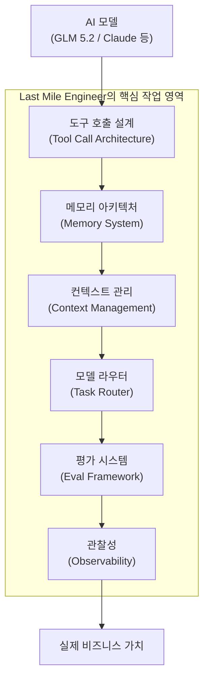

**도구 호출 설계(Tool Call Architecture)**: 모델이 외부 시스템(API, DB, 코드 실행 환경)과 상호작용하는 방식을 정의한다. GLM 5.2의 tool call 형식은 Claude와 다르며, 이 차이를 모르고 프롬프트만 바꾸면 에이전트가 동작하지 않는다. LLM이 도구를 직접 호출하도록 설계하는 것은 안티패턴이며, 하네스 레이어가 반드시 중간에서 검증·라우팅해야 한다.

**메모리 아키텍처(Memory System)**: 단기 기억(현재 컨텍스트 윈도우), 중기 기억(세션 간 상태), 장기 기억(벡터 DB, 지식 베이스)을 각 모델의 특성에 맞게 설계한다. 분포 중심 모델(GLM 5.2 등)은 메모리 구조가 달라야 한다.

**컨텍스트 관리(Context Management)**: 100만 토큰 컨텍스트 윈도우가 있어도 비용·속도 최적화를 위해 무엇을 언제 컨텍스트에 넣고 뺄지 결정하는 압축(compaction) 전략이 필요하다. Claude Code의 경우 예산 감소 → 축약 → 마이크로컴팩션 → 컨텍스트 붕괴 → 자동 컴팩션의 5단계 점진적 압축 패턴을 사용하는 것으로 알려져 있다.

**모델 라우터(Task Router)**: 들어오는 작업을 분류하여 최적의 모델로 보내는 핵심 인프라다. 이것이 바로 Nate가 "auto router"라고 부르는 것이다. 작업의 복잡도, 비용 민감도, 오류 허용 범위, 출력 검증 용이성 등을 종합적으로 판단해 GLM 5.2로 갈지 Claude Opus로 갈지 결정한다.

**평가 시스템(Eval Framework)**: 모델을 교체했을 때 품질이 유지되는지 측정하는 체계다. Lindy가 DeepSeek 전환 시 6~9개월을 쓴 것의 대부분이 바로 이 단계 — 오프라인 평가, 프롬프트 최적화, 점진적 롤아웃 — 였다.

**관찰성(Observability)**: 에이전트가 프로덕션에서 어떻게 행동하는지 모니터링하는 로깅·트레이싱·비용 추적 시스템이다. 엔터프라이즈 AI 실패의 65%가 모델 품질 문제가 아니라 하네스 결함 — 컨텍스트 드리프트, 스키마 불일치, 상태 저하 — 에서 비롯된다는 분석이 있다.

---

### 부록 3. 왜 이 인재가 극도로 희소한가

하네스 엔지니어링은 2026년 초에야 비로소 독립적인 분야로 명명된 만큼, 정식 교육 커리큘럼이 거의 없다. 대학에서 가르치지 않고, 부트캠프도 아직 따라잡지 못했으며, 자격증 체계도 초기 단계다. 이 역량은 오직 실제 프로덕션 에이전트를 반복적으로 구축하고 실패하면서 얻어진다.

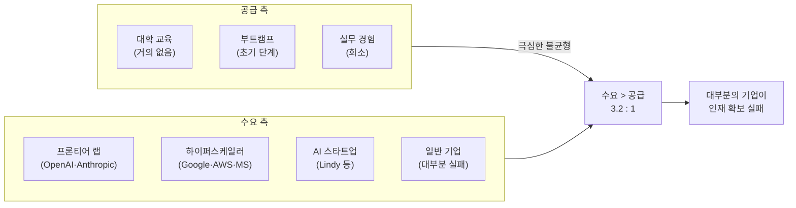

이 희소성에는 또 다른 구조적 원인이 있다. 하네스 엔지니어로 성장할 수 있는 주니어 인재들이 AI 도구 자동화로 인해 대량 해고되고 있다는 점이다. 기업들은 AI로 비용을 절감하면서 주니어 개발자 채용을 줄이고 있는데, 이 주니어들이 3~5년 후 시니어 AI 아키텍트와 하네스 엔지니어가 될 인재풀이었다. 씨앗을 먹어치우고 있는 셈이다.

결과적으로 이 인재들은 원하는 보수를 요구할 수 있다. 그리고 대부분은 OpenAI·Anthropic 같은 프론티어 랩이나 대형 하이퍼스케일러로 흡수된다. 일반 기업 입장에서는 그 비용을 감당하기 어렵기 때문에, 결국 더 비싼 프론티어 모델 계약으로 돌아가게 된다. 프론티어 제공업체들은 바로 이 공백에서 수천 명의 Forward-Deployed Engineer를 투입해 Claude Tag 같은 편의성 높은 제품을 빠르게 출시하며 고착성을 높인다.

---

### 부록 4. Last Mile Engineer의 기술 스택

영상 맥락에서 "AI talent"가 보유해야 할 기술을 계층적으로 정리하면 다음과 같다.

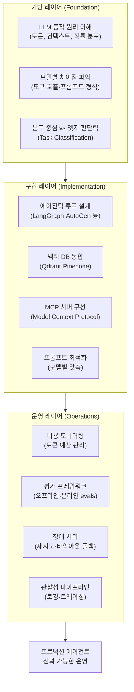

**기반 레이어**는 어느 하나의 프레임워크나 도구가 아닌, 모델이 어떻게 동작하는지에 대한 근본적 이해다. GLM 5.2에서 tool call이 Claude와 다르게 작동하는 이유를 설명할 수 있어야 하고, 어떤 작업이 100만 토큰 컨텍스트가 필요하고 어떤 작업은 8K면 충분한지 판단할 수 있어야 한다.

**구현 레이어**는 실제 에이전틱 파이프라인을 구축하는 기술이다. LangGraph나 AutoGen 같은 오케스트레이션 프레임워크, Qdrant 같은 벡터 DB, 그리고 2026년 표준으로 자리잡은 MCP(Model Context Protocol)를 활용한 도구 통합이 핵심이다.

**운영 레이어**는 프로덕션에서 에이전트가 안정적으로 돌아가게 하는 것이다. 토큰 비용이 예산을 초과하지 않도록 모니터링하고, 오프라인·온라인 평가를 통해 모델 교체 시 품질을 검증하며, 장애가 발생했을 때 자동 복구하는 로직을 설계한다.

---

### 부록 5. "AI talent"가 없으면 어떤 일이 벌어지는가

영상의 핵심 논리 구조를 다시 정리하면 다음과 같다.

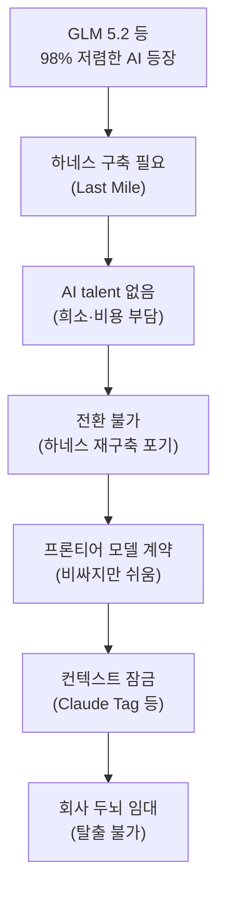

이것이 영상이 설명하는 전체 인과관계다. 저렴한 모델은 존재하지만, 그것을 활용하기 위한 하네스를 만들 수 있는 "AI talent"가 없기 때문에, 기업들은 결국 더 비싼 프론티어 모델로 돌아가고, 프론티어 제공업체들은 Claude Tag 같은 팀 레벨 하네스로 컨텍스트 잠금을 심화시키며, 기업들은 점점 더 빠져나오기 어려운 구조에 갇힌다.

---

### 부록 6. 하네스 빌더에게 열리는 기회

Nate가 영상 말미에 강조하는 것은 바로 이 구조적 역설이 **빌더에게는 기회**라는 점이다.

AI talent가 희소하다는 것은 그 역량을 가진 사람이 엄청난 레버리지를 갖는다는 뜻이다. 특히 에이전시나 컨설팅 회사 형태로 이 역량을 제공할 수 있다면, "토큰 비용을 절감해드리겠습니다"는 ROI 명제는 강력하다. 기업이 Claude에 월 수천만 원을 쓰고 있다면, 그 비용의 70~80%를 오픈소스 모델로 전환하면서 절감하는 것을 도와주는 서비스는 명확한 비즈니스 가치가 있다.

단, 다음 조건이 충족되어야 한다.

**작업 분포 분석 능력**: 고객사의 AI 사용 패턴을 분석해 어떤 작업이 분포 중심이고 어떤 것이 엣지인지 정확히 분류할 수 있어야 한다. 이것 없이 무조건 "다 GLM 5.2로 교체"를 주장하면 실패한다.

**모델별 하네스 구축 경험**: 최소한 두 가지 이상의 서로 다른 모델(예: Claude와 GLM 5.2)에서 에이전틱 파이프라인을 직접 구축하고 프로덕션까지 올려본 경험이 있어야 한다. 이론만으로는 Lindy가 왜 6~9개월이 걸렸는지를 이해할 수 없고, 고객에게 현실적인 일정을 제시할 수도 없다.

**품질 유지를 위한 평가 체계**: 비용은 줄이면서 품질을 유지한다는 약속을 증명할 수 있는 평가 프레임워크가 필수다. Lindy가 전환 과정에서 가장 많은 시간을 쓴 것도 바로 이 부분이었다.

Nate의 표현을 빌리면, 이것은 "trillion dollar last mile"이다. AI 지능 자체가 98% 저렴해졌는데도 기업들이 그것을 활용하지 못하는 이유가 Last Mile이라면, 그 Last Mile을 만들어주는 사람의 가치는 지능 그 자체보다 훨씬 크다.

---

*부록 작성일자: 2026-06-29*

---

## 별첨: Hermes Agent 같은 도구가 있는데 하네스를 직접 만들어야 하는가?

> 이 별첨은 "Hermes Agent처럼 이미 완성된 하네스 도구를 쓰면 Last Mile Engineer가 필요 없는 것 아닌가?"라는 핵심 질문을 정면으로 다룬다. 결론부터 말하면, **두 가지 극단 모두 틀렸다.** 완성된 하네스 도구가 Last Mile을 없애지도 않고, 기업마다 Hermes Agent를 만들 정도의 엔지니어가 필요하지도 않다. 진실은 그 사이의 세 번째 지점에 있다.

---

### 별첨 1. Hermes Agent는 무엇인가 — 먼저 정확히 이해하기

Nous Research가 2026년 2월 MIT 라이선스로 출시한 Hermes Agent는 **모델 불가지론적(model-agnostic) 에이전트 하네스**다. 여기서 중요한 표현이 "에이전트 하네스"다. Hermes Agent는 Hermes LLM 모델 패밀리(Hermes 3: 8B·14B·70B·405B)와 이름을 공유하지만 전혀 다른 것이다. Hermes LLM이 두뇌(모델)라면, Hermes Agent는 그 두뇌를 실제로 작동시키는 운영체제(하네스)다.

Hermes Agent의 핵심 특징은 다음과 같다. 내장 학습 루프를 갖추고 있어 사용 경험에서 Skills(기술 플러그인)를 자동 생성하고 반복적으로 개선한다. 세션 간 지속 메모리를 유지하며 사용자와의 맥락을 축적한다. OpenRouter, OpenAI, Nous Portal, 사용자 정의 엔드포인트 등 어떤 모델 제공업체와도 연동된다. 5달러짜리 VPS부터 GPU 클러스터까지 어디에서나 실행된다. Telegram, Discord, Slack, WhatsApp 등 17개 이상의 메시징 플랫폼을 단일 게이트웨이로 지원한다.

리뷰어들은 Hermes Agent를 이렇게 평가한다.

> *"Hermes is the first personal AI agent that ships with the harness already built in. Every other agent I have used — Claude Code, Cursor, Aider, OpenClaw — requires you to hand-craft the harness yourself. CLAUDE.md, hooks, memory files, workflows. Hermes automates all five layers and lets the harness grow with you."*

즉 Hermes Agent는 **하네스가 이미 내장된 에이전트 런타임**이다. 이것이 대부분의 다른 AI 코딩 도구와의 핵심 차이점이다.

---

### 별첨 2. 세 가지 레벨로 보는 하네스 생태계

"Hermes Agent가 있으면 Last Mile이 필요 없다"와 "Hermes Agent를 만들 수준의 엔지니어가 필요하다" 사이에는 실제로 세 가지 레벨이 존재한다. 이 레벨을 혼동하는 것이 기업들이 AI 인재 전략에서 범하는 가장 흔한 실수다.

```mermaid
flowchart TD
    subgraph L1["레벨 1: 프레임워크 빌더 (Framework Builder)"]
        L1A["Hermes Agent 자체를 만드는 수준\n(Nous Research, LangChain팀 등)"]
    end
    subgraph L2["레벨 2: 하네스 엔지니어 (Harness Engineer)"]
        L2A["기존 프레임워크를 기업 맥락에 맞게\n통합·설정·확장하는 수준\n(Last Mile Builder)"]
    end
    subgraph L3["레벨 3: 하네스 사용자 (Harness User)"]
        L3A["완성된 도구를 그대로 사용하는 수준\n(개인 생산성·단순 프로세스)"]
    end

    L1 --> WHO1["AI 연구소·대형 오픈소스 프로젝트"]
    L2 --> WHO2["대부분의 기업이 필요로 하는 인재\n(Nate가 말하는 AI talent)"]
    L3 --> WHO3["개인 사용자·단순 자동화 팀"]

    L3 -->|"프로덕션 복잡도 증가"| FAIL["기업 환경에서 한계 도달"]
    FAIL -->|"레벨 업 필요"| L2
    L2 -->|"연구·혁신 필요"| L1
```

**레벨 1 (프레임워크 빌더)**: Nous Research가 Hermes Agent를 만들고, LangChain 팀이 LangGraph를 만들고, Anthropic이 Claude Agent SDK를 만드는 수준이다. 기업 대부분은 이 수준의 인재가 필요하지 않다. 이미 훌륭한 오픈소스 프레임워크들이 존재한다.

**레벨 2 (하네스 엔지니어)**: 이것이 바로 Nate B Jones가 영상에서 "AI talent"라고 부르는 대상이다. Hermes Agent, LangGraph, AutoGen 같은 기존 프레임워크를 사용하되, 그것을 기업의 특수한 맥락과 시스템에 맞게 통합·설정·확장하고, 모델 전환 시 필요한 조정을 수행하며, 작업 라우팅 로직을 설계하는 사람이다.

**레벨 3 (하네스 사용자)**: Hermes Agent를 설치하고 기본 설정으로 사용하거나, Claude Tag를 그대로 Slack에 연결하는 수준이다. 개인 생산성이나 단순한 자동화에는 충분하지만, 기업 프로덕션 환경에서는 금세 한계에 부딪힌다.

**Nate가 말하는 "AI talent"는 레벨 2다.** 레벨 1 수준의 엔지니어는 필요 없고, 레벨 3으로는 부족하다. 그리고 레벨 2 인재가 극도로 희소하다는 것이 영상의 핵심 주장이다.

---

### 별첨 3. "그냥 Hermes Agent 쓰면 되는 거 아니야?" — 기업 환경의 현실

Hermes Agent는 개인 개발자나 소규모 팀에게는 매우 강력한 도구다. 하지만 기업 환경에서 "그냥 설치해서 쓰면 된다"는 생각이 왜 순진한지를 구체적으로 살펴보자.

```mermaid
flowchart LR
    subgraph HERMES_ALONE["Hermes Agent 단독 사용의 한계"]
        HA["Hermes Agent\n(에이전트 런타임)"]
    end
    subgraph ENTERPRISE_NEEDS["기업이 추가로 필요한 것들"]
        EN1["접근 권한 범위 설정\n(어떤 데이터에 접근 허용?)"]
        EN2["감사 로그\n(누가 무엇을 했나?)"]
        EN3["회사 시스템 통합\n(ERP·BSS·OSS·사내 API)"]
        EN4["모델 라우팅 로직\n(GLM 5.2 vs Claude 선택)"]
        EN5["도메인 특화 Skills\n(회사 고유 업무 프로세스)"]
        EN6["롤백·장애 복구\n(에이전트 오작동 시)"]
        EN7["규제·컴플라이언스\n(데이터 주권·감사 요건)"]
    end

    HERMES_ALONE --> GAP["이 갭을 메우는 것이\nLevel 2 Harness Engineer의 일"]
    ENTERPRISE_NEEDS --> GAP
```

실제로 Hermes Agent 전문가들조차 이 점을 명확히 한다.

> *"Hermes Agent can be the worker, but the harness is the governed operating layer that makes agent work safe. What they don't automatically solve — especially in regulated, integration-heavy environments — is the set of constraints that keep your org safe when the agent inevitably makes mistakes."*

이것을 Kubernetes 비유로 설명하면 가장 명확하다. Kubernetes는 누구나 설치해서 쓸 수 있는 오픈소스다. 그런데 "Kubernetes가 있으니 DevOps 엔지니어 없이 프로덕션에서 운영해도 된다"고 말하는 기업은 없다. Kubernetes를 프로덕션에서 안정적으로 운영하려면 그 내부 동작을 깊이 이해하는 엔지니어가 반드시 필요하다.

Hermes Agent도 마찬가지다. 도구가 있다고 인재가 필요 없어지는 것이 아니라, **도구를 제대로 쓰기 위한 인재의 성격이 달라지는 것**이다.

---

### 별첨 4. 그렇다면 Level 2 Harness Engineer는 구체적으로 무엇을 하는가

Hermes Agent를 예로 들어 레벨 2 하네스 엔지니어가 기업 환경에서 실제로 수행하는 작업을 구체적으로 살펴보자.

**① 모델 전환 설정과 최적화**

Hermes Agent의 핵심 강점 중 하나는 `hermes model` 명령 하나로 GLM 5.2, Claude, GPT-5.5, DeepSeek 등 어떤 모델로도 전환할 수 있다는 것이다. 그런데 단순히 모델 이름을 바꾸는 것이 전환의 전부가 아니다. Lindy가 6~9개월 동안 한 일이 바로 이것이다 — 동일한 Hermes/DeepSeek 환경에서 프롬프트 구조, 도구 호출 방식, 메모리 압축 전략을 해당 모델의 특성에 맞게 재조정하는 작업. 레벨 2 엔지니어는 `hermes model glm-5.2`를 입력하는 것이 아니라, GLM 5.2가 Claude와 다르게 반응하는 엣지 케이스를 파악하고 시스템 프롬프트와 평가 파이프라인을 재조정한다.

**② 회사 전용 Skills 개발**

Hermes Agent의 Skills는 에이전트의 기능을 확장하는 플러그인 시스템이다. 커뮤니티 Skills Hub에 수천 개의 공개 Skills가 있지만, 기업 고유의 업무 프로세스 — 사내 ERP 연동, 특정 승인 워크플로우, 내부 지식 베이스 접근 — 를 자동화하는 Skills는 직접 만들어야 한다. Shopify Admin GraphQL Skills를 예로 들면, 이것은 Hermes 팀이 공식 제공하지만 특정 회사의 사내 발주 시스템 Skills는 해당 회사의 하네스 엔지니어가 만든다.

**③ 작업 라우터 구축**

영상에서 Nate가 강조하는 "auto router" — 분포 중심 작업은 GLM 5.2로, 엣지 작업은 Claude Opus로 보내는 시스템 — 는 Hermes Agent 자체에 내장된 기능이 아니다. 어떤 하네스 프레임워크도 이 비즈니스 특화 라우팅 로직을 기본 제공하지 않는다. 해당 회사의 작업 분포를 분석하고, 분류 기준을 설계하고, 라우팅 로직을 구현하는 것이 레벨 2 엔지니어의 고유한 작업이다.

**④ 거버넌스·컴플라이언스 레이어 설계**

특히 금융·통신·공공 분야 기업에서는 에이전트가 어떤 데이터에 접근할 수 있는지, 어떤 행동이 자동 승인되고 어떤 것은 인간 검토가 필요한지, 모든 에이전트 행동이 감사 가능한 형태로 기록되는지를 설계해야 한다. Hermes Agent의 자기 수정(self-modifying) Skills 기능은 개인 개발자에게는 강점이지만, SOC2 감사가 필요한 엔터프라이즈 환경에서는 이 기능을 어떻게 제한·기록·검증할지 설계해야 한다.

**⑤ 평가와 관찰성 파이프라인**

LangSmith, Langfuse, Arize 같은 관찰성 도구를 Hermes Agent와 연결하고, 모델 전환 전후의 품질을 체계적으로 비교하는 오프라인·온라인 평가 프레임워크를 구축하는 것도 레벨 2 엔지니어의 몫이다. 단순히 "잘 되는 것 같다"는 체감이 아니라, 측정 가능한 품질 지표를 기반으로 모델 전환 결정을 내릴 수 있어야 한다.

---

### 별첨 5. 프레임워크 생태계 지도 — 무엇이 있고 무엇을 선택해야 하는가

하네스 프레임워크는 이미 풍부하게 존재한다. 레벨 2 엔지니어의 첫 번째 역할은 이 중에서 자사 맥락에 맞는 것을 선택하고 조합하는 일이다.

```mermaid
flowchart TD
    subgraph RUNTIME["에이전트 런타임 (Agent Runtime)"]
        R1["Hermes Agent\n(Nous Research)\n자기 학습·모델 불가지론"]
        R2["OpenClaw\n(커뮤니티)\n게이트웨이 중심·MS Scout 기반"]
        R3["Claude Code\n(Anthropic)\n코딩 특화·단일 사용자"]
    end
    subgraph ORCHESTRATION["오케스트레이션 (Orchestration)"]
        O1["LangGraph\n상태 기계 기반·세밀한 제어"]
        O2["CrewAI\n역할 기반 멀티에이전트"]
        O3["AutoGen\n대화형 멀티에이전트"]
        O4["Temporal\n내구성 워크플로우"]
    end
    subgraph OBSERVABILITY["관찰성 (Observability)"]
        OB1["LangSmith\n(LangChain 생태계)"]
        OB2["Langfuse\n(오픈소스)"]
        OB3["Arize\n(엔터프라이즈)"]
    end
    subgraph MEMORY["메모리·지식 (Memory/Knowledge)"]
        M1["Qdrant\n(벡터 DB)"]
        M2["Neo4j\n(그래프 DB)"]
        M3["Obsidian·Notion\n(지식 관리)"]
    end

    RUNTIME -->|"통합"| ORCHESTRATION
    ORCHESTRATION -->|"연결"| OBSERVABILITY
    ORCHESTRATION -->|"연결"| MEMORY
    ORCHESTRATION --> RESULT["기업 특화 에이전트 시스템"]
```

이 중 어느 것 하나가 "정답"이 아니다. 실제 상황에 따른 선택 기준은 이렇다.

개인 개발자·소규모 팀이 빠르게 구축하고 싶다면 Hermes Agent가 가장 낮은 진입 장벽을 제공한다. 복잡한 상태 머신과 분기 로직이 필요한 엔터프라이즈 워크플로우라면 LangGraph가 현재 가장 성숙한 선택이다. 멀티 에이전트 협업을 빠르게 프로토타이핑하려면 CrewAI가 직관적이다. 장기 실행 워크플로우의 내구성이 최우선이라면 Temporal을 별도로 도입해야 한다.

한 가지 중요한 발견이 있다. 아이러니하게도 LangChain/LangGraph를 명시하는 채용 공고보다 프레임워크를 명시하지 않는 "프레임워크 독립적" 채용 공고의 연봉이 8만 달러 더 높다. 이유가 분명하다. 특정 프레임워크를 구현할 수 있는 사람이 아니라, **어떤 프레임워크를 쓸지 결정할 수 있는 아키텍트**가 더 귀한 인재이기 때문이다. 이것이 레벨 2 하네스 엔지니어의 본질이다.

---

### 별첨 6. 결론 — 두 질문에 대한 명확한 답

이 별첨의 출발점이었던 두 가지 질문에 명확하게 답하면 다음과 같다.

**"Hermes Agent 같은 도구를 쓰면 하네스 구축이 의미 없는가?"**

아니다. Hermes Agent는 하네스의 기초 인프라를 제공하지만, 기업 환경에서 그것을 실제로 작동시키는 데 필요한 거버넌스, 시스템 통합, 모델 라우팅, 도메인 특화 Skills 개발, 평가 파이프라인은 여전히 레벨 2 엔지니어의 몫이다. Kubernetes가 존재해도 DevOps 엔지니어가 필요한 것과 동일한 구조다.

**"Hermes Agent를 만들 수준의 엔지니어가 기업마다 필요한가?"**

아니다. 레벨 1(프레임워크 빌더) 수준의 엔지니어는 대부분의 기업에 필요하지 않다. 필요한 것은 레벨 2 — 기존 프레임워크를 깊이 이해하고, 기업의 특수한 맥락에 맞게 통합하고 확장하며, 모델 전환 시 하네스를 적절히 재조정할 수 있는 엔지니어다.

```mermaid
flowchart LR
    subgraph ANSWER["결론적 포지셔닝"]
        NO1["Hermes Agent를\n직접 만들 필요 없음\n(Level 1 불필요)"]
        YES["프레임워크를 기업 맥락에\n통합·확장·유지보수할\n엔지니어는 반드시 필요\n(Level 2 필수)"]
        NO2["설치 후\n그대로 쓰는 것만으로\n기업 프로덕션 불가\n(Level 3 부족)"]
    end

    NO1 --> YES
    YES --> NO2
    YES --> SCARCE["이 인재가\n2026년 현재\n극도로 희소함"]
    SCARCE --> LOCK["인재 없는 기업 →\nClaude Tag 등\n관리형 서비스 →\n컨텍스트 잠금"]
```

결국 영상의 논리가 이 별첨을 통해 더 정밀해진다. Nate가 말하는 "AI talent" 부족은 레벨 1 부족이 아니다. 레벨 1 수준의 도구(Hermes Agent, LangGraph 등)는 이미 충분히 존재한다. 부족한 것은 그 도구들을 자사 맥락에서 **실제로 작동하게 만들 수 있는** 레벨 2 엔지니어다. 그리고 이 레벨 2 엔지니어가 없는 기업은 결국 프론티어 제공업체의 관리형 서비스(Claude Tag, OpenAI Assistants 등)에 의존하게 되고, 컨텍스트 잠금의 경로로 진입한다.

---

*별첨 작성일자: 2026-06-29*
