> **원문 출처**: Threads `@dusskapark` 게시글 및 그에 달린 댓글들

> 
> https://www.threads.com/@dusskapark/post/DaI2S2xklbe
> 
> 요즘은 뭘 만들어야 할지 정말 모르겠다.
> 
> 기술을 몰라서 그런 건 아니다. Gemma4도 써봤고, 하네스도 만들어봤고, 루프 엔지니어링도 간단하게는 해볼 수 있다. 모델 갈아끼우고, 툴 콜링 붙이고, 에이전트처럼 돌아가게 만드는 것도 대충은 해봤다.
> 
> 근데 그래서 뭐.
> 
> 이걸 해서 뭘 만들지? 만들면 얼마나 갈까? 내가 며칠 밤 새워서 만든 기능이 다음 달에는 OpenAI나 Anthropic 기본 기능으로 들어가 있지 않을까? 아니면 모델 성능이 한 번 올라가면서 내가 만든 우회로 자체가 그냥 필요 없어지는 거 아닐까?
> 
> 요즘 내가 느끼는 AI의 무서움은 “못 따라가겠다”가 아니다. 오히려 따라가도 별 의미가 없을 것 같은 느낌에 가깝다.
> 
> 예전에는 새로운 기술을 따라가는 게 곧 기회처럼 느껴졌다. 모바일 한창일 때는 Google I/O, WWDC를 알림 맞춰가며 봤고, 몇 년 전까지는 Figma Config도 밤새가며 봤다.
> 
> 남들이 아직 잘 모를 때 먼저 만져보고, 조합해보고, 작게라도 만들어보는 게 재밌었다. 뭔가 내 자리가 있을 것 같았다.
> 
> 근데 요즘은 그 감각이 잘 안 든다.
> 
> 뭔가를 만들어도 결국 큰 회사들이 더 잘, 더 빠르게, 더 자연스럽게 자기 제품 안에 넣어버릴 것 같다. 오늘은 앱 아이디어였던 게, 몇 달 뒤에는 그냥 기본 기능이 될 것 같다.
> 
> 그러면 나는 밖에서 뭘 하고 있는 건가 싶다.
> 
> 그래서 요즘은 그냥 다 놓고, 나 필요한 거나 만들고 있다. 최근에도 새로운 AI 앱을 만들겠다기보다는 그냥 와이푸가 다니는 한인교회 버스 앱 같은 걸 만들면서 시간을 보냈다.
> 
> 근데 이게 차라리 마음이 편하다.
> 
> 그냥 내가 속한 곳에서 필요하고, 만들면 누군가는 쓸 것 같은 것. 딱 그 정도다.
> 
> 이걸 멋진 방향 전환처럼 말하고 싶지는 않다. 그냥 좀 지쳤다. 큰 판은 모르겠고, 내가 당장 아는 문제나 만들자는 상태다. 
> 
> AI SaaS는 모르겠고, 우리 교회 버스 앱이나 만들자는 상태다.
> 
> 그런데 이상하게 그게 덜 허무하다.
> 
> 적어도 이건 왜 필요한지 안다. 누가 쓸지도 안다. 큰 회사가 다음 업데이트에 넣어버릴 기능도 아닐 것 같다. 설령 넣는다고 해도, 그 회사들이 우리 교회 사정까지 알 리는 없으니까.
> 
> 몰라서 못 하는 게 아니라, 알아도 뭘 해야 할지 모르겠다. 
> 
> 진짜 뭐에 불태워야 하는지를 그냥 그 자체를 모르겠다
> 

---

## 목차

1. [이 글은 무엇인가](#1-이-글은-무엇인가)
2. [세 목소리, 하나의 주제](#2-세-목소리-하나의-주제)
3. [핵심 테마 1 — 빌더 피로 (Builder Fatigue)](#3-핵심-테마-1--빌더-피로-builder-fatigue)
4. [핵심 테마 2 — 기능 상품화 공포 (Feature Commoditization Anxiety)](#4-핵심-테마-2--기능-상품화-공포-feature-commoditization-anxiety)
5. [핵심 테마 3 — "교회 버스 앱"의 철학: 로컬 컨텍스트의 힘](#5-핵심-테마-3--교회-버스-앱의-철학-로컬-컨텍스트의-힘)
6. [기술적 맥락 — 프롬프트에서 루프 엔지니어링까지](#6-기술적-맥락--프롬프트에서-루프-엔지니어링까지)
7. [루프의 종류와 각각의 의미](#7-루프의-종류와-각각의-의미)
8. [사이드 프로젝트의 진짜 가치 — 시스템의 체화](#8-사이드-프로젝트의-진짜-가치--시스템의-체화)
9. [세 관점이 수렴하는 지점](#9-세-관점이-수렴하는-지점)
10. [결론 — AI 시대에 만드는 행위의 의미](#10-결론--ai-시대에-만드는-행위의-의미)

---

## 1. 이 글은 무엇인가

이 Threads 포스트는 AI 기술을 충분히 이해하고 직접 다룰 수 있는 한 개발자·설계자가 "그래서 뭘 만들어야 하나"라는 근본적인 질문을 솔직하게 던진 글이다. 글쓴이(`@dusskapark`)는 최신 AI 모델인 Gemma4를 써봤고, 하네스(Harness)를 직접 구성해봤으며, 루프 엔지니어링(Loop Engineering)을 실험해봤고, 에이전트처럼 동작하는 시스템도 구축해봤다. 기술적 역량의 문제가 아니다.

그럼에도 불구하고 그는 허무함을 느낀다. 이 게시글과 거기에 달린 두 개의 댓글은 각각 다른 관점에서 동일한 문제를 바라보며, 세 가지 서로 다른 해법을 제시한다. 이 문서는 그 내용을 하나하나 풀어서 설명하고, 언급된 기술 개념들의 의미, 그리고 이 대화가 현재 AI 산업에서 갖는 맥락을 상세히 서술한다.

---

## 2. 세 목소리, 하나의 주제

이 Threads 스레드에는 서로 다른 세 가지 목소리가 등장한다. 이 세 목소리를 먼저 구분해 두는 것이 전체를 이해하는 데 필수적이다.

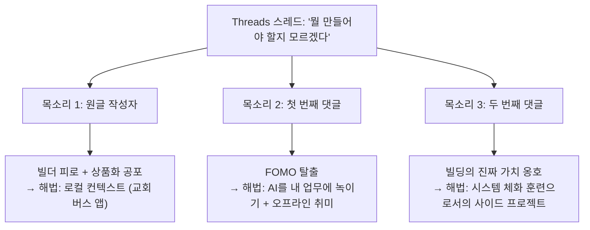

**[목소리 1 (원글)](https://www.threads.com/@dusskapark/post/DaI2S2xklbe)** 은 AI를 충분히 다룰 줄 알지만, 만들어도 의미가 없을 것 같은 허무함을 토로한다. 오늘 만든 기능이 다음 달 OpenAI나 Anthropic의 기본 기능으로 편입되거나, 모델 성능 향상으로 자신이 만든 우회로 자체가 불필요해질 것 같다는 공포다.

**[목소리 2 (첫 번째 댓글)](https://www.threads.com/@homebodify/post/DaI3mmdkcNJ)** 는 1년 전부터 이미 같은 결론에 도달했다. "팔아야겠다"는 외부 지향적 목표 대신, AI를 자신의 업무에 녹여 자신의 일을 줄이거나 부족한 부분을 채우는 방향으로 전환했다. 업무에서 인정받고, 책 읽고, 가족과 시간 보내는 것이 오히려 FOMO(Fear Of Missing Out, 뒤처진다는 두려움)를 방지해준다는 경험을 공유한다.

**[목소리 3 (두 번째 댓글)](https://www.threads.com/@mangowhois/post/DaI21yomQ1p)** 은 앞의 두 목소리와 결이 다르다. 이 목소리는 빌딩 행위 자체를 옹호한다. 무언가를 만드는 과정에서 에이전트의 동작 방식, 하네스와 모델 레이어의 분리 방법, 다양한 루프의 종류와 평가 방식, 멀티 에이전트 라우팅 등 시스템 전체의 원리를 몸으로 익히게 된다는 주장이다. 당장 돈이 안 되더라도, 사이드 프로젝트는 원래부터 시스템 동작 원리를 체화시키는 훈련 과정이었다고.

---

## 3. 핵심 테마 1 — 빌더 피로 (Builder Fatigue)

### 3.1 무엇인가

"빌더 피로"란 새로운 기술을 따라가고 무언가를 만드는 행위 자체가 피로하고 허무하게 느껴지는 심리 상태를 말한다. 원글 작성자가 정확히 묘사하고 있는 현상이다.

글쓴이는 예전 감각을 이렇게 회상한다. 모바일 시대에는 Google I/O와 WWDC를 알림까지 맞춰가며 봤다. Figma Config도 밤을 새웠다. 남들이 아직 모를 때 먼저 만져보고 조합해보는 것이 재미있었고, "내 자리가 있을 것 같은 감각"이 있었다.

지금은 그 감각이 없다. 왜일까?

### 3.2 왜 지금 더 심해졌는가

AI 이전 시대의 기술 변화와 AI 시대의 기술 변화 사이에는 근본적인 차이가 있다. 모바일이나 Figma가 발전하던 시기에는 새 기능이 나와도 개발자가 그것을 활용해 뭔가를 만들기까지 상당한 시간이 있었다. 생태계가 성숙하는 데 시간이 걸렸다. 그 간격 속에서 개인 개발자가 새로운 기능을 조합해 독창적인 무언가를 먼저 만들어낼 수 있었다.

AI는 다르다. 새로운 기능이 발표되면 거의 동시에 그것을 활용한 도구들이 쏟아진다. 그리고 OpenAI, Anthropic, Google 같은 프론티어 랩들은 생태계 위에 기능을 올리는 게 아니라 모델 그 자체에 흡수시킨다. 오늘 별도 앱을 만들어야 했던 기능이 내일 모델의 기본 역량이 된다.

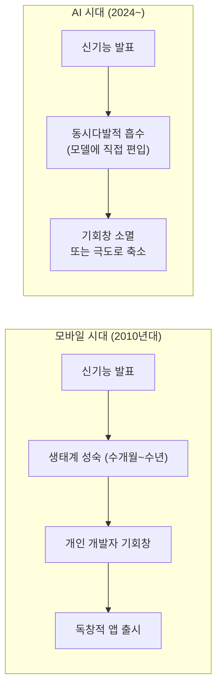

### 3.3 이것은 실제로 일어나고 있는가

실제로 일어나고 있다. 2026년 2월, Google Cloud 부사장 Darren Mowry는 "LLM 래퍼 회사와 AI 애그리게이터 모델은 파운데이션 모델 제공자들이 기능을 흡수함에 따라 실존적 상품화 위험에 처해 있다"고 직접적으로 언급했다. OpenAI의 경우 Anthropic의 Claude Code(2025년 2월)에 대응하기 위해 3년 후인 2026년 3월에 Windsurf를 30억 달러에 인수했다. 오늘의 독립 제품이 내일 인수 대상이 되거나 모델에 흡수되는 사이클이 실제로 작동하고 있다.

---

## 4. 핵심 테마 2 — 기능 상품화 공포 (Feature Commoditization Anxiety)

### 4.1 상품화란 무엇인가

기술에서 "상품화(Commoditization)"란 한때 차별화 요소였던 기능이 시간이 지나면서 누구나 당연하게 쓸 수 있는 범용 기능으로 전락하는 현상을 말한다. 클라우드 컴퓨팅이 대표적인 역사적 사례다. 2005년에 자체 데이터센터 운영 능력은 경쟁 우위였다. 지금은 인터넷과 신용카드만 있으면 수 분 안에 동일한 인프라를 구성할 수 있다. 능력 자체가 상품이 된 것이다.

AI에서도 동일한 패턴이 전개되고 있다. 2023년에 "AI로 텍스트를 요약하는 앱"은 차별화 요소가 될 수 있었다. 지금은 모든 앱에 요약 기능이 들어가 있다. 2024년에 "AI 코딩 도우미"는 독립 스타트업의 영역이었다. 지금은 Microsoft, Google, Anthropic이 직접 코딩 에이전트를 운영한다.

### 4.2 글쓴이가 두려워하는 것의 정확한 구조

원글 작성자가 묘사하는 공포는 두 가지 형태를 갖는다.

**첫 번째는 흡수 공포다.** "내가 며칠 밤 새워서 만든 기능이 다음 달에는 OpenAI나 Anthropic 기본 기능으로 들어가 있지 않을까?" 이것은 자신이 만든 제품이 플랫폼 제공자의 기능 업데이트 한 번에 무의미해지는 상황이다. 스마트폰 시대 초기에 별도 앱으로 팔리던 "손전등 앱"이 OS 기본 기능으로 편입되면서 하룻밤에 시장이 사라진 것과 동일한 논리다.

**두 번째는 우회로 소멸 공포다.** "모델 성능이 한 번 올라가면서 내가 만든 우회로 자체가 그냥 필요 없어지는 거 아닐까?" 현재의 모델 한계를 극복하기 위해 설계한 아키텍처적 우회로들이 모델 자체가 강해지면 필요가 없어진다는 공포다. 하네스 엔지니어링, 컨텍스트 관리, 프롬프트 최적화 등이 모두 이 범주에 해당한다.

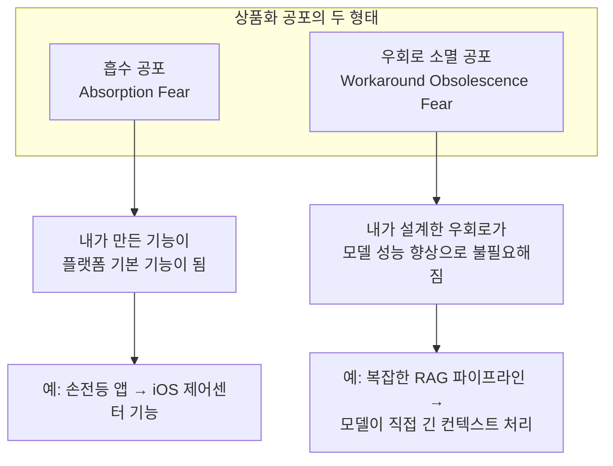

### 4.3 이 공포는 타당한가

부분적으로는 타당하고, 부분적으로는 과장되어 있다.

타당한 부분은 실재한다. YC의 2026년 신규 배치는 "에이전트 공급망 인프라(agent supply chain infrastructure)"로 방향을 크게 틀었다. 소비자 대면 AI 에이전트 제품이 상품화 위험에 가장 크게 노출되어 있다는 판단 때문이다. 얇은 래퍼(thin wrapper) 형태의 AI 제품들은 벤처 투자도 받기 어려워졌다.

그러나 과장된 부분도 있다. 다음 섹션에서 설명할 "교회 버스 앱"의 논리가 바로 그 과장된 공포를 교정하는 통찰을 담고 있다.

---

## 5. 핵심 테마 3 — "교회 버스 앱"의 철학: 로컬 컨텍스트의 힘

### 5.1 무엇이 교회 버스 앱을 특별하게 만드는가

글쓴이는 최근 만들고 있는 것이 "새로운 AI 앱"이 아니라 "아내가 다니는 한인 교회 버스 앱"이라고 말한다. 그리고 이게 "차라리 마음이 편하다"고 한다. 왜일까?

이 앱은 다음 세 가지 조건을 동시에 만족한다.

- **누가 쓸지 안다.** 특정 한인 교회 버스를 이용하는 사람들이다.
- **왜 필요한지 안다.** 그 교회의 버스 운행 방식에서 비롯된 구체적인 불편함이 있다.
- **큰 회사가 대체할 수 없다.** OpenAI도, Google도, Anthropic도 그 교회의 버스 시간표와 사정을 알지 못한다. 설령 일반 교회 버스 앱 기능을 만들더라도, 그 특정 교회의 컨텍스트(노선, 구성원, 규칙, 특이사항)는 외부에서 자동으로 채워줄 수 없다.

이것이 **로컬 컨텍스트(Local Context)** 의 힘이다. 범용 솔루션이 대체할 수 없는 특수한 지식과 관계가 내재된 문제들은 상품화의 파도에 쓸려가지 않는다.

### 5.2 이것은 방향 전환인가 패배인가

글쓴이는 스스로 이것을 "멋진 방향 전환처럼 말하고 싶지는 않다"고 한다. "그냥 좀 지쳤다"는 것이다.

이 솔직함이 중요하다. 이것을 전략적 통찰로 포장하지 않는다. 허무함을 해소하기 위한 현실적인 선택이지, 새로운 비즈니스 모델을 발견한 게 아니라는 것이다.

그러나 이 선택은 사실 깊은 통찰을 담고 있다. 많은 연구자들이 AI가 상품화하더라도 도메인 지식은 핵심으로 남는다고 분석한다. AI는 범용 지능을 저렴하게 제공하지만, 특정 조직·공동체·문제의 맥락은 그 안에 있는 사람만이 안다. 그 맥락을 제품에 녹이는 능력은 외부의 큰 회사가 대규모 업데이트로 대체할 수 없다.

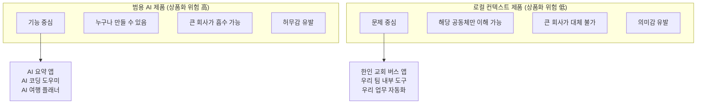

### 5.3 첫 번째 댓글이 말하는 것도 같은 철학이다

첫 번째 댓글 작성자도 동일한 결론에 1년 전에 먼저 도달했다. "팔아야지"에서 "내 일을 줄이자"로 전환했다. 로컬 앱도 만들되, 외부에 팔기 위한 제품이 아니라 자신에게 필요한 것을 만든다. 업무에서 인정받고, 책 읽고, 가족과 시간 보내는 것이 FOMO를 방지한다.

이 댓글은 덧붙여 목공 워크숍을 차리거나 아이들과 미디어아트를 하겠다는 말도 한다. 이것은 디지털 세계에서의 피로를 아날로그 세계에서 회복한다는 의미이기도 하다. 끊임없이 업데이트되는 AI 도구를 따라가다 보면 소진(burnout)이 오는데, 나무를 다듬거나 아이들과 예술 작업을 하는 것은 그 소진을 예방하는 방어기제이기도 하다.

---

## 6. 기술적 맥락 — 프롬프트에서 루프 엔지니어링까지

두 번째 댓글은 기술적으로 가장 밀도가 높다. 이 댓글이 언급하는 개념들을 이해하려면 AI 에이전트 엔지니어링의 패러다임 변천을 먼저 알아야 한다.

### 6.1 패러다임의 4단계 진화

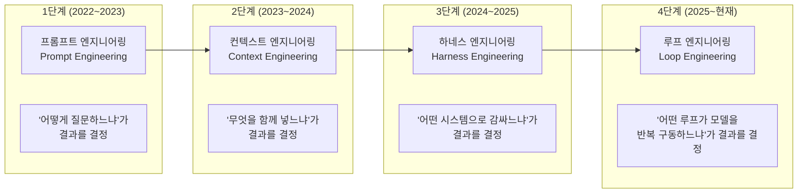

**1단계: 프롬프트 엔지니어링 (2022~2023)**
프롬프트를 어떻게 작성하느냐가 모든 것을 결정한다고 믿었다. "역할을 부여하라", "단계별로 생각하게 하라", "예시를 포함하라" 같은 테크닉들이 화제였다. 프롬프트 자체가 핵심 자산처럼 여겨졌다.

**2단계: 컨텍스트 엔지니어링 (2023~2024)**
무엇을 프롬프트 안에 함께 넣느냐가 중요해졌다. RAG(검색 증강 생성)의 부상이 이 단계의 핵심이다. 단순히 질문을 잘 구성하는 게 아니라, 관련 문서·데이터·히스토리를 얼마나 잘 구성해서 함께 전달하느냐가 결과를 결정했다.

**3단계: 하네스 엔지니어링 (2024~2025)**
모델을 둘러싼 전체 시스템, 즉 "하네스"가 성능을 결정한다는 인식이 자리 잡았다. `Agent = Model + Harness`라는 공식이 이 시기의 핵심 명제다. 같은 모델을 써도 하네스 설계에 따라 작업 완료율이 40점 이상 차이 날 수 있다는 것이 실증적으로 확인됐다. LangChain이 하네스만 바꿔 터미널 벤치마크 순위를 30위에서 5위로 올린 것이 대표적인 사례다.

**4단계: 루프 엔지니어링 (2025~현재)**
2026년 6월, Addy Osmani의 글이 수백만 뷰를 기록하며 "루프 엔지니어링"이라는 이름이 산업 전체에 퍼졌다. 핵심은 이것이다: **프롬프트는 더 이상 작업의 단위가 아니다. 루프가 단위다.** 개발자가 매번 모델을 직접 프롬프팅하는 게 아니라, 모델을 반복적으로 구동하고, 검증하고, 재시도하고, 멈추게 하는 루프 자체를 설계하는 것이 핵심 역량이 됐다.

---

## 7. 루프의 종류와 각각의 의미

두 번째 댓글은 "루프들엔 어떤 종류가 있으며, 각 루프마다 어떤 스텝을 거치고, 결과물은 어떻게 달라지며"라고 말한다. 이 루프들을 하나하나 살펴본다.

### 7.1 ReAct 루프 (기초 루프)

가장 기본적인 에이전트 루프다. 이름은 "Reason and Act"의 약자다.

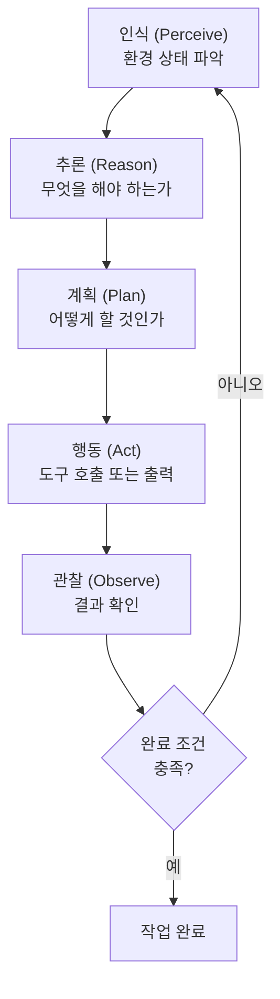

모델이 현재 상태를 파악하고, 무엇을 해야 할지 추론하고, 계획을 세우고, 실행하고, 결과를 관찰하는 사이클을 반복한다. 완료 조건이 충족되거나 최대 반복 횟수에 도달하면 멈춘다. 가장 범용적이지만, 자기 결과를 스스로 평가하는 능력이 없다는 한계가 있다.

### 7.2 리플렉션 루프 (자기 수정 루프)

모델이 자신의 출력을 스스로 다시 검토하고 수정하는 루프다.

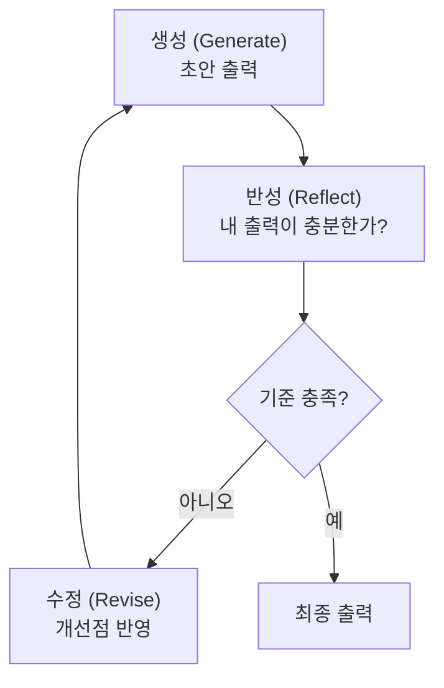

제한이 있다. 모델이 스스로를 평가하기 때문에 자신의 편향이나 오류를 반복할 수 있다. "좋지 않은 결과물에 동의하는" 자기 합리화가 일어날 수 있다는 것이다.

### 7.3 Generator-Evaluator 루프 (비판자 분리 루프)

리플렉션 루프의 한계를 극복하기 위해 생성자(Generator)와 평가자(Evaluator)를 분리하는 패턴이다. 이것이 Anthropic의 "Building Effective Agents" 문서에서 소개한 핵심 패턴 중 하나다.

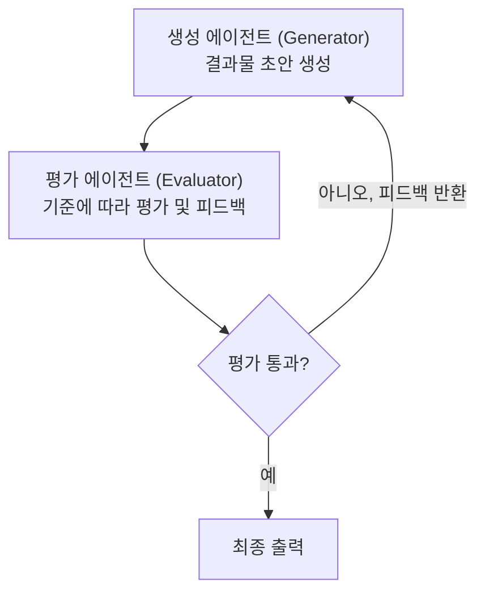

평가자는 생성자와 다른 인스턴스의 모델이거나 다른 프롬프트로 구성된다. 핵심은 평가 기준이 명확해야 한다는 것이다. "좋은 코드인가?"는 평가하기 어렵다. "이 5가지 설계 원칙을 따르는가? 테스트 커버리지가 80% 이상인가? 에러 핸들링이 포함되어 있는가?"는 체크리스트로 평가할 수 있다.

### 7.4 내부 루프와 외부 루프

두 번째 댓글은 "그러다 보면 외부 루프가 나오고"라고 말한다. 이것은 루프의 계층 구조를 말한다.

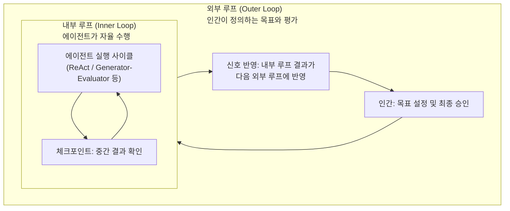

내부 루프는 에이전트가 자율적으로 반복하는 실행 사이클이다. 외부 루프는 인간이 정의한 더 큰 목표 구조 안에서 내부 루프의 결과를 평가하고 다시 방향을 설정한다. 좋은 시스템은 내부 루프에서 수집된 시그널(성공 패턴, 실패 원인)을 외부 루프에 반영해 시스템 자체를 점진적으로 개선한다.

### 7.5 Supervisor-Worker 루프 (멀티 에이전트 루프)

댓글이 언급한 "멀티 에이전트 라우팅/파이프라인"의 핵심 패턴이다.

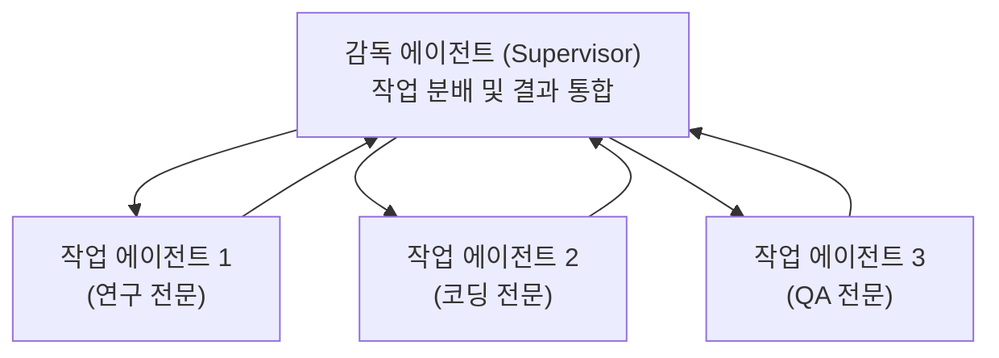

감독 에이전트는 전체 작업을 이해하고 하위 에이전트들에게 분배한다. 각 작업 에이전트는 자신의 영역에 특화된 내부 루프를 갖는다. 감독 에이전트는 직접 작업을 수행하지 않고, 흐름을 관리한다. 이 구조에서 **상태(State)와 이벤트(Event)를 어떻게 주고받고 관리하느냐**가 핵심 설계 과제가 된다.

---

## 8. 사이드 프로젝트의 진짜 가치 — 시스템의 체화

### 8.1 두 번째 댓글의 핵심 주장

두 번째 댓글은 원글과 첫 번째 댓글의 지쳤다는 감정에 공감하면서도, 다른 각도를 제시한다. 사이드 프로젝트를 만드는 행위가 갖는 진짜 가치는 **제품 그 자체**가 아니라 **시스템 동작 원리의 체화**라는 것이다.

이 주장을 구체적으로 보면:

"에이전트가 어떻게 돌아가고, 모델이랑 하네스 레이어는 어떻게 분리되고"라는 말은 이론이 아니라 직접 만들어 봄으로써만 느낄 수 있는 감각이다. 배선을 만져본 사람과 배선 다이어그램만 본 사람 사이의 차이다.

"평가는 어떻게 진행할지, 루브릭은 어떻게 만들지, 뭘 기준으로 정량화할지"라는 부분은 AI 에이전트 개발의 가장 어려운 부분이다. '좋은 출력'을 정의하는 것은 추상적 논의로는 한계가 있다. 실제로 무언가를 만들고, 그것의 품질을 측정하려 시도할 때 비로소 루브릭 설계의 어려움이 피부로 느껴진다.

"시뮬레이션 방식엔 어떤 게 있으며, 시그널을 어떻게 다시 시스템에 반영되게 할 수 있을지"는 자기 수정 시스템(Self-correcting System)의 핵심 설계 문제다. 이것 역시 직접 만들어 실패해봐야 이해할 수 있다.

"프론티어의 업데이트는 어떤 OSS에서 영감을 받아서 저런 기능을 가져오는지 보이고, 그로 인해 나아가려는 방향이랑 내재된 병목과 문제는 어디고"라는 마지막 부분이 가장 중요하다. 직접 시스템을 만들어본 사람은 프론티어 랩의 새 발표를 볼 때 단순히 "새 기능이 나왔네"가 아니라 "이 기능이 어떤 기존 오픈소스 패턴에서 영감을 받았고, 이것이 어떤 병목을 해소하며, 아직 어떤 문제가 남아 있는지"가 보인다는 것이다.

### 8.2 이것을 "능동적 학습"이라 부를 수 있다

교육학에서는 이를 "경험 기반 학습(Experiential Learning)" 또는 "체화된 학습(Embodied Learning)"이라고 부른다. 뇌로 이해하는 것과 손으로 이해하는 것은 다르다. 자전거 타는 법을 책으로 이해하는 것과 실제로 넘어지며 배우는 것의 차이처럼.

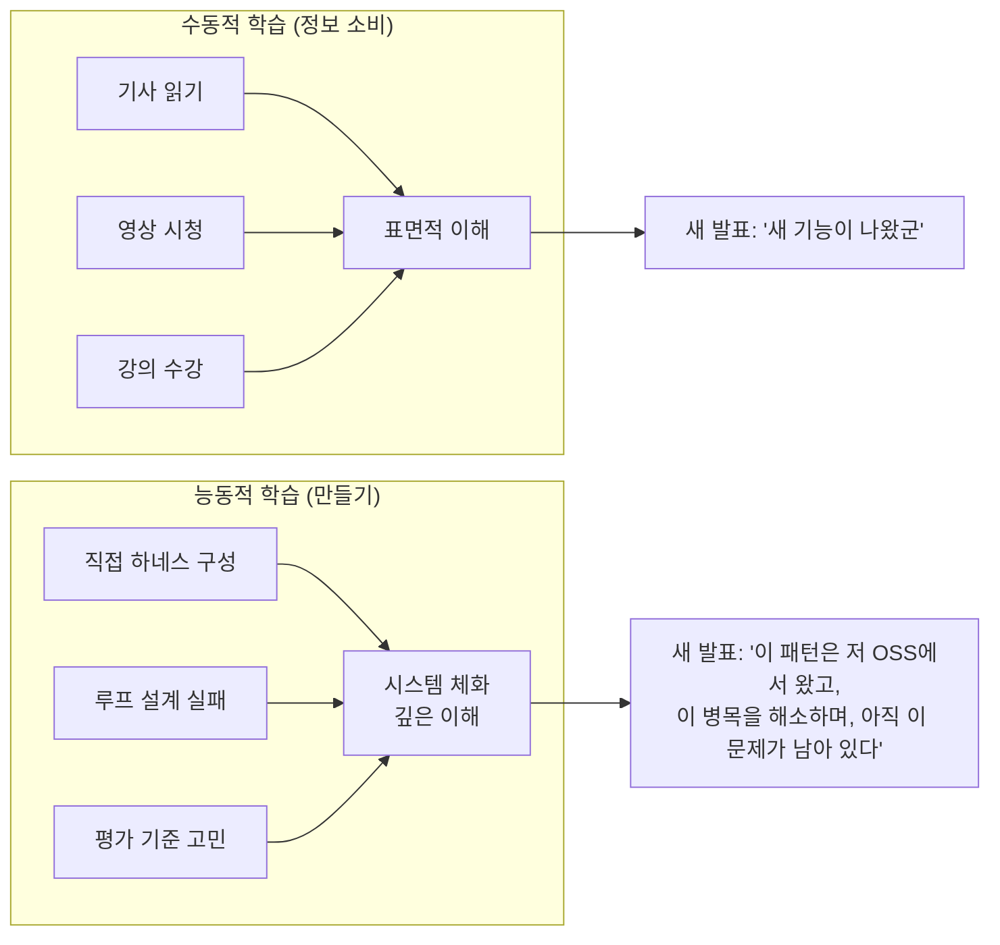

### 8.3 당장 돈이 안 되어도 괜찮은가

두 번째 댓글은 이렇게 말한다. "먹고 살기 힘들 때니 '당장 돈이 되는지'에 집중하는 거지, 원래 사이드 프로젝트라는 게 시스템 동작 원리를 체화시키는 일종의 훈련 과정이었잖아요."

이 문장은 사이드 프로젝트의 원래 정의로 돌아가자는 제안이다. 사이드 프로젝트는 원래 수익 창출 도구가 아니었다. 자신이 궁금한 것을 만들어보고, 시스템이 어떻게 동작하는지 몸으로 배우는 훈련장이었다. "만들어 팔아야지"라는 압박이 생기면서 사이드 프로젝트의 원래 역할이 왜곡됐다는 것이다.

---

## 9. 세 관점이 수렴하는 지점

세 목소리는 서로 다른 답을 내놓지만, 공통적으로 동의하는 지점이 있다.

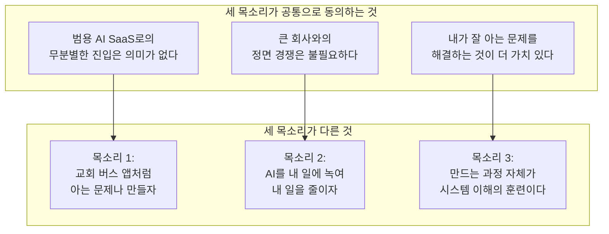

**범용 AI 제품으로 빠르게 시장을 잡겠다는 발상을 내려놓는다는 점**에서 세 목소리는 일치한다. 차이는 그 이후의 방향이다.

목소리 1은 의미 있는 로컬 문제를 찾는다. 목소리 2는 외부 제품이 아니라 자신의 생산성을 높이는 방향으로 전환한다. 목소리 3은 만드는 행위 자체의 학습 가치에 집중한다.

흥미롭게도 이 세 방향은 서로 배타적이지 않다. 교회 버스 앱을 만들면서 (목소리 1), 그 과정에서 하네스와 루프 엔지니어링을 익히고 (목소리 3), 자신의 커뮤니티 참여 업무도 효율화할 수 있다 (목소리 2). 실제로 이 세 방향은 동시에 추구될 수 있다.

---

## 10. 결론 — AI 시대에 만드는 행위의 의미

이 Threads 스레드가 담고 있는 핵심 통찰을 정리하면 다음과 같다.

### 10.1 공포의 원천은 "만들 수 없다"가 아니다

기술을 몰라서 못 만드는 게 아니다. 알아도 뭘 만들어야 할지 모르는 것이다. 이 둘은 전혀 다른 문제다. 전자는 공부로 해결된다. 후자는 공부로 해결되지 않는다. "왜 이것이 필요한가", "누가 쓸 것인가", "이것이 큰 회사가 대체할 수 없는 가치를 담고 있는가"라는 질문에 대한 답이 필요하다.

### 10.2 상품화는 추상적인 것에만 일어난다

큰 회사들이 흡수하는 것은 일반화된 기능이다. 특정 공동체의 구체적인 문제, 특정 조직의 고유한 맥락, 특정 관계망 안에서만 의미 있는 데이터는 상품화되지 않는다. "AI SaaS는 모르겠고, 우리 교회 버스 앱이나 만들자"는 이 통찰의 직관적 표현이다.

### 10.3 루프 엔지니어링은 지금 가장 중요한 역량이다

2026년 6월 현재, AI 에이전트 개발의 패러다임은 프롬프트 엔지니어링 → 컨텍스트 엔지니어링 → 하네스 엔지니어링 → 루프 엔지니어링으로 진화했다. 지금 이 개념들을 직접 손으로 만지며 배우는 사람과 그렇지 않은 사람 사이의 격차는 이론보다 훨씬 크다. 두 번째 댓글이 강조하는 "체화"가 바로 이 격차를 만드는 것이다.

### 10.4 허무함은 틀린 질문에서 온다

"어떻게 만들까"를 잘 알면서 "왜 만들까"를 모를 때 허무해진다. "무엇을 팔까"에 집중하다가 "이것이 왜 필요한가"를 놓치면 피로해진다. 이 스레드가 공유하는 감정은 단순히 개인의 슬럼프가 아니다. AI 도구의 폭발적 성장 앞에서 많은 개발자·설계자들이 공통으로 경험하는 방향 상실이다.

해법은 빠르게 AI를 따라가는 것도, 완전히 포기하는 것도 아니다. 내가 속한 곳에서 내가 가장 잘 아는 문제를 찾고, 그것을 해결하는 시스템을 만드는 과정에서 시스템 그 자체를 배우는 것이다.

교회 버스 앱이나 만들자고 했다. 그러나 그 과정에서 하네스를 설계하고, 루프를 만들고, 평가 기준을 고민하게 된다. 그러면 프론티어 랩의 다음 발표가 다르게 보이기 시작한다. 그것으로 충분하다.

---

*작성일자: 2026-06-29*
