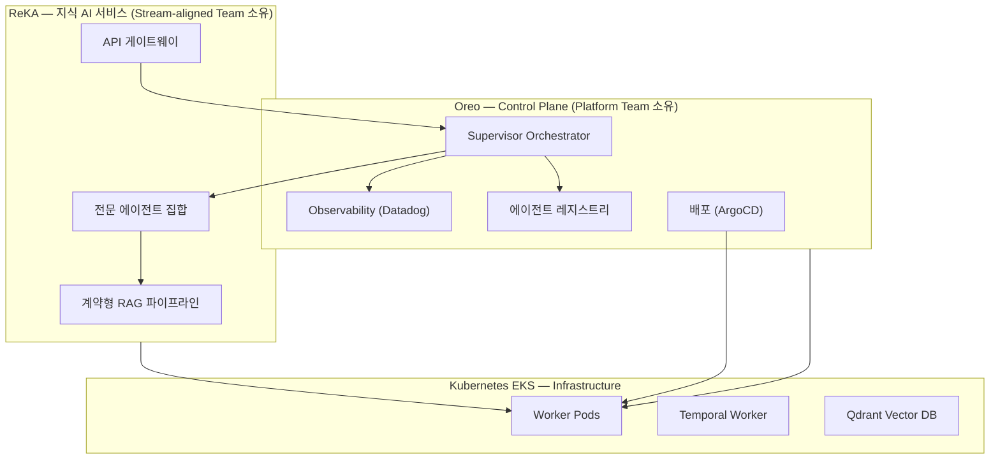
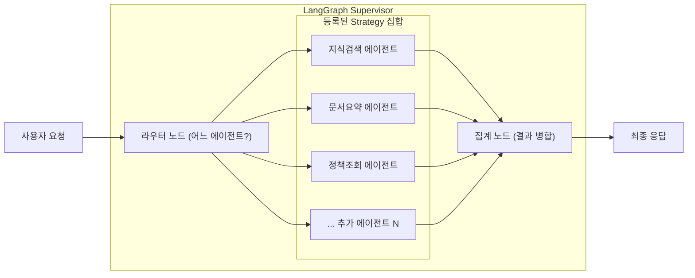
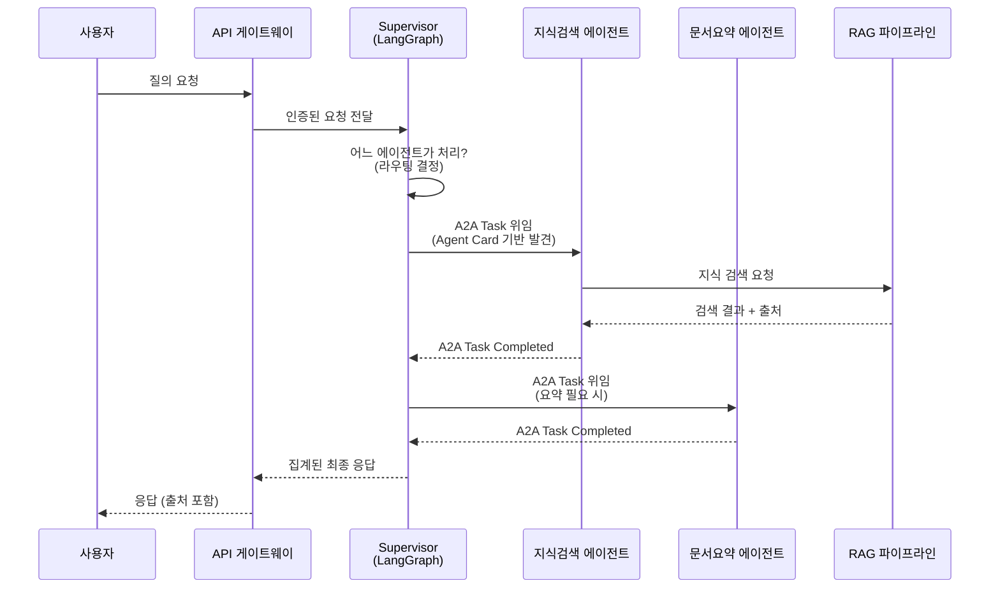
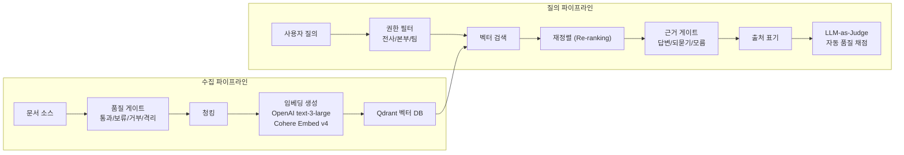
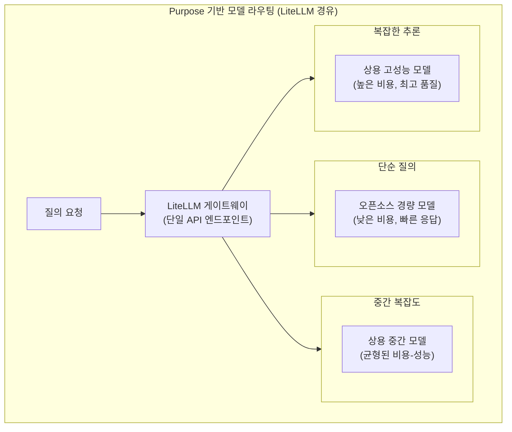
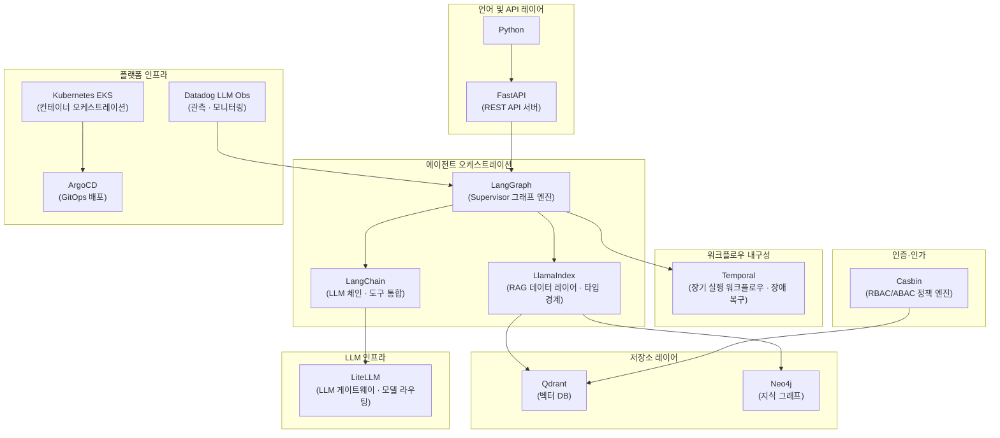
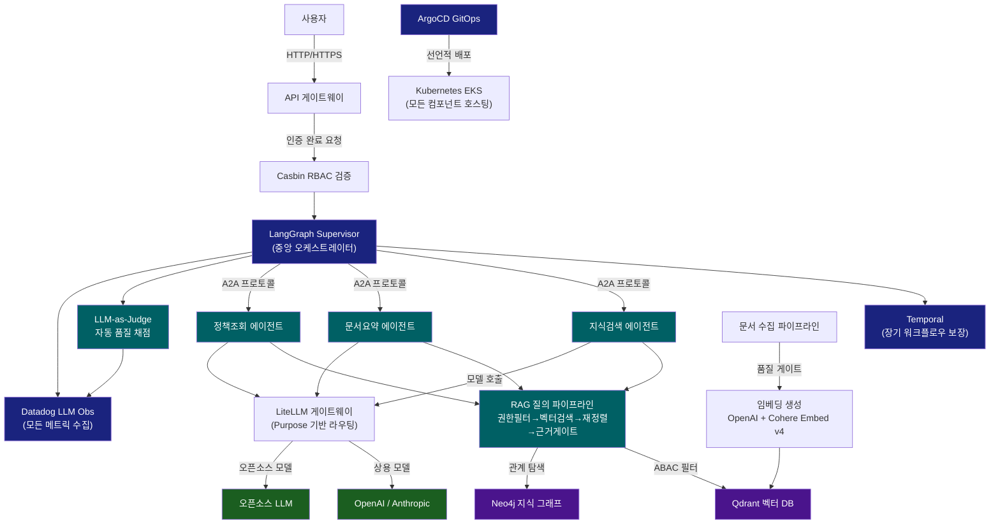
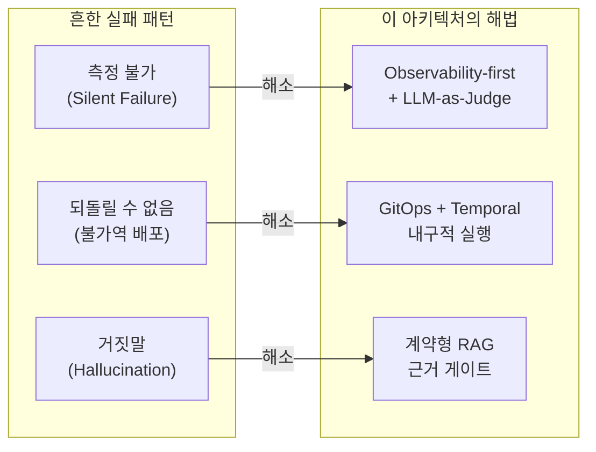

> **원문 출처**: 실무 엔지니어가 LinkedIn/Facebook에 공유한 사내 AI 에이전트 플랫폼 설계 원칙  
> **분석 기준일**: 2026-06-29  
> **분석 관점**: K8s/DevSecOps · 에이전트 아키텍처 · 엔터프라이즈 AX 실무

## 관련글

[**사내 AI 에이전트 플랫폼, 이렇게 짰습니다**](https://www.facebook.com/share/p/18rLnqA4eb/)

[**Oreo Enterprise Agentic AI Platform: 계약 기반 에이전트 운영 체계**](https://k82022603.github.io/posts/oreo-enterprise-agentic-ai-platform-%EA%B3%84%EC%95%BD-%EA%B8%B0%EB%B0%98-%EC%97%90%EC%9D%B4%EC%A0%84%ED%8A%B8-%EC%9A%B4%EC%98%81-%EC%B2%B4%EA%B3%84/)

---

## 목차

1. [글 배경과 핵심 주장](#1-글-배경과-핵심-주장)
2. [플랫폼 vs. 서비스 분리 철학 — Oreo와 ReKA](#2-플랫폼-vs-서비스-분리-철학--oreo와-reka)
3. [에이전트 실행 모델 — 봇이 아닌 전략(Strategy)](#3-에이전트-실행-모델--봇이-아닌-전략strategy)
4. [요청 흐름 설계 — Supervisor 패턴과 A2A 프로토콜](#4-요청-흐름-설계--supervisor-패턴과-a2a-프로토콜)
5. [계약형 RAG 파이프라인](#5-계약형-rag-파이프라인)
   - 5.1 [수집 단계 — 품질 게이트](#51-수집-단계--품질-게이트)
   - 5.2 [임베딩 전략 — 듀얼 모델 설계](#52-임베딩-전략--듀얼-모델-설계)
   - 5.3 [질의 단계 — 권한 필터와 근거 게이트](#53-질의-단계--권한-필터와-근거-게이트)
   - 5.4 [LlamaIndex 타입 경계와 LLM-as-Judge](#54-llamaindex-타입-경계와-llm-as-judge)
6. [4대 엔지니어링 원칙](#6-4대-엔지니어링-원칙)
   - 6.1 [Observability-first](#61-observability-first)
   - 6.2 [LLM = 계약](#62-llm--계약)
   - 6.3 [Purpose 기반 모델 라우팅](#63-purpose-기반-모델-라우팅)
   - 6.4 [SSOT 강박](#64-ssot-강박)
7. [기술 스택 심층 해설](#7-기술-스택-심층-해설)
8. [전체 아키텍처 조감도](#8-전체-아키텍처-조감도)
9. [실무 시사점 — 왜 이 설계가 중요한가](#9-실무-시사점--왜-이-설계가-중요한가)
10. [요약](#10-요약)

---

## 1. 글 배경과 핵심 주장

이 글의 저자는 자사가 구축한 사내 AI 에이전트 플랫폼의 설계 철학과 구현 방식을 공유하고 있다. 표면적으로는 기술 스택 소개처럼 보이지만, 글 전체를 관통하는 핵심 메시지는 단 하나다.

> **"봇을 많이 만드는 것"이 목표가 아니라 "한 팀처럼 움직이는 몸"을 만드는 것이 목표다.**

이 한 문장은 현재 AI 에이전트 도입 현장에서 가장 흔하게 발생하는 실패 패턴을 정확히 지적하고 있다. 많은 기업이 "에이전트 몇 개 만들기" 라는 양적 목표를 세우고 개별 봇을 독립적으로 개발하다 보면, 어느 순간 서로 통신하지 못하고 각자의 사일로 안에 갇힌 자동화 파편들만 남게 된다. 저자는 이런 접근법 자체를 거부한다.

대신 저자가 선택한 방식은 **플랫폼과 서비스의 분리**, **Supervisor 패턴 기반 중앙 오케스트레이션**, **계약(contract) 중심의 RAG 파이프라인**, 그리고 **Observability-first 원칙**이다. 이 네 가지는 서로 독립적인 기술 선택이 아니라 하나의 일관된 철학에서 파생된 설계 결정들이다.

---

## 2. 플랫폼 vs. 서비스 분리 철학 — Oreo와 ReKA

저자는 시스템을 두 레이어로 명확히 나눈다.

```
┌────────────────────────────────────────────┐
│  ReKA  (사내 지식 AI 서비스 — 비즈니스 레이어)   │
│  에이전트들이 실제 업무를 수행하는 영역             │
├────────────────────────────────────────────┤
│  Oreo  (Control Plane — 플랫폼 레이어)        │
│  에이전트 호스팅·운영·관측·배포를 담당             │
└────────────────────────────────────────────┘
```

**Oreo**는 저자가 쿠버네티스와 직접 비유한다. 쿠버네티스가 Pod를 스케줄링하고, 재시작하고, 관측하고, 배포하는 방식으로 애플리케이션 컨테이너를 관리하듯이, Oreo는 자율 에이전트를 동일한 방식으로 관리한다. 즉 Oreo는 에이전트들이 **어떤 업무를 하는지**에 대해서는 무관심하고, 에이전트들이 **안전하고 관측 가능하게 실행되는지**에만 집중한다.

**ReKA**는 그 위에서 실행되는 실제 비즈니스 서비스다. 사내 지식 검색과 질의응답이 ReKA의 책임 영역이다. ReKA는 Oreo가 제공하는 인프라 위에서 작동하므로, 비즈니스 요구사항이 바뀌어도 플랫폼 레이어를 건드릴 필요가 없다.

이 분리는 단순한 네이밍 관례가 아니라 **운영 철학의 표현**이다. 플랫폼 팀과 서비스 팀이 독립적으로 발전할 수 있고, 새로운 서비스를 추가할 때 플랫폼을 새로 설계할 필요가 없다. Team Topologies 관점에서 보면 Oreo는 Platform Team이 소유하는 Platform Subsystem이고, ReKA는 Stream-aligned Team이 소유하는 제품이다.



---

## 3. 에이전트 실행 모델 — 봇이 아닌 전략(Strategy)

저자의 가장 독창적인 설계 결정 중 하나는 **봇을 별도 프로세스가 아닌, Supervisor 안의 Strategy로 실행**하는 방식이다.

전통적인 접근법은 에이전트마다 독립 프로세스나 마이크로서비스를 부여한다. 봇 A를 위한 컨테이너, 봇 B를 위한 컨테이너, 이런 식으로 에이전트가 늘어날수록 관리해야 할 프로세스가 선형으로 증가한다. 이것은 **인프라가 늘어나는 방식**이다.

저자의 접근법은 다르다. Supervisor(LangGraph 기반)라는 단일 오케스트레이터가 있고, 각 에이전트의 행동 방식은 그 안에서 **플러그인 가능한 Strategy**로 등록된다. 새로운 에이전트를 추가한다는 것은 새 컨테이너를 띄우는 것이 아니라 **새 전략(Strategy)을 Supervisor에 등록**하는 것이다. 즉 **전략이 늘어나는 방식**이다.

이 패턴의 이점은 여러 각도에서 분석할 수 있다.

운영 복잡도 측면에서 보면, 관리 대상이 N개의 독립 프로세스에서 1개의 Supervisor + N개의 Strategy 함수로 줄어든다. 모든 에이전트의 실행 상태, 메모리, 로그가 단일 오케스트레이터를 경유하므로 추적이 용이하다.

통제 및 감사 측면에서 보면, 에이전트 간 직접 통신을 금지하고 모든 상호작용이 Supervisor를 경유하도록 강제함으로써 누가 언제 무엇을 했는지에 대한 완전한 감사 추적(audit trail)이 자동으로 생성된다.

자원 활용 측면에서 보면, Supervisor 프로세스 안에서 Strategy가 필요할 때만 인스턴스화되므로 유휴 에이전트를 위해 상시 프로세스를 유지할 필요가 없다.



실제로 2026년 LangChain의 State of Agent Engineering 보고서에 따르면, 생산 환경 장애의 60% 이상이 상태 관리 문제에서 비롯된다. Supervisor 패턴은 모든 에이전트의 상태를 단일 그래프 상태(State Dictionary)로 통합함으로써 이 문제를 구조적으로 해소한다. LangGraph v0.6.x에서 공식 지원하는 `create_supervisor()` API가 이 패턴의 구현을 표준화한다.

---

## 4. 요청 흐름 설계 — Supervisor 패턴과 A2A 프로토콜

### 4.1 요청의 이동 경로

저자가 제시한 요청 흐름은 다음과 같다.

```
사용자 → API 게이트웨이 → 중앙 오케스트레이터(Supervisor, LangGraph 기반) → 전문 에이전트
```

각 단계의 역할을 명확히 이해하는 것이 중요하다.

**API 게이트웨이**는 인증, 속도 제한(rate limiting), TLS 종단 처리를 담당한다. 에이전트 시스템의 진입점으로서 외부 세계와 내부 플랫폼 사이의 경계를 형성한다.

**Supervisor(중앙 오케스트레이터)** 는 요청을 분석해 어떤 전문 에이전트가 처리해야 하는지 결정하는 라우터 역할과 함께, 에이전트 간 협업을 조정하는 디렉터 역할도 수행한다. LangGraph의 Supervisor 패턴에서 Supervisor는 전역 대화 상태를 유지하며, 하위 에이전트에 작업을 위임하고, 결과를 집계한다.

**전문 에이전트**들은 각자 특화된 도메인(지식 검색, 문서 요약, 정책 조회 등)에서 실제 작업을 수행한다. 각 에이전트는 자신의 스크래치패드를 유지하면서 Supervisor와 소통한다.

### 4.2 A2A(Agent-to-Agent) 프로토콜

에이전트 간 협업에는 **A2A 프로토콜**을 사용한다고 명시되어 있다. 저자가 에이전트 간 직접 접근을 막고 A2A를 통해 통제·추적을 보장한다고 설명하는 이 선택은 현재의 산업 표준 방향과 정확히 일치한다.

A2A(Agent-to-Agent) 프로토콜은 2025년 4월 9일 구글이 구글 클라우드 넥스트에서 발표한 오픈 표준이다. 서로 다른 벤더와 프레임워크로 개발된 AI 에이전트들이 내부 구현을 노출하지 않고도 서로를 발견하고, 작업을 위임하며, 협업할 수 있도록 정의한 사양이다. 2025년 6월 리눅스 재단으로 이관되어 중립적인 거버넌스 하에 놓였으며, IBM의 ACP(Agent Communication Protocol)가 2025년 8월에 A2A와 합병되면서 사실상 경쟁 표준이 없는 상태다. 2026년 4월 기준으로 150개 이상의 기업이 프로덕션 환경에서 A2A를 사용하고 있으며, v1.0 안정 버전이 출시되었다.

A2A가 해결하는 핵심 문제는 에이전트 간 통신의 파편화다. A2A 이전에는 LangGraph로 만든 에이전트와 CrewAI로 만든 에이전트가 협업하려면 맞춤형 통합 코드가 필요했다. A2A는 HTTP, JSON-RPC, Server-Sent Events(SSE)를 기반으로 하는 표준 통신 계층을 정의함으로써 이 문제를 해결한다. A2A를 구성하는 핵심 개념은 다음과 같다.

**Agent Card**는 각 에이전트가 `/.well-known/agent.json` 경로에 게시하는 JSON 메타데이터 파일로, 에이전트의 기능·입출력 형식·인증 방식을 서술한다. 마이크로서비스 아키텍처의 서비스 디스커버리 메커니즘과 유사한 역할이다.

**Task**는 고유 ID를 가진 작업 단위로, `submitted → working → input-required → completed/failed/cancelled`의 생명주기를 갖는다.

**Message**는 "user" 또는 "agent" 역할이 부여된 통신 객체다.

**Artifact**는 작업 결과물(파일, 구조화 데이터 등)을 표현한다.

저자가 A2A를 채택한 실용적인 이유는 명확하다. 에이전트 간 직접 접근을 막고 A2A를 통해 모든 통신을 표준화함으로써, 어느 에이전트가 어떤 에이전트에 무엇을 요청했는지의 완전한 추적(traceability)이 보장된다.



---

## 5. 계약형 RAG 파이프라인

저자는 RAG를 "검색해서 LLM에 던지기"가 아니라 **계약(contract)으로 감싼 것**이라고 정의한다. 이것이 이 문서에서 가장 중요한 개념 중 하나다.

대부분의 RAG 구현은 다음과 같이 동작한다. 사용자의 질문을 임베딩 → 벡터 DB에서 유사 문서 검색 → 검색 결과를 LLM 프롬프트에 첨부 → LLM이 답변 생성. 단순하고 빠르게 구현할 수 있지만, 엔터프라이즈 환경에서 반드시 발생하는 문제들을 처리하지 못한다. 저품질 문서가 그대로 검색되고, 권한 없는 정보가 노출되고, 답변의 근거를 추적할 수 없고, 품질을 자동으로 평가할 방법이 없다.

저자의 "계약형 RAG"는 각 단계에 **명시적인 계약(contract)**, 즉 입력과 출력의 형식과 조건을 정의하고, 계약을 위반하는 경우 파이프라인이 진행되지 않도록 설계된다.



### 5.1 수집 단계 — 품질 게이트

지식 데이터가 시스템에 진입하는 시점에 **4종 판정**을 내리는 품질 게이트가 존재한다.

**통과(pass)** 는 문서가 품질 기준을 충족하여 즉시 청킹 및 임베딩 단계로 진행됨을 의미한다. **보류(hold)** 는 추가 검토가 필요한 문서로, 인간 리뷰 큐에 진입한다. **거부(reject)** 는 품질 기준에 미달한 문서로, 파이프라인에서 제외된다. **격리(quarantine)** 는 잠재적으로 문제가 있을 수 있는 문서로, 별도의 안전 검토 후에 처리된다.

이 게이트가 없으면 어떤 일이 발생하는지 생각해 보자. 오래된 정책 문서, 부정확한 내부 위키, 민감한 개인정보가 포함된 보고서가 모두 벡터 DB에 그대로 인덱싱된다. 그 결과 LLM이 폐기된 정책을 기반으로 답변하거나, 권한 없는 사용자에게 민감한 정보가 노출되는 사고가 발생한다. 품질 게이트는 이 문제를 원천 차단한다.

### 5.2 임베딩 전략 — 듀얼 모델 설계

저자는 임베딩 모델로 **OpenAI `text-embedding-3-large`** 와 **멀티모달 Cohere Embed v4**를 병행 사용한다.

**OpenAI `text-embedding-3-large`** 는 3,072차원의 임베딩 벡터를 생성하며, 차원 축소(MRL, Matryoshka Representation Learning)를 지원해 저장 비용을 조절할 수 있다. MTEB(Massive Text Embedding Benchmark) 기준 64.6점으로 텍스트 기반 의미 검색에서 검증된 성능을 보인다.

**Cohere Embed v4**는 2025년 4월 15일 출시된 4세대 임베딩 모델로, MTEB 기준 65.2점을 기록하며 OpenAI를 소폭 앞선다. 더 중요한 특징은 텍스트와 이미지를 동일한 벡터 공간에 임베딩하는 **멀티모달 지원**이다. PDF의 스크린샷, 슬라이드, 도표, 표를 직접 인덱싱할 수 있어 별도의 OCR 파이프라인 없이도 시각적 문서를 처리할 수 있다. 100개 이상의 언어를 지원하는 다국어 처리 능력도 강점이다.

두 모델을 병행 사용하는 이유는 각자의 강점이 다른 유형의 콘텐츠에서 발현되기 때문이다. 텍스트 중심의 정책 문서와 이메일은 `text-embedding-3-large`가, 시각적 요소가 포함된 보고서와 프레젠테이션은 Cohere Embed v4가 담당하는 구조로 추론된다.

### 5.3 질의 단계 — 권한 필터와 근거 게이트

질의가 들어오면 벡터 검색에 앞서 **권한 필터(전사/본부/팀)** 가 먼저 적용된다. 이는 Casbin의 ABAC(속성 기반 접근 제어) 정책을 Qdrant의 페이로드 필터로 변환하는 방식으로 구현된다. 쉽게 말하면, 사용자의 권한 수준에 따라 검색 가능한 문서의 범위를 제한하는 것이다. "검색 결과에서 걸러내기"가 아니라 "처음부터 권한 없는 문서는 검색 대상에 포함하지 않기"이므로, 권한 없는 정보가 LLM 컨텍스트에 입력되는 것 자체를 막는다.

벡터 검색 이후에는 **재정렬(Re-ranking)** 단계가 있다. 벡터 유사도 기반 검색은 의미적 관련성을 잘 포착하지만, 쿼리의 정확한 키워드나 특수 용어에 대해서는 놓칠 수 있다. 재정렬은 크로스-인코더 모델 등을 사용해 검색된 후보 문서들을 다시 순위화하여 최종적으로 LLM에 전달되는 컨텍스트의 품질을 높인다.

검색 결과가 확보된 이후 **근거 게이트(answer gate)** 가 **3-way verdict**를 내린다.

- **답변(answer)**: 충분한 근거 문서가 존재하며, 그 근거를 기반으로 답변을 생성할 수 있는 상태
- **되묻기(clarify)**: 질문이 모호하거나 더 많은 정보가 필요한 상태
- **모름(abstain)**: 관련 근거를 찾을 수 없거나 답변을 생성할 근거가 불충분한 상태

"모름"이라고 정직하게 답할 수 있는 시스템을 구축하는 것은 엔터프라이즈 환경에서 매우 중요하다. 근거 없이 그럴듯한 답변을 생성하는 할루시네이션은 업무 의사결정 오류로 직결될 수 있다. 근거 게이트는 이 리스크를 차단하는 마지막 방어선이다.

모든 최종 답변에는 **출처 표기**가 포함된다. 어떤 문서의 어느 부분을 근거로 했는지 명시함으로써, 사용자가 스스로 원본을 확인할 수 있도록 한다.

### 5.4 LlamaIndex 타입 경계와 LLM-as-Judge

저자는 **지식 결과를 LlamaIndex 타입 경계로 정규화**한다고 명시한다. LlamaIndex는 RAG 파이프라인에서 데이터 처리와 인덱싱에 특화된 프레임워크로, 강력한 타입 시스템을 통해 검색 결과의 형식을 일관되게 유지한다. 타입 경계(type boundary)는 검색 결과가 LLM에 전달되기 전에 반드시 정해진 스키마를 갖도록 강제하는 메커니즘이다. 이로써 파이프라인의 각 단계가 어떤 형태의 데이터를 받고 내보내는지가 명확해지고, 형식 불일치로 인한 런타임 오류가 예방된다.

**LLM-as-Judge**는 모든 답변을 자동으로 채점하는 평가 메커니즘이다. 하나의 LLM이 답변을 생성하면, 별도의 LLM(또는 동일 LLM의 다른 호출)이 해당 답변의 품질을 평가한다. 평가 기준은 일반적으로 다음을 포함한다.

관련성(Relevance)은 답변이 사용자의 질문에 실제로 답하고 있는가를 평가한다. 충실성(Faithfulness)은 답변이 제공된 근거 문서의 내용과 일치하는가, 즉 할루시네이션이 없는가를 평가한다. 완전성(Completeness)은 질문에 포함된 모든 측면이 다루어졌는가를 본다. 명확성(Clarity)은 답변이 이해하기 쉬운 형태로 작성되었는가를 평가한다.

LLM-as-Judge는 생산 환경의 품질 게이트로 사용되며, 2026년 현재 기업 AI 품질 보증의 표준 메커니즘으로 자리 잡고 있다. 규모가 큰 시스템에서는 하루에 수만 건의 답변이 생성될 수 있어 인간이 모두 검토하는 것은 불가능하기 때문이다. 실시간 평가 방식에서는 LLM-as-Judge가 밀리초 단위로 채점하고 품질 기준에 미달하는 답변은 사용자에게 전달되기 전에 차단한다.

---

## 6. 4대 엔지니어링 원칙

저자는 이 시스템을 관통하는 4가지 엔지니어링 원칙을 명시적으로 제시한다. 이 원칙들은 기술적 선택을 넘어 팀의 의사결정 기준이 된다.

### 6.1 Observability-first

> **"모든 컴포넌트가 메트릭 + 실패 신호를 emit한다 — silent failure 금지"**

Observability-first는 시스템을 설계할 때 관측 가능성을 처음부터 내장하는 원칙이다. "나중에 모니터링을 추가하자"가 아니라 "관측할 수 없는 컴포넌트는 존재하지 않는다"는 선언이다.

Silent failure(조용한 실패)는 에이전트 시스템에서 특히 위험하다. 에이전트가 잘못된 결과를 반환하면서도 오류를 발생시키지 않는 경우, 또는 에이전트 사이에서 데이터가 소실되는 경우, 시스템 전체는 정상처럼 보이지만 실제로는 틀린 답을 생산하고 있을 수 있다. 이를 탐지하려면 모든 단계에서 신호를 발산해야 한다.

구체적으로는 각 에이전트 호출의 지연 시간, 토큰 사용량, 성공/실패 여부, 근거 게이트의 판정 결과, LLM-as-Judge 점수 등이 Datadog의 LLM Observability 기능을 통해 실시간으로 추적된다.

### 6.2 LLM = 계약

> **"answer gate 3-way verdict + evidence contract"**

LLM을 마법 같은 블랙박스로 취급하지 않고, 명확한 입출력 계약을 갖는 컴포넌트로 취급한다는 원칙이다. 어떤 형식의 입력을 받는지, 어떤 형식의 출력을 생성하는지, 어떤 조건에서 답변을 거부하는지가 명시적으로 정의된다. 3-way verdict(답변/되묻기/모름)는 이 계약의 핵심이며, evidence contract는 답변에 반드시 근거 출처가 포함되어야 한다는 계약이다.

### 6.3 Purpose 기반 모델 라우팅

> **"난이도에 맞춰 상용 ↔ 오픈소스 (LLM 게이트웨이 경유)"**

모든 요청에 동일한 모델을 사용하지 않는다. 질문의 난이도와 필요한 추론 수준에 따라 다른 모델을 선택한다. 단순한 사실 확인 질문에는 빠르고 저렴한 모델을, 복잡한 분석이 필요한 질문에는 강력한 상용 모델을 사용하는 식이다.

이 라우팅은 **LiteLLM LLM 게이트웨이**를 경유한다. LiteLLM은 OpenAI, Anthropic, AWS Bedrock, Azure OpenAI, HuggingFace 등 100개 이상의 LLM 프로바이더에 대해 단일 OpenAI 호환 API를 제공하는 오픈소스 프록시다. 애플리케이션 코드는 항상 동일한 API 엔드포인트를 호출하며, 실제로 어떤 모델을 사용할지는 LiteLLM이 정책에 따라 결정한다.

이 접근법은 비용 최적화와 벤더 유연성이라는 두 가지 이점을 동시에 제공한다. 질문 유형에 따라 최적 비용-성능 비율의 모델을 자동 선택하고, 특정 벤더에 종속되지 않아 모델 전환 비용이 낮다. 2026년 기준 LiteLLM은 MIT 라이선스 하에 제공되며 140개 이상의 프로바이더를 지원한다.



### 6.4 SSOT 강박

> **"임베딩 차원·권한·레지스트리 단일 출처"**

SSOT(Single Source of Truth)는 분산 시스템에서 데이터 불일치를 방지하는 원칙이다. 저자는 이를 "강박"이라는 표현으로 원칙에 대한 강도 높은 집착을 나타낸다.

임베딩 차원의 경우, 수집 단계에서 생성된 임베딩 벡터의 차원과 질의 단계에서 생성되는 임베딩 벡터의 차원이 반드시 일치해야 한다. 차원이 달라지면 벡터 유사도 계산 자체가 의미 없어진다. 임베딩 모델이 변경되면 전체 인덱스를 재생성해야 하므로, 어떤 모델을 사용하는지의 정보가 반드시 단일 출처(레지스트리)에 기록되어야 한다.

권한 체계의 경우, 어떤 사용자가 어떤 문서에 접근할 수 있는지의 정보가 여러 곳에 분산되어 관리되면 불일치가 발생한다. Casbin이 제공하는 단일 정책 저장소가 이 문제를 해결한다.

에이전트 레지스트리의 경우, 어떤 에이전트가 어떤 기능을 수행하는지의 정보(A2A Agent Card 형태)가 단일 레지스트리에 등록되고 관리된다. Supervisor는 항상 이 레지스트리를 참조해 어떤 에이전트에 작업을 위임할지 결정한다.

---

## 7. 기술 스택 심층 해설

저자가 나열한 기술 스택을 역할별로 분류하면 다음과 같다.



각 기술의 역할을 더 자세히 살펴보자.

**Temporal**은 장기 실행 워크플로우의 내구성을 보장하는 분산 실행 엔진이다. AI 에이전트의 실행 중에 서버가 크래시되거나 네트워크 장애가 발생하더라도, Temporal은 마지막 체크포인트에서 워크플로우를 재개한다. Temporal은 워크플로우(Workflow, 결정론적 오케스트레이션 로직)와 액티비티(Activity, 실제 LLM 호출이나 외부 API 호출 등 비결정론적 작업)를 명확히 분리한다. 이 분리가 중요한 이유는 워크플로우는 재현 가능하게(deterministic) 실행되어야 하므로 Temporal이 이를 재생(replay)할 수 있지만, LLM 호출처럼 매번 다른 결과를 낼 수 있는 액티비티는 재시도가 가능한 독립 단위로 관리되어야 하기 때문이다. 2026년 Replay 컨퍼런스에서 Temporal은 Serverless Workers, Workflow Streams, 그리고 Google ADK 및 OpenAI Agents SDK와의 통합을 발표했다.

**Neo4j**는 그래프 데이터베이스로, 벡터 DB인 Qdrant와 병행 사용된다. 지식 간의 **관계(relationship)** 를 표현하는 데 최적화되어 있다. 예를 들어 "A 문서가 B 정책을 참조하고, B 정책은 C 조직에 적용된다"는 관계 정보를 그래프로 저장하면, 벡터 검색으로는 찾기 어려운 복잡한 관계 기반 질의를 효과적으로 처리할 수 있다. 벡터 검색(Qdrant)과 그래프 탐색(Neo4j)을 결합하는 패턴은 GraphRAG라고 불리며, 2025-2026년에 엔터프라이즈 RAG의 진화된 형태로 주목받고 있다.

**Casbin**은 ACL, RBAC, ABAC, ReBAC 등 다양한 접근 제어 모델을 지원하는 오픈소스 권한 엔진이다. Apache 재단 산하 프로젝트로, Go, Java, Python, Node.js, Rust 등 15개 이상의 언어 구현체를 보유한다. 이 시스템에서 Casbin은 두 가지 역할을 수행한다. 첫째, 사용자-역할-문서 접근권한의 관계를 PERM 메타모델(Policy, Effect, Request, Matchers)로 정의한다. 둘째, 이 정책을 Qdrant의 페이로드 필터(검색 필터)로 변환하여 권한 필터가 실제 검색 레이어에서 적용되도록 한다. 2025년 MCP 사양의 업데이트로 MCP 서버가 OAuth 2.0 리소스 서버로 분류되면서 세분화된 권한 제어의 필요성이 더욱 높아졌고, Casbin이 이 요구사항을 처리하기에 적합한 도구로 주목받고 있다.

**ArgoCD**는 GitOps 배포 도구다. GitOps는 Git 리포지토리를 인프라 및 애플리케이션 배포의 단일 진실 원본(SSOT)으로 사용하는 운영 패턴이다. ArgoCD는 Git의 원하는 상태(desired state)와 Kubernetes 클러스터의 실제 상태(actual state)를 지속적으로 동기화한다. 에이전트 전략(Strategy)이 추가되거나 변경될 때 Git 커밋으로 선언하고, ArgoCD가 이를 자동으로 클러스터에 적용한다는 것은 저자의 "전략이 늘어나는 방식" 철학과 완벽하게 정합한다.

---

## 8. 전체 아키텍처 조감도

지금까지 설명한 모든 구성 요소를 하나의 아키텍처 다이어그램으로 통합하면 다음과 같다.



---

## 9. 실무 시사점 — 왜 이 설계가 중요한가

이 아키텍처가 단순한 기술 선택 목록이 아닌 이유는, 각각의 결정이 특정 실패 패턴을 명시적으로 방지하기 위해 내려졌기 때문이다.

**"화려한 데모보다 측정 가능하고, 되돌릴 수 있고, 거짓말 안 하는 시스템"** 이라는 저자의 마지막 문장은 기업 AI 도입 현장에서 빈번히 목격되는 세 가지 안티패턴에 대한 직접적인 응답이다.

**측정 불가능한 시스템**은 잘 돌아가고 있는지 알 수 없다. Observability-first 원칙과 LLM-as-Judge가 이 문제를 해결한다. 모든 컴포넌트가 신호를 발산하고, 모든 답변이 자동으로 채점된다.

**되돌릴 수 없는 시스템**은 문제가 발생했을 때 격리와 복구가 어렵다. GitOps(ArgoCD)를 통한 선언적 배포와 Temporal의 내구적 실행은 이 문제를 다룬다. 배포는 Git 이력을 통해 롤백되고, 에이전트 실행은 장애 후 안전하게 재개된다.

**거짓말하는 시스템**은 근거 없이 자신 있는 답을 생성한다. 계약형 RAG의 근거 게이트와 3-way verdict가 이를 방지한다. 근거가 없으면 답변하지 않는다.

이와 같은 설계 접근법은 "에이전트를 얼마나 많이 배포했는가"가 아니라 "에이전트 시스템이 얼마나 신뢰 가능한가"로 성공을 측정하는 성숙한 관점의 반영이다. 에이전트 AI의 수명은 기능 화려함보다 운영 신뢰성에 달려 있으며, 이 플랫폼은 그 신뢰성을 구조적으로 담보하려는 시도다.



---

## 10. 요약

이 글은 단순한 기술 스택 소개가 아니라, 엔터프라이즈 AI 에이전트 시스템을 **운영 가능한 수준으로 끌어올리기 위한 설계 철학의 압축 표현**이다.

핵심을 정리하면 다음과 같다. **Oreo**는 에이전트를 쿠버네티스가 Pod를 관리하듯 관리하는 Control Plane이고, **ReKA**는 그 위에서 돌아가는 사내 지식 AI 서비스다. **봇 = 전략(Strategy)** 모델은 에이전트 추가를 인프라 확장이 아닌 코드 등록으로 만든다. **LangGraph Supervisor + A2A 프로토콜**은 모든 에이전트 통신을 추적 가능하게 만든다. **계약형 RAG**는 수집부터 답변까지 모든 단계에 명시적인 계약을 부여해 품질과 권한을 보장한다. **4대 원칙(Observability-first, LLM = 계약, Purpose 라우팅, SSOT)** 은 기술 선택이 아닌 의사결정 기준으로 기능한다.

이 플랫폼이 지향하는 방향은 명확하다. 시연 가능한 시스템이 아니라 운영 가능한 시스템, 기능이 많은 시스템이 아니라 신뢰할 수 있는 시스템이다.

---

> 작성일자: 2026-06-29
