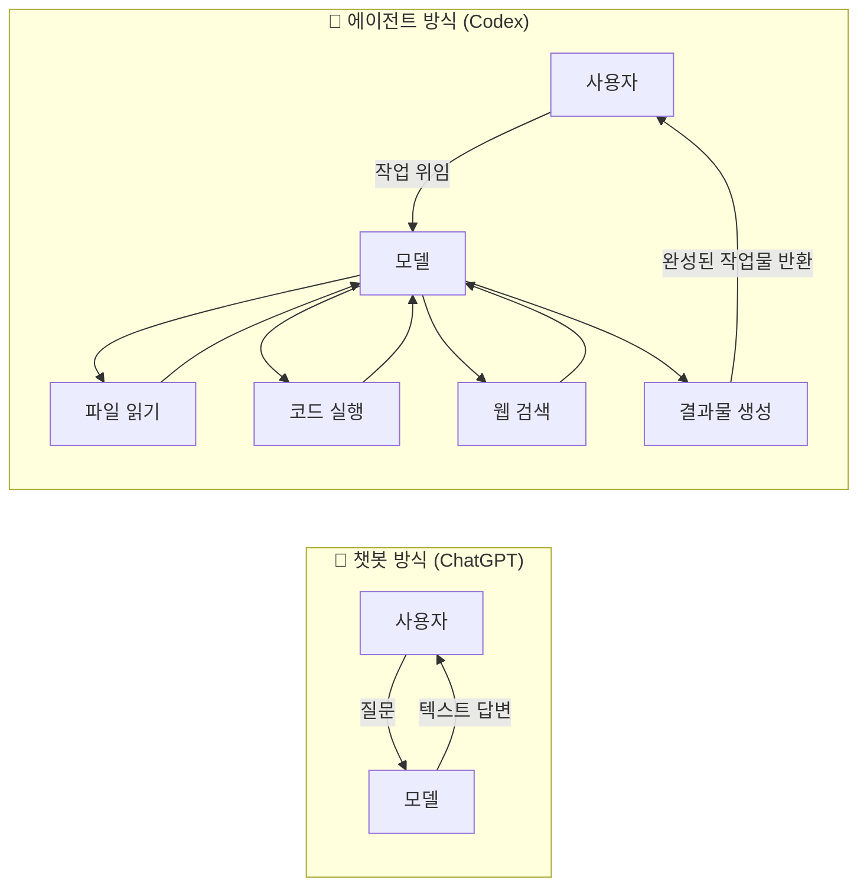
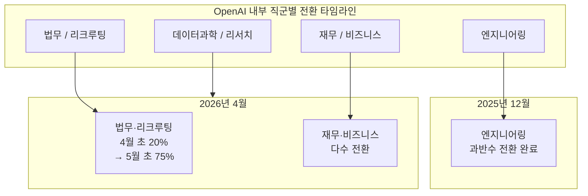
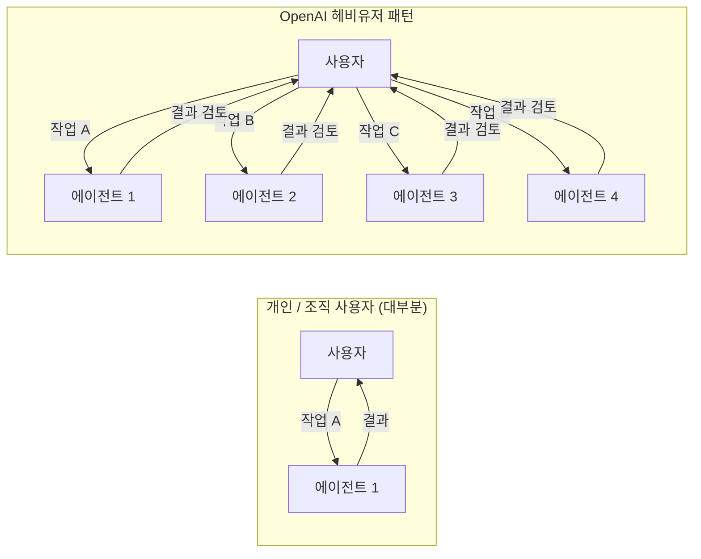
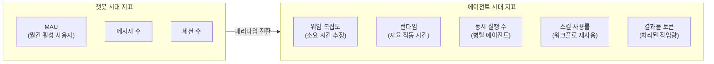

> **논문 원제:** The Shift to Agentic AI: Evidence from Codex  
> **저자:** Drew Johnston, David Holtz, Alex Martin Richmond, Christopher Ong, Prasanna Tambe, Aaron Chatterji  
> **소속:** OpenAI, Columbia Business School, University of Pennsylvania Wharton School, Duke University Fuqua School of Business  
> **발표일:** 2026년 6월 25일 (arXiv:2606.26959)  
> **원문 링크:** https://arxiv.org/abs/2606.26959  
> **관련 블로그:** https://openai.com/index/how-agents-are-transforming-work/

---

## 목차

1. [논문이 등장한 배경과 의미](#1-논문이-등장한-배경과-의미)
2. [핵심 개념: 챗봇과 에이전트의 차이](#2-핵심-개념-챗봇과-에이전트의-차이)
3. [연구 방법론: 프라이버시를 지키면서 대규모 데이터 분석하기](#3-연구-방법론-프라이버시를-지키면서-대규모-데이터-분석하기)
4. [발견 1: 누가 Codex를 쓰는가 — 채택 현황과 불균등 확산](#4-발견-1-누가-codex를-쓰는가--채택-현황과-불균등-확산)
5. [발견 2: 무엇을 시키는가 — 업무 유형과 직군 간 경계 붕괴](#5-발견-2-무엇을-시키는가--업무-유형과-직군-간-경계-붕괴)
6. [발견 3: 어떻게 쓰는가 — 복잡도, 병렬성, 스킬](#6-발견-3-어떻게-쓰는가--복잡도-병렬성-스킬)
7. [발견 4: 결과물이 얼마나 늘었나 — 생산성 지표](#7-발견-4-결과물이-얼마나-늘었나--생산성-지표)
8. [측정의 전환: 챗봇 지표에서 에이전트 지표로](#8-측정의-전환-챗봇-지표에서-에이전트-지표로)
9. [폴 데이비드의 전기화 비유와 한계](#9-폴-데이비드의-전기화-비유와-한계)
10. [비판적 시각: 이 데이터를 곧이곧대로 믿어도 될까](#10-비판적-시각-이-데이터를-곧이곧대로-믿어도-될까)
11. [Anthropic 연구와의 교차점](#11-anthropic-연구와의-교차점)
12. [노동시장과 조직 재설계 함의](#12-노동시장과-조직-재설계-함의)
13. [맺음말: 위임이 늘었다는 사실과 그 위임이 옳았다는 사실은 별개다](#13-맺음말-위임이-늘었다는-사실과-그-위임이-옳았다는-사실은-별개다)

---

## 1. 논문이 등장한 배경과 의미

이 논문이 중요한 이유는 단순히 "Codex 사용자가 많이 늘었다"는 홍보 자료가 아니기 때문이다. 논문을 쓴 사람들의 면면부터 살펴볼 필요가 있다. 제1저자 Drew Johnston은 OpenAI 소속이고, David Holtz는 Columbia Business School 교수, Prasanna Tambe는 Wharton 교수, 그리고 공동 저자 Aaron Chatterji는 Duke 대학 Fuqua 경영대학원 교수이자 OpenAI의 초대 수석 이코노미스트다. Chatterji는 바이든 행정부 시절 520억 달러 규모의 반도체법(CHIPS and Science Act) 집행을 직접 지휘했던 인물로, 현재는 AI가 일자리와 노동시장을 어떻게 바꾸는지를 측정하는 역할을 맡고 있다.

이들이 공동으로 내놓은 논문은 arXiv에 게재되어 동료 검토 없이 공개된 사전 출판본이지만, 학술적 방법론을 따르고 있으며 실제 Codex 사용 데이터를 분석한 결과물이다. 중요한 것은, 바로 이 연구팀이 1년 전인 2025년 9월에 ChatGPT 사용 패턴을 분석한 논문 "How People Use ChatGPT"를 발표했고, 그 논문에서 "사람들이 챗봇에 보내는 메시지의 절반(49%)이 묻기(asking)였다"고 보고했다는 점이다. 같은 팀이 1년 만에 정반대의 트렌드를 관찰하고 있다. 사용의 단위가 '질문'에서 '위임'으로 넘어갔다는 것이다.

논문 제목의 'Shift'라는 단어가 핵심이다. 이것은 단순한 도구 교체가 아니라, AI를 쓰는 **패러다임의 전환**에 관한 이야기다.

---

## 2. 핵심 개념: 챗봇과 에이전트의 차이

논문이 분석하는 대상을 이해하려면 먼저 '챗봇'과 '에이전트'의 차이를 명확히 해야 한다.

### 챗봇 방식 (ChatGPT 대표)

챗봇은 기본적으로 대화 인터페이스다. 사용자가 질문을 던지면 모델이 텍스트로 답변을 생성한다. "이 버그를 어떻게 고치면 좋을까요?"라고 물으면 방법을 설명해준다. 실제로 파일을 열거나 코드를 실행하거나 테스트를 돌리지는 않는다.

### 에이전트 방식 (Codex 대표)

에이전트는 여러 단계로 이루어진 작업을 자율적으로 처리할 수 있다. "이 버그 고쳐줘"라고 하면 직접 저장소를 클론하고, 관련 파일들을 열어 분석하고, 코드를 수정하고, 테스트를 실행해서 결과를 확인하고, 변경사항을 Pull Request로 제출한다. 사람이 옆에서 단계마다 지시하지 않아도 된다.

논문은 이 차이를 수치로 확인했다. 2026년 6월 11일 직전 한 주 동안, **Codex 작업의 60.3%가 외부 도구를 최소 한 번 이상 사용**했다. 같은 기간 ChatGPT는 21.9%에 그쳤다. 웹 검색, 파일 실행, 코드 실행 같은 '행동'이 Codex에서는 기본값이고, ChatGPT에서는 예외적인 사용 방식이라는 의미다.

논문은 이 구분이 절대적이지 않다고 명시한다. ChatGPT도 웹 검색이나 코드 실행 같은 에이전틱 기능을 포함하고 있고, Codex의 일부 상호작용은 순수한 대화형이기도 하다. 그러나 **도구 사용이 예외가 아닌 기본값이 됐다**는 점이 Codex를 에이전트로 분류하는 핵심 근거다.

---

## 3. 연구 방법론: 프라이버시를 지키면서 대규모 데이터 분석하기

이 연구에서 주목할 또 다른 측면은 방법론이다. 수백만 명의 사용 데이터를 분석하면서도 개인의 대화 내용을 연구자가 직접 읽지 않는 방식을 택했다.

### 자동화된 프라이버시 보호 파이프라인

연구팀은 AI를 사용해 사용자의 요청을 자동으로 분류한다. "이 요청은 코딩 작업이다", "저 요청은 문서 작성이다"라는 식으로 종류만 라벨링하고, 실제 대화 내용은 지운 채 집계된 숫자만 추출한다. 이 접근법은 설문지를 한 장씩 읽는 대신 집계된 통계표만 받아보는 것에 비유할 수 있다. 개인 프라이버시를 보호하면서 전체 패턴을 관찰한다.

### 세 집단 비교

논문은 세 가지 사용자 집단을 비교한다.

**개인 사용자(Individual):** Free, Go, Plus, Pro 플랜을 개인적으로 쓰는 사람들. 초기 채택자부터 일반 사용자까지 가장 이질적인 집단이다.

**조직 사용자(Organizational):** Business·Enterprise 플랜으로 회사 단위에서 쓰는 경우. 내부 보안 정책, 업무 흐름, 관리자 승인 같은 맥락이 채택 속도에 영향을 미친다.

**OpenAI 내부 직원(OpenAI workers):** 이 집단이 가장 특별하다. 사용료 부담이 사실상 없고, 경영진의 전폭적인 지지가 있으며, 최신 모델에 늘 접근 가능하고, 업무 자체가 개발 중인 AI 시스템과 맞닿아 있다. 논문은 이 집단을 "채택 마찰이 0에 가까울 때 어떤 사용 패턴이 나타나는가"를 보여주는 창(窓)으로 해석한다. 오늘의 OpenAI 직원이 몇 년 후 다른 기업 지식 노동자들의 모습일 수 있다는 뜻이다.

---

## 4. 발견 1: 누가 Codex를 쓰는가 — 채택 현황과 불균등 확산

### 전체 성장 규모

2026년 1월 1일부터 6월 1일까지 불과 5개월 만에 주간 활성 Codex 사용자 수가 **5배 이상 증가**했다. 이 성장세를 집단별로 살펴보면 불균등함이 명확하게 드러난다.

28일 기준 활성 사용자 중 Codex를 한 번이라도 쓴 비율(2026년 6월 기준):

| 집단 | Codex 사용 비율 |
|------|---------------|
| OpenAI 직원 | **97.9%** |
| 조직 사용자 | **17.3%** |
| 개인 사용자 | **0.7%** |

이 숫자만 보면 개인 사용자의 채택률이 극히 낮아 보인다. 그런데 '사용자 수'와 '작업량(토큰)'은 다른 이야기를 한다.

### 작업량 비중으로 보는 진짜 그림

개인 사용자 중 Codex를 쓰는 사람은 0.7%에 불과하지만, 그 소수가 매우 집중적으로 사용하기 때문에 **개인 사용자 전체 작업량의 16.5%가 Codex에서 나온다.** 조직 사용자는 채택률 17.3%에 작업량 비중 63.3%, OpenAI 직원은 채택률 97.9%에 **작업량 비중 99.8%** 다.

이것이 논문의 핵심 메시지 중 하나다. 아직 Codex를 쓰는 사람의 절대 수는 적지만, **한 번 쓰기 시작한 사람은 ChatGPT를 거의 완전히 대체해버릴 정도로 깊이 쓴다.** '쓰는 사람은 적은데, 쓰는 사람은 엄청나게 깊이 쓴다'는 초기 채택 단계의 전형적인 패턴이다.

### 비개발자의 폭발적 성장

논문에서 주목할 만한 또 다른 발견은 **코딩을 하지 않는 사람들의 성장 속도**다. 2025년 8월 대비 2026년 기준 비개발자 사용자 증가율:

- 개인 사용자: **137배**
- 조직 사용자: **189배**
- OpenAI 내부 직원: **12배** (이미 높은 기저에서 시작했기 때문에 상대적으로 낮음)

OpenAI 내부를 들여다보면 전환 시점도 직군별로 다르다. 엔지니어링 직군은 2025년 12월에 이미 절반 이상이 Codex로 넘어갔다. 법무·재무·리크루팅 같은 비개발 직군은 2026년 4월 즈음 다수가 전환했다. 늦게 시작했지만 속도는 더 빨랐다. 법무·리크루팅 직군의 경우 1월에 거의 0%였다가 4월 초 20%를 넘고, 한 달 만에 75%까지 치솟았다.

---

## 5. 발견 2: 무엇을 시키는가 — 업무 유형과 직군 간 경계 붕괴

### Codex는 코딩 도구를 넘어섰다

Codex가 처음 출시된 목적은 소프트웨어 개발이었다. 코드를 짜고, 버그를 잡고, 리팩토링을 돕는 것. 그런데 실제 사용 데이터를 보면, 특히 OpenAI 내부에서는 연구, 기획, 커뮤니케이션, 데이터 분석, 제품 관리, 채용, 영업 등 코딩과 무관한 영역으로 용도가 확장되어 있다.

논문에서 부서별로 Codex 작업 유형을 분류한 결과가 흥미롭다.

| 부서 | 엔지니어링/코딩 | 데이터 분석 | 재무 분석 | 지식 작업 | 기타 |
|------|-------------|-----------|---------|---------|------|
| 엔지니어링 | **72%** | 4% | 1% | 18% | 5% |
| 데이터과학/리서치 | **51%** | 10% | 0% | 30% | 9% |
| 재무/비즈니스 운영 | 31% | 9% | 16% | **34%** | 10% |
| 제품/마케팅/운영 | 25% | 3% | 7% | **51%** | 15% |
| 기타 | 50% | 7% | 2% | 38% | 4% |

### 직군 간 경계가 무너지고 있다

이 표에서 가장 충격적인 부분은 재무·비즈니스 운영 직군이 Codex로 한 작업의 **31%가 엔지니어링/코딩**이라는 점이다. 마케팅·운영 직군도 25%를 코딩 작업에 쓴다.

이것은 이전에는 "이건 개발팀에 요청해야 해"였던 일들을, 재무·운영 담당자가 직접 처리하기 시작했다는 의미다. 에이전트가 **직무 간 벽을 넘는 비용을 낮췄다.** 도메인 전문지식 없이도 Codex에 지시만 내리면 코드 수준의 결과물이 나오기 때문이다.

한편 엔지니어링 직군도 순수 코딩만 하지 않는다. 작업의 18%는 '지식 작업'이다. 문서 작성, 계획 수립, 커뮤니케이션 같은 것들이다. 에이전트가 코드뿐 아니라 문서와 분석도 처리하기 때문에, 엔지니어가 손으로 쓰던 작업이 Codex로 흡수된다.

---

## 6. 발견 3: 어떻게 쓰는가 — 복잡도, 병렬성, 스킬

### 맡기는 일의 난이도가 빠르게 올라가고 있다

논문은 개인 사용자 표본을 대상으로 각 요청을 "AI 없이 숙련된 사람이 직접 한다면 몇 시간이 걸리겠는가"로 추정했다. 이 추정은 AI 분류기가 자동으로 수행한다.

2025년 12월과 2026년 5월을 비교한 결과:

| 복잡도 기준 | 2025년 12월 | 2026년 5월 |
|-----------|------------|------------|
| 30분 이상짜리 일 경험한 사용자 | 약 55% | **80.6%** |
| 1시간 이상짜리 일 경험 | 약 35% | **70.2%** |
| 4시간 이상짜리 일 경험 | 약 5% | **42.4%** |
| 8시간 이상짜리 일 경험 | 2.1% | **25.6%** |

8시간, 즉 성인 하루치 업무에 해당하는 작업을 Codex에 위임한 사용자 비율이 반 년 만에 **열 배** 넘게 증가했다. 이는 사람들이 점점 더 큰 덩어리의 일을 에이전트에게 맡기고 있음을 보여준다.

**한 가지 흥미로운 패턴도 발견됐다.** 가장 복잡한 요청은 대화의 맨 앞에 나온다. 첫 번째 요청은 네 번째 요청보다 "1시간 이상 걸릴 일"일 확률이 두 배 이상 높다. 큰 덩어리를 처음에 던지고, 뒤로 갈수록 세부 조율 요청이 이어지는 패턴이다.

### 여러 에이전트를 동시에 돌리다

한 명의 사용자가 동시에 몇 개의 Codex 작업을 병렬로 실행하는지 측정한 결과도 주목할 만하다.

| 집단 | 1개만 사용 | 2개 동시 | 3-4개 동시 | 5개 이상 동시 |
|------|---------|---------|---------|------------|
| 개인 사용자 | 64% | 24% | ~9% | ~3% |
| 조직 사용자 | 67% | 24% | ~6% | ~3% |
| **OpenAI 직원** | **11%** | **22%** | **38%** | **28.6%** |

OpenAI 직원의 경우 한 번에 하나만 쓰는 사람이 11%에 불과하고, 다섯 개 이상을 동시에 돌린 적 있는 사람이 28.6%다. 상위 1%(99분위) 사용자는 하루에 약 **71시간어치**의 에이전트 작업을 돌린다. 하루는 24시간인데 71시간이 나온다는 것은 물리적으로 동시에 여러 에이전트가 병렬로 작동하고 있음을 의미한다. 이 수치는 4월 7일 이후에만 88% 더 증가했다.

반면 중앙값 직원은 하루 2.5시간으로, 큰 일을 맡기긴 해도 24시간 자동으로 돌리는 단계는 아니다. 상위 헤비유저부터 "여러 에이전트를 맡기고 지켜보고 검토하는" 패턴으로 전환되는 중이다.

### 스킬: 일회성 지시에서 재사용 워크플로로

논문에서 '스킬(Skill)'은 자주 하는 작업의 지시·도구·실행 순서를 묶어 저장해두고 반복 호출하는 기능이다. "우리 팀 양식으로 주간 보고서 만들기"를 스킬로 정의해두면, 매번 설명할 필요 없이 그 스킬을 호출하면 된다.

3월 1일에 5.4%였던 주간 활성 사용자 중 스킬 사용 비율이 6월 11일에는 **26.6%** 로 올랐다. OpenAI 내부는 **96.2%** 가 스킬을 사용한다. 일회성 지시가 **반복 가능한 업무 절차**로 굳어지는 현상이다.

특히 자라는 것은 **커스텀 스킬**이다. 팀 고유의 글쓰기 기준, 정기 리포트 양식, 조직 특유의 업무 흐름처럼 범용 도구로는 담을 수 없는 맥락을 에이전트에게 가르쳐 재사용하는 것이다. 논문은 이것을 도구를 '쓰는' 단계에서 업무 흐름을 '다시 짜는' 단계로 넘어가는 신호로 해석한다.

---

## 7. 발견 4: 결과물이 얼마나 늘었나 — 생산성 지표

### 부서별 생산량 증가 배수 (2025년 11월 → 2026년 6월)

논문은 부서별 중앙값 활성 직원(median active worker)의 월 출력 토큰 변화를 추적했다.

| 부서 | 증가 배수 |
|------|---------|
| 리서치 | **56배** |
| 고객지원 | **32배** |
| 엔지니어링 | **27배** |
| 법무 | **13배** |

법무 직군이 13배로 상대적으로 낮아 보이지만, 이는 시작 시점이 늦었고 기저가 낮아서 배수가 더 크게 나왔어야 하는데 그렇지 않다는 의미이기도 하다. 반대로 리서치 직군이 56배라는 것은 이미 AI 활용에 익숙했던 연구자들이 에이전트로 전환하면서 생산량이 폭발적으로 늘었다는 뜻이다.

### 평균의 함정: 채택자 기준으로 보면 더 극적이다

조직의 평균 엔지니어는 작업량의 26.8%만 Codex에서 나오지만, 'Codex를 쓰는 엔지니어'로 좁히면 그들 작업량의 **88.3%가 Codex**에서 나온다. 법무 직군은 평균 1.9%인데 채택자 기준으로는 17.6%다. 안 쓰는 사람이 평균을 끌어내리고 있을 뿐, **한 번 들어온 사람은 깊이가 완전히 다르다.**

논문의 핵심 통찰 중 하나는 이것이다. **사용자 수로만 보면 과소평가되고, 작업량으로 보면 극적인 전환이 이미 진행 중이다.**

---

## 8. 측정의 전환: 챗봇 지표에서 에이전트 지표로

논문의 결론 중 하나는 AI 시대의 측정 도구 자체가 바뀌어야 한다는 것이다.

### 챗봇 시대의 지표 (이제 불충분)
- 월간 활성 사용자 수(MAU)
- 전송된 메시지 수
- 세션 수

### 에이전트 시대에 필요한 지표
- **위임 복잡도:** 얼마나 어려운 일을 맡겼는가 (숙련자 기준 소요 시간)
- **런타임:** 에이전트가 얼마나 오래 자율적으로 작동했는가
- **동시 실행 수:** 한 번에 몇 개의 에이전트를 병렬로 돌렸는가
- **스킬 사용 여부:** 재사용 가능한 워크플로를 만들었는가
- **결과물 토큰:** 얼마나 많은 일이 처리됐는가

논문은 이렇게 정리한다. "답을 묻는 시스템에서, 행동하는 시스템을 관리하는 쪽으로 사용의 무게중심이 옮겨갔다."

---

## 9. 폴 데이비드의 전기화 비유와 한계

저자들은 현재의 에이전틱 AI 전환을 19세기 말 전기화(Electrification)에 비유한다. 이 비유는 1990년 경제학자 폴 데이비드(Paul David)의 연구에서 나온다.

### 전기화의 역설

19세기 말 증기기관에서 전기모터로 전환될 때, 초기 공장들은 기존 레이아웃을 그대로 둔 채 동력원만 바꿨다. 중앙 증기엔진 하나가 굵은 샤프트를 통해 모든 기계를 돌리던 방식에서, 거대한 전기모터 하나가 그 역할을 대신했을 뿐이다. 이런 방식으로는 생산성이 거의 오르지 않았다.

생산성 혁신은 수십 년 후 공장 설계 자체를 뒤엎으면서 왔다. 작은 전기모터 여러 개가 각 기계에 직접 붙으면서, 공장 레이아웃이 작업 흐름에 맞게 자유롭게 재설계될 수 있었다. 이것이 대규모 생산성 도약을 만들었고, 이 과정이 수십 년이 걸렸다.

### AI로의 적용

저자들은 에이전틱 AI도 같은 논리가 적용된다고 본다. 기업이 기존 업무 방식을 그대로 두고 Codex만 도입하면 성능 개선이 제한적이다. 진정한 가치는 **Codex를 기반으로 업무 흐름, 책임 구조, 검토 프로세스를 근본적으로 재설계**할 때 나온다.

### 차이점: 소프트웨어는 전기화보다 빠를 수 있다

저자들은 중요한 차이점도 지적한다. 공장의 물리적 재설계는 건물을 바꾸고 기계를 옮기는 것이었다. 소프트웨어 기반 지식 노동의 재설계는 절차와 프로세스를 바꾸는 것이기 때문에 비용이 훨씬 낮다. 따라서 전기화 시대의 수십 년보다 훨씬 빠르게 확산될 수 있다.

---

## 10. 비판적 시각: 이 데이터를 곧이곧대로 믿어도 될까

### 이해충돌 문제

The Next Web을 비롯한 여러 매체가 즉각 지적한 것처럼, **이 논문의 모든 통계는 Codex를 판매하는 OpenAI 자신에게서 나왔다.** 자사 제품의 성공을 측정하는 데이터를 자사가 직접 제공했다. 이는 방법론적으로 심각한 이해충돌이다.

논문 저자들도 이 한계를 인식하고 있다. 분석 대상인 OpenAI 직원 집단은 "대표적인 일반 기업"이 아니며, AI 사용에 대한 인센티브와 능력 면에서 극단적으로 유리한 환경에 있다고 직접 밝힌다. 그래서 "마찰이 0에 가까울 때의 미래를 보여준다"는 해석을 제시하지, "이것이 일반 기업의 현재"라고 주장하지는 않는다.

### 토큰 ≠ 가치

논문 자체도 명시적으로 인정하는 한계가 있다. 토큰 수는 '사용량'이지 '검증된 결과물의 가치'가 아니다. Codex가 많은 토큰을 생성했다는 것은 Codex가 많은 일을 했다는 뜻이지, 그 일이 정확하고 유용했다는 보증이 아니다.

법무 직원이 13배의 토큰을 생산했다는 것은 13배 많은 법무 작업을 처리했을 수도 있지만, 13배 많은 초안을 작성했다가 절반을 폐기했을 수도 있다. **위임이 늘었다는 사실과 그 위임이 옳고 유용했다는 사실은 별개**다. 논문은 이 질문에 답하지 않는다.

### 동료 검토 부재

이 논문은 arXiv 사전 출판본으로, 아직 동료 검토(peer review)를 거치지 않았다. 학술적 검증이 완료된 논문이 아니라는 점을 감안해야 한다.

---

## 11. Anthropic 연구와의 교차점

논문은 경쟁사인 Anthropic의 경제 연구를 직접 인용한다. Anthropic 연구팀의 논문 "Agentic Coding and Persistent Returns to Expertise"(14번 참고문헌)다.

Anthropic 연구의 핵심 주장은 이렇다. 에이전틱 AI 시스템이 확산될수록 인간 노동의 가치 중심이 **'직접 실행'에서 '감독·판단·도메인 전문성'으로** 이동한다. 즉, 에이전트가 코드를 짜는 것은 중요하지 않아지고, 에이전트가 짠 코드를 정확하게 검토하고 방향을 잡는 전문성이 중요해진다.

서로 경쟁하는 두 AI 연구소의 경제 연구팀이 **같은 결론에 도달했다.** 이것은 이 방향이 단순한 마케팅 메시지가 아니라 실증적으로 관찰되는 패턴임을 시사한다.

이 결론은 또 다른 연구(9번 참고문헌, "Writing Code vs. Shipping Code")와도 맞닿아 있다. 태스크 수준의 생산성 향상이 크더라도, 검토·배포·검증 같은 하위 병목이 사람에게 남아 있어 최종 결과물로의 전환이 완전하지 않을 수 있다는 것이다.

---

## 12. 노동시장과 조직 재설계 함의

### 사람의 역할이 재정의된다

논문이 제시하는 미래는 AI가 사람의 일자리를 대체한다는 단순한 이야기가 아니다. 오히려 일의 단위와 역할의 구조가 바뀐다는 이야기다.

OpenAI 헤비유저들에서 이미 관찰되는 패턴이 있다. 사람의 역할이 **'직접 일하기'에서 '여러 에이전트를 배분·감독·검토하기'로 이동**하고 있다. 상위 1% 사용자가 하루 71시간어치 에이전트 작업을 돌린다는 것은, 그가 AI 작업 결과를 검토하고 방향을 수정하는 역할에 집중한다는 뜻이다.

### 조직 설계가 바뀌어야 한다

논문은 에이전틱 AI의 가치가 기술 자체보다 **조직의 재설계 역량**에 달려 있다고 주장한다. 다음 세 가지 차원에서 변화가 필요하다.

첫째, **워크플로 재설계.** 기존 업무 절차를 에이전트 위임에 적합한 형태로 다시 구성해야 한다.

둘째, **책임 구조 재정립.** 에이전트가 만든 결과물에 대한 검토 책임이 누구에게 있는지, 오류가 생겼을 때 어떤 절차를 밟아야 하는지를 명확히 해야 한다.

셋째, **스킬 자산 축적.** 팀 고유의 지식과 절차를 Codex 스킬로 체계화해 재사용 가능한 형태로 만드는 것이 중요한 조직 자산이 된다.

---

## 13. 맺음말: 위임이 늘었다는 사실과 그 위임이 옳았다는 사실은 별개다

이 논문이 보여주는 것은 명확하다. OpenAI 내부에서는 이미 에이전틱 AI가 지식 노동의 주된 인터페이스로 자리잡았다. 법무, 재무, 리크루팅 직군까지 Codex를 주력 도구로 쓰고 있으며, 맡기는 일의 복잡도도 빠르게 올라가고 있다. 조직 사용자와 개인 사용자에서도 같은 방향의 흐름이 관찰되고, 비개발자들의 성장 속도가 개발자보다 더 빠르다.

그러나 이 논문이 보여주지 못하는 것도 중요하다. 토큰 생산량이 늘었다는 것이 업무 품질이 좋아졌다는 뜻은 아니다. 채택이 빠르다는 것이 조직이 이미 그 혜택을 온전히 누리고 있다는 뜻도 아니다. 에이전트가 더 많은 일을 대신 하게 될수록, **사람에게 남는 역할인 감독·검증·판단의 품질이 결과물의 질을 결정하는 병목**이 된다.

논문은 이 문장으로 끝난다: "답을 묻는 시스템에서, 행동하는 시스템을 관리하는 쪽으로 사용의 무게중심이 옮겨갔다."

질문하는 방법을 배우는 것으로 충분했던 시대가 지나고, 에이전트를 어떻게 배분하고 검토할지를 아는 역량이 가치를 결정하는 시대로 접어들고 있다는 선언이다.

---

## 참고 자료

- [논문 원문 (arXiv)](https://arxiv.org/abs/2606.26959)
- [논문 PDF (OpenAI CDN)](https://cdn.openai.com/pdf/5d1e1489-21c0-43e4-9d42-f87efdbf0082/the-shift-to-agentic-ai-evidence-from-codex.pdf)
- [OpenAI 블로그 발표](https://openai.com/index/how-agents-are-transforming-work/)
- [@choi.openai Threads 요약 스레드](https://www.threads.com/@choi.openai/post/DaAlN9dj9lV)
- Chatterji, A. et al. (2025). "How People Use ChatGPT." OpenAI.
- [14] Agentic Coding and Persistent Returns to Expertise. Anthropic Economic Research.

---

*작성일자: 2026-06-29*
