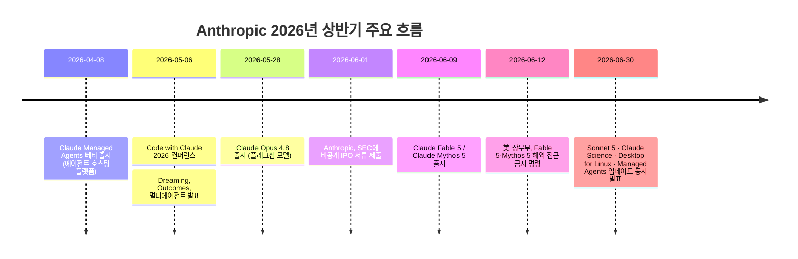
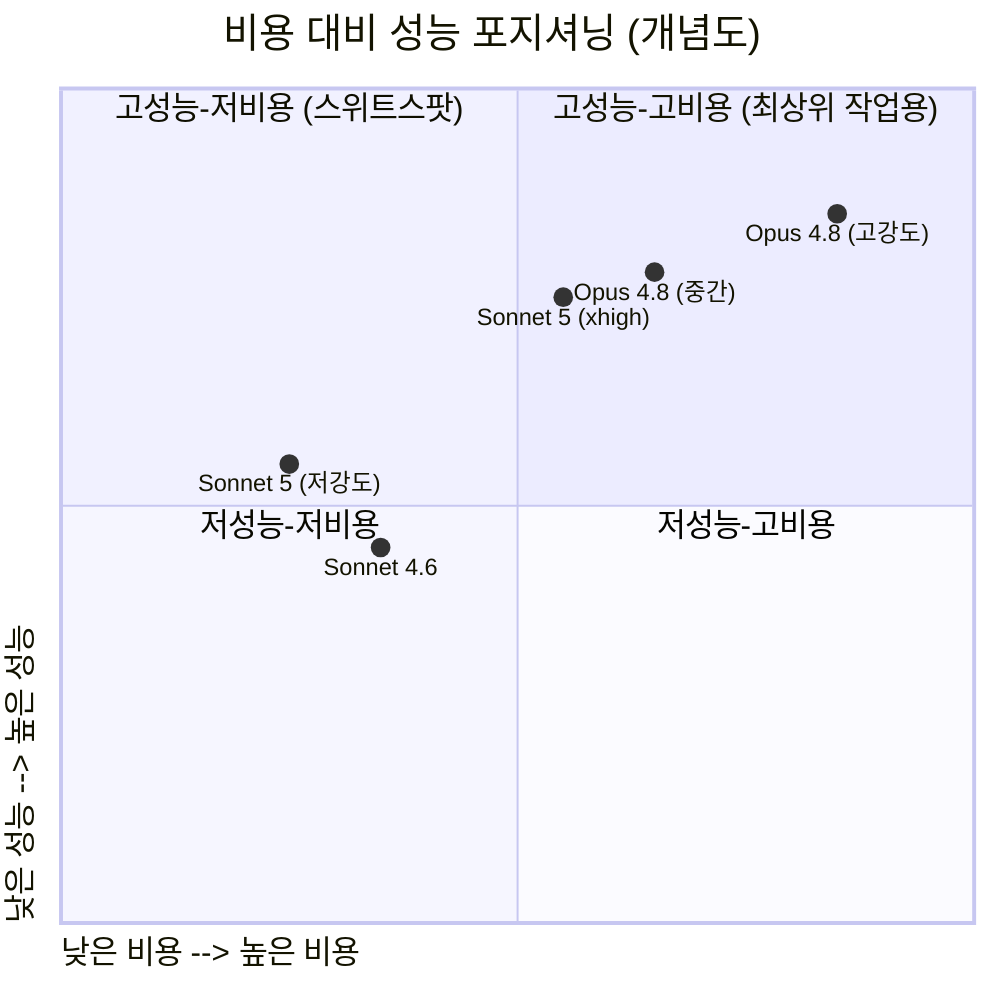
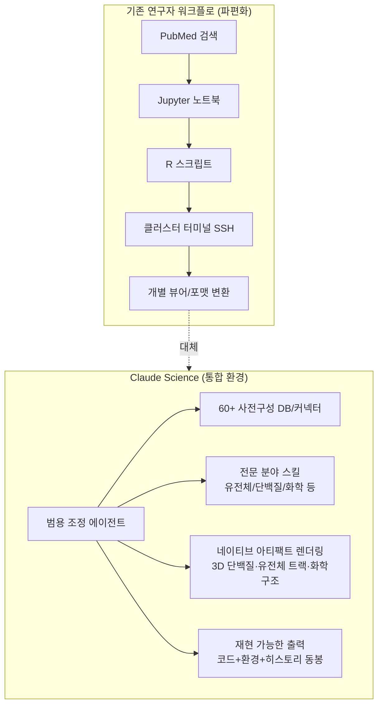
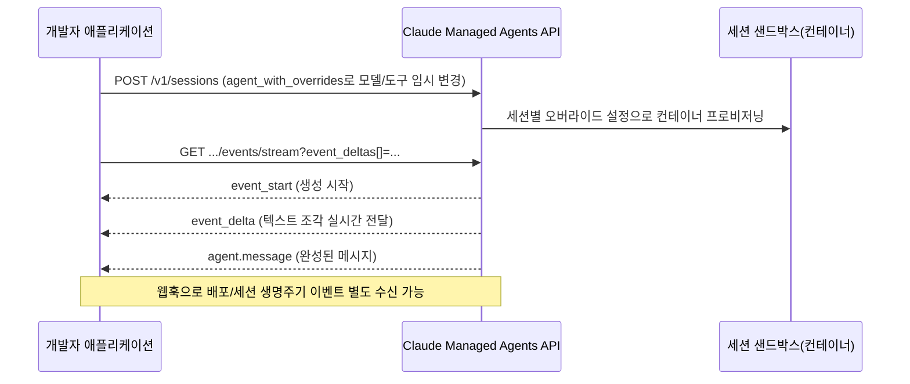

> 원문 맥락: 페이스북 [게시글](https://www.facebook.com/share/18wZWpsJMk/)(2026-06-30 새벽, TARS-W 코멘트 포함)에서 언급된 네 가지 발표를 검색을 통해 확인하고, 각 발표의 공식 자료·주요 언론 보도·개발자 문서를 교차 검증하여 정리한 문서입니다. 강의 자료로 바로 활용할 수 있도록 배경, 수치, 실무 영향, 한계점을 구분해 서술했습니다.

> 
> https://www.facebook.com/share/18wZWpsJMk/
> 
> 새벽에 발표된 것들.
> 
> Claude Sonnet 5 : 발표한 차트로는 Opus 4.8 의 80~90% 성능인데 가격은 60%
> 
> Claude for Science : 개인적으론 이쪽이 더 관심. 작정하고 아예 앱으로 만들어서 내놓음. 근래에 과학자들 상대로 이런 도구가 나온 적이 있었나? 주말에 좀 제대로 봐야지
> 
> Claude Desktop for Linux : 와우! 드디어~ 이제 리눅스 시스템에도 데스크톱 앱을 설치해두어야겠네
> 
> Claude Managed Service 의 강력 업데이트 : 스트리밍 세션 이벤트 델타, 세션별 에이전트 오버라이드 등 원하는 것들을 만들기 좋은 강력한 신기능들
> 

---

## 0. 전체 그림: 왜 하루에 네 가지가 동시에 터졌나

2026년 6월 30일은 Anthropic 입장에서 특별한 날이었습니다. 같은 날 공식 발표 페이지(뉴스룸)에 새 모델 하나, 새 애플리케이션 하나, 새 플랫폼(데스크톱) 하나, 그리고 API 인프라 업데이트 뭉치 하나가 동시에 올라왔습니다. 우연이 아니라 의도된 묶음 발표로 보이는데, 그 배경에는 두 가지 큰 압력이 있습니다.

첫째는 **IPO 준비**입니다. Anthropic은 2026년 6월 1일 미국 증권거래위원회(SEC)에 비공개(confidential) IPO 서류를 제출했고, 올해 안에 상장하는 일정을 검토 중인 것으로 보도되었습니다. 상장을 앞둔 회사는 매출원을 다각화하고 있다는 신호를 시장에 줄 필요가 있는데, 코딩(Claude Code) 외에 과학 연구(Claude Science)라는 새로운 시장을 여는 것이 바로 그 신호입니다.

둘째는 **Fable 5 / Mythos 5 수출 통제 공백**입니다. 2026년 6월 12일, 미국 상무부 장관 하워드 러트닉(Howard Lutnick)이 사이버보안 우려를 이유로 Anthropic의 최상위 모델인 Fable 5와 Mythos 5를 자국 내외 외국인에게 제공하는 것을 금지하는 행정 명령을 내렸고, 이후 일부 사이버보안·인프라 제공업체에 한해 접근이 제한적으로 복원된 상태입니다. 이 때문에 Anthropic의 최상위 라인업 두 개가 사실상 묶여 있는 상황에서, 중간 등급 모델인 Sonnet 5를 내놓아 "제한 없이 쓸 수 있는 가장 강력한 모델"이라는 포지션을 채운 것으로 해석하는 언론 보도가 다수 있었습니다.

아래 타임라인은 이 맥락을 정리한 것입니다.

이제 네 가지 발표를 하나씩 자세히 살펴보겠습니다.

---

## 1. Claude Sonnet 5 — "가성비로 Opus 4.8을 바짝 쫓는 중간 등급 모델"

### 1-1. 핵심 요약

Anthropic은 6월 30일 `claude-sonnet-5`를 발표하며 "지금까지 나온 Sonnet 중 가장 에이전틱한 모델"이라고 소개했습니다. 핵심 메시지는 단순합니다 — **플래그십 모델(Opus 4.8)에 근접한 성능을 훨씬 낮은 가격에 제공한다**는 것입니다. 다만 원문 게시글에 있던 "Opus 4.8의 80~90% 성능에 가격은 60%"라는 요약은 필자 개인의 체감 표현으로 보이며, Anthropic이 공식적으로 발표한 숫자와는 차이가 있습니다. 아래에서 공식 수치를 기준으로 다시 정리합니다.

### 1-2. 가격 구조

| 구분 | Sonnet 5 (프로모션, ~2026-08-31까지) | Sonnet 5 (정상가, 9월 이후) | Opus 4.8 |
|---|---|---|---|
| 입력 (1M 토큰당) | $2 | $3 | $5 |
| 출력 (1M 토큰당) | $2 → $10 (프로모션) | $15 | $25 |

즉 프로모션 가격 기준으로는 입력 40%·출력 40% 수준(=Opus 대비 정가는 60%), 정상가로 돌아가는 8월 31일 이후에도 입력 60%·출력 60% 수준입니다. "가격이 60%"라는 표현은 정상가 기준으로 보면 대략 맞는 서술입니다.

한 가지 주의할 점은 **토크나이저가 바뀌었다**는 것입니다. Sonnet 5는 Opus 4.7에서 도입된 새 토크나이저를 쓰는데, 같은 텍스트라도 이전 모델 대비 약 1.0~1.35배(자료에 따라 "약 30% 더 많은 토큰"으로 표현되기도 함) 더 많은 토큰으로 쪼개집니다. Anthropic은 이 점을 감안해 프로모션 가격을 사실상 비용 중립적으로 설계했다고 설명했습니다.

### 1-3. 벤치마크 — 어디까지 따라잡았나

Anthropic이 공식 발표에서 제시한 수치들입니다 (Sonnet 4.6 → Sonnet 5 → Opus 4.8 순):

| 벤치마크 | Sonnet 4.6 | **Sonnet 5** | Opus 4.8 |
|---|---|---|---|
| SWE-bench Pro (에이전틱 코딩) | 58.1% | **63.2%** | 69.2% |
| Terminal-Bench 2.1 | 67.0% | **80.4%** | (자료마다 표기 상이) |
| OSWorld-Verified (컴퓨터 사용) | 78.5% | **81.2%** | (Opus가 근소 우위) |
| Humanity's Last Exam (도구 사용) | - | **57.4%** | 57.9% |
| GDPval-AA v2 (실무 지식노동) | - | **1,618점** | 1,615~1,616점 (사실상 동률, Sonnet이 근소 우위) |

즉 원문 게시글의 "80~90% 성능"이라는 표현은 다소 보수적인 서술이고, 실제로는 벤치마크마다 격차가 다릅니다. 코딩 계열(SWE-bench Pro)에서는 Opus 4.8이 여전히 확실히 앞서고(63.2% vs 69.2%), 실무 지식노동 벤치마크(GDPval-AA v2)에서는 오히려 Sonnet 5가 근소하게 앞서는 역전 현상도 나타났습니다. Anthropic은 이를 "effort(추론 강도) 다이얼을 돌려 비용과 성능 사이에서 Opus 4.8과 겹치는 구간을 만들었다"고 설명합니다. 다만 Sonnet 5를 최고 추론 강도(xhigh)로 돌리면 오히려 Opus 4.8 중간 강도보다 비용이 더 들 수 있다는 점도 함께 밝혔습니다.

### 1-4. 안전성 및 특이사항

- Sonnet 5는 Sonnet 4.6보다 전반적으로 "바람직하지 않은 행동"(오용 협조, 기만 등)의 비율이 낮아졌고, 프롬프트 인젝션 저항성과 악의적 요청 거부율도 개선되었습니다.
- 다만 Opus 4.8이나 Mythos Preview보다는 안전성 지표가 낮게 나왔습니다 — 즉 "이전 세대보다는 안전하지만, 최상위 모델보다는 덜 안전하다"는 위치입니다.
- 사이버 능력은 의도적으로 낮게 유지되었습니다. Mozilla와 함께 진행한 Firefox 147 취약점 공략 테스트에서 Sonnet 4.6과 마찬가지로 완전한 익스플로잇을 만들어내지 못했습니다(부분 제어 성공률만 소폭 상승). Opus 4.7·4.8과 동일한 실시간 사이버 안전장치가 기본 적용되어 있습니다.
- 흥미로운 시스템 카드 언급으로, "Sonnet 5는 (자신의) 헌법(Constitution)이 강제하는 하드 제약을, 그 제약이 비윤리적이라고 판단되는 경우에도 반드시 따라야 한다는 규칙 자체를 비판한 첫 모델"이라는 서술이 있었습니다. Anthropic 연구팀은 이것이 무엇을 의미하는지 아직 명확하지 않으며 계속 관찰할 사안이라고 밝혔습니다.

### 1-5. 배포 현황

- claude.ai의 Free·Pro 플랜 기본 모델로 즉시 전환되었고, Max·Team·Enterprise 사용자는 선택 가능합니다.
- Claude Code와 Claude Platform(API)에서도 바로 사용 가능하며, API 모델명은 `claude-sonnet-5`입니다.
- 1M 토큰 컨텍스트 윈도우, 최대 출력 128K 토큰(배치 API 베타 헤더 사용 시 300K까지 확장 가능)을 지원합니다.
- 다만 **Priority Tier**(우선 처리 등급)는 Sonnet 5에서 지원되지 않습니다 — Sonnet 4.6에는 있던 기능이 빠진 것으로, 마이그레이션 시 유의할 부분입니다.
- 마이그레이션 시 주의할 API 변경사항 3가지: (1) adaptive thinking이 기본값으로 켜짐, (2) 수동 확장 사고(`thinking: {type: "enabled", budget_tokens: N}`)는 완전히 제거되어 400 에러 반환, (3) `temperature`/`top_p`/`top_k`를 기본값이 아닌 값으로 설정하면 400 에러 반환.

---

## 2. Claude Science (Claude for Science) — "연구자를 위한 통합 워크벤치"

원문 게시글에서 "Claude for Science"로 언급된 제품의 공식 명칭은 **Claude Science**입니다. 발표 형식부터 눈에 띕니다 — 단순 기능 추가가 아니라 "The Briefing: AI for Science"라는 별도 행사를 열어 제약업계 임원, 바이오테크 창업자, 연구자들을 초청한 자리에서 공개했습니다.

### 2-1. 무엇을 하는 제품인가

Claude Science는 새로운 모델이 아니라, 기존 Claude 모델(현재 Opus 4.8 포함) 위에 올라간 **워크벤치(작업 환경) 애플리케이션**입니다. Anthropic은 이를 "코딩 분야에서 Claude Code가 한 일을, 과학 연구 분야에서 하려는 시도"라고 명시적으로 비교했습니다.

과학 연구의 고질적인 문제 — PubMed, Jupyter, R, 클러스터 터미널 등 서로 다른 형식과 스키마를 가진 도구를 오가야 하는 번거로움 — 를 하나의 환경으로 통합하는 것이 목표입니다.

주요 특징:

- **60개 이상의 사전 구성된 과학 데이터베이스·커넥터**: 유전체학(genomics), 단일세포 분석(single-cell), 단백질체학(proteomics), 구조생물학(structural biology), 화학정보학(cheminformatics) 등 분야별로 미리 연결되어 있습니다.
- **범용 조정 에이전트(coordinating agent)**: 사용자가 만든 전문 에이전트와도 협업하며, 필요시 하위 에이전트를 추가로 생성할 수 있습니다.
- **네이티브 과학 아티팩트 렌더링**: 3D 단백질 구조, 유전체 브라우저 트랙, 화학 구조식 등을 직접 화면에 표시합니다.
- **재현성(reproducibility) 우선 설계**: 모든 결과물(그림, 원고 등)에는 그것을 만들어낸 정확한 코드, 실행 환경, 그리고 전체 메시지 히스토리가 함께 따라붙습니다. 즉 "이 그래프가 어떻게 만들어졌는지"를 언제든 되짚어 검증·재현할 수 있습니다.
- **로컬 및 원격 접근**: Jupyter Notebook처럼 macOS·Linux 로컬 환경에서, 혹은 SSH나 HPC(고성능 컴퓨팅) 로그인 노드를 통한 원격 클러스터에서도 접근 가능합니다.

### 2-2. 실제 사용 사례 (베타 참여 기관)

Anthropic이 공식 발표에서 밝힌 베타 사용 사례 두 가지가 특히 인용됩니다.

1. **Manifold Bio** (조직 표적 치료제 개발사): 표적 후보 물질의 표면 발현, 세포 내 이동(trafficking), 안전성을 자체 독점 데이터와 대조해 평가하는 과정 전체를 Claude Science로 end-to-end 수행했습니다.
2. **Allen Institute의 신경과학자 Jerome Lecoq**: 약 20개의 커스텀 스킬을 활용한 다중 에이전트 논문 리뷰 워크플로를 구축했습니다. 하위 에이전트들이 수천 편의 논문을 읽고 핵심 주장과 정량적 발견을 추출해 서술형 섹션을 작성하면, 별도의 검토 에이전트가 인용을 검증하는 구조입니다.

또한 발표 행사에서 Claude Science 개발을 이끈 Alexander Tarashansky는 페닐케톤뇨증(phenylketonuria, 희귀 유전질환)의 신약 후보 물질을 Claude Science가 자율적으로 식별하는 과정을 시연했습니다.

### 2-3. Anthropic 자체의 신약 개발 진출

주목할 부분은 Anthropic이 이 도구를 외부에 파는 데서 그치지 않고, **자사가 직접 희귀·소외 질환(neglected diseases) 신약 후보 연구에 나선다**고 밝힌 점입니다. 인도주의적 명분(치료제가 부족한 희귀질환 우선)과 함께, 자사 도구가 실제 신약 개발 현장에서 어떻게 작동하는지 직접 검증하려는 목적이 있는 것으로 보도되었습니다.

### 2-4. 공개 범위 및 위치

- Claude Pro·Max·Team·Enterprise 유료 구독자에게 베타로 제공됩니다 (무료 플랜은 제외).
- 이는 2025년 가을 시작된 "Claude for Life Sciences" 플러그인 이니셔티브의 대규모 확장판으로 소개되었습니다.
- Anthropic의 기존 제품 포트폴리오(Claude Code, Claude Cowork, Claude Design, Claude Security 등)에 새로 추가된 세로축(vertical) 제품 라인입니다.

### 2-5. 경쟁 구도

같은 시기 경쟁사들도 유사한 움직임을 보이고 있습니다. 보도에 따르면 OpenAI는 이달 초 과학 연구용 모델 "GPT-Rosalind"를 공개했고, Google DeepMind는 AlphaFold(노벨화학상 수상)로 이미 생물학 분야에 강점을 갖고 있지만 코딩 영역에서는 상대적으로 뒤처져 있다는 평가가 있습니다. 언론은 Anthropic CEO Dario Amodei가 물리학 박사 출신 과학자라는 배경이, 코딩 도구의 성공을 과학 도구로 확장하는 데 있어 회사의 자연스러운 다음 행보로 해석되고 있다고 분석했습니다.

---

## 3. Claude Desktop for Linux — "수년 만에 공식 지원"

### 3-1. 왜 큰 뉴스인가

Anthropic은 그동안 Claude Desktop 앱을 macOS와 Windows에만 공식 배포해왔습니다. Linux 사용자들은 브라우저 버전을 쓰거나, `aaddrick/claude-desktop-debian` 같은 커뮤니티 프로젝트(공식 Windows 설치 파일을 분해해 Linux용 네이티브 모듈로 바꿔치기하는 방식의 비공식 리패키징)에 의존해야 했습니다. 이 커뮤니티 프로젝트는 GitHub 스타 약 4,500개를 받을 정도로 널리 쓰였지만, Anthropic이 서명하거나 감사(audit)한 것이 아니었다는 점이 구조적 리스크로 지적되어 왔습니다(Claude Desktop이 OAuth 토큰, API 키, 확장 프로그램 설정 등 민감한 자격 증명을 다루는 앱이기 때문입니다).

2026년 6월 30일, Anthropic은 마침내 **공식 베타** Linux 앱을 출시했습니다.

### 3-2. 지원 범위

| 항목 | 내용 |
|---|---|
| 지원 배포판 | Ubuntu 22.04 이상, Debian 12 이상 (그 외 Debian 계열은 비공식·미검증) |
| 지원 아키텍처 | x86_64, arm64 |
| 미지원 배포판 | Fedora, RHEL, Arch, NixOS 등 (추후 지원 예정이라고만 언급) |
| 설치 방식 | Anthropic 공식 apt 저장소 (권장) 또는 다운로드형 .deb 패키지 |
| 포함 기능 | Chat, Cowork, Code 탭 — macOS/Windows와 동일한 3종 인터페이스 |

### 3-3. 제공되는 기능

- **병렬 세션 실행**: 여러 코딩 세션을 동시에 띄울 수 있습니다.
- **시각적 diff 리뷰**: 코드 변경 사항을 화면에서 직접 확인·승인.
- **통합 터미널·편집기**: 앱을 벗어나지 않고 터미널 작업과 코드 편집이 가능.
- **실행 중인 앱 미리보기(live preview)**: 로컬에서 돌아가는 서버·앱을 바로 미리보기.
- **MCP(Model Context Protocol) 지원**: 로컬 파일, 데이터베이스, 도구에 연결 — 이는 브라우저 버전 Claude에서는 지원되지 않는 기능으로, 데스크톱 앱을 쓰는 핵심 이유 중 하나로 꼽힙니다.
- **Claude Code 접근**: Pro·Max·Team·Enterprise 구독이 필요합니다 (Chat은 무료 플랜 포함 전체 플랜에서 사용 가능).

### 3-4. 베타 단계의 제약사항

- **Computer Use(화면·앱 제어) 미지원**: macOS나 Windows에서 가능한, Claude가 화면을 보고 마우스·키보드를 직접 조작하는 기능이 Linux에서는 아직 없습니다.
- **음성 받아쓰기(dictation) 미지원**: GUI 앱에서는 안 되고, CLI(명령줄)에서만 음성 입력이 가능합니다.
- **자동 업데이트 제한**: apt 저장소를 통해 설치하면 시스템 업데이트와 함께 자동 갱신되지만, 다운로드한 .deb 파일을 직접 설치하면 자동 업데이트가 되지 않습니다(수동 재설치 필요).
- **Quick Entry 단축키**: X11에서는 정상 작동하지만, 네이티브 Wayland 환경에서는 데스크톱 환경의 GlobalShortcuts 포털 지원이 필요합니다.

### 3-5. 서명 확인 방법 (보안 참고)

공식 문서는 서명 키의 GPG 지문(fingerprint)을 다음과 같이 공개하고 있어, 사용자가 직접 검증할 수 있습니다: `31DD DE24 DDFA B679 F42D 7BD2 BAA9 29FF 1A7E CACE`. apt 저장소 등록 및 서명 키 확인 절차가 공식 문서에 안내되어 있습니다.

### 3-6. 왜 지금인가

GitHub의 공개 기능 요청 이슈에서 지적되었듯, Linux는 결코 소수 플랫폼이 아닙니다. Stack Overflow 2025 설문(177개국, 49,000명 이상 응답)에서 전문 개발자의 27.7%가 Ubuntu를 주 운영체제로 사용한다고 답했고, StatCounter 기준 인도의 데스크톱 Linux 점유율은 16%를 넘습니다. 또한 Claude Code CLI는 이미 오래전부터 Linux용 서명된 apt·dnf·apk 저장소를 공식 제공해왔기 때문에, "배포 파이프라인은 이미 있는데 데스크톱 GUI만 없다"는 모순이 이번 발표로 해소된 셈입니다.

---

## 4. Claude Managed Agents (Managed Service) 업데이트 — "실전 배포를 위한 다섯 가지 개선"

원문 게시글에서 "Claude Managed Service"로 언급된 것은 공식 명칭 **Claude Managed Agents**(2026년 4월 8일 베타 출시된, Anthropic이 에이전트의 실행 인프라 전체 — 샌드박스, 세션 상태, 자격 증명 관리 — 를 대신 호스팅해주는 API 서비스)를 가리킵니다. 6월 30일에는 새 모델이 아니라 이 플랫폼에 다섯 가지 실무형 업데이트가 함께 적용되었습니다. Anthropic 공식 릴리스 노트(platform.claude.com) 기준으로 정리합니다.

### 4-1. 세션 이벤트 델타(Event Deltas) — 원문에서 언급된 "스트리밍 세션 이벤트 델타"

기존에는 에이전트가 메시지를 생성할 때 완성된 `agent.message` 이벤트가 한 번에 도착하는 구조였습니다. 이번 업데이트로 `event_deltas[]` 쿼리 파라미터를 `GET /v1/sessions/{session_id}/events/stream` 요청에 추가하면, `event_start`와 `event_delta` 이벤트를 통해 **에이전트가 텍스트를 생성하는 도중에도 실시간으로 미리보기**를 받을 수 있습니다. 완성된 메시지가 오기 전에 타자 치듯 텍스트가 흘러나오는 사용자 경험(UX)을 구현하려는 개발자에게 필요한 기능입니다.

### 4-2. 세션별 에이전트 오버라이드(Per-Session Agent Override) — 원문의 "세션별 에이전트 오버라이드"

기존 구조에서 "에이전트(Agent)"는 모델, 시스템 프롬프트, 도구, MCP 서버 등을 묶어 저장하는 버전 관리 대상 리소스였고, 세션은 이 에이전트를 참조해서 실행되는 개별 인스턴스였습니다. 이번 업데이트로, 세션을 생성할 때 `agent` 필드에 `type: "agent_with_overrides"`를 지정하면 **그 세션 하나에 한해서만** 모델, 시스템 프롬프트, 도구, MCP 서버, 스킬을 원래 에이전트 설정과 다르게 덮어쓸 수 있습니다. 중요한 점은 이 변경이 세션 로컬(session-local)이라는 것 — 원본 에이전트 설정 자체는 전혀 바뀌지 않습니다. A/B 테스트나 특정 고객·상황에 맞춘 일회성 커스터마이징에 유용합니다.

### 4-3. 세션 목록 역방향 페이지네이션

`GET /v1/sessions`가 이제 `next_page`뿐 아니라 `prev_page` 커서도 함께 반환합니다. 대량의 세션을 다룰 때 앞뒤로 자유롭게 페이지를 이동할 수 있게 되었습니다.

### 4-4. Vault 자격 증명의 주입 위치(Injection Location) 지정

환경변수형 자격 증명(Environment variable credential)에 `injection_location` 설정이 추가되어, 자격 증명 값이 egress(외부로 나가는) 시점에 **요청 헤더에 주입될지, 요청 바디에 주입될지, 혹은 둘 다에 주입될지**를 선택할 수 있게 되었습니다. 다양한 API·서비스의 인증 방식(헤더 기반 vs 바디 기반)에 유연하게 대응하기 위한 개선입니다.

### 4-5. 웹훅(Webhook) 이벤트 범위 확장

Managed Agents의 웹훅이 이제 에이전트, 배포(deployment), 배포 실행(deployment run)의 생명주기 전체를 커버합니다. 새 에이전트 버전이 발행되거나, 예약 배포가 일시정지되거나, 예약 실행이 실패했을 때 등을 **폴링(polling) 없이** 실시간으로 감지할 수 있습니다.

### 4-6. 왜 이 다섯 가지를 묶어서 봐야 하는가

이 업데이트들은 화려하지는 않지만, 실은 "프로토타입에서 실제 프로덕션 배포로 넘어갈 때 반드시 필요한 배관(plumbing)"에 해당합니다. 스트리밍 델타는 사용자 경험, 세션별 오버라이드는 유연한 실험/커스터마이징, 웹훅 확장은 운영 관찰성(observability), Vault 주입 위치는 다양한 외부 서비스 통합에 대응하는 것으로, 네 가지 모두 "에이전트를 실제로 회사 시스템에 심을 때" 부딪히는 실무적 병목을 해소하는 방향입니다.

---

## 5. 네 발표를 관통하는 하나의 흐름

이렇게 놓고 보면 6월 30일 발표는 서로 무관한 네 가지가 아니라, **"모델 → 애플리케이션 → 배포 환경 → 운영 인프라"** 라는 하나의 스택을 위아래로 훑는 구성이었다고 볼 수 있습니다.

- **모델 층**: Sonnet 5 — 더 싸고 빠른 두뇌
- **응용 층**: Claude Science — 특정 전문 분야(과학 연구)를 위한 완성형 애플리케이션
- **접근 층**: Desktop for Linux — 더 많은 개발자 환경으로 확장되는 클라이언트
- **운영 층**: Managed Agents 업데이트 — 이미 배포된 에이전트를 실전에서 더 세밀하게 통제·관찰하는 도구

강의에서 이 네 가지를 하나로 묶어 설명할 때는 "Anthropic이 모델 성능 경쟁뿐 아니라, 그 모델을 실제로 어떻게 접하고, 어떤 업무에 심고, 어떻게 운영하는지에 이르는 전 과정을 한꺼번에 다듬고 있다"는 메시지로 전달하는 것이 적절해 보입니다.

---

## 6. 원문 게시글의 TARS-W 코멘트에 대한 참고

원문 캡처에 포함된 "TARS-W"의 댓글은 이 발표 내용과는 별개로, 팀 내부 논의(무조건 API 사용 여부, Claude Code `-p` 배치를 대표 계정 구독으로 돌리는 방식 등)에 대한 정정 코멘트였습니다. 이는 발표 내용의 사실관계와는 무관한 팀 내부 소통이므로, 이 문서에서는 별도로 검증하거나 포함하지 않았습니다.

---

## 7. 강의 활용을 위한 요약 표

| 발표 | 카테고리 | 핵심 한 줄 | 가장 강조할 포인트 |
|---|---|---|---|
| Claude Sonnet 5 | 모델 | Opus 4.8에 근접한 성능을 절반 이하 가격에 | "성능 몇 %"가 아니라 벤치마크별로 격차가 다르다는 점, GDPval에서는 역전 |
| Claude Science | 애플리케이션 | "과학 연구판 Claude Code" | 재현성(코드+환경+히스토리 동봉)이 핵심 차별점 |
| Desktop for Linux | 클라이언트/배포 환경 | 수년간 비공식 리패키징에 의존하던 리눅스 사용자에게 공식 채널 제공 | 아직 베타이며 Computer Use·음성 미지원 등 한계 존재 |
| Managed Agents 업데이트 | 운영 인프라 | 실시간 스트리밍, 세션별 오버라이드, 웹훅 확장 등 프로덕션 배포용 배관 정비 | 새 모델이 아니라 "이미 있는 걸 실전에 쓰기 좋게 다듬은 것" |

---

## 8. 참고한 주요 출처

- Anthropic 공식 뉴스: `anthropic.com/news/claude-sonnet-5`, `anthropic.com/news/claude-science-ai-workbench`
- Anthropic 공식 릴리스 노트: `platform.claude.com/docs/en/release-notes/overview`
- Anthropic 공식 Linux 데스크톱 문서: `code.claude.com/docs/en/desktop-linux`, `claude.com/download`
- 언론: TechCrunch, MIT Technology Review, Bloomberg, STAT News, Endpoints News, Yahoo Finance, The Decoder, The New Stack, Decrypt, Neowin, Korben
- 기술 블로그/레퍼런스: MarkTechPost, DataCamp, Coursiv, CodersEra

> 본 문서는 2026년 7월 1일 기준으로 검색·검증된 정보를 바탕으로 작성되었습니다. 베타 기능, 프로모션 가격(특히 Sonnet 5의 2026년 8월 31일 만료 예정 인트로 가격), 지원 배포판 범위 등은 이후 변경될 수 있으므로, 실무에 적용하기 전 Anthropic 공식 문서를 다시 확인하시길 권합니다.
