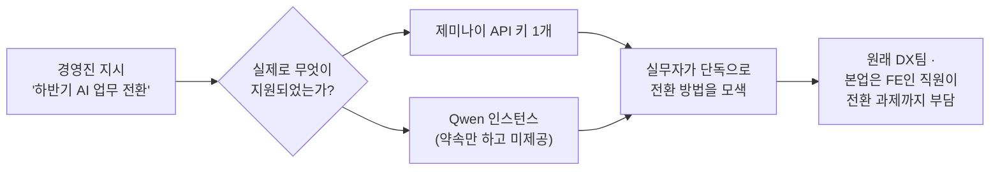
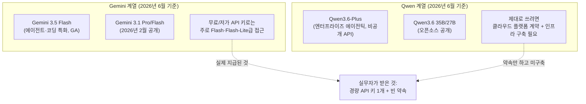
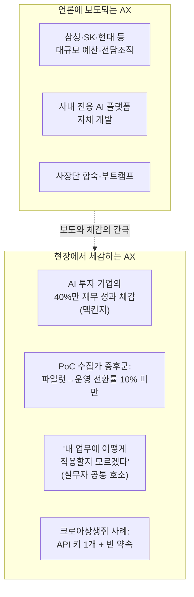
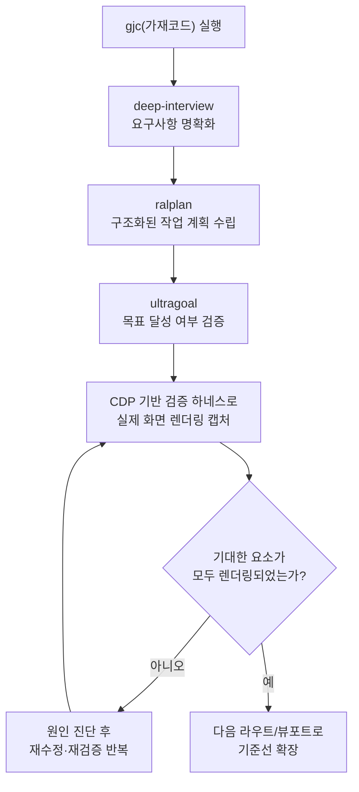
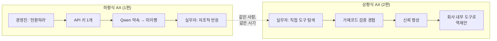

### — 크로아상생쥐의 Threads 기록으로 보는 2026년 기업 AI 전환의 명암 —

---

## 목차

1. 들어가며 — 같은 사람이 며칠 사이에 올린 상반된 두 장면
2. 첫 번째 장면: "갑자기 하반기엔 AI 업무로 전환하래요"
3. 댓글창의 반응 — "원수가 있다면 Gemini/Local LLM" 풍자가 퍼진 이유
4. 배경 확인 1: 지금 Gemini와 Qwen은 실제로 어떤 모델인가
5. 배경 확인 2: 2026년 한국 기업들의 AX 열풍, 그 실제 온도차
6. 두 번째 장면: "가재코드 검증하면서 이거 물건이네"
7. 한 사람 안에서 공존하는 두 장면이 말해주는 것
8. Hermes Agent로 이 상황을 풀어본다면
9. 참고 출처

---

## 1. 들어가며 — 같은 사람이 며칠 사이에 올린 상반된 두 장면

이번에 전달해주신 네 장의 기록은 모두 Threads의 "AI Threads"라는 커뮤니티 공간을 매개로 이어진 글들이다. 중심에 있는 사람은 두 개의 다른 닉네임으로 등장하는데, 같은 인물이 쓴 글로 보이는 "크로아상생쥐"와 "croissmouse"는 사실상 동일인의 한글/영문 표기 차이로 읽힌다. 이 사람의 타임라인에는 같은 주에 정반대 분위기의 글 두 편이 나란히 올라와 있다.

하나는 다소 허탈한 톤의 글로, 회사가 갑자기 "하반기에는 파트 업무를 AI 업무로 전환하라"고 통보했는데, 정작 손에 쥐여준 것은 제미나이 API 키 한 개와 "곧 띄워주겠다"던 Qwen 인스턴스뿐이었고 그 약속마저 감감무소식이라는 내용이다. 다른 하나는 정반대로 들뜬 톤의 글로, "가재코드"라는 코딩 에이전트 도구를 직접 써보니 검증 과정이 매우 인상적이어서 회사 내부 코딩 도구로 이 도구의 채택을 직접 밀고 있다는 내용이다. 이 문서는 이 두 장면이 각각 무엇을 의미하는지, 그리고 왜 같은 사람의 타임라인에 함께 걸려 있는지를 최신 정보로 교차 확인하며 자세히 풀어보려 한다.

---

## 2. 첫 번째 장면: "갑자기 하반기엔 AI 업무로 전환하래요"

대화는 2026년 6월 30일, 크로아상생쥐가 "갑자기 하반기에는 파트 업무를 AI 업무로 전환하래요"라는 짧은 한 문장을 올리면서 시작된다. 댓글로 "어떤 파트를 맡고 계신가요"라는 질문이 달리자, 본인은 원래 DX(디지털 전환)를 담당하는 팀에 속해 있었는데, 정작 본인의 전문 분야는 프론트엔드(FE)라며 다소 어이없다는 반응을 보인다. 즉 본래 시스템·서비스의 디지털 전환을 다루던 조직이, 이번에는 다시 AI 전환이라는 또 다른 전환 과제를 떠안게 된 상황이다.

이어지는 댓글에서 누군가 "구독제 쥐여주고 그냥 아묻따 전환해인가요?"라고 묻자, 크로아상생쥐는 "더 심해요"라며 받는다. 회사가 실제로 제공한 것은 제미나이 API 키 하나, 그리고 "Qwen 하나 띄워준다"는 구두 약속뿐이었고, 그 약속조차 그 이후로 아무런 진전이 없었다는 것이다. 이 짧은 대화는 같은 페이지를 한 문장으로 요약한다. 경영진 차원에서는 "AI 업무로 전환하라"는 지시가 떨어졌지만, 그 지시를 뒷받침할 인프라나 예산, 구체적인 실행 계획은 따라오지 않았고, 결국 실무자 개인이 API 키 한 개를 들고 알아서 방법을 찾아야 하는 상황에 놓였다는 뜻이다.

---

## 3. 댓글창의 반응 — "원수가 있다면 Gemini/Local LLM" 풍자가 퍼진 이유

이 대화 도중 크로아상생쥐는 다른 게시물 하나를 인용해 공유한다. unclejobs.ai라는 계정이 "AI Threads"에 올린 글로, "원수가 있다면 나는 한 치의 망설임도 없이 Gemini나 로컬 LLM만 쓰라고 권할 것이다"라는 풍자성 문장이다. 이 글은 원래 ssong_js_mk라는 계정이 먼저 올린 "원수가 있다면 한 치의 망설임도 없이 적금만 하라고 권할 것이다"라는 밈 형식의 농담을 패러디한 것으로, 좋아요 143개를 받을 만큼 같은 커뮤니티 안에서 꽤 공감을 얻은 글이었다.

이 농담에 크로아상생쥐가 "원수지셨나요?"라고 자조적으로 받아치자, 다른 사용자인 croissmouse(앞서 언급했듯 사실상 동일 인물의 다른 표기)는 7시간 뒤 같은 인용 글에 "우리팀 단체로 원수졌나봐"라는 댓글을 따로 남긴다. 이 농담의 핵심은 결국 모델 선택권의 문제다. "AI 전환을 하라"는 지시 자체는 나쁘지 않지만, 회사가 직원에게 쥐여준 것이 비교적 저렴하거나 제한적인 모델 접근권뿐이라면, 그 업무는 "AI로 일을 더 잘하게 됐다"가 아니라 "안 그래도 부족한 도구로 더 많은 일을 떠안게 됐다"는 체감으로 돌아온다는 풍자다. 다음 장에서는 이 농담이 가리키는 Gemini와 Qwen이라는 두 모델이 2026년 6월 현재 실제로 어떤 위치에 있는지 짚어본다.

---

## 4. 배경 확인 1: 지금 Gemini와 Qwen은 실제로 어떤 모델인가

먼저 Gemini 쪽을 보면, 2026년 6월 말 현재 구글의 주력 라인업은 2025년 11월 공개된 Gemini 3.0을 거쳐 2026년 2월 공개된 Gemini 3.1, 그리고 가장 최근에는 에이전트·코딩 작업에 특화된 Gemini 3.5 Flash가 정식 버전으로 풀려 있는 상태다. 다만 무료 또는 저가 API 접근권으로 실제 받을 수 있는 모델은 보통 Flash나 Flash-Lite 계열의 경량 모델이며, 구글이 최근 무료 서비스 범위를 축소하면서 개발자 커뮤니티에서는 사용량 제한과 관련된 불만이 적지 않게 나오고 있다는 점도 함께 확인된다. 즉 "제미나이 API 키 하나를 받았다"는 말이 곧바로 최상위 모델에 대한 자유로운 접근을 의미하지는 않으며, 오히려 한도가 빠듯한 경량 모델에 그칠 가능성이 현실적으로 더 높다.

Qwen 쪽은 좀 더 복잡하다. 알리바바 클라우드가 만드는 Qwen 모델군은 2026년 4월 기업용 에이전틱 작업에 초점을 맞춘 Qwen3.6-Plus를 정식 공개했는데, 흥미롭게도 이 최상위 모델은 오픈소스로 풀리지 않고 비공개 API 형태로만 제공된다. 반면 그 아래급인 35B, 27B 같은 모델들은 오픈소스로 순차 공개되어, 가성비 면에서 구글의 경량 오픈 모델인 Gemma 4와 자주 비교되는 위치에 있다. 정리하면 Qwen은 "기업이 클라우드 API로 제대로 도입하면 강력한 에이전틱 코딩 성능을 낼 수 있는 모델군"이지만, 그러려면 알리바바 클라우드의 엔터프라이즈 플랫폼과 정식 계약, 그에 따른 비용 집행이 필요하다. 회사가 "Qwen 하나 띄워준다"고 구두로만 약속해놓고 실제 인스턴스 구축이 감감무소식이었다는 크로아상생쥐의 경험은, 이 모델을 제대로 쓰려면 단순히 "쓰라"는 말 한마디가 아니라 적잖은 인프라 작업이 뒤따라야 한다는 사실과도 맞아떨어진다.

---

## 5. 배경 확인 2: 2026년 한국 기업들의 AX 열풍, 그 실제 온도차

크로아상생쥐의 경험을 더 큰 그림 속에 놓고 보면, 이 어긋남이 왜 일어났는지가 더 분명해진다. 2026년 상반기부터 한국 대기업들은 "AX(AI 전환)를 못 하면 도태된다"는 위기감 속에 일제히 속도를 올리고 있다. 삼성은 전체 사장단을 대상으로 한 AX 부트캠프를 운영하고 전 관계사에 AI 전담조직을 신설했으며, SK그룹은 경영진과 구성원이 사흘간 합숙하며 AX 중심 경영으로의 전환을 논의하는 행사를 열었다. 현대모비스는 사내 전용 생성형 AI 플랫폼을 자체 개발했고, KT는 마이크로소프트와 협력해 사내 업무 전반을 AI 에이전트로 연결하는 플랫폼을 도입했다. 이처럼 대기업 단위에서는 막대한 예산과 조직, 전용 플랫폼이 함께 투입되고 있다는 보도가 쏟아지는 시기다.

그러나 같은 시기의 다른 분석들은 이 열풍의 또 다른 면을 짚는다. 글로벌 컨설팅 그룹 맥킨지는 기업의 90퍼센트가 AI 기술에 투자하지만 실제로 재무적 성과를 거둔 기업은 40퍼센트 수준에 그친다고 지적하며, 그 원인으로 전체 업무 흐름을 재설계하지 못한 채 도구만 얹는 방식을 꼽는다. 국내 중견기업을 다루는 분석에서도 비슷한 패턴이 보인다. 일 년에 십여 개씩 파일럿 프로젝트(PoC)는 돌리지만 실제 운영 단계까지 가는 비율은 10퍼센트도 안 되는 "PoC 수집가 증후군", 그리고 AX를 외주 업체에 통째로 맡기고 정작 내부 역량은 하나도 쌓지 못하는 "벤더 전면 위탁 증후군"이 흔히 관찰되는 함정으로 거론된다. 실무자 대상 세미나에서도 참가자들이 공통으로 토로하는 어려움은 "내 업무에 어떻게 적용해야 할지 모르겠다"는 것으로 나타났다.

크로아상생쥐가 속한 조직이 정확히 어느 규모인지는 공개된 정보로 확인되지 않지만, "DX팀 소속이지만 본업은 FE"라는 설명, 그리고 API 키 하나와 빈 약속만 받았다는 경험은, 위에서 정리한 "헤드라인의 AX"와 "현장의 AX" 사이의 간극을 매우 구체적인 개인 사례로 보여준다. 즉 이 일화는 어느 한 회사만의 특수한 사정이라기보다, 2026년 한국 기업 AX 흐름 전반에서 반복적으로 보고되는 구조적 패턴, "전환은 선언하되 그 전환을 실제로 가능하게 할 인프라와 권한은 충분히 내려오지 않는다"는 패턴의 한 단면으로 읽는 것이 합리적이다.

---

## 6. 두 번째 장면: "가재코드 검증하면서 이거 물건이네"

같은 인물이 며칠 전 올린 또 다른 글은 완전히 다른 분위기를 띤다. croissmouse는 "가재코드"라는 도구를 검증해보면서 터미널 화면에 결과까지 띄워주고 계속해서 스스로 검증을 이어가는 모습을 보고 "이거 물건이네"라며 감탄한다. 그러면서 "여러분 가재쓰세요"라는 권유와 함께, 본인이 다니는 회사 내부 코딩 도구로 가재코드 채택을 직접 추진하고 있다고 밝히고, 가재코드 관련 정보를 활발히 공유하는 것으로 보이는 @bellman.pub 계정을 태그한다.

이 글에 첨부된 터미널 기록을 살펴보면, 가재코드가 1920×1080 해상도 화면을 분석해 헤더와 네비게이션 메뉴, 문서 영역 등 기대했던 요소가 모두 정상적으로 렌더링되고 있는지를 자체적으로 확인하는 장면이 담겨 있다. 로그에는 "APP_BASE/MSYS 설정 문제를 해결했고 메모리 요구사항도 풀었다"는 진행 상황 보고, 그리고 여러 화면 크기(뷰포트)에 대한 기준선(베이스라인)을 추가로 완성한 뒤 6단계 검증 절차를 끝까지 수행하겠다는 계획이 적혀 있다. 작업 목록에는 인프라 재개, 개발 서버 구동, CDP(Chrome DevTools Protocol) 기반 검증 하네스를 로그인 흐름에 맞춰 다시 점검하는 항목, 그리고 6개 라우트에 대한 1단계(Phase0) 기준선 화면을 다시 캡처하는 항목이 순서대로 표시되어 있다. 하단의 상태 표시줄에는 사용 중인 모델이 "Anthropic Opus 4.8"이라고 명시되어 있는데, 이는 2026년 6월 현재 Anthropic이 제공하는 최상위 모델군 중 하나로, 실제로 존재하는 모델이다.

이 장면은 1편에서 살펴봤던 가재코드(Gajae-Code)의 정체와 정확히 들어맞는다. 가재코드는 한국 개발자 Yeachan-Heo가 만든 외부 코딩 에이전트 하네스로, "깊은 인터뷰(deep-interview) → 계획 수립(ralplan) → 최종 목표 검증(ultragoal)"이라는 구조화된 워크플로를 통해 단순히 코드를 생성하고 끝내는 것이 아니라, 작업이 실제로 의도대로 완성되었는지를 끝까지 검증하는 데 무게를 두는 도구다. croissmouse가 인상 깊게 본 "터미널에 화면을 띄워가며 계속 검증해주는" 동작은, 이 도구가 단순 텍스트 응답에 그치지 않고 실제 렌더링 결과를 시각적으로 캡처해 확인하는 검증 단계를 자동화하고 있다는 점을 보여준다.

---

## 7. 한 사람 안에서 공존하는 두 장면이 말해주는 것

이 두 글을 따로 떼어 보면 모순처럼 느껴질 수도 있다. 한쪽에서는 회사가 던져준 "AI 전환"이 빈손이나 다름없다고 자조하면서, 다른 쪽에서는 정작 본인이 자발적으로 찾은 도구를 회사에 도입하자고 적극적으로 밀어붙이고 있기 때문이다. 그러나 두 장면을 나란히 놓고 보면 모순이 아니라 오히려 같은 문제의식의 앞면과 뒷면에 가깝다.

첫 번째 글이 보여주는 것은 "위에서 결정한 AX"의 한계다. 경영진이 전환을 지시하고 API 키를 내려보내는 방식은, 2026년 한국 기업 AX 보도 전반에서 지적되는 것처럼 실제 업무 흐름 재설계나 구체적인 인프라 투자 없이 도구 하나만 얹는 방식에 가깝다. 약속한 Qwen 인스턴스가 감감무소식이라는 것은, 그 결정이 처음부터 실행 계획 없이 선언으로만 끝났을 가능성을 시사한다. 반면 두 번째 글이 보여주는 것은 "아래에서 발견한 AX"다. 실무자 본인이 직접 도구를 찾아 써보고, 검증 과정이 신뢰할 만하다고 판단한 뒤, 자신의 영향력이 닿는 범위 안에서 회사 내부 도입을 자발적으로 제안하고 있다. 즉 회사가 공식적으로 내려준 AI 전환 지시는 부실했지만, 같은 사람이 결국 더 나은 도구를 스스로 찾아내 위로 거꾸로 제안하는 그림이 만들어진 셈이다.

이는 앞서 인용한 한국 중견기업 AX 분석에서 지적한 "벤더 전면 위탁 증후군"이나 "PoC 수집가 증후군"과는 또 다른, 세 번째 패턴을 보여준다. 즉 조직이 도구와 방향을 제대로 정해주지 못할 때, 실제로 그 공백을 메우는 것은 결국 현장에서 직접 손을 움직여보고 결과를 검증해본 실무자 개인이라는 패턴이다. 다만 이런 상향식 발견이 항상 정식 채택으로 이어지는 것은 아니며, croissmouse의 시도 역시 아직은 "내부 코딩툴로 쓰자고 미는 중"이라는 제안 단계에 머물러 있다는 점도 함께 짚어둘 필요가 있다.

---

## 8. Hermes Agent로 이 상황을 풀어본다면

이전 대화에서 짧게 언급했던 제안을 조금 더 구체적으로 풀어보면 다음과 같다. 첫 번째 글이 보여주는 진짜 문제는 모델 자체의 성능이 아니라 접근 경로가 단일하고 불안정하다는 점이다. 회사가 약속한 Qwen이 끝내 구축되지 않으면 그 시점에 작업이 통째로 멈추고, 제미나이 API 키 하나의 사용량 한도에 걸리면 역시 작업이 멈춘다. 이런 상황에서는 어떤 모델을 쓰느냐보다, 모델이 끊겼을 때 다른 모델로 자연스럽게 넘어갈 수 있는 구조를 개인 차원에서 미리 마련해두는 것이 훨씬 실질적인 대응이 된다.

지난 문서([Hermes Agent 장기 운영기로 읽는 자가학습형 AI 에이전트의 명암](https://k82022603.github.io/posts/hermes-agent-%EC%9E%A5%EA%B8%B0-%EC%9A%B4%EC%98%81%EA%B8%B0%EB%A1%9C-%EC%9D%BD%EB%8A%94-%EC%9E%90%EA%B0%80%ED%95%99%EC%8A%B5%ED%98%95-ai-%EC%97%90%EC%9D%B4%EC%A0%84%ED%8A%B8%EC%9D%98-%EB%AA%85%EC%95%94/))에서 살펴본 것처럼 Hermes Agent는 `hermes model` 명령 한 줄로 OpenRouter, 구글 Gemini, 알리바바 계열 모델, 로컬 Ollama 등 다양한 제공자 사이를 코드 수정 없이 오갈 수 있도록 설계되어 있다. 회사가 지급한 제미나이 키를 기본 경로로 등록해두되, 그 키의 한도에 걸리거나 회사 쪽 Qwen 약속이 계속 미뤄질 경우를 대비해 OpenRouter 같은 보조 경로나 로컬 모델을 보조 제공자로 함께 등록해두면, 적어도 "약속된 도구가 안 와서 일이 멈추는" 상황 자체는 피할 수 있다. 다만 이는 어디까지나 실무자 개인이 임시로 마련하는 우회로일 뿐이며, 회사 차원에서 별도 보안 정책이나 데이터 반출 규정을 두고 있다면 그 범위 안에서만 적용해야 한다는 점은 분명히 해둘 필요가 있다.

두 번째 글의 가재코드 사례와 연결해서 보면 또 다른 시사점이 나온다. 가재코드가 보여준 강점은 "검증을 끝까지 자동으로 반복한다"는 것이었는데, 이는 Hermes가 강조하는 "한 번 해결한 절차를 스킬로 저장해 다음에 재사용한다"는 가치와 결이 비슷하다. 다만 지난 문서에서 짚었듯 Hermes는 코드 저장소 안에서 작업하는 전문 코딩 에이전트라기보다, 리서치·메신저 대응·일정 자동화처럼 코드 밖의 업무를 폭넓게 처리하는 범용 비서에 더 가깝다. 따라서 만약 크로아상생쥐의 실제 목적이 "프론트엔드 화면 검증과 코드 작업을 더 안정적으로 끝내는 것"이라면, 그 핵심 작업 자체는 가재코드처럼 코딩에 특화된 하네스에 맡기고, Hermes는 그 작업의 결과를 정리해 보고하거나, 회사에 제출할 AX 전환 보고서를 작성하거나, 다음에 또 비슷한 모델 공급 공백이 생겼을 때를 대비해 사용 가능한 모델과 한도를 주기적으로 점검해주는 식의 보조 역할로 나누어 쓰는 편이 두 도구의 강점을 모두 살리는 방향이 될 것이다.

---

## 9. 참고 출처

본 문서는 다음 자료를 토대로 작성되었다. 사용자가 전달한 Threads 대화 및 게시물 본문 인용, 2026년 6월 기준 한국 기업 AX 동향을 다룬 국내 언론 보도(파이낸셜뉴스, 천지일보, ZDNet Korea, 머니투데이, 이코노믹리뷰 등), AX 전환 실무 체크리스트 및 중견기업 사례 분석(S2W, 이글루코퍼레이션, 워크스마트, Project Research), Gemini API 공식 릴리스 노트와 모델 변천사를 정리한 나무위키 문서(ai.google.dev, 나무위키 「Gemini(인공지능 모델)」 항목), Qwen 모델 계열의 변천과 Qwen3.6-Plus 공개 소식을 정리한 자료(나무위키 「Qwen」 항목, brunch.co.kr, apidog.com, Google Cloud 공식 문서), 그리고 앞선 문서에서 검증한 Gajae-Code 공식 깃허브 저장소(github.com/Yeachan-Heo/gajae-code) 정보다. 위 출처들은 모두 2026년 6월 30일 기준으로 검색·확인한 내용이며, 특히 모델 버전이나 기업별 AX 추진 현황은 변화 속도가 빠른 영역이므로 이후 시점에는 세부 내용이 달라질 수 있다.
