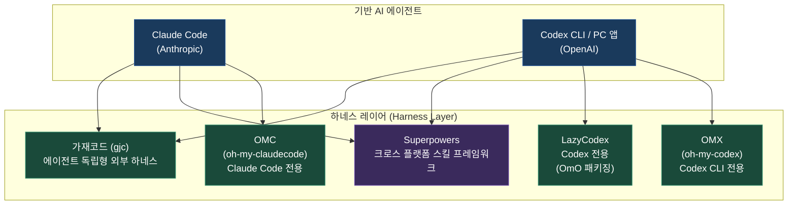
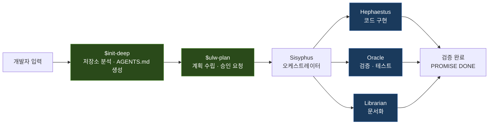
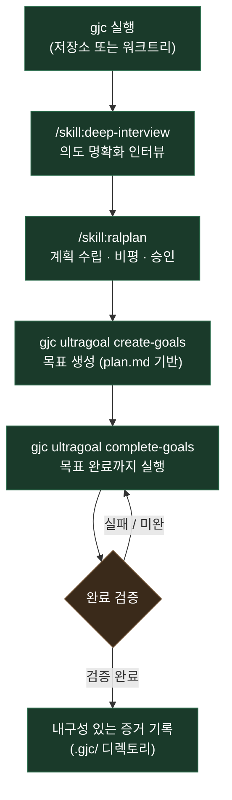
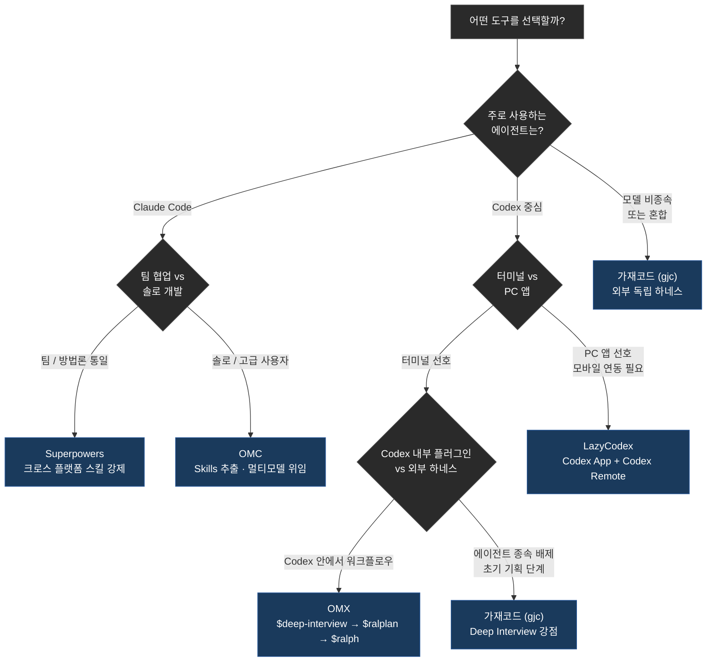

## OMC · OMX · LazyCodex · 가재코드 · Superpowers — 2026년 상반기 기준

> https://www.threads.com/@d.g_justart/post/DaIV5KimG69
> 
> 다시 개발하려고 클로드코드나 코덱스 구독하려는데요.
> 
> 요즘 가장 핫한 방법이 뭔가요??? OMC? OMX? lazycodex? superpowers도 써보려다가 못써봤는데.. 다들 어떻게 개발하고 계신지요..??
> 
> re : (https://www.threads.com/@allen.log/post/DaKWxu1kexq)
> 
> LazyCodex나 가재코드 씁니다. 
> LazyCodex는 터미널 아니어도 PC코덱스 앱에서도 돌아가서 편하기도 하구요. (PC 코덱스 앱은 모바일 연동도 되니 모바일에서도 쓰기 좋음)
> 
> 가재코드는 터미널에서 여러 모델을 돌려가며 쓸수 있고, 둘다 Harness 툴이지만, 가재코드는 개인적으로 Deep Interview 기능이 좋아서 처음부터 기획해서 뭔가를 만들때 가재코드를 쓰게 되고 나머지는 LazyCodex 주로 쓰는듯 하네요.
> 
 

---

## 1. 왜 지금 하네스(Harness)가 화두인가

2026년 상반기 한국 AI 개발자 커뮤니티에서 가장 자주 등장하는 단어 중 하나는 단연 **하네스 엔지니어링(Harness Engineering)** 이다. 이 용어는 AI 코딩 에이전트를 감싸는 시스템 전체—규칙, 도구, 스킬, 메모리, 피드백 루프—를 설계하는 기술을 가리킨다. 승마에서 가져온 비유 그대로, 아무리 강한 말(AI 모델)이 있어도 고삐와 안장(하네스)이 없으면 원하는 방향으로 달릴 수 없다는 것이 핵심 직관이다.

이 논의가 본격화된 직접적인 계기는 실무 현장에서의 실패 경험이다. Claude Code 같은 AI 코딩 에이전트를 도입한 팀들이 공통으로 겪은 문제가 있었다. AI가 코드를 잘 짜기는 하지만 팀의 코딩 규칙을 무시하거나, 기존 프로젝트와 맞지 않는 방식으로 파일을 만들거나, 한 번 실행에서는 괜찮은데 반복 실행하면 결과가 들쭉날쭉하거나, 에러가 나면 결국 사람이 직접 고쳐야 하는 상황이 반복됐다. 이 문제를 해결한 팀들의 공통점은 모델을 바꾼 게 아니라 **에이전트를 둘러싼 환경 자체를 설계**했다는 점이다.

Martin Fowler는 2026년 2월부터 4월에 걸쳐 하네스 엔지니어링을 체계적으로 분류한 글을 발표하며 이 개념에 소프트웨어 설계 언어로서의 지위를 부여했다. LangChain 역시 같은 시기에 "에이전트 하네스(agent harness)"라는 개념을 전면에 내세운 Deep Agents를 발표했다. DeepSeek은 2026년 6월 하네스 전담 팀을 신설하고 대규모 채용에 나서며 "모델+하네스=에이전트"라는 공식을 채용 공고에 명시했다.

업계 논의의 귀결은 한 문장으로 요약된다. **"Claude vs GPT vs Gemini 논쟁에 시간을 쓰고 있다면, 방향이 틀린 것이다. 진짜 레버는 모델이 아니라 하네스에 있다."** LangChain이 공개한 Terminal Bench 2.0 벤치마크 결과가 이를 숫자로 입증한다. 동일한 모델(GPT-5.2-Codex)을 사용하면서 하네스만 개선했더니 순위가 30위권 밖에서 Top 5로 뛰었고, 점수는 52.8에서 66.5로 상승했다.

---

## 2. 두 개의 코딩 에이전트 기반: Claude Code와 Codex

하네스 도구를 이해하기 위해서는 먼저 이들이 위에 얹히는 **기반 에이전트**를 구분해야 한다.

### 2.1 Claude Code (Anthropic)

Anthropic이 만든 AI 코딩 에이전트로, 터미널에서 직접 실행되는 CLI 도구다. Claude Opus/Sonnet 모델을 기반으로 동작하며, 파일 읽기·쓰기, 명령어 실행, 코드 수정, PR 작성까지 자율적으로 수행한다. 플러그인 시스템과 CLAUDE.md 기반의 프로젝트 맥락 주입이 핵심 설계 원칙이다.

### 2.2 Codex (OpenAI)

OpenAI가 2025년 4월 출시한 AI 코딩 에이전트다. 현재 세 가지 형태로 사용 가능하다.

첫째, **Codex CLI**다. 터미널에서 직접 실행하는 가장 원초적인 형태로, GitHub의 공개 저장소에서 `curl` 한 줄로 설치할 수 있다. macOS, Linux, Windows를 지원한다.

둘째, **Codex PC 앱(데스크탑 앱)** 이다. 2026년 2월 macOS용으로 먼저 출시되었고 3월에 Windows로 확장되었다. 단순한 터미널 래퍼가 아니라 멀티 스레드 관리, 내장 Git Worktree, Skills 시스템, Automations(예약 실행), 컴퓨터 사용(Computer Use) 기능을 갖춘 독립 에이전트 플랫폼이다. ChatGPT Plus, Pro, Business, Enterprise, Edu 플랜에 포함된다.

셋째, **Codex Remote(모바일 연동)** 다. 2026년 5월 기준으로 ChatGPT 모바일 앱(iOS/Android)에서 PC에서 실행 중인 Codex 세션에 원격 접속하여 진행 상황 확인, 명령 승인·거부, 질문 답변이 가능하다. 6월에 일반 공개(GA)되었으며 QR 코드 페어링 방식으로 연결한다.

쉽게 정리하면, Codex CLI는 터미널 그 자체, Codex PC 앱은 에이전트 전용 IDE에 가까운 독립 앱, Codex Remote는 이 앱의 모바일 리모컨이다.

---

## 3. 하네스 도구 상세 분석

아래에서 다루는 도구들은 Claude Code 또는 Codex 위에 얹히는 **오케스트레이션 레이어**, 즉 에이전트가 더 구조적이고 안정적으로 동작하도록 감싸는 하네스들이다.

### 3.1 OMX (oh-my-codex) — Codex CLI용 오케스트레이션 레이어

**만든 사람:** Yeachan-Heo (한국인 개발자)  
**공식 저장소:** `github.com/Yeachan-Heo/oh-my-codex`  
**설치 방법:** `npm install -g oh-my-codex`  
**최신 버전:** v0.13.1 (2026년 4월 7일 기준)

OMX는 OpenAI Codex CLI를 사용하는 개발자가 Codex가 제공하지 않는 구조화된 워크플로우, 멀티 에이전트 조율, 영구적 상태 관리를 추가로 얻기 위해 도입하는 오케스트레이션 레이어다. Codex 자체를 대체하지 않고 Codex를 실행 엔진으로 유지하면서 그 위에 워크플로우 패턴을 덧씌운다. "oh-my-zsh이 zsh에 했던 것을 OMX는 Codex에 한다"는 표현이 공식 문서에 등장한다.

OMX의 핵심 워크플로우는 4개의 스킬 명령으로 구성된다.

**`$deep-interview`** 는 구현 시작 전 의도를 명확히 하는 소크라테스식 질의응답 단계다. 무엇을 만들 것인지, 경계가 어디까지인지, 하지 않을 것은 무엇인지를 확정한다. 계획을 세우기 전에 의도를 분류하는 과정이므로, 이후의 계획이 "실제로 원하는 것"을 반영하게 된다.

**`$ralplan`** 은 구조화된 구현 계획을 생성하는 단계다. 플래너, 아키텍트, 비평가 역할이 구조화된 토론 과정을 거치며 트레이드오프 리뷰가 명시적으로 포함된다. 계획 승인이 강제되므로 승인 없이는 실행이 시작되지 않는다.

**`$ralph`** 는 "the boulder never stops rolling"이라는 설명처럼 승인된 계획을 완료까지 밀어붙이는 지속적 실행 루프다. 에러가 발생해도 멈추지 않고 복구를 시도한다.

**`$team`** 은 N개의 병렬 워커를 tmux로 실행하는 팀 모드다. 각 워커는 격리된 Git Worktree를 자동으로 받고, 리더가 변경사항을 점진적으로 통합하며 충돌 위험을 최소화한다.

OMX는 `.omx/` 디렉토리에 플랜, 로그, 메모리, 상태를 저장하므로 컨텍스트가 프루닝되어도 상태가 유지된다. macOS와 Linux가 주 지원 환경이며 Windows는 지원하나 비기본 경로로 명시되어 있다.

### 3.2 OMC (oh-my-claudecode) — Claude Code용 버전

**만든 사람:** Yeachan-Heo (OMX와 동일 작성자)  
**공식 저장소:** `github.com/Yeachan-Heo/oh-my-claudecode`  
**설치 방법:** `/plugin marketplace add https://github.com/Yeachan-Heo/oh-my-claudecode`

OMC는 OMX의 Claude Code 버전이다. "Codex 사용자라면 OMX를, Claude Code 사용자라면 OMC를"이라고 공식 문서가 명확히 구분한다. OMX와 마찬가지로 `$deep-interview`, `/ralplan`, `/ultragoal` 등의 워크플로우를 사용하며, Claude Code 플러그인 형태로 설치된다.

OMC의 독특한 점은 Skills 추출 기능이다. `/skillify` 명령을 사용하면 디버깅 경험에서 재사용 가능한 패턴을 자동으로 `.omc/skills/` 파일로 추출한다. 예를 들어 aiohttp 프록시 충돌 문제를 한 번 해결했다면, 그 해결책이 스킬 파일로 저장되어 유사한 상황에서 자동으로 컨텍스트에 주입된다. 이것이 "Learn once, reuse forever"라는 설계 철학의 구현이다.

OMC는 또한 멀티 모델 질의 기능(`/ask codex`, `/ask gemini`, `/ask cursor`)을 통해 Claude Code 세션 내에서 다른 AI 모델에 특정 질문을 위임하는 것을 지원한다.

### 3.3 OmO (oh-my-openagent) + LazyCodex — "토크맥서를 위한 에이전트 하네스"

**만든 사람:** code-yeongyu (GitHub 핸들)  
**OmO 저장소:** `github.com/code-yeongyu/oh-my-openagent`  
**LazyCodex 저장소:** `github.com/code-yeongyu/lazycodex`  
**LazyCodex 공식 사이트:** `lazycodex.ai`  
**GitHub Stars:** LazyCodex 약 1,700개 (2026년 6월 기준)

OmO(oh-my-openagent)는 LazyCodex의 핵심 엔진이다. "tokenmaxxers를 위한 코딩 에이전트"라는 슬로건이 붙어있는데, 이는 컨텍스트 토큰을 최대한 효율적으로 활용하는 설계를 지향한다는 의미다.

흥미로운 역사적 맥락이 있다. OmO 저장소의 README에는 "We loved Anthropic models enough to get blocked. Now we are backing Codex."라는 문구가 있다. 초기에는 Claude Code를 대상으로 개발됐으나 어떤 이유에서 Anthropic 쪽과의 관계가 틀어졌고, 이후 Codex 중심으로 방향을 전환했음을 시사한다. LazyCodex는 이 전환 이후의 결과물이다.

OmO는 두 가지 에디션으로 제공된다. **Ultimate Edition**은 OpenCode 전용으로 11개 에이전트, 54개 이상의 라이프사이클 훅, 5개의 내장 MCP, 팀 모드, ultrawork 등 전체 기능을 제공한다. **Light Edition**은 Codex CLI용으로, Codex의 플러그인 시스템에 맞게 설계된 경량화 버전이다.

**LazyCodex**는 이 Light Edition을 Codex에 패키징한 배포 레이어다. 한 마디로 "LazyVim이 Neovim을 일반 사용자에게도 쓸 만하게 만든 것처럼, LazyCodex는 Codex에 대해 같은 역할을 한다." 설치 명령어는 `npx lazycodex-ai install`이다.

LazyCodex 설치 시 제공되는 주요 스킬 명령어들은 다음과 같다.

**`$init-deep`** 는 저장소 전체를 분석하여 계층적 AGENTS.md를 생성하는 명령이다. 복잡한 코드베이스의 구조를 자동으로 파악하고 각 디렉토리에 적합한 가이드를 작성한다. 이후 에이전트가 해당 코드를 수정하기 전에 이 가이드를 참조하게 된다.

**`$ulw-plan`** 은 Ultrawork Loop Plan의 약자로, 모호한 작업을 구현 결정이 완료된 계획으로 변환한다. 어떤 파일을 수정하고 어떤 순서로 진행할지까지 결정하며, 실행 전에 반드시 승인을 받도록 설계되어 있다.

**`$start-work`** 와 **`$ulw-loop`** 는 승인된 계획을 내구성 있는 체크포인트 기반으로 실행하는 명령이다. Sisyphus 오케스트레이터가 Hephaestus(실행), Oracle(검증), Librarian(문서) 에이전트를 조율하는 멀티 에이전트 아키텍처로 동작한다.

**LazyCodex의 실용적 강점:** Threads 포스트에서 언급된 핵심은 터미널 없이 PC Codex 앱에서도 동작한다는 점이다. Codex PC 앱은 Codex 플러그인 마켓플레이스를 지원하므로, LazyCodex를 플러그인으로 설치하면 터미널을 열지 않고도 GUI 환경에서 전체 하네스 기능을 사용할 수 있다. 여기에 더해 Codex PC 앱이 ChatGPT 모바일 앱과 연동되므로, 결과적으로 스마트폰에서 LazyCodex 세션의 진행 상황을 확인하고 승인을 내릴 수 있다. 일을 걸어두고 밖에서 핸드폰으로 체크하는 비동기 개발 패턴이 가능해진다.

### 3.4 가재코드 (Gajae Code, gjc) — 에이전트 독립형 외부 하네스

**만든 사람:** Yeachan-Heo (OMX, OMC와 동일 작성자)  
**공식 저장소:** `github.com/Yeachan-Heo/gajae-code`  
**공식 사이트:** `gajae-code.com`  
**설치 방법:** `bun install -g gajae-code`

이름의 유래는 갑각류다. 기본 TUI 테마가 red-claw(어두운 배경)와 blue-crab(밝은 배경)으로 구성되어 있어 "가재코드"라는 이름이 붙었다. Claude Code, Codex, OpenCode 테마도 번들로 제공되므로 기존 도구에서 이전하는 사용자에게도 친숙한 UI를 제공한다.

가재코드(gjc)의 가장 중요한 특징은 **어떤 특정 에이전트의 플러그인이 아니라는 점**이다. OMX가 Codex CLI의 내부에서 동작하는 플러그인이고 OMC가 Claude Code의 내부에서 동작하는 플러그인이라면, 가재코드는 외부에서 독립적으로 실행되며 Claude Code, Codex, OpenCode, 또는 다른 어떤 코딩 에이전트와도 병행 사용이 가능하다. 저장소 루트 또는 워크트리에서 `gjc`를 실행하면, 에이전트에게 명확한 워크플로우 인터페이스를 제공하는 독립 프로세스로 동작한다.

가재코드의 워크플로우는 다음과 같다.

**Deep Interview가 핵심 강점인 이유:** Threads 포스트 작성자가 "처음부터 기획해서 뭔가를 만들 때 가재코드를 쓰게 된다"고 표현한 것은 이 때문이다. 가재코드의 `deep-interview` 스킬은 단순한 요구사항 정리를 넘어서 의도 분류를 수행한다. 무엇을 만들 것인가뿐 아니라 무엇을 만들지 않을 것인가, 어떤 트레이드오프를 수용할 것인가까지 소크라테스식 문답으로 확정한다. 이 과정에서 도출된 의도가 이후 `ralplan` 계획 수립과 `ultragoal` 실행의 기반이 된다. "추측하기 전에 명확히 하고, 변경하기 전에 계획하고, 증거로 결과를 증명한다"는 가재코드의 설계 철학이 이 단계에 가장 잘 구현되어 있다.

**다양한 모델 지원:** 가재코드는 특정 모델에 묶여 있지 않다. Claude, Codex, GPT-5.5, Gemini, OpenCode 등 다양한 백엔드를 선택하거나 교체하며 사용할 수 있다. 최신 릴리스 노트에서는 GPT-5.5 컨텍스트 캡 조정이 명시되어 있을 정도로 최신 모델 추적이 빠르다.

**내구성 있는 증거 기록:** 모든 목표, 수정사항, 검증 결과는 `.gjc/` 디렉토리에 내구성 있는 아티팩트로 기록된다. 세션이 끊겨도 작업을 재개할 수 있고, 이후 감사 추적이 가능하다.

**실험적 기능들:** 최신 릴리스에는 두 가지 실험적 기능이 추가됐다. `rlm` 모드는 Jupyter 노트북 스타일의 리서치 세션으로, Python 커널과 연동하여 분석 결과를 `.gjc/rlm/<session>/notebook.ipynb`에 저장한다. `computer-use` 기능은 macOS에서 실제 데스크탑을 조작하는 기능으로, Rust 네이티브 바인딩을 통한 스크린샷 및 마우스/키보드 입력 제어를 지원한다.

**모바일 연동:** Telegram 봇 데몬을 통해 진행 중인 세션의 상태 업데이트와 승인 요청을 모바일에서 처리하는 기능도 제공된다. LazyCodex의 Codex Remote 연동과는 다른 방식이지만, 결과적으로 비슷한 비동기 개발 패턴을 지원한다.

### 3.5 Superpowers — 크로스 플랫폼 스킬 프레임워크

**만든 사람:** Jesse Vincent (GitHub: obra), Prime Radiant  
**공식 저장소:** `github.com/obra/superpowers`  
**GitHub Stars:** 177,000+ (2026년 5월 기준)  
**라이선스:** MIT  
**설치 방법 (Claude Code):** `/plugin install superpowers@claude-plugins-official`

Superpowers는 2025년 10월 Anthropic이 Claude Code 플러그인 시스템을 출시한 바로 그날 첫 버전이 공개됐다. 그 이후 7개월 만에 177,000개 이상의 GitHub 스타를 획득하며 최근 몇 년간 가장 빠르게 성장한 개발자 도구 저장소 중 하나가 됐다. 2026년 1월 15일부터 Anthropic 공식 플러그인 마켓플레이스에 등록되어 있다.

Superpowers의 핵심 철학은 단순하다. **에이전트에게 부족한 것은 능력이 아니라 기강(discipline)이다.** 82,000명의 개발자가 동의한 표현을 빌리면, "AI 코딩의 가장 큰 문제는 지능이 아니라 규율이다."

Superpowers는 SKILL.md 파일 묶음이다. 각 파일은 에이전트가 언제, 어떤 단계를 어떤 순서로 따라야 하는지를 정의하는 행동 가이드다. 이 스킬들은 선택 사항이 아니라 **강제**된다. 설치되면 에이전트가 코딩 작업을 감지하는 순간 자동으로 활성화된다.

주요 스킬 6개가 대부분의 가치를 담당한다.

**brainstorming:** 에이전트가 코드 한 줄을 쓰기 전에 반드시 설계를 논의하고 사용자의 승인을 받도록 강제한다. 이 단계를 건너뛰면 잘못된 방향으로 몇 시간을 낭비할 수 있다.

**writing-plans:** 구현을 2~5분 단위 태스크로 분해하고, 파일 경로와 테스트까지 명시한 계획을 코드 작성 전에 작성하도록 요구한다.

**test-driven-development:** 고전적인 Red-Green-Refactor 사이클을 강제 적용한다. "테스트는 나중에 쓸게요"라고 하면 이미 작성된 구현을 삭제하고 처음부터 다시 시작한다.

**systematic-debugging:** 이해하지 않고 고치는 행위를 명시적으로 금지하는 4단계 디버깅 프로세스다.

**subagent-driven-development:** 실제 구현을 플랜과 테스트만 가진 새로운 서브에이전트에게 위임한다. 컨텍스트 오염 없이 태스크별 실행이 가능해진다.

**code-review:** 두 단계 리뷰(기능 적합성 → 코드 품질)를 수행하며, 심각한 문제는 다음 단계 진행을 차단한다.

Superpowers의 가장 큰 장점은 **크로스 플랫폼 호환성**이다. 동일한 스킬 파일이 Claude Code, Codex (CLI 및 앱), Cursor, GitHub Copilot CLI, Gemini CLI, OpenCode에서 동작한다. 특정 에이전트에 종속되지 않고 팀의 엔지니어링 문화를 어떤 플랫폼에서든 일관되게 적용할 수 있다.

다만 최근 커뮤니티에서는 "Fable 5 모델과 함께 전체 플러그인을 쓰면 토큰 낭비다"라는 의견이 나오고 있다. 2026 최신 모델들이 스스로 계획 수립과 검증을 더 잘 수행하게 되면서 Superpowers의 일부 스킬이 중복 작업이 된다는 것이다. 현재 커뮤니티의 주류 의견은 "팀 환경이나 초심자라면 전체 플러그인을 쓰고, 숙련된 솔로 개발자라면 brainstorm과 writing-plans만 골라 써라"로 수렴되고 있다.

---

## 4. 도구 비교 요약표

| 항목 | OMX | OMC | LazyCodex | 가재코드 (gjc) | Superpowers |
|------|-----|-----|-----------|--------------|-------------|
| **기반 에이전트** | Codex CLI | Claude Code | Codex CLI/App | 모델 독립 | 다중 플랫폼 |
| **설치 방식** | npm 패키지 | 플러그인 | npx 설치 | bun 패키지 | 플러그인 |
| **동작 형태** | Codex 플러그인 | Claude Code 플러그인 | Codex 플러그인/마켓플레이스 | 독립 외부 프로세스 | 스킬 파일 주입 |
| **PC 앱 지원** | Codex CLI 전용 | Claude Code 전용 | ✅ Codex App 지원 | 터미널 필요 | ✅ Codex App 지원 |
| **모바일 연동** | 간접적 | 간접적 | ✅ Codex Remote 경유 | ✅ Telegram 봇 | 간접적 |
| **Multi-model** | OMX_TEAM_WORKER_CLI_MAP 설정 | /ask 명령 | 제한적 | ✅ 기본 지원 | ✅ 크로스 플랫폼 |
| **Deep Interview** | ✅ $deep-interview | ✅ /deep-interview | $ulw-plan 내 포함 | ✅ 핵심 강점 | ✅ brainstorming 스킬 |
| **팀 모드** | ✅ tmux 워커 | ✅ /team | ✅ OmO Team Mode | ✅ tmux 워커 | ✅ 서브에이전트 |
| **GitHub Stars** | ~20,000+ | 별도 집계 | ~1,700 | 별도 집계 | ~177,000 |
| **제작자** | Yeachan-Heo | Yeachan-Heo | code-yeongyu | Yeachan-Heo | Jesse Vincent |

---

## 5. 실제 사용 패턴: Threads 커뮤니티의 조언

Threads 포스트에서 소개된 실제 사용자(@allen.log)의 워크플로우는 두 도구를 상황에 따라 분리해서 사용하는 패턴이다.

**LazyCodex를 주로 쓰는 상황:**

터미널을 굳이 열지 않아도 Codex PC 앱 환경에서 하네스 기능을 사용하고 싶을 때다. 앱 형태로 제공되므로 UI가 더 편리하고, Codex Remote를 통한 모바일 연동이 자연스럽게 이어진다. 이미 진행 중인 작업을 이어가거나, 비교적 명확한 태스크를 자율적으로 실행시키는 경우에 적합하다. `$ulw-loop` 실행 후 걸어두고 나가서 폰으로 확인하는 패턴이 자주 쓰인다.

**가재코드를 주로 쓰는 상황:**

처음부터 기획해서 무언가를 만들 때, 즉 요구사항이 아직 막연하고 여러 모델을 돌려가며 최선의 접근을 탐색해야 할 때다. `deep-interview` 단계가 요구사항 자체를 명확히 하는 데 탁월하며, 모델을 교체하며 실험하는 것이 외부 독립 프로세스이기 때문에 에이전트 종속 없이 자유롭다. 구조화된 계획이 필요한 그린필드(녹색 필드, 처음 만드는) 프로젝트에 더 자연스럽게 맞는다.

요약하면, **LazyCodex는 Codex 생태계 안에서 편의성을 극대화하는 선택**이고, **가재코드는 에이전트와 모델을 가리지 않고 기획 단계부터 구조화된 실행을 원할 때의 선택**이다.

---

## 6. 도구 선택 가이드: 어떤 상황에 무엇을

**Claude Code + 팀 개발 → Superpowers**  
팀 전체가 동일한 엔지니어링 문화를 공유해야 한다면 Superpowers가 가장 낮은 학습 비용으로 가장 큰 효과를 낸다. 설치 후 별도 학습 없이 자동으로 활성화된다.

**Claude Code + 솔로 개발 → OMC**  
Skills 추출, `/ask codex` 같은 멀티 모델 위임, 세션별 노트패드 등 Claude Code를 더 심층적으로 활용하고 싶다면 OMC가 맞다.

**Codex + PC 앱 + 모바일 필요 → LazyCodex**  
터미널을 피하고 싶고 외출 중에도 작업을 모니터링하고 싶다면 LazyCodex + Codex Remote 조합이 현재 가장 편리한 선택이다.

**Codex CLI + 터미널 선호 → OMX**  
터미널 기반 워크플로우를 선호하고 Codex CLI에 구조화된 다단계 워크플로우를 추가하고 싶다면 OMX가 정석이다.

**처음부터 기획 + 모델 혼용 → 가재코드**  
무엇을 만들지부터 인터뷰로 명확히 하고, 모델을 바꿔가며 탐색적으로 개발하고 싶다면 가재코드가 가장 자유롭고 적합하다. 어떤 에이전트와도 독립적으로 병행 실행된다.

---

## 7. 구독 플랜 선택: Claude Code vs Codex

**Claude Code**를 중심으로 갈 경우 Anthropic의 Claude Pro 또는 그 이상의 플랜이 필요하다. Claude Code 자체는 별도 비용이 발생하는 경우도 있으므로 공식 가격표를 확인해야 한다.

**Codex**를 중심으로 갈 경우 ChatGPT Plus 이상의 플랜이 필요하다. 2026년 3월 기준 주간 활성 사용자가 200만 명을 넘어섰으며, 같은 해 5월에는 Free 플랜에서도 모바일에서 Codex 사용이 제한적으로 허용됐다. Codex PC 앱은 Plus 플랜부터 포함된다.

두 도구를 모두 실험하고 싶다면 한 달씩 교차로 구독해보는 것이 현실적이다. LazyCodex와 가재코드는 오픈소스이므로 기반 에이전트 구독이 준비되면 추가 비용 없이 사용 가능하다. Superpowers도 MIT 라이선스 무료다.

---

## 8. 하네스 생태계의 현재 지형

2026년 상반기 현재, 하네스 생태계는 빠르게 성숙하고 있다. 불과 1년 전만 해도 "프롬프트 한 줄 입력 → AI 출력"이 전부였다면, 지금은 인터뷰→계획→멀티에이전트 실행→검증→증거 기록이라는 전체 사이클을 자동화하는 도구들이 오픈소스로 공개되어 있다.

주목할 만한 업계 동향이 있다. 딥시크는 2026년 6월 하네스 전담 팀을 신설했으며, 팀장은 제인스트리트 출신의 퀀트 트레이더로 "매일 지원자를 면접하고 있다"고 밝혔다. 하네스가 AI 코딩 도구의 차별화 요소라는 인식이 대형 AI 연구소까지 퍼졌다는 뜻이다. Anthropic은 Claude Code의 공식 플러그인 마켓플레이스를 통해 Superpowers 같은 서드파티 하네스의 생태계 육성을 지원하고 있다.

한국 개발자 커뮤니티에서 이 도구들이 빠르게 확산되는 배경에는 "하네스 엔지니어링의 산출물(CLAUDE.md, 스킬 파일, 훅 스크립트)이 전부 코드 저장소에 커밋되는 파일"이라는 실용적 특성이 있다. 버전 관리가 가능하고, 팀 간 공유가 쉬우며, CI/CD 파이프라인과 연계할 수 있다. 이것이 단순한 프롬프트 엔지니어링과 근본적으로 다른 점이다.

---

## 마치며

현재 시점의 가장 현실적인 출발점은 다음과 같다. 이미 Claude Code를 쓰고 있다면 Superpowers를 먼저 설치해보는 것이 학습 비용이 가장 낮다. Codex를 새로 구독하려 한다면 LazyCodex를 PC 앱 플러그인으로 설치하고 모바일 연동까지 체험해보는 것이 접근성이 높다. 처음부터 무언가를 기획하며 만들고 싶다면 가재코드의 Deep Interview로 시작하는 것이 구조화된 출발점을 만들어준다.

어떤 도구를 선택하든 공통으로 적용되는 원칙이 있다. 하네스 파일(CLAUDE.md, AGENTS.md, 스킬 파일)은 간결하게 유지한다. 규칙이 많을수록 에이전트는 무엇을 따라야 할지 헷갈린다. 새로운 규칙은 구체적인 실패가 발생했을 때 반응적으로 추가한다. 하네스 자체를 버전 관리하고 모델이 업데이트될 때 함께 리뷰한다. "에이전트가 실수했을 때 같은 실수가 재발 불가능한 구조를 만든다"는 것이 하네스 엔지니어링의 핵심이다.

---

**작성일:** 2026년 6월 30일  
**참고 자료:** GitHub (code-yeongyu/lazycodex, Yeachan-Heo/oh-my-codex, Yeachan-Heo/gajae-code, obra/superpowers), OpenAI 공식 개발자 문서, AI타임스, 공개 Threads 포스트 (@d.g_justart, @allen.log)
