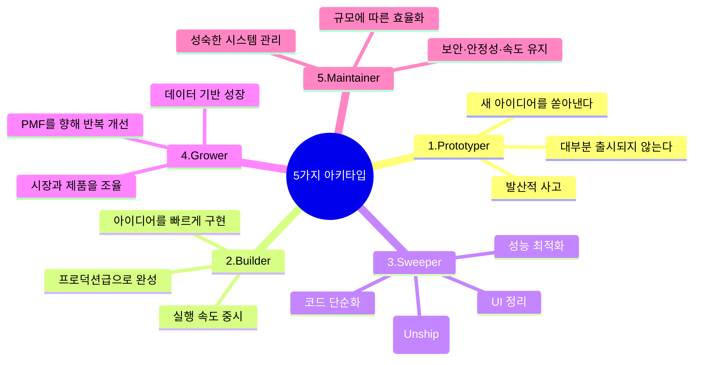
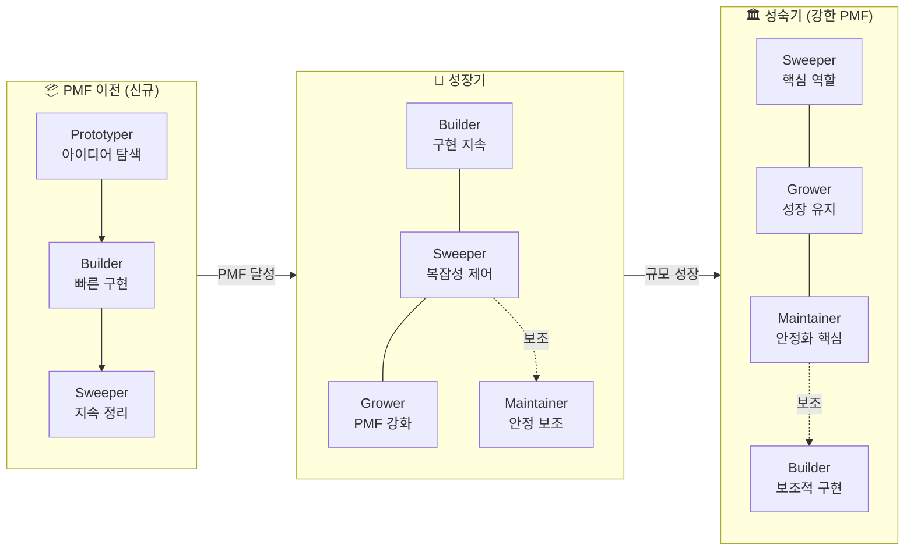
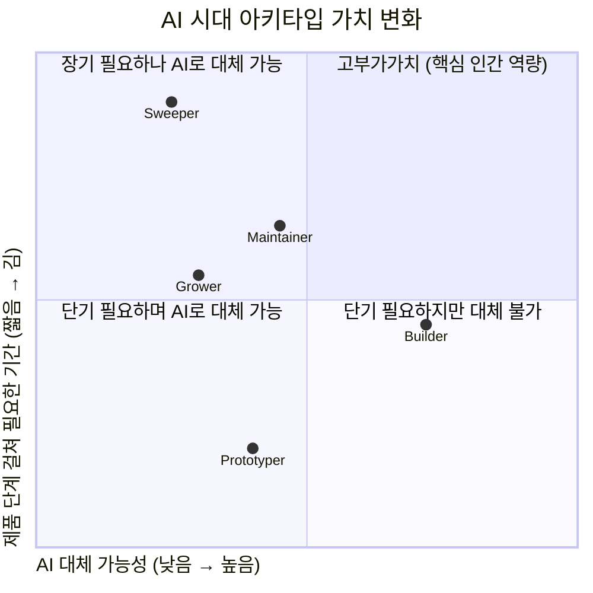
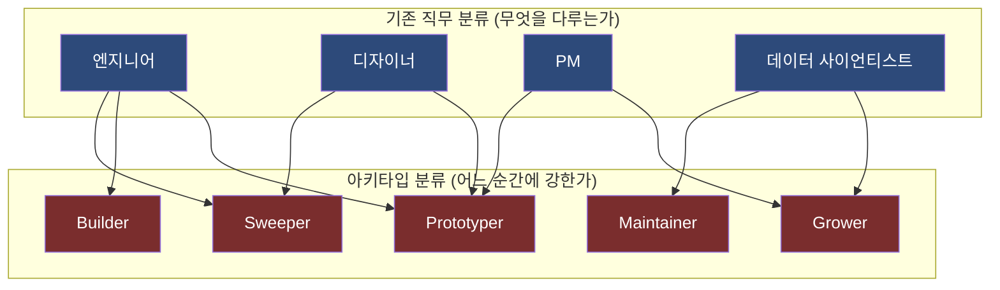
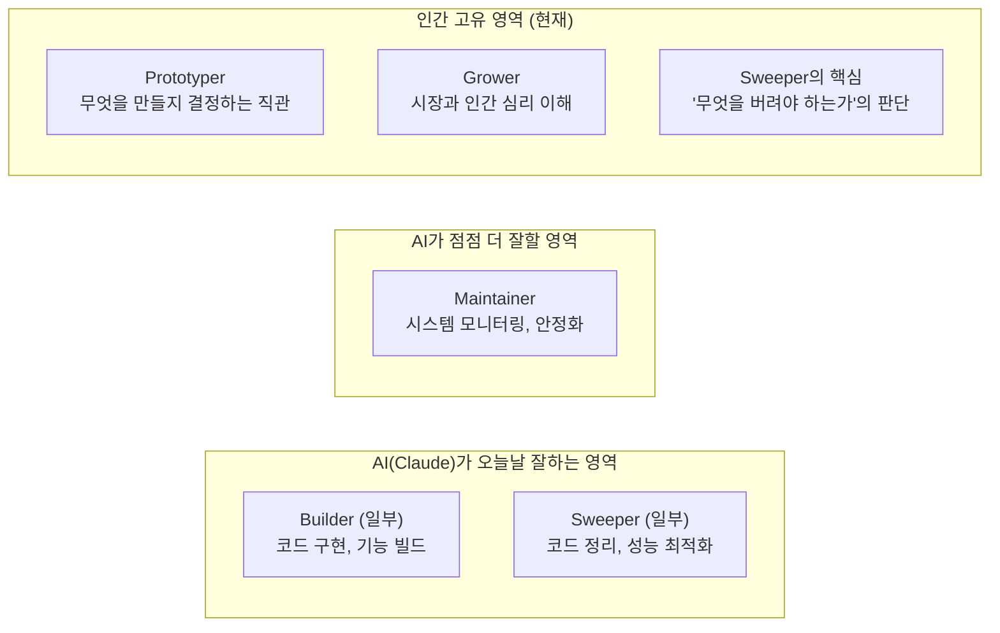
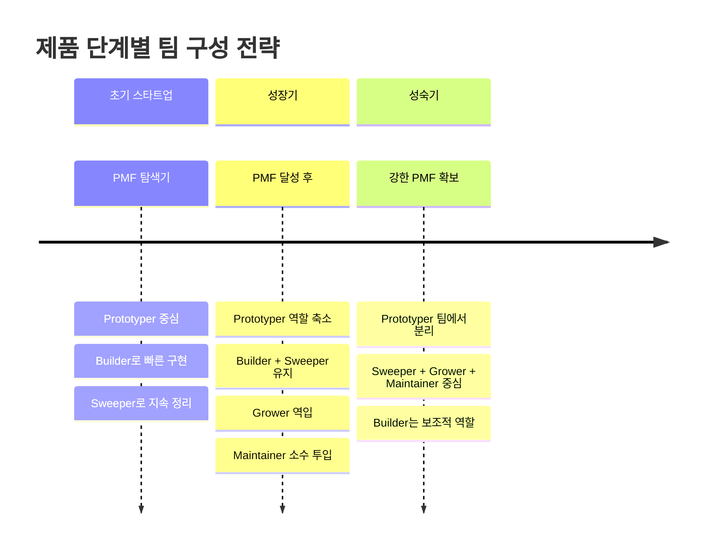
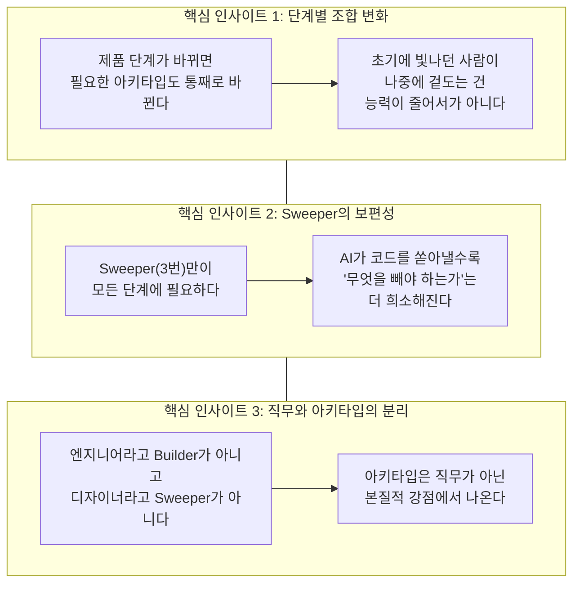

> **원문 출처**: Boris Cherny([@bcherny](https://x.com/bcherny/status/2071379474277613732)) X(트위터) 포스트, 2026년 6월 28일  
> **작성 배경**: Threads 계정 @and__yc 의 한국어 해설 포스트 + 원문 연구 및 보충  
> **문서 작성일**: 2026년 6월 30일

> 
> https://www.threads.com/@and__yc/post/DaJqmdSmSxe
> 
> **“Anthropic에 청소부로 취직했어요”**
> 
> 좋은 엔지니어, 좋은 디자이너를 뽑으면 된다고 생각했습니다. 그런데 보리스의 글을 읽고 나니, 우리가 사람을 줄곧 잘못된 칸에 넣어 왔을지도 모른다는 생각이 들었습니다.
엔지니어, 디자이너, PM, 데이터 사이언티스트. 우리는 오래 사람을 ‘무엇을 다루는가’로 분류해 왔습니다. 그런데 보리스는 Claude Code 팀을 보며 전혀 다른 다섯 가지 유형을 발견했다고 합니다.
> 1. Prototyper: 새 아이디어를 쏟아내는 사람. 대부분은 출시되지 않습니다. comes up with brand new ideas; churns out many ideas, most of which don't ship
> 2. Builder: 아이디어를 프로덕션급 제품으로 빠르게 구현하는 사람. quickly turns a prototype/idea into production-grade product/infra
> 3. Sweeper: UI를 정리하고 코드를 단순화하며 성능을 다듬는 사람. cleans up the UI, simplifies the code and system, unships, optimizes performance
> 4. Grower: 만들어진 제품을 PMF에 맞춰 키워가는 사람. takes a product that has been built and iterates on it to improve Product-Market Fit
> 5. Maintainer: 성숙한 시스템을 안정적으로 지켜내는 사람 owns a mature system to make it secure, reliable, fast, and efficient as it scales
> 
> 
---

## 1. 이 논의는 어떻게 시작되었는가

2026년 6월 28일, Boris Cherny는 X(구 트위터)에 한 편의 포스트를 올렸다. 짧은 글이었지만 반응은 폭발적이었다. 게시 후 수 시간 만에 **130만 뷰를 넘겼고**, 1,300건의 리포스트와 1만 2,400개의 북마크가 달렸다.

그가 던진 질문은 간단했다. 앞으로의 제품 팀은 어떤 모습이어야 하는가?

엔지니어, 디자이너, PM, 데이터 사이언티스트. 수십 년간 우리는 사람을 **"무엇을 다루는가"** 로 분류해 왔다. 그런데 Boris는 자신이 이끄는 Claude Code 팀을 들여다보며 전혀 다른 패턴을 발견했다. 직무(job function)가 아닌, **"제품의 어느 순간에 강한 사람인가"** 로 사람을 구분할 수 있다는 것이다.

이 포스트는 그 5가지 구분, 즉 **5가지 아키타입(Archetype)** 에 관한 이야기다.

---

## 2. Boris Cherny는 누구인가

이 이론의 무게를 제대로 이해하려면 Boris Cherny라는 인물을 먼저 알아야 한다.

### 2-1. 이력

Boris는 경제학을 공부하다 18세에 학교를 자퇴하고 스타트업을 창업했다. 이후 헤지펀드에서 일하다가 Meta(Facebook)에 합류했고, Meta에서 5년간 Principal Engineer로 근무하며 Instagram의 주요 코드베이스 현대화(Python→Hack 마이그레이션, REST→GraphQL 전환 등)를 주도했다. O'Reilly에서 출판된 《Programming TypeScript》의 저자이기도 하다.

2024년 9월, 그는 Anthropic에 **"Member of Technical Staff"** 직함으로 합류했다. Anthropic은 모든 직원에게 직함과 관계없이 동일하게 이 타이틀을 부여한다(엔지니어든, PM이든, 디자이너든).

### 2-2. Claude Code를 만들다

Anthropic 입사 첫 주, Boris는 Claude API를 공부하다가 Claude에게 자신이 현재 듣고 있는 음악이 무엇인지 알려달라는 AppleScript 장난감 프로그램을 만들었다. 그 실험에 터미널 접근 권한을 붙이자, 며칠 만에 내부 개발 도구로 진화했다. 2024년 11월에 내부 배포된 이 도구는 **5일 이내에 Anthropic 엔지니어의 50%가 사용하기 시작했다**.

2025년 2월 Claude 3.7 Sonnet 출시와 함께 Claude Code가 공식 출시되었고, 2025년 5월 GA(General Availability) 선언 후 2026년 초에 **연간 반복 매출(ARR) 10억 달러**를 돌파했다. 현재 AI 코딩 시장의 과반 이상을 점유하고 있으며, 전체 GitHub 공개 커밋의 4%가 Claude Code로 작성되고 있다(2026년 말 20% 예상).

Boris 본인은 2025년 11월 이후 단 한 줄의 코드도 직접 손으로 작성하지 않았다고 밝혔다. Claude Code 코드베이스의 80~90%가 Claude Code 자신에 의해 작성된다.

### 2-3. 왜 그의 말이 중요한가

Boris는 AI 코딩의 최전선을 직접 만들고 있는 사람이다. 그가 "제품 팀의 미래는 이렇게 생겼다"고 말할 때, 그것은 탁상공론이 아니라 **자신이 현재 운영 중인 팀에서 직접 관찰한 패턴**이다.

---

## 3. 5가지 아키타입 (Archetype) 상세 해설

Boris는 엔지니어링, 제품, 디자인, 데이터 사이언스 등 기존 직무 경계가 무너지며 하나의 새로운 종류의 역할로 융합되는 시대를 목격하며, 직무 대신 **실행 방식(execution style)** 으로 사람을 구분하는 5가지 유형을 제안했다.

### 3-1. Prototyper (프로토타이퍼)

**"새로운 아이디어를 끊임없이 만들어내는 사람. 대부분은 출시되지 않는다."**

Prototyper의 핵심 가치는 **가능성의 공간을 탐색하는 능력**이다. 이들은 아이디어 하나에 집착하지 않는다. 열 개를 만들어서 한두 개가 유효한지 확인하는 방식으로 일한다.

Claude Code 팀이 PRD(Product Requirements Document, 제품 요구사항 문서) 작성 대신 수십 개의 작동하는 프로토타입을 먼저 만드는 것도 이 아키타입의 가치를 팀 전체에 내면화한 결과다. Boris 본인은 이렇게 말했다. "정적인 목업이나 Figma로 시작했다면 이 제품은 절대 출시하지 못했을 것이다."

Prototyper는 발산적 사고(Divergent thinking)에 강하다. 아직 존재하지 않는 것을 상상하고, 빠르게 손에 잡히는 형태로 만들어낸다. 완성도보다는 **가능성 검증**에 초점을 맞춘다.

### 3-2. Builder (빌더)

**"프로토타입이나 아이디어를 프로덕션급 제품/인프라로 빠르게 구현하는 사람."**

Builder는 Prototyper가 검증해 낸 가능성을 실제로 작동하는 시스템으로 변환한다. 이 과정에서 핵심은 **속도**다. 프로덕션 품질을 갖추되, 느려서는 안 된다.

Builder는 실행의 전문가다. 코드를 쓰든, 시스템 아키텍처를 설계하든, 데이터 파이프라인을 구축하든 — 역할은 다양하지만 핵심은 "아이디어를 현실에 착지시키는 것"이다.

Boris는 Claude가 오늘날 Builder 역할도 상당 부분 수행할 수 있다고 인정했다("Sweeper/Builder Claude is quite good at today"). 그러나 **무엇을 만들어야 하는지 결정하고, 맥락을 이해하며, 올바른 방향을 설정하는 판단**은 여전히 인간 Builder의 영역이다.

### 3-3. Sweeper (스위퍼)

**"UI를 정리하고, 코드를 단순화하며, 기능을 제거(Unship)하고, 성능을 최적화하는 사람."**

Sweeper는 이 5가지 아키타입 중 가장 잘 알려지지 않았지만, 나중에 살펴보겠지만 **모든 단계에서 필요한 유일한 아키타입**이다.

Sweeper가 하는 일은 단순히 코드를 청소하는 것이 아니다. "Unship(출시 취소)"이라는 단어가 정의에 포함되어 있는 것에 주목할 필요가 있다. 이들은 **무엇을 빼야 할지 아는 사람**이다. 추가가 아니라 제거를 통해 제품을 개선한다.

AI가 코드를 무한히 생성해낼 수 있는 시대에, Sweeper의 가치는 역설적으로 높아진다. 추가는 쉬워지고, **제거와 단순화는 더 어려워지기 때문이다.** 복잡성이 빠르게 쌓이는 환경일수록, 그 복잡성을 제어할 수 있는 감각은 희소해진다.

원문 포스트가 올라온 직후 한 댓글러(@overfitfortruth)가 "엄마, 나 Anthropic에 청소부(sweeper)로 취직했어"라며 농담을 던진 것은 이 유형이 과소평가된다는 인식을 풍자한 것이다. 그러나 데이터를 보면, 그 자리가 가장 오래 필요한 자리다.

### 3-4. Grower (그로워)

**"이미 만들어진 제품을 PMF(Product-Market Fit)에 맞게 반복 개선하며 키워가는 사람."**

Grower는 이미 작동하는 제품을 갖고 시장과 대화한다. 유저의 반응을 읽고, 수치를 해석하고, 어떤 방향으로 반복 개선해야 PMF를 강화할 수 있는지 판단한다.

이 역할은 기존 PM이나 그로스 해커의 일부와 겹치지만, Boris의 프레임에서는 직함이 아니라 **행동 패턴**으로 정의된다. 데이터 사이언티스트든, 엔지니어든, 마케터든 — Grower 본능을 가진 사람이 이 역할을 채운다.

Grower가 없으면 아무리 잘 만든 제품도 제자리에 머문다. 반대로 Grower만 있고 Sweeper가 없으면, 키우는 과정에서 기술 부채와 복잡성이 쌓여 제품이 무거워진다.

### 3-5. Maintainer (메인테이너)

**"성숙한 시스템을 보안·안정성·속도·효율성 측면에서 규모에 맞게 유지하는 사람."**

Maintainer는 규모가 커진 시스템의 수호자다. 새로운 기능을 만드는 것이 아니라, 기존 기능이 수백만 명의 사용자에게도 안정적으로 작동하도록 유지한다.

이 역할은 종종 화려하지 않고, 눈에 잘 띄지 않는다. 그러나 없으면 반드시 티가 난다. 시스템이 다운되거나, 보안 사고가 나거나, 성능이 열화될 때 비로소 Maintainer의 가치가 드러난다.

Boris 본인은 Maintainer를 자신의 아키타입에 포함시키지 않았다(1+3+4라고 밝혔다). 이는 조직 내에서 역할 분담이 자연스럽게 이루어지고 있음을 시사한다.

---

## 4. 제품 단계별 팀 조합

Boris가 이 아키타입 이론에서 제안한 가장 실용적인 인사이트는, **제품의 성장 단계에 따라 필요한 조합이 통째로 달라진다**는 것이다.

```mermaid
gantt
    title 제품 단계별 아키타입 필요도
    dateFormat X
    axisFormat %s

    section Prototyper (1)
    PMF 이전 (핵심)      :active, 0, 3
    성장기 (불필요)       :done, 3, 6
    PMF 이후 (불필요)    :done, 6, 9

    section Builder (2)
    PMF 이전 (핵심)      :active, 0, 3
    성장기 (핵심)        :active, 3, 6
    PMF 이후 (보조)     :crit, 6, 9

    section Sweeper (3)
    PMF 이전 (핵심)      :active, 0, 3
    성장기 (핵심)        :active, 3, 6
    PMF 이후 (핵심)     :active, 6, 9

    section Grower (4)
    PMF 이전 (불필요)   :done, 0, 3
    성장기 (핵심)        :active, 3, 6
    PMF 이후 (핵심)     :active, 6, 9

    section Maintainer (5)
    PMF 이전 (불필요)   :done, 0, 3
    성장기 (보조)        :crit, 3, 6
    PMF 이후 (핵심)     :active, 6, 9
```

아래 표는 각 단계에서 어떤 아키타입이 핵심인지, 어떤 조합이 권장되는지를 정리한 것이다.

| 제품 단계 | 핵심 조합 | 의미 |
|-----------|-----------|------|
| **PMF 이전** (신규 제품) | **1 + 2 + 3** | 아이디어 탐색 → 빠른 구현 → 지속적 정리 |
| **성장기** (PMF 확보 후 성장 중) | **2 + 3 + 4** + 약간의 5 | 구현력 + 정리 + 성장 견인 |
| **성숙기** (강한 PMF 확보) | **3 + 4 + 5** + 약간의 2 | 정리 + 성장 유지 + 시스템 안정화 |

이 조합이 시사하는 것은 두 가지다.

**첫째**, 조합이 단계마다 **통째로 바뀐다**. PMF 이전에는 Prototyper(1번)가 팀의 중심이지만, PMF를 달성하고 나면 1번은 조합에서 사라진다. 이는 "1번 사람이 필요 없어졌다"는 뜻이 아니다. **"제품이 그 사람의 강점을 더 이상 필요로 하지 않는 단계로 넘어갔다"** 는 뜻이다.

초기 스타트업에서 빛나던 창업자나 핵심 멤버가 회사가 커지면서 엉뚱하게 느껴지는 경험을 많은 이들이 해봤을 것이다. Boris의 프레임은 그 현상을 정확하게 설명한다. 그 사람의 능력이 줄어든 게 아니라, **제품의 단계가 그의 강점을 지나쳐버린 것이다**.

**둘째**, 세 줄의 조합을 겹쳐 보면 **모든 단계에 공통으로 등장하는 번호는 3번 Sweeper 하나뿐이다**. 나머지 아키타입은 모두 특정 시기에만 필요하지만, Sweeper만은 제품의 처음부터 끝까지 필요하다.

---

## 5. Sweeper가 가장 오래 살아남는 이유

이 이론의 가장 반직관적이면서도 강력한 인사이트는 **Sweeper의 보편성**이다.

우리가 직관적으로 "화려하다"고 느끼는 역할은 Prototyper(창의적 아이디어)나 Builder(빠른 실행)다. 그러나 데이터를 보면 그 화려한 역할들은 특정 단계에서만 필요하다.

왜 Sweeper는 언제나 필요한가?

**이유 1: 복잡성은 자연적으로 누적된다**

어떤 제품이든 시간이 지나면 복잡해진다. 초기에 빠르게 만든 코드, 검증을 위해 붙인 임시 기능, 사용자 요청에 따라 추가된 옵션들 — 이 모든 것이 쌓이면 제품은 무거워지고 느려진다. 이 복잡성을 능동적으로 줄이는 사람 없이는 어느 단계의 제품도 건강하게 유지될 수 없다.

**이유 2: AI가 코드를 무한 생성하는 시대일수록 역설적으로 더 중요해진다**

Boris 자신도 하루에 10~30개의 PR을 AI로 생성한다. Claude Code 코드베이스의 80~90%가 AI 작성이다. 이 환경에서 코드를 **추가**하는 비용은 거의 0에 수렴한다. 그렇다면 비싸지는 것은 무엇인가? **무엇을 제거해야 하는지, 어디를 단순화해야 하는지 아는 감각**이다.

Boris는 댓글에서 이렇게 밝혔다: "Claude는 Sweeper와 Builder 역할을 오늘날 이미 꽤 잘 수행한다." 그러나 "무엇을 버려야 하는가"의 판단 — 즉 **Unship의 감각** — 은 여전히 가장 어려운 인간적 판단 영역이다.

**이유 3: "청소부" 조크가 역전되는 순간**

원문 포스트에 달린 댓글 중 가장 많이 화제가 된 것은 @overfitfortruth가 쓴 것이었다.

> "엄마, 나 Anthropic에 취직했어. 청소부(sweeper) 할 거야." *(반어적 표현)*

이 댓글은 Sweeper가 "청소하는 사람"이라는 낮은 인식을 풍자한 것이다. 그런데 조합표를 분석하면 결론이 역전된다. **가장 화려해 보이는 Prototyper가 가장 짧은 기간 동안 필요하고, 가장 평범해 보이는 Sweeper가 가장 오래 필요하다.**

---

## 6. 직무(Job Function)와 아키타입(Archetype)의 분리

이 이론의 또 다른 핵심 주장은, **아키타입이 기존 직무와 독립적으로 존재한다**는 것이다.

Boris는 명시적으로 이렇게 썼다:

> "이 역할들은 직무 기능에 묶여 있지 않다. 예를 들어, Anthropic의 일부 디자이너는 1번에 해당하고, 어떤 디자이너는 2번, 또 어떤 디자이너는 3번이다. 엔지니어, PM, DS도 마찬가지다."

즉, 명함이 "엔지니어"라고 해서 그가 Builder인 것은 아니다. "디자이너"라고 해서 Sweeper인 것도 아니다. 아키타입은 **직무가 아니라 사람의 본질적인 강점과 성향**에서 나온다.

### Anthropic의 타이틀 없는 문화

이 아키타입 이론은 Anthropic의 조직 철학과 깊이 연결된다. Anthropic에서는 엔지니어든, PM이든, 디자이너든 모두 **"Member of Technical Staff"** 라는 동일한 타이틀을 갖는다. Boris는 Meta도 비슷했다고 언급했다("아무리 시니어 엔지니어도 'Software Engineer'라는 타이틀이었다").

이 문화의 효과는 직함 없이 대화할 때 "당신이 무슨 직책인지"가 아니라 "당신이 무엇을 할 수 있는지"로 관계가 맺어진다는 것이다. 아키타입 이론은 이 철학의 이론적 토대가 된다.

---

## 7. Boris 본인의 아키타입: 1 + 3 + 4

원문 포스트 아래에 @overfitfortruth의 "청소부" 농담 댓글에 Boris 본인이 직접 답했다.

> "fwiw, my own archetype is probably 1+3+4"  
> (참고로, 내 아키타입은 아마 1+3+4인 것 같아요)

이것은 단순한 자기소개가 아니다. Claude Code의 창시자이자 Head인 사람이 스스로를 **Maintainer가 아닌 Prototyper + Sweeper + Grower**로 정의한 것이다.

이는 몇 가지를 시사한다.

- 그는 자신을 시스템 유지자(Maintainer)로 정의하지 않는다. 리더로서 **새로운 아이디어를 만들고(1), 덜어내며(3), 키우는(4) 역할**에 강점이 있다는 것이다.
- 이 조합은 초기 스타트업 단계뿐 아니라 성장기에도 유효하다. 1+3+4는 PMF 이전과 성장기의 조합을 모두 아우른다.
- Builder(2)와 Maintainer(5)가 빠진 것은 그가 팀에서 이 역할을 다른 사람들에게 의존한다는 뜻이기도 하다.

리더가 자신의 아키타입을 명확히 알고 있다는 것, 그리고 자신이 채우지 못하는 조합을 팀을 통해 채운다는 것 — 이것이 이 이론의 실용적 가치다.

---

## 8. AI와 아키타입: Claude가 어디까지 대체할 수 있는가

Boris는 댓글에서 이 질문에 직접 답했다. @pachu2120가 물었다: "코딩이 대부분 해결됐다면, Builder와 Sweeper 역할도 그냥 Claude에게 루프를 돌리면 되지 않나?"

Boris의 답: **"Claude는 이 역할들을 어느 정도 도울 수 있고, 시간이 지남에 따라 개선될 것이다. Sweeper/Builder 역할은 Claude가 오늘날 이미 꽤 잘한다."**

이것은 중요한 인정이다. 아키타입 이론이 "인간만이 할 수 있다"는 주장이 아님을 보여준다.

흥미로운 관점은 또 다른 댓글러 @ZOYAN이 제시한 것이다. 그는 이렇게 썼다: "모델들이 이 역할들의 반복적인 패턴을 대부분 흡수했을 때, 도전 과제는 인간이 새로운 역할 범주에 어떻게 적응하는가가 아니라, **시스템을 가르치고 발전시키는 데 훨씬 적은 수의 인간이 필요해지는 상황에서 조직이 어떻게 기능하는가** 가 될 것이다."

---

## 9. 커뮤니티 반응과 논쟁

이 포스트는 1.3M 뷰를 기록하며 폭발적인 반응을 이끌어냈다. 긍정적 반응이 67.9%, 부정적 반응이 32.1%였다.

### 주목할 만한 반응들

**Kun Chen (@kunchenguid)의 반론** (가장 많은 공감을 받은 댓글):
> "나는 아키타입을 정의하는 것을 별로 좋아하지 않는다. 사람들이 '아, 나는 이런 사람이야'라고 결론 내리고 더 이상 스스로를 의심하지 않게 되기 때문이다. 실제로는 사람의 역할이 프로젝트와 함께 진화해야 한다. 새 프로젝트를 시작할 때는 Prototyper와 Builder지만, 곧 Sweeper가 되어야 하고, 성숙해지면 Grower와 Maintainer가 된다. 특정 역할에 자신을 가두면 어느 순간 프로젝트를 넘겨야 한다. **유연하게 유지하라.**"

Boris는 이 반론에 동의했다: "완전히 동의합니다. 역할은 시간/프로젝트에 따라 자주 바뀝니다."

**@pachu2120 의 날카로운 질문**:
> "코딩이 거의 해결됐다면, 그냥 Claude에게 루프를 돌리면 Builder와 Sweeper가 필요 없지 않나?"

이는 이 이론의 취약점을 찌르는 질문이다. Boris의 답은 AI가 점점 더 많은 부분을 담당할 수 있지만, 판단과 방향 설정은 여전히 인간의 영역임을 인정하는 것이었다.

**긍정적 반응 요약:**
- 기존 직함 체계보다 훨씬 실용적인 팀 구성 프레임워크라는 평가
- 특히 AI 시대에 "무엇을 할 수 있는가"로 사람을 분류하는 방식의 설득력
- 스타트업 팀 구성과 채용에 즉각 적용 가능한 실용적 도구

**부정적 반응 요약:**
- Anthropic에 대한 반감을 담은 비판
- 아키타입이 너무 단순화되어 있다는 지적
- "그냥 새로운 이름을 붙인 기존 역할 아닌가"라는 회의론

---

## 10. 이 이론이 채용과 팀 구성에 주는 함의

Boris의 프레임이 실용적으로 적용될 수 있는 가장 직접적인 영역은 **채용과 팀 구성**이다.

### 채용 시 질문의 변화

| 기존 질문 | 아키타입 기반 질문 |
|-----------|-------------------|
| "엔지니어/디자이너/PM을 몇 명 뽑을까?" | "지금 우리 제품 단계에 필요한 아키타입은?" |
| "이 사람의 기술 스택은 무엇인가?" | "이 사람은 어느 단계의 제품에서 빛나는가?" |
| "경력이 몇 년인가?" | "이 사람은 Builder인가, Sweeper인가, Grower인가?" |

### 제품 단계에 맞는 팀 구성

Boris의 말을 빌리면, 팀이 제품 단계를 넘어갈 때 "필요한 사람이 바뀌는 게 아니라, 그 사람을 필요로 하는 제품의 단계가 바뀌는 것"이다. 이것은 사람을 해고하는 것이 아니라, **그 사람이 빛날 수 있는 다른 제품/프로젝트로 이동시키는 것**을 의미한다.

---

## 11. "소프트웨어 엔지니어" 타이틀의 소멸 예측

이 아키타입 이론은 Boris가 꾸준히 주장해 온 더 큰 예측과 연결된다.

Boris는 여러 인터뷰에서 **2026년 말이면 "소프트웨어 엔지니어"라는 타이틀이 사라지기 시작할 것**이라고 예측했다. 그 자리를 대체하는 것이 바로 "Builder"다. 이미 Claude Code 팀에서는 엔지니어, PM, 디자이너, 데이터 사이언티스트 모두가 코드를 작성하고 있으며, 직함이 아닌 아키타입으로 역할이 분화되고 있다.

실제로 Claude Code 팀의 원칙 중 하나는 이렇다: PRD(제품 요구사항 문서)를 쓰지 않는다. 대신 수십 개의 작동하는 프로토타입을 먼저 만든다. 이 원칙 자체가 팀 전체에 Prototyper 본능을 내면화시키는 방식이다.

---

## 12. 한국 AI 교육 현장에의 적용

이 이론은 AI 시대의 직무 불안을 가진 학습자들에게 구체적인 재조정 방향을 제시한다.

### 학습자에게 던질 수 있는 질문

- "당신은 무언가를 처음부터 만들 때 에너지가 올라오는가(Prototyper), 아니면 이미 있는 것을 더 좋게 만들 때 올라오는가(Sweeper/Grower)?"
- "복잡한 것을 단순하게 만드는 것이 즐거운가(Sweeper), 아니면 안정적인 시스템을 유지하는 것이 즐거운가(Maintainer)?"
- "당신이 지금 속한 팀/제품은 어느 단계인가? 그 단계에 맞는 아키타입을 수행하고 있는가?"

### AI 도구와 아키타입

중요한 시사점은 AI 도구가 각 아키타입을 **대체**하는 것이 아니라 **증폭**시킨다는 것이다. Claude가 Builder/Sweeper 역할의 일부를 수행할 수 있다는 것은, **인간 Builder와 Sweeper가 훨씬 더 빠르고 많은 것을 할 수 있다**는 의미이기도 하다.

---

## 13. 요약 및 결론

Boris Cherny가 2026년 6월 28일 발표한 5가지 아키타입 이론을 한 문장으로 압축하면 이렇다:

> **"명함은 당신이 쥔 도구를 알려줄 뿐이다. 아키타입은 당신이 제품의 어느 순간에 빛나는 사람인지를 말해준다."**

마지막으로, 이 이론에 대한 건강한 회의론도 함께 기억할 필요가 있다. Kun Chen의 말처럼, 아키타입은 자신을 가두는 상자가 아니라 **현재 자신이 어디에 서 있는지 파악하는 렌즈**여야 한다. 유연성을 잃지 않으면서도 자신의 강점을 명확히 아는 것 — 이것이 AI 시대에 사람이 지켜야 할 균형점이다.

---

## 참고 자료

- Boris Cherny(@bcherny) X 포스트, 2026.06.28: https://x.com/bcherny/status/2071379474277613732
- Digg 아카이브: https://digg.com/tech/6z8puf33
- Pragmatic Engineer - Building Claude Code with Boris Cherny (2026.03.05)
- Lenny's Newsletter - Head of Claude Code: What happens after coding is solved (2026.04.13)
- Platformer - Claude's Code creator on the end of the software engineer (2026.05.27)
- Medium - Boris Cherny and Cat Wu: Anthropic's Batman and Robin (2026.04.16)
- bestblogs.dev - Boris Cherny: Building Claude Code Profile (2026.04.29)
