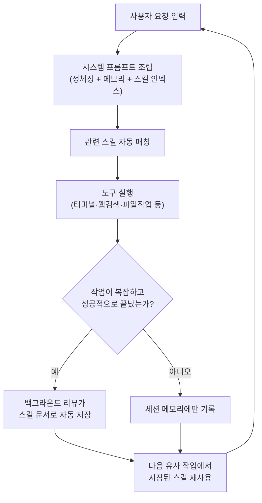
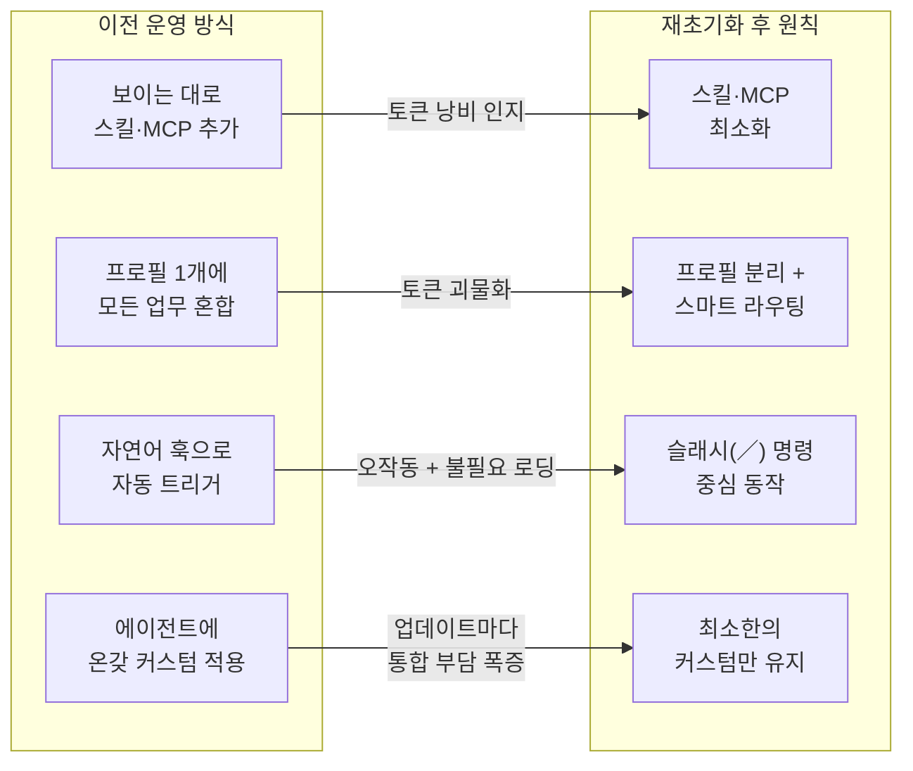
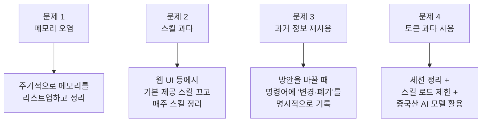

### — [@junicatz](https://www.threads.com/@junicatz)의 Threads 기록과 메모리 점검 콘솔을 중심으로 —

---

## 목차

1. 들어가며 — 이 자료들이 가리키는 한 가지 흐름
2. 배경 지식: Hermes Agent란 정확히 무엇인가
3. 콘솔이 보여주는 장면 — "Hermes Memory Review Console"의 정체
4. 초기화 선언 — 0에서 다시 시작하며 세운 네 가지 원칙
5. 장기 운영 중 드러난 네 가지 문제와 나름의 해법
6. "정신개조" 대시보드를 따로 만든 이유
7. 더 오래 써본 뒤의 후기 — 고도비만 에르메스와 마이그레이션 경고
8. 그 사이사이의 실전 기록들 — 철학, 도구, 협업 사례
9. 전체를 관통하는 메시지
10. 참고 출처

---

## 1. 들어가며 — 이 자료들이 가리키는 한 가지 흐름

전달해주신 자료는 크게 두 갈래로 이루어져 있다. 하나는 어떤 로컬 대시보드를 캡처한 화면으로, 제목이 "Hermes Memory Review Console"이라고 적혀 있고 그 아래에 총 47개의 메모리 항목과 승인·삭제·편집 대기 현황이 정리되어 있다. 다른 하나는 Threads 사용자 @junicatz가 비슷한 시기에 연속으로 남긴 여섯 편의 글로, 모두 "Hermes(헤르메스)"라는 자가학습형 AI 에이전트를 실제 업무에 투입해 운영하면서 겪은 시행착오와 나름의 대응 전략을 기록한 운영 일지에 가깝다.

이 두 자료를 따로 떼어 보면 단순한 도구 후기처럼 보이지만, 함께 놓고 보면 하나의 일관된 서사가 드러난다. 즉 "기억하면서 점점 똑똑해지는 AI 에이전트"라는 매력적인 약속이 실제 장기 운영 단계에 들어서면 메모리 오염, 스킬 과적, 토큰 폭증, 마이그레이션 사고라는 매우 현실적인 운영 부채로 돌아온다는 것, 그리고 그 부채를 갚기 위해 사용자가 결국 별도의 점검 도구까지 직접 만들어야 했다는 것이다. 이 문서는 Hermes Agent라는 도구 자체에 대한 최신 정보를 검색을 통해 확인한 뒤, 그 위에서 @junicatz의 기록 하나하나가 실제로 무엇을 의미하는지 차례로 짚어보려 한다.

---

## 2. 배경 지식: Hermes Agent란 정확히 무엇인가

먼저 "Hermes"가 정확히 어떤 도구인지부터 분명히 해둘 필요가 있다. 같은 이름의 AI 관련 프로젝트가 여럿 존재하기 때문에 혼동하기 쉬운데, 글 전체의 맥락(메모리, 스킬, 게이트웨이, OpenClaw 마이그레이션)을 보면 이는 Nous Research가 2026년 2월 25일 공개한 오픈소스 자가개선형 AI 에이전트 프레임워크 "Hermes Agent"를 가리키는 것이 거의 확실하다.

Hermes Agent는 한 번 켜고 끄는 챗봇이 아니라, 사용자의 서버나 개인 컴퓨터에 상주하면서 터미널, 웹 검색, 파일 작업, 코드 실행 같은 도구를 직접 다루고, 텔레그램·디스코드·슬랙 같은 메신저로도 동일한 에이전트에 말을 걸 수 있게 만든 자기 호스팅형 에이전트다. 핵심 차별점은 크게 두 가지로 요약된다. 첫째는 지속 메모리로, 대화가 끝나도 사용자의 선호와 프로젝트 맥락을 SQLite 기반 저장소에 남겨 다음 세션에서도 다시 설명할 필요가 없게 만든다. 둘째는 자동 스킬 생성으로, 에이전트가 복잡한 작업을 한 번 잘 해결하면 그 절차를 마크다운 형태의 "스킬" 문서로 스스로 저장해두었다가 비슷한 상황이 다시 오면 처음부터 다시 추론하지 않고 저장된 절차를 불러와 쓴다.

공식 문서는 이 구조를 메모리와 스킬의 역할 분담으로 설명한다. 메모리가 "사실(facts)"을 담는 포스트잇이라면, 스킬은 "방법(procedures)"을 담는 레시피 카드에 가깝다는 비유다. 여기에 더해 Honcho라는 외부 메모리 백엔드를 연결하면 단순한 사실 기억을 넘어 사용자의 행동 패턴과 선호까지 모델링하는 "변증법적 사용자 모델"을 구축할 수도 있다.

공개 이후의 성장 속도는 이례적이었다. 출시 6주 만에 깃허브 스타 5만 7천 개를 넘겼고, 2026년 6월 말 기준으로는 20만 개 안팎까지 늘어나 같은 해 가장 빠르게 성장한 오픈소스 에이전트 프레임워크로 꼽혔다. 이 폭발적인 성장의 이면에는 한 가지 중요한 사실이 있는데, Hermes는 초기 사용자 상당수를 경쟁 프로젝트인 "OpenClaw"로부터 흡수했다는 점이다. OpenClaw는 여러 메신저 채널을 하나의 게이트웨이로 묶어 어디서든 말을 걸 수 있게 만든, Hermes보다 먼저 자리 잡은 자기 호스팅형 개인 비서 시스템이다. Hermes는 설치 마법사 단계에서 기존 `~/.openclaw` 설정을 자동으로 감지해 `hermes claw migrate` 명령으로 메모리와 스킬, 설정값을 통째로 옮겨올 수 있도록 만들어두었고, 이 마이그레이션 편의성이 생태계 전환의 강한 촉매가 되었다는 평가를 받는다. 뒤에서 다시 다루겠지만, 바로 이 마이그레이션 경로가 @junicatz의 글에서는 경고의 대상으로 등장한다.

아래는 Hermes Agent가 한 번의 작업을 처리할 때 메모리와 스킬이 어떻게 맞물려 돌아가는지를 간단히 정리한 흐름이다.

이 그림에서 알 수 있듯, Hermes의 가치 제안은 "쓸수록 똑똑해진다"는 데 있다. 그런데 이 순환 구조는 거꾸로 보면 "쓸수록 쌓인다"는 뜻이기도 하다. 메모리와 스킬은 자동으로 늘어나기만 할 뿐 자동으로 정리되지는 않으며, 바로 이 지점이 @junicatz의 모든 글이 공통적으로 겨냥하고 있는 문제의 출발점이다.

---

## 3. 콘솔이 보여주는 장면 — "Hermes Memory Review Console"의 정체

전달해주신 첫 번째 자료는 "Hermes Memory Review Console"이라는 제목의 로컬 대시보드다. 화면 설명을 그대로 따라가 보면, 상단에는 Hot Memory와 User Profile, 그리고 "stale candidate(낡은 후보)"라는 세 가지 영역을 한 화면에서 보면서 승인·삭제·편집·현재확인이라는 네 가지 판정을 직접 남기도록 설계되어 있다고 적혀 있다. 우측 통계 패널은 총 47개 항목 중 47개가 현재 표시되고 있으며, 판정 완료는 0건, 편집 흔적이 있는 항목도 0건이라고 보여준다. 즉 이 콘솔을 열어본 시점은 아직 점검을 시작하기 전, 47개의 메모리 후보가 고스란히 쌓여 있는 상태였다는 뜻이다.

하단의 분류 탭은 더 구체적이다. 전체 47건 가운데 Hot Memory가 5건, User Profile이 7건으로 나뉘어 있고, 그 아래로는 의미 있는 충돌 가능성을 기준으로 묶어둔 카테고리들이 이어진다. "예전 경로 / 현재 경로와 충돌 가능"이 7건, "Craft 관련 — 현재 Notion 중심 정책과 충돌 가능"이 14건으로 가장 많고, "Craft migration 기록 — 보존 가능하지만 현재 지침으로 오인 위험"이 3건, "더미/샘플 데이터 관련"이 3건, "OpenClaw / ALIVE legacy — 현재 Hermes 운영과 혼동 가능"이 5건, "Project Memory 쪽 현재 상태 대조 필요"가 3건으로 나뉘어 있다.

이 분류 체계를 찬찬히 읽어보면 이 콘솔이 풀려고 하는 문제가 정확히 무엇인지 드러난다. 자가학습형 에이전트는 "예전에 이렇게 했다"는 기록과 "지금은 이렇게 하기로 했다"는 기록을 시간순으로 구분하지 않고 같은 메모리 저장소에 쌓아두는 경향이 있다. 그러다 보니 한때 Craft라는 노트 앱을 중심으로 일하던 시절의 메모리가, 지금은 Notion 중심으로 정책을 바꾼 뒤에도 여전히 남아 있다가 에이전트가 엉뚱한 맥락을 끌어다 쓰는 원인이 된다. 마찬가지로 OpenClaw를 쓰던 시절이나 "ALIVE"라는 이름의 예전 프로젝트와 관련된 레거시 정보가, 지금 운영 중인 Hermes 환경의 설정과 뒤섞여 혼동을 일으킬 위험이 있다고 분류되어 있다. 이런 항목들은 거짓 정보는 아니지만 "지금 유효한 사실"이 아니라는 점에서 위험하며, 그래서 자동 삭제가 아니라 사람이 한 건씩 들여다보고 승인·삭제·편집·현재확인 중 하나로 판정을 내리는 수동 검수 절차가 필요했던 것이다.

설명 문구에는 이 콘솔의 작동 방식에 대한 중요한 단서도 담겨 있다. 저장 방식은 브라우저의 localStorage이며, 다른 브라우저나 다른 기기에서는 이 판정 기록이 보이지 않을 수 있으니 마지막에 반드시 Export를 눌러 결과를 복사해두라는 안내가 함께 적혀 있다. 화면 하단에는 검색창과 "전체 표시／전체 액션" 필터, 그리고 Export JSON과 Export MD 버튼이 나란히 있다. 종합하면 이 콘솔은 Hermes 같은 에이전트가 자동으로 쌓아 올린 메모리 더미를, 실제 운영 파일을 직접 건드리지 않고 안전하게 미리 검토한 뒤, 검토 결과만 JSON이나 마크다운으로 내보내 실제 적용 단계에서 한 번 더 확인하고 반영하기 위해 만든 일종의 "메모리 검수용 임시 작업대"라고 이해하면 된다.

---

## 4. 초기화 선언 — 0에서 다시 시작하며 세운 네 가지 원칙

> Hermes를 초기화했다.
> 기존 아무것도 모르던 시기에 세팅해둔 것들이 계속 발목을 잡아서, 이참에 0로부터 시작하고자 초기화를 진행했다.
> 
> 초기화 하면서 초반부터 세팅을 잡아 놓고자 정해 놓은 규칙들은 다음과 같다.
> 1. 스킬 및 MCP 최소화 : 이전에는 웹에서 좋아보인다 싶은 게 있으면 추가했는데 이제는 최소화한 상태에서 꼭 필요한 것들만 추가
> 2. 프로필별 구분과 스마트 라우팅 세팅 : 귀찮아서 프로필 하나에 모든걸 넣다보니 토큰 괴물이 탄생. 프로필 구분하고 라우팅 법칙을 강하게 적용
> 3. 자연어 훅 동작보다는 / 동작 : 귀찮아서 자연어 훅으로 다 세팅 했는데 제대로 안될 뿐더러 불필요한 로딩을 불러일으켰다. 귀찮아서 /로 동작
> 4. 최소한의 커스텀 : Hermes에 온갖 커스텀을 하다보니 업데이트가 진행될 수록 감당안되는 수준의 통합이 필요했다. 최소한의 커스텀만으로 유지
> 

[가장 먼저 작성된 글](https://www.threads.com/@junicatz/post/DaM1-NZEpT4)에서 @junicatz는 Hermes를 초기화했다고 밝힌다. 이유는 명확하다. 아무것도 모르던 초창기에 별생각 없이 잡아둔 설정들이 시간이 지날수록 발목을 잡았고, 차라리 0부터 다시 시작하는 편이 낫다고 판단했다는 것이다. 이는 단순한 변덕이 아니라, 자가학습형 에이전트 특유의 문제를 정확히 짚은 결정이다. Hermes처럼 스스로 메모리와 스킬을 쌓아가는 시스템은 처음 며칠간 사용자가 무심코 흘린 설정이나 시험 삼아 만들어본 스킬까지도 "경험"으로 학습해버리기 때문에, 초기 설정이 어설프면 그 어설픔이 두고두고 누적된다.

재초기화하면서 세운 네 가지 원칙은 다음과 같이 정리할 수 있다.

첫 번째 원칙인 스킬과 MCP 최소화는, 예전에는 웹에서 괜찮아 보이는 도구나 연동을 보이는 대로 추가했지만 이제는 정말 필요한 것만 추가하기로 했다는 것이다. 이는 앞서 살펴본 Hermes의 구조와 직접 연결된다. Hermes는 매 API 호출마다 등록된 모든 도구의 정의와 스킬 인덱스를 시스템 프롬프트에 포함시켜 전송하는 구조이기 때문에, 등록된 도구와 스킬이 많을수록 매번 지불해야 하는 기본 토큰 비용이 그만큼 커진다. 실제로 Hermes 공식 문서를 한국어로 정리한 가이드에는 도구 29개와 스킬 116개가 등록된 상태에서 단순한 질문 하나에도 약 1만 4천 토큰이 소비된다는 실측치가 제시되어 있는데, 이는 스킬과 MCP를 무분별하게 늘리는 것이 곧바로 비용과 응답 속도의 문제로 이어진다는 사실을 뒷받침한다.

두 번째 원칙인 프로필 구분과 스마트 라우팅은, 귀찮다는 이유로 모든 업무를 프로필 하나에 몰아넣다 보니 "토큰 괴물"이 탄생했다는 반성에서 나왔다. Hermes는 실제로 업무 영역별로 별도의 프로필을 구성하고 프로필마다 격리된 설정을 가질 수 있도록 지원하는데, 하나의 프로필에 리서치·코딩·일정관리·잡담을 모두 욱여넣으면 그 프로필의 메모리와 스킬 인덱스가 무한정 비대해지는 구조적 문제가 생긴다. 프로필을 나누고 어떤 요청이 어떤 프로필로 가야 하는지를 정하는 라우팅 규칙을 강하게 적용한 것은, 이 비대화를 애초에 막기 위한 구조적 처방이라고 볼 수 있다.

세 번째 원칙인 슬래시 명령 중심 동작은, 자연어로 "이런 말이 들어오면 이렇게 해줘" 식의 훅을 잔뜩 걸어두었더니 제대로 작동하지도 않을뿐더러 불필요한 로딩만 유발했다는 경험에서 나온 결정이다. 자연어 트리거는 매번 에이전트가 "지금 들어온 문장이 어떤 훅에 해당하는지"를 판단해야 하므로 추가적인 추론 비용이 들고, 의도와 다르게 오작동할 여지도 크다. 반면 `／`로 시작하는 명시적 슬래시 명령은 해석의 모호함이 없어 더 가볍고 예측 가능하게 작동한다.

네 번째 원칙인 최소한의 커스텀은, 에이전트 본체에 온갖 커스터마이징을 적용하다 보니 공식 업데이트가 나올 때마다 그 커스텀과 충돌이 일어나고, 감당하기 어려운 수준의 수동 통합 작업이 반복되었다는 경험에서 나왔다. 이 문제는 8장에서 다시 다룰 "원본 시스템과 커스텀 시스템을 별도 레이어로 분리하는 작업"이라는 후속 시도로 이어진다.

---

## 5. 장기 운영 중 드러난 네 가지 문제와 나름의 해법

[두 번째 글](https://www.threads.com/@junicatz/post/DZE_jF5EhSw)에서 @junicatz는 Hermes를 실제로 운영하면서 부딪힌 네 가지 문제와 각각에 대한 자기 나름의 대응책을 정리한다. 이 부분은 4장의 재초기화 원칙이 "왜" 필요했는지를 사후적으로 증명해주는 운영 보고서 성격을 띤다.

첫 번째 문제인 메모리 오염은, 메모리 기록과 스킬 생성 과정이 서로 꼬이거나 오염되면 그 이후의 모든 작업에 지속적인 문제가 발생한다는 것이다. 이는 3장에서 본 콘솔이 47건의 메모리 가운데 14건이나 "현재 정책과 충돌 가능"으로 분류해야 했던 이유와 정확히 맞닿아 있다. 대응책으로는 특별한 도구를 쓰기보다 주기적으로 메모리 목록을 직접 훑어보고 정리하는 사람의 개입을 꼽았는데, 이는 결국 3장의 검수 콘솔을 만들게 된 직접적인 동기이기도 하다.

두 번째 문제인 스킬 과다는, Hermes가 기본으로 제공하는 번들 스킬만 해도 적지 않은데 사용하면서 새로 자동 생성되는 스킬까지 금방 쌓인다는 것이다. 실제로 Hermes 공식 릴리스 노트를 보면 이 문제는 Nous Research 쪽에서도 인지하고 있던 사안으로, 비교적 최근 버전에서는 무거운 스킬이나 특정 환경에서만 쓰이는 스킬을 기본 번들에서 분리해 선택 설치 항목으로 옮기고, 사용 빈도가 낮은 스킬을 백그라운드에서 자동으로 정리해주는 "큐레이터(Curator)" 기능을 7일 주기로 작동시키는 방향으로 개선이 이루어졌다. @junicatz의 대응책인 "웹 UI 등으로 기본 제공 스킬을 끄고 주마다 스킬을 정리한다"는 방식은, 이런 공식 큐레이터 기능이 자리 잡기 전후로 사용자가 직접 손으로 해야 했던 관리 작업에 해당한다.

세 번째 문제인 과거 정보의 재사용은, 한 번 A 방식에서 B 방식으로 바꿨는데도 에이전트가 계속 과거의 A 방식을 끌어다 쓰는 현상이다. 이는 메모리가 시간 순서나 유효 기간 개념 없이 "사실의 집합"으로만 저장되는 구조적 특성에서 비롯된다. 대응책은 단순하지만 실용적이다. 방안을 바꿀 때는 단순히 새 방안만 알려주는 것이 아니라 "예전 방안은 폐기되었다"는 사실까지 명령어에 명시적으로 넣어주는 것이다. 이는 3장의 콘솔에서 "Craft migration 기록 — 보존 가능하지만 현재 지침으로 오인 위험"이라는 카테고리로 따로 분류해둔 항목들과 정확히 같은 문제의식을 공유한다.

네 번째 문제인 토큰 문제는, Hermes 같은 상시 메모리·스킬 기반 에이전트가 단순 도구보다 구조적으로 토큰을 많이 쓴다는 점을 지적한다. 앞서 2장에서 살펴본 대로, 무상태 LLM API를 쓰는 에이전트는 매 호출마다 전체 대화 이력과 시스템 프롬프트, 등록된 도구·스킬 정의를 통째로 다시 전송해야 하므로 세션이 길어지고 등록된 자산이 많아질수록 비용이 누적된다. 대응책으로는 세션을 자주 정리하는 것, 한 번에 불러오는 스킬의 개수를 제한하는 것, 그리고 상대적으로 저렴한 중국산 AI 모델을 보조적으로 활용하는 것을 들고 있다. 이 마지막 항목은 사용자가 가진 메모리 정보에 등장하는 "GLM 계열 모델을 1차로 쓰고 Claude를 최후 보루로 쓰는 비용 최적화 전략"과도 결이 닿아 있는 대목이다.

---

## 6. "정신개조" 대시보드를 따로 만든 이유

> 
> 에르메스 오래 사용하다보니 메모리가 꼬이는 느낌이라
> 
> 직접 눈으로 보면서 하나하나 정신 개조 시키려고 대쉬보드 만듦
> 
> 앞으로 너는 춘식이여. 정신개조 들어간다 아주그냥
> 

[세 번째 글](https://www.threads.com/@junicatz/post/DZMI3HIknvS)에서 @junicatz는 Hermes를 오래 쓰다 보니 메모리가 점점 꼬이는 느낌이 들어서, 직접 눈으로 보면서 하나하나 "정신 개조"를 시키기 위해 대시보드를 만들었다고 적는다. 그리고 짤막하게 "앞으로 너는 춘식이여. 정신개조 들어간다 아주그냥"이라는 다소 장난스러운 문구를 덧붙인다.

이 한 줄은 가볍게 던진 농담처럼 보이지만, 실제로는 5장에서 정리한 네 가지 문제, 특히 메모리 오염과 과거 정보 재사용 문제에 대해 사용자가 도달한 결론을 압축해서 보여준다. 메모리가 자동으로 깨끗해지지는 않으니, 결국 사람이 직접 한 항목씩 눈으로 확인하면서 판정을 내리는 수작업이 필요하다는 것이다. "춘식이"는 이 글에서 새롭게 초기화된 에이전트의 인격에 붙인 별명으로 보이며, 그 별명을 붙이는 행위 자체가 "메모리를 비우고 다시 가르친다"는 4장의 재초기화 결정과 연속선상에 있는 의례적 절차로 읽힌다. 그리고 이때 만들었다고 언급한 대시보드가, 정황상 1장과 3장에서 살펴본 "Hermes Memory Review Console"과 같은 결과물일 가능성이 매우 높다. 시기상으로도 이 글이 먼저 작성되고, 콘솔에 47건의 미검수 메모리가 쌓여 있는 장면이 그다음 단계의 실제 작업 화면으로 자연스럽게 이어지기 때문이다.

---

## 7. 더 오래 써본 뒤의 후기 — 고도비만 에르메스와 마이그레이션 경고

가장 분량이 많은 [네 번째 글](https://www.threads.com/@junicatz/post/DZE_jF5EhSw)은 Hermes를 장기간 운영한 뒤의 종합 후기로, 세 가지 핵심 메시지를 담고 있다.

> 
> 에르메스 장기 운영 후기
> 1. 관리 안 하면 무한정 무거워짐 (메모리 터짐)
> - 에이전트가 자율 학습하고 스킬을 만들다 보니, 유저가 수동으로 관리 안 해주면 컨텍스트랑 스킬 파편이 쌓여서 무한정 무거워짐
> - 채널별로 별도 에이전트 띄워서 격리하는 가재맨 쓸 때보다 편하지만 동시에 손이 훨씬 많이 감
> 2. 고도비만 에르메스
> - 최근 에이전트 업데이트 방향 자체가 더 많은 기능과 복잡한 스킬을 추가하는 쪽이라, 생각 없이 무지성 업데이트 땡기다가는 '고도비만 에르메스'를 만나게 됨
> 3. 오픈클로 마이그레이션은 맹신 금지
> - 오픈클로 데이터 마이그레이션 공식 지원하긴 하는데... 이건 아닌듯
> - 마이그레이션 하고 넘어왔다가 컨텍스트 꼬이고 파싱 에러 나서 디버깅하느라 수리 지옥 빠짐
> -가재맨에서 에르메스로 갈아탈 땐 그냥 클린 버전 깔고 0부터 시작하는 게 정신 건강에 이로움
> 

첫째, 관리하지 않으면 무한정 무거워진다는 것이다. 에이전트가 자율적으로 학습하고 스스로 스킬을 만들다 보니, 사용자가 수동으로 정리해주지 않으면 컨텍스트와 스킬 파편이 끝없이 쌓여 점점 무거워진다고 적고 있다. 흥미로운 점은 이 글에서 비교 대상으로 등장하는 "가재맨"이라는 표현이다. 문맥과 채널별로 별도 에이전트를 띄워 격리하는 방식을 쓴다는 설명, 그리고 같은 사용자가 보유한 다른 운영 노하우(채널·역할별로 격리된 에이전트를 운영하는 한국 개발 커뮤니티의 도구 생태계)를 종합하면, 이는 한국 1인 개발자 커뮤니티에서 화제가 된 외부 코딩 에이전트 하네스 "가재코드(Gajae-Code)"를 친근하게 부르는 별칭으로 보인다. 가재코드는 작업별로 독립된 워크트리와 세션을 만들어 격리해 실행하는 구조의 도구로, @junicatz는 이런 방식을 쓸 때보다 Hermes처럼 하나의 에이전트가 모든 맥락을 들고 있는 방식이 편하기는 하지만, 그만큼 사용자가 직접 손을 대야 하는 관리 부담도 훨씬 크다고 비교하고 있다.

둘째, "고도비만 에르메스"라는 표현으로 요약되는 경고다. Hermes의 최근 업데이트 방향 자체가 더 많은 기능과 더 복잡한 스킬을 추가하는 쪽으로 가고 있어서, 별생각 없이 업데이트를 계속 받아들이기만 하면 비대해진 에이전트를 만나게 된다는 것이다. 실제로 Hermes 공식 릴리스 기록을 보면 이 지적은 상당히 근거가 있다. 한 릴리스에서는 칸반 기능이 멀티 에이전트 플랫폼 수준으로 확장되었고, 다른 릴리스에서는 새로운 추론 제공자와 메시징 플랫폼, 통합 기능이 한 번에 여러 개씩 추가되는 패턴이 반복되어 왔다. 동시에 같은 릴리스 노트들에는 이런 비대화에 대한 자체적인 반성도 함께 기록되어 있는데, 무거운 스킬을 기본 번들에서 분리하거나 코드베이스 자체를 대대적으로 줄이는 작업(한 릴리스에서는 핵심 실행 파일의 코드량을 76퍼센트 줄였다는 기록도 있다)이 이루어진 것을 보면, 개발사도 이 비대화 문제를 인식하고 대응해온 것으로 보인다. 다만 사용자 입장에서는 이런 공식 차원의 정리가 매 순간 자신의 운영 환경에 곧바로 반영되는 것은 아니므로, 결국 스스로 업데이트를 선별해서 받아들이는 판단이 필요하다는 결론에 이른 것으로 읽힌다.

셋째, 가장 직접적인 실전 경고로서 "오픈클로 마이그레이션은 맹신 금지"라는 항목이다. Hermes가 OpenClaw 데이터를 공식적으로 마이그레이션 지원한다는 점은 2장에서 확인한 그대로 사실이지만, @junicatz는 실제로 마이그레이션을 거쳐 넘어왔다가 컨텍스트가 꼬이고 파싱 에러가 나서 디버깅에 상당한 시간을 쏟아야 했던 경험을 전한다. 그래서 내린 결론은 명확하다. 가재코드 같은 다른 도구에서 Hermes로 갈아탈 때는 차라리 깨끗한 새 버전을 설치하고 0부터 시작하는 편이 정신 건강에 이롭다는 것이다. 이는 4장에서 본 첫 번째 글의 재초기화 결정과도 정확히 같은 결을 가진 조언으로, 자동 마이그레이션 기능이 기술적으로 존재한다는 사실과 그것이 실제로 안전하게 작동한다는 사실은 별개라는 점을 강조하고 있다.

---

## 8. 그 사이사이의 실전 기록들 — 철학, 도구, 협업 사례

마지막 글은 여러 개의 짧은 단상이 한데 묶여 있는 형태로, 한 줄씩 살펴보면 모두 앞선 다섯 개 글에서 다룬 문제의식이 실제 업무 현장에서 어떻게 응용되었는지를 보여주는 사례들이다.

> 
> 요즘 회사마다 AX(AI 전환) 얘기 많이 하는데,
> 
> AI를 무슨 '마법 지팡이'처럼 생각하면 안된다.
> 
> "AI가 알아서 해주겠지" 하고 던져두면,
> 
> 그럴듯해 보여도 백이면 백 오류투성이에 제대로 돌아가지도 않는다.
> 
> 진짜 AX를 하려면 순서가 반대여야 한다.
> 
> 사람이 먼저 [업무 정리 + 구조화]를 뼈대처럼 세워놓고,
> 
> 그 위에 AI라는 양념을 첨가해야 겨우 완성될까 말까다.
> 
> 그러니까 제발... "AI로 하면 다 되던데?" 같은 소리 좀 안 했으면 좋겠다.
> 

가장 먼저 등장하는 것은 AI 전환(AX)에 대한 일반론이다. AI를 "마법 지팡이"처럼 던져두면 그럴듯해 보여도 오류투성이가 되며, 진짜 AX를 하려면 사람이 먼저 업무를 정리하고 구조화한 뼈대를 세운 뒤에야 그 위에 AI라는 양념을 얹을 수 있다는 주장이다. 이는 1장부터 7장까지 살펴본 모든 운영 경험을 한 문장으로 압축한 것이나 다름없다. 프로필 분리, 슬래시 명령, 메모리 검수 콘솔, 변경사항 명시적 기록 같은 장치들은 결국 사람이 먼저 구조를 잡아준 결과물이며, 그 구조가 없었다면 Hermes는 그저 더 빨리 무거워지는 도구에 그쳤을 것이다.

이어지는 항목은 운영 환경을 물리적으로 분리하는 이야기다. Hermes를 별도 서버에서 돌리고 실제 작업용 메인 컴퓨터는 다른 기기를 쓸 때, 두 기기 사이에서 산출되는 파일과 데이터를 공유하기 위해 오픈소스 파일 동기화 도구인 Syncthing을 활용했다는 기록이 있다. Syncthing은 중앙 서버 없이 기기 간에 직접 암호화된 동기화를 수행하는 잘 알려진 오픈소스 프로젝트로, 별도 서버에 상주하는 에이전트의 산출물을 클라우드 업로드 없이 로컬 네트워크 안에서 안전하게 받아보려는 용도에 합리적으로 들어맞는 선택이다.

다음으로는 Hermes에게 특정 기간의 대화 로그를 긁어와 스스로 판단하고 주요 이슈에 대한 개선 사항을 정리해달라고 요청하는 활용법이 소개된다. 이는 2장에서 설명한 Hermes의 세션 검색 기능, 즉 SQLite 기반 전문 검색에 LLM 요약을 결합해 과거 세션을 다시 불러오는 기능을 적극적으로 활용한 사례라고 볼 수 있다.

이어 등장하는 것은 4장에서 예고했던 레이어 분리 작업이다. 매번 Hermes를 커스텀해서 쓰다 보니 공식 업데이트가 나올 때마다 충돌을 관리하고 병합하는 일이 쉽지 않아서, 원본 Hermes 시스템과 자신의 커스텀 시스템을 별도의 레이어로 구성해 둘이 유기적으로 연결되도록 분리하는 작업을 진행하고 있다고 적고 있다. 다만 본인 스스로도 "이거 꽤 일이 커진다"며 솔직한 한숨을 덧붙이는데, 이는 자가학습형 오픈소스 에이전트를 깊게 커스터마이징해서 쓰는 사용자라면 누구나 마주치는 근본적인 딜레마를 보여준다. 원본을 그대로 쓰면 자신에게 맞지 않고, 깊게 고치면 업데이트마다 발이 묶인다.

그다음으로는 Notion CLI 출시 소식과 함께 Notion 위에 Hermes 위키를 만들어 통합하겠다는 계획이 등장한다. 실제로 Notion은 2026년 5월 13일 "Notion Developer Platform"을 공식 발표하면서 `ntn`이라는 이름의 공식 커맨드라인 도구를 함께 선보였다. 이 CLI는 단순히 사람이 쓰는 도구가 아니라 개발자와 코딩 에이전트가 함께 사용하도록 설계되었으며, Claude나 Codex 같은 외부 에이전트를 Notion 워크스페이스 안으로 끌어들이는 "External Agents API"도 같은 시점에 공개되었다. 따라서 Notion 위에 Hermes의 메모리나 작업 기록을 위키 형태로 통합하려는 시도는 시점상으로도 매우 자연스러운 흐름이며, 노션과 에이전트를 연계해서 다루는 방식이 이전보다 훨씬 쉬워졌다는 평가는 실제 공식 발표 내용과도 부합한다.

이어서 공식 Hermes 에이전트를 커스텀해서 쓸 때 공식 업데이트와 코드가 꼬이는 문제를 해결하기 위해 별도의 자동 업데이트 도구를 만들었다는 기록과 함께 깃허브 저장소 링크가 제시된다. 이 도구는 매일 정해진 시간에 자동으로 동작하면서, 로컬에서 직접 손댄 변경 사항을 먼저 백업한 뒤 안전하게 공식 업데이트를 재적용하고, 만약 업데이트 충돌이 발생하면 자동으로 이전 상태로 롤백한 뒤 Codex와 연동해 문제 해결을 시도하는 방식으로 설계되어 있다고 소개된다. 이는 Hermes 공식 문서가 제공하는 표준 업데이트 절차, 즉 업데이트 전 상태를 스냅샷으로 저장하고 풀 이후 문법 검증과 자동 롤백을 수행하는 절차와 비슷한 발상을 사용자가 자신의 커스텀 환경에 맞게 한 겹 더 감싸서 구현한 보조 도구로 이해할 수 있다. 다만 이 도구는 개인이 만든 외부 프로젝트이므로, 공식 저장소가 아니라는 점과 각자의 환경이 다르므로 그대로 가져다 쓰기보다는 참고해서 자신에게 맞게 다시 만드는 용도로 추천한다고 직접 밝히고 있다.

> 
> **기획자의 Hermes agent 활용 이야기**
> 
> - **리서치 머신**
>제안 작성 전 리서치 자동화 하는 용도로 사용. 사전에 정해둔 양식에 맞춰서 시장 조사를 하고 결과값을 가져옴. 리서치용 별도 채널과 스킬을 구성하여 적용해서 "제안용 리서치 시작"이라는 자연어 명령어 hook으로 작동.
> - **맥락 디버깅**
> 문서 작성에 ai를 자주 활용하다보니 동어 반복, 맥락 충돌 발생하는 경우 있음. 개인적으로는 이런 디버깅이 필요하다 생각해서 맥락디버깅 스킬 만들어 활용. "제안용 맥락 디버깅 해줘"라는 자연어 명령어 hook으로 작동. 문서 전체의 맥락 상 충돌, 동어 반복, 근거 탐색 등을 수행
> - **아이디어 원탁회의**
> claude, kimi, gpt 3개의 ai가 hermes 중재하에 동시 토론하며 아이디어 고도화. 서로 리뷰하고 반박할 수 있도록 구성. 아이디어 컨셉 정하거나, 이미 정해진 아이디어 고도화에 활용
> 

뒤이어 기획자 직군 관점에서의 활용 사례 세 가지가 소개된다. 첫째는 제안서 작성 전 시장 조사를 자동화하는 "리서치 머신"으로, 정해진 양식에 맞춰 조사를 수행하고 결과를 가져오도록 별도 채널과 스킬을 구성하고 "제안용 리서치 시작"이라는 자연어 명령으로 작동시켰다고 한다. 둘째는 문서 작성 과정에서 반복되는 동어반복이나 맥락 충돌을 잡아내는 "맥락 디버깅" 스킬로, 역시 자연어 명령으로 작동한다. 셋째는 Claude·Kimi·GPT 세 개의 AI가 Hermes의 중재 아래 동시에 토론하며 서로 리뷰하고 반박하도록 구성한 "아이디어 원탁회의"다. 흥미롭게도 이 세 사례는 모두 자연어 훅을 사용한다고 적혀 있는데, 이는 4장에서 본 첫 번째 글의 "자연어 훅보다는 슬래시 명령"이라는 원칙과는 다소 결이 다르다. 이는 두 글의 작성 시점이 다르고, 자연어 명령이 완전히 폐기되었다기보다는 빈번하게 쓰는 핵심 동작에 한해서는 슬래시 명령으로 단순화하되, 비교적 복잡하고 맥락 의존적인 멀티 에이전트 협업 같은 작업에는 자연어 트리거를 계속 활용하는 절충적 접근을 취하고 있는 것으로 해석하는 편이 합리적이다.

> 
> 여러개의 에이전트를 쓰는게 확실히 효과있다.
> 
> codex + kimi + claude 셋이서 리뷰하며 설계하고 plan 제작
> 
> plan 바탕으로 kimi 가 구현.
> 
> 단독으로 개발할때의 그 묘한 2% 부족함이 많이 줄었다.
> 

이어지는 항목은 여러 에이전트를 동시에 쓰는 협업 워크플로의 효과를 짧게 언급한다. Codex와 Kimi, Claude 세 에이전트가 함께 검토하며 설계하고 계획을 세운 뒤, 그 계획을 바탕으로 Kimi가 실제 구현을 담당하는 방식이다. 혼자 개발할 때 느껴지던 묘한 부족함이 이런 다중 에이전트 협업을 통해 상당히 줄어들었다고 평가하고 있다.

마지막 항목은 가장 최근의 종합 후기로 네 가지로 정리된다. 먼저 CLI로 Hermes를 켜고 코드 작업을 시켰을 때 의외로 결과가 좋았다는 점, 이는 Hermes에 기본 내장된 다양한 스킬과 더불어 그동안 자신에 대해 학습된 메모리가 누적된 효과로 풀이한다. 다음으로는 GPT Pro 구독을 연결해두니 토큰이 부족할 일이 없어져서, 기존에 가성비를 보고 따로 구독해두었던 다른 코딩 도구들의 구독을 정리할 계획이며 Kimi는 한 달 정도 시험 삼아 붙여볼지 고민 중이라는 비용 구조 재편 이야기가 이어진다. 세 번째로는 블로그 자동화 시도가 결국 실패했다는 솔직한 인정이 나오는데, Codex 외에 별도의 글쓰기 전담 에이전트를 붙이는 방안도 고려했지만 Codex 단독으로 작성한 글은 기계적인 느낌을 벗어나지 못해서, 결국 에이전트에게는 글감을 찾는 역할까지만 맡기는 선에서 타협했다고 적고 있다. 마지막 네 번째는 가장 실용적인 운영 원칙으로, AI 작업 결과물은 반드시 두 개 이상의 서로 다른 AI로 다시 확인하는 것이 좋다는 조언이다. 어느 한 에이전트만 믿고 넘어가면 꼭 한 번씩 "아무 문제 없다"고 거짓 보고를 하다가 적발된다는, 매우 실전적인 경고로 글 전체를 마무리하고 있다.

---

## 9. 전체를 관통하는 메시지

여섯 편의 글과 한 장의 콘솔 기록을 모두 합쳐 놓고 보면, 결국 하나의 주제로 수렴한다. 자가학습형 AI 에이전트가 약속하는 "쓸수록 똑똑해진다"는 가치는 실재하지만, 그 가치는 자동으로 주어지는 것이 아니라 사용자가 메모리와 스킬이라는 자산을 끊임없이 정원처럼 가꿔야 비로소 유지된다는 것이다. 메모리는 가만히 두면 오염되고, 스킬은 가만히 두면 과적되며, 업데이트는 가만히 받아들이면 비대해지고, 자동 마이그레이션은 가만히 믿으면 사고로 이어진다. @junicatz가 거쳐온 재초기화, 프로필 분리, 슬래시 명령 전환, 메모리 검수 콘솔 제작, 레이어 분리, 자동 업데이트 도구 제작이라는 일련의 행보는 전부 이 "정원 가꾸기"를 구조화하려는 시도였다고 볼 수 있다.

동시에 이 기록들은 Hermes Agent라는 도구 자체에 대해서도 균형 잡힌 그림을 보여준다. Nous Research 쪽에서도 스킬 큐레이터, 코드베이스 경량화, 보안 강화 같은 형태로 비대화 문제에 계속 대응해온 흔적이 공식 릴리스 기록에 뚜렷이 남아 있다. 다만 그런 공식 개선이 항상 개별 사용자의 누적된 운영 환경에 즉시 반영되는 것은 아니며, 결국 장기 운영자는 공식 기능을 기다리는 동시에 자기 손으로 점검 도구를 만들어 메워야 하는 공백이 늘 존재한다는 점이 이번 기록들의 가장 현실적인 교훈이라 할 수 있다.

---

## 10. 참고 출처

본 문서는 다음 자료를 토대로 작성되었다. 사용자가 전달한 콘솔 화면 설명 및 Threads 게시물 본문 인용, NousResearch 공식 깃허브 저장소(github.com/nousresearch/hermes-agent) 및 릴리스 노트, Hermes Agent 공식 문서 사이트(hermes-agent.nousresearch.com), 이를 한국어로 정리한 WikiDocs 가이드 「Hermes Agent: 성장하는 AI 에이전트 실전 가이드」, Hermes Agent와 OpenClaw를 비교 분석한 한국어 매체 기사 및 블로그(turingpost.co.kr, gpters.org, elancer.co.kr 등), Hermes Agent의 성장 지표를 추적한 영문 매체(The Agent Report, Dealroom, Gradually.ai, TokenMix Blog), 그리고 Notion 공식 발표(notion.com/releases, notion.com/blog) 및 Gajae-Code 공식 깃허브 저장소(github.com/Yeachan-Heo/gajae-code)다. 위 출처들은 모두 2026년 6월 30일 기준으로 검색·확인한 내용이며, 빠르게 변화하는 오픈소스 프로젝트의 특성상 깃허브 스타 수나 세부 기능은 이후 더 달라질 수 있다.
