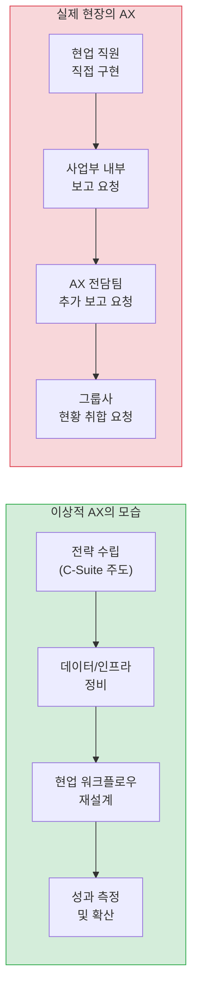
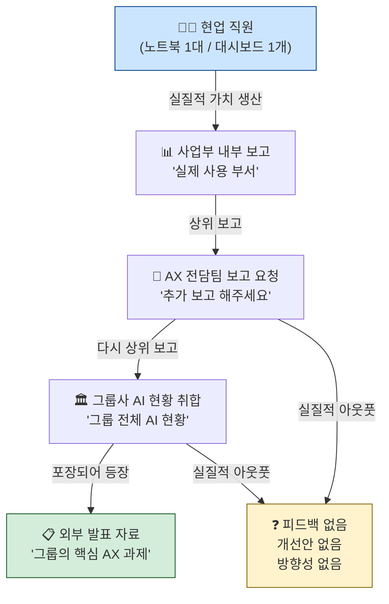
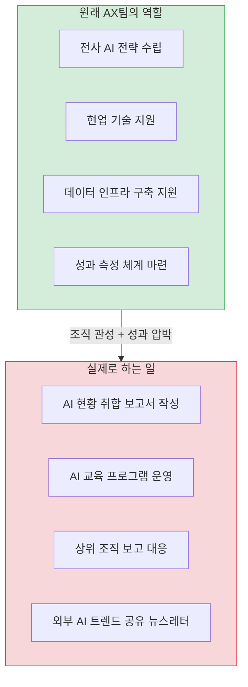
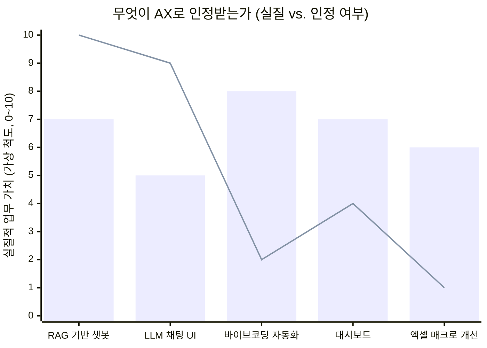
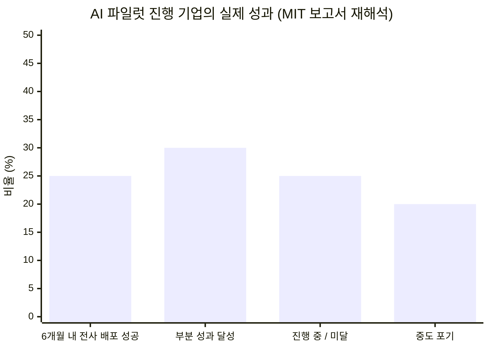
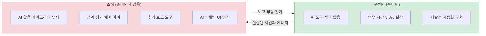
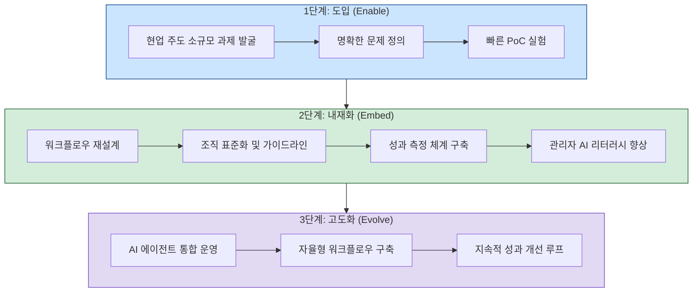
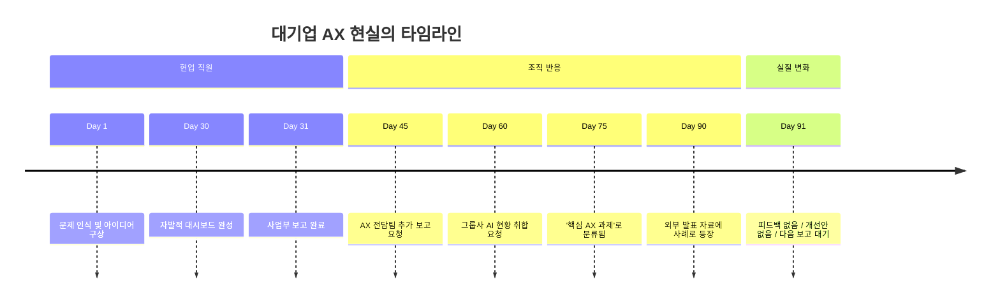

### 보고서의 무게와 노트북 한 대의 무게 사이에서

> *"내 노트북 한 대에서 털털거리며 돌아가는 대시보드가, 회사를 대표하는 '핵심 AI 전환 과제'가 되어 있다."*
> — Threads @orryyyy_pic, 실제 대기업 재직자 경험담 (2025)

> 
> https://www.threads.com/@orryyyy_pic/post/DaK8sPFkmFe
> 
> [모 대기업의 AI도입기]
> 
> 현업에서 작고 소중한 대시보드 하나 직접 작업.
> 
> 사업부 내부 보고 완료.
> 
> AX 전담팀에서 추가 보고 요청.
> 
> 그룹사에서 '그룹 AI 현황' 취합한다고 또 추가 보고.
> 
> 졸지에 과제 하나에 빨대 꽂은 상위 조직만 3곳.
> 
> 이쯤 되니 내 노트북 한 대에서 털털거리며 돌아가는 대시보드가, 회사를 대표하는 '핵심 AI 전환 과제'가 되어 있다.
> 
> 알수없는 회사생활 🤣🤣🤣
> 

---

## 목차

1. [AX란 무엇인가 — 공식 정의와 세상의 기대](#1)
2. [현장에서 AX는 어떻게 시작되는가](#2)
3. [보고의 연쇄 — 과제 하나에 빨대 꽂히는 구조](#3)
4. [AX 전담팀은 무엇을 하는가](#4)
5. [무엇이 'AI'로 인정받는가 — 인정받는 AI와 인정받지 못하는 AI](#5)
6. [AI 파일럿 실패율 통계가 말해주는 것](#6)
7. [준비된 직원, 준비되지 않은 조직 — '전환의 역설'](#7)
8. [진짜 AX는 어떤 모습이어야 하는가](#8)
9. [결론 — 대기업 AX의 아이러니와 앞으로의 과제](#9)

---

## 1. AX란 무엇인가 — 공식 정의와 세상의 기대 {#1}

AX(AI Transformation, 인공지능 전환)는 기업과 조직의 운영 방식 전반을 AI 중심으로 재설계하는 과정을 뜻한다. 기존의 DX(Digital Transformation, 디지털 전환)가 종이 문서와 오프라인 프로세스를 디지털로 전환하는 데 초점을 맞췄다면, AX는 한 단계 더 나아가 AI가 의사결정을 보조하고 업무 방식 자체를 재편하는 것을 목표로 한다. 단순히 특정 도구를 도입하는 것이 아니라 조직의 사고방식, 데이터 구조, 인프라, 사람, 그리고 문화 전체를 AI 중심으로 전환해야 비로소 AX가 완성된다는 것이 공식적인 설명이다.

맥킨지(McKinsey)는 2025년 보고서 *Superagency in the Workplace*에서 AI가 전 세계적으로 최대 4.4조 달러(USD)의 생산성 잠재력을 가지고 있다고 분석했다. 세계경제포럼(WEF)은 2030년까지 전 세계 비즈니스 전환의 약 86%가 AI에 의해 주도될 것이라고 전망한다. 삼성전자 이재용 회장은 2026년 신년사에서 "일하는 방식과 조직 DNA를 송두리째 바꿔야 한다"며 "R&D부터 생산·마케팅·지원 등 모든 업무 밸류체인에 AI를 접목해야 한다"고 선언했다. SK그룹은 "AI의 발전 흐름을 따라잡지 못하면 미래 생존을 담보할 수 없다"는 위기 의식 아래 2026년 뉴 이천포럼의 주제를 'AX(인공지능 전환) 중심 경영으로의 대전환'으로 설정했다.

이처럼 공식 무대에서 AX는 웅장하고, 전략적이며, 생존과 직결된 과제로 묘사된다. 그런데 실제 회사 안에서는 어떤 일이 벌어지고 있을까?

---

## 2. 현장에서 AX는 어떻게 시작되는가 {#2}

2025년 한국의 한 Threads 게시물이 상당한 공감을 얻었다. 모 대기업에 재직 중인 작성자가 공유한 내용은 다음과 같다.

현업 담당자가 스스로 필요성을 느껴 작고 실용적인 대시보드 하나를 직접 만들었다. 특별한 예산도, 외부 컨설팅도 없었다. 노트북 한 대에서 돌아가는 소박한 도구였다. 바로 이 지점이 중요하다. 이 대시보드는 현업의 실제 필요에서 탄생한, 가장 현실에 밀착된 형태의 AI 도입이었다.

그런데 이 작은 성과가 알려지는 순간부터 상황이 달라지기 시작했다. 이 도구는 어느새 조직 계층을 타고 위로 올라가면서 성격이 변해 버렸다.

제조 AX 전문가들이 공통적으로 강조하는 것도 바로 이 지점이다. AX의 실질적인 핵심은 현업 담당자들이 현장의 문제를 정확히 정의하고, 이를 구조화한 뒤 어떤 AI 방법론이 적합한지를 스스로 판단하는 과정이다. 이건 단순한 기술 도입의 문제가 아니라 변화 관리 차원에서 봐야 할 매우 중요한 요소라는 것이 전문가들의 일관된 시각이다.

다시 말해, 현업 직원이 자발적으로 만든 대시보드는 — 거창한 컨설팅 없이도 — AX의 가장 이상적인 출발점이었다. 문제는 그다음에 벌어지는 일이다.

---

## 3. 보고의 연쇄 — 과제 하나에 빨대 꽂히는 구조 {#3}

해당 Threads 게시물에 묘사된 경과는 다음과 같다.

1. 현업에서 작고 소중한 대시보드 하나를 직접 작업한다.
2. 사업부 내부 보고를 완료한다.
3. AX 전담팀에서 추가 보고를 요청한다.
4. 그룹사에서 '그룹 AI 현황'을 취합한다며 또 추가 보고를 요청한다.

결과적으로 과제 하나에 상위 조직 세 곳이 빨대를 꽂은 셈이다. 댓글에는 더 심한 사례도 등장했다. 센터에서 취합, 취합 담당이 또 취합, 취합 본부에서 취합, 취합 TFT에서 취합, ICT에서 다시 취합. 계층마다 같은 정보가 다시 포장되어 올라가는 것이다.

이 보고 연쇄가 생겨나는 이유는 어느 정도 이해할 수 있다. 그룹 차원에서 AI 전환 현황을 파악하는 일 자체는 필요하다. 각 사업부에 흩어진 AI 활용 사례를 취합해 전략적 방향을 잡고 자원을 배분하는 것은 경영진의 역할이기 때문이다. 문제는 그 취합이 '전략적 의사결정'으로 이어지지 않고 '취합을 위한 취합'으로 끝날 때 발생한다.

AX 전담팀도 그들 나름의 상위 조직에 보고해야 하는 구조 속에 있다. 한 댓글 작성자는 "그쪽에서도 내부 보고를 또 하고 별도의 상위 조직에 보고를 또 하고... 그들의 입장도 이해가 됩니다"라고 말했다. 모두가 구조의 피해자인 동시에 구조의 구성 요소가 되는 셈이다.

맥킨지 역시 기업의 90%가 AI 기술에 투자하지만 실제 재무적 성과를 거둔 기업은 40% 수준에 머무는 이유로 '전체 업무 흐름(Workflow)의 재설계 실패'를 꼽은 바 있다. 워크플로우를 바꾸지 않고 도구만 들여오거나 보고서만 쌓아 올리는 것은 진정한 AX가 아니다.

---

## 4. AX 전담팀은 무엇을 하는가 {#4}

Threads 게시물의 댓글 교환에서 흥미로운 증언이 나왔다. AX 전담팀이 개선안도 없고 방향성도 없이 "약간 교육 & 보고 팀" 성격을 가진다는 것이다.

이는 단순히 특정 기업의 문제가 아니라 한국 대기업 전반의 구조적 특성과 연결된다. AX 전담팀의 역할은 일반적으로 세 가지 방향으로 설계될 수 있다.

첫째는 **전략 설계형**이다. 전사 AI 도입 로드맵을 설계하고, 각 사업부의 우선순위를 조율하며, 외부 기술 동향을 내부 전략으로 번역하는 역할을 한다. 둘째는 **현장 지원형**이다. 현업 팀이 AI 도구를 실제 업무에 적용할 수 있도록 기술적·방법론적 지원을 제공하는 역할이다. 셋째는 **교육·보고형**이다. AI 관련 교육을 주관하고, 경영진에 제출할 현황 보고서를 취합·작성하는 역할에 집중한다.

문제는 많은 경우 AX 전담팀이 처음에는 첫 번째나 두 번째 역할을 지향하지만, 실제 운영 과정에서 세 번째 역할로 수렴되는 경향이 있다는 점이다. 경영진은 가시적 성과를 빠르게 보고 싶고, 현황 보고서는 가장 빠르게 만들 수 있는 '성과물'이다. 현장에 내려가 실질적인 변화를 만드는 일은 시간이 걸리고 성공을 보장할 수 없다.

이 현상은 한국에서만 나타나는 것이 아니다. KT가 2025년 11월 개최한 'AX Insight 세미나'에서도 비슷한 진단이 나왔다. "AI 도입을 고민 중"이거나 "파일럿은 성공했는데 확산이 어렵다"는 기업들이 가장 많다는 것이다. 소프트뱅크는 이 문제를 해결하기 위해 'AX Lab'에서 그룹 내부 검증을 철저히 진행한 뒤 내부 효과가 확인된 솔루션만 산업 파트너로 확장하는 전략을 채택했다. 시범 운영의 성과를 먼저 내부에서 검증하고 그다음에 확산한다는 원칙이다.

---

## 5. 무엇이 'AI'로 인정받는가 — 인정받는 AI와 인정받지 못하는 AI {#5}

Threads 게시물의 댓글 중 특히 날카로운 관찰이 하나 있었다.

> "우리 회사는 오직 RAG만 인정. 바이브 코딩으로 웹스크래퍼 자동화 만들어 놨더니 이건 코딩이라 AX가 아니래."

그리고 이에 대한 답글도 인상적이었다.

> "결과물에 AI 채팅 UI 하나 붙여주면 다 AI가 되더라구요?! ㅋㅋ"

이 짧은 교환은 대기업 AX의 핵심 모순을 짚어낸다. '무엇이 AI인가'에 대한 기준이 기술적 실질보다 형식적 겉모습에 맞춰지는 현상이다. 실제로 업무 효율을 올리는 웹스크래퍼 자동화 도구는 'AI가 아니라 코딩'으로 분류되는데, 같은 기능에 채팅 인터페이스만 붙이면 갑자기 'AI 과제'가 된다.

> **막대**: 실질적 업무 가치 / **선**: 대기업 AX 인정도 (가상 시나리오, 실제 조직마다 다름)

이 현상이 나타나는 이유는 AX 전담팀과 경영진이 AI를 기술적 기능이 아닌 '형태'로 판단하기 때문이다. 채팅창이 있으면 AI처럼 보인다. 자연어로 질문하고 자연어로 답이 나오면 인상적으로 보인다. 반면 Python 스크립트로 자동화한 데이터 수집 파이프라인은 화면에 띄워 보여주기가 어렵고, 보고서에 쓰기도 애매하다.

RAG(검색 증강 생성, Retrieval-Augmented Generation)에 대한 집착도 비슷한 맥락에서 이해할 수 있다. RAG는 대규모 언어 모델(LLM)에 기업 내부 문서를 연결해 더 정확한 답변을 생성하는 기술이다. 이것은 분명히 의미 있는 기술이다. 2026년 현재 국내 대기업들 사이에서 RAG는 "AI 도입의 정석"처럼 자리 잡았다. 사내 보안 문서만을 정밀하게 참조해 오답을 줄이는 RAG 기술이 국내 대기업들의 사내 생성형 AI 도입 방식의 핵심으로 안착하고 있다는 보도도 있다. 문제는 RAG만 AI로 인정하고 다른 형태의 자동화나 AI 활용은 평가절하하는 협소한 시각이다.

보고서 작성이 용이한 기술이 '공인 AI'가 되고, 실제로 업무를 개선하지만 설명하기 어려운 기술은 AI로 인정받지 못하는 현실. 이것이 대기업 AX의 또 다른 민낯이다.

---

## 6. AI 파일럿 실패율 통계가 말해주는 것 {#6}

2025년 한 해 동안 "기업 AI 프로젝트의 95%가 실패한다"는 통계가 한국은 물론 전 세계 언론과 기술 분석가들 사이에서 널리 인용되었다. 이 수치는 MIT 미디어랩 산하 NANDA 이니셔티브가 2025년 7월에 발표한 보고서 *The GenAI Divide: State of AI in Business 2025*에서 나온 것으로, 300건 이상의 공개 AI 프로젝트, 150명 이상의 기업 경영진 인터뷰, 350명의 직원 설문조사를 종합한 결과였다.

그런데 2026년 4월 28일, 비영리 연구 단체 80,000 Hours가 이 통계에 중요한 오독이 있었음을 지적했다. 설문 대상 기업 중 80%는 애초에 맞춤형 AI 파일럿 프로젝트를 시도조차 하지 않았는데, 그 기업들까지 포함한 전체 모수에서 '성공한 기업 비율'을 계산하면서 5%라는 극단적으로 낮은 수치가 도출되었다는 것이다.

실제로 AI 파일럿을 진행한 기업들만을 대상으로 하면, 매우 엄격한 성공 기준(6개월 이내 전사 배포, 측정 가능한 ROI 달성)에도 불구하고 25%가 기준을 충족했다. 또한 전체 응답 기업 직원의 90% 이상이 이미 ChatGPT와 같은 AI 도구를 업무에 정기적으로 활용하고 있었다.

이 수정된 해석이 중요한 이유는 두 가지다.

첫째, "AI는 95% 실패한다"는 메시지가 대기업 경영진에게 전달되면, 적극적인 현장 실험을 억제하는 방어적 보고 문화를 강화한다. "어차피 실패율이 높으니 작은 실험보다는 안전한 컨설팅 보고서부터"라는 논리가 힘을 얻는다.

둘째, 대기업의 경우 파일럿을 실제로 진행하더라도 성공까지 최소 9개월 이상이 걸렸다. 중견기업은 평균 90일 안에 파일럿 프로젝트를 상용 환경으로 이전할 수 있었던 것과 대조적이다. 대기업일수록 의사결정 계층이 많고 보안·법무·IT 인프라 검토가 복잡하기 때문이다. 다시 말해, 대기업의 AX가 느린 것은 AI 기술의 문제가 아니라 조직 구조의 문제다.

S&P Global에 따르면 2025년에 기업의 42%가 AI 프로젝트를 중도 포기했는데, 이는 전년 대비 두 배 이상 증가한 수치다. 문제의 근본은 기술 부족이 아니라 전략의 혼선이었다. 경영진이 "고객 서비스를 개선하기 위해 챗봇을 만들어라"라고 지시하지만 명확한 비즈니스 목표가 없는 경우가 대부분이었다. "경쟁사도 하니까", "경영진이 하라고 하니까" 같은 이유로 시작된 AI 프로젝트는 방향을 잃기 쉽다.

---

## 7. 준비된 직원, 준비되지 않은 조직 — '전환의 역설' {#7}

한국 마이크로소프트(MS)가 발표한 '업무동향지표 2026'은 이 현상에 '전환의 역설(Transformation Paradox)'이라는 이름을 붙였다. 직원들은 AI를 빠르게 업무에 가져오고 있지만, 조직 문화와 평가 체계, 관리자의 지원은 여전히 변화 속도를 따라가지 못한다는 것이다.

이 역설은 Threads 게시물의 상황과 정확히 겹친다. 현업 직원(준비된 개인)은 스스로 대시보드를 만들었다. 그런데 조직(준비되지 않은 구조)은 그 성과를 실질적으로 확산하거나 개선하는 대신 보고 자료로 소비했다.

MS 조사에 따르면 관리자가 AI 활용 방식을 직접 시연하는 조직에서는 AI 가치 체감이 17%p, AI 출력물에 대한 비판적 점검은 22%p, 에이전틱 AI에 대한 신뢰는 30%p 높게 나타났다. 즉 AX의 성패는 AI 도구 자체가 아니라 관리자와 조직이 그 도구를 어떻게 다루느냐에 달려 있다.

한국은행 조사국이 발표한 실증 분석에서도 비슷한 현상이 확인되었다. 국내 근로자의 생성형 AI 활용률이 51%를 넘어섰으며, 이로 인해 평균 업무 시간이 약 3.8% 감소하는 효율성 개선 효과가 있었다. 그런데 보고서는 AI가 아껴준 시간이 기업의 실제 업무 처리량이나 최종 산출물 증가로 이어지지 못하는 'AI 생산성 단절 현상'이 발생하고 있다고 지적했다.

시간을 아꼈는데 성과가 늘지 않는다. 왜일까? 아낀 시간을 보고서 작성에 쓰고 있기 때문일 수도 있다.

CIO Korea가 2025년 10~11월에 884개 기업을 대상으로 진행한 조사에서 한국 기업의 AI 도입 속도는 글로벌 평균 대비 7배 빠른 것으로 나타났다. 빠른 도입은 단기 경쟁력이 될 수 있다. 그러나 "도입했지만 전사 성숙이 53.9%에 머문 상태"라는 분석도 함께 나왔다. 달리기는 빠른데 방향을 확인하지 않고 달리는 것과 비슷한 상황이다.

중견기업이 반복해서 빠지는 실패 패턴으로는 "대기업 복사 / PoC 수집가 / 벤더 전면 위탁" 세 가지가 꼽힌다. 흥미롭게도 이 중 '대기업 복사'가 있다. 즉, 대기업의 AX 방식이 업계 전반에 복사되는데, 그 방식 자체가 이미 문제를 안고 있을 수 있다.

---

## 8. 진짜 AX는 어떤 모습이어야 하는가 {#8}

GS칼텍스 사례는 참고할 만하다. GS칼텍스는 'DT DAY(Deep Transformation Day)'를 운영하며 구성원이 직접 추진한 DAX 사례를 공유하고 체험하는 자리를 만들었다. 생산본부는 전기설비 운영·관리 업무를 지원하는 '전기설비 스마트 어시스턴트'를 제안했고, C&L본부는 마켓 데이터 보고 자료를 더 빠르고 명확하게 제작하기 위한 보고 장표 시각화 과제를 다뤘다. 서로 다른 업무 영역이지만 공통점은 분명했다. '문서를 더 잘 쓰는 AI'가 아니라, 업무를 더 빠르게 연결하고 실행 단위로 전환하는 AI 활용에 초점을 맞췄다는 것이다.

KPMG는 AX 추진을 위한 '도입(Enable)–내재화(Embed)–고도화(Evolve)' 프레임워크를 제안했다. 단순 도입에서 시작해 조직 전반에 AI가 녹아드는 내재화 단계를 거쳐, 그 다음에야 고도화로 나아간다는 것이다. 이 프레임워크에서 핵심은 '내재화' 단계다. 도입도 아니고 고도화도 아닌, 그 사이에 있는 체질 변화의 단계.

진짜 AX를 위한 조건을 정리하면 다음과 같다.

**첫째, 보고 목적의 AI와 사용 목적의 AI를 구분해야 한다.** 보고서에 잘 담기는 AI 프로젝트와 실제 업무에서 매일 쓰이는 AI 도구는 다르다. 조직은 후자를 더 많이 지원해야 한다.

**둘째, AX 전담팀은 교육·보고팀이 아닌 현장 지원팀이어야 한다.** 현업 팀이 자체적으로 AI를 실험하고 배포할 수 있도록 기술적·방법론적 지원을 제공하는 것이 AX 전담팀의 핵심 역할이어야 한다. 피드백도, 개선 방향도 없는 보고 취합은 조직의 에너지를 소진시킨다.

**셋째, 'AI의 형태'보다 '문제 해결 여부'로 평가해야 한다.** RAG 챗봇이든, Python 자동화 스크립트든, 바이브 코딩으로 만든 웹스크래퍼든, 실제 업무 효율을 높였다면 그것이 AX다. 채팅 UI가 없다고 AI가 아닌 것이 아니다.

**넷째, 보고의 수를 줄이고 피드백의 질을 높여야 한다.** 상위 조직의 취합 요청이 아래로 흘러내려올 때, 그것이 실질적인 피드백과 개선 자원을 함께 가져오지 않는다면 오히려 해가 된다.

**다섯째, 작은 성공을 빠르게 확산하는 구조가 필요하다.** 현업 직원이 노트북 한 대로 만든 대시보드가 가치 있다면, 그것을 조직 전체로 확산할 방법을 찾아야 한다. 보고서 안에 가두는 것이 아니라.

---

## 9. 결론 — 대기업 AX의 아이러니와 앞으로의 과제 {#9}

Threads 게시물 원작자가 마지막에 붙인 말이 모든 것을 압축한다. "알 수 없는 회사생활 🤣🤣🤣"

이 웃음 뒤에는 아이러니가 있다. 가장 실질적인 AX는 이미 현장에서 일어나고 있다. 현업 직원들은 자발적으로 AI를 배우고, 도구를 만들고, 실험한다. 문제는 조직이 그 에너지를 생산적으로 증폭시키는 대신 보고 체계 안에 가두어 버린다는 것이다.

삼성·SK·LG·현대차 등 국내 주요 대기업들이 AX를 핵심 경영 과제로 선언하고 있는 지금, 역설적으로 AX에서 가장 어려운 부분은 기술이 아니다. 조직 관성, 보고 문화, 성과 평가 체계, 그리고 무엇이 'AI'인지에 대한 협소한 정의가 진짜 장벽이다.

한국은행 데이터가 보여주듯 직원들이 AI로 시간을 아끼기 시작했는데 그 시간이 추가 보고를 위해 다시 소비된다면, 진정한 AX는 일어나지 않고 있는 것이다.

대기업에서 진짜 AX를 한다는 것은 어쩌면 가장 단순한 것부터 시작해야 한다. 현업 직원이 만든 작고 소중한 도구에 보고를 요구하기 전에 먼저 한 가지 질문을 던지는 것이다.

*"이게 잘 되려면 우리 조직이 무엇을 바꿔야 하는가?"*

---

## 참고 자료

- Threads @orryyyy_pic, 모 대기업 AI 도입기 (2025, 직접 인용)
- McKinsey & Company, *Superagency in the Workplace* (2025)
- MIT NANDA Initiative, *The GenAI Divide: State of AI in Business 2025* (2025.07)
- 80,000 Hours, *AI doesn't work – the story behind the stat that misled millions* (2026.04.28)
- KPMG 한국, *AX를 통한 가치 창출 전략 시리즈* (2025.12)
- 한국 마이크로소프트, *업무동향지표 2026* (2026)
- KT Enterprise, *AX Insight 세미나 정리* (2025.11)
- CIO Korea, *한국 기업 AI 성숙도 조사* (2025.10~11, n=884)
- 파이낸셜뉴스, *재계 AX 가속도 기사* (2026.06)
- GS칼텍스 미디어허브, *트렌드 코리아 2026: AX 조직 키워드* (2026.03)
- 한국은행 조사국, *생성형 AI 활용률 및 업무 효율성 실증 분석* (2026)

---

*작성일: 2026년 6월 30일*

*본 문서는 공개된 SNS 게시물, 학술/산업 보고서, 언론 기사에 기반하며, 추측성 서술을 배제하고 확인된 사실과 검증 가능한 사례만을 담았습니다.*
