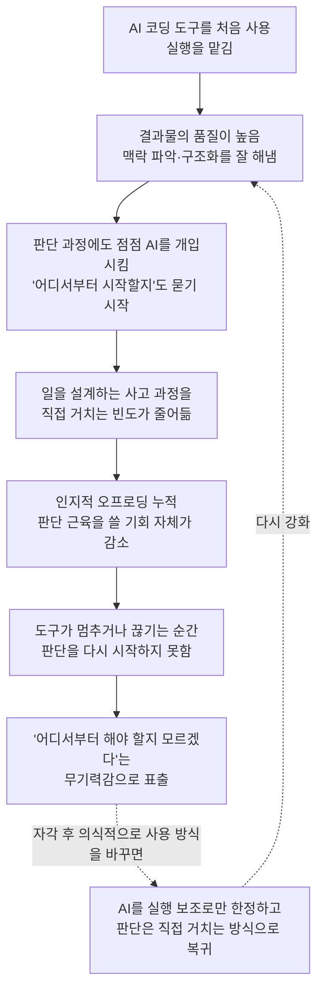

- 원문 출처: Threads, [@portpapa_dev](https://www.threads.com/@portpapa_dev/post/DaM3BgMiqJh), 2026
- 해설 작성일: 2026년 6월 30일

> https://www.threads.com/@portpapa_dev/post/DaM3BgMiqJh
> 
> 클로드코드가 끊기고 알았다.
> 
> 나는 코딩만 맡긴 게 아니라 생각하는 것까지 맡기고 있었다.
> 
> 회사 일 하나 시작하려 해도
> 
> 어디서부터 해야 할지 모르겠고,
> 
> 사이드프로젝트를 열어도 손이 안 움직인다.
> 
> AI 덕분에 빨라진 줄 알았는데
> 
> 어쩌면 스스로 생각하는 근육부터 빠지고 있었던 걸지도 모른다.
> 

 

---

## 1. 원문이 말하고 있는 것

이 글은 길지 않다. 네 줄짜리 짧은 글이지만, 구조를 뜯어보면 하나의 작은 깨달음의 서사로 이루어져 있다.

첫 줄에서 글쓴이는 "클로드코드가 끊기고 알았다"고 말한다. 평소처럼 쓰던 클로드코드가 어떤 이유로든 멈추거나 끊긴 순간, 본인도 몰랐던 사실을 깨달았다는 뜻이다. 그 깨달음의 내용이 두 번째 줄에 나온다. "나는 코딩만 맡긴 게 아니라 생각하는 것까지 맡기고 있었다." 여기가 이 글의 핵심이다. 단순히 "AI가 코드를 대신 짜준다"는 차원이 아니라, 어떤 작업을 어떻게 시작하고, 어떤 순서로 풀어가고, 무엇을 먼저 해야 할지를 판단하는 과정 자체를 AI에게 넘기고 있었다는 자각이다.

세 번째 단락은 그 결과로 나타난 구체적인 증상을 보여준다. "회사 일 하나 시작하려 해도 어디서부터 해야 할지 모르겠고, 사이드프로젝트를 열어도 손이 안 움직인다." 이건 단순한 게으름이나 무기력이 아니라, 일을 쪼개고 우선순위를 매기는 사고 자체가 무뎌졌다는 신호로 읽힌다. 클로드코드가 옆에 있을 때는 "이거 해줘"라고만 던지면 알아서 구조를 잡아 줬는데, 그 손이 사라지자 정작 본인은 어디서부터 손을 대야 할지 막막해진 상태가 된 것이다.

마지막 줄은 자기 진단이다. "AI 덕분에 빨라진 줄 알았는데 어쩌면 스스로 생각하는 근육부터 빠지고 있었던 걸지도 모른다." 속도가 빨라졌다고 믿었던 것이 사실은 사고 능력의 위축과 맞바꾼 결과일 수 있다는, 다소 불편하지만 솔직한 자기 성찰로 글이 끝난다.

요약하면 이 글은 "AI 코딩 도구에 너무 의존한 나머지, 코딩 실행력뿐 아니라 일을 설계하고 시작하는 사고력 자체가 약해진 것 같다"는 한 사용자의 개인적 체험담이자 경고다.

---

## 2. 왜 "코딩 위임"과 "사고 위임"은 다른가

이 구분이 글 전체에서 가장 중요한 지점이므로 먼저 짚고 넘어갈 필요가 있다.

코딩을 맡긴다는 것은 "이 함수를 짜줘", "이 버그를 고쳐줘"처럼 이미 무엇을 해야 하는지는 사람이 정해 놓은 상태에서 실행만 AI에게 넘기는 것이다. 반면 사고를 맡긴다는 것은 "이 프로젝트를 어떻게 시작해야 할지", "무엇부터 손대야 효율적일지", "이 구조가 맞는 방향인지"를 판단하는 과정 자체를 AI에게 넘기는 것을 말한다.

클로드코드 같은 에이전틱 코딩 도구는 단순한 자동완성기를 넘어, "이 방향으로 해줘"라는 한 줄짜리 지시만으로도 스스로 작업을 구조화하고 맥락을 읽어 실행하는 능력을 갖추고 있다. 바로 이 능력 때문에 사용자는 처음에는 편리함을, 다음에는 감탄을, 그다음에는 의존을 느끼게 된다. 이 흐름은 우연이 아니라 비슷한 도구를 오래 써 본 여러 사용자들이 공통으로 보고하는 경로다. 실제로 ERP 시스템을 AI로 구축하며 클로드코드와 다른 코딩 도구들을 비교 사용해 본 한 개발자는, 클로드코드가 단순히 코드를 잘 짜는 수준을 넘어 작업의 큰 그림과 맥락을 스스로 읽어내는 점에서 다른 도구들과 체감 차이가 크다고 기록한 바 있다. 그는 이 과정을 "처음에는 편했다. 그다음에는 감탄했다. 그리고 그다음에는 의지하게 됐다"는 세 단계로 정리했다.

문제는 바로 이 지점에서 시작된다. 실행을 잘 도와주는 도구가 어느 순간 "일을 어떻게 풀어갈지"까지 알아서 정해 주기 시작하면, 사용자는 그 판단 과정에 점점 관여하지 않게 된다. 판단에 관여하지 않는 시간이 길어질수록, 막상 그 판단을 직접 해야 하는 순간이 왔을 때 무엇부터 해야 할지 막막해지는 것은 자연스러운 결과에 가깝다.

---

## 3. 비슷한 경험을 토로하는 사람들: 혼자만의 이야기가 아니다

이 게시물이 보여주는 감정과 거의 동일한 패턴을 보고하는 글이 또 있다. 2026년 4월 말 브런치에 게시된 "클로드가 멈추자, 사람들은 왜 이렇게 느낄까?"라는 에세이는, 클로드 서비스에 장애가 발생했을 때 커뮤니티에서 쏟아진 반응을 분석하면서 거의 같은 결론에 도달한다.

이 글의 저자는 클로드가 멈췄을 때 사람들이 단순히 "도구 하나가 잠깐 안 되는" 정도로 받아들이지 않고 "손발이 잘린 기분", "갑자기 아무것도 못 하는 사람이 된 것 같은 허탈감"을 느낀다고 지적한다. 특히 바이브코딩을 하거나 클로드를 기준으로 작업 흐름 전체를 짜 놓은 사람일수록 이 체감이 크다고 설명한다. 저자 본인도 클로드 코드에 점점 더 깊이 의지하게 된 경험을 직접 서술하면서, "더 잘하니까 더 맡기게 되고, 더 맡기니까 더 의지하게 되고, 더 의지하니까 다른 모델로 넘어가는 것이 어려워진다"는 의존의 악순환을 짚었다.

흥미로운 점은 이 저자가 내놓은 해법이다. 그는 이후 작업을 하나의 모델에만 걸지 않고, 코딩·분석·일부 작업을 서로 다른 모델과 로컬 LLM으로 분산시키는 방식으로 구조를 바꿨다고 한다. 그 결과 같은 종류의 서비스 장애를 다시 겪었을 때는 예전 같은 무력감을 느끼지 않았다고 적었다. 그가 내린 결론은 "최고의 모델 하나에 종속되지 않는 노력을 해야 한다"는 것이었다.

이 두 글—@portpapa_dev의 짧은 고백과 브런치의 긴 에세이—을 나란히 놓고 보면, 한 사람만의 특이한 경험이 아니라 클로드코드를 깊이 쓰는 사용자 집단에서 비교적 공통적으로 나타나는 현상임을 알 수 있다. 다만 두 글의 강조점은 조금 다르다. @portpapa_dev의 글은 "사고력 자체가 빠지고 있다"는 인지적 측면에 집중하는 반면, 브런치 에세이는 "특정 도구에 작업 인프라 전체가 종속된다"는 구조적 측면에 더 무게를 둔다. 두 관점은 상호 보완적이며, 함께 읽을 때 현상을 더 입체적으로 이해할 수 있다.

---

## 4. "끊김"은 실제로 늘어났는가: 확인된 배경 사실

이 글에서 "끊기고"라는 표현이 정확히 어떤 사건을 가리키는지는 원문만으로는 알 수 없다. 다만 클로드코드 사용자들이 최근 들어 작업이 끊기는 경험을 더 자주 보고하게 된 배경에는 몇 가지 확인 가능한 사실이 있다.

첫째, 2026년 5월 14일 Anthropic은 구독 과금 구조를 대대적으로 개편한다고 발표했고, 이는 2026년 6월 15일부터 시행됐다. Agent SDK, `claude -p` 명령, Claude Code의 GitHub Actions, 그리고 OpenClaw·Conductor·Zed 등 서드파티 에이전트 애플리케이션이 기존 구독 사용량 풀에서 분리되어 별도로 과금되는 "에이전트" 풀로 이전됐다. 이는 기존에 구독 한도 안에서 자유롭게 쓰던 사용 패턴 일부가 더 이상 같은 방식으로 작동하지 않게 됐다는 뜻이다.

둘째, Claude 사용량 한도 정책은 출시 이후 여러 차례 바뀌어 왔다. 2024년 3월 연구 프리뷰로 시작한 이후 2025년 6월 Pro 플랜에 포함, 2025년 8월 주간 한도 도입, 2025년 11월 Max 플랜 신설, 2026년 4월 서드파티 도구 사용 제한 등으로 이어지는 변화가 있었다. 이런 정책 변화는 그 자체로는 "장애"가 아니지만, 사용자 입장에서는 작업 도중 갑자기 한도에 막혀 작업 흐름이 끊기는 경험으로 체감되는 경우가 많다.

셋째, Claude Code의 공식 문서에서도 사용량 제한과 길이 제한이라는 두 종류의 제한이 별도로 존재한다고 설명하고 있으며, 집중적으로 작업할 경우 5시간 단위로 설정된 사용량 한도에 비교적 쉽게 도달할 수 있다는 점을 여러 사용자 후기에서 확인할 수 있다.

이런 사실들을 종합하면, 글쓴이가 겪은 "끊김"이 정확히 서비스 장애였는지, 사용량 한도였는지, 혹은 다른 개인적인 사정이었는지는 원문만으로 단정할 수 없다. 다만 분명한 것은, 클로드코드의 과금·한도 구조가 최근 몇 달 사이 여러 차례 바뀌면서 사용자들이 예상치 못한 시점에 작업이 끊기는 경험을 더 자주 보고하게 된 환경적 배경은 실제로 존재한다는 점이다.

---

## 5. 검증된 연구: AI 의존이 실제로 사고력을 떨어뜨리는가

**MIT 미디어랩의 뇌파(EEG) 연구.** 2025년 발표된 이 연구는 참가자들에게 LLM을 활용해 에세이를 작성하게 한 뒤 뇌 활동을 측정했다. 세 차례 연속으로 LLM을 사용한 참가자들이 네 번째 세션에서 도구 없이 글을 쓰게 했을 때, 이들의 뇌 연결성은 이전 세션들과 비교해 낮은 수준을 계속 유지했고, 특히 시각적 통합과 주의 집중에 관련된 알파·베타 파형 활동이 뚜렷하게 약화된 것으로 나타났다. 반대로 처음에 도구 없이 작업하다가 나중에 LLM을 사용한 그룹은 오히려 기억 회상률이 높아지고 뇌의 여러 부위가 다시 활성화되는 모습을 보였다. 이는 외부 도구를 쓰더라도, 그 전에 스스로 사고해 본 경험이 있는지 여부가 인지적 참여도에 영향을 준다는 것을 시사한다.

**Gerlich의 666명 대상 연구.** 다양한 연령과 교육 배경을 가진 666명을 설문과 심층 인터뷰로 조사한 이 연구에서는, AI 도구를 가장 많이 쓰는 연령대가 젊은층이었던 반면, 비판적 사고 점수는 오히려 이들 젊은층에서 더 낮게 나타났다. 연구진은 인지 활동을 AI에 맡기는 습관이 누적될수록 기억 유지나 비판적 분석 같은 핵심 인지 능력의 저하로 이어진다고 설명했다.

**지식 근로자 319명 설문조사.** 생성형 AI를 주 1회 이상 업무에 활용하는 지식 근로자 319명을 대상으로 한 별도 조사에서는, 응답자들이 AI를 사용하면서 인지 활동에 들이는 노력이 확연히 줄었다고 답했다. 같은 분석에서는 AI 의존도와 비판적 사고 사이의 상관계수가 -0.68로 나타나, AI 의존도가 높을수록 비판적 사고 수준이 뚜렷하게 낮아지는 경향이 확인됐다.

**"AI 유도 인지 위축(AI-induced cognitive atrophy)" 개념.** 최근 일부 연구는 이런 현상을 아예 별도의 용어로 규정하고 있다. 이는 단순한 비유가 아니라, 반복적으로 AI에 사고를 맡기는 습관이 누적되면 마치 쓰지 않는 근육처럼 인지 능력 자체가 약화될 수 있다는 점을 가리키는 학술적 표현이다.

이 연구들을 종합하면, @portpapa_dev가 표현한 "생각하는 근육부터 빠지고 있는 것 같다"는 직관은 비유적 표현을 넘어 실제 연구 결과와 상당 부분 일치한다고 볼 수 있다.

---

## 6. 중요한 반전: 모든 AI 사용이 사고력을 죽이는 것은 아니다

다만 이야기를 한쪽으로만 몰아가는 것은 정확하지 않다. 최근 발표된 또 다른 연구는 더 균형 잡힌 그림을 보여준다.

고등교육 현장에서 생성형 AI가 학생들의 비판적·창의적 사고에 미치는 영향을 분석한 연구에 따르면, 결과는 AI를 어떻게 쓰느냐에 따라 완전히 갈렸다. 질의 지향적이고 체계적으로 설계된 수업 환경에서 AI를 사용한 경우에는 오히려 메타인지(자신의 생각 과정을 반성하고 조절하는 능력), 논리적 추론, 아이디어 생성 능력이 향상되는 결과가 나타났다. 반면 아무런 구조적 가이드 없이 AI를 자유롭게 사용한 경우에는 창의성은 다소 향상되더라도 비판적 사고는 제자리걸음이거나 오히려 떨어지는 모순된 패턴이 관찰됐고, 두 영역 모두 하락하는 사례도 확인됐다.

이 결과가 의미하는 바는 분명하다. 문제의 본질은 "AI를 쓰느냐 마느냐"가 아니라 "AI를 어떤 방식으로 쓰느냐"에 있다. AI가 답을 일방적으로 내놓고 사용자가 그것을 그대로 받아들이는 사용 방식은 인지적 참여를 떨어뜨리지만, 사용자가 AI와 함께 질문을 던지고, 그 결과를 검토하고, 스스로 판단을 내리는 과정을 거치는 사용 방식은 오히려 사고력을 강화할 수 있다는 것이다.

---

## 7. 인지적 외주화가 작동하는 방식

이 현상이 누적되는 과정을 단계별로 정리하면 다음과 같다.

이 흐름에서 핵심은 D와 E 단계다. AI가 실행을 도와주는 것 자체는 문제가 아니다. 문제는 "어떻게 할지 판단하는 과정"까지 반복적으로 AI에게 넘기면서, 그 판단 근육을 쓸 기회 자체가 줄어드는 데 있다. 이는 마치 평소에 계단을 안 쓰고 엘리베이터만 타다가, 어느 날 엘리베이터가 멈췄을 때 평소보다 계단이 훨씬 힘들게 느껴지는 것과 비슷한 구조다.

---

## 8. 구조화된 사용과 무방비한 사용의 차이

앞서 6장에서 다룬 연구 결과를 바탕으로, AI 코딩 도구를 쓰는 방식을 두 축으로 나누어 비교하면 다음과 같다.

| 구분 | 무방비한 위임형 사용 | 구조화된 협업형 사용 |
|---|---|---|
| 작업 시작 방식 | "이거 해줘"로 시작 전체를 AI에 위임 | 본인이 목표·우선순위를 먼저 정리한 뒤 AI에 요청 |
| AI 결과물 처리 | 결과를 그대로 받아들이고 다음 단계로 넘어감 | 결과를 검토하고 왜 그렇게 짰는지 스스로 확인 |
| 판단의 주체 | 점차 AI 쪽으로 이동 | 사람이 계속 보유, AI는 실행을 보조 |
| 도구가 멈췄을 때 | 무엇부터 해야 할지 막막함 | 다소 불편하지만 작업 재개 가능 |
| 장기적 인지 효과 | 비판적 사고·메타인지 저하 경향 | 메타인지·추론 능력 향상 경향 |

이 표는 "AI를 쓰지 말라"는 결론으로 이어지지 않는다. 오히려 AI를 계속 깊이 활용하면서도 판단의 주체를 사람 쪽에 남겨 두는 사용 습관을 의식적으로 설계해야 한다는 결론으로 이어진다.

---

## 9. 하네스 엔지니어링 관점에서 본 이 현상

에이전틱 AI 코딩의 구조를 설명할 때 흔히 쓰이는 "하네스 엔지니어링(Harness Engineering)" 프레임으로 이 현상을 다시 들여다보면 더 선명해진다. 이 프레임은 AI가 흡수할 수 있는 영역과, 끝까지 인간이 쥐고 있어야 하는 영역을 층위별로 구분한다. 그중에서도 다음 두 층위가 특히 인간의 영역으로 남아 있어야 한다고 보는 시각이 있다.

- **맥락·도메인 지식 층위**: 이 일이 왜 필요한지, 어떤 제약 조건 속에 있는지에 대한 배경 이해.
- **생애주기 판단 층위**: 지금 이 시점에 무엇을 먼저 해야 하는지, 이 방향이 전체 그림에서 맞는지를 결정하는 판단.

---

## 10. 실질적으로 무엇을 바꿀 수 있는가

이 글과 관련 자료들을 종합하면, 다음과 같은 실천적 시사점을 끌어낼 수 있다.

작업을 시작하기 전, AI에게 "어떻게 할지"를 묻기 전에 먼저 본인이 손으로든 머리로든 한 번 구조를 그려 보는 짧은 습관을 들이는 것이 도움이 된다. 이미 머릿속에 그림이 있는 상태에서 AI에게 검증이나 보완을 요청하는 것과, 처음부터 백지 상태로 AI에게 통째로 맡기는 것은 결과물이 비슷해 보여도 사고 과정에 미치는 영향이 다르다.

또한 하나의 도구나 모델에만 작업 흐름 전체를 의존하지 않는 것도 의미가 있다. 브런치 에세이의 저자가 보여준 것처럼, 여러 도구를 분산해서 쓰는 구조를 만들어 두면 특정 도구가 멈추더라도 작업 전체가 정지하는 경험을 줄일 수 있다.

마지막으로, AI가 내놓은 결과물을 그대로 받아들이기보다 "왜 이렇게 했는지"를 한 번 더 확인하는 습관은 앞서 살펴본 연구에서 메타인지와 비판적 사고를 지켜내는 핵심 요인으로 반복해서 등장한다. 결과를 빠르게 받는 것과, 그 결과가 왜 맞는지를 이해하는 것은 서로 다른 일이다.

---

## 11. 강의·세미나에서 활용할 수 있는 토론 포인트

이 글을 교육 자료로 활용한다면 다음과 같은 질문들이 토론을 끌어내기 좋다.

첫째, "코딩을 맡기는 것"과 "생각을 맡기는 것"의 경계는 실제로 어디에 있는가. 같은 프롬프트라도 어떤 표현이 실행 위임이고 어떤 표현이 판단 위임인지 참가자들과 함께 분류해 보는 활동이 가능하다.

둘째, 본인의 평소 AI 코딩 도구 사용 습관을 6장의 표(무방비한 위임형 vs 구조화된 협업형)에 비추어 스스로 진단해 보게 하는 활동도 효과적이다.

셋째, "AI가 멈췄을 때 나는 어떤 기분이 들까"를 미리 상상해 보게 하고, 그 상상이 실제로 의존도를 가늠하는 지표가 될 수 있다는 점을 짚어 줄 수 있다.

넷째, 5장과 6장에서 다룬 연구 결과의 차이—같은 AI를 써도 구조화된 사용과 무방비한 사용은 정반대의 결과를 낳는다는 점—을 토대로, "AI를 잘 쓴다"는 것이 무엇을 의미하는지 참가자들의 정의를 끌어내는 토론도 가능하다.

---

## 부록: 용어 해설

| 용어 | 설명 |
|---|---|
| 인지적 오프로딩(Cognitive Offloading) | 기억하거나 판단해야 할 정신적 작업을 외부 도구(AI 포함)에 위임하여 본인의 인지 부담을 줄이는 행위. 단기적으로는 효율적이지만 누적되면 해당 인지 기능 자체가 둔화될 수 있다. |
| AI 유도 인지 위축(AI-induced Cognitive Atrophy) | 반복적인 인지적 오프로딩이 누적되어 비판적 사고, 기억 유지, 문제 해결 능력 등이 실질적으로 저하되는 현상을 가리키는 표현. |
| 메타인지(Metacognition) | 자신의 사고 과정을 스스로 인식하고 점검·조절하는 능력. 구조화된 AI 활용에서 향상되는 것으로 보고된 영역 중 하나. |
| 바이브코딩(Vibe Coding) | 세부 구현보다 의도와 방향성을 자연어로 전달하면 AI가 코드를 생성·실행하는 방식의 코딩 스타일. |
| 하네스 엔지니어링(Harness Engineering) | AI 에이전트가 안정적으로 작동하도록 둘러싸는 구조(맥락, 권한, 검증 체계 등)를 설계하는 작업. 인간이 끝까지 쥐고 있어야 할 판단 층위와 AI에 위임 가능한 실행 층위를 구분하는 프레임으로도 활용된다. |
| 에이전트 풀(Agent Pool) | 2026년 6월 15일 시행된 Anthropic의 과금 구조 개편에서, 기존 구독 사용량 풀과 분리되어 Agent SDK·서드파티 에이전트 도구의 사용량을 별도로 집계하는 과금 단위. |

---

## 참고 자료

- @portpapa_dev, Threads 게시물 (원문)
- ZeroInput, "18. 클로드가 멈추자, 사람들은 왜 이렇게 느낄까?", 브런치, 2026.04.27 — https://brunch.co.kr/@955079bf143b468/22
- "AI가 똑똑해질수록 길들여지는 인간... 지능 퇴화될 수도", 2025.08.21 — https://v.daum.net/v/Q1EUo9XDtI
- "AI의 역설: 생각의 외주화 - ②", 브런치, 2026.02.20 — https://brunch.co.kr/@hana-demian/13
- "챗GPT 많이 쓸수록 멍청해진다? MIT의 실험 결과 충격", AI매터스 — https://aimatters.co.kr/news-report/ai-report/24060/
- "AI에 기댄 청소년·사용자들… 편리함이 만든 '생각의 위축' 경고음", 2025.11.19 — https://koreafuture.co.kr/m/view.php?idx=24911
- "생성형 AI, '사고력 촉진'↔'생각 대행'…수업 설계·교수 전략이 좌우", 넷제로뉴스 — https://www.netzeronews.kr/news/articleView.html?idxno=5624
- "[심층분석] AI에 생각 맡긴 1020…전문가들 '사고력 저하 심각'", 글로벌이코노믹, 2025.06.25 — https://www.g-enews.com/article/Global-Biz/2025/06/202506241941365498fbbec65dfb_1
- Apiyi, "Anthropic June 15 Claude subscription billing overhaul", 2026.05.15 — https://help.apiyi.com/en/anthropic-claude-subscription-agent-sdk-billing-split-june-2026-en.html
- Anthropic 공식 지원 센터, "사용량 및 길이 제한은 어떻게 작동하나요?" — https://support.claude.com/en/articles/11647753-how-do-usage-and-length-limits-work

> 본 문서는 원문 게시물의 내용을 사실 그대로 옮기지 않고, 핵심 메시지를 해설자의 표현으로 풀어쓰고 공개된 연구·뉴스 자료로 교차 검증한 결과물입니다. 추측성 정보나 미확인 루머(예: 미공개 모델 관련 유출설 등)는 신뢰도가 낮다고 판단하여 본문에서 의도적으로 배제했습니다.
