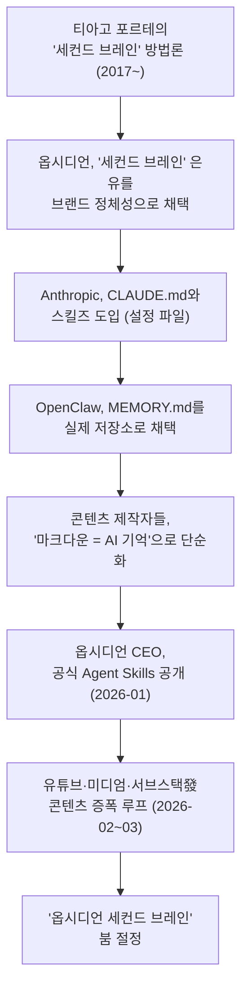
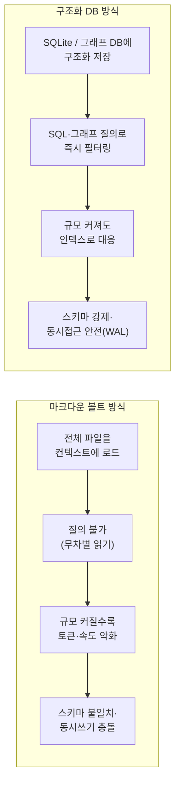

> 조사 기준일: 2026년 7월 1일. 아래 내용은 스레드, 미디엄, 서브스택, 해커뉴스, 깃허브, Anthropic 공식 문서 등 공개된 자료를 교차 검색해 작성했으며, 추측이나 확인되지 않은 주장은 배제했다.

> 
> https://www.threads.com/@graifomo/post/DaP0169CWpu
> 
> AI 판이 재밌는게 
> 
> 불과 얼마전만 해도 Obsidian물려서 2nd Brain 만들고 SubAgent 구성하고 시각화까지 해서 업무 자동화 돌리는게 힙한 Trend였던 거 같은데
> 
> 요즘은 그런 거 굳이 왜 하는지 모르겠다는 글 들이 막 올라온다. 나도 동의하는 바다ㅋ
> 

## 참고글

[**Claude + Obsidian로 구축하는 Self-Maintaining Second Brain**](https://k82022603.github.io/posts/claude-obsidian%EB%A1%9C-%EA%B5%AC%EC%B6%95%ED%95%98%EB%8A%94-self-maintaining-second-brain/)

[**옵시디언과 제2의 뇌 신화: 지식관리의 착각과 AI 시대의 현실**](https://k82022603.github.io/posts/%EC%98%B5%EC%8B%9C%EB%94%94%EC%96%B8%EA%B3%BC-%EC%A0%9C2%EC%9D%98-%EB%87%8C-%EC%8B%A0%ED%99%94-%EC%A7%80%EC%8B%9D%EA%B4%80%EB%A6%AC%EC%9D%98-%EC%B0%A9%EA%B0%81%EA%B3%BC-ai-%EC%8B%9C%EB%8C%80%EC%9D%98-%ED%98%84%EC%8B%A4/)

[**LLM Wiki × Obsidian으로 세컨드 브레인 만들기**](https://k82022603.github.io/posts/llm-wiki-obsidian%EC%9C%BC%EB%A1%9C-%EC%84%B8%EC%BB%A8%EB%93%9C-%EB%B8%8C%EB%A0%88%EC%9D%B8-%EB%A7%8C%EB%93%A4%EA%B8%B0/)

## 목차

1. 들어가며 — 스레드 게시물이 짚어낸 균열
2. '세컨드 브레인'이라는 개념의 계보
3. 2025~2026년 옵시디언+AI 세컨드 브레인 붐의 실체
4. 붐을 떠받친 기술적 토대
5. 균열의 시작 — "그건 메모리가 아니다"
6. 다섯 가지 구조적 문제
7. 붐과 회의론의 동시 진행 — 카파시발 2차 확산
8. 대안으로 떠오르는 인프라들
9. 왜 지금 피로감이 쌓이는가
10. 스레드 게시물 속 목소리들 다시 읽기
11. 정리하며 — 퍼스트 브레인과 세컨드 브레인의 재배치

---

## 1. 들어가며 — 스레드 게시물이 짚어낸 균열

이 글은 이 정서가 근거 없는 뇌피셜인지, 아니면 실제로 지난 몇 달간 AI 콘텐츠 생태계 안에서 벌어진 논쟁을 반영하는 것인지를 검증하기 위해 작성됐다. 결론부터 말하면, 이 균열은 실제로 존재하며 상당히 구체적인 기술적 논쟁에 뿌리를 두고 있다. 다만 흥미로운 지점은, 이 회의론이 확산되는 동안에도 "옵시디언 세컨드 브레인 만드는 법" 류의 콘텐츠는 2026년 6월까지도 계속 쏟아지고 있다는 점이다. 즉 유행이 끝난 게 아니라, 유행의 절정과 그에 대한 반박이 동시에 진행되는 국면이라고 보는 편이 정확하다.

## 2. '세컨드 브레인'이라는 개념의 계보

AI가 결합되기 전, '세컨드 브레인'이라는 용어는 순수하게 인간을 위한 지식 관리 방법론이었다. 2017년 무렵부터 티아고 포르테가 대중화시킨 이 개념은 PARA(프로젝트, 영역, 자료, 아카이브)와 CODE(수집, 정리, 추출, 표현)라는 체계로 정리되며 생산성 커뮤니티 전반에 퍼졌다. 옵시디언은 이 흐름과 정확히 맞물린 도구였다. 실제로 옵시디언의 초기 홈페이지 문구 중에는 "당신을 위한 두 번째 뇌, 영원히"라는 표현이 있었을 정도로, '세컨드 브레인'이라는 은유는 옵시디언이라는 브랜드의 정체성 자체에 새겨져 있었다.

문제는 이 표현이 단순한 은유에서 그치지 않았다는 점이다. 노트를 '뇌'라고 부르기 시작하면 사람들은 자연스럽게 뇌와 유사한 능력을 기대하게 되고, 여기에 AI가 결합되는 순간 '세컨드 브레인'은 더 이상 비유가 아니라 제품이 가진 능력에 대한 주장으로 바뀐다. 옵시디언 창업자 스테프 안고는 2023년 인터뷰에서 언젠가 볼트(vault, 옵시디언의 노트 저장소)를 학습해 로컬에서 추론까지 수행하는 플러그인이 나오길 바란다는 취지의 발언을 한 적이 있는데, 이는 로컬 우선·프라이버시 우선이라는 옵시디언의 철학과 맞닿아 있는 비전이었다. 2025~2026년 사이 스마트 커넥션스, 클로디언, 코텍스 같은 플러그인들이 이 비전을 구현하기 시작했지만, 실제로는 완전한 로컬 추론이 아니라 외부 AI(주로 클로드 코드)에 의존하는 형태로 자리 잡았다.

## 3. 2025~2026년 옵시디언+AI 세컨드 브레인 붐의 실체

2025년 하반기부터 2026년 상반기 사이, "옵시디언 볼트를 AI 에이전트의 영속적 컨텍스트로 사용한다"는 워크플로가 지식노동자들 사이에서 폭넓게 퍼졌다. 매번 새 대화를 시작할 때마다 자신의 상황과 프로젝트, 선호도를 다시 설명하는 대신, 구조화된 지식 저장소에 AI가 직접 접근하게 해서 그 안에서 읽고 추론하고 기록하도록 만드는 방식이다. 이 흐름을 가속한 세 가지 요소가 있다. 첫째는 클로드 코드나 코덱스처럼 파일 구조를 탐색하고 마크다운을 읽고 파일을 갱신할 수 있는 AI 에이전트의 등장이다. 둘째는 볼트 루트에 놓인 CLAUDE.md 파일을 통해 AI 에이전트에게 볼트 탐색·검색·저장 방법을 지시하는 관행, 이른바 'CLAUDE.md 프로토콜'이다. 셋째는 스미더리(smithery-ai)의 mcp-obsidian 같은 표준화된 커넥터를 통해 클로드 데스크톱 같은 AI 도구가 옵시디언 볼트에 접근하도록 해주는 MCP(모델 컨텍스트 프로토콜) 연동이다.

이 흐름의 상징적 분기점은 2026년 1월, 옵시디언 CEO 스테프 안고가 공식 '에이전트 스킬즈'를 공개한 사건이다. 이 저장소는 공개 후 몇 달 만에 3만 3천 개 이상의 깃허브 스타를 받으며 크게 주목받았다. 여기에 더해 UZi-Senpai의 Ai-Second-Brain, eugeniughelbur의 obsidian-second-brain(44개 커맨드로 볼트를 자체 갱신하는 형태), 그리고 claude-obsidian 같은 프로젝트들이 잇따라 등장하면서 단순한 노트 정리 수준을 넘어 코드베이스 문서화, 캘린더 연동, 무료 웹 리서치, 야간 자동 유지보수까지 아우르는 방향으로 기능이 확장됐다. 2026년 2월 기준 옵시디언 사용자는 150만 명을 넘어섰고, 전년 대비 22% 성장했다는 수치도 함께 보도됐다.

이런 흐름을 다루는 콘텐츠도 폭발적으로 늘었다. 유튜브 채널들이 "AI의 기억력 문제를 해결하는 방법"이라는 프레임으로 클로드 코드와 옵시디언의 조합을 소개했고, 일부 매체는 CLAUDE.md를 "전두엽"에 비유하며 몇 달 안에 "자비스급" 개인 비서가 가능하다고 홍보하기도 했다. "이제 매 세션마다 클로드에게 나를 다시 설명하지 않아도 되는 영구 기억 시스템을 만들었다"는 식의 제목이 반복적으로 등장했고, 이런 콘텐츠들이 서로를 인용하며 검증 없이 확산되는 양상을 보였다.

## 4. 붐을 떠받친 기술적 토대

이 붐이 기술적으로 근거가 아예 없는 것은 아니다. Anthropic이 클로드 코드용으로 도입한 CLAUDE.md는 프로젝트 범위의 지시 파일로, 클로드 코드가 특정 디렉터리에서 실행될 때 자동으로 읽어들이는 설정 파일이다. 이건 사실상 `.bashrc`나 `.env` 파일과 비슷한 역할이다. 여기에 더해 Anthropic은 YAML 프런트매터가 붙은 마크다운 파일로 특정 슬래시 커맨드가 호출됐을 때 실행될 행동을 정의하는 '스킬즈' 개념도 도입했다. 두 가지 모두 "AI에게 어떻게 행동하고 어디를 봐야 하는지"를 알려주는 지시 전달 장치일 뿐, 그 자체로 사용자의 삶에 대한 사실 정보를 담고 있지는 않다.

여기서 흥미로운 우회로가 하나 있다. 왓츠앱, 텔레그램, 디스코드, 슬랙 등 다중 채널을 아우르는 셀프 호스팅 AI 에이전트 게이트웨이인 OpenClaw가 MEMORY.md 파일과 날짜별 로그 파일을 실제 '기억 저장소'로 사용하는 아키텍처를 채택하면서, "마크다운 우선 메모리 아키텍처"라는 표현이 퍼지기 시작했다. 다만 OpenClaw 개발진 스스로도 이 방식만으로는 확장이 어렵다는 것을 인지하고 있었고, 실제로는 SQLite 인덱싱과 BM25·임베딩 기반의 의미 검색을 추가로 얹어야 했다. 이 과정에서 만들어진 memsearch 라이브러리가 별도 오픈소스 도구로 독립할 정도였다. 즉 마크다운 파일은 사람이 보는 표면이었을 뿐, 실제 작동을 떠받친 것은 그 아래 깔린 데이터베이스였다는 뜻이다. 그런데 콘텐츠 제작자들은 이 SQLite 계층을 보지 못한 채 겉으로 드러난 마크다운 파일만 보고 "마크다운이 마법의 재료"라는 서사를 퍼뜨렸다는 게 이후 나온 비판의 핵심 줄기다.

아래 도식은 이 붐이 형성된 인과 흐름을 정리한 것이다.

## 5. 균열의 시작 — "그건 메모리가 아니다"

2026년 3월 말, 서브스택 필자 Limited Edition Jonathan이 쓴 "Stop Calling It Memory"라는 글이 이 흐름에 대한 가장 정교한 반박으로 꼽힌다. 이 글은 옵시디언을 깎아내리기보다, 옵시디언이 가진 실제 장점을 먼저 인정한다. 데이터를 로컬에 온전히 소유할 수 있다는 점, LLM이 마크다운을 별도 변환 없이 그대로 읽을 수 있다는 점, 사람이 직접 파일을 열어 내용을 확인하고 고칠 수 있다는 투명성, 위키링크를 통한 가벼운 연결, 설치와 동시에 바로 쓸 수 있는 낮은 진입장벽, 깃 기반의 버전 관리 등은 모두 실질적인 장점이라는 것이다.

다만 필자는 이 모든 장점이 특정 규모를 넘어서는 순간 한계에 부딪힌다고 지적한다. 핵심 논지는 이렇다. 노트가 50개 수준일 때는 파일 전체를 컨텍스트 창에 밀어 넣는 방식이 그럭저럭 작동하지만, 노트가 500개, 5,000개로 늘어나면 매 세션마다 관련 없는 내용까지 토큰으로 태워가며 읽어들여야 하는 구조가 된다. 이건 질의(query)가 아니라 무차별 대입에 가깝다는 것이다. 사람이 읽을 수 있다는 장점도 노트가 1,000개에 가까워지면 무의미해진다. 특정 조건에 맞는 레코드를 찾아내는 데는 SQL 한 줄이면 되는 일을, 마크다운 기반 시스템에서는 모든 파일을 읽고 형식이 일관되길 바라며 클로드가 관련 내용을 놓치지 않기를 기도하는 방식으로 처리해야 한다. 위키링크가 만드는 연결도 시각화에는 유용하지만 질의는 불가능하다는 점이 지적된다. "이 두 프로젝트를 연결하는 개념이 무엇인가" 같은 다중 홉 관계 탐색은 그래프 데이터베이스에서는 간단한 질의로 처리되지만, 서로 링크된 마크다운 파일 더미로는 애초에 불가능한 작업이라는 것이다.

이 글에서 가장 도발적인 비유는 '포스트잇 우화'다. 잘 운영되는 사무실의 임원 모니터에 "데이비드에게 3분기 실적 관련 전화" 같은 포스트잇이 붙어 있는 걸 본 생산성 인플루언서가 이를 "이 임원은 회사 전체를 포스트잇으로 운영한다"는 영상으로 만들어 퍼뜨리고, 사람들이 실제로 고객 데이터베이스와 재무 기록, 프로젝트 일정을 전부 포스트잇에 옮겨 적기 시작한다면 어떻겠냐는 것이다. Anthropic이 클로드의 모니터에 붙인 건 프로젝트 지시사항이라는 포스트잇이었을 뿐인데, 콘텐츠 생태계 전체가 그 포스트잇을 인프라라고 선언해버렸다는 게 필자의 결론이다.

비슷한 시기 미디엄에 실린 Roan Brasil Monteiro의 글도 같은 문제의식을 공유한다. 볼트는 메모리가 아니라는 게 이 글의 핵심 주장이다. 메모리란 저장된 자료를 가지고 시스템이 수행하는 선택적 검색, 리셋을 넘어서는 영속성, 규모가 커져도 유지되는 구조화된 탐색 같은 '행위'를 가리키는 것이지, 마크다운 파일 폴더 자체는 그런 행위를 아무것도 하지 않는다는 것이다. 이 글은 옵시디언 CEO가 공개한 Agent Skills 자체는 메모리 시스템이라고 주장한 적이 없으며, 어디까지나 파일 형식 명세일 뿐이라는 점을 짚는다. '메모리'라는 서사를 얹은 건 커뮤니티였다는 지적이다.

## 6. 다섯 가지 구조적 문제

앞서 소개한 서브스택 글은 마크다운 파일을 메모리로 쓸 때 반드시 마주치게 되는 다섯 가지 구조적 문제를 제시한다. 순서대로 정리하면 다음과 같다.

첫째는 **질의 불가능성**이다. "중요도 7 이상으로 태그된 고객 목록을 보여줘" 같은 요청은 필터링, 정렬, 집계 연산을 필요로 하는데, 마크다운 파일에서 가능한 유일한 연산은 "파일을 읽고 클로드가 알아서 찾아내길 바라는 것"뿐이다. 파일이 늘어날수록 클로드가 관련 정보를 놓칠 확률도 함께 커진다.

둘째는 **관계 탐색의 부재**다. "이 연락처가 아는 사람 중에 내가 연결된 프로젝트에서 함께 일하는 사람이 누구인가" 같은 질문은 구조화된 데이터와 조인 연산을 필요로 한다. 그래프 데이터베이스에서는 질의 한 줄이지만, 마크다운에서는 애초에 불가능하다. 노트끼리 링크는 걸 수 있어도, 그 링크 구조 자체에 대해 프로그램적으로 질문을 던질 수는 없다.

셋째는 **규모의 한계**다. '기억' 파일이 수천 줄에 달하면 매 세션마다 방대한 텍스트를 컨텍스트 창에 밀어 넣어야 한다. 이는 비용 측면에서 비효율적이고(관련 없는 컨텍스트에도 토큰을 태우게 된다), 속도 측면에서도 느려지며(입력 토큰이 많을수록 처리 시간이 길어진다), 실제 작업에 쓸 수 있는 컨텍스트 공간을 잠식한다.

넷째는 **스키마 강제의 부재**다. 어떤 세션에서는 클로드가 연락처를 특정 형식으로 기록하고, 다음 세션에서는 다른 형식으로, 그다음 세션에서는 또 다른 형식으로 기록하는 일이 벌어질 수 있다. 이런 데이터는 프로그램적으로 파싱하기 어렵고, 심지어 검색으로 찾아내는 것조차 쉽지 않다. SQLite 같은 데이터베이스는 스키마가 있어 모든 레코드가 동일한 구조를 따르지만, 마크다운은 그런 보장을 전혀 하지 않는다.

다섯째는 **동시 접근 문제**다. 여러 에이전트가 동시에 같은 마크다운 파일을 안전하게 읽고 쓸 수 없다. 여러 자율 에이전트를 동시에 굴리는 방향으로 이 생태계 전체가 빠르게 이동하고 있다는 점을 고려하면, 이는 특히 치명적이다. SQLite는 WAL 모드로 이 문제를 기본적으로 처리하지만, 마크다운 파일은 두 프로세스가 동시에 쓰기를 시도하면 조용히 데이터가 깨지는 방식으로 이 문제에 대응한다.

## 7. 붐과 회의론의 동시 진행 — 카파시발 2차 확산

여기서 짚어야 할 중요한 사실이 있다. 회의론이 확산되고 있음에도 이 트렌드 자체는 2026년 6월까지도 새로운 동력을 얻으며 계속되고 있다는 점이다. 2026년 4월 3일, 전 오픈AI·테슬라 AI 디렉터 출신인 안드레이 카파시가 자신의 엑스(X) 계정에 올린 게시물이 두 번째 확산의 기폭제가 됐다. 카파시는 전통적인 RAG(검색 증강 생성) 방식 대신, 원본 문서를 raw 디렉터리에 색인한 뒤 LLM이 이를 '컴파일'해서 요약과 백링크, 개념별 분류가 포함된 위키 형태의 마크다운 파일 모음을 만들도록 하는 방식을 제안했다. 벡터 임베딩과 의미 검색을 쓰는 대신, LLM이 직접 위키 데이터를 작성하고 유지보수하도록 하는 것이 핵심이다. 옵시디언은 이 원본 데이터와 컴파일된 위키, 그리고 파생된 시각화를 보는 프런트엔드 역할을 한다.

이 게시물 이후 몇 주 사이 미디엄과 서브스택에는 "카파시의 LLM 위키를 그대로 재현해봤다"는 식의 글들이 다시 쏟아졌다. 흥미로운 건 이 새로운 물결에서도 앞서 지적된 문제의식이 완전히 사라지지는 않았다는 점이다. 일부 필자들은 여전히 방대한 볼트에서 패턴을 찾아내는 경험을 "대화 상대가 된 볼트"라고 묘사하며 긍정적인 사례를 공유하는 반면, 다른 글들은 노트가 수백 개를 넘어가면 매번 전체 파일을 읽어들이는 대신 그래프 기반 압축 기법이 필요하다는 점을 인정하며 앞선 비판을 부분적으로 흡수한 절충안을 제시한다. 즉 지금 이 순간의 AI 커뮤니티는 "옵시디언 세컨드 브레인은 좋은 아이디어인가"라는 질문에 대해 한목소리를 내고 있지 않다. 오히려 초기의 무비판적 열광과, 뒤이은 기술적 반박과, 그 반박을 일부 받아들인 절충형 실천이 동시에 존재하는 혼재된 국면에 가깝다.

## 8. 대안으로 떠오르는 인프라들

비판론자들이 대안으로 제시하는 것은 대체로 '진짜 데이터베이스'로 요약된다. 서버 설치 없이 로컬에서 단일 파일로 작동하는 SQLite는 스키마, 인덱스, 질의, 정렬, 필터링, 동시 접근을 모두 지원하면서도 여전히 로컬 우선이라는 철학을 지킬 수 있다는 점에서 자주 언급된다. 사람과 프로젝트, 개념, 도구 사이의 관계를 다뤄야 하는 경우에는 Kuzu 같은 임베디드 그래프 데이터베이스가 대안으로 제시되며, 서버 없이도 수백 개의 노드 사이에서 패턴을 찾아내는 순회 질의를 실행할 수 있다는 점이 강조된다. 조금 더 본격적인 구성을 원한다면 Supabase 기반의 PostgreSQL과 벡터 검색, 실시간 구독 기능을 결합한 구성도 언급된다.

이와는 별개로, 정작 이 모든 논쟁의 배경에 있는 Anthropic 자신도 자체적인 메모리 인프라를 빠르게 갖춰나가고 있다는 점이 눈에 띈다. 2026년 3월 2일부터는 무료 사용자를 포함한 모든 클로드닷에이아이·클로드 앱 사용자에게 자동 메모리 기능이 제공되기 시작했다. 이 기능은 대화 기록을 주기적으로(대략 24시간 간격으로) 요약해 사용자에 대한 프로필을 구축하고, 이후 대화에서 이를 자동으로 불러온다. API 쪽에서는 `memory_20250818`이라는 이름의 메모리 툴이 클로드 4 이상 모델에서 정식 제공되며, 클로드가 `/memories` 디렉터리 아래에 파일을 만들고 읽고 수정하고 삭제하도록 지원한다. 이는 필요한 시점에만 정보를 불러오는 '적시(just-in-time) 컨텍스트 검색'을 위한 것으로, 모든 정보를 매번 미리 로드하는 대신 에이전트가 학습한 내용을 메모리 파일에 기록해두고 필요할 때 다시 읽어오는 방식이다. 2026년 4월 23일에는 클로드 매니지드 에이전트에도 퍼블릭 베타로 영속 메모리가 추가됐는데, 넷플릭스나 라쿠텐 같은 기업들이 이를 도입해 세션을 넘나드는 학습을 통해 초회 오류율을 97%까지 낮췄다는 사례도 함께 보도됐다.

이 흐름이 시사하는 바는 분명하다. 개인 사용자 입장에서 "AI에게 나를 매번 다시 설명하지 않아도 되게 만들고 싶다"는 원래의 동기 자체는, 이제 옵시디언과 클로드 코드를 직접 엮는 정교한 개인 인프라를 구축하지 않아도 플랫폼 차원에서 상당 부분 해결되고 있다는 뜻이다. 물론 플랫폼 네이티브 메모리에는 한계도 있다. 특정 서비스에 데이터가 묶여 다른 도구로 이전할 수 없다는 점, 팀 단위로 공유되는 컨텍스트를 만들 수 없다는 점, 클로드 코드나 API 호출에는 이 메모리가 적용되지 않는다는 점 등이 대표적으로 지적된다. 하지만 적어도 "매번 세션 초기화 문제를 어떻게 해결할 것인가"라는 원래의 문제에 대해서는, 정교한 자체 구축 없이도 상당한 수준의 해결책이 이미 제공되고 있는 셈이다.

## 9. 왜 지금 피로감이 쌓이는가

기술적 반박과는 별개로, 좀 더 넓은 맥락에서도 이 회의론을 뒷받침하는 흐름이 있다. 2026년 3월 보스턴컨설팅그룹과 하버드비즈니스리뷰가 공동으로 발표한 연구는 'AI 브레인 프라이'라는 현상을 명명했다. 이는 자신의 인지 능력을 넘어서는 수준으로 AI 도구를 과도하게 사용하거나 감독할 때 발생하는 정신적 피로를 가리킨다. 1,488명의 미국 정규직 근로자를 대상으로 한 이 연구에서 AI를 업무에 사용하는 응답자 중 14%가 이런 경험을 인정했고, 마케팅 부서에서는 그 비율이 26%까지 올라갔다. 응답자들은 '웅웅거리는' 느낌이나 정신적 안개, 집중력 저하, 의사결정 속도 저하, 두통 등을 호소했다. 특히 주목할 만한 대목은, 사용하는 AI 도구의 개수가 3개 이하일 때는 생산성이 향상됐다고 응답한 비율이 높았던 반면, 4개 이상을 동시에 굴릴 때는 오히려 생산성이 급격히 떨어졌다는 조사 결과다.

이 맥락에 옵시디언·클로드 코드·서브에이전트·MCP 커넥터·시각화 대시보드를 모두 엮은 '세컨드 브레인' 구성을 겹쳐보면, 왜 이런 구성이 피로의 근원으로 지목되는지 짐작할 수 있다. **여러 개의 스킬과 MCP 서버, 자동화된 야간 유지보수 루틴, 계속 불어나는 볼트를 관리하는 일 자체가 하나의 노동이 되어버리는 경우가 실제로 보고되고 있다.** 이 사용자의 과거 대화에서도 언급된 바 있는 **'병적으로 비대해진 헤르메스(Hermes)' 현상, 즉 장기간 운영되는 에이전트 세션이 메모리와 스킬에 기술 부채를 쌓아가다가 결국 공장 초기화가 필요해지는 패턴은 이 문제의 다른 얼굴이다.** 

**세컨드 브레인을 구축하는 것 자체가 목적이 되어버리면, 정작 그 시스템을 유지보수하는 데 드는 인지적·금전적 비용이 시스템이 절약해주는 비용을 넘어서는 역설이 발생한다.**

## 10. 스레드 게시물 속 목소리들 다시 읽기

이제 다시 처음의 스레드 게시물로 돌아가 보면, 각각의 댓글이 위에서 확인한 논쟁의 특정 지점을 정확히 짚고 있다는 걸 알 수 있다. 토큰이 그렇게 소모되는데 값어치를 하는지 모르겠다는 지적은, 서브스택 비판론이 말한 '규모의 한계' 문제와 정확히 겹친다. 노트가 늘어날수록 매 세션 컨텍스트 창에 태워야 하는 텍스트가 늘어나고, 이는 곧 비용으로 직결된다. 퍼스트 브레인부터 잘 쓰고 싶다는 반응은, AI 브레인 프라이 연구가 지적한 '인지 부하 총량'의 문제이자, 서브스택 필자가 소개한 한 독자의 댓글, 즉 노트를 직접 쓰고 정리하는 과정 자체가 사고 과정의 일부였는데 그 과정을 자동화로 넘겨버리면서 오히려 자기 사고와 시스템 사이의 거리가 멀어졌다는 반성과도 맞닿아 있다.

마지막으로 "옵시디언 세컨드 브레인은 걍 모양새가 멋있어 보여서 하는 느낌"이라는 촌평은, 어쩌면 이 논쟁 전체에서 가장 핵심을 찌르는 말일 수 있다. 실제로 검색되는 콘텐츠 상당수는 브레인 형상의 반짝이는 마크다운 파일 썸네일, "10분 만에 AI 세컨드 브레인 만들기" 같은 자극적인 제목, "이걸로 연 4만 4천 달러를 절약했다"는 식의 과장된 수익 계산이 주를 이룬다. 서브스택 비판자가 정확히 짚었듯, 이런 콘텐츠 생태계는 애초에 "설정 속도"에 최적화되어 있지, "시스템이 실제로 얼마나 잘 작동하는가"에 최적화되어 있지 않다. 10분 만에 세팅했다는 영상은 조회수가 잘 나오지만, 제대로 된 데이터 스키마를 설계하는 데 주말을 쏟았다는 이야기는 그만큼의 주목을 받지 못한다는 것이다. 그 결과 겉으로 보이는 화려함과 실제 유용성 사이의 간극이 벌어지고, 이 간극을 예민하게 감지하는 실무자들 사이에서 "이거 진짜 필요한가"라는 반문이 자연스럽게 나오는 것이다.

## 11. 정리하며 — 퍼스트 브레인과 세컨드 브레인의 재배치

종합하면, 스레드 게시물이 포착한 정서는 근거 없는 감상이 아니라 2026년 초부터 AI 콘텐츠 생태계 안에서 실제로 진행되어온 기술적 논쟁의 반영이라고 볼 수 있다. 다만 이 논쟁의 결론이 "옵시디언 세컨드 브레인은 틀렸다"는 식의 단순한 명제로 정리되지는 않는다. 오히려 다음과 같은 세 갈래로 정리하는 편이 더 정확하다.

첫째, 옵시디언과 마크다운은 사람이 직접 읽고 정리하고 가꾸는 개인 지식 정원으로는 여전히 훌륭한 도구다. 이 용도에 대해서는 비판론자들조차 이견이 없다. 둘째, 그 마크다운 볼트를 자율 에이전트의 '데이터베이스'나 '기억'으로 취급하며 수백에서 수천 개 노트 규모로 확장하려는 시도는, 질의 불가능성과 관계 탐색 부재, 규모의 한계, 스키마 부재, 동시접근 문제라는 다섯 가지 구조적 벽에 필연적으로 부딪힌다. 이 용도로는 SQLite나 임베디드 그래프 데이터베이스 같은 실제 데이터베이스를 쓰는 편이 낫다는 게 비판론의 요지다. 셋째, 애초에 "AI에게 매번 나를 재설명하지 않아도 되게 하고 싶다"는 원래의 소박한 목적이라면, 이제는 Anthropic이 직접 제공하는 네이티브 메모리 기능만으로도 상당 부분 충족된다. 정교한 개인 인프라를 처음부터 손수 짜야 할 이유가 예전보다 훨씬 줄어든 셈이다.

결국 이 논쟁이 가리키는 방향은 '세컨드 브레인을 버려라'가 아니라 '도구를 목적에 맞게 재배치하라'에 가깝다. 노트 정리는 노트 앱으로, 구조화된 질의가 필요한 데이터는 데이터베이스로, 세션 간 컨텍스트 유지는 플랫폼 네이티브 메모리로 나눠 맡기고, 그 위에 얹는 자동화는 실제로 아낀 시간이 그걸 유지보수하는 데 드는 시간보다 확실히 클 때만 남겨두는 것이다. 그리고 이 모든 재배치의 전제 조건은, 스레드 댓글이 말한 것처럼 결국 퍼스트 브레인, 즉 무엇을 왜 자동화하는지를 판단하는 사람의 사고 자체가 먼저 명료해야 한다는 점일 것이다.

---

### 참고한 주요 출처

- Limited Edition Jonathan, [*"Stop Calling It Memory: The Problem with Every AI + Obsidian Tutorial"*](https://limitededitionjonathan.substack.com/p/stop-calling-it-memory-the-problem), Substack, 2026년 3월
- Roan Brasil Monteiro, [*"Your AI second brain isn't memory — and here's the architecture that actually is"*](https://medium.com/@roanmonteiro/obsidian-your-ai-second-brain-isnt-memory-and-here-s-the-architecture-that-actually-is-bf944929e144), Medium, 2026년 6월
- Taskade, *"History of Obsidian: Second Brain to AI Knowledge OS"*, 2026년 3월 갱신
- Boston Consulting Group / Harvard Business Review, *"When Using AI Leads to 'Brain Fry'"*, 2026년 3월
- Anthropic Platform Docs, *"Memory tool"* 및 Claude Managed Agents 메모리 발표(2026년 4월)
- eugeniughelbur/obsidian-second-brain, UZi-Senpai/Ai-Second-Brain 등 깃허브 저장소
- Kenneth Reitz, *"Obsidian Vaults & Claude Code: A Second Brain That Thinks Back"*, 2026년 3월
- @graifomo, Threads 게시물(2026년, 사용자 제공 원문)
