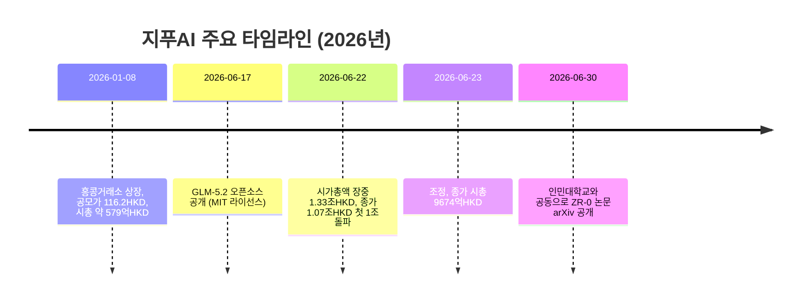
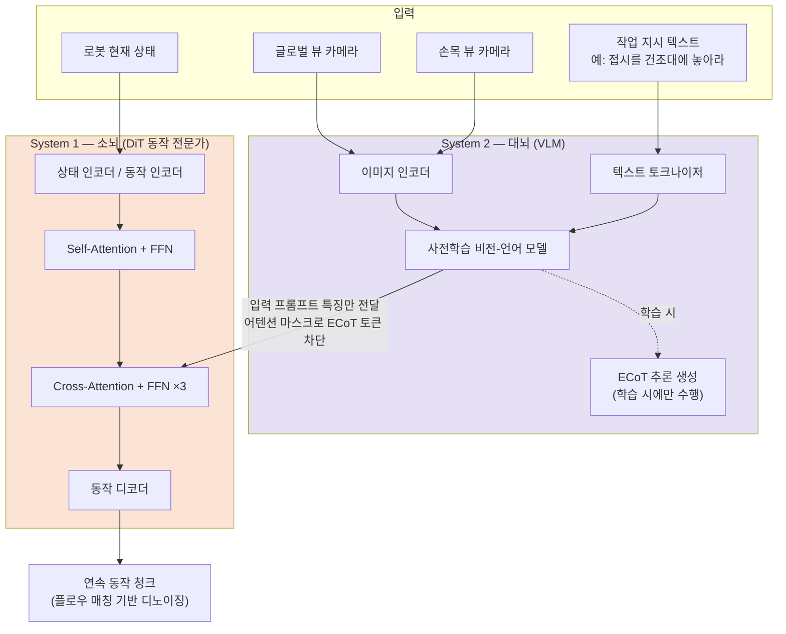
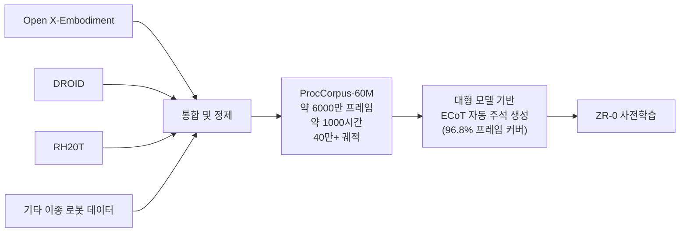
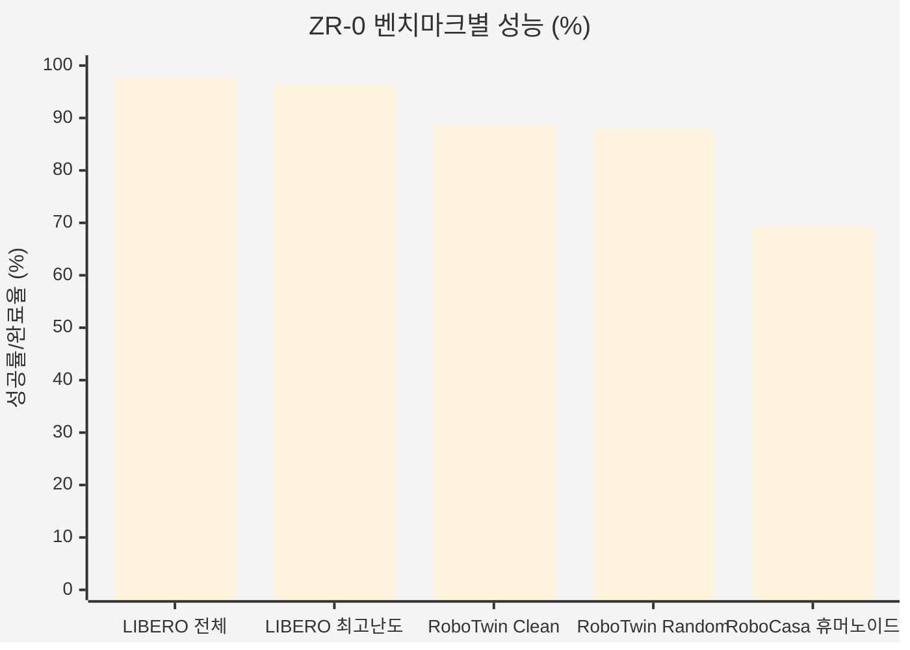
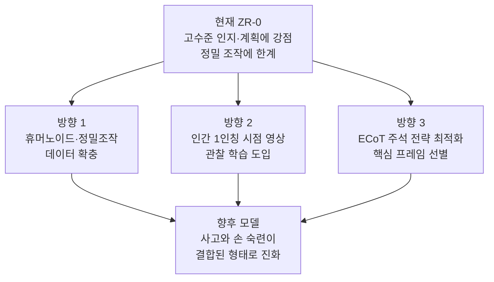

**부제: '유아적 사고'에서 '성숙한 행동'으로 — 임바디드 사고 사슬(ECoT)이 여는 로봇 학습의 새로운 경로**

- 작성 기준일: 2026년 7월 1일
- 원 논문: *Training Vision-Language-Action Models with Dense Embodied Chain-of-Thought Supervision* (arXiv:2606.30552)
- 저자 소속: 중국 인민대학교(Renmin University of China), 지푸AI(Zhipu AI)

## 관련글

[**지푸AI 로봇, 인간처럼 성장하는 모델을 발표하다: '유아적 사고'에서 '성숙한 행동'으로의 진화 경로**](https://www.facebook.com/share/1ExggQayBT/)

---

## 목차

1. 들어가며 — 왜 지금 ZR-0인가
2. 지푸AI의 시가총액 1조 홍콩달러 돌파, 사실관계 정리
3. ZR-0란 무엇인가 — 기본 개요
4. 핵심 아키텍처: 대뇌(System 2)와 소뇌(System 1)의 분업
5. ECoT(임바디드 사고 사슬) — 로봇의 '혼잣말 학습법'
6. ProcCorpus-60M 데이터셋의 규모와 구성
7. 형태 간 범용성(Cross-Embodiment Transfer)이 가능한 이유
8. 벤치마크 성능 상세 분석
9. 소거 실험(Ablation Study)이 말해주는 것
10. 한계와 향후 연구 방향
11. 중국 로봇 산업 표준화의 맥락
12. 종합 평가 및 시사점
13. 용어 해설(글로서리)
14. 참고 자료

---

## 1. 들어가며 — 왜 지금 ZR-0인가

2026년 6월 30일, 중국 인민대학교와 지푸AI 연구진이 arXiv에 논문 한 편을 공개했습니다. 제목은 "Training Vision-Language-Action Models with Dense Embodied Chain-of-Thought Supervision"이며, 이 논문에서 제안하는 모델의 이름이 **ZR-0**입니다. 이 모델은 로봇 팔이나 인간형 로봇이 눈으로 보고, 언어로 지시받은 작업을 이해하고, 실제 팔다리를 움직여 수행하는 이른바 **VLA(Vision-Language-Action) 모델**의 한 종류입니다.

VLA 모델 자체는 새로운 개념이 아닙니다. 이미 미국의 Physical Intelligence 사가 발표한 π0(파이제로), π0.5 같은 모델이나, 여러 로봇 스타트업의 파운데이션 모델이 이 범주에 속합니다. ZR-0가 주목받는 이유는 단순히 '또 하나의 VLA 모델'이기 때문이 아니라, **로봇이 동작을 배우는 방식 자체를 인간의 인지 발달 과정에 가깝게 재설계**했기 때문입니다. 구체적으로는 로봇에게 동작 데이터만 대량으로 주입하는 대신, 매 순간 "지금 어떤 장면이고, 무엇을 해야 하며, 왜 그렇게 해야 하는지"를 서술하는 밀집형(dense) 사고 과정을 함께 학습시켰습니다. 이 문서는 이 논문의 내용을 웹 검색을 통한 사실 검증과 함께 처음부터 끝까지 상세히 풀어 설명합니다.

---

## 2. 지푸AI의 시가총액 1조 홍콩달러 돌파, 사실관계 정리

ZR-0를 이해하려면 먼저 이를 발표한 지푸AI라는 회사의 위치를 짚고 넘어갈 필요가 있습니다. 지푸AI(智谱AI, 국제 브랜드명 Z.ai)는 칭화대학교 지식공학연구실(KEG Lab) 출신 기술을 기반으로 2019년 설립된 중국의 대형언어모델(LLM) 기업으로, GLM 시리즈 모델과 오픈소스 생태계로 잘 알려져 있습니다.

지푸AI는 2026년 1월 8일 홍콩거래소에 상장(종목코드 02513.HK)하며 "세계 최초의 대형모델 상장기업"으로 불렸습니다. 상장 당시 공모가는 주당 116.2홍콩달러였고 상장 직후 시가총액은 약 579억 홍콩달러 수준이었습니다.

이후 상황이 급변했습니다. 6월 17일 지푸AI가 GLM-5.2를 MIT 라이선스로 오픈소스화하며 지역 제한 없이 무료 상업적 이용을 허용하는 발표를 내놓았고, 곧이어 6월 22일 주가가 하루 만에 13~40%대까지 폭등하며 장중 한때 시가총액이 1조 3300억 홍콩달러에 달했습니다. 이날 종가 기준 시가총액은 약 1조 700억 홍콩달러로 마감했으며, 이는 상장 후 166일 만에, 그리고 공모가 대비 약 20배 상승한 결과로 중국 본토 대형모델 기업으로는 최초로 '1조 클럽'에 진입한 사례로 보도되었습니다. 다만 그 다음 날인 6월 23일에는 주가가 조정을 받아 시가총액이 9674억 홍콩달러로 내려앉는 등, 이 '1조 돌파'는 단발성 급등에 가까웠고 이후 며칠간 1조 홍콩달러 선을 사이에 두고 등락을 거듭했습니다.

이 급등의 배경에 대해 여러 매체는 세 가지 요인을 지목합니다. 첫째는 GLM-5.2의 실질적 코딩 능력 향상과 오픈소스 전략, 둘째는 "중국판 Anthropic"이라는 시장 서사에 대한 프리미엄, 셋째는 상장 초기 유통 주식 비율이 매우 낮아(약 3% 수준) 적은 자금으로도 주가가 크게 움직이는 구조적 요인입니다. 동시에 2025년 매출이 약 7억 2400만 위안에 그치고 순손실이 확대되는 등 재무 펀더멘털과 시가총액 사이의 괴리가 크다는 점에서 '거품' 논쟁도 활발합니다. 즉, 원문에서 언급된 "6월 22일 처음으로 시가총액 1조 홍콩달러 돌파"는 사실에 부합하지만, 이는 안정적으로 유지된 수치라기보다 급등락이 반복되는 흐름 속의 한 장면이었다는 점을 함께 이해할 필요가 있습니다.

이러한 주가 흐름과 별개로, 지푸AI가 LLM에서 에이전트, 그리고 피지컬AI(로봇)로 사업 영역을 확장하고 있다는 방향성 자체는 ZR-0 논문 발표로 뒷받침됩니다.

---

## 3. ZR-0란 무엇인가 — 기본 개요

ZR-0는 **26억 개(2.6B)의 파라미터**를 가진 엔드투엔드 VLA 모델입니다. 연구팀은 논문에서 로봇 조작(manipulation)의 밑바탕에 깔린 고수준 인지 과정, 즉 장면 인식(scene perception), 물체 식별(object identification), 작업 계획(task planning), 하위 작업 분해(sub-task decomposition)가 로봇의 물리적 형태(embodiment)와 무관하게 상당 부분 공유된다는 점에 착안했습니다. 로봇 팔의 관절 개수나 그리퍼 구조, 인간형 로봇의 자유도는 기종마다 전혀 다르지만, "지금 컵을 집어야 한다"는 인식과 계획 수준의 사고는 어느 로봇에나 공통적으로 적용된다는 것입니다.

이 관찰을 바탕으로 ZR-0는 **밀집형 임바디드 사고 사슬(dense Embodied Chain-of-Thought, ECoT) 감독**을 이용해 비전-언어 모델(VLM) 내부에서 서로 다른 로봇 형태 간의 표현을 정렬시키는 방식을 채택했습니다. 즉 로봇마다 다른 '몸'을 갖고 있어도, '생각하는 방식'을 공유하게 만들어 하나의 모델이 여러 로봇 기종에 걸쳐 일반화될 수 있도록 설계한 것입니다.

원문에서 소개된 "아기가 울다가 옹알이를 하다가 스스로 걸음마를 떼는" 비유는 논문의 공식 표현은 아니지만, ECoT의 학습 철학 — 즉 로봇이 먼저 관찰하고 사고 과정을 거친 뒤에야 행동하도록 훈련시킨다는 개념 — 을 이해하기 쉽게 풀어낸 비유로 볼 수 있습니다.

---

## 4. 핵심 아키텍처: 대뇌(System 2)와 소뇌(System 1)의 분업

ZR-0의 구조는 인지과학에서 널리 쓰이는 **System 1 / System 2 이중 처리 이론(dual-process theory)** 에서 영감을 받았습니다. 사람이 어떤 행동을 할 때, 의식적이고 느린 숙고형 사고(System 2)와 무의식적이고 빠른 직관적 반응(System 1)이 함께 작동한다는 이론입니다. ZR-0는 이를 로봇 제어에 그대로 적용했습니다.

**System 2 (대뇌 역할)** — 사전학습된 비전-언어 모델이 이 역할을 맡습니다. 이 모델은 카메라로 들어오는 시각 정보와 텍스트로 주어지는 작업 지시를 처리해, 훈련 과정에서 구조화된 ECoT 추론을 생성합니다. 원문에서는 이 VLM으로 알리바바의 Qwen3-VL-2B가 사용되었다고 설명하지만, 논문 원문에서는 구체적으로 어떤 사전학습 VLM 백본을 사용했는지 상세 스펙까지 확인되지는 않았습니다. 다만 시각-언어 이해를 위한 사전학습 VLM을 System 2로 채택했다는 아키텍처적 사실 자체는 논문에 명시되어 있습니다.

**System 1 (소뇌 역할)** — DiT(Diffusion Transformer) 구조 기반의 **동작 전문가(Action Expert)** 모듈이 이 역할을 맡습니다. 이 모듈은 플로우 매칭(flow matching) 방식을 통해 연속적인 동작 청크(continuous action chunk)를 생성합니다. 즉 대뇌가 "지금 무엇을 해야 하는지"를 이해하면, 소뇌가 이를 구체적이고 연속적인 관절 움직임으로 변환하는 구조입니다.

이 두 시스템은 **교차 어텐션(cross-attention)** 메커니즘으로 연결됩니다. 여기서 특히 중요한 설계 포인트가 있습니다. 연구팀은 교차 어텐션 레이어에서 동작 전문가가 VLM이 만들어낸 특징(feature) 중에서도 **입력 프롬프트(작업 지시와 이미지)에 해당하는 부분만 참조**하도록 하고, ECoT 추론 토큰 자체는 참조하지 못하도록 어텐션 마스크를 설계했습니다. 이 설계 덕분에 추론(inference) 단계에서는 ECoT를 실제로 문장으로 생성(디코딩)하는 과정을 완전히 생략할 수 있습니다. VLM이 입력 프롬프트에 대해 한 번의 순전파(forward pass)만 수행하면 동작 전문가가 필요로 하는 모든 특징을 얻을 수 있기 때문에, 느린 자기회귀적(autoregressive) 텍스트 디코딩 없이도 학습 때 얻은 사고 능력의 이점을 그대로 누릴 수 있는 것입니다.

또한 논문은 이 교차 어텐션 비율을 기존 로봇 파운데이션 모델인 엔비디아의 GR00T N1이 사용한 1:1 비율(자기 어텐션:교차 어텐션)과 달리 **1:3 비율**로 설계했다고 밝히고 있습니다. 이는 동작 전문가가 VLM으로부터 더 많은 작업 지시와 시각 정보를 흡수하도록 교차 모달 상호작용의 비중을 높인 것입니다.

이러한 설계의 결과, 논문에 명시된 추론 속도는 **단일 H100 GPU 기준 약 100밀리초(ms)** 로 하나의 동작 청크를 생성할 수 있는 수준입니다. (참고: 원문 자료에서 언급된 "단일 A600 GPU, 약 90ms"는 논문 원문의 표현과는 차이가 있어, 이 문서에서는 논문에 명시된 H100 기준 약 100ms 수치로 정정하여 안내드립니다.) 어느 쪽이든 핵심 메시지는 동일합니다 — 깊이 생각하는 능력을 학습에 반영하면서도, 실행 시에는 그 사고 과정을 생략해 빠른 반응 속도를 확보했다는 점입니다.

---

## 5. ECoT(임바디드 사고 사슬) — 로봇의 '혼잣말 학습법'

ECoT라는 개념 자체는 ZR-0가 처음 고안한 것은 아닙니다. 2024년 UC버클리, 스탠퍼드 등의 연구진이 "Robotic Control via Embodied Chain-of-Thought Reasoning"이라는 논문(CoRL 2024)에서 VLA 모델이 로봇 동작을 예측하기 전에 계획, 하위 작업, 동작, 그리고 물체 경계 상자(bounding box)나 엔드이펙터 위치 같은 시각적으로 근거 있는 특징에 대해 여러 단계의 추론을 수행하도록 훈련시키는 방법론을 제안한 바 있습니다. ZR-0는 이 ECoT 개념을 이어받아, 이를 **훨씬 더 촘촘하고(dense) 대규모로** 로봇 학습에 적용했다는 점이 특징입니다.

원문에서 소개된 "아이가 새로운 기술을 배울 때 혼잣말을 한다"는 비유는 ECoT의 작동 원리를 이해하는 데 유용한 설명 방식입니다. 논문에 따르면 ZR-0의 ECoT 주석 체계는 각 로봇 궤적(trajectory)의 매 프레임마다 다음 여섯 가지 요소로 구성된 구조화된 시퀀스를 생성합니다.

| 구성 요소 | 설명 |
|---|---|
| 장면 설명 (Scene Description) | 현재 카메라에 보이는 환경과 물체 상황을 서술 |
| 작업 진행 상황 판단 (Task Progress Assessment) | 현재까지 작업이 어디까지 진행되었는지 평가 |
| 향후 계획 (Future Plan) | 다음에 수행해야 할 상위 수준의 계획 |
| 분해된 원자적 하위 작업 동작 (Decomposed Atomic Sub-task Actions) | 상위 계획을 실행 가능한 단위 동작으로 세분화 |
| 목표 물체 경계 상자 (Target Object Bounding Boxes) | 조작 대상 물체의 화면상 위치 |
| 이산 동작 토큰 (Discretized Action Tokens) | 저수준 제어로 이어지는 이산화된 동작 표현 |

이 여섯 가지 정보는 고수준의 언어 지시("접시를 건조대에 놓아라")와 저수준의 실제 관절 제어를 이어주는 다리 역할을 하며, 로봇 기종에 구애받지 않는(embodiment-agnostic) 형태로 설계되어 있다는 점이 핵심입니다. 이 밀집형 ECoT 감독이야말로 서로 다른 하드웨어를 가진 로봇들이 정렬되고 전이 가능한(aligned, transferable) 표현을 학습할 수 있게 하는 핵심 요인이라고 논문은 설명합니다.

---

## 6. ProcCorpus-60M 데이터셋의 규모와 구성

ZR-0의 사전학습에는 **ProcCorpus-60M**이라는 대규모 ECoT 강화 로봇 데이터셋이 사용되었습니다. 논문에 명시된 규모는 다음과 같습니다.

- 약 **6,000만 프레임** (약 60M frames)
- 약 **1,000시간** 분량의 조작(manipulation) 영상
- **40만 개(400K) 이상**의 로봇 궤적
- 다양한 로봇 형태(embodiment)를 아우르는 이종 데이터
- 전체 프레임의 **96.8%** 에 밀집형 ECoT 주석이 부착

원문에서 언급한 것처럼 이 데이터셋은 Open X-Embodiment, DROID, RH20T 등 기존에 공개된 여러 오픈소스 로봇 데이터셋들을 통합해 구축된 것으로, 대규모 언어모델을 활용해 각 프레임에 대한 ECoT 주석을 자동으로 생성함으로써 사람이 일일이 수작업으로 주석을 다는 데 드는 비용을 크게 절감했습니다. "조기 교육 교사 수십 명이 1000시간 동안 매 순간 설명해주는 것과 같다"는 원문의 비유는 이 방대한 주석 작업의 규모를 이해하기 쉽게 표현한 것으로 볼 수 있습니다.

---

## 7. 형태 간 범용성(Cross-Embodiment Transfer)이 가능한 이유

전통적인 로봇 학습 모델의 가장 큰 약점 중 하나는 **기종 간 전이(cross-embodiment transfer)의 어려움**이었습니다. 로봇 팔과 인간형 로봇은 운동 자유도(degrees of freedom), 동작 공간(action space), 하드웨어 구성이 완전히 다르기 때문에, 한 기종에서 학습한 정책(policy)을 다른 기종에 그대로 적용하기 어렵습니다.

ZR-0 연구팀의 핵심 통찰은, 조작 동작 이면에 깔린 **고수준 인지 과정**(장면 인식, 물체 식별, 작업 계획, 하위 작업 분해)은 로봇의 물리적 형태와 무관하게 상당 부분 공통적이라는 데 있습니다. ECoT는 바로 이 고수준 인지 과정을 명시적으로 학습 신호로 만들어 VLM 내부에 새겨 넣는 역할을 합니다. 그 결과 저수준의 관절 제어는 로봇마다 다르더라도, "지금 무엇을 해야 하는지 이해하는" 상위 수준의 사고는 여러 로봇 형태에 걸쳐 공유될 수 있습니다.

원문에서 사용된 "운전할 줄 아는 사람은 다른 차종으로 갈아타도 운전할 수 있다"는 비유는 이 원리를 직관적으로 잘 설명해 줍니다. 가속 페달과 브레이크의 물리적 위치는 차종마다 다를 수 있지만, 도로 상황을 관찰하고 판단해 조작하는 인지적 과정 자체는 보편적이라는 것입니다.

---

## 8. 벤치마크 성능 상세 분석

논문은 ZR-0를 세 가지 시뮬레이션 벤치마크(단일 팔, 양팔, 인간형)와 실제 로봇 팔 환경에서 평가했습니다. 모두 **동일한 사전학습 체크포인트에서 파인튜닝**한 결과라는 점이 중요합니다. 즉, 하나의 기반 모델이 서로 다른 로봇 형태에 걸쳐 일관되게 좋은 성능을 낸다는 것을 보여주기 위한 설계입니다.

| 벤치마크 | 로봇 형태 | 주요 지표 | 결과 |
|---|---|---|---|
| LIBERO | 단일 팔 시뮬레이션 | 전체 성공률 | **97.8%** |
| LIBERO (최고난도 장기·다중 하위작업) | 단일 팔 시뮬레이션 | 성공률 | **96.4%** |
| RoboTwin 2.0 (Clean 환경) | 양팔 시뮬레이션 | 성공률 | **88.70%** |
| RoboTwin 2.0 (Randomized 환경) | 양팔 시뮬레이션 | 성공률 | **87.98%** |
| RoboCasa GR-1 Tabletop | 인간형(휴머노이드) 시뮬레이션 | 평균 완료율 | **69.3%** |
| xArm 실제 로봇 팔 | 실제 환경(Real-world) | 평균 점수 | **76.0** (기준 모델 π0.5 대비 +8.2점) |

이 수치들은 논문 원문 및 논문의 arXiv 초록에서 확인된 값으로, 원문에서 제시된 수치와 정확히 일치합니다. 특히 RoboCasa 휴머노이드 시뮬레이션에서는 잡기(grasping) 유형의 작업에서 두드러진 강점을 보였다고 설명되어 있습니다.

실제 xArm 로봇 팔 실험에서 비교 대상이 된 π0.5는 미국 로보틱스 스타트업 Physical Intelligence가 2025년 발표한 오픈월드 일반화(open-world generalization)를 지향하는 VLA 모델로, 현재 이 분야에서 널리 인용되는 대표적 비교 기준선(baseline) 중 하나입니다.

---

## 9. 소거 실험(Ablation Study)이 말해주는 것

논문에서 가장 눈여겨볼 만한 부분 중 하나는 **소거 실험**입니다. 연구팀은 ECoT 사고 사슬 감독을 제거한 상태로 모델을 다시 학습시켜 성능을 비교했습니다. 그 결과 ECoT 감독을 제거하자 **전체 성공률이 2.1퍼센트포인트 하락**했습니다.

이 수치 자체는 절대값으로 보면 크지 않아 보일 수 있지만, 그 의미는 작지 않습니다. 밀집형 고수준 추론 감독(ECoT)이 여러 로봇 기종에 걸친 일반화 성능의 핵심 요소임을 정량적으로 증명한 결과이기 때문입니다. 다시 말해, 로봇에게 단순히 "이렇게 움직여라"라는 동작 데이터만 주는 것보다 "왜 이렇게 움직여야 하는지"를 함께 이해시키는 것이, 특히 새로운 상황이나 다른 로봇 형태로 전이될 때 유의미한 차이를 만든다는 것입니다.

원문에서 인용된 "블록 쌓기" 비유 — 단순히 "블록을 쌓아 올려라"라고만 배운 경우와 "밑부분은 안정적이어야 하고 무게 중심은 낮아야 한다"는 원리를 이해한 경우의 차이 — 는 이 소거 실험의 함의를 이해하기 쉽게 풀어낸 설명으로 볼 수 있습니다.

---

## 10. 한계와 향후 연구 방향

논문은 스스로 몇 가지 한계를 명확히 밝히고 있습니다.

**정밀 조작(precise manipulation)의 한계.** 현재 데이터셋에는 캐비닛이나 서랍을 닫는 것과 같은 정밀한 조작이 필요한 샘플이 상대적으로 부족해, 이런 유형의 작업에서는 성능이 상대적으로 약하게 나타납니다. 또한 고정밀 정교 조작은 여전히 대량의 저수준(low-level) 동작 데이터에 의존할 수밖에 없으며, 고수준 ECoT 추론만으로는 이러한 정밀 운동 능력의 부족을 완전히 보완할 수 없다는 점을 연구팀 스스로 인정하고 있습니다.

이는 원문의 비유처럼 "계획은 잘 세우지만 아직 손재주가 충분히 숙련되지 않은 사람"에 가까운 상태라고 할 수 있습니다. 시계 수리 원리는 이해하지만, 손가락의 미세한 움직임이 아직 충분히 안정적이지 않은 상황입니다.

**향후 개선 방향.** 연구팀은 다음 세 가지 방향을 제시합니다.

1. **휴머노이드 및 정밀 조작 데이터 확충** — 손을 이용한 정밀 작업에 대한 학습 데이터를 늘려 소뇌(동작 전문가) 쪽의 숙련도를 높이는 방향
2. **대규모 인간 1인칭 시점(egocentric) 비디오 활용** — 로봇이 직접 데이터를 수집하는 대신, 사람의 행동을 관찰하는 방식으로 학습 범위를 확장해 데이터 수집 비용을 줄이는 방향
3. **ECoT 주석 전략 최적화** — 모든 프레임이 아니라 핵심적인 프레임만 선별적으로 주석 처리함으로써 연산 비용을 줄이고 학습 효율을 높이는 방향

이 세 방향은 로봇의 성장 경로를 사고(思考)에서 손(手)의 숙련으로, 그리고 관찰 기반 학습으로 확장해 나가겠다는 명확한 로드맵을 보여줍니다.

---

## 11. 중국 로봇 산업 표준화의 맥락

원문에서는 "ZR-0가 발표되기 직전 중국의 《휴머노이드 및 피지컬AI 표준 체계(2026판)》가 공식 제정되었다"고 서술하고 있는데, 이 부분은 사실관계를 조금 더 정확히 짚을 필요가 있습니다.

실제로 이 표준의 정식 명칭은 **《人形机器人与具身智能标准体系(2026版)》(인간형 로봇과 구현지능 표준 체계 2026년판)** 이며, 웹 검색 결과 이 표준은 ZR-0 발표 직전이 아니라 **2026년 2월 28일 베이징에서 개최된 '인간형 로봇 및 구현지능 표준화 연차총회'** 에서 공식 발표되었습니다. ZR-0 논문 공개(6월 30일)와는 약 4개월의 시차가 있습니다.

이 표준은 중국 공업정보화부(工信部) 산하 인간형 로봇 및 구현지능 표준화 기술위원회가 120여 개 산학연 기관과 공동으로 제정한 것으로, 인간형 로봇 산업 전체 밸류체인과 전체 수명주기를 아우르는 중국 최초의 국가급 표준 최상위 설계로 소개되고 있습니다. 이 표준 체계는 기초 공통, 뇌신경 유사 구조 및 지능형 연산('대뇌·소뇌'), 사지 및 부품, 완제품 및 시스템, 응용, 안전·윤리의 6개 부문으로 구성되어 있습니다. 특히 이 중 '뇌신경 유사 구조 및 지능형 연산' 부문이 구현지능의 '대뇌와 소뇌' 데이터 전체 수명주기 및 모델 학습·배포 기술을 규정하고 있다는 점에서, ZR-0가 채택한 대뇌(VLM)-소뇌(동작 전문가) 이중 구조 설계와 산업 표준의 방향성이 서로 맞닿아 있다고 볼 수 있습니다.

이러한 표준화 움직임의 배경에는, 2025년 말 기준 중국 내 인간형 로봇 관련 기업이 140개 이상, 발표된 제품 모델이 330여 종에 달하지만 기술 노선이 분산되어 있고 부품 간 인터페이스가 호환되지 않으며 통일된 테스트 기준이 없다는 산업계의 문제의식이 자리하고 있습니다. 즉, ZR-0의 오픈소스 공개는 이러한 표준화 흐름과 시기적으로 맞물리며 실질적인 참조 구현(reference implementation) 역할을 할 잠재력을 갖고 있다고 해석할 수 있지만, 원문에서 서술한 것처럼 표준 제정이 ZR-0 발표 "직전"에 이루어진 사건은 아니라는 점을 정확히 해 둘 필요가 있습니다.

---

## 12. 종합 평가 및 시사점

ZR-0가 시사하는 바를 정리하면 다음과 같습니다.

**첫째, 로봇 학습의 패러다임이 '동작 모방'에서 '사고 이해'로 이동하고 있습니다.** 소거 실험이 보여주듯, 단순히 방대한 동작 데이터를 쌓는 것보다 그 동작 이면의 계획과 논리를 명시적으로 가르치는 것이 일반화 성능에 유의미한 영향을 미칩니다.

**둘째, 사고와 실행의 분리를 통해 '느린 학습, 빠른 실행'이라는 구조를 확보했습니다.** ECoT는 학습 단계에서는 풍부한 감독 신호로 활용되지만, 실제 추론 단계에서는 완전히 생략되어 실시간에 가까운 반응 속도(약 100ms)를 가능하게 합니다. 이는 '깊이 생각하되 빠르게 행동한다'는 목표를 아키텍처 수준에서 실현한 사례입니다.

**셋째, 코드와 데이터셋의 오픈소스 공개는 이 방법론을 지푸AI만의 폐쇄적 기술이 아니라 업계 전반이 함께 발전시킬 수 있는 공공 인프라로 전환시키는 효과를 갖습니다.** 다만 논문 정보에 따르면 데이터셋(ProcCorpus-60M) 자체는 향후 공개 예정이며, 현재 시점에는 논문만 공개된 상태라는 점도 함께 유념할 필요가 있습니다.

**넷째, 이는 지푸AI라는 한 기업의 사업 확장을 넘어, 중국 AI 산업 전체가 LLM → 에이전트 → 피지컬AI로 이어지는 확장 경로를 밟고 있다는 흐름을 보여주는 하나의 사례로 볼 수 있습니다.** 다만 이러한 산업적 서사와, 지푸AI의 시가총액이 실제 매출 및 수익성 지표와 얼마나 정합성을 갖는지는 여전히 시장에서 활발히 논쟁 중인 별개의 문제라는 점도 균형 있게 짚어둘 필요가 있습니다.

---

## 13. 용어 해설(글로서리)

| 용어 | 설명 |
|---|---|
| VLA (Vision-Language-Action) 모델 | 시각 정보와 언어 지시를 입력받아 로봇의 동작을 출력하는 모델 |
| ECoT (Embodied Chain-of-Thought) | 로봇이 동작을 예측하기 전에 장면 인식, 계획, 하위 작업 분해 등 여러 단계의 추론 과정을 명시적으로 학습하도록 하는 방법론 |
| System 1 / System 2 | 인지과학의 이중 처리 이론. System 1은 빠르고 직관적인 처리, System 2는 느리고 숙고적인 처리를 의미 |
| DiT (Diffusion Transformer) | 디퓨전(확산) 모델의 원리를 트랜스포머 구조에 적용한 아키텍처 |
| 플로우 매칭 (Flow Matching) | 노이즈로부터 목표 분포(여기서는 로봇 동작)로 점진적으로 변환해 나가는 생성 모델링 기법 |
| 교차 어텐션 (Cross-Attention) | 서로 다른 두 모듈(여기서는 VLM과 동작 전문가) 사이의 정보를 정렬해 주고받는 어텐션 메커니즘 |
| 어텐션 마스크 (Attention Mask) | 어텐션 계산 시 특정 토큰을 참조하지 못하도록 제한하는 장치 |
| 동작 청크 (Action Chunk) | 한 번에 예측되는 연속된 여러 시점의 로봇 동작 묶음 |
| 형태 간 전이 (Cross-Embodiment Transfer) | 서로 다른 로봇 하드웨어(형태) 사이에서 학습된 정책이나 표현이 전이되는 능력 |
| 소거 실험 (Ablation Study) | 모델의 특정 구성 요소를 제거해 그 요소가 성능에 미치는 영향을 검증하는 실험 방법 |
| LIBERO / RoboTwin 2.0 / RoboCasa | 각각 단일 팔, 양팔, 휴머노이드 로봇 조작 능력을 평가하기 위한 대표적 시뮬레이션 벤치마크 |
| VLM (Vision-Language Model) | 이미지와 텍스트를 함께 이해하는 멀티모달 모델 |

---

## 14. 참고 자료

- 논문 원문: Training Vision-Language-Action Models with Dense Embodied Chain-of-Thought Supervision, arXiv:2606.30552 — https://arxiv.org/html/2606.30552v1
- Zawalski et al., Robotic Control via Embodied Chain-of-Thought Reasoning, CoRL 2024 (ECoT 개념의 원 출처) — https://github.com/MichalZawalski/embodied-CoT/
- 지푸AI 시가총액 관련 보도: IT之家, 2026년 6월 22일자 — https://www.ithome.com/0/966/791.htm
- 지푸AI 시가총액 관련 심층 분석: 钛媒体(TMTPost) — https://www.tmtpost.com/8038568.html
- 지푸AI 시가총액 관련 심층 분석: 虎嗅(Huxiu) — https://www.huxiu.com/article/4869767.html , https://www.huxiu.com/article/4869354.html , https://www.huxiu.com/article/4869367.html
- 지푸AI 기업 개요: 위키백과(중문) — https://zh.wikipedia.org/wiki/智谱
- 지푸AI 개요 및 모델 계보: DataLearnerAI — https://www.datalearner.com/ai-organizations/zhipu-ai
- 《人形机器人与具身智能标准体系（2026版）》 공식 발표: 신화통신(新华网), 2026년 2월 28일 — https://www.news.cn/20260228/c27e2dfdb0f4496494c7e4991f2e8c2f/c.html
- 위 표준 체계 해설 — https://www.itshenji.com/article/340 , https://www.zhuhai.gov.cn/gxj/gkmlpt/content/3/3887/post_3887069.html

---

*본 문서는 2026년 7월 1일 기준으로 확인 가능한 공개 자료(arXiv 논문, 언론 보도)를 바탕으로 작성되었으며, 원본 소셜 미디어 게시물의 서술 중 일부(GPU 종류·추론 속도 수치, 표준 체계 발표 시점)는 검증 과정에서 확인된 사실관계에 맞추어 정정하였습니다. 지푸AI의 시가총액은 변동성이 매우 크므로, 최신 수치는 별도로 확인하시기를 권장합니다.*
