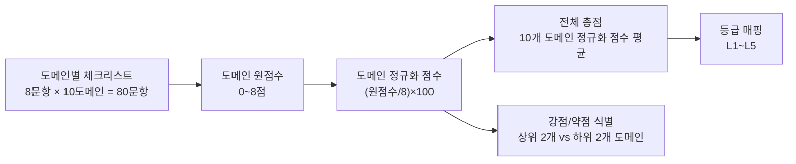

에이전틱 코딩, MCP, 멀티에이전트 오케스트레이션, 하이브리드 RAG가 실무 표준으로 자리잡은 2026년 중반 시점을 기준으로, 개인의 AI 활용 성숙도를 10개 영역·80개 체크포인트로 측정하고 점수화하는 도구다. 각 도메인은 체크한 항목 수에 따라 0~8점을 가지며, 이를 정규화한 점수의 평균이 전체 성숙도 점수가 된다. 문서 말미에서는 이 체계를 실제 Claude Code 기반 프로젝트 두 건([RummiArena](https://github.com/k82022603/RummiArena), [Hybrid RAG Knowledge Platform](https://github.com/k82022603/hybrid-rag-knowledge-ops))에 적용해, 공개된 README와 문서를 근거로 성숙도를 추정 평가한다.

---

## 채점 구조

체크리스트는 "나는 ~할 수 있다" 또는 "나는 ~한다"는 행동 진술문으로 구성돼 있다. 실제로 그 행동을 하고 있다고 자신 있게 말할 수 있을 때만 체크하는 것을 권한다. "알고는 있다" 수준은 체크하지 않는 편이 낫다 — 이 도구는 지식 여부가 아니라 실행 여부를 측정하도록 설계됐기 때문이다.

### 등급 표

| 총점 구간 | 등급 | 설명 |
|---|---|---|
| 0~20 | L1 입문 | AI 도구를 써본 경험은 있지만 체계적인 워크플로우는 아직 없다. 프롬프트 하나로 나온 결과를 그대로 받아쓰는 단계. |
| 21~40 | L2 활용자 | 반복 작업에 AI를 일상적으로 쓰지만 검증·보안·비용 관리는 임기응변적이다. |
| 41~60 | L3 숙련자 | 에이전틱 워크플로우를 스스로 구성하고 하네스·도구를 조합해 실무 문제를 해결한다. 다만 일부 영역(보안, 관측성 등)은 여전히 취약할 수 있다. |
| 61~80 | L4 전문가 | 여러 도메인에 걸쳐 설계 수준의 판단(오케스트레이션 패턴 선택, 비용-품질 트레이드오프)을 내리고 실험으로 파라미터를 최적화한다. |
| 81~100 | L5 아키텍트/리더 | 보안·관측성·비용·배포를 아우르는 조직 차원의 AI 시스템을 설계·거버넌스하고 지식을 전파한다. |

### 강점·약점 분석 방법

정규화 점수가 가장 높은 2개 도메인을 강점, 가장 낮은 2개 도메인을 약점으로 식별한다. 다만 특정 도메인이 애초에 자신의 작업 범위와 무관하다면(예: RAG를 다루지 않는 사람에게 RAG 도메인) 이를 "약점"이 아니라 "비적용 영역"으로 별도 표기해야 한다. 총점만 보기보다 도메인별 편차를 함께 보는 것이 더 진단적이다 — 편차가 크면 특정 영역에 집중된 전문성, 편차가 작으면 고르게 갖춰진 실무형 역량을 뜻한다.

---

## 본문: 10개 도메인

### 도메인 1 — AI 기초 리터러시 & 프롬프트/모델 운용

2026년 중반 기준으로도 성숙도의 출발점은 모델 자체에 대한 이해다. DORA의 AI 지원 소프트웨어 개발 보고서는 개발자의 약 90%가 AI 도구를 사용하지만 결과물을 깊이 신뢰하는 비율은 약 24%에 그친다고 보고했다 — 사용량과 신뢰도 사이의 격차가 이 도메인 전체를 관통하는 문제라는 뜻이다. 이 격차를 줄이는 출발점은 모델별 특성(추론 성향, 컨텍스트 윈도우, 비용 구조)을 구분해 목적에 맞게 쓰는 습관이다. Claude, GPT 계열, DeepSeek, 로컬 Ollama 모델은 추론 깊이·비용·응답속도가 크게 다르며, 특히 복잡한 조합 탐색이 필요한 과제에서는 비추론 모델이 구조적으로 부적합하다는 점이 실무 실험을 통해 반복적으로 확인된다. 구조화된 출력(JSON 스키마 등)을 요청해 후속 파이프라인과 연결하는 능력도 이 단계에서부터 요구된다.

| # | 체크리스트 | ☐ |
|---|---|---|
| 1-1 | 여러 프론티어 모델의 강약점을 구분해 목적에 맞게 선택한다 | ☐ |
| 1-2 | 프롬프트에 역할, 제약조건, 출력 형식을 명시적으로 설계한다 | ☐ |
| 1-3 | Few-shot 예시와 단계적 추론 유도를 상황에 맞게 활용한다 | ☐ |
| 1-4 | 모델별 컨텍스트 윈도우 한계와 요금 체계를 이해하고 있다 | ☐ |
| 1-5 | 환각 발생 가능성을 인지하고 결과를 검증하는 습관이 있다 | ☐ |
| 1-6 | 최신 모델 릴리스 노트나 시스템 카드를 확인하는 습관이 있다 | ☐ |
| 1-7 | 로컬 모델과 API 모델의 트레이드오프를 이해한다 | ☐ |
| 1-8 | 구조화된 출력을 요청해 후속 파이프라인에 연결할 수 있다 | ☐ |

### 도메인 2 — 에이전틱 코딩 & 하네스 엔지니어링

"하네스 엔지니어링"이라는 용어 자체가 2026년 2월 두 개의 독립적인 게시물에서 거의 동시에 등장했을 만큼 최근에 정착한 개념이다. 핵심 공식은 "에이전트 = 모델 + 하네스"이며, 모델의 지능을 실제로 쓸모 있게 만드는 것은 그 주위를 감싸는 프롬프트·도구·컨텍스트 정책·훅·서브에이전트·피드백 루프라는 관점이다. 실무에서는 CLAUDE.md나 AGENTS.md 같은 규칙 파일을 "실패 사례에 근거해서만" 작성하고, 근거 없는 이상적 규칙은 배제해야 한다는 원칙이 통용된다. 정보 비대칭 — 사람은 알지만 에이전트는 모르는 관행 — 을 하네스에 인코딩하는 것이 핵심 과제로 꼽힌다. 2026년 5월 Anthropic이 소개한 동적 워크플로우는 작업 계획을 모델의 컨텍스트 윈도우가 아니라 실행 가능한 코드로 표현해, 대규모 코드 이관 같은 작업에서도 컨텍스트 한계를 우회하는 방식을 보여줬다. Claude Code의 내부 구조를 분석한 2026년 4월 연구는 5단계 점진적 컴팩션, 서브에이전트 격리, 27종 훅 이벤트 파이프라인을 확인했는데, 이는 성숙한 하네스가 갖춰야 할 요소들의 실질적인 참고 모델이 된다.

| # | 체크리스트 | ☐ |
|---|---|---|
| 2-1 | 프로젝트 규칙 파일을 실패 사례 기반으로 설계한다(이상적 규칙 배제) | ☐ |
| 2-2 | Hooks를 활용해 안전장치나 검증 로직을 자동화한다 | ☐ |
| 2-3 | Skills(점진적 공개)를 활용해 컨텍스트 낭비 없이 기능을 확장한다 | ☐ |
| 2-4 | Subagent로 컨텍스트를 격리해 메인 스레드 오염을 방지한다 | ☐ |
| 2-5 | 컨텍스트 압축·컴팩션 전략을 이해하고 활용한다 | ☐ |
| 2-6 | 에이전트 루프의 전형적 실패 모드를 인지하고 대응한다 | ☐ |
| 2-7 | 장시간 자율 실행 작업에 체크포인트·플랜 파일 기반 상태 유지를 적용한다 | ☐ |
| 2-8 | 모델 교체 시 하네스에 미치는 영향을 함께 고려한다 | ☐ |

### 도메인 3 — MCP & 도구 통합 생태계

MCP는 로컬·원격 도구와 데이터 소스를 에이전트에 연결하는 표준 프로토콜로 자리잡았지만, 동시에 새로운 공격 표면이기도 하다. MCP 사양은 하네스가 모든 MCP 도구 정보를 시스템 프롬프트에 주입하도록 요구하는데, 도구를 너무 많이 연결하면 에이전트가 오히려 둔해지고 시작 속도가 느려진다는 실무적 한계가 있다. Claude Code는 이를 완화하기 위해 MCP 도구를 지연 로딩하는 기능을 실험 중이지만 아직 불안정한 상태다. 보안 측면에서는 "도구 포이즈닝"이 새로운 형태의 프롬프트 인젝션으로 불릴 만큼 부상했다 — 공격자가 도구 설명 안에 사용자에게는 보이지 않는 지시문을 숨겨 에이전트를 조종하는 방식이며, 2026년 한 공개 조사에서는 IDE·사내 도구·클라우드 서비스를 합쳐 최대 20만 개의 취약한 MCP 인스턴스가 노출된 것으로 확인됐다. NIST 산하 AI Agent Standards Initiative가 2026년 2월 출범했지만 상호운용성 프로파일은 2026년 4분기에나 나올 예정이어서, 당분간은 도구 화이트리스팅·아이덴티티 바인딩·런타임 모니터링 같은 심층방어가 실무적으로 유일한 답에 가깝다.

| # | 체크리스트 | ☐ |
|---|---|---|
| 3-1 | MCP 서버를 연결해 로컬·원격 도구와 데이터 소스를 확장한다 | ☐ |
| 3-2 | 필요한 MCP만 선택적으로 로드해 컨텍스트 오염을 최소화한다 | ☐ |
| 3-3 | 도구 설명이 프롬프트에 그대로 노출된다는 점을 인지하고 신뢰할 수 없는 서버를 경계한다 | ☐ |
| 3-4 | 도구 권한을 최소권한 원칙으로 제한한다 | ☐ |
| 3-5 | OAuth·API 키 기반 인증이 필요한 MCP를 안전하게 관리한다 | ☐ |
| 3-6 | MCP를 CLI로 감싸거나 Skill로 재구성해 조합성을 높인다 | ☐ |
| 3-7 | 신규 MCP 서버 도입 전 보안 검토(도구 포이즈닝 가능성 등)를 수행한다 | ☐ |
| 3-8 | 자신의 워크플로우에 맞는 MCP 레지스트리를 탐색하고 큐레이션한다 | ☐ |

### 도메인 4 — 멀티에이전트 오케스트레이션 & 워크플로우 설계

멀티에이전트 아키텍처를 선택할 때는 서브에이전트·스킬·핸드오프·라우터라는 네 가지 패턴 중 어떤 것이 상황에 맞는지 판단하는 능력이 핵심으로 꼽힌다. 한 실무 비교에 따르면 여러 도메인을 넘나드는 작업에서는 서브에이전트 방식이 스킬 방식보다 토큰을 67% 적게 소비하는데, 컨텍스트 격리가 도메인 간 정보 오염을 막아주기 때문이다. GitHub가 2026년 2월 공유한 실패 패턴 분석은 멀티에이전트 시스템을 사실상의 분산 시스템으로 취급해야 한다고 지적한다 — 모든 핸드오프에 타입이 지정된 스키마와 명시적 경계 검증이 필요하다는 것이다. 업계에서 논의되는 8단계 성숙도 모델의 최상위 단계는 중앙 오케스트레이터 없이 에이전트들이 조정 없이 협업하는 수준이지만, 실제 전제조건은 멀티에이전트 레이어 자체가 아니라 PR·Slack·Jira·Notion·코드에 흩어진 조직적 맥락을 모든 에이전트가 공유할 수 있게 만드는 일이라는 지적도 함께 나온다. 팀 단위 운영에서는 고비용 모델을 설계·검토에, 저비용 모델을 반복 실행에 배정하는 모델 티어링이 함께 다뤄지는 경우가 많다.

| # | 체크리스트 | ☐ |
|---|---|---|
| 4-1 | Subagent·Skill·Handoff·Router 패턴의 차이와 적합한 상황을 구분한다 | ☐ |
| 4-2 | 병렬화가 필요한 작업과 순차 처리가 필요한 작업을 구분해 설계한다 | ☐ |
| 4-3 | 에이전트 간 핸드오프에 타입 스키마와 경계 검증을 적용한다 | ☐ |
| 4-4 | 중앙 오케스트레이터 유무에 따른 트레이드오프를 이해하고 선택한다 | ☐ |
| 4-5 | 에이전트별로 역할에 따른 권한과 도구 접근을 분리한다 | ☐ |
| 4-6 | 오케스트레이션 계획을 실행 가능한 코드로 표현해 컨텍스트 한계를 극복한다 | ☐ |
| 4-7 | 멀티에이전트 시스템의 실패를 분산 시스템 관점(부분 실패, 재시도)에서 다룬다 | ☐ |
| 4-8 | 에이전트 팀 운영 시 모델 티어링을 적용한다 | ☐ |

### 도메인 5 — RAG & 지식 엔지니어링

RAG의 신뢰성 문제는 여전히 현재진행형이다. 스탠퍼드의 법률 분야 RAG 환각 연구는 설정에 따라 검색 기반 시스템에서도 17~34%의 질의에서 환각이 발생한다고 보고했다 — 검색을 붙인다고 환각이 저절로 사라지지 않는다는 뜻이다. 그래서 실무 성숙도는 단순히 벡터 검색을 붙였는지가 아니라, 파싱→청킹→임베딩→엔티티추출로 이어지는 ETL 파이프라인을 설계하고 Dense·Sparse 임베딩·BM25·그래프 검색을 RRF(Reciprocal Rank Fusion)로 결합한 뒤 리랭커로 재정렬하는 하이브리드 구조를 갖췄는지, 그리고 그 구조를 변수 하나씩 격리하는 반복 실험으로 튜닝했는지에서 갈린다. 한국어처럼 형태소가 복잡한 언어에서는 Nori 같은 형태소 분석기를 BM25 계층에 적용하지 않으면 키워드 검색 품질이 정상적으로 작동하지 않는다는 점도 실무에서 반복적으로 확인되는 함정이다. 지식그래프는 문서 간 숨은 관계를 질의할 수 있게 해주는 요소로, 순수 벡터 검색만으로는 다루기 어려운 관계형 질문에 대응한다.

| # | 체크리스트 | ☐ |
|---|---|---|
| 5-1 | 파싱-청킹-임베딩-엔티티추출로 이어지는 ETL 파이프라인을 설계할 수 있다 | ☐ |
| 5-2 | Dense·Sparse 임베딩과 BM25, 그래프 검색을 결합하는 하이브리드 검색을 이해한다 | ☐ |
| 5-3 | RRF 등으로 다중 검색 결과를 통합하는 방법을 안다 | ☐ |
| 5-4 | 리랭커의 필요성과 중복 연산 최소화를 함께 고려한다 | ☐ |
| 5-5 | 지식그래프를 활용해 관계 기반 질의를 지원할 수 있다 | ☐ |
| 5-6 | 비영어권 텍스트의 형태소 분석기 적용 필요성을 인지한다 | ☐ |
| 5-7 | 청크 크기, top-k 등 RAG 파라미터를 실험적으로 튜닝한 경험이 있다 | ☐ |
| 5-8 | RAG 환각률이 구성에 따라 상당히 달라질 수 있음을 인지하고 검증 체계를 갖춘다 | ☐ |

### 도메인 6 — 평가·관측성·품질보증

에이전틱 코딩 벤치마크는 최근 2~3년 사이 극적으로 개선됐다. SWE-bench Verified 기준으로 상위 모델과 적절한 하네스의 조합은 2023년 약 4%에서 2026년 70~90%대까지 성공률이 올라왔고, 더 어려운 pro 변형에서도 50~77% 수준을 보인다는 조사가 있다. 다만 이 수치는 표준화된 벤치마크의 이야기이고, 실무에서는 RAGAS 같은 지표(Faithfulness, Context Precision, Context Recall)로 RAG 결과물을 정량 평가하고 사람에 의한 UAT와 LLM-as-judge를 병행하는 것이 요구된다. 관측성 측면에서는 Prometheus·Grafana·Jaeger·Loki 같은 스택으로 트레이싱과 로그를 구축하는 것이 표준적인 관행으로 자리잡았고, 회귀 테스트를 CI 파이프라인에 포함해 릴리스 게이트로 쓰는 방식도 늘고 있다. 커버리지·FAIL 건수 같은 정량 지표를 품질 게이트로 명문화하는 조직이 늘고 있다는 점도 이 도메인의 성숙도를 가르는 기준이 된다.

| # | 체크리스트 | ☐ |
|---|---|---|
| 6-1 | RAGAS 등 정량적 RAG 평가지표를 활용한다 | ☐ |
| 6-2 | 코딩 에이전트의 결과물에 자동화된 테스트(유닛·통합·E2E)를 요구한다 | ☐ |
| 6-3 | 벤치마크나 자체 평가셋으로 에이전트 성능을 정기적으로 측정한다 | ☐ |
| 6-4 | 트레이싱·로그 관측성 도구를 구축한다 | ☐ |
| 6-5 | 변수를 하나씩 격리하는 반복 실험으로 파라미터를 검증한다 | ☐ |
| 6-6 | 커버리지, FAIL 건수 등 정량 지표를 릴리스 기준(Quality Gate)으로 사용한다 | ☐ |
| 6-7 | LLM-as-judge 등 자동평가와 사람 평가(UAT)를 병행한다 | ☐ |
| 6-8 | 회귀 테스트를 CI 파이프라인에 포함한다 | ☐ |

### 도메인 7 — 보안·거버넌스·리스크관리

2026년 상반기 보안 리서치들은 한목소리로 경고를 강화하고 있다. OWASP GenAI Security Project의 State of Agentic AI Security and Governance 2.01판은, 2025년판이 "그럴듯한 위협"을 정리한 수준이었다면 2026년판은 실제 CVE와 벤더 권고, 침해 보고서를 카테고리별로 축적한 문서로 바뀌었다고 밝혔다. 특히 코딩 에이전트가 새로운 공격 데이터의 대부분을 차지하는데, OWASP가 추적하는 53개 에이전틱 프로젝트 중 28개가 코딩 에이전트였고 Claude Code·Gemini CLI·Codex·Cline·Aider 등 빠르게 성장한 다섯 개 도구가 모두 이 범주에 속했다. Cursor를 겨냥한 CVE-2026-22708은 화이트리스트에 등록된 명령조차 공격자가 임의 페이로드를 전달하는 통로로 악용될 수 있음을 보여줬다 — 화이트리스트 자체가 자동 승인을 유도해 공격을 더 쉽게 만든 역설적 사례다. 2026년의 한 기업 보안 설문에서는 조사 대상 조직의 88%가 확인되었거나 의심되는 AI 에이전트 보안 사고를 겪었다고 답했지만, 별도 설문에서는 82%의 경영진이 기존 정책이 무단 에이전트 행동을 이미 막고 있다고 믿고 있었다 — 인식과 실제 사이의 간극이 이 도메인의 핵심 리스크로 지목된다. 모델에게 "하지 말라"고 지시한 사실은 규제 관점에서 접근통제의 증거로 인정되지 않는다는 지적도, 모델 수준 방어만으로는 부족하고 권한 최소화·킬스위치·네트워크 격리 같은 아키텍처 수준 통제가 함께 필요함을 보여준다.

| # | 체크리스트 | ☐ |
|---|---|---|
| 7-1 | 프롬프트 인젝션(직접·간접)의 공격 벡터를 이해하고 방어를 설계한다 | ☐ |
| 7-2 | 도구 포이즈닝 위험을 인지하고 도구 출처를 검증한다 | ☐ |
| 7-3 | 에이전트를 권한을 가진 아이덴티티로 취급해 최소권한·감사로그를 적용한다 | ☐ |
| 7-4 | 위험 명령 자동승인(allowlist)의 부작용을 인지하고 신중히 관리한다 | ☐ |
| 7-5 | AI 사용 비용에 상한을 설정해 오남용을 방지한다 | ☐ |
| 7-6 | OWASP LLM Top 10, NIST AI RMF 등 표준 프레임워크를 참고해 점검한다 | ☐ |
| 7-7 | 시크릿·API 키를 코드 저장소에서 분리 관리한다 | ☐ |
| 7-8 | 정적분석·이미지 스캔 등 보안 게이트를 CI에 통합한다 | ☐ |

### 도메인 8 — 배포·인프라·운영

에이전틱 코딩으로 만들어진 산출물이 늘어나면서, 그것을 안정적으로 배포·운영하는 역량 자체도 AI 성숙도의 일부로 편입되고 있다. Kubernetes와 Helm으로 선언적 배포를 구성하고 ArgoCD 같은 GitOps 도구로 배포 자동화와 상태 동기화를 이루는 것, 모든 상태를 외부 스토어(Redis 등)에 위임해 파드가 재시작되어도 서비스가 끊기지 않는 스테이트리스 설계가 표준적인 성숙도 지표로 쓰인다. CI/CD 파이프라인을 린트-테스트-품질검사-빌드-보안스캔-배포의 다단계로 구성하고, 정적분석과 이미지 스캔을 배포 게이트로 통합하는 DevSecOps 관행도 여기에 포함된다. 운영 인수인계 문서, 장애 대응 매뉴얼, 프로덕션 환경 가이드처럼 담당자가 바뀌어도 시스템을 이어받을 수 있게 하는 문서화 수준도 이 도메인이 다루는 영역이다.

| # | 체크리스트 | ☐ |
|---|---|---|
| 8-1 | 컨테이너 오케스트레이션(Kubernetes 등)으로 AI 서비스를 배포할 수 있다 | ☐ |
| 8-2 | Helm 차트 등으로 배포를 선언적·재현 가능하게 관리한다 | ☐ |
| 8-3 | GitOps로 배포 자동화와 상태 동기화를 구현한다 | ☐ |
| 8-4 | 스테이트리스 설계로 재시작·스케일링에 강건한 아키텍처를 만든다 | ☐ |
| 8-5 | CI/CD 파이프라인을 다단계로 구성한다 | ☐ |
| 8-6 | 헬스체크·레디니스 프로브 등 운영 안정성 장치를 갖춘다 | ☐ |
| 8-7 | 인수인계 가능한 운영 매뉴얼·장애 대응 문서를 작성한다 | ☐ |
| 8-8 | 프로덕션 배포 전 보안·성능 회귀 테스트를 통과 기준으로 삼는다 | ☐ |

### 도메인 9 — 비용/리소스 최적화 & 모델 선택 전략

2026년 FinOps 커뮤니티에서는 "TokenOps"라는 용어가 자리잡았다 — 클라우드 FinOps의 가시성·배분·최적화 원칙을 LLM 토큰 소비에 그대로 적용하는 운영 규율이다. 핵심 전략은 각 요청을 품질 요구를 충족하는 가장 저렴한 모델로 라우팅하는 모델 티어링(전형적으로 비용을 30~60% 절감), 불필요한 지시문을 줄이는 프롬프트 압축(20~50% 절감), 유사 질의에 대한 응답을 재사용하는 시맨틱 캐싱(적용 가능한 워크로드에서 40~80% 절감)이다. 전통적인 클라우드 FinOps 도구는 토큰 단위 과금이나 에이전트의 폭주성 지출 패턴을 제대로 잡아내지 못한다는 지적이 많아, 요청마다 팀·기능·환경 메타데이터를 태깅하는 별도의 계측이 필요하다는 점이 여러 실무 사례에서 공통적으로 강조된다. 최적화가 능사는 아니며, 비용을 줄이면서도 품질 지표가 함께 유지되는지를 검증하는 것이 이 도메인의 성숙한 실행이다.

| # | 체크리스트 | ☐ |
|---|---|---|
| 9-1 | 모델 티어링(역할별 고비용/저비용 모델 분리)으로 비용을 최적화한다 | ☐ |
| 9-2 | 요청 단위로 토큰 사용량과 비용을 태깅·추적한다 | ☐ |
| 9-3 | 프롬프트 압축, 캐싱으로 비용을 절감한다 | ☐ |
| 9-4 | 모델 간 비용 대비 성능을 실측 비교해 의사결정한다 | ☐ |
| 9-5 | 비용 상한과 이상 탐지를 운영에 반영한다 | ☐ |
| 9-6 | 배치·비동기 처리로 실시간성이 불필요한 작업의 비용을 낮춘다 | ☐ |
| 9-7 | 로컬·오픈소스 모델과 API 모델의 총소유비용을 비교한다 | ☐ |
| 9-8 | 비용 최적화가 품질 저하로 이어지지 않는지 검증 지표를 함께 추적한다 | ☐ |

### 도메인 10 — 생태계 추적 & 지속 학습

이 도메인 자체가 왜 중요한지는 앞선 아홉 개 도메인의 용어 상당수가 2026년 상반기에 처음 정착했다는 사실이 보여준다 — "하네스 엔지니어링"이라는 용어는 2026년 2월에, MCP의 2026 로드맵과 동적 서브에이전트 워크플로우는 2026년 5월에, OWASP의 실증적 보안 카탈로그는 2026년 6월에 나왔다. 이런 속도에서는 랩(Anthropic, OpenAI, Google 등)의 릴리스 노트와 시스템 카드를 주기적으로 확인하는 습관, 실패 사례를 문서화해 팀 또는 커뮤니티와 공유하는 관행, 검증된 정보와 커뮤니티 소스 정보를 구분해 축적하는 개인 지식베이스 운영이 실질적인 경쟁력으로 작동한다. 새로운 기능이나 도구를 프로덕션에 바로 적용하기보다 소규모 파일럿으로 먼저 검증하는 습관, 학습한 내용을 반복 사용 가능한 프롬프트·스킬·문서로 구조화하는 능력도 여기 포함된다.

| # | 체크리스트 | ☐ |
|---|---|---|
| 10-1 | 주요 랩의 릴리스 노트와 시스템 카드를 주기적으로 확인한다 | ☐ |
| 10-2 | 하네스·에이전트 프레임워크 관련 최신 논문·아티클을 큐레이션한다 | ☐ |
| 10-3 | 실패 사례와 학습을 문서화해 팀·커뮤니티와 공유한다 | ☐ |
| 10-4 | 개인 지식베이스에 검증된 정보와 출처를 구분해 축적한다 | ☐ |
| 10-5 | 커뮤니티(컨퍼런스, 포럼, 오픈소스)에 능동적으로 기여하거나 피드백을 주고받는다 | ☐ |
| 10-6 | 새로운 기능·도구를 프로덕션 적용 전 소규모로 파일럿해본다 | ☐ |
| 10-7 | 업계 표준화 동향의 변화를 추적한다 | ☐ |
| 10-8 | 학습한 내용을 재사용 가능한 프롬프트·스킬·문서로 구조화해 축적한다 | ☐ |

---

## 결론 — 두 프로젝트에 대한 AI 성숙도 평가

### 평가 방법론과 한계

아래 평가는 RummiArena와 Hybrid RAG Knowledge Platform(HRKP)의 공개 README와 문서에 명시적으로 기술된 사실만을 근거로, 항목별 1점씩 부여하는 방식으로 이뤄졌다. 텍스트로 명시되지 않은 항목은 "실제로 미흡하다"가 아니라 "공개 정보로는 확인할 수 없다"는 의미로 0점 처리했으며, 실제 코드베이스를 전수 감사한 결과가 아니라는 점을 분명히 밝힌다. 두 프로젝트 모두 MCP 프로토콜 자체를 채택하지 않고 각자 직접 API 어댑터(RummiArena)와 LangGraph/LangChain(HRKP)으로 도구 통합을 구현했기 때문에, 도메인 3(MCP)은 두 프로젝트 모두 낮은 점수가 나온다 — 이는 역량 부족이 아니라 아키텍처 선택의 결과로 해석해야 한다.

### RummiArena 평가

RummiArena는 2026년 5월 10일 종료된 루미큐브 기반 멀티 LLM 전략 실험 플랫폼으로, GPT-5-mini·DeepSeek V4-Pro·Ollama qwen2.5:3b·Claude Sonnet 4 네 개 모델이 실시간으로 대전하며 전략을 비교한다. Go 기반 게임 서버, NestJS 기반 AI 어댑터, Next.js 프론트엔드로 구성되며 Kubernetes·Helm·ArgoCD 기반으로 배포된다. 2,462건의 테스트가 모두 통과했고 GitLab CI 17단계 파이프라인이 전부 그린 상태로 종료됐다.

| 도메인 | 원점수 | 정규화 | 근거 |
|---|---|---|---|
| 1. 기초 리터러시 | 6/8 | 75 | 4개 모델 비교실험과 모델별 프롬프트 정책 문서, Ollama(로컬)와 API 모델의 명시적 비교, MoveRequest/MoveResponse 구조화 출력 |
| 2. 하네스 엔지니어링 | 4/8 | 50 | "Agent Teams 13명 체제", 세션·회고 로그 체계, AI 어댑터를 모델 무관 인터페이스로 분리한 설계 원칙. CLAUDE.md·hooks·skills·컴팩션에 대한 명시적 언급은 없음 |
| 3. MCP & 도구 통합 | 0/8 | 0 | MCP 프로토콜 언급 없음(직접 API 연동 방식 채택) |
| 4. 멀티에이전트 오케스트레이션 | 5/8 | 62.5 | MoveRequest/MoveResponse 타입 계약, Turn Orchestrator 존재, LLM 응답 3회 재시도·강제 드로우의 실패 처리, 모델별 비용 비교를 통한 티어링 근거 |
| 5. RAG & 지식 엔지니어링 | 0/8 | 0 | 게임 플랫폼 특성상 RAG 요소 자체가 프로젝트 범위 밖 |
| 6. 평가·관측성·품질보증 | 6/8 | 75 | 2,462건 테스트, Sprint별 변수 격리 실험(v2~v9 프롬프트 반복 실험), SonarQube Quality Gate, 88.6% 플레이테스트(사람 평가) |
| 7. 보안·거버넌스 | 5/8 | 62.5 | LLM 신뢰 금지 아키텍처(항상 게임 엔진으로 검증), Redis 슬라이딩 윈도 레이트 리미팅, 일일 $20 AI 비용 상한, 시크릿 주입 스크립트 분리, Trivy·SonarQube 스캔 |
| 8. 배포·인프라·운영 | 8/8 | 100 | Kubernetes, Helm 차트 7종, ArgoCD GitOps, Redis 기반 스테이트리스 서버, 17단계 CI/CD, /health·/ready 엔드포인트, 운영·인수인계 문서 다수 |
| 9. 비용 최적화 | 4/8 | 50 | 모델별 비용/게임 비교표(DeepSeek가 Claude 대비 28배 효율), Ollama(로컬, $0) vs API 비교, 비용과 승률(Place Rate)을 함께 표기 |
| 10. 생태계 추적·지속 학습 | 5/8 | 62.5 | 최신 모델(Claude Sonnet 4, DeepSeek V4-Pro thinking) 사용, 26개 도구체인 매뉴얼, 회고 로그 체계, v2~v9 반복 실험을 통한 파일럿 검증 |

**총점: 43/80 → 53.75점 (약 54점) → L3 숙련자**

강점은 배포·인프라·운영(100점)이 압도적이며, 기초 리터러시와 평가·품질보증(각 75점)이 뒤를 잇는다. Kubernetes·Helm·ArgoCD·DevSecOps를 모두 갖춘 배포 체계와, 4개 모델을 실시간으로 맞붙여 정량 비교한 실험 설계가 이 프로젝트의 핵심 역량임을 보여준다. 반면 하네스 엔지니어링과 비용 최적화(각 50점)는 프로젝트 자체가 다루는 영역임에도 공개 문서상 근거가 상대적으로 얕아, 개선 여지가 있는 영역으로 분류할 수 있다. RAG와 MCP(각 0점)는 프로젝트 성격상 애초에 다루지 않는 비적용 영역으로 봐야 한다.

### Hybrid RAG Knowledge Platform 평가

HRKP는 2025년 12월부터 2026년 3월 10일까지 10개 스프린트·130개 스토리·458 스토리포인트로 완료된 기업 지식 검색 플랫폼이다. Neo4j·Elasticsearch·PostgreSQL의 3중 저장소 위에 4-Way 하이브리드 검색(Dense+Sparse+BM25+Graph)을 RRF와 BGE-Reranker로 결합했고, Claude Code(Opus 4.6·Sonnet 4.6)와 13개 AI 에이전트가 개발팀처럼 협업하며 구축했다. 런타임은 DeepSeek V3.2를 사용해 전체 파이프라인을 약 52달러에 운영했다.

| 도메인 | 원점수 | 정규화 | 근거 |
|---|---|---|---|
| 1. 기초 리터러시 | 6/8 | 75 | 런타임(DeepSeek)과 개발(Claude Opus/Sonnet) 모델을 역할별로 명확히 분리, RAGAS Faithfulness로 환각 검증, 비용표 명시, 구조화된 엔티티 추출 |
| 2. 하네스 엔지니어링 | 4/8 | 50 | CLAUDE.md v2.29(버전 관리), PLAN.md, 13개 AI 에이전트(PM/TL/Dev/QA) 협업, "Mock 금지 정책 수립" 같은 실패 사례 기반 정책, Opus 4.6 전환 마일스톤 |
| 3. MCP & 도구 통합 | 0/8 | 0 | MCP 프로토콜 언급 없음(LangGraph/LangChain 직접 통합 채택) |
| 4. 멀티에이전트 오케스트레이션 | 5/8 | 62.5 | "Agent Teams 가이드(멀티에이전트 협업+모델티어링)" 문서, PM/TL/Dev/QA 역할 분리, 병렬 실행 명시, LangGraph 기반 워크플로우 코드화 |
| 5. RAG & 지식 엔지니어링 | 8/8 | 100 | 3-Phase ETL, 4-Way 하이브리드 검색+RRF+BGE-Reranker, 지식그래프(9.2만 엔티티·77.5만 관계), Nori 형태소 분석기, 18회 변수 격리 실험, RAGAS 기반 환각 검증 체계 |
| 6. 평가·관측성·품질보증 | 8/8 | 100 | RAGAS v7→v16(0.543→0.763, A등급), 단위 테스트 1,197건 0 FAIL, UAT 18/18 PASS, Prometheus/Grafana/Kibana/Jaeger/Loki 전체 관측성 스택, GPT-4o Judge 병행, k6 성능 회귀 테스트 |
| 7. 보안·거버넌스 | 1/8 | 12.5 | README의 보안 섹션이 ".env 관리, 기본 비밀번호 변경 권장, 프로덕션 ES 보안 활성화 권장" 세 줄에 그침. 실제 구현이 확인되는 항목은 .env 분리 관리뿐이며, 나머지는 "권장" 수준에 머물러 있음 |
| 8. 배포·인프라·운영 | 3/8 | 37.5 | Docker Compose 18개 컨테이너와 8개 GitHub Actions 워크플로, 운영 매뉴얼 존재. 다만 Kubernetes·Helm·GitOps·스테이트리스 설계에 대한 명시적 근거는 없어 RummiArena 대비 상대적으로 얕음 |
| 9. 비용 최적화 | 5/8 | 62.5 | 런타임/개발 모델 티어링, 임베딩 캐싱으로 149배 속도 향상, DeepSeek 대 GPT-4o·Claude Sonnet·Opus 비용 비교표(1x/15x/20x/102x), 품질(RAGAS A등급) 유지하며 비용 절감 입증 |
| 10. 생태계 추적·지속 학습 | 5/8 | 62.5 | Opus 4.6 전환 이력 기록, "32일 미적용 사고 → E2E 검증 필수" 같은 실패 사례 문서화, 7개 카테고리 work_logs 체계, 18회 실험을 통한 신기법 파일럿 |

**총점: 45/80 → 56.25점 (약 56점) → L3 숙련자**

강점은 RAG·지식 엔지니어링과 평가·관측성·품질보증(각 100점)으로, 이 프로젝트가 정확히 다루려던 문제 — 검색 품질을 정량적으로 끌어올리는 것 — 에서 만점에 가까운 근거를 남겼다. 18회에 걸친 변수 격리 실험으로 RAGAS 점수를 C등급에서 A등급까지 끌어올린 과정이 문서로 상세히 남아 있다는 점이 특히 두드러진다. 반면 보안·거버넌스(12.5점)는 뚜렷한 약점으로, README의 보안 섹션 자체가 매우 간략해 프로덕션 수준의 보안 통제가 문서화되어 있지 않다. 배포·인프라·운영(37.5점) 역시 Kubernetes 기반 GitOps 체계를 갖춘 RummiArena와 비교하면 상대적으로 얕은 수준에 머문다.

### 두 프로젝트 비교

| 항목 | RummiArena | HRKP |
|---|---|---|
| 총점 | 54점 | 56점 |
| 등급 | L3 숙련자 | L3 숙련자 |
| 최고 강점 도메인 | 배포·인프라·운영(100) | RAG·지식 엔지니어링(100), 평가·품질보증(100) |
| 최대 약점 도메인 | 하네스 엔지니어링·비용 최적화(각 50) | 보안·거버넌스(12.5) |

두 프로젝트는 총점만 보면 54점과 56점으로 거의 같은 L3 숙련자 구간에 놓이지만, 내부 프로파일은 뚜렷하게 다르다. RummiArena는 Kubernetes·Helm·ArgoCD·DevSecOps로 이어지는 배포 신뢰성에서 만점을 받으며 인프라 운영 중심의 성숙도를 보여준 반면, HRKP는 하이브리드 검색·지식그래프·RAGAS 반복 실험이라는 RAG 엔지니어링 본연의 영역에서 만점을 받으며 검색 품질 특화형 성숙도를 보여줬다. 대신 HRKP는 보안 문서화가 RummiArena에 비해 뚜렷하게 얕고, RummiArena는 Docker Compose 수준에 머문 HRKP와 달리 GitOps 기반 배포 체계를 갖췄다는 점에서 서로의 약점을 비추는 거울이 된다. 이는 총점 하나로 두 프로젝트의 AI 성숙도를 동일 선상에서 비교하는 것이 왜 불완전한지를 보여주는 실제 사례이기도 하다 — 같은 점수라도 어느 도메인에서 그 점수를 얻었는지가 실질적인 역량의 성격을 결정한다.

두 프로젝트 모두 공개된 README와 문서에 근거해 추정한 결과이며, 비공개 코드나 커밋 이력까지 검토하면 특히 도메인 2(하네스 엔지니어링), 7(보안), 9(비용 최적화)의 점수는 달라질 수 있다는 점을 다시 한번 밝힌다.

---

작성일자: 2026년 7월 2일
