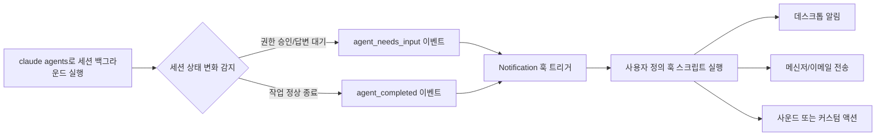
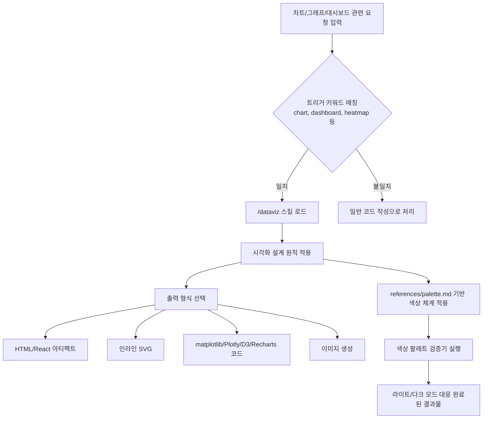

## 관련글

[**Claude Code 2.1.198 에서 오랫동안 기다렸던 기능 하나 및 뜻하지 않은 선물 기능 하나가 (그 외에도 이런저런 추가 및 픽스) 추가됐습니다**](https://www.facebook.com/share/p/1ERN9bAWxf/)

## 1. 개요

2026년 7월 1일, Anthropic은 Claude Code 2.1.198 버전을 릴리스했다. 공식 CHANGELOG(github.com/anthropics/claude-code)와 이를 그대로 반영하는 공식 문서(code.claude.com/docs/en/changelog)를 기준으로 보면, 이번 버전에는 총 32건의 변경 사항이 포함되어 있다. 그중 가장 눈에 띄는 두 가지가 바로 오랫동안 요청되어 온 백그라운드 에이전트 알림 훅(Notification hook)의 추가와, 예고 없이 등장한 차트·대시보드 설계 스킬인 `/dataviz`다. 이 문서는 이 두 기능을 중심으로, 2.1.198 버전 전체의 맥락과 함께 무엇이 실제로 바뀌었는지를 정리한다.

바로 전날인 6월 30일에 릴리스된 2.1.197에서는 Claude Sonnet 5가 Claude Code의 기본 모델로 전환되었고, 네이티브 100만 토큰 컨텍스트 윈도우를 지원하기 시작했다(공식 CHANGELOG, 2026년 6월 30일). 2.1.198은 이 새 모델 위에서 에이전트 운영 경험을 다듬는 성격의 릴리스라고 볼 수 있다.

## 2. 릴리스 흐름 속에서의 2.1.198

Claude Code는 5월 말부터 꾸준히 "백그라운드 에이전트"라는 하나의 축을 중심으로 기능을 확장해 왔다. 서브에이전트가 최대 5단계까지 중첩해서 스스로를 호출할 수 있게 된 것이 2.1.172였고, `claude agents` 뷰에서 세션 상태를 더 정확히 보여주도록 다듬은 것이 2.1.178과 2.1.186이었다. 이런 흐름 속에서 2.1.198은 "백그라운드에서 돌아가는 에이전트가 끝났을 때 또는 입력이 필요할 때, 사용자가 이를 어떻게 알 수 있는가"라는, 실무에서 계속 제기되어 온 질문에 대한 답을 내놓았다. 동시에 이번 버전에서는 Claude in Chrome이 정식 버전(GA)으로 전환되었고, Gateway 상위 프로바이더로 Claude Platform on AWS(anthropicAws)가 추가되는 등 인프라 쪽 변경도 함께 이루어졌다.

## 3. 핵심 기능 ① 백그라운드 에이전트 알림 훅

### 3.1 무엇이 바뀌었는가

공식 CHANGELOG의 표현을 그대로 옮기면 다음과 같다: "`claude agents`에 백그라운드 에이전트 알림이 추가되었다 — 입력이 필요하거나 작업을 마친 세션이 이제 `Notification` 훅(`agent_needs_input` / `agent_completed`)을 발생시킨다."

이전까지 `claude agents`로 여러 세션을 백그라운드에서 돌리는 사용자는, 어떤 세션이 멈춰서 사용자의 승인이나 답변을 기다리고 있는지, 혹은 어떤 세션이 이미 작업을 끝냈는지를 알기 위해 직접 `claude agents` 화면으로 돌아가 확인하는 수밖에 없었다. 세션이 많아질수록 이 확인 작업 자체가 부담이 되었고, 그 사이에 입력 대기 상태로 멈춰 있는 세션은 그만큼 시간을 낭비하게 된다. 2.1.198부터는 이 두 가지 상태 전환이 `Notification` 훅 이벤트로 노출되기 때문에, 훅 스크립트를 연결해 두면 데스크톱 알림, 메신저 전송, 사운드 재생 등 원하는 방식으로 즉시 통지를 받을 수 있게 되었다.

### 3.2 왜 이 기능이 오래 기다려졌는가

Claude Code의 백그라운드 에이전트 관련 변경 이력을 살펴보면, 알림과 상태 전달의 정확성을 개선하려는 시도가 여러 버전에 걸쳐 반복적으로 나타난다. 예를 들어 2.1.187에서는 "에이전트 정지 알림이 누가 에이전트를 멈췄는지 잘못 표시하던 문제"를 수정했고, 2.1.153에서는 백그라운드 작업이 완료된 뒤에도 상태가 "still running"으로 잘못 표시되는 문제를 고쳤다. 이런 자잘한 수정들은 결국 "에이전트가 지금 어떤 상태인지, 그리고 그 상태 변화를 어떻게 사용자에게 알릴 것인지"라는 하나의 큰 과제로 수렴하고 있었다. 2.1.198의 `agent_needs_input` / `agent_completed` 훅은 그 과제에 대한 구조적인 해법에 해당한다. 상태를 화면에 잘 보여주는 것을 넘어, 그 상태 변화 자체를 외부 시스템과 연동 가능한 이벤트로 만들었다는 점에서 의미가 있다.

### 3.3 동작 흐름

이 흐름에서 핵심은 훅이 발생시키는 두 이벤트의 성격이 서로 다르다는 점이다. `agent_needs_input`은 세션이 권한 승인, 사용자 확인, 추가 정보 입력 등을 기다리며 멈춘 상태를 의미하고, `agent_completed`는 세션이 목표한 작업을 끝내고 종료된 상태를 의미한다. 두 이벤트를 구분해서 처리하면, 예를 들어 "입력 대기"는 즉시 알림을 보내되 "완료"는 하루 일과가 끝날 때 모아서 요약 알림으로 보내는 식의 세분화된 자동화도 가능해진다.

### 3.4 참고: 기존 훅 시스템과의 관계

Claude Code에는 이미 `SessionStart`, `Stop`, `SubagentStop` 등 다양한 생명주기 훅이 존재해 왔고, 이번 `Notification` 훅도 같은 훅 설정 체계(`settings.json`의 훅 구성, `/hooks` 명령으로 확인) 안에 편입된다. 즉 완전히 새로운 별도의 알림 시스템이 추가된 것이 아니라, 기존 훅 프레임워크에 `agent_needs_input`과 `agent_completed`라는 새 트리거 지점이 더해진 구조로 이해하는 것이 정확하다. 이 부분은 공식 문서(code.claude.com/docs/en/changelog, 2026년 7월 1일)에 명시된 내용이며, 훅 설정 문법 자체가 이번 버전에서 바뀐 것은 아니다.

## 4. 핵심 기능 ② `/dataviz` 스킬

### 4.1 공식적으로 확인되는 부분

공식 CHANGELOG에 명시된 문구는 다음과 같다: "실행 가능한 색상 팔레트 검증기가 포함된, 차트와 대시보드 설계 가이드를 위한 `/dataviz` 스킬이 추가되었다." 즉 Anthropic이 공식적으로 확인해 주는 내용은 ①이 스킬이 차트·대시보드 설계 가이드 역할을 한다는 것, ②실행 가능한(runnable) 색상 팔레트 검증기가 포함되어 있다는 것, 이 두 가지다. 이 스킬은 Claude Code에 내장된(bundled) 형태로 제공되며, 별도 마켓플레이스 설치 없이 바로 사용할 수 있다.

### 4.2 스킬의 세부 구성

`/dataviz`의 더 구체적인 내부 구성 — 설계 원칙의 세부 항목, 색상 선택 휴리스틱, `references/palette.md` 참조 문서 구조 등 — 은 공식 CHANGELOG 한 줄 설명 이상으로는 Anthropic이 별도 공식 문서를 통해 공개하지 않았다. 아래 내용은 실제로 이 스킬을 사용해 본 커뮤니티 분석(페이스북 게시물 원문)을 바탕으로 한 것이며, 공식 발표문 수준으로 검증된 것은 아니라는 점을 먼저 밝혀 둔다. 다만 이 분석은 Claude Code의 기존 스킬 설계 관례 — SKILL.md 본문과 `references/`, `scripts/` 디렉터리로 구성되는 표준 스킬 구조(공식 문서 code.claude.com/docs/en/skills) — 와 부합하는 내용이어서, 구조적으로는 신빙성이 있다고 판단된다.

이 분석에 따르면 `/dataviz`는 크게 네 가지 역할을 한다.

첫째, 차트나 그래프, 대시보드를 만드는 모든 작업에 앞서 먼저 읽어야 하는 시각화 설계 원칙을 제공한다. 이는 HTML·React 아티팩트로 만들든, 인라인 SVG로 그리든, matplotlib·Plotly·D3·Recharts 같은 라이브러리 코드를 작성하든, PNG 형태의 정적 이미지를 생성하든, 심지어 Slack 공유용 차트를 만들든 상관없이 공통으로 적용되는 상위 가이드 역할을 한다.

둘째, 라이트 모드와 다크 모드 모두에서 일관되게 보이는 색상 체계를 제공한다. 특정 브랜드에 종속되지 않는 중립적인 placeholder 팔레트를 기본값으로 두어, 사용자가 자신의 브랜드 색상으로 손쉽게 교체할 수 있도록 설계되어 있다는 것이 이 분석의 설명이다.

셋째, 색상 선택 휴리스틱과 색상 공식, 그리고 이를 검증하는 도구, 차트 요소를 정의하는 명세(mark spec), 상호작용 규칙 등 실무에 바로 쓸 수 있는 구체적인 도구를 함께 제공한다. 공식 CHANGELOG가 언급한 "실행 가능한 색상 팔레트 검증기"가 바로 이 부분에 해당하는 것으로 보인다.

넷째, `references/palette.md`라는 참조 문서를 통해 검증된 기본 팔레트를 제공하고, 이를 사용자의 브랜드 색상으로 교체(swap)할 수 있는 방법을 안내한다.

이 스킬이 자동으로 트리거되는 키워드로는 chart, graph, plot, data viz, visualization, dashboard, analytics, visualize data, categorical colors, sequential/diverging palette, stat tile, sparkline, heatmap, legend, axis, tooltip, chart colors, color by series 등이 거론된다. 이는 Claude Code의 다른 내장 스킬들이 프런트프론트(frontmatter)의 description 필드를 통해 트리거 조건을 명시하는 방식과 동일한 패턴이다.

### 4.3 이 스킬이 채우는 공백

이 스킬이 갖는 실질적 의미는, Claude.ai나 Cowork 같은 채팅형 인터페이스에서는 이미 아티팩트 기능을 통해 시각화를 빠르게 만들 수 있었던 반면, 원조 격인 Claude Code에서는 상대적으로 이 부분이 체계적으로 정리되어 있지 않았다는 데 있다. 물론 Claude Code에서도 matplotlib이나 D3 같은 라이브러리 코드를 직접 작성하면 어떤 시각화든 만들 수는 있었지만, 일관된 색상 체계나 접근성 기준, 다크 모드 대응 같은 세부 사항은 매번 사용자가 직접 지정해야 했다. `/dataviz`는 이 반복 작업을 스킬 하나로 표준화한 것으로 이해할 수 있다.

### 4.4 실전에서 어떻게 트리거되는가

## 5. 2.1.198의 그 외 주요 변경 사항

두 핵심 기능 외에도 2.1.198에는 실무에 영향을 줄 만한 변경이 여러 건 포함되어 있다. Claude in Chrome이 베타를 벗어나 정식 버전이 되었고, Gateway 환경에서는 Claude Platform on AWS(anthropicAws)가 상위 프로바이더로 추가되었으며 model-not-found 응답이 왔을 때 다음 후보 모델로 자동으로 넘어가도록 개선되었다. `claude agents`에서 시작한 백그라운드 에이전트가 워크트리 안에서 코드 작업을 마치면, 이제는 별도로 사용자에게 묻지 않고 커밋과 푸시, 드래프트 PR 생성까지 자동으로 처리한다. 내장 Explore 에이전트는 이전까지 haiku 모델로 고정 실행되던 것이 메인 세션의 모델(Opus를 상한으로)을 상속하도록 바뀌었고, 서브에이전트와 컨텍스트 압축(compaction) 과정도 메인 세션의 확장 사고(extended thinking) 설정을 상속하게 되어 위임된 작업의 결과물 품질이 개선될 것으로 기대된다.

버그 수정 쪽에서는 네트워크가 잠깐 끊겼을 때(ECONNRESET 등) 턴이 실패로 처리되던 문제, macOS에서 로컬 네트워크 호스트에 접근하지 못하던 문제, 브랜치를 전환해도 `/diff` 패널이 갱신되지 않던 문제 등이 수정되었다. `/agents` 마법사(wizard)는 이번 버전에서 제거되었으며, 서브에이전트를 만들거나 관리할 때는 Claude에게 직접 요청하거나 `.claude/agents/` 디렉터리를 직접 편집하는 방식으로 대체되었다.

아래는 이번 버전의 주요 변경 사항을 성격별로 정리한 표다.

| 구분 | 내용 |
|---|---|
| 알림/관측성 | `agent_needs_input` / `agent_completed` Notification 훅 추가 |
| 시각화 | `/dataviz` 스킬 추가 (실행 가능한 색상 팔레트 검증기 포함) |
| 브라우저 연동 | Claude in Chrome 정식 버전(GA) 전환 |
| 인프라 | Gateway에 Claude Platform on AWS(anthropicAws) 추가, 모델 미발견 시 자동 failover |
| 자동화 강화 | 백그라운드 에이전트가 코드 작업 완료 시 커밋·푸시·드래프트 PR 자동 생성 |
| 모델 상속 | Explore 에이전트가 haiku 대신 메인 세션 모델 상속(Opus 상한) |
| 품질 | 서브에이전트·컨텍스트 압축이 확장 사고 설정 상속 |
| 정리 | `/agents` 마법사 제거, `.claude/agents/` 직접 편집으로 대체 |

## 6. 종합 평가

2.1.198은 겉보기에는 32건의 자잘한 변경 목록처럼 보이지만, 실제로는 두 개의 뚜렷한 축을 갖고 있다. 하나는 백그라운드에서 여러 에이전트를 동시에 굴리는 사용 패턴을 전제로 한 관측성·알림 개선이고, 다른 하나는 Claude Code라는 코딩 중심 도구에 시각화 설계라는 별도의 전문성을 표준 스킬 형태로 이식한 것이다. 전자는 이미 여러 버전에 걸쳐 다듬어져 온 백그라운드 에이전트 경험의 자연스러운 다음 단계이고, 후자는 채팅형 인터페이스가 가지고 있던 강점을 코딩 도구 쪽으로 가져온 시도로 볼 수 있다. 다만 `/dataviz` 스킬의 세부 설계 원칙과 참조 문서 구조는 아직 Anthropic의 공식 문서로 상세히 공개되지 않았으므로, 정확한 동작 방식은 실제로 Claude Code 2.1.198 이상 버전에서 직접 트리거해 보면서 확인하는 것이 가장 확실하다.

---

작성일: 2026년 7월 2일
