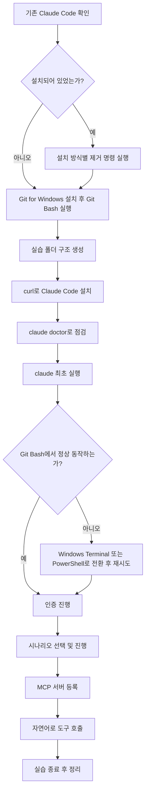
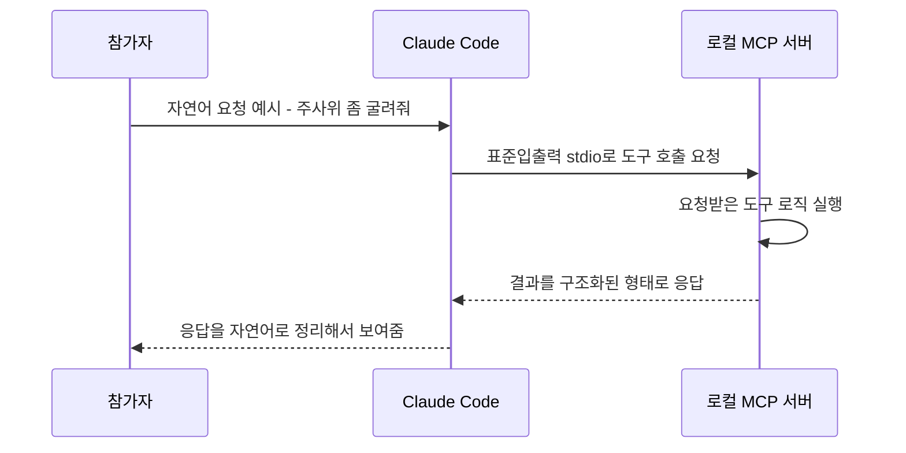
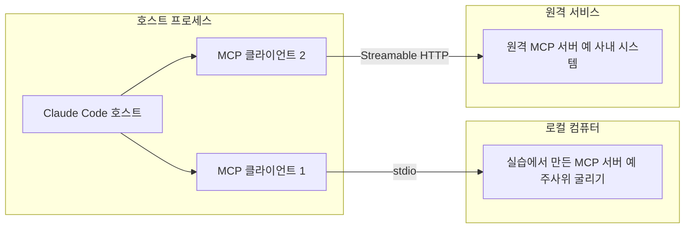
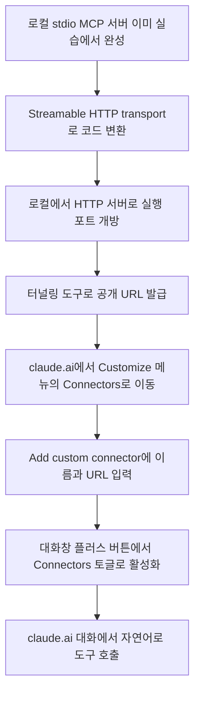

- 문서 작성일: 2026-07-02
- 대상: Windows 노트북을 사용하는 실습 참가자 및 진행자
- 전제: 20명 규모의 1회성 실습이며, Anthropic Console에서 발급한 API 키 하나를 지출 한도(spend limit)를 걸어 공유하는 방식을 사용합니다. 이번 문서는 PowerShell 버전과 달리, 설치부터 실습 종료까지 되도록 Git Bash 창 하나를 계속 띄워둔 상태로 진행하는 시나리오로 새로 작성했습니다.

---

## 시작하기 전에 반드시 읽어야 할 사항

이 문서를 만들면서 "Git Bash를 띄운 상태에서 Git Bash 안에서 Claude Code를 설치하고 실습한다"는 시나리오를 실제로 검증해봤는데, 한 가지 중요한 기술적 한계를 먼저 알려드려야 할 것 같습니다.

Claude Code의 설치 자체는 Git Bash 안에서 문제없이 진행됩니다. 문제는 설치가 끝난 뒤 `claude`라는 대화형(interactive) 세션을 Git Bash 창 안에서 직접 실행할 때입니다. Git Bash가 기본으로 사용하는 터미널 프로그램(MinTTY)은 Claude Code의 대화형 화면이 필요로 하는 특정 터미널 기능(raw mode)을 지원하지 않는 경우가 있어서, `Raw mode is not supported` 라는 오류가 뜨면서 입력 자체가 안 되거나 화면이 멈추는 사례가 Anthropic의 공식 이슈 트래커와 여러 최신(2026년 6월 기준) 커뮤니티 가이드에서 반복적으로 보고되고 있습니다. 반대로 일부 사용자는 Git Bash에서도 별 문제 없이 동작했다고 보고하는 경우도 있어서, 이 문제는 모든 컴퓨터에서 100% 재현되는 것은 아니고 Windows 빌드, Git for Windows 버전, 사용 중인 터미널 프로그램에 따라 갈리는 것으로 보입니다.

그래서 이 문서는 다음 원칙으로 시나리오를 구성했습니다. **Claude Code 설치, 실습 디렉토리 준비, MCP 서버 코드 확인, 파일 작업 등 대부분의 작업은 Git Bash 창 하나에서 그대로 진행**합니다. 다만 **`claude`를 실행해서 실제 대화형 세션에 들어가는 순간, Git Bash에서 `Raw mode is not supported` 오류가 뜨거나 입력이 먹히지 않으면, 그 자리에서 Windows Terminal(설치되어 있다면 Git Bash 프로필로 다시 시도) 또는 PowerShell 창으로 즉시 전환**하도록 안내합니다. 대부분의 참가자 컴퓨터에서는 Git Bash 안에서 바로 될 가능성이 높지만, 20명 중 몇 명은 이 문제를 만날 수 있다는 점을 진행자가 미리 알고 있어야 실습 중 당황하지 않습니다. 이 부분은 실습 초반, 참가자 전원이 처음 `claude`를 실행해보는 순간에 반드시 공지해주시기 바랍니다.

---

## 준비 단계

### 0단계. 기존 Claude Code 완전히 삭제하기

노트북에 예전에 Claude Code를 설치한 적이 있다면, 설치 방식에 따라 파일이 서로 다른 위치에 남아 있을 수 있습니다. Git Bash를 열고 다음 순서로 진행합니다.

먼저 어떤 방식으로 설치되어 있는지 확인합니다.

```bash
which claude
```

이 명령이 돌려주는 경로를 보고 설치 방식을 짐작할 수 있습니다. 경로에 `.local/bin/claude`가 포함되어 있다면 네이티브 인스톨러로 설치된 것이고, npm 전역 디렉토리 경로가 보인다면 npm으로 설치된 것입니다.

**네이티브 인스톨러로 설치했던 경우**, 다음을 순서대로 실행합니다.

```bash
rm -f ~/.local/bin/claude
rm -f ~/.local/bin/claude.exe
rm -rf ~/.local/share/claude
```

**npm으로 설치했던 경우**는 다음 한 줄이면 됩니다.

```bash
npm uninstall -g @anthropic-ai/claude-code
```

**WinGet으로 설치했던 경우**는 다음과 같습니다. winget.exe는 Windows 시스템 실행 파일이라 Git Bash 안에서도 그대로 호출됩니다.

```bash
winget uninstall Anthropic.ClaudeCode
```

실행 파일을 지운 뒤에는 설정, MCP 서버 등록 정보, 세션 기록이 남아 있는 설정 폴더도 함께 지웁니다.

```bash
rm -rf ~/.claude
rm -f ~/.claude.json
```

마지막으로 아래 명령이 아무것도 반환하지 않는지 확인합니다.

```bash
which claude
```

경로가 하나라도 나온다면 다른 방식으로 설치된 잔재가 남아 있다는 뜻이니, 위 방법 중 해당하는 것을 다시 실행합니다.

### 1단계. Git for Windows(Git Bash) 설치

이번 시나리오의 중심이 되는 단계입니다. 공식 다운로드 페이지는 `https://git-scm.com/downloads/win` 입니다. 설치 프로그램을 내려받아 실행하면 여러 설정 화면이 나오는데, 대부분 기본값을 그대로 두어도 무방합니다. 설치 과정 중 "Adjusting your PATH environment"라는 화면이 나오면 권장 옵션을 그대로 선택합니다.

설치가 끝나면 시작 메뉴에서 **Git Bash**를 찾아 실행합니다. 아래와 비슷한 프롬프트가 나오는 검은 창이 뜨면 정상입니다.

```bash
사용자이름@노트북이름 MINGW64 ~
$
```

버전을 확인합니다.

```bash
git --version
```

버전 번호가 출력되면 정상입니다. 이후 모든 명령은 특별한 언급이 없는 한 이 Git Bash 창에서 계속 실행합니다.

**참고로 이미 Windows Terminal이 설치되어 있다면**, 시작 메뉴에서 Git Bash를 직접 켜는 대신 Windows Terminal을 켜고 상단 드롭다운에서 "Git Bash" 프로필을 선택해 여는 방법도 있습니다. Windows Terminal은 모든 셸에 동일한 콘솔 엔진(ConPTY)을 쓰기 때문에, 앞서 설명한 raw mode 문제를 피해 갈 가능성이 있다고 알려져 있습니다(다만 100% 보장되는 해결책은 아니므로 참고 정도로만 알아두시기 바랍니다).

### 2단계. 실습 디렉토리 구성 (D 드라이브)

C 드라이브는 회사 보안 정책이나 OneDrive 동기화 설정 때문에 예상치 못한 권한 문제가 생기는 경우가 많으므로, 이번 실습은 D 드라이브의 별도 폴더에서 진행합니다. Git Bash에서는 Windows의 `D:\` 드라이브가 `/d/`로 매핑됩니다. 아래 명령으로 실습 루트 폴더와 시나리오별 하위 폴더를 한 번에 만듭니다.

```bash
mkdir -p /d/ClaudeCodeLab/scenario-1-dice
mkdir -p /d/ClaudeCodeLab/scenario-2-grep
mkdir -p /d/ClaudeCodeLab/scenario-3-quote
mkdir -p /d/ClaudeCodeLab/scenario-4-convert
mkdir -p /d/ClaudeCodeLab/scenario-5-dday
```

`mkdir -p`는 상위 폴더가 없어도 한 번에 만들어주고, 이미 폴더가 있어도 오류 없이 넘어갑니다. 만든 폴더 구조를 확인해봅니다.

```bash
ls -R /d/ClaudeCodeLab
```

이렇게 시나리오마다 폴더를 분리해두면, Claude Code가 만드는 MCP 서버 프로젝트들이 서로 뒤섞이지 않고, 실습이 끝난 뒤 `/d/ClaudeCodeLab` 폴더 전체를 통째로 지우는 것만으로 깨끗하게 정리할 수 있습니다.

### 3단계. Claude Code 설치 및 인증

Git Bash는 POSIX 호환 bash 셸이기 때문에, macOS·Linux에서 쓰는 것과 같은 설치 명령을 그대로 쓸 수 있습니다.

```bash
curl -fsSL https://claude.ai/install.sh | bash
```

설치가 끝나면 `claude` 실행 파일 경로가 자동으로 PATH에 추가되는데, 간혹 셸 설정 파일에 반영이 안 되는 경우가 있습니다. 설치 직후 같은 창에서 바로 확인합니다.

```bash
which claude
claude --version
```

만약 `claude: command not found`가 뜬다면, 아래 명령으로 PATH를 수동으로 추가하고 적용합니다.

```bash
echo 'export PATH="$HOME/.local/bin:$PATH"' >> ~/.bashrc
source ~/.bashrc
which claude
```

한 가지 미리 알아둘 점이 있습니다. 이 방식으로 설치하면 PATH 변경은 Git Bash의 `~/.bashrc`에만 적용되고, Windows 자체의 PATH(레지스트리)에는 반영되지 않을 수 있습니다. 즉 이 실습에서는 처음부터 끝까지 같은 Git Bash 창(또는 같은 방식으로 연 새 Git Bash 창)을 계속 쓰는 것이 중요하며, 나중에 PowerShell을 열어 `claude`를 실행하면 "명령을 찾을 수 없습니다"가 뜰 수 있습니다. 그런 경우에는 PowerShell에서 별도로 `irm https://claude.ai/install.ps1 | iex`를 한 번 더 실행해주면 해결됩니다.

설치 방식과 상태를 종합 점검하려면 다음을 실행합니다.

```bash
claude doctor
```

이제 처음으로 `claude`를 실행해봅니다.

```bash
cd /d/ClaudeCodeLab
claude
```

여기서 문서 맨 앞에서 설명한 raw mode 문제가 나타날 수 있는 지점입니다. 정상적으로 로그인 화면(브라우저가 열리며 Claude 계정으로 로그인하라는 안내)이 뜨면 그대로 진행하면 됩니다. 만약 `Raw mode is not supported`라는 오류가 뜨거나 화면은 떴는데 키보드 입력이 전혀 반응하지 않는다면, `Ctrl + C`로 종료한 뒤 Windows Terminal의 Git Bash 프로필로 다시 시도하거나, 그래도 안 되면 PowerShell을 열어 같은 폴더(`cd D:\ClaudeCodeLab`)로 이동해 `claude`를 실행합니다. 인증은 두 가지 방법이 있습니다. 참가자가 개인 Claude Pro 구독을 가지고 있다면 `claude` 실행 시 열리는 브라우저 창에서 로그인하면 됩니다. 공유 API 키를 쓰는 참가자는 아래처럼 환경변수를 셸 설정 파일에 등록해둡니다.

```bash
echo 'export ANTHROPIC_API_KEY="발급받은-키-값"' >> ~/.bashrc
source ~/.bashrc
```

`claude doctor`는 설치 방식, 인증 상태, 설정 상태를 종합적으로 점검해주므로, 실습 중 뭔가 이상하면 참가자들에게 가장 먼저 이 명령을 실행해보게 하는 것이 좋습니다.

---

## 전체 흐름 한눈에 보기



Claude Code와 방금 만든 MCP 서버가 실습 중에 실제로 어떻게 통신하는지도 개념적으로 짚어두면 참가자들의 이해에 도움이 됩니다. 아래는 stdio 방식(로컬 프로세스로 실행되는 MCP 서버) 기준의 흐름입니다.



---

## 실습 시나리오 5종

다섯 시나리오 모두 같은 패턴을 따릅니다. Claude Code에게 자연어로 "이런 MCP 서버를 만들어줘"라고 요청하면, Claude Code가 `npm init`부터 패키지 설치, 코드 작성, 빌드까지 스스로 진행합니다. 이 문서는 일부러 완성된 소스 코드를 미리 적어두지 않았습니다. MCP SDK 패키지는 계속 업데이트되기 때문에, 이 문서에 코드를 박제해두면 실습 시점에는 이미 낡은 코드가 되어 있을 위험이 있습니다. 대신 Claude Code 자신이 실습 시점 기준의 최신 문법으로 코드를 생성하도록 맡기는 것이 '바이브코딩' 취지에도 맞습니다.

각 시나리오는 Git Bash에서 해당 폴더로 이동한 뒤 `claude`를 실행하는 것으로 시작합니다.

```bash
cd /d/ClaudeCodeLab/scenario-1-dice
claude
```

### 시나리오 1. 주사위 굴리기 MCP 서버 (기본, 복습용)

실습 도입부에 참가자 전원이 한 번은 거쳐야 하는 기준 경로입니다.

Claude Code에게 던지는 프롬프트 예시:

> TypeScript와 @modelcontextprotocol/sdk를 사용해서 간단한 MCP 서버를 만들어줘. stdio transport를 쓰고, 도구는 '주사위 굴리기' 하나만 있으면 돼. npm init부터 빌드까지 전부 진행해줘.

빌드가 끝나면 등록합니다. `claude` 세션을 유지한 채로 등록해도 되고, 새 Git Bash 탭을 열어 등록해도 됩니다.

```bash
claude mcp add dice-roller -- node ./dist/index.js
claude mcp list
```

새 세션에서 "주사위 좀 굴려줘"라고 말해 실제로 도구가 호출되는지 확인합니다.

### 시나리오 2. 로컬 텍스트 파일 키워드 검색 MCP 서버

`grep`처럼 특정 폴더 안의 텍스트 파일들을 뒤져서 키워드가 포함된 줄을 찾아주는 도구를 만듭니다. MCP 서버가 로컬 파일 시스템을 읽는다는 개념을 보여주는 데 목적이 있습니다.

먼저 검색해볼 샘플 텍스트 파일을 몇 개 만들어둡니다. Git Bash에서는 `heredoc` 문법으로 간단히 파일을 만들 수 있습니다.

```bash
cd /d/ClaudeCodeLab/scenario-2-grep
mkdir -p sample-docs
cat > sample-docs/note1.txt << 'EOF'
오늘 회의에서는 GraphRAG 아키텍처를 다뤘다.
EOF
cat > sample-docs/note2.txt << 'EOF'
Neo4j 기반 지식그래프 설계를 검토했다.
EOF
cat > sample-docs/note3.txt << 'EOF'
내일 일정은 오후 2시 스프린트 리뷰다.
EOF
claude
```

Claude Code에게 던지는 프롬프트 예시:

> TypeScript와 @modelcontextprotocol/sdk로 MCP 서버를 만들어줘. 도구는 하나만 필요해. 도구 이름은 'search_notes'이고, 파라미터로 검색어(keyword)를 받아서 이 프로젝트 폴더 안 sample-docs 디렉토리의 모든 .txt 파일을 훑은 다음, 검색어가 포함된 줄을 파일명과 함께 리스트로 돌려줘. stdio transport로 동작해야 하고, npm init부터 빌드까지 전부 진행해줘.

등록과 확인:

```bash
claude mcp add note-search -- node ./dist/index.js
claude mcp list
```

새 세션을 열어 "GraphRAG라는 단어가 들어간 메모 찾아줘"처럼 물어보면, MCP 서버가 실제로 로컬 파일을 읽어 응답하는 것을 확인할 수 있습니다.

### 시나리오 3. 오늘의 랜덤 명언 MCP 서버

서버 내부에 고정된 데이터 목록을 두고, 호출할 때마다 그중 하나를 무작위로 골라 돌려주는 간단한 상태 없는(stateless) 도구를 만듭니다. 외부 API 호출 없이도 동작하기 때문에 네트워크 문제로 실습이 막히는 상황을 피할 수 있습니다.

```bash
cd /d/ClaudeCodeLab/scenario-3-quote
claude
```

Claude Code에게 던지는 프롬프트 예시:

> TypeScript와 @modelcontextprotocol/sdk로 MCP 서버를 만들어줘. 도구 이름은 'get_quote'이고, 파라미터는 없어. 서버 코드 안에 명언 10개 정도를 배열로 미리 넣어두고, 호출될 때마다 그중 하나를 무작위로 골라 명언과 저자를 함께 돌려줘. stdio transport로 동작해야 하고, npm init부터 빌드까지 진행해줘.

등록과 확인:

```bash
claude mcp add daily-quote -- node ./dist/index.js
claude mcp list
```

새 세션에서 "오늘의 명언 하나 알려줘"라고 요청해 정상 동작을 확인합니다.

### 시나리오 4. 단위 변환 계산기 MCP 서버

하나의 MCP 서버 안에 여러 개의 도구를 등록해보는 실습입니다. 킬로미터-마일, 섭씨-화씨처럼 실생활에서 자주 쓰는 단위 변환 도구 두세 개를 한 서버 안에 묶어봅니다.

```bash
cd /d/ClaudeCodeLab/scenario-4-convert
claude
```

Claude Code에게 던지는 프롬프트 예시:

> TypeScript와 @modelcontextprotocol/sdk로 MCP 서버를 만들어줘. 도구를 세 개 등록해줘. 첫 번째는 'km_to_miles'로 킬로미터를 마일로 변환하고, 두 번째는 'celsius_to_fahrenheit'로 섭씨를 화씨로 변환하고, 세 번째는 'fahrenheit_to_celsius'로 화씨를 섭씨로 변환해줘. 각 도구는 숫자 하나를 파라미터로 받아서 변환된 값을 소수점 둘째 자리까지 돌려줘야 해. stdio transport로 동작해야 하고, npm init부터 빌드까지 진행해줘.

등록과 확인:

```bash
claude mcp add unit-converter -- node ./dist/index.js
claude mcp list
```

새 세션에서 "10킬로미터는 몇 마일이야?"와 "화씨 100도는 섭씨로 몇 도야?"를 순서대로 물어보면, Claude Code가 매번 다른 도구를 골라 호출하는 것을 확인할 수 있습니다.

### 시나리오 5. 디데이(D-Day) 계산 MCP 서버

날짜 계산 로직을 다루는 도구를 만듭니다. 특정 날짜까지 며칠 남았는지, 혹은 특정 날짜로부터 며칠이 지났는지를 계산해주는 도구입니다.

```bash
cd /d/ClaudeCodeLab/scenario-5-dday
claude
```

Claude Code에게 던지는 프롬프트 예시:

> TypeScript와 @modelcontextprotocol/sdk로 MCP 서버를 만들어줘. 도구 이름은 'calculate_dday'이고, 파라미터로 YYYY-MM-DD 형식의 날짜 문자열(target_date)을 하나 받아. 오늘 날짜 기준으로 그 날짜까지 며칠 남았는지, 혹은 이미 지난 날짜라면 며칠이 지났는지를 계산해서 자연스러운 문장으로 돌려줘. 오늘 날짜는 서버 실행 시점의 시스템 날짜를 그대로 사용하면 돼. stdio transport로 동작해야 하고, npm init부터 빌드까지 진행해줘.

등록과 확인:

```bash
claude mcp add dday-calculator -- node ./dist/index.js
claude mcp list
```

새 세션에서 "2026-12-25까지 며칠 남았어?"처럼 물어봅니다. 실제로 참가자가 프롬프트를 스스로 수정해보게 하는 것도 좋은 마무리 활동이 됩니다.

---

## 시간 배분 가이드

| 실습 길이 | 권장 구성 |
| --- | --- |
| 1시간 | 준비 단계 전체 + 시나리오 1(주사위)만 진행 |
| 1시간 30분 | 준비 단계 전체 + 시나리오 1 + 시나리오 2 또는 3 중 택1 |
| 2시간 | 준비 단계 전체 + 시나리오 1 + 조별로 2, 3, 4, 5 중 하나씩 선택해 발표 |
| 반나절(3~4시간) | 준비 단계 + 시나리오 1~5 전체 순서대로 진행 + 각자 응용 아이디어로 새 MCP 서버 하나 더 만들어보기 |

Git Bash 시나리오는 PowerShell 시나리오보다 첫 실행(claude 최초 로그인) 단계에서 시간이 조금 더 걸릴 수 있으므로, 준비 단계에 여유를 5분 정도 더 두는 것을 권합니다.

---

## 트러블슈팅

**`claude` 실행 시 `Raw mode is not supported` 오류가 뜨거나 입력이 안 되는 경우.** 문서 맨 앞에서 설명한 그 문제입니다. `Ctrl + C`로 종료하고 Windows Terminal의 Git Bash 프로필로 다시 열어 시도하거나, PowerShell에서 같은 폴더로 이동해 `claude`를 실행합니다. 파일 작업이나 MCP 서버 코드 확인은 다시 Git Bash로 돌아와도 됩니다.

**`claude: command not found`가 뜨는 경우.** 설치 스크립트가 `~/.bashrc`에 PATH를 추가하지 못한 경우입니다. `echo 'export PATH="$HOME/.local/bin:$PATH"' >> ~/.bashrc && source ~/.bashrc`를 실행하고 `which claude`로 확인합니다.

**Git Bash에서는 되던 `claude`가 나중에 PowerShell에서는 안 되는 경우.** 정상입니다. curl 설치 방식은 Git Bash의 `~/.bashrc`에만 PATH를 반영하기 때문입니다. PowerShell에서도 쓰고 싶다면 `irm https://claude.ai/install.ps1 | iex`를 PowerShell에서 한 번 더 실행합니다.

**`claude mcp add`로 등록했는데 도구가 안 보이는 경우.** `claude mcp list`로 서버가 정상 등록되었는지 먼저 확인합니다. 빌드 결과물 경로(`./dist/index.js` 등)가 실제 빌드 산출물 경로와 일치하는지 `ls ./dist`로 확인해봅니다.

**MCP 서버를 지웠는데 세션에 계속 보이는 경우.** `claude mcp remove <서버이름>`은 전역(user) 범위의 등록만 지웁니다. 특정 프로젝트 폴더에서 등록한 경우 프로젝트별 설정에도 남아 있을 수 있으므로, 해당 프로젝트 폴더에서도 `claude mcp remove <서버이름>`을 한 번 더 실행하거나 새 세션을 시작해서 확인합니다.

**공유 API 키를 쓰는데 요청이 자꾸 막히는 경우.** 20명이 동시에 같은 키로 요청을 보내면 순간적으로 요청 제한(rate limit)에 걸릴 수 있습니다. 몇 초 기다렸다가 다시 시도하면 대부분 해결되며, 이는 정상적인 현상입니다.

**Git Bash 창에서 한글이 깨져 보이는 경우.** Git Bash의 기본 인코딩 설정 문제일 수 있습니다. Git Bash 창 제목 표시줄을 우클릭해 Options로 들어가 Text 항목의 Locale/Character set을 `ko_KR`/`UTF-8`로 맞춰보시기 바랍니다.

---

## 실습 종료 후 정리

1. Anthropic Console에서 실습용으로 발급했던 API 키를 비활성화하거나 지출 한도를 0으로 낮춰, 실습 이후 의도치 않은 과금을 막습니다.
2. Git Bash에서 실습 폴더를 통째로 지웁니다.

```bash
rm -rf /d/ClaudeCodeLab
```

3. Claude Code 자체를 계속 쓸 계획이 없는 참가자는 준비 단계의 0단계에서 안내한 삭제 명령을 다시 실행해 정리합니다. 계속 쓸 계획이라면 그대로 두어도 무방합니다.

---

## 별첨 A. @modelcontextprotocol/sdk란 무엇인가

실습 시나리오에서 Claude Code에게 계속 "@modelcontextprotocol/sdk를 사용해서 만들어줘"라고 요청했는데, 이 패키지가 정확히 무엇인지 짚고 넘어가면 참가자들이 자기가 방금 뭘 만들었는지 더 잘 이해할 수 있습니다.


이번 실습에서 참가자들이 실제로 사용하는 부분은 이 중 서버 쪽 기능입니다. 서버를 만들 때 핵심이 되는 요소는 세 가지입니다. 첫째는 `McpServer`라는 객체로, 서버의 이름과 버전을 가지고 인스턴스를 하나 만드는 것으로 시작합니다. 둘째는 그 서버에 등록하는 도구(tool)로, 함수 하나에 이름과 입력 파라미터 형식, 그리고 실제 실행 로직을 붙여서 등록합니다. 이때 입력 파라미터의 형식을 검증하는 데 `zod`라는 별도의 스키마 검증 라이브러리를 함께 씁니다. 셋째는 전송 방식(transport)으로, 이번 실습에서 계속 사용한 stdio transport는 표준입출력을 통해 로컬에서 실행되는 프로세스끼리 통신하는 방식입니다. 원격 서버를 만들 때는 Streamable HTTP라는 다른 transport를 씁니다.

한 가지 참가자들에게 미리 안내해두면 좋은 점이 있습니다. 이 SDK는 현재 두 세대가 공존하는 과도기에 있습니다. 지금 프로덕션에서 널리 쓰이고 있고 대부분의 튜토리얼이 기준으로 삼는 것은 v1 계열로, `@modelcontextprotocol/sdk`라는 단일 패키지를 설치해서 그 안의 `server/mcp.js`, `server/stdio.js` 같은 하위 경로를 불러와 쓰는 방식입니다. 이와 별도로 SDK를 유지보수하는 팀은 서버 기능과 클라이언트 기능을 `@modelcontextprotocol/server`, `@modelcontextprotocol/client`처럼 별도 패키지로 쪼개는 v2 버전을 개발 중이며, 안정 버전이 나온 뒤에도 v1은 최소 6개월간 계속 버그 수정을 받는 것으로 공지되어 있습니다. 즉 실습 시점에 따라 Claude Code가 어떤 세대의 패키지를 설치하는지 달라질 수 있는데, 이는 실습 자체의 정상 동작에는 영향이 없습니다. Claude Code가 그 시점 기준으로 유효한 패키지와 문법을 판단해서 코드를 작성해주기 때문입니다. 다만 참가자가 나중에 인터넷에서 오래된 블로그 글을 보고 직접 코드를 짜보려 할 때, 패키지 구조가 문서와 다르게 느껴질 수 있다는 점 정도는 미리 알려주는 것이 좋습니다.

패키지를 설치하고 만들어진 서버가 제대로 동작하는지 개발 단계에서 직접 확인해보고 싶다면, MCP 프로젝트가 함께 배포하는 `@modelcontextprotocol/inspector`라는 별도 도구를 쓸 수 있습니다. Git Bash에서 `npx @modelcontextprotocol/inspector node build/index.js`처럼 실행하면 브라우저에서 서버가 제공하는 도구 목록을 확인하고 직접 호출해볼 수 있는 화면이 뜹니다. 이번 실습에서는 Claude Code 자체가 클라이언트 역할을 하기 때문에 필수는 아니지만, 시간이 남는 조나 MCP 서버 개발에 흥미를 느낀 참가자에게 다음 학습 단계로 소개해주면 좋습니다.

## 별첨 B. MCP Host / MCP Client / MCP Server

이번 실습에서 여러 번 등장한 세 용어를 Model Context Protocol 공식 문서 기준으로 정리합니다. 이 구조를 이해하면 "Claude Code가 정확히 어떤 역할을 하고 있고, 우리가 만든 프로그램은 어떤 역할을 하고 있는가"가 명확해집니다.

MCP는 host-client-server라는 세 계층 구조를 따릅니다. **호스트(Host)* *는 사용자가 직접 상호작용하는 AI 애플리케이션 그 자체입니다. 이번 실습에서는 Claude Code가, 다른 맥락에서는 Claude Desktop이나 VS Code, Cursor 같은 것이 호스트에 해당합니다. 호스트는 LLM을 품고 있으면서, 필요할 때마다 MCP 클라이언트를 만들어 여러 MCP 서버와 동시에 연결을 관리하는 조정자 역할을 합니다.

**클라이언트(Client)** 는 호스트 내부에 존재하는 구성요소로, 서버 한 곳과 정확히 1대1 관계를 맺고 그 연결을 관리합니다. 호스트가 서버 세 곳에 접속한다면 호스트 내부에는 클라이언트 인스턴스가 세 개 만들어지는 식입니다. 클라이언트는 사용자에게 직접 보이지 않고, 프로토콜 메시지를 주고받는 배관 역할을 담당합니다. 이번 실습에서는 참가자가 클라이언트를 따로 코드로 작성한 적이 없는데, 그 이유는 Claude Code라는 호스트가 내부적으로 클라이언트 인스턴스를 자동으로 만들어서 관리해주기 때문입니다. `claude mcp add` 명령이 바로 이 호스트-클라이언트 쪽에 "이런 서버와 연결해라"라고 등록하는 행위였던 셈입니다.

**서버(Server)** 는 실제로 도구, 리소스, 프롬프트 같은 기능을 제공하는 프로그램입니다. 이번 실습에서 참가자들이 `npm init`부터 시작해서 직접 만든 node 프로세스(주사위 굴리기, 파일 검색, 명언 반환, 단위 변환, 디데이 계산)가 전부 이 서버에 해당합니다. 서버는 로컬에서 실행될 수도 있고(오늘 실습에서 쓴 stdio 방식이 이 경우입니다), 인터넷 너머 원격에서 실행되며 Streamable HTTP로 접속하는 방식일 수도 있습니다. 어느 쪽이든 서버 입장에서는 자신을 호출하는 것이 클라이언트라는 사실 외에는 신경 쓸 필요가 없고, 그 클라이언트가 어떤 호스트 안에 있는지는 알지도 못하고 알 필요도 없습니다. 이 분리 덕분에 하나의 MCP 서버를 Claude Code에서도, Claude Desktop에서도, 다른 MCP 호환 애플리케이션에서도 그대로 재사용할 수 있습니다.

세 계층의 관계를 도식으로 정리하면 다음과 같습니다.



이 구조를 오늘 실습에 그대로 대입하면 이렇습니다. 참가자가 Git Bash에서 실행한 `claude`가 호스트이고, `claude mcp add`로 등록한 순간 호스트 내부에 자동으로 생성된 것이 클라이언트이며, 참가자가 직접 코드를 작성해 `node ./dist/index.js`로 실행한 프로세스가 서버입니다. "주사위 좀 굴려줘"라는 말 한마디가 호스트를 거쳐 클라이언트로, 클라이언트를 거쳐 서버로 전달되고, 서버가 계산한 결과가 같은 경로를 거꾸로 거슬러 참가자에게 돌아오는 것이 이번 실습 다섯 시나리오 전체에서 반복된 흐름입니다.

## 별첨 C. 실습으로 만든 MCP 서버를 claude.ai 웹 브라우저에서 연동하기

참가자들이 만든 MCP 서버를 노트북의 Claude Code뿐 아니라 웹 브라우저의 claude.ai에서도 쓰고 싶다는 요청은 자연스럽습니다. 다만 여기에는 반드시 미리 알아야 할 중요한 전제가 하나 있습니다. **claude.ai 웹은 우리가 실습에서 만든 것과 같은 방식(stdio)으로 노트북에서 로컬로 돌아가는 MCP 서버에 직접 연결할 수 없습니다.** claude.ai의 커스텀 커넥터(custom connector) 기능은 Anthropic의 클라우드 인프라가 공개 인터넷을 통해 접속하는 원격 MCP 서버만 지원합니다. 반대로 Claude Desktop 앱에서 `claude_desktop_config.json`에 등록하는 로컬 stdio 서버는 이것과는 완전히 다른 별도의 메커니즘이며, 이 로컬 방식은 claude.ai 웹이나 Cowork에서는 쓸 수 없다고 Anthropic 공식 고객센터 문서가 명시하고 있습니다.

즉 실습 시나리오 1~5에서 만든 서버를 그대로 claude.ai 웹에 등록하는 것은 불가능하고, 웹에서 쓰려면 서버를 '로컬에서 표준입출력으로 통신하는 프로그램'에서 '인터넷 어딘가에서 HTTP로 응답하는 프로그램'으로 바꾸는 작업이 추가로 필요합니다. 이 별첨은 그 변환 과정과, 짧은 실습 상황에서 현실적으로 시도해볼 수 있는 방법을 정리합니다.

### 무료 계정의 제약을 먼저 확인하기

claude.ai의 커스텀 커넥터 기능은 Free, Pro, Max, Team, Enterprise 모든 플랜에서 쓸 수 있지만, **Free 플랜 사용자는 커스텀 커넥터를 딱 1개까지만 등록**할 수 있습니다. 참가자 전원이 무료 계정이라는 전제라면, 시나리오 1~5에서 각각 만든 서버 다섯 개를 전부 개별 커넥터로 등록할 수는 없고 그중 하나만 고르거나, 여러 도구를 하나의 서버 안에 몰아넣어 커넥터 1개로 묶어야 합니다. 시나리오 4(단위 변환 계산기)처럼 애초에 한 서버에 여러 도구를 등록해본 경험이 있다면, 그 패턴을 그대로 살려 다섯 시나리오의 도구들을 한 서버에 합쳐보는 것도 좋은 응용 과제가 됩니다.

### 절차 개요



### 1단계. stdio에서 Streamable HTTP로 서버 변환하기

실습에서 만든 서버는 `StdioServerTransport`를 사용하고 있었습니다. claude.ai 웹에서 쓰려면 이것을 `StreamableHTTPServerTransport`로 바꾸고, 이 transport가 실제로 요청을 받을 수 있도록 익스프레스(Express) 같은 웹 서버 프레임워크 위에 얹어야 합니다. 이 작업 역시 손으로 직접 코드를 고치기보다 Claude Code에게 그대로 맡기는 편이 이번 실습의 취지와 맞습니다.

Claude Code에게 던지는 프롬프트 예시:

> 방금 만든 MCP 서버를 stdio transport 대신 Streamable HTTP transport로 동작하도록 바꿔줘. Express를 사용해서 3000번 포트에서 /mcp 경로로 요청을 받게 해줘. 세션 관리가 필요하면 알아서 처리해줘. 기존 도구 로직은 그대로 유지하면 돼.

변환이 끝나면 로컬에서 서버를 실행해 정상 동작하는지 먼저 확인합니다.

```bash
node ./dist/index.js
```

터미널에 포트 3000에서 대기 중이라는 메시지가 뜨면 정상입니다.

### 2단계. 로컬 서버를 공개 인터넷에 임시로 노출하기

여기서부터가 claude.ai 웹 연동의 핵심 난관입니다. 지금 3000번 포트는 참가자 노트북 안에서만 열려 있고, 노트북이 학원이나 회사 내부망, 공유기 뒤에 있는 이상 Anthropic의 클라우드는 이 주소에 절대 도달할 수 없습니다. 실습처럼 짧은 시간 안에 정식 서버 호스팅(클라우드 VM, 서버리스 배포 등)까지 준비하기는 현실적으로 어려우므로, ngrok이나 Cloudflare Tunnel 같은 터널링 도구로 임시 공개 URL을 하나 발급받는 방법이 가장 빠릅니다. 예를 들어 ngrok을 쓴다면, Git Bash에서 다음과 같은 흐름입니다.

```bash
ngrok http 3000
```

이 명령을 실행하면 `https://무작위문자열.ngrok-free.app`처럼 생긴 공개 HTTPS 주소가 발급되고, 이 주소로 들어오는 요청이 그대로 노트북의 3000번 포트로 전달됩니다. 바로 이 주소가 claude.ai에 등록할 원격 MCP 서버 URL이 됩니다.

이 방식에는 반드시 짚고 넘어가야 할 주의점이 있습니다. 실습에서 만든 서버는 인증이나 접근 제어가 전혀 없는 데모용 코드입니다. 터널이 열려 있는 동안에는 그 URL을 아는 누구나 인터넷 어디에서든 서버를 호출할 수 있습니다. 주사위 굴리기나 명언 반환처럼 민감할 것이 없는 도구라면 큰 문제가 되지 않지만, 시나리오 2(로컬 파일 검색)처럼 파일 시스템에 접근하는 서버를 이 상태로 오래 열어두는 것은 권장하지 않습니다. 이 실습에서는 시연이 끝나면 터미널에서 `Ctrl + C`로 서버와 터널을 즉시 종료하고, 실제 업무 데이터가 아닌 실습용 샘플 데이터만 다루도록 안내하는 것이 안전합니다. 정식으로 계속 쓸 서버라면 이런 임시 터널 대신 인증을 갖춘 정식 호스팅 환경으로 옮기는 것이 맞습니다.

### 3단계. claude.ai에서 커스텀 커넥터로 등록하기

노트북이 아니라 웹 브라우저에서 claude.ai에 접속한 상태로 진행합니다.

1. 화면의 **Customize** 메뉴에서 **Connectors**로 이동합니다.
2. Connectors 옆의 **+** 버튼을 누르고 **Add custom connector**를 선택합니다.
3. 이름(예: 주사위-굴리기)과 함께, 2단계에서 발급받은 터널 URL 뒤에 서버가 요청을 받는 경로(예: `/mcp`)를 붙인 전체 주소를 입력합니다.
4. 서버가 별도의 OAuth 인증을 요구하지 않는 이번 실습 수준이라면 Advanced settings는 건너뛰어도 됩니다.
5. **Add**를 눌러 등록을 마칩니다.

등록만으로 바로 쓸 수 있는 것은 아니고, 대화창마다 켜고 끌 수 있는 토글이 있습니다. 새 대화를 시작한 뒤 화면 왼쪽 아래의 **+** 버튼을 누르고 **Connectors**를 선택하면 방금 등록한 커넥터가 목록에 보이고, 이를 켜야 그 대화에서 실제로 사용할 수 있습니다. 이후에는 "주사위 좀 굴려줘"처럼 노트북의 Claude Code에서 했던 것과 똑같이 자연어로 요청하면 됩니다.

### 정리하며

이 별첨에서 다룬 경로를 한 문장으로 요약하면, "로컬 stdio 서버는 Claude Code(터미널)에서, 원격 HTTP 서버는 claude.ai(웹 브라우저)에서"라는 대응 관계입니다. 실습 본편의 시나리오 1~5는 전자에 해당하고, 이번 별첨은 이를 후자로 넘기기 위한 추가 변환 작업을 다룬 것입니다. 짧은 실습에서 이 별첨까지 전부 진행하기는 시간상 빠듯하므로, 시간이 남는 조나 실습 이후 추가 학습으로 이어가고 싶은 참가자에게 선택 과제로 안내하는 편을 권합니다.

---

## 별첨 D. Git Bash에서 GitHub 연동하고 소스 커밋 & 푸시하기

지금까지는 실습에서 만든 MCP 서버가 참가자 노트북 안에만 존재했습니다. 이 별첨에서는 그 결과물을 GitHub 저장소에 올려서 기록으로 남기고, 나중에 다시 내려받거나 다른 사람과 공유할 수 있게 만드는 과정을 다룹니다. 지금까지 계속 Git Bash를 메인 작업창으로 써왔으니, GitHub 연동도 자연스럽게 같은 창에서 이어집니다.

### 시작하기 전에 알아야 할 것: GitHub는 더 이상 비밀번호로 로그인을 받지 않습니다

GitHub는 2021년 8월부터 Git 명령줄 인증에 계정 비밀번호를 더 이상 허용하지 않고, 개인 액세스 토큰(Personal Access Token, PAT)이나 SSH 키, GitHub CLI 인증 중 하나를 쓰도록 정책을 바꿨습니다. 즉 `git push`를 실행했을 때 사용자 이름과 비밀번호를 입력하라는 창이 뜨더라도, 그 비밀번호 칸에 실제 계정 비밀번호를 넣으면 인증에 실패합니다. 이 별첨은 그 대신 쓸 수 있는 방법 두 가지를 안내합니다.

### 1단계. Git 사용자 정보 설정하기 (최초 1회)

아직 이 노트북에서 Git을 한 번도 설정한 적이 없다면, Git Bash에서 아래 두 줄을 먼저 실행합니다. 이 정보는 커밋 기록에 "누가 이 변경을 했는지"로 표시됩니다.

```bash
git config --global user.name "홍길동"
git config --global user.email "you@example.com"
```

여기서 이메일은 실습용 개인 GitHub 계정에 등록된 이메일과 같은 것을 쓰는 편이 나중에 커밋 작성자가 GitHub 프로필과 제대로 연결되어 보입니다.

### 2단계. 인증 방법 고르기

두 가지 방법 중 하나를 고르면 됩니다. 처음 GitHub를 다뤄보는 참가자가 많다면 방법 A(GitHub CLI)가 더 간단합니다.

**방법 A. GitHub CLI(`gh`)로 한 번에 인증하기**

GitHub가 공식으로 배포하는 CLI 도구로, 브라우저 로그인만으로 인증을 끝내고 이후의 모든 `git push`, `git pull`에 자동으로 자격 증명을 붙여줍니다. `winget`이 설치되어 있다면 Git Bash에서도 그대로 호출할 수 있습니다.

```bash
winget install --id GitHub.cli
```

설치 후 새 Git Bash 창을 열고 인증을 시작합니다.

```bash
gh auth login
```

대화형으로 몇 가지를 물어봅니다. `GitHub.com` 선택 → 프로토콜은 `HTTPS` 선택 → "Git 자격 증명을 gh로 인증할지" 물으면 `Yes` 선택 → 로그인 방식은 `Login with a web browser`를 선택합니다. 그러면 화면에 일회용 코드가 뜨고, 브라우저가 자동으로 열리며 그 코드를 입력해 로그인을 완료하라고 안내합니다. 로그인이 끝나면 아래 명령으로 상태를 확인할 수 있습니다.

```bash
gh auth status
```

이 방법을 쓰면 이후 `git push`를 실행할 때 별도로 토큰을 입력할 필요 없이 `gh`가 자동으로 인증을 처리해줍니다.

**방법 B. 개인 액세스 토큰(PAT)을 비밀번호 대신 쓰기**

`gh` CLI를 쓰고 싶지 않다면 이 방법을 씁니다. 웹 브라우저에서 GitHub에 로그인한 상태로 진행합니다.

1. GitHub 우측 상단 프로필 아이콘을 누른 뒤 **Settings**로 이동합니다.
2. 좌측 메뉴 맨 아래의 **Developer settings**로 들어갑니다.
3. **Personal access tokens** → **Fine-grained tokens**(또는 **Tokens (classic)**)를 선택하고 **Generate new token**을 누릅니다.
4. 토큰 이름(예: `claude-code-lab`), 만료 기간(실습이라면 7일 정도로 짧게 잡는 것을 권장합니다), 권한 범위를 설정합니다. 이번 실습처럼 개인 저장소에 코드를 올리는 용도라면 리포지토리 읽기/쓰기 권한 정도면 충분합니다.
5. **Generate token**을 누르면 토큰 문자열이 딱 한 번 화면에 표시됩니다. 이 창을 벗어나면 다시 볼 수 없으므로 즉시 복사해서 메모장 등에 잠깐 붙여둡니다.

이후 Git Bash에서 `git push`를 실행하면 사용자 이름과 비밀번호를 물어보는데, **비밀번호 칸에 계정 비밀번호 대신 방금 만든 토큰 문자열을 붙여넣습니다.** 매번 다시 입력하는 게 번거롭다면, Git for Windows에 기본 포함된 자격 증명 관리자를 켜서 한 번 입력한 토큰을 저장해두게 할 수 있습니다.

```bash
git config --global credential.helper manager
```

이렇게 설정해두면 다음 `git push`부터는 토큰을 다시 입력하지 않아도 됩니다.

### 3단계. GitHub에 새 저장소 만들기

`gh` CLI를 인증했다면 Git Bash를 떠나지 않고도 저장소를 만들 수 있습니다.

```bash
cd /d/ClaudeCodeLab/scenario-1-dice
gh repo create claude-code-lab-dice-roller --private --source=. --remote=origin
```

이 한 줄이 GitHub에 비공개 저장소를 새로 만들고, 지금 폴더를 그 저장소의 로컬 사본으로 연결하는 것까지 한 번에 처리합니다. `gh`를 쓰지 않는다면, 웹 브라우저에서 GitHub의 **New repository** 버튼으로 직접 저장소를 만든 뒤(README나 .gitignore는 체크하지 않고 빈 저장소로 만드는 편이 아래 과정과 충돌이 없습니다), 아래처럼 로컬 폴더와 연결합니다.

```bash
cd /d/ClaudeCodeLab/scenario-1-dice
git init
git remote add origin https://github.com/<본인계정>/claude-code-lab-dice-roller.git
```

### 4단계. .gitignore로 불필요한 파일 제외하기

Claude Code가 `npm init`으로 만든 프로젝트에는 `node_modules` 폴더가 들어 있는데, 이 폴더는 용량이 크고 `npm install`로 언제든 다시 만들 수 있어서 GitHub에 올릴 필요가 없습니다. 커밋하기 전에 `.gitignore` 파일을 먼저 만듭니다.

```bash
cat > .gitignore << 'EOF'
node_modules/
dist/
*.log
EOF
```

빌드 결과물인 `dist/` 폴더도 보통은 제외 대상입니다. 다만 이번 실습에서는 `claude mcp add`가 `./dist/index.js`처럼 빌드 산출물 경로를 직접 참조하고 있으므로, 저장소를 다른 사람이 그대로 내려받아 바로 쓰게 하고 싶다면 `dist/`는 제외 목록에서 빼고 함께 커밋해도 됩니다. 실습의 목적(코드 자체를 기록으로 남기는 것)에 맞게 팀에서 정하면 됩니다.

### 5단계. 커밋하고 푸시하기

```bash
git add .
git commit -m "주사위 굴리기 MCP 서버 초기 커밋"
git branch -M main
git push -u origin main
```

`gh`로 인증했다면 이 시점에서 별도 입력 없이 바로 업로드가 끝납니다. PAT 방식이라면 사용자 이름과, 비밀번호 칸에 토큰을 입력하라는 창이 뜹니다. 완료되면 GitHub 웹사이트의 저장소 페이지를 새로고침해 파일들이 올라갔는지 확인합니다.

### 다섯 시나리오를 어떻게 나눠 올릴지

시나리오 1~5를 각각 별도 저장소로 만들 수도 있고, 하나의 저장소 아래 폴더로 몰아넣을 수도 있습니다. 실습처럼 짧은 시간 안에 다섯 개를 전부 다루는 상황이라면, 처음에 `/d/ClaudeCodeLab` 자체를 하나의 저장소로 초기화하고 시나리오 폴더들을 그 안의 하위 폴더로 커밋하는 편이 관리하기 쉽습니다.

```bash
cd /d/ClaudeCodeLab
git init
gh repo create claude-code-lab --private --source=. --remote=origin
cat > .gitignore << 'EOF'
**/node_modules/
**/dist/
*.log
EOF
git add .
git commit -m "실습 시나리오 1-5 초기 커밋"
git push -u origin main
```

`**/node_modules/`처럼 앞에 `**/`를 붙이면 하위 폴더 어디에 있는 `node_modules`든 전부 제외 대상이 됩니다.

### 트러블슈팅

**`remote: Support for password authentication was removed` 오류가 뜨는 경우.** 비밀번호 칸에 실제 계정 비밀번호를 입력했을 때 나는 오류입니다. 방법 A(`gh auth login`)로 다시 인증하거나, 방법 B의 개인 액세스 토큰을 비밀번호 칸에 대신 입력합니다.

**`git push`할 때마다 매번 토큰을 다시 물어보는 경우.** `git config --global credential.helper manager`를 실행해 자격 증명 관리자를 켜두면, 한 번 입력한 토큰을 Windows 자격 증명 관리자에 저장해서 다음부터는 다시 묻지 않습니다.

**`fatal: remote origin already exists` 오류가 뜨는 경우.** `git remote add origin ...`을 이미 실행한 폴더에서 다시 실행하면 나는 오류입니다. `git remote -v`로 현재 연결된 원격 저장소 주소를 확인하고, 바꿔야 한다면 `git remote set-url origin <새 주소>`를 씁니다.

**줄바꿈 문자(CRLF/LF) 관련 경고가 뜨는 경우.** Windows와 Git Bash 사이의 줄바꿈 문자 차이 때문에 나는 경고로, 대부분 무시해도 실습에는 지장이 없습니다. 신경 쓰인다면 `git config --global core.autocrlf true`로 Windows 방식에 맞춰 자동 변환하도록 설정할 수 있습니다.

**보안 관련 주의사항.** 개인 액세스 토큰은 계정 비밀번호와 같은 수준으로 취급해야 합니다. 토큰을 코드 파일이나 커밋 메시지, 공개 채팅창에 그대로 적어 넣지 않도록 주의하고, 실습용으로 만든 저장소는 **Private**로 만드는 것을 권장합니다. 실습이 끝나면 GitHub의 Developer settings에서 실습용으로 발급한 토큰을 바로 폐기(Revoke)해두면 안전합니다.

---

## 참고 문서

- Claude Code 설치 및 설정 공식 문서: `https://code.claude.com/docs/en/setup`
- Claude Code 터미널 초보자 가이드(Windows의 Git Bash 옵션 포함) 공식 문서: `https://code.claude.com/docs/en/terminal-guide`
- Git for Windows 공식 다운로드: `https://git-scm.com/downloads/win`
- Claude 요금제 안내(참고용): `https://claude.com/pricing`
- Model Context Protocol 아키텍처 공식 문서(호스트/클라이언트/서버 설명): `https://modelcontextprotocol.io/docs/learn/architecture`
- MCP TypeScript SDK 공식 저장소: `https://github.com/modelcontextprotocol/typescript-sdk`
- MCP TypeScript SDK npm 패키지: `https://www.npmjs.com/package/@modelcontextprotocol/sdk`
- MCP Inspector(서버 동작을 브라우저에서 직접 확인하는 개발 도구): `https://www.npmjs.com/package/@modelcontextprotocol/inspector`
- claude.ai 커스텀 커넥터(원격 MCP) 시작 가이드: `https://support.claude.com/en/articles/11175166-get-started-with-custom-connectors-using-remote-mcp`
- claude.ai 커넥터 전반 안내: `https://support.claude.com/en/articles/11176164-use-connectors-to-extend-claude-s-capabilities`
- Claude Code GitHub 이슈 트래커(Git Bash raw mode 관련 보고 사례): `https://github.com/anthropics/claude-code/issues`
- GitHub 개인 액세스 토큰 관리 공식 문서: `https://docs.github.com/en/authentication/keeping-your-account-and-data-secure/managing-your-personal-access-tokens`
- GitHub 인증 방법 전반 공식 문서: `https://docs.github.com/en/authentication/keeping-your-account-and-data-secure/about-authentication-to-github`
- GitHub CLI(`gh`) 공식 매뉴얼: `https://cli.github.com/manual/gh_auth_login`

문서 끝.
