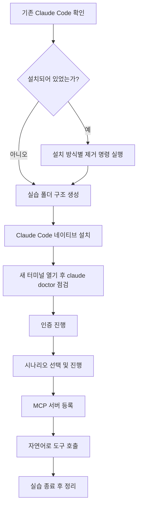
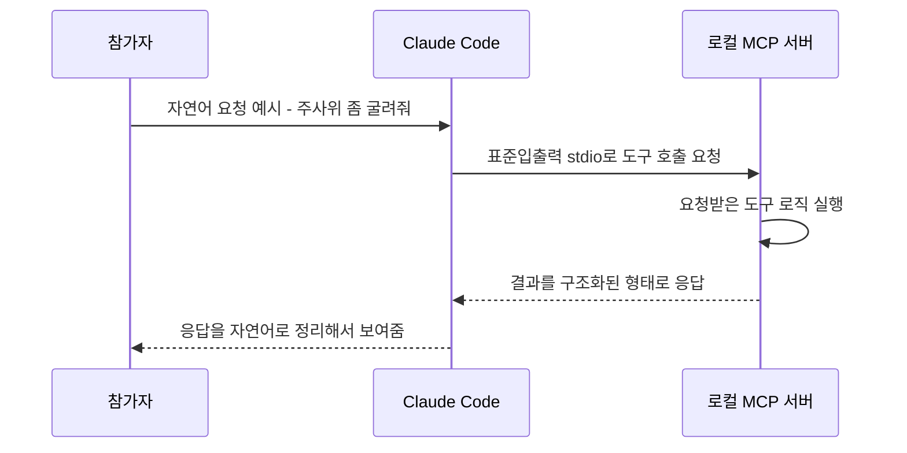
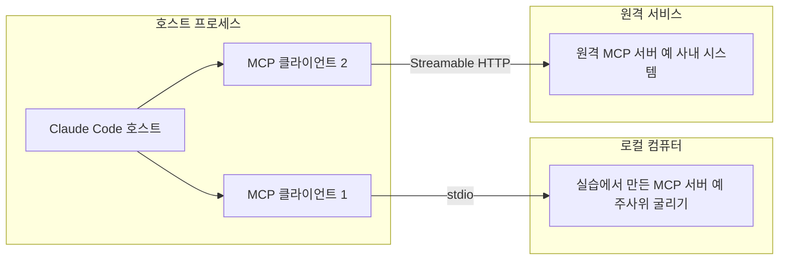
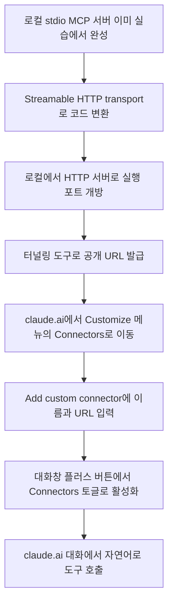

- 문서 작성일: 2026-07-02
- 대상: Windows 노트북을 사용하는 실습 참가자 및 진행자
- 전제: 사전 대화에서 정리한 대로, 20명 규모의 1회성 실습이며 Anthropic Console에서 발급한 API 키 하나를 지출 한도(spend limit)를 걸어 공유하는 방식을 사용합니다. 이 문서는 그 실습을 실제로 진행하기 위한 설치·환경구성·시나리오 5종을 다룹니다.

---

## 이 문서의 구성

이 가이드는 크게 세 부분으로 나뉩니다. 첫 번째는 노트북을 실습 가능한 상태로 만드는 준비 단계로, 기존에 깔려 있을지 모르는 Claude Code를 깨끗이 지우는 것부터 시작해서 실습 전용 디렉토리 구성, Claude Code 설치와 인증까지를 다룹니다. 두 번째는 다섯 개의 실습 시나리오로, 이전 대화에서 다룬 '주사위 굴리기 MCP 서버'를 시나리오 1로 삼고, 여기에 새로 네 개의 시나리오를 더했습니다. 세 번째는 시간 배분 가이드와 트러블슈팅, 그리고 실습이 끝난 뒤 정리하는 방법입니다.

모든 명령어는 Anthropic 공식 문서(code.claude.com/docs)와 Anthropic이 운영하는 검색 결과를 기준으로 확인한 것만 실었습니다. 다만 소프트웨어는 계속 업데이트되므로, 실습 당일 진행자가 노트북 한 대에서 미리 리허설을 한 번 해보는 것을 강하게 권합니다.

---

## 준비 단계

### 0단계. 기존 Claude Code 완전히 삭제하기

노트북에 예전에 Claude Code를 설치한 적이 있다면, 설치 방식(네이티브 인스톨러, npm, WinGet)에 따라 파일이 서로 다른 위치에 남아 있을 수 있습니다. 절반만 지워진 상태로 새로 설치하면 버전이 꼬이거나 `claude` 명령이 옛날 실행 파일을 가리키는 문제가 생기므로, 확실하게 지우고 시작하는 편이 안전합니다.

먼저 어떤 방식으로 설치되어 있는지 확인합니다. PowerShell을 열고 다음을 입력합니다.

```powershell
where.exe claude
```

이 명령이 돌려주는 경로를 보고 설치 방식을 짐작할 수 있습니다. 경로에 `.local\bin\claude.exe`가 포함되어 있다면 네이티브 인스톨러로 설치된 것이고, npm 전역 디렉토리 경로가 보인다면 npm으로 설치된 것입니다.

**네이티브 인스톨러로 설치했던 경우**, Anthropic 공식 문서가 안내하는 제거 명령은 다음과 같습니다. PowerShell에서 순서대로 실행합니다.

```powershell
Remove-Item -Path "$env:USERPROFILE\.local\bin\claude.exe" -Force
Remove-Item -Path "$env:USERPROFILE\.local\share\claude" -Recurse -Force
```

**npm으로 설치했던 경우**는 다음 한 줄이면 됩니다.

```powershell
npm uninstall -g @anthropic-ai/claude-code
```

**WinGet으로 설치했던 경우**는 다음과 같습니다.

```powershell
winget uninstall Anthropic.ClaudeCode
```

실행 파일을 지운 뒤에는 설정, MCP 서버 등록 정보, 세션 기록이 남아 있는 설정 폴더도 함께 지워야 완전히 깨끗한 상태가 됩니다. 이 폴더에는 이전 실습에서 등록했던 MCP 서버 목록도 들어 있으므로, 오늘 실습을 처음부터 새로 시작하고 싶다면 반드시 지우는 것이 좋습니다.

```powershell
Remove-Item -Path "$env:USERPROFILE\.claude" -Recurse -Force
Remove-Item -Path "$env:USERPROFILE\.claude.json" -Force
```

마지막으로 아래 명령이 아무것도 반환하지 않는지 확인합니다. 뭔가 경로가 나온다면 다른 방식으로 설치된 잔재가 남아 있다는 뜻이니, 위 세 가지 삭제 방법 중 해당하는 것을 다시 실행합니다.

```powershell
Get-Command claude -ErrorAction SilentlyContinue
```

### 1단계. 실습 디렉토리 구성 (D 드라이브)

C 드라이브는 회사 보안 정책이나 OneDrive 동기화 설정 때문에 예상치 못한 권한 문제가 생기는 경우가 많으므로, 이번 실습은 D 드라이브의 별도 폴더에서 진행합니다. PowerShell에서 아래 명령으로 실습 루트 폴더와 시나리오별 하위 폴더를 한 번에 만듭니다.

```powershell
New-Item -ItemType Directory -Force -Path D:\ClaudeCodeLab
New-Item -ItemType Directory -Force -Path D:\ClaudeCodeLab\scenario-1-dice
New-Item -ItemType Directory -Force -Path D:\ClaudeCodeLab\scenario-2-grep
New-Item -ItemType Directory -Force -Path D:\ClaudeCodeLab\scenario-3-quote
New-Item -ItemType Directory -Force -Path D:\ClaudeCodeLab\scenario-4-convert
New-Item -ItemType Directory -Force -Path D:\ClaudeCodeLab\scenario-5-dday
```

이렇게 시나리오마다 폴더를 분리해두면, Claude Code가 만드는 MCP 서버 프로젝트들이 서로 뒤섞이지 않고, 실습이 끝난 뒤 `D:\ClaudeCodeLab` 폴더 전체를 통째로 지우는 것만으로 깨끗하게 정리할 수 있습니다.

### 2단계. Claude Code 설치 및 인증

이제 Claude Code를 설치합니다. PowerShell(관리자 권한 불필요)에서 다음 한 줄을 실행합니다.

```powershell
irm https://claude.ai/install.ps1 | iex
```

이 명령은 Claude Code 실행 파일을 내려받아 `%USERPROFILE%\.local\bin` 아래에 설치하고 PATH에 등록합니다. 설치가 끝나면 **반드시 새 터미널 창을 열어야** PATH 변경이 적용됩니다. 기존 창에서 바로 `claude --version`을 입력하면 "claude 명령을 찾을 수 없습니다"라는 오류가 나는 경우가 실제로 자주 보고되는데, 이는 설치 실패가 아니라 PATH가 아직 갱신되지 않은 것뿐이므로 당황하지 않도록 미리 공지해두는 것이 좋습니다.

새 터미널에서 다음으로 설치를 확인합니다.

```powershell
claude --version
claude doctor
```

`claude doctor`는 설치 방식, 인증 상태, 설정 상태를 종합적으로 점검해주므로, 실습 중 뭔가 이상하면 참가자들에게 가장 먼저 이 명령을 실행해보게 하는 것이 좋습니다.

**참고: Git for Windows(Git Bash)는 설치하지 않아도 됩니다.** Anthropic 공식 문서에 따르면 Claude Code가 셸 명령을 실행할 때 쓰는 도구는 두 가지인데, Git for Windows가 설치되어 있으면 Git Bash를 통한 Bash 도구를, 없으면 PowerShell 도구를 자동으로 사용합니다. 즉 Git Bash 설치는 어디까지나 선택 사항이고, 이 문서의 모든 실습 명령도 PowerShell만으로 진행됩니다. 다만 Claude Code가 실습 중 스스로 실행하는 셸 명령(npm install 등)이 리눅스 계열 문법으로 생성되는 경우가 종종 있어서, 이런 명령이 간헐적으로 어색하게 동작한다면 Git for Windows(`https://git-scm.com/downloads/win`)를 추가로 설치해 Bash 도구를 쓰게 하는 것도 하나의 해결책입니다. 이 경우 Claude Code가 Git Bash를 자동으로 찾지 못하면 `%USERPROFILE%\.claude\settings.json`에 아래처럼 경로를 직접 지정해줄 수 있습니다.

```json
{
  "env": {
    "CLAUDE_CODE_GIT_BASH_PATH": "C:\\Program Files\\Git\\bin\\bash.exe"
  }
}
```

인증은 두 가지 방법이 있습니다. 참가자가 개인 Claude Pro 구독을 가지고 있다면 그냥 `D:\ClaudeCodeLab`로 이동해 `claude`를 실행했을 때 열리는 브라우저 창에서 로그인하면 됩니다. 공유 API 키를 쓰는 참가자는 실습 시작 전에 미리 공지한 대로 아래 명령으로 환경변수를 설정해둡니다.

```powershell
setx ANTHROPIC_API_KEY "발급받은-키-값"
```

`setx`로 설정한 환경변수 역시 새 터미널을 열어야 반영되므로, 네이티브 설치 직후와 마찬가지로 "설정했으면 터미널을 새로 열 것"이라는 원칙을 실습 도입부에서 한 번 강조해두면 진행이 수월합니다.

---

## 전체 흐름 한눈에 보기



Claude Code와 방금 만든 MCP 서버가 실습 중에 실제로 어떻게 통신하는지도 개념적으로 짚어두면 참가자들의 이해에 도움이 됩니다. 아래는 stdio 방식(로컬 프로세스로 실행되는 MCP 서버) 기준의 흐름입니다.



---

## 실습 시나리오 5종

다섯 시나리오 모두 같은 패턴을 따릅니다. Claude Code에게 자연어로 "이런 MCP 서버를 만들어줘"라고 요청하면, Claude Code가 `npm init`부터 패키지 설치, 코드 작성, 빌드까지 스스로 진행합니다. 이 문서는 일부러 완성된 소스 코드를 미리 적어두지 않았습니다. MCP SDK 패키지는 계속 업데이트되기 때문에, 이 문서에 코드를 박제해두면 실습 시점에는 이미 낡은 코드가 되어 있을 위험이 있습니다. 대신 Claude Code 자신이 실습 시점 기준의 최신 패키지와 문법으로 코드를 생성하도록 맡기는 것이 이번 실습의 취지인 '바이브코딩'에도 더 맞습니다. 진행자는 아래 프롬프트 문구를 그대로 공유하거나 참가자가 스스로 비슷한 문장을 만들어보게 해도 좋습니다.

각 시나리오는 해당 폴더로 이동한 뒤 `claude`를 실행하는 것으로 시작합니다.

```powershell
cd D:\ClaudeCodeLab\scenario-1-dice
claude
```

### 시나리오 1. 주사위 굴리기 MCP 서버 (기본, 복습용)

이전 대화에서 다룬 가장 기본적인 시나리오입니다. 실습 도입부에 참가자 전원이 한 번은 거쳐야 하는 기준 경로이므로, 이후 시나리오를 위한 워밍업 성격으로 남겨둡니다.

Claude Code에게 던지는 프롬프트 예시:

> TypeScript와 @modelcontextprotocol/sdk를 사용해서 간단한 MCP 서버를 만들어줘. stdio transport를 쓰고, 도구는 '주사위 굴리기' 하나만 있으면 돼. npm init부터 빌드까지 전부 진행해줘.

빌드가 끝나면 등록합니다.

```powershell
claude mcp add dice-roller -- node ./dist/index.js
claude mcp list
```

새 세션에서 "주사위 좀 굴려줘"라고 말해 실제로 도구가 호출되는지 확인합니다.

### 시나리오 2. 로컬 텍스트 파일 키워드 검색 MCP 서버

두 번째 시나리오는 파일 시스템에 접근하는 도구를 만들어보는 실습입니다. `grep`처럼 특정 폴더 안의 텍스트 파일들을 뒤져서 키워드가 포함된 줄을 찾아주는 도구를 만듭니다. 첫 번째 시나리오가 순수 계산(주사위)이었다면, 이번에는 MCP 서버가 로컬 파일 시스템을 읽는다는 개념을 보여주는 데 목적이 있습니다.

먼저 검색해볼 샘플 텍스트 파일을 몇 개 만들어두면 실습이 수월합니다.

```powershell
cd D:\ClaudeCodeLab\scenario-2-grep
New-Item -ItemType Directory -Force -Path .\sample-docs
"오늘 회의에서는 GraphRAG 아키텍처를 다뤘다." | Out-File -Encoding utf8 .\sample-docs\note1.txt
"Neo4j 기반 지식그래프 설계를 검토했다." | Out-File -Encoding utf8 .\sample-docs\note2.txt
"내일 일정은 오후 2시 스프린트 리뷰다." | Out-File -Encoding utf8 .\sample-docs\note3.txt
claude
```

Claude Code에게 던지는 프롬프트 예시:

> TypeScript와 @modelcontextprotocol/sdk로 MCP 서버를 만들어줘. 도구는 하나만 필요해. 도구 이름은 'search_notes'이고, 파라미터로 검색어(keyword)를 받아서 이 프로젝트 폴더 안 sample-docs 디렉토리의 모든 .txt 파일을 훑은 다음, 검색어가 포함된 줄을 파일명과 함께 리스트로 돌려줘. stdio transport로 동작해야 하고, npm init부터 빌드까지 전부 진행해줘.

등록과 확인:

```powershell
claude mcp add note-search -- node ./dist/index.js
claude mcp list
```

새 세션을 열어 "GraphRAG라는 단어가 들어간 메모 찾아줘"처럼 물어보면, MCP 서버가 실제로 로컬 파일을 읽어 응답하는 것을 확인할 수 있습니다. 이 시나리오는 나중에 참가자가 자기 프로젝트의 회의록이나 코드 주석을 검색하는 용도로 응용하기 좋다는 점을 함께 설명해주면 실습의 실용성이 와닿습니다.

### 시나리오 3. 오늘의 랜덤 명언 MCP 서버

세 번째 시나리오는 서버 내부에 고정된 데이터 목록을 두고, 호출할 때마다 그중 하나를 무작위로 골라 돌려주는 간단한 상태 없는(stateless) 도구를 만듭니다. 외부 API 호출 없이도 동작하기 때문에 네트워크 문제로 실습이 막히는 상황을 피할 수 있어, 시간이 촉박한 조에게 추천하는 시나리오입니다.

Claude Code에게 던지는 프롬프트 예시:

> TypeScript와 @modelcontextprotocol/sdk로 MCP 서버를 만들어줘. 도구 이름은 'get_quote'이고, 파라미터는 없어. 서버 코드 안에 명언 10개 정도를 배열로 미리 넣어두고, 호출될 때마다 그중 하나를 무작위로 골라 명언과 저자를 함께 돌려줘. stdio transport로 동작해야 하고, npm init부터 빌드까지 진행해줘.

등록과 확인:

```powershell
claude mcp add daily-quote -- node ./dist/index.js
claude mcp list
```

새 세션에서 "오늘의 명언 하나 알려줘"라고 요청해 정상 동작을 확인합니다. 진행자는 이 시나리오를 통해 MCP 도구가 항상 외부 API나 파일 시스템에 의존할 필요는 없고, 서버 내부 로직만으로도 충분히 쓸모 있는 도구가 될 수 있다는 점을 짚어주면 좋습니다.

### 시나리오 4. 단위 변환 계산기 MCP 서버

네 번째 시나리오는 하나의 MCP 서버 안에 여러 개의 도구를 등록해보는 실습입니다. 킬로미터-마일, 섭씨-화씨처럼 실생활에서 자주 쓰는 단위 변환 도구 두세 개를 한 서버 안에 묶어봅니다. 이를 통해 MCP 서버 하나가 여러 기능을 동시에 제공할 수 있다는 점, 그리고 Claude Code가 여러 도구 중 문맥에 맞는 것을 스스로 골라 호출한다는 점을 보여줄 수 있습니다.

Claude Code에게 던지는 프롬프트 예시:

> TypeScript와 @modelcontextprotocol/sdk로 MCP 서버를 만들어줘. 도구를 세 개 등록해줘. 첫 번째는 'km_to_miles'로 킬로미터를 마일로 변환하고, 두 번째는 'celsius_to_fahrenheit'로 섭씨를 화씨로 변환하고, 세 번째는 'fahrenheit_to_celsius'로 화씨를 섭씨로 변환해줘. 각 도구는 숫자 하나를 파라미터로 받아서 변환된 값을 소수점 둘째 자리까지 돌려줘야 해. stdio transport로 동작해야 하고, npm init부터 빌드까지 진행해줘.

등록과 확인:

```powershell
claude mcp add unit-converter -- node ./dist/index.js
claude mcp list
```

새 세션에서 "10킬로미터는 몇 마일이야?"와 "화씨 100도는 섭씨로 몇 도야?"를 순서대로 물어보면, Claude Code가 매번 다른 도구를 골라 호출하는 것을 확인할 수 있습니다. 이 지점이 참가자들에게 "MCP 서버 하나 = 도구 하나"가 아니라는 점을 체감시키는 포인트입니다.

### 시나리오 5. 디데이(D-Day) 계산 MCP 서버

다섯 번째 시나리오는 날짜 계산 로직을 다루는 도구를 만듭니다. 특정 날짜까지 며칠 남았는지, 혹은 특정 날짜로부터 며칠이 지났는지를 계산해주는 도구입니다. 앞선 시나리오들보다 파라미터 처리(문자열로 들어온 날짜를 파싱하는 과정)가 조금 더 들어가기 때문에, 시간이 넉넉한 조나 응용력이 있는 참가자에게 추천합니다.

Claude Code에게 던지는 프롬프트 예시:

> TypeScript와 @modelcontextprotocol/sdk로 MCP 서버를 만들어줘. 도구 이름은 'calculate_dday'이고, 파라미터로 YYYY-MM-DD 형식의 날짜 문자열(target_date)을 하나 받아. 오늘 날짜 기준으로 그 날짜까지 며칠 남았는지, 혹은 이미 지난 날짜라면 며칠이 지났는지를 계산해서 자연스러운 문장으로 돌려줘. 오늘 날짜는 서버 실행 시점의 시스템 날짜를 그대로 사용하면 돼. stdio transport로 동작해야 하고, npm init부터 빌드까지 진행해줘.

등록과 확인:

```powershell
claude mcp add dday-calculator -- node ./dist/index.js
claude mcp list
```

새 세션에서 "2026-12-25까지 며칠 남았어?"처럼 물어봅니다. 이 시나리오를 마지막에 배치한 이유는, 앞의 네 시나리오를 거치면서 참가자가 이미 "Claude Code에게 어떻게 요구사항을 구체적으로 적어줘야 하는지"에 익숙해진 상태에서, 조금 더 복잡한 로직(날짜 파싱과 조건 분기)을 스스로 프롬프트에 담아보게 유도하기 위해서입니다. 실제로 참가자가 프롬프트를 스스로 수정해보게 하는 것도 좋은 마무리 활동이 됩니다.

---

## 시간 배분 가이드

전체 다섯 시나리오를 한 번에 다 하기에는 1시간이 빠듯합니다. 애초에 논의했던 1시간 커리큘럼(설치 10분, 시나리오 1개 25분, 등록 10분, 사용 13분, 마무리 2분)을 기준으로 삼되, 시간이 더 있는 실습이라면 아래처럼 조합할 수 있습니다.

| 실습 길이 | 권장 구성 |
| --- | --- |
| 1시간 | 준비 단계 전체 + 시나리오 1(주사위)만 진행 |
| 1시간 30분 | 준비 단계 전체 + 시나리오 1 + 시나리오 2 또는 3 중 택1 |
| 2시간 | 준비 단계 전체 + 시나리오 1 + 조별로 2, 3, 4, 5 중 하나씩 선택해 발표 |
| 반나절(3~4시간) | 준비 단계 + 시나리오 1~5 전체 순서대로 진행 + 각자 응용 아이디어로 새 MCP 서버 하나 더 만들어보기 |

20명이 조를 나눠 서로 다른 시나리오를 진행한 뒤 마지막에 서로의 화면을 보여주며 결과를 공유하는 방식도 고려할 만합니다. 같은 시간에 더 다양한 사례를 함께 볼 수 있고, 참가자들이 "MCP 서버로 이런 것도 되는구나"라는 감각을 더 폭넓게 얻을 수 있습니다.

---

## 트러블슈팅

**`claude` 명령을 찾을 수 없다는 오류가 뜨는 경우.** 설치 자체는 성공했는데 터미널이 아직 옛 PATH를 기억하고 있는 경우가 대부분입니다. 터미널 창을 완전히 닫고 새로 열어서 다시 시도합니다. 그래도 안 되면 `claude doctor`로 설치 위치와 PATH 상태를 확인합니다.

**PowerShell에서 `irm`이 명령어로 인식되지 않는 경우.** Command Prompt(CMD)에서 PowerShell 전용 명령을 실행하려 한 경우입니다. 프롬프트가 `PS C:\`로 시작하면 PowerShell, `C:\`로만 시작하면 CMD입니다. CMD를 쓰고 있다면 `curl -fsSL https://claude.ai/install.cmd -o install.cmd && install.cmd && del install.cmd` 명령을 대신 사용합니다.

**`claude mcp add`로 등록했는데 도구가 안 보이는 경우.** `claude mcp list`로 서버가 정상 등록되었는지 먼저 확인합니다. 등록은 되어 있는데 도구가 안 뜬다면, 빌드 결과물 경로(`./dist/index.js` 등)가 실제 빌드 산출물 경로와 일치하는지 확인해봅니다. Claude Code가 프로젝트를 빌드할 때 출력 폴더 이름을 다르게 잡는 경우가 있으므로, 등록 전에 `ls .\dist`(또는 해당 빌드 폴더)로 실제 파일이 있는지 확인하는 습관을 들이면 좋습니다.

**MCP 서버를 지웠는데 세션에 계속 보이는 경우.** `claude mcp remove <서버이름>`은 전역(user) 범위의 등록만 지웁니다. 특정 프로젝트 폴더에서 등록한 경우 프로젝트별 설정에도 남아 있을 수 있으므로, 해당 프로젝트 폴더에서도 `claude mcp remove <서버이름>`을 한 번 더 실행하거나, 새 세션을 시작해서 확인하는 것이 안전합니다.

**공유 API 키를 쓰는데 요청이 자꾸 막히는 경우.** 20명이 동시에 같은 키로 요청을 보내면 순간적으로 요청 제한(rate limit)에 걸릴 수 있습니다. 몇 초 기다렸다가 다시 시도하면 대부분 해결되며, 이는 설치나 코드 문제가 아니라 공유 키 특성상 생기는 정상적인 현상이라는 점을 실습 시작 전에 미리 안내해두면 혼란을 줄일 수 있습니다.

---

## 실습 종료 후 정리

실습이 끝나면 아래 순서로 정리합니다.

1. Anthropic Console에서 실습용으로 발급했던 API 키를 비활성화하거나 지출 한도를 0으로 낮춰, 실습 이후 의도치 않은 과금을 막습니다.
2. 참가자 노트북에서 `D:\ClaudeCodeLab` 폴더를 통째로 지웁니다. 이 폴더 안에만 이번 실습에서 만든 프로젝트와 등록 정보가 들어 있으므로, 폴더를 지우는 것만으로 실습 산출물 정리가 끝납니다.

```powershell
Remove-Item -Path D:\ClaudeCodeLab -Recurse -Force
```

3. Claude Code 자체를 계속 쓸 계획이 없는 참가자는 준비 단계의 0단계에서 안내한 삭제 명령을 다시 실행해 정리합니다. 계속 쓸 계획이라면 그대로 두어도 무방합니다.

---

## 별첨 A. @modelcontextprotocol/sdk란 무엇인가

실습 시나리오에서 Claude Code에게 계속 "@modelcontextprotocol/sdk를 사용해서 만들어줘"라고 요청했는데, 이 패키지가 정확히 무엇인지 짚고 넘어가면 참가자들이 자기가 방금 뭘 만들었는지 더 잘 이해할 수 있습니다.


이번 실습에서 참가자들이 실제로 사용하는 부분은 이 중 서버 쪽 기능입니다. 서버를 만들 때 핵심이 되는 요소는 세 가지입니다. 첫째는 `McpServer`라는 객체로, 서버의 이름과 버전을 가지고 인스턴스를 하나 만드는 것으로 시작합니다. 둘째는 그 서버에 등록하는 도구(tool)로, 함수 하나에 이름과 입력 파라미터 형식, 그리고 실제 실행 로직을 붙여서 등록합니다. 이때 입력 파라미터의 형식을 검증하는 데 `zod`라는 별도의 스키마 검증 라이브러리를 함께 씁니다. 셋째는 전송 방식(transport)으로, 이번 실습에서 계속 사용한 stdio transport는 표준입출력을 통해 로컬에서 실행되는 프로세스끼리 통신하는 방식입니다. 원격 서버를 만들 때는 Streamable HTTP라는 다른 transport를 씁니다.

한 가지 참가자들에게 미리 안내해두면 좋은 점이 있습니다. 이 SDK는 현재 두 세대가 공존하는 과도기에 있습니다. 지금 프로덕션에서 널리 쓰이고 있고 대부분의 튜토리얼이 기준으로 삼는 것은 v1 계열로, `@modelcontextprotocol/sdk`라는 단일 패키지를 설치해서 그 안의 `server/mcp.js`, `server/stdio.js` 같은 하위 경로를 불러와 쓰는 방식입니다. 이와 별도로 SDK를 유지보수하는 팀은 서버 기능과 클라이언트 기능을 `@modelcontextprotocol/server`, `@modelcontextprotocol/client`처럼 별도 패키지로 쪼개는 v2 버전을 개발 중이며, 안정 버전이 나온 뒤에도 v1은 최소 6개월간 계속 버그 수정을 받는 것으로 공지되어 있습니다. 즉 실습 시점에 따라 Claude Code가 어떤 세대의 패키지를 설치하는지 달라질 수 있는데, 이는 실습 자체의 정상 동작에는 영향이 없습니다. Claude Code가 그 시점 기준으로 유효한 패키지와 문법을 판단해서 코드를 작성해주기 때문입니다. 다만 참가자가 나중에 인터넷에서 오래된 블로그 글을 보고 직접 코드를 짜보려 할 때, 패키지 구조가 문서와 다르게 느껴질 수 있다는 점 정도는 미리 알려주는 것이 좋습니다.

패키지를 설치하고 만들어진 서버가 제대로 동작하는지 개발 단계에서 직접 확인해보고 싶다면, MCP 프로젝트가 함께 배포하는 `@modelcontextprotocol/inspector`라는 별도 도구를 쓸 수 있습니다. `npx @modelcontextprotocol/inspector node build/index.js`처럼 실행하면 브라우저에서 서버가 제공하는 도구 목록을 확인하고 직접 호출해볼 수 있는 화면이 뜹니다. 이번 실습에서는 Claude Code 자체가 클라이언트 역할을 하기 때문에 필수는 아니지만, 시간이 남는 조나 MCP 서버 개발에 흥미를 느낀 참가자에게 다음 학습 단계로 소개해주면 좋습니다.

## 별첨 B. MCP Host / MCP Client / MCP Server

이번 실습에서 여러 번 등장한 세 용어를 Model Context Protocol 공식 문서 기준으로 정리합니다. 이 구조를 이해하면 "Claude Code가 정확히 어떤 역할을 하고 있고, 우리가 만든 프로그램은 어떤 역할을 하고 있는가"가 명확해집니다.

MCP는 host-client-server라는 세 계층 구조를 따릅니다. **호스트(Host)** 는 사용자가 직접 상호작용하는 AI 애플리케이션 그 자체입니다. 이번 실습에서는 Claude Code가, 다른 맥락에서는 Claude Desktop이나 VS Code, Cursor 같은 것이 호스트에 해당합니다. 호스트는 LLM을 품고 있으면서, 필요할 때마다 MCP 클라이언트를 만들어 여러 MCP 서버와 동시에 연결을 관리하는 조정자 역할을 합니다.

**클라이언트(Client)** 는 호스트 내부에 존재하는 구성요소로, 서버 한 곳과 정확히 1대1 관계를 맺고 그 연결을 관리합니다. 호스트가 서버 세 곳에 접속한다면 호스트 내부에는 클라이언트 인스턴스가 세 개 만들어지는 식입니다. 클라이언트는 사용자에게 직접 보이지 않고, 프로토콜 메시지를 주고받는 배관 역할을 담당합니다. 이번 실습에서는 참가자가 클라이언트를 따로 코드로 작성한 적이 없는데, 그 이유는 Claude Code라는 호스트가 내부적으로 클라이언트 인스턴스를 자동으로 만들어서 관리해주기 때문입니다. `claude mcp add` 명령이 바로 이 호스트-클라이언트 쪽에 "이런 서버와 연결해라"라고 등록하는 행위였던 셈입니다.

**서버(Server)** 는 실제로 도구, 리소스, 프롬프트 같은 기능을 제공하는 프로그램입니다. 이번 실습에서 참가자들이 `npm init`부터 시작해서 직접 만든 node 프로세스(주사위 굴리기, 파일 검색, 명언 반환, 단위 변환, 디데이 계산)가 전부 이 서버에 해당합니다. 서버는 로컬에서 실행될 수도 있고(오늘 실습에서 쓴 stdio 방식이 이 경우입니다), 인터넷 너머 원격에서 실행되며 Streamable HTTP로 접속하는 방식일 수도 있습니다. 어느 쪽이든 서버 입장에서는 자신을 호출하는 것이 클라이언트라는 사실 외에는 신경 쓸 필요가 없고, 그 클라이언트가 어떤 호스트 안에 있는지는 알지도 못하고 알 필요도 없습니다. 이 분리 덕분에 하나의 MCP 서버를 Claude Code에서도, Claude Desktop에서도, 다른 MCP 호환 애플리케이션에서도 그대로 재사용할 수 있습니다.

세 계층의 관계를 도식으로 정리하면 다음과 같습니다.



이 구조를 오늘 실습에 그대로 대입하면 이렇습니다. 참가자가 노트북에서 실행한 `claude`가 호스트이고, `claude mcp add`로 등록한 순간 호스트 내부에 자동으로 생성된 것이 클라이언트이며, 참가자가 직접 코드를 작성해 `node ./dist/index.js`로 실행한 프로세스가 서버입니다. "주사위 좀 굴려줘"라는 말 한마디가 호스트를 거쳐 클라이언트로, 클라이언트를 거쳐 서버로 전달되고, 서버가 계산한 결과가 같은 경로를 거꾸로 거슬러 참가자에게 돌아오는 것이 이번 실습 다섯 시나리오 전체에서 반복된 흐름입니다.

## 별첨 C. 실습으로 만든 MCP 서버를 claude.ai 웹 브라우저에서 연동하기

참가자들이 만든 MCP 서버를 노트북의 Claude Code뿐 아니라 웹 브라우저의 claude.ai에서도 쓰고 싶다는 요청은 자연스럽습니다. 다만 여기에는 반드시 미리 알아야 할 중요한 전제가 하나 있습니다. **claude.ai 웹은 우리가 실습에서 만든 것과 같은 방식(stdio)으로 노트북에서 로컬로 돌아가는 MCP 서버에 직접 연결할 수 없습니다.** claude.ai의 커스텀 커넥터(custom connector) 기능은 Anthropic의 클라우드 인프라가 공개 인터넷을 통해 접속하는 원격 MCP 서버만 지원합니다. 반대로 Claude Desktop 앱에서 `claude_desktop_config.json`에 등록하는 로컬 stdio 서버는 이것과는 완전히 다른 별도의 메커니즘이며, 이 로컬 방식은 claude.ai 웹이나 Cowork에서는 쓸 수 없다고 Anthropic 공식 고객센터 문서가 명시하고 있습니다.

즉 실습 시나리오 1~5에서 만든 서버를 그대로 claude.ai 웹에 등록하는 것은 불가능하고, 웹에서 쓰려면 서버를 '노트북 로컬에서 표준입출력으로 통신하는 프로그램'에서 '인터넷 어딘가에서 HTTP로 응답하는 프로그램'으로 바꾸는 작업이 추가로 필요합니다. 이 별첨은 그 변환 과정과, 짧은 실습 상황에서 현실적으로 시도해볼 수 있는 방법을 정리합니다.

### 무료 계정의 제약을 먼저 확인하기

claude.ai의 커스텀 커넥터 기능은 Free, Pro, Max, Team, Enterprise 모든 플랜에서 쓸 수 있지만, **Free 플랜 사용자는 커스텀 커넥터를 딱 1개까지만 등록**할 수 있습니다. 참가자 전원이 무료 계정이라는 전제라면, 시나리오 1~5에서 각각 만든 서버 다섯 개를 전부 개별 커넥터로 등록할 수는 없고 그중 하나만 고르거나, 여러 도구를 하나의 서버 안에 몰아넣어 커넥터 1개로 묶어야 합니다. 시나리오 4(단위 변환 계산기)처럼 애초에 한 서버에 여러 도구를 등록해본 경험이 있다면, 그 패턴을 그대로 살려 다섯 시나리오의 도구들을 한 서버에 합쳐보는 것도 좋은 응용 과제가 됩니다.

### 절차 개요



### 1단계. stdio에서 Streamable HTTP로 서버 변환하기

실습에서 만든 서버는 `StdioServerTransport`를 사용하고 있었습니다. claude.ai 웹에서 쓰려면 이것을 `StreamableHTTPServerTransport`로 바꾸고, 이 transport가 실제로 요청을 받을 수 있도록 익스프레스(Express) 같은 웹 서버 프레임워크 위에 얹어야 합니다. 이 작업 역시 손으로 직접 코드를 고치기보다 Claude Code에게 그대로 맡기는 편이 이번 실습의 취지와 맞습니다.

Claude Code에게 던지는 프롬프트 예시:

> 방금 만든 MCP 서버를 stdio transport 대신 Streamable HTTP transport로 동작하도록 바꿔줘. Express를 사용해서 3000번 포트에서 /mcp 경로로 요청을 받게 해줘. 세션 관리가 필요하면 알아서 처리해줘. 기존 도구 로직은 그대로 유지하면 돼.

변환이 끝나면 로컬에서 서버를 실행해 정상 동작하는지 먼저 확인합니다.

```powershell
node .\dist\index.js
```

터미널에 포트 3000에서 대기 중이라는 메시지가 뜨면 정상입니다.

### 2단계. 로컬 서버를 공개 인터넷에 임시로 노출하기

여기서부터가 claude.ai 웹 연동의 핵심 난관입니다. 지금 3000번 포트는 참가자 노트북 안에서만 열려 있고, 노트북이 학원이나 회사 내부망, 공유기 뒤에 있는 이상 Anthropic의 클라우드는 이 주소에 절대 도달할 수 없습니다. 실습처럼 짧은 시간 안에 정식 서버 호스팅(클라우드 VM, 서버리스 배포 등)까지 준비하기는 현실적으로 어려우므로, ngrok이나 Cloudflare Tunnel 같은 터널링 도구로 임시 공개 URL을 하나 발급받는 방법이 가장 빠릅니다. 예를 들어 ngrok을 쓴다면 다음과 같은 흐름입니다.

```powershell
ngrok http 3000
```

이 명령을 실행하면 `https://무작위문자열.ngrok-free.app`처럼 생긴 공개 HTTPS 주소가 발급되고, 이 주소로 들어오는 요청이 그대로 노트북의 3000번 포트로 전달됩니다. 바로 이 주소가 claude.ai에 등록할 원격 MCP 서버 URL이 됩니다.

이 방식에는 반드시 짚고 넘어가야 할 주의점이 있습니다. 실습에서 만든 서버는 인증이나 접근 제어가 전혀 없는 데모용 코드입니다. 터널이 열려 있는 동안에는 그 URL을 아는 누구나 인터넷 어디에서든 서버를 호출할 수 있습니다. 주사위 굴리기나 명언 반환처럼 민감할 것이 없는 도구라면 큰 문제가 되지 않지만, 시나리오 2(로컬 파일 검색)처럼 파일 시스템에 접근하는 서버를 이 상태로 오래 열어두는 것은 권장하지 않습니다. 이 실습에서는 시연이 끝나면 터미널에서 Ctrl+C로 서버와 터널을 즉시 종료하고, 실제 업무 데이터가 아닌 실습용 샘플 데이터만 다루도록 안내하는 것이 안전합니다. 정식으로 계속 쓸 서버라면 이런 임시 터널 대신 인증을 갖춘 정식 호스팅 환경으로 옮기는 것이 맞습니다.

### 3단계. claude.ai에서 커스텀 커넥터로 등록하기

노트북이 아니라 웹 브라우저에서 claude.ai에 접속한 상태로 진행합니다.

1. 화면의 **Customize** 메뉴에서 **Connectors**로 이동합니다.
2. Connectors 옆의 **+** 버튼을 누르고 **Add custom connector**를 선택합니다.
3. 이름(예: 주사위-굴리기)과 함께, 2단계에서 발급받은 터널 URL 뒤에 서버가 요청을 받는 경로(예: `/mcp`)를 붙인 전체 주소를 입력합니다.
4. 서버가 별도의 OAuth 인증을 요구하지 않는 이번 실습 수준이라면 Advanced settings는 건너뛰어도 됩니다.
5. **Add**를 눌러 등록을 마칩니다.

등록만으로 바로 쓸 수 있는 것은 아니고, 대화창마다 켜고 끌 수 있는 토글이 있습니다. 새 대화를 시작한 뒤 화면 왼쪽 아래의 **+** 버튼을 누르고 **Connectors**를 선택하면 방금 등록한 커넥터가 목록에 보이고, 이를 켜야 그 대화에서 실제로 사용할 수 있습니다. 이후에는 "주사위 좀 굴려줘"처럼 노트북의 Claude Code에서 했던 것과 똑같이 자연어로 요청하면 됩니다.

### 정리하며

이 별첨에서 다룬 경로를 한 문장으로 요약하면, "로컬 stdio 서버는 Claude Code(터미널)에서, 원격 HTTP 서버는 claude.ai(웹 브라우저)에서"라는 대응 관계입니다. 실습 본편의 시나리오 1~5는 전자에 해당하고, 이번 별첨은 이를 후자로 넘기기 위한 추가 변환 작업을 다룬 것입니다. 1시간 안팎의 짧은 실습에서 이 별첨까지 전부 진행하기는 시간상 빠듯하므로, 시간이 남는 조나 실습 이후 추가 학습으로 이어가고 싶은 참가자에게 선택 과제로 안내하는 편을 권합니다.

---

## 참고 문서

- Claude Code 설치 및 설정 공식 문서: `https://code.claude.com/docs/en/setup`
- Git for Windows 공식 다운로드(선택 설치, 필요 시): `https://git-scm.com/downloads/win`
- Claude 요금제 안내(참고용): `https://claude.com/pricing`
- Model Context Protocol 아키텍처 공식 문서(호스트/클라이언트/서버 설명): `https://modelcontextprotocol.io/docs/learn/architecture`
- MCP TypeScript SDK 공식 저장소: `https://github.com/modelcontextprotocol/typescript-sdk`
- MCP TypeScript SDK npm 패키지: `https://www.npmjs.com/package/@modelcontextprotocol/sdk`
- MCP Inspector(서버 동작을 브라우저에서 직접 확인하는 개발 도구): `https://www.npmjs.com/package/@modelcontextprotocol/inspector`
- claude.ai 커스텀 커넥터(원격 MCP) 시작 가이드: `https://support.claude.com/en/articles/11175166-get-started-with-custom-connectors-using-remote-mcp`
- claude.ai 커넥터 전반 안내: `https://support.claude.com/en/articles/11176164-use-connectors-to-extend-claude-s-capabilities`

문서 끝.
