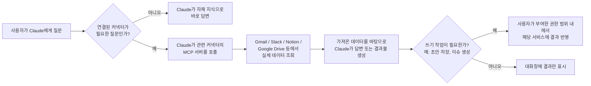
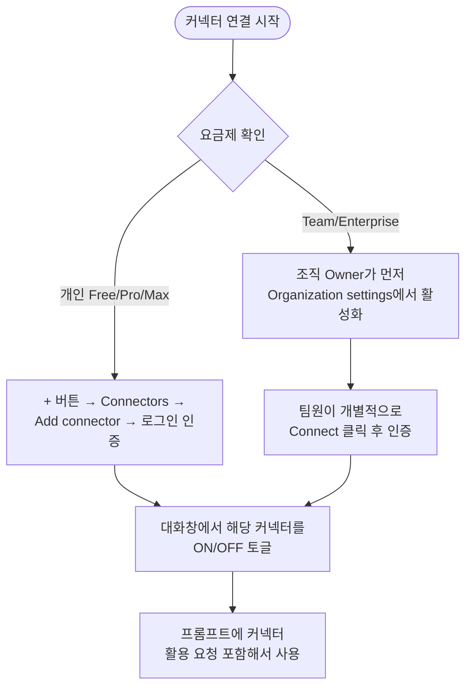
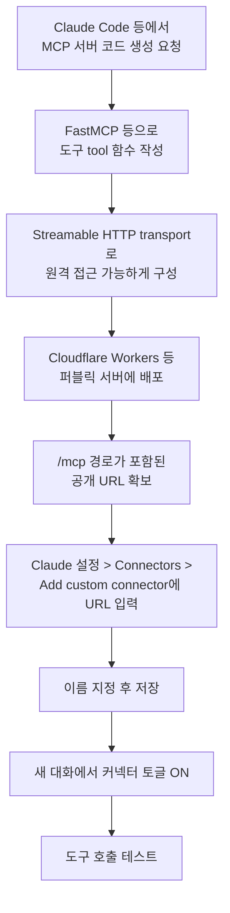

## 이 문서가 다루는 내용

원문은 Ruben Hassid(뉴스레터 "How to AI" 운영자)가 2026년 5월 13일 X(트위터)에 게시한 [스레드](https://x.com/rubenhassid/status/2054456659066732642)와, 이후 이어진 [요약 게시물](https://x.com/rubenhassid/status/2072275632940294525)을 바탕으로 한다. 핵심 메시지는 하나다. Claude에는 Gmail, Slack, Notion, Google Drive, Granola, HubSpot/Salesforce, Microsoft 365, Gamma, Canva 같은 외부 앱을 연결하는 "Connectors(커넥터)" 기능이 있는데, 대부분의 사용자가 이 기능을 전혀 쓰지 않고 있다는 것이다. 원문은 커넥터를 연결하는 방법, 실제로 매주 쓰는 8~9개 커넥터와 프롬프트 예시, 그리고 언제 커넥터를 꺼야 하는지에 대한 3가지 원칙, 마지막으로 개발자를 위한 커스텀 커넥터 제작법까지 다룬다.

이 문서는 원문 내용을 뼈대로 삼되, Anthropic 공식 지원 문서(support.claude.com)와 claude.com/connectors 페이지를 직접 확인해 사실관계를 검증했다. 원문 작성 시점과 지금 사이에 바뀐 부분, 그리고 원문의 설명이 공식 정보와 다른 부분은 별도로 표시해두었다.

---

## Connectors란 정확히 무엇인가

Connectors는 Claude와 외부 서비스 사이를 잇는 연결 다리다. 기술적으로는 Model Context Protocol(MCP)이라는, Anthropic이 만든 개방형 표준 위에서 작동한다. MCP는 Claude 같은 AI 모델이 외부 서비스(서버)와 어떻게 통신할지를 정의하는 프로토콜로, 누구나 이 표준을 따라 자신의 서비스를 위한 커넥터를 만들 수 있다.

작동 방식은 이렇다. 사용자가 Gmail 커넥터를 연결하면, Claude는 대화 중간에 실제 Gmail 받은편지함에 접근해서 메일을 읽고 요약하거나 답장 초안을 작성할 수 있다. 이 과정에서 사용자가 메일 내용을 복사해서 붙여넣을 필요가 없다. Claude는 연결된 서비스에서 데이터를 가져오는 것(읽기)뿐 아니라, 권한이 허용된 범위 내에서 이메일 발송, 문서 생성, 이슈 등록 같은 실제 작업(쓰기)도 수행할 수 있다.

공식 지원 문서에 따르면 Connectors 디렉토리는 크게 두 종류로 나뉜다. 첫째는 웹 커넥터로, Google Drive나 Gmail, Notion, Canva처럼 원격 서비스에 로그인·인증해서 연결하는 방식이다. 둘째는 데스크톱 확장 프로그램으로, 로컬 컴퓨터의 메모, 메시지, 코드 파일 등을 다루는 방식이다. 또한 일부 커넥터는 "Interactive(인터랙티브)" 배지가 붙어 있는데, 이런 커넥터는 단순히 텍스트로 답하는 데 그치지 않고 대시보드, 작업 보드, 디자인 도구 같은 살아있는 화면을 대화 안에 직접 띄운다. Figma, Canva, Asana, Adobe, Slack, Box, Hex, monday.com 등이 이 인터랙티브 커넥터에 해당한다.

---

## 커넥터를 연결하는 방법

연결 절차는 어떤 서비스든 동일하다.

1. Claude 대화창 하단의 "+" 버튼을 클릭한다.
2. 메뉴에서 "Connectors"를 선택하고 "Add connector"를 클릭한다.
3. 디렉토리가 열리면 이름으로 검색하거나 카테고리별로 둘러본다.
4. 원하는 서비스를 클릭하고 "Connect"를 누르면 표준적인 OAuth 인증 창이 뜬다. 기존 계정(Google, Slack, Notion 등)으로 로그인하면 연결이 완료되며, 이 과정에서 비밀번호가 Anthropic에 전달되지는 않는다.
5. 새 대화를 열고 "+" 버튼 옆 Connectors 메뉴에서 해당 서비스가 그 대화에 대해 켜져 있는지 확인한다(신규 연결 시 자동으로 켜지는 경우가 많다).

Team이나 Enterprise 요금제에서는 개인이 임의로 커넥터를 추가할 수 없다. 조직의 Owner 또는 Primary Owner가 먼저 조직 설정(Organization settings > Connectors)에서 해당 커넥터를 활성화해야 팀원들이 각자 인증해서 사용할 수 있다. Owner는 또한 커넥터별로 "읽기 전용만 허용", "쓰기 작업은 승인 필요", "특정 기능 완전 차단" 같은 세밀한 권한 정책을 조직 전체에 적용할 수 있다. 예를 들어 Gmail 커넥터를 켜되 메일 발송 기능만 막거나, Google Drive는 읽기만 허용하고 문서 생성·수정은 막는 식이다. 이 정책은 조직 차원에서 강제되며 개인이 임의로 우회할 수 없다.

---

## 실제로 많이 쓰이는 커넥터와 활용 프롬프트

원문에서 소개한 8~9개 커넥터를 카테고리, 용도, 대표 프롬프트 순서로 정리하면 다음과 같다. 이 커넥터들은 모두 공식 Connectors 디렉토리(claude.com/connectors)에서 실제로 검색·연결 가능한 것으로 확인된다.

| 커넥터 | 카테고리 | 주로 하는 일 | 대표 프롬프트 예시 |
|---|---|---|---|
| Gmail | 커뮤니케이션 | 받은편지함 정리, 답장 초안 작성 | "이번 주 안 읽은 메일을 오늘 꼭 답해야 할 것/금요일까지 미뤄도 될 것/무시해도 될 뉴스레터로 3분류해줘" |
| Google Calendar | 생산성 | 빈 시간 찾기, 불필요한 회의 정리 | "다음 주에 OO과 겹치는 30분 빈 시간을 찾고, 취소해도 되는 회의 목록도 알려줘" |
| Slack | 커뮤니케이션 | 채널 요약, 놓친 스레드 파악 | "지난 48시간 동안 #팀채널 내용을 읽고, 내가 반응해야 할 3가지만 추려줘. 잡담이나 스탠드업 업데이트는 제외" |
| Notion | 생산성/지식베이스 | 과거 작성 문서 검색, 콘텐츠 재활용 | "콘텐츠 캘린더에서 특정 날짜의 게시물 구조를 가져와서 같은 방식으로 새 게시물 2개를 만들어줘" |
| Google Drive | 파일/문서 | 문서 검색, 스프레드시트 작업 결과 저장 | "Drive에서 최신 버전 피치덱을 찾아서 핵심 슬라이드를 요약해줘" |
| Granola | 회의 노트(서드파티) | 회의록 요약, 액션 아이템·블로커 추출 | "가장 최근 통화 내용을 요약하고, 나에게 할당된 액션 아이템과 예상되는 블로커를 정리해줘" |
| Canva | 디자인 | 브랜드 자산 활용한 시각 콘텐츠 제작 | "이 글을 브랜드 컬러를 활용한 5장짜리 링크드인 카드뉴스로 만들어줘" |
| Gamma | 프레젠테이션 | 프롬프트만으로 완성형 슬라이드 제작 | "이 보고서를 10장짜리 프레젠테이션으로 만들어줘. 구조와 디자인은 알아서 처리해줘" |
| Microsoft 365 | 생산성 스위트 | Outlook·Teams·Calendar·OneDrive 통합 조회 | "다음 주 월요일 일정 중 준비 자료가 없는 회의를 찾아서, 관련 Teams 스레드나 OneDrive 문서를 연결해 회의별 1페이지 브리핑을 만들어줘" |
| HubSpot / Salesforce | 영업/CRM | 파이프라인 조회, 후속 이메일 초안 | "제안서 발송 단계에서 7일 이상 멈춰 있는 딜을 모두 찾아서, 각각에 대한 팔로우업 이메일을 써줘" |

여러 커넥터를 동시에 켜서 조합하는 것도 가능하다. 예를 들어 Granola(회의록) + Gmail(메일) + Slack(팀 대화)을 함께 연결하면, 계약 협상처럼 여러 채널에 걸쳐 흩어진 맥락을 한 번에 통합해서 다음 행동을 정리하도록 요청할 수 있다. 다만 뒤에서 다루듯, 연결한 커넥터가 많아질수록 Claude가 매 응답 전에 검토해야 하는 맥락도 늘어나므로 무조건 많이 켜두는 것이 능사는 아니다.

---

## Claude Cowork: 채팅과는 다른 작업 방식

원문 이미지에는 "Cowork"라는 화면이 반복해서 등장한다. 이는 단순한 오타나 챗봇의 별칭이 아니라, Anthropic이 별도로 출시한 제품이다. Claude Cowork는 채팅창에서 한 번에 한 가지 질문에 답하는 방식이 아니라, 사용자가 원하는 결과물(outcome)을 설명하면 Claude가 여러 단계를 스스로 계획하고 실행해서 완성된 산출물을 가져오는 방식으로 작동한다. Anthropic 공식 설명에 따르면 Cowork는 Claude Code를 뒷받침하는 것과 같은 에이전틱 아키텍처를 데스크톱 앱 안에서, 터미널을 열지 않고도 쓸 수 있게 만든 제품이다.

Cowork의 특징은 다음과 같다.

- 로컬 파일과 폴더에 직접 접근해서 읽고 쓸 수 있다(채팅에서는 파일을 수동으로 업로드해야 하는 것과 대비된다).
- 복잡한 작업을 여러 하위 작업으로 나누고 병렬로 조율해서 처리한다.
- Excel 워크북, PowerPoint 프레젠테이션, 서식이 갖춰진 문서 같은 완성된 결과물을 만들어낸다.
- 예약 작업(scheduled tasks) 기능을 지원해 자동으로 반복 작업을 처리할 수 있다.
- 데스크톱 앱이 켜져 있고 컴퓨터가 깨어 있어야 작업이 진행되며, Pro·Max 사용자는 데스크톱이 작업 중인 상태에서 모바일 앱으로 진행 상황을 확인하거나 작업을 이어서 지시할 수 있다.

원문 이미지에서 "구글 드라이브 버튼을 눌러 곧바로 Google Sheets가 채워진 채로 열린다"거나 "Gamma로 이동해 9장짜리 슬라이드를 만들었다"는 장면은 모두 Cowork가 Google Drive·Gamma 같은 커넥터와 결합해 작동한 결과다. 즉 Connectors가 "Claude에게 외부 데이터를 보여주는 통로"라면, Cowork는 "그 데이터를 가지고 실제로 다단계 작업을 끝까지 수행하는 실행 엔진"에 가깝다. 둘은 함께 쓰일 때 원문이 보여주는 것과 같은 결과, 즉 투자자용 스프레드시트가 자동으로 완성되어 Google Sheets로 열리는 흐름을 만들어낸다.

Anthropic 공식 제품 페이지는 Claude Cowork가 모든 유료 요금제에서 데스크톱 앱을 통해 제공된다고 안내하고 있다. 다만 이는 비교적 최근에 공식화된 설명이며, 초기 안내에서는 Max 요금제가 필요하다는 정보도 있었으므로, 정확한 이용 조건은 가입 시점의 요금제 페이지에서 다시 확인하는 것이 안전하다.

---

## Connectors 디렉토리 규모: 실제로 확인한 결과

원문은 "Claude에는 200개 이상의 커넥터가 있다"고 적었다. 이 숫자를 검증하기 위해 claude.com/connectors 페이지를 직접 열어 확인한 결과, 페이지 하단에 "1 / 17"이라는 페이지네이션이 표시되어 있었고 첫 페이지에만 24개의 커넥터가 나열되어 있었다. 단순 계산으로도 전체 목록은 300~400개 규모에 이르는 것으로 보이며, 한 업계 블로그(2026년 6월 기준 작성)는 디렉토리 규모를 375개 이상으로 집계하기도 했다. 정확한 총합은 Anthropic이 공식 숫자를 발표하지 않아 확정하기 어렵지만, 최소한 원문이 말한 "200개 이상"이라는 표현은 현재 기준으로는 오히려 보수적인 숫자이며, 디렉토리는 계속해서 빠르게 늘어나고 있다는 점은 분명하다. 카테고리는 코드, 커뮤니케이션, 데이터, 디자인, 교육, 금융 서비스, 건강·웰니스, 생명과학, 비영리, 생산성, 영업·마케팅 등으로 나뉘어 있다.

---

## 원문 내용과 최신 공식 정보가 갈리는 지점

Jiyo가 요청한 대로 사실 검증 과정에서 원문의 설명과 현재 Anthropic 공식 문서 사이에 차이가 있는 부분을 아래처럼 명시적으로 정리한다.

| 항목 | 원문(2026년 5월 게시물)의 설명 | 공식 지원 문서로 확인한 현재 정보 |
|---|---|---|
| 커스텀 커넥터(자체 MCP 서버) 이용 가능 요금제 | "Free 플랜에서는 커스텀 커넥터를 쓸 수 없고, Pro·Team·Enterprise가 필요하다"고 명시 | Free 요금제 사용자도 커스텀 커넥터를 **1개까지** 연결할 수 있다. Pro·Max·Team·Enterprise는 더 많은 수를 지원한다 |
| 디렉토리 내 사전 제작 커넥터(Gmail, Slack 등) | 별도 언급 없음 | 대부분의 디렉토리 커넥터는 Free 요금제를 포함한 모든 플랜에서 사용 가능하다 |
| 커넥터 총 개수 | "200개 이상" | 공식 페이지 직접 확인 결과 300~400개 규모로 추정, 계속 증가 중 |
| Cloudflare Workers 무료 티어 요청 한도 | "하루 10만 건" | 2026년 기준 Cloudflare 공식 자료로도 동일하게 하루 10만 건(100,000 requests/day)으로 확인됨 — 이 부분은 원문 설명이 정확했다 |

이 표에서 가장 실질적으로 중요한 정정은 커스텀 커넥터 관련 부분이다. 만약 무료 요금제를 쓰고 있어서 "커스텀 커넥터는 유료 결제해야만 만들 수 있다"고 알고 있었다면, 실제로는 1개까지는 무료로도 직접 만든 MCP 서버를 연결해볼 수 있다는 점을 알아두면 좋다.

---

## 언제 커넥터를 쓰지 말아야 하는가: 원문이 강조한 3가지 원칙

원문은 커넥터를 무조건 다 켜두는 것을 경계하며 세 가지 원칙을 제시했다. 이 원칙들은 공식 문서가 설명하는 커넥터의 작동 방식과도 부합한다.

**첫째, 모든 커넥터를 기본으로 켜두지 않는다.** 연결된 커넥터가 많을수록 Claude가 매 응답 전에 검토해야 하는 맥락(어떤 도구를, 어떤 상황에 쓸지 판단하는 과정)이 늘어난다. 공식 문서에서도 커넥터가 많아지면 "Tool access" 설정을 통해 도구를 로드하는 방식을 조정할 수 있도록 안내하고 있는데, 이는 다르게 말하면 커넥터가 늘어날수록 관리가 필요해진다는 뜻이기도 하다. 대화 단위로 필요한 커넥터만 켜고 끄는 습관이 권장된다.

**둘째, 창작 작업에는 커넥터를 쓰지 않는다.** 링크드인 포스트나 대본처럼 순수하게 글을 쓰는 작업에서는 Slack의 잡담, Gmail의 뉴스레터, Notion의 오래된 메모 같은 잡음이 결과물의 톤을 흐릴 수 있다. 원문 저자는 "글쓰기용 대화에서는 모든 커넥터를 끈다"는 것을 기본 원칙으로 삼는다고 밝혔다.

**셋째, 신뢰가 쌓이기 전까지는 쓰기 권한을 주지 않는다.** 먼저 읽기 전용으로 한 주 정도 사용해보면서 Claude가 해당 도구를 어떻게 다루는지 지켜본 다음에 쓰기 권한을 부여하라는 것이다. 이는 공식 문서가 안내하는 "Always allow / Needs approval / Blocked" 세 단계 권한 설정과도 맞닿아 있다. 실수로 전체 쓰기 권한을 준 상태에서 "Drive 정리해줘" 같은 광범위한 지시를 내렸다가 의도치 않은 변경이 발생하는 사고가 초기에 가장 흔하게 벌어진다는 것이 원문의 경고다.

---

## 개발자를 위한 커스텀 커넥터 제작 개요

원문 후반부는 기술적인 내용이다. 커스텀 커넥터는 결국 공개적으로 접근 가능한 URL을 가진 MCP 서버일 뿐이라는 것이 핵심이다. 필요한 것은 세 가지다.

1. Pro, Max, Team, Enterprise 요금제(단, 위에서 정정했듯 Free 요금제도 1개까지는 가능하다).
2. 연결하려는 서비스의 API.
3. 서버를 배포할 곳(원문은 Cloudflare Workers를 추천하며, 무료 티어가 하루 10만 요청까지 지원한다고 설명했는데 이는 2026년 기준으로도 정확한 수치다).

절차는 다음과 같이 요약된다.

원문이 짚은 3가지 흔한 실수는 다음과 같다.

- URL 끝에 `/mcp` 경로를 빠뜨리는 것.
- 무료 호스팅에서 콜드 스타트로 인한 타임아웃이 발생하는 것(원문은 이 점에서 Vercel보다 Cloudflare Workers가 낫다고 평가했다).
- CORS 헤더 설정 누락으로 호출이 막히는 것.

공식 문서를 통해 추가로 확인한 실무 정보도 덧붙이면, Claude는 커스텀 MCP 서버에 로컬 기기가 아니라 Anthropic의 클라우드 인프라를 통해 접속한다. 따라서 사내망이나 VPN, 방화벽 뒤에 있는 서버는 연결되지 않으며, 로컬 개발 단계에서는 ngrok 같은 터널링 도구로 임시 공개 URL을 만들어 테스트하는 방식이 널리 쓰인다. 방화벽 안쪽에서 운영하는 서버를 그대로 쓰고 싶다면 Anthropic이 공개하는 IP 대역을 방화벽에 허용 목록으로 등록해야 한다.

---

## 실전 적용을 위한 체크리스트

아래는 원문의 취지와 공식 문서 내용을 종합해 실제로 커넥터를 도입할 때 참고할 수 있는 순서다.

1. 가장 자주 반복되는 업무 3가지를 먼저 떠올린다(메일 정리, 회의록 정리, 팀 채널 확인처럼).
2. 그 업무에 대응하는 커넥터 2~3개만 우선 연결한다. 한 번에 다 켜지 않는다.
3. 처음 일주일은 읽기 전용 권한으로만 사용하면서 Claude가 어떤 방식으로 데이터를 다루는지 관찰한다.
4. 문제없이 동작하는 것이 확인되면 필요한 범위 내에서만 쓰기 권한을 단계적으로 허용한다.
5. 글쓰기·브레인스토밍처럼 순수 창작 작업을 할 때는 커넥터를 모두 꺼서 맥락 오염을 막는다.
6. 여러 소스에 걸친 맥락이 필요한 업무(계약 협상, 프로젝트 브리핑 등)에서는 관련 커넥터 2~3개를 동시에 켜서 조합한다.
7. Team·Enterprise 환경이라면 조직 차원의 읽기/쓰기 정책을 먼저 설계한 뒤 배포한다.
8. 디렉토리에 없는 사내 도구가 있다면, 해당 도구가 이미 MCP 서버를 제공하는지 먼저 검색해보고, 없다면 자체 MCP 서버 제작을 검토하거나 Make.com·Zapier 같은 브리지를 활용한다.

---

## 요약

Claude Connectors는 MCP라는 개방형 표준을 기반으로, Claude를 Gmail·Slack·Notion·Google Drive·Granola·Canva·Gamma·Microsoft 365·HubSpot 등 수백 개 외부 서비스와 직접 연결해주는 기능이다. 연결은 대화창의 "+" 버튼에서 몇 번의 클릭만으로 끝나며, 연결 이후에는 복사·붙여넣기 없이 실제 데이터를 기반으로 답변을 받거나 초안을 해당 앱에 바로 저장할 수 있다. 여기에 더해 Claude Cowork라는 별도의 에이전틱 제품을 함께 쓰면, 커넥터로 가져온 데이터를 바탕으로 다단계 작업(스프레드시트 작성, 슬라이드 제작 등)을 사람 개입 없이 끝까지 완수하는 것도 가능하다.

다만 커넥터를 도입할 때는 무분별하게 전부 켜두기보다, 필요한 것부터 최소한으로 시작해 읽기 전용으로 신뢰를 쌓은 뒤 점진적으로 권한을 넓히는 방식이 안전하다. 그리고 원문이 작성된 시점(2026년 5월) 이후로 커넥터 디렉토리 규모나 무료 요금제에서의 커스텀 커넥터 이용 가능 여부처럼 일부 구체적인 조건은 바뀌었으므로, 실제로 적용하기 전에는 이 문서에 정리한 최신 확인 사항, 혹은 support.claude.com의 최신 안내를 다시 확인하는 것이 좋다.

---

작성일자: 2026년 7월 2일
