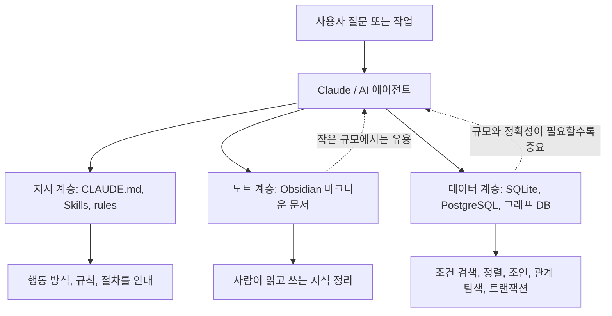

- 작성일: 2026-07-02  
- 대상 글: Jonathan Edwards, [“Stop Calling It Memory: The Problem with Every ‘AI + Obsidian’ Tutorial”](https://limitededitionjonathan.substack.com/p/stop-calling-it-memory-the-problem), 2026-03-23  
- 핵심 주제: Obsidian의 마크다운 파일을 AI의 “진짜 기억”이나 “데이터베이스”처럼 부르는 관행에 대한 비판

## 관련글

[**옵시디언 세컨드 브레인, 유행의 정점에서 회의론으로 — 2026년 상반기 AI 커뮤니티 최신 흐름**](https://k82022603.github.io/posts/%EC%98%B5%EC%8B%9C%EB%94%94%EC%96%B8-%EC%84%B8%EC%BB%A8%EB%93%9C-%EB%B8%8C%EB%A0%88%EC%9D%B8,-%EC%9C%A0%ED%96%89%EC%9D%98-%EC%A0%95%EC%A0%90%EC%97%90%EC%84%9C-%ED%9A%8C%EC%9D%98%EB%A1%A0%EC%9C%BC%EB%A1%9C-2026%EB%85%84-%EC%83%81%EB%B0%98%EA%B8%B0-ai-%EC%BB%A4%EB%AE%A4%EB%8B%88%ED%8B%B0-%EC%B5%9C%EC%8B%A0-%ED%9D%90%EB%A6%84/)

## 먼저 결론부터 말하면

이 글은 Obsidian 자체를 비난하는 글이 아니다. 글쓴이는 Obsidian이 개인 지식 관리 도구로서 갖는 장점을 꽤 공정하게 인정한다. 로컬 파일을 직접 소유할 수 있고, 마크다운은 사람이 읽고 고치기 쉽고, Git으로 버전 관리를 하기 좋으며, Claude 같은 언어 모델이 읽기 쉬운 형식이라는 점을 모두 장점으로 본다.

하지만 글쓴이가 강하게 문제 삼는 것은 “Obsidian + Claude Code + 마크다운 파일” 조합을 AI의 “영구 기억”, “두 번째 뇌”, “개인 비서의 장기 기억”, “데이터베이스 대체재”처럼 과장해서 설명하는 흐름이다. 그의 핵심 주장은 단순하다. 마크다운 파일은 노트이고, 지시문이고, 사람이 읽기 좋은 텍스트일 수는 있지만, 그 자체로는 쿼리 가능한 데이터베이스가 아니며, 복잡한 관계를 안정적으로 탐색하는 기억 시스템도 아니라는 것이다.

글쓴이가 말하는 “기억”은 단순히 이전 내용을 어느 파일에 적어 두었다가 다시 읽는 행위가 아니다. 그가 요구하는 기억은 구조화되어 있고, 검색 가능하며, 관계를 탐색할 수 있고, 여러 에이전트가 안전하게 접근할 수 있으며, 시간이 지나도 일관된 형식으로 유지되는 저장 시스템에 가깝다. 그래서 그는 개인 AI 비서의 장기 기억을 만들고 싶다면 SQLite, PostgreSQL, Supabase, 그래프 데이터베이스 같은 실제 데이터 저장 기술을 써야 한다고 주장한다.

다만 2026년 7월 현재의 최신 맥락을 덧붙이면, Anthropic의 Claude Code 공식 문서는 실제로 “memory”라는 용어를 사용한다. Claude Code에는 `CLAUDE.md` 파일과 별도로 “auto memory” 기능이 있고, 자동 메모리는 프로젝트별 메모리 디렉터리에 마크다운 파일을 저장한다. 그러나 공식 문서도 이 정보를 “컨텍스트로 로드되는 내용”으로 설명하며, 강제 설정이나 일반적인 데이터베이스라고 설명하지는 않는다. 따라서 글의 비판은 여전히 유효하지만, “공식 기능명으로서의 memory”와 “데이터베이스처럼 작동하는 장기 기억”을 구분해서 읽어야 한다.

## 글의 문제의식

글의 출발점은 2026년 초 AI 생산성 커뮤니티에서 유행한 튜토리얼들이다. 여러 글과 영상이 “Obsidian에 Claude Code를 연결하면 AI가 영구 기억을 갖는다”거나 “마크다운 기반 두 번째 뇌를 만들 수 있다”는 식으로 소개했다. 글쓴이는 이 흐름이 기술적 오해 위에서 빠르게 확산되었다고 본다.

그가 보기에 이 유행은 세 단계의 혼동에서 나온다.

첫째, “두 번째 뇌”라는 생산성 은유가 실제 뇌처럼 작동하는 시스템이라는 기대를 만들었다. 원래 두 번째 뇌는 개인 노트와 지식 관리 방법론을 설명하는 은유였지만, AI가 결합되면서 사람들은 그 은유를 제품 기능처럼 받아들이기 시작했다.

둘째, Claude Code의 `CLAUDE.md` 같은 마크다운 지시 파일이 “기억”처럼 오해되었다. `CLAUDE.md`는 Claude Code가 프로젝트에서 반복적으로 참고할 지시 사항을 담는 파일이다. 예를 들어 빌드 명령, 테스트 방식, 코드 스타일, 프로젝트 구조 같은 내용을 적어 둘 수 있다. 이것은 Claude가 매번 같은 설명을 다시 듣지 않도록 하는 데 유용하지만, 데이터베이스라기보다는 프로젝트 안내문이나 작업 규칙에 가깝다.

셋째, Obsidian의 로컬 마크다운 노트 구조가 AI 기억 인프라처럼 포장되었다. Obsidian은 실제로 로컬 파일 기반이라는 강점이 있고, 위키링크를 통해 문서 간 연결을 만들 수 있다. 그러나 문서가 서로 링크되어 있다고 해서 그것이 관계형 데이터베이스나 그래프 데이터베이스처럼 질의 가능한 구조가 되는 것은 아니다.

## 글쓴이가 인정하는 Obsidian의 장점

이 글의 설득력은 Obsidian을 무조건 깎아내리지 않는 데 있다. 글쓴이는 먼저 Obsidian 쪽 주장이 왜 매력적인지 설명한다.

Obsidian의 가장 큰 장점은 데이터 소유권이다. 노트가 로컬 파일로 존재하므로 특정 클라우드 서비스가 사라지거나 정책을 바꾸더라도 사용자가 파일 자체를 계속 보유할 수 있다. 이는 Notion 같은 서버 중심 서비스와 비교했을 때 분명한 차이다. 마크다운 파일은 평범한 텍스트 파일이므로 Obsidian 없이도 열 수 있고, 다른 편집기로 옮기기도 쉽다.

또한 마크다운은 언어 모델이 다루기 쉬운 형식이다. 제목, 목록, 문단, 코드 블록 같은 구조가 텍스트 안에 자연스럽게 담기기 때문이다. 복잡한 API를 호출하거나 데이터를 변환하지 않아도 모델이 내용을 읽을 수 있다는 점은 초기 설정을 단순하게 만든다.

사람이 직접 읽고 고칠 수 있다는 점도 큰 장점이다. 데이터베이스는 내용을 보려면 별도의 도구나 쿼리가 필요할 때가 많지만, 마크다운 파일은 텍스트 편집기만 있으면 된다. AI가 어떤 내용을 참고하는지 사용자가 직접 확인하고 수정할 수 있다는 투명성이 있다.

Obsidian의 위키링크 역시 가벼운 연결 구조를 만든다. `[[문서명]]` 형태의 링크를 통해 노트끼리 연결할 수 있고, 관계를 눈으로 파악하는 데 도움이 된다. Git과 함께 쓰면 변경 이력도 관리할 수 있다.

글쓴이는 이런 장점들을 인정한 뒤, 바로 그 장점들이 “노트 관리”에는 적합하지만 “AI 기억 인프라”에는 충분하지 않다고 선을 긋는다.

## “읽을 수 있다”와 “질의할 수 있다”는 다르다

글에서 가장 중요한 구분은 이것이다. Claude가 마크다운 파일을 읽을 수 있다는 사실은, 그 파일들이 데이터베이스처럼 질의 가능하다는 뜻이 아니다.

마크다운 기반 기억 시스템의 기본 동작은 대체로 단순하다. AI가 어떤 `.md` 파일을 읽고, 그 안에서 필요한 정보를 찾고, 필요하면 같은 파일이나 다른 파일에 내용을 덧붙인다. 작은 규모에서는 이 방식이 실제로 잘 작동한다. 예를 들어 개인 프로젝트 규칙 몇 개, 자주 쓰는 명령, 간단한 선호 사항, 몇십 개의 노트 정도라면 큰 문제가 없을 수 있다.

하지만 정보가 많아지면 문제가 달라진다. 파일이 수백 개, 수천 개가 되거나 한 파일이 매우 길어지면 AI가 모든 내용을 매번 읽는 것은 비효율적이다. 관련 없는 내용까지 컨텍스트에 들어가면 토큰 비용이 늘고, 처리 속도가 느려지고, 정작 중요한 작업에 쓸 수 있는 공간이 줄어든다. 더 심각한 문제는 모델이 중요한 정보를 놓칠 수 있다는 점이다. 긴 텍스트 더미 안에서 필요한 단서를 항상 정확히 찾아낸다고 보장할 수 없기 때문이다.

데이터베이스는 이 문제를 다른 방식으로 해결한다. 데이터베이스에서는 “모든 내용을 읽고 사람이 알아서 찾기”가 아니라 “조건에 맞는 레코드만 가져오기”가 기본이다. 예를 들어 “중요도가 7 이상인 고객 연락처만 보여 줘”, “작년에 비슷한 작업에 얼마를 청구했는지 찾아 줘”, “이 사람과 연결된 프로젝트를 날짜순으로 정리해 줘” 같은 질문은 구조화된 테이블과 인덱스가 있을 때 훨씬 안정적으로 처리된다.

즉, 글쓴이가 말하는 핵심은 “마크다운은 읽기 좋은 형식이지만, 질의 엔진은 아니다”라는 것이다.

## “연결”과 “관계 탐색”도 다르다

Obsidian의 위키링크는 문서 사이의 연결을 만든다. 그러나 글쓴이는 이 연결을 데이터베이스의 관계와 혼동하면 안 된다고 말한다.

예를 들어 어떤 노트가 어떤 프로젝트 노트로 연결되어 있고, 그 프로젝트가 어떤 도구 노트로 연결되어 있다고 하자. Obsidian에서는 이 연결을 따라가며 사람이 탐색할 수 있다. 하지만 “A라는 사람과 연결된 프로젝트 중 Supabase를 쓰는 프로젝트를 모두 찾아 줘” 같은 질문을 안정적으로 처리하려면 단순 링크 이상의 구조가 필요하다.

관계형 데이터베이스라면 사람, 프로젝트, 도구, 참여 관계, 사용 관계를 각각 테이블로 만들고 조인할 수 있다. 그래프 데이터베이스라면 사람, 프로젝트, 개념, 도구를 노드로 두고 `KNOWS`, `WORKS_ON`, `USES` 같은 관계를 따라 탐색할 수 있다. 이런 시스템에서는 다단계 관계 탐색이 데이터 구조의 핵심 기능이다.

반면 마크다운 파일의 링크는 보통 텍스트 안에 들어 있는 문자열이다. 링크가 존재한다고 해서 관계의 종류, 방향, 강도, 생성 시점, 조건, 속성이 엄격하게 관리되는 것은 아니다. 물론 플러그인이나 별도 인덱서를 붙이면 더 많은 기능을 만들 수 있지만, 그 순간 이미 단순 마크다운 파일만으로 해결하는 구조가 아니라 별도의 데이터 처리 계층을 얹은 구조가 된다.

## 글이 말하는 다섯 가지 실패 지점

글쓴이는 Obsidian을 AI 기억으로 쓰는 방식이 일정 규모 이상에서 부딪히는 실패 지점을 다섯 가지로 정리한다.

첫 번째는 질의의 부재다. 마크다운 파일만으로는 “조건에 맞는 항목을 필터링하고, 정렬하고, 집계하는” 작업이 안정적이지 않다. 텍스트 검색은 가능하지만, 텍스트 검색은 데이터 질의와 다르다. 검색어가 표현과 정확히 맞지 않으면 놓칠 수 있고, 같은 개념이 여러 방식으로 적혀 있으면 결과가 흔들린다.

두 번째는 관계 탐색의 부재다. 문서 링크는 관계처럼 보이지만, 데이터베이스에서 말하는 관계와는 다르다. “이 사람이 아는 사람 중 내가 참여한 프로젝트에도 관여한 사람” 같은 질문은 여러 단계의 관계를 따라가야 한다. 이런 질문은 그래프 질의나 관계형 조인이 필요한 영역이다.

세 번째는 규모의 한계다. 파일이 커질수록 매번 읽어야 하는 텍스트가 많아지고, AI의 컨텍스트 공간을 차지한다. 최신 Claude Code 공식 문서도 `CLAUDE.md`가 길어지면 컨텍스트를 소비하고 지시 준수율이 떨어질 수 있으므로 파일당 200줄 이하를 목표로 하라고 권장한다. 자동 메모리의 경우에도 시작 시 `MEMORY.md` 전체가 아니라 앞 200줄 또는 25KB 중 작은 쪽만 로드된다. 이는 공식 기능조차 “무한한 장기 기억”처럼 작동하지 않는다는 점을 보여 준다.

네 번째는 스키마 강제가 없다는 점이다. 마크다운 파일에 사람 정보를 적는다고 해도, 어느 날은 `홍길동 - 고객`, 다른 날은 `홍 길동`, 또 다른 날은 `길동님`처럼 적힐 수 있다. 사람이 보기에는 대충 같은 의미로 이해할 수 있지만, 프로그램이 안정적으로 처리하기에는 어렵다. 데이터베이스는 열, 타입, 제약 조건, 인덱스 등을 통해 정보의 형태를 일정하게 유지한다.

다섯 번째는 동시 접근 문제다. 하나의 파일을 여러 에이전트가 동시에 읽고 쓰면 충돌이나 덮어쓰기 문제가 생길 수 있다. 데이터베이스는 이런 상황을 처리하기 위해 트랜잭션, 잠금, 로그, 동시성 제어 같은 장치를 갖고 있다. SQLite의 WAL 모드는 읽기와 쓰기를 동시에 진행할 수 있게 해 주며, 공식 문서도 WAL에서 독자와 작성자가 동시에 진행될 수 있다고 설명한다. 물론 SQLite도 동시에 여러 작성자가 마음대로 쓰는 구조는 아니며, WAL에서도 한 시점의 작성자는 하나라는 한계가 있다. 그래도 일반 텍스트 파일보다 훨씬 명확한 동시성 모델을 제공한다.

## 글쓴이가 제안하는 대안

글쓴이는 개인 AI 시스템의 장기 기억을 만들려면 실제 데이터 저장 계층을 쓰라고 말한다.

가장 기본적인 대안은 SQLite다. SQLite는 별도 서버를 띄우지 않고 애플리케이션이 디스크의 데이터베이스 파일을 직접 읽고 쓰는 구조다. 공식 문서도 SQLite에는 중간 서버 프로세스가 없으며, 별도 설치와 관리 부담이 적은 “zero-configuration” 데이터베이스라고 설명한다. 개인용 AI 기억처럼 로컬 우선 구조를 원하면서도 테이블, 인덱스, SQL 질의, 트랜잭션이 필요한 경우에 잘 맞는다.

복잡한 관계를 다뤄야 한다면 그래프 데이터베이스가 필요할 수 있다. 글에서는 Kuzu를 예로 든다. 다만 최신 확인 결과, 2026년 7월 현재 Kuzu GitHub README에는 KuzuDB 프로젝트가 아카이브되고 있으며 일부 자료가 GitHub Pages로 이동한다는 안내가 있다. 동시에 README는 Kuzu가 쿼리 속도와 확장성을 위해 설계된 임베디드 그래프 데이터베이스이며, Cypher 질의 언어, 전체 텍스트 검색, 벡터 인덱스, ACID 트랜잭션 등을 제공한다고 설명한다. 따라서 글의 기술적 예시는 여전히 이해할 수 있지만, 지금 실제 도입을 검토한다면 프로젝트 상태와 유지보수 계획을 별도로 확인해야 한다.

클라우드나 자체 호스팅 백엔드가 필요하다면 Supabase도 대안으로 제시된다. Supabase는 PostgreSQL을 중심으로 인증, 실시간 기능, 스토리지, 엣지 함수 등을 제공하는 플랫폼이다. 특히 PostgreSQL 기반이라는 점 때문에 관계형 데이터 모델, SQL, 인덱스, 확장 기능을 활용할 수 있다. 개인 AI 기억을 서비스처럼 확장하거나 여러 기기에서 접근하려면 이런 백엔드가 더 적합할 수 있다.

글에서 말하는 공통점은 분명하다. 대안들은 모두 데이터베이스나 데이터베이스 기반 플랫폼이다. 즉, 글쓴이는 “마크다운을 버려라”가 아니라 “마크다운은 지시와 노트에 쓰고, 기억으로 다룰 지식은 구조화된 저장소에 넣어라”라고 말한다.

## 최신 공식 문서와 대조했을 때의 중요한 보완점

이 글은 2026년 3월 23일에 공개되었다. 2026년 7월 2일 기준으로 Claude Code 공식 문서를 확인하면, 몇 가지 중요한 최신 맥락이 있다.

Claude Code 공식 문서는 `CLAUDE.md`와 자동 메모리를 구분한다. `CLAUDE.md`는 사용자가 작성하는 프로젝트, 사용자, 조직 단위의 지시 파일이다. 공식 문서는 이 파일이 Claude에게 지속적인 지시를 제공하고, 세션 시작 시 읽힌다고 설명한다. 그러나 동시에 이것은 강제 설정이 아니라 컨텍스트이며, 어떤 행동을 반드시 막아야 한다면 hook 같은 별도 메커니즘을 사용해야 한다고 말한다.

자동 메모리는 Claude가 작업 중 배운 내용이나 사용자의 선호를 직접 기록하는 기능이다. 공식 문서에 따르면 자동 메모리는 Claude Code v2.1.59 이상에서 필요하며, 기본적으로 켜져 있다. 프로젝트별 메모리 디렉터리에 `MEMORY.md`와 주제별 파일들이 만들어질 수 있고, `MEMORY.md`는 메모리 디렉터리의 색인 역할을 한다.

중요한 부분은 로딩 방식이다. 공식 문서는 대화 시작 시 `MEMORY.md`의 앞 200줄 또는 25KB 중 작은 쪽만 로드된다고 설명한다. 그 밖의 주제 파일은 시작 시 자동으로 모두 로드되지 않고, 필요할 때 파일 도구로 읽는다. 이 구조는 글쓴이가 비판한 “모든 마크다운을 컨텍스트에 밀어 넣는 방식”의 한계를 Anthropic도 의식하고 있음을 보여 준다.

또한 Skills 공식 문서는 스킬을 반복 워크플로와 절차를 담는 `SKILL.md` 파일로 설명한다. 스킬 본문은 필요할 때만 로드되므로, 긴 참고 자료를 항상 컨텍스트에 넣는 비용을 줄일 수 있다. 이는 글쓴이의 주장, 즉 “지시문과 저장 데이터는 구분해야 한다”는 관점과 잘 맞는다.

따라서 최신 문서 기준으로 더 정확히 말하면 이렇다. Claude Code에는 공식적으로 “memory”라는 이름의 기능이 있다. 그러나 그 memory는 데이터베이스처럼 임의 조건 검색, 관계 탐색, 스키마 강제, 복잡한 동시성 제어를 제공하는 범용 데이터 저장소가 아니다. 그래서 글의 제목처럼 “그걸 기억이라고 부르지 말라”는 표현은 다소 도발적이지만, “그걸 데이터베이스나 확장 가능한 장기 기억 인프라로 착각하지 말라”는 기술적 메시지는 여전히 타당하다.

## 이해를 돕는 구조도

아래 도식은 글이 구분하려는 세 층을 단순화한 것이다.

이 도식에서 중요한 점은 세 계층이 서로 적이 아니라는 것이다. 좋은 개인 AI 시스템은 세 계층을 모두 쓸 수 있다. `CLAUDE.md`에는 “어떻게 행동할지”를 적고, Obsidian에는 사람이 직접 읽고 발전시킬 생각과 문서를 보관하고, SQLite나 PostgreSQL에는 반복적으로 질의해야 하는 구조화된 사실을 넣는 식이다.

## 글의 비유를 쉽게 풀어 설명하면

글쓴이는 마크다운 파일을 회사 운영의 핵심 데이터베이스로 착각하는 상황을 강하게 비판한다. 그의 논리는 이런 식으로 이해하면 쉽다.

책상 위에 “김 부장에게 회의 일정 확인”이라고 적힌 메모가 있다고 해서, 그 회사의 일정 관리 시스템이 메모지라고 말할 수는 없다. 그 메모는 행동을 떠올리게 하는 단서일 뿐이다. 실제 일정, 참석자, 회의실, 변경 이력, 권한, 알림은 캘린더 시스템이나 데이터베이스에 있을 것이다.

마찬가지로 `CLAUDE.md`에 “이 프로젝트는 pnpm을 사용한다”라고 적혀 있다고 해서, `CLAUDE.md`가 프로젝트의 모든 지식을 담는 데이터베이스가 되는 것은 아니다. 그것은 Claude가 작업할 때 참고할 지시문이다.

Obsidian 노트도 마찬가지다. 어떤 사람과 프로젝트에 관한 글을 노트로 정리하는 것은 좋다. 하지만 “지난 1년간 영상 프로젝트를 함께한 사람 중 서울에 있고, 계약 금액이 500만 원 이상이며, 최근 3개월 안에 연락한 사람”을 안정적으로 찾으려면 노트 더미보다 구조화된 데이터가 필요하다.

## 이 글을 읽고 실제로 얻어야 할 교훈

이 글의 실용적 교훈은 “도구를 목적에 맞게 쓰라”는 것이다.

Obsidian은 생각을 적고 연결하고 다시 읽는 데 좋다. 개인 지식 정리, 글쓰기, 연구 노트, 아이디어 정리, 프로젝트 회고에는 매우 적합하다. Claude Code와 함께 쓰면 문서를 정리하고, 요약하고, 링크를 만들고, 형식을 맞추는 작업을 훨씬 편하게 할 수 있다.

`CLAUDE.md`와 Skills는 AI에게 작업 방식과 절차를 알려 주는 데 좋다. 프로젝트 구조, 테스트 명령, 코드 스타일, 반복 워크플로, 팀 규칙을 담기에 적합하다.

SQLite나 PostgreSQL은 반복적으로 검색하고 필터링하고 정렬하고 집계해야 하는 사실을 저장하는 데 좋다. 고객, 프로젝트, 작업 기록, 가격, 이메일 상호작용, 태그, 상태, 날짜 같은 정보는 데이터베이스에 넣는 편이 안정적이다.

그래프 데이터베이스는 사람, 프로젝트, 개념, 도구 사이의 관계를 여러 단계로 탐색해야 할 때 적합하다. “누가 누구를 알고 있는가”, “어떤 프로젝트들이 같은 개념을 공유하는가”, “이 도구를 쓰는 프로젝트와 연결된 사람은 누구인가” 같은 질문은 그래프 구조가 빛나는 영역이다.

즉, 좋은 설계는 “Obsidian이냐 데이터베이스냐”의 양자택일이 아니다. 좋은 설계는 “Obsidian은 사람이 다루는 지식 정원으로, 데이터베이스는 기계가 질의하는 기억 저장소로, 지시 파일은 AI의 행동 규칙으로” 나누는 것이다.

## 주의해야 할 점

원문에는 여러 커뮤니티 글, 영상, GitHub 저장소, 특정 개인 시스템의 수치가 등장한다. 이번 정리에서는 원문과 공식 문서로 확인 가능한 큰 흐름을 중심으로 설명했다. 글쓴이 자신의 개인 시스템 수치, 예를 들어 몇 개의 기억 레코드와 몇 개의 그래프 노드가 있다는 내용은 원문 저자의 자기 보고로 이해해야 한다. 외부에서 그 개인 데이터베이스를 직접 검증할 수 있는 공개 자료는 이 정리 과정에서 확인하지 않았다.

또한 글쓴이가 언급한 OpenClaw 관련 세부 주장, 특정 콘텐츠 제작자들의 표현, 개별 GitHub 이슈의 문구는 원문 안의 주장으로 다루는 것이 안전하다. 이번 최신 확인에서 핵심 논지와 직접 관련된 공식 문서, 즉 Claude Code 메모리와 Skills 문서, SQLite 공식 문서, Kuzu README, Supabase 문서를 중심으로 대조했다.

## 한 문장으로 요약

이 글은 “AI에게 마크다운 파일을 읽게 하는 것”과 “AI가 안정적으로 질의할 수 있는 장기 기억 시스템을 갖는 것”은 다르며, Obsidian은 훌륭한 노트 도구일 수 있지만 데이터베이스의 역할까지 대신한다고 믿으면 시스템이 커질수록 취약해진다고 설명하는 글이다.

## 참고 출처

- Jonathan Edwards, “Stop Calling It Memory: The Problem with Every ‘AI + Obsidian’ Tutorial”, Limited Edition Jonathan, 2026-03-23: https://limitededitionjonathan.substack.com/p/stop-calling-it-memory-the-problem
- Anthropic Claude Code Docs, “How Claude remembers your project”: https://docs.anthropic.com/en/docs/claude-code/memory
- Anthropic Claude Code Docs, “Extend Claude with skills”: https://docs.anthropic.com/en/docs/claude-code/skills
- SQLite Documentation, “SQLite Is Serverless”: https://www.sqlite.org/serverless.html
- SQLite Documentation, “Write-Ahead Logging”: https://www.sqlite.org/wal.html
- Kuzu GitHub README: https://raw.githubusercontent.com/kuzudb/kuzu/master/README.md
- Supabase Docs: https://supabase.com/docs
