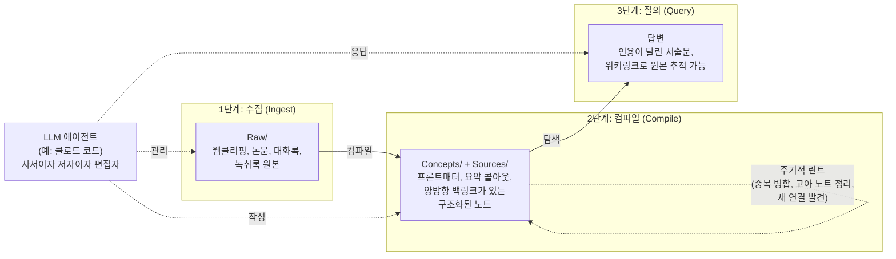
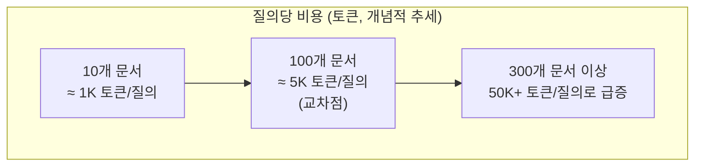

> - 원문: Roan Brasil Monteiro, "Obsidian — Your AI second brain isn't memory — and here's the architecture that actually is" (Medium, 2026년 6월 5일)
> - 이 문서는 원문의 핵심 주장과 아키텍처를 국내 강의·스터디용으로 재구성하고, 관련 사실관계(깃허브 스타 수, Karpathy의 발언 시점 등)를 2026년 7월 기준 최신 자료로 교차 검증하여 정리한 것입니다.

## 관련글

[**옵시디언 세컨드 브레인, 유행의 정점에서 회의론으로 — 2026년 상반기 AI 커뮤니티 최신 흐름**](https://k82022603.github.io/posts/%EC%98%B5%EC%8B%9C%EB%94%94%EC%96%B8-%EC%84%B8%EC%BB%A8%EB%93%9C-%EB%B8%8C%EB%A0%88%EC%9D%B8,-%EC%9C%A0%ED%96%89%EC%9D%98-%EC%A0%95%EC%A0%90%EC%97%90%EC%84%9C-%ED%9A%8C%EC%9D%98%EB%A1%A0%EC%9C%BC%EB%A1%9C-2026%EB%85%84-%EC%83%81%EB%B0%98%EA%B8%B0-ai-%EC%BB%A4%EB%AE%A4%EB%8B%88%ED%8B%B0-%EC%B5%9C%EC%8B%A0-%ED%9D%90%EB%A6%84/)

---

## 왜 이 글을 읽어야 하는가

2026년 상반기 내내 "옵시디언(Obsidian) + 클로드 코드(Claude Code) = AI 세컨드 브레인"이라는 공식이 유튜브, 미디엄, 스레드(Threads), 페이스북을 뒤덮었습니다. 옵시디언 CEO 스테프 앙고(Steph Ango, 깃허브 아이디 kepano)가 2026년 1월 공개한 공식 에이전트 스킬(Agent Skills) 저장소가 그 불씨가 되었고, 여기에 안드레이 카파시(Andrej Karpathy)가 같은 해 4월 초 공개한 "LLM 위키(LLM Wiki)" 패턴이 기름을 부었습니다. 실제로 검색해 보면 이 저장소의 스타 수는 2026년 1월 16일 약 5,247개에서, 3월 중순 13.9k, 4월 말 22k, 6월 초 33k~36k, 그리고 최근에는 37k를 넘어서는 등 반년 만에 7배 넘게 폭증했습니다. 성장 속도만 보면 "이건 뭔가 대단한 게 맞다"는 인상을 주기에 충분합니다.

문제는 이 흐름 속에서 하나의 단어가 슬그머니 오용되기 시작했다는 점입니다. 바로 **"메모리(memory)"** 입니다. 이 문서는 그 오용이 왜 문제인지, 그리고 실제로 "메모리"라고 부를 자격이 있는 시스템은 어떤 조건을 갖춰야 하는지를 아주 구체적인 설계 수준까지 파고들어 설명합니다. 단순한 비판에서 그치지 않고, 실제로 복제해서 돌려볼 수 있는 최소 아키텍처(스킬 2개, 훅 1개, 파일 약 13개)까지 제시합니다.

AI 도구를 가르치는 입장에서 이 글이 특히 유용한 이유는, "그럴듯해 보이는데 왜 실무에서는 자꾸 무너지는가"에 대한 명확한 원인 분석과, 그 원인을 제거하는 구체적인 설계 패턴을 동시에 제공한다는 점입니다.

---

## 1부. "메모리"라는 단어는 어떻게 마케팅 용어가 되었나

### 1-1. 사실관계: 옵시디언 공식 에이전트 스킬의 실체

먼저 정확히 무엇이 출시되었는지부터 짚어야 합니다. 2026년 1월, 옵시디언의 CEO 스테프 앙고는 `obsidian-skills`라는 저장소를 공개했습니다. 이 저장소는 AI 에이전트가 옵시디언의 고유 파일 형식—위키링크(wikilinks), 프론트매터(frontmatter), 베이스(Bases) 데이터베이스, JSON 캔버스(Canvas)—을 올바르게 다루도록 가르치는 **다섯 개의 스킬 모음**입니다.

- **obsidian-markdown**: 위키링크, 콜아웃(callout), 임베드 등 옵시디언 특화 마크다운 문법을 정확히 쓰도록 지도
- **obsidian-bases**: 필터·수식·집계가 포함된 데이터베이스형 뷰(Bases) 생성
- **json-canvas**: 시각적 마인드맵·플로우차트(Canvas) 생성
- **obsidian-cli**: 터미널에서 볼트(vault)를 검색·생성·관리
- **defuddle**: 지저분한 웹페이지를 깔끔한 마크다운으로 정제해 볼트에 저장

이 다섯 스킬은 공개된 "에이전트 스킬(Agent Skills)" 표준 규격을 따르기 때문에, 클로드 코드뿐 아니라 오픈AI의 코덱스(Codex) CLI, 구글 제미나이(Gemini) CLI 등 규격을 지원하는 어떤 에이전트에서도 동작합니다.

여기서 중요한 것은 **이 스킬들이 스스로 "메모리 시스템"이라고 주장한 적이 단 한 번도 없다**는 사실입니다. 이들은 순수하게 "포맷 명세서"입니다. 즉, AI가 옵시디언 파일을 옵시디언이 이해할 수 있는 문법으로 올바르게 쓰도록 돕는 도구일 뿐, 정보를 선택적으로 기억하거나, 세션이 끊겨도 구조를 유지하거나, 규모가 커져도 탐색 가능하게 만드는 어떤 메커니즘도 내장하고 있지 않습니다.

### 1-2. "메모리" 서사는 어디서 왔는가

문제는 증폭 단계에서 발생했습니다. 저장소 공개 후 몇 주 사이, "당신의 AI 세컨드 브레인", "영구적인 프로젝트 메모리", "복리로 불어나는 지식"이라는 표현을 단 수백 개의 콘텐츠가 쏟아졌습니다. 유튜브에서는 "클로드 코드 + 옵시디언 = 당신의 꿈의 세컨드 브레인" 류의 영상이 무료 스타터 키트와 함께 널리 공유되었고, 레딧과 미디엄에는 볼트를 CRM이나 스프린트 트래커, 사업 운영 체계로 바꿨다는 후기가 이어졌습니다.

이 패턴은 낯설지 않습니다. 잘 설계되고 범위가 명확한 기술 산출물이 공개되면, 이미 사람들이 믿고 싶어 하던 기존의 서사—여기서는 티아고 포르테(Tiago Forte)가 10여 년 전부터 퍼뜨린 "세컨드 브레인" 개념—가 그 산출물을 집어삼킵니다. 원래의 기술적 속성은 사라지고, 서사가 약속하는 이미지만 남습니다.

이것이 단순히 용어 선택의 문제가 아닌 이유는, **잘못된 서사가 잘못된 시스템을 만들게 만든다**는 데 있습니다. 사람들은 볼트에 수백 개의 클리핑을 쏟아붓고, 스킬을 설치하고, "내가 X에 대해 뭘 알고 있지?"라고 물은 뒤, 그럴듯하지만 때로는 정확하고 때로는 환각(hallucination)이며 결코 안정적으로 추적할 수 없는 답을 받습니다. 이것을 "메모리"라고 부릅니다. 그리고 이 시스템이 결혼식 축사 준비 중에, 클라이언트 미팅 중에, 연구 보고서 작성 중에 실패하면 "AI가 아직 미덥지 못하다"고 결론짓습니다. 하지만 실제로는 노트 뭉치를 만들어놓고 그것을 데이터베이스라고 착각한 것뿐입니다.

이 착각에는 부작용도 있습니다. 임베딩, 벡터 스토어, 구조화된 검색 파이프라인처럼 실제로 메모리를 구현하는 도구들이 오히려 "복잡하다", "기업용이다"라는 프레임에 갇히고, 더 단순해 보이는 서사가 기본값으로 채택됩니다. 이건 앞뒤가 바뀐 판단입니다. 벡터 파이프라인은 "고정된 말뭉치에 대한 고정밀 검색"이라는 특정 질문에 대한 정직한 답이고, "위키가 곧 메모리다"라는 프레임은 같은 질문을 공짜로 커버하는 척하는 모호한 답입니다.

---

## 2부. 노트북, 서류철, 데이터베이스 — 세 가지 도구, 세 가지 역할

이 대화에는 서로 다른 역할을 하는 세 종류의 도구가 등장하는데, 이들을 혼동하는 것이 모든 문제의 근원입니다.

```mermaid
flowchart LR
    subgraph A["노트북 (Notebook)"]
        A1["순수 옵시디언 볼트"]
        A2["용도: 기록, 초안 작성,\n개인적 사고 연결"]
        A3["강점: 로컬, 이동성,\n빠름, 무한 커스터마이징"]
        A4["한계: 구조적 검색 없음,\n참조 무결성 없음,\n동시성 안전 없음"]
        A5["규모: 사용자 1명,\n노트 수 무제한"]
    end
    subgraph B["서류철 (Filing Cabinet)"]
        B1["볼트 + 구조화 레이어"]
        B2["용도: 에이전트가 유지·관리하는\n지속적 연구 자료"]
        B3["강점: 요약 우선 탐색,\n추적 가능한 답변,\n벡터 인프라 불필요"]
        B4["한계: 약 100개 문서 /\n40만 단어 이상에서 한계,\n대규모 정밀 검색 불가"]
        B5["규모: 사용자 1명,\n문서 약 100개 이하"]
    end
    subgraph C["데이터베이스 (Database)"]
        C1["벡터 스토어 / RDBMS"]
        C2["용도: 대규모, 다중 사용자,\n정밀 검색"]
        C3["강점: 수백만 항목 확장,\nACID, 감사 로그,\n동시 쓰기 지원"]
        C4["한계: 무거운 인프라,\n불투명한 임베딩,\n배포 복잡도"]
        C5["규모: 다중 사용자,\n수백만 항목"]
    end
    A -.단순 확장으로는\n도달 불가.-> B
    B -.의도적 마이그레이션.-> C
```



- **노트북**은 순수한 옵시디언 볼트, 즉 마크다운 파일 폴더입니다. 자유로운 링크, 무한한 커스터마이징, 완벽한 이동성이 강점입니다. 하지만 구조화된 검색이 없어 텍스트 검색에 의존하고, 존재하지 않는 노트로 링크를 걸어도 막지 못하며(참조 무결성 부재), 두 명이 동시에 쓰면 충돌이 납니다. 한 사람이 자기 생각을 정리하는 데는 무한히 확장되지만, 그 이상으로는 확장되지 않습니다.

- **서류철**은 노트북에 구조화된 레이어를 얹은 것입니다. 서랍, 폴더, 라벨, 정리 규칙—이것들은 문서 자체가 아니라, 모든 문서를 다 읽지 않고도 필요한 것을 찾게 해주는 탐색 시스템입니다. 볼트 세계에서는 프론트매터 관례, 요약 콜아웃, 인덱스 파일, 백링크 규율, 그리고 이 모든 것을 유지하는 에이전트 루프가 이에 해당합니다. 실제 검증된 사례에 따르면, 문서 약 100개(약 40만 단어) 규모까지는 요약 기반 탐색만으로 충분하며, 이 규모에서 풀스택 RAG를 도입하면 오히려 지연 시간과 검색 노이즈가 더 늘어난다는 관찰이 있습니다. 이 한계선을 넘으면 요약 탐색이 걸러내는 노이즈보다 만들어내는 노이즈가 더 커집니다.

- **데이터베이스**는 대규모, 다중 사용자, 정밀 검색을 위해 설계된 도구입니다. 파인콘(Pinecone)이나 밀버스(Milvus) 같은 벡터 스토어, 포스트그레SQL(PostgreSQL) 같은 관계형 데이터베이스가 여기 속합니다. 수백만 항목으로 확장되고, 동시 쓰기를 지원하며, ACID 보장과 감사 로그를 제공합니다. 대신 무거운 인프라, 오해를 부를 수 있는 불투명한 임베딩, "폴더에 파일 놓기"와는 거리가 먼 배포 과정이 비용으로 따라옵니다.

커뮤니티의 서사는 데이터베이스 칸이 약속하는 것(메모리, 규모, 정밀도)을 노트북 칸의 원시적인 구조 위에 그대로 얹어버립니다. 이게 바로 오류입니다. 노트북을 데이터베이스라고 부른다고 해서 데이터베이스가 되지는 않습니다. 여기에 LLM을 더해도 근본적인 원시 구조는 바뀌지 않고, 오히려 혼동을 더 알아채기 어렵게 만들 뿐입니다. 왜냐하면 LLM은 제대로 작동하는 시스템에서든, 망가진 시스템에서든 똑같이 그럴듯한 답을 만들어내기 때문입니다.

이 글에서 제시하는 아키텍처는 바로 이 **"서류철"** 칸입니다. 많은 사람이 실제로 필요로 하지만 거의 아무도 제대로 만들지 않는 스위트 스폿입니다. 데이터베이스는 아닙니다. 이 규모를 넘어서면—다음 절에서 "넘어선다"는 것이 정확히 무엇을 의미하는지 다룹니다—의도적으로 RAG(검색증강생성)로 졸업해야 합니다. 그 전까지는 서류철이 임베딩보다 저렴하고, 이동성이 좋고, 디버깅하기 쉽습니다.

---

## 3부. 아키텍처의 실체: 디스크 위의 세 단계

### 3-1. 카파시의 "LLM 위키" 패턴

이 설계의 원형은 안드레이 카파시(전 테슬라 AI 디렉터, 오픈AI 공동창업자)가 2026년 4월 3일 X(옛 트위터)에 올린 게시물에서 시작되었습니다. 이 게시물은 조회수 1,600만 회를 넘기며 화제가 되었고, 이틀 뒤 카파시는 `llm-wiki.md`라는 깃허브 젬(Gist)을 추가로 공개했습니다. 이 파일은 제품이나 코드가 아니라, LLM 에이전트에 그대로 붙여 넣어 각자의 용도에 맞게 구체화하도록 설계된 "아이디어 파일(idea file)"입니다.

카파시가 이 패턴을 제안한 배경은 명확합니다. 표준적인 RAG 방식(문서를 청크로 나누고, 벡터 임베딩을 만들고, 질의 시 유사도 검색으로 관련 청크를 찾아 LLM에 넣는 방식)은 질문할 때마다 지식을 처음부터 다시 발견하는 구조입니다. 다섯 개 문서를 종합해야 하는 미묘한 질문을 던지면, LLM은 매번 관련 조각을 새로 찾아 짜맞춰야 합니다. 아무것도 누적되지 않습니다. 노트북LM(NotebookLM)이나 챗GPT 파일 업로드, 대부분의 RAG 시스템이 이런 방식으로 동작합니다.

카파시의 대안은 LLM을 "컴파일러"로 취급하는 것입니다. 원본 소스 문서를 읽고, 구조화되고 상호 연결된 위키를 만들어내는 컴파일러. 이 위키 자체가 곧 지식 베이스가 되며, 개인 지식 베이스 규모에서는 임베딩이나 벡터 검색이 필요 없습니다.



### 3-2. 각 단계의 실제 작동 방식

**1단계 — 수집(Ingest)**: 웹에서 스크랩한 글, 논문, 회의록, 대화 로그 등 원본 자료가 `Raw/` 폴더로 들어갑니다. 이 폴더의 내용물은 설계상 일시적입니다. 나중에 삭제해도 된다는 전제로 존재합니다. 이 폴더 자체가 메모리가 아니라, 메모리를 만드는 데 쓰이는 재료일 뿐입니다. 카파시는 옵시디언 웹 클리퍼(Web Clipper)를 이용해 웹 콘텐츠를 마크다운으로 변환하는데, 같은 역할은 수작업 붙여넣기, RSS 파이프라인, 그 밖의 어떤 텍스트 생성 수단으로도 대체할 수 있습니다.

**2단계 — 컴파일(Compile)**: 여기가 가장 부담이 크면서도 대부분의 "AI 세컨드 브레인" 설정이 건너뛰는 핵심 단계입니다. 에이전트가 `Raw/`의 내용을 읽고, 지속성 있는 개념(concept)을 추출해 `Concepts/`와 `Sources/`에 엄격한 프론트매터와 요약 규율을 갖춰 저장합니다. 개념 페이지에는 상태(status), 신뢰도(confidence), 근거가 된 출처(sources), 그리고 단 하나의 목적—다음에 이 볼트를 탐색할 에이전트가 본문을 열지 말지 판단할 수 있게—을 위한 두 문장짜리 요약 콜아웃이 붙습니다. 개념은 자신이 참조한 출처 목록을 갖고, 각 출처는 자신이 다루는 개념 목록을 갖는 **양방향 백링크**가 바로 임베딩 없이도 LLM이 나중에 그래프를 탐색할 수 있게 하는 핵심 장치입니다.

**3단계 — 질의(Query)**: 질문을 던지면 에이전트는 볼트를 grep하지 않습니다. 먼저 `index.md`(약 1천 토큰)를 열고, 후보 개념 몇 개를 고른 뒤, 각 개념의 요약 콜아웃(약 200토큰)만 읽습니다. 실제로 필요한 본문만 그때 엽니다. 답변은 인용이 달린 서술문 형태로 나오고, `[[위키링크]]`가 근거 파일을 가리킵니다. 전체 질의 경로는 원본이 수백만 토큰이라도 단 몇천 토큰만 사용합니다.

**부가 단계 — 린트(Lint)**: 이 단계는 간헐적으로 실행되며 사람들이 가장 쉽게 잊는 부분입니다. LLM이 주기적으로 위키를 훑어 불일치, 누락된 정보, 기록해 둘 만한 새로운 연결을 찾습니다. 고아 개념(연결이 끊긴 노트)에는 플래그가 붙고, 생성된 지 30일이 넘은 스텁(stub, 뼈대만 있는 노트)은 승격되거나 삭제됩니다. 중복은 병합됩니다. 이것이 서류철을 무덤으로 방치되지 않게 만드는 유지보수 작업입니다.

이 네 단계 전체를 같은 에이전트가 담당합니다. 사서이자 저자이자 편집자로서요. 볼트가 곧 상태(state)이며, 중요한 것은 절대 컨텍스트 창 안에만 머물지 않는다는 점—이것이 이 아키텍처의 핵심입니다.

---

## 4부. 규모를 좌우하는 규율

이 아키텍처가 애초에 작동하는 이유이자, 약 100개 문서를 넘으면 무너지는 이유는 단 하나의 규율에 있습니다: **요약 우선 탐색(summary-first navigation)**.

모든 개념과 출처 노트는 다음과 같은 형태의 콜아웃을 가집니다.

```
> [!summary]
> 한두 문단짜리 정의. 다음에 이 볼트를 탐색할 에이전트를 위해 쓴 것.
> 독자가 여기서 탭을 닫아도 이 개념이 무엇이고 언제 적용되는지
> 이해할 수 있는가?
```

이 콜아웃은 장식이 아니라 인덱싱 레이어 그 자체입니다. 질의 스킬이 4,000단어짜리 개념 본문을 열지 말지 판단할 때, 먼저 이 50단어짜리 요약을 읽습니다. 요약이 부실한 볼트는 문서 20개만 넘어도 확장 한계에 부딪히지만, 요약 규율이 엄격한 볼트는 200개까지도 버팁니다. 차이는 말뭉치의 크기가 아니라 질의당 탐색 비용에서 발생합니다.

또 하나의 규율은 **양방향 백링크**입니다. 개념 페이지는 프론트매터에 `sources: [...]`로 자신의 근거 출처를 나열하고, 각 출처 페이지는 `concepts: [...]`로 자신이 다루는 개념을 나열합니다. 이는 단순한 표시용이 아니라 LLM이 질의에 답할 때 따라가는 탐색 경로(edge) 그 자체입니다. 노트 A가 노트 B로 링크되어 있으면, RAG 시스템처럼 벡터 데이터베이스로 관련성을 "추측"할 필요 없이 두 노트가 연결되어 있다는 사실이 하드코딩된 관계로 존재합니다.

마지막으로, 임베딩 인덱스를 대체하는 가장 저렴한 장치는 `index.md`입니다. 프론트매터와 요약에서 자동 생성되며, 저장할 때마다 재생성됩니다. 질의 스킬은 다른 어떤 파일을 열기 전에 항상 이 파일을 먼저 읽습니다. 실제 저장소에서는 `scripts/rebuild_index.py`라는, 외부 라이브러리 의존성이 전혀 없는 파이썬 스크립트가 이 역할을 담당합니다.

이 스크립트가 생성하는 인덱스는 대략 이런 모습입니다(구조를 보여주기 위한 예시입니다):

```markdown
## 개념 (3개)

- [[Concepts/llm-knowledge-base]] · 초안, 신뢰도 중간
  LLM 에이전트가 원본 자료를 구조화된 마크다운 위키로 컴파일하고,
  그 위키를 탐색해 질의에 답하는 아키텍처 패턴 — 벡터 데이터베이스도
  임베딩도 없음. 약 100개 문서 / 40만 단어까지 안정적으로 확장.
- [[Concepts/summary-first-navigation]] · 스텁, 신뢰도 낮음
  규율: 모든 노트는 2문장짜리 요약 콜아웃을 가져야 탐색 시
  본문을 읽을 필요가 없다.
- [[Concepts/rag-tradeoffs]] · 스텁, 신뢰도 낮음
  마크다운 위키 검색이 무너지는 시점과 벡터 검색이 그 비용을
  상쇄하는 시점.
```

이게 전부 합쳐 약 250토큰입니다. 질의 스킬은 다른 무언가를 열지 결정하기 전에 이걸 먼저 읽습니다. 개념 200개짜리 볼트라도 인덱스는 약 2천 토큰에 불과합니다. 같은 볼트를 원문 그대로 읽으면 80만 토큰입니다. 이 세 자릿수 배율 차이가 이 아키텍처가 확장되는 근본적인 이유입니다.

---

## 5부. 두 개의 스킬 — 설계의 핵심

이 아키텍처의 실제 작업은 두 개의 스킬이 담당합니다. 짧고 구체적이어야 하는 이유는, 스킬의 설명(description) 문구가 곧 활성화 트리거이기 때문입니다. 모호한 설명은 불필요할 때 발동하거나, 필요할 때 발동하지 않습니다.

### 5-1. 수집 스킬(vault-ingest)

컴파일 단계를 담당합니다. 스킬 프론트매터의 설명 문구에는 "ingest(수집)", "process(처리)", "compile(컴파일)" 같은, 사용자가 실제로 입력할 법한 동사가 명시적으로 들어갑니다.

절차는 다섯 단계로 구성됩니다.

1. **훑어보되 전부 읽지 않기**: 원본 파일마다 처음 약 500토큰만 읽어 분류, 제목, 주제만 뽑아냅니다. 전체 내용을 읽는 비용을 지불하지 않습니다.
2. **출처 노트 생성**: 각 원본 항목마다 완전한 프론트매터와 두 문장짜리 요약 콜아웃을 갖춘 Source 노트를 만듭니다.
3. **개념 추출**: 여기에 결정적인 휴리스틱이 있습니다 — *어떤 개념이 단 하나의 출처에서만 등장했다면, 그것은 아직 개념이 아니라 그냥 하나의 주장(claim)일 가능성이 높습니다.* 두 번째로 등장할 때까지 개념으로 승격시키지 않습니다. 이 규칙이 없으면 볼트는 "한 번 본 흥미로운 것들"의 무덤이 됩니다.
4. **양방향 백링크 동기화**: 출처의 `concepts:` 프론트매터와 각 개념의 `sources:` 목록을 서로 일치시킵니다.
5. **린트 패스**: 고아, 오래된 스텁, 중복에 플래그를 붙입니다. 이때 개수와 플래그만 반환하며, 노트 내용을 절대 그대로 다시 붙여넣지 않습니다. 이 아키텍처의 핵심은 상태가 디스크에 있다는 것이지, 에이전트가 그것을 다시 대화창으로 전달하는 것이 아닙니다.

이 다섯 번째 원칙—**"노트 내용을 그대로 되돌려주지 않는다"**—는 단순히 간결함을 위한 게 아니라, 긴 세션이 무너지지 않게 만드는 비용 규율입니다. 이미 디스크에 있는 내용을 다시 대화 맥락으로 전달하면 토큰을 낭비하며 컨텍스트를 오염시킵니다. 이 규율이 있어야 같은 에이전트가 한 세션에서 원본 파일 100개를 처리해도 컨텍스트 창이 무너지지 않습니다.

### 5-2. 질의 스킬(vault-query)

수집 스킬의 대응 짝입니다. 설명 문구에도 "내가 X에 대해 뭘 알고 있지", "Y에 대한 내 노트 찾아줘" 같은, 기존 노트로 답할 수 있을 법한 질문 패턴이 명시됩니다.

절차는 다음 탐색 규율을 코드화합니다: `index.md`로 시작 → 후보 개념은 최대 5개까지만 열기 → 프론트매터와 요약 콜아웃만 읽기 → 백링크는 선택적으로만 따라가기 → 모든 주장에 `[[위키링크]]` 인용을 붙여 답하기. 마지막 규칙이 중요합니다: *어떤 주장에 근거가 없으면 "(볼트에 출처 없음)"이라고 표시하고, 절대 조용히 지어내지 않는다.* 근거 없는 인용은 이 아키텍처가 가장 나쁘게 실패하는 방식이며, 그 공백을 명시적으로 드러내는 것이 유일한 대응책입니다.

여기서 "최대 5개까지만"이라는 규칙은 제안이 아니라 예산(budget)입니다. 검색 공간이 무제한인 에이전트는 자신이 기대하는 답을 찾을 때까지 계속 파일을 여는 습성이 있습니다. 이 습성은 5천 토큰짜리 질의를 5만 토큰짜리 질의로 부풀리면서도 결국 처음 세 번의 읽기에서 찾을 답과 같은 답을 찾아냅니다. 이 예산 규칙이 없으면 확장성 곡선은 100개 문서보다 훨씬 이전에 무너집니다.

### 5-3. 왜 스킬이 정확히 두 개인가

이 아키텍처에는 수집과 질의, 딱 두 개의 연산만 존재합니다. 스킬을 더 추가하는 것은 중복, 모호성, 활성화 노이즈를 만드는 지름길입니다. "린트" 스킬을 별도로 만들고 싶은 유혹이 자연스럽게 들지만, 린트는 수집의 일부입니다. "요약" 스킬을 따로 만들고 싶어질 수도 있지만, 요약은 이미 요약 콜아웃이 하는 일입니다. 스킬 두 개가 정답이며, 더 추가하려는 유혹이야말로 대부분의 설정을 더 나쁘게 만드는 원인입니다.

---

## 6부. 인덱스를 살아있게 유지하는 훅(Hook)

스킬은 에이전트 주도 작업을 처리하고, 훅은 결정론적(deterministic) 작업을 처리합니다. 개념이나 출처가 바뀔 때마다 매번 반드시 일어나야 하고, 지침만으로는 신뢰할 수 없는 단 하나의 연산—**인덱스 재생성**—이 그것입니다.

훅은 `Write`나 `Edit` 도구가 실행될 때마다 발동하는 단일 배시(bash) 스크립트로, 변경된 파일이 `Concepts/`나 `Sources/` 안에 있을 때만 인덱스 재생성 스크립트를 실행합니다. 이 훅 스크립트에는 세 가지 사소하지만 결정적인 설계 선택이 들어 있습니다.

1. JSON 페이로드 파싱에 `jq` 대신 `python3`를 사용합니다. `jq`가 설치되지 않은 것은 셸 기반 클로드 코드 훅에서 가장 흔한 조용한 실패 원인 중 하나이며, 인덱스는 그런 실패를 감수하기엔 너무 중요합니다.
2. 파일 경로를 명시적으로 패턴 매칭해서, `Concepts/`나 `Sources/` 바깥의 쓰기 작업에는 아무 일도 하지 않습니다. (작은 볼트에서는 이 스크립트가 약 30밀리초밖에 안 걸리지만, README를 수정할 때마다 그 비용을 치를 필요는 없습니다.)
3. 재생성기의 출력을 표준 출력(stdout)이 아닌 표준 에러(stderr)로 보냅니다. 클로드 코드는 표준 출력을 프로토콜로 해석하기 때문에, 여기로 잘못 출력하면 디버깅하는 데 반나절이 걸리는 방식으로 시스템이 망가집니다.

이 훅은 `settings.json`의 `PostToolUse` 훅으로 연결됩니다. `PreToolUse`가 아니라 `PostToolUse`인 이유는 이 재생성 작업이 반응형(reactive)이기 때문입니다—변경을 관찰하고 인덱스를 갱신할 뿐, 쓰기 작업 자체를 막을 필요는 없습니다. 매처(matcher)는 글롭(glob) 패턴이 아니라 정규식(`Write|Edit|MultiEdit`)이어야 합니다. 글롭으로 `Write*`라고 쓰면 조용히 절대 발동하지 않는데, 이것이 클로드 코드 훅에서 가장 흔한 버그입니다. 경로도 `$HOME`이 아니라 `$CLAUDE_PROJECT_DIR`을 써야 합니다. 이 JSON 설정 안에서는 `$HOME`이 확장되지 않아 역시 조용히 발동하지 않습니다.

이 아키텍처 전체에서 에이전트가 직접 관리하지 않는 유일한 동작 부품이 바로 이 훅입니다. 수집, 개념, 요약, 백링크, 질의는 모두 에이전트의 일이고, 인덱스만큼은 결정론적인 이음매로 남아 있어야 합니다.

훅이 호출하는 파이썬 스크립트(`scripts/rebuild_index.py`, 약 100줄)는 표준 라이브러리만 사용합니다. 의존성이 전혀 없다는 것은 우연이 아닙니다. 이 스크립트는 아키텍처의 핵심 경로에 있고, `pip install`이 실패하거나 가상환경이 깨지는 상황은 절대 용납할 수 없는 실패 모드이기 때문입니다. 프론트매터 파서도 최소한으로만 구현되어 있어서, 중첩된 YAML이나 `[a, b]` 형태의 리스트, 콜론이 포함된 따옴표 문자열은 지원하지 않습니다. 이 아키텍처의 용도에는 이 정도 서브셋으로 충분하며, 더 많은 기능을 지원하려면 의존성과 버그 표면적이 늘어날 뿐입니다.

문서 200개 규모 볼트에서 이 스크립트는 30밀리초 이내에 실행됩니다. 이 수치가 중요한 이유는, 훅은 동기적으로 실행되기 때문에 50번의 편집이 이어지는 리팩터링 세션에서 매번 3초짜리 훅이 걸리면 순수하게 2분 30초를 낭비하게 되기 때문입니다. 인덱스 재생성은 500밀리초 이내로 유지해야 사용자가 지연을 느끼지 않고, 100밀리초 이내면 사용자가 존재 자체를 잊어버릴 정도로 매끄러워집니다.

---

## 7부. 확장 한계선, 그리고 그 너머

이 아키텍처에는 한계가 있습니다. 어디에 있는지, 그 한계에 도달했을 때 무엇을 해야 하는지를 정직하게 짚을 필요가 있습니다.



카파시가 제시한 경험적 수치는 **약 100개 문서, 약 40만 단어**입니다. 이 숫자 자체보다 그 뒤에 숨은 원리가 더 유용합니다. 한계선 아래에서는 질의 비용이 거의 로그함수적으로 증가합니다. 문서를 추가해도 질의 비용은 거의 변하지 않는데, 왜냐하면 본문이 아니라 인덱스와 요약만 읽기 때문입니다. 한계선을 넘으면 요약 탐색이 지나치게 많은 거짓 후보를 만들어내기 시작하고, LLM이 후보를 구분하려고 개념 본문을 너무 많이 열게 되면서 질의당 비용이 가파르게 치솟습니다. 무너지는 양상은 "모든 게 갑자기 멈춘다"가 아니라 "질의 비용이 충분히 빠르게 늘어나서, 오버헤드가 있음에도 벡터 검색 쪽이 더 저렴해지는 지점에 도달한다"에 가깝습니다.

실제로 검증된 수치도 이 지점을 뒷받침합니다. 문서 100개(평균 500토큰씩)를 원본과 인덱스까지 합쳐 전부 컨텍스트에 넣으면 총 토큰이 40만에 달해, 클로드의 20만 토큰 컨텍스트 창을 초과합니다. RAG를 도입하면 100개 문서짜리 위키의 토큰 부하가 약 5만에서 2,500 수준으로 줄어드는데, 이는 20~40배의 연산 오버헤드 절감에 해당합니다.

이 한계선의 위치는 다음 세 가지 요인에 따라 달라집니다.

- **평균 문서 길이**: 짧은 블로그 클리핑보다 긴 기술 논문이 많으면 한계선이 낮아집니다.
- **요약 규율**: 콜아웃이 부실하면 에이전트가 본문을 더 자주 열게 되어 한계선이 낮아집니다.
- **개념 대 출처 비율**: 출처 하나당 개념 하나면 데이터베이스에 가까워지고, 출처 열 개당 개념 하나면 더 멀리까지 확장됩니다.

한계선을 넘었을 때 정답은 이 아키텍처를 버리는 것이 아니라, **그 위에 벡터 인덱스를 얹는 것**입니다. 마크다운을 H1~H3 헤더 기준으로 나누는 청크 단위 인덱싱(예: ChromaDB 사용)은 모델이 서로 무관한 문서를 뒤섞어 이해하는 것을 막아주고, 클로드 코드의 `PostToolUse` 훅은 파일이 저장될 때마다 로컬 벡터 데이터베이스를 자동으로 재인덱싱해 항상 최신 상태를 유지하게 합니다. 이때 개념·출처 구조, 요약 콜아웃, 위키링크는 그대로 남습니다. 달라지는 것은 검색 경로가 두 갈래로 늘어난다는 점입니다: 그래프를 통한 구조적 탐색(여전히 저렴하고 기본 경로)과, 벡터 인덱스를 통한 의미 검색(비싸지만 정밀하며, 그래프로는 답할 수 없는 질문을 위한 경로).

여기서 하지 말아야 할 것은, 튜토리얼이 그렇게 보여준다는 이유만으로 작은 볼트에서부터 RAG로 먼저 졸업하는 것입니다. 부서 단위 위키나 개인 연구 프로젝트처럼 문서 수는 적당하지만 추적 가능성과 개념적 구조에 대한 필요는 높은 시나리오에서는, 화려한 RAG 인프라가 오히려 해결하는 것보다 더 많은 지연과 검색 노이즈를 만들어냅니다. 한계선 아래에서 벡터 인덱스는 정교함을 가장한 오버헤드입니다. 한계선 위에서 벡터 인덱스 없는 위키는 미니멀리즘을 가장한 부정(否定)입니다. 각 도구는 각자의 자리가 있습니다.

한계선을 넘어선 후 RAG를 추가하는 실제 이행 과정을 조금 더 구체적으로 설명하면, 효과적인 청크 전략은 **헤더 기반 청킹**입니다. 각 마크다운 파일을 H1, H2, H3 경계에서 나누고, 각 섹션을 임베딩하며, 출처 파일을 메타데이터로 함께 저장합니다. 이는 대부분의 RAG 튜토리얼이 쓰는 단순한 토큰 수 기준 청킹과는 확연히 다릅니다. 헤더 기반 청킹은 에이전트가 이미 작성해 놓은 문서 구조를 존중합니다—개념 페이지의 "적용 범위" 섹션은 의미 있는 검색 단위이지만, 임의로 자른 500토큰짜리 조각은 그렇지 않습니다. 인덱스를 재생성하는 것과 같은 `PostToolUse` 훅이 변경된 파일의 청크를 증분적으로 재임베딩하여, 별도의 수집 파이프라인 없이 벡터 스토어를 볼트와 동기화된 상태로 유지할 수 있습니다.

개인 볼트에 합리적인 저장소 선택지는 벡터 유사도 검색 확장 기능이 있는 DuckDB, 또는 파이썬 생태계를 선호한다면 ChromaDB입니다. 둘 다 로컬에서 실행되며, "모든 것이 디스크에 있고 별도로 관리할 서비스가 없다"는 아키텍처의 특성을 유지합니다. 파인콘이나 밀버스는 다중 사용자·다중 테넌트·고동시성을 위한 다른 규모의 도구이므로, 개인 볼트에 이런 도구를 붙이는 것은 오히려 정교함을 가장한 또 다른 오버헤드입니다.

벡터 인덱스가 추가되면 질의 스킬에도 분기가 생깁니다. 질문이 "특정 API 시그니처가 정확히 뭐였지" 같은 사실 조회형이면 벡터 검색으로 라우팅하고, "내가 Y에 대해 뭘 알고 있지" 같은 종합·발견형 질문이면 그래프 탐색 경로에 남습니다. 개인 위키에서 나오는 대부분의 질문은 후자에 속하며, 벡터 경로는 구조적 경로로는 잘 답할 수 없는 소수의 질문을 위한 것입니다. 이것이 "항상 둘 다 쓴다"가 아니라 "기본적으로는 더 저렴한 경로를 쓰고, 질문이 요구할 때만 정밀한 경로로 라우팅한다"는, 실제로 복리 효과를 내는 하이브리드 검색의 모습입니다.

---

## 8부. 이 아키텍처가 실패하는 지점들

어떤 아키텍처든 마케팅에서는 생략하는 실패 모드가 있습니다. 이 정도 깊이에서는 그 실패 모드도 구체적으로 짚을 필요가 있습니다.

- **근거 없는 인용(hallucinated citation)**: 가장 나쁜 실패 모드입니다. 질의 스킬은 "모든 주장에 위키링크 인용을 달라"고 지시하지만, 이를 물리적으로 강제하는 장치는 없습니다. LLM은 존재하지 않는 파일로 위키링크를 지어낼 수 있고, 답변은 권위 있는 것처럼 읽힙니다. 완화책은 답변에 포함된 위키링크를 스캔해서 실제로 존재하는 파일로 연결되는지 검증하는 `PostToolUse` 훅이지만, 원 저장소에는 아직 구현되어 있지 않습니다. 그때까지는 "근거를 찾을 수 없으면 지어내지 말고 표시하라"는 원칙이 오직 스킬 프롬프트 안에서만 지켜지는데, 이는 대략 70% 정도의 확률로만 준수됩니다. 나머지 30%에 대비해야 합니다.

- **요약 부패(summary rot)**: 느리게 진행되는 실패입니다. 요약은 한 번 쓰이고 나면 그 아래 개념이 바뀌어도 거의 갱신되지 않습니다. 반 년이 지나면 절반의 요약이 이전 버전의 개념을 설명하게 되고, 인덱스는 질의 스킬에 거짓 정보를 줍니다. 완화책은 요약과 본문 첫 문단을 비교해 드리프트(drift)를 감지하는 린트 패스이지만, 이 역시 아직 구현되어 있지 않습니다. 유지보수가 함께 복리로 쌓이지 않으면 아키텍처도 복리로 쌓이지 않습니다.

- **개념 남발(concept promiscuity)**: 볼트를 침몰시키는 원인입니다. "두 번째로 등장할 때까지 승격시키지 않는다"는 규칙은 결정적이면서도 계속 어기고 싶어지는 규칙입니다. 이 규칙이 없으면 개념 레이어가 "한 번 본 흥미로운 것들"의 단일 항목들로 채워지고, 아키텍처를 작동시키는 연결성이 평평한 목록으로 퇴화합니다. 증상은 그래프 뷰에 연결이 한두 개뿐인 노드가 잔뜩 보이는 것입니다. 해결책은 출처가 2개 미만인 개념에 플래그를 붙여 강등 또는 병합을 강제하는 반복적인 린트입니다.

- **"볼트가 곧 메모리"라는 프레임이 너무 많이 저장하게 만듭니다.** 메모리는 "여태껏 읽은 모든 것"이 아니라 "유용하게 다시 꺼낼 수 있는 것"입니다. 모든 뉴스레터와 모든 트윗을 흡수하는 볼트는 자신의 개념 레이어를 노이즈로 익사시킵니다. 완화책은 사람의 주의력에 적용하는 것과 같은 원칙—컴파일이 끝났거나 90일이 지난 원본 클리핑은 삭제하는 공격적인 `Raw/` 보존 정책—이지만, "수집의 도파민"이 "삭제의 규율"과 정면으로 충돌하기 때문에 말처럼 쉽지 않습니다.

- **MCP 연동이 보안을 느슨하게 만드는 지점입니다.** 여러 인기 가이드가 더 풍부한 질의를 위해 MCP 서버로 볼트를 연결하라고 권장합니다. 여기서 진지하게 고려해야 할 우려는, 클라우드 호스팅 AI 통합에 볼트를 연결하는 순간 민감하고 통찰력 있는 노트와 생각들을 통째로 넘겨주게 된다는 점입니다. 이 아키텍처는 모든 것을 로컬에 유지합니다—LLM이 파일시스템을 통해 파일을 읽을 뿐, MCP 서버도 외부 서비스도 개입하지 않습니다. MCP를 추가한다면 그 표면을 반드시 감사해야 합니다. 편의성이 실질적인 만큼 위험도 실질적입니다.

- **이 아키텍처가 풀지 못하는 검색 문제도 있습니다.** 옵시디언의 그래프 뷰는 발견(discovery)과 미지의 연결을 찾는 데 최적화되어 있는 반면, RAG는 이미 알고 있는 정보를 고정밀로 검색하는 데 필요합니다. 규정의 특정 조항, API 문서의 특정 단락처럼 "정확히 어떤 사실이 필요한지 이미 알고 있고 정확해야만 하는" 용도라면 위키 아키텍처는 틀린 도구입니다. 이 아키텍처는 종합(synthesis)을 위한 것이지 조회(lookup)를 위한 것이 아닙니다. 조회에는 벡터 인덱스나 실제 데이터베이스, 혹은 그냥 grep을 쓰는 게 맞습니다.

- **약 100개 문서라는 한계선은 개인 사용을 전제로 합니다.** 다중 사용자 환경에서는 다른 방식으로 무너집니다. 두 명이 파일 잠금 없이 `index.md`를 동시에 편집하면, 파일 폴더는 손상된 인덱스와 함께 남습니다. 팀 단위로 쓰려면 진짜 데이터베이스가 필요하며, 사용자를 추가한다고 서류철이 기업용 시스템으로 승격되지는 않습니다.

- **긴 수집 세션에서는 컨텍스트 압축(compaction)이 조용한 킬러입니다.** 클로드 코드의 컨텍스트 창은 한계가 있고, `/compact`는 손실이 있는 방식으로 동작합니다—용량이 부족해지면 대화 내용을 요약(패러프레이즈)해버립니다. 원본 파일 50개를 수집하는 중간에 압축이 발동하면, "어떤 파일까지 처리했는지", "어떤 개념을 승격시켰는지", "어떤 병합이 대기 중인지"에 대한 대화 상태가 모호하게 뭉개질 수 있습니다. 이에 대한 방어책은 이 아키텍처 자체의 원리와 같습니다—디스크 위의 상태는 지속적입니다. 지금까지 작성된 Source와 Concept 노트는 실재하고, 인덱스는 이를 반영하며, `Raw/` 폴더에는 아직 처리되지 않은 파일이 그대로 남아 있습니다. 압축을 인지하는 수집 스킬은 현재 인덱스와 `Raw/`의 내용을 읽어 차이를 계산하고 거기서부터 이어서 작업을 재개해야 합니다.

- **"나중에 RAG로 졸업하겠다"는 계획이 종종 "결국 졸업하지 못했다"로 끝납니다.** 100개 문서라는 한계선은 경험적이고 조용히 다가옵니다. 그 선을 넘을 때 경보가 울리지 않습니다. 질의 품질은 점진적으로 저하됩니다—답변이 조금씩 더 모호해지고, 인용이 조금씩 덜 구체적이 되고, 에이전트가 예전보다 개념 본문을 조금 더 많이 열게 됩니다. 실제로 눈에 띄게 알아차릴 때쯤이면 이미 몇 달째 한계선 위에서 운영해 왔고, 저하된 경험을 "원래 이런 시스템"이라고 내재화해 버린 뒤입니다. 완화책은 단조롭지만 확실합니다—`/cost` 명령이나 질의당 평균 토큰 수를 지켜보고, 일주일 평균이 어떤 임계값(예: 질의당 8천 토큰)을 넘으면 RAG 마이그레이션을 진행하기로 미리 정해두는 것입니다. 무기한 미뤄지는 아키텍처 전환은 사실 이미 내려진 결정이나 다름없습니다.

---

## 9부. 실제로 만드는 순서

지금 이 아키텍처를 처음부터 구축한다면, 실제로 잘 작동하는 순서는 대부분의 튜토리얼이 보여주는 순서와 정반대입니다.

1. **볼트가 아니라 인덱스부터 시작합니다.** `scripts/rebuild_index.py`와 훅을 가장 먼저 작성합니다. 빈 볼트 상태에서도 인덱스가 깔끔하게 재생성되어야 합니다. 이것이 다른 모든 것이 의존하는 이음매이므로, 데이터가 쌓이기 전에 단단하게 만드는 것이 나중에 고치는 것보다 훨씬 저렴합니다.

2. **노트가 아니라 템플릿부터 작성합니다.** `templates/concept.md`와 `templates/source.md`가 구조적 수준에서 요약 콜아웃 규율을 코드화합니다. 이후에 만들어지는 모든 노트가 이 형태를 물려받습니다. 이 단계를 건너뛰면 요약이 서서히 산문으로 흐트러지고, 아키텍처는 조용히 확장을 멈춥니다.

3. **스킬 두 개를 먼저 쓰고, 각각 예시 하나씩만 만듭니다.** `vault-ingest`와 `vault-query`를, 트리거가 명확한 설명 문구와 함께 작성합니다. 그다음 예시 개념 하나, 예시 출처 하나만 만듭니다—다섯 개도 열 개도 "스타터 볼트"도 아닙니다. 각 유형당 실제 예시 하나로 구조를 눈에 보이게 하는 것으로 충분합니다. 수십 개의 노트를 미리 심어두고 싶은 유혹이 바로 나중에 아키텍처를 침몰시키는 그 유혹입니다.

4. **첫 실제 원본 파일을 수집해서 눈으로 확인합니다.** `Raw/`에 무언가를 넣고, 수집 스킬을 실행하고, 결과로 나온 source와 concept 파일을 읽습니다. 구조가 틀렸다면 직접 손으로 고칩니다. 편집이 필요 없는 결과물이 나올 때까지 템플릿과 스킬 설명을 반복해서 다듬습니다. 이 단계에서 아키텍처가 여러분 고유의 글쓰기와 주제 취향에 맞춰 보정됩니다.

5. **노트가 아니라 인덱스를 관찰합니다.** 개념이 스무 개, 서른 개쯤 쌓이면 물어야 할 질문은 "내 노트가 좋은가"가 아니라 "`index.md`가 탐색 가능한 뷰를 제공하는가"입니다. 답이 "아니오"라면—요약이 너무 모호하거나, 너무 길거나, 지나치게 획일적인 문체라면—요약을 고치고, 그 요약을 만든 템플릿을 고치고, 다시 수집합니다. 인덱스가 이 시스템의 탄광 속 카나리아입니다.

6. **RAG를 추가하기 전에 한계선에 부딪혀 봅니다.** 질의 품질이 눈에 띄게 나빠질 때까지—규율에 따라 다르지만 대체로 개념 80~150개 사이에서—아키텍처를 그대로 운영합니다. 그런 뒤에야, 어떤 질문에 벡터 인덱스가 정확히 도움이 되는지 알고 나서 벡터 인덱스를 추가합니다. 한계선 전에 RAG를 추가하는 것은 정교함을 가장한 오버헤드이고, 한계선 이후에 추가하는 것은 알맞은 시점에 알맞은 도구가 도착한 것입니다.

---

## 마무리 — 검증된 사실과 결론

이 문서를 작성하며 원문의 핵심 주장들을 2026년 7월 초 기준으로 다시 검색해 교차 확인했습니다.

- 옵시디언 공식 에이전트 스킬(`kepano/obsidian-skills`) 저장소는 2026년 1월 16일경 약 5,247개였던 스타 수가, 3월 중순 13.9k, 4월 말 22k를 거쳐, 6월 초에는 33k~36k, 최근에는 37k를 넘긴 것으로 확인됩니다. 원문이 언급한 "5월 기준 32,974개"는 이 성장 곡선과 일치하며 신뢰할 수 있는 수치로 보입니다.
- 안드레이 카파시가 "LLM 지식 베이스(LLM Knowledge Base)"/"LLM 위키" 패턴을 X에 공유한 시점은 2026년 4월 3일이며, 이 게시물은 1,600만 회 이상의 조회수를 기록했고 이틀 뒤 공개한 깃허브 젬(`llm-wiki.md`)이 빠르게 확산되었습니다. "약 100개 문서, 약 40만 단어" 규모라는 경험적 한계선도 벤처비트(VentureBeat) 등 복수의 매체 보도에서 동일하게 확인됩니다.
- 다만 카파시의 원 개념은 순수하게 텍스트/마크다운 기반 컴파일 패턴이며, 이후 커뮤니티에서 이를 로컬 RAG(임베딩 기반) 방식으로 재해석하거나 확장한 파생 프로젝트들도 다수 등장해, "LLM 위키"라는 명칭이 서로 다른 두 갈래 구현(순수 마크다운 컴파일 방식 vs. 로컬 벡터 검색 방식)을 동시에 가리키는 경우가 있다는 점은 주의할 필요가 있습니다. 이 문서와 원문이 다루는 것은 전자, 즉 임베딩이 없는 순수 컴파일-탐색 패턴입니다.

결론적으로 이 글이 던지는 메시지는 단순합니다. **저장한 것 자체가 아니라, 그 저장물로 시스템이 무엇을 하는가가 노트북과 메모리를 가른다.** 볼트는 그냥 파일 뭉치입니다. 메모리는 "파일 + 구조 + 유지보수 루프"입니다. 지금 "AI 세컨드 브레인"이라는 이름으로 팔리고 있는 것의 상당수는, 사실 첫 번째 것을 세 번째 것처럼 보이게 포장한 결과물입니다.

유지보수 루프를 만드십시오. 양방향 백링크와 강제된 요약 규율로 에이전트가 정직하게 작동하도록 만드십시오. 인덱스를 탐색 레이어로, 볼트를 지속적인 상태 저장소로 대하십시오. 한계선에는 튜토리얼이 시키기 때문이 아니라 아키텍처가 스스로 신호를 보낼 때 의도적으로 부딪히고, 그때 졸업하십시오.

---

## 부록 — 강의용 핵심 개념 정리

| 개념 | 한 줄 정의 |
|---|---|
| 노트북(Notebook) | 순수 옵시디언 볼트. 구조 없는 자유 링크 파일 폴더. |
| 서류철(Filing cabinet) | 볼트 + 요약/백링크/인덱스 구조 + 에이전트 유지보수 루프. 약 100개 문서까지 확장. |
| 데이터베이스(Database) | 벡터 스토어나 RDBMS. 대규모·다중 사용자·정밀 검색용. |
| LLM 위키 / LLM 지식 베이스 | 카파시가 제안한 패턴. 원본(Raw) → 컴파일(Concepts/Sources) → 질의(Query)의 3단계 루프. |
| 요약 우선 탐색 | 본문을 열기 전에 요약 콜아웃만 읽어 탐색 비용을 최소화하는 규율. |
| 양방향 백링크 | 개념과 출처가 서로를 참조하는 프론트매터 구조. 임베딩 없이 그래프 탐색을 가능케 함. |
| 린트 패스 | 고아 노트, 오래된 스텁, 중복을 정리하는 주기적 유지보수 작업. |
| 확장 한계선 | 약 100개 문서 / 40만 단어. 이 지점부터 요약 탐색보다 벡터 검색이 저렴해짐. |
| 헤더 기반 청킹 | RAG 도입 시 H1~H3 헤더 단위로 문서를 나누는 청크 전략. 토큰 수 기준 청킹보다 의미 보존이 우수. |
| 컨텍스트 압축(Compaction) | 대화 컨텍스트가 가득 찰 때 손실 있는 방식으로 요약되는 현상. 디스크 상태가 이를 방어하는 유일한 수단. |

---

*이 문서는 2026년 7월 2일 기준으로 작성되었으며, 인용된 통계(깃허브 스타 수 등)는 시점에 따라 계속 변동될 수 있습니다.* 

*원문 링크: https://medium.com/@roanmonteiro/obsidian-your-ai-second-brain-isnt-memory-and-here-s-the-architecture-that-actually-is-bf944929e144*
