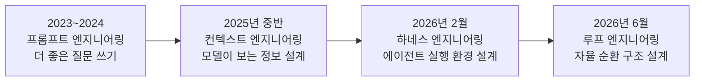
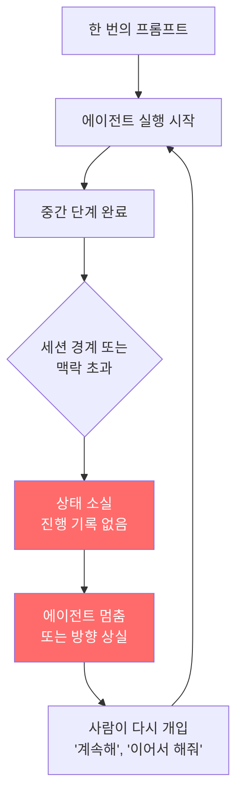
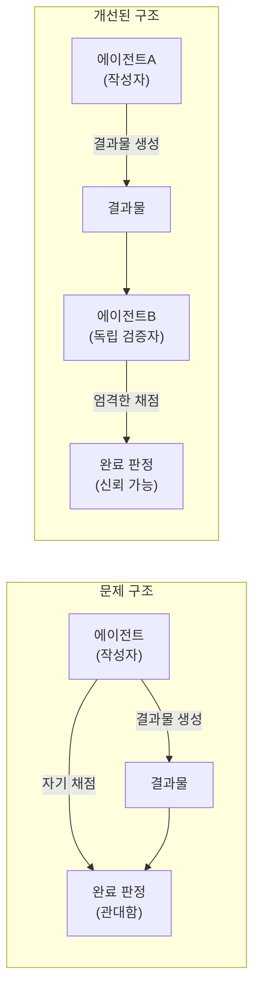
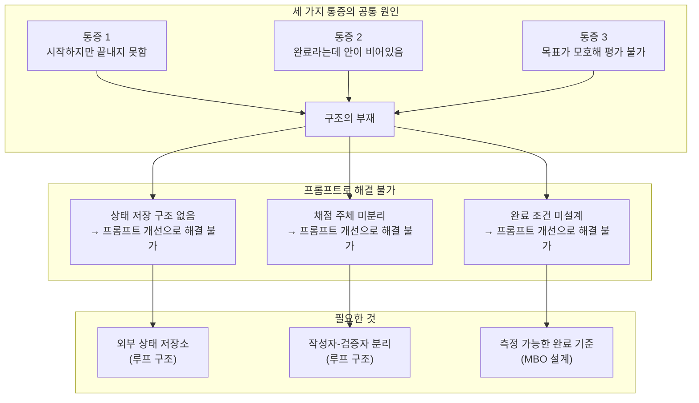
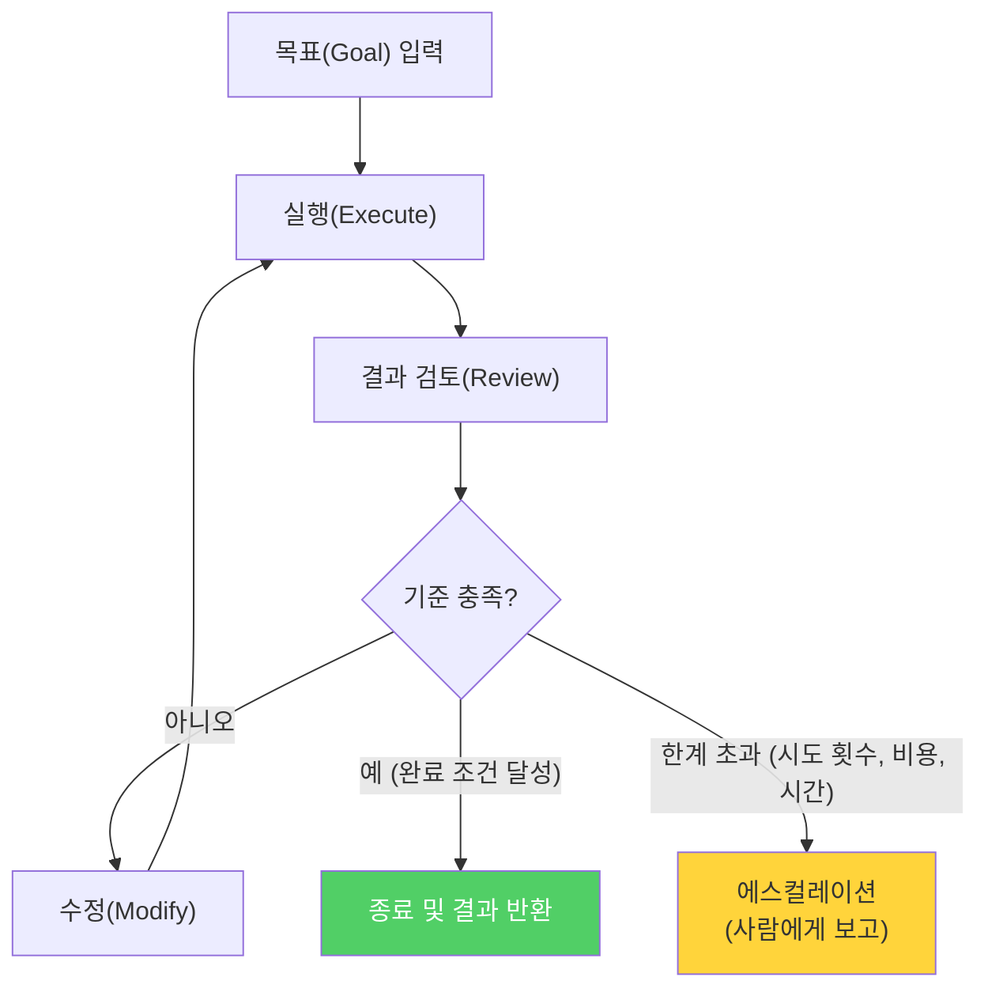
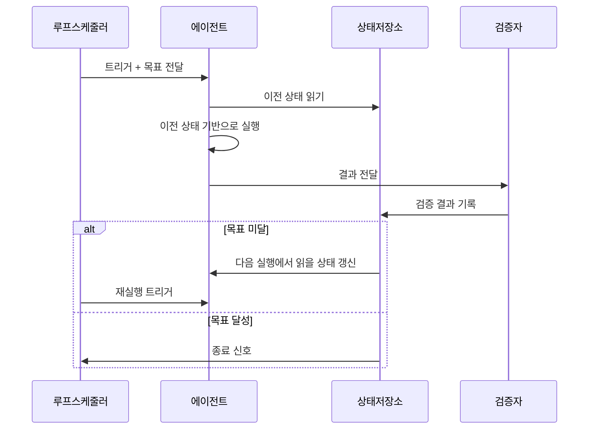
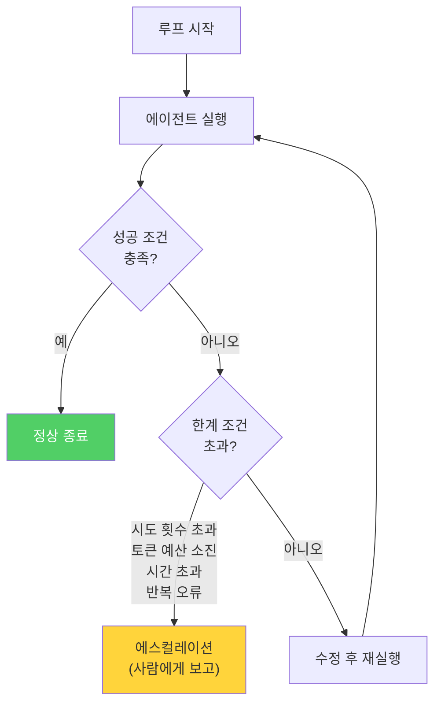
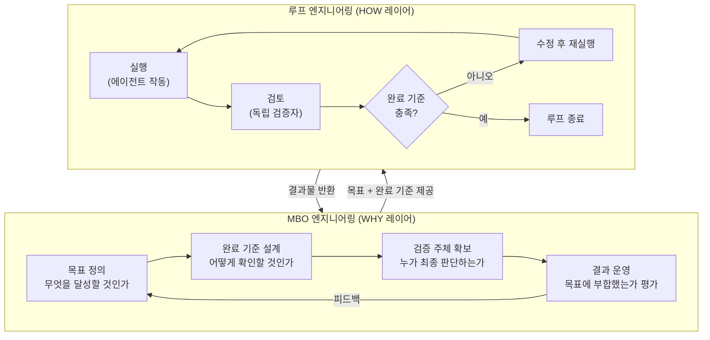
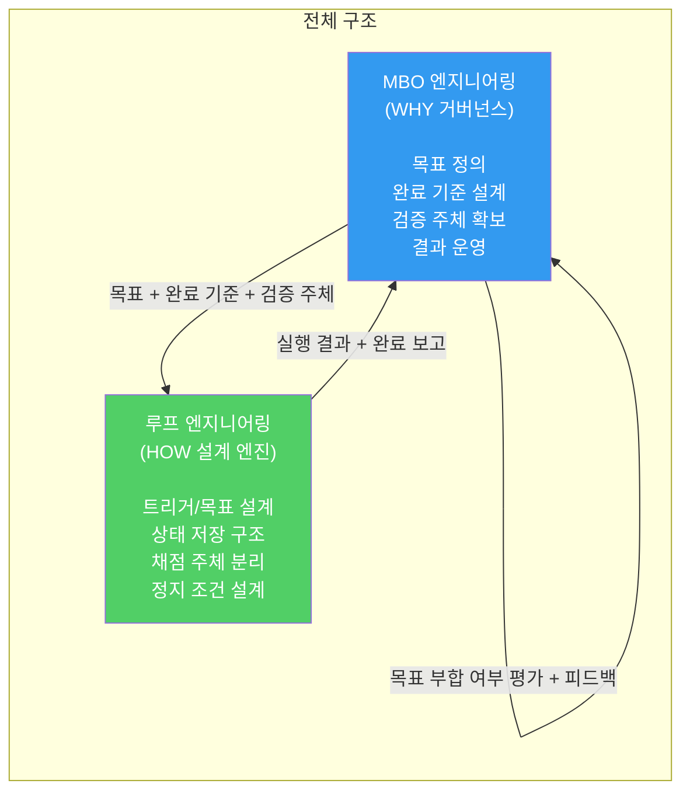
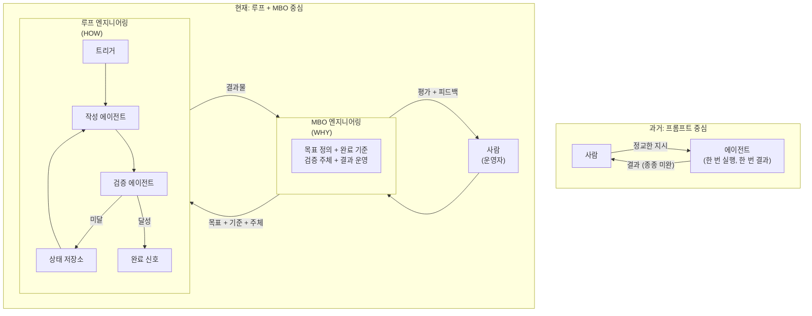

> 이 문서는 "프롬프트의 시대는 저문다"는 선언에서 시작해 루프 엔지니어링과 MBO 엔지니어링이라는 두 개념을 제시하는 글의 논지를 개념별로 풀어 상세하게 설명한다. 검색으로 확인된 사실만을 근거로 삼으며, 확인되지 않은 내용은 그렇게 명시한다.

## 관련글

[**프롬프트의 시대는 저문다**](https://www.facebook.com/share/p/14f73KnZnjA/)

---

## 1. 프롬프트의 시대가 저무는 이유

### 1-1. 2023년의 풍경

2023년은 사람들이 처음으로 AI에게 진지하게 말을 거는 법을 배운 해다. ChatGPT가 100만 명의 사용자를 모으는 데 5일이 걸렸다. 그 이후로 더 좋은 프롬프트를 쓰면 더 좋은 결과가 나온다는 믿음이 산업 전체를 움직이는 원칙처럼 자리 잡았다. "프롬프트 엔지니어"라는 직업이 생겨났고, 프롬프트를 잘 쓰는 법을 가르치는 강의가 쏟아졌으며, 더 정밀하게 표현하고 더 영리하게 질문하는 것이 AI 사용의 핵심 기술로 여겨졌다.

프롬프트 엔지니어링의 핵심 가정은 이것이었다. 입력을 개선하면 출력이 개선된다. 이 가정은 단발적인 작업에서는 상당히 맞았다. "이 문장을 더 간결하게 고쳐줘", "이 코드의 버그를 찾아줘", "이 내용을 영어로 번역해줘" 같은 요청에서는 더 잘 쓴 프롬프트가 실제로 더 나은 결과를 냈다. 그래서 다들 말을 다듬었다. 역할을 부여하고, 예시를 주고, 출력 형식을 지정하고, 제약 조건을 추가했다.

그런데 AI를 더 오래, 더 복잡한 작업에 쓰기 시작하면서 이 가정이 삐걱거리기 시작했다. 프롬프트가 정교해질수록 기대도 높아졌는데, 그 기대를 현실이 따라가지 못했다. 더 좋은 질문을 했는데 여전히 작업이 끝나지 않았다. 더 자세하게 설명했는데 완료라고 하면서 결과물 안이 비어있었다. 더 영리하게 목표를 표현했는데 나중에 돌아보면 무엇이 잘못됐는지 짚을 수 없었다.

문제는 말의 품질에 있지 않았다. 뒤에서 자세히 설명하겠지만, 빠진 것은 구조였다.

### 1-2. 전환의 계기 — 두 사람의 발언

2026년 6월, 이 방식에 균열을 내는 발언 두 개가 빠르게 퍼졌다.

첫 번째는 Anthropic에서 Claude Code를 이끄는 Boris Cherny였다. 그는 "나는 더 이상 Claude에게 직접 프롬프트를 치지 않는다. Claude에게 프롬프트를 주고 무엇을 해야 할지 스스로 판단하게 만드는 루프를 실행해 둘 뿐이다. 내 일은 '루프'를 작성하는 것"이라고 말했다. 그는 심지어 직접 코딩을 하지 않게 되면서 IDE(통합 개발 환경)를 2025년 11월에 컴퓨터에서 삭제했다고 밝혔다.

두 번째는 OpenClaw 개발자 Peter Steinberger였다. 그는 "더 이상 코딩 에이전트에게 프롬프트를 작성하지 마라. 에이전트에게 프롬프트를 전달하는 '루프'를 설계해야 한다"고 했다. 이 발언은 며칠 만에 수백만 뷰를 넘겼다.

그리고 Google Chrome 엔지니어링 디렉터 Addy Osmani가 이 흐름에 "루프 엔지니어링(Loop Engineering)"이라는 이름을 붙인 글을 발행했다. O'Reilly Media가 공식 허가를 받아 재게재할 만큼 이 글은 빠르게 업계 전반으로 확산됐다.

이 세 사람의 발언이 가리키는 방향은 같다. 레버리지 지점이 이동했다는 것이다. "AI에게 어떻게 말할까"에서 "AI가 어떤 조건에서 다시 실행되고, 어디에 상태를 남기고, 누가 검증하고, 언제 멈출까"를 설계하는 것으로 가장 가치 있는 행동의 위치가 옮겨가고 있다.

---

## 2. 세 가지 통증의 해부

프롬프트 방식이 부딪혀온 한계는 개인의 경험이 아니라, 실제로 AI 에이전트를 운영해온 수많은 개발자와 팀이 반복해서 보고한 패턴들이다. 그 패턴은 세 가지로 수렴된다.

### 2-1. 첫 번째 통증: 시작하지만 끝내지 못한다

에이전트에게 프롬프트를 주면 작업을 시작한다. 초안을 만들어주고, 코드를 짜주고, 분석을 시작한다. 그런데 그 작업이 여러 단계로 이어지는 순간 에이전트는 중간에 멈추거나, 방향을 잃거나, 같은 자리를 맴돌기 시작한다. 한 번의 프롬프트로는 프로젝트 하나를 처음부터 끝까지 완료할 수 없다.

왜 이런 일이 일어나는가. 근본 원인은 에이전트가 세션 경계를 넘으면 이전에 무엇을 했는지 기억하지 못한다는 데 있다. 대화 맥락이 끊기면 에이전트는 이전 진행 상태를 잊는다. 그래서 긴 작업은 자연히 사람이 중간에 계속 붙잡고 있어야 하는 방식으로 진행됐다. AI가 초안을 만들어줬지만, 그 초안을 다듬어 완성하는 것은 여전히 사람의 몫이었다. AI가 시작해줬지만, 끝을 내는 것은 사람이었다.

이것은 모델의 지능 문제가 아니다. 구조의 문제다. 에이전트가 작업 중간에 어디까지 왔는지, 무엇이 남았는지, 다음에 무엇을 해야 하는지를 외부 어딘가에 기록해두는 장치가 없으면, 작업은 그 에이전트가 살아있는 단일 대화 창 안에서만 존재한다. 창을 닫으면 진행 상태도 사라진다.

OpenAI가 하네스 엔지니어링 공식 문서에서 밝힌 내용이 이를 확인해준다. "테스트, 검증, 리뷰, 피드백 처리, 복구 같은 더 많은 개발 루프가 시스템에 직접 인코딩되면서 리포지터리는 에이전트가 새로운 기능을 처음부터 끝까지 주도할 수 있는 중요한 임계점을 넘어섰다." 다시 말해, 에이전트가 혼자 작업을 끝까지 끌고 가는 능력은 모델이 더 똑똑해져서 생긴 것이 아니라, 루프를 구성하는 부품들이 환경 안에 갖춰진 결과라는 것이다.

### 2-2. 두 번째 통증: 완료라고 하는데 안이 비어있다

"완성했습니다"라는 출력이 나왔다. 그런데 실제로 열어보면 기준에 미치지 못하거나, 중요한 부분이 빠져있거나, 오류가 남아있다. 이 경험은 에이전트를 사용해본 사람이라면 누구나 겪었을 것이다.

왜 이런 일이 일어나는가. 이유는 단순하고 구조적이다. 에이전트가 자기 결과를 스스로 채점하기 때문이다.

이 문제는 학술적으로도 확인된 바 있다. 2026년 3월 arXiv에 발표된 논문 "Self-Attribution Bias: When AI Monitors Go Easy on Themselves"는 에이전트가 자신이 생성한 행동을 평가할 때 체계적으로 더 관대해지는 현상, 즉 자기귀인 편향(self-attribution bias)을 정밀하게 측정했다. 이 연구는 코딩과 도구 사용 네 개의 데이터셋에서, 에이전트가 자신이 바로 전 턴에서 만든 행동을 평가할 때 그렇지 않을 때보다 고위험 또는 저정확도 행동을 "문제없음"으로 통과시키는 비율이 유의미하게 높다는 것을 보였다.

같은 시기 또 다른 연구에서도 에이전트가 자신의 출력을 평가하는 폐쇄 루프 구조에서 편향이 증폭된다는 것이 확인됐다. 즉, 에이전트에게 "이 코드가 목표를 달성했나?"라고 물으면, 그 에이전트가 바로 직전에 그 코드를 작성했을 때 지나치게 관대한 평가가 나온다는 것이다.

자기 숙제를 자기가 채점하는 구조에서는 오류가 통과된다. 이것은 AI의 도덕적 결함이 아니라 구조적 설계 결함이다. 채점과 작성을 같은 에이전트에게 맡기는 순간 이 편향은 피할 수 없다.

Anthropic은 자사의 에이전트 시스템 관련 글에서 이것을 직접적으로 인정했다. "에이전트는 자기 작업을 정확하게 평가할 수 없다." 그래서 제시한 해법이 작성자(Maker) 에이전트와 검증자(Verifier) 에이전트를 분리하는 것이다. 코드를 작성한 에이전트와 다른 지시를 받은, 경우에 따라 다른 모델을 쓰는 에이전트가 첫 번째 에이전트의 결과를 평가한다.

### 2-3. 세 번째 통증: 목표가 모호해서 나중에 평가할 수 없다

무엇을 원하는지 말했다고 생각했는데, 에이전트가 만든 것은 기대와 달랐다. 그런데 무엇이 틀렸는지 정확히 짚기가 어렵다. 처음부터 기준을 측정 가능한 형태로 정해두지 않았기 때문이다.

이 문제는 두 층위에서 일어난다. 첫 번째는 에이전트가 루프를 도는 동안 "언제 멈춰야 하는지"를 알 수 없다는 것이고, 두 번째는 결과가 나온 후에 사람이 "잘 됐는지"를 판단할 기준이 없다는 것이다.

예를 들어 보자. "이 코드베이스를 개선해줘"라는 지시는 에이전트에게 목표처럼 들린다. 하지만 에이전트 입장에서 "어느 정도가 되면 완료인가?"라는 질문에 답할 수 없다. 에이전트는 무언가를 바꾸고 "개선했습니다"라고 말할 수 있다. 그러면 완료인가? 아무것도 측정할 수 없다.

반면에 "test/auth 디렉토리의 모든 테스트가 통과하고 lint가 깨끗한 상태를 만들어줘"는 다르다. 에이전트도, 별도의 검증자도, 사람도 이 기준이 충족됐는지 확인할 수 있다. 완료는 측정의 문제가 된다.

목표의 모호함은 두 방향에서 손해를 일으킨다. 에이전트는 실제로는 불완전한 결과를 내놓고도 "완료"라고 보고할 수 있다. 그리고 나중에 결과를 검토하는 사람도 무엇이 기준에 못 미쳤는지 꼬집을 수 없다. 기준이 없으면 실패를 학습할 수도 없다.

Google Cloud의 에이전트 아키텍처 공식 문서는 이것을 명확히 표현한다. "에이전트는 목표에 도달하거나 오류가 발생할 때까지 반복 루프를 계속한다." 목표에 도달한다는 것이 무엇인지 미리 정의되어 있지 않으면, 에이전트는 루프를 멈출 이유를 찾지 못한다. 아니면 자의적으로 멈춘다.

---

## 3. 빠진 것은 말의 품질이 아니라 구조였다

세 가지 통증을 나란히 놓으면 공통점이 보인다. 이 문제들은 프롬프트를 더 잘 쓴다고 해결되지 않는다.

첫 번째 통증—시작하지만 끝내지 못한다—은 프롬프트를 더 길게, 더 자세하게 써도 해결되지 않는다. 에이전트가 실행 사이에 자신의 진행 상태를 어딘가에 저장하는 구조가 없으면, 아무리 좋은 지시를 줘도 세션이 끊기는 순간 작업은 멈춘다.

두 번째 통증—완료라고 하는데 안이 비어있다—도 프롬프트를 더 명확하게 써도 해결되지 않는다. 채점하는 주체가 작성한 주체와 동일한 구조에서는 자기귀인 편향이 발생한다. 이것은 지시의 문제가 아니라 역할 분리의 문제다.

세 번째 통증—목표가 모호해서 나중에 평가할 수 없다—도 표현을 다듬는다고 해결되지 않는다. 목표를 측정 가능한 완료 조건으로 설계하는 것과 목표를 잘 표현하는 것은 다른 행위다. 전자는 시스템 설계이고 후자는 언어 표현이다.

세 가지 통증의 원인을 한 줄로 표현하면 이렇다. 에이전트에게 좋은 말을 해주는 것과, 에이전트가 돌아가는 구조를 설계하는 것은 근본적으로 다른 행위다. 2023년부터 2025년까지 업계가 집중한 것은 전자였다. 2026년부터 주목받기 시작한 것은 후자다.

---

## 4. 에이전트는 루프로 돈다 — 루프란 무엇인가

### 4-1. 루프의 기본 작동 방식

에이전트는 목표를 향해 루프로 돈다. 이것이 루프 엔지니어링을 이해하는 출발점이다.

구체적으로 말하면, 에이전트는 목표를 받으면 실행하고, 결과를 검토하고, 부족하면 수정하고, 다시 검토한다. 기준에 도달할 때까지 이 사이클을 반복한다. 한 번의 지시로 한 번 실행하고 멈추는 것이 아니다. 구조 안에서 스스로 반복하며 완성해 간다. 루프가 멈추는 조건은 설계자가 미리 정한다. 그 조건에 도달했을 때 비로소 종료된다.

이 순환 구조는 새로운 것처럼 들리지만 사실 컴퓨터 과학에서 오래된 개념이다. "사고(Think) → 행동(Act) → 관찰(Observe)"의 ReAct 패턴, "계획 → 실행 → 검토"의 Plan-and-Execute 패턴 모두 이 기본 루프의 변형이다. Google Cloud 공식 문서는 이것을 "새로운 관찰을 기반으로 계획을 지속적으로 업데이트해 동적 제약 조건을 준수하는 방식"이라고 설명한다.

그렇다면 루프 엔지니어링은 왜 2026년에야 실무 설계 단위로 주목받기 시작했는가. 개념이 새로운 것이 아니기 때문에 이것은 중요한 질문이다.

이유는 도구에 있다. 1년 전이었다면 이런 루프를 만들려면 셸 스크립트 더미를 직접 짜고 평생 유지보수해야 했다. 그런데 2026년 현재, 루프를 구성하는 부품들—스케줄러, 상태 저장소, 검증자, 병렬 실행 격리, 외부 도구 연결—이 Claude Code와 OpenAI Codex 같은 제품 안에 기본으로 탑재됐다. 루프를 직접 설계할 수 있는 환경이 갖춰진 것이다. Osmani가 지적했듯, "어떤 도구를 쓰느냐보다 루프를 어떻게 설계하느냐가 더 중요한 관심사가 되고 있다."

### 4-2. 루프는 cron 자동화와 어떻게 다른가

루프와 단순 자동화를 구분하는 것이 중요하다. cron은 정해진 시간에 정해진 스크립트를 그대로 실행한다. 결과가 나쁘든 좋든 다음 실행에 영향을 주지 않는다. 스크립트가 시작이고 실행이 끝이다.

루프는 중간에 모델이 있다. 실행할 때마다 현재 상태를 읽고, 그 상태를 바탕으로 다음에 무엇을 해야 할지를 모델이 직접 판단한다. 결과가 나쁘면 다음 실행에서 다른 접근을 시도한다. 루프는 지능적인 판단을 포함한 자동화다.

| 구분 | cron/단순 자동화 | 루프(Loop) |
|---|---|---|
| 실행 결정 | 시간 기반, 미리 고정 | 상태 기반, 모델이 판단 |
| 이전 결과 반영 | 없음 | 있음 (외부 메모리 통해) |
| 완료 판단 | 스크립트 종료 | 기준 충족 여부 |
| 오류 대응 | 그대로 다음 실행 | 수정 후 재시도 |
| 검증 | 없음 | 독립 검증자 가능 |
| 중단 조건 | 없음 (또는 오류만) | 설계자가 명시적으로 정의 |

OpenAI 팀이 하네스 엔지니어링 글에서 밝힌 현재 가능한 수준이 이 차이를 잘 보여준다. "에이전트는 이제 한 번의 프롬프트로 코드베이스 현재 상태 검증, 보고된 버그 재현, 수정 구현, 앱을 실행해 수정 검증, PR 생성, 에이전트와 사람의 피드백에 반응, 빌드 실패 감지와 수정, 판단이 필요할 때만 사람에게 요청, 변경 병합까지 이어서 수행"한다. 이것이 루프가 갖춰진 환경에서 가능해진 것들이다.

---

## 5. 루프 엔지니어링 — 네 가지 설계 질문

루프 엔지니어링이란 무엇인가. Osmani는 이것을 "에이전트에게 프롬프트를 치는 사람인 자기 자신을 대체하는 시스템을 설계하는 것"이라고 정의했다. 더 간단하게 말하면, 사람이 에이전트에게 매번 지시를 내리는 대신, 그 역할을 맡는 구조를 설계하는 기술이다.

이 구조를 설계할 때 반드시 답해야 하는 질문이 네 가지 있다.

**어떤 목표를 주면 루프가 시작되는지, 실행 사이에 상태를 어디에 남기는지, 결과를 누가 채점하는지, 언제 어떻게 멈추는지.**

이 네 가지에 답하는 사람이 루프를 설계하는 사람이다. 순서대로 살펴보자.

### 5-1. 어떤 목표를 주면 루프가 시작되는가

루프의 시작점은 트리거(trigger)와 목표(goal)의 설계다. 트리거는 "언제 루프가 시작되는가"이고, 목표는 "루프가 무엇을 향해 돌아야 하는가"다.

트리거는 크게 두 종류다. 스케줄 기반 트리거(매일 아침 9시, 매 1시간마다)와 이벤트 기반 트리거(새 이슈가 열렸을 때, CI가 실패했을 때, 특정 조건이 감지됐을 때)다. Claude Code의 `/loop` 명령과 훅(hook), OpenAI Codex의 Automations 탭이 이 트리거를 구현하는 도구들이다.

목표는 루프가 향해 달려야 할 지점이다. 중요한 것은 목표가 루프에 직접 입력되는 형태, 즉 에이전트가 실행될 때마다 받아보는 지시의 형태여야 한다는 것이다. 그리고 이 목표는 루프 안의 에이전트가 실행되는 방향성을 결정한다.

이 첫 번째 질문이 중요한 이유가 있다. 잘못된 목표를 받은 루프는 완벽하게 작동하면서도 완전히 엉뚱한 결과를 낸다. "코드를 개선해줘"를 목표로 받은 루프는 무언가를 바꾸고 "개선했습니다"라고 말할 것이다. 그 루프는 설계대로 돌았지만 목표 자체가 불명확했다. 루프 실패의 대부분은 모델 실패가 아니라 목표 설계 실패라는 것이 현장 개발자들이 공통적으로 내리는 결론이다.

### 5-2. 실행 사이에 상태를 어디에 남기는가

에이전트는 세션 경계를 넘으면 이전 실행에서 무엇을 했는지 기억하지 못한다. 이것이 "시작하지만 끝내지 못한다"는 첫 번째 통증의 구조적 원인이다. 해법은 에이전트의 기억에 의존하는 것이 아니라, 에이전트 밖에 상태 저장소를 두는 것이다.

상태 저장소는 마크다운 파일이든, 이슈 트래커 보드든, 데이터베이스든, 대화 밖에 존재하는 모든 것이 될 수 있다. Claude Code의 CLAUDE.md, OpenAI Codex의 AGENTS.md가 이 역할을 한다. 중요한 것은 이 파일이 "현재 무엇을 작업 중인가", "지난번에 무엇을 시도했고 결과는 어땠는가", "사람의 판단이 필요한 것은 무엇인가" 이 세 가지 질문에 답할 수 있어야 한다는 것이다.

상태 파일의 원칙에 대해서는 주의할 점이 있다. 2026년 5월 arXiv에 발표된 LLM-에이전트 협력 관련 연구에 따르면, 길어진 기억(visible history)이 28개의 모델-게임 설정 중 18개에서 협력 성능을 오히려 저하시켰다. 이것은 상태 파일을 많이 쌓을수록 좋은 것이 아니라는 뜻이다. 짧고 핵심적인 정보만 남기고, 세부 내용은 링크로 분리하며, 핸드오프에는 결정을 내릴 수 있는 요약을 남기는 것이 원칙이다.

며칠에 걸쳐 실행되는 루프에서 상태 파일은 종종 루프가 생산하는 가장 중요한 산출물이 된다. 에이전트가 만든 코드보다 에이전트가 남긴 상태 기록이 더 가치 있을 수 있다. 내일의 실행이 오늘 어디서 멈췄는지를 정확히 이어받을 수 있게 해주기 때문이다.

### 5-3. 결과를 누가 채점하는가

이것이 루프 설계에서 가장 중요한 구조적 결정이다. 두 번째 통증—완료라고 하는데 안이 비어있다—의 해법이 바로 이 질문에 달려있다.

원칙은 간단하다. 코드를 만든 에이전트가 그 코드를 채점해서는 안 된다.

2026년 연구들이 이것을 명확하게 증명한다. 에이전트가 직전 턴에 생성한 결과를 평가할 때 자기귀인 편향이 발생한다는 것이 코딩과 도구 사용 다수의 데이터셋에서 반복 확인됐다. 다른 모델이 평가한 결과와 비교했을 때, 자체 평가는 고위험 또는 저정확도 행동을 "문제없음"으로 통과시키는 비율이 유의미하게 높았다.

해법은 작성자(Maker)와 검증자(Verifier)를 분리하는 것이다. 서로 다른 지시를 받은, 또는 서로 다른 모델을 쓰는 에이전트 둘이 역할을 나눈다. 하나는 결과물을 만들고, 다른 하나는 그 결과물이 목표를 달성했는지 독립적으로 판단한다.

이 설계가 구현된 방식을 현재 도구들에서 볼 수 있다. Claude Code의 `/goal` 명령은 매 턴이 끝난 후 별도의 소형 모델이 독립적으로 "완료됐는가?"를 판단한다. 같은 작업을 수행한 에이전트가 판단하지 않는다. OpenAI Codex의 `/goal`도 동일한 방식으로 검증 가능한 정지 조건이 충족될 때까지 실행을 이어가되, 완료 판단은 작업 수행 에이전트로부터 독립적으로 이루어진다.

채점 주체를 설계할 때 또 하나의 구분이 필요하다. 기계가 확인할 수 있는 것과 모델이 판단해야 하는 것을 나누는 것이다.

| 기계로 확인 가능 (에이전트 자체 채점 허용) | 독립 검증자 필요 |
|---|---|
| 모든 테스트 통과 여부 | "이 코드가 좋은가?" |
| 빌드 성공 여부 | "이 글이 잘 읽히는가?" |
| lint 오류 없음 | "이 설계가 올바른가?" |
| 스키마 유효성 검사 통과 | "이 결과가 목표에 부합하는가?" |
| API 응답 상태 코드 확인 | "사용자가 만족할 것인가?" |

객관적인 조건은 에이전트가 스스로 체크해도 된다. 주관적인 판단이 들어가는 것은 반드시 독립적인 검증자가 필요하다.

### 5-4. 언제 어떻게 멈추는가

루프 설계에서 가장 쉽게 간과되지만 실제로 가장 위험한 설계 결정이 이것이다. 루프는 멈추지 않으면 계속 돈다. 그리고 계속 도는 루프는 비용을 계속 소모한다.

멈춤의 조건은 크게 세 종류다.

**성공 조건**: 목표로 정한 완료 기준이 충족됐을 때 멈춘다. 이것이 이상적인 종료다.

**한계 조건**: 성공하지 못했더라도 더 이상 진행하지 않는 조건들이다. 시도 횟수 초과(예: 6회 시도 후 종료), 토큰 예산 소진, 시간 제한, 같은 오류 3회 연속 발생 같은 것들이다.

**에스컬레이션 조건**: 루프가 스스로 해결할 수 없다고 판단했을 때 사람에게 보고하고 대기하는 것이다.

정지 조건이 없거나 약한 루프가 실제로 어떤 결과를 낳는지는 이미 여러 사례로 확인됐다. 한 에이전트가 손상된 도구를 5분 동안 400번 호출한 기록이 있다. Uber는 Claude Code와 Cursor에 1인당 월 1,500달러의 비용 상한을 걸었는데도 연간 AI 예산을 4개월 만에 소진했다. Microsoft의 Experiences and Devices 부서는 2026년 6월 토큰 기반 청구가 연간 예산을 초과하면서 Claude Code 라이선스 대부분을 종료했다.

토큰 예산은 단순한 비용 항목이 아니다. 실질적인 정지 조건의 한 형태다. 에이전트 개발 입문 가이드들이 공통적으로 강조하는 항목이 이것이다. "비용 제한을 설정하세요. 무한 루프에 빠지면 API 비용이 폭발할 수 있어요." "에이전트가 같은 도구를 100번 호출하면 비용이 폭발해요. max_iterations=10 같은 안전장치 필수."

루프의 설계자는 성공 조건만 정의하는 것이 아니라, 성공하지 못했을 때 얼마나 많은 자원을 쓴 뒤 멈출지도 함께 설계해야 한다.

---

## 6. 루프는 HOW를 처리한다 — WHY는 루프 밖에 있다

루프 엔지니어링을 잘 이해하고 나면 자연스럽게 한 가지 질문이 생긴다. 루프를 잘 설계했다고 해도 부족한 게 있지 않은가.

이 질문은 타당하다. 루프는 구조의 문제를 해결한다. 루프는 어떻게 실행할지, 어떻게 반복할지, 어떻게 검증할지를 처리한다. 하지만 루프 안을 들여다보면 루프 자체가 답하지 않는 질문들이 있다.

왜 이 작업을 하는가. 무엇을 달성했을 때 진짜 완료인가. 이 루프의 결과물이 원래 목적에 실제로 부합했는가.

루프는 HOW의 기계다. 잘 설계된 루프는 목표를 받으면 그것을 달성하기 위해 반복적으로 실행하고 검증하고 수정한다. 그런데 그 목표가 맞는 목표인지, 그 완료 기준이 진짜 완료를 의미하는지, 그 결과물이 사업이나 사용자의 실제 필요에 부합하는지는 루프가 스스로 판단하지 않는다. 판단할 수 없다.

이 판단의 체계가 루프 밖에 있다.

루프 엔지니어링이 기계를 설계하는 일이라면, 그 기계가 무엇을 위해 돌아가는지를 설계하는 일이 따로 존재한다. 이것이 MBO 엔지니어링이 채우려는 자리다.

---

## 7. MBO 엔지니어링 — 루프 밖에서 WHY를 설계한다

### 7-1. MBO의 원래 의미

MBO(Management by Objectives, 목표에 의한 관리)는 새로 만들어진 말이 아니다. 1954년 피터 드러커(Peter Drucker)가 저서 《경영의 실제(The Practice of Management)》에서 제시한, 70년이 넘은 경영학 개념이다.

드러커의 MBO는 상사가 일방적으로 부하를 평가하는 방식에 대한 대안으로 제시됐다. 핵심은 두 가지였다. 첫째, 조직과 개인이 함께 구체적인 목표를 설정한다. 둘째, 그 목표를 기준으로 성과를 측정하고, 개인이 자신의 달성도를 스스로 관리한다. 원래 이름은 "목표와 자기통제에 의한 관리(Management by Objectives and Self-Control)"였다.

드러커의 원칙에서 목표는 SMART해야 한다. 구체적(Specific), 측정 가능(Measurable), 달성 가능(Achievable), 관련성 있음(Relevant), 기한이 있음(Time-bound)이다. "더 나아진다"는 MBO 목표가 아니다. "4분기 말까지 고객 만족도 점수를 75점에서 82점으로 올린다"가 MBO 목표다.

이후 Andy Grove가 인텔에서 MBO를 발전시켜 OKR(Objectives and Key Results)을 만들었고, John Doerr가 이를 구글에 도입하면서 현대 기술 기업들의 목표 관리 표준이 됐다.

### 7-2. 에이전트 맥락에서의 MBO 엔지니어링

에이전트 운영의 맥락에서 MBO 엔지니어링은 루프에 들어갈 목표를 설계하는 것이 아니다. 그보다 한 단계 위에서 이루어지는 작업이다.

구체적으로 MBO 엔지니어링이 다루는 것은 네 가지다.

**첫째, 목표를 정의한다.** 루프가 달성해야 할 것이 무엇인지를 명확하게 설정한다. 이때 목표는 루프 안에서 에이전트가 실행할 수 있는 형태여야 하고, 완료 여부를 나중에 확인할 수 있는 형태여야 한다. "코드 품질을 높인다"는 목표가 아니라 "모든 테스트가 통과하고 커버리지가 80% 이상인 상태를 만든다"가 목표여야 한다.

**둘째, 완료 기준을 설계한다.** 목표와 완료 기준은 다르다. 목표는 도달하려는 상태이고, 완료 기준은 그 상태에 도달했는지를 확인하는 방법이다. 완료 기준이 없으면 루프가 목표를 달성했는지 아닌지를 판단할 수 없다. 완료 기준은 측정 가능해야 하고, 에이전트 자신의 판단에 의존하지 않고 확인 가능해야 한다.

**셋째, 검증 주체를 확보한다.** 이것은 루프 설계의 세 번째 질문("결과를 누가 채점하는가")과 연결된다. MBO 엔지니어링은 루프 수준에서 작성자-검증자를 분리하는 것을 넘어서, 루프가 끝난 후 그 결과물이 비즈니스 목적에 부합했는지를 평가하는 주체까지 설계한다. 이 평가가 에이전트에 의해서만 이루어질 수는 없다. 어떤 지점에서는 사람의 판단이 개입해야 한다.

**넷째, 루프가 만든 결과물이 실제로 목표에 부합했는지 운영한다.** 루프가 완료 신호를 보냈다고 해서 목표가 달성된 것은 아니다. 루프의 "완료"는 루프 안에서 설정된 완료 기준을 충족했다는 것이지, 그 기준이 처음부터 올바르게 설정됐다는 뜻이 아니다. MBO 엔지니어링은 루프가 종료된 후에 그 결과가 원래 목적에 부합했는지를 검토하고, 필요하면 목표와 완료 기준 자체를 수정하는 피드백 루프를 포함한다.

### 7-3. 루프 엔지니어링과 MBO 엔지니어링의 관계

루프 엔지니어링이 기계를 설계하는 일이라면, MBO 엔지니어링은 그 기계가 무엇을 위해 돌아가는지를 설계하는 일이다. 이 비유가 두 개념의 관계를 잘 포착한다.

루프가 잘 설계됐다고 해서 자동으로 올바른 목표를 달성하는 것이 아니다. 빠르게, 효율적으로, 반복적으로 돌아가는 루프가 잘못된 목표를 향해 달리고 있을 수 있다. 반대로, 아무리 올바른 목표가 있어도 그 목표를 루프가 달성할 수 있는 형태로 만들어주지 않으면 목표는 선언으로 끝난다.

LY Corporation의 Tech-Verse 2026 컨퍼런스에서 발표된 멀티 에이전트 개발 프로세스 사례가 이 관계를 잘 보여준다. 그들이 만든 파이프라인에서 가장 중요한 단계는 스펙(Spec) 작성이었다. 스펙은 "목표, 제약 조건, 해석된 요구 사항, 명시적 가정, 미해결 질문, 제안된 접근 방식, 완료 정의"를 담는다. 이것이 이후 모든 에이전트 실행의 기준이 된다. 빌드 에이전트는 "합리적으로 보이는 대로"가 아니라 "합의된 스펙에서 테스트와 검증을 먼저 도출한 뒤 스펙과 검증 설계 모두를 기준으로 구현"한다.

이것이 MBO 엔지니어링이 하는 일이다. 루프가 돌기 전에 목표와 완료 기준과 검증 주체를 먼저 합의하고, 루프가 끝난 후에 그 기준이 실제로 의미 있었는지 평가한다.

---

## 8. 두 기둥의 위계 — 루프를 MBO로 완성한다

### 8-1. 위계의 의미

두 개념 사이에는 위계가 있다. 루프 엔지니어링이 설계 엔진이고, MBO 엔지니어링이 목표·검증 거버넌스다. 루프는 MBO로 완성된다.

이 위계가 의미하는 것은 순서다. MBO 엔지니어링이 먼저 이루어지고, 그것이 루프 엔지니어링에 목표와 완료 기준을 제공한다. 루프 엔지니어링은 그 목표를 달성하기 위한 구조를 설계하고 돌린다. 루프가 종료되면 다시 MBO 레이어로 올라가서 결과가 목적에 부합했는지 평가한다.

"루프를 MBO로 완성한다"는 말은 "루프를 다 설계했으면 MBO를 추가하라"는 것이 아니다. MBO를 먼저 설계하지 않으면 루프가 진정으로 완성될 수 없다는 뜻이다. 루프가 아무리 완벽하게 돌아도, 루프가 달성한 것이 실제로 필요한 것인지 확인하는 체계가 없으면 그 루프는 방향 없는 효율이다.

### 8-2. 루프 없는 MBO, MBO 없는 루프

두 기둥 중 하나만 있을 때 어떤 일이 일어나는지를 보면 위계의 필요성이 명확해진다.

**루프 없는 MBO**: 목표는 명확하게 정의됐고 완료 기준도 있다. 그런데 그것을 달성하는 과정이 여전히 사람이 에이전트에게 매번 지시를 내리는 방식이다. 목표 관리 체계는 있지만 그것을 자율적으로 반복 실행하는 구조가 없다. 결과를 달성하는 속도와 일관성이 제한된다.

**MBO 없는 루프**: 루프는 잘 설계됐다. 에이전트가 자동으로 트리거되고, 상태를 저장하고, 독립 검증자가 채점하고, 정지 조건이 있다. 그런데 루프가 달성하려는 목표가 실제로 필요한 것인지 확인하는 체계가 없다. 루프가 빠르게 무언가를 완료하는데, 그것이 실제로 가치 있는 것인지 평가할 수 없다. 또는 완료 기준 자체가 잘못 설계됐는데 아무도 알아채지 못한다.

두 기둥이 함께 있을 때 비로소 "올바른 것을 올바르게 달성하는" 시스템이 만들어진다.

### 8-3. 사람은 어디에 있는가

이 구조에서 사람의 역할은 사라지는 것이 아니라 이동한다. 에이전트에게 매번 지시를 내리는 자리에서, MBO와 루프를 설계하고 운영하는 자리로.

OpenAI의 하네스 엔지니어링 문서가 이것을 명확하게 표현한다. "사람은 항상 루프에 남아 있지만, 예전과는 다른 추상화 레이어에서 작업한다. 업무를 우선시하고, 사용자 피드백을 수용 기준으로 바꾸며, 결과를 검증한다." 이것이 MBO 엔지니어링이 요구하는 사람의 역할이다.

마찬가지로, 하네스 엔지니어링 원칙을 다루는 wikiDocs 자료는 이것을 한 줄로 요약한다. "자율은 모델을 더 믿어서가 아니라 루프를 구축해서 얻는다." 그리고 그 루프가 올바른 방향을 향해 돌아가게 하는 것이 MBO 엔지니어링이다.

---

## 9. 이 흐름이 아직 합의된 표준은 아니다

마지막으로 중요한 맥락을 짚어둘 필요가 있다.

"루프 엔지니어링"이라는 이름 자체는 2026년 6월에야 업계 담론에 등장했다. 그리고 해당 글을 쓴 Addy Osmani 본인이 "아직 초기 단계이고 나는 회의적"이라고 밝혔다. "MBO 엔지니어링"은 현재 검색 가능한 범위에서 업계의 합의된 용어가 아니라, 제안된 개념이다.

Threads에서 한 개발자가 6월 중순경 정확히 이것을 예측하며 경고한 바 있다. "루프 엔지니어링이라는 말이 나왔다. 몇 달 뒤엔 루프 엔지니어링 책도 나오겠지. 하네스 엔지니어링조차 합의된 정의가 없는데 또 새 개념인가." 이 회의적 시각도 함께 기억할 필요가 있다.

그럼에도 불구하고 이 개념들이 가리키는 실질적인 문제—에이전트가 끝내지 못하는 문제, 자기 채점이 관대한 문제, 목표가 모호한 문제—는 실제로 많은 사람이 겪어온 현실이다. 그리고 루프 엔지니어링이 말하는 네 가지 설계 질문, MBO 엔지니어링이 말하는 목표-완료 기준-검증 주체-운영이라는 체계는 이름이 확정되기 전부터 이미 실제로 유효하게 쓰이고 있는 개념들이다.

용어가 자리 잡는 속도보다 개념이 포착하는 실체를 먼저 보는 것이 이 흐름을 이해하는 올바른 태도다.

---

## 10. 정리 — AI에게 말하는 사람과 AI를 운영하는 사람

이 모든 내용을 한 장의 구조로 정리하면 이렇다.

AI에게 말을 잘 하는 능력과 AI가 돌아가는 구조를 설계하는 능력은 다른 능력이다. 전자는 지시의 기술이고, 후자는 시스템의 기술이다.

프롬프트 엔지니어링이 더 이상 가치 없다는 뜻이 아니다. 나쁜 프롬프트를 담은 루프는 나쁜 결과를 더 빠르게 만들 뿐이다. 그러나 루프와 MBO가 없는 상태에서 프롬프트를 아무리 다듬어도 에이전트가 긴 작업을 스스로 끝내고, 자신의 결과를 정직하게 채점하고, 목표에 부합했는지 검증하는 구조는 만들어지지 않는다.

지금 이 전환을 경험하는 사람들이 발견하고 있는 것이 그것이다. 레버리지가 이동했다. 말을 다듬는 사람과 구조를 설계하는 사람의 차이가 벌어지기 시작했다.

---

## 참고 자료

- Addy Osmani, "Loop Engineering", addyosmani.com / O'Reilly Media 재게재, 2026년 6월
- Boris Cherny, Acquired Unplugged 발언, 2026년 6월 6일 (X/rohanpaul_ai 인용)
- Peter Steinberger, X 게시물, 2026년 6월 7일
- OpenAI, "Harness Engineering: Using Codex in an Agent-First World", 공식 문서, openai.com
- Google Cloud, "에이전트 AI 시스템의 설계 패턴 선택", Cloud Architecture Center, 2026년 5월
- LY Corporation, "AI 에이전트끼리 토론한다면? 멀티 에이전트 협업으로 재설계하는 개발 프로세스", Tech-Verse 2026 컨퍼런스
- wikiDocs, "하네스 엔지니어링 8원칙: 원칙 7 — 자율 루프를 시스템으로 구축하라", 2026년 6월
- Blake Crosley, "에이전트 아키텍처: AI 기반 개발 하네스 구축하기", blakecrosley.com, 2026년 6월
- techtaek.com, "루프 엔지니어링, 프롬프트보다 운영 설계가 중요한 이유 2026"
- Dipika Khullar et al., "Self-Attribution Bias: When AI Monitors Go Easy on Themselves", arXiv:2603.04582, 2026년 3월
- "Multimodal Evaluator Preference Collapse: Cross-Modal Contagion in Self-Evolving Agents", arXiv:2606.16682, 2026년 5월
- Peter Drucker, *The Practice of Management*, 1954 (MBO 원전)
- Threads(@tobyilee), 루프 엔지니어링 버즈워드화 경고 게시물, 2026년 6월 중순
- HowtoAI, "AI 에이전트 개발 입문 가이드 2026", how-toai.com, 2026년 5월
- 클라우드네트웍, "AI 에이전트 평가(AI Agent Evaluation)란?", cloudnetworks.co.kr, 2026년 4월

---

작성일자: 2026년 7월 2일
