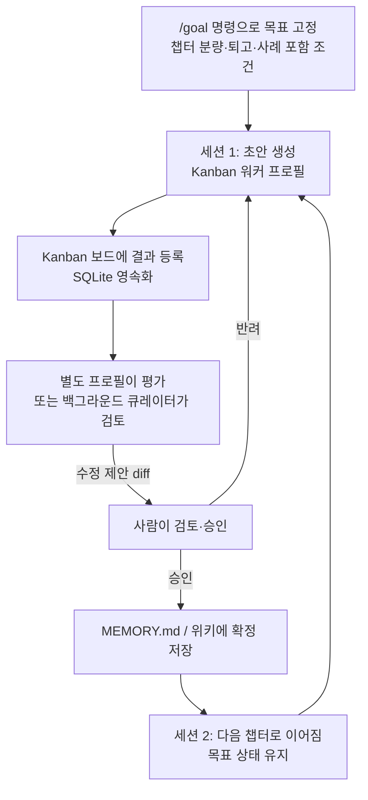
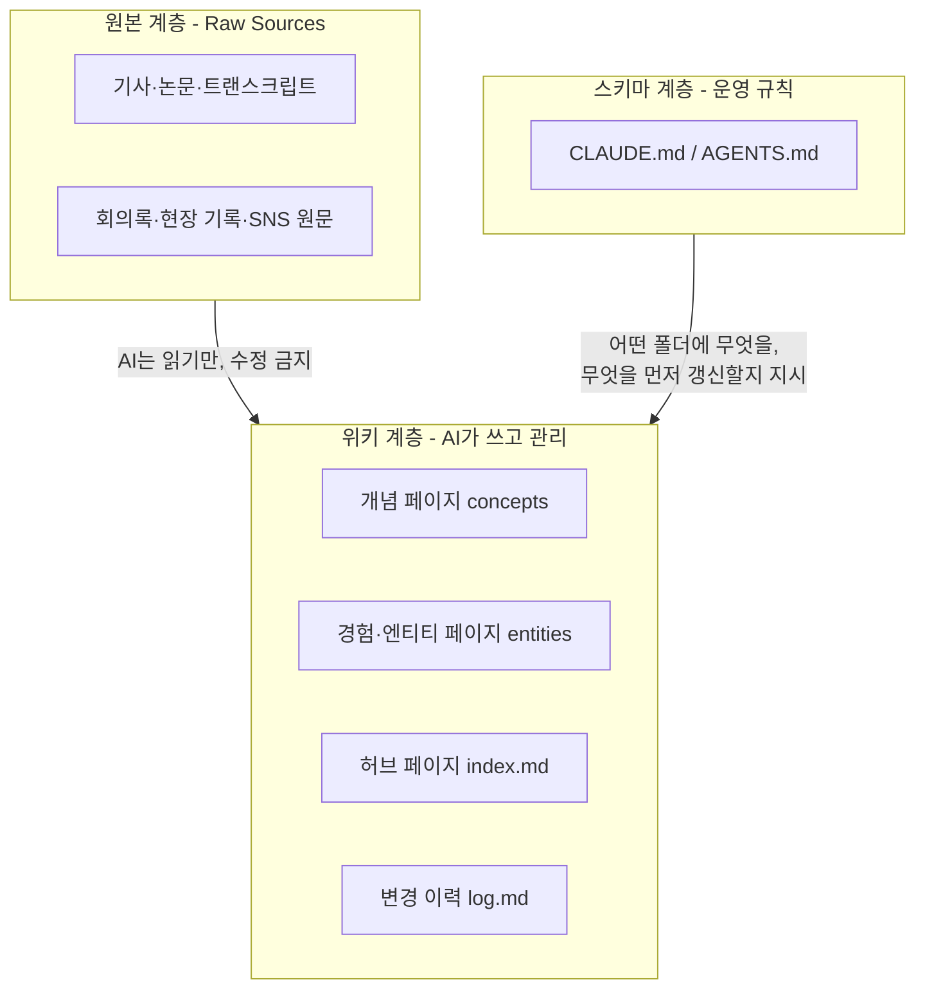
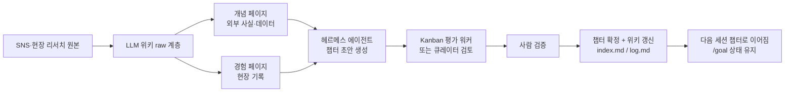

## 관련글

[**헤르메스 에이전트 언급이 많아지면 이것으로 무엇을 할 수 있을지 살펴봤습니다. 써보니 책쓰기 작업에 잘 맞았습니다**](https://www.facebook.com/share/p/197P4tXhMj/)

## 목차

1. 들어가며: 페이스북 게시물이 던진 질문
2. 헤르메스 에이전트란 무엇인가
3. 책 쓰기라는 작업이 일반 대화형 도구와 충돌하는 지점
4. 헤르메스 에이전트가 장문 집필을 붙잡는 세 가지 장치
5. LLM 위키란 무엇인가
6. 헤르메스 에이전트와 LLM 위키가 만났을 때
7. 마치며: 이 조합이 남기는 질문들
8. 참고 자료

---

## 1. 들어가며: 페이스북 게시물이 던진 질문

공유된 게시물은 헤르메스 에이전트를 책 쓰기 작업에 붙여본 경험을 짧게 정리한 글이다. 요지는 이렇다. 책은 짧은 글과 근본적으로 다른 작업이다. 한 번의 대화로 끝나는 것이 아니라 여러 세션에 걸쳐 챕터가 쌓이고, 그 사이에도 톤과 맥락과 자료가 끊기지 않고 이어져야 한다. 세션이 끝나면 기억이 사라지는 도구로는 이 연속성을 붙잡기 어렵다는 것이 글쓴이가 짚은 문제의식이다.

그래서 글쓴이는 헤르메스 에이전트가 이 문제를 세 가지 장치로 붙잡는다고 설명한다. 목표를 고정하는 장치, 생성과 평가를 분리하는 장치, 저장하기 전에 검증하는 장치다. 그리고 여기에 "LLM 위키"라는 별도의 자료 정리 체계를 더하면, 도구 하나만으로는 절반에 그쳤을 효과가 커진다고 말한다. 흩어져 있던 리서치 자료를 미리 개념 페이지와 경험 페이지로 나누어 정리해 두면, 집필할 때마다 자료를 다시 찾는 수고 없이 같은 근거를 반복해서 인용할 수 있다는 것이다.

이 문서는 게시물이 말하는 "헤르메스 에이전트"와 "LLM 위키"가 각각 실제로 어떤 소프트웨어이고 어떤 구조를 가진 개념인지, 공개된 문서와 보도를 검색해 확인한 내용을 바탕으로 정리한 것이다. 글쓴이가 언급한 세 가지 장치와 개념·경험 페이지 구분이 실제 소프트웨어의 어떤 기능에 대응하는지도 함께 짚어본다.

---

## 2. 헤르메스 에이전트란 무엇인가

헤르메스 에이전트(Hermes Agent)는 AI 안전·역량 연구 조직인 누스 리서치(Nous Research)가 만든 오픈소스 자율형 AI 에이전트다. 2026년 2월 하순(자료에 따라 25일 또는 26일로 표기가 엇갈린다)에 공개되었고, MIT 라이선스로 누구나 자유롭게 쓸 수 있다. 터미널에 `hermes`를 입력하면 대화가 시작되며, 파일을 읽고 쓰고, 웹을 검색하고, 명령을 실행하고, 메시지를 보내는 등 실제 작업을 수행한다는 점에서 질문에 한 번 답하고 끝나는 챗봇과는 결이 다르다.

가장 큰 특징은 스스로 세션을 넘어 기억하고 성장한다는 점이다. 공식 소개 문구는 이를 "the only agent with a built-in learning loop"라고 표현한다. 복잡한 작업(대략 도구 호출 5회 이상)을 마치면 에이전트가 그 경험을 재사용 가능한 스킬 문서(마크다운 파일)로 만들어 저장하고, 다음에 비슷한 작업을 만나면 처음부터 추론하는 대신 저장된 스킬을 불러 쓴다. 독립 벤치마크 기관 TokenMix가 2026년 4월 검증한 바에 따르면, 스킬을 20개 이상 스스로 만든 에이전트는 비슷한 작업을 새 인스턴스보다 약 40% 빠르게 끝낸다. 다만 이 수치는 토큰 소비량과 처리 시간 기준이며 결과물의 품질 향상을 뜻하지는 않고, 한 영역에서 배운 스킬이 다른 영역으로 그대로 전이되지는 않는다는 한계도 함께 보고되었다.

운영 방식도 유연하다. 로컬 컴퓨터뿐 아니라 도커, SSH, 다이토나(Daytona), 싱귤래리티(Singularity), 모달(Modal) 등 여섯 가지 터미널 백엔드를 지원하며, 다이토나와 모달은 유휴 상태일 때 거의 비용이 들지 않는 서버리스 방식으로 켜져 있을 수 있다. 텔레그램·디스코드·슬랙·왓츠앱·시그널·매터모스트·이메일 등 20개가 넘는 플랫폼에서 하나의 게이트웨이로 접속할 수 있어, 노트북을 켜놓지 않아도 클라우드에서 계속 작업을 이어갈 수 있다. 모델도 누스 포털, 오픈라우터, 오픈AI, 사용자가 지정한 엔드포인트 등 어느 쪽이든 `hermes model` 명령 한 번으로 바꿔 쓸 수 있어 특정 모델에 종속되지 않는다.

성장 속도도 눈에 띈다. 2026년 3월 23일 기준 깃허브 스타는 약 1만 800개였지만, 큐레이터 기능이 실린 v0.12.0이 나온 4월 30일 무렵에는 12만 7천 개를 넘었고, 데스크톱 앱 공식 출시(2026년 6월 2일, v0.15.2 퍼블릭 프리뷰)를 보도한 매체는 누적 스타가 18만 개를 넘겼다고 전했다. 같은 시기 경쟁 관계로 자주 비교되는 오픈소스 에이전트 오픈클로(OpenClaw)는 커뮤니티 스킬 5,700개 이상, 24개 이상의 메시징 플랫폼 지원 등 생태계 규모에서 앞서지만, 2026년 3월 나흘 사이 CVE 9건(그중 하나는 CVSS 9.9)이 공개되는 등 보안 이슈를 겪었다. 반면 헤르메스 에이전트는 2026년 4월 기준 공개적으로 보고된 에이전트 고유 취약점이 없었고, 컨테이너 하드닝, 읽기 전용 루트 파일시스템, 권한 축소, 네임스페이스 격리, 체크포인트·롤백, 명령 실행 전 사전 스캐너 등을 기본으로 갖추고 있다는 점이 대비되어 보도되었다. 두 프로젝트의 철학 차이를 정리한 한 분석은 오픈클로를 "메신저와 디바이스를 잇는 AI 비서 허브"에, 헤르메스 에이전트를 "서버에 살아 있으면서 점점 더 똑똑해지는 AI 작업자"에 가깝다고 표현했다.

---

## 3. 책 쓰기라는 작업이 일반 대화형 도구와 충돌하는 지점

게시물이 짚은 문제의식을 조금 풀어보면 이렇다. 짧은 글 한 편은 하나의 대화 세션 안에서 시작과 끝을 낼 수 있다. 반면 책 한 권은 다르다. 챕터마다 별도의 세션에서 작업하는 경우가 많고, 그 사이 며칠, 길게는 몇 주가 비기도 한다. 그런데 앞 챕터에서 정한 문체, 이미 등장한 용어, 앞서 다룬 사례를 뒤 챕터에서도 그대로 지켜야 한다. 세션이 끝나면 맥락이 초기화되는 도구를 쓰면, 매번 이전 챕터를 통째로 다시 붙여 넣거나 톤을 다시 설명해야 하는 비용이 생긴다.

또한 책 쓰기는 "결과가 언제 끝났다고 볼 것인가"의 기준이 짧은 글보다 복잡하다. 챕터별 분량, 퇴고 여부, 현장 경험 사례의 포함 여부처럼 여러 조건이 동시에 충족되어야 완료로 볼 수 있는 경우가 많다. 대화형 도구는 한 번의 요청에 한 번의 응답을 내놓는 데는 강하지만, 이런 다단계 완료 기준을 세션을 넘어 계속 추적하는 데는 원래 최적화되어 있지 않다. 뒤에서 다루는 헤르메스 에이전트의 목표 고정 기능은 정확히 이 지점을 겨냥한다.

---

## 4. 헤르메스 에이전트가 장문 집필을 붙잡는 세 가지 장치

게시물은 헤르메스 에이전트가 붙잡는 것을 목표 고정, 생성과 평가의 분리, 저장 전 검증 세 가지로 요약했다. 이 세 가지가 실제 소프트웨어의 어떤 기능과 맞닿아 있는지 확인한 내용은 다음과 같다.

### 4-1. 목표를 고정한다 — `/goal`과 영속적 목표 추적

헤르메스 에이전트에는 `/goal` 명령이 있다. 오픈AI 코덱스 CLI(Codex CLI) 0.128.0의 이른바 "랠프 루프(Ralph loop)" 방식에서 착안한 기능으로, 큐레이터 기능이 실린 v0.12.0(2026년 4월 30일) 직후에 도입되어 2026년 5월 7일 출시된 v0.14.0("Tenacity 릴리스")에서 영속적 목표 추적과 함께 정식 기능으로 다듬어졌다. 사용자가 하나의 목표를 세워 두면, 헤르메스 에이전트는 세션이 여러 번 끊기더라도 사용자가 직접 개입하기 전까지 그 목표를 향해 계속 작업을 이어간다. 챕터별 분량, 퇴고 여부, 사례 포함 같은 완료 조건을 이 목표에 걸어 두면, 세션이 끊겨도 "지금 어디까지 왔는지"가 도구 쪽에 남아 있게 된다. 이는 게시물이 말한 "챕터별 분량과 퇴고 여부, 경험 사례 포함 같은 완료 기준을 걸어두면 세션이 끊겨도 진행 상태가 유지"된다는 설명과 정확히 맞물린다.

### 4-2. 생성과 평가를 분리한다 — Kanban 다중 에이전트와 큐레이터

헤르메스 에이전트는 하나의 프로필(에이전트 인스턴스)만 쓰는 구조에 머무르지 않는다. v0.14.0에서 정식 도입된 Kanban 다중 에이전트 보드는 SQLite 파일(`~/.hermes/kanban.db`)에 작업을 영속화하고, 서로 다른 프로필이 각자의 역할로 이 보드에 접근하게 한다. 한국어 실전 가이드 문서에 따르면, 한 프로필이 작업을 잘게 쪼개 보드에 올리면 다른 프로필이 그 작업을 가져가 처리하고, 또 다른 프로필이 결과를 평가하고 전달한다. 보드가 동기화 지점 역할을 하기 때문에 에이전트끼리 직접 공유해야 하는 맥락이 줄어든다. 세션 내에서 짧게 병렬 작업만 필요할 때는 `delegate_task` 도구로 하위 에이전트를 즉석에서 띄울 수도 있는데, 이 하위 에이전트는 독립된 맥락과 터미널 세션을 가지고 작업한 뒤 요약만 보고한다.

여기에 더해 큐레이터(Curator)라는 별도의 보조 모델 백그라운드 작업이 있다. 기본적으로 켜져 있고, 게이트웨이의 크론 주기(기본 7일)마다 실행되어 에이전트가 스스로 만든 스킬들을 평가한다. 사용 빈도를 추적해 활성-정체-보관 상태로 옮기고, 겹치는 스킬은 통합을 제안하며, 자체 판단과 휴리스틱을 함께 써서 무엇을 남길지 정한다. 결과는 기계가 읽기 좋은 `run.json`과 사람이 읽기 좋은 `REPORT.md` 두 형태로 기록되고, 삭제는 하지 않고 보관만 하는 방식으로 설계되어 있다. 초안을 쓰는 자리(생성)와 그 초안이나 스킬을 평가하는 자리(큐레이터, 또는 Kanban의 별도 평가 프로필)가 이렇게 구조적으로 나뉘어 있는 것이, 게시물이 말한 "자기 글에 관대해지는 함정을 막는다"는 설명이 기대는 실제 메커니즘이다.

### 4-3. 저장 전에 검증한다 — 사람이 확인한 뒤 기록하는 구조

헤르메스 에이전트의 메모리 계층은 대화 중 알게 된 사실을 `MEMORY.md`에 에이전트가 스스로 기록하되, 주기적으로 "이 정보는 지속적으로 남길 가치가 있는지" 사용자에게 되묻는 넛지(nudge) 방식을 쓴다. 뒤에서 다룰 LLM 위키 쪽에서도 같은 원칙이 운영 규칙으로 명시되는 경우가 많다. 한 실무 사례가 공개한 스키마 예시에는 "운영상 중요한 페이지 수정은 diff로 제안하고 사람 승인을 기다린다"는 규칙이 포함되어 있다. 즉 문체 규칙이나 설정처럼 여러 챕터에 걸쳐 반복 참조되는 정보는 에이전트가 곧바로 확정해 버리지 않고, 변경 제안(diff) 형태로 먼저 보여준 뒤 사람이 확인해야 실제로 저장되는 흐름을 만들 수 있다. 이렇게 하면 한 번의 오류가 다음 챕터, 그다음 챕터로 계속 번지는 것을 막을 수 있다는 것이 게시물이 강조한 지점이다.

이 세 장치를 하나의 흐름으로 그리면 다음과 같다.

---

## 5. LLM 위키란 무엇인가

게시물에서 말하는 "LLM 위키"는 특정 하나의 제품 이름이라기보다, 2026년 4월 초 오픈AI 공동 창업자이자 전 테슬라 AI 디렉터인 안드레이 카파시(Andrej Karpathy)가 깃허브에 공개해 확산시킨 개인 지식 베이스 구축 패턴을 가리키는 말로 널리 쓰이고 있다. 해당 글은 X(옛 트위터)에서 1,600만 회 넘게 조회되었고, 깃허브 기스트(Gist)는 공개 며칠 만에 스타 5,000개를 넘길 만큼 AI 커뮤니티에서 빠르게 퍼졌다.

핵심 아이디어는 단순하다. 매번 원본 자료를 다시 검색해 답을 조합하는 RAG(검색 증강 생성) 방식 대신, LLM이 마크다운 파일들로 이루어진 위키를 직접 관리하게 해서 지식을 점점 더 정리된 형태로 축적해 나가자는 것이다. 카파시가 제시한 구조는 3개 계층으로 나뉜다.

첫째, 원본 자료(Raw Sources) 계층이다. 기사, 논문, 회의록, 트랜스크립트, 이미지 같은 원본이 여기 들어가는데, 핵심 규칙은 이 계층을 LLM이 절대 고치지 않는다는 점이다. 원본이 그대로 보존되기 때문에 필요하면 언제든 위키를 처음부터 다시 만들 수 있다.

둘째, 위키(Wiki) 계층이다. LLM이 원본을 읽고 재구성한 마크다운 문서 묶음으로, 요약 페이지, 개념 페이지, 엔티티(경험·인물·프로젝트) 페이지, 비교 문서, 여러 문서를 묶는 허브 페이지 등이 여기 속한다. 이 계층은 전적으로 AI가 소유한다. 새 자료가 들어오면 관련 페이지를 갱신하고 교차 참조를 유지하는 것도 AI의 몫이며, 사람은 주로 읽고 검토하는 역할을 맡는다. 어떤 문서가 있는지 빠르게 훑을 수 있는 `index.md`와, 언제 무엇을 추가·수정했는지 계속 덧붙여 쌓는 `log.md`를 별도로 두는 방식이 여러 실전 후기에서 공통으로 확인된다.

셋째, 스키마(Schema) 계층이다. 클로드 코드라면 `CLAUDE.md`, 코덱스라면 `AGENTS.md` 같은 설정 문서가 이 역할을 하며, AI에게 위키를 어떤 규칙으로 운영할지 알려준다. 여러 실무자가 공통으로 강조하는 점은, 단순히 "위키를 잘 정리해줘"라고만 지시하면 세션마다 결과가 흔들리기 쉽다는 것이다. 어떤 폴더에 어떤 문서를 만들지, 새 자료가 들어오면 무엇을 먼저 갱신할지, 중복 페이지를 어떻게 피할지 같은 기준이 명시되어 있어야 LLM이 일관되게 움직인다. 이 계층이 의외로 세 계층 중 가장 중요하다고 말하는 후기가 여럿이다.

운영 규모에 관한 카파시의 언급도 눈여겨볼 만하다. 약 100개 기사, 40만 단어 정도 규모에서는 LLM이 요약과 인덱스 파일만으로 탐색해도 충분하며, 부서 위키나 개인 연구 프로젝트 수준에서는 오히려 RAG 인프라를 별도로 두는 쪽이 지연과 검색 노이즈를 더 키우는 경우가 많다고 그는 설명했다. 규모가 더 커지면 쇼피파이(Shopify) CEO 토비 뤼트케가 만든 로컬 마크다운 검색 엔진 QMD(BM25와 벡터 검색을 함께 쓰고 LLM 리랭킹을 지원하며, CLI와 MCP 서버 형태 모두 지원)를 검색 계층으로 얹는 방법을 카파시가 직접 추천하기도 했다.

이 패턴을 그대로 구현한 오픈소스 프로젝트도 빠르게 등장했다. SamurAIGPT/llm-wiki-agent는 클로드, 코덱스, 오픈코드, 제미나이 등 여러 에이전트에서 API 키 없이 바로 쓸 수 있도록 `raw/`, `wiki/sources`, `wiki/entities`, `wiki/concepts`, `index.md`, `log.md`, `CLAUDE.md`로 이루어진 디렉터리 구조를 그대로 제공한다. nashsu/llm_wiki는 한 걸음 더 나아가 크로스플랫폼 데스크톱 애플리케이션으로 구현된 사례로, 문서를 자동으로 지식 그래프로 엮고 이미지까지 비전 모델로 캡션을 붙여 색인하며, 로컬 HTTP API와 MCP 서버를 함께 제공해 클로드 코드나 코덱스에 스킬로 바로 설치할 수 있게 했다.

LLM 위키는 종종 마이크로소프트의 그래프RAG(GraphRAG)와 비교된다. 그래프RAG이 비정형 텍스트에서 엔티티, 관계, 커뮤니티 구조, 임베딩을 추출하는 좀 더 기계 친화적인 중간 구조를 지향한다면, LLM 위키는 사람이 직접 읽고 편집하기 쉬운 중간 구조에 가깝다는 것이 한 비교 글의 정리다. 두 방식이 서로 대체재라기보다는 가까운 친척에 가깝다는 평가도 있다.

---

## 6. 헤르메스 에이전트와 LLM 위키가 만났을 때

게시물이 실제로 강조하는 것은 두 도구를 따로 쓰는 것이 아니라 겹쳐 쓰는 지점이다. 헤르메스 에이전트 혼자서는 목표 고정, 생성과 평가 분리, 저장 전 검증이라는 "쓰는 과정의 구조"를 붙잡을 뿐, 애초에 쓸 자료 자체를 준비해 주지는 않는다. 반대로 LLM 위키는 자료를 개념 페이지와 경험 페이지로 미리 정리해 두는 "쓸 자료의 구조"를 담당하지만, 그 자체로는 여러 세션에 걸친 장문 집필을 이어가는 실행 엔진이 아니다. 두 구조가 맞물려야 비로소 게시물이 말한 "준비된 자료 위에서 조립하는 글쓰기"가 성립한다.

실제로 이 조합은 낯선 발상이 아니다. 패스트캠퍼스가 개설한 한 강의는 헤르메스 에이전트의 메모리 기반 구조와 자동 스킬 생성 메커니즘을 극대화해 "LLM 위키 프로젝트와 개발에 최적화된 AI 에이전트 팀 아키텍처"를 설계한다는 점을 정면으로 내세우고 있고, 하네스 엔지니어링을 통해 시행착오를 줄이는 방법도 함께 다룬다. 다만 이 강의는 개발 에이전트 팀 구축에 초점이 맞춰져 있고, 책 쓰기라는 용도로 두 도구를 결합하는 방식은 게시물의 글쓴이가 직접 시도해 확인한 활용법에 가깝다.

게시물이 말한 개념 페이지와 경험 페이지 구분은 LLM 위키의 엔티티/개념 페이지 구분과 정확히 겹치지는 않지만 같은 발상에서 나온다. 외부에서 검증한 사실과 데이터는 개념 페이지에, 글쓴이 자신의 현장 기록은 경험 페이지에 나누어 두면, 챕터를 쓸 때 "이 주장의 근거가 무엇이었는지"와 "내가 실제로 겪은 사례가 무엇이었는지"를 각각 다른 곳에서 곧바로 끌어올 수 있다. 개념과 경험이 한자리에서 만나는 지점에서 그 책만의 색이 나오고, 매번 자료를 다시 찾지 않아도 되는 만큼 손이 덜 간 초안에서는 정형화된 "AI가 쓴 느낌"도 옅어진다는 것이 게시물의 설명이다.

이 결합을 하나의 흐름으로 정리하면 다음과 같다.

정리하면 헤르메스 에이전트가 긴 집필을 구조로 붙들고, LLM 위키가 그 위에 쓸 자료를 미리 얹어 두는 방식이다. 백지에서 시작하는 글쓰기가 아니라 준비된 자료 위에서 조립하는 글쓰기로 바뀐다는 게시물의 표현은, 두 소프트웨어의 실제 아키텍처를 확인한 뒤에도 상당히 정확한 요약으로 보인다.

---

## 7. 마치며: 이 조합이 남기는 질문들

이번에 확인한 내용을 종합하면, 게시물이 말한 세 가지 통제(목표 고정, 생성·평가 분리, 저장 전 검증)는 각각 헤르메스 에이전트의 `/goal` 영속 목표 추적, Kanban 다중 에이전트·큐레이터, 메모리 넛지·diff 승인이라는 실제 기능에 뿌리를 두고 있다. LLM 위키 역시 카파시가 제안한 뒤 여러 오픈소스 구현체와 기업용 컨설팅 사례로까지 확산된, 근거가 분명한 흐름이다.

다만 두 도구를 책 쓰기라는 구체적 용도로 결합하는 방식 자체는 아직 표준화된 워크플로라기보다 개별 실무자가 시행착오를 거쳐 만들어가는 단계에 가깝다. 40%라는 스킬 재사용 속도 개선 수치도 영역 간 전이가 되지 않는다는 한계가 함께 보고된 만큼, 책 쓰기처럼 챕터마다 소재가 달라지는 작업에 그대로 적용될지는 실제로 여러 챕터를 완주해 보며 검증할 부분으로 남는다. 헤르메스 에이전트와 오픈클로 양쪽 모두 릴리스 주기가 매우 빨라 기능과 버전 번호가 계속 바뀌고 있다는 점도, 이런 워크플로를 구축할 때 염두에 두어야 할 변수다.

---

## 8. 참고 자료

- Hermes Agent 공식 사이트, https://hermes-agent.nousresearch.com/
- GitHub - NousResearch/hermes-agent, https://github.com/nousresearch/hermes-agent
- GitHub - NousResearch/hermes-agent Releases, https://github.com/NousResearch/hermes-agent/releases
- Hermes Agent 공식 문서 - Curator, https://hermes-agent.nousresearch.com/docs/user-guide/features/curator
- Hermes Agent 공식 문서 - Kanban, https://hermes-agent.nousresearch.com/docs/user-guide/features/kanban
- Ewan Mak, "Hermes Agent Desktop App", Medium, 2026년 6월, https://medium.com/@tentenco/hermes-agent-desktop-app-everything-you-need-to-know-about-nous-researchs-self-improving-ai-agent-3cb59bd31e5f
- i-scoop.eu, "Hermes Agent from Nous Research", 2026년 4월, https://www.i-scoop.eu/hermes-agent-from-nous-research/
- The Agent Report, "Hermes Agent v0.12.0 'Curator'", 2026년 5월, https://the-agent-report.com/2026/05/hermes-agent-v0120-curator-release/
- WikiDocs, 「Hermes Agent: 성장하는 AI 에이전트 실전 가이드」, https://wikidocs.net/book/19414 (Kanban 챕터: https://wikidocs.net/354478)
- Dreamwalker(박제창), "Hermes Agent란 무엇인가", Medium, https://medium.com/@aristojeff/hermes-agent%EB%9E%80-%EB%AC%B4%EC%97%87%EC%9D%B8%EA%B0%80-4a2e83422d85
- 라이즈 모먼트 AI, "LLM Wiki: 나만의 AI 지식 저장소 구축법", https://blog.risemoment.ai/llm-wiki-my-ai-knowledge-base/
- Benjamin's Dev Blog, "LLM Wiki: 블로그 글을 살아있는 지식 베이스로 바꾸는 방법", https://benjamin0326.github.io/ai/2026/04/19/LLM_Wiki.html
- Dreamwalker(박제창), "LLM Wiki는 무엇이고, 왜 지금 주목받는가", Medium, https://medium.com/@aristojeff/llm-wiki%EB%8A%94-%EB%AC%B4%EC%97%87%EC%9D%B4%EA%B3%A0-%EC%99%9C-%EC%A7%80%EA%B8%88-%EC%A3%BC%EB%AA%A9%EB%B0%9B%EB%8A%94%EA%B0%80-5c274bdf70ce
- GitHub - nashsu/llm_wiki, https://github.com/nashsu/llm_wiki
- SK AX, "회의록도 보고서도 AI가 알아서 정리하는 시대, LLM Wiki", https://www.skax.co.kr/insight/trend/3764
- 패스트캠퍼스, "Hermes Agent로 매일 스스로 진화하는 개발 에이전트 팀 만들기 (ft. LLM wiki)", https://fastcampus.co.kr/biz_online_hermes
- 원 게시물(원문 접근 제한으로 인용은 게시물 본문 텍스트에 근거함), https://www.facebook.com/share/p/197P4tXhMj/
