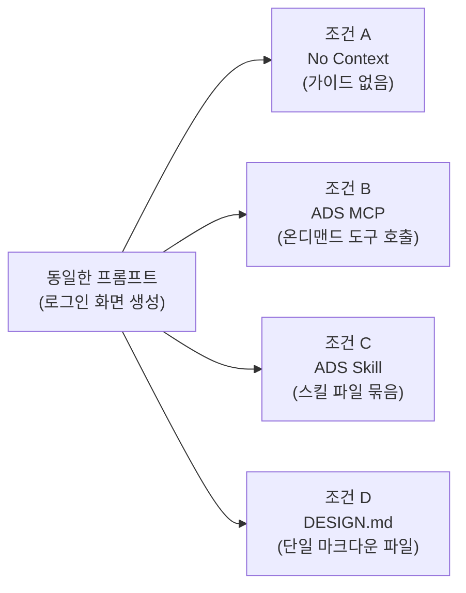
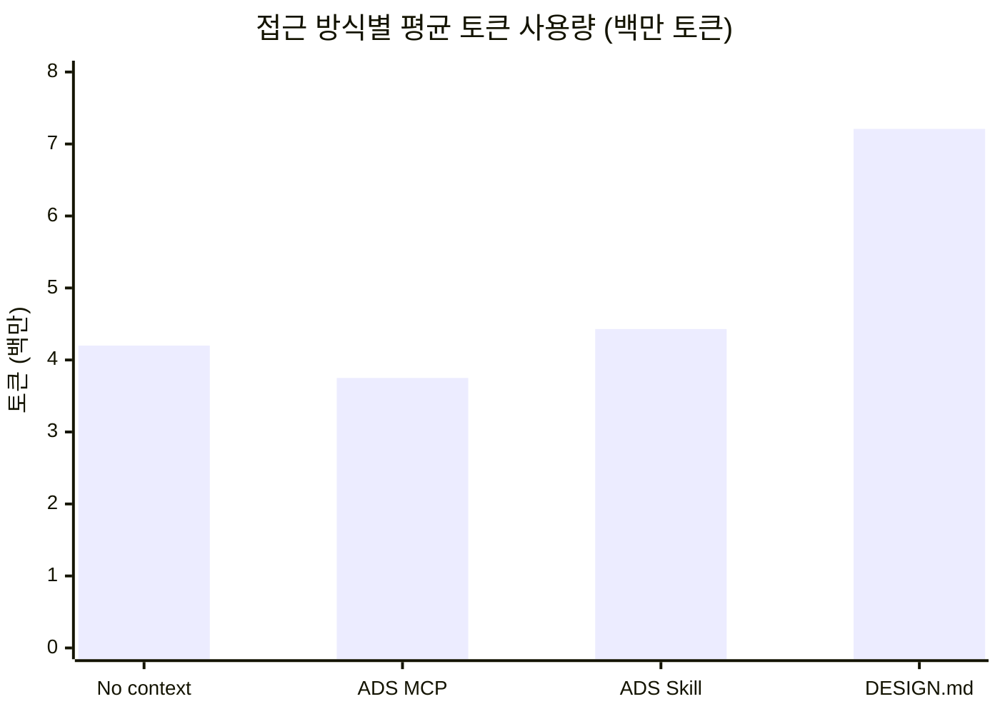
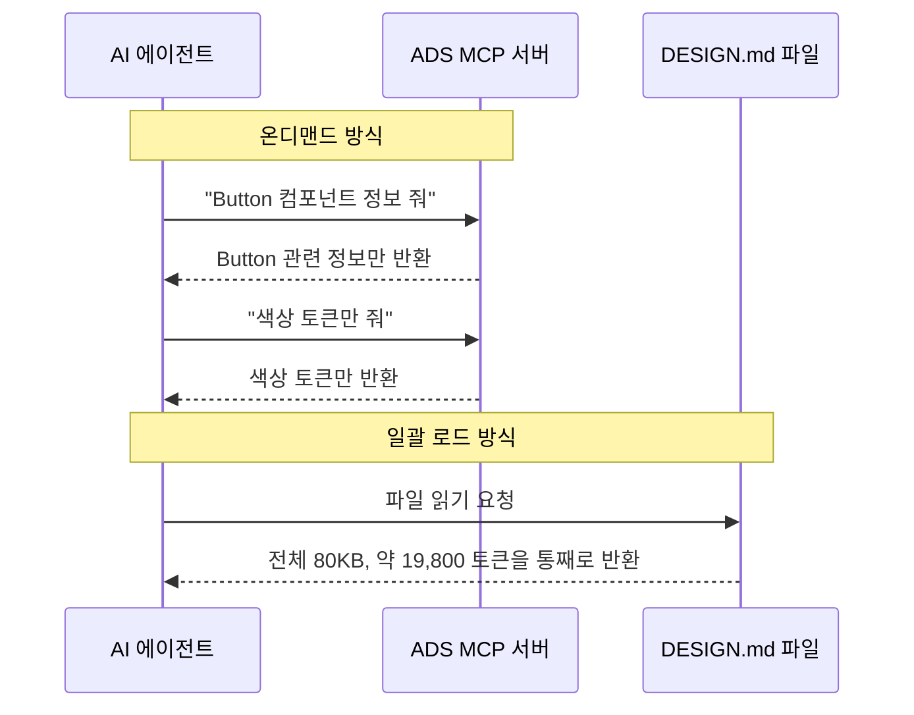
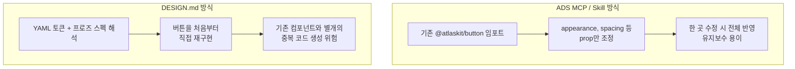
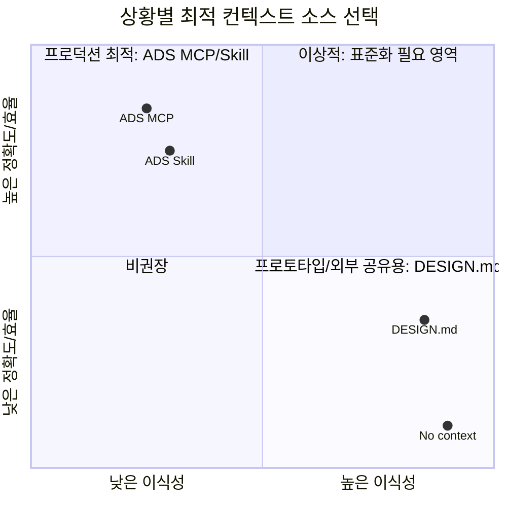

> 원문: Kylor Hall(Principal Prompt Engineer), Andrew Campbell(Senior Design Technologist) — *Inside Atlassian*, 2026년 6월 15일 게재 (2026년 6월 18일 수정)
>
> 출처: https://www.atlassian.com/blog/how-we-build/atlassians-design-md-is-here-what-we-learned-testing-portable-design-context-in-practice

---

## 0. 이 문서를 읽기 전에 — 한 문장 요약

**"DESIGN.md는 좋은 아이디어지만, 실제 프로덕션 환경에서는 Atlassian이 이미 갖고 있던 MCP 서버·AI 스킬 조합보다 토큰을 더 쓰고, 시간도 더 걸리고, 결과 품질도 떨어졌다."** — 다만 "빠른 프로토타이핑"이나 "브랜드 없는 새 환경에서 톤앤매너만 입히고 싶을 때"는 여전히 유용하다는 것이 Atlassian 디자인 시스템팀의 결론입니다.

이 글은 AI가 UI를 생성할 때 왜 다 비슷비슷한 "슬롭(slop)" 디자인이 나오는지에서 출발해, 구글이 만든 `DESIGN.md`라는 새로운 오픈소스 포맷을 Atlassian이 직접 자사 디자인 시스템(ADS)에 적용해보고, 그 결과를 수치로 비교한 실전 리포트입니다.

---

## 1. 배경 — 왜 AI가 만든 UI는 다 똑같아 보일까

AI 코딩 에이전트(Claude Code, Cursor, Copilot 등)에게 "대시보드 하나 만들어줘"라고 하면 흔히 나오는 결과물의 특징이 있습니다.

- 그라디언트가 잔뜩 들어간 버튼
- 이유 없이 전부 대문자인 헤딩
- 어디서 본 듯한 카드 레이아웃
- 아무도 요청하지 않은 호버 애니메이션

기술적으로는 작동하지만, 그 브랜드만의 정체성이 전혀 없는 디자인입니다. 이런 결과물을 디자인 업계에서는 **"UI 슬롭(UI slop)"** 이라고 부르기 시작했습니다. 기능은 하지만 시각적 정체성이나 의도된 디자인 판단이 결여된 산출물이라는 뜻입니다.

원인은 단순합니다. AI 모델은 브랜드, 컴포넌트, 패턴에 대한 맥락(context) 없이 프롬프트만 받으면, 학습 데이터 전체의 "평균값"으로 수렴합니다. **넣은 게 일반적이면(generic in), 나오는 것도 일반적(generic out)** 입니다.

Atlassian 디자인 시스템팀은 이 문제를 풀기 위해 이미 오래전부터 자체적인 **"AI 시대의 컨텍스트 엔진"** 을 구축해왔습니다. 이는 다음 두 축으로 이루어져 있습니다.

1. **ADS MCP 서버** — AI 에이전트가 필요할 때마다 도구 호출(tool call)로 디자인 시스템 정보를 가져가는 방식
2. **AI 스킬(Skills)** — 좀 더 구조화된 파일 묶음 형태로 제공되는 가이드

이 두 도구는 Atlassian 내부에서 수천 명의 제품 빌더가 실제로 사용하며, AI 토큰 비용 절감과 생성 정확도·품질 향상에 효과가 있다는 것이 이미 검증되어 있었습니다.

그런데 최근 여기에 새로운 경쟁자(혹은 보완재)가 등장했습니다. 바로 구글이 만든 **`DESIGN.md`** 입니다.

---

## 2. DESIGN.md란 무엇인가


### 2.1 탄생 배경

`DESIGN.md`는 구글의 AI 디자인 툴 **Stitch**(2025년 5월 출시)에서 내부적으로 쓰이던 포맷이었습니다. 이후 구글 랩스(Google Labs)가 2026년 4월 21일, 이 포맷의 초안 명세(draft specification)를 **오픈소스(Apache 2.0 라이선스)** 로 공개하면서 Stitch라는 하나의 툴을 넘어 업계 전반에서 쓸 수 있는 표준으로 확장하려는 움직임이 시작됐습니다. 공식 저장소는 `github.com/google-labs-code/design.md`이며, 2026년 7월 현재 기준으로 스펙과 토큰 스키마, CLI가 아직 **알파(alpha) 버전**으로 "활발히 개발 중"이라는 점을 스펙 문서 자체가 명시하고 있습니다.

### 2.2 파일 구조 — 두 개의 층

`DESIGN.md`는 하나의 마크다운 파일 안에 성격이 다른 두 개의 섹션을 담습니다.

**① 시맨틱 토큰 (YAML 프런트매터)**
파일 맨 위에 `---`로 감싸인 YAML 블록으로, 색상·타이포그래피·간격(spacing)·모서리 둥글기 등 디자인 토큰을 기계가 읽을 수 있는 key-value 형태로 나열합니다. 이 블록은 스타일시트를 생성하거나 UI 제약을 강제하는 데 쓰입니다.

```yaml
---
name: Heritage
colors:
  primary: "#1A1C1E"
  secondary: "#6C7278"
  tertiary: "#B8422E"
  neutral: "#F7F5F2"
typography:
  h1:
    fontFamily: Public Sans
    fontSize: 3rem
spacing:
  sm: 8px
  md: 16px
---
```

**② 디자인 근거 (마크다운 프로즈)**
YAML 블록 아래에는 사람과 AI 에이전트가 모두 읽을 수 있는 자연어 설명이 표준화된 섹션(Overview, Colors, Typography 등)으로 이어집니다. 단순히 "이 색은 #1A1C1E다"가 아니라 **"왜 이 색을 쓰는지, 언제 써야 하는지"** 를 설명하는 부분입니다.

```markdown
## Overview
Architectural Minimalism meets Journalistic Gravitas.
The UI evokes a premium matte finish — a high-end broadsheet
or contemporary gallery.

## Colors
The palette is rooted in high-contrast neutrals and a single accent color.
- **Primary (#1A1C1E):** 헤드라인과 본문 텍스트를 위한 짙은 잉크색
- **Tertiary (#B8422E):** "보스턴 클레이" — 상호작용을 나타내는 유일한 색
```

이 두 층이 결합되는 이유가 핵심입니다. JSON 토큰 파일만으로는 "이 색은 primary 색이다"라는 **값**은 표현할 수 있어도, **"이 색은 메인 CTA 버튼에만 써야 한다"** 는 **규칙**은 표현할 수 없습니다. DESIGN.md는 YAML(값)과 마크다운 프로즈(규칙·의도)를 한 파일에 묶어서, 빌드 파이프라인 없이도 에이전트가 "정확한 값 + 왜 그 값인지"를 동시에 이해하게 만드는 것을 목표로 합니다.

### 2.3 DESIGN.md가 아닌 것

Atlassian 팀이 명확히 짚은 대목입니다. DESIGN.md는:

- 프로덕션에서 실제로 작동하는 디자인 시스템의 **완전한 기술 스펙이 아닙니다**.
- 기존 코드 라이브러리, 코딩 표준을 강제하는 린터(linter), Figma의 상세 디자인 스펙을 포함하지 않습니다.
- 공식 스펙 자체가 이 포맷을 "시스템의 전체 디테일이 아니라 **의도(intent)** 를 포착하는 것"으로 규정하고 있습니다.

### 2.4 CLI와 생태계

구글이 공개한 `@google/design.md` 패키지는 다음과 같은 명령을 제공합니다.

| 명령 | 기능 |
|---|---|
| `npx @google/design.md lint DESIGN.md` | 스펙 위반, 깨진 토큰 참조, WCAG AA 명암비 실패 등 9개 규칙 검사 |
| `npx @google/design.md export --format css-tailwind` | Tailwind v4 테마 CSS로 변환 |
| `npx @google/design.md export --format dtcg` | W3C 디자인 토큰 포맷(DTCG)의 tokens.json으로 변환 |
| `npx @google/design.md spec` | 에이전트 프롬프트에 주입할 스펙 자체를 출력 |

또한 커뮤니티 저장소 `VoltAgent/awesome-design-md`에는 주요 브랜드(Stripe, Vercel, Linear 등) 사이트의 공개 CSS 값을 기반으로 역추출한 DESIGN.md 파일이 60여 개 이상 모여 있으며, 461개 이상의 파일을 제공하는 `designmd.app` 같은 라이브러리 사이트도 등장했습니다. 다만 아직은 Stitch에 네이티브로 통합되어 있을 뿐, Figma·v0·Cursor 등 다른 툴들이 이를 표준으로 정식 채택했는지는 초기 단계입니다.

---

## 3. Atlassian은 왜, 어떻게 이걸 테스트했나

Atlassian 디자인 시스템(ADS, Atlassian Design System)팀은 이미 오랫동안 자체 **구조화된 콘텐츠 파이프라인**을 통해 ADS MCP 서버와 AI 스킬용 문서를 생성해왔습니다. DESIGN.md가 등장하자, 이 팀은 **같은 파이프라인**을 이용해 자체 DESIGN.md 파일을 직접 만들어냈습니다. 즉, ADS MCP·스킬·DESIGN.md 세 가지 모두 동일한 원천 데이터에서 나온 결과물이라, 비교 실험의 공정성이 확보된 셈입니다.

이후 이 파일을 일반적인 "바이브 코딩(vibe coding)" 툴에 넣어 테스트했고, 기존 가이드에서 놓치고 있던 흔한 실수들을 보완하는 방향으로 다듬었습니다.

### 3.1 Team '26 키노트 — 원샷 프로토타이핑 테스트

한 달 전(2026년 5월경) 애너하임에서 열린 Atlassian의 연례 행사 **Team '26** 키노트 데모에서, Figma Make가 Teamwork Graph 데이터를 이용해 커스텀 대시보드를 생성하는 시연이 있었습니다. 이때 목표는 내부 MCP 서버나 툴에 의존하지 않고도, 한 번의 시도(one-shot)로 Atlassian스러운 디자인 언어에 맞는 대시보드를 만드는 것이었습니다.

이는 DESIGN.md에 딱 맞는 사용 사례였습니다. 결과는 — **꽤 괜찮았습니다.** 동일한 프롬프트를 DESIGN.md를 컨텍스트로 넣은 경우와 넣지 않은 경우로 나눠 비교했을 때, DESIGN.md를 넣은 쪽은 일반적인 "슬롭" UI에서 벗어나 색상·간격·모양·타이포그래피 값이 Atlassian다운 값으로 수렴했고, 컴포넌트의 elevation(그림자·계층감) 처리도 실제 시스템과 정렬되는 방향으로 나왔습니다.

즉, **Tailwind나 Shadcn 같은 범용 라이브러리를 처음부터 커스터마이징해 UI를 새로 만드는 상황에서는 DESIGN.md의 고수준 가이드와 스펙이 매우 효과적**이었다는 것이 첫 번째 결론입니다.

### 3.2 그렇다면 "프로덕션 코드베이스"에서는?

문제는 여기서부터입니다. 프로토타입을 처음부터 새로 만드는 환경과, **이미 방대한 토큰·컴포넌트 라이브러리가 존재하고, 엄격한 린트 규칙과 타입 체크가 걸려 있는 프로덕션 코드베이스**는 완전히 다른 환경입니다. Atlassian은 이 두 번째, 더 현실적인 시나리오에서 DESIGN.md를 본격적으로 테스트했습니다.

---

## 4. 실험 결과 — 숫자로 보는 DESIGN.md vs MCP vs 스킬

### 4.1 테스트 설계

테스트 과제는 의도적으로 단순하게 설계됐습니다: **"로그인 화면 하나 만들기"**. Vite + React 워크스페이스 안에서 `src/LoginScreen.tsx`를 수정(또는 필요시 의존성 추가)해 `/` 경로에서 렌더링되는 화면을 만들고, 기존 `App.tsx`의 마운팅 계약을 유지하며, 접근성을 지키고, Atlassian Design System 또는 그 디자인 언어를 따르도록 요구했습니다. 타입체크와 린팅을 통과하고 실제 사이트에 접속해 검증하는 것까지가 과제의 일부였습니다.

이 하나의 프롬프트를, 아래 네 가지 조건으로 각각 여러 번(9회 또는 5회) 반복 실행해 평균을 냈습니다.



### 4.2 종합 결과표

| 접근 방식 | 디자인 시스템 컨텍스트 반영률 | 평균 토큰 사용량 | 평균 소요 시간 | 평균 턴 수 |
|---|---|---|---|---|
| 컨텍스트 없음 (No context) | 약 5% | 420만 토큰 | 6분 19초 | 43턴 |
| **ADS MCP** | 약 80% | **375만 토큰** | **5분 1초** | 35.1턴 |
| ADS Skill | 약 80% | 443만 토큰 | 5분 23초 | 36턴 |
| **DESIGN.md** | 약 30% | **721만 토큰** | **6분 46초** | 45.3턴 |

가장 눈에 띄는 대목은 이렇습니다.

- **ADS MCP가 네 조건 중 토큰 소비도 가장 적고(375만), 시간도 가장 짧고(5분 1초), 디자인 시스템 반영률도 가장 높습니다(80%).**
- **DESIGN.md는 반대로 네 조건 중 토큰 소비가 가장 많고(721만), 시간도 가장 오래 걸리며(6분 46초), 반영률은 오히려 "컨텍스트 없음(5%)"보다는 훨씬 낫지만 MCP·스킬(80%)의 절반에도 못 미치는 30%에 그쳤습니다.**
- 흥미로운 점은 DESIGN.md가 심지어 **"아무 가이드도 주지 않은 경우"보다도 토큰을 더 많이 쓰고 시간도 더 걸렸다**는 것입니다. 이는 파일 자체가 무겁고, 부족한 정보를 에이전트가 스스로 코드베이스를 뒤져서 채워 넣으려 하기 때문으로 분석됩니다.

정리하면, **DESIGN.md를 유일한 디자인 시스템 정보원으로 썼을 때, 로그인 화면 하나를 만드는 단순한 과제에서도 ADS MCP 대비 약 92% 더 많은 토큰이 들었고, 실행마다 결과의 편차(분산)도 약 2.7배 더 컸습니다.**



> ⚠️ Atlassian 팀은 이 수치를 "결론적 연구 결과"로 취급하지 말라고 명시적으로 경고합니다. 이 블로그는 학술 논문이 아니며, 사용하는 모델·프롬프트·디자인 시스템·환경·컨텍스트 소스의 품질에 따라 결과는 달라질 수 있습니다. 다만 이 테스트들은 DESIGN.md 포맷을 실제로 써보면서 반복적으로 관찰된 **일반적인 제약**을 잘 보여준다고 강조합니다.

### 4.3 개별 실행 사례 비교

Atlassian이 공유한 개별 실행 로그를 보면 편차가 얼마나 큰지 체감할 수 있습니다.

| 실행 사례 | 조건 | 턴 수 | 소요 시간 | 토큰 사용량 |
|---|---|---|---|---|
| 사례 1 | ADS MCP | 36턴 | 4분 59초 | 4,542,922 |
| 사례 2 | DESIGN.md (샘플 #1) | 28턴 | 4분 22초 | 3,399,035 |
| 사례 3 | DESIGN.md (샘플 #2) | **64턴** | **7분 53초** | **11,086,348** |

같은 DESIGN.md 조건 안에서도 샘플 #1과 샘플 #2 사이의 편차가 극단적입니다. 턴 수는 28턴에서 64턴으로, 토큰은 340만에서 무려 1,100만으로 3배 이상 벌어집니다. 반면 ADS MCP는 상대적으로 안정적인 범위 안에서 움직입니다. 이것이 앞서 언급한 "**약 2.7배의 분산**"이 의미하는 실제 모습입니다.

시각적으로 보면, ADS MCP로 만든 로그인 화면은 파란색 브랜드 컬러의 "Continue to Atlassian" 스타일 화면으로 실제 Atlassian 로그인 화면과 매우 유사하게 나온 반면, DESIGN.md 기반의 두 샘플은 서로 다른 레이아웃과 어두운 헤더 스타일로 갈라지는 등, **같은 입력값에서도 결과 일관성이 떨어지는 모습**을 보였습니다.

---

## 5. 왜 이런 차이가 나는가 — Atlassian이 짚은 3가지 구조적 한계

### 한계 ① 컨텍스트가 "한꺼번에" 로드된다 (온디맨드가 아니다)

MCP 서버의 핵심 장점은 **필요할 때만 필요한 만큼** 정보를 가져온다는 점입니다. 예를 들어 에이전트가 `ads_plan`이라는 도구를 호출하면, 특정 컴포넌트 하나에 대한 가이드만 딱 가져옵니다. Atlassian의 디자인 시스템에는 수백 개의 아이콘과 방대한 시맨틱 토큰이 있는데, 이런 무거운 요소들을 "필요 없을 때는 아예 컨텍스트에 올리지 않는" 방식으로 절약할 수 있는 겁니다. AI 스킬도 MCP만큼 세밀하진 않지만, 여러 개의 작은 파일로 나뉘어 있어 비슷한 효과를 냅니다.

반면 **DESIGN.md는 파일 하나를 통째로, 매번, 처음부터 끝까지 로드**합니다. 이는 처음부터 비용이 높고 응답이 느리다는 뜻이며, 대화가 길어질수록(턴 수가 늘수록) 컨텍스트가 잘려나가는(truncation) 시점이 더 일찍 찾아와 생성 결과의 정확도를 떨어뜨릴 수 있습니다.



### 한계 ② 파일을 짧게 유지하려면 정보를 잃을 수밖에 없다

디자인 시스템은 매우 복잡한 존재입니다. 수천 개의 개별 화면, Figma 파일, 프런트엔드 컴포넌트에서 나온 공통 언어를 하나의 가이드라인·컴포넌트 라이브러리로 압축한 것이기 때문입니다. 이걸 마크다운 파일 하나에, 비용과 성능 손해 없이 다 욱여넣는 것은 애초에 불가능합니다.

Atlassian이 온디맨드로 제공하는 MCP·스킬용 가이드 전체 용량은 약 **2.5MB**입니다. 반면 DESIGN.md는 한 번에 다 로드해야 하므로 이보다 훨씬 짧게 줄여야 했습니다. 최종적으로 만들어진 Atlassian의 DESIGN.md 파일은 **80KB, 약 19,800 LLM 토큰**(프런트매터를 빼면 약 10,700 토큰) 수준인데, 이것도 커뮤니티에서 흔히 보이는 다른 회사들의 DESIGN.md 파일들과 비교하면 오히려 **큰 편**에 속합니다.

이 크기에 맞추기 위해 Atlassian은 다음을 잘라내야 했습니다.

- **50개 이상의 컴포넌트**에 대한 사용 가이드 대부분
- 파운데이션(색상, 타이포그래피 등 기초 요소) 가이드의 상당 부분
- 사용 빈도가 낮은 다수의 디자인 토큰

이렇게 정보가 빠지면, 에이전트는 두 가지 중 하나를 하게 됩니다. **부정확한 결과를 내거나**, 아니면 **부족한 정보를 직접 코드베이스를 뒤져서 찾아야** 합니다. 실제로 Atlassian은 DESIGN.md를 받은 에이전트들이 스펙에 없는 사용법을 알아내려고 컴포넌트의 실제 구현 코드를 직접 읽어 들이는 경향을 관찰했습니다. 이건 곧 추가 시간과 토큰 소모로 이어집니다.

### 한계 ③ 스펙이 시스템의 "내부 구현"을 노출한다

이 부분이 가장 실무적으로 중요한 지적입니다. DESIGN.md는 여러분의 디자인 시스템을 프로즈로 다시 써낸 "포터블 스냅샷"으로, **처음부터 디자인 시스템을 새로 구현할 수 있을 만큼**의 원칙·컴포넌트 스펙·가이드를 제공하는 것을 목표로 합니다.

문제는, 이미 구축되어 운영 중인 프로덕션 환경에서는 이 정보가 불필요하거나 — 심지어 **기술 부채(tech debt)를 유발하는 방향으로 에이전트를 유도할 수 있다**는 것입니다. 특히 컴포넌트 부분에서 이 문제가 두드러집니다.

버튼 하나를 예로 들면, DESIGN.md는 아래처럼 버튼을 "어떻게 새로 만드는지"에 대한 스타일 스펙을 제공합니다.

```yaml
button-default:
  backgroundColor: '{colors.background-neutral-subtle}'
  textColor: '{colors.text-subtle}'
  borderColor: '{colors.border}'
```
```markdown
## Button
Buttons use the {rounded-medium} token to maintain a soft, organic feel.
Default buttons use {colors.border} and {colors.text-subtle};
primary buttons are solid blue for maximum contrast.
```

하지만 이미 만들어진 컴포넌트 라이브러리가 있는 프로덕션 환경에서 정말로 필요한 것은, 에이전트가 **이 스타일 값을 참고해서 버튼을 처음부터 다시 그리는 것**이 아니라, 이미 존재하는 컴포넌트를 **가져다 쓰는 법**을 아는 것입니다.

```jsx
import Button from '@atlaskit/button';
// ...
<Button appearance="primary" spacing="compact" />
```

기존 공유 컴포넌트를 쓰도록 유도하는 것은 유지보수성 측면에서 결정적입니다. 버튼 하나를 한 곳에서 고치면 코드베이스 전체에 그 변경이 반영되기 때문입니다. 게다가 코드 리뷰와 유지보수도 훨씬 쉬워집니다.

그런데 DESIGN.md는 애초에 이런 "기존 컴포넌트를 임포트해서 쓰는" 코드 가이드를 의도적으로 배제하고, 오직 "컴포넌트를 어떻게 재구현할지"에 대한 스펙만 제공합니다. 그 결과 Atlassian의 테스트에서 **DESIGN.md를 받은 에이전트는 기존 시스템의 컴포넌트를 가져다 쓰기보다, 자기 나름대로 컴포넌트를 새로 만들어내는 경향**이 뚜렷하게 관찰됐습니다. (이 시각화는 Kun Chen의 작업에서 영감을 받아 만들어졌다고 원문에서 밝히고 있습니다.)



Atlassian은 이 문제를 프로덕션에서 이렇게 해결하고 있다고 밝힙니다. MCP 서버와 스킬은 "디자인 시스템을 어떻게 재구현할지"가 아니라 "**기존 디자인 시스템을 어떻게 쓰는지**"를 알려주는 사용 설명서 역할을 하도록 설계되어 있고, 여기에 더해 **린트 규칙**을 함께 적용합니다. 이 린트 규칙은 사람과 에이전트 모두에게 코딩 표준을 강제하면서도 **토큰을 전혀 소비하지 않는다**는 장점이 있습니다. 결과적으로 에이전트에게는 선순환 피드백 루프가, 엔지니어에게는 더 쓸모 있는 생성 코드가 돌아온다는 것입니다.

---

## 6. 그렇다면 DESIGN.md는 언제 쓰면 좋은가

Atlassian은 프로덕션에서의 한계에도 불구하고, 이 포맷의 단순함과 이식성(portability)이 분명히 가치 있는 몇 가지 시나리오를 짚었습니다.

1. **고수준 아트 디렉션이 필요할 때** — 가장 단순한 형태의 DESIGN.md는 시스템의 시각적 방향성과 느낌에 집중합니다. 만약 이런 내용을 아직 별도로 문서화하지 않았다면, DESIGN.md의 이 부분만으로도 유용한 산출물이 될 수 있습니다. (다만 프런트매터 토큰 부분은 이미 코드베이스에 있는 값과 중복될 수 있습니다.)

2. **낯선 환경에서 빠르게 프로토타이핑할 때** — 완전히 새로운 툴을 테스트하거나 "블루스카이" 프로토타이핑을 할 때, DESIGN.md는 전체 기술 스택을 설정하거나 LLM에게 기존 컴포넌트 제약을 잔뜩 지우지 않고도 브랜드에 맞는 UI를 빠르게 만들어줍니다.

3. **디자인 시스템과 다른 디자인 툴 간의 상호운용성이 필요할 때** — 일부 AI 툴은 미리 만들어진 컴포넌트를 브랜드 언어에 맞게 커스터마이징해서 UI를 조립하는 방식으로 동작합니다. 이런 툴에는 DESIGN.md가 딱 맞는 수준의 가이드를 제공합니다.

4. **고객사 대상 적응형 UI의 테마 커스터마이징** — 만약 여러분의 제품이 리포트, 차트, 대시보드 같은 동적 UI를 생성해야 한다면, DESIGN.md는 고객이 자기 브랜드를 쉽게 설명할 수 있는 방법을 제공해서, AI가 생성하는 결과물이 (Atlassian이 아니라) **고객 자신의 브랜드처럼 느껴지게** 만들 수 있습니다. 관리자나 브랜드팀이 사내 툴에 업로드하는 옵션 정도로 상상하면 됩니다.

이 네 가지 시나리오의 공통점은 명확합니다. **기존 디자인 시스템의 산출물을 그대로 쓸 수 없거나 실용적이지 않은 환경에서, 에이전트가 UI를 생성해야 하는 상황**이라는 점입니다.

---

## 7. Atlassian은 실제로 자신들의 DESIGN.md를 공개했다

Atlassian은 이 표준을 "그냥 지켜보고 대응하기"보다 **직접 참여해서 방향을 함께 만들어가겠다**는 입장입니다. 이에 따라 자사의 DESIGN.md 파일을 아래 주소에서 공개로 전환했습니다.

- **atlassian.design/DESIGN.md** — 이 파일을 지원하는 에이전트에 그대로 넣으면, 생성되는 UI가 더 Atlassian다워집니다.

다만 Atlassian의 파일은 현재 표준에서 몇 가지 지점에서 벗어나 있습니다(물론 크게 벗어나진 않았다고 밝힙니다).

- 컴포넌트를 렌더링하는 데 중요한 맥락을 제공하기 위한 **비표준 속성**들을 일부 포함하고 있습니다.
- 현재 스펙이 **테마(다크모드 등)를 아직 공식 지원하지 않기 때문에**, Atlassian은 별도의 **다크모드 변형 파일**(`atlassian.design/DESIGN.short.md`)을 함께 배포했습니다.

Atlassian은 이런 차이점들을 GitHub를 통해 스펙 관리자들에게 피드백으로 전달했고, 이미 일부 제안이 실제 스펙에 반영되는 것을 확인했다고 밝힙니다. 그러면서 업계 전반의 다른 팀들에게도 같은 방식으로 참여할 것을 권장하고 있습니다.

---

## 8. 종합 정리



Atlassian이 이 실험을 통해 내린 결론은 명확합니다.

> **"DESIGN.md는 디자인 시스템의 스냅샷을 담는 유용한 이식성 포맷이지, 더 정교한 디자인 시스템 툴링을 대체하는 것이 아니다."**

- 여러분의 에이전트가 **MCP나 스킬을 지원한다면, 그쪽이 더 적은 비용으로 더 나은 결과**를 줍니다.
- 하지만 **크로스 플랫폼 이식성, 고객사 테마 커스터마이징, 초기 블루스카이 프로토타이핑**이 목적이라면, 잘 구조화된 DESIGN.md는 의미 있는 발전이 될 수 있습니다.

Atlassian은 이 결과를 팀 내부에만 두지 않고 리소스로 공개하며, 이 표준이 앞으로 어떻게 발전할지 지켜보는 데 대한 기대감을 드러내며 글을 마칩니다. **"디자인 시스템이 AI가 읽을 수 있는 형태로 정리될수록, 생태계 전체가 이득을 본다"** 는 것이 이 글의 마지막 메시지입니다.

---

## 9. 강의/실무에 바로 쓸 수 있는 체크리스트

DESIGN.md 도입을 검토할 때 참고할 수 있는 실용적 체크리스트입니다.

- [ ] 우리 조직의 AI 코딩 에이전트가 **MCP 서버 또는 스킬 형태의 온디맨드 컨텍스트**를 이미 지원하는가? (지원한다면 우선순위는 그쪽)
- [ ] 지금 하려는 작업이 **기존 컴포넌트 라이브러리가 있는 프로덕션 코드베이스** 작업인가, 아니면 **처음부터 새로 만드는 프로토타입**인가?
- [ ] DESIGN.md를 쓴다면, 파일 크기를 얼마나 압축해야 하고 그 과정에서 **어떤 컴포넌트/토큰 정보가 손실**되는지 파악했는가?
- [ ] DESIGN.md가 **기존 컴포넌트 재사용을 유도**하도록 코드 임포트 예시를 추가로 보강할 수 있는가? (Atlassian이 지적한 한계 ③에 대한 보완책)
- [ ] 반복 실행 시 결과 편차(분산)를 감안해, **린트/타입체크 등 토큰을 소모하지 않는 검증 계층**을 별도로 두었는가?
- [ ] 고객사 대상 테마 커스터마이징, 낯선 툴 프로토타이핑 등 **DESIGN.md가 강점을 보이는 시나리오**에 한정해서 쓰고 있는가?

---

## 10. 용어 해설 (한글 용어집)

| 용어 | 설명 |
|---|---|
| **UI 슬롭 (UI slop)** | AI가 생성한, 기능은 하지만 브랜드 정체성이나 디자인 의도가 결여된 일반적(generic)인 UI를 가리키는 업계 은어 |
| **DESIGN.md** | 구글 랩스가 Stitch 프로젝트에서 만들어 2026년 4월 오픈소스로 공개한, 디자인 시스템을 하나의 마크다운 파일로 요약하는 포맷 |
| **ADS (Atlassian Design System)** | Atlassian의 자체 디자인 시스템 |
| **MCP (Model Context Protocol)** | AI 에이전트가 필요한 정보를 도구 호출(tool call) 방식으로 온디맨드로 가져올 수 있게 하는 프로토콜. 여기서는 ADS 정보를 제공하는 MCP 서버를 의미 |
| **시맨틱 토큰 (Semantic tokens)** | 색상, 타이포그래피, 간격 등 디자인의 최소 단위 값을 이름 붙여 관리하는 체계 |
| **YAML 프런트매터** | 마크다운 파일 맨 위, `---`로 감싸인 구조화된 메타데이터 블록 |
| **DTCG (Design Tokens Community Group)** | W3C 산하에서 디자인 토큰의 표준 포맷을 정의하는 커뮤니티 그룹, 그 표준 포맷 |
| **바이브 코딩 (Vibe coding)** | 세세한 스펙 없이 AI에게 의도와 느낌 위주로 지시해 코드를 생성시키는 작업 방식 |
| **토큰 소비량 (Token usage)** | LLM이 입력과 출력을 처리하는 데 소모하는 단위. 비용 및 속도와 직결됨 |
| **린트 규칙 (Lint rules)** | 코드 작성 시 정해진 규칙 위반을 자동으로 탐지하는 도구/규칙 세트. 여기서는 ESLint 기반 ADS 전용 플러그인을 의미 |
| **컨텍스트 트렁케이션 (Context truncation)** | 대화가 길어지며 컨텍스트 윈도우 한계에 부딪혀 이전 정보가 잘려나가는 현상 |

---

## 11. 참고 자료 (전체 출처)

1. Kylor Hall & Andrew Campbell, "Atlassian's DESIGN.md is here: what we learned testing portable design context in practice", *Inside Atlassian*, 2026-06-15 (수정 2026-06-18)
   https://www.atlassian.com/blog/how-we-build/atlassians-design-md-is-here-what-we-learned-testing-portable-design-context-in-practice
2. "Atlassian Design System: Building the context engine for the AI era" (관련 글)
   https://www.atlassian.com/blog/ai-at-work/atlassian-design-system-building-the-context-engine-for-the-ai-era
3. "Teaching AI to speak our design language" (관련 글)
   https://www.atlassian.com/blog/ai-at-work/teaching-ai-to-speak-our-design-language
4. Google Labs, DESIGN.md 공식 스펙 및 CLI 저장소
   https://github.com/google-labs-code/design.md
5. Google Labs 공식 발표, "Stitch's DESIGN.md format is now open-source", 2026-04-21
   https://blog.google/innovation-and-ai/models-and-research/google-labs/stitch-design-md/
6. Stitch 공식 문서, DESIGN.md Overview
   https://stitch.withgoogle.com/docs/design-md/overview
7. Atlassian, ADS ESLint 플러그인 사용법
   https://atlassian.design/components/eslint-plugin-design-system/usage
8. Atlassian, ADS MCP 서버 (npm 패키지)
   https://www.npmjs.com/package/%40atlaskit/ads-mcp
9. Atlassian 공식 DESIGN.md 파일 (다크모드 변형 포함)
   https://atlassian.design/DESIGN.md · https://atlassian.design/DESIGN.short.md
10. 커뮤니티 저장소, VoltAgent/awesome-design-md (60여 개 이상 브랜드 DESIGN.md 모음)
    https://github.com/VoltAgent/awesome-design-md

---

*이 문서는 Atlassian 공식 블로그 원문과 구글 DESIGN.md 공식 저장소·발표 자료를 교차 검증하여 작성되었습니다. 수치(토큰 사용량, 시간, 턴 수 등)는 모두 Atlassian이 원문에서 직접 공개한 내부 테스트 결과이며, Atlassian 스스로도 "결론적 연구 결과가 아니다"라고 명시하고 있다는 점을 유의해 주세요.*
