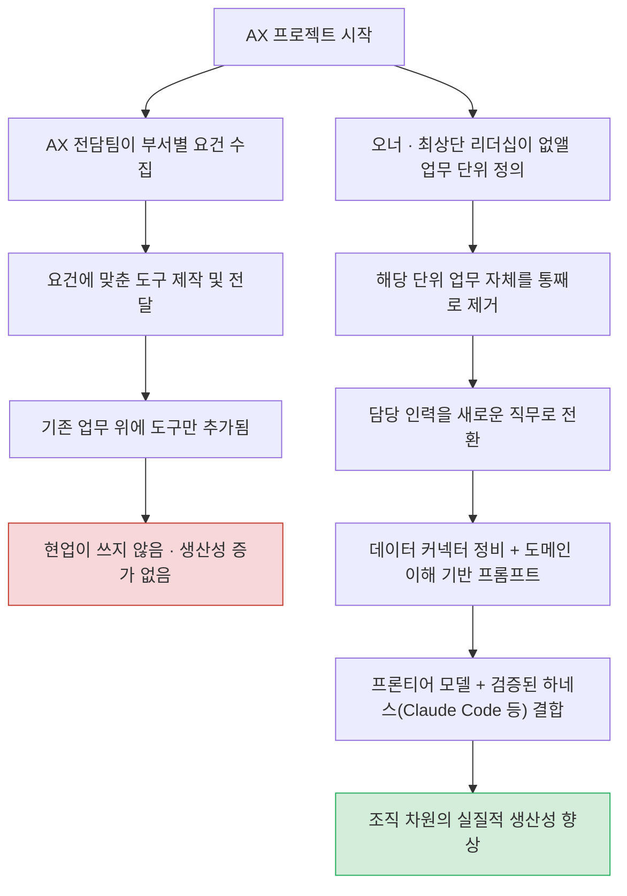
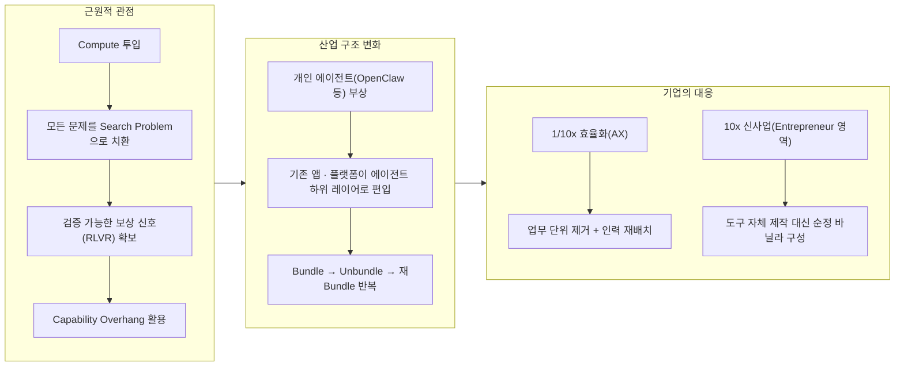

- 원본: AI Frontier 팟캐스트 EP91, 2026년 3월 21일 공개, 출연 노정석·최승준, 러닝타임 1시간 16분 56초
- 원본 링크: https://youtu.be/FPYOVt2B5EM
- 전사본: https://aifrontier.kr/ko/episodes/ep91
- 참고 인사이트: SH Consulting, 「AX 프로젝트는 왜 실패하는가 — 팀을 돕지 말고 업무를 없애라」, 2026년 6월 10일, https://shconsulting.ai/insights/ax-remove-not-assist

## 관련글

[**EP 91. 26년 1Q 비즈니스 관점에서의 AI**](https://k82022603.github.io/posts/ep-91.-26%EB%85%84-1q-%EB%B9%84%EC%A6%88%EB%8B%88%EC%8A%A4-%EA%B4%80%EC%A0%90%EC%97%90%EC%84%9C%EC%9D%98-ai/)

[**EP 91 핵심 주제 심층 분석**](https://k82022603.github.io/posts/ep-91-%ED%95%B5%EC%8B%AC-%EC%A3%BC%EC%A0%9C-%EC%8B%AC%EC%B8%B5-%EB%B6%84%EC%84%9D/)

---

## 목차

1. 들어가며: 이 콘텐츠는 무엇을 다루는가
2. 출발점: OpenClaw Seoul 밋업과 개인 하네스 실험
3. AI 게임의 근원적 관점 — 모든 문제는 서치 프라블럼이다
4. 진화 알고리즘으로 본 랄프 루프
5. 2026년 3월 AI 산업 스냅샷
6. 비즈니스 지형의 변화 — 번들·언번들 프레임워크
7. 기존 사업자의 위기와 적응 경쟁의 시대
8. 1/10x 효율화와 10x 신사업, 두 갈래의 AI 투자
9. AX가 실패하는 이유, 성공하는 AX의 조건
10. 새로운 인재상 — 왜 사업가 기질인가
11. 에이전트 보안 — 프롬프트 인젝션과 격리 운영
12. 결론 — 요트 경기의 은유와 남는 질문들
13. 화자 소개 및 출처

---

## 1. 들어가며: 이 콘텐츠는 무엇을 다루는가

이 문서가 정리하는 원본은 노정석 비팩토리 대표와 AI 전문가 최승준이 진행하는 유튜브 팟캐스트 AI Frontier의 91번째 에피소드입니다. 두 사람은 2025년 초부터 인공지능 기술과 산업의 흐름을 매주 또는 격주로 짚어온 시리즈를 이어오고 있으며, 이번 회차는 그동안 기술 자체에 집중하던 논의에서 벗어나 비즈니스 관점으로 초점을 옮긴 것이 특징입니다. 녹화일은 2026년 3월 21일 토요일 아침이며, 노정석 대표는 이번 에피소드가 지난 몇 달간 쌓인 변화와 인사이트를 정리하는 자리라고 설명하며 문을 엽니다.

노정석 대표는 카이스트 재학 시절 해킹 동아리 활동으로 화제를 모은 뒤 1997년 보안업체 인젠을 공동창업해 코스닥에 상장시켰고, 이후 VR 스타트업 리얼리티 리플렉션을 거쳐 현재는 AI 기반 화장품 회사 비팩토리를 운영하고 있습니다. 스킨케어 브랜드 킵과 색조 브랜드 아멜리를 보유한 비팩토리는 노 대표가 4년 넘게 AI를 실제 사업에 접목해 온 실험장이며, 이 에피소드에서 언급되는 대부분의 비즈니스 통찰은 이 실전 경험에서 나온 것입니다. 최승준은 AI 프롬프트와 에이전트 활용 분야의 전문가로, 노정석 대표와 함께 매 에피소드에서 최신 기술 동향을 실무자 시각으로 검증하는 역할을 맡고 있습니다.

이 에피소드가 특히 주목할 만한 이유는 두 가지입니다. 하나는 노정석 대표가 처음으로 자신이 4년간 AI 사업을 운영하며 겪은 실패와 성공을 종합해 하나의 결론으로 압축해 냈다는 점이고, 다른 하나는 그 결론이 상당히 반직관적이라는 점입니다. 도구를 잘 만드는 것이 답이 아니라 오히려 안 만드는 것이 답이었고, AX를 잘하려면 팀을 도와주는 것이 아니라 팀의 업무 자체를 없애야 한다는 식의 결론들이 이어집니다. 아래에서는 원본의 챕터 순서를 따라가며 각 논의를 상세하게 풀어 설명합니다.

---

## 2. 출발점: OpenClaw Seoul 밋업과 개인 하네스 실험

에피소드는 두 사람이 일주일 전 참석한 OpenClaw Seoul 밋업 후기로 시작합니다. 이 밋업은 서울 소재 스튜디오 Scionic의 새 사무실 지하 세미나 공간에서 열렸으며, 해시드의 김서준 대표를 비롯해 Oh-My-OpenCode, Oh-My-Claude-Code, Oh-My-Codex 등 여러 오픈소스 AI 코딩 하네스를 만든 젊은 개발자들이 발표자로 나섰습니다. 노정석 대표는 이 자리에서 만난 개발자들을 애정을 담아 "젊은 신선들"이라고 부르는데, 이들의 방법론이 기존에 자신이 알던 것과 크게 달라 스스로 많은 것을 다시 배우고 버리는(unlearn) 계기가 되었다고 말합니다.

특히 인상 깊었던 발표는 허예찬 씨의 것으로, 그는 자신이 운영하는 여러 AI 코딩 하네스들을 "가재 가족"이라는 이름으로 관리하고 있었습니다. 이 하네스들은 역할을 나눠 맡은 하나의 조직이 아니라 사실상 작은 AI 회사처럼 작동하는데, 최상위 메타 레이어가 작업을 하위 레이어로 계속 넘기고(cascade), 작업이 끝나면 다시 위로 보고가 올라오며, 안정된 워크플로우는 완전 자동으로 돌아가는 구조로 설계되어 있었습니다. 목표를 설정하면 인간이 직접 문제를 푸는 대신 AI가 토큰과 연산을 투입해 스스로 문제를 풀게 만드는 방식이 이 밋업에 모인 개발자들의 공통된 접근법이었습니다.

이 경험에 자극받은 노정석 대표는 주말 동안 자신만의 하네스를 직접 구축했고, 이를 "체덱스(Chedex)"라 이름 붙였습니다. 그는 이 과정에서 얻은 원칙을 다음과 같이 정리합니다. 방향과 목표를 정하는 초기 단계에서는 인간이 AI와 계속 대화를 주고받는 human-in-the-loop 방식이 중요하지만, 목표가 어느 정도 명확해지면 그 다음부터는 이른바 "랄프 루프(Ralph loop)"를 여러 차례 반복시켜 불필요한 요소를 걸러내고 결과를 정제해 나가는 방식이 효과적이라는 것입니다. 최승준은 이런 흐름이 YC의 게리 탄이 만든 "gstack" 같은 사례에서 보듯 여러 스타트업 대표들 사이에서 하나의 유행처럼 번지고 있다고 짚었고, 노정석 대표 역시 각자가 만든 하네스를 그대로 가져다 쓰기보다는 자신만의 관점으로 다시 깎아 쓰는 경우가 많아 당분간 이 흐름이 이어질 것이라 전망했습니다.

이 챕터의 후반부에서는 다소 개인적인 에피소드도 소개됩니다. 노정석 대표는 건강검진에서 조영제 알레르기로 심한 면역 반응을 겪은 뒤 며칠간 요양했는데, 그 기간 동안 GPT-5.4와 몇 시간씩 대화하며 자신의 증상과 원인을 상세히 분석했다고 말합니다. 그는 이 경험을 통해 AI가 아무리 발전해도 결국 인간은 몸을 가진 존재라는 사실을 다시 확인했다고 언급하며, 동시에 이 사건이 자신이 시작했던 브랜드의 본래 비전, 즉 사람이 더 건강하고 아름답게 오래 사는 것을 돕는다는 초심으로 돌아가는 계기가 되었다고 밝힙니다. 이어 엔비디아 GTC 키노트에서 젠슨 황이 말한 "일의 미래"에 대한 짧은 언급이 나오며 논의는 본격적인 산업 분석으로 넘어갑니다.

---

## 3. AI 게임의 근원적 관점 — 모든 문제는 서치 프라블럼이다

노정석 대표는 비즈니스 이야기로 들어가기에 앞서 하나의 근원적인 관점을 먼저 세워야 한다고 말합니다. 그가 제시하는 이 관점은 이번 에피소드 전체를 관통하는 핵심 개념이자, 그 자신이 "오늘 이야기 중 가장 중요한 슬라이드"라고 표현한 부분이기도 합니다.

핵심 주장은 이렇습니다. 지금 AI 산업에서 일어나는 모든 일은 결국 연산 자원(compute)을 투입해 모든 문제를 하나의 탐색 문제, 즉 서치 프라블럼(search problem)으로 바꾸어 버리는 과정으로 요약할 수 있다는 것입니다. 어떤 도메인이든 인간이 아직 가보지 못한 해법의 영역(solution space)이 존재하는데, 여기에 막대한 연산 자원을 투입해 가능한 해법들을 모두 탐색하고, 맞으면 정답으로 기록하고 틀리면 걸러내는 과정을 반복하면 결국 그 도메인에 대한 지식의 지도(manifold)가 만들어지고, 이 지도가 다시 모델에 학습되어 모델이 해당 분야에 대한 지식을 갖추게 된다는 논리입니다.

이 과정에서 결정적으로 중요한 것은 검증 가능한 보상 신호를 만들어낼 수 있는 환경이 있느냐 없느냐입니다. 이는 최근 프론티어 AI 랩들의 핵심 경쟁 축으로 언급되는 RLVR(Reinforcement Learning with Verifiable Rewards, 검증 가능한 보상을 통한 강화학습)과 정확히 같은 개념입니다. 초기 RLVR은 수학과 코딩처럼 정답을 검증하기 쉬운 영역에서 주로 쓰였지만, 지금은 의료, 법무, 화학, 생물학, 물리학 등 훨씬 넓은 일반 영역으로 확장되고 있습니다. 노정석 대표는 이를 스도쿠 문제에 비유합니다. 문제를 푸는 과정은 어렵지만 풀어놓은 답이 맞는지 확인하는 것은 쉬운데, 이런 성질을 가진 영역이라면 원리적으로 모두 AI가 스스로 학습해 나갈 수 있다는 것입니다.

같은 맥락에서 언급된 것이 컴퓨터 사용 에이전트(CUA, Computer Use Agent)입니다. GPT-5.4에서 강화된 이 기능 역시 컴퓨터 조작 환경 자체를 하나의 검증 가능한 보상 환경으로 만들어, 원하는 결과가 나오면 맞았다는 신호를, 그렇지 않으면 틀렸다는 신호를 주는 방식으로 모델이 macOS나 Windows 같은 익숙한 운영체제와 애플리케이션을 다루는 능력을 학습한 결과라는 설명입니다.

여기서 한 걸음 더 나아가 두 사람은 디지털 공간에서는 만들 수 없는 보상 환경을 물리적으로 구축한 사례로 소재공학 스타트업 Periodic Labs를 언급합니다. 이 회사는 특정 재료가 초전도체 성질을 갖는지를 로봇이 제어하는 실험실에서 직접 검증하고, 그 결과를 다시 모델 학습에 피드백함으로써 디지털 세계와 물리적 세계를 결합한 독자적인 해자(moat)를 구축하고 있습니다. 노정석 대표는 이런 사례가 앞으로 새로운 기업들이 갖춰야 할 경쟁 우위의 대표적인 모범 예시라고 평가합니다.

이 모든 논의를 한 문장으로 압축하면, 지금 일어나고 있는 일은 연산력을 투입해 모든 문제를 탐색 문제로 치환하는 과정이며, 관건은 언제나 검증 불가능한 것(non-verifiable)을 검증 가능한 것(verifiable)으로 바꿀 수 있는 환경을 가졌는가 여부로 귀결된다는 것입니다.

이 개념을 뒷받침하는 또 하나의 핵심 아이디어가 "capability overhang"입니다. 많은 사람들이 암묵지의 영역, 즉 말로 표현하기 어려운 경험적 지식의 영역은 AI가 절대 넘어설 수 없다고 이야기하지만, 노정석 대표는 실제로는 모델이 이미 갖고 있는 능력을 인간이 아직 다 꺼내 쓰지 못하고 있을 뿐이라고 주장합니다. 그는 이를 뒷받침하는 사례로 자신이 직접 진행한 실험을 소개합니다. 한 회사에서 그 회사만 알고 있다고 여겨지는 완전히 독점적인 정보 세 가지를 GPT-5.4에 질문해 본 결과, 모델이 이미 그 내용을 대부분 알고 있었다는 것입니다. 이 경험을 계기로 그는 정보를 감추고 보호하려는 태도보다, capability overhang을 가진 모델에 자신의 데이터를 적극적으로 제공해 모델이 가진 더 넓은 탐색 공간을 끌어오는 쪽이 더 이득이라는 결론에 이르렀다고 말합니다.

Claude Code를 만든 Boris Cherny의 발언, 즉 가장 일반적인 능력을 가진 모델이 결국 가장 특정한 문제도 가장 잘 푼다는 관점 역시 같은 맥락에서 인용됩니다. 특정 도메인의 문제를 억지로 잘 풀게 만들려 하기보다, 모델의 일반적인 문제 해결 능력 자체가 올라가면 특정 도메인의 난제는 저절로 풀리는 경우가 많다는 것이며, 지금 당장 풀리지 않는 문제가 있다면 몇 개월 뒤 더 강력해진 모델이 자연스럽게 해결해 줄 것이라는 낙관적 전망으로 이어집니다.

---

## 4. 진화 알고리즘으로 본 랄프 루프

두 사람은 이 서치 프라블럼 개념을 딥러닝의 근본 원리와 연결 짓습니다. 딥러닝 학습 과정 자체가, 손실 함수 값을 낮춘다는 명확한 목표를 두고 평가 지표가 계속 낮아지도록 막대한 연산을 투입해 최적화하는 과정이라는 것입니다. 경사하강법(gradient descent) 같은 핵심 알고리즘은 코드로 짜면 스무 줄 안팎에 불과할 정도로 단순하지만, 여기에 충분한 연산을 투입하면 해법이 스스로 찾아진다는 점에서 이 원리는 진화 알고리즘과 본질적으로 동일한 구조를 갖습니다.

이 원리가 지금 AI 업계에서 유행하는 "랄프 루프(Ralph loop)"라는 작업 방식에도 그대로 적용됩니다. 목표 명세, 즉 스펙을 명확히 하는 데 초기 시간을 충분히 쓰고 나면, 그 목표에 따라 평가 지표는 사실상 모델이 스스로 정할 수 있게 됩니다. 이후에는 평가 지표를 만족할 때까지 같은 작업을 무한히 반복시키고, 마지막에 검증 절차를 걸어 통과하지 못하면 다시 처음으로 돌려보내는 방식입니다. 노정석 대표는 이를 인간 조직의 결재 구조에 빗대어 "메타 캐스케이딩(meta cascading)"이라 부릅니다. 대표이사가 정제된 최종 보고서만 받아보는 동안 그 아래 조직에서는 "다시 해와, 다시 해와"라는 지시가 반복되며 사실상 같은 형태의 검증 루프가 계속 아래로 전달되는 구조와 다르지 않다는 것입니다. 이 지점에서 그는 지금의 회사 조직을 이 방법론으로 완전히 대체하는 것도 원리적으로 가능하다고 언급합니다.

이 대화에서 최승준은 흥미로운 연결을 하나 제시합니다. 같은 밋업에서 나온 "가재 무덤"이라는 표현, 즉 목표를 달성하지 못한 작업 명세 파일들이 다음 세대로 이어지지 못하고 버려지는 현상이 사실상 유전 알고리즘(genetic algorithm)의 적자생존 구조와 동일하다는 것입니다. 좋은 결과는 교차(crossover)되고 가끔 돌연변이가 발생하는 고전적인 진화 알고리즘의 틀이 지금의 AI 작업 방식락에도 그대로 나타나고 있다는 관찰입니다.

또한 두 사람은 하네스와 모델의 관계를 뱀이 자신의 꼬리를 삼키는 모습에 빗댄 우로보로스(Ouroboros) 구조로 설명합니다. 모델이 좋아지면 그 모델에 맞춰 더 나은 하네스가 만들어지고, 좋은 하네스에서 나온 데이터로 다시 모델이 학습되어 더 강력해지며, 강력해진 모델의 기능 일부는 결국 하네스가 하던 역할을 흡수해버립니다. 그런데 모델이 더 강력해지면 그 모델을 활용하는 또 다른 새로운 하네스가 다시 등장하는 식으로, 이 과정이 정반합의 형태로 끝없이 반복된다는 것입니다. 노정석 대표는 이 흐름을 지켜보며 경외감과 두려움을 동시에 느낀다고 표현하는데, 결론적으로 이 루프를 이해하고 자신의 사업을 이 흐름 위에 올려놓는 쪽이 이득을 얻고, 이해하지 못하는 쪽은 이를 활용하는 사람에게 대체될 것이라는 강한 메시지로 이 챕터를 마무리합니다.

---

## 5. 2026년 3월 AI 산업 스냅샷

본격적인 비즈니스 논의에 앞서 두 사람은 2026년 3월 시점의 산업 현황을 짧게 짚습니다. 노정석 대표는 최근 AI 모델의 발전 속도가 워낙 빨라서 새 벤치마크가 나와도 사람들이 이제 벤치마크 수치 자체보다는 "나보다 낫다"는 체감으로 평가하는 시대가 됐다고 말합니다. 그는 GPT-5.4를 실무에 사용하면서 이전만큼 실망하는 경우가 눈에 띄게 줄었다는 개인적 평가도 덧붙입니다.

프리트레이닝(pre-train) 영역에 대해서는, 이미 승부가 어느 정도 굳어진 게임으로 보고 있다고 말합니다. 근거로 든 사례는 Xiaomi가 발표한 1조 파라미터급 프론티어 모델 MiMo V2 Pro입니다. 이 모델의 개발을 이끈 인물이 DeepSeek R1 개발에 참여했던 연구자로, 인프라를 제대로 갖추고 방법을 알면 약 1년의 격차만으로 프론티어급 모델을 따라잡을 수 있다는 취지의 발언을 했다고 소개합니다. 이는 연산 비용이 계속 낮아지는 추세와 맞물려, 과거처럼 수천억 원대 자원이 있어야만 도전할 수 있던 영역의 진입장벽이 계속 낮아지고 있다는 근거로 제시됩니다. 엔비디아 역시 Nemotron 계열 모델의 트레이닝 코드와 레시피, 데이터셋을 시차를 두고 공개하며 이런 흐름을 뒷받침하고 있다고 언급됩니다.

Frontier Lab들 간의 경쟁 축이 이제는 RL 환경 자체의 스케일링, 즉 RLVR로 옮겨갔다는 점도 다시 한 번 강조됩니다. 이 대화에서 나온 표현 중 하나가 이제 거의 모든 산업이 프론티어 모델을 미터 단위로 판매하는 "토큰 사업자"가 되어가고 있다는 진단입니다. 과거에는 OpenAI만 이런 강점을 독점하는 듯했지만, 지금은 중국계 프론티어 모델들과 엔비디아 스스로가 이 우위를 상품화(commoditize)하려는 움직임을 보이면서, 누가 우군이고 누가 경쟁자인지 구분하기 어려운 이른바 "프레너미(frenemy)" 환경이 만들어지고 있다는 관찰도 제시됩니다.

이 대화에서 언급된 젠슨 황의 "AI 5개 레이어 케이크" 비유도 소개할 만합니다. 에너지, 반도체, 인프라스트럭처, 모델, 애플리케이션 순으로 층이 쌓이는데, 여기서 말하는 애플리케이션은 기존의 웹이나 모바일 앱과는 전혀 다른 성격의 에이전트 애플리케이션이라는 점이 이 에피소드 후반부 논의의 중요한 전제가 됩니다.

---

## 6. 비즈니스 지형의 변화 — 번들·언번들 프레임워크

이 에피소드의 가장 핵심적인 산업 분석 프레임은 번들링(bundling)과 언번들링(unbundling)의 반복 구조입니다. 노정석 대표는 이 개념을 가장 잘 설명하는 인물로 벤처캐피털 a16z의 애널리스트 베네딕트 에반스(Benedict Evans)를 꼽습니다. 실제로 에반스는 2026년 5월 발표한 「AI eats the world」 리포트에서, 생성형 AI가 10년에서 15년 주기로 일어나는 대규모 플랫폼 전환을 촉발하고 있으며 그 최종 형태는 아직 불확실하다고 진단한 바 있습니다. a16z가 과거 "소프트웨어가 세상을 삼킨다(Software is eating the world)"는 표현으로 유명했다면, 지금은 이를 "AI가 세상을 삼킨다"는 문구로 새롭게 밀고 있다는 설명입니다.

번들·언번들 구조의 핵심은 이렇습니다. 매체가 바뀔 때마다, 즉 종이에서 텔레비전으로, 텔레비전에서 인터넷으로, 인터넷에서 모바일로, 그리고 이제 모바일에서 AI로 유통 채널(distribution layer)이 바뀔 때마다 산업의 판이 한 번씩 뒤집힙니다. 특정 매체를 장악한 사업자는 자신이 만든 틀로 콘텐츠와 서비스를 묶어(bundle) 고객에게 제공하며 그 과정에서 마진을 만들어내지만, 시간이 지나 새로운 유통 채널이 등장하면 그 묶음이 다시 풀리는(unbundle) 과정이 반복됩니다. 그리고 그 풀린 영역에서 다시 새로운 승자가 등장하면 그 승자가 지배력을 바탕으로 재차 번들링을 시도하는, 다양화(diversification)와 선택(selection)과 증폭(amplification)이 끝없이 순환하는 구조라는 것입니다. 이는 앞서 설명한 진화 알고리즘의 구조와 정확히 같은 패턴입니다.

노정석 대표는 이 프레임을 빌려 지금까지 등장한 대부분의 B2B SaaS 애플리케이션이 사실상 오라클과 엑셀을 각 용도에 맞게 잘게 풀어놓은 결과물이라는 에반스의 관점을 소개하고, AI 시대에는 거의 모든 서비스가 결국 ChatGPT를 다시 풀어헤친 결과물이 될 것이라는 전망을 덧붙입니다. 실제로 ChatGPT가 초창기에는 코딩과 리서치와 법무 상담까지 한 번에 처리했지만, 지금은 컨텍스트 엔지니어링이나 특화 하네스, 특화 모델 등으로 다시 세분화되는 흐름이 나타나고 있다는 것입니다.

---

## 7. 기존 사업자의 위기와 적응 경쟁의 시대

이 챕터에서 다뤄지는 핵심 주제는 개인 에이전트의 부상이 기존 플랫폼 사업자에게 어떤 위협이 되는가입니다. OpenClaw라는 오픈소스 에이전트 프레임워크가 등장하기 전까지는 ChatGPT, Claude, Gemini 같은 거대 대화형 AI가 과거 네이버나 구글처럼 새로운 관문(게이트웨이) 역할을 할 것이라는 전망이 지배적이었습니다. 그러나 노정석 대표는 실제로 OpenClaw 같은 도구를 써본 뒤 생각이 조금 바뀌었다고 말합니다. 자동차를 고를 때 사람마다 취향과 용도에 따라 완전히 다른 차종을 선택하듯, 정보에 접근하는 최상단 관문 역시 몇 개의 익숙한 채널로 통일되기보다 각자의 취향에 맞는 개인 에이전트로 완전히 분화할 가능성이 있다는 것입니다.

이 관찰을 뒷받침하는 근거로, 그는 오픈AI 샘 알트먼의 발언 뉘앙스가 몇 달 사이 눈에 띄게 달라졌다는 점을 언급합니다. 2025년 10월경에는 향후 몇 년 안에 AI 연구 인턴과 AI 리서처를 만들어 구글과 같은 풀스택 서비스 회사가 되겠다는 매우 공격적인 비전을 제시했지만, 이후 몇 달 사이 그 어조가 한층 겸손해졌다는 것입니다. 이는 Anthropic을 비롯한 경쟁자들의 부상과 무관하지 않다는 관찰도 곁들여집니다.

구체적인 사례로 소개되는 것이 OpenClaw Seoul 밋업에서 시몬(Simon)이라는 개발자가 시연한 "OMO.BOT"이라는 에이전트 애플리케이션입니다. 이 도구는 배달 앱에서 음식을 주문하거나 생수를 구매하거나 택시를 부르는 등, 사용자가 평소 여러 앱을 오가며 처리하던 번거로운 작업들을 하나의 비서 인터페이스 안에서 대신 처리해 줍니다. API가 열려 있는 서비스는 API로 연결하고, 그렇지 않은 서비스는 컴퓨터 사용 에이전트(CUA) 방식으로 화면을 직접 조작해 에뮬레이션하는 방식이었다고 설명됩니다.

노정석 대표는 이 시연을 보고 앞으로 우리가 알던 거의 모든 앱이 에이전트가 대신 조작해주는 하나의 레이어 아래로 파묻히게 될 가능성을 진지하게 봐야 한다고 강조합니다. 배달, 검색, 메신저, 이커머스 등 각 영역에서 매체력을 쌓아 올린 기존 플랫폼 사업자들의 수익 구조는, 사실상 고객과 공급자 사이에 끼어들어 발생시키는 여러 형태의 마찰(friction), 즉 정해진 사용 흐름과 그 사이에 배치된 광고 및 교차판매 지점에서 만들어지는 것이었습니다. 그런데 에이전트가 이 마찰들을 훨씬 빠르게 없애버리기 시작하면, 기존 플랫폼은 사용자와 직접 대면하는 접점을 잃고 다른 에이전트가 호출하는 하나의 함수(function call) 수준으로 전락할 위험이 있다는 진단입니다.

그는 이 상황에서 기존 사업자가 크롤러 차단 같은 방식으로 에이전트의 접근을 막으려 해도 사실상 효과가 없을 것이라고 봅니다. 사람이 자신의 계정으로 로그인한 뒤 에이전트가 그 화면을 대신 조작하는 방식이라면 이를 봇 트래픽으로 구분해 낼 근거가 마땅치 않기 때문입니다. 젠슨 황이 이번 GTC에서 모든 비즈니스와 개인이 "OpenClaw 대응 준비가 되어 있는가(Are you OpenClaw ready?)"를 물어야 한다고 언급한 것도 이런 흐름을 뒷받침하는 사례로 제시됩니다.

이 논의는 노정석 대표가 스타트업 사업 계획을 평가할 때 즐겨 쓴다는 세 가지 경기 은유로 이어집니다. 자동차 경기는 결국 자본력이 승부를 가르는 게임이고, 자전거 경기는 노력과 눈치의 게임이지만, 요트 경기는 조금 다릅니다. 자동차나 자전거 경기에서는 선두 주자가 흐름을 이끌고 후발 주자들이 그에 반응하는 구조이지만, 요트 경기에서는 후발 주자가 바람의 방향을 먼저 읽고 방향을 틀면 오히려 앞서가던 선두 주자들까지 방향을 바꿔야 합니다. 실력보다 지금 밖에서 어떤 바람이 불고 있는지를 읽는 것이 더 중요하다는 것이며, 노정석 대표는 지금의 AI 흐름이 바로 이 요트 경기의 바람과 같다고 평가합니다.

---

## 8. 1/10x 효율화와 10x 신사업, 두 갈래의 AI 투자

이 에피소드의 실무적으로 가장 중요한 프레임 중 하나가 AI 투자를 바라보는 두 가지 방향입니다. 노정석 대표는 이 틀을 자사 엔지니어 한 명이 제시했던 아이디어에서 가져왔다고 밝힙니다. 원래는 1/5와 5배라는 숫자로 표현했지만 최근에는 10이라는 숫자가 더 익숙하게 쓰이고 있어 1/10x와 10x라는 표현으로 정리했다고 설명합니다.

첫 번째 방향은 기존에 100의 비용과 시간이 들던 업무를 AI로 10 수준까지 줄여 90만큼의 효율을 만들어내는 것입니다. 이는 비즈니스 용어로 하면 더 낫고, 더 빠르고, 더 저렴하게(better, faster, cheaper) 만드는 전형적인 효율화 작업이며, 지금 대부분의 기업이 추진하는 AI Transformation, 즉 AX가 여기에 해당한다고 진단합니다. 두 번째 방향은 기존에 없던 900의 가치를 완전히 새롭게 만들어내는 것으로, 이는 제로에서 하나를 만드는 혁신(zero to one)에 가까우며, 아직 본격적으로 시작되지 않은 영역이라고 평가합니다.

이 논의를 뒷받침하는 근거로 최근 화제가 된 이른바 "10x 변호사(10x lawyer)"에 관한 글이 언급됩니다. 요지는 법률 회사처럼 파트너, 시니어, 주니어가 팀으로 움직이며 시간 단위로 요금을 청구하는 조직에서, 시니어급 실력을 가진 변호사 한 명이 AI 에이전트와 결합하면 훨씬 저렴하고 빠르게 고객을 만족시킬 수 있게 되고, 이는 결국 팀 단위 비즈니스 모델 자체를 언번들링시킨다는 내용입니다. 노정석 대표는 이 현상이 변호사뿐 아니라 엔지니어, 의사 등 다른 전문직 영역에서도 동일하게 나타날 수 있으며, 강화된 소수의 인재가 시장의 균형을 되돌릴 수 없는 방향으로 흔들어놓을 것이라고 전망합니다. 아울러 그는 여러 회사에서 다양한 배경을 가진 사람들을 겪어본 경험을 바탕으로, 사람을 모아놓으면 어떤 조직에서도 결국 실력의 정규분포가 형성된다는 관찰을 덧붙이며, AX를 추진할 때는 변화에 날카롭게 적응하려는 소수의 인력과 함께 빠르게 나아가야지 모든 구성원을 다 데려가려 해서는 안 된다는 입장을 밝힙니다.

1/10x 효율화와 10x 신사업 사이의 관계에 대한 질문에는, 두 목표의 성격 자체가 다르다는 답이 돌아옵니다. 효율화는 목표와 평가 지표를 비교적 명확하게 설정할 수 있는 영역인 반면, 완전히 새로운 사업을 만드는 일은 애초에 명확한 목표와 평가 지표가 존재하지 않는 영역이라는 것입니다. 아무리 효율을 극대화해도 그 힘만으로는 후자의 영역으로 건너뛸 수 없으며, 이 영역에서는 해당 도메인을 깊이 이해한 사업가의 의지와 판단이 가장 중요한 변수로 남는다고 결론짓습니다.

---

## 9. AX가 실패하는 이유, 성공하는 AX의 조건

이 에피소드에서 가장 실무적인 논의는 후반부의 AX(AI Transformation) 부분입니다. 노정석 대표는 자신이 운영하는 회사와 컨설팅에 참여한 몇몇 조직에서 AX를 직접 추진해 본 경험을 바탕으로 매우 구체적인 실패 패턴을 지적합니다.

가장 흔한 실패 패턴은 이렇습니다. 회사가 AX 전담팀을 꾸리고, 그 팀이 여러 부서를 돌며 업무 요건을 수집한 뒤, 받아온 요건에 맞춰 도구를 만들어 전달하는 방식입니다. 겉보기에는 합리적인 절차처럼 보이지만, 현업 부서가 만들어진 도구를 실제로 쓰지 않는 경우가 대부분이라고 지적합니다. 이유는 조직의 인센티브 구조에 있습니다. AI가 특정 업무 하나를 없애주면 이론적으로는 그 시간만큼 더 생산적인 다른 업무로 이동해야 하지만, 실제로는 그렇게 되지 않는 경우가 훨씬 많다는 것입니다. 지금의 자리에 오르기까지 힘겹게 익힌 엑셀과 파워포인트 단축키, 익숙한 업무 방식이 스스로의 존재 증명과도 같은 사람에게, 그 일을 그만두라는 요구는 반가운 일이 아니기 때문입니다. 결국 도구를 얹어줘도 익숙한 작업 방식이 조금 다른 도구로 대체되는 데 그치고, 조직 전체의 생산성 향상으로는 이어지지 않는다는 것이 그의 진단입니다.

이에 대한 대안으로 그가 제시하는 원칙은 명확합니다. 성공하는 AX는 "저 팀을 도와주세요"가 아니라 "저 팀의 단위 업무를 통째로 없애세요"라는 지시에서 출발해야 한다는 것입니다. 그는 이것이 해고를 의미하는 것이 아니라고 분명히 강조합니다. 업무 단위 자체를 온전히 제거하고, 그 업무를 담당하던 사람을 새로운 직무로 전환시키는 설계가 필요하다는 뜻입니다. 기존 업무 위에 도구를 얹어주는 접근은 결국 사용하던 소프트웨어를 다른 소프트웨어로 바꿔주는 것에 지나지 않으며, 회사 차원의 의미 있는 생산성 증가로 이어지지 않는다고 재차 강조합니다. 이런 결단은 조직 내부의 저항이 크기 때문에 최상단 리더십, 즉 오너 수준의 명확한 이해와 의지가 있어야 실행 가능하다는 점도 함께 짚습니다.

또 하나 반직관적인 결론은 도구를 직접 만들지 않는 것이 최선이라는 부분입니다. 노정석 대표는 자신의 회사에서 다양한 프레임워크와 자체 에이전트 조합을 시도해 본 결과를 소개합니다. Pydantic, LangChain 등 여러 도구를 각자 자유롭게 시도하도록 허용하며 실험을 거듭한 끝에, 결국 가장 뛰어난 성능을 낸 것은 데이터 커넥터를 깔끔하게 구축하고, 프론티어 모델에 Claude Code나 Codex 같은 이미 검증된 하네스를 그대로 붙이는 단순한 구성이었다고 밝힙니다. 이 결론에 도달한 자사 엔지니어의 논리는, 어차피 궁극적으로는 최고의 하네스와 최고의 모델을 쓰는 것이 답이므로 굳이 별도의 하네스를 새로 만들 필요가 없다는 것이었습니다. 대신 그 시간을 데이터를 설명하는 프롬프트를 정교하게 다듬고, 회사가 달성해야 할 목표를 프롬프트로 정확하게 기술하는 데 쏟았다고 합니다.

여기서 강조되는 중요한 통찰은, 프롬프트를 잘 쓰는 힘이 엔지니어링 역량에서 나오는 것이 아니라 도메인에 대한 이해에서 나온다는 점입니다. 업무가 실제로 어떻게 돌아가는지, 데이터가 어떤 형태로 존재하는지를 아는 사람이 쓴 프롬프트가 실질적으로 일을 끝낸다는 것이며, 노정석 대표는 이 결론에 도달하기까지 들인 시간과 노력을 돌아보며 다소 허탈한 감정을 내비치기도 합니다. 그럼에도 그는 그 과정에서 쌓인 수많은 시행착오와 예외 상황에 대한 이해가 자신만의 자산으로 남았다는 점에서 의미를 찾는다고 덧붙입니다.

이러한 결론은 이후 SH Consulting이 발행한 인사이트 글 「AX 프로젝트는 왜 실패하는가 — 팀을 돕지 말고 업무를 없애라」에서도 그대로 인용되며 정리된 바 있습니다. 해당 글은 이 팟캐스트 회차를 듣고 정리한 것임을 명시하고 있으며, AX 컨설팅에서 도구 제작보다 먼저 점검해야 할 것은 어떤 업무 단위를 통째로 없앨 수 있는지, 그리고 그 업무를 하던 사람을 어디로 전환할 것인지 이 두 가지라고 요약하고 있습니다. 이 설계 없이 도구만 공급하는 AX는 예산은 쓰지만 조직을 실질적으로 바꾸지 못한다는 것이 이 글의 결론입니다.

아래는 이 챕터에서 다룬 AX의 실패 패턴과 성공 조건을 하나의 흐름으로 정리한 도식입니다.

---

## 10. 새로운 인재상 — 왜 사업가 기질인가

AX 논의에 이어 두 사람은 조직 재편과 인재상에 대한 이야기로 넘어갑니다. 노정석 대표는 회사가 효율화와 신사업이라는 두 방향을 동시에 추구해야 하는데, 특히 신사업을 만들어낼 수 있는 사람은 여전히 사업가적 감각을 가진 소수라고 말합니다. 이런 사람은 어느 조직에나 존재하며, 이들을 빠르게 찾아 인센티브를 극대화해주고 새로운 영역으로 과감히 보내야 한다는 것이 그의 제안입니다. 반대로 변화보다는 안정을 원하는 구성원에게는 효율화 업무를 맡기는 방식으로 조직을 재편해야 한다고 말합니다.

이 대화에서 인상적인 부분은 노정석 대표가 스스로 던진 디스토피아적 경고입니다. 그는 이런 인재 재편 이후 조직에는 결국 매우 가혹한 하네스가 만들어질 것이라 전망합니다. 변화에 적응하지 못하거나 적응하기를 원치 않는 사람들은 그 하네스 안에 편입되어 훨씬 힘겹게 일하게 될 가능성이 있으며, 인간이 명령하고 AI가 수행하는 구조가 아니라 오히려 AI가 만든 하네스 안으로 인간이 들어가야 하는 형태로 뒤바뀔 확률이 지금은 더 높아 보인다는 것입니다. 최승준은 이 대목에서 일론 머스크의 트위터 인수 초기 대규모 인력 감축에 반감을 표했던 잭 도시가, 정작 최근 자신의 회사에서 수천 명 규모의 감원을 단행한 사례를 언급하며 이런 흐름이 이미 현실에서 나타나고 있음을 짚습니다.

새로운 인재상에 대한 두 사람의 결론은 명확합니다. 단순 반복 업무는 AI가 인간보다 압도적으로 잘 수행하는 시대가 되었기 때문에, 앞으로 조직에서 대체되지 않고 살아남는 사람은 기술적 숙련도가 뛰어난 사람이 아니라 사업가적 기질(entrepreneurship)을 가진 사람이라는 것입니다. 목표가 불분명한 영역에서 스스로 방향을 정의하고, 애매한 상황 속에서도 새로운 가치를 찾아내며, 빠르게 바뀌는 기술 환경 속에서 균형 감각을 발휘해 방향을 전환할 수 있는 사람만이 앞서 설명한 10x 수준의 혁신을 만들어낼 수 있다는 것이 두 사람의 공통된 시각입니다. 노정석 대표는 OpenClaw 밋업에서 만난 젊은 개발자들이 이미 이런 자질을 보여주고 있다며, 이들이 방법론을 익힌 뒤 어떤 사업 영역에 그것을 적용해 나갈지 지켜보는 것이 매우 흥미롭다고 말합니다.

---

## 11. 에이전트 보안 — 프롬프트 인젝션과 격리 운영

논의 후반부에서는 에이전트 활용의 그림자, 즉 보안 문제가 짧지만 진지하게 다뤄집니다. 최승준은 에이전트가 프롬프트 인젝션 공격에 노출될 경우 이중 인증(2FA) 같은 보안 장치조차 우회될 위험이 있다는 우려를 제기합니다. 노정석 대표는 실제로 그럴 가능성이 있다고 인정하며, 에이전트가 이메일을 열람할 수 있는 권한을 가진 이상 이런 우회가 근본적으로 막히기 어려운 문제라는 데 동의합니다.

이런 위험 때문에 노정석 대표는 자신의 개인 노트북에는 OpenClaw를 설치하지 않았다고 밝힙니다. 대신 별도의 가상머신에 리눅스를 새로 설치해 테스트를 진행했고, 어느 정도 신뢰가 쌓인 뒤에는 외부에 마련한 DGX 서버에 OpenClaw 환경을 구축해, 노출되어도 위험이 크지 않은 최소한의 데이터만 제공하며 운용하고 있다고 설명합니다. 그는 이 조치가 개인정보가 모델 학습에 활용되는 것을 꺼려서가 아니라, OpenClaw 같은 자율 에이전트가 스스로 판단해 예상치 못한 행동을 할 수 있다는 점을 우려했기 때문이라고 명확히 구분합니다. 즉 정보를 모델에 제공하는 것 자체는 앞서 설명한 capability overhang 논리에 따라 오히려 이득이라고 보지만, 에이전트가 자율적으로 금융이나 소셜 계정에 접근해 스스로 판단하고 행동하는 것은 아직 다른 차원의 리스크라는 것입니다.

최승준은 여기에 더해 에이전트가 악의적인 지시에 노출되어 사실상 세뇌되듯 오작동할 수 있는 프롬프트 인젝션 문제가 아직 근본적으로 해결되지 않았다는 점을 재차 강조하며, 대형 사업자들 역시 이 문제를 심각하게 고민하고 있을 것이라는 추측을 덧붙입니다. 다만 두 사람은 이런 위험에도 불구하고 자율 에이전트로의 이행 자체는 거스를 수 없는 흐름이라는 데 뜻을 같이합니다. Perplexity를 비롯한 여러 사업자와 엔비디아까지 이 방향으로 움직이고 있는 상황에서, 안 할 수 없는 흐름이라는 것이 노정석 대표의 정리입니다.

---

## 12. 결론 — 요트 경기의 은유와 남는 질문들

에피소드의 마지막 부분에서 노정석 대표는 자신의 발언이 명확하게 2026년 3월 시점의 스냅샷일 뿐이며, 하루에도 생각이 여러 번 바뀔 만큼 이 분야의 변화 속도가 빠르다는 점을 스스로 짚습니다. 실제로 불과 1년 전인 2025년 3~4월만 해도 자신은 Pydantic 기반의 에이전트 개발 도구를 극찬하고 있었고, 최승준 역시 Chrome DevTools Protocol을 이용한 브라우저 에이전트 실험을 막 시작하던 시기였다고 돌아봅니다. 당시에는 거북하게 느껴졌던 완전 자동화 에이전트 코딩이 지금은 당연한 일상이 되었다는 것입니다.

이런 변화의 속도 앞에서 노정석 대표가 내리는 최종적인 태도는 앞서 소개한 요트 경기의 은유로 요약됩니다. 지금의 흐름을 거스르거나 저항하기보다, 방향을 먼저 읽고 앞서가는 젊은 개발자들의 흐름에 적극적으로 올라타야 한다는 것이 그의 결론입니다. 그는 실제로 이런 태도를 바탕으로 OpenClaw Seoul 밋업에서 만난 여러 개발자들과 지속적으로 교류하며 서로의 관점을 배우고 있다고 밝히며 에피소드를 마무리합니다.

이 에피소드 전체를 관통하는 메시지를 정리하면 다음과 같습니다. 첫째, AI 기술의 발전은 결국 연산 자원을 투입해 모든 문제를 탐색 문제로 치환하는 과정이며, 검증 가능한 보상 환경을 갖췄는지가 새로운 경쟁 우위의 핵심이 됩니다. 둘째, 이 원리는 산업 구조에도 그대로 적용되어, 기존 플랫폼이 쌓아온 매체력과 마찰 기반의 수익 구조가 에이전트에 의해 빠르게 해체되는 언번들링이 진행 중입니다. 셋째, 기업의 AI 전환은 도구를 더하는 방식이 아니라 업무 단위 자체를 없애고 인력을 재배치하는 방식으로 접근해야 실질적인 성과로 이어지며, 이때도 자체 도구를 만들기보다 검증된 프론티어 모델과 하네스를 그대로 활용하는 것이 오히려 더 나은 결과를 낸다는 것이 4년간의 실전 경험이 도출한 결론입니다. 넷째, 이런 시대에 살아남는 인재는 기술적 숙련도보다 목표를 스스로 정의하고 모호한 영역에서 가치를 찾아내는 사업가적 기질을 가진 사람이라는 점입니다.

아래는 이 에피소드의 핵심 논리 구조를 하나로 정리한 도식입니다.

---

## 13. 화자 소개 및 출처

**노정석**: 비팩토리(bfactory) 대표. 카이스트 재학 시절 보안업체 인젠을 공동창업해 코스닥에 상장시켰고, VR 스타트업 리얼리티 리플렉션을 거쳐 현재는 AI 기반 화장품 브랜드 킵(KYYB)과 아멜리(AMELI)를 운영하는 비팩토리를 이끌고 있습니다. 4년 넘게 자신의 사업에 AI를 직접 접목해 온 실전 경험을 바탕으로 AI Frontier 팟캐스트에서 최승준과 함께 매 회 산업 동향을 정리하고 있습니다.

**최승준**: AI 프롬프트 및 에이전트 활용 전문가로, AI Frontier 팟캐스트의 공동 진행자입니다.

**주요 출처**
- AI Frontier, EP 91 「26.1Q 비즈니스 관점에서의 AI」, 2026년 3월 21일, https://aifrontier.kr/ko/episodes/ep91
- 유튜브 원본 영상, https://youtu.be/FPYOVt2B5EM
- 발표 자료(PDF), https://aifrontier.kr/episodes/ep91/slides.pdf
- SH Consulting, 「AX 프로젝트는 왜 실패하는가 — 팀을 돕지 말고 업무를 없애라」, 2026년 6월 10일, https://shconsulting.ai/insights/ax-remove-not-assist
- Benedict Evans, 「AI eats the world」, a16z, 2026년 5월 발표 리포트 (번들·언번들 프레임워크 교차 확인)

---

*본 문서는 위 원본 팟캐스트 전사본과 관련 인사이트 글을 바탕으로 핵심 내용을 서술형으로 재구성한 정리 자료입니다. 발언의 정확한 뉘앙스나 세부 맥락이 궁금하신 부분은 반드시 원본 영상과 전사본을 함께 확인하시기 바랍니다.*
