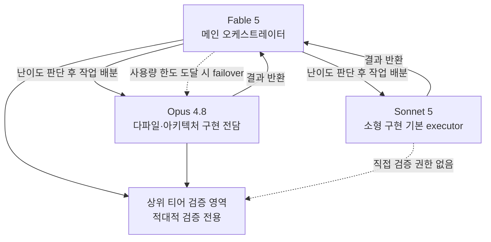

> 
> https://www.facebook.com/share/p/1EnELfyqzc/
> 
> Fable 5 를 메인으로 잡고 Opus 4.8 과 Sonnet 5 의 실행 비율을 다시 잡아 협업 프로세스를 조정하였습니다.
> 
> AI운영체계환경에서는 최고네요.
> 
> 사람이 할 수 없는 것들을  다 잡아내고 먼저 제안까지 하네요.
> 
> 토큰 소비만 협업모델로 잘 조정하면 될 것 같습니다.
> 
> 회사 게이트웨이에서도 Fable 5 반영되면 테스트 해봐야겠습니다.
> 
> 
>

## 목차

1. 원문이 말하는 것 — 게시물 내용 정리
2. 멀티 모델 협업이란 무엇인가
3. 세 모델의 정체 — Sonnet 5, Opus 4.8, Fable 5
4. 왜 하필 지금인가 — Fable 5 수출통제 정지와 복원 타임라인
5. "협업 모델 확정 결과" 뜯어보기 — first-try 지표와 역할 분담의 논리
6. 가격 구조로 본 이 조합의 경제성
7. "회사 게이트웨이"가 의미하는 것
8. 종합 정리와 유의할 지점

---

## 1. 원문이 말하는 것 — 게시물 내용 정리

공유해주신 게시물 원문은 "협업 모델 확정 결과"라는 제목 아래 세 줄의 결론을 담고 있다. 정리하면 다음과 같은 내용이다. 첫째, Sonnet 5는 세 번의 첫 시도에서 모두 성공(first-try 3/3)한 결과를 근거로 소형 구현 작업의 기본 실행 모델로 승격되었으며, 이는 Opus 대비 동일한 품질을 유지하면서 비용은 약 40퍼센트 낮다는 평가를 받았다. 둘째, Opus 4.8은 여러 파일에 걸친 구현이나 아키텍처 설계처럼 난이도가 높은 작업을 전담하며, 누적 네 번의 첫 시도에서 모두 성공(first-try 4/4)했다는 기록을 갖고 있다. 셋째, Fable 5는 이 체계의 메인 모델로 고정되되, 사용량 한도에 도달했을 때는 Opus 4.8로 자동 전환(failover)되는 구조이며, 적대적 검증 — 즉 산출물을 의심하고 재검증하는 작업 — 은 상위 티어 모델만의 영역으로 남겨둔다는 원칙이다.

이어지는 작성자 본인의 코멘트는 이 협업 프로세스를 실제로 자신의 AI 운영 체계 환경에 적용해본 소감이다. 사람이 놓치기 쉬운 부분을 시스템이 먼저 잡아내고 제안까지 한다는 점에서 만족스럽다는 평가를 남겼고, 남은 과제는 토큰 소비를 협업 모델 차원에서 잘 조율하는 것이라고 정리했다. 마지막으로 회사에서 사용하는 게이트웨이에도 Fable 5가 반영되면 그때 다시 테스트해보겠다는 계획을 덧붙였다.

이 수치들 — first-try 3/3, 4/4, 비용 40퍼센트 절감 — 은 작성자 본인 혹은 소속 커뮤니티가 자체적으로 운영하며 기록한 결과이며, Anthropic이나 제3의 기관이 공식적으로 검증한 벤치마크 수치는 아니라는 점을 먼저 밝혀둔다. 이 문서에서는 이 자체 운영 기록을 출발점으로 삼되, 그 판단이 근거로 삼고 있는 세 모델의 실제 스펙과 가격, 그리고 최근 있었던 접근성 이슈는 공식 자료를 통해 교차 확인한 내용으로 채웠다.

## 2. 멀티 모델 협업이란 무엇인가

하나의 작업을 처리할 때 성능이 가장 높은 모델 한 종류만 계속 쓰는 방식과, 작업의 난이도와 성격에 따라 서로 다른 모델에 나누어 맡기는 방식은 비용과 품질 양쪽에서 전혀 다른 결과를 낳는다. 후자의 접근을 흔히 멀티 모델 오케스트레이션이라 부르는데, 핵심 발상은 간단하다. 모든 작업이 최고 성능 모델을 필요로 하지는 않으며, 반대로 일부 작업은 최고 성능 모델이 아니면 실패율이 급격히 올라간다는 것이다. 이 게시물에 묘사된 체계는 바로 이 발상을 세 단계 티어로 구체화한 사례에 해당한다. 메인 오케스트레이터가 작업을 판단해 배분하고, 실행 계층이 난이도별로 나뉘며, 검증은 실행을 맡은 모델 스스로가 아니라 별도의 상위 계층이 담당하는 구조다.

아래 구조도는 게시물에 묘사된 협업 체계를 도식화한 것이다.

여기서 주목할 부분은 두 가지다. 하나는 Fable 5가 평소에는 메인 역할을 하지만, 사용량 한도에 걸리면 Opus 4.8로 자동 전환된다는 failover 설계다. 이는 상위 모델의 사용량 제한이라는 현실적 제약을 감안해 서비스 연속성을 지키려는 조치로 읽힌다. 다른 하나는 검증 권한을 실행 계층에 주지 않는다는 원칙이다. Sonnet 5나 Opus 4.8이 스스로 작업을 마친 뒤 스스로 옳다고 보고하는 것을 그대로 신뢰하지 않고, 별도의 상위 계층이 다시 확인하는 구조를 강제하는 방식이다. 이는 모델의 자체 보고를 그대로 믿지 않고 반드시 별도의 검증 경로를 두어야 한다는 원칙과 맞닿아 있다.

## 3. 세 모델의 정체 — Sonnet 5, Opus 4.8, Fable 5

세 모델 모두 Anthropic이 만든 Claude 계열 모델이며, 성능과 가격이 뚜렷하게 구분된 세 개의 티어를 이룬다. 각 모델의 공식 스펙을 정리하면 다음과 같다.

| 구분 | Claude Sonnet 5 | Claude Opus 4.8 | Claude Fable 5 |
|---|---|---|---|
| 티어 성격 | 균형형(가성비) | 플래그십(고성능) | 최상위 공개 모델 |
| 입력 가격(백만 토큰당) | 2026년 8월 31일까지 2달러, 이후 3달러 | 5달러 | 10달러 |
| 출력 가격(백만 토큰당) | 2026년 8월 31일까지 10달러, 이후 15달러 | 25달러 | 50달러 |
| 컨텍스트 윈도 | 최대 100만 토큰 | 최대 100만 토큰(모델별 상이) | 최대 100만 토큰 |
| 특징 | Opus 4.8에 근접한 에이전트 성능을 훨씬 낮은 가격에 제공하는 것이 핵심 세일즈 포인트 | 다중 파일 편집, 복잡한 아키텍처 설계 등 고난도 작업에서 안정적 | Anthropic이 일반에 공개한 모델 중 가장 강력하며, 장시간·다단계 자율 작업에 최적화. 사이버보안·생물학 등 민감 주제에 대한 안전 분류기가 추가로 작동 |

Sonnet 5는 2026년 6월 30일 공개되었으며, Anthropic은 이를 "지금까지 나온 가장 에이전틱한 Sonnet"이라고 소개했다. 계획 수립, 브라우저나 터미널 같은 도구 조작, 별도 지시 없이도 스스로 결과를 재검증하는 능력 등 과거에는 Opus급 모델에서만 볼 수 있었던 기능들이 상당 부분 이식되었고, BrowseComp나 OSWorld-Verified 같은 에이전트 평가에서 Opus 4.8에 근접한 성적을 보였다는 것이 Anthropic의 설명이다. 다만 새로운 토크나이저를 사용하면서 동일한 텍스트라도 이전 세대 대비 토큰 수가 약 30퍼센트 더 많이 계산되기 때문에, 겉으로 보이는 단가 절감폭만큼 실제 비용이 줄어들지는 않을 수 있다는 점은 함께 고려해야 한다.

Opus 4.8은 Sonnet 5가 등장하기 전까지 사실상 최상위 실무용 모델이었고, 지금도 다중 파일에 걸친 리팩터링이나 복잡한 아키텍처 판단처럼 난이도가 높은 작업에서 여전히 강점을 갖는 모델로 자리매김하고 있다. 게시물에서 Opus 4.8이 "다파일·아키텍처 구현 전담"으로 명시된 것도 이런 특성과 맞닿아 있다.

Fable 5는 Anthropic이 그동안 정부 및 소수 협력사 대상으로만 제한 공개했던 최상위 등급, 이른바 Mythos급 모델을 처음으로 일반에 공개한 버전이다. Mythos 5와 근본적으로 같은 모델을 공유하지만, Fable 5에는 사이버보안·생물학/화학·증류(distillation) 관련 위험 주제에 대응하는 안전 분류기가 추가로 얹혀 있다는 점이 유일한 차이다. 이 분류기가 작동해 요청이 거부되면 자동으로 Opus 4.8로 우회 처리되는 구조도 마련되어 있다.

## 4. 왜 하필 지금인가 — Fable 5 수출통제 정지와 복원 타임라인

이 게시물이 나온 시점을 이해하려면 최근 3주 사이 Fable 5를 둘러싸고 벌어진 일들을 짚어야 한다. Fable 5와 Mythos 5는 2026년 6월 9일 처음 공개되었지만, 출시 사흘 만인 6월 12일 미국 상무부의 수출통제 조치로 전 세계 사용자에 대한 접근이 전면 중단되었다. 발단은 아마존 소속 연구진이 Fable 5의 안전장치를 우회해 소프트웨어 취약점을 탐지하고 일부 사례에서는 그 취약점을 실제로 악용하는 코드까지 생성하도록 만드는 방법을 찾아낸 데 있었다. 다만 Anthropic 측은 이후 같은 취약점을 Opus 4.8이나 경쟁사의 GPT-5.5, Kimi K2.7 같은 상대적으로 낮은 등급의 모델로도 동일하게 찾아낼 수 있었다고 밝히며, 이 사건이 Fable 5만의 고유한 공격 능력을 드러낸 것은 아니라고 해명했다.

정지 기간 동안 약 2주에 걸쳐 Anthropic과 미 상무부 간의 협의가 이어졌고, 그 결과 6월 30일 상무부가 수출통제를 해제한다고 발표했다. Anthropic은 같은 날 이 사실을 공개하며 다음 날인 7월 1일부터 접근을 순차적으로 복원하겠다고 밝혔다. 실제로 7월 1일부터 Fable 5와 Mythos 5는 전 세계 사용자에게 다시 열렸고, 공교롭게도 같은 날 Anthropic은 신규 모델인 Sonnet 5도 함께 출시했다. 오늘은 2026년 7월 3일이므로, 이 게시물에서 다루는 협업 모델 재조정은 Fable 5가 약 2주 반의 공백을 끝내고 돌아온 지 이틀 만에 이루어진 시도인 셈이다.

이 타임라인이 중요한 이유는, 게시물 작성자가 말한 "협업 모델 확정"이 단순한 최적화 실험이 아니라 최근까지 접근 자체가 불가능했던 모델이 막 돌아온 시점에 급하게 다시 짜인 운영 체계라는 맥락을 갖고 있기 때문이다. 정지 기간 동안에는 Fable 5를 메인으로 쓰는 협업 구조 자체가 성립할 수 없었고, 복원 이후 이틀 사이에 이 구조를 재확정했다는 것은 그만큼 해당 모델에 대한 의존도와 기대가 컸다는 뜻으로 해석할 수 있다.

## 5. "협업 모델 확정 결과" 뜯어보기 — first-try 지표와 역할 분담의 논리

게시물에 등장하는 first-try 지표는 첫 번째 시도에서 사람의 추가 개입 없이 통과한 비율을 뜻하는 것으로 보인다. Sonnet 5가 기록했다는 3/3, Opus 4.8이 기록했다는 누적 4/4는 표본 수 자체가 매우 작다는 점을 짚어둘 필요가 있다. 통계적으로 유의미한 결론을 내리기에는 부족한 표본이며, 이는 공식 벤치마크가 아니라 작성자 본인의 실제 운영 로그에서 나온 수치이므로 그 성격 그대로 받아들이는 것이 맞다. 다만 표본이 작더라도 실무자가 자신의 실제 작업 흐름 속에서 직접 관찰한 결과라는 점에서, 일반화된 벤치마크 점수보다 오히려 해당 작업 환경에 한정된 실용적 신호로서는 의미를 가질 수 있다.

역할 분담의 논리를 다시 정리하면, Sonnet 5는 소형·단순 구현 작업의 기본 실행자로 승격되었다. 이는 3장에서 살펴본 것처럼 Sonnet 5가 Opus 4.8에 근접한 에이전트 성능을 상당히 낮은 가격에 제공한다는 공식적인 포지셔닝과도 일치하는 판단이다. 반대로 Opus 4.8은 다중 파일에 걸친 구현이나 아키텍처 설계처럼 국소적 판단보다 전체 맥락을 종합적으로 다뤄야 하는 작업에 남겨졌다. 이 역시 Opus 4.8이 오랫동안 복잡한 코드베이스 작업에서 강점을 보여온 모델이라는 점과 부합한다.

가장 흥미로운 대목은 세 번째 원칙, 즉 적대적 검증을 상위 티어의 전용 영역으로 남겨둔다는 부분이다. 이는 작업을 수행한 모델이 자신의 결과물을 스스로 검증하도록 두지 않고, 반드시 다른 — 그리고 더 신뢰도가 높다고 판단되는 — 모델이나 계층이 다시 확인하도록 강제하는 설계다. 실행과 검증의 주체를 분리함으로써 한 모델의 착각이나 과신이 그대로 최종 결과로 이어지는 것을 막으려는 의도로 읽힌다. 저비용 모델에는 실행을, 고비용·고신뢰 모델에는 검증을 맡기는 이런 분업은 전체 비용을 통제하면서도 품질에 대한 마지막 방어선을 상위 계층에 남겨두는 절충안이라고 할 수 있다.

## 6. 가격 구조로 본 이 조합의 경제성

게시물은 Sonnet 5가 Opus 4.8 대비 "동품질·40퍼센트 절감"이라고 언급했는데, 이 수치를 Anthropic 공식 가격표와 대조해보면 상당히 근거가 명확한 주장임을 확인할 수 있다. Sonnet 5는 2026년 8월 31일까지 도입 가격으로 입력 백만 토큰당 2달러, 출력 백만 토큰당 10달러에 제공되고 있으며, 9월 1일부터는 표준 가격인 입력 3달러·출력 15달러로 전환된다. 반면 Opus 4.8은 입력 5달러·출력 25달러로 고정되어 있다. 표준 가격 기준으로 출력 단가만 비교하면 15달러 대 25달러로, 정확히 40퍼센트가 낮다. 게시물이 언급한 40퍼센트라는 수치는 이 표준 가격 비교와 정확히 맞아떨어지며, 현재의 도입 가격 기준으로는 오히려 60퍼센트까지 절감 폭이 커진다.

Fable 5는 이 세 모델 중 가장 비싼 티어로, 입력 백만 토큰당 10달러, 출력 백만 토큰당 50달러에 책정되어 있다. 이는 Opus 4.8의 정확히 두 배에 해당하는 가격이며, Anthropic이 일반에 공개한 모델 중 가장 높은 단가다. 세 모델의 표준 가격을 나란히 놓으면 다음과 같다.

| 모델 | 입력(백만 토큰당) | 출력(백만 토큰당) | Opus 4.8 대비 출력 단가 |
|---|---|---|---|
| Claude Sonnet 5 (2026.9.1부터 표준가) | 3달러 | 15달러 | 40% 낮음 |
| Claude Opus 4.8 | 5달러 | 25달러 | 기준 |
| Claude Fable 5 | 10달러 | 50달러 | 100% 높음(두 배) |

이 표를 보면 게시물에 묘사된 협업 구조가 왜 그런 형태를 띠는지 자연스럽게 이해가 된다. 메인 오케스트레이터로 가장 비싼 Fable 5를 쓰되, 실제 실행량이 많을 수밖에 없는 소형 구현 작업은 가장 저렴한 Sonnet 5로 내려보내고, 중간 난이도의 복잡한 작업만 Opus 4.8에 남겨두는 방식은 전체 토큰 비용을 통제하기 위한 합리적인 배분이다. 다만 작성자 본인이 마지막에 "토큰 소비만 협업모델로 잘 조정하면 될 것 같다"고 남긴 코멘트는 이 구조가 아직 비용 최적화 관점에서 완성형이 아니라 계속 다듬어가는 중이라는 뜻으로 읽힌다. 특히 Fable 5는 프롬프트 캐시를 적극적으로 활용하지 않으면 입력 비용이 빠르게 누적되는 구조이기 때문에, 메인 오케스트레이터로 이 모델을 계속 쓰려면 캐시 적중률 관리가 실질적인 비용 관리 지점이 될 가능성이 크다.

## 7. "회사 게이트웨이"가 의미하는 것

작성자는 마지막 문장에서 "회사 게이트웨이에서도 Fable 5가 반영되면 테스트해보겠다"고 밝혔다. 이는 개인 계정이나 소규모 팀 단위로 쓰는 접근 경로와, 회사 차원에서 구축한 API 게이트웨이나 엔터프라이즈 계약을 통한 접근 경로가 서로 별개로 운영되고 있다는 뜻으로 읽힌다. 실제로 Fable 5와 Mythos 5는 수출통제 해제 이후에도 모든 채널에 한꺼번에 복원된 것이 아니라, 순차적으로 복원되는 방식을 택했다. Pro, Max, Enterprise 플랜 사용자들에게 모델 선택 메뉴에 다시 나타나는 시점도 계정 유형에 따라 차이가 있었다.

기업이 자체적으로 운영하는 게이트웨이는 보통 별도의 배포 승인, 보안 검토, 내부 정책 반영 절차를 거치기 때문에 개인 사용자 환경보다 신규 모델 반영이 늦어지는 경우가 흔하다. 더구나 Fable 5는 데이터 보존 기간이 30일로 설정되어 있고 무데이터보존(zero data retention) 계약 대상에서 제외된 모델로 분류되어 있어서, 데이터 처리 정책에 민감한 조직일수록 내부 검토에 시간이 더 걸릴 수 있다. 작성자가 "반영되면 테스트해보겠다"고 조건부로 표현한 것도 이런 기업 내부의 반영 절차를 염두에 둔 발언으로 보인다.

## 8. 종합 정리와 유의할 지점

이 게시물은 개인 또는 소규모 팀 단위에서 Claude 계열의 세 가지 모델 티어를 실제 업무 흐름에 맞게 재배치한 운영 기록이다. 최근까지 접근 자체가 막혀 있던 Fable 5가 이틀 전 복원되자마자 이를 메인으로 삼아 협업 구조를 다시 짠 시점이라는 맥락, 그리고 Sonnet 5가 같은 날 새로 출시되며 Opus 4.8에 근접한 성능을 훨씬 낮은 가격에 제공한다는 공식 포지셔닝이 이 구조의 배경을 이룬다.

다만 이 문서에서 소개한 first-try 3/3, 4/4, 비용 40퍼센트 절감이라는 수치는 어디까지나 작성자 개인 혹은 소속 커뮤니티의 자체 운영 로그에서 나온 값이며, 표본 크기가 작아 일반화하기는 이르다는 점은 다시 한번 밝혀둔다. 반면 이 판단의 배경이 되는 세 모델의 가격 구조, 출시 및 수출통제 정지·복원 타임라인은 Anthropic 공식 문서와 다수의 언론 보도를 통해 교차 확인된 내용이다. 앞으로 이 협업 구조가 실제로 안정적인 비용 대비 품질 균형점을 찾아가는지는, 작성자가 언급한 대로 토큰 소비 조정과 회사 게이트웨이 반영이라는 두 변수가 어떻게 풀리는지에 달려 있다고 볼 수 있다.

---

## 참고 자료

- Anthropic, "Introducing Claude Sonnet 5" — https://www.anthropic.com/news/claude-sonnet-5
- Anthropic Claude Platform Docs, "Introducing Claude Fable 5 and Claude Mythos 5" — https://platform.claude.com/docs/en/about-claude/models/introducing-claude-fable-5-and-claude-mythos-5
- Anthropic Claude Platform Docs, "What's new in Claude Sonnet 5" — https://platform.claude.com/docs/en/about-claude/models/whats-new-sonnet-5
- Anthropic Claude Platform Docs, "Pricing" — https://platform.claude.com/docs/en/about-claude/pricing
- gHacks Tech News, "Anthropic Releases Claude Sonnet 5 With Near-Opus Performance, Restores Fable 5 and Mythos 5 After US Lifts Export Controls" — https://www.ghacks.net/2026/07/01/anthropic-releases-claude-sonnet-5-with-near-opus-performance-restores-fable-5-and-mythos-5-after-us-lifts-export-controls/
- it-connect.tech, "Claude Fable 5 Returns, Anthropic Launches Sonnet 5" — https://www.it-connect.tech/claude-fable-5-returns-worldwide-as-anthropic-launches-sonnet-5/
- heise online, "Anthropic releases Sonnet 5, Fable 5 and Mythos 5 to become usable again" — https://www.heise.de/en/news/Anthropic-releases-Sonnet-5-Fable-5-and-Mythos-5-to-become-usable-again-11349938.html
- 원문 게시물(Facebook, 크롤링 불가로 본문 텍스트를 1차 자료로 처리) — https://www.facebook.com/share/p/1EnELfyqzc/

*본 문서는 2026년 7월 3일 기준으로 확인 가능한 공식 자료를 토대로 작성되었으며, 게시물 자체에 담긴 수치는 검증되지 않은 자체 운영 기록임을 명시합니다.*
