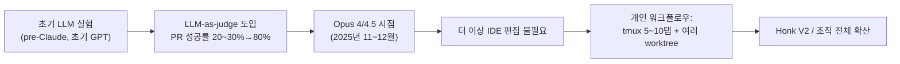
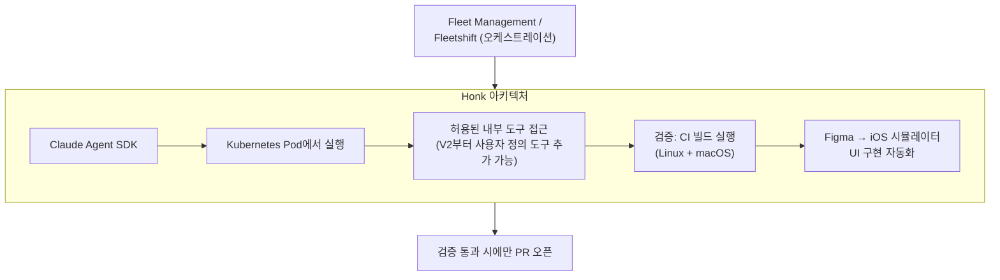
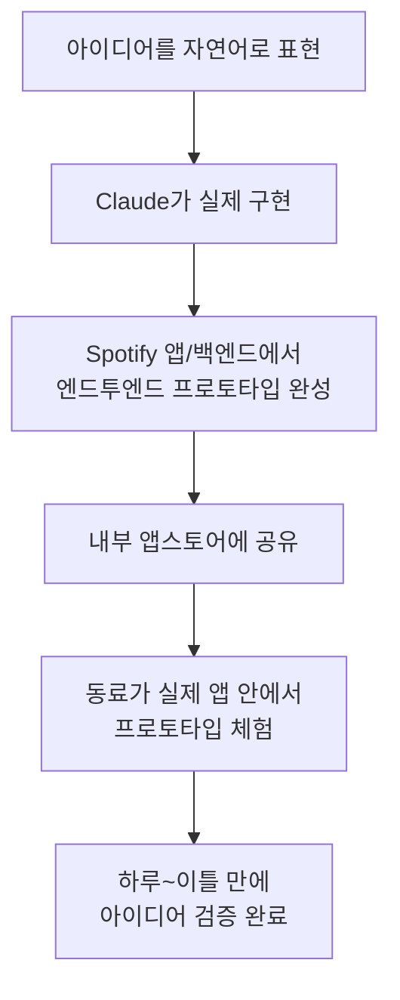

## Niklas Gustavsson(Spotify VP of Engineering / Chief Architect) 인터뷰 상세 정리

- **원본**: "How Spotify runs agents across 20M+ lines of code, with Niklas Gustavsson"
- **채널**: Claude (Anthropic 공식 YouTube)
- **게시일**: 2026년 6월 30일
- **URL**: https://www.youtube.com/watch?v=9DHZLw5653E
- **인터뷰 진행**: Anthropic의 Boris Cherny (Claude Code의 원 개발자로 알려진 인물)
- **인터뷰 대상**: Niklas Gustavsson — Spotify Chief Architect 겸 VP of Engineering

---

## 1. 이 영상은 무엇에 관한 이야기인가

이 영상은 Anthropic이 자사 YouTube 채널을 통해 공개한 고객 인터뷰로, Spotify의 엔지니어링 총괄인 Niklas Gustavsson이 Spotify 내부에서 Claude Code와 자체 구축한 백그라운드 코딩 에이전트 "Honk"를 어떻게 2,000만 줄이 넘는 백엔드 모노레포에 적용해 왔는지를 설명합니다. 인터뷰는 개인적인 워크플로우 변화에서 시작해, Spotify가 수년간 쌓아온 "Fleet Management"라는 대규모 코드 자동화 인프라, 그 위에 Claude Agent SDK를 얹어 만든 Honk의 아키텍처, 검증(verification) 루프의 중요성, 그리고 조직 전체의 생산성 지표와 프로토타이핑 문화로 이어집니다.

Spotify는 약 2,900명의 엔지니어를 보유한 조직이며, 하루 약 4,500건의 프로덕션 배포를 수행하는 회사입니다. 이 영상이 흥미로운 이유는 "1인 개발자가 주말에 바이브 코딩으로 앱을 만든" 사례가 아니라, 대규모 엔지니어링 조직이 15년 가까이 쌓아온 표준화·자동화 인프라 위에 최신 에이전트 기술을 올렸을 때 무슨 일이 벌어지는지를 보여준다는 점입니다.

---

## 2. Niklas Gustavsson은 누구인가

Gustavsson의 배경은 다소 이례적입니다. 그는 원래 분자생물학(molecular biology) 전공으로 박사 과정을 밟던 중, 유전체 시퀀싱(genome sequencing)에서 나오는 "당시 기준의 빅데이터"를 다루기 위해 프로그래밍 능력을 키워야 했고, 원래는 안식년(sabbatical)으로 잠시 옮길 생각이었던 소프트웨어 엔지니어링 커리어가 결국 30년 가까이 이어지게 되었다고 밝힙니다. 즉 그는 순수 컴퓨터공학 출신이 아니라 과학 데이터 문제를 풀다가 엔지니어링으로 넘어온 케이스입니다.

현재 그는 Spotify의 Chief Architect 겸 VP of Engineering으로, Spotify의 엔지니어링 플랫폼 전략과 AI 에이전트 도입을 총괄하고 있습니다.

---

## 3. "더 이상 IDE를 쓰지 않는다" — 개인 워크플로우의 변화

인터뷰 도입부에서 Boris는 2025년 9월경 Gustavsson이 "올해 말이면 아무도 IDE를 쓰지 않을 것"이라고 말했던 것을 떠올립니다. Boris는 당시 이것이 2년 정도 걸릴 일이라 생각했지만, 실제로는 2개월 만에 자신의 작업 방식이 완전히 바뀌는 것을 경험했다고 말합니다. Gustavsson도 내부적으로 정확히 같은 경험을 했다고 답하며, 다만 Anthropic 내부에서는 몇 주 정도 먼저 그 변화를 겪었을 뿐이라고 덧붙입니다.

### 3.1 Gustavsson의 "AGI 모먼트"

Gustavsson은 개인적으로 몇 차례의 전환점이 있었다고 말합니다.

- **초기 시도 (pre-Claude, 초기 GPT 시기)**: LLM으로 코드 변경을 자동화하려는 초기 시도는 처음엔 잘 작동하지 않았지만, LLM을 "judge(심사자)"로 활용하는 방법을 찾아가면서 점차 고무적인 결과를 얻기 시작했습니다. 이것이 완벽한 해결책은 아니었지만 미래의 방향성을 보여주는 신호였다고 설명합니다.
- **진짜 돌파구 (2025년 11~12월경, Opus 4.5 출시 시점)**: Gustavsson은 이 시점을 개인적인 코딩 작업의 진짜 전환점으로 꼽습니다. 모델이 "똑똑한 자동완성" 수준에서 벗어나 실제 문제를 던져도 되는 수준이 되었고, 별다른 프롬프트 엔지니어링 없이도 작업이 가능해졌다고 말합니다. 그가 특히 강조하는 변화는 "더 이상 코드를 직접 편집하지 않게 되었다"는 점입니다. 예전에는 모델이 코드의 70~80%를 작성하면 나머지는 IDE에서 직접 마무리(last mile edit)해야 했는데, 이제는 그 과정 자체가 사라졌다고 설명합니다.

> 참고로 외부 보도에 따르면, Spotify 공동 CEO인 Gustav Söderström도 2025년 4분기 실적발표(Q4 2025 earnings call)에서 "2025년 크리스마스가 AI 생산성 측면에서 하나의 특이점(singular event)이었다"고 언급했으며, 이 시점은 Claude Code에 Opus 4.5가 탑재된 시기와 겹칩니다. 이는 이 영상 속 Gustavsson의 발언과 시기적으로 일치합니다.

### 3.2 현재의 개인 작업 방식

Gustavsson은 자신의 작업 방식을 "상당히 평범한(vanilla) 방식"이라고 소개하지만, 내용을 들어보면 이미 고도로 병렬화된 워크플로우입니다.

- 터미널에서 tmux 세션을 여러 개 띄워 사용
- 한 번에 5~10개의 터미널 탭을 열어둠
- 별도의 pane에는 diff를 확인할 수 있는 터미널을 배치
- Claude 세션과 그에 대응하는 터미널을 짝지어, 여러 개의 git worktree(작업 디렉토리 분기)에서 동시에 작업
- 대부분의 작업은 소수의 대형 모노레포에서 이루어지고, 폴리레포(수천 개의 개별 저장소) 작업이 필요할 때는 임시로 별도의 Claude 세션을 염

외부 보도(Business Standard, 2026년 2월)에 따르면 Gustavsson은 다른 인터뷰에서도 노트북에 최소 4개의 Claude Code 에이전트를 백그라운드로 동시에 실행하고 있었다고 언급된 바 있어, 이번 인터뷰의 "5~10개 탭" 설명과 일관된 모습을 보여줍니다.

### 3.3 모노레포 vs. 폴리레포에서의 성능

Gustavsson은 처음에는 대형 모노레포(백엔드 모노레포는 2,000만 줄 이상)에서 에이전트가 인덱싱 문제 등으로 잘 작동하지 않을까 우려했다고 밝힙니다. 하지만 실제로는 반대의 결과를 얻었습니다. Claude는 대형 저장소에서도 놀라울 만큼 잘 작동했는데, 그 핵심 이유로 Gustavsson은 "Claude가 저장소 내 다른 코드를 참고해 문제 해결의 영감을 얻는 능력이 뛰어나다"는 점을 꼽습니다. 즉 코드베이스 안에 이미 존재하는 패턴을 모델이 참조해서 일관된 스타일로 새로운 코드를 작성한다는 것입니다.

이는 뒤에서 다룰 "표준화(standardization)"라는 주제와 직접 연결되는 대목입니다.

---

## 4. Honk란 무엇인가 — 탄생 배경과 아키텍처

### 4.1 왜 만들었는가: 코드베이스 증가 속도 vs. 엔지니어 증가 속도

Honk의 기원은 AI 붐 이전으로 거슬러 올라갑니다. Gustavsson에 따르면 5~6년 전 Spotify는 코드베이스가 엔지니어 수보다 약 7배 빠르게 증가하고 있다는 것을 파악했습니다. Spotify는 끊임없이 새로운 아이디어를 제품에 반영하고 싶어 하는 회사였기 때문에, 유지보수 부담에 발목이 잡히는 것은 받아들이기 어려운 상황이었습니다.

이에 따라 Spotify는 유지보수 작업(자바 버전 마이그레이션, 라이브러리 업데이트, API 전환 등 반복적이고 지루한 작업)을 자동화하기 시작했습니다. 예전 방식은 마이그레이션 가이드를 작성해 수백 개 팀에 배포하고 각 팀이 자신의 컴포넌트를 수작업으로 고치도록 요청하는 것이었는데, 이는 각 팀이 사실상 동일한 작업을 반복하는 매우 비효율적인 구조였습니다. 이런 마이그레이션 하나를 완료하는 데 몇 달이 걸렸고, 연간 처리할 수 있는 마이그레이션은 10건 정도에 불과해 최신 프레임워크 버전을 따라가는 것조차 벅찼다고 합니다.

### 4.2 결정론적 스크립트의 한계

Spotify는 이를 해결하기 위해 "Fleet Management"라는 인프라를 구축해 결정론적(deterministic) 스크립트로 코드 변경(mutation)을 자동으로 대량 적용하는 시스템을 만들었고, 이를 통해 수백만 건의 PR을 병합했습니다. 그러나 코드는 API 표면(API surface)이 매우 넓다는 근본적인 한계에 부딪혔습니다. 예를 들어 하나의 메서드를 다른 API로 교체하는 단순해 보이는 변경도, 그 메서드가 다섯 가지 다른 방식으로 호출되거나 변수에 할당되는 순간 처리 로직이 기하급수적으로 복잡해집니다. 결과적으로 마이그레이션 하나를 처리하는 스크립트가 모든 예외 케이스를 처리하기 위해 수천 줄에 달하게 되는 문제가 있었습니다.

### 4.3 LLM 도입과 시행착오

이런 배경에서 Spotify는 초기 LLM이 등장하자마자 이 문제에 적용을 시도했습니다. 처음에는 단순히 코드를 모델 앞에 던져놓고 한 번에(one-shot) 변경을 시도하는 방식이었는데, 이는 전혀 통하지 않았습니다. 모델 성능의 한계도 있었지만, 접근 방식 자체가 미숙했다는 것이 Gustavsson의 평가입니다.

이후 모델이 개선되고 접근 방식도 발전하면서, LLM을 judge로 활용해 결과물이 의도한 대로 나왔는지 검증하고, 문제를 여러 하위 작업으로 분해(decompose)하는 방식을 도입했습니다. 수많은 반복과 사내 실험 끝에 이것이 통합되어 지금의 Honk가 되었습니다. 초기 Honk는 Claude 기반이 아니라 자체 개발한 방식들의 조합이었다는 점도 언급됩니다.

### 4.4 Honk의 진화: V1에서 V2(사실상 V8)까지

Honk는 원래 "코드 변경을 스케줄링하고 저장소 전체에 오케스트레이션하는" 목적으로 시작했지만, 엔지니어들이 곧 Slack에서 Honk를 멘션해 다른 작업(태스크)을 시키는 등 훨씬 더 범용적인 방식으로 사용하기 시작했습니다. 그 결과 Honk는 오늘날 훨씬 더 보편적인(ubiquitous) 도구로 성장했습니다.

Gustavsson은 최근 공개한 버전을 "V2"라고 부르지만, 실제로는 그동안의 수많은 내부 반복을 감안하면 사실상 "V8" 정도에 가깝다고 농담 섞어 말합니다 (버전을 엄밀히 추적하지 않았을 정도로 반복이 잦았다는 의미).

### 4.5 아키텍처 구성 요소

Gustavsson이 설명하는 Honk의 아키텍처는 다음과 같습니다.

- **기반 엔진**: Claude **Agent SDK**가 **Kubernetes pod** 위에서 실행됩니다.
- **도구(tools) 접근**: V2 이전에는 에이전트에게 미리 정해진 허용 목록(allow-list)의 도구만 제공했지만, V2부터는 사용자가 자신의 도구를 추가할 수 있게 되어, 에이전트가 Spotify의 내부 도구 전반에 접근할 수 있게 되었습니다.
- **검증(verification) 도구**: 가장 중요한 도구 중 하나는 CI 빌드를 직접 실행할 수 있는 기능입니다. 이 검증은 **Linux**뿐 아니라 **macOS**에서도 실행 가능한데, 이는 iOS 개발에 macOS 빌드가 필수적이기 때문입니다.
- **디자인-투-코드 파이프라인**: 일부 사례에서는 iOS 시뮬레이터와 Claude를 통합해 Figma 디자인을 UI 구현으로 직접 변환하는 작업도 자동화하고 있으며, 이는 iOS 앱을 TV 앱으로 포팅하는 작업 등에 활용되었습니다.

### 4.6 Judge(심사자)의 도입과 제거

Honk 초기 버전에는 LLM 기반의 "judge"가 있어, 생성된 PR의 품질을 별도로 심사했습니다. Gustavsson은 이 judge의 도입으로 PR 성공률이 약 20~30%에서 약 80%까지 크게 개선되었다고 밝힙니다. 그러나 모델과 에이전트 하네스(harness) 자체가 충분히 개선되면서(다시 한번 Opus 4/4.5 시점을 언급), Spotify는 이 judge를 Honk에서 완전히 제거했습니다. 즉 검증 단계가 사라진 것이 아니라, 모델 자체의 신뢰도가 높아지면서 별도의 심사 계층이 불필요해졌다는 의미입니다.

---

## 5. 검증(Verification) 루프가 왜 가장 중요한가

Gustavsson은 사람이 개입하지 않는 폐쇄 루프(closed-loop) 개발, 즉 에이전트가 작업을 스스로 세분화하고 사람 없이 상당한 작업을 처리해야 하는 환경에서는 "검증이 단연 가장 중요한 요소"라고 강조합니다. 그는 많은 기업들이 이 검증 루프에 대한 투자를 과소평가하는 것이 흔한 실수라고 지적합니다.

### 5.1 소유권 구조와 테스트 자동화 강화

Spotify는 코드베이스를 수천 개의 컴포넌트로 나누고, 각 컴포넌트는 명확한 소유권(ownership)을 가진 팀이 설계·구현·운영을 전담하는 구조를 갖고 있습니다. Fleet Management 투자 이전에는 병합되는 모든 변경 사항에 대해 담당 팀이 개입(in the loop)할 수 있었기 때문에, 테스트 자동화가 다소 느슨해도 팀이 PR을 직접 확인하는 것으로 보완이 가능했습니다.

하지만 소스 코드에 대한 PR 자동화가 확대되면서, 팀에 대한 기대치 자체를 바꿔야 했습니다. 이제 팀은 자신들이 PR을 전혀 보지 못한 채로 변경 사항이 자동 병합(automerge)되는 상황을 받아들여야 했고, 이를 위해 훨씬 더 강력한 테스트 자동화를 구축해야 했습니다. 이 투자 덕분에 소프트웨어가 자동화된 변경을 안전하게 견딜 수 있는 기반이 마련되었습니다.

### 5.2 "품질 vs. 속도"는 거짓 딜레마

Boris는 엔지니어링에서 흔히 이야기되는 "신뢰성/품질"과 "속도"의 트레이드오프가 사실은 거짓 딜레마(false dichotomy)라는 관점을 제시합니다. 더 빠르게 가려면 품질 관행을 자동화해서 그것이 누군가의 머릿속에만 있는 게 아니라 스킬(skill)이나 `CLAUDE.md`, MCP 서버 등으로 명시적으로 인코딩되어야 한다는 것입니다. Gustavsson도 이에 동의하며, Spotify가 **품질 지표는 유지(neutral)하면서 속도만 크게 개선**하고 있다고 답합니다. 다만 이는 공짜로 얻어진 결과가 아니라 테스트 자동화에 대한 지속적인 투자가 있었기에 가능했으며, 앞으로도 신뢰성 관행에 대한 투자를 계속 늘려가야 할 것이라고 전망합니다.

### 5.3 배포 빈도와 그 의미

Spotify는 하루 약 **4,500건**의 프로덕션 배포를 수행합니다. Gustavsson은 이렇게 자주 배포하는 이유가 "아이디어를 최대한 빨리 프로덕션에 반영해 빠르게 피드백을 얻기 위함"이라고 설명합니다. 예전에는 아이디어를 프로덕션에 반영하는 데 몇 주에서 몇 달이 걸렸지만, 지금은 (경우에 따라) 약 한 시간 정도로 단축되었다고 말합니다. 물론 모든 아이디어가 한 시간 만에 배포되는 것은 아니며, 많은 아이디어는 여전히 상당한 탐색 과정을 거쳐야 하지만, 빠른 검증(validation) 루프 자체가 더 나은 제품을 더 빠르게 만드는 핵심 요인이라고 강조합니다.

---

## 6. ROI 측정 — 숫자로 보는 성과

### 6.1 영상에서 언급된 핵심 수치

Gustavsson이 인터뷰에서 직접 언급한 수치는 다음과 같습니다.

| 지표 | 수치 |
|---|---|
| PR 빈도(frequency) 개선율 | AI 도구 덕분에 **75% 이상** 개선 |
| AI가 저작에 관여한 PR 비율 | 약 **73%** |
| Spotify 엔지니어 수 | 약 **2,900명** |
| 일일 프로덕션 배포 건수 | 약 **4,500건** |
| Honk 도입 초기 judge로 인한 PR 성공률 개선 | 약 20~30% → 약 **80%** |

Gustavsson은 이 수치들을 "AI 도구에 직접적으로 귀속(attribute)할 수 있는" 성과로 설명하며, 초기에는 개선 폭이 워낙 커서 ROI를 논하기 쉬웠지만, 도입이 성숙해지고 비용 구조가 개선됨에 따라 이제는 ROI 추정치에 대한 정밀도 기대치도 함께 높아지고 있다고 말합니다. 즉 단순히 "몇 % 개선되었다"를 넘어서, 토큰 사용량과 소요 시간 대비 실제 생산적 산출물이 무엇인지를 정밀하게 연결하려는 단계로 나아가고 있다는 것입니다.

### 6.2 사용자 가치·매출로의 연결

Spotify는 엔지니어들의 산출물(PR, 배포)을 "work item"(계획된 작업 단위)으로 연결하고, 이를 다시 A/B 테스트 및 롤아웃과 연결해, 특정 PR이 특정 기능 완료(정의: DoD, Definition of Done)에 기여하고 그것이 다시 사용자 가치로 이어지는 흐름을 추적하려는 시도를 하고 있습니다. Gustavsson은 이 연결고리를 구축하는 작업이 현재 진행 중(work in progress)이라고 밝힙니다.

### 6.3 다른 공개 자료와의 비교 (참고 목적)

이 영상 자체에서 언급되지는 않았지만, Spotify 엔지니어링 블로그 등 다른 공개 발표에서는 시점에 따라 다소 다른 수치가 등장합니다. 예를 들어 2026년 6월 "Code with Claude" 행사에서 공개된 Spotify 엔지니어링 블로그 글에서는 99% 이상의 엔지니어가 매주 AI 코딩 도구를 사용하고, 94%는 AI가 자신을 더 생산적으로 만들었다고 답했으며, PR 빈도가 76% 증가했다고 밝히고 있습니다. 또한 이러한 AI 도구 채택 속도는 2025년 말 Opus 4.5 출시와 함께 극적으로 가속화되었다고 설명합니다.

이처럼 발표 시점(2026년 2월 실적발표, 5월 Code with Claude 컨퍼런스, 5월 Investor Day, 6월 이 인터뷰 등)에 따라 "AI 도구 주간 사용률"이 96%→99% 등으로, "PR 빈도 개선율"이 60%→75%→76% 등으로 조금씩 다르게 언급되는 경향이 있습니다. 이는 수치가 계속 갱신되고 있다는 의미로 해석하는 것이 합리적이며, 이 문서에서는 **이 영상에서 Gustavsson이 직접 말한 수치(73%, 75%+)** 를 1차 기준으로 삼고, 그 외 수치는 참고용으로 별도 표기했습니다.

---

## 7. Honk를 뒷받침하는 더 넓은 인프라: Fleet Management와 Backstage

영상 자체에서 깊게 다루지는 않지만, Gustavsson의 설명 곳곳에서 언급되는 "Fleet Management"는 Honk가 작동할 수 있는 토대입니다. 공개된 Spotify 엔지니어링 블로그에 따르면 Honk는 Fleet Management 툴링과 직접 통합되어 있으며, Fleetshift가 대상 식별·스케줄링·진행 상황 추적 등 오케스트레이션을 담당하고 Honk는 그 중간에서 실제 코드 수정을 수행합니다. 즉 Honk 혼자서 모든 것을 하는 것이 아니라, 수년간 구축된 Fleet Management/Fleetshift라는 오케스트레이션 계층과 Backstage라는 소프트웨어 카탈로그(컴포넌트별 소유권 관리) 위에서 작동한다는 점이 이 사례의 핵심입니다.

또한 Spotify의 오래된 엔지니어링 원칙 중 하나인 "우리가 세계적 수준(world-leading)으로 다루는 기술이 적을수록 더 빨리 간다"는 원칙이 AI 이전부터 존재했으며, 이 표준화 원칙이 에이전트 시대에도 마찬가지로 중요하다는 것이 확인되었다고 설명합니다. 이는 이 영상에서 Gustavsson이 강조한 "Claude가 일관된 코드에서 더 잘 작동한다"는 관찰과 정확히 일치합니다.

> **주의**: 이 절의 내용은 이 영상 자체가 아니라 Spotify 공식 엔지니어링 블로그(2026년 6월 게시)에서 보강한 배경 정보이며, 출처는 문서 하단 참고자료에 별도 표기했습니다.

---

## 8. 프로토타이핑 문화의 변화

인터뷰 후반부에서 Boris는 자신의 경험을 공유합니다. Claude가 백그라운드에서 구현을 처리해주면서, 정작 자신의 시간은 "다음에 무엇을 할지 고민하기", "고객과 대화하기", 그리고 예상보다 훨씬 많은 "프로토타이핑"으로 채워지고 있다는 것입니다.

Gustavsson도 비슷한 경험을 공유하며, Spotify가 프로토타이핑에 큰 투자를 하고 있다고 밝힙니다. 이는 엔지니어뿐 아니라 비(非)엔지니어 직군까지 대상으로 합니다. Claude와 같은 도구가 열어준 것은 "누구나 자연어로 아이디어를 표현하면 Claude가 그것을 실제로 구현해주는" 흐름입니다. 엔지니어와 비엔지니어 모두 이를 실제 앱(상당히 복잡한 코드베이스)에서 시도해보기 시작했고, 가능성이 보이자 Spotify는 몇 달 전부터 이를 쉽게 만들 수 있는 인프라를 구축했습니다.

### 8.1 내부 앱스토어

Spotify는 현재 모바일 앱과 백엔드에서 엔드투엔드 프로토타입을 만들 수 있는 간단한 방법을 갖추고 있으며, 이렇게 만들어진 프로토타입을 공유할 수 있는 **내부 앱스토어**를 운영하고 있습니다. 여기서 동료가 만든 프로토타입을 자신의 앱 안에서 직접 체험해볼 수 있습니다. 이는 모바일 앱 개발에 익숙하지 않던 엔지니어들에게도 큰 돌파구가 되었으며, 예전에는 아이디어를 구현하려면 여러 엔지니어를 설득해 별도 프로젝트로 진행해야 했던 것이, 이제는 한두 시간 안에 실제 데이터와 사용자로 작동하는 프로토타입을 만들어 공유할 수 있는 수준이 되었다고 설명합니다.

### 8.2 누가 프로토타입을 만드는가

Boris가 "이제 누가 이런 프로토타입을 만드느냐"고 묻자, Gustavsson은 "모두가 만든다"고 답합니다. 심지어 Spotify의 **공동 CEO 중 한 명도 내부 앱스토어에 자신의 프로토타입을 올려두었다**고 밝히며, 이는 실제로 품질이 좋은 편이라고 덧붙입니다. 이는 오래전부터 머릿속에 있던 아이디어를, 별도의 전담 엔지니어링 팀 없이도 직접 구현해 몇 주~몇 달이 아니라 하루 만에 검증해볼 수 있게 되었다는 것을 보여주는 사례로 제시됩니다.

---

## 9. 리더와 엔지니어에게 주는 조언

### 9.1 다른 CTO/엔지니어링 리더에게: 기초 역량 투자와 표준화

Gustavsson이 다른 CTO나 엔지니어링 리더(VP of Engineering 등)에게 주는 조언의 핵심은 두 가지입니다.

1. **테스트 자동화와 검증(verification)에 대한 기초 투자**를 절대 소홀히 하지 말 것.
2. **표준화(standardization)**: 일관된 코드베이스, 도구, 프레임워크에 대한 정렬은 원래 사람을 위한 투자였지만, 이것이 에이전트 시대에도 그대로, 오히려 더 중요하게 적용된다는 것을 발견했다고 말합니다. Claude가 모노레포에서 다른 코드를 참고해 영감을 얻는다는 앞선 설명을 다시 상기시키며, 코드가 10가지 다른 방식으로 작성되어 있으면 Claude도 더 혼란스러워한다고 설명합니다. 일관성이 높을수록 에이전트가 더 잘 작동한다는 것이 Spotify의 결론입니다.

Gustavsson은 결론적으로 "이 새로운 세계에서도 예전과 똑같이 건전한(sane) 엔지니어링 관행이 여전히 적용된다"는 점을 강조합니다. 코드베이스에 새로운 행위자(에이전트)가 등장했을 뿐, 근본 원칙은 동일하게 잘 작동한다는 것이 적어도 Spotify의 환경에서는 사실이었다고 말합니다.

### 9.2 현직 엔지니어에게: 문제 해결의 본질에 집중하라

Boris가 "이미 오래 경력을 쌓아온 엔지니어들에게 어떤 조언을 하겠느냐"고 묻자, Gustavsson은 좀 더 개인적인 이야기를 풀어냅니다.

그는 스스로를 "코딩에서 문제 해결(problem solving) 부분을 진심으로 즐기는 사람"이라고 소개하며, 여가 시간에 경쟁 프로그래밍(competitive programming)을 즐길 정도로 이 부분에 애착이 있었다고 말합니다. 그래서 내심 "이 변화가 코딩의 어려운 지적 도전이라는 재미있는 부분을 없애버리지 않을까" 걱정했다고 고백합니다.

하지만 지금은 5개의 에이전트를 백그라운드에서 동시에 돌리는 방식으로 일하고 있고, 1~2년 전과는 완전히 다른 방식으로 상호작용하고 있음에도, 그 걱정은 기우였다는 결론에 도달했다고 말합니다. 자신이 진짜로 좋아하는 것은 "문제를 해결하는 것" 그 자체였고, "그 문제를 어떤 방식으로 해결하느냐"는 자신에게 가장 중요한 요소가 아니었다는 것을 깨달았다는 것입니다.

Gustavsson은 이 전환이 사람마다 다르게 다가올 수밖에 없다는 점을 인정하면서도, 다음과 같이 조언합니다.

- 자신이 풀 수 있는 문제의 **종류**에 집중할 것
- 자신의 작업에서 더 많은 가치를 만들어낼 수 있고, 예전에는 풀 수 없었던 문제도 풀 수 있게 된다는 점을 받아들일 것 (예: 예전이라면 며칠~몇 주가 걸렸을 낯선 코드베이스에 뛰어들어 바로 기여할 수 있게 된 경험)
- 사람마다 그 모습이 다르게 나타나겠지만, **일단 시도해보고 자신에게 맞는 방식**을 찾아볼 것

---

## 10. 핵심 개념 한국어 용어 정리 (글로서리)

| 영어 용어 | 한국어 설명 |
|---|---|
| Agent SDK (Claude Agent SDK) | Anthropic이 제공하는, 자율적으로 작업을 수행하는 AI 에이전트를 구축하기 위한 개발 키트. Honk의 핵심 엔진으로 사용됨 |
| Honk | Spotify가 자체 구축한 백그라운드 코딩 에이전트 시스템. 원래는 대규모 코드 마이그레이션 자동화 목적으로 시작해, 현재는 범용 작업 에이전트로 확장됨 |
| Fleet Management / Fleetshift | Spotify가 수년 전부터 구축해온, 수천 개 저장소에 걸친 코드 변경을 오케스트레이션(대상 식별, 스케줄링, 진행 추적)하는 내부 플랫폼 |
| Backstage | Spotify가 만들어 오픈소스로 공개한 내부 개발자 포털. 소프트웨어 컴포넌트의 소유권·문서·의존성 등을 관리 |
| LLM-as-judge | 생성된 결과물(PR 등)의 품질을 별도의 LLM이 심사·검증하도록 하는 기법. Honk 초기에 PR 성공률을 크게 끌어올렸으나, 모델 성능이 충분히 좋아진 이후 제거됨 |
| Verification loop (검증 루프) | 에이전트가 만든 변경 사항이 실제로 올바른지 CI 빌드·테스트 등을 통해 자동으로 확인하는 순환 구조. 사람 개입 없는 자율 작업에서 가장 핵심적인 안전장치로 강조됨 |
| Monorepo / Polyrepo | 모노레포는 여러 프로젝트/서비스 코드를 하나의 저장소에 모아둔 구조, 폴리레포는 프로젝트별로 저장소를 분리한 구조. Spotify는 소수의 대형 모노레포와 수천 개의 폴리레포를 병행 운영 |
| Work item | Spotify 내부에서 엔지니어의 산출물(PR, 배포 등)을 계획된 작업 단위와 연결해 추적하는 개념. 이후 A/B 테스트·롤아웃·사용자 가치와 연결하는 데 활용됨 |
| DoD (Definition of Done) | 특정 작업이 "완료되었다"고 판단하는 기준을 정의한 것. 이 영상에서는 PR이 이 기준 충족에 기여했는지를 사용자 가치와 연결하는 맥락에서 언급됨 |
| tmux | 터미널 세션을 여러 개로 분할·관리할 수 있는 터미널 멀티플렉서. Gustavsson이 여러 Claude 세션을 동시에 운용하는 데 사용 |
| Worktree (git worktree) | 하나의 git 저장소에서 여러 개의 작업 디렉토리(브랜치별 체크아웃)를 동시에 유지할 수 있게 해주는 기능 |

---

## 11. 정리하며 — 이 사례가 주는 시사점

이 인터뷰가 강의 자료로서 가치가 있는 이유는, "에이전트가 알아서 다 해준다"는 단순한 서사가 아니라 다음과 같은 좀 더 정밀한 메시지를 담고 있기 때문입니다.

1. **에이전트의 성능은 모델 단독의 힘이 아니라 그것을 둘러싼 엔지니어링 시스템의 성숙도에 크게 좌우된다.** Spotify가 Honk로 성과를 낼 수 있었던 것은 그 이전에 수년간 쌓아온 Fleet Management, Backstage, 표준화된 기술 스택, 강화된 테스트 자동화가 있었기 때문입니다.
2. **검증(verification) 루프는 사람이 루프에서 빠질수록 더 중요해진다.** Judge를 없앨 수 있었던 것도 검증 자체를 없앤 것이 아니라, 검증이 CI/테스트 자동화라는 더 근본적인 층위로 흡수되었기 때문입니다.
3. **일관성(표준화)이 에이전트 성능에 직접적인 영향을 준다.** 이는 사람을 위한 투자가 그대로 에이전트에도 적용되는 대표적 사례입니다.
4. **개인 워크플로우의 변화는 "코드를 안 쓰게 되는 것"이 아니라 "여러 에이전트를 동시에 운용하는 오케스트레이터가 되는 것"에 가깝다.** tmux, 여러 worktree, 5~10개의 병렬 세션이라는 구체적인 워크플로우가 이를 보여줍니다.
5. **프로토타이핑의 문턱이 극적으로 낮아지면서, 아이디어의 검증 주기가 몇 주에서 하루 단위로 단축되고 있다.** 이는 엔지니어뿐 아니라 비엔지니어(심지어 경영진)까지 아이디어를 직접 구현해볼 수 있게 되었다는 조직문화적 변화이기도 합니다.

---

## 12. 참고자료 (전체 출처)

1. Claude (Anthropic 공식 YouTube), "How Spotify runs agents across 20M+ lines of code, with Niklas Gustavsson" (2026년 6월 30일) — 본 문서의 1차 출처
   https://www.youtube.com/watch?v=9DHZLw5653E
2. Spotify Engineering, "Coding Is No Longer the Constraint: Scaling Developer Experience to Teams and Agents at Spotify" (2026년 6월)
   https://engineering.atspotify.com/2026/6/code-with-claude-coding-is-no-longer-the-constraint
3. Spotify Engineering, "Let's Talk Agentic Development: Spotify x Anthropic Live" (2026년 4월)
   https://engineering.atspotify.com/2026/4/anthropic-agentic-development
4. Code with Claude 2026 (London) 세션 페이지, "Coding is no longer the constraint: Scaling devex to teams and agents at Spotify"
   https://claude.com/code-with-claude/session/ldn-coding-is-no-longer-the-constraint-scaling-devex-to-teams-and-agents-at-spotify
5. Business Standard, "Surprise coding breakthrough that made Anthropic into an AI juggernaut" (2026년 2월 21일)
   https://www.business-standard.com/technology/tech-news/surprise-coding-breakthrough-that-made-anthropic-into-an-ai-juggernaut-126022100047_1.html
6. EveryDev.ai, "Spotify Built an AI Coding Agent (Honk) That Engineers Control From Their Phones" (2026년 2월 15일)
   https://www.everydev.ai/p/blog-spotify-built-an-ai-coding-agent-honk
7. The Neuron, "How Spotify runs Claude across 20M+ lines of code" (뉴스레터, 2026년 6월)
   https://www.theneuron.ai/newsletter/how-spotify-runs-claude-across-20m-lines-of-code/

> **참고**: 6번 항목(techtrenches.dev, "Honk Is Not Magic")은 Spotify의 발표 수치를 비판적으로 검토하는 관점의 글로, 본 문서에서는 직접 인용하지 않았으나 "발표 시점마다 수치가 조금씩 다르다"는 8절의 서술에 참고했습니다. 해당 비판 글의 핵심 주장은 "Honk의 성과는 AI 모델 자체보다 Spotify가 15년간 쌓아온 Backstage/Fleet Management 인프라 덕분"이라는 것으로, 이는 본 영상에서 Gustavsson 스스로 밝힌 내용(표준화·기초 인프라 투자의 중요성)과 방향이 크게 다르지 않습니다.

---

*이 문서는 위 YouTube 인터뷰 영상의 자막(스크립트)을 1차 자료로 하고, Spotify 공식 엔지니어링 블로그 및 언론 보도를 통해 사실관계를 교차 검증하여 작성되었습니다. 영상에서 직접 언급되지 않은 수치나 배경 정보는 출처를 명시적으로 구분해 표기했습니다.*
