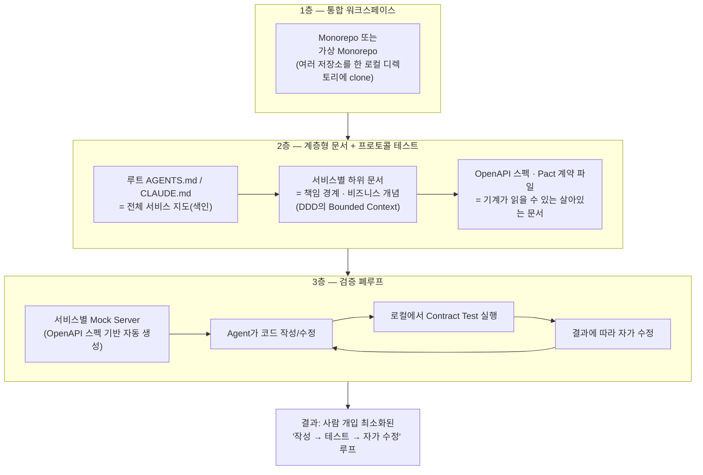
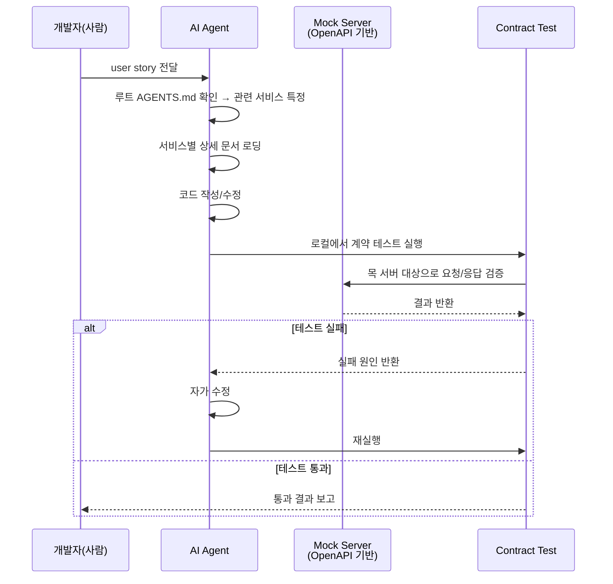

### — 크로스 서비스 시스템 설계와 코딩을 위한 실전 셋업 —

> 원문 출처: [@dotey (X/Twitter)](https://x.com/dotey/status/2071961238528012358) 스레드 및 관련 커뮤니티 답글
>
> 정리 기준일: 2026년 7월

---

## 1. 들어가며 — 이 글이 다루는 문제

이 문서는 X(구 트위터)에서 화제가 된 한 질의응답 스레드를 바탕으로 작성되었습니다. 질문의 요지는 다음과 같습니다.

> "우리 회사에는 십여 개의 마이크로서비스가 있다. 개발자들이 AI Agent를 활용해 시스템 설계와 코딩을 하게 하고 싶은데, 문제는 하나의 user story(사용자 스토리)가 보통 여러 마이크로서비스의 협업을 필요로 한다는 점이다. Agent가 합리적인 설계를 하려면 각 서비스의 책임 경계와 비즈니스 개념을 알아야 한다. 모든 마이크로서비스를 하나의 workspace에 넣고 각 서비스마다 문서를 붙여서 AI가 알아서 처리하게 하면 되는가? 더 나은 방법이 있는가?"

이 질문은 단순한 툴 사용법이 아니라, 최근 AI 업계에서 급부상한 **"컨텍스트 엔지니어링(context engineering)"** 과 **"하네스 엔지니어링(harness engineering)"** 이라는 개념이 실제 엔터프라이즈 환경, 그것도 마이크로서비스처럼 경계가 복잡하게 얽힌 시스템에서 어떻게 구체적으로 적용되는지를 보여주는 좋은 사례입니다.

답변자는 문제를 두 개의 축으로 정리합니다.

1. **컨텍스트의 품질(Context Quality)** — Agent에게 무엇을, 어떤 형태로, 언제 보여줄 것인가
2. **검증의 폐루프(Validation Loop)** — Agent가 만든 코드가 옳은지 사람 개입 없이 스스로 확인할 수 있는가

아래에서는 이 두 축을 중심으로 원문 답변의 내용을 상세히 풀어 설명하고, 답변에서 인용된 Anthropic 공식 엔지니어링 문서와 관련 커뮤니티 글의 실제 내용을 검증하여 함께 정리합니다. 마지막에는 이 스레드에 달린 실무자들의 다양한 반응(찬성, 회의, 대안 제시)도 함께 소개합니다.

---

## 2. 전체 그림 한눈에 보기

이 세 개 층이 함께 갖춰졌을 때 비로소 AI Agent가 크로스 마이크로서비스 시스템 설계와 구현을 안정적으로 처리할 수 있다는 것이 원문 답변의 핵심 주장입니다. 하나씩 자세히 살펴보겠습니다.

---

## 3. 첫 번째 축: 컨텍스트 품질을 어떻게 확보할 것인가

### 3-1. 왜 하나의 워크스페이스에 모아야 하는가

원문 답변은 "모든 마이크로서비스를 하나의 workspace 아래 두는 것이 현재 커뮤니티에서 비교적 권장되는 방식"이라고 밝힙니다. 이유는 단순합니다. Monorepo(단일 저장소) 구조는 AI Agent가 스키마 정의, API 프로토콜, 각 서비스의 실제 구현 코드를 **한 자리에서 동시에** 볼 수 있게 해주기 때문입니다. 여러 저장소에 흩어져 있으면 Agent가 파일을 오가며 문맥을 잃기 쉽고, grep이나 파일 탐색 같은 패턴 매칭 도구로 필요한 정보를 놓치기도 쉽습니다.

역사적인 이유 등으로 실제 monorepo로 합치기 어려운 조직을 위한 절충안으로 **가상 monorepo(virtual monorepo)** 개념이 제시됩니다. 이는 여러 개의 실제 저장소(git repository)를 하나의 로컬 디렉토리 아래에 각각 clone해 두어, Agent 입장에서는 마치 하나의 워크스페이스처럼 보이게 만드는 방식입니다. 실제로 이 스레드의 답글 중 한 실무자는 이와 유사한 방식을 다음과 같이 소개합니다.

> "우리의 실천은 부모 저장소(부모 repo)를 하나 만들어서 AGENTS.md, 플러그인, skill, 그리고 책임 경계·비즈니스 개념 같은 내부 지식을 통합 관리하고, 그 아래에 git submodule로 각 마이크로서비스 저장소를 연결해서 하나의 workspace를 구성한다. 효과가 꽤 괜찮았다."

이는 원문이 제안한 "가상 monorepo" 개념을 git submodule이라는 구체적인 기술로 구현한 사례라고 볼 수 있습니다.

### 3-2. Agent에게 "지도"를 주고 "필요할 때 불러오게" 하라

단순히 코드를 한 곳에 모아두는 것만으로는 부족합니다. 원문은 문서화 전략으로 다음 세 단계를 제안합니다.

1. **루트 색인 문서**: 저장소 최상단에 `AGENTS.md` 또는 `CLAUDE.md` 파일을 두어, 전체 서비스 목록과 각 서비스의 책임을 요약하고, 특정 서비스를 수정하려면 해당 디렉토리의 상세 문서를 읽으라고 안내하는 "지도" 역할을 하게 합니다.
2. **서비스별 상세 문서**: 각 마이크로서비스 디렉토리 안에는 자신의 책임 경계와 비즈니스 개념을 설명하는 문서를 따로 둡니다. 이는 도메인 주도 설계(DDD)에서 말하는 **Bounded Context(경계가 있는 컨텍스트)** 개념과 사실상 같은 것입니다.
3. **Agent의 작업 순서**: Agent가 먼저 루트 색인을 읽고 관련된 몇 개 서비스를 특정한 뒤, 그 서비스들의 상세 문서만 골라서 불러오도록 유도합니다.

이 구조는 무작정 모든 문서를 컨텍스트에 밀어 넣는 것이 아니라, **필요한 만큼만, 필요한 시점에** 불러오는 "온디맨드 로딩" 전략입니다. 이 개념은 이후 4장에서 다룰 Anthropic의 공식 컨텍스트 엔지니어링 문서에서 "just-in-time context"라는 이름으로 훨씬 자세히 설명되고 있으며, 원문 답변자도 실제로 그 글을 참고 자료로 명시하고 있습니다.

### 3-3. 문서는 살아있어야 한다 — 자동 생성 우선 원칙

원문은 문서 최신성 문제를 명확히 경고합니다.

> "문서는 제때 업데이트해야 한다. 특히 마이크로서비스 프로토콜이 변경되었을 때는 반드시 문서를 즉시 갱신해야 한다. 그렇지 않으면 Agent를 잘못된 방향으로 이끌게 된다."

이를 위한 원칙은 "코드나 스펙에서 자동으로 생성할 수 있는 것은 손으로 쓰지 말라"는 것입니다. 사람이 손으로 쓴 문서는 결국 코드와 어긋나기 마련이지만, OpenAPI 스펙처럼 기계가 읽을 수 있는 인터페이스 규격은 그 자체로 문서인 동시에 목(mock)과 테스트를 자동 생성하는 데도 쓸 수 있어, 문서와 실제 동작이 어긋날 여지가 훨씬 적습니다.

### 3-4. 가장 정확한 문서는 "계약 테스트 코드"다

이 답변에서 가장 눈여겨볼 만한 통찰은 다음 대목입니다.

> "많은 사람이 놓치는 또 다른 컨텍스트 소스가 있다. 바로 프로토콜 테스트 코드다. 품질 높은 contract test(계약 테스트) 자체가 가장 정확한 '살아있는 문서'다. 이는 서비스 간에 실제로 이루어지는 상호작용 프로토콜을 정확하게 기술하며, 사람이 쓴 문서보다 오래되어 못 쓰게 될 가능성이 훨씬 낮다. 왜냐하면 틀리면 테스트가 통과하지 못하기 때문이다."

즉, 사람이 쓴 산문 형태의 문서는 "설명은 맞지만 실제와 다를 수 있는" 리스크를 항상 안고 있는 반면, 계약 테스트는 실행 가능한(executable) 형태이기 때문에 실제 코드와 어긋나는 순간 곧바로 실패로 드러납니다. 이미 OpenAPI 스펙이나 Pact 계약 파일을 보유하고 있다면, 이것들이 Agent가 서비스 경계를 이해하는 데 매우 가치 있는 자료가 됩니다.

---

## 4. 두 번째 축: 검증의 폐루프를 어떻게 만들 것인가

### 4-1. 왜 마이크로서비스 환경에서 검증이 특히 어려운가

원문은 마이크로서비스 시나리오에서 검증이 "가장 골치 아픈 부분"이라고 지적합니다. 하나의 user story가 여러 서비스의 협업을 필요로 하기 때문에, Agent가 코드를 한 줄 고칠 때마다 전체 시스템을 띄워서 end-to-end 테스트를 돌릴 수는 없다는 것입니다. 실제 운영 환경 수준의 통합 테스트는 느리고, 여러 서비스를 동시에 기동해야 하며, 사람이 개입해서 확인해야 하는 경우가 많습니다.

### 4-2. Mock Server + Contract Test로 폐루프 만들기

실용적인 해법으로 제시된 것은 각 마이크로서비스가 **mock server**, 혹은 OpenAPI 스펙에서 자동 생성한 시뮬레이션 서비스를 제공하는 방식입니다. Agent가 코드를 다 작성한 뒤 로컬에서 contract test를 돌려서, 자신이 만든 변경이 다른 서비스와의 프로토콜 약속을 깨뜨리지 않았는지 확인할 수 있습니다. 이 과정은 실제 운영 API나 완전한 통합 환경에 의존하지 않습니다.

이렇게 하면 Agent는 "코드 작성 → 테스트 실행 → 스스로 수정"이라는 폐루프를 형성할 수 있고, 사람이 과정 중간에 자주 개입할 필요가 없어집니다.

### 4-3. 한 걸음 더 — Consumer-Driven Contract Testing(소비자 주도 계약 테스트)

원문은 더 깊이 들어가고 싶다면 **소비자 주도 계약 테스트(consumer-driven contract testing)** 를 알아보라고 권하며, 대표 도구로 **Pact**를 언급합니다. 기본 아이디어는 다음과 같습니다.

- 호출하는 쪽(consumer, 소비자)이 자신이 실제로 사용하는 인터페이스의 형태를 기록해 **계약 파일(pact file)** 을 생성한다.
- 호출당하는 쪽(provider, 제공자)은 이 계약 파일을 검증하여, 자신이 해당 계약을 만족할 수 있는지 확인한다.

이 개념을 실제 Pact 공식 문서 및 최신 레퍼런스 자료를 통해 조금 더 정확히 풀어보면 다음과 같습니다.

- Pact는 **코드 우선(code-first)** 방식의 계약 테스트 도구로, 계약은 소비자 측 자동화 테스트를 실행하는 과정에서 생성됩니다. 이 방식의 큰 장점은 소비자가 실제로 사용하는 통신 부분만 테스트된다는 점입니다. 다시 말해 현재 소비자들이 쓰지 않는 provider의 동작은 계약 테스트를 깨뜨리지 않고도 자유롭게 바뀔 수 있습니다.
- OpenAPI 같은 정적 스펙 문서는 "이 API가 가질 수 있는 모든 가능한 상태"를 기술하는 반면, Pact 계약은 구체적인 요청/응답 쌍의 모음을 실행함으로써 강제되는 "예시에 의한 계약(contract by example)"이라는 점에서 차이가 있습니다.
- 검증(verification) 단계에서는 계약 파일에 정의된 상호작용을 provider 코드에 대해 재생(replay)하고, 실제 응답과 계약에 정의된 기대값을 비교합니다.
- 여러 팀이 계약을 공유·검증하는 중개소 역할을 하는 **Pact Broker**가 있으며, 배포 직전에 "이 버전을 배포해도 되는지"를 확인하는 `can-i-deploy`라는 게이트 명령을 CI 파이프라인에서 실행하는 것이 일반적인 운영 방식입니다.
- 최근에는 provider가 자신의 계약을 OpenAPI 스펙 기반으로 직접 발행하고, Broker가 이를 소비자의 pact와 비교하는 **양방향 계약 테스트(bi-directional contract testing)** 방식도 활용되고 있습니다. 이는 provider가 매번 실시간 검증 작업을 돌리지 않아도 되게 해주는 대신 약간의 정확도를 희생하는 절충안입니다.

즉, 계약 테스트는 "완전한 통합 환경 없이도, 소비자와 제공자가 서로의 기대를 어긋나지 않게 지키고 있는지"를 빠르고 결정적으로 확인해주는 장치이며, 이것이 바로 AI Agent가 사람의 개입 없이도 자기 작업을 검증할 수 있는 핵심 인프라가 됩니다.

---

## 5. 참고 자료 상세 — 원문이 인용한 문서들의 실제 내용

원문 답변자는 세 가지 참고 자료를 링크로 제시했습니다. 이 문서들을 직접 확인한 결과는 다음과 같습니다.

### 5-1. Anthropic, "Effective context engineering for AI agents" (2025년 9월 29일 게시)

Anthropic 엔지니어링팀(Applied AI 팀, 저자: Prithvi Rajasekaran, Ethan Dixon, Carly Ryan, Jeremy Hadfield)이 작성한 이 글은 "컨텍스트 엔지니어링"을 프롬프트 엔지니어링의 자연스러운 확장으로 정의합니다.

핵심 주장은 다음과 같습니다.

- LLM은 사람처럼 "주의력 예산(attention budget)"이 한정되어 있으며, 컨텍스트 창에 토큰이 많아질수록 특정 정보를 정확히 회상하는 능력이 떨어지는 **컨텍스트 손상(context rot)** 현상이 관찰됩니다. 이는 트랜스포머 구조가 모든 토큰 쌍 사이의 관계(n² 관계)를 계산해야 하는 근본적 제약에서 비롯됩니다.
- 좋은 컨텍스트 엔지니어링이란 "목표를 달성할 가능성을 최대화하는, 가능한 한 가장 작은 고신호(high-signal) 토큰 집합"을 찾는 것입니다.
- 시스템 프롬프트는 지나치게 세세한 if-else 규칙(깨지기 쉬움)과 지나치게 모호한 고수준 지침(공통 맥락을 잘못 가정함) 사이의 "적절한 고도(right altitude)"를 찾아야 합니다.
- 도구(tool)는 명확하고 겹치지 않는 기능으로 설계해야 하며, 사람 엔지니어조차 "이 상황에서 어떤 도구를 써야 하는지" 답할 수 없다면 Agent 역시 답할 수 없다는 원칙을 제시합니다.
- 무엇보다 이 문서는 **"즉시 필요할 때 불러오는(just-in-time)" 컨텍스트 검색** 방식을 강조합니다. 모든 데이터를 미리 처리해서 넣어두는 대신, Agent가 파일 경로·저장된 쿼리·웹 링크 같은 가벼운 식별자만 유지하다가 실제로 필요할 때 도구를 이용해 데이터를 불러오는 방식입니다. Claude Code가 대규모 데이터베이스를 분석할 때 이 방식을 사용하며, 이는 사람이 모든 정보를 암기하는 대신 파일 시스템·받은편지함·북마크 같은 외부 색인 체계를 사용하는 것과 비슷한 원리라고 설명합니다.
- 긴 시간에 걸친 작업(long-horizon task)을 위해서는 세 가지 기법을 제시합니다: **압축(compaction, 대화를 요약해 새 컨텍스트 창으로 이어가기)**, **구조화된 메모(structured note-taking, 예: NOTES.md 파일에 진행 상황을 기록)**, **서브에이전트 아키텍처(sub-agent architecture, 세부 탐색은 서브에이전트가 담당하고 메인 에이전트는 요약된 결과만 받는 방식)**.

이 문서에서 제시하는 "루트 색인 → 하위 상세 문서 → 필요할 때만 로딩"이라는 패턴은, 원문 답변자가 마이크로서비스 워크스페이스에 제안한 계층형 문서 구조와 정확히 같은 원리를 공유하고 있습니다.

### 5-2. Anthropic, "Effective harnesses for long-running agents" (2025년 11월 26일 게시)

이 글은 Claude Agent SDK를 이용해 여러 컨텍스트 창(즉, 여러 세션)에 걸쳐 일관되게 작업을 이어가는 Agent를 만드는 방법을 다룹니다. 저자는 이를 "매 교대마다 이전 근무 기억이 전혀 없는 상태로 출근하는 엔지니어들이 프로젝트를 이어받는 상황"에 비유합니다.

핵심 구조는 두 가지 역할의 분리입니다.

1. **초기화 Agent(initializer agent)**: 최초 세션에서만 실행되며, 개발 환경을 세팅합니다. 실행 스크립트(`init.sh`), 진행 상황을 기록하는 `claude-progress.txt` 파일, 그리고 초기 git 커밋을 만듭니다. 또한 요구사항을 아주 세분화한 기능 목록 파일(예: claude.ai 클론 프로젝트에서는 200개 이상의 개별 기능 항목)을 작성하며, 모든 항목은 처음에는 "실패(failing)" 상태로 표시됩니다.
2. **코딩 Agent(coding agent)**: 이후의 모든 세션에서 실행되며, 한 번에 하나의 기능만 골라 점진적으로 작업하고, 세션이 끝날 때는 git 커밋과 진행 기록을 남겨 다음 세션이 이어받기 쉽게 합니다.

이 문서는 실험 과정에서 발견한 대표적인 실패 패턴 네 가지와 그 해법을 표로 정리합니다.

| 문제 | 초기화 Agent의 역할 | 코딩 Agent의 역할 |
|---|---|---|
| 전체 프로젝트가 아직 안 끝났는데 완료를 선언함 | 구조화된 기능 목록 파일 작성 | 세션 시작 시 기능 목록을 읽고 하나만 선택해 작업 |
| 버그나 미기록 진행 상태를 남긴 채 세션 종료 | 초기 git 저장소와 진행 기록 파일 작성 | 세션 시작 시 진행 기록과 git 로그를 읽고, 기본 테스트로 미기록 버그부터 확인 후, 종료 시 커밋과 진행 기록 갱신 |
| 기능을 성급하게 "완료"로 표시함 | 기능 목록 파일 작성 | 꼼꼼한 테스트를 거친 뒤에만 "통과"로 표시 |
| 앱을 실행하는 방법을 매번 새로 알아내야 함 | 개발 서버를 띄우는 `init.sh` 작성 | 세션 시작 시 `init.sh`를 먼저 읽음 |

이 문서에서 강조하는 "다음 세션이 이어받을 수 있도록 명확한 흔적(진행 기록, git 커밋, 기능 목록)을 남긴다"는 원칙은, 마이크로서비스 워크스페이스에서 "문서를 최신 상태로 유지하고, 실행 가능한 계약 테스트로 실제 동작을 증명한다"는 원문 답변의 논리와 같은 철학— 즉 **Agent가 스스로를 검증하고 다음 단계로 이어갈 수 있는 명시적 상태(state)를 항상 남겨두라**는 원칙— 을 공유합니다.

### 5-3. Datadog Frontend Dev 블로그, "Steering AI Agents in Monorepos with AGENTS.md" (2025년 9월 26일 게시, Simon Boudrias 작성)

이 글은 Monorepo 환경에서 `AGENTS.md`(또는 도구별 변형인 `CLAUDE.md` 등)를 어떻게 조직하는지를 실무적으로 다룹니다. 주요 내용은 다음과 같습니다.

- `AGENTS.md`는 "코드베이스와 Agent 생태계 사이의 계약"이라고 정의됩니다. "여기서 이 Agent에게 무엇을 요청할 수 있는가?", "어떤 도구·관례·워크플로가 범위 안에 있는가?"라는 질문에 답하는 문서입니다.
- 대부분의 도구가 `AGENTS.md`를 표준으로 인식하지만, 이 글이 작성된 시점 기준으로 Anthropic의 Claude Code는 `CLAUDE.md`만 지원하는 예외였습니다. 저자는 심볼릭 링크 대신 `CLAUDE.md` 파일 안에 `Read @AGENTS.md`라는 한 줄만 적어 `AGENTS.md`를 참조하게 하는 방식을 권장합니다.
- Monorepo에서는 편집 중인 파일에 가장 가까운 `AGENTS.md`가 우선 적용되는 "중첩(nested) AGENTS.md"가 기본 권장 방식이지만, 이것만으로는 한계가 있다고 지적합니다. Agent가 코드베이스 전체의 예시나 패턴에 접근하기 어렵고, 사용자가 어느 하위 폴더에서 작업해야 하는지 미리 알아야 하기 때문입니다.
- 이 한계를 보완하기 위해 **루트 `AGENTS.md`를 일종의 "라우터(router)"** 로 사용할 것을 제안합니다. 예를 들어 루트 문서에 "이메일을 만들려면 `@emails/AGENTS.md`를 읽어라", "Go 서비스를 만들려면 `@go/services/AGENTS.md`를 읽어라" 같은 안내를 적어두면, 루트 문서가 지도 역할을 하며 Agent가 작업에 맞는 문서만 골라 읽게 됩니다. 이는 컨텍스트 창을 관리하는 데 특히 긴 작업에서 큰 도움이 됩니다.
- 또한 스티어링 문서를 테스트하는 방법도 제시합니다: 실제 있을 법한 작업 프롬프트 모음을 만들고, 여러 지원 도구(Claude Code, Cursor, Codex CLI 등)로 돌려본 뒤, Agent가 어디서 길을 잃는지 관찰하여 문서를 계속 개선하는 방식입니다.
- 전사 차원의 중앙 개발 경험(DX) 팀이 모든 도메인의 전문가가 될 수는 없으므로, 중앙 팀은 뼈대(라우팅 구조, 공용 설정)만 제공하고 각 플랫폼·제품 팀이 자신의 도메인 지식을 채워 넣는 분산 소유 구조를 권장합니다.

이 글의 "루트 AGENTS.md = 라우터/지도, 하위 문서 = 도메인별 상세"라는 구조는 원문 답변의 문서 계층 구조와 사실상 동일한 패턴이며, 여러 저장소를 넘나드는 마이크로서비스 환경에도 그대로 적용할 수 있는 실무 가이드입니다.

---

## 6. 커뮤니티의 반응 — 실무자들은 어떻게 보고 있는가

이 스레드에는 다양한 실무 경험과 반론이 이어졌습니다. 한쪽의 낙관적 제안만 담기보다, 실제 현장에서 제기된 우려와 대안까지 균형 있게 정리해두는 것이 이 문서의 목적에 맞습니다.

**회의적인 반응 — 컨텍스트 폭증 우려**
한 실무자는 "모두가 지금 모든 마이크로서비스를 하나의 workspace에 넣으라고 말하지만, 3개월 후에는 토큰 창 폭발과 컨텍스트 오염이 진짜 악몽이 될 것"이라며, 실제로 써 보면 Agent가 상관없는 서비스의 문서까지 훑다가 오히려 설계 품질이 떨어지는 경우를 겪었다고 밝혔습니다. 그는 "결국 사람이 각 서비스 문서의 우선순위를 수동으로 조정해야 한다면, AI를 쓰지 않는 것과 뭐가 다른가"라는 근본적인 질문을 던졌습니다. 이에 대해 다른 참여자는 "쓰는 모델의 능력 문제일 수 있다"고 반박했고, 원 질문자는 구체적으로 어떤 시나리오에서 실패했는지, 코드 작업인지 글쓰기 작업인지에 따라 결과가 다르다는 점을 확인하고 싶다고 되물었습니다.

**도구 자체의 한계를 지적하는 반응**
또 다른 참여자는 grep 같은 패턴 매칭 도구에 의존하는 현재 방식이 근본적으로 불안정하다고 지적했습니다. 필요한 컨텍스트를 정확하게, 안정적으로 가져오지 못하고 "추측 후 grep"에 의존하는 경우가 많다는 것입니다. 이 참여자는 패턴 매칭 대신 데이터베이스 질의처럼 동작하는 가상 파일 시스템 같은 접근이 더 나을 수도 있다고 제안했지만, "아직 다들 탐색 중인 단계"라고 덧붙였습니다.

**Git submodule 기반의 실전 구현 사례**
앞서 소개했듯, 한 실무자는 부모 저장소에 `AGENTS.md`·플러그인·skill·내부 지식을 통합 관리하고 git submodule로 각 마이크로서비스를 연결하는 방식이 실제로 효과가 있었다고 공유했습니다. 반드시 진짜 monorepo가 아니어도 유사한 워크스페이스 효과를 낼 수 있다는 실증 사례입니다.

**"같은 디렉토리 레벨 배치 + 서비스별 AGENTS.md"라는 대안**
또 다른 실무자는 monorepo가 필수는 아니며, 관련 서비스들을 같은 레벨의 디렉토리에 두고 각 서비스 내부에 비즈니스 경계와 다른 서비스와의 의존 관계를 적은 `AGENTS.md`만 잘 작성해도 Agent가 코드를 어떻게 조직해야 할지 기본적으로 파악한다고 밝혔습니다. 다만 이 역시 좋은 모델을 전제로 한다는 단서를 달았습니다.

**시스템 지도의 중요성을 강조하는 반응**
한 참여자는 "핵심은 workspace 자체가 아니라, 마이크로서비스의 누적된 기술 부채까지도 Agent가 탐색 가능한 시스템 지도로 만들어야 한다는 것"이라고 짚었습니다. Markdown은 색인으로는 적합하지만, 진짜 신뢰할 수 있는 컨텍스트는 기계가 읽고 검증할 수 있는 자산(계약 테스트, OpenAPI 스펙 등)에서 더 많이 나와야 한다는 의견입니다. 또한 "Agent가 이제 모든 코드를 볼 수 있다는 것이 곧 서비스 경계를 이해했다는 뜻은 아니다. 크로스 서비스 시나리오에서 가장 중요한 것은 온디맨드 로딩, 계약 제약, 검증 폐루프"라고 요약했습니다.

**규모와 조직 구조에 대한 현실적 코멘트**
어떤 참여자는 "십여 개의 마이크로서비스를 잘 설계했다면 이미 인력도 충분히 갖춘 조직일 것"이라며, 많은 회사가 각자 담당 영역을 나눠 개발하는데 굳이 마이크로서비스까지 거대하게 얽혀 있다면 장기적으로 색인 하나를 유지·관리하는 것 자체가 쉽지 않을 것 같다는 현실적인 우려를 제기했습니다. 동시에 "접근 방식 자체는 확실히 좋다"고 인정했습니다.

**Contract Test = 살아있는 문서라는 통찰에 대한 공감**
한 참여자는 "contract test를 살아있는 문서로 보는 관점이 정말 절묘하다. 지금까지는 손으로 쓴 문서와 코드가 결국 어긋난다고만 생각했는데, 테스트 코드로 계약을 삼는 것이 오히려 가장 정직한 방법"이라며 공감을 표했고, mock server와 자가 테스트 폐루프 아이디어도 작은 팀에 적용해보겠다고 밝혔습니다.

**조직적 현실을 지적하는 반응**
또 다른 의견은 "이것도 지금 기업 개발에서 겪는 어려움이다. 마이크로서비스가 여러 사업 라인에 걸쳐 있는 경우가 많아서 하나의 workspace에 다 넣는 것 자체가 현실적이지 않을 수 있다. 결국 Agent가 인식할 수 있는 문서가 가장 좋은 방법일 것 같다—어차피 마이크로서비스가 밖으로 노출하는 것은 인터페이스뿐이니까"라고 짚었습니다.

**그 외의 짧은 반응들**
"단일 서비스로 회귀하는 게 낫다"는 극단적인 반응, "AI를 실무에 적용하는 게 너무 어렵다. 시대에 뒤처진 건지 모르겠다"는 솔직한 토로, 그리고 단순히 "문서와 mock이 진짜 핵심이라는 걸 배웠다"는 긍정적인 마무리 코멘트도 있었습니다.

---

## 7. 정리 — 3층 구조 실전 체크리스트

원문 답변의 결론을 실무에 바로 적용할 수 있는 체크리스트 형태로 정리하면 다음과 같습니다.

**1층: 통합 워크스페이스**
- [ ] 가능하면 실제 monorepo로 통합한다.
- [ ] 여의치 않다면 여러 저장소를 하나의 로컬 디렉토리 아래 clone하는 가상 monorepo, 또는 git submodule 방식을 검토한다.
- [ ] 목표는 Agent가 스키마·API 프로토콜·구현 코드를 한 자리에서 동시에 볼 수 있게 하는 것이다.

**2층: 계층형 문서 + 프로토콜 테스트**
- [ ] 루트에 `AGENTS.md`(또는 `CLAUDE.md`)를 두어 전체 서비스 목록과 책임을 요약하는 "지도"로 삼는다.
- [ ] 각 서비스 디렉토리 안에는 자신의 책임 경계와 비즈니스 개념(Bounded Context)을 설명하는 문서를 별도로 둔다.
- [ ] 프로토콜이 바뀌면 문서를 즉시 갱신한다. 코드나 스펙에서 자동 생성 가능한 문서는 손으로 쓰지 않는다.
- [ ] OpenAPI 스펙, Pact 계약 파일처럼 기계가 읽고 검증할 수 있는 자산을 우선 활용한다.

**3층: 검증 폐루프**
- [ ] 각 마이크로서비스에 mock server 또는 OpenAPI 기반 자동 생성 시뮬레이션 서비스를 제공한다.
- [ ] Agent가 코드를 작성한 뒤 로컬에서 contract test를 돌려 프로토콜 위반 여부를 스스로 확인하게 한다.
- [ ] 더 나아가 소비자 주도 계약 테스트(Pact 등)를 도입해, 호출하는 쪽이 실제 사용하는 인터페이스만을 계약으로 남기고 제공하는 쪽이 이를 검증하는 구조를 구축한다.

이 세 층이 모두 갖춰지면, Agent가 하나의 user story를 처리하는 과정에서 필요한 서비스만 정확히 찾아 읽고, 자신이 만든 코드가 다른 서비스와의 약속을 어기지 않았는지 스스로 검증하는 신뢰할 수 있는 개발 루프를 만들 수 있습니다. 다만 커뮤니티의 반응에서도 드러나듯, 이는 만능 해법이 아니라 조직의 규모·모델 성능·기존 문서 관리 수준에 따라 실제 효과가 크게 갈릴 수 있는 접근법이라는 점도 함께 유념할 필요가 있습니다.

---

## 8. 용어 해설 (Korean Glossary)

| 용어 | 원어 | 설명 |
|---|---|---|
| 컨텍스트 엔지니어링 | Context Engineering | LLM 추론 시 컨텍스트 창에 들어갈 최적의 토큰 집합을 큐레이션하고 유지 관리하는 전략 전반. 프롬프트 엔지니어링의 확장 개념. |
| 하네스 엔지니어링 | Harness Engineering | 여러 컨텍스트 창(세션)에 걸쳐 Agent가 일관되게 작업을 이어갈 수 있도록 뼈대(진행 기록, 기능 목록, 초기화 스크립트 등)를 설계하는 작업. |
| 컨텍스트 손상 | Context Rot | 컨텍스트 창의 토큰 수가 늘어날수록 모델이 특정 정보를 정확히 회상하는 능력이 떨어지는 현상. |
| 온디맨드 로딩 / 적시 로딩 | Just-in-Time Context | 모든 정보를 미리 다 불러오는 대신, 가벼운 식별자(파일 경로 등)만 유지하다가 실제로 필요한 순간에 도구를 통해 데이터를 불러오는 방식. |
| 가상 모노레포 | Virtual Monorepo | 여러 개의 독립된 git 저장소를 하나의 로컬 디렉토리 아래 clone하여, 실제로는 별도 저장소지만 Agent 입장에서는 하나의 워크스페이스처럼 보이게 하는 방식. |
| 경계가 있는 컨텍스트 | Bounded Context | 도메인 주도 설계(DDD)에서, 특정 도메인 모델이 일관되게 적용되는 명확한 경계를 가진 범위. 마이크로서비스의 책임 경계와 대응된다. |
| 계약 테스트 | Contract Test | 서비스 간 실제 상호작용 프로토콜(요청/응답 형태)을 검증하는 테스트. 문서보다 정확한 "살아있는 문서" 역할을 한다. |
| 소비자 주도 계약 테스트 | Consumer-Driven Contract Testing (CDC) | 호출하는 쪽(consumer)이 자신이 실제로 사용하는 인터페이스 형태를 기록해 계약을 생성하고, 호출당하는 쪽(provider)이 이를 검증하는 방식. 대표 도구는 Pact. |
| Pact 브로커 | Pact Broker | 여러 팀 사이에서 계약 파일과 검증 결과를 공유·관리하는 중개 서버. 배포 전 `can-i-deploy` 게이트로 안전한 배포 여부를 확인하는 데 쓰인다. |
| 양방향 계약 테스트 | Bi-Directional Contract Testing | provider가 OpenAPI 스펙 기반의 계약을 직접 발행하고, 브로커가 이를 소비자의 계약과 비교하는 방식. 실시간 검증 부담을 줄이는 대신 정확도를 다소 희생한다. |
| 초기화 에이전트 | Initializer Agent | 긴 시간에 걸친 작업의 최초 세션에서 환경(진행 기록, 기능 목록, 초기 커밋 등)을 세팅하는 역할을 맡는 Agent. |
| 코딩 에이전트 | Coding Agent | 초기화 이후의 세션들에서 한 번에 하나의 기능씩 점진적으로 작업하고, 다음 세션이 이어받을 수 있도록 명확한 상태를 남기는 Agent. |
| 압축 | Compaction | 컨텍스트 창이 한계에 다다른 대화를 요약하여 새로운 컨텍스트 창에서 이어가는 기법. |
| 구조화된 메모 | Structured Note-Taking | Agent가 컨텍스트 창 바깥의 파일(예: NOTES.md)에 진행 상황을 정기적으로 기록해 지속적인 메모리를 확보하는 기법. |
| 서브에이전트 아키텍처 | Sub-Agent Architecture | 메인 Agent가 세부 탐색 작업을 전문화된 서브에이전트에 위임하고, 서브에이전트는 방대한 탐색 끝에 압축된 요약만 반환하는 구조. |

---

## 9. 참고 자료 (원문 인용 + 검증 확인 링크)

1. 원문 질의응답 스레드 — X(Twitter), @dotey
   https://x.com/dotey/status/2071961238528012358

2. Anthropic, "Effective context engineering for AI agents" (2025년 9월 29일)
   https://www.anthropic.com/engineering/effective-context-engineering-for-ai-agents

3. Anthropic, "Effective harnesses for long-running agents" (2025년 11월 26일)
   https://www.anthropic.com/engineering/effective-harnesses-for-long-running-agents

4. Simon Boudrias (Datadog Frontend Dev), "Steering AI Agents in Monorepos with AGENTS.md" (2025년 9월 26일, dev.to)
   https://dev.to/datadog-frontend-dev/steering-ai-agents-in-monorepos-with-agentsmd-13g0

5. Pact 공식 문서 — Introduction / Consumer Tests
   https://docs.pact.io/
   https://docs.pact.io/consumer

6. Pactflow, "What is Consumer-Driven Contract Testing (CDC)?"
   https://pactflow.io/what-is-consumer-driven-contract-testing/

7. AGENTS.md 표준 페이지
   https://agents.md/

---

*본 문서는 위에 명시된 공개 출처(원문 스레드, Anthropic 공식 엔지니어링 블로그, dev.to 게시글, Pact 공식 문서)를 직접 확인하여 작성되었으며, 확인되지 않은 추측이나 근거 없는 서술은 포함하지 않았습니다.*
