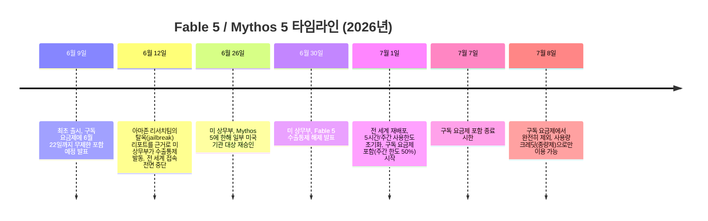
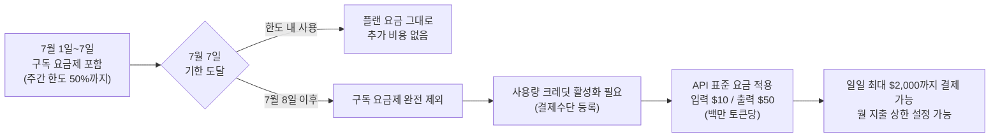

- **작성 기준일: 2026년 7월 4일 (한국시간)**
- **대상 스레드: Threads @chulsu8782 게시물 및 관련 발언 검증**

> 
> 클로드 대답. 지금(7/7까지)은 유료 요금제(Pro/Max/Team)에서 **주간 사용 한도의 최대 50%까지만** Fable 5를 쓸 수 있어요. 그마저도 Opus 4.8보다 약 2배 빠르게 한도를 소진해서, 실사용자들 사이에서는 "5시간 세션 한 번에 주간 사용량 25% 날아갔다", "Max 플랜인데도 한 세션 10여 시간이면 다 소진된다"는 보고가 나올 정도예요. 클리앙 등 커뮤니티에서는 아예 "맛보기 용"이라는 표현이 나올 정도로 마음씨님과 정확히 같은 반응이 확인됩니다. 7월 7일 이후엔 더 극단적이에요. 구독 요금제 포함에서 완전히 빠지고 **사용량 크레딧으로만** 쓸 수 있는데, API 기준으로 입력 100만 토큰당 $10, 출력 $50이라 결국 API처럼 종량제로 결제해야 합니다. 일일 크레딧 한도는 최대 $2,000까지 열려 있고요.
> 
> 즉 "돈이 많아야 쓴다"는 게 과장이 아니라, 실제로 **정액 구독 모델의 전제(헤비유저도 감당 가능한 평균 비용)를 깨는 방식으로 설계된 모델**이라는 분석까지 나와 있어요. 5천만 라인 코드베이스 마이그레이션, 일주일 넘는 자율 연구처럼 "오래 자율적으로 돌아가는" 게 핵심 셀링포인트인데, 그게 바로 개인 유저 예산으로는 감당 안 되는 소비 패턴이라는 게 구조적 모순이죠. 결국 기업/헤비유저용 모델이고, 개인이 요금제 안에서 진지하게 쓰기엔 지금 구조상 "겉핥기"가 맞는 표현이에요.
> 
> https://www.threads.com/@chulsu8782/post/DaUOhqyk_FS
> 

---

## 이 문서를 왜 쓰는가

지난 6월 초 화려하게 등장했다가, 미국 정부의 수출통제로 사흘 만에 사라졌다가, 6월 말 다시 돌아온 모델. Claude Fable 5의 여정은 단순한 '신제품 출시'로 설명하기 어렵다. 여기에 더해 이번엔 **요금 구조 자체가 뒤바뀌는 사건**이 겹쳤다. 원문 스레드가 지적한 "지금은 맛보기용이고, 7월 7일 이후엔 사실상 API 종량제로 전환되어 개인 사용자 예산으로는 감당하기 어렵다"는 주장은 커뮤니티 반응과 Anthropic 공식 발표를 교차 검증한 결과 **대체로 사실에 부합**한다. 다만 일부 수치(특히 "약 2배" 소진 속도)는 Anthropic이 공식적으로 확인한 근거가 별도로 있고, 그 근거는 원문이 언급한 것과는 조금 다른 메커니즘에서 나온다. 이 문서는 그 차이까지 포함해 전체 그림을 정리한다.

---

## 1. 먼저, 무슨 일이 있었는지 시간순으로

Fable 5와 상위 모델인 Mythos 5는 2026년 6월 9일 처음 공개되었다. 이 두 모델은 같은 기반 모델을 공유하지만, Fable 5는 생물학·사이버보안·AI 모델 개발(R&D) 영역에 더 강한 안전장치가 적용된 일반 공개용 버전이고, Mythos 5는 그 안전장치를 낮춰 소수의 신뢰받는 기관에만 제공되는 버전이다.

정리하면, 애초 약속됐던 것은 "6월 9일부터 6월 22일까지 2주간, 사용량 제한 없이 구독 요금제 안에서 사용"이었다. 그런데 사흘 만에 중단됐고, 약 2주 반이 지난 뒤 재개되면서 조건이 완전히 바뀌었다. 이번에는 "7월 1일부터 7월 7일까지 단 6일간, 그것도 주간 사용한도의 절반까지만" 포함된다. 실제로 여러 외신과 커뮤니티에서 "원래 약속의 절반도 안 되는 기간을, 그마저도 반쪽짜리 조건으로 돌려받았다"는 불만이 터져 나왔다.

### 왜 갑자기 막혔나

6월 12일 중단의 발단은 아마존 소속 연구자들이 Fable 5의 안전장치를 우회하는 방법을 발견해 보고한 것이었다. 특정 방식으로 프롬프트를 구성하면 모델이 소프트웨어 취약점 몇 가지를 짚어내고, 그중 한 건에 대해서는 그 취약점을 실제로 악용하는 방식을 보여주는 코드까지 만들어냈다는 내용이었다. 이 보고를 접수한 미 정부는 즉각 외국 국적자(미국 내 거주자 포함, 심지어 Anthropic 소속 외국 국적 직원까지)의 두 모델 접근을 차단하라는 수출통제 지시를 내렸다. Anthropic은 실시간으로 모든 사용자의 국적을 검증할 방법이 없었기 때문에, 결국 전 세계 모든 사용자에 대해 두 모델을 통째로 내렸다.

Anthropic은 이후 해당 취약점이 Fable 5만의 고유한 문제가 아니라 Opus 4.8, GPT-5.5, Kimi K2.7 등 다른 여러 모델에서도 동일하게 재현된다고 반박했다. 그럼에도 정부와의 협상은 약 2주 반 동안 이어졌고, 그 사이 전직 페이스북 최고보안책임자 알렉스 스타모스를 포함한 보안업계 인사 약 40명이 "방어자의 최고 도구를 빼앗고 공격자만 이롭게 하는 조치"라며 공개서한을 내는 등 논란이 커졌다. 결국 6월 30일 상무부가 통제를 해제했고, Anthropic은 그 사이 문제가 된 우회 기법을 99% 이상 차단하는 개선된 안전 분류기를 개발해 적용했다고 밝혔다.

---

## 2. Fable 5가 왜 이렇게 화제였나 — 성능 배경

이 소동이 이례적으로 컸던 이유 중 하나는 Fable 5의 실제 성능이 상당했기 때문이다. Anthropic 공식 발표와 초기 파트너사 후기를 종합하면 다음과 같다.

- **결제 처리 업체 Stripe**는 5개월 걸릴 엔지니어링 작업을 며칠로 압축했다고 밝혔으며, 5천만 줄 규모의 Ruby 코드베이스 마이그레이션을 원래 팀이 2개월 넘게 걸렸을 작업을 단 하루 만에 끝냈다고 전했다.
- SWE-Bench Pro 벤치마크에서 80.3%를 기록해 Opus 4.8(69.2%), GPT-5.5(58.6%), Gemini 3.1 Pro(54.2%)를 앞섰다.
- 상위 모델 Mythos 5는 일주일 넘는 시간 동안 거의 전적으로 자율적으로 유전체학 연구를 수행해, 138종 동물의 단세포 데이터를 취합하고 이를 분석할 자체 머신러닝 모델을 설계·학습시켰다는 사례도 공개됐다.

즉 이 모델의 핵심 셀링 포인트는 "짧은 질의응답"이 아니라 **오랜 시간 사람 개입 없이 스스로 판단하며 돌아가는 장시간 자율 작업**이다. 이 특성이 뒤에서 설명할 요금·사용량 문제와 정면으로 충돌하게 된다.

---

## 3. 지금(7월 7일까지) 실제로 어떻게 쓸 수 있나

Anthropic의 7월 1일 공식 재배포 공지에 따르면, 조건은 다음과 같다.

| 항목 | 내용 |
|---|---|
| 적용 대상 | Pro, Max, Team, 일부 Enterprise(좌석제) 플랜 |
| 포함 기간 | 2026년 7월 1일 ~ 7월 7일 (6일간) |
| 포함 한도 | 각 플랜 **주간 사용한도의 최대 50%** 까지 Fable 5로 사용 가능 |
| 한도 초과 시 | 남은 사용량은 다른 모델(Opus 4.8 등)로 전환해 계속 사용 가능 |
| 대안 | 사용량 크레딧을 켜면 한도 밖에서도 Fable 5를 종량제로 계속 사용 가능 |

원문 스레드가 언급한 "50%까지만 쓸 수 있다"는 부분은 정확하다. 이는 Anthropic이 자사 X(트위터) 계정과 공식 뉴스룸을 통해 직접 밝힌 내용이다.

### 왜 이렇게 빨리 소진되는가 — "2배 빠르다"는 주장의 실체

원문은 "Opus 4.8보다 약 2배 빠르게 한도를 소진한다"고 서술했는데, 이 부분은 확인 결과 흥미로운 지점이 있다. Anthropic이 최초 출시(6월 9일) 당시 공개한 내용에는, Claude.ai 요금제에서 Fable 5와 Mythos 5가 **공식적으로 2배 사용량(2x usage)으로 계산**된다는 설명이 포함되어 있었다. 즉 이는 사용자들의 막연한 체감이 아니라, 애초에 Anthropic이 설계한 계산 방식이다. 다만 토큰 소모량 자체와 "사용량" 카운트가 정확히 1:1로 매핑되는지는 공식적으로 명확히 밝혀지지 않았다.

여기에 더해 실제 커뮤니티 보고를 보면 체감 소진 속도는 이보다 더 크게 느껴지는 경우가 많다.

- 국내 커뮤니티(클리앙)의 한 사용자는 Max 플랜을 쓰면서도 하루 만에 두 번째로 한도에 걸렸고, "체감상 코드 작성 속도는 10~20% 빨라졌지만, 소모량은 150~200% 빨라진 것 같다"고 밝혔다.
- 다른 클리앙 게시물에서는, x20 Max 플랜 사용자조차 한 세션에서 10여 시간 사용하면 할당량이 모두 소진된다는 커뮤니티 보고를 인용하며 "처음 프로모션에서 약속한 사용량의 4분의 1 수준을 일주일 안에 써보라는 것과 같다"고 지적했다. 같은 글에서는 이런 조건을 두고 "쓸 수 있게 해주는 것만으로도 감사해야 한다는 식의 마케팅 감각이 아쉽다"는 냉소적 반응도 나왔다. 원문 스레드의 "맛보기용"이라는 표현과 정확히 같은 문구가 확인되지는 않지만, 커뮤니티 정서는 사실상 동일하다.
- 해외 Reddit(r/ClaudeAI) 커뮤니티에서도 Max20 플랜 사용자가 "분당 거의 2%씩 사용량이 올라갔다. Opus 4.8로 같은 작업을 할 때는 한 번도 한도 근처에도 못 가봤다"고 밝혔고, 5배 Max 플랜 계정이 몇 분 만에 0%에서 43%까지 치솟았다는 보고, 20배 Max 플랜을 45분 만에 다 썼다는 보고, 첫 테스트 프롬프트 하나로 주간 한도의 20%가 날아갔다는 보고도 나왔다.

이처럼 "약 2배"라는 숫자는 Anthropic이 설계한 공식 배율(2배 사용량 카운트)과, 실제 사용자들이 체감하는 훨씬 가파른 소진 속도가 겹쳐서 나온 결과로 볼 수 있다. 다만 "정확히 2배"라는 단일 수치로 못박기보다는, "공식적으로 최소 2배로 계산되며, 실사용 환경에서는 그보다 더 빠르게 느껴질 수 있다" 정도로 이해하는 것이 정확하다.

### 안전 분류기로 인한 '눈치 없는' 모델 전환

소진 속도 문제와 별개로, Fable 5 특유의 불편함으로 자주 언급되는 것이 안전 분류기(classifier)에 의한 자동 모델 전환이다. Fable 5는 사이버보안, 생물학, 경쟁 모델 개발(증류) 관련 요청으로 판단되는 프롬프트를 자동으로 걸러내며, 이렇게 걸러진 요청은 사용자에게 알림과 함께 Opus 4.8로 넘어간다. Anthropic은 이 전환이 전체 세션의 5% 미만에서만 발생한다고 밝혔지만, 실사용자들 사이에서는 이 기준이 지나치게 보수적이라는 불만이 상당하다.

- 국내 클리앙 사용자는 "AES, scrypt, 세션·인증토큰 같은 보안·암호화 관련 코드가 조금이라도 포함되면 자꾸 경고가 뜨고 오퍼스로 전환된다"고 밝혔다.
- 해외 Reddit·Hacker News에서도 "지리학, 수문학, 정치생태학 관련 작업이 다 막힌다", "에르미트 행렬(수학 개념)을 물어봤는데 보안 문제로 Opus 4.8로 전환됐다", "건강 데이터 패턴 분석에 쓰려는데 거부가 너무 잦아 쓸 수가 없다"는 불만이 나왔다.

문제는 이 전환이 **사용량 소모 관점에서도 손해**라는 점이다. 분류기가 요청을 판단하는 과정과, Opus로 전환되어 다시 처리하는 과정 모두 사용량을 깎아먹기 때문에, 사용자 입장에서는 "복잡성 비용을 두 번 낸다"는 지적이 나온다.

한편 이런 보수적 설계와 별개로, Anthropic이 경쟁 모델 개발(증류) 목적으로 의심되는 사용 패턴을 사용자에게 알리지 않고 몰래 성능을 낮추거나 우회시키려던 정책이 알려지면서 별도의 논란도 있었다. 연구 커뮤니티의 반발에 Anthropic은 이를 "잘못된 절충이었다"고 인정하고, 향후 관련 보호조치가 작동하면 사용자에게 알리겠다고 정책을 수정했다.

---

## 4. 7월 7일 이후: 무엇이 달라지는가

7월 8일부터는 Fable 5가 어떤 구독 요금제에도 포함되지 않는다. 즉 정액제 안에서는 아예 사용할 수 없고, **사용량 크레딧(usage credits)** 이라는 별도의 종량제 결제 수단을 켜야만 계속 쓸 수 있다.

### 4-1. 가격은 얼마인가

Fable 5의 API 기준 가격은 다음과 같다. 이는 6월 9일 최초 출시 때부터 변하지 않은 숫자이며, 7월 7일 이후에도 이 API 요금 자체가 바뀌는 것은 아니다. 바뀌는 것은 "구독 요금제 안에서 무료로 쓸 수 있느냐 없느냐"이다.

| 항목 | 가격 |
|---|---|
| 입력 토큰 | 백만 토큰당 $10 |
| 출력 토큰 | 백만 토큰당 $50 |
| 프롬프트 캐시 적중 시 | 백만 토큰당 약 $1 (약 90% 할인) |
| 기본 컨텍스트 윈도우 | 100만 토큰 |
| 최대 출력 | 128K 토큰 |

원문 스레드의 "입력 100만 토큰당 $10, 출력 $50"이라는 서술은 정확하다. 참고로 이는 Opus 4.8의 약 2배, Sonnet 계열의 약 3배 수준의 단가로 알려져 있다.

체감을 위해 예시를 들면, 20만 토큰의 컨텍스트를 읽고 4만 토큰을 출력하는 작업 하나를 Fable 5로 처리하면 약 4달러(입력 0.2×$10 + 출력 0.04×$50)가 든다. 동일한 작업을 상대적으로 저렴한 Sonnet 계열로 처리하면 약 0.8달러 수준으로, 5배 가까운 비용 차이가 난다.

### 4-2. 사용량 크레딧 시스템은 어떻게 작동하나

사용량 크레딧은 Fable 5만을 위해 새로 만들어진 제도가 아니라, Anthropic이 이미 운영 중이던 "Pro·Max 요금제에서 한도 초과 시 종량제로 계속 쓰는" 일반적인 기능이다. Fable 5는 7월 8일부터 이 기존 시스템에 완전히 편입되는 것이다. Anthropic 고객센터 문서 기준 핵심 규칙은 다음과 같다.

- **결제 방식**: Settings > Usage에서 사용량 크레딧을 켜고 결제 수단을 등록하면, 플랜의 포함 한도를 넘는 순간부터 API 표준 요금으로 자동 전환되어 작업이 끊기지 않는다.
- **일일 리딤 한도**: 하루 최대 **$2,000**까지 크레딧을 사용할 수 있다. 원문 스레드가 언급한 "일일 크레딧 한도 최대 $2,000"는 이 지점과 정확히 일치한다.
- **월간 지출 상한**: 사용자가 원하는 만큼 월 지출 한도를 직접 설정할 수 있고, 무제한으로 둘 수도 있다.
- **자동 충전**: 잔액이 특정 기준 아래로 떨어지면 자동으로 충전되도록 설정 가능하다.
- **번들 구매 옵션**: 개인 Pro·Max 사용자는 월 최대 $2,000어치까지 할인된 크레딧 번들을 미리 구매할 수 있다(최대 30% 할인). Team 플랜은 월 $3,000까지 가능하다.
- 5시간마다 초기화되는 플랜 기본 한도는 사용량 크레딧 활성화 여부와 무관하게 그대로 유지된다. 크레딧은 그 기본 한도를 다 쓴 이후에만 작동한다.

정리하면, "구독료 안에서 무제한처럼 느껴지던 사용"과 "쓴 만큼 카드에서 빠져나가는 API형 결제"는 완전히 다른 경험이다. 7월 8일부터 Fable 5 헤비 유저는 사실상 매달 API 요금제를 별도로 운영하는 것과 다름없는 상황에 놓인다.

---

## 5. 원문 스레드 주장, 항목별 팩트체크

| 원문 주장 | 검증 결과 | 비고 |
|---|---|---|
| 지금(~7/7)은 유료 요금제에서 주간 사용 한도의 최대 50%까지만 Fable 5 사용 가능 | **사실** | Anthropic 공식 발표(재배포 공지, X 계정)와 정확히 일치 |
| Opus 4.8보다 약 2배 빠르게 한도 소진 | **대체로 사실, 배경은 다름** | Anthropic이 최초 출시 시 "2배 사용량 계산"을 공식화했고, 이것이 체감 소진 속도의 근거 중 하나로 보임. 실사용자 보고는 이보다 더 빠르게 느껴진다는 경우도 다수(150~200%, 세션당 20~43% 등 사례별 편차 큼) |
| 5시간 세션 한 번에 주간 사용량 25% 소진, Max 플랜도 세션 10여 시간이면 소진 | **커뮤니티 보고와 부합** | 정확히 "25%"라는 숫자를 못박은 1차 출처는 못 찾았으나, "Max 플랜도 세션 10여 시간이면 소진된다"는 서술은 클리앙 커뮤니티 보고와 일치. Reddit에서도 유사하게 짧은 시간에 대량 소진된 사례 다수 확인 |
| 커뮤니티에서 "맛보기 용"이라는 표현이 나올 정도 | **정서적으로 부합, 문구 자체는 미확인** | "쓸 수 있게 해주는 것만으로도 감사해야 하는 수준의 마케팅"이라는 냉소적 국내 커뮤니티 반응 확인. "맛보기용"이라는 정확한 표현의 1차 출처는 특정하지 못함 |
| 7월 7일 이후 구독 요금제에서 완전히 제외, 사용량 크레딧으로만 사용 | **사실** | Anthropic 공식 발표와 일치 |
| API 기준 입력 100만 토큰당 $10, 출력 $50 | **사실** | Anthropic 공식 가격 정책과 일치, 최초 출시 때부터 동일 |
| 일일 크레딧 한도 최대 $2,000 | **사실** | Anthropic 고객센터 문서에 명시된 "사용량 크레딧 일일 리딤 한도 $2,000"와 일치. 단, 이는 Fable 5 전용 규정이 아니라 Pro·Max 요금제 사용량 크레딧 제도 전반에 적용되는 일반 규정 |
| 정액 구독 모델의 전제를 깨는 방식으로 설계됐다는 분석 | **해석/분석 영역** | 사실관계라기보다 여러 매체·커뮤니티의 공통된 해석에 가까움. 아래 6장에서 상세 서술 |
| 5천만 라인 코드베이스 마이그레이션, 일주일 넘는 자율 연구가 핵심 셀링포인트 | **사실** | Stripe의 5천만 줄 Ruby 코드베이스 마이그레이션 사례, Mythos 5의 일주일 이상 자율 유전체학 연구 사례 모두 Anthropic 공식 발표에서 확인 |

---

## 6. 구조적으로 보면: 왜 "겉핥기"라는 평가가 나오는가

이 대목은 사실 확인의 영역이라기보다는, 여러 매체와 커뮤니티가 공통적으로 짚고 있는 **해석**에 가깝다. 다만 그 해석을 뒷받침하는 사실관계는 비교적 뚜렷하다.

1. **셀링 포인트와 소비 패턴의 충돌.** Fable 5가 내세우는 핵심 가치는 "사람 개입 없이 몇 시간, 며칠씩 스스로 판단하며 돌아가는 장시간 자율 작업"이다. 그런데 바로 그 특성 — 오래, 많이, 복잡하게 돌아가는 것 — 이 정액 구독 모델이 감당하기 가장 어려운 소비 패턴이다. 짧은 질의응답 위주로 설계된 요금제 구조에, 며칠씩 자율로 도는 에이전트를 얹으면 필연적으로 한도가 빠르게 바닥난다.
2. **가격 구조 자체가 프리미엄.** 입력 $10 / 출력 $50이라는 단가는 Opus 4.8 대비 약 2배, Sonnet 계열 대비 약 3배 수준이다. 여기에 "2배 사용량 계산"까지 겹치면, 동일한 구독료로 처리할 수 있는 실질 작업량은 더 줄어든다.
3. **일일 $2,000이라는 상한선이 시사하는 사용자층.** 개인 취미 사용자에게는 상상하기 어려운 금액이지만, 기업의 R&D·보안팀 예산 관점에서는 합리적으로 설정될 수 있는 수준이다. 이는 이 크레딧 시스템이 애초에 기업·헤비 유저를 염두에 두고 설계되었다는 정황으로 해석될 수 있다.
4. **실제 활용 사례도 기업 중심.** 공식적으로 공개된 성과 사례(Stripe의 대규모 코드베이스 마이그레이션, 결제·트레이딩 그룹의 분석 벤치마크, 제약·바이오 연구 등)는 대부분 기업 또는 전문 연구기관 단위다. 개인 사용자가 이런 스케일의 작업을 상시로 돌릴 이유도, 예산도 없는 경우가 대부분이다.

이런 정황을 종합하면, "겉핥기용" 혹은 "맛보기용"이라는 평가는 과장이라기보다는 **실제 요금·사용량 구조가 개인 구독자보다 기업 고객에 최적화되어 있다는 관찰에 기반한 합리적 해석**에 가깝다. 다만 이는 어디까지나 현재(7월 초) 시점의 정책이며, Anthropic이 향후 개인 사용자를 위한 별도 옵션(예: 더 낮은 등급의 자율 작업 한도, 개인용 크레딧 할인 등)을 내놓을 가능성도 배제할 수는 없다. 실제로 Anthropic은 재배포 공지에서 "향후 장시간 사용 사례를 지원할 다른 옵션을 계속 고민하고 있다"는 취지의 언급을 해온 바 있어, 이 구조가 고정된 최종 형태라고 단정하기는 이르다.

---

## 7. 용어 해설

| 용어 | 설명 |
|---|---|
| **Fable 5 / Mythos 5** | 2026년 6월 공개된 Claude 5세대 최상위 모델군. 동일한 기반 모델을 공유하되, Fable 5는 생물학·사이버보안·모델 증류 영역에 더 강한 안전장치가 적용된 일반 공개용, Mythos 5는 그 안전장치를 낮춘 소수 기관 전용 버전 |
| **수출통제(export control)** | 특정 기술이나 제품을 누가, 어느 국가로 반출·제공할 수 있는지를 정부가 통제하는 제도. 이번 사례에서는 미 상무부가 외국 국적자의 Fable 5·Mythos 5 접근을 제한하도록 지시하면서 발동됨 |
| **안전 분류기(classifier)** | 사용자의 요청이 잠재적으로 위험한 용도(사이버 공격, 생물학적 위해, 경쟁 모델 개발 등)에 해당하는지를 자동으로 판별하는 소형 AI 시스템. 위험하다고 판단되면 해당 요청을 더 낮은 등급의 모델(Opus 4.8)로 우회시킨다 |
| **주간 사용한도(weekly usage limit)** | 5시간 단위로 초기화되는 단기 한도와 별개로, 7일 주기로 초기화되는 총 사용량 상한. 플랜(Pro/Max/Team)마다 규모가 다르다 |
| **사용량 크레딧(usage credits)** | 플랜의 포함 한도를 넘은 뒤에도 작업이 끊기지 않도록, API 표준 요금으로 추가 과금하며 계속 사용할 수 있게 해주는 제도. 과거 "Extra Usage"로 불리던 기능이 이름을 바꾼 것 |
| **2배 사용량 계산(2x usage)** | Fable 5·Mythos 5가 Claude.ai 요금제 한도 계산 시 표준 모델 대비 2배의 사용량으로 집계되도록 설정된 정책 |
| **프롬프트 캐싱(prompt caching)** | 동일하거나 유사한 컨텍스트를 반복 처리할 때, 이미 처리한 부분을 캐시해 재처리 비용을 크게(최대 약 90%) 낮춰주는 기능 |

---

## 8. 참고자료

- Anthropic 공식 뉴스룸, "Claude Fable 5 and Claude Mythos 5" (최초 출시 발표), anthropic.com/news/claude-fable-5-mythos-5
- Anthropic 공식 뉴스룸, "Redeploying Claude Fable 5" (재배포 공지, 7월 1일), anthropic.com/news/redeploying-fable-5
- Anthropic 고객센터, "Manage usage credits for paid Claude plans", support.claude.com/en/articles/12429409
- Anthropic 고객센터, "Buy usage bundles", support.claude.com/en/articles/14246112
- PCWorld, "Claude subscribers are furious over Fable's new restrictions", pcworld.com
- Search Engine Journal, "Anthropic's Claude Fable 5 Is Back With New Usage Limits And Safeguards", searchenginejournal.com
- The New Stack, "Fable 5: Guardrails and burn rate are annoying users, who say it's still better than Opus 4.8", thenewstack.io
- The Decoder, "Anthropic releases Claude Fable 5 and Mythos 5 with major gains in coding and science", the-decoder.com
- The Hacker News, "Anthropic Restores Claude Fable 5 After U.S. Lifts Jailbreak-Linked Export Controls", thehackernews.com
- Fortune, "Anthropic's Fable and Mythos models are back. But U.S. AI policy is still a mess.", fortune.com
- CNBC, "Anthropic says Trump admin has lifted export controls on Claude Fable 5 and Mythos 5", cnbc.com
- 바이라인네트워크, "[그게 뭔가요] 페이블 5는 왜 사흘 만에 막혔나", byline.network
- 이코노미트리뷴, "클로드 페이블5, '몰래 성능 제한' 논란…앤트로픽 '잘못된 판단'", economytribune.co.kr
- 클리앙, "Fable5 주간한도 50%만 사용 가능??", clien.net/service/board/park/19219726
- 클리앙, "클로드5 Fable 초간단 후기", clien.net/service/board/park/19206843
- 클리앙, "클로드 주간 제한.. 세상에 이런게 있었다니..", clien.net/service/board/park/19158769

---

*본 문서는 2026년 7월 4일 기준으로 확인 가능한 공식 발표 및 언론·커뮤니티 보도를 교차 검증하여 작성되었습니다. 사용량 크레딧 전환 비율, 정확한 소진 속도 배율 등 Anthropic이 공식적으로 명시하지 않은 세부 수치는 "커뮤니티 관측/추정"으로 명확히 구분해 표기했습니다. 정책은 예고 없이 변경될 수 있으므로, 실제 예산 집행 전에는 Claude 사용량 대시보드와 Anthropic 공식 채널을 통해 최신 조건을 재확인하시기 바랍니다.*
