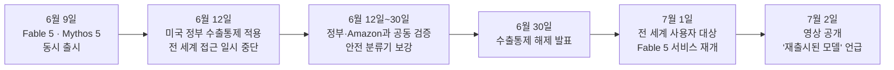
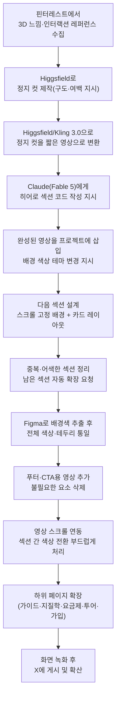
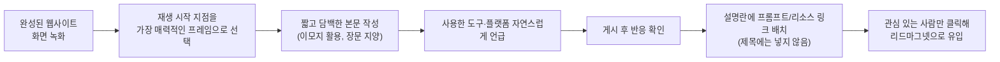

## 1. 이 영상은 무엇을 다루는가

이번에 살펴본 영상은 X(트위터) 계정 @viktoroddy를 운영하는 크리에이터 Viktor Oddy가 2026년 7월 2일에 공개한 튜토리얼로, 핵심 메시지는 두 가지다. 첫째, 최근 다시 사용할 수 있게 된 Anthropic의 최상위 모델 Claude Fable 5를 이용해 3D 느낌의 인터랙션과 배경 영상이 살아 있는 애니메이션 웹사이트를 처음부터 끝까지 만드는 과정이다. 둘째, 그렇게 만든 결과물을 X에 올려 노출을 늘리고 잠재 고객을 확보하는 실전 그로스 방법이다. 영상 속 예시 웹사이트는 "행성/지질학"을 콘셉트로 한 가상의 브랜드(최종적으로 Lithos라는 이름이 붙는다)이며, 히어로 섹션의 회전하는 행성 애니메이션부터 시작해 배경 영상이 스크롤에 반응하는 섹션, 요금제, FAQ, 푸터, 그리고 하위 페이지(필드 가이드, 지질학, 요금제, 라이브 투어, 회원가입)까지 순차적으로 확장해 나간다. 제작에 사용된 도구는 크게 네 가지로, 코드를 실제로 작성하는 Claude(모델: Fable 5), 정지 컷과 영상을 만드는 Higgsfield(영상 모델 Kling 3.0 포함), 색상을 추출하고 다듬는 Figma, 그리고 완성된 프롬프트와 배경 영상 소스를 모아둔 라이브러리 사이트 MotionSites.ai이다.

## 2. 먼저 이해해야 할 것 — Claude Fable 5는 어떤 모델인가

영상에서는 Fable 5를 두고 "새로 재출시된 모델(a new model that have been re-released back)"이라고 표현하는데, 이는 단순한 홍보 문구가 아니라 실제로 있었던 사건을 가리킨다. Anthropic은 2026년 6월 9일 Claude Fable 5와 Claude Mythos 5를 동시에 공개했다. 두 모델은 내부적으로는 동일한 기반 모델을 공유하지만, Fable 5는 일반 사용자에게 안전하게 제공하기 위한 안전장치(safety classifier)를 갖춘 버전이고, Mythos 5는 이러한 안전장치 일부가 해제된 채로 Project Glasswing에 소속된 소수의 신뢰받는 사이버보안·인프라 파트너에게만 제한적으로 제공되는 버전이다(Anthropic, 2026년 6월 9일). Anthropic은 이 두 모델을 기존 Opus보다 상위 등급인 "Mythos-class"로 새롭게 분류했으며, Fable 5는 소프트웨어 엔지니어링·지식 노동·비전·과학 연구·장시간 자율 작업에서 자사가 일반에 공개한 모델 중 가장 강력하다고 설명했다(Anthropic, 2026년 6월 9일).

그런데 출시 사흘 만인 6월 12일, 미국 정부가 Fable 5와 Mythos 5에 수출통제를 적용하면서 상황이 급변했다. 이 통제는 외국 국적자의 접근을 제한하는 내용이었는데, Anthropic이 실시간으로 국적을 확인할 방법이 없었기 때문에 결국 두 모델 모두에 대한 접근을 전 세계 사용자 대상으로 일시 중단했다(Anthropic, 2026년 6월 30일). 이 조치의 배경에는 Amazon 소속 연구자들이 Fable 5의 안전장치를 우회해 특정 소프트웨어 취약점을 찾아내도록 유도한 사례가 있었는데, Anthropic이 이후 자체 검증한 결과 Opus 4.8, GPT-5.5, Kimi K2.7을 포함한 다른 여러 모델들도 동일한 취약점을 동일하게 찾아낼 수 있었다는 사실이 확인되었다. 즉 이번에 문제가 된 동작은 Mythos 등급 모델만의 고유한 사이버 위험이 아니라, 방어적 보안 작업 범주에서 안전장치가 다소 보수적으로 걸린 경계선 사례였다는 것이 Anthropic의 설명이다(Anthropic, 2026년 6월 30일). 이후 정부와의 협의를 거쳐 6월 30일 수출통제가 해제되었고, Fable 5는 7월 1일부터 Claude Platform, Claude.ai, Claude Code, Claude Cowork 전반에 걸쳐 전 세계 사용자에게 다시 제공되기 시작했다(Anthropic, 2026년 6월 30일). 영상이 촬영·공개된 시점(7월 2일)은 정확히 이 복구 직후였고, 그래서 크리에이터가 "재출시된 모델"이라는 표현을 쓴 것이다.

성능 측면에서 Anthropic은 Fable 5가 자사의 엔드투엔드 바이브코딩 벤치마크인 ViBench에서 지금까지 테스트한 모델 중 가장 높은 점수를 기록했으며, 같은 작업을 더 적은 토큰과 더 짧은 시간에 끝낸다고 밝혔다(Anthropic, 2026년 6월 9일). 가격은 입력 토큰 100만 개당 10달러, 출력 토큰 100만 개당 50달러로 책정되어 있고, API에서는 `claude-fable-5`라는 모델 이름으로 호출한다(Anthropic Claude Platform 문서, 2026년). 영상 속 코드 작성 화면에서 "Fable 5는 가장 성능이 뛰어나면서도 Opus 4.8보다 사용량 소모가 훨씬 적다"는 안내 문구가 반복해서 등장하는데, 이는 실제 제품 내 안내 문구와 일치한다.

## 3. 전체 제작 파이프라인 한눈에 보기

영상이 보여주는 작업 흐름을 단계별로 정리하면 다음과 같다. 핵심은 "레퍼런스 수집 → 정지 컷 제작 → 영상화 → 코드 반영 → 반복 수정 → 확장"이라는 순환 구조이며, 각 단계마다 서로 다른 도구가 맡은 역할을 명확히 나눠서 사용한다는 점이 특징이다.

## 4. 단계별 상세 설명

### 4.1 영감 수집: 핀터레스트에서 레퍼런스 찾기

크리에이터는 어떤 모델을 쓰든 첫 단계는 동일하다고 강조한다. 핀터레스트에서 원하는 분위기, 즉 입체감이 느껴지는 구도나 흥미로운 인터랙션, 애니메이션 요소가 담긴 그래픽을 먼저 찾는 것이다. 이 단계에서 목표는 완성된 코드가 아니라 "이런 느낌으로 만들고 싶다"는 방향성을 구체적인 한 장으로 확보하는 것이며, 이후 모든 프롬프트는 이 레퍼런스를 기준으로 작성된다.

### 4.2 정지 컷 제작과 영상화 — Higgsfield와 Kling 3.0

레퍼런스를 찾은 뒤에는 Higgsfield의 그래픽 생성 기능을 사용해 원하는 구도로 정지 컷을 다시 만든다. 예시에서는 16:9 비율을 선택하고, 레퍼런스 속 행성 오브젝트를 화면 하단에 더 가깝게 배치하며 위쪽에 여백을 넉넉히 남기라는 식으로 구체적인 위치·여백 조건을 지시했다. 정지 컷이 만족스럽게 나오면 이번에는 이를 짧은 영상으로 바꾸는데, 이때 중요한 것은 프롬프트에 "무엇을 하지 말아야 하는지"까지 명시하는 것이다. 예시 프롬프트의 핵심은 행성이 제자리에서 회전하되 크기나 위치는 바뀌지 않아야 하고, 화면이 확대되거나 축소되어서도 안 된다는 제약 조건이었다. 영상 길이는 약 10초, 해상도는 1080p, 비율은 16:9로 설정해 생성했다.

이 작업에 사용된 플랫폼은 Higgsfield로, 한 구독으로 Kling 3.0, Veo 3.1, Sora 2, Seedance 2.0, Wan 2.7 등 여러 영상 생성 모델에 동시 접근할 수 있는 통합 워크스페이스다(Higgsfield 공식 사이트, 2026년). 이 중 영상 후반부의 지구 회전 장면 제작에는 Kling 3.0이 사용되었는데, Kling 3.0은 중국 콰이쇼우(Kuaishou)가 개발한 최신 세대 영상 생성 모델로, 영상·오디오·정지 컷을 하나의 아키텍처 안에서 함께 다루는 최초의 통합 멀티모달 모델이라는 점이 특징이다(Higgsfield 블로그, 2026년). Higgsfield는 2026년 6월 한 달에만 연매출이 5억 달러 규모로 성장했다고 알려졌으며, 구글 브레인 출신 연구자들이 설립한 회사로 현재 기업가치는 약 13억 달러 수준으로 평가받는다(테크타임스, 2026년 6월 30일).

### 4.3 Claude Fable 5로 히어로 섹션 코드 작성

정지 컷과 영상 소재가 준비되면 본격적으로 코드 작업 단계로 넘어간다. 이때 크리에이터는 매번 처음부터 프롬프트를 새로 쓰지 않고, MotionSites.ai라는 사이트에서 이미 검증된 프롬프트를 가져와 재사용하는 방식을 권장한다. MotionSites.ai는 히어로 섹션, 배경 애니메이션, 그라디언트 등을 미리 만들어 둔 프롬프트 형태로 제공하는 라이브러리 사이트로, 이용자는 원하는 디자인의 프롬프트를 복사해 코딩 도구에 붙여넣기만 하면 동일한 결과를 얻을 수 있다(MotionSites.ai 공식 사이트, 2026년). 이렇게 하면 처음부터 여러 번 시행착오를 거치며 사용량을 소모하지 않아도 되기 때문에, 크레딧과 시간을 절약할 수 있다는 것이 핵심 이유다.

실제 작업에서는 참고할 프롬프트를 가져오되 필요 없는 요소(마우스 오버 시 나타나는 인터랙션 등)는 빼고, 배경은 일단 완전한 검은색으로 유지해 달라고 조건을 수정한 뒤 Fable 5를 선택된 모델로 지정해 전송했다. 결과적으로 검은 배경의 히어로 섹션 틀이 먼저 완성되었고, 그 다음 단계에서 앞서 만들어 둔 회전하는 행성 영상을 프로젝트 폴더에 끌어다 놓고 "이 영상을 히어로 섹션의 배경으로 넣되 어떤 오버레이도 씌우지 말아 달라"는 지시와 함께, 기존에 쓰이던 주황색 포인트 컬러를 보라색으로 바꿔 달라고 요청했다. Fable 5는 이 두 요청을 한 번에 반영해 영상 배경과 색상 테마가 함께 적용된 결과를 내놓았다.

### 4.4 다음 섹션 설계 — 스크롤 고정 배경과 카드 레이아웃

히어로 섹션이 완성된 뒤에는 다음 섹션을 설계했다. 요구사항은 제법 구체적이었다. 사용자가 스크롤을 내리는 동안 배경 영상은 화면에 고정된 채로 유지되고, 텍스트만 사라지도록 하며, 태그라인·헤드라인·짧은 설명으로 구성된 카드 3개를 배경 영상 위에 오버레이 없이 그대로 배치하되 왼쪽에 2개, 오른쪽에 2개로 나누어 히어로 섹션과 비슷한 레이아웃을 유지해 달라는 것이었다. 여기에 더해 다음 섹션까지 한 번에 만들어 보라고 요청하면서, 세부적인 형태는 AI가 어느 정도 창의적으로 변형해도 좋다는 여지를 남겼다.

결과를 확인해 보니 첫 번째 섹션은 의도한 대로 잘 나왔지만, 두 번째 섹션은 첫 번째와 지나치게 비슷해 시각적으로 구분이 잘 되지 않는 문제가 있었다. 이때 크리에이터가 취한 조치는 두 가지였다. 먼저 중복된 두 번째 섹션은 과감히 삭제하도록 지시했고, 이어서 지금까지 확립된 폰트·배경색·크기 규칙을 그대로 재사용해 나머지 네다섯 개 섹션을 새로 만들어 달라고 요청하면서, 이번에는 배경 영상이 두 번째 섹션 이후부터는 더 이상 보이지 않도록 숨겨 달라는 조건을 추가했다. Fable 5는 이 지시를 받아 나머지 섹션들을 한 번에 생성했으며, 이미 확립된 디자인 시스템(색상·폰트·여백)을 일관되게 재사용한 결과 전형적인 "AI가 만든 티가 나는" 뻔한 레이아웃이 아니라 각 섹션마다 조금씩 다른 독창적인 구성을 만들어 냈다는 평가를 받았다. 다만 일부 카드에 남아 있는 AI 특유의 어색한 테두리 선(스트로크) 처리는 이후 별도로 수정이 필요한 부분으로 지적되었다.

### 4.5 색상 통일 작업 — Figma를 활용한 보정

전체 섹션을 다 만들고 보니 배경 영상이 깔린 첫 두 섹션과 이후 순수 코드로 만들어진 섹션들 사이에 미묘한 색상 차이가 눈에 띄었다. 이를 해결하기 위해 크리에이터는 코딩 도구 밖에서 별도의 보정 작업을 거쳤다. 배경 영상이 재생되는 화면 영역을 그대로 Figma로 가져온 뒤, 여기에 강한 흐림 효과를 주어 색상들이 뒤섞인 하나의 평균적인 색조를 얻어냈고, 그 안에서 대표 색상 값을 하나 추출했다. 이렇게 얻은 정확한 색상 코드(hex 값)를 다시 Fable 5에게 전달하면서, 모든 섹션의 배경색을 이 색상으로 통일해 달라고 요청했다. 이어서 요금제 섹션의 카드에 남아 있던 테두리 선을 제거하고, 대신 항목 설명 앞에 짧은 구분선을 넣어 달라고 하면서 그 선의 색상을 기존 보라색 대신 회색으로 바꿔 가독성을 높이도록 조정했다.

이 과정에서 드러나는 흥미로운 점은, AI에게 "적당히 알아서 맞춰 달라"고 맡기는 대신 정확한 수치(색상 코드)를 직접 측정해 전달함으로써 결과의 정밀도를 크게 높였다는 것이다. 즉 순수하게 프롬프트만으로 반복해서 색을 맞추는 대신, 디자인 도구에서 얻은 객관적인 값을 코딩 모델에 입력값으로 넘겨주는 하이브리드 방식이 실제로는 더 효율적이었다.

### 4.6 푸터와 콜투액션(CTA) 마무리 — 두 번째 배경 영상

디자인을 다듬는 후반 작업에서는 페이지 하단의 푸터가 지나치게 어둡고 비어 보인다는 문제를 다시 핀터레스트에서 브랜드 콘셉트에 맞는 레퍼런스를 찾아 해결했다. 이번에는 Kling 3.0을 이용해 지구가 제자리에서 천천히 회전하는 영상을 새로 만들었는데, 프롬프트에는 회전이 매끄럽고 입체감 있는 깊이를 가져야 하며 확대나 축소는 없어야 한다는 조건을 담았다. 완성된 영상은 마지막 CTA 섹션("Start where you stand")과 그 아래 푸터 영역까지 걸쳐 오버레이 없이 배경으로 깔리도록 지시했고, 동시에 푸터에 남아 있던 저작권 표기 줄과 CTA-푸터 사이의 구분선을 삭제해 두 영역이 하나의 영상 위에서 자연스럽게 이어지도록 만들었다. 이 작업으로 인해 링크 텍스트의 가독성이 떨어지는 부작용이 생기자, 푸터의 카테고리 제목(탐색·회사·팔로우 등)만 흰색으로 바꿔 대비를 높이는 세부 조정도 함께 진행했다.

### 4.7 스크롤 연동 애니메이션과 섹션 전환 다듬기

이어서 인용구 섹션에도 별도의 배경 영상을 추가했는데, 이번에는 직접 새로 생성하지 않고 MotionSites.ai가 제공하는 배경 영상 라이브러리에서 콘셉트에 맞는 영상을 골라 링크를 그대로 코딩 도구에 전달하는 방식을 사용했다. 또한 히어로 섹션의 첫 배경 영상이 스크롤 위치에 따라 함께 움직이도록, 즉 영상 재생을 사용자의 스크롤 동작에 물리적으로 연동시켜 달라는 요청도 반영했다. 마지막으로 두 번째 섹션과 세 번째 섹션 사이에서 색상이 갑자기 뚝 끊기듯 전환되는 문제를 해결하기 위해, 투명한 상태에서 단색으로 서서히 바뀌는 그라디언트 방식으로 전환을 부드럽게 처리해 달라고 요청했다. 이런 세밀한 요청들은 한 번에 완벽하게 반영되지 않는 경우도 있었지만, 결과를 확인하고 다시 구체적인 표현으로 재요청하는 짧은 반복을 통해 점차 다듬어졌다.

### 4.8 하위 페이지 확장

기본 랜딩 페이지의 디자인 언어(색상·폰트·여백·톤)가 충분히 자리 잡은 뒤에는, 같은 원칙을 그대로 적용해 필드 가이드, 지질학, 요금제(Plans), 라이브 투어, 회원가입 페이지까지 한 번에 만들어 달라고 요청했다. Fable 5는 이미 학습된 디자인 시스템을 재사용해 각 페이지를 순차적으로 생성했으며, 회원가입 페이지에서는 앞서 만들어 둔 배경 영상 자산을 그대로 재활용해 톤을 통일시켰다.

## 5. 이 워크플로우가 작동하는 이유

전체 과정을 관통하는 원칙은 세 가지로 요약할 수 있다.

첫째, 레퍼런스와 프롬프트를 먼저 준비해 두면 모델이 시행착오 없이 결과를 낼 확률이 높아지고, 이는 곧 사용량(크레딧)과 시간의 절약으로 이어진다. MotionSites.ai 같은 검증된 프롬프트 라이브러리를 활용하는 것도 같은 맥락이다.

둘째, 색상·폰트·레이아웃 같은 디자인 시스템을 초반에 확실히 확립해 두면, 이후 "지금까지 쓰던 스타일을 그대로 재사용해서 나머지를 만들어 달라"는 식의 상위 수준 지시만으로도 모델이 일관되고 상대적으로 독창적인 결과를 낼 수 있다. 이는 매 섹션마다 세세한 디자인 지시를 반복하는 것보다 훨씬 효율적이다.

셋째, 모델이 완벽하게 처리하기 어려운 미세한 색상·정렬 문제는 Figma 같은 별도 도구에서 객관적인 값을 뽑아내 다시 프롬프트에 입력값으로 넣어주는 하이브리드 방식이 유효했다. 즉 코딩 모델과 디자인 도구를 서로의 약점을 보완하는 방식으로 함께 사용하는 것이 핵심이다.

## 6. X(트위터)에서 확산을 만드는 전략

영상 후반부는 완성된 웹사이트를 실제로 어떻게 노출시키고 잠재 고객을 확보하는지에 대한 내용이다. 크리에이터는 약 1년간 X를 운영해 팔로워 6만 명을 확보했으며, 게시물 하나가 260만 회, 다른 게시물이 320만 회, 또 다른 게시물이 40만 회 노출된 사례를 근거로 제시했다. 다만 이 수치들은 크리에이터 본인이 자신의 계정 통계를 근거로 공개한 것이며, 외부에서 독립적으로 검증된 자료는 아니라는 점은 분명히 해 둘 필요가 있다.

전략의 핵심 요소는 다음과 같다.

- **첫 화면(썸네일) 최적화**: 짧은 영상을 게시할 때는 재생 전 정지된 첫 화면이 곧 유튜브의 썸네일과 같은 역할을 한다는 점을 강조한다. 애니메이션이 막 시작되면서도 핵심 콘텐츠가 이미 눈에 들어오는 지점을 첫 화면으로 고르는 것이 조회수에 큰 영향을 준다고 설명한다.
- **짧고 담백한 문구**: X는 긴 설명을 읽는 공간이 아니므로 본문 문구는 에세이처럼 길게 쓰지 말고, 간단한 감탄사나 이모지 하나 정도로 짧게 마무리하는 편이 낫다고 조언한다.
- **리드마그넷은 제목이 아니라 설명에**: 게시물의 첫 문구(제목 역할)에는 절대로 구매·가입 유도 문구를 넣지 않는다. 먼저 순수하게 유용한 결과물 자체를 보여주고, 사람들이 관심을 보이면 그 아래 설명 부분에 "이 영상에 나온 프롬프트 전체를 원하면 이 링크로"라는 식의 안내를 덧붙이는 순서를 지킨다. 제목에 바로 홍보성 링크를 넣으면 스팸으로 인식되어 노출이 줄어들 위험이 크다는 것이 그 이유다.
- **툴 메이커의 자연스러운 리포스트 유도**: 코딩 도구나 플랫폼을 실제로 사용한 결과물을 게시하면서 해당 서비스를 태그하거나 언급하면, 그 서비스 계정이 좋은 사례를 자체적으로 리포스트해 주는 경우가 있다는 점도 언급된다. 크리에이터 본인의 초기 성장 역시 특정 플랫폼을 태그한 게시물이 해당 플랫폼 계정에 의해 리포스트되면서 시작되었다고 밝혔다. 다만 이는 특정 서비스가 항상 그렇게 한다는 보장이 아니라, 실제로 가치 있는 결과물을 보여줄 때 발생할 수 있는 부수적인 효과로 소개된다.

## 7. 이번 작업에 사용된 도구 정리

| 도구 | 역할 | 비고 |
|---|---|---|
| Higgsfield | 정지 컷 생성, Kling 3.0 등 여러 영상 생성 모델을 하나의 구독으로 이용 | Veo 3.1, Sora 2, Seedance 2.0, Wan 2.7 등 15개 이상 모델을 통합 제공(Higgsfield, 2026년) |
| Kling 3.0 | 회전하는 지구·행성 등 부드러운 모션의 배경 영상 생성 | 콰이쇼우가 개발한 영상·오디오·정지 컷 통합 멀티모달 모델(Higgsfield 블로그, 2026년) |
| Claude(Fable 5) | 실제 웹사이트 코드 작성, 반복 수정, 하위 페이지 확장 | Anthropic의 Mythos급 최상위 모델, 2026년 6월 9일 출시(Anthropic, 2026년) |
| Figma | 배경 영상 화면에서 평균 색상 값 추출, 세부 색상 보정 | 흐림 효과를 이용한 색상 샘플링 용도로 활용 |
| MotionSites.ai | 검증된 히어로 섹션·배경 영상 프롬프트 라이브러리 제공 | 프롬프트를 복사해 코딩 도구에 붙여넣는 방식(MotionSites.ai, 2026년) |
| 화면 녹화 소프트웨어 | 완성된 웹사이트를 짧은 영상으로 기록해 X에 게시 | 특정 제품명은 영상에서 구체적으로 밝혀지지 않음 |

## 8. 정리 및 실전 체크리스트

이번 영상이 전달하는 메시지를 한 문장으로 요약하면, "레퍼런스 수집과 디자인 시스템 확립을 먼저 끝내고, 이후에는 코딩 모델과 영상·디자인 도구를 서로 보완적으로 오가며 반복적으로 다듬는 것"이 애니메이션 웹사이트 제작의 실질적인 지름길이라는 것이다. 여기에 더해 결과물을 실제로 노출시키기 위한 게시 전략, 즉 첫 화면의 매력도, 담백한 문구, 설명란에 배치하는 리드마그넷 순서까지 갖추어야 비로소 제작과 확산이 하나의 흐름으로 완성된다.

체크리스트로 정리하면 다음과 같다.

1. 핀터레스트 등에서 원하는 분위기의 레퍼런스를 먼저 확보한다.
2. Higgsfield 같은 도구로 정지 컷을 만들고, 이를 짧은 배경 영상으로 변환한다. 이때 "하지 말아야 할 것"(확대/축소 금지, 위치 변경 금지 등)까지 프롬프트에 명시한다.
3. MotionSites.ai 같은 검증된 프롬프트 라이브러리를 활용해 처음부터 시행착오를 줄인다.
4. Claude Fable 5로 히어로 섹션부터 만들고, 색상·폰트·톤을 확립한 뒤 그 스타일을 재사용하도록 지시해 나머지 섹션을 확장한다.
5. 결과물에서 어색하거나 중복된 섹션은 과감히 삭제 지시를 내리고 다시 만들게 한다.
6. 모델이 처리하기 어려운 미세한 색상 문제는 Figma 등에서 정확한 값을 추출해 다시 입력값으로 전달한다.
7. 완성된 사이트를 화면 녹화한 뒤, 첫 화면(썸네일 역할)을 신중히 고르고, 짧고 담백한 문구로 게시한다.
8. 리드마그넷이나 홍보 링크는 게시물 제목이 아니라 설명란에 배치해 스팸으로 인식되지 않도록 한다.

---

작성일: 2026년 7월 4일
