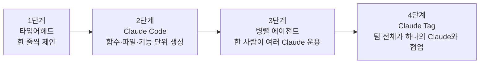
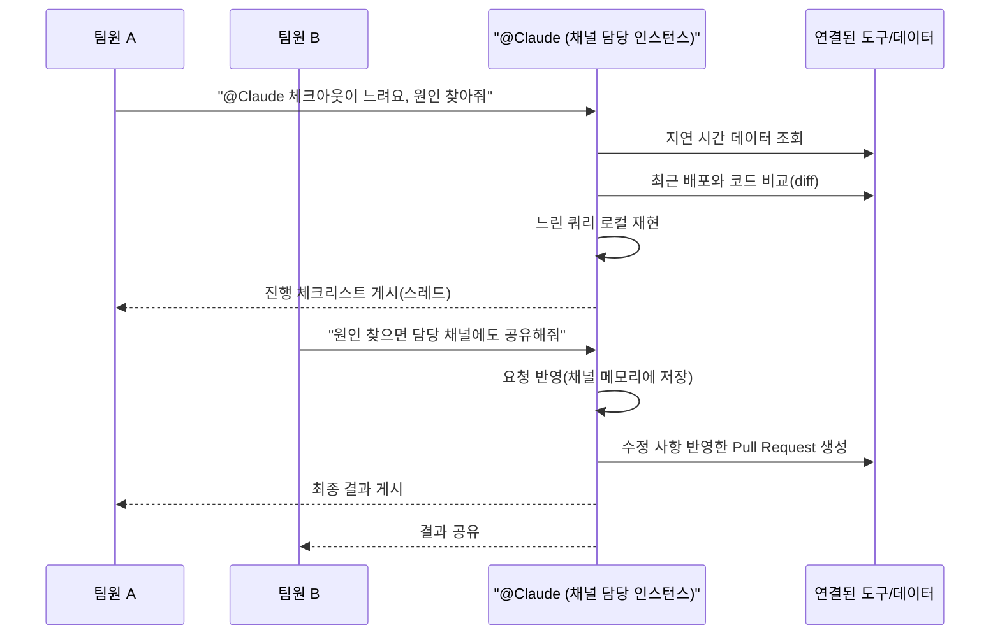

## 이 문서가 다루는 내용

이 문서는 2026년 7월 3일 공개된 Anthropic의 영상 "The future of work with Claude"(출연: Claude Code 총괄 Boris Cherny, Claude Code·Cowork 프로덕트 총괄 Cat Wu)의 내용을 바탕으로, 이 영상에서 소개된 신제품 **Claude Tag**가 정확히 무엇이고 어떻게 작동하며 왜 등장했는지를 Anthropic 공식 발표 자료와 언론 보도를 대조해 검증한 뒤 정리한 것이다. 영상 속 발언은 실제 제품 발표(2026년 6월 23일)와 연결되어 있으므로, 두 소스를 함께 참고해 사실관계를 최대한 정확하게 재구성했다.

---

## 1. Claude Tag는 무엇인가

Claude Tag는 Anthropic이 2026년 6월 23일 공식 발표한 신제품으로, Claude를 Slack 워크스페이스 안에 하나의 "팀원"으로 상주시키는 서비스다. 관리자가 특정 채널에 Claude를 초대하고 필요한 도구·데이터·코드베이스에 대한 접근 권한을 부여하면, 그 채널에 속한 누구든 `@Claude`라고 멘션하는 것만으로 작업을 위임할 수 있다. Anthropic 공식 발표문은 이를 "팀이 Claude와 함께 일하는 새로운 방식"이라고 소개했으며, Claude Code의 연장선에 있는 제품으로 규정했다.

가장 먼저 주목할 지점은 이 제품이 기존에 있던 "Claude in Slack" 앱을 완전히 대체한다는 것이다. Anthropic은 기존 Slack 앱 사용 조직에 30일의 유예 기간을 주고, 관리자가 그 안에 새로운 Claude Tag로 전환(opt-in)하도록 안내하고 있다. 즉 Claude Tag는 부가 기능이 아니라 Slack에서의 Claude 경험 자체를 새로 설계한 결과물이다.

현재는 **Claude Enterprise와 Claude Team 요금제 고객을 대상으로 한 베타(Public Beta)** 단계이며, 개인용 Free·Pro·Max 요금제나 서드파티 배포 환경에서는 제공되지 않는다. 기반 모델은 2026년 5월 말 출시된 **Claude Opus 4.8**이다.

---

## 2. 영상 속 대화가 담고 있는 문제의식

Boris Cherny와 Cat Wu의 대화는 지난 2~3년간 Anthropic 내부에서 코딩 워크플로우가 어떻게 변해왔는지를 짚는 데서 시작한다. Cherny는 2년 전만 해도 자신이 쓰던 것은 한 줄 단위로 자동완성을 제안하는 타입어헤드(typeahead) 수준의 보조 기능이었다고 회고한다. 이후 Claude Code가 등장하면서 함수 단위, 파일 단위, 나아가 기능(feature) 단위로 통째로 코드를 작성하는 단계로 넘어갔고, 이제 Claude Tag 단계에 이르러서는 한 사람이 아니라 팀 전체가 하나의 Claude와 상호작용하며 실험을 처음부터 끝까지 맡기는 수준에 도달했다고 설명한다. 이를 "한 사람이 한 줄씩 치던 시대 → 한 사람이 10개의 Claude를 동시에 돌리던 시대 → 이제는 팀 전체가 하나의 Claude와 함께 일하는 시대"라는 세 단계로 요약한다.

이 흐름을 그림으로 정리하면 다음과 같다.

Cherny는 이러한 변화를 가능케 한 두 가지 연구적 축으로 **장시간 자율 작업(long-horizon autonomy)** 과 **기억(memory)** 을 꼽았다. 그는 METR(Model Evaluation and Threat Research)의 장시간 작업 평가를 언급하며 최신 모델이 매우 긴 시간 동안 자율적으로 작업을 이어갈 수 있는 수준에 도달했다고 말했는데, 이는 정확한 수치를 특정하기보다는 자율 작업 능력이 계속 확장되고 있다는 흐름을 짚은 발언으로 이해하는 것이 정확하다. 실제로 Anthropic이 공개해온 METR 기반 자율 작업 시간 지표는 모델 세대를 거치며 꾸준히 늘어나 왔으며, Opus 4.6 기준으로는 약 14시간 30분 수준(50% 완료율 기준)까지 보고된 바 있다. Cherny의 발언은 이 흐름의 연장선에서, Claude가 며칠·몇 주 단위로 스스로 후속 작업을 예약하고 이어갈 수 있게 되었다는 실제 경험을 전하는 것으로 볼 수 있다.

기억 기능에 대해서는 "Claude Code에서 수년간 제대로 구현하려 시도했고, 이제야 제대로 됐다는 느낌을 받는다"고 언급했다. Claude Tag의 기억은 단순히 대화 내용을 요약해 저장하는 수준이 아니라, 특정 채널에서 사용자들이 시간에 걸쳐 준 지시사항들을 누적해서 반영하고, 채널마다 서로 다른 규칙(예: "이 채널에서는 이 종류의 이슈만 모니터링해줘")을 구분해서 기억한다는 것이 핵심이다.

---

## 3. Claude Tag를 다른 Claude 제품과 구분 짓는 네 가지 특징

Anthropic 공식 발표문과 공식 문서(claude.com/docs)는 Claude Tag의 차별점을 네 가지로 정리한다.

### 멀티플레이어(Multiplayer)

기존의 Claude Code, Cowork, 일반 채팅은 기본적으로 한 사람과 하나의 Claude가 일대일로 대화하는 구조였다. Claude Tag는 반대로 하나의 채널에 하나의 Claude 인스턴스가 존재하고, 그 채널에 속한 모든 구성원이 같은 Claude와 상호작용한다. 한 사람이 작업을 맡기고 자리를 비워도 다른 동료가 그 진행 상황을 그대로 보고 이어받아 방향을 조정할 수 있다. Cat Wu는 Fortune과의 인터뷰에서 이를 "Claude Code, Cowork, 채팅은 철저히 싱글플레이어인 반면 Claude Tag는 상호작용적이고 멀티플레이어로 만들어졌다"고 설명했다.

### 기억(Memory)이 채널에 누적된다

Claude는 자신이 속한 채널의 대화를 따라가며 맥락을 계속 쌓아간다. 이 덕분에 사용자는 매번 프로젝트 배경을 처음부터 다시 설명할 필요가 없다. 권한이 허용된 경우에는 자신이 속하지 않은 다른 채널이나 연결된 데이터 소스에서도 정보를 자동으로 학습할 수 있는데, Anthropic은 비공개(private) 채널의 내용은 보고하지 않는다고 명시하고 있다.

### 능동성(Ambient behavior)

"앰비언트" 모드가 켜져 있으면 Claude는 누군가 호출하지 않아도 스스로 필요하다고 판단되는 정보를 채널에 공유한다. 여러 채널과 연결된 도구에서 관련 정보를 포착해 알려주거나, 답변이 없이 방치된 스레드나 진행이 멈춘 작업을 스스로 팔로우업한다. 다만 이 기능이 지나치게 자주 끼어들어 방해가 되지 않도록, Claude는 언제 개입해야 하는지에 대한 판단력을 학습하도록 훈련되어 있으며, 사용자가 "덜 끼어들어라" 혹은 "더 적극적으로 관여해라"라고 지시하면 그 설정을 채널별로 기억해 이후에도 유지한다.

### 비동기 작업(Asynchronous work)

작업을 맡기면 사용자는 다른 일에 집중하고, Claude는 백그라운드에서 작업을 이어간다. 이 특성 덕분에 Claude는 스스로 후속 작업 일정을 예약해 며칠, 몇 주에 걸쳐 하나의 프로젝트를 자율적으로 끌고 갈 수 있다. Anthropic은 공식 발표문에서 "우리는 이제 여러 개의 Claude에게 동시에 작업을 위임하는 데 훨씬 더 많은 시간을 쓰고 있다"고 밝혔다.

아래 표는 이 네 가지 특징을 Claude Code, Cowork, 일반 Claude 채팅과 비교한 것이다.

| 구분 | Claude 채팅 | Claude Code | Cowork | Claude Tag |
|---|---|---|---|---|
| 상호작용 구조 | 1인 대 1 Claude | 1인 대 1 Claude(터미널/IDE) | 1인 대 1 Claude(다중 작업) | 채널 전체 대 1 Claude(멀티플레이어) |
| 실행 위치 | 클라우드 | 로컬 환경 또는 클라우드 | Anthropic 호스팅 환경 | Anthropic 호스팅 샌드박스(대화 유휴 시 폐기) |
| 기억 지속성 | 대화 단위 | 프로젝트/세션 단위 | 세션 단위 | 채널·워크스페이스 단위로 영구 누적 |
| 능동적 개입 | 없음(요청 시에만 응답) | 없음 | 없음 | 앰비언트 모드로 자발적 개입 가능 |
| 과금 방식 | 개인 요금제 | 개인 요금제/API 사용량 | 개인 요금제 | 조직 단위 사용량 잔액(좌석당 과금 아님) |
| 주 사용처 | 개인 업무 | 개인 코딩 작업 | 개인 지식노동 | 팀 단위 협업, 조직 전체 워크플로우 |

---

## 4. 실제로 어떻게 작동하는가

공식 문서(claude.com/docs/claude-tag)에 따르면 Claude Tag의 작동 방식은 다음과 같은 흐름을 따른다. 누군가 채널에서 `@Claude`를 멘션하며 요청을 남기면, Claude는 그 요청을 여러 단계로 쪼갠 뒤 연결된 도구를 활용해 순서대로 처리하고, 진행 상황을 체크리스트 형태로 스레드에 실시간으로 게시한다. 작업이 끝나면 최종 결과물을 같은 스레드에 올린다. 문서에 실린 예시는 다음과 같은 흐름을 보여준다. 동료가 "체크아웃이 느리다, 오늘 아침 배포와 비교해서 원인을 찾아달라"고 요청하면 Claude는 모니터링 도구에서 지연 시간 데이터를 가져오고, 최근 배포와 메인 브랜치를 비교하고, 느린 쿼리를 재현한 뒤, 수정 사항을 담은 풀 리퀘스트를 여는 식으로 작업을 이어간다.

여기서 중요한 것은 **정체성(identity) 모델**이다. 개인용 AI 비서는 보통 사용자 본인의 자격 증명(credential)으로 문서나 캘린더에 접근하는데, 채널을 여러 사람이 공유하는 구조에서는 "누구의 자격 증명을 써야 하는가"라는 문제가 생긴다. Claude Tag는 이를 해결하기 위해 Claude 자신에게 별도의 조직 차원 정체성을 부여한다. Slack에서는 Claude 앱 자체의 이름으로 게시하고, GitHub에서는 Claude GitHub App으로 풀 리퀘스트를 열며, 데이터베이스에서는 관리자가 프로비저닝한 서비스 계정으로 조회한다. 즉 개별 사용자의 개인 자격 증명이 채널 작업에 사용되는 일이 없고, 그 결과 공유 채널이 특정 개인의 비공개 문서에 접근하는 우회 경로가 되는 것을 구조적으로 막는다.

작업이 실행되는 물리적 환경도 명확히 규정되어 있다. Claude가 작업을 처리할 때는 Anthropic이 호스팅하는 **임시 샌드박스** 안에서 실행되며, 이는 사용자의 개인 컴퓨터나 사내망에서 도는 것이 아니다. 샌드박스는 대화가 시작될 때 생성되어 코드와 파일을 담고, 대화가 일정 시간 이상 유휴 상태가 되면 폐기된다.

또한 Anthropic은 접근 권한을 "액세스 번들(Access bundle)"이라는 단위로 관리한다고 설명한다. 관리자는 채널·워크스페이스·조직 전체 단위로 서로 다른 액세스 번들을 구성할 수 있고, 이는 마치 용도별로 별도의 Claude 정체성을 만드는 것과 같다. 예를 들어 영업팀용으로 설정된 Claude는 엔지니어링팀용 Claude에게 자신의 기억을 넘기지 않으며, 엔지니어들에게 영업 데이터나 도구에 대한 접근권을 주지도 않는다. 이 격리 구조는 Anthropic이 별도로 공개한 "에이전트 정체성·접근 모델" 문서에서 더 자세히 다뤄진다.

DM(다이렉트 메시지)은 이 구조에서 예외다. 채널에서의 작업은 채널에 설정된 권한과 도구를 따르지만, 사용자가 Claude에게 개인적으로 DM을 보내면 그 사용자 본인의 claude.ai 계정에 연결된 개인 도구와 커넥터를 기준으로 응답한다.

---

## 5. 관리자는 어떻게 설정하는가

Claude Tag는 설치만으로 끝나는 제품이 아니라, "정체성을 프로비저닝하는" 절차를 거쳐야 한다. Anthropic 공식 문서는 이를 네 단계로 규정한다.

1. Slack 워크스페이스와 Claude Tag를 페어링한다.
2. Claude가 사용할 도구와 데이터 소스에 대한 접근 권한을 부여한다.
3. 조직의 월간 지출 한도를 설정한다.
4. 비공개 채널에서 먼저 테스트해 정상 작동을 확인한다.

이 설정은 조직 차원에서 한 번만 수행하면 되고, 이후에는 개별 사용자가 별도로 설정할 필요 없이 해당 채널에 속한 모두가 곧바로 `@Claude`를 사용할 수 있다. 다만 이 설정 권한은 아무 관리자에게나 열려 있지 않다. 공식 문서는 Claude 조직의 "Primary Owner" 또는 "Owner" 권한을 가진 사람만 설정을 실행할 수 있고, 일반 "Admin" 권한으로는 불가능하다고 명시하고 있다.

관리자는 설정 이후에도 통제권을 유지한다. 조직 전체 및 채널별로 토큰(사용량) 지출 한도를 별도로 설정할 수 있고, `@Claude`가 수행한 모든 작업과 그 작업을 요청한 사람의 기록을 로그로 열람할 수 있다.

---

## 6. 과금 구조

Claude Tag를 Slack에 추가한다고 해서 좌석당(per-seat) 요금이 추가되는 것은 아니다. 대신 채널·스레드에서 이뤄진 작업은 조직이 충전해 둔 **사용량 잔액(usage balance)** 에서 차감되는 방식으로 과금된다. 관리자는 이 잔액에 대해 청구 주기별로 사용할 수 있는 지출 한도를 설정해 예산을 통제할 수 있다.

반면 개인이 Claude에게 보내는 다이렉트 메시지는 이 조직 잔액을 사용하지 않는다. DM은 보낸 사람 개인의 claude.ai 계정에서 처리되며, 그 사람이 원래 갖고 있던 개인 요금제의 사용 한도를 따른다. Anthropic은 베타 기간 파일럿 운영을 돕기 위해 적격 Enterprise·Team 조직에 도입 크레딧을 지급하고 있다고 밝혔다.

---

## 7. Anthropic 내부에서는 실제로 어떻게 쓰이고 있나

이 제품의 설득력은 Anthropic이 자사 내부에서 이미 상당히 깊게 이 도구에 의존하고 있다는 점에서 나온다. 공식 발표문과 여러 매체 보도가 공통적으로 인용하는 수치는, **Anthropic 프로덕트 조직이 작성하는 코드의 65%가 내부용 Claude Tag에 의해 만들어지고 있다**는 것이다. 이 비율은 계속 상승하는 추세로 보고되고 있다.

Cherny와 Wu의 대화에서는 이 수치가 어떻게 형성되었는지에 대한 구체적인 사용 패턴이 소개된다. 처음에는 버튼 위치가 몇 픽셀 어긋나는 정도의 단순한 버그 수정처럼 가벼운 작업에 Claude Tag를 시험 삼아 써보다가, 점점 더 복잡한 작업까지 맡기게 되었다는 것이다. Cherny는 이것이 가능한 이유로, Claude Tag가 모바일 앱과 데스크톱 앱에 쓰이는 것과 동일한 원격 샌드박스와 동일한 에이전트 SDK 위에서 돌아가기 때문에 다른 Claude 제품과 지능 수준의 차이가 없다는 점, 그리고 채널마다 검증 방식을 다르게 기억해두기 때문에("이 채널에서는 이런 식으로 검증해줘") 반복적인 지시 없이도 신뢰할 만한 결과를 낸다는 점을 들었다.

내부 사용 사례로 소개된 것들은 다음과 같다.

- 질의응답 채널에서 질문이 올라오면 Claude Tag가 답변을 달고, 답변이 완료된 질문에는 체크 표시 이모지를 남기도록 지시받아 그대로 수행하는 사례
- 데이터 관련 질문이 올라오는 채널에서 사람이 개입하지 않아도 Claude Tag가 질문에 답하는 사례
- Claude Code 피드백 채널에서 접수된 문제를 Claude Tag가 직접 수정하는 사례
- 신규 입사자가 법무팀이나 인사팀에 직접 묻는 대신 `@Claude`에게 질문해, 사내 정책 문서와 연동된 Claude Tag로부터 시간에 구애받지 않고 답을 얻는 사례
- 프로덕트 매니저가 동시에 진행 중인 5~10개 기능의 상태를 Claude Tag에게 매일 취합해 보고받는 사례

Wu는 이러한 확산 패턴이 공개 채널에서 이뤄지기 때문에 발생하는 부수 효과에 대해서도 언급했다. Claude Tag가 공개된 채널 안에서 작동하기 때문에, 능숙하게 활용하는 사람의 사용 방식을 다른 구성원들이 그대로 관찰하고 따라 할 수 있다는 것이다. 그는 이를 "AI 도구치고는 상당히 새로운 방식의 모범 사례 확산"이라고 표현했다.

Cherny는 이 확산 속도에 대해 "처음엔 소수만 쓰다가, 다른 사람들이 그들이 쓰는 모습을 보고 빠르게 따라 배웠다"고 말했으며, 이제는 피드백 채널이든 데이터 채널이든 거의 모든 채널에 Claude Tag가 들어와 있다고 설명했다.

---

## 8. 시장에서의 위치와 경쟁 구도

Claude Tag는 진공 상태에서 등장한 제품이 아니다. Slack을 소유한 Salesforce는 이미 2026년 3월 Slackbot에 대한 30여 개의 신규 기능을 발표하며 이를 "에이전틱 운영체제"로 포지셔닝해 왔고, Microsoft 역시 Copilot과 Work IQ를 통해 조직의 맥락 데이터를 활용하는 방향으로 움직이고 있다. Snowflake와 Databricks 같은 데이터 플랫폼 기업들도 자사 플랫폼을 에이전트가 조직의 암묵지(tacit knowledge)에 접근하는 백엔드로 포지셔닝하는 중이다.

이런 흐름 속에서 Claude Tag가 강조하는 차별점은, 기존의 개인 비서형 AI 통합과 달리 **공개된 팀 채널에서 작동하는 하나의 공유된 정체성**이라는 점이다. Fortune 보도는 이 지점을 두고 "Claude Tag는 공개 Slack 채널에서 가시적인 팀원처럼 작동하는 반면, Slackbot은 여전히 개인용 비공개 비서로 남아 있다"는 차이를 짚었다. 다만 같은 보도는 Anthropic이 향후 이 개인용 영역으로도 확장할 가능성을 열어두고 있다고 덧붙였다.

Ramp의 2026년 5월 AI 지수 자료를 인용한 Fortune 보도에 따르면, 5만 개 이상의 미국 기업 지출 데이터를 기준으로 Anthropic이 처음으로 기업 채택률에서 OpenAI를 앞질렀다는 조사 결과가 있었으며(Anthropic 34.4% 대 OpenAI 32.3%), 이 흐름을 이끈 것이 Claude Code였다고 분석되었다. Claude Tag는 이 기업 시장 공략을 코딩 영역 밖으로 확장하려는 시도로 해석할 수 있다.

AI 연구자 Andrej Karpathy는 이 제품의 등장을 두고 "조직 전체의 다른 모든 인간 활동과 훨씬 더 잘 맞아떨어지는 형태"라고 평가한 것으로 여러 매체에 인용되었다. 이는 AI가 사용자를 기다리는 도구가 아니라, 사람들이 이미 모여 일하는 공간 안에 함께 있는 존재로 바뀌었다는 의미로 해석되고 있다.

---

## 9. 향후 계획

영상 말미에서 Cherny와 Wu는 Claude Tag의 다음 단계에 대해 언급한다. 우선 Slack에서 시작했지만, 사람들이 협업하는 다른 플랫폼, 구체적으로는 **Microsoft Teams**로도 확장할 계획이라고 밝혔다. 이들은 "지식노동자가 어디서 일하든 팔 뻗으면 닿는 거리에 Claude가 있도록 하는 것"을 목표로 제시했다.

또한 이들은 Claude Tag가 개인의 업무 방식만 바꾸는 것이 아니라, 조직 전체를 바꾸는 방향으로 나아갈 것이라 전망했다. Claude Code처럼 Claude Tag 역시 조직마다 커스터마이징이 가능하도록 만들어졌다는 점을 강조하며, 각 조직이 이를 자신들만의 방식으로 어떻게 변형해 쓰게 될지 지켜보고 싶다고 마무리했다.

공식 발표문 역시 같은 방향성을 재확인한다. "Claude Tag를 더 널리 쓸 수 있도록 확장하는 것이 목표이며, 팀들이 일하는 다른 여러 공간에서도 `@Claude`를 태그할 수 있도록 하겠다"는 문구가 발표문에 명시되어 있다.

---

## 10. 요약

Claude Tag는 2026년 6월 23일 정식 발표되어 현재 Claude Enterprise·Team 고객을 대상으로 베타 서비스 중인 제품으로, Slack 워크스페이스 안에 Claude를 하나의 공유된 팀원으로 상주시키는 것을 핵심으로 한다. 기존 개인 대 개인 구조의 Claude 제품들과 달리 채널 전체가 하나의 Claude와 상호작작용하는 멀티플레이어 구조, 채널 단위로 누적되는 기억, 호출 없이도 스스로 판단해 개입하는 능동성, 그리고 며칠·몇 주에 걸쳐 스스로 일정을 관리하며 진행하는 비동기 작업 능력이 이 제품을 구별 짓는 네 가지 축이다. 기술적으로는 Anthropic이 호스팅하는 임시 샌드박스에서 실행되고, 개인 자격 증명이 아닌 별도의 조직 차원 정체성으로 작동하며, 액세스 번들이라는 단위로 채널·워크스페이스·조직 단위 권한이 분리 관리된다. 기반 모델은 Claude Opus 4.8이며, 기존 Claude in Slack 앱은 이 제품으로 대체되어 30일 내 관리자 전환이 요구된다.

Anthropic은 이 제품이 사내에서 이미 프로덕트 조직 코드의 65%를 생성하는 수준으로 자리 잡았다고 밝히고 있으며, 이는 경쟁이 치열해지고 있는 기업용 협업 플랫폼 AI 시장(Salesforce Slackbot, Microsoft Copilot 등)에서 Anthropic이 코딩 영역을 넘어 조직 전반의 업무 방식으로 영향력을 확장하려는 시도로 해석된다. 향후 Microsoft Teams 등 다른 협업 플랫폼으로의 확장이 예고되어 있다.

---

### 참고 출처

- Anthropic 공식 발표문, "Introducing Claude Tag" (anthropic.com/news, 2026년 6월 23일)
- Anthropic 공식 문서, "Work with Claude Tag" (claude.com/docs/claude-tag, 확인일 2026년 7월 4일)
- Boris Cherny·Cat Wu 인터뷰 영상, "The future of work with Claude" (YouTube, 2026년 7월 3일)
- TechCrunch, "Anthropic's Claude Tag is learning your company, one Slack message at a time" (2026년 6월 23일)
- Fortune, "Anthropic releases Claude Tag, a virtual employee that works within Slack" (2026년 6월 23일)
- VentureBeat, "Anthropic launches Claude Tag, replacing its Slack app with a persistent AI teammate..." (2026년 6월 23일경)
- DataCamp, "Claude Tag: Anthropic's AI Teammate for Slack" (2026년 6월 말)
- Salesforce Ben, "Anthropic and Salesforce Announce New Claude to Slack Integration" (2026년 6월 말)
- Anthropic 공식 발표문, "Claude Opus 4.8" (anthropic.com/news, 2026년 5월 28일경)

---

작성일자: 2026년 7월 4일
