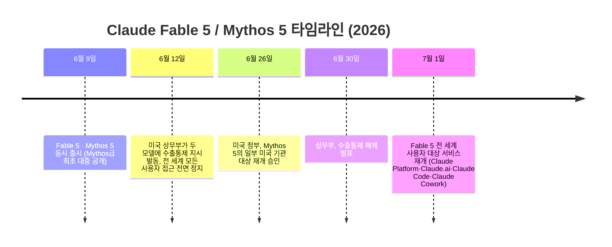

- 원문: Threads @ldbd_app, "종종 Fable이 정말 Opus보다 월등하게 잘했는지 의심했었는데..." (2026년 7월 초 게시)
- 이 문서는 해당 게시물과 댓글 스레드의 내용을 이해하는 데 필요한 배경지식을 정리하고, 발언들이 어떤 맥락에서 나온 것인지 검증된 자료를 바탕으로 설명합니다.

> 
> https://www.threads.com/@ldbd_app/post/DaSVmOZCZ-4
> 
> 종종 Fable이 정말 Opus보다 월등하게 잘했는지 의심했었는데 오늘 다시 써보면서 확실히 느꼈다.
> 
> 로컬 모델을 돌리는데 성능이 예상보다 너무 안나와서 Opus ultracode로 몇번이나 원인을 찾으려했지만 코드상의 문제는 없다는 답이 돌아왔고 모델의 문제라고 결론지었는데,
> 
> 오늘 Fable xhigh로 코드베이스 리뷰해달라고 하니 30분만에 문제를 찾아서 고쳐버렸다. 
> 
> 심지어 해당 문제를 고쳐달라고 한 것도 아닌데...
> 
> 이밖에도 수많은 오류를 찾아내서 고치고있다.
> 
> Opus가 생각보다 실수를 많이 해서 걱정이다.
> 
> 사용량을 제한하더라도 클로드 맥스에서 사용할 수 있게 해주면 좋겠다..
> 

---

## 1. 한눈에 보는 요약

이 스레드는 한 개발자(@ldbd_app)가 로컬에서 돌리던 AI 모델의 성능 문제를 두고, 먼저 **Claude Opus 4.8**(이펙트를 최고 단계인 "울트라코드"로 설정)에게 원인 분석을 여러 차례 요청했지만 "코드에는 문제가 없다"는 답만 받았고, 결국 **Claude Fable 5**(이펙트 "xhigh")에게 코드베이스 리뷰를 맡기자 30분 만에 문제의 원인을 스스로 찾아 고쳤다는 경험담입니다. 심지어 "고쳐 달라"고 요청하지도 않았는데 문제를 발견해 수정까지 해버렸다는 점이 화제가 됐습니다.

이 글에 달린 댓글들은 단순히 "어느 모델이 더 뛰어난가"를 넘어, **"모델이 문제를 찾는 과정에서 얼마나 넓은 범위까지 의심하고 점검했는가"**, 그리고 **"사용자가 요청하지 않은 수정을 AI가 임의로 실행하는 것이 바람직한가"** 라는 두 가지 쟁점으로 논의가 확장됩니다.

이 글을 제대로 이해하려면 아래 세 가지 배경지식이 필요합니다.

1. **Claude Fable 5 / Mythos 5가 무엇이고, 왜 최근 한 차례 접근이 정지되었다가 복원되었는지**
2. **"울트라코드(ultracode)"와 "xhigh"가 정확히 무엇을 가리키는 이펙트(effort) 설정인지**
3. **왜 실제로 Opus 4.8과 Fable 5 사이에 이런 체감 격차가 보고되는지 (공개된 벤치마크 근거)**

아래에서 순서대로 설명합니다.

---

## 2. 배경지식 ① — Claude Fable 5와 Mythos 5는 무엇인가

### 2.1 위상: Opus보다 한 단계 위의 "Mythos급" 모델

Anthropic은 2026년 6월 9일, 기존 Opus 라인보다 상위 등급으로 분류되는 새로운 모델 계열 "Mythos급(Mythos-class)"의 첫 대중 공개 모델로 **Claude Fable 5**를 출시했습니다. 같은 날 더 적은 안전장치를 가진 자매 모델 **Claude Mythos 5**도 함께 발표됐는데, 이 둘은 근본적으로 동일한 가중치(weights)를 공유하는 같은 모델이며, 차이는 오직 **안전 classifier(안전 분류기)의 적용 범위**뿐입니다.

- **Claude Fable 5**: 일반 사용자에게 공개된 버전. 사이버보안·생물학 등 민감 영역에 해당하는 요청이 오면 안전 classifier가 이를 감지해 자동으로 **Claude Opus 4.8이 대신 답변하도록 전환(fallback)** 됩니다. Anthropic에 따르면 이런 전환은 전체 세션의 약 5% 내외에서 발생합니다.
- **Claude Mythos 5**: 이런 안전장치가 없는 버전으로, 사이버 방어 전문가·핵심 인프라 사업자 등 정부와 협력하는 소수의 검증된 파트너("Project Glasswing")에게만 제한적으로 제공됩니다.

Anthropic은 공식 발표에서 Fable 5를 "지금까지 일반에 공개한 모델 중 가장 뛰어난 모델"이라 소개했으며, 특히 "작업이 길고 복잡할수록 Fable 5의 우위가 커진다"는 표현을 사용했습니다. 이는 짧은 대화형 질의응답보다 **긴 호흡의 자율적 작업(long-horizon agentic work)** 에서 격차가 두드러진다는 뜻으로, 이번 스레드에서 다뤄진 "코드베이스 전체를 훑어서 숨은 버그를 찾아내는" 작업과 정확히 일치하는 영역입니다.

### 2.2 최근 한 차례 접근 정지 사건 — 왜 "복귀"라는 단어가 함께 언급되는가

Fable 5와 Mythos 5는 출시 직후 순탄하지 않은 일을 겪었습니다. 이 맥락을 알아야 게시물 속 "클로드 맥스에서 사용할 수 있게 해주면 좋겠다"는 바람이 왜 나왔는지 이해할 수 있습니다.

정지의 발단은 아마존(Amazon) 소속 연구자들이 Fable 5의 안전장치를 우회해 소프트웨어 취약점을 찾아내고, 한 사례에서는 이를 악용하는 코드까지 생성시킨 사례를 보고한 것이었습니다. 미국 정부는 이를 "국가안보"에 관련된 사안으로 보고 6월 12일 즉각 수출통제를 발동했으며, Anthropic은 실시간으로 사용자의 국적을 확인할 방법이 없었기 때문에 **전 세계 모든 사용자에 대해** 두 모델의 접근을 일괄 정지했습니다.

Anthropic은 이후 자체 검증에서 "이 취약점 자체는 Fable 5만의 고유한 능력이 아니라 Claude Opus 4.8, GPT-5.5, Kimi K2.7 등 다른 모델로도 동일하게 재현 가능했다"고 반박했지만, 정부와의 협의를 거쳐 해당 우회 기법을 99% 이상 차단하는 개선된 안전 classifier를 새로 학습시켰고, 이를 근거로 6월 30일 수출통제가 해제되면서 7월 1일부로 서비스가 재개되었습니다. 이 문서 작성 시점(2026년 7월 3일) 기준으로 Fable 5는 다시 정상적으로 사용 가능한 상태입니다.

이 사건과 관련해 한 가지 유의할 점은, 재개 이후에도 **Fable 5·Mythos 5는 30일 데이터 보관(30-day retention)이 의무화된 "Covered Model"로 분류되어 제로 데이터 보관(ZDR) 옵션을 지원하지 않는다**는 점입니다. 이는 안전 classifier 운영을 위해 요청·응답 기록을 일정 기간 보관해야 하기 때문이며, 학습에 사용되지는 않지만 기업 고객의 데이터 정책에 따라 고려가 필요한 부분입니다.

### 2.3 요금제별 이용 조건

원 게시물에서 "사용량을 제한하더라도 클로드 맥스에서 사용할 수 있게 해주면 좋겠다"고 한 부분은, 서비스 재개 초기 시점의 이용 조건과 관련이 있는 것으로 보입니다. Anthropic 공식 발표에 따르면:

| 항목 | 내용 |
|---|---|
| 적용 플랜 | Pro, Max, Team, 일부 Enterprise 플랜 |
| 7월 7일까지 | 주간 사용한도의 최대 50%까지 Fable 5 포함 제공 |
| 7월 7일 이후 | 사용 크레딧(usage credits)을 통해서만 이용 가능 |
| API 가격 | 입력 100만 토큰당 10달러, 출력 100만 토큰당 50달러 (Opus 4.8의 정확히 2배) |

즉 Max 플랜에서도 Fable 5 자체는 이용 가능하지만, 별도의 사용 크레딧 소진 없이 무제한으로 쓸 수 있는 구조는 아니라는 점에서 게시자가 "사용량이 제한되더라도 더 자유롭게 쓸 수 있으면 좋겠다"는 바람을 표현한 것으로 해석됩니다.

---

## 3. 배경지식 ② — "울트라코드"와 "xhigh"란 무엇인가

게시물의 "Opus ultracode로 몇번이나 원인을 찾으려했지만"이라는 문장과 "Fable xhigh로 코드베이스 리뷰해달라"는 문장을 이해하려면, Claude Code(터미널에서 쓰는 에이전틱 코딩 도구)의 **이펙트(effort) 설정 체계**를 알아야 합니다.

### 3.1 이펙트(effort)란

2026년 상반기 이후 Claude 모델들은 "얼마나 깊이 생각하고 답할 것인가"를 `low → medium → high → xhigh → max`의 5단계 값으로 조절하는 **effort 파라미터**를 지원합니다. 값이 높을수록 모델은 답변 전에 더 오래, 더 폭넓게 내부적으로 사고(thinking)한 뒤 응답하며, 그만큼 토큰 소모와 응답 시간도 늘어납니다.

- `xhigh` 단계는 Claude Fable 5, Claude Mythos 5, Claude Opus 4.8, Claude Opus 4.7, Claude Sonnet 5에서만 지원되며, "고급 코딩과 반복적인 도구 호출·탐색이 필요한 복잡한 에이전틱 작업"에 권장되는 단계입니다.
- Anthropic 공식 문서는 Fable 5에 대해 "낮은 이펙트 단계에서도 이전 모델의 xhigh 성능을 종종 뛰어넘는다"고 명시하고 있어, 기본값인 `high`에서 시작해 필요할 때만 `xhigh`로 올릴 것을 권장합니다.

### 3.2 "울트라씽크"와 "울트라코드"의 차이

Claude Code에는 이 effort 조절과 관련해 두 가지 서로 다른 성격의 기능이 있으며, 이름이 비슷해 혼동되기 쉽습니다.

| 구분 | 울트라씽크 (ultrathink) | 울트라코드 (ultracode) |
|---|---|---|
| 성격 | 프롬프트에 넣는 키워드 (1회성) | 세션 전체에 적용되는 설정 (`/effort ultracode`) |
| 적용 범위 | 해당 턴 1회의 응답에만 적용 | 세션이 끝나거나 다시 바꿀 때까지 지속 |
| 내부 동작 | 해당 응답의 effort를 최고 수준으로 올림 | effort를 `xhigh`로 고정 + 코드베이스 규모 작업에서 여러 서브에이전트를 동시에 띄우는 "다이내믹 워크플로우"를 자동으로 활성화 |
| 비유 | 어려운 문제 하나에 집중하는 "정밀 수술" | 코드베이스 전체를 훑는 "굴착기" 작업 |

즉 게시물 속 "Opus ultracode"는 Opus 4.8을 세션 내내 최고 이펙트(xhigh) + 자동 다중 서브에이전트 오케스트레이션 모드로 돌리며 원인을 찾으려 했다는 뜻이고, "Fable xhigh"는 Fable 5에게 (울트라코드까지는 아니지만) 이펙트를 한 단계 높여 코드베이스 리뷰를 맡겼다는 뜻입니다. 다시 말해 **Opus 쪽이 오히려 더 무거운 설정(울트라코드)으로 여러 차례 시도했음에도 원인을 찾지 못했고, Fable 쪽은 상대적으로 가벼운 설정(xhigh)으로 단번에 찾아냈다**는 것이 이 경험담의 핵심 포인트입니다.

---

## 4. 사건 상세 서술 — 무슨 일이 있었나

게시자는 로컬 환경에서 어떤 AI 모델을 구동하고 있었는데, 기대했던 것보다 성능이 크게 떨어지는 현상을 겪고 있었습니다. 이를 해결하기 위해 먼저 Claude Opus 4.8을 울트라코드 모드로 여러 차례 호출해 원인 분석을 요청했지만, 매번 "코드 자체에는 문제가 없다"는 답변만 돌아왔고, 결국 게시자는 이를 (코드 문제가 아니라) 모델 자체의 한계 때문이라고 잠정 결론지었습니다.

그런데 같은 날 이번에는 Claude Fable 5에게 xhigh 이펙트로 코드베이스 리뷰를 요청하자, 약 30분 만에 성능 저하의 실제 원인을 찾아내고 스스로 수정까지 완료했습니다. 게시자가 특히 놀란 지점은 **그 문제를 "고쳐 달라"고 명시적으로 요청한 적이 없었는데도** Fable이 문제를 발견하고 임의로 수정을 실행했다는 사실입니다. 게시자는 이후 스레드에서 이 외에도 여러 건의 오류를 Fable이 스스로 찾아 고치고 있다고 언급하며, Opus가 생각보다 실수가 잦다는 점에 대한 우려와, Fable을 Claude Max 요금제에서도 (사용량이 제한되더라도) 쓸 수 있게 해달라는 바람을 덧붙였습니다.

---

## 5. 벤치마크로 보는 배경 — 왜 이런 체감 차이가 보고되는가

이 경험담이 단순한 우연이 아니라 실제로 관찰되는 경향일 가능성을 뒷받침하는 근거를, Anthropic이 공식 발표한 수치와 업계 반응을 통해 짚어보겠습니다. (아래 수치는 Anthropic 공식 발표 및 이를 인용한 다수의 매체 보도를 기준으로 하며, 세부 수치는 인용처마다 소수점 단위의 약간의 차이가 있을 수 있습니다.)

| 벤치마크 | 의미 | Claude Fable 5 | Claude Opus 4.8 |
|---|---|---|---|
| SWE-bench Pro | 실제 소프트웨어 엔지니어링 작업을 처음부터 끝까지 해결하는 능력 측정 | 약 80% | 약 69% |
| FrontierCode (Diamond) | Cognition사가 만든, 실전에 가까운 에이전틱 코딩 평가 | 약 29% | 약 13% |

Anthropic은 특히 "작업이 길고 복잡할수록 Fable 5의 우위가 커진다"는 점을 공식적으로 강조했으며, 실제 도입 사례로 결제 기업 **Stripe**가 5천만 줄 규모의 루비(Ruby) 코드베이스 마이그레이션을, 수작업으로는 팀 단위로 두 달 이상 걸릴 일을 Fable 5를 활용해 하루 만에 마쳤다고 밝힌 바 있습니다. 이는 코드 몇 줄짜리 스니펫이 아니라 **거대한 코드베이스 전체를 오랜 시간 일관되게 파악하고 작업을 유지하는 능력(long-horizon autonomy)** 에서 격차가 특히 크다는 것을 보여주는 사례로 인용됩니다.

이 스레드의 사례처럼 "코드베이스를 통째로 리뷰해서 숨어 있는 버그를 찾아내는" 작업은 전형적으로 긴 컨텍스트를 유지하며 여러 파일·설정을 넘나들어야 하는 장기 자율 작업에 해당하므로, 공개된 벤치마크 경향과 방향이 일치합니다. 다만 이는 하나의 사례이며, 벤치마크 점수가 모든 실무 상황에서 동일한 격차로 재현된다고 단정할 수는 없다는 점은 유의할 필요가 있습니다.

한편 이런 체감 격차를 보고한 것이 이 게시자만은 아닙니다. Fable 5가 복귀한 직후 다른 개발자들 사이에서도 비슷한 취지의 반응, 즉 Opus로 여러 주간 씨름하던 오류들을 Fable로 짧은 시간에 정리했다는 취지의 후기가 소셜미디어에 다수 올라온 것으로 보도된 바 있습니다.

---

## 6. 댓글 스레드에서 벌어진 두 가지 논쟁

### 6.1 논쟁 1 — "모델 성능 차이"가 아니라 "의심 범위의 차이"

댓글 작성자 ultraneukgu는 이 사례를 단순히 "어느 모델이 더 우수한가"로 읽는 것을 경계하며, 진짜 확인해야 할 지점은 **"'코드에는 문제 없음'이라는 결론에서 멈추지 않고, 입력 텐서의 shape(형태), 토크나이저 설정, 캐시, 디바이스 이동(device 이동) 로그까지 점검했는가"** 라고 짚었습니다.

이는 로컬 AI 모델을 구동할 때 성능 저하가 발생하는 전형적인 원인들을 정확히 짚은 지적입니다.

- **입력 텐서 shape**: 배치(batch) 구성이나 패딩(padding) 처리가 의도와 다르게 되어 불필요한 연산이 발생하는 경우
- **토크나이저 설정**: 토크나이저의 설정값이 모델 학습 시점과 어긋나 있는 경우
- **캐시**: KV 캐시(key-value cache) 등이 제대로 재사용되지 않거나 잘못 초기화되는 경우
- **디바이스 이동 로그**: 텐서가 CPU와 GPU 사이를 불필요하게 오가며(`.to(device)` 호출 등) 병목이 발생하는 경우

즉 Opus가 "코드 문제 없음"이라는 결론에서 점검을 멈춘 반면, Fable은 이런 주변 설정·런타임 동작까지 의심의 범위를 넓혀 점검했기에 원인을 찾아냈을 가능성이 높다는 것이 이 댓글의 요지입니다. 이는 단순한 모델 성능 우열 비교를 넘어, **AI에게 디버깅을 맡길 때 "문제없음"이라는 답변을 어디까지 신뢰해야 하는가**라는 실무적으로 중요한 질문을 던집니다.

### 6.2 논쟁 2 — "요청하지 않은 수정"은 문제인가, 미덕인가

댓글 작성자 nextcocoai는 "고쳐 달라고 한 것도 아닌데 (임의로) 고치는 것은 오히려 문제"라는 취지의 지적을 남겼습니다. 이는 AI 에이전트가 사용자의 명시적 승인 없이 코드를 임의로 변경하는 것에 대한 통제·감독 관점의 우려로 볼 수 있습니다.

이에 대해 원 게시자는 다음과 같이 반박했습니다. 요지를 정리하면:

- 애초에 "고쳐 달라"는 요청 자체는 있었다.
- 다만 강조하고 싶었던 지점은, Fable이 **문제가 있다는 사실 자체를 알려주지 않았음에도** 스스로 찾아내 고쳤다는 것이다.
- 반면 Opus는 문제가 있다는 사실을 명시적으로 알려줘도 고칠 방법을 찾지 못했다.

즉 두 댓글 작성자의 우려와 게시자의 반박은 서로 다른 층위의 이야기를 하고 있습니다. nextcocoai는 "지시받지 않은 행동을 AI가 임의로 실행하는 것"에 대한 일반적 우려를 제기한 것이고, 게시자는 "애초에 수정 권한 자체는 부여했었고, 문제의 발견 능력 자체가 달랐다"는 점을 명확히 한 것입니다. 다만 이 반박만으로 "Fable이 수정 전 사용자에게 확인을 구했는지, 아니면 발견 즉시 자동으로 코드를 변경했는지"까지는 원문에서 명확히 드러나지 않습니다. 이 부분은 실제로 에이전틱 코딩 도구를 쓸 때 권한(permission) 설정을 어떻게 구성하느냐에 따라 갈리는 문제이기도 합니다.

---

## 7. 실무·교육 관점에서 되짚어볼 시사점

이 스레드는 단순한 "모델 자랑"을 넘어, 에이전틱 코딩을 가르치거나 실무에 적용하는 입장에서 곱씹어볼 만한 지점들을 포함하고 있습니다.

1. **"문제 없음"이라는 AI의 답을 최종 결론으로 받아들이지 말 것.** Opus의 "코드에는 문제가 없다"는 답변은 코드 자체만 본 결과였을 뿐, 런타임 환경·설정·캐시 등 더 넓은 범위까지 점검한 결과가 아니었을 가능성이 있습니다. AI가 특정 범위 안에서 "문제 없음"을 보고했다는 것과, 문제가 실제로 없다는 것은 다른 이야기입니다.
2. **effort 설정을 높이는 것과, 의심의 범위(스코프)를 넓히는 것은 별개의 축입니다.** 울트라코드처럼 무거운 설정을 쓴다고 해서 자동으로 점검 범위가 넓어지는 것은 아니며, 어떤 파일·로그·설정까지 살펴보라고 명시적으로 지시하는 것이 오히려 더 결정적일 수 있습니다.
3. **모델의 자율적 수정 실행 권한을 어디까지 열어둘지는 사전에 설계해야 할 문제입니다.** "요청하지 않은 수정"에 대한 댓글 논쟁은, 에이전트가 스스로 판단해 코드를 변경하는 것을 어느 수준까지 허용할지—읽기 전용 분석까지만 허용할지, 수정 제안(diff)까지만 하게 할지, 아니면 즉시 반영까지 허용할지—를 팀 차원에서 미리 정책으로 정해두어야 함을 시사합니다.
4. **모델 간 비교는 "같은 조건"에서 이뤄졌는지 확인이 필요합니다.** 이번 사례는 Opus 4.8(울트라코드)과 Fable 5(xhigh)를 비교한 것으로, 두 모델의 effort 설정 자체가 동일하지 않았습니다. 이는 실무에서 "어느 모델이 더 낫다"는 인상을 형성할 때, 비교 조건의 차이를 함께 감안해야 함을 보여주는 사례이기도 합니다.

---

## 8. 용어 설명

| 용어 | 설명 |
|---|---|
| Mythos급(Mythos-class) | Anthropic이 Opus 라인 위에 신설한 최상위 모델 등급. Claude Mythos 5·Claude Fable 5가 이에 속함 |
| Fable 5 | Mythos급 모델을 안전 classifier와 함께 일반에 공개한 버전. 민감한 요청은 자동으로 Opus 4.8로 전환(fallback)됨 |
| Mythos 5 | Fable 5와 동일한 가중치를 쓰지만 안전장치가 적은 버전. 정부 협력 프로그램(Project Glasswing)의 검증된 파트너에게만 제공 |
| 이펙트(effort) | 모델이 답변 전에 얼마나 깊이 사고할지를 조절하는 파라미터. low·medium·high·xhigh·max 5단계 |
| 울트라씽크(ultrathink) | Claude Code에서 프롬프트에 넣으면 해당 응답 1회에 한해 최고 수준의 사고 예산을 부여하는 키워드 |
| 울트라코드(ultracode) | Claude Code에서 세션 전체의 이펙트를 xhigh로 고정하고, 코드베이스 규모 작업 시 여러 서브에이전트를 자동으로 동시 실행하는 세션 설정 |
| 다이내믹 워크플로우 | Claude Code가 큰 작업을 여러 서브에이전트에 나눠 병렬로 처리하도록 하는 오케스트레이션 기능 |
| KV 캐시 | 트랜스포머 모델이 이전 토큰들의 계산 결과(키·값)를 재사용해 추론 속도를 높이는 캐시 메커니즘. 잘못 관리되면 성능 저하나 오류의 원인이 됨 |
| SWE-bench Pro | 실제 소프트웨어 저장소의 이슈를 모델이 얼마나 잘 해결하는지 측정하는 벤치마크 |
| FrontierCode | Cognition사가 만든, 실전에 가까운 장기 에이전틱 코딩 평가 벤치마크 |
| 안전 classifier | 모델의 응답이 민감한 영역(사이버보안·생물학 등)에 해당하는지 자동으로 탐지해 차단·전환하는 소형 AI 시스템 |

---

## 9. 참고자료

- Anthropic, "Claude Fable 5 and Claude Mythos 5" (2026.6.9) — https://www.anthropic.com/news/claude-fable-5-mythos-5
- Anthropic, "Redeploying Claude Fable 5" (2026.6.30, 업데이트 2026.7.1) — https://www.anthropic.com/news/redeploying-fable-5
- Anthropic, "Introducing Claude Fable 5 and Claude Mythos 5" (개발자 문서) — https://platform.claude.com/docs/en/about-claude/models/introducing-claude-fable-5-and-claude-mythos-5
- Anthropic, "Prompting Claude Fable 5" — https://platform.claude.com/docs/en/build-with-claude/prompt-engineering/prompting-claude-fable-5
- Anthropic, "Effort" (개발자 문서) — https://platform.claude.com/docs/en/build-with-claude/effort
- CNBC, "Anthropic says Trump admin has lifted export controls on Claude Fable 5 and Mythos 5" (2026.6.30) — https://www.cnbc.com/2026/06/30/anthropic-says-trump-admin-has-lifted-export-controls-on-claude-fable-5-and-mythos-5.html
- CyberScoop, "U.S. lifting export control restrictions on Anthropic's Mythos, Fable" — https://cyberscoop.com/us-lifting-export-control-restrictions-anthropic-mythos-fable/
- Cybersecurity Dive, "Anthropic reactivates Fable, Mythos after securing government approval" — https://www.cybersecuritydive.com/news/anthropic-ai-mythos-fable-reenable/824214/
- MacRumors, "Anthropic's Claude Fable 5 Available Again After U.S. Lifts Export Controls" — https://www.macrumors.com/2026/07/01/anthropic-fable-5-relaunch/
- ClaudeLog, "What is UltraThink in Claude Code" — https://claudelog.com/faqs/what-is-ultrathink/
- 원문 게시물: Threads @ldbd_app — https://www.threads.com/@ldbd_app/post/DaSVmOZCZ-4

---

*본 문서는 위 게시물과 댓글 내용을 원문 그대로 옮기지 않고 요지를 정리·재구성한 것이며, 벤치마크 수치는 출처에 따라 소수점 단위의 차이가 있을 수 있어 정확한 최신 수치는 위 Anthropic 공식 문서에서 직접 확인하시길 권장합니다.*
